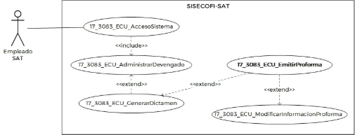
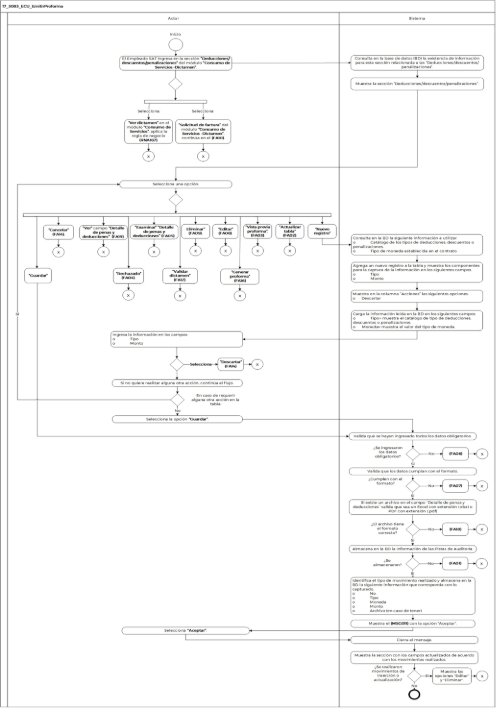

**Administración General de Comunicaciones **

**y Tecnologías de la Información**

**Marco Documental 7.0**
|Fecha de aprobación del Template: 02/08/2023|**Especificación del Caso de Uso** 17\_3083\_ECU\_EmitirProforma.docx|Versión del template: 7.00|
| :-: | :- | :-: |

**<ID Requerimiento>** 8309** 

**Nombre del Requerimiento:** TI\_SISECOFI-SAT\_Seguimiento financiero y control documental de proyectos de contratación** 

**Tabla de Versiones y Modificaciones** 

|Versión |Descripción del cambio |Responsable de la Versión |Fecha |
| - | - | :-: | - |
|*1* |*Creación del documento* |Aylín de la Concepción Caballero Weng |*08/03/2024* |
|*1.1* |*Revisión del documento* |Luis Angel Olguin Castillo |*17/04/2024* |
|*1.2* |*Versión aprobada para firma* |Andrés Mojica Vázquez |*13/06/2024* |

**Tabla de Contenido** 

[17_3083_ECU_EmitirProforma ................................................................................................................... 2](#_page1_x82.00_y132.92)

1. [Descripción ........................................................................................................................................................ 2](#_page1_x116.00_y148.92)
1. [Diagrama del Caso de Uso ...................................................................................................................... 2](#_page1_x116.00_y237.92)
1. [Actores ................................................................................................................................................................. 2](#_page1_x116.00_y428.92)
1. [Precondiciones............................................................................................................................................... 2](#_page1_x116.00_y552.92)
1. [Post condiciones ........................................................................................................................................... 3](#_page2_x116.00_y195.92)
1. [Flujo primario .................................................................................................................................................. 3](#_page2_x116.00_y339.92)
1. [Flujos alternos .................................................................................................................................................8](#_page7_x116.00_y516.92)
1. [Referencias cruzadas............................................................................................................................... 27](#_page26_x116.00_y694.92)
1. [Mensajes .......................................................................................................................................................... 28](#_page27_x116.00_y145.92)
1. [Requerimientos No Funcionales ................................................................................................... 28 ](#_page27_x117.00_y540.92)[11.Diagrama de actividad ............................................................................................................................. 31](#_page30_x122.00_y133.92)
12. [Diagrama de estados .............................................................................................................................. 31](#_page30_x116.00_y706.92)
12. [Aprobación del cliente .......................................................................................................................... 32](#_page31_x116.00_y132.92)

|Fecha de aprobación del Template: 02/08/2023|**Especificación del Caso de Uso** 17\_3083\_ECU\_EmitirProforma.docx|Versión del template: 7.00|
| :-: | :- | :-: |

17\_3083\_ECU\_EmitirProforma  

1. **Descripción  **

El  objetivo  de  este  Caso  de  Uso,  es  permitir  al  Empleado  SAT  validar  el dictamen previamente cargado, generar una proforma y cargar el oficio de solicitud de factura.  

2. **Diagrama del Caso de Uso **

3. **Actores  **

|**Actor** |**Descripción** |
| - | - |
|**Empleado SAT** |El  Empleado  SAT  es  el  que  tiene  el  o  los  roles otorgados  por  la  Administración  Central  de Seguridad,  Monitoreo  y  Control  (ACSMC),  para ingresar a cada uno de los módulos de este sistema.  |

4. **Precondiciones** 
- El Empleado SAT se ha autenticado en el sistema con e.firma válida. 
- El sistema ha consumido el servicio “Oauth” para obtener los datos del Empleado SAT que ingresa. 
- El sistema ha validado que el Empleado SAT cuenta con los roles para ingresar y editar el módulo “Consumo de Servicios-Dictamen” y a las secciones “Deducciones/descuentos/penalizaciones” y “Solicitud de factura”. 
- El empleado SAT ha ingresado a un dictamen de acuerdo con el **(17\_3083\_ECU\_GenerarDictamen)**. 
- El empleado SAT ha seleccionado alguna de las siguientes opciones: “Editar  dictamen”  o  “Ver  dictamen”  en  el  módulo  “Consumo  de Servicios” relacionados a un contrato. 
- El empleado SAT ha seleccionado una opción en el campo “Convenio de Colaboración” del contrato. 

|Fecha de aprobación del Template: 02/08/2023|**Especificación del Caso de Uso** 17\_3083\_ECU\_EmitirProforma.docx|Versión del template: 7.00|
| :-: | :- | :-: |

- El estatus del dictamen se encuentra en “Dictaminado”. 
- Se han registrado los tipos de plantillas en el catálogo relacionado. 
- Se ha registrado la plantilla activa de verificación para la carga de documentos en la sección documental. 
5. **Post condiciones  **
- El Empleado SAT: 
- Previsualizó la proforma asociada al dictamen. 
- Generó la proforma asociada al dictamen. 
- Modificó el estatus del dictamen a “Proforma”.  
- Visualizó  las  secciones “Deducciones/descuentos/penalizaciones”  y  “Solicitud  de factura” del módulo “Consumo de Servicios-Dictamen”. 
- Cambió el estatus del dictamen a “Inicial” (rechazar dictamen). 
6. **Flujo primario** 

|**Actor** |**Sistema** |
| - | - |
|
1\.  El Caso de Uso inicia cuando  el 

Empleado  SAT  ingresa  en  la sección **“Deducciones/descuentos/pen alizaciones”**  del  módulo **“Consumo  de  Servicios  - Dictamen”**. 

- En  caso  de  haber seleccionado  la  opción  **“Ver dictamen”**  en  el  módulo **“Consumo  de  Servicios”**, aplica  la  regla  de  negocio **(RNA167)**,  y  continúa  en  el flujo. 

- Si  ingresa  en  la  sección **“Solicitud  de  factura”**  del módulo  **“Consumo  de Servicios  -Dictamen”**, continúa en el [**(FA10)**](#_page15_x116.00_y298.92). 
|
2\.  Consulta  en  la  base  de  datos 

(BD)  la  existencia  de información  para  esta  sección relacionada  a  las “Deducciones/descuentos/pen alizaciones”. 
|
||
3\.  Muestra  la  sección 

“Deducciones/descuentos/pen alizaciones”. Aplica las **(RNA51)** y **(RNA87)**. 

Opciones:   

- Nuevo registro  

- Actualizar tabla 
|

|Fecha de aprobación del Template: 02/08/2023|**Especificación del Caso de Uso** 17\_3083\_ECU\_EmitirProforma.docx|Versión del template: 7.00|
| :-: | :- | :-: |

- Vista  previa  proforma 

  

Tabla:  Aplica  las  **(RNA79)**, **(RNA94)** y **(RNA96)**. 

- No. 
- Tipo 
- Moneda  
- Monto 
- Acciones  
- Editar![ref1]
- Eliminar![ref2]

Opciones: Aplica las **(RNA246)**. 

- Cancelar 
- Guardar  
- Rechazado 
- Validar dictamen  
- Generar  proforma (oculto) 

Campo: 

- Detalle  de  penas  y deducciones 

Opciones: 

- Examinar 
- Ver. Aplica la **(RNA257)** 

Sección  “Solicitud  de  factura” (contraída) 

Ver  **(17\_3083\_EIU\_EmitirProforma)**  

Estilos 01. 

4.  Realiza  una  de  las  siguientes  5.  Consulta en la BD la siguiente acciones:**  información  a  utilizar,  de 

acuerdo con la **(RNA01)**: 

- En caso de que seleccione la 

  opción  **“Nuevo  registro”**,**  el  o  Catálogo de los tipos de flujo continúa.**  deducciones, 

descuentos  o 

- En caso de que seleccione la  penalizaciones. Aplica la opción  **“Actualizar  tabla”**,  **(RNA94)** 

  continúa en el [**(FA02)**](#_page8_x116.00_y321.92).**  o  Tipo  de  moneda establecida  en  el 

- En caso de que seleccione la  contrato. 

  opción  **“Vista  previa** 

|Fecha de aprobación del Template: 02/08/2023|**Especificación del Caso de Uso** 17\_3083\_ECU\_EmitirProforma.docx|Versión del template: 7.00|
| :-: | :- | :-: |

**proforma”**,  continúa  en  el [**(FA03)**](#_page8_x116.00_y607.92).** 

- En caso de que seleccione la opción **“Editar”**, continúa en el [**(FA08)**](#_page13_x116.00_y643.92).** 
- En caso de que seleccione la opción  **“Eliminar”**,  continúa en el [**(FA09)**](#_page14_x116.00_y640.92).** 
- En caso de que seleccione la opción  **“Examinar”**,** correspondiente  al  campo **“Detalle  de  penas  y deducciones”**, continúa en el [**(FA05)**](#_page11_x116.00_y565.92).**  
- En caso de que seleccione la opción  **“Ver”** correspondiente  al  campo **“Detalle  de  penas  y deducciones”**, continúa en el [**(FA19)**](#_page26_x116.00_y283.92). 
- En caso de que seleccione la opción  **“Cancelar”**,  continúa en el **[**(FA14)**](#_page20_x116.00_y591.92)**. 
- En caso de que seleccione la opción  **“Guardar”**,  continúa en el** pas[o **12** ](#_page5_x315.00_y609.92)de este flujo. 
- En caso de que seleccione la opción  **“Rechazado”**, continúa en el [**(FA04)**](#_page10_x116.00_y434.92).** 
- En caso de que seleccione la opción  **“Validar  dictamen”**, continúa en el [**(FA12)**](#_page19_x116.00_y256.92).** 
- En caso de que seleccione la opción  **“Generar proforma”**, continúa en el [**(FA16)**](#_page22_x116.00_y164.92).** 
6. Agrega un nuevo registro a la tabla  y  muestra  los componentes  para  la  captura de  la  información  en  los siguientes  campos.  Aplica  la **(RNA94)**. 

|Fecha de aprobación del Template: 02/08/2023|**Especificación del Caso de Uso** 17\_3083\_ECU\_EmitirProforma.docx|Versión del template: 7.00|
| :-: | :- | :-: |

- Tipo 
- Monto 
7. Muestra  en  la  columna “Acciones”**  las  siguientes opciones:  
- Descartar ![ref3]

Ver  **(17\_3083\_EIU\_EmitirProforma)**  

Estilos 05. 

8. Carga la información leída en la BD en los siguientes campos: 
   1. Tipo=  muestra  el catálogo  de  tipo  de deducciones, descuentos  o penalizaciones.  
   1. Moneda=  muestra  el valor  del  tipo  de moneda. 
9. Ingresa  la  información  en  los campos: 
   1. Tipo 
   1. Monto 
   1. En caso de que seleccione la opción  **“Descartar”**  del registro  seleccionado continúa en el **[**(FA14)**](#_page20_x116.00_y591.92)**. 
10. Si no quiere realizar alguna otra acción continúa en el flujo.  
    1. En  caso  de  requerir  alguna 

       otra  acción  en  la  tabla 

       regresa al paso[` `**4** ](#_page3_x121.00_y593.92)de este flujo. 

11\.  Selecciona la opción **“Guardar”**. **** 12.  Valida que se hayan ingresado 

todos los datos obligatorios de acuerdo  con  la  **(RNA95)**,  y continúa en el flujo. 

- En caso de que no se hayan ingresado  alguno  de  los datos obligatorios, continúa en el [**(FA06)**](#_page12_x116.00_y341.92). 

13\.  Valida  que  los  datos  cumplan 

con el formato de acuerdo con la  **(RNA255)**,  y  continúa  en  el flujo. 

|Fecha de aprobación del Template: 02/08/2023|**Especificación del Caso de Uso** 17\_3083\_ECU\_EmitirProforma.docx|Versión del template: 7.00|
| :-: | :- | :-: |

1. En caso de que alguno de los datos no cumpla con el formato,  continúa  en  el [**(FA07)**](#_page13_x116.00_y281.92). 
14. Si existe un archivo en el campo “Detalle  de  penas  y deducciones” valida que sea un Excel  con  extensión  (.xlsx)  o PDF  con  extensión  (.pdf),  de acuerdo con la **(RNA153)**. 
    1. En  caso  de  que  el  archivo no  tenga  el  formato correcto,  continúa  en  el [**(FA18)**](#_page25_x116.00_y620.92). 
15. Almacena  en  la  BD  la información  de  las  Pistas  de Auditoría. 

    Datos que se almacenan:  

    **Módulo**=  Dictamen- Deducciones, descuentos y penalizaciones 

    **Fecha y Hora**= Fecha y hora del  sistema  usando  el formato  DD/MM/AAAA HH:MM:SS 

    **RFC Usuario**= RFC largo del Empleado SAT que ingresó al sistema. 

    **Tipo de movimiento**= **INSR** (Insertar), **UPDT** (Modificar), **DLT**  (Borrar)  según corresponda 

    **Movimiento**=  Aplica  la **(RNA239)**  

- id del dictamen 
- número del registro de la tabla 
- documento cargado 
- En  caso  de  que  no  se puedan almacenar las Pistas de Auditoría, continúa en el [**(FA01)**](#_page7_x116.00_y556.92). 
16. Identifica  el  tipo  de movimiento  realizado  y almacena en la BD la siguiente información  que  corresponda con  lo  capturado:  Aplica  la **(RNA247)**. 

|Fecha de aprobación del Template: 02/08/2023|**Especificación del Caso de Uso** 17\_3083\_ECU\_EmitirProforma.docx|Versión del template: 7.00|
| :-: | :- | :-: |

||
- No. 

- Tipo 

- Moneda 

- Monto 

- Archivo correspondiente  al detalle  de  penas  y deducciones  (en  caso de  tener  aplica  la **(RNA38)**). 
|
| :- | - |
||
17\.  Muestra  el  **[**(MSG011)**](#_page27_x127.00_y439.92)**  con  la 

opción “Aceptar”. 
|
|18\.  Selecciona la opción **“Aceptar”**. |19\.  Cierra el mensaje.  |
||
20\. Muestra  la  sección  con  los 

campos  actualizados  de acuerdo  con  los  movimientos realizados. Aplica las **(RNA250)**, **(RNA94)**. 

￿  En  caso  de  que  se  hayan realizado  movimientos  de inserción  o  actualización, deshabilita la edición de los campos  en  la  tabla  y muestra  en  la  columna “Acciones”  las  opciones 

Editar ![ref4]y Eliminar ![ref5]. 
|
||21\.  Fin del Caso de Uso.  |

7. **Flujos alternos  **

**FA01 No se pueden almacenar las pistas de auditoría** 

|**Actor** |**Sistema** |||
| - | - | :- | :- |
||
1\.  El  **FA01**  inicia  cuando 

interviene un evento ajeno y no se pueden almacenar las pistas de auditoría.**  
|||
||
2\.  Cancela  la  operación  sin 

completar el movimiento que estaba en proceso. 
|||
||
3\.  Muestra  una  ventana 

emergente con el mensaje de acuerdo con lo siguiente: 

￿  Si  la  pista  de  auditoría  es por el tipo de movimiento 
|||
|Fecha de aprobación del Template: 02/08/2023|**Especificación del Caso de Uso** 17\_3083\_ECU\_EmitirProforma.docx|Versión del template: 7.00||

||
**UPDT**,  **INSR**  o  **DLT**  se muestra el [**(MSG002)**](#_page27_x127.00_y224.92).** 

￿  Si  la  pista  de  auditoría  es 

por el tipo de movimiento **PRNT**,  se  muestra  el [**(MSG003)**](#_page27_x127.00_y249.92).** 

Cada mensaje se muestra con la opción “Aceptar”. 
|
| :- | :- |
|4\.  Selecciona la opción **“Aceptar”**. |5\.  Cierra el mensaje. |
||
6\.  Regresa  al  paso  previo  que 

detona la acción de la pista de auditoría. 
|

**FA02  Selecciona  la  opción  “Actualizar  tabla”  de  la  sección “Deducciones/descuentos/penalizaciones”** 

|**Actor** |**Sistema** |
| - | - |
|
1\.  El  **FA02**  inicia  cuando  el 

Empleado  SAT  selecciona  la opción **“Actualizar tabla”**. 
|
2\.  Consulta  en  la  BD  la  siguiente 

información a utilizar:  

o  Información  registrada 

de  las  penas contractuales,  penas convencionales, deducciones  y  registros capturados.  
|
||
3\.  Actualiza  los  registros  de  la 

tabla,  calculando  los  montos asociados  a  las  penas contractuales,  penas convencionales  y  deducciones de  acuerdo  con  las  **(RNA96)**  y **(RNA250)**. 
|
||
4\.  Regresa  al  paso [` `**4** ](#_page3_x121.00_y593.92) del  Flujo 

primario. 
|

**FA03 Selecciona la opción “Vista previa proforma”** 

|**Actor** |**Sistema** |||
| - | - | :- | :- |
|1\.  El  **FA03**  inicia  cuando  el Empleado  SAT  selecciona  la opción **“Vista previa proforma”**. |
2\.  Consulta  en  la  BD  la  siguiente 

información a utilizar:  

- Información  registrada de  los  servicios dictaminados 

- Catálogo  de  tipos  de plantillas 
|||
|Fecha de aprobación del Template: 02/08/2023|**Especificación del Caso de Uso** 17\_3083\_ECU\_EmitirProforma.docx|Versión del template: 7.00||

||
- Información general del dictamen 

- Información  del proveedor  asociado  al dictamen 

- Identificador  del proyecto  asociado  al contrato  

- Información del contrato asociado al dictamen 

- Información  registrada de  las  deducciones, descuentos  y penalizaciones 

- Datos  del  responsable de  la  verificación  del contrato 

- Opción  que  se encuentre  activa  en  el catálogo  “Acuerdo  de pago”.  
|||
| :- | :- | :- | :- |
||
3\.  Realiza el cálculo del total de las 

deducciones  y  el  total  de  las penalizaciones de acuerdo con la **(RNA135)**. 
|||
||
4\.  Muestra  la ventana emergente 

“Vista  previa  proforma”  con  la siguiente información. Aplica la **(RNA01)**. 

- Factura  proforma= muestra  el  identificador de  la  proforma  que corresponde  con  el identificador  del dictamen. 

- Tipo  de  plantilla\*= muestra  el  catálogo  de tipos de plantillas. 

- Panel  de  visualización= muestra  la  información de la proforma. 

Opciones 

- Previsualizar 

- Aceptar ![ref6]

- Cerrar 

Ver **(17\_3083\_EIU\_EmitirProforma)** Estilos 02. 
|||
|Fecha de aprobación del Template: 02/08/2023|**Especificación del Caso de Uso** 17\_3083\_ECU\_EmitirProforma.docx|Versión del template: 7.00||

|
5.  Ingresa  la  información  en  el 

campo: 

o  Tipo de plantilla\* 
||
| - | :- |
|
6\.  Selecciona  la  opción 

**“Previsualizar”**, y continúa en el flujo. 

- En caso de que seleccione la opción  **“Aceptar”**,  continúa en el pas[o **10** ](#_page10_x311.00_y385.92)de este flujo. 

- En caso de que seleccione la opción  **“Cerrar”**,  continúa en el pas[o **10** ](#_page10_x311.00_y385.92)de este flujo. 
|
7\.  Valida que se hayan ingresado 

todos  los  datos  obligatorios. Aplica la **(RNA03)**. 

￿  En caso de que no se haya 

ingresado  alguno  de  los datos obligatorios, continúa en el [**(FA06)**](#_page12_x116.00_y341.92). 
|
||
8\.  Muestra  en  el  panel  de 

visualización  la  información  de la proforma (aplica la **(RNA134)**) de  acuerdo  con  el  tipo  de plantilla seleccionada. 
|
|9\.  Selecciona la opción **“Aceptar”**. |10.  Cierra la ventana emergente. |
||
11\.  Regresa  al  paso [` `**4** ](#_page3_x121.00_y593.92) del  Flujo 

primario. 
|

**FA04 Selecciona la opción “Rechazado”** 

|**Actor** |**Sistema** |
| - | - |
|
1\.  El  **FA04**  inicia  cuando  el 

Empleado  SAT  selecciona  la opción **“Rechazado”**. 
|
2\.  Muestra  el  **[**(MSG004)**](#_page27_x127.00_y269.92)**  con  las 

opciones “Sí” y “No”. 
|
|
3\.  Selecciona  la  opción  **“Sí”**  y 

continúa en el flujo. 

￿  En caso de que seleccione 

la  opción  **“No”**,  regresa  al paso[` `**4** ](#_page3_x121.00_y593.92)del Flujo primario. 
|
4\.  Muestra  la  ventana  emergente 

“Justificación” con las siguientes opciones: 

- Justificación 

Opciones: 

- Aceptar 

- Cerrar 

Ver  **(17\_3083\_EIU\_EmitirProforma)** Estilos 06. 
|
|
5\.  Agrega  la  justificación  del 

rechazo de dictamen. 
||
|
6\.  Selecciona  la  opción 

**“Aceptar”**  y  continúa  en  el flujo. 
|
7\.  Almacena  en  la  BD  la 

información  de  las  Pistas  de Auditoría. 

Datos que se almacenan:  
|

|Fecha de aprobación del Template: 02/08/2023|**Especificación del Caso de Uso** 17\_3083\_ECU\_EmitirProforma.docx|Versión del template: 7.00|
| :-: | :- | :-: |

|￿ |En caso de que seleccione la opción **“Cerrar”**, regresa al pas[o **4** ](#_page3_x121.00_y593.92)del Flujo primario. |
**Módulo**=  Dictamen- Deducciones,  descuentos  y penalizaciones 

**Fecha y Hora**= Fecha y hora del  sistema  usando  el formato  DD/MM/AAAA HH:MM:SS 

**RFC Usuario**=**  RFC largo del Empleado SAT que ingresó al sistema. 

**Tipo de movimiento**= **UPDT** (Modificar) 

**Movimiento**=  Aplica  la **(RNA239)** 

- identificador  del dictamen 

- estatus del dictamen  

￿  En caso de que no se puedan 

almacenar  las  Pistas  de Auditoría,  continúa  en  el [**(FA01)**](#_page7_x116.00_y556.92). 
|
| - | - | - |
|||
8\.  Actualiza en la BD el estatus del 

dictamen  a  “Inicial”.  Aplica  las **(RNA247)** y **(RNA87)**. 
|
|||
9\.  Concatena  el  texto  “Motivo  del 

rechazo:”,  la  justificación previamente  capturada,  el carácter pipe (|) y la “Descripción”, en el campo “Descripción” de la sección “Datos generales”. 
|
|||10\.  Cierra el mensaje. |
|||11\.  Recarga la pantalla. |
|||12\.  Fin del Caso de Uso. |

**FA05 Selecciona la opción “Examinar”** 

|**Actor** |**Sistema** |||
| - | - | :- | :- |
|
1\.  El  **FA05**  inicia  cuando  el 

Empleado  SAT  selecciona  la opción  **“Examinar”**, correspondiente  al  campo **“Detalle  de  penas  y deducciones”**  o  al  campo **“Cargar oficio\*”**.** 
|
2\.  Valida que previamente no se 

encuentre cargado un archivo en el campo “Detalle de penas y deducciones” o en el campo “Cargar oficio\*”. 

￿  En  caso  de  que  se encuentre  cargado  un archivo  en  el  campo “Detalle  de  penas  y deducciones”  o  en  el 
|||
|Fecha de aprobación del Template: 02/08/2023|**Especificación del Caso de Uso** 17\_3083\_ECU\_EmitirProforma.docx|Versión del template: 7.00||

||campo  “Cargar  oficio\*”, continúa en el [**(FA17)**](#_page25_x116.00_y372.92). |
| :- | :- |
||
3.  Abre el gestor de archivos del 

equipo  de  cómputo  del Empleado SAT. 

￿  En caso de que se invoque 

desde  la  sección “Deducciones/descuentos/ penalizaciones”  aplica  la **(RNA153)**. 
|
|4\.  Selecciona el archivo. |
5\.  Muestra  el  archivo  que  se 

seleccionó  en  el  campo correspondiente. 
|
||
6\.  Continúa en el paso donde fue 

invocado. 
|

**FA06  El  sistema  identifica  que  no  se  han  ingresado  todos  los  datos obligatorios** 

|**Actor** |**Sistema** |
| - | - |
||
1\.  El **FA06** inicia cuando el sistema 

identifica  que  no  se  han ingresado  todos  los  datos obligatorios. 
|
||
2\.  Muestra  el  **[**(MSG005)**](#_page27_x127.00_y286.92)**  con  la 

opción “Aceptar”. 
|
|3\.  Selecciona la opción **“Aceptar”**. |4\.  Cierra el mensaje.  |
||
5\.  Se muestran en rojo los campos 

pendientes de capturar. 
|
||
6\.  Realiza lo siguiente: 

- Si fue invocado en el paso 12 del Flujo primario, regresa al paso[` `**9** ](#_page5_x121.00_y412.92)de dicho flujo. 

- Si fue invocado en el [**(FA03)**](#_page8_x116.00_y607.92), paso  7,  regresa  al  **[**(FA03)**](#_page8_x116.00_y607.92)**, paso[` `**5**.](#_page10_x122.00_y133.92) 

- Si fue invocado en el [**(FA10)**](#_page15_x116.00_y298.92), paso  6,  regresa  al  **[**(FA10)**](#_page15_x116.00_y298.92)**, paso[` `**4**.](#_page16_x122.00_y145.92) 

- Si fue invocado en el [**(FA11)**](#_page18_x116.00_y158.92), paso  2,  regresa  al  **[**(FA10)**](#_page15_x116.00_y298.92)**, paso[` `**4**.](#_page16_x122.00_y145.92) 
|

|Fecha de aprobación del Template: 02/08/2023|**Especificación del Caso de Uso** 17\_3083\_ECU\_EmitirProforma.docx|Versión del template: 7.00|
| :-: | :- | :-: |

|||￿ ￿ ￿ |
Si fue invocado en el [**(FA12)**](#_page19_x116.00_y256.92), paso 3, regresa al paso[` `**4** ](#_page3_x121.00_y593.92)del Flujo primario. 

Si fue invocado en el [**(FA16)**](#_page22_x116.00_y164.92), paso  7,  regresa  al  **[**(FA16)**](#_page22_x116.00_y164.92)**, paso[` `**5**.](#_page23_x125.00_y379.92) 

Si fue invocado en el [**(FA16)**](#_page22_x116.00_y164.92), paso  10,  regresa  al  **[**(FA16)**](#_page22_x116.00_y164.92)**, paso[` `**5**.](#_page23_x125.00_y379.92) 
|
| :- | :- | - | - |

**FA07 El sistema identifica que los datos no cumplen con el formato** 

|**Actor** |**Sistema** |
| - | - |
||
1\.  El **FA07** inicia cuando el sistema 

identifica  que  los  datos ingresados  no  cumplen  con  el formato  de  acuerdo  con  la **(RNA94)**. 
|
||
2\.  Muestra  el  **[**(MSG006)**](#_page27_x127.00_y306.92)**  con  la 

opción “Aceptar”. 
|
|3\.  Selecciona la opción **“Aceptar”**. |4\.  Cierra el mensaje.  |
||
5\.  Se muestran en rojo los campos 

que no cumplen con el formato esperado. 
|
||
6\.  Realiza lo siguiente: 

- Si fue invocado en el paso 13 del Flujo primario, regresa al paso[` `**9** ](#_page5_x121.00_y412.92)de dicho flujo. 

- Si fue invocado en el **[**(FA10)**](#_page15_x116.00_y298.92)** paso  7,  regresa  al  **[**(FA10)**](#_page15_x116.00_y298.92)** paso[` `**4**.](#_page16_x122.00_y145.92) 

- Si fue invocado en el **[**(FA11)**](#_page18_x116.00_y158.92)** paso  3,  regresa  al  **[**(FA10)**](#_page15_x116.00_y298.92)**, paso[` `**4**.](#_page16_x122.00_y145.92) 
|

**FA08 Selecciona la opción “Editar”** 

|**Actor** |**Sistema** |||
| - | - | :- | :- |
|
1\.  El  **FA08**  inicia  cuando  el 

Empleado  SAT  selecciona  la opción  **“Editar”**  de  algún registro de la tabla. 
|
2\.  Consulta  en  la  BD  la  siguiente 

información  a  utilizar,  de acuerdo con la **(RNA01)**:  

o  Catálogo de los tipos de 

deducciones, 
|||
|Fecha de aprobación del Template: 02/08/2023|**Especificación del Caso de Uso** 17\_3083\_ECU\_EmitirProforma.docx|Versión del template: 7.00||

||
descuentos  o penalizaciones 

o  Tipo  de  moneda 

establecida  en  el contrato. 
|
| :- | :- |
||
3\.  Habilita en la tabla la edición de 

los  siguientes  campos, mostrando  los  componentes para  la  captura  de  la información. 

- Tipo 

- Monto 
|
||
4\.  Cambia  las  opciones  de  la 

columna  “Acciones”**  por  las siguientes:  

o  Descartar ![ref3]

Ver  **(17\_3083\_EIU\_EmitirProforma)** Estilos 05. 
|
||
5\.  Carga la información leída de la BD en los siguientes campos: 

o  Tipo  =  muestra  el 

catálogo de los tipos de deducciones, descuentos  o penalizaciones. 
|
|
6\.  Modifica  la  información  que 

requiera de los campos: 

- Tipo 

- Monto 

￿  En caso de que seleccione 

la  opción  **“Descartar”**  del registro  seleccionado continúa en el **[**(FA14)**](#_page20_x116.00_y591.92)**. 
|
7\.  Continúa en el paso [**4** ](#_page3_x121.00_y593.92)del Flujo 

primario. 
|

**FA09 Selecciona la opción “Eliminar”** 

|**Actor** |**Sistema** |
| - | - |
|
1\.  El  **FA09**  inicia  cuando  el 

Empleado  SAT  selecciona  la opción  **“Eliminar”**  de  algún registro de la tabla. 
|
2\.  Muestra  el  **[**(MSG007)**](#_page27_x127.00_y331.92)**  con  las 

opciones “Sí” y “No”. 
|

|Fecha de aprobación del Template: 02/08/2023|**Especificación del Caso de Uso** 17\_3083\_ECU\_EmitirProforma.docx|Versión del template: 7.00|
| :-: | :- | :-: |

|
3\.  Selecciona la opción **“No”** y el 

flujo continúa. 

￿  En  el  caso  de  que 

seleccione  la  opción  **“Sí”**,** continúa  en  el  paso [` `**5** ](#_page15_x304.00_y219.92) de este flujo. 
|
4\.  Cierra  el  mensaje,  no  realiza 

ningún movimiento y continúa en el pas[o **4** ](#_page3_x121.00_y593.92)del Flujo primario. 
|
| - | - |
||
5.  Elimina el registro seleccionado 

de la tabla que se muestra en la pantalla. Aplica la **(RNA250)**.  
|
||
6\.  Continúa en el paso [**4** ](#_page3_x121.00_y593.92)del Flujo 

primario. 
|

**FA10 Ingresa en la sección “Solicitud de factura”** 

|**Actor** |**Sistema** |||
| - | - | :- | :- |
|
1\.  El  **FA10**  inicia  cuando  el 

Empleado  SAT  ingresa  en  la sección **“Solicitud de factura”** del  módulo  **“Consumo  de Servicios -Dictamen”**. 
|
2\.  Consulta en la BD la existencia 

de  información  para  esta sección  relacionada  a  la “Solicitud de factura”.** 
|||
||
3\.  Muestra la sección “Solicitud de 

factura”  con  la  siguiente información. Aplica las **(RNA87)** y **(RNA51)**. 

Campos: 

- Número  de  oficio  de solicitud factura\* 

- Fecha  de  solicitud factura\* 

- Cargar oficio\* 

- Fecha  de  recepción factura\*.  Aplica  la **(RNA260)** 

- Facturas  recibidas. Aplica la **(RNA260)** 

Opciones: Aplica las **(RNA246)** 

y **(RNA260)** 

- Examinar 

- Ver. Aplica la **(RNA257)** 

- Recepción  de  factura

&emsp;

- Cancelar 

- Guardar  

Ver **(17\_3083\_EIU\_EmitirProforma )**  
|||
|Fecha de aprobación del Template: 02/08/2023|**Especificación del Caso de Uso** 17\_3083\_ECU\_EmitirProforma.docx|Versión del template: 7.00||

||Estilos 03. |
| :- | - |
|
4.  Ingresa  la  información  en  los 

campos: 

- Número  de  oficio  de solicitud factura\* 

- Fecha  de  solicitud factura\* 

- Fecha  de  recepción factura\*  
||
|
5\.  Realiza  una  de  las  siguientes 

acciones: 

- En caso de que seleccione la opción **“Guardar”**, el flujo continúa. 

￿ 

En caso de que seleccione la  opción  **“Cancelar”**, continúa en el [**(FA14)**](#_page20_x116.00_y591.92). 

￿ 

En caso de que seleccione la  opción  **“Examinar”**, correspondiente  al  campo **“Cargar  oficio\*”**,  continúa en el [**(FA05)**](#_page11_x116.00_y565.92). 

- En caso de que seleccione la  opción  **“Ver”** correspondiente  al  campo **“Cargar  oficio\*”**,  continúa en el [**(FA19)**](#_page26_x116.00_y283.92). 

- En caso de que seleccione la  opción  **“Recepción  de factura”**,**  continúa  en  el [**(FA11)**](#_page18_x116.00_y158.92). 
|
6\.  Valida que se hayan ingresado 

todos  los  datos  obligatorios. Aplica la **(RNA03)**. 

￿  En caso de que no se haya 

ingresado  alguno  de  los datos  obligatorios, continúa en el [**(FA06)**](#_page12_x116.00_y341.92). 
|
||
7\.  Valida que los datos cumplan 

con el formato de acuerdo con la **(RNA255)**. 

￿  En caso de que alguno de 

los datos no cumpla con el formato,  continúa  en  el [**(FA07)**](#_page13_x116.00_y281.92). 
|
||
8\.  Si  existe  un  archivo  en  el 

campo  “Cargar  oficio\*”  valida que sea un PDF con extensión (.pdf). 
|

|Fecha de aprobación del Template: 02/08/2023|**Especificación del Caso de Uso** 17\_3083\_ECU\_EmitirProforma.docx|Versión del template: 7.00|
| :-: | :- | :-: |

||
￿  En caso de que el archivo 

no  tenga  el  formato correcto,  continúa  en  el [**(FA18)**](#_page25_x116.00_y620.92). 
|
| :- | - |
||
9\.  Almacena  en  la  BD  la 

información  de  las  Pistas  de Auditoría. 

Datos que se almacenan: 

**Módulo**=  Dictamen- Solicitud de Factura 

**Fecha y Hora**= Fecha y hora del  sistema  usando  el formato  DD/MM/AAAA HH:MM:SS 

**RFC Usuario**= RFC largo del Empleado SAT que ingresó al sistema. 

**Tipo de movimiento**= **INSR** (Insertar), **UPDT** (Modificar) según corresponda **Movimiento**=  Aplica  la **(RNA239)** 

- id del dictamen 

- número  de  oficio  de solicitud de factura 

- documento cargado 

￿  En  caso  de  que  no  se 

puedan almacenar las Pistas de Auditoría, continúa en el [**(FA01)**](#_page7_x116.00_y556.92). 
|
||
10\.  Almacena en la BD la siguiente 

información  que  corresponda con  lo  capturado:  Aplica  la **(RNA247)**. 

- Número  de  oficio  de solicitud de factura\* 

- Fecha  de  solicitud factura\* 

- Archivo correspondiente  al oficio de la solicitud de factura  (en  caso  de tener aplica la **(RNA38)**). 
|
||
11\.  Muestra  el  **[**(MSG011)**](#_page27_x127.00_y439.92)**  con  la 

opción “Aceptar”. 
|
|12\.  Selecciona la opción **“Aceptar”**. |13\.  Cierra el mensaje.  |
||
14\.  Muestra  la  sección  con  los 

campos actualizados. 
|

|Fecha de aprobación del Template: 02/08/2023|**Especificación del Caso de Uso** 17\_3083\_ECU\_EmitirProforma.docx|Versión del template: 7.00|
| :-: | :- | :-: |

||15\.  Fin del Caso de Uso. |
| :- | - |

**FA11 Selecciona la opción “Recepción de factura”** 

|**Actor** |**Sistema** |
| - | - |
|
1\.  El  **FA11**  inicia  cuando  el 

Empleado  SAT  selecciona  la opción  **“Recepción  de factura”**.** 
|
2\.  Valida que se hayan ingresado 

todos  los  datos  obligatorios. Aplica la **(RNA03)**. 

￿  En caso de que no se haya 

ingresado  alguno  de  los datos  obligatorios, continúa en el [**(FA06)**](#_page12_x116.00_y341.92). 
|
||
3\.  Valida que los datos cumplan 

con el formato de acuerdo con la **(RNA255)**. 

￿  En caso de que alguno de 

los datos no cumpla con el formato,  continúa  en  el [**(FA07)**](#_page13_x116.00_y281.92). 
|
||
4\.  Valida que la fecha capturada 

en  el  campo  “Fecha  de recepción factura” sea correcta de acuerdo con la **(RNA133)**. 

￿  En  caso  de  que  la  fecha 

capturada no sea correcta, continúa en el [**(FA13)**](#_page20_x116.00_y394.92). 
|
||
5\.  Almacena  en  la  BD  la 

información  de  las  Pistas  de Auditoría. 

Datos que se almacenan:  

**Módulo**=  Dictamen- Solicitud de factura 

**Fecha y Hora**= Fecha y hora del  sistema  usando  el formato  DD/MM/AAAA HH:MM:SS 

**RFC Usuario**=** RFC largo del Empleado SAT que ingresó al sistema. 

**Tipo  de  movimiento**= **UPDT** (Modificar) **Movimiento**=  Aplica  la **(RNA239)** 

- id del dictamen 

- recepción de facturas 
|

|Fecha de aprobación del Template: 02/08/2023|**Especificación del Caso de Uso** 17\_3083\_ECU\_EmitirProforma.docx|Versión del template: 7.00|
| :-: | :- | :-: |

||
￿  En  caso  de  que  no  se 

puedan  almacenar  las Pistas  de  Auditoría, continúa en el [**(FA01)**](#_page7_x116.00_y556.92). 
|
| :- | - |
||
6\.  Guarda  en  la  BD  el  campo 

Facturas  recibidas.  Aplica  las **(RNA247)** y **(RNA87)**. 
|
||7\.  Fin del Caso de Uso. |

**FA12 Selecciona la opción “Validar dictamen”** 

|**Actor** |**Sistema** |
| - | - |
|
1\.  El  **FA12**  inicia  cuando  el 

Empleado  SAT  selecciona  la opción **“Validar dictamen”**.** 
|
2\.  Valida que se hayan ingresado 

todos los datos obligatorios de las  secciones  “Penas convencionales”,  “Penas contractuales”  y “Deducciones”.  

￿  En caso de que no se haya 

ingresado  alguno  de  los datos  obligatorios, continúa  en  la  sección correspondiente  del **(17\_3083\_ECU\_RegistrarSe rviciosDictaminados)**. 
|
||
3\.  Valida que se hayan ingresado 

todos los datos obligatorios de acuerdo  con  las  **(RNA94)**  y **(RNA132)**.  

￿  En caso de que no se haya 

ingresado  alguno  de  los datos  obligatorios, continúa en el [**(FA06)**](#_page12_x116.00_y341.92). 
|
||
4\.  Almacena  en  la  BD  la 

información  de  las  Pistas  de Auditoría. 

Datos que se almacenan: 

**Módulo**= Dictamen- Datos generales 

**Fecha y Hora**= Fecha y hora del  sistema  usando  el formato  DD/MM/AAAA HH:MM:SS 

**RFC Usuario**=** RFC largo del Empleado SAT que ingresó al sistema. 
|

|Fecha de aprobación del Template: 02/08/2023|**Especificación del Caso de Uso** 17\_3083\_ECU\_EmitirProforma.docx|Versión del template: 7.00|
| :-: | :- | :-: |

||
**Tipo de movimiento**= **INSR** (Insertar), **UPDT** (Modificar) **Movimiento**=  Aplica  la **(RNA239)** 

- id del dictamen 

- estatus proforma 

￿  En  caso  de  que  no  se 

puedan  almacenar  las Pistas  de  Auditoría, continúa en el [**(FA01)**](#_page7_x116.00_y556.92). 
|
| :- | - |
||
5\.  Actualiza en la BD el estatus del 

dictamen  a  “Proforma”  de acuerdo  con  las  **(RNA87)**  y **(RNA247)**. 
|
||
6\.  Muestra  el  mensaje  **[**(MSG001)**](#_page27_x127.00_y201.92)** 

con la opción “Aceptar”. 
|
|7\.  Selecciona la opción **“Aceptar”**. |8\.  Cierra el mensaje. |
||9\.  Recarga la pantalla. |
||10\.  Fin del Caso de Uso. |

**FA13 El sistema identifica que la fecha de recepción ingresada no es correcta** 

|**Actor** |**Sistema** |
| - | - |
||
1\.  El **FA13** inicia cuando el sistema 

identifica  que  la  fecha  de recepción  ingresada  no cumple con la **(RNA133)**. 
|
||
2\.  Muestra  el  **[**(MSG008)**](#_page27_x127.00_y362.92)**  con  la 

opción “Aceptar”. 
|
|3\.  Selecciona la opción **“Aceptar”**. |4\.  Cierra el mensaje.  |
||5\.  Regresa al [**(FA10)**](#_page15_x116.00_y298.92), pas[o **4**.](#_page16_x122.00_y145.92) |

**FA14 Selecciona la opción “Cancelar”, “Cerrar” o “Descartar”** 

|**Actor** |**Sistema** |
| - | - |
|
1\.  El  **FA14**  inicia  cuando  el 

Empleado  SAT  selecciona  la opción  **“Cancelar”**,  **“Cerrar”**  o **“Descartar”** . 
|
2\.  Muestra  el  **[**(MSG009)**](#_page27_x127.00_y393.92)**  con  las 

opciones “Sí” y “No”. 
|
|
3\.  Selecciona  la  opción  **“No”**  y  el 

flujo continúa. 

￿  En caso de que seleccione la 

opción  **“Sí”**,  continúa  en  el pas[o **5** ](#_page21_x311.00_y133.92)de este flujo. 
|
4\.  Cierra  el  mensaje  y  continúa 

en el pas[o **6** ](#_page21_x311.00_y561.92)de este flujo. 
|

|Fecha de aprobación del Template: 02/08/2023|**Especificación del Caso de Uso** 17\_3083\_ECU\_EmitirProforma.docx|Versión del template: 7.00|
| :-: | :- | :-: |

||
5.  Cierra  el  mensaje  y  realiza  lo 

siguiente: 

- Si es invocado en la opción “Descartar”: 

- Si  es  un  registro almacenado,  inicializa el registro de la tabla y cambia  a  solo  lectura regresando los íconos a su  estado  original. Regresa  al  paso [` `**4** ](#_page3_x121.00_y593.92) del Flujo primario. 

- Si es un registro nuevo elimina la fila. Regresa al  paso [` `**4** ](#_page3_x121.00_y593.92) del  Flujo primario. 

- Si es invocado en la opción “Cerrar”: 

- Cierra  la  ventana emergente  y  no almacena  ninguna información.  Regresa al  paso [` `**4** ](#_page3_x121.00_y593.92) del  Flujo primario. 

- Si es invocado en la opción “Cancelar”:  

- No almacena ninguna información  y  recarga la  pantalla.  Regresa  al paso  **[**4** ](#_page3_x121.00_y593.92)** del  Flujo primario. 
|
| :- | - |
||
6.  Regresa  al  paso  donde  fue 

invocado. 
|

**FA15 No se puede generar el archivo PDF o Excel** 

|**Actor** |**Sistema** |
| - | - |
||
1\.  El  **FA15**  inicia  cuando 

interviene  un  evento  ajeno  y no se puede generar el archivo PDF con extensión (.pdf) o el archivo  Excel  con  extensión (.xlsx). 
|
||
2\.  Cancela  la  operación  y 

muestra  el  **[**(MSG010)**](#_page27_x127.00_y418.92)**  con  la opción “Aceptar”. 
|

|Fecha de aprobación del Template: 02/08/2023|**Especificación del Caso de Uso** 17\_3083\_ECU\_EmitirProforma.docx|Versión del template: 7.00|
| :-: | :- | :-: |

|3\.  Selecciona la opción **“Aceptar”**. |4\.  Cierra el mensaje. |
| - | - |
||5\.  Regresa al [**(FA16)**](#_page22_x116.00_y164.92), paso[` `**6**.](#_page23_x125.00_y441.92) |

**FA16 Selecciona la opción “Generar proforma”** 

|**Actor** |**Sistema** |||
| - | - | :- | :- |
|
1\.  El  **FA16**  inicia  cuando  el 

Empleado  SAT  selecciona  la opción **“Generar proforma”**. 
|
2\.  Consulta en la BD la siguiente 

información a utilizar:  

- Catálogo  de  tipos  de plantillas 

- Información registrada de  los  servicios dictaminados 

- Información  general del dictamen 

- Información  del proveedor  asociado  al contrato del dictamen 

- Identificador  del proyecto  asociado  al contrato 

- Información  del contrato  asociado  al dictamen 

- Información registrada de  las  deducciones, descuentos  y penalizaciones 

- Datos del responsable de  la  verificación  del contrato. 

- Opción  que  se encuentre activa en el catálogo  “Acuerdo  de pago”. 
|||
||
3\.  Realiza el cálculo del total de las 

deducciones  y  el  total  de  las penalizaciones de acuerdo con la **(RNA135)**. 
|||
||
4\.  Muestra la ventana emergente 

“Generar  proforma”  con  la siguiente información. Aplica la **(RNA01)**. 

o  Factura  proforma= 

muestra el identificador de  la  proforma  que corresponde  con  el identificador  del dictamen. 
|||
|Fecha de aprobación del Template: 02/08/2023|**Especificación del Caso de Uso** 17\_3083\_ECU\_EmitirProforma.docx|Versión del template: 7.00||

||
- Tipo  de  plantilla\*= muestra el catálogo de tipos de plantillas. 

- Formato  para exportar\*=  muestra  las opciones  de  selección “PDF” y “Excel”. 

- Panel  de  visualización= muestra la información de la proforma. 

Opciones 

- Previsualizar 

- Aceptar 

- Cancelar 

- Cerrar ![ref6]

Ver **(17\_3083\_EIU\_EmitirProforma)**  Estilos 04. 
|
| :- | - |
|
5.  Ingresa  la  información  en  los 

campos: 

- Tipo de plantilla\* 

- Formato para exportar\* 
||
|
6.  Selecciona  la  opción 

**“Previsualizar”**,**  y  continúa  en el flujo. 

- En caso de que seleccione la  opción  **“Aceptar”**, continúa  en  el  paso [` `**10** ](#_page23_x311.00_y724.92) de este flujo. 

- En caso de que seleccione la  opción  **“Cancelar”**, continúa en el [**(FA14)**](#_page20_x116.00_y591.92). 

- En caso de que seleccione la opción **“Cerrar”**, continúa en el [**(FA14)**](#_page20_x116.00_y591.92). 
|
7\.  Valida que se hayan ingresado 

todos los datos obligatorios de acuerdo con la **(RNA03)**. 

￿  En caso de que no se haya 

ingresado  alguno  de  los datos obligatorios, continúa en el [**(FA06)**](#_page12_x116.00_y341.92). 
|
||
8\.  Muestra  en  el  panel  de 

visualización la información de la proforma (aplica la **(RNA134)**) de  acuerdo  con  el  tipo  de plantilla seleccionada. 
|
||
9\.  Continúa en el paso [**6** ](#_page23_x125.00_y441.92)de este 

flujo. 
|
||
10.  Valida que se hayan ingresado 

todos los datos obligatorios de acuerdo con la **(RNA03)**. 
|

|Fecha de aprobación del Template: 02/08/2023|**Especificación del Caso de Uso** 17\_3083\_ECU\_EmitirProforma.docx|Versión del template: 7.00|
| :-: | :- | :-: |

||
￿  En caso de que no se haya 

ingresado  alguno  de  los datos obligatorios, continúa en el [**(FA06)**](#_page12_x116.00_y341.92). 
|
| :- | - |
||
11\.  Almacena  en  la  BD  la 

información  de  las  Pistas  de Auditoría. 

Datos que se almacenan: 

**Módulo**=  Dictamen- Solicitud de Factura 

**Fecha y Hora**= Fecha y hora del  sistema,  usando  el formato  DD/MM/AAAA HH:MM:SS 

**RFC Usuario**=** RFC largo del Empleado SAT que ingresó al sistema. 

**Tipo  de  movimiento**= **PRNT** (Imprimir) **Movimiento**=  Aplica  la **(RNA239)** 

- identificador  de  la proforma 

- identificador  del dictamen 

￿  En  caso  de  que  no  se 

puedan  almacenar  las Pistas  de  Auditoría, continúa en el [**(FA01)**](#_page7_x116.00_y556.92). 
|
||
12\.  El sistema tendrá en cuenta la 

selección del tipo de plantilla y el  formato  para  exportar,  y realizará una de las siguientes acciones: 

-  Si  el  Empleado  SAT 

seleccionó la opción de formato  para  exportar “PDF”,  el  sistema generará  un  archivo PDF  con  extensión (.pdf)  en  el  cual  se visualizará  la información  teniendo en cuenta las **(RNA134)** y **(RNA141)**. 
|

|Fecha de aprobación del Template: 02/08/2023|**Especificación del Caso de Uso** 17\_3083\_ECU\_EmitirProforma.docx|Versión del template: 7.00|
| :-: | :- | :-: |

||
-  Si  el  Empleado  SAT 

seleccionó la opción de formato  para  exportar “Excel”,  el  sistema generará  un  archivo Excel  con  extensión (.xlsx)  para  visualizar  la información  teniendo en cuenta las **(RNA134)** y **(RNA141)**. 

￿  En  caso  de  que  no  se 

puedan  generar  los archivos,  continúa  en  el [**(FA15)**](#_page21_x116.00_y598.92). 
|
| :- | - |
||
13\.  Realiza la descarga del archivo 

en el ordenador. 
|
||14\.  Fin del Caso de Uso. |

**FA17 El sistema identifica que se encuentra cargado un archivo en el campo**  

|**Actor** |**Sistema** |
| - | - |
||1\.  El **FA17** inicia cuando el sistema identifica  que  se  encuentra cargado un archivo en el campo. |
||
2\.  Muestra  el  **[**(MSG012)**](#_page27_x127.00_y459.92)**  con  las 

opciones “Sí” y “No”. 
|
|
3\.  Selecciona  la  opción  **“No”**  y  el 

flujo continúa. 

￿  En caso de que seleccione la 

opción  **“Sí”**,  continúa  en  el pas[o **5** ](#_page25_x311.00_y572.92)de este flujo. 
|
4\.  Cierra  el  mensaje  y  regresa  al 

paso donde fue invocado. 
|
||
5.  Cierra el mensaje y continúa en 

el [**(FA05)**](#_page11_x116.00_y565.92) pas[o **3**.](#_page12_x316.00_y162.92) 
|

**FA18 El sistema identifica que el archivo no es del formato esperado** 

|**Actor** |**Sistema** |||
| - | - | :- | :- |
||
1\.  El **FA18** inicia cuando el sistema 

identifica  que  el  archivo  no  es del formato esperado. 
|||
||
2\.  Cancela la operación y realiza lo 

siguiente: 

￿  Si el archivo esperado es un Excel  con  extensión  (.xlsx), 
|||
|Fecha de aprobación del Template: 02/08/2023|**Especificación del Caso de Uso** 17\_3083\_ECU\_EmitirProforma.docx|Versión del template: 7.00||

||
muestra el [**(MSG013)**](#_page27_x127.00_y484.92) con la opción  “Aceptar”  y  el  flujo continúa. 

￿  Si el archivo esperado es un 

PDF  con  extensión  (.pdf), muestra el [**(MSG014)**](#_page27_x127.00_y509.92) con la opción  “Aceptar”  y  el  flujo continúa. 
|
| :- | - |
|3\.  Selecciona la opción **“Aceptar”**. |4\.  Cierra el mensaje. |
||5\.  Regresa al [**(FA05)**](#_page11_x116.00_y565.92) paso[` `**3**.](#_page12_x316.00_y162.92) |

**FA19 Selecciona la opción “Ver”**  

|**Actor** |**Sistema** |
| - | - |
|
1\.  El  **FA19**  inicia  cuando  el 

Empleado SAT selecciona **“Ver”** correspondiente  al  campo **“Detalle  de  penas  y deducciones”**  o  al  campo **“Cargar oficio\*”**. 
|
2\.  Almacena en BD las Pistas de 

Auditoría. 

Datos que se almacenan: 

**Módulo=**  Dictamen- Sección  donde  fue invocado 

**Fecha y Hora**= Fecha y hora del  sistema,  usando  el formato  DD/MM/AAAA HH:MM:SS 

**RFC Usuario=** RFC largo del Empleado SAT que ingresó al sistema. 

**Tipo  de  movimiento**= **PRNT** (Imprimir) **Movimiento**=  

-id de dictamen 

-nombre del documento 

￿  En caso de que no se pueda 

almacenar  las  Pistas  de Auditoría,  continúa  en  el [**(FA01)**](#_page7_x116.00_y556.92). 
|
||
3\.  Lee el documento almacenado 

en la BD, y lo prepara para su descarga. 
|
||4\.  Descarga el archivo. |
||
5\.  Regresa  al  paso  donde  fue 

invocado. 
|

8. **Referencias cruzadas **
- 17\_3083\_CRN\_SeguimientoFinancieroYControl 
- 17\_3083\_EIU\_EmitirProforma 
- 17\_3083\_ECU\_GenerarDictamen 

|Fecha de aprobación del Template: 02/08/2023|**Especificación del Caso de Uso** 17\_3083\_ECU\_EmitirProforma.docx|Versión del template: 7.00|
| :-: | :- | :-: |

9. **Mensajes **

|**ID Mensaje** |**Descripción** |
| - | - |
|**MSG001** |El estatus del dictamen ha cambiado a “Proforma”.** |
|**MSG002** |Ocurrió un error al guardar la información, favor de intentar nuevamente (PA01). |
|**MSG003** |Ocurrió un error al exportar la información, favor de intentar nuevamente (PA01). |
|**MSG004** |¿Está seguro de rechazar este dictamen? |
|**MSG005** |Favor de ingresar los datos obligatorios. |
|**MSG006** |La  información  ingresada  no  cumple  con  el  formato esperado. Por favor verifíquela y vuelva a intentarlo. |
|**MSG007** |El registro se va a eliminar de la tabla ¿Está seguro de que desea continuar? |
|**MSG008** |La fecha de recepción ingresada debe ser mayor o igual a la fecha  de  solicitud.  Por  favor  verifique  el  dato  y  vuelva  a intentarlo. |
|**MSG009** |Se perderá toda la información no guardada. ¿Está seguro de que desea continuar? |
|**MSG010** |Ocurrió un error en la generación de la proforma. Inténtelo nuevamente. |
|**MSG011** |Los datos se guardaron correctamente. |
|**MSG012** |El archivo existente se reemplazará. ¿Está seguro de que desea continuar? |
|**MSG013** |El archivo seleccionado no contiene la extensión .xlsx. Favor seleccione un archivo con la extensión correcta. |
|**MSG014** |El archivo seleccionado no contiene la extensión .pdf. Favor seleccione un archivo con la extensión correcta. |

10. **Requerimientos No Funcionales  **

|**ID de RNF** |
**Requerimient**

**o No** 

**Funcional** 
|**Descripción** |||
| - | - | - | :- | :- |
|**RNF001** |Disponibilidad|El sistema deberá estar activo las 24 horas del día, los 365 días del año con picos de operación  en  el  horario  de  9:00  a  18:00 horas.  |||
|**RNF002** |Concurrencia  |
El número de Empleados SAT que puede tener el sistema son 150.  

￿  El  número  máximo  de  accesos 

concurrentes  que  debe  soportar este  sistema  son  30  Empleados SAT.  
|||
|Fecha de aprobación del Template: 02/08/2023|**Especificación del Caso de Uso** 17\_3083\_ECU\_EmitirProforma.docx|Versión del template: 7.00|||

|**RNF003** |Seguridad  |El  acceso  solo  podrá  ser  otorgado  al Empleado  SAT  que  tenga  los  roles asignados  por  la  Administración  Central de  Seguridad,  Monitoreo  y  Control (ACSMC)  para  cada  módulo  de  este sistema.  |||
| - | - | - | :- | :- |
|**RNF004** |Usabilidad |
El sistema deberá manejar los siguientes elementos para facilitar la navegación: 

- Mensajes  tipo  flotantes  (*tooltips*) con información de la herramienta que ofrece ayuda contextual, como guía para el Empleado SAT. 

- Componente  de  ordenamiento que  permita  acomodar  la información  de  la  tabla  de  forma ascendente  o  descendente, considerando la columna en la que es seleccionado. 

￿ 

Contar  con  un  diseño  responsivo que  permita  su  óptima visualización en distintos tipos de dispositivos finales.  
|||
|**RNF005** |Eficiencia  |Las  consultas  se  dividen  en  generales  y detalladas,  para  que  las  detalladas carguen la información sólo cuando sean requeridas por el Empleado SAT.  |||
|**RNF006** |Usabilidad  |
El Empleado SAT podrá navegar a través de las páginas resultantes de la consulta considerando  que  el  sistema  debe mostrar  inicialmente  15  registros  por página,  permitiendo  al  Empleado  SAT seleccionar  los  registros  que  requiere visualizar,  teniendo  las  opciones  15,  50  y 100: 

- Ir a la primera página (debe mostrar la primera página con el resultado de la consulta). 

- Ir a la última página (debe mostrar la última página con el resultado de la consulta). 

- Ir  a  la  siguiente  página  (debe mostrar  la  siguiente  página, considerando la página actual, con el  resultado  de  la  consulta  y  el número de registros seleccionados por el Empleado SAT). 

￿ 

Ir a la página anterior (debe mostrar la página anterior considerando la página actual con el resultado de la consulta). 
|||
|Fecha de aprobación del Template: 02/08/2023|**Especificación del Caso de Uso** 17\_3083\_ECU\_EmitirProforma.docx|Versión del template: 7.00|||

|||En la tabla deben mostrarse los registros ordenados alfabéticamente.  |
| :- | :- | :- |
|**RNF007** |Seguridad |Las  Pistas  de  Auditoría  deben  estar protegidas contra accesos no autorizados. Sólo  los  Empleados  SAT  autorizados pueden consultarlas, y la información en ellas se definirá durante la etapa de diseño, la cual debe estar cifrada para mantenerla confidencial  y  evitar  exposiciones  no autorizadas. |
|**RNF008****  |Usabilidad |
El Empleado SAT podrá navegar a través de las páginas resultantes del documento PDF.

- Ir a la siguiente página (debe mostrar la página consecutiva del documento PDF). 

- Ir a la página anterior (debe mostrar la página previa del documento PDF). 
|
|**RNF009****  |Fiabilidad  |El  sistema  debe  ser  capaz  de  manejar excepciones  de  manera  efectiva  y presentar  mensajes  claros  y comprensibles  para  garantizar  una adecuada interacción con el sistema.  |
|**RNF010****  |Seguridad  |Se  debe  mantener  la  información  en pantalla en caso de un error al guardar las Pistas de Auditoría, siempre y cuando el escenario lo permita. Hay situaciones de infraestructura o de conexión de internet que sí  pierde los datos ya que no  están controlados por el sistema.  |
|**RNF011****  |Integridad  |Al almacenar la información en la BD de tipo  Texto  o  alfanumérico  se  deben eliminar los espacios en blanco al inicio y fin de la cadena.  |

|Fecha de aprobación del Template: 02/08/2023|**Especificación del Caso de Uso** 17\_3083\_ECU\_EmitirProforma.docx|Versión del template: 7.00|
| :-: | :- | :-: |

**11.Diagrama de actividad**

12. **Diagrama de estados**  

Aplica  los  estados  considerados  en  el  documento 17\_3083\_ECU\_GenerarDictamen. 

|Fecha de aprobación del Template: 02/08/2023|**Especificación del Caso de Uso** 17\_3083\_ECU\_EmitirProforma.docx|Versión del template: 7.00|
| :-: | :- | :-: |

13. **Aprobación del cliente**  

|||||
| :- | :- | :- | :- |
|**FIRMAS DE CONFORMIDAD**  ||||
|||||
|**Firma 1** |**Firma 2** |||
|**Nombre**: Andrés Mojica Vázquez.  |**Nombre**: Ricardo Chávez Gutiérrez. |||
|**Puesto**: Usuario ACPPI.  |**Puesto**: Usuario ACPPI.  |||
|**Fecha:**  |**Fecha:**  |||
|||||
|**Firma 3**  |**Firma 4**  |||
|**Nombre**: Yesenia Helvetia Delgado Naranjo.  |**Nombre:** Alejandro Alfredo Muñoz Núñez.  |||
|**Puesto**: APE ACPPI.  |**Puesto:** RAPE ACPPI.  |||
|**Fecha**:  |**Fecha**:  |||
|||||
|**Firma 5**  |**Firma 6**  |||
|**Nombre**: Luis Angel Olguin Castillo. |**Nombre**: Erick Villa Beltrán.  |||
|**Puesto**: Enlace ACPPI.  |**Puesto**: Líder APE SDMA 6.  |||
|**Fecha**:  |**Fecha**:  |||
|||||
|Fecha de aprobación del Template: 02/08/2023|**Especificación del Caso de Uso** 17\_3083\_ECU\_EmitirProforma.docx|Versión del template: 7.00||

|||
| :- | :- |
|**Firma 7**  |**Firma 8**  |
|**Nombre:**  Juan  Carlos  Ayuso Bautista.  |**Nombre:**  Aylín  de  la  Concepción Caballero Weng. |
|**Puesto:** Líder Técnico SDMA 6.  |**Puesto:**  Analista  de  Sistemas  DS SDMA 6.  |
|**Fecha**:  |**Fecha**:  |
|||

Página 36 de 36 

[ref1]: Aspose.Words.2026b33a-905c-4919-9341-28e06151ef3a.016.png
[ref2]: Aspose.Words.2026b33a-905c-4919-9341-28e06151ef3a.017.png
[ref3]: Aspose.Words.2026b33a-905c-4919-9341-28e06151ef3a.021.png
[ref4]: Aspose.Words.2026b33a-905c-4919-9341-28e06151ef3a.027.png
[ref5]: Aspose.Words.2026b33a-905c-4919-9341-28e06151ef3a.028.png
[ref6]: Aspose.Words.2026b33a-905c-4919-9341-28e06151ef3a.030.png
