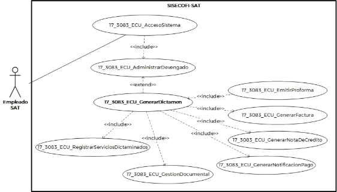
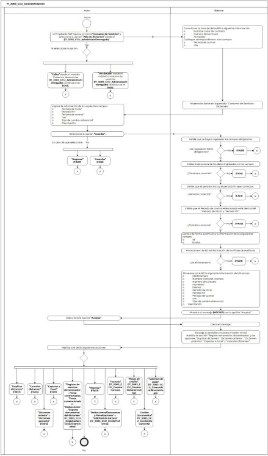
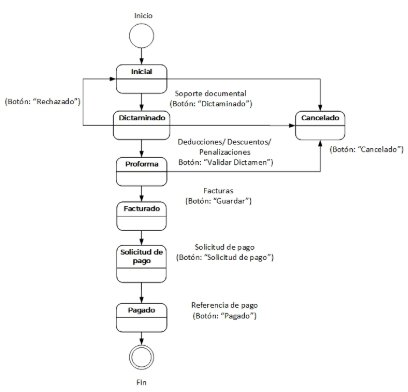

**Administración General de Comunicaciones **

**y Tecnologías de la Información**

**Marco Documental 7.0**
|Fecha de aprobación del Template: 02/08/2023|**Especificación del Caso de Uso** 17\_3083\_ECU\_GenerarDictamen.docx|Versión del template: 7.00|
| :-: | :- | :-: |

**<ID Requerimiento>** 8309** 

**Nombre  del  Requerimiento:**  TI\_SISECOFI-SAT\_Seguimiento  financiero  y  control documental de proyectos de contratación** 

**Tabla de Versiones y Modificaciones** 

|Versión |Descripción del cambio |Responsable de la Versión |Fecha |
| - | - | :-: | - |
|*1* |*Creación del documento* |Aylín de la Concepción Caballero Weng |*11/03/2024* |
|*1.1* |*Revisión del documento* |Luis Angel Olguin Castillo |*19/04/2024* |
|*1.2* |*Versión aprobada para firma* |Andrés Mojica Vázquez |*07/06/2024* |

**Tabla de Contenido** 

[17_3083_ECU_GenerarDictamen ............................................................................................................. 2](#_page1_x83.00_y132.92)

1. [Descripción ........................................................................................................................................................ 2](#_page1_x102.00_y148.92)
1. [Diagrama del Caso de Uso ...................................................................................................................... 2](#_page1_x102.00_y225.92)
1. [Actores ................................................................................................................................................................. 2](#_page1_x102.00_y531.92)
4. [Precondiciones............................................................................................................................................... 2](#_page1_x102.00_y666.92)
4. [Post condiciones ........................................................................................................................................... 3](#_page2_x102.00_y293.92)
4. [Flujo primario .................................................................................................................................................. 3](#_page2_x102.00_y402.92)
4. [Flujos alternos .................................................................................................................................................8](#_page7_x102.00_y412.92)
4. [Referencias cruzadas............................................................................................................................... 20](#_page19_x102.00_y502.92)
4. [Mensajes .......................................................................................................................................................... 20](#_page19_x102.00_y674.92)
4. [Requerimientos No Funcionales .................................................................................................... 21](#_page20_x102.00_y468.92)
4. [Diagrama de actividad .......................................................................................................................... 24](#_page23_x102.00_y133.92)
4. [Diagrama de estados ............................................................................................................................. 25](#_page24_x102.00_y133.92)
4. [Aprobación del cliente .......................................................................................................................... 26](#_page25_x102.00_y133.92)

|Fecha de aprobación del Template: 02/08/2023|**Especificación del Caso de Uso** 17\_3083\_ECU\_GenerarDictamen.docx|Versión del template: 7.00|
| :-: | :- | :-: |

17\_3083\_ECU\_GenerarDictamen  

1. **Descripción  **

El objetivo de este Caso de Uso es permitir al Empleado SAT generar, editar “Datos generales”  y consultar un dictamen relacionado a un contrato. 

2. **Diagrama del Caso de Uso **

3. **Actores  **

|**Actor** |**Descripción** |
| - | - |
|**Empleado SAT** |El  Empleado  SAT  tiene  el  o  los  roles  otorgados  por  la Administración Central de Seguridad, Monitoreo y Control (ACSMC) para ingresar a cada uno de los módulos de este sistema. |

4. **Precondiciones** 
- El Empleado SAT se ha autenticado en el sistema con e.firma válida. 
- El sistema ha consumido el servicio “Oauth” para obtener los datos del Empleado SAT que ingresa. 
- Se le ha asignado los roles requeridos al Empleado SAT para ingresar, insertar 
- editar al módulo “Dictamen”. 

|Fecha de aprobación del Template: 02/08/2023|**Especificación del Caso de Uso** 17\_3083\_ECU\_GenerarDictamen.docx|Versión del template: 7.00|
| :-: | :- | :-: |

- El sistema ha validado que el Empleado SAT cuenta con los roles para ingresar al módulo “Dictamen”. 
- El Empleado SAT ha sido asignado a un proyecto o como participante en la administración de un contrato. 
- El empleado SAT ha seleccionado  alguna de las siguientes opciones: Alta dictamen,  Editar  dictamen  o  Ver  dictamen  en  el  módulo  “Consumo  de Servicios” relacionados a un contrato.** 
- El  empleado  SAT  ha  seleccionado  una  opción  en  el  campo  Convenio  de Colaboración del contrato.** 
- El empleado SAT ha registrado la plantilla activa de verificación para la carga de documentos en la sección Gestión documental.** 
5. **Post condiciones  **El Empleado SAT: 
- Registró un dictamen. 
- Modificó los “Datos Generales” de un dictamen registrado. 
- Consultó la información de un dictamen registrado. 
- Se asignó la plantilla documental para el dictamen. 
6. **Flujo primario** 

|**Actor** |**Sistema** |
| - | - |
|
1\.  El  Caso  de  Uso  inicia  cuando  el 

Empleado  SAT  ingresa  al  menú **“Consumo  de  Servicios”**  y selecciona  la  opción  **“Alta  de dictamen”**  desde  el **(17\_3083\_ECU\_AdministrarDeve ngado)** y continúa en el flujo. 

- Si  selecciona  la  opción **“Editar”**  desde  el  módulo **“Consumo  de  servicios”** **(17\_3083\_ECU\_AdministrarD evengado)**,   continúa  en  el [**(FA11)**](#_page16_x102.00_y518.92).** 

- Si  selecciona  la  opción  **“Ver detalle”**  desde  el  módulo **“Consumo  de  servicios”** **(17\_3083\_ECU\_AdministrarD evengado)**,  continúa  en  el [**(FA11)**](#_page16_x102.00_y518.92)  y  aplica  la  regla  de negocio **(RNA167)**.** 
|
2\.  Consulta en la base de datos BD la 

siguiente información: 

- Nombre corto del contrato 

- Número del contrato 

- Proveedor 

Catálogos correspondientes a los campos:  

- Periodo de control  

- IVA 
|
||3\.  Muestra los siguientes datos en la pantalla  “Consumo  de  Servicios  - |

|Fecha de aprobación del Template: 02/08/2023|**Especificación del Caso de Uso** 17\_3083\_ECU\_GenerarDictamen.docx|Versión del template: 7.00|
| :-: | :- | :-: |

Dictamen”**  de  acuerdo  con  las **(RNA01)** y **(RNA87)**. 

Campo: 

- Última modificación 

Sección: “Datos generales” 

- Id 
- Nombre corto del contrato 
- Número de contrato  
- Proveedor 
- Estatus 
- Periodo de inicio\* 
- Periodo fin\* 
- Periodo de control\* 
- IVA\*  
- Tipo de cambio referencial\* (inhabilitado).  Aplica  la **(RNA126)** 
- Descripción 

  ` `Opciones:  

- Duplicar  dictamen 

  (inhabilitada)  ![ref1] **(RNA99)** 

- Dictamen  anterior  ![ref2] **(RNA118)** 
- Dictamen  posterior  ![ref3] **(RNA118)** 
- Cancelar  dictamen 

  (inhabilitada) ![ref4]

- Inicial  

Tabla:  “Resumen  consolidado” (inhabilitado). Aplica la **(RNA105)** y **(RNA244)**. 

- Fase  (Dictaminado  y Facturado) 
- Subtotal 
- Deducciones 
- IEPS 
- IVA 
- Otros impuestos 
- Total 
- Total en pesos 

  Opciones. Aplica la **(RNA246)**. 

- Exportar  a  Excel  ![ref5] (Inhabilitada) 
- Cancelar  
- Guardar  

|Fecha de aprobación del Template: 02/08/2023|**Especificación del Caso de Uso** 17\_3083\_ECU\_GenerarDictamen.docx|Versión del template: 7.00|
| :-: | :- | :-: |

Secciones inhabilitadas: 

- “Registro  de  servicios dictaminados”  
- “Penas contractuales” 
- “Penas convencionales” 
- “Deducciones” 
- “Soporte  documental  de dictamen” 
- “Deducciones / descuentos / penalizaciones”  
- “Solicitud de factura” 
- “Facturas”  
- “Notas de crédito”  
- “Solicitud de pago” 
- “Gestión documental”  

  Opción:  

- Regresar 

Ver **(17\_3083\_EIU\_GenerarDictamen)**  Estilos 01. 

4. Ingresa  la  información  de  los  siguientes campos:  
- Periodo de inicio\*  
- Periodo fin\*  
- Periodo de control\*  
- IVA\*   
- Tipo  de  cambio  referencial\*  
- Descripción  
5. Selecciona la opción **“Guardar”** y  6.  Valida que se hayan ingresado los continúa en el flujo.  campos  obligatorios  de  acuerdo con la **(RNA03)**.   
- En caso de que seleccione la opción **“Regresar”**, continúa  ￿  En caso contrario, continúa en en el [**(FA07)**](#_page14_x102.00_y234.92).  el [**(FA08)**](#_page14_x102.00_y495.92).** 
- Si  selecciona  la  opción 

  **“Cancelar”**,  continúa  en  el 

  [**(FA12)**](#_page18_x102.00_y507.92). 

7. Valida  la  estructura  de  los  datos ingresados en los campos. Aplica la **(RNA255)**. 
- En caso de que la estructura de los  datos  ingresados  sea incorrecta,  continúa  en  el [**(FA14)**](#_page19_x102.00_y294.92).  

|Fecha de aprobación del Template: 02/08/2023|**Especificación del Caso de Uso** 17\_3083\_ECU\_GenerarDictamen.docx|Versión del template: 7.00|
| :-: | :- | :-: |

8. Valida  que  el  periodo  inicio  y  el periodo  fin  sean  correctos  de acuerdo  con  las  **(RNA103)**  y **(RNA102)**. 
   1. En caso contrario, continúa en el [**(FA01)**](#_page7_x102.00_y452.92). 
9. Valida  que  el  periodo  de  control seleccionado  esté  dentro  del “Periodo de inicio” y “Periodo fin” de acuerdo con la **(RNA101)**.   
   1. En caso contrario, continúa en el [**(FA02)**](#_page8_x102.00_y232.92). 
10. Genera  de  forma  automática  la información  de  los  siguientes campos  de  acuerdo  con  las **(RNA87)** y **(RNA115)**: 
- Id 
- Estatus 
11. Almacena en la BD la información de las Pistas de Auditoría. 

    Datos que se almacenan: 

    **Módulo**=  Dictamen  –  Datos generales 

    **Fecha y Hora**= Fecha y hora del sistema,  usando  el  formato DD/MM/AAAA HH:MM:SS 

    **RFC  Usuario**=  RFC  largo  del Empleado  SAT  que  ingresó  al sistema 

    **Tipo de movimiento**= **INSR** (insertar) **UPDT** (Modificar). **Movimiento**=  Aplica  la **(RNA239)**. 

- Id dictamen 
- En caso de que no se puedan almacenar  las  Pistas  de Auditoría,  continúa  en  el [**(FA09)**](#_page15_x102.00_y133.92). 
12. Almacena  en  la  BD  la  siguiente información  del  dictamen.  Aplica las **(RNA247)** y **(RNA262)**. 

    Datos generales: 

- Id (dictamen) 
- Nombre corto del contrato 
- Número de contrato 

|Fecha de aprobación del Template: 02/08/2023|**Especificación del Caso de Uso** 17\_3083\_ECU\_GenerarDictamen.docx|Versión del template: 7.00|
| :-: | :- | :-: |

- Proveedor 
- Estatus 
- Periodo de inicio 
- Periodo fin 
- Periodo de control 
- IVA 
- Tipo de cambio referencial 
- Descripción 
  13. Muestra el mensaje [**(MSG001)**](#_page19_x113.00_y735.92)** con la opción “Aceptar”. 
14. Selecciona la opción **“Aceptar”**.  15.  Cierra el mensaje.  
16. Recarga  la  pantalla  y  muestra  el botón Inicial. Aplica la **(RNA256)**. 

    Habilita  la  sección  “Registro  de servicios  dictaminados”  y  las opciones  “Duplicar  dictamen”, “Dictamen  anterior”,  “Dictamen posterior”,  “Exportar  a  Excel”  y “Cancelar dictamen”.  

17. Realiza  una  de  las  siguientes  18.  Fin del Caso de Uso.  

    acciones: 

- Si  selecciona  la  opción **“Duplicar  dictamen”**, continúa en el [**(FA03)**](#_page8_x102.00_y499.92). 
- Si  selecciona  la  opción **“Cancelar  dictamen”**, continúa en el [**(FA04)**](#_page12_x101.00_y170.92). 
- Si  selecciona  la  opción **“Dictamen  anterior”**  o **“Dictamen  posterior”**, continúa en el [**(FA05)**](#_page13_x102.00_y452.92). 
- Si  selecciona  la  opción **“Exportar a Excel”**, continúa en el [**(FA10)**](#_page15_x102.00_y531.92). 
- Si  ingresa  a  las  secciones **“Registro  de  servicios dictaminados**”,  **Penas contractuales**,  **“Penas convencionales**”, **“Deducciones**”,  **”Soporte documental  del  dictamen”** continúa  en  el  **(17\_3083\_ECU\_RegistrarSer viciosDictaminados)**. 
- Si  ingresa  a  la  sección “**Deducciones/descuentos y penalizaciones”**  o **“Solicitud  de  Factura”**, continúa  en  el 

|Fecha de aprobación del Template: 02/08/2023|**Especificación del Caso de Uso** 17\_3083\_ECU\_GenerarDictamen.docx|Versión del template: 7.00|
| :-: | :- | :-: |

**(17\_3083\_ECU\_EmitirInform acionProforma)**. 

- Si  ingresa  a  la  sección **“Facturas”**,**  continúa  en  el **(17\_3083\_ECU\_GenerarFact ura)**. 
- Si ingresa a la sección **“Notas de  crédito”**,  continúa  en  el **(17\_3083\_ECU\_GenerarNota DeCredito)**. 
- Si  ingresa  a  la  sección **“Solicitud  de  pago”**, continúa  en  el **(17\_3083\_ECU\_GenerarNotif icacionPago)**. 
- Si entra a la sección **“Gestión Documental”**,** continúa en el **(17\_3083\_ECU\_GestiónDocu mental)**. 
- Si  selecciona  la  opción **“Regresar”**,  continúa  en  el [**(FA07)**](#_page14_x102.00_y234.92). 

**7. Flujos alternos  **

**FA01 Periodo de inicio o periodo fin incorrectos** 

|**Actor** |**Sistema** |
| - | - |
||
1\.  El  **FA01**  inicia  cuando  el  sistema 

identifica  que  el  periodo  inicio  o periodo fin son incorrectos. 
|
||
2\.  Muestra  el  mensaje  de  acuerdo 

con lo siguiente: 

- Si  el  periodo  de  inicio  es incorrecto  muestra  el [**(MSG002)**](#_page20_x113.00_y139.92). 

- Si  el  periodo  de  fin  es incorrecto  muestra  el [**(MSG003)**](#_page20_x113.00_y163.92). 

Cada  mensaje  se  muestra  con  la opción “Aceptar”. 
|
|3\.  Selecciona la opción **“Aceptar”**. |4\.  Cierra el mensaje.  |
||5\.  Realiza lo siguiente: |

|Fecha de aprobación del Template: 02/08/2023|**Especificación del Caso de Uso** 17\_3083\_ECU\_GenerarDictamen.docx|Versión del template: 7.00|
| :-: | :- | :-: |

||
- Si se invoca en el paso  8 del Flujo primario, retorna al paso [**4** ](#_page4_x119.00_y402.92)del Flujo primario. 

- Si se invoca en el paso 12 del **(FA03)**,  retorna  al  paso  **8**  del **(FA03)**. 
|
| :- | - |

**FA02 El periodo control no está dentro del periodo de inicio y periodo fin** 

|**Actor** |**Sistema** |
| - | - |
||
1\.  El **FA02** inicia cuando se identifica 

que el “Periodo de control” no está dentro  del  “Periodo  de  inicio”  y “Periodo fin”. 
|
||
2\.  Muestra  el  **[**(MSG004)**](#_page20_x113.00_y186.92)**  con  la 

opción “Aceptar”. 
|
|3\.  Selecciona la opción **“Aceptar”**. |4\.  Cierra el mensaje.  |
||
5\.  Realiza lo siguiente: 

- Si se invoca en el paso 9 del Flujo primario, retorna al paso [**4** ](#_page4_x119.00_y402.92)del Flujo primario. 

- Si se invoca en el paso 13 del **(FA03)**,  retorna  al  paso [` `**8** ](#_page10_x112.00_y503.92) del **(FA03)**. 
|

**FA03 Selecciona la opción “Duplicar dictamen”  **

|**Actor** |**Sistema** ||||
| - | - | :- | :- | :- |
|
1\.  El **FA03** inicia cuando el Empleado 

SAT  selecciona  la  opción **“Duplicar dictamen”**. 
|
2\.  Duplica la sección: 

o  “Datos generales” 
||||
||
3\.  Muestra  en  una  ventana 

emergente  un  cuadro  de selección  con  las  siguientes opciones: 

Secciones a duplicar: 

- “Registro  de  servicios dictaminados” 

- “Penas contractuales” 

- “Penas convencionales” 

- “Deducciones”. 

Opciones:  

- Aceptar 

- Cancelar 
||||
|Fecha de aprobación del Template: 02/08/2023|**Especificación del Caso de Uso** 17\_3083\_ECU\_GenerarDictamen.docx|Versión del template: 7.00|||

- Cerrar 

Ver **(17\_3083\_EIU\_GenerarDictamen)**  Estilos 03. 

4. Elije  las  secciones  que  se  van  a duplicar. 
4. Selecciona la opción **“Aceptar”** y  6.  Consulta en la BD la información continúa en el flujo.  de  las  secciones  que  se 
- En  caso  de  seleccionar  la  seleccionaron para duplicar.  opción **“Cancelar”** o **“Cerrar”** 

  regresa  al  paso [` `**16** ](#_page6_x315.00_y278.92) del  Flujo 

  primario. 

7. Muestra la pantalla con los datos. Sección:“ Datos generales” 

   En modo lectura 

- Id  
- Nombre corto del contrato 
- Número de contrato  
- Proveedor 
- Estatus  

  En modo edición 

- Periodo de inicio\* 
- Periodo fin\* 
- Periodo de control\* 
- IVA\* 
- Tipo  de  cambio referencial\*  
- Descripción 

  Opciones: 

- Duplicar  dictamen (inhabilitada) ![ref6]
- Dictamen  anterior  ![ref7] (inhabilitado) 
- Dictamen  posterior  ![ref8] (inhabilitada) 
- Cancelar  dictamen 

  (inhabilitada) ![ref9]

  Tabla “Resumen consolidado”. Aplica la **(RNA105)** y **(RNA167)** 

- Fase  (Dictaminado  y Facturado) 
- Subtotal 
- Deducciones 
- IEPS 
- IVA 
- Otros impuestos 
- Total 

|Fecha de aprobación del Template: 02/08/2023|**Especificación del Caso de Uso** 17\_3083\_ECU\_GenerarDictamen.docx|Versión del template: 7.00|
| :-: | :- | :-: |

- Total en pesos Opciones: 
- Exportar  a  Excel  ![ref10] (inhabilitada) 
- Cancelar  
- Guardar  

  Secciones colapsadas:  

- “Registro  de  servicios dictaminados”  
- “Penas contractuales” 
- “Penas convencionales” 
- “Deducciones” 
- “Soporte  documental  del dictamen” 
- “Deducciones  / descuentos  / penalizaciones”  
- “Solicitud de factura” 
- “Facturas”  
- “Notas de crédito”  
- “Solicitud de pago” 
- “Gestión documental”  

  ` `Opción: 

- Regresar 

Ver **(17\_3083\_EIU\_GenerarDictamen)** Estilos 01.

8. Modifica  la  información  de  la sección “Datos generales”. 
8. Selecciona la opción **“Guardar”** y  10.  Valida que se hayan ingresado los continúa en el flujo.  campos  obligatorios  de  acuerdo con la **(RNA03)**.   
- Si  selecciona  la  opción 

  **“Cancelar”**, regresa al paso [**17** ](#_page6_x141.00_y388.92) ￿  En caso contrario, continúa en del Flujo primario.**   el [**(FA08)**](#_page14_x102.00_y495.92). 

- Si  selecciona  la  opción 

  **“Regresar”**,  continúa  en  el 

  [**(FA07)**](#_page14_x102.00_y234.92).**  

11. Valida  la  estructura  de  los  datos ingresados en los campos. Aplica la **(RNA255)**. 
- En caso de que la estructura de  los  datos  ingresados  sea incorrecta,  continúa  en  el [**(FA14)**](#_page19_x102.00_y294.92). 

|Fecha de aprobación del Template: 02/08/2023|**Especificación del Caso de Uso** 17\_3083\_ECU\_GenerarDictamen.docx|Versión del template: 7.00|
| :-: | :- | :-: |

12. Valida  que  el  periodo  inicio  y  el periodo  fin  sean  correctos  de acuerdo  con  las  **(RNA103)**  y **(RNA102)**. 
    1. En caso contrario, continúa en el [**(FA01)**](#_page7_x102.00_y452.92). 
13. Valida  que  el  periodo  de  control seleccionado  esté  dentro  del “Periodo de inicio” y “Periodo fin” de acuerdo con la **(RNA101)**.   
    1. En caso contrario, continúa en el [**(FA02)**](#_page8_x102.00_y232.92). 
14. Genera  de  forma  automática  la información  de  los  siguientes campos  de  acuerdo  con  las **(RNA87)** y **(RNA115)**: 
- Id 
- Estatus 
15. Almacena en la BD la información de las Pistas de Auditoría. 

    Datos que se almacenan: 

    **Módulo**=  Dictamen  –  Datos generales 

    **Fecha  y  Hora**=  Fecha  y  hora del sistema, usando el formato DD/MM/AAAA HH:MM:SS 

    **RFC  Usuario**=  RFC  largo  del Empleado SAT que ingresó al sistema 

    **Tipo de movimiento**= **INSR** (insertar) **UPDT** (Modificar). **Movimiento**=  Aplica  la **(RNA239)**. 

- Id dictamen 
- En caso de que no se puedan almacenar  las  Pistas  de Auditoría,  continúa  en  el [**(FA09)**](#_page15_x102.00_y133.92). 
  16. Almacena en la BD la información del dictamen y las secciones que se  eligieron  a  duplicar.  Aplica  la **(RNA247)**. 
  16. Muestra el mensaje [**(MSG001)**](#_page19_x113.00_y735.92)** con la opción “Aceptar”. 
18. Selecciona la opción **“Aceptar”**.  19.  Cierra el mensaje. 

|Fecha de aprobación del Template: 02/08/2023|**Especificación del Caso de Uso** 17\_3083\_ECU\_GenerarDictamen.docx|Versión del template: 7.00|
| :-: | :- | :-: |

21\.  Continúa  en  el  paso [` `**17** ](#_page6_x141.00_y388.92) del  Flujo primario.** 

**FA04 Selecciona la opción “Cancelar dictamen”  **

|**Actor** |**Sistema** |
| - | - |
|
1\.  El  **FA04**  inicia  cuando  el 

Empleado  SAT  selecciona  la opción **“Cancelar dictamen”**. 
|
2\.  Valida que no existan facturas y/o 

notas  de  crédito.  Aplica  la **(RNA87)**, y continúa en el flujo. 

En caso de que existan facturas y/o notas de crédito no canceladas, continúa en el [**(** ](#_page18_x102.00_y744.92)

[￿  **FA13)**](#_page18_x102.00_y744.92). 
|
||
3\.  Muestra  el  **[**(MSG014)**](#_page20_x113.00_y423.92)**  con  las 

opciones “Sí” y “No”. 
|
|
4\.  Selecciona  la  opción  **“Sí”**  y 

continúa en el flujo. 

￿  En  caso  de  que  seleccione 

**“No”**, continúa en el paso [**17** ](#_page6_x119.00_y388.92)del Flujo primario. 
|
5\.  Muestra una ventana emergente 

“Justificación de la cancelación del dictamen”. 

Justificación de la cancelación del dictamen  

Opciones:  

- Aceptar 

- Cerrar 

Ver 

**(17\_3083\_EIU\_GenerarDictamen)**         Estilos 02. 
|
|
6\.  Agrega  la  justificación  de  la 

cancelación del dictamen. 
||
|
7\.  Selecciona la opción **“Aceptar”** y 

continúa en el flujo. 

￿  En  caso  de  seleccionar  la 

opción **“Cerrar”** regresa al paso[` `**16** ](#_page6_x315.00_y278.92)del Flujo primario. 
|
8\.  Actualiza el estatus del dictamen 

de  acuerdo  con  la  **(RNA87)**  y **(RNA247)**. 
|
||
9\.  Concatena el prefijo “Motivo de la 

cancelación:”,  la  justificación  y separado  por  pipe  la “Descripción”,  mostrándolo  en  el campo “Descripción”. 
|
||
10\.  Almacena en la BD la información 

de las Pistas de Auditoría. 

Datos que se almacenan:  

**Módulo**= Dictamen 
|

|Fecha de aprobación del Template: 02/08/2023|**Especificación del Caso de Uso** 17\_3083\_ECU\_GenerarDictamen.docx|Versión del template: 7.00|
| :-: | :- | :-: |

||
Fecha y Hora = Fecha y hora del sistema usando el formato DD/MM/AAAA HH:MM:SS 

**RFC  Usuario**=  RFC  largo  del Empleado SAT que ingresó al sistema. 

**Tipo  de  movimiento**=  **UPDT** (modificar) 

**Movimiento**=  Aplica  la **(RNA239)**. 

- Id del dictamen 

￿  En  caso  de  que  no  se 

puedan  almacenar  las Pistas  de  Auditoría, continúa en el [**(FA09)**](#_page15_x102.00_y133.92). 
|
| :- | - |
||
11\.  Almacena en la BD la información 

del dictamen. 

- Estatus 

- Descripción 
|
||
12\.  Cambia  todas  las  secciones  del 

dictamen  a  modo  solo  lectura. Aplica la **(RNA167)**. 
|
||13\.  Fin del Caso de Uso. |

**FA05 Selecciona la opción Dictamen anterior o posterior** 

|**Actor** |**Sistema** |
| - | - |
|
1\.  El **FA05** inicia cuando el Empleado 

SAT  selecciona  la  opción **“Dictamen  anterior”**  o **“Dictamen posterior”**. 
|
2\.  Consulta  en  la  BD  y  obtiene  la 

información del dictamen. Aplica la **(RNA118)**. 
|
||
3\.  Valida  que  se  encuentre 

información registrada, y continúa en el flujo. 

￿  En  caso  de  no  contar  con 

información,  continúa  en  el [**(FA06)**](#_page13_x102.00_y699.92).** 
|
||
4\.  Muestra  la  pantalla  con  la 

información  del  dictamen  en modo lectura. Aplica la **(RNA167)**. 
|
||5\.  Fin del Caso de Uso. |

**FA06 No existe información de dictamen** 

**Actor  Sistema **

|Fecha de aprobación del Template: 02/08/2023|**Especificación del Caso de Uso** 17\_3083\_ECU\_GenerarDictamen.docx|Versión del template: 7.00|
| :-: | :- | :-: |

||1\.  El  **FA06** inicia cuando  se identifica que  no  existe  información  del dictamen. |
| :- | - |
||2\. Muestra el [**(MSG007)**](#_page20_x113.00_y253.92)** con la opción “Aceptar”. |
|3\. Selecciona la opción **“Aceptar”**. |4\. Cierra el mensaje. |
||5\. Retorna al pas[o **17** ](#_page6_x119.00_y388.92)del Flujo primario. |

**FA07 Selecciona la opción “Regresar”** 

|**Actor** |**Sistema** |
| - | - |
|
1\.  El **FA07** inicia cuando el Empleado 

SAT  selecciona  la  opción **“Regresar”**. 
|
2\.  Muestra  el  **[**(MSG008)**](#_page20_x113.00_y275.92)**  con  las 

opciones  “Sí”  y  “No”,  y  el  flujo continúa. 
|
|
3\.  Selecciona  la  opción  **“Sí”**  y 

continúa en el flujo. 

￿  En  caso  de  que  seleccione 

**“No”**,  regresa  al  paso  donde fue invocado. 
|4\.  Cierra el mensaje. |
||
5\.  Regresa a la pantalla “Consumo de 

servicios”. 

Ver **(17\_3083\_EIU\_AdministrarDeven gado)**  

Estilos 02.
|
||6\.  Fin del Caso de Uso. |

**FA08 Se identifica que no se ingresaron los datos obligatorios **

|**Actor** |**Sistema** |
| - | - |
||
1\.  El  **FA08**  inicia  cuando  el  sistema 

identifica que no se ingresaron los datos obligatorios. 
|
||
2\.  Muestra  en  rojo  los  campos 

pendientes de capturar. 
|
||
3\.  Muestra  el  **[**(MSG009)**](#_page20_x113.00_y299.92)**,  con  la 

opción “Aceptar”. 
|
|4\.  Selecciona la opción **“Aceptar”**. |5\.  Cierra el mensaje.  |
||
6\.  Realiza lo siguiente: 

- Si  se  invoca  en  el  paso  6  del Flujo primario, retorna al paso [**4** ](#_page4_x119.00_y402.92)del Flujo primario. 

- Si se invoca en el paso 10 del [**(FA03)**](#_page8_x102.00_y499.92),  retorna  al  paso [` `**8** ](#_page10_x112.00_y503.92) del **(FA03)**. 
|

|Fecha de aprobación del Template: 02/08/2023|**Especificación del Caso de Uso** 17\_3083\_ECU\_GenerarDictamen.docx|Versión del template: 7.00|
| :-: | :- | :-: |

**FA09 No se pueden almacenar las Pistas de Auditoría  ![ref11]**

|**Actor** |**Sistema** |
| - | - |
||1\.  El  **FA09**  inicia  cuando  interviene un evento ajeno y no se pueden almacenar las Pistas de Auditoría.**  |
||
2\.  Cancela  la  operación  sin 

completar  el  movimiento  que estaba en proceso. 
|
||
3\.  Muestra  el  mensaje  de  acuerdo 

con lo siguiente: 

- Si la pista de auditoría es por el tipo  de  movimiento  **UPDT**  e **INSR** se muestra el [**(MSG010)**](#_page20_x113.00_y324.92). 

- Si la pista de auditoría es por el tipo de movimiento **CNST**, se muestra el **[**(MSG012)**](#_page20_x113.00_y373.92)**.  

- En  caso  de  que  la  pista  de auditoría  es  por  el  tipo  de movimiento **PRNT**, se muestra el **[**(MSG013)**](#_page20_x113.00_y398.92)**.  

Cada mensaje se muestra con la opción “Aceptar”. 
|
|4\.  Selecciona la opción **“Aceptar”**. |5\.  Cierra el mensaje . |
||
6\.  Regresa al paso previo que detona 

la acción de la pista de auditoría. 
|

**FA10 Selecciona la opción “Exportar a Excel” **

|**Actor** |**Sistema** |
| - | - |
|
1\.  El  **FA10**  inicia  cuando  el 

Empleado  SAT  selecciona  la opción **“Exportar a Excel”**. 
|
2\.  Valida  la  información  de  la  tabla 

“Resumen  consolidado”.  Aplica  la **(RNA244)**, y continúa en el paso [**5** ](#_page15_x307.00_y715.92)de este flujo. 

￿  En  caso  de  no  encontrar información  mostrará  el [**(MSG005)**](#_page20_x113.00_y209.92),**  con  la  opción “Aceptar” y continúa en el flujo. 
|
|3\.  Selecciona la opción **“Aceptar”**. |
4\.  Cierra el mensaje y continúa en el 

pas[o **9** ](#_page16_x307.00_y489.92)de este flujo. 
|
||
5.  Almacena en la BD la información 

de las Pistas de Auditoría. 

Datos que se almacenan:  
|

|Fecha de aprobación del Template: 02/08/2023|**Especificación del Caso de Uso** 17\_3083\_ECU\_GenerarDictamen.docx|Versión del template: 7.00|
| :-: | :- | :-: |

**Módulo**=  Dictamen  –  Datos generales-  Resumen consolidado 

**Fecha y Hora** = Fecha y hora del sistema usando el formato DD/MM/AAAA HH:MM:SS 

**RFC  Usuario**=  RFC  largo  del Empleado  SAT  que  ingresó  al sistema. 

**Tipo  de  movimiento**=  **PRNT** (Imprimir) 

**Movimiento**=  Aplica  la **(RNA239)**. 

-Id dictamen  

1. En caso de  que  no se  puedan almacenar  las  Pistas  de Auditoría, continúa en el [**(FA09)**](#_page15_x102.00_y133.92). 
6. Obtiene la información de la tabla “Resumen consolidado” conforme a lo siguiente: 
   1. Si se invoca en el paso [` `**17** ](#_page6_x141.00_y388.92)del Flujo  primario.  Aplica  la **(RNA254)**. 
7. Genera  un  archivo  Excel  con  la extensión (.xlsx) con la información obtenida en el pas[o **6** ](#_page16_x307.00_y353.92)de este flujo.  
7. Descarga el archivo xlsx.  
7. Fin del Caso de Uso. 

**FA11 Selecciona la opción “Editar dictamen” **

|**Actor** |**Sistema** ||||
| - | - | :- | :- | :- |
|
1\.  El **FA11** inicia cuando el Empleado 

SAT  selecciona  **“Editar”**  o   **“Ver detalle”**  desde  el  módulo **“Consumo  de  servicios”** **(17\_3083\_ECU\_AdministrarDeve ngado)**. 
|
2\.  Identifica el rol del Empleado SAT 

que  ingresa  para  presentar  de forma correcta la pantalla. Aplica las **(RNA51)**, **(RNA151)**, **(RNA167)** y **(RNA142)**. 
||||
||
3\.  Obtiene de  la BD la información 

del dictamen seleccionado. Aplica la **(RNA105)**. 

o  “Datos generales” 
||||
||
4\.  Despliega  la  pantalla  con  la 

información  del  dictamen precargada.  Aplica  la  **(RNA01)**, **(RNA87)** y **(RNA126)**. 
||||
|Fecha de aprobación del Template: 02/08/2023|**Especificación del Caso de Uso** 17\_3083\_ECU\_GenerarDictamen.docx|Versión del template: 7.00|||

“Datos generales”  

En modo lectura 

- Id  
- Estatus 
- Nombre corto del contrato 
- Número de contrato  
- Proveedor 

  En  caso  de  seleccionar  “Ver detalle”  los  siguientes  campos estarán en modo lectura. 

  En caso de seleccionar “Editar” o “Duplicar dictamen” los siguientes campos se podrán editar. 

- Periodo de inicio\* 
- Periodo fin\* 
- Periodo de control\* 
- IVA\* 
- Tipo de cambio referencial\*  
- Descripción 

`    `Opciones: 

- Duplicar  dictamen (inhabilitada) ![ref1]
- Dictamen anterior![ref2] Aplica la **(RNA118)** 
- Dictamen posterior  ![ref3] Aplica la **(RNA118)** 
- Cancelar  dictamen  ![ref4]  Aplica la **(RNA107)**  

  Tabla: “Resumen consolidado”. Aplica la **(RNA244)** 

  (Fase)  Dictaminado  y facturado 

- Subtotal 
- Deducciones 
- IEPS 
- IVA 
- Otros impuestos 
- Total 
- Total en pesos 

  Opciones: 

- Exportar a Excel ![ref5]
- Cancelar. Aplica la **(RNA167)** 
- Guardar. Aplica la **(RNA167)** 

|Fecha de aprobación del Template: 02/08/2023|**Especificación del Caso de Uso** 17\_3083\_ECU\_GenerarDictamen.docx|Versión del template: 7.00|
| :-: | :- | :-: |

||
- Regresar 

Secciones (colapsadas) 

- “Registro  de  servicios dictaminados”  

- “Penas contractuales” 

- “Penas convencionales” 

- “Deducciones” 

- “Soporte  documental  del dictamen” 

- “Deducciones  /  descuentos  / penalizaciones”  

- “Solicitud de factura” 

- “Facturas”  

- “Notas de crédito”  

- “Solicitud de pago” 

- “Gestión documental”  

Ver **(17\_3083\_EIU\_GenerarDictamen)**  Estilos 01. 
|
| :- | - |
|5\.  Modifica los datos que requiera. ||
|
6\.  Selecciona la opción **“Guardar”** y 

continúa  en  el  paso [` `**6** ](#_page4_x315.00_y524.92) del  Flujo primario. 

￿  Si  selecciona  la  opción 

**“Cancelar”**,  continúa  en  el [**(FA12)**](#_page18_x102.00_y507.92). 
|7\.  Fin del Caso de Uso. |

**FA12 Selecciona la opción “Cancelar” **

|**Actor** |**Sistema** |
| - | - |
|
1\.  El **FA12** inicia cuando el Empleado 

SAT  selecciona  la  opción **“Cancelar”**. 
|
2\.  Muestra  el  **[**(MSG008)**](#_page20_x113.00_y275.92)**  con**  las 

opciones “Sí” y No”.**  
|
|
3\.  Selecciona la opción **“Sí**” y el flujo 

continúa.  

￿  En  caso  de  seleccionar  **“No”**, continúa en el paso **6** de este flujo.  
|4\.  Cierra la ventana emergente.  |
||
5\.  Inicializa los campos de la pantalla 

en donde se selecciona la opción dejándolos como en un inicio, no almacena ninguna información.  
|
||
6\.  Permanece  en  la  sección  donde 

fue invocado.  
|

|Fecha de aprobación del Template: 02/08/2023|**Especificación del Caso de Uso** 17\_3083\_ECU\_GenerarDictamen.docx|Versión del template: 7.00|
| :-: | :- | :-: |

**FA13 Se encontraron facturas y notas de crédito asociadas ![ref11]**

|**Actor** |**Sistema** |
| - | - |
||
1\.  El **FA13** inicia cuando se identifica 

que  existen  facturas  y  notas  de crédito asociadas. 
|
||
2\.  Muestra el [**(MSG006)**](#_page20_x113.00_y231.92)** con la opción 

“Aceptar”. 
|
|3\.  Selecciona la opción **“Aceptar”**. |4\.  Cierra el mensaje. |
||
5\.  Retorna  al  paso [` `**17** ](#_page6_x141.00_y388.92) del  Flujo 

primario. 
|

**FA14 Estructura de datos incorrecta** 

|**Actor** |**Sistema** |
| - | - |
||
1\.  El **FA14** inicia cuando identifica que 

la  estructura  de  los  datos ingresados es incorrecta. 
|
||
2\.  Muestra en rojo los campos con la 

estructura incorrecta. 
|
||
3\.  Muestra el [**(MSG011)**](#_page20_x113.00_y349.92) con la opción 

“Aceptar”. 
|
|4\.  Selecciona la opción **“Aceptar”**. |5\.  Cierra el mensaje. |
||
6\.  Retorna  al  paso [` `**4** ](#_page4_x119.00_y402.92) del  Flujo 

primario. 
|

8. **Referencias cruzadas  **
- 17\_3083\_CRN\_SeguimientoFinancieroYControl 
- 17\_3083\_EIU\_GenerarDictamen 
- 17\_3083\_ECU\_RegistrarServiciosDictaminados 
- 17\_3083\_ECU\_EmitirProforma 
- 17\_3083\_ECU\_GenerarFactura 
- 17\_3083\_ECU\_GenerarNotaDeCredito 
- 17\_3083\_ECU\_GenerarNotificacionPago 
- 17\_3083\_ECU\_ AdministrarDevengado 
- 17\_3083\_EIU\_AdministrarDevengado 
- 17\_3083\_ECU\_GestionDocumental 
9. **Mensajes  **

   **ID Mensaje  Descripción **

**MSG001**  Se guardó correctamente la información. 

|Fecha de aprobación del Template: 02/08/2023|**Especificación del Caso de Uso** 17\_3083\_ECU\_GenerarDictamen.docx|Versión del template: 7.00|
| :-: | :- | :-: |

|**MSG002** |El  periodo  de  inicio  es  incorrecto.  Por  favor  verifique  la información. |
| - | :- |
|**MSG003** |El periodo fin es incorrecto. Por favor verifique la información. |
|**MSG004** |El periodo de control debe estar dentro del periodo de inicio y periodo fin del contrato. |
|**MSG005** |No se encontró información para exportar. |
|**MSG006** |Debe cancelar las facturas y/o notas de crédito. |
|**MSG007** |No existe información del dictamen. |
|**MSG008** |Se perderá la información capturada ¿Desea continuar? |
|**MSG009** |Favor de ingresar los datos obligatorios marcados con un asterisco (\*). |
|**MSG010** |Ocurrió  un  error  al  guardar  la  información,  favor  de  intentar nuevamente (PA01). |
|**MSG011** |La estructura de la información ingresada es incorrecta.  Intente nuevamente. |
|**MSG012** |Ocurrió  un  error  al  consultar  la  información,  favor  de  intentar nuevamente (PA01).  |
|**MSG013** |Ocurrió  un  error  al  exportar  la  información,  favor  de  intentar nuevamente (PA01).  |
|**MSG014** |El  dictamen  pasará  a  estatus  cancelado.  ¿Está  seguro  de continuar? |

10. **Requerimientos No Funcionales  **

|**ID RNF** |**Requerimiento No Funcional** |**Descripción** |||
| - | :-: | - | :- | :- |
|**RNF001** |Disponibilidad  |El sistema deberá estar activo las 24 horas del día, los 365 días del año con picos de operación en el horario de 9:00 a 18:00 horas.|||
|**RNF002** |Concurrencia  |
El número de Empleados SAT que puede tener el sistema son 150. 

￿  El  número  máximo  de  accesos 

concurrentes  que  debe  soportar  este sistema son 30 Empleados SAT.
|||
|**RNF003** |Seguridad  |El acceso solo podrá ser otorgado al Empleado SAT  que  tenga  los  roles  asignados  por  la Administración Central de Seguridad, Monitoreo y  Control  (ACSMC)  para  cada  módulo  de  este sistema. |||
|**RNF004** |Usabilidad  |
El  sistema  deberá  manejar  los  siguientes elementos para facilitar la navegación: 

￿  Mensajes  tipo  flotantes  (tooltips)  con información de la herramienta que ofrece 
|||
|Fecha de aprobación del Template: 02/08/2023|**Especificación del Caso de Uso** 17\_3083\_ECU\_GenerarDictamen.docx|Versión del template: 7.00|||

|||
ayuda  contextual  como  guía  para  el Empleado SAT. 

- Componente  de  ordenamiento  que permita  acomodar  la  información  de  la tabla de forma ascendente o descendente, considerando  la  columna  en  la  que  es seleccionado. 

- Contar  con  un  diseño  responsivo  que permita  su  óptima  visualización  en distintos tipos de dispositivos finales. 
|||
| :- | :- | :- | :- | :- |
|**RNF005** |Eficiencia  |Las consultas se dividen en generales y detalladas, para que las  detalladas carguen la información solo  cuando  sean  requeridas  por  el  Empleado SAT. |||
|**RNF006** |Usabilidad  |
El Empleado SAT podrá navegar a través de las páginas resultantes de la consulta considerando que  el  sistema  debe  mostrar  inicialmente  15 registros por página, permitiendo al Empleado SAT  seleccionar  los  registros  que  requiere visualizar, teniendo las opciones 15, 50 y 100:  

- Ir  a  la  primera  página  (debe  mostrar  la primera  página  con  el  resultado  de  la consulta). 

- Ir a la última página (debe mostrar la última página con el resultado de la consulta).  

- Ir  a  la  siguiente  página  (debe  mostrar  la siguiente página, considerando actual, con el resultado de la consulta y el número de registros  seleccionados  por  el  Empleado SAT). 

￿ 

Ir  a  la  página  anterior  (debe  mostrar  la página anterior considerando la actual con el resultado de la consulta).  

` `En  la  tabla  deben  mostrarse  los  registros  ordenados alfabéticamente. 
|||
|**RNF007** |Seguridad  |Las  Pistas  de  Auditoría  deben  estar  protegidas contra  accesos  no  autorizados.  Solo  los Empleados SAT autorizados pueden consultar las tablas y la información en ellas se definirá durante la etapa de diseño; la cual debe estar cifrada para mantenerla confidencial y evitar exposiciones no autorizadas.|||
|**RNF008** |Fiabilidad |El  sistema  debe  ser  capaz  de  manejar excepciones  de  manera  efectiva  y  presentar mensajes claros y comprensibles para garantizar una adecuada interacción con el sistema. |||
|**RNF009** |Seguridad |Se debe mantener la información en pantalla en caso de un error al guardar las Pistas de Auditoría, siempre  y  cuando  el  escenario  lo  permita.  Hay situaciones de infraestructura o de conexión de |||
|Fecha de aprobación del Template: 02/08/2023|**Especificación del Caso de Uso** 17\_3083\_ECU\_GenerarDictamen.docx|Versión del template: 7.00|||

internet que sí pierde los datos ya que no están controlados por el sistema.  

Al  almacenar  la  información  en  la  BD  de  tipo **RNF010**  Integridad  Texto  o  alfanumérico  se  deben  eliminar  los 

espacios en blanco al inicio y fin de la cadena.  

|Fecha de aprobación del Template: 02/08/2023|**Especificación del Caso de Uso** 17\_3083\_ECU\_GenerarDictamen.docx|Versión del template: 7.00|
| :-: | :- | :-: |

11. **Diagrama de actividad**  ![ref12]

|Fecha de aprobación del Template: 02/08/2023|**Especificación del Caso de Uso** 17\_3083\_ECU\_GenerarDictamen.docx|Versión del template: 7.00|
| :-: | :- | :-: |

12. **Diagrama de estados**  ![ref12]

|Fecha de aprobación del Template: 02/08/2023|**Especificación del Caso de Uso** 17\_3083\_ECU\_GenerarDictamen.docx|Versión del template: 7.00|
| :-: | :- | :-: |

13. **Aprobación del cliente  ![ref12]**

|||
| :- | :- |
|**FIRMAS DE CONFORMIDAD** ||
|||
|**Firma 1**|**Firma 2**|
|**Nombre**: Andrés Mojica Vázquez.|**Nombre**: Ricardo Chávez Gutiérrez.|
|**Puesto**: Usuario ACPPI|**Puesto**: Usuario ACPPI|
|**Fecha:** |**Fecha:** |
|||
|**Firma 3**|**Firma 4**|
|**Nombre**:  Yesenia  Helvetia Delgado Naranjo.|**Nombre:**  Alejandro  Alfredo  Muñoz Núñez.|
|**Puesto**: APE ACPPI|**Puesto:** RAPE ACPPI|
|**Fecha**: |**Fecha**: |
|||
|**Firma 5**|**Firma 6**|
|**Nombre**: Luis Angel Olguin Castillo.|**Nombre**: Erick Villa Beltrán.|
|**Puesto**: Enlace ACPPI|**Puesto**: Líder APE SDMA 6|
|**Fecha**:|**Fecha**:|
|||
|**Firma 7**|**Firma 8**|
|**Nombre:**  Juan  Carlos  Ayuso Bautista.|
` `**Nombre:**  Aylín  de  la  Concepción

Caballero Weng.
|
|**Puesto:** Líder Técnico SDMA 6|**Puesto:**  Analista  de  Sistemas  DS SDMA 6|
|**Fecha**:|**Fecha**:|
|||

Página 26 de 26 

[ref1]: Aspose.Words.b5fc15ac-73e1-4679-b081-5f493aa177b0.012.png
[ref2]: Aspose.Words.b5fc15ac-73e1-4679-b081-5f493aa177b0.013.png
[ref3]: Aspose.Words.b5fc15ac-73e1-4679-b081-5f493aa177b0.014.png
[ref4]: Aspose.Words.b5fc15ac-73e1-4679-b081-5f493aa177b0.015.png
[ref5]: Aspose.Words.b5fc15ac-73e1-4679-b081-5f493aa177b0.016.png
[ref6]: Aspose.Words.b5fc15ac-73e1-4679-b081-5f493aa177b0.031.png
[ref7]: Aspose.Words.b5fc15ac-73e1-4679-b081-5f493aa177b0.032.png
[ref8]: Aspose.Words.b5fc15ac-73e1-4679-b081-5f493aa177b0.033.png
[ref9]: Aspose.Words.b5fc15ac-73e1-4679-b081-5f493aa177b0.034.png
[ref10]: Aspose.Words.b5fc15ac-73e1-4679-b081-5f493aa177b0.036.png
[ref11]: Aspose.Words.b5fc15ac-73e1-4679-b081-5f493aa177b0.044.png
[ref12]: Aspose.Words.b5fc15ac-73e1-4679-b081-5f493aa177b0.055.png
