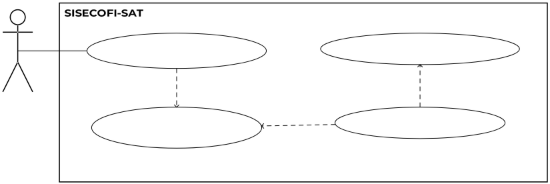
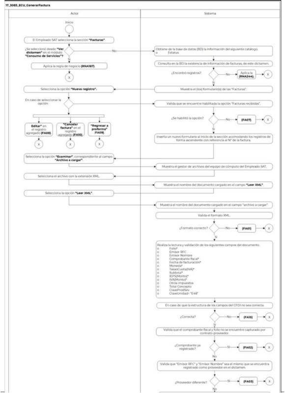
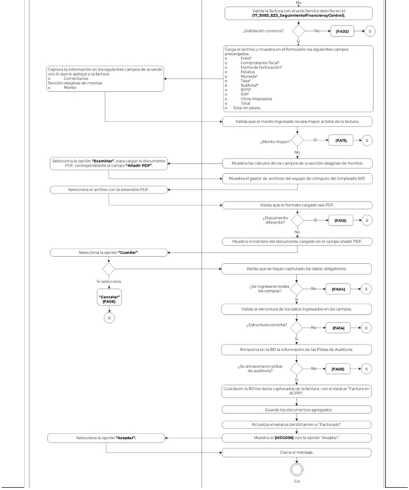

**Administración General de Comunicaciones **

**y Tecnologías de la Información**

**Marco Documental 7.0**
|Fecha de aprobación del Template: 02/08/2023|**Especificación del Caso de Uso** 17\_3083\_ECU\_GenerarFactura.docx|Versión del template: 7.00|
| :-: | :- | :-: |

**<ID Requerimiento>** 8309** 

**Nombre  del  Requerimiento:**  TI\_SISECOFI-SAT\_Seguimiento  financiero  y  control documental de proyectos de contratación** 

**Tabla de Versiones y Modificaciones** 

|Versión |Descripción del cambio |Responsable de la Versión |Fecha |
| - | - | :-: | - |
|*1* |*Creación del documento* |Maria del Carmen Gutiérrez Sánchez |*12/03/2024* |
|*1.1* |*Revisión del documento* |Luis Angel Olguin Castillo |17/04/2024 |
|*1.2* |*Versión aprobada para firma* |Andrés Mojica Vázquez. |17/06/2024 |

**Tabla de Contenido** 

[17_3083_ECU_GenerarFactura ................................................................................................................... 2 ](#_page1_x82.00_y132.92)

1. [Descripción ........................................................................................................................................................ 2 ](#_page1_x102.00_y148.92)
1. [Diagrama del Caso de Uso ...................................................................................................................... 2 ](#_page1_x102.00_y225.92)
1. [Actores ................................................................................................................................................................. 2 ](#_page1_x102.00_y415.92)
1. [Precondiciones............................................................................................................................................... 2 ](#_page1_x102.00_y537.92)
1. [Post condiciones ........................................................................................................................................... 3 ](#_page2_x102.00_y195.92)
1. [Flujo primario .................................................................................................................................................. 3 ](#_page2_x102.00_y285.92)
1. [Flujos alternos .................................................................................................................................................8 ](#_page7_x102.00_y536.92)
1. [Referencias cruzadas................................................................................................................................ 17 ](#_page16_x102.00_y132.92)
9. [Mensajes ........................................................................................................................................................... 17 ](#_page16_x102.00_y235.92)
9. [Requerimientos No Funcionales .................................................................................................... 18 ](#_page17_x102.00_y133.92)
9. [Diagrama de actividad .......................................................................................................................... 20 ](#_page19_x102.00_y133.92)
9. [Diagrama de estados .............................................................................................................................. 21 ](#_page20_x102.00_y676.92)
9. [Aprobación del cliente .......................................................................................................................... 22 ](#_page21_x102.00_y133.92)

|Fecha de aprobación del Template: 02/08/2023|**Especificación del Caso de Uso** 17\_3083\_ECU\_GenerarFactura.docx|Versión del template: 7.00|
| :-: | :- | :-: |

17\_3083\_ECU\_GenerarFactura 

1. **Descripción  **

El objetivo de este Caso de Uso es permitir al Empleado SAT la carga de facturas relacionadas con el dictamen de servicios. 

2. **Diagrama del Caso de Uso **

17\_3083\_ECU\_AccesoSistema **17\_3083\_ECU\_GenerarFactura **<<include>> <<include>>

Empleado 

SAT

17\_3083\_ECU\_AdministrarDevengado <<extend>> 17\_3083\_ECU\_GenerarDictamen

3. **Actores  **

|**Actor** |**Descripción** |
| - | - |
|**Empleado SAT** |El Empleado SAT es el que tiene el o los roles otorgados por la Administración Central de Seguridad, Monitoreo y Control (ACSMC) para ingresar a cada uno de los módulos de este sistema. |

4. **Precondiciones** 
- El Empleado SAT se ha autenticado en el sistema con e.firma válida. 
- El  sistema  ha  consumido  el  servicio  “Oauth”  para  obtener  los  datos  del Empleado SAT que ingresa. 
- El sistema ha validado que el Empleado SAT cuenta con los roles para ingresar y editar el módulo “Consumo de Servicios” y a la sección “Facturas”. 
- El  empleado  SAT  ha  ingresado  a  un  dictamen  de  acuerdo  con  el **(17\_3083\_ECU\_GenerarDictamen)**. 
- El empleado SAT ha seleccionado alguna de las siguientes opciones: “Editar dictamen”  o  “Ver  dictamen”  en  el  módulo  “Consumo  de  Servicios” relacionados a un contrato. 
- Se ha seleccionado la opción de facturas recibidas en el proceso descrito en el flujo de **(17\_3083\_ECU\_EmitirProforma)**.  
- El  empleado  SAT  ha  seleccionado  una  opción  en  el  campo  Convenio  de Colaboración del contrato. 

|Fecha de aprobación del Template: 02/08/2023|**Especificación del Caso de Uso** 17\_3083\_ECU\_GenerarFactura.docx|Versión del template: 7.00|
| :-: | :- | :-: |

- El sistema ha validado que se cuenta con los Web Service activos para realizar la validación de las facturas agregadas. 
- El empleado SAT ha registrado la plantilla activa de verificación para la carga de documentos en la sección documental.  
5. **Post condiciones  **
- El Empleado SAT cargó los archivos relacionados a una factura. 
- El Empleado SAT modificó la sección desglose de montos de una factura. 
- El Empleado SAT canceló una factura. 
6. **Flujo primario** 

|**Actor** |**Sistema** ||||
| - | - | :- | :- | :- |
|
1\.  El  Caso  de  Uso  inicia  cuando  el 

Empleado SAT selecciona la sección **“Facturas”**  del **(17\_3083\_ECU\_GenerarDictamen)**. 

￿  En caso de haber seleccionado la 

opción  “Ver  dictamen”  en  el módulo “Consumo de Servicios”, aplica  la  regla  de  negocio **(RNA167)**. 
|
2\.  Obtiene de la base de datos (BD) la 

información del siguiente catálogo, conforme las **(RNA01)** y **(RNA83)**: 

o  Estatus 
||||
||
3\.  Consulta en la BD la existencia de 

información  de  facturas,  de  este dictamen. 

￿  En  caso  de  no  encontrar registros. Aplica la **(RNA244)**. 
||||
||
4\.  Muestra el (los) formulario(s) de las 

“Facturas”, conforme a la **(RNA87)**, **(RNA51)**, **(RNA142)**, **(RNA244)** y con los siguientes campos: 

Opciones: 

- Nuevo registro 

- Editar 

- Cancelar factura

- Regresar a proforma. Aplica la **(RNA143)**. 
||||
|Fecha de aprobación del Template: 02/08/2023|**Especificación del Caso de Uso** 17\_3083\_ECU\_GenerarFactura.docx|Versión del template: 7.00|||

Formulario 

- N° 
- Archivo a cargar\* 
- Añadir PDF\*   

  Opciones:  

- Examinar,  del  campo Archivo a cargar. 
- Leer XML  
- Examinar, del campo añadir PDF.  
- Folio\*  
- Comprobante fiscal\*  
- Fecha de facturación\*  
- Estatus 
- Moneda\*  
- Tasa\*  
- Subtotal\*  
- IEPS\*  
- IVA\*  
- Otros Impuestos  
- Total  
- Total en pesos  
- Comentarios  

  Desglose de montos, conforme a la **(RNA144)**. 

- %SAT  
- Monto\*  
- Monto en pesos\*  
- % Convenio de colaboración  
- Monto\*  
- Monto en pesos\* 

  Opciones: 

- Regresar a proforma. Aplica la **(RNA143)**.   
- Cancelar.  Aplicar  la **(RNA246)**. 
- Guardar.  Aplicar  la **(RNA246)**. 

Ver **(17\_3083\_EIU\_GenerarFactura)** Estilos 01. 

5.  Selecciona  la  opción  **“Nuevo**  6.  Valida que se encuentre habilitada 

**registro”** y continúa el flujo.  la opción “Facturas recibidas”. 

|Fecha de aprobación del Template: 02/08/2023|**Especificación del Caso de Uso** 17\_3083\_ECU\_GenerarFactura.docx|Versión del template: 7.00|
| :-: | :- | :-: |

- En caso de seleccionar la opción  ￿  En  caso  de  no  contar  con  la **“Editar”**  en  el  registro  opción continúa en el [**(FA07)**](#_page10_x102.00_y132.92).** agregado,  continúa  en  el 

  [**(FA08)**](#_page10_x102.00_y371.92). 

- En caso de seleccionar la opción 

  **“Cancelar  factura”**  en  el 

  registro agregado, continúa en 

  el **[**(FA10)**](#_page13_x102.00_y132.92)**. 

- Selecciona la opción **“Regresar** 

  **a  proforma”**  continúa  en  el 

  **(FA09)**.**  

  7. Inserta un nuevo formulario al inicio de  la  sección  acomodando  los registros de forma ascendente con referencia al N° de la factura.  
8. Selecciona  la  opción  **“Examinar”**,  9.  Muestra  el  gestor  de  archivos  del correspondiente al campo **“Archivo**  equipo de cómputo del Empleado **a cargar”**.  SAT. 

10\.  Selecciona  el  archivo  con  la  11.  Muestra el nombre del documento extensión XML.   cargado  en  el  campo  “archivo  a 

cargar”.  

12\.  Selecciona la opción **“Leer XML”**.  13.  Valida el formato XML. 

- En caso de ser un documento diferente, continúa en [**(FA01)**](#_page7_x102.00_y576.92).  
14. Realiza la lectura y validación de los siguientes campos del documento, conforme a la **(RNA145)**. 
- Folio\* 
- Emisor RFC 
- Emisor Nombre 
- Comprobante fiscal\*  
- Fecha de facturación\*  
- Moneda\* 
- Tasa o Cuota(IVA)\* 
- Subtotal\* 
- IEPS (Monto)\* 
- IVA (Monto)\* 
- Otros impuestos 
- Total\* 

  Concepto 

- ClaveProdSev 
- ClaveUnidad= “E48” 

|Fecha de aprobación del Template: 02/08/2023|**Especificación del Caso de Uso** 17\_3083\_ECU\_GenerarFactura.docx|Versión del template: 7.00|
| :-: | :- | :-: |

- En caso de que la estructura de los  campos  del  CFDI  no  sea correcta continúa en el [**(FA15)**](#_page15_x102.00_y529.92). 
15. Valida que el comprobante fiscal y folio no se encuentre capturado por contrato-proveedor. 
- En caso de ser un comprobante ya  registrado,  continúa  en  el [**(FA02)**](#_page8_x102.00_y132.92). 
16. Valida que “Emisor RFC” y “Emisor Nombre”  sea  el  mismo  que  se encuentra  registrado  como proveedor en el dictamen.  
- En  caso  de  ser  diferente, continúa en el [**(FA03)**](#_page8_x102.00_y339.92). 
17. Valida la factura con el web Service descrito  en  el **(17\_3083\_EZS\_SeguimientoFinanc ieroyControl)**. 
- En caso de que la respuesta sea negativa continúa en el [**(FA12)**](#_page14_x102.00_y597.92). 
18. Carga  el  archivo  y  muestra  en  el formulario  los  siguientes  campos precargados. 
- Folio\* 
- Comprobante fiscal\* 
- Fecha de facturación\* 
- Estatus 
- Moneda\* 
- Tasa\* 
- Subtotal\* 
- IEPS\* 
- IVA\* 
- Otros Impuestos 
- Total 
- Total  en  pesos.  Aplica  la **(RNA261)**.**   

|Fecha de aprobación del Template: 02/08/2023|**Especificación del Caso de Uso** 17\_3083\_ECU\_GenerarFactura.docx|Versión del template: 7.00|
| :-: | :- | :-: |

19. Captura  la  información  en  los  20. Valida que el monto ingresado no siguientes campos de acuerdo con  sea mayor al total de la factura. 

    lo que le aplique a la factura: 

- Comentarios  ￿  En caso de ser un monto mayor al  facturado  continúa  en  el Sección” Desglose de montos”:  **[**(FA11)**](#_page14_x102.00_y392.92)**. 
- Monto 
  21. Muestra los cálculos de los campos de la sección “Desglose de montos”. Aplica la **(RNA144)**.  
22. Selecciona  la  opción  **“Examinar”**.  23. Muestra  el  gestor  de  archivos  del para  cargar  el  documento  PDF,  equipo de cómputo del Empleado correspondiente al campo **“Añadir**  SAT. 

    **PDF”**. 

24\. Selecciona  el  archivo  con  la  25. Valida que el formato cargado sea 

extensión PDF.   PDF.  

- En caso de ser un documento diferente, continúa en el [**(FA13)**](#_page15_x102.00_y132.92). 
  26. Muestra el nombre del documento cargado en el campo añadir PDF.  
27. Selecciona  la  opción  **“Guardar”**  y  28. Valida que se hayan capturado los continúa en el flujo.  datos  obligatorios,  conforme  a  la **(RNA03)**. 
- En caso de seleccionar la opción 

  **“Cancelar”**,  continúa  en  el  ￿  En caso de identificar que no se [**(FA06)**](#_page9_x102.00_y407.92).   ingresaron  los  datos 

obligatorios,  continúa  en  el [**(FA04)**](#_page8_x102.00_y544.92). 

29. Valida  la  estructura  de  los  datos ingresados  en  los  campos  de acuerdo con la **(RNA255)**. 
- En caso de que la estructura de los  datos  ingresados  sea incorrecta, continúa en el 

  ` `**[**(FA14)**](#_page15_x102.00_y348.92)**. 

30. Almacena en la BD la información de las Pistas de Auditoría. 

    Datos que se almacenan: 

    **Módulo**= Dictamen- Facturas  **Fecha y Hora**= Fecha y hora del sistema,  usando  el  formato DD/MM/AAAA HH:MM:SS 

    **RFC  Usuario**=  RFC  largo  del Empleado  SAT  que  ingresó  al sistema. 

|Fecha de aprobación del Template: 02/08/2023|**Especificación del Caso de Uso** 17\_3083\_ECU\_GenerarFactura.docx|Versión del template: 7.00|
| :-: | :- | :-: |

||
**Tipo  de  movimiento**=  **INSR** (Insertar) y/o **UPDT** (Modificar) 

**Movimiento**=  Aplica  la **(RNA239)** 

- Id Dictamen 

- Folio  

- Comprobante fiscal 

￿  En caso de que  no se  puedan almacenar  las  Pistas  de Auditoría, continúa en el [**(FA05)**](#_page9_x102.00_y132.92). 
|
| :- | :- |
||
31\.  Guarda  en  la  BD  los  datos 

capturados  de  la  factura,  con  el estatus “Factura en ACPPI” y aplica la **(RNA247)**. 
|
||
32\. Guarda los documentos agregados 

aplicando la **(RNA38)** y **(RNA146)**. 
|
||
33\. Actualiza el estatus del dictamen a 

“Facturado”. 
|
||
34\. Muestra el [**(MSG006)**](#_page16_x113.00_y417.92)** con la opción 

“Aceptar”. 
|
|
35\. Selecciona  la  opción  **“Aceptar”**  y 

continúa en el flujo. 
|36\. Cierra el mensaje.  |
||37\. Fin del Caso de Uso. |

7. **Flujos alternos  **

**FA01 Formato XML no válido** 

|**Actor** |**Sistema** |
| - | - |
||
1\.  El  **FA01**  inicia  cuando  el  sistema 

identifica que el formato del archivo cargado no es correcto. 
|
||
2\.  Muestra el [**(MSG001)**](#_page16_x113.00_y298.92) con la opción 

“Aceptar”. 
|
|3\.  Selecciona la opción **“Aceptar”**. |
4\.  Cierra  el  mensaje  y  no  realiza 

ninguna acción, solo muestra limpio el formulario. 
|
||5\.  Regresa al paso[` `**8** ](#_page4_x113.00_y330.92)del Flujo primario.  |

|Fecha de aprobación del Template: 02/08/2023|**Especificación del Caso de Uso** 17\_3083\_ECU\_GenerarFactura.docx|Versión del template: 7.00|
| :-: | :- | :-: |

**FA02 Comprobante ya registrado** 

|**Actor** |**Sistema** |
| - | - |
||
1\.  El  **FA02**  inicia  cuando  el  sistema 

identifica  que  el  “Comprobante fiscal”  y  “Folio”  ya  se  encuentra registrado para el mismo contrato- proveedor en el sistema. 
|
||
2\.  Muestra el [**(MSG002)**](#_page16_x113.00_y323.92)** con la opción 

“Aceptar”. 
|
|3\.  Selecciona la opción **“Aceptar”**. |4\.  Cierra el mensaje. |
||5\.  Regresa al pas[o **8** ](#_page4_x113.00_y330.92)del Flujo primario. |

**FA03 Proveedor diferente** 

|**Actor** |**Sistema** |
| - | - |
||
1\.  El  **FA03**  inicia  cuando  el  sistema 

valida que el “Emisor RFC” y “Emisor Nombre” que contiene el XML, no corresponde  a  al  proveedor registrado en el dictamen. 
|
||
2\.  Muestra el [**(MSG003)**](#_page16_x113.00_y346.92)** con la opción 

“Aceptar”. 
|
|3\.  Selecciona la opción **“Aceptar”**. |4\.  Cierra el mensaje. |
||5\.  Regresa al pas[o **8** ](#_page4_x113.00_y330.92)del Flujo primario. |

**FA04 No se ingresaron los datos obligatorios** 

|**Actor** |**Sistema** |
| - | - |
||
1\.  El  **FA04**  inicia  cuando  el  sistema 

identifica que no se ingresaron los datos obligatorios. 
|
||
2\.  Muestra  en  rojo  los  campos 

pendientes de captura.  
|
||
3\.  Muestra el [**(MSG004)**](#_page16_x113.00_y369.92)** con la opción 

“Aceptar”. 
|
|4\.  Selecciona la opción **“Aceptar”**. |5\.  Cierra el mensaje.  |
||
6\.  Regresa  al  paso [` `**19** ](#_page6_x113.00_y133.92) del  Flujo 

primario. 
|

|Fecha de aprobación del Template: 02/08/2023|**Especificación del Caso de Uso** 17\_3083\_ECU\_GenerarFactura.docx|Versión del template: 7.00|
| :-: | :- | :-: |

**FA05 No se pueden almacenar las Pistas de Auditoría** 

|**Actor** |**Sistema** |
| - | - |
||
1\.  El **FA05** inicia cuando interviene un 

evento  ajeno  y  no  se  pueden almacenar las Pistas de Auditoría.**  
|
||
2\.  Cancela la operación sin completar 

el  movimiento  que  estaba  en proceso. 
|
||
3\.  Muestra el mensaje informativo de 

acuerdo con lo siguiente: 

￿  Si la pista de auditoria es por el 

tipo  de  movimiento  **UPDT**  o **INSR**, se  muestra el  **[**(MSG005)**](#_page16_x113.00_y394.92)** con la opción “Aceptar”.** 
|
|4\.  Selecciona la opción **“Aceptar”**. |5\.  Cierra el mensaje. |
||
7\.  Regresa al paso previo que detona 

la acción de la pista de auditoría.  
|

**FA06 Selecciona la opción “Cancelar”** 

|**Actor** |**Sistema** |
| - | - |
|
1\.  El **FA06** inicia cuando el Empleado 

SAT  selecciona  la  opción **“Cancelar”**. 
|
2\.  Muestra  el  **[**(MSG008)**](#_page16_x113.00_y461.92)**  con  las 

opciones “Sí” y “No”. 
|
|
3\.  Selecciona la opción **“Sí”** y** continúa 

en el pas[o **5** ](#_page9_x318.00_y560.92)de este flujo.**  

￿  En  caso  de  seleccionar  **“No”**, 

continúa  en  el  paso [` `**4** ](#_page9_x318.00_y486.92) de  este flujo. 
|
4\.  Cierra la ventana  emergente y no 

realiza  ninguna  acción,  regresa  al paso donde se invocó.  
|
||5.  Cierra el mensaje. |
||
6\.  Regresa  los  campos  a  la  forma 

inicial. 

- En  caso  de  ser  un  registro nuevo, elimina el formulario. 

- En  caso  de  ser  una  edición restablece los campos iniciales. 
|
||7\.  Regresa al pas[o **5** ](#_page3_x113.00_y712.92)del Flujo primario. |

|Fecha de aprobación del Template: 02/08/2023|**Especificación del Caso de Uso** 17\_3083\_ECU\_GenerarFactura.docx|Versión del template: 7.00|
| :-: | :- | :-: |

**FA07 Facturas Recibidas** 

|**Actor** |**Sistema** |
| - | - |
||
1\.  El  **FA07**  inicia  cuando  el  sistema 

identifica  que  no  se  encuentra habilitada  la  opción  “Facturas recibidas”. 
|
||
2\.  Muestra  el  **[**(MSG014)**](#_page16_x113.00_y602.92)**  con  las 

opciones “Si” y “No”. 
|
|
3\.  Selecciona la opción “Si”, continúa el 

flujo. 

￿  Si  selecciona  la  opción  “No”, 

continúa  en  el  paso [` `**5** ](#_page10_x318.00_y329.92) de  este flujo.  
|4\.  Continúa en el [**(FA11)**](#_page14_x102.00_y392.92) del caso de uso **(17\_3083\_ECU\_EmitirProforma)**. |
||5.  Fin del Caso de Uso. |

**FA08 Selección la opción “Editar”** 

|**Actor** |**Sistema** ||||
| - | - | :- | :- | :- |
|
1\.  El **FA08** inicia cuando el Empleado 

SAT  selecciona  **“Editar”**  en  el registro de una factura. 
|
2\.  Muestra el formulario de la Factura 

seleccionada,  conforme  a  la **(RNA87)**, **(RNA51)**, **(RNA142)** y con los siguientes datos: 

Formulario 

- N° 

- Archivo a cargar\* 

- Añadir PDF\*   

Opciones:  

- Examinar,  del  campo Archivo a cargar. 

- Leer XML  

- Examinar, del campo añadir PDF.  

- Folio\*  

- Comprobante fiscal\*  

- Fecha de facturación\*  

- Estatus 

- Moneda\*  

- Tasa\*  

- Subtotal\*  

- IEPS\*  

- IVA\*  

- Otros Impuestos  

- Total  
||||
|Fecha de aprobación del Template: 02/08/2023|**Especificación del Caso de Uso** 17\_3083\_ECU\_GenerarFactura.docx|Versión del template: 7.00|||

||
- Total en pesos  

- Comentarios  

Desglose de montos, conforme a la **(RNA144)**. 

- %SAT  

- Monto\*  

- Monto en pesos\*  

- % Convenio de colaboración  

- Monto\*  

- Monto en pesos\* 

Opciones: 

- Cancelar.  Aplicar  la **(RNA246)**. 

- Guardar.  Aplicar  la **(RNA246)**. 

Ver **(17\_3083\_EIU\_GenerarFactura)** Estilos 01. 
|
| :- | - |
|
3\.  Actualiza  el  XML  de  la  factura  y 

selecciona la opción “**Leer XML**” y continúa en el flujo. 

￿  En caso de no actualizar el 

XML regresa al paso [` `**19** ](#_page6_x113.00_y133.92)del Flujo primario.  
|
4\.  Muestra mensaje [**(MSG009)**](#_page16_x113.00_y480.92) con las 

opciones “Sí” y “No”, continúa en el flujo. 
|
|
5\.  Selecciona  la  opción  **“No”**  y** 

continúa en el pas[o **6** ](#_page11_x318.00_y506.92)de este flujo.** 

￿  En caso de seleccionar **“Si”**, 

continúa  en  el  paso [` `**7** ](#_page11_x318.00_y580.92) de este flujo. 
|
6\.  Cierra el mensaje y continúa en el 

pas[o **19** ](#_page6_x113.00_y133.92)del Flujo primario.  
|
||
7.  Cierra el mensaje y continúa en el 

pas[o **13** ](#_page4_x320.00_y411.92)del Flujo primario.  
|

**FA09 Regresar a proforma**  

|**Actor** |**Sistema** |
| - | - |
|
1\.  El **FA09** inicia cuando el Empleado 

SAT selecciona la opción **“Regresar a proforma”**. 
|
2\.  Valida que existe alguna Factura y/o 

nota de crédito capturada con un estatus  diferente  a  “Cancelada” muestra el mensaje [**(MSG015)**](#_page16_x113.00_y627.92)** con la opción “Aceptar”. 
|

|Fecha de aprobación del Template: 02/08/2023|**Especificación del Caso de Uso** 17\_3083\_ECU\_GenerarFactura.docx|Versión del template: 7.00|
| :-: | :- | :-: |

||
￿  En caso de que las Facturas y/o 

Notas de crédito registradas se encuentren  canceladas continúa  en  el  paso  **5**  de  este flujo. 
|
| :- | - |
|3\.  Selecciona la opción “Aceptar”. |
4\.  Cierra el mensaje y regresa al paso **5** 

del Flujo principal. 
|
||
5\.  Muestra  el  **[**(MSG016)**](#_page16_x113.00_y652.92)**  con  las 

opciones “Sí” y “No”. 
|
|
6\.  Selecciona  la  opción  **“No”**  y** 

continúa en el pas[o **7** ](#_page12_x318.00_y256.92)de este flujo.** 

￿  En  caso  de  seleccionar  **“Si”**, 

continúa  en  el  paso [` `**8** ](#_page12_x318.00_y330.92) de  este flujo. 
|
7\.  Cierra el mensaje y continúa en el 

pas[o **5** ](#_page3_x113.00_y712.92)del Flujo primario. 
|
||
8.  Almacena en la BD la información 

de las Pistas de Auditoría. 

Datos que se almacenan: 

**Módulo**=  Dictamen-Datos Generales** 

**Fecha y Hora**= Fecha y hora del sistema,  usando  el  formato DD/MM/AAAA HH:MM:SS 

**RFC  Usuario**=  RFC  largo  del Empleado  SAT  que  ingresó  al sistema. 

**Tipo  de  movimiento**=  **UPDT** (Modificar) 

**Movimiento**=  Aplica  la **(RNA239)** 

- Id dictamen 

- Estatus=Proforma 

￿  En caso de  que  no se  puedan almacenar  las  Pistas  de Auditoría, continúa en el **[**(FA05)**](#_page9_x102.00_y132.92)**. 
|
||
9\.  Actualiza  en  la  BD  el  estatus  del 

dictamen  a  “Proforma”  y  pone  en falso el campo “Facturas recibidas” de la sección “Solicitud de facturas”. Aplica la **(RNA247)**.  
|
||10\.  Actualiza la pantalla de “Dictamen” |
||11\.  Fin del Caso de Uso. |

|Fecha de aprobación del Template: 02/08/2023|**Especificación del Caso de Uso** 17\_3083\_ECU\_GenerarFactura.docx|Versión del template: 7.00|
| :-: | :- | :-: |

**FA10 Estatus cancelar factura** 

|**Actor** |**Sistema** |
| - | - |
|
1\.  El **FA10** inicia cuando el Empleado 

SAT selecciona la opción **“Cancelar factura”**. 
|
2\.  Muestra  el  **[**(MSG010)**](#_page16_x113.00_y504.92)**  con  las 

opciones “Sí” y “No”. 
|
|
3\.  Selecciona la opción **“Sí”** continúa 

en el paso[` `**5** ](#_page13_x318.00_y273.92) de este flujo.** 

￿  En  caso  de  seleccionar  **“No”**, 

continúa  en  el  paso [` `**4** ](#_page13_x318.00_y212.92) de  este flujo. 
|4\.  Cierra  la  ventana  emergente  y regresa al pas[o **5** ](#_page3_x113.00_y712.92)del** Flujo primario. |
||
5.  Muestra  la  ventana  emergente 

“Justificación”  con  las  siguientes opciones: 

- Justificación 

Opciones: 

- Aceptar 

- Cerrar 

Ver **(17\_3083\_EIU\_GenerarFactura)** Estilos 02. 
|
|
6\.  Agrega  la  justificación  de  la 

cancelación de la factura. 
||
|
7\.  Selecciona la opción **“Aceptar”** y el 

flujo continúa. 

￿  En  caso  de  que  seleccione  la 

opción **“Cerrar”**, regresa al paso [**5** ](#_page3_x113.00_y712.92)del Flujo primario. 
|
8\.  Almacena en la BD la información 

de las Pistas de Auditoría. 

Datos que se almacenan: 

**Módulo**= Dictamen - Facturas **Fecha y Hora**= Fecha y hora del sistema,  usando  el  formato DD/MM/AAAA HH:MM:SS 

**RFC  Usuario**=  RFC  largo  del Empleado  SAT  que  ingresó  al sistema. 

**Tipo  de  movimiento**=  **UPDT** (Modificar) 

**Movimiento**=  Aplica  la **(RNA239)** 

- Id dictamen 

- Comprobante fiscal 

- Folio 

- Estatus=Cancelado 

￿  En caso de que no se puedan almacenar  las  Pistas  de Auditoría, continúa en el [**(FA05)**](#_page9_x102.00_y132.92). 
|
||9\.  Actualiza  en  la  BD  estatus  de  la factura a “Cancelado” y muestra la |

|Fecha de aprobación del Template: 02/08/2023|**Especificación del Caso de Uso** 17\_3083\_ECU\_GenerarFactura.docx|Versión del template: 7.00|
| :-: | :- | :-: |

||factura en modo lectura. Aplica la **(RNA247)**. |
| :- | :- |
||
10\.  Concatena  el  texto  “Motivo  de 

cancelación:”,  la  justificación previamente capturada, el carácter pipe  (|)  y  los  “Comentarios”,  en  el campo “Comentarios”. 
|
||
11\.  Valida  si  existen  más  facturas,  en 

caso  de  ser  la  única  regresa  el dictamen a estatus “Proforma”. 
|
||
12\.  Muestra el [**(MSG011)**](#_page16_x113.00_y528.92)** con la opción 

“Aceptar”. 
|
|13\. Selecciona la opción **“Aceptar”**.**  |14\.  Cierra el mensaje. |
||15\.  Recarga la pantalla.  |
||16\.  Fin del Caso de Uso. |

**FA11 El Monto ingresado es mayor al monto total de la factura** 

|**Actor** ||**Sistema** |
| - | :- | - |
||||
||1\. |El  **FA11**  inicia  cuando  el  sistema valida que el “Monto” ingresado es superior  al  monto  total  de  la “Factura”. |
||2\. |Muestra el [**(MSG012)**](#_page16_x113.00_y553.92) con la opción “Aceptar”. |
|
3\.  El  Empleado  SAT  selecciona  la 

opción **“Aceptar”**. 
|4\. |Cierra el mensaje. |
||5\. |Continúa  en  el  paso [` `**19** ](#_page6_x113.00_y133.92) del  Flujo primario. |

**FA12 Factura valida WS** 

|**Actor** |**Sistema** |
| - | - |
||1\.  El **FA12** inicia cuando identifica que la factura no cuenta el estatus valido |
||
2\.  Muestra el [**(MSG018)**](#_page16_x113.00_y701.92) con la opción 

“Aceptar” 
|
|3\.  Selecciona la opción “Aceptar” |4\.  Cierra el mensaje.  |
||5\.  Fin del Caso de Uso. |

|Fecha de aprobación del Template: 02/08/2023|**Especificación del Caso de Uso** 17\_3083\_ECU\_GenerarFactura.docx|Versión del template: 7.00|
| :-: | :- | :-: |

**FA13 Formato PDF no válido** 

|**Actor** |**Sistema** |
| - | - |
||
6\.  El  **FA13**  inicia  cuando  el  sistema 

identifica que el formato del archivo PDF cargado no es correcto. 
|
||
7\.  Muestra el [**(MSG013)**](#_page16_x113.00_y577.92) con la opción 

“Aceptar”. 
|
|8\.  Selecciona la opción **“Aceptar”**. |9\.  Cierra el mensaje  |
||
10\.  Regresa  al  paso [` `**22** ](#_page6_x113.00_y276.92) del  Flujo 

primario. 
|

**FA14 La estructura de los datos ingresados es incorrecta** 

|**Actor** |**Sistema** |
| - | - |
||
1\.  El  **FA14**  inicia  cuando  el  sistema 

identifica  que  la  estructura  de  los datos ingresados es incorrecta. 
|
||
2\.  Muestra el [**(MSG007)**](#_page16_x113.00_y440.92) con la opción 

“Aceptar”. 
|
|3\.  Selecciona la opción **“Aceptar”**. |4\.  Cierra el mensaje. |
||5\.  Regresa al paso[` `**19** ](#_page6_x113.00_y133.92)del Flujo primario. |

**FA15 Validación de campos CFDI** 

|**Actor** |**Sistema** |
| - | - |
||
1\.  El  **FA15**  inicia  cuando  el  sistema 

identifica  que  la  estructura  de  los campos  del  CFDI  ingresados  es incorrecta. 
|
||
2\.  Muestra el [**(MSG017)**](#_page16_x113.00_y677.92) con la opción 

“Aceptar”. 
|
|3\.  Selecciona la opción **“Aceptar”**. |4\.  Cierra el mensaje. |
||5\.  Regresa al paso[` `**8** ](#_page4_x113.00_y330.92) del Flujo primario.  |

|Fecha de aprobación del Template: 02/08/2023|**Especificación del Caso de Uso** 17\_3083\_ECU\_GenerarFactura.docx|Versión del template: 7.00|
| :-: | :- | :-: |

8. **Referencias cruzadas  **
- 17\_3083\_CRN\_SeguimientoFinancieroYControl. 
- 17\_3083\_EIU\_GenerarFactura* 
- 17\_3083\_ECU\_EmitirProforma.* 
- 17\_3083\_EZS\_SeguimientoFinancieroyControl* 
9. **Mensajes  **

|**ID Mensaje** |**Descripción** |
| - | - |
|**MSG001** |La extensión del archivo no es correcta. Favor de verificar y cargar el XML de la factura. |
|**MSG002** |El comprobante fiscal y/o folio ya se encuentra registrado para este proveedor.  |
|**MSG003** |La factura no corresponde a los datos del proveedor del contrato. |
|**MSG004** |Favor de ingresar los datos obligatorios marcados con un asterisco (\*). |
|**MSG005** |Ocurrió  un  error  al  guardar  el  registro,  favor  de  intentar nuevamente (PA01). |
|**MSG006** |Los datos de la factura se guardaron satisfactoriamente.  |
|**MSG007** |La estructura de la información ingresada es incorrecta. Intente nuevamente. |
|**MSG008** |Se perderá la información no guardada, ¿Desea cancelar? |
|**MSG009** |¿Está seguro de actualizar la factura? |
|**MSG010** |El estatus de la factura pasará a “Cancelado” y no se podrá realizar ninguna acción posterior. ¿Está seguro de cancelar? |
|**MSG011** |Se ha realizado la cancelación de la factura. |
|**MSG012** |El  monto  ingresado  es  mayor  al  total  de  la  factura,  favor  de verificar.  |
|**MSG013** |La extensión del archivo no es correcta. Favor de verificar y cargar archivo con extensión PDF. |
|**MSG014** |Para continuar debe seleccionar la opción recepción de facturas, ¿Desea aplicarlo? |
|**MSG015** |Para regresar el estatus a proforma debe cancelar las Facturas y/o Notas de crédito. |
|**MSG016** |El  dictamen  cambiará  al  estatus  “Proforma”  ¿Está  seguro  de continuar? |
|**MSG017** |La estructura de los datos no es correcta de acuerdo al anexo 20, Favor de validar.   |
|**MSG018** |Mensaje de rechazo |

|Fecha de aprobación del Template: 02/08/2023|**Especificación del Caso de Uso** 17\_3083\_ECU\_GenerarFactura.docx|Versión del template: 7.00|
| :-: | :- | :-: |

10. **Requerimientos No Funcionales  ![ref1]**

|**ID de RNF** |**Requerimiento No Funcional** |**Descripción** |||
| - | :-: | - | :- | :- |
|**RNF001** |Disponibilidad |El sistema deberá estar activo las 24 horas del día, los 365 días del año, con picos de operación en el horario de 9:00 a 18:00 horas.  |||
|**RNF002** |Concurrencia |
El número de Empleados SAT que puede tener el sistema son 150.  

El  número  de  accesos  concurrentes  que  debe soportar este sistema son máximo 30 Empleados SAT.  
|||
|**RNF003** |Seguridad |El acceso solo podrá ser otorgado al Empleado SAT  que  tenga  los  roles  asignados  por  la Administración Central de Seguridad, Monitoreo y  Control  (ACSMC)  para  cada  módulo  de  este sistema.  |||
|**RNF004** |Usabilidad |
El  sistema  deberá  manejar  los  siguientes elementos para facilitar la navegación:  

- Mensajes  tipo  flotantes  (*tooltips*)  con información de la herramienta que ofrece ayuda  contextual,  como  guía  para  el Empleado SAT.  

- Componente  de  ordenamiento  que permita  acomodar  la  información  de  la tabla  de  forma  ascendente  o descendente,  considerando  la  columna donde es seleccionado.  

- Contar  con  un  diseño  responsivo  que permita  su  óptima  visualización  en distintos tipos de dispositivos finales.  
|||
|**RNF005** |Eficiencia |Las  consultas  se  dividen  en  generales  y detalladas,  para  que  las  detalladas  carguen  la información solo cuando sean requeridas por el Empleado SAT.  |||
|**RNF006** |Usabilidad |
El Empleado SAT podrá navegar a través de las páginas resultantes de la consulta considerando que  el  sistema  debe  mostrar  inicialmente  15 registros por página, permitiendo al Empleado SAT  seleccionar  los  registros  que  requiere visualizar, teniendo las opciones 15, 50 y 100:  

- Ir  a  la  primera  página  (debe  mostrar  la primera  página  con  el  resultado  de  la consulta).  

- Ir a la última página (debe mostrar la última página con el resultado de la consulta).  

- Ir  a  la  siguiente  página  (debe  mostrar  la siguiente  página  considerando  la  página 
|||
|Fecha de aprobación del Template: 02/08/2023|**Especificación del Caso de Uso** 17\_3083\_ECU\_GenerarFactura.docx|Versión del template: 7.00|||

|||
actual, con el resultado de la consulta y el número de registros seleccionados por el Empleado SAT).  

￿ Ir  a  la  página  anterior  (debe  mostrar  la 

página  anterior  considerando  la  página actual, con el resultado de la consulta).  

En  la  tabla  deben  mostrarse  los  registros ordenados alfabéticamente. 
|
| :- | :- | - |
|**RNF007** |Seguridad |Las Pistas de Auditoría deben estar protegidas contra  accesos  no  autorizados.  Solo  los Empleados SAT autorizados pueden consultarlas, y la información en ellas se definirá durante la etapa de diseño, la cual debe estar cifrada para mantenerla confidencial y evitar exposiciones no autorizadas.  |
|**RNF008** |Fiabilidad |El  sistema  debe  ser  capaz  de  manejar excepciones  de  manera  efectiva  y  presentar mensajes claros y comprensibles para garantizar una adecuada interacción con el sistema. |
|**RNF009** |Seguridad |Se debe mantener la información en pantalla en caso de un error al guardar las Pistas de Auditoría, siempre y cuando el escenario lo permita. Hay situaciones de infraestructura o de conexión de internet que sí pierde los datos ya que no están controlados por el sistema. |
|**RNF010** |Integridad  |Al  almacenar  la  información  en  la  BD  de  tipo Texto  o  alfanumérico  se  deben  eliminar  los espacios en blanco al inicio y fin de la cadena.  |

|Fecha de aprobación del Template: 02/08/2023|**Especificación del Caso de Uso** 17\_3083\_ECU\_GenerarFactura.docx|Versión del template: 7.00|
| :-: | :- | :-: |

11. **Diagrama de actividad**  ![ref1]

|Fecha de aprobación del Template: 02/08/2023|**Especificación del Caso de Uso** 17\_3083\_ECU\_GenerarFactura.docx|Versión del template: 7.00|
| :-: | :- | :-: |

12. **Diagrama de estados**  

Aplica los estados considerados en el documento 17\_8083\_ECU\_GenerarDictamen. 

|Fecha de aprobación del Template: 02/08/2023|**Especificación del Caso de Uso** 17\_3083\_ECU\_GenerarFactura.docx|Versión del template: 7.00|
| :-: | :- | :-: |

13. **Aprobación del cliente  ![ref1]**

|||
| :- | :- |
|**FIRMAS DE CONFORMIDAD** ||
|||
|**Firma 1**  |**Firma 2**  |
|**Nombre**: Andrés Mojica Vázquez.** |**Nombre**: Ricardo Chávez Gutiérrez.** |
|**Puesto**: Usuario ACPPI.** |**Puesto**: Usuario ACPPI.** |
|**Fecha:** |**Fecha:** |
|||
|**Firma 3** |**Firma 4** |
|**Nombre**: Yesenia Helvetia Delgado Naranjo.** |**Nombre:**  Alejandro  Alfredo  Muñoz Núñez. |
|**Puesto**: APE ACPPI.** |**Puesto:** RAPE ACPPI. |
|**Fecha**:** |**Fecha**: |
|||
|**Firma 5** |**Firma 6** |
|**Nombre**: Luis Angel Olguin Castillo.** |**Nombre**: Erick Villa Beltrán.** |
|**Puesto**: Enlace ACPPI.** |**Puesto**: Líder APE SDMA 6.**  |
|**Fecha**:** |**Fecha**:** |
|||
|**Firma 7** |**Firma 8** |
|**Nombre:**  Juan  Carlos  Ayuso Bautista.** |**Nombre:**  Maria  del**  Carmen Gutiérrez Sánchez**  |
|**Puesto:** Líder Técnico SDMA 6.**  |**Puesto:**  Analista  de  Sistemas  DS SDMA 6.**  |
|**Fecha**:** |**Fecha**:** |
|||

Página 24 de 24 

[ref1]: Aspose.Words.ac6db4fa-6116-4517-a00b-ef15776f3fcd.026.png
