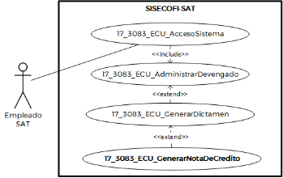
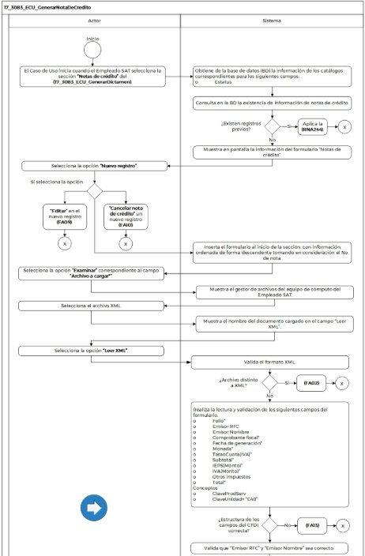
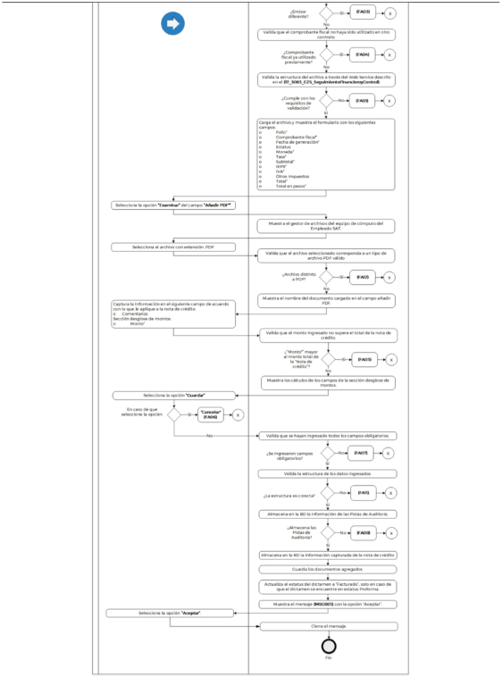

**Administración General de Comunicaciones **

**y Tecnologías de la Información**

**Marco Documental 7.0**
|Fecha de aprobación del Template: 02/08/2023|**Especificación del Caso de Uso** 17\_3083\_ECU\_GenerarNotaDeCredito.docx** |Versión del template: 7.00|
| :-: | :- | :-: |

` `**<ID Requerimiento>**8309** 

**Nombre del Requerimiento:** TI\_SISECOFI-SAT\_Seguimiento financiero y control documental de proyectos de contratación** 

**Tabla de Versiones y Modificaciones** 

|Versión |Descripción del cambio |Responsable de la Versión |Fecha |
| - | - | :-: | - |
|*1* |*Creación del documento* |Angel Horacio López Alcaraz |*01/03/2024* |
|*1.1* |*Revisión del documento* |Luis Angel Olguin Castillo |*16/04/2024* |
|*1.2* |*Revisión del documento* |Andrés Mojica Vázquez |*18/06/2024* |

**Tabla de Contenido** 

[17_3083_ECU_GenerarNotaDeCredito ................................................................................................. 2 ](#_page1_x82.00_y132.92)

1. [Descripción ........................................................................................................................................................ 2 ](#_page1_x102.00_y148.92)
1. [Diagrama del Caso de Uso ...................................................................................................................... 2 ](#_page1_x102.00_y225.92)
1. [Actores ................................................................................................................................................................. 2 ](#_page1_x102.00_y442.92)
1. [Precondiciones............................................................................................................................................... 2 ](#_page1_x102.00_y577.92)
1. [Post condiciones ........................................................................................................................................... 3 ](#_page2_x102.00_y195.92)
1. [Flujo primario .................................................................................................................................................. 3 ](#_page2_x102.00_y297.92)
7. [Flujos alternos .................................................................................................................................................8 ](#_page7_x102.00_y466.92)
7. [Referencias cruzadas................................................................................................................................ 16 ](#_page15_x102.00_y230.92)
7. [Mensajes ........................................................................................................................................................... 16 ](#_page15_x102.00_y333.92)
7. [Requerimientos No Funcionales .................................................................................................... 17 ](#_page16_x102.00_y158.92)
7. [Diagrama de actividad ........................................................................................................................... 19 ](#_page18_x102.00_y145.92)
7. [Diagrama de estados ............................................................................................................................. 20 ](#_page19_x102.00_y711.92)
7. [Aprobación del cliente ........................................................................................................................... 21 ](#_page20_x102.00_y158.92)

|Fecha de aprobación del Template: 02/08/2023|**Especificación del Caso de Uso** 17\_3083\_ECU\_GenerarNotaDeCredito.docx** |Versión del template: 7.00|
| :-: | :- | :-: |

17\_3083\_ECU\_GenerarNotaDeCredito 

1. **Descripción  **

El objetivo de este Caso de Uso es permitir al Empleado SAT generar el registro de notas de crédito. 

2. **Diagrama del Caso de Uso **

3. **Actores  **

|**Actor** |**Descripción** |
| - | - |
|**Empleado SAT** |El Empleado SAT es el que tiene el o los roles otorgados por la  Administración  Central  de  Seguridad,  Monitoreo  y Control (ACSMC) para ingresar a cada uno de los módulos de este sistema. |

4. **Precondiciones** 
- El Empleado SAT se ha autenticado en el sistema con e.firma válida. 
- El sistema ha consumido el servicio “Oauth” para obtener los datos del Empleado SAT que ingresa. 
- El sistema ha validado que el Empleado SAT  cuenta con los roles para ingresar a la sección “Notas de crédito” del módulo “Consumo de Servicios”. 
- El  Empleado  SAT  ha  ingresado  a  un  dictamen  de  acuerdo  con  el **(17\_3083\_ECU\_GenerarDictamen)**. 
- El Empleado SAT ha seleccionado alguna de las siguientes opciones: Editar dictamen  y  Ver  dictamen  en  el  módulo  “Consumo  de  Servicios” relacionados a un contrato. 
- El Empleado SAT ha seleccionado una opción en el campo Convenio de Colaboración del contrato. 

|Fecha de aprobación del Template: 02/08/2023|**Especificación del Caso de Uso** 17\_3083\_ECU\_GenerarNotaDeCredito.docx** |Versión del template: 7.00|
| :-: | :- | :-: |

- El sistema ha validado que se cuenta con los Web Service activos para ![ref1]realizar la validación de las notas de crédito. 
- El empleado SAT ha registrado la plantilla activa de verificación para la carga de documentos en la sección documental. 
5. **Post condiciones  **
- El Empleado SAT pudo generar una nueva nota de crédito relacionada a un dictamen. 
- El Empleado SAT pudo editar la información de una o más notas de crédito. 
- El Empleado SAT pudo cancelar una o más notas de crédito. 
6. **Flujo primario** 

|**Actor** |**Sistema** ||||
| - | - | :- | :- | :- |
|
1\.  El  Caso  de  Uso  inicia  cuando  el Empleado  SAT  selecciona  la sección  **“Notas  de  crédito”**  del **(17\_3083\_ECU\_GenerarDictamen)**. 

￿  En caso de haber seleccionado 

la opción “Ver dictamen” en el módulo  “Consumo  de Servicios”,  aplica  la  regla  de negocio **(RNA167)**. 
|
2\.  Obtiene de la base de datos (BD) la 

información  de  los  catálogos correspondientes  para  los siguientes campos conforme a la **(RNA01)** y **(RNA83)**: 

o  Estatus 
||||
||
3\.  Consulta en la BD la existencia de 

información de notas de crédito. 

￿  En  caso  de  no  encontrar 

registros, aplica la **(RNA244)**. 
||||
||
4\.  Muestra en pantalla la información 

del formulario “Notas de crédito”, conforme a las **(RNA87)**, **(RNA51)**, **(RNA142)**  y  **(RNA143)**  con  los siguientes campos:** 

Opciones: 

- Nuevo registro 

- Editar 

- Cancelar nota de crédito 
||||
|Fecha de aprobación del Template: 02/08/2023|**Especificación del Caso de Uso** 17\_3083\_ECU\_GenerarNotaDeCredito.docx** |Versión del template: 7.00|||

||
Formulario 

- N° (Id nota de crédito) 

- Archivo a cargar\* 

- Añadir PDF\* 

Opciones: 

- Examinar, del campo “Archivo a cargar”. 

- Leer XML\* 

- Examinar,  del  campo  “Añadir PDF”. 

- Folio\* 

- Comprobante fiscal\* 

- Fecha de generación\* 

- Estatus 

- Moneda\* 

- Tasa\* 

- Subtotal\* 

- IEPS\* 

- IVA\* 

- Otros impuestos 

- Total\* 

- Total en pesos\* 

- Comentarios 

Desglose  de  montos.  Aplica  la **(RNA144)**. 

- % SAT\* 

- Monto\* 

- Monto en pesos\* 

- % Convenio de colaboración\* 

- Monto 

- Monto en pesos 

Opciones: 

- Cancelar (habilitado). Aplica la **(RNA246)** 

- Guardar. Aplica la **(RNA246)**. 

Ver **(17\_3083\_EIU\_GenerarNotaDeCre dito)** Estilos 01. 
|
| :- | - |
|
5.  Selecciona  la  opción  **“Nuevo** 

**registro”** y el flujo continúa. 
|
6\.  Inserta el formulario al inicio de la 

sección, con información ordenada de  forma  descendente  tomando en consideración el No. de nota. 
|

|Fecha de aprobación del Template: 02/08/2023|**Especificación del Caso de Uso** 17\_3083\_ECU\_GenerarNotaDeCredito.docx** |Versión del template: 7.00|
| :-: | :- | :-: |

|
- Si selecciona la opción **“Editar”** en el nuevo registro, continúa en el [**(FA09)**](#_page11_x102.00_y145.92). 

- Si  selecciona  la  opción **“Cancelar nota de crédito”** un nuevo registro, continúa en el [**(FA10)**](#_page12_x102.00_y429.92). 
||
| - | :- |
|
7.  Selecciona  la  opción  **“Examinar”** 

correspondiente  al  campo **“Archivo a cargar\*”**. 
|
8\.  Muestra el gestor de archivos del 

equipo de cómputo del Empleado SAT. 
|
|9\.  Selecciona el archivo XML. |
10\.  Muestra el nombre del documento 

cargado en el campo “Leer XML”. 
|
|11\.  Selecciona la opción **“Leer XML”**. |
12.  Valida el formato XML. 

￿  En caso de haber seleccionado 

un  tipo  de  archivo  distinto, continúa en el **[**(FA02)**](#_page8_x102.00_y133.92)**. 
|
||
13\.  Realiza la lectura y validación de los 

siguientes campos del formulario, conforme a la **(RNA145)**. 

- Folio\* 

- Emisor RFC 

- Emisor Nombre 

- Comprobante fiscal\* 

- Fecha de generación\* 

- Moneda\* 

- TasaoCuota(IVA)\* 

- Subtotal\* 

- IEPS(Monto)\* 

- IVA(Monto)\* 

- Otros impuestos 

- Total\* 

Conceptos 

- ClaveProdServ 

- ClaveUnidad= “E48” 

￿  En caso de que la estructura de los  campos  del  CFDI  no  sea correcta, continúa en el [**(FA13)**](#_page14_x102.00_y620.92). 
|
||
14\.  Valida que “Emisor RFC” y “Emisor 

Nombre”  sean  correctos  y correspondan  al  proveedor registrado. 
|

|Fecha de aprobación del Template: 02/08/2023|**Especificación del Caso de Uso** 17\_3083\_ECU\_GenerarNotaDeCredito.docx** |Versión del template: 7.00|
| :-: | :- | :-: |

||
￿  En  caso  de  ser  diferente, 

continúa en el [**(FA03)**](#_page8_x102.00_y353.92). 
|
| :- | - |
||
15\.  Valida  que  el  comprobante  fiscal 

no  haya  sido  utilizado  en  otro contrato. 

￿  En  caso  de  ser  un 

comprobante  ya  utilizado, continúa en el [**(FA04)**](#_page8_x102.00_y582.92). 
|
||
16\.  Valida  la  estructura  del  archivo  a 

través del Web Service descrito en el **(17\_3083\_EZS\_SeguimientoFinan cieroyControl)**. 

￿  En caso de que el archivo no 

cumpla con los requerimientos de  validación,  continúa  en  el [**(FA01)**](#_page7_x102.00_y506.92). 
|
||
17\.  Carga  el  archivo  y  muestra  el 

formulario  con  los  siguientes campos: 

- Folio\* 

- Comprobante fiscal\* 

- Fecha de generación\* 

- Estatus 

- Moneda\* 

- Tasa\* 

- Subtotal\* 

- IEPS\* 

- IVA\* 

- Otros impuestos 

- Total\* 

- Total  en  pesos\*.  Aplica  la **(RNA261)**. 
|
|
18.  Selecciona  la  opción  **“Examinar”** 

para  cargar  el  documento  PDF, correspondiente al campo **“Añadir PDF\*”**. 
|
19\.  Muestra el gestor de archivos del 

equipo de cómputo del Empleado SAT. 
|
|
20\. Selecciona el archivo con extensión 

.PDF. 
|
21\.  Valida que el archivo seleccionado 

corresponda a un tipo de archivo PDF válido. 

￿  En caso de haber seleccionado 

un  tipo  de  archivo  distinto  a PDF, continúa en el [**(FA12)**](#_page14_x102.00_y363.92). 
|

|Fecha de aprobación del Template: 02/08/2023|**Especificación del Caso de Uso** 17\_3083\_ECU\_GenerarNotaDeCredito.docx** |Versión del template: 7.00|
| :-: | :- | :-: |

||
22\. Muestra el nombre del documento 

cargado en el campo añadir PDF. 
|
| :- | - |
|
23. Captura  la  información  en  el 

siguiente campo de acuerdo con lo que le aplique a la nota de crédito: 

- Comentarios 

Sección desglose de montos: 

- Monto\* 
|
24\. Valida que el monto ingresado no 

supere  el  total  de  la  nota  de crédito. 

￿  En caso de haber ingresado un 

“Monto\*” mayor al monto total de  la  “Nota  de  crédito”, continúa en el [**(FA05)**](#_page9_x102.00_y145.92). 
|
||
25\. Muestra los cálculos de los campos 

de la sección desglose de montos. Aplica la **(RNA144)**. 
|
|
26\. Selecciona la opción **“Guardar”** y el 

flujo continúa. 

￿  En  caso  de  que  seleccione  la 

opción **“Cancelar”**, continúa en el **[**(FA06)**](#_page9_x102.00_y377.92)**. 
|
27\. Valida  que  se  hayan  ingresado 

todos  los  campos  obligatorios, conforme a las **(RNA03)**. 

￿  En caso de no haber ingresado 

todos los campos obligatorios de la nota de crédito, continúa en el [**(FA07)**](#_page10_x102.00_y133.92). 
|
||
28\. Valida  la  estructura  de  los  datos 

ingresados  en  los  campos  de acuerdo con la **(RNA255)**. 

￿  En caso de que la estructura de 

los  datos  ingresados  sea incorrecta,  continúa  en  el [**(FA11)**](#_page14_x102.00_y133.92). 
|
||
29\. Almacena en la BD la información 

de las Pistas de Auditoría. 

Datos que se almacenan: 

**Módulo**= Dictamen- NC 

**Fecha y Hora**= Fecha y hora del sistema,  usando  el  formato DD/MM/AAAA HH:MM:SS 

**RFC  Usuario**=  RFC  largo  del Empleado  SAT  que  ingresó  al sistema. 

**Tipo  de  movimiento**=  **INSR** (Insertar) y/o **UPDT** (Modificar) 

**Movimiento**=  Aplica  la **(RNA239)** 

- Id de Dictamen 

- Folio  de  la  Nota  de crédito 
|

|Fecha de aprobación del Template: 02/08/2023|**Especificación del Caso de Uso** 17\_3083\_ECU\_GenerarNotaDeCredito.docx** |Versión del template: 7.00|
| :-: | :- | :-: |

||
-  Comprobante fiscal 

￿  En caso de que no se puedan 

almacenar  las  Pistas  de Auditoría,  continúa  en  el [**(FA08)**](#_page10_x102.00_y375.92). 
|
| :- | - |
||
30\. Almacena en la BD la información 

capturada  de  la  nota  de  crédito. Aplica la **(RNA247)**. 
|
||
31\.  Guarda los documentos agregados 

aplicando la **(RNA38)** y **(RNA146)**. 
|
||
32\. Actualiza el estatus del dictamen a 

“Facturado”, solo en caso de que el dictamen se encuentre en estatus “Proforma”. 
|
||
33\. Muestra el [**(MSG001)**](#_page15_x108.00_y394.92) con la opción 

“Aceptar”. 
|
|34\. Selecciona la opción **“Aceptar”**. |35\. Cierra el mensaje. |
||36\. Fin del Caso de Uso. |

7. **Flujos alternos  **

**FA01 Valida nota de crédito a través del WS **

|**Actor** |**Sistema** |
| - | - |
||
1\.  El  **FA01**  inicia  cuando  el  sistema 

identifica que la nota de crédito no cuenta con estatus valido. 
|
||
2\.  Muestra el [**(MSG016)**](#_page15_x108.00_y753.92) con la opción 

“Aceptar”. 
|
|3\.  Selecciona la opción **“Aceptar”**. |4\.  Cierra el mensaje. |
||5\.  Fin del Caso de Uso. |

|Fecha de aprobación del Template: 02/08/2023|**Especificación del Caso de Uso** 17\_3083\_ECU\_GenerarNotaDeCredito.docx** |Versión del template: 7.00|
| :-: | :- | :-: |

**FA02 Formato XML no válido ![ref1]**

|**Actor** |**Sistema** |
| - | - |
||
1\.  El  **FA02**  inicia  cuando  el  sistema 

identifica que se seleccionó un tipo de archivo no válido. 
|
||
2\.  Muestra el mensaje [**(MSG005)**](#_page15_x108.00_y484.92) con 

la opción “Aceptar”. 
|
|3\.  Selecciona la opción **“Aceptar”**. |4\.  Cierra el mensaje. |
||
5\.  Regresa  al  paso [` `**7** ](#_page4_x108.00_y247.92) del  Flujo 

primario. 
|

**FA03 Validación incorrecta del RFC del proveedor** 

|**Actor** |**Sistema** |
| - | - |
||
1\.  El  **FA03**  inicia  cuando  el  sistema 

valida  que  el  “Emisor  RFC”  y “Emisor Nombre” que contiene el XML, no corresponde al proveedor registrado. 
|
||
2\.  Muestra el [**(MSG007)**](#_page15_x108.00_y534.92) con la opción 

“Aceptar”. 
|
|3\.  Selecciona la opción **“Aceptar”**. |4\.  Cierra el mensaje. |
||
5\.  Regresa  al  paso [` `**7** ](#_page4_x108.00_y247.92) del  Flujo 

primario. 
|

**FA04 El comprobante fiscal ya ha sido utilizado en otro contrato **

|**Actor** |**Sistema** |
| - | - |
||
1\.  El  **FA04**  inicia  cuando  el  sistema 

valida que el Comprobante fiscal” y “Folio”  ya  ha  sido  utilizado previamente en otro contrato. 
|
||
2\.  Muestra el [**(MSG006)**](#_page15_x108.00_y509.92) con la opción 

“Aceptar”. 
|
|3\.  Selecciona la opción **“Aceptar”**. |4\.  Cierra el mensaje. |
||
5\.  Regresa  al  paso [` `**7** ](#_page4_x108.00_y247.92) del  Flujo 

primario. 
|

|Fecha de aprobación del Template: 02/08/2023|**Especificación del Caso de Uso** 17\_3083\_ECU\_GenerarNotaDeCredito.docx** |Versión del template: 7.00|
| :-: | :- | :-: |

**FA05 El Monto ingresado es mayor al monto total de la nota de crédito** 

|**Actor** |**Sistema** |
| - | - |
||
1\.  El  **FA05**  inicia  cuando  el  sistema 

valida que el “Monto\*” ingresado es superior al monto total de la “Nota de crédito”. 
|
||
2\.  Muestra el [**(MSG010)**](#_page15_x108.00_y605.92) con la opción 

“Aceptar”. 
|
|3\.  Selecciona la opción **“Aceptar”**. |4\.  Cierra el mensaje. |
||
5\.  Regresa  al  paso [` `**23** ](#_page6_x108.00_y170.92) del  Flujo 

primario. 
|

**FA06 Selecciona la opción “Cancelar” del formulario de la nota de crédito **

|**Actor** |**Sistema** |
| - | - |
|
1\.  El **FA06** inicia cuando el Empleado 

SAT  selecciona  la  opción **“Cancelar”**  del  formulario  **“Notas de crédito”**. 
|
2\.  Muestra  el  **[**(MSG008)**](#_page15_x108.00_y557.92)**  con**  las 

opciones “Sí” y “No”. 
|
|
3\.  Selecciona  la  opción  **“Sí**”,  y 

continúa en el pas[o **5** ](#_page9_x311.00_y555.92)de este flujo. 

￿  Si  selecciona  la  opción  **“No”**, 

continúa en el paso [**4** ](#_page9_x311.00_y481.92)de este flujo. 
|
4\.  Cierra la ventana emergente y no 

realiza ninguna acción,  regresa al paso donde se invocó. 
|
||5.  Cierra el mensaje |
||
6\.  Regresa  los  campos  a  la  forma 

inicial. 

- En  caso  de  ser  un  registro nuevo, elimina el formulario. 

- En  caso  de  ser  una  edición restablece los campos iniciales. 
|
||
7\.  Regresa  al  paso [` `**5** ](#_page3_x108.00_y694.92) del  Flujo 

primario. 
|

|Fecha de aprobación del Template: 02/08/2023|**Especificación del Caso de Uso** 17\_3083\_ECU\_GenerarNotaDeCredito.docx** |Versión del template: 7.00|
| :-: | :- | :-: |

**FA07 No se ingresaron todos los datos obligatorios ![ref1]**

|**Actor** |**Sistema** |
| - | - |
||
1\.  El  **FA07**  inicia  cuando  el  sistema 

identifica  que  no  se  ingresaron todos  los  datos  obligatorios  en  el formulario “Notas de crédito”. 
|
||
2\.  Muestra  en  rojo  los  campos 

pendientes de capturar. 
|
||
3\.  Muestra el [**(MSG009)**](#_page15_x108.00_y580.92) con la opción 

“Aceptar”. 
|
|4\.  Selecciona la opción **“Aceptar”**. |5\.  Cierra el mensaje. |
||
6\.  Regresa  al  paso [` `**23** ](#_page6_x108.00_y170.92) del  Flujo 

primario. 
|

**FA08 No se pueden almacenar las Pistas de Auditoría **

|**Actor** |**Sistema** |
| - | - |
||
1\.  El **FA08** inicia cuando interviene un 

evento  ajeno  y  no  se  pueden almacenar las Pistas de Auditoría. 
|
||
2\.  Cancela la operación sin completar 

el  movimiento  que  estaba  en proceso. 
|
||
3\.  Muestra el mensaje informativo de 

acuerdo con lo siguiente: 

- Si la pista de auditoría es por el tipo  de  movimiento  **UPDT**  e **INSR**, se muestra el [**(MSG011)**](#_page15_x108.00_y630.92). 

- Si la pista de auditoría es por el tipo  de  movimiento  **CNST**,  se muestra el [**(MSG012)**](#_page15_x108.00_y655.92). 

Cada  mensaje  se  muestra  con  la opción “Aceptar”. 
|
|4\.  Selecciona la opción **“Aceptar”**. |5\.  Cierra el mensaje. |
||
6\.  Regresa al paso previo que detona 

la acción de la pista de auditoría. 
|

|Fecha de aprobación del Template: 02/08/2023|**Especificación del Caso de Uso** 17\_3083\_ECU\_GenerarNotaDeCredito.docx** |Versión del template: 7.00|
| :-: | :- | :-: |

**FA09 Selecciona la opción “Editar” la información de una nota de crédito **

|**Actor** |**Sistema** ||||
| - | - | :- | :- | :- |
|
1\.  El **FA09** inicia cuando el Empleado 

SAT selecciona la opción **“Editar”** el registro de una **“Nota de crédito”**. 
|
2\.  Muestra el formulario de la “Nota 

de  crédito”  conforme  a  las **(RNA87)**, **(RNA51)**, **(RNA142)** con los siguientes datos: 

Formulario 

- N°  

- Archivo a cargar\* 

- Añadir PDF\* 

Opciones: 

- Examinar, del campo Archivo a cargar. 

- Leer XML  

- Examinar,  del  campo  añadir PDF. 

- Folio\* 

- Comprobante fiscal\* 

- Fecha de generación\* 

- Estatus 

- Moneda\* 

- Tasa\* 

- Subtotal\* 

- IEPS\* 

- IVA\* 

- Otros impuestos 

- Total\* 

- Total en pesos\* 

- Comentarios 

Desglose  de  montos.  Aplica  la **(RNA144)** 

- %SAT  

- Monto\*  

- Monto en pesos\*  

- % Convenio de colaboración  

- Monto\*  

- Monto en pesos\* 

Opciones: 

- Cancelar. Aplica la **(RNA246)**. 

- Guardar. Aplica la **(RNA246)**. 
||||
|Fecha de aprobación del Template: 02/08/2023|**Especificación del Caso de Uso** 17\_3083\_ECU\_GenerarNotaDeCredito.docx** |Versión del template: 7.00|||

Ver **(17\_3083\_EIU\_GenerarNotaDeCre dito)** Estilos 01. 

3\.  Actualiza  el  XML  de  la  **“Nota  de**  4.  Muestra  el  **[**(MSG002)**](#_page15_x108.00_y415.92)**  con  las 

**crédito”**  y  selecciona  la  opción  opciones “Si” y “No”. 

**“Leer XML”**. 

- En caso de no actualizar el XML regresa  al  paso [` `**7** ](#_page4_x108.00_y247.92) del  flujo primario. 

5\.  Selecciona  la  opción  **“No”**  y  6.  Cierra el mensaje y regresa al paso 

continúa en el pas[o **6** ](#_page12_x311.00_y281.92)de este flujo. [` `**7** ](#_page4_x108.00_y247.92)del flujo primario. 

- En  caso  de  seleccionar  la opción **“Si”** continúa en el paso [**7** ](#_page12_x311.00_y367.92)de este flujo. 

7.  Cierra el mensaje y regresa al paso 

[**12** ](#_page4_x311.00_y321.92)del Flujo primario. 

**FA10 Cancelar una nota de crédito  **

|**Actor** |**Sistema** |
| - | - |
|
1\.  El **FA10** inicia cuando el Empleado 

SAT selecciona la opción **“Cancelar nota de crédito”**. 
|
2\.  Muestra  el  **[**(MSG003)**](#_page15_x108.00_y438.92)**  con  las 

opciones “Sí” y “No”. 
|
|
3\.  Selecciona  la  opción  **“Si”**  y 

continúa en el paso [**5** ](#_page12_x311.00_y619.92)del presente flujo. 

￿  Si  selecciona  la  opción  **“No”**, 

continúa  en  el  paso [` `**4** ](#_page12_x311.00_y521.92) de  este flujo. 
|4\.  Cierra  la  ventana  emergente  y regresa al pas[o **5** ](#_page3_x108.00_y694.92)del** Flujo primario. |
||
5.  Muestra  la  ventana  emergente 

“Justificación”  con  las  siguientes opciones: 

- Justificación 

Opciones: 

- Aceptar 

- Cerrar 
|

|Fecha de aprobación del Template: 02/08/2023|**Especificación del Caso de Uso** 17\_3083\_ECU\_GenerarNotaDeCredito.docx** |Versión del template: 7.00|
| :-: | :- | :-: |

||Ver **(17\_3083\_EIU\_GenerarNotaDeCre dito)** Estilos 02. |
| :- | :- |
|
6\.  Agrega  la  justificación  de  la 

cancelación de la nota de crédito. 
||
|
7\.  Selecciona  la  opción  la  opción 

**“Aceptar”** y el flujo continúa. 

￿  En  caso  de  que  seleccione  la 

opción **“Cerrar”**, regresa al paso [**5** ](#_page3_x108.00_y694.92)del Flujo primario. 
|
8\.  Almacena en la BD la información 

de las Pistas de Auditoría. 

Datos que se almacenan: 

**Módulo**= Dictamen-NC 

**Fecha y Hora**= Fecha y hora del sistema,  usando  el  formato DD/MM/AAAA HH:MM:SS 

**RFC  Usuario**=  RFC  largo  del Empleado  SAT  que  ingresó  al sistema. 

**Tipo  de  movimiento**=  **UPDT** (Modificar) 

**Movimiento**=  Aplica  la **(RNA239)** 

- Id de Dictamen 

- Folio  de  la  Nota  de crédito 

- Comprobante fiscal 

- Estatus= Cancelado 

￿  En  caso  de  que  no  se  puedan almacenar  las  Pistas  de Auditoría, continúa en el [**(FA08)**](#_page10_x102.00_y375.92). 
|
||
9\.  Actualiza el estatus de la “Nota de 

crédito” a “Cancelado” y muestra la información  de  la  nota  en  modo lectura. Aplica la **(RNA247)**. 
|
||
10\.  Concatena  el  texto  “Motivo  de 

cancelación:”,  la  justificación previamente capturada, el carácter pipe (|) y los “Comentarios”, en el campo “Comentarios”. 
|
||
11\.  Muestra el [**(MSG004)**](#_page15_x108.00_y461.92)** con la opción 

“Aceptar”. 
|
|12\.  Selecciona la opción **“Aceptar”**. |13\.  Cierra el mensaje. |
||14\.  Recarga la pantalla. |
||15\.  Fin del Caso de Uso.  |

|Fecha de aprobación del Template: 02/08/2023|**Especificación del Caso de Uso** 17\_3083\_ECU\_GenerarNotaDeCredito.docx** |Versión del template: 7.00|
| :-: | :- | :-: |

**FA11 La estructura de los datos ingresados es incorrecta ![ref1]**

|**Actor** |**Sistema** |
| - | - |
||
1\.  El  **FA11**  inicia  cuando  el  sistema 

identifica que la estructura de los datos ingresados es incorrecta.  
|
||
2\.  Muestra  en  rojo  los  campos  con 

estructura incorrecta. 
|
||
3\.  Muestra el [**(MSG014)**](#_page15_x108.00_y705.92) con la opción 

“Aceptar”. 
|
|4\.  Selecciona la opción **“Aceptar”**. |5\.  Cierra el mensaje. |
||
6\.  Regresa  al  paso [` `**23** ](#_page6_x108.00_y170.92) del  Flujo 

primario. 
|

**FA12 Formato PDF no válido** 

|**Actor** |**Sistema** |
| - | - |
||
1\.  El  **FA12**  inicia  cuando  el  sistema 

identifica  que  el  formato  del archivo  PDF  cargado  no  es correcto. 
|
||
2\.  Muestra el [**(MSG013)**](#_page15_x108.00_y680.92) con la opción 

“Aceptar”. 
|
|3\.  Selecciona la opción **“Aceptar”**. |4\.  Cierra el mensaje. |
||
5\.  Realiza lo siguiente: 

￿  Regresa  al  paso [` `**18** ](#_page5_x108.00_y627.92) del  Flujo 

primario. 
|

**FA13 Validación de campos CFDI incorrecta **

|**Actor** |**Sistema** |
| - | - |
||
1\.  El  **FA13**  inicia  cuando  el  sistema 

identifica que la estructura de los campos  del  CFDI  ingresados  es incorrecta. 
|
||
2\.  Muestra el [**(MSG015)**](#_page15_x108.00_y730.92) con la opción 

“Aceptar”. 
|

|Fecha de aprobación del Template: 02/08/2023|**Especificación del Caso de Uso** 17\_3083\_ECU\_GenerarNotaDeCredito.docx** |Versión del template: 7.00|
| :-: | :- | :-: |

3\.  Selecciona la opción **“Aceptar”**.  4.  Cierra el mensaje. 

5\.  Regresa  al  paso [` `**7** ](#_page4_x108.00_y247.92) del  Flujo 

primario.  

8. **Referencias cruzadas  **
- 17\_3083\_CRN\_SeguimientoFinancieroYControl. 
- 17\_3083\_EZS\_SeguimientoFinancieroyControl. 
- 17\_3083\_EIU\_GenerarNotaDeCredito. 
- 17\_3083\_ECU\_GenerarDictamen. 
9. **Mensajes  **

|**ID Mensaje** |**Descripción** |
| - | - |
|**MSG001** |La nota de crédito se registró exitosamente. |
|**MSG002** |¿Está seguro de actualizar el XML de la nota de crédito? |
|**MSG003** |La  nota  de  crédito  se  cancelará  y  no  se  podrá  modificar  la información posteriormente. ¿Desea continuar? |
|**MSG004** |La nota de crédito ha sido cancelada exitosamente. |
|**MSG005** |El tipo de archivo seleccionado no es un archivo válido, favor de verificarlo y seleccionar un archivo con extensión XML. |
|**MSG006** |El comprobante fiscal del archivo seleccionado ya fue utilizado previamente, favor de verificarlo. |
|**MSG007** |El comprobante fiscal no corresponde al RFC y/o razón social del proveedor del contrato-dictamen, favor de verificarlo. |
|**MSG008** |Se perderá la información no guardada, ¿Desea continuar? |
|**MSG009** |No se ingresaron todos los campos obligatorios en el formulario, favor de verificarlo. |
|**MSG010** |El  monto  ingresado  es  superior  al  monto  total  de  la  nota  de crédito, favor de verificarlo. |
|**MSG011** |Ocurrió  un  error  al  guardar  el  registro,  favor  de  intentar nuevamente (PA01). |
|**MSG012** |Ocurrió un error al  consultar la información, favor de intentar nuevamente (PA01). |
|**MSG013** |La extensión del archivo no es correcta. Favor de verificar y cargar archivo con extensión PDF. |
|**MSG014** |La  estructura  de  la  información  es  incorrecta.  Intente nuevamente.|
|**MSG015** |La estructura de los datos no es correcta de acuerdo al anexo 20, favor de validar. |
|**MSG016** |Mensaje de rechazo. |

|Fecha de aprobación del Template: 02/08/2023|**Especificación del Caso de Uso** 17\_3083\_ECU\_GenerarNotaDeCredito.docx** |Versión del template: 7.00|
| :-: | :- | :-: |

10. **Requerimientos No Funcionales  ![ref2]**

|**ID de RNF** |**Requerimiento No Funcional** |**Descripción** |||
| - | :-: | - | :- | :- |
|**RNF001** |Disponibilidad |El sistema deberá estar activo las 24 horas del día, los 365 días del año con picos de operación en el horario de 9:00 a 18:00 horas. |||
|**RNF002** |Concurrencia |
El número de Empleados SAT que puede tener el sistema son 150.  

El número de accesos concurrentes que debe soportar  este  sistema  son  máximo  30 Empleados SAT. 
|||
|**RNF003** |Seguridad |El  acceso  solo  podrá  ser  otorgado  a  todo Empleado SAT que tenga los roles  asignados por  la  Administración  Central  de  Seguridad, Monitoreo y Control (ACSMC) para cada módulo de este sistema. |||
|**RNF004** |Usabilidad |
El  sistema  deberá  manejar  los  siguientes elementos para facilitar la navegación:  

- Mensajes  tipo  flotantes  (*tooltips*)  con información de la herramienta que ofrece ayuda  contextual,  como  guía  para  el Empleado SAT.   

- Componente  de  ordenamiento  que permita  acomodar  la  información  de  la tabla  de  forma  ascendente  o descendente,  considerando  la  columna donde es seleccionado. 

￿ 

Contar  con  un  diseño  responsivo  que permita  su  óptima  visualización  en distintos tipos de dispositivos finales. 
|||
|**RNF005** |Eficiencia |Las  consultas  se  dividen  en  generales  y detalladas, para que las detalladas carguen la información solo cuando sean requeridas por el Empleado SAT. |||
|**RNF006** |Usabilidad |
El Empleado SAT podrá navegar a través de las páginas resultantes de la consulta considerando que  el  sistema  debe  mostrar  inicialmente  15 registros por página, permitiendo al Empleado SAT  seleccionar  los  registros  que  requiere visualizar, teniendo las opciones 15, 50 y 100: 

￿  Ir a la primera página (debe mostrar la 

primera  página  con  el  resultado  de  la consulta). 
|||
|Fecha de aprobación del Template: 02/08/2023|**Especificación del Caso de Uso** 17\_3083\_ECU\_GenerarNotaDeCredito.docx** |Versión del template: 7.00|||

|||
- Ir  a  la  última  página  (debe  mostrar  la última  página  con  el  resultado  de  la consulta). 

- Ir a la siguiente página (debe mostrar la siguiente página, considerando la página actual, con el resultado de la consulta y el número de registros seleccionados por el Empleado SAT). 

- Ir a la página anterior (debe mostrar la página  anterior  considerando  la  actual con el resultado de la consulta).   

En  la  tabla  deben  mostrarse  los  registros ordenados alfabéticamente.  
|
| :- | :- | - |
|**RNF007** |Seguridad |Las Pistas de Auditoría deben estar protegidas contra  accesos  no  autorizados.  Solo  los Empleados  SAT  autorizados  pueden consultarlas, y la información en ellas se definirá durante la etapa de diseño, la cual debe estar cifrada  para  mantenerla  confidencial  y  evitar exposiciones no autorizadas.  |
|**RNF008** |Fiabilidad|El  sistema  debe  ser  capaz  de  manejar excepciones  de  manera  efectiva  y  presentar mensajes  claros  y  comprensibles  para garantizar  una  adecuada  interacción  con  el sistema.  |
|**RNF009** |Seguridad |Se debe mantener la información en pantalla en  caso  de  un  error  al  guardar  las  Pistas  de Auditoría,  siempre  y  cuando  el  escenario  lo permita.  Hay situaciones de infraestructura o de conexión de internet que sí pierde los datos ya que no están controlados por el sistema. |
|**RNF010** |Integridad |Al almacenar la información en la BD de tipo Texto  o  alfanumérico  se  deben  eliminar  los espacios en blanco al inicio y fin de la cadena |

|Fecha de aprobación del Template: 02/08/2023|**Especificación del Caso de Uso** 17\_3083\_ECU\_GenerarNotaDeCredito.docx** |Versión del template: 7.00|
| :-: | :- | :-: |

11. **Diagrama de actividad**  

|Fecha de aprobación del Template: 02/08/2023|**Especificación del Caso de Uso** 17\_3083\_ECU\_GenerarNotaDeCredito.docx** |Versión del template: 7.00|
| :-: | :- | :-: |

12. **Diagrama de estados**  

No Aplica, no hay cambios de estados ni transiciones. 

|Fecha de aprobación del Template: 02/08/2023|**Especificación del Caso de Uso** 17\_3083\_ECU\_GenerarNotaDeCredito.docx** |Versión del template: 7.00|
| :-: | :- | :-: |

13. **Aprobación del cliente  ![ref2]**

|||||
| :- | :- | :- | :- |
|**FIRMAS DE CONFORMIDAD**  ||||
|||||
|**Firma 1**   |**Firma 2**   |||
|**Nombre**: Andrés Mojica Vázquez |**Nombre**: Ricardo Chávez Gutiérrez |||
|**Puesto**: Usuario ACPPI.  |**Puesto**: Usuario ACPPI.  |||
|**Fecha:**  |**Fecha:**  |||
|||||
|**Firma 3**   |**Firma 4**  |||
|**Nombre**: Yesenia Helvetia Delgado Naranjo.  |
` `**Nombre**:**  Alejandro  Alfredo  Muñoz

Núñez.  
|||
|**Puesto**: APE ACPPI.  |**Puesto:** RAPE ACPPI.  |||
|**Fecha**:  |**Fecha**:  |||
|||||
|**Firma 5**  |**Firma 6**  |||
|**Nombre**: Luis Angel Olguin Castillo. |` `**Nombre**: Erick Villa Beltrán.  |||
|**Puesto**: Enlace ACPPI.  |**Puesto**: Líder APE SDMA 6.  |||
|**Fecha**:  |**Fecha**:  |||
|||||
|||||
|**Firma 7** |**Firma 8**  |||
|||||
|**Nombre**:**  Juan  Carlos  Ayuso Bautista.  |
` `**Nombre**: Angel  Horacio  López

Alcaraz. 
|||
|**Puesto**:** Líder Técnico SDMA 6.  |**Puesto**:** Analista de Sistemas SDMA 6. |||
|**Fecha**:  |**Fecha**:  |||
|Fecha de aprobación del Template: 02/08/2023|**Especificación del Caso de Uso** 17\_3083\_ECU\_GenerarNotaDeCredito.docx** |Versión del template: 7.00||

Página 24 de 24 

[ref1]: Aspose.Words.cd9a2c7f-07af-4547-a187-85524fa9304c.008.png
[ref2]: Aspose.Words.cd9a2c7f-07af-4547-a187-85524fa9304c.028.png
