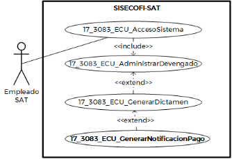

**Administración General de Comunicaciones y Tecnologías de la Información**

**Marco Documental 7.0**
|Fecha de aprobación del Template: 02/08/2023|**Especificación del Caso de Uso** 17\_3083\_ECU\_GenerarNotificacionPago.docx** |Versión del template: 7.00|
| :-: | :- | :-: |

**<ID Requerimiento>** 8309** 

**Nombre  del  Requerimiento:**  TI\_SISECOFI-SAT\_Seguimiento  financiero  y  control documental de proyectos de contratación** 

**Tabla de Versiones y Modificaciones** 

|Versión |Descripción del cambio |Responsable de la Versión |Fecha |
| - | - | :-: | - |
|*1* |*Creación del documento* |Angel Horacio López Alcaraz |*28/03/2024* |
|*1.1* |*Revisión del documento* |Luis Angel Olguin Castillo |*19/04/2024* |
|*1.2* |*Versión aprobada para firma* |Andrés Mojica Vázquez |*18/06/2024* |

**Tabla de Contenido** 

[17_3083_ECU_GenerarNotificacionPago ............................................................................................ 2 ](#_page1_x82.00_y132.92)

1. [Descripción ........................................................................................................................................................ 2 ](#_page1_x102.00_y148.92)
1. [Diagrama del Caso de Uso ...................................................................................................................... 2 ](#_page1_x102.00_y225.92)
1. [Actores ................................................................................................................................................................. 2 ](#_page1_x102.00_y462.92)
1. [Precondiciones............................................................................................................................................... 2 ](#_page1_x102.00_y597.92)
1. [Post condiciones ........................................................................................................................................... 3 ](#_page2_x102.00_y195.92)
1. [Flujo primario .................................................................................................................................................. 3 ](#_page2_x102.00_y347.92)
7. [Flujos alternos ................................................................................................................................................. 7 ](#_page6_x102.00_y543.92)
7. [Referencias cruzadas................................................................................................................................ 17 ](#_page16_x102.00_y295.92)
7. [Mensajes ........................................................................................................................................................... 17 ](#_page16_x102.00_y410.92)
7. [Requerimientos No Funcionales .................................................................................................... 18 ](#_page17_x102.00_y133.92)
7. [Diagrama de actividad .......................................................................................................................... 20 ](#_page19_x102.00_y145.92)
7. [Diagrama de estados ............................................................................................................................. 20 ](#_page19_x102.00_y714.92)
7. [Aprobación del cliente ........................................................................................................................... 21 ](#_page20_x102.00_y133.92)

|Fecha de aprobación del Template: 02/08/2023|**Especificación del Caso de Uso** 17\_3083\_ECU\_GenerarNotificacionPago.docx** |Versión del template: 7.00|
| :-: | :- | :-: |

17\_3083\_ECU\_GenerarNotificacionPago 

1. **Descripción  **

El objetivo de este Caso de Uso es permitir al Empleado SAT generar el registro de una notificación y referencia de pago. 

2. **Diagrama del Caso de Uso **

3. **Actores  **

|**Actor** |**Descripción** |
| - | - |
|**Empleado SAT** |El Empleado SAT cuenta con el o los roles otorgados por la Administración Central de Seguridad, Monitoreo y Control (ACSMC) para ingresar a cada uno de los módulos de este sistema. |

4. **Precondiciones** 
- El Empleado SAT se ha autenticado en el sistema con e.firma válida. 
- El  sistema  ha  consumido  el  servicio  “Oauth”  para  obtener  los  datos  del Empleado SAT que ingresa. 
- El sistema ha validado que el Empleado SAT cuenta con los roles para ingresar a la sección “Solicitud de pago”. 
- El  Empleado  SAT  ha  ingresado  a  un  dictamen  de  acuerdo  con  el **(17\_3083\_ECU\_GenerarDictamen)**. 
- El Empleado SAT ha seleccionado alguna de las siguientes opciones: Editar dictamen y Ver dictamen en el módulo “Consumo de Servicios” relacionados a un contrato. 

|Fecha de aprobación del Template: 02/08/2023|**Especificación del Caso de Uso** 17\_3083\_ECU\_GenerarNotificacionPago.docx** |Versión del template: 7.00|
| :-: | :- | :-: |

- El  Empleado  SAT  ha  seleccionado  una  opción  en  el  campo  Convenio  de ![ref1]Colaboración del contrato. 
- El empleado SAT ha registrado la plantilla activa de verificación para la carga de documentos en la sección documental. 
5. **Post condiciones  **
- El Empleado SAT realizó el registro de la solicitud de pago. 
- El Empleado SAT cargó el documento oficio de solicitud de pago  con las firmas de aceptación correspondientes en formato PDF. 
- El Empleado SAT realizó el registro de la sección de “Referencia de pago”. 
- El  sistema  cambió  el  estatus  de  las  facturas  recibidas  y  del  dictamen  a “Solicitud de pago”. 
- El  sistema  cambió  el  estatus  de  las  facturas  recibidas  y  del  dictamen  a “Pagado”. 
6. **Flujo primario** ![ref2]

|**Actor** |**Sistema** ||||
| - | - | :- | :- | :- |
|
1\.  El  Caso  de  Uso  inicia  cuando  el 

Empleado SAT selecciona la sección **“Solicitud de pago”**. 

￿  En caso de haber seleccionado 

la opción “Ver dictamen” en el módulo “Consumo de Servicios”, aplica  la  regla  de  negocio **(RNA167)**. 
|
2\.  Identifica el rol  del  Empleado  SAT 

que  ingresa  para  mostrar  las opciones  correspondientes.  Aplica las **(RNA142)** y **(RNA87)**. 
||||
||
3\.  Obtiene de la base de datos (BD) la 

información de los catálogos que se usarán en las listas desplegables: 

- Tipo  de  notificación  de pago\* 

- Desglose\* 
||||
||
4\.  Consulta en la BD la existencia de 

información  relacionada  con  la “Solicitud de pago” y/o “Referencia de pago”. 
||||
||
5\.  Muestra en pantalla la información 

del  formulario  “Solicitud  de  pago” conforme a las **(RNA154)** y **(RNA87)** con los siguientes campos:** 
||||
|Fecha de aprobación del Template: 02/08/2023|**Especificación del Caso de Uso** 17\_3083\_ECU\_GenerarNotificacionPago.docx** |Versión del template: 7.00|||

- Oficio de solicitud de pago\*:  
- Fecha de solicitud\*: 
- Generar documento\*: 
- Añadir PDF\*: 

  Opciones 

-  (Generar documento) 
- Examinar 
- Cancelar.  Aplica  la **(RNA246)**. 
- Guardar. Aplica la **(RNA246)**. 
- Solicitud de pago. Aplica la **(RNA51)**. 

  Sección “Referencia de Pago” 

- Tipo  de  notificación  de pago\*: 
- Oficio  de  notificación  de pago\*: 
- Fecha de notificación\*: 

  Facturas. Aplica la **(RNA 154)**. 

- Comprobante fiscal\*: 
- Desglose\*: 
- Folio de ficha de pago\*: 
- Fecha de pago\*: 
- Tipo de cambio pagado\*: 
- Pagado NAFIN\*: 
- Ficha NAFIN\*: 

  Opciones: 

- Examinar 
- Cancelar.  Aplica  la **(RNA246)**. 
- Guardar. Aplica la **(RNA246)**. 
- Pagado. Aplica la **(RNA51)**. 

Ver **(17\_3083\_EIU\_GenerarNotificacion Pago)** Estilos 01. 

6. Si  el  dictamen  se  encuentra  en estatus “Facturado” continúa en el pas[o 7 ](#_page3_x113.00_y726.92)de este flujo. 
- De otro modo, si el dictamen se encuentra en estatus “Solicitud de pago” continúa en el paso [**15** ](#_page5_x113.00_y379.92)del presente flujo. 
7. Ingresa  en  el  campo  **“Oficio  de solicitud  de  pago\*”**  el  dato 

|Fecha de aprobación del Template: 02/08/2023|**Especificación del Caso de Uso** 17\_3083\_ECU\_GenerarNotificacionPago.docx** |Versión del template: 7.00|
| :-: | :- | :-: |

correspondiente  al  número  de  la solicitud de pago. 

8. Ingresa  en  el  campo  **“Fecha  de** 

   **solicitud\*”** el dato correspondiente 

   a la fecha de la solicitud de pago. 

9. Selecciona  la  opción  **“Guardar”**  y  10.  Valida  la  estructura  de  los  datos continúa en el flujo.  ingresados  en  los  campos  de acuerdo con la **(RNA255)** y continúa 
- Si selecciona la opción **“Generar**  en el flujo. 

  **documento”**,  continúa  en  el 

  [**(FA09)**](#_page13_x102.00_y145.92).  ￿  En caso de que la estructura de 

- Si  selecciona  la  opción  los  datos  ingresados  sea **“Cancelar”**,  continúa  en  el  incorrecta,  continúa  en  el [**(FA02)**](#_page7_x102.00_y361.92).  **[**(FA10)**](#_page15_x102.00_y460.92)**. 
- Si  selecciona  la  opción 

  **“Examinar”**,  continúa  en  el 

  [**(FA07)**](#_page12_x102.00_y157.92). 

- Si  selecciona  la  opción 

  **“Solicitud  de  Pago”**,  continúa 

  en el [**(FA06)**](#_page10_x102.00_y512.92). 

11. Si existe algún archivo en el campo “Añadir PDF”, valida que sea del tipo PDF y continúa en el flujo. 
- En  caso  de  que  el  archivo  no cumpla  con  el  formato, continúa en el [**(FA03)**](#_page8_x102.00_y133.92). 
12. Almacena en la BD la información de las Pistas de Auditoría. 

    Datos que se almacenan: 

    **Módulo**= Dictamen-Solicitud de Pago 

    **Fecha y Hora**= Fecha y hora del sistema,  usando  el  formato DD/MM/AAAA HH:MM:SS 

    **RFC  Usuario**=  RFC  largo  del Empleado  SAT  que  ingresó  al sistema. 

    **Tipo  de  movimiento**=  **INSR** (Insertar) / **UPDT** (Modificar) **Movimiento**=  Aplica  la **(RNA239)** 

- Id de Dictamen 

|Fecha de aprobación del Template: 02/08/2023|**Especificación del Caso de Uso** 17\_3083\_ECU\_GenerarNotificacionPago.docx** |Versión del template: 7.00|
| :-: | :- | :-: |

- En caso de que no se  puedan almacenar  las  Pistas  de Auditoría, continúa en el [**(FA01)**](#_page6_x102.00_y583.92). 
13. Almacena en la BD la información ingresada  en  la  sección  “Solicitud de pago”. Aplica la **(RNA247)**. 
- En caso de contar con el archivo “Solicitud  de  Pago",  se almacena  en  la  BD.  Aplica  la **(RNA38)**. 
14. Habilita las opciones de la sección “Referencia de Pago” y continúa el pas[o 15.](#_page5_x113.00_y379.92) 
- De  otro  modo,  continúa  en  el pas[o **21** ](#_page6_x320.00_y476.92)de este flujo. 
15. Captura  la  información  de  los campos de la sección **“Referencia de Pago”**. 
15. Selecciona la opción **“Guardar”** y el  17.  Valida  la  estructura  de  los  datos flujo continúa.  ingresados  en  los  campos  de acuerdo con la **(RNA255)** y continúa 
- Si  selecciona  la  opción  en el flujo. 

  **“Cancelar”**,  continúa  en  el 

  [**(FA02)**](#_page7_x102.00_y361.92).  ￿  En caso de que la estructura de 

- Si  selecciona  la  opción  los  datos  ingresados  sea **“Pagado”**,  continúa  en  el  incorrecta,  continúa  en  el [**(FA05)**](#_page9_x102.00_y316.92).  **[**(FA10)**](#_page15_x102.00_y460.92)**. 
- Si  selecciona  la  opción 

  **“Examinar”**,  continúa  en  el 

  [**(FA07)**](#_page12_x102.00_y157.92). 

18. Si existe algún archivo en el campo “Ficha  NAFIN”,  valida  que  sea  del tipo PDF y continúa en el flujo. 
- En  caso  de  que  el  archivo  no cumpla  con  el  formato, continúa en el [**(FA03)**](#_page8_x102.00_y133.92). 
19. Almacena en la BD la información de las Pistas de Auditoría. 

|Fecha de aprobación del Template: 02/08/2023|**Especificación del Caso de Uso** 17\_3083\_ECU\_GenerarNotificacionPago.docx** |Versión del template: 7.00|
| :-: | :- | :-: |

Datos que se almacenan: 

**Módulo**=  Dictamen-Referencia de Pago 

**Fecha y Hora**= Fecha y hora del sistema,  usando  el  formato DD/MM/AAAA HH:MM:SS 

**RFC  Usuario**=  RFC  largo  del Empleado  SAT  que  ingresó  al sistema. 

**Tipo  de  movimiento**=  **INSR** (Insertar) / **UPDT** (Modificar) **Movimiento**=  Aplica  la **(RNA239)** 

- Id de Dictamen 
- Comprobante fiscal 
- En caso de que no se  puedan almacenar  las  Pistas  de Auditoría, continúa en el [**(FA01)**](#_page6_x102.00_y583.92). 
20. Almacena en la BD la información ingresada en la sección “Referencia de pago”. Aplica la **(RNA247)**. 
- En  caso  de  contar  con  los archivos  “Ficha  NAFIN",  se almacena  en  la  BD.  Aplica  la **(RNA38)**. 
21. Fin del Caso de Uso. 

**7. Flujos alternos  **

**FA01 No se pueden almacenar Pistas de Auditoría** 

|**Actor** |**Sistema** ||||
| - | - | :- | :- | :- |
||
1\.  El **FA01** inicia cuando interviene un 

evento  ajeno  y  no  se  pueden almacenar las Pistas de Auditoría.  
||||
||
2\.  Cancela la operación sin completar 

el  movimiento  que  estaba  en proceso. 
||||
||
3\.  Muestra el mensaje de acuerdo con 

lo siguiente: 
||||
|Fecha de aprobación del Template: 02/08/2023|**Especificación del Caso de Uso** 17\_3083\_ECU\_GenerarNotificacionPago.docx** |Versión del template: 7.00|||

||
- Si la pista de auditoría es por el tipo  de  movimiento  **UPDT**  e **INSR**, se muestra el [**(MSG001)**](#_page16_x113.00_y473.92). 

- En  caso  de  que  la  pista  de auditoría  sea  por  el  tipo  de movimiento **PRNT**, se muestra el [**(MSG002)**](#_page16_x113.00_y497.92).  

Cada  mensaje  se  muestra  con  la opción “Aceptar”. 
|
| :- | - |
|4\.  Selecciona la opción **“Aceptar”**.** |5\.  Cierra el mensaje. |
||6\.  Regresa al paso previo que detona la acción de la pista de auditoría. |

**FA02 Selecciona la opción “Cancelar” **

|**Actor** |**Sistema** |
| - | - |
|
1\.  El **FA02** inicia cuando el Empleado 

SAT  selecciona  la  opción **“Cancelar”**. 
|
2\.  Muestra  el  **[**(MSG003)**](#_page16_x113.00_y518.92)**,**  con  las 

opciones “Sí” y “No”. 
|
|
3\.  Selecciona una opción: 

- Selecciona la opción **“No”**, y el flujo continúa. 

- Si  selecciona  la  opción  **“Si”**, continúa en el pas[o **5**.](#_page7_x318.00_y540.92) 
|
4  Cierra el mensaje y continúa en el 

pas[o 6.](#_page7_x318.00_y570.92) 
|
||
5.  Cierra  el  mensaje  y  recarga  la 

sección. 
|
||
6.  Realiza lo siguiente: 

- Si fue invocado en el paso [9 ](#_page4_x113.00_y213.92)del flujo primario, regresa al paso [**7** ](#_page3_x113.00_y726.92)del flujo primario. 

- Si fue invocado en el pas[o 16 ](#_page5_x113.00_y459.92)del flujo primario, regresa al pas[o **15** ](#_page5_x113.00_y379.92)del flujo primario. 

- Si fue invocado en el paso [8 ](#_page14_x113.00_y556.92)del [**(FA09)**](#_page13_x102.00_y145.92),  cierra  la  ventana  y regresa  al  paso [` `**9** ](#_page4_x113.00_y213.92) del  Flujo primario. 
|

|Fecha de aprobación del Template: 02/08/2023|**Especificación del Caso de Uso** 17\_3083\_ECU\_GenerarNotificacionPago.docx** |Versión del template: 7.00|
| :-: | :- | :-: |

**FA03 Formato PDF no válido ![ref1]**

|**Actor** |**Sistema** |
| - | - |
||
1\.  El  **FA03**  inicia  cuando  el  sistema 

identifica que el formato del archivo PDF cargado no es correcto.  
|
||
2\.  Muestra el [**(MSG004)**](#_page16_x113.00_y535.92), con la opción 

“Aceptar”. 
|
|3\.  Selecciona la opción **“Aceptar”**. |4\.  Cierra el mensaje. |
||
5\.  Realiza una acción: 

- Si fue invocado en el pas[o 11 ](#_page4_x320.00_y410.92)del flujo primario, regresa al paso[` `**9** ](#_page4_x113.00_y213.92)del flujo primario. 

- Si fue invocado en el pas[o 18 ](#_page5_x320.00_y631.92)del** flujo primario, regresa al pas[o **16** ](#_page5_x113.00_y459.92)del flujo primario. 
|

**FA04 No se ingresaron los datos obligatorios **

|**Actor** |**Sistema** |
| - | - |
||
1\.  El  **FA04**  inicia  cuando  el  sistema 

identifica que no se ingresaron los datos obligatorios. 
|
||
2\.  Muestra  en  rojo  los  campos 

pendientes de capturar. 
|
||
3\.  Muestra el [**(MSG005)**](#_page16_x113.00_y556.92), con la opción 

“Aceptar”. 

￿  Si proviene de la validación de 

un  archivo,  muestra  el [**(MSG007)**](#_page16_x113.00_y594.92)  con  la  opción “Aceptar”. 
|
|4\.  Selecciona la opción **“Aceptar”**. |5\.  Cierra el mensaje. |
||
6\.  Realiza una acción: 

Si  fue  invocado  en  el  paso [ 2 ](#_page13_x320.00_y158.92) del [**(FA09)**](#_page13_x102.00_y145.92) regresa al paso [**7** ](#_page3_x113.00_y726.92)del Flujo primario. 

Si  fue  invocado  en  el  paso [ 8 ](#_page14_x113.00_y556.92) del [**(FA09)**](#_page13_x102.00_y145.92) regresa al paso [**7** ](#_page14_x113.00_y494.92)de dicho flujo. 
|

|Fecha de aprobación del Template: 02/08/2023|**Especificación del Caso de Uso** 17\_3083\_ECU\_GenerarNotificacionPago.docx** |Versión del template: 7.00|
| :-: | :- | :-: |

||
Si  fue  invocado  en  el  paso [ 2 ](#_page10_x320.00_y525.92) del [**(FA06)**](#_page10_x102.00_y512.92) regresa al paso [**7** ](#_page3_x113.00_y726.92)del Flujo primario. 

Si  fue  invocado  en  el  paso [ 2 ](#_page9_x320.00_y329.92) del [**(FA05)**](#_page9_x102.00_y316.92) regresa al paso [**15** ](#_page5_x113.00_y379.92)del Flujo primario. 

Si  fue  invocado  en  el  paso [ 3 ](#_page9_x320.00_y433.92) del [**(FA05)**](#_page9_x102.00_y316.92) regresa al paso [**16** ](#_page5_x113.00_y459.92)del Flujo primario. 

Si  fue  invocado  en  el  paso [ 3 ](#_page10_x320.00_y629.92) del [**(FA06)**](#_page10_x102.00_y512.92) regresa al paso [**9** ](#_page4_x113.00_y213.92)del Flujo primario. 
|
| :- | - |

**FA05 Selecciona la opción “Pagado”** 

|1\.  El **FA05** inicia cuando el Empleado SAT selecciona la opción **“Pagado”**. |
2\.  Valida  que  se  hayan  ingresado 

todos  los  datos  obligatorios conforme a la **(RNA03)**. 

En  caso  de  no  haber  ingresado todos  los  campos  obligatorios, continúa en el [**(FA04)**](#_page8_x102.00_y383.92). 
|
| -: | - |
||
3.  Valida  que  exista  un  archivo 

cargado  en  la  BD  en  el  campo “Ficha  NAFIN”  de  la  sección “Referencia de Pago”. 

En  caso  de  no  haber  ingresado todos  los  campos  obligatorios, continúa en el [**(FA04)**](#_page8_x102.00_y383.92). 
|
||
4.  Valida  la  estructura  de  los  datos 

ingresados  en  los  campos  de acuerdo con la **(RNA255)**. 

En caso de que la estructura de los datos  ingresados  sea  incorrecta, continúa en el [**(FA10)**](#_page15_x102.00_y460.92). 
|
||
5\.  Almacena en la BD la información 

de las Pistas de Auditoría. 

Datos que se almacenan:  

**Módulo**=Dictamen-Datos generales 

**Fecha y Hora**= Fecha y hora del sistema,  usando  el  formato DD/MM/AAAA HH:MM:SS 
|

|Fecha de aprobación del Template: 02/08/2023|**Especificación del Caso de Uso** 17\_3083\_ECU\_GenerarNotificacionPago.docx** |Versión del template: 7.00|
| :-: | :- | :-: |

||
**RFC  Usuario**=  RFC  largo  del Empleado  SAT  que  ingresó  al sistema. 

**Tipo  de  movimiento**=  **UPDT** (Modificar) 

**Movimiento**=  Aplica  la **(RNA239)** 

- Id del Dictamen 

- Estatus= Pagado 

￿  En caso de que no se puedan almacenar  las  Pistas  de Auditoría, continúa en el [**(FA01)**](#_page6_x102.00_y583.92). 
|
| :- | - |
||
6\.  Almacena en la BD la información 

del cambio de estatus a “Pagado”. Aplica la **(RNA247)**. y **(RNA156)**. 
|
||
7\.  Muestra el [**(MSG006)**](#_page16_x113.00_y577.92) con la opción 

“Aceptar”.
|
|8\.  Selecciona la opción “Aceptar”. |9\.  Cierra el mensaje |
||10\.  Recarga la pantalla.|
||11\.  Fin del Caso de Uso.|

**FA06 Selecciona la opción “Solicitud de pago”** 

|
1\.  El **FA06** inicia cuando el Empleado 

SAT selecciona la opción **“Solicitud de pago”**. 
|
2\.  Valida  que  se  hayan  ingresado 

todos  los  datos  obligatorios conforme a la **(RNA03)**. 

￿  En caso de no haber ingresado 

todos  los  campos  obligatorios, continúa en el [**(FA04)**](#_page8_x102.00_y383.92). 
|
| - | - |
||
3.  Valida un archivo cargado en la BD 

en  el  campo  “Añadir  PDF”  de  la sección “Solicitud de Pago”. 

￿  En caso de no haber ingresado 

todos  los  campos  obligatorios, continúa en el [**(FA04)**](#_page8_x102.00_y383.92). 
|

|Fecha de aprobación del Template: 02/08/2023|**Especificación del Caso de Uso** 17\_3083\_ECU\_GenerarNotificacionPago.docx** |Versión del template: 7.00|
| :-: | :- | :-: |

4. Valida  la  estructura  de  los  datos ingresados  en  los  campos  de acuerdo con la **(RNA255)**. 
- En caso de que la estructura de los  datos  ingresados  sea incorrecta,  continúa  en  el [**(FA10)**](#_page15_x102.00_y460.92). 
5. Almacena en la BD la información de las Pistas de Auditoría. 

   Datos que se almacenan:  

   **Módulo**=Dictamen-Datos generales 

   **Fecha y Hora**= Fecha y hora del sistema,  usando  el  formato DD/MM/AAAA HH:MM:SS 

   **RFC  Usuario**=  RFC  largo  del Empleado  SAT  que  ingresó  al sistema. 

   **Tipo  de  movimiento**=  **UPDT** (Modificar) 

   **Movimiento**=  Aplica  la **(RNA239)** 

- Id del Dictamen 
- Estatus=  Solicitud  de Pago 
- En caso de que no se  puedan almacenar  las  Pistas  de Auditoría, continúa en el [**(FA01)**](#_page6_x102.00_y583.92). 
  6. Almacena en la BD la información el cambio  de  estatus  a  “Solicitud  de pago”.  Aplica  la  **(RNA247)**.  y **(RNA156)**. 
  6. Muestra el [**(MSG008)**](#_page16_x113.00_y608.92) con la opción “Aceptar”. 
8. Selecciona la opción “Aceptar”. 9.  Cierra el mensaje. 
10. Recarga la pantalla.
10. Fin del Caso de Uso. 

|Fecha de aprobación del Template: 02/08/2023|**Especificación del Caso de Uso** 17\_3083\_ECU\_GenerarNotificacionPago.docx** |Versión del template: 7.00|
| :-: | :- | :-: |

**FA07 Selecciona la opción “Examinar”** 

|
1\.  El **FA07** inicia cuando el Empleado 

SAT  selecciona  la  opción **“Examinar**. 
|
2\.  Valida que no existan documentos 

previamente cargados en la sección donde fue invocado y continúa en el paso 5 de este flujo. 

￿  En  caso  de  existir  archivos 

previamente cargados, muestra el [**(MSG011)**](#_page16_x113.00_y659.92) con las opciones “Si” y “No” y el flujo continúa. 
|
| - | - |
|3\.  Selecciona una opción. |
4\.  Cierra el mensaje. 

- Si  selecciona  la  opción  “Si”,  el flujo continúa. 

- Si  selecciona  la  opción  “No” regresa  al  paso  donde  fue invocado. 
|
||
5\.  Muestra  el  gestor  de  archivos  del 

equipo de cómputo del Empleado SAT. 
|
|
6\.  Selecciona el archivo con extensión 

**.PDF**. 
|
7\.  Muestra  el  archivo  que  se 

seleccionó  en  el  campo correspondiente. 
|
||
8\.  Regresa  al  paso  donde  fue 

invocado. 
|

**FA08 Selecciona la opción “Cerrar” o “Cancelar” en Generar plantilla **

|**Actor** |**Sistema** |
| - | - |
|
1\.  El **FA08** inicia cuando el Empleado 

SAT selecciona la opción **“Cerrar”** o **“Cancelar”**  de  la  ventana emergente.** 
|
2\.  Muestra  el  **[**(MSG009)**](#_page16_x113.00_y625.92)**  con  las 

opciones “Sí” y “No”.** 
|
|
3\.  Selecciona la opción **“Sí”**, y el flujo 

continúa. 

￿  En  caso  de  que  seleccione  la 

opción  **“No”**,  continúa  en  el pas[o **7** ](#_page14_x113.00_y494.92)del [**(FA09)**](#_page13_x102.00_y145.92). 
|4\.  Cierra el mensaje. |
||
5\.  Continúa  en  el  paso [` `**9** ](#_page4_x113.00_y213.92) del  Flujo 

primario. 
|

|Fecha de aprobación del Template: 02/08/2023|**Especificación del Caso de Uso** 17\_3083\_ECU\_GenerarNotificacionPago.docx** |Versión del template: 7.00|
| :-: | :- | :-: |

**FA09 Generar documento **

|
1\.  El **FA09** inicia cuando El Empleado 

SAT selecciona la opción **“Generar documento”**.** 
|
2\.  Valida que se hayan ingresado los 

campos  obligatorios  “Oficio  de solicitud  de  pago\*”  y  “Fecha  de solicitud  de  pago\*”,  conforme  a  la **(RNA156)** y **(RNA03)**. 

￿  Si no se ingresaron los campos 

obligatorios,  continúa  en  el [**(FA04)**](#_page8_x102.00_y383.92). 
|
| - | - |
||
3\.  Obtiene  del  administrador  de 

plantillas,  la  correspondiente  al “Oficio de Solicitud de pago”. 
|
||
4\.  Inserta  en  la  plantilla  “Oficio  de 

Solicitud  de  pago”  los  datos ingresados  “Oficio  de  solicitud  de pago\*” y “Fecha de solicitud\*”. 
|
||
5\.  Consulta  en  la  BD  la  siguiente 

información a utilizar, conforme a la **(RNA190)**:  

- Nombre corto del contrato 

- Número de contrato 

- Nombre largo del contrato  

- ID. Proyecto 

- ID. Proveedor (ID AGS) 

- ID. Acuerdo 

- ID. Contrato 

- ID. De comp. Fiscal 

- ID. Pedido 

- ID. De nota de crédito 

- Nombre  del  beneficiario (Nombre del proveedor) 

- Importe a Pagar (Importe de todas  las  facturas  del dictamen) 

- Tipo de moneda 

- Fecha  de  recepción  (Fecha de recepción de la factura)  

- Periodo del servicio 

- No. De factura o recibo 

- No. De nota de crédito 

- Nombre  del  verificador (participantes  en  la administración del contrato) 

- Puesto del verificador (tabla usuarios del sistema) 

- Nombres con puestos a los que se les copiará por correo 
|

|Fecha de aprobación del Template: 02/08/2023|**Especificación del Caso de Uso** 17\_3083\_ECU\_GenerarNotificacionPago.docx** |Versión del template: 7.00|
| :-: | :- | :-: |

electrónico  (catálogo complementario:  nombre de la persona que ocupa el puesto ACPPI y nombre de la  persona  que  ocupa  el puesto:  Administrador central  y  Administrador general). 

6. Muestra  la  ventana  emergente “Generar  Plantilla”  con  la  vista previa  del  “Oficio  de  Solicitud  de pago”, conforme a la **(RNA187)**, con la siguiente información: 
- Tipo de plantilla\* 
- Formato a exportar 
- Panel de visualización 

  Opciones 

- Aceptar. Aplica la **(RNA246)**. 
- Cancelar.  Aplica  la **(RNA246)**. 
- Cerrar 

Ver **(17\_3083\_EIU\_GenerarSolicitudPa go)** Estilos 02.  

7. Selecciona  una  opción  en  los campos:** 
- **“Tipo de plantilla\*”** 
- **“Formato a exportar\*”** 
8. Selecciona una opción:  9.  Valida  que  se  hayan  ingresado 
- Si  selecciona  la  opción  todos  los  datos  obligatorios, **“Aceptar”**, el flujo continúa.  conforme a la **(RN187)**. 
- Si  selecciona  la  opción 

  **“Cancelar”**,  continúa  en  el  ￿  En  caso  de  que  no  se  hayan [**(FA08)**](#_page12_x102.00_y564.92).  ingresado los datos obligatorios, 

- Si selecciona la opción **“Cerrar”**,  continúa en el [**(FA04)**](#_page8_x102.00_y383.92). 

  continúa en el [**(FA08)**](#_page12_x102.00_y564.92). 

10. Cierra la ventana emergente. 
10. Almacena en la BD la información de las Pistas de Auditoría. 

    Datos que se almacenan: 

    **Módulo**= Dictamen-Solicitud de Pago 

|Fecha de aprobación del Template: 02/08/2023|**Especificación del Caso de Uso** 17\_3083\_ECU\_GenerarNotificacionPago.docx** |Versión del template: 7.00|
| :-: | :- | :-: |

||
**Fecha y Hora**= Fecha y hora del sistema,  usando  el  formato DD/MM/AAAA HH:MM:SS 

**RFC  Usuario**=  RFC  largo  del Empleado  SAT  que  ingresó  al sistema. 

**Tipo  de  movimiento**=  **PRNT** (Imprimir) 

**Movimiento**=  Aplica  la **(RNA239)**  para  los  campos mapeados. 

-  Id del Dictamen 

￿  En caso de que no se  puedan almacenar  las  Pistas  de Auditoría, continúa en el [**(FA01)**](#_page6_x102.00_y583.92). 
|
| :- | - |
||
12\.  Genera  el  “Oficio  de  solicitud  de 

pago” en el formato seleccionado.  
|
||13\.  Descarga el archivo. |
||14\.  Regresa al pas[o **9** ](#_page4_x113.00_y213.92)del Flujo primario. |

**FA10 La estructura de los datos ingresados es incorrecta **

|**Actor** |**Sistema** |
| - | - |
||
1\.  El  **FA10**  inicia  cuando  el  sistema 

identifica  que  la  estructura  de  los datos ingresados es incorrecta.  
|
||
2\.  Muestra  en  rojo  los  campos  con 

estructura incorrecta. 
|
||
3\.  Muestra el [**(MSG010)**](#_page16_x113.00_y642.92) con la opción 

“Aceptar”. 
|
|4\.  Selecciona la opción **“Aceptar”**. |5\.  Cierra el mensaje. |
||
6\.  Realiza una acción: 

- Si fue invocado en el paso [10 ](#_page4_x320.00_y213.92)del flujo primario, regresa al paso [**7**.](#_page3_x113.00_y726.92) del flujo primario. 

- Si fue invocado en el paso [17 ](#_page5_x320.00_y459.92)del flujo primario, regresa al paso [**15**.](#_page5_x113.00_y379.92) del flujo primario. 
|

|Fecha de aprobación del Template: 02/08/2023|**Especificación del Caso de Uso** 17\_3083\_ECU\_GenerarNotificacionPago.docx** |Versión del template: 7.00|
| :-: | :- | :-: |

||￿ ￿ |
Si fue invocado en el paso [4 ](#_page11_x320.00_y133.92)del [**(FA06)**](#_page10_x102.00_y512.92),  regresa  al  paso [` `**7**.](#_page3_x113.00_y726.92)  del flujo primario. 

Si fue invocado en el paso [4 ](#_page9_x320.00_y539.92)del [**(FA05)**](#_page9_x102.00_y316.92),  regresa  al  paso [` `**15** ](#_page5_x113.00_y379.92) del flujo primario. 
|
| :- | - | - |

**Referencias cruzadas  **

- 17\_3083\_CRN\_SeguimientoFinancieroYControl 
- 17\_3083\_EIU\_GenerarNotificacionPago 
- 17\_3083\_ECU\_GenerarDictamen 
9. **Mensajes  ![ref2]**

|**ID Mensaje** |**Descripción** |
| - | - |
|**MSG001** |Ocurrió  un  error  al  guardar  el  registro,  favor  de  intentar nuevamente (PA01). |
|**MSG002** |Ocurrió  un  error  al  generar  el  documento,  favor  de  intentar nuevamente (PA01).  |
|**MSG003** |Se perderá la información ingresada, ¿desea continuar? |
|**MSG004** |Debe ingresar un archivo PDF, favor de verificar. |
|**MSG005** |Favor de ingresar los datos obligatorios marcados con un asterisco (\*). |
|**MSG006** |El estatus del Dictamen ha cambiado a “Pagado”. |
|**MSG007** |Falta ingresar el archivo PDF. Favor de verificar. |
|**MSG008** |El estatus del Dictamen ha cambiado a “Solicitud de pago”. |
|**MSG009** |Se cancelará la acción en curso. ¿Está seguro de continuar? |
|**MSG010** |La estructura de la información es incorrecta. Favor de validar. |
|**MSG011** |Ya  existe  un  documento  previamente  cargado.  ¿Desea reemplazarlo? |

*. *

|Fecha de aprobación del Template: 02/08/2023|**Especificación del Caso de Uso** 17\_3083\_ECU\_GenerarNotificacionPago.docx** |Versión del template: 7.00|
| :-: | :- | :-: |

10. **Requerimientos No Funcionales  ![ref3]**

|**ID de RNF** |**Requerimiento No Funcional** |**Descripción** |||
| - | :-: | - | :- | :- |
|**RNF001** |Disponibilidad |El sistema deberá estar activo las 24 horas del día, los 365 días del año con picos de operación en el horario de 9:00 a 18:00 horas. |||
|**RNF002** |Concurrencia |
El número de Empleados SAT que puede tener el sistema son 150. 

El  número  de  accesos  concurrentes  que  debe soportar este sistema son máximo 30 Empleados SAT.
|||
|**RNF003** |Seguridad |El acceso solo podrá ser otorgado al Empleado SAT  que  tenga  los  roles  asignados  por  la Administración Central de Seguridad, Monitoreo y  Control  (ACSMC)  para  cada  módulo  de  este sistema. |||
|**RNF004** |Usabilidad |
El  sistema  deberá  manejar  los  siguientes elementos para facilitar la navegación:  

- Mensajes  tipo  flotantes  (*tooltips*)  con información de la herramienta que ofrece ayuda  contextual,  como  guía  para  el Empleado SAT.   

- Componente  de  ordenamiento  que permita  acomodar  la  información  de  la tabla de forma ascendente o descendente, considerando  la  columna  donde  es seleccionado.   

- Contar  con  un  diseño  responsivo  que permita su óptima visualización en distintos tipos de dispositivos finales.   
|||
|**RNF005** |Eficiencia |Las  consultas  se  dividen  en  generales  y detalladas,  para  que  las  detalladas  carguen  la información solo cuando sean requeridas por el Empleado SAT.  |||
|**RNF006** |Usabilidad |
El Empleado SAT podrá navegar a través de las páginas resultantes de la consulta considerando que  el  sistema  debe  mostrar  inicialmente  15 registros por página, permitiendo al Empleado SAT  seleccionar  los  registros  que  requiere visualizar, teniendo las opciones 15, 50 y 100: 

- Ir a la  primera página  (debe mostrar  la primera  página  con  el  resultado  de  la consulta). 

- Ir  a  la  última  página  (debe  mostrar  la última  página  con  el  resultado  de  la consulta). 

￿ 

Ir a la siguiente página (debe mostrar la siguiente página, considerando la página 
|||
|Fecha de aprobación del Template: 02/08/2023|**Especificación del Caso de Uso** 17\_3083\_ECU\_GenerarNotificacionPago.docx** |Versión del template: 7.00|||

|||
actual, con el resultado de la consulta y el número de registros seleccionados por el Empleado SAT).  

￿  Ir a  la  página  anterior  (debe  mostrar la 

página  anterior  considerando  la  actual, con el resultado de la consulta).  

En  la  tabla  deben  mostrarse  los  registros ordenados alfabéticamente.  
|
| :- | :- | - |
|**RNF007** |Seguridad |Las Pistas de Auditoría deben estar protegidas contra  accesos  no  autorizados.  Solo  los Empleados  SAT  autorizados  pueden consultarlas, y la información en ellas se definirá durante la etapa de diseño, la cual debe estar cifrada  para  mantenerla  confidencial  y  evitar exposiciones no autorizadas.    |
|**RNF008** |Fiabilidad |El  sistema  debe  ser  capaz  de  manejar excepciones  de  manera  efectiva  y  presentar mensajes claros y comprensibles para garantizar una adecuada interacción con el sistema.  |
|**RNF009** |Usabilidad |
Usabilidad,  El  Empleado  SAT  podrá  navegar  a través de las páginas resultantes del documento PDF. 

- Ir a la siguiente página (debe mostrar la página  consecutiva  del  documento PDF).  

- Ir a  la  página  anterior  (debe  mostrar la página previa del documento PDF). 
|
|**RNF010** |Seguridad |Se debe mantener la información en pantalla en caso  de  un  error  al  guardar  las  Pistas  de Auditoría,  siempre  y  cuando  el  escenario  lo permita. Hay situaciones de infraestructura o de conexión de internet que sí pierde los datos ya que no están controlados por el sistema. |

|Fecha de aprobación del Template: 02/08/2023|**Especificación del Caso de Uso** 17\_3083\_ECU\_GenerarNotificacionPago.docx** |Versión del template: 7.00|
| :-: | :- | :-: |

11. **Diagrama de actividad**  

12. **Diagrama de estados**  

Aplica los estados considerados en el documento 17\_3083\_ECU\_GenerarDictamen. 

|Fecha de aprobación del Template: 02/08/2023|**Especificación del Caso de Uso** 17\_3083\_ECU\_GenerarNotificacionPago.docx** |Versión del template: 7.00|
| :-: | :- | :-: |

13. **Aprobación del cliente  ![ref3]**

|||||
| :- | :- | :- | :- |
|**FIRMAS DE CONFORMIDAD**  ||||
|||||
|**Firma 1**  |**Firma 2**  |||
|**Nombre**: Andrés Mojica Vázquez |**Nombre**: Ricardo Chávez Gutiérrez |||
|**Puesto**: Usuario ACPPI.  |**Puesto**: Usuario ACPPI.  |||
|**Fecha:**  |**Fecha:**  |||
|||||
|**Firma 3**   |**Firma 4**  |||
|**Nombre**: Yesenia Helvetia Delgado Naranjo.  |
` `**Nombre**:**  Alejandro  Alfredo  Muñoz

Núñez.  
|||
|**Puesto**: APE ACPPI.  |**Puesto:** RAPE ACPPI.  |||
|**Fecha**:  |**Fecha**:  |||
|||||
|**Firma 5**  |**Firma 6**  |||
|**Nombre**:  Luis  Angel  Olguin Castillo.  |**Nombre**: Erick Villa Beltrán.  |||
|**Puesto**: Enlace ACPPI.  |**Puesto**: Líder APE SDMA 6.  |||
|**Fecha**:  |**Fecha**:  |||
|||||
|||||
|**Firma 7** |**Firma 8**  |||
|||||
|**Nombre**:**  Juan  Carlos  Ayuso Bautista.  |
` `**Nombre**:  Angel  Horacio  López

Alcaraz. 
|||
|**Puesto**:** Líder Técnico SDMA 6.  |**Puesto**:** Analista de Sistemas SDMA 6. |||
|**Fecha**:  |**Fecha**:  |||
|Fecha de aprobación del Template: 02/08/2023|**Especificación del Caso de Uso** 17\_3083\_ECU\_GenerarNotificacionPago.docx** |Versión del template: 7.00||

Página 23 de 23 

[ref1]: Aspose.Words.4e411ff2-b877-4034-a732-c7e1ca1c9edd.008.png
[ref2]: Aspose.Words.4e411ff2-b877-4034-a732-c7e1ca1c9edd.011.png
[ref3]: Aspose.Words.4e411ff2-b877-4034-a732-c7e1ca1c9edd.034.png
