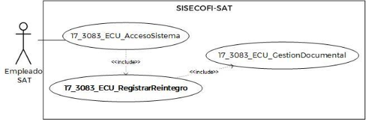
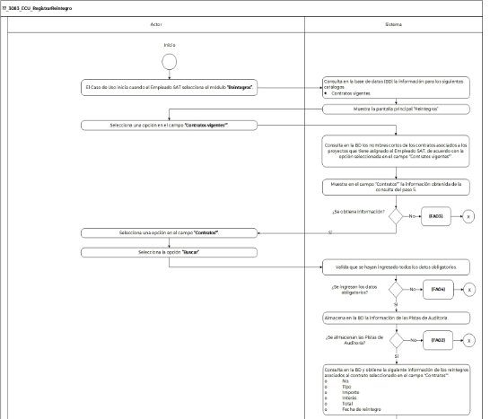
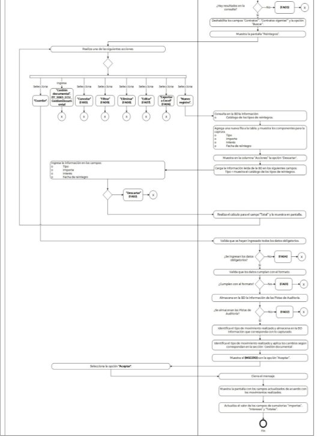

**Administración General de Comunicaciones **

**y Tecnologías de la Información**

**Marco Documental 7.0**
|Fecha de aprobación del Template: 02/08/2023|**Especificación del Caso de Uso** 17\_3083\_ECU\_RegistrarReintegro.docx|Versión del template: 7.00|
| :-: | :- | :-: |

**<ID Requerimiento>** 8309** 

**Nombre del Requerimiento:** TI\_SISECOFI-SAT\_Seguimiento financiero y control documental de proyectos de contratación** 

**Tabla de Versiones y Modificaciones** 

|Versión |Descripción del cambio |Responsable de la Versión |Fecha |
| - | - | :-: | - |
|*1* |*Creación del documento* |Aylín de la Concepción Caballero Weng |*01/04/2024* |
|*1.1* |*Revisión del documento* |Luis Angel Olguin Castillo |*18/04/2024* |
|*1.2* |*Versión aprobada para firma* |Andrés Mojica Vázquez |*07/06/2024* |

**Tabla de Contenido** 

[17_3083_ECU_RegistrarReintegro ........................................................................................................... 2](#_page1_x82.00_y132.92)

1. [Descripción ........................................................................................................................................................ 2](#_page1_x116.00_y148.92)
1. [Diagrama del Caso de Uso ...................................................................................................................... 2](#_page1_x116.00_y231.92)
1. [Actores ................................................................................................................................................................. 2](#_page1_x116.00_y415.92)
1. [Precondiciones............................................................................................................................................... 2](#_page1_x116.00_y539.92)
1. [Post condiciones ........................................................................................................................................... 2](#_page1_x116.00_y672.92)
1. [Flujo primario .................................................................................................................................................. 3](#_page2_x116.00_y133.92)
1. [Flujos alternos .................................................................................................................................................8](#_page7_x116.00_y607.92)
1. [Referencias cruzadas................................................................................................................................ 14](#_page13_x116.00_y210.92)
1. [Mensajes ........................................................................................................................................................... 14](#_page13_x116.00_y294.92)
1. [Requerimientos No Funcionales .................................................................................................... 14 ](#_page13_x116.00_y587.92)[11.Diagrama de actividad ............................................................................................................................. 16](#_page15_x122.00_y369.92)
12. [Diagrama de estados .............................................................................................................................. 17](#_page16_x116.00_y713.92)
12. [Aprobación del cliente ........................................................................................................................... 18](#_page17_x116.00_y133.92)

|Fecha de aprobación del Template: 02/08/2023|**Especificación del Caso de Uso** 17\_3083\_ECU\_RegistrarReintegro.docx|Versión del template: 7.00|
| :-: | :- | :-: |

17\_3083\_ECU\_RegistrarReintegro 

1. **Descripción  **

El objetivo de este Caso de Uso, es permitir al Empleado SAT agregar, modificar y  eliminar  los  reintegros  asociados  a  un  contrato.  Así  como  exportar  la información asociada. 

2. **Diagrama del Caso de Uso **

3. **Actores  **

|**Actor** |**Descripción** |
| - | - |
|**Empleado SAT** |El Empleado SAT es el que tiene el o los roles otorgados por la Administración Central de Seguridad, Monitoreo y Control (ACSMC) para ingresar a cada uno de los módulos de este sistema.  |

4. **Precondiciones** 
- El Empleado SAT se ha autenticado en el sistema con e.firma válida. 
- El sistema ha consumido el servicio “Oauth” para obtener los datos del Empleado SAT que ingresa. 
- El sistema ha validado que el Empleado SAT cuenta con los roles para ingresar, añadir, modificar o eliminar registros en el módulo “Reintegros”. 
- El Empleado SAT cuenta con proyectos asignados. 
- El Empleado SAT ha ingresado al módulo “Reintegros”. 
5. **Post condiciones  **
- El  Empleado  SAT  agregó,  modificó,  consultó,  eliminó  o  exportó  la información de los reintegros asociados a un contrato. 

|Fecha de aprobación del Template: 02/08/2023|**Especificación del Caso de Uso** 17\_3083\_ECU\_RegistrarReintegro.docx|Versión del template: 7.00|
| :-: | :- | :-: |

6. **Flujo primario** ![ref1]

|**Actor** |**Sistema** |
| - | - |
|
1\.  El Caso de Uso inicia cuando  el 

Empleado  SAT  selecciona  el módulo **“Reintegros”**.** 
|
2\.  Consulta en la base de datos (BD) la 

información  para  los  siguientes catálogos  de  acuerdo  con  la **(RNA01)**: 

o  Contratos vigentes. 
|
||
3\.  Muestra  la  pantalla  principal 

“Reintegros”  con  la  siguiente información.  

Sección “Registro” 

- Contratos vigentes\*.  

- Contratos\* 

Opción: 

- Buscar 

Ver  **(17\_3083\_EIU\_RegistrarReintegro)**  Estilos 01. 
|
|
4.  Selecciona  una  opción  en  el 

campo **“Contratos vigentes\*”**. 
|
5\.  Consulta  en  la  BD  los  nombres 

cortos de los contratos asociados a los proyectos que tiene asignado el Empleado SAT, de acuerdo con la opción  seleccionada  en  el  campo “Contratos  vigentes\*”.  Aplica  las **(RNA51)**, **(RNA176)** y **(RNA238)**. 
|
||
6\.  Muestra en el campo “Contratos\*” la 

información  obtenida  de  la consulta del paso 5. 

￿  En  caso  de  no  obtener 

información,  continúa  en  el [**(FA03)**](#_page8_x116.00_y607.92). 
|
|
7\.  Selecciona  una  opción  en  el 

campo **“Contratos\*”**. 
||
|8\.  Selecciona la opción **“Buscar”**. |
9\.  Valida  que  se  hayan  ingresado 

todos  los  datos  obligatorios  de acuerdo con la **(RNA03)**. 

￿  En  caso  de  que  no  se  hayan 

ingresado alguno de los  datos obligatorios,  continúa  en  el [**(FA04)**](#_page9_x116.00_y133.92). 
|

|Fecha de aprobación del Template: 02/08/2023|**Especificación del Caso de Uso** 17\_3083\_ECU\_RegistrarReintegro.docx|Versión del template: 7.00|
| :-: | :- | :-: |

10. Almacena en la BD la información de las Pistas de Auditoría. 

    Datos que se almacenan:  

    **Módulo**= Reintegros 

    **Fecha y Hora**= Fecha y hora del sistema  usando  el  formato DD/MM/AAAA HH:MM:SS 

    **RFC  Usuario**=  RFC  largo  del Empleado  SAT  que  ingresó  al sistema. 

    **Tipo  de  movimiento**=  **CNST** (Consulta) 

    **Movimiento**=  Aplica  la **(RNA239)** 

- nombre corto del contrato que se consulta  
- En caso de que no se puedan almacenar  las  Pistas  de Auditoría, continúa en el [**(FA02)**](#_page8_x116.00_y223.92). 
11. Consulta  en  la  BD  y  obtiene  la siguiente  información  de  los reintegros  asociados  al  contrato seleccionado  en  el  campo “Contratos\*”. 
- No. 
- Tipo 
- Importe 
- Interés 
- Total 
- Fecha de reintegro 
- En  caso  de  que  no  haya resultado  en  la  consulta, continúa en el [**(FA05)**](#_page9_x116.00_y428.92). 
12. Deshabilita  los  campos “Contratos\*”,  “Contratos  vigentes\*” y la opción “Buscar”. 
12. Muestra  la  pantalla  “Reintegros”, considerando  los  siguientes campos y opciones: 

    Sección “Registro” 

    Campos inhabilitados 

- Contratos vigentes\*.  
- Contratos\* 

Opciones. Aplica la **(RNA191)**: 

|Fecha de aprobación del Template: 02/08/2023|**Especificación del Caso de Uso** 17\_3083\_ECU\_RegistrarReintegro.docx|Versión del template: 7.00|
| :-: | :- | :-: |

- Buscar (inhabilitada)  
- Nuevo registro 
- Exportar a Excel 

Tabla:  Carga  la  información obtenida  en  el  paso  10.  Aplica  las **(RNA27)** y **(RNA244)** 

- No. 
- Tipo 
- Importe 
- Interés 
- Total 
- Fecha de reintegro 
- Acciones.  Aplica  las **(RNA191)**  
- Editar 
- Eliminar 
- Campos  para  “Filtrar”  por columna. 

Sumatorias. Aplica la **(RNA61)**: 

- ∑ Importes  
- ∑ Intereses  
- ∑ Totales  

Opciones. Aplica la **(RNA191)**:  

- Guardar 
- Cancelar (habilitado) 

` `Sección  “Gestión  documental” (contraída) 

Ver  

**(17\_3083\_EIU\_RegistrarReintegro)**  Estilos 01. 

14. Realiza  una  de  las  siguientes  15.  Consulta  en  la  BD  la  siguiente acciones:**  información  a  utilizar,  de  acuerdo con la **(RNA01)**: 
- En caso de que seleccione la opción  **“Nuevo  registro”**,  el  o  Catálogo  de  los  tipos  de flujo continúa.**   reintegros. 
- En caso de que seleccione la 

  opción  **“Exportar  a  Excel”**, 

  continúa en el [**(FA06)**](#_page9_x116.00_y584.92). 

- En caso de que seleccione la opción  **“Editar”**  de  algún 

|Fecha de aprobación del Template: 02/08/2023|**Especificación del Caso de Uso** 17\_3083\_ECU\_RegistrarReintegro.docx|Versión del template: 7.00|
| :-: | :- | :-: |

registro de la tabla, continúa en el [**(FA07)**](#_page10_x116.00_y479.92). 

- En caso de que seleccione la opción  **“Eliminar”**  de  algún registro de la tabla, continúa en el [**(FA08)**](#_page11_x116.00_y486.92). 
- En  caso  de  que  ingrese  un parámetro de búsqueda para **“Filtrar”**,  continúa  en  el [**(FA09)**](#_page12_x116.00_y133.92). 
- En caso de que seleccione la opción  **“Guardar”**,**  continúa en el pas[o **22** ](#_page6_x316.00_y323.92)de este flujo.** 
- En caso de que seleccione la opción  **“Cancelar”**,**  continúa en el [**(FA10)**](#_page12_x116.00_y371.92). 
- En caso de que ingrese en la sección  **“Gestión documental”**, continúa en el **(17\_3083\_ECU\_GestionDocu mental)**.  
16. Agrega una nueva fila a la tabla, y muestra  los  componentes  para  la captura  de  la  información  en  los siguientes  campos.  Aplica  la **(RNA27)**: 
- Tipo  
- Importe 
- Interés 
- Fecha de reintegro 

Ver  **(17\_3083\_EIU\_RegistrarReintegro)** Estilos 01. 

17. Muestra en la columna “Acciones”** la siguiente opción:  
- Descartar ![ref2]

Ver  **(17\_3083\_EIU\_RegistrarReintegro)** Estilos 01. 

18. Carga la información leída de la BD en los siguientes campos: 

|Fecha de aprobación del Template: 02/08/2023|**Especificación del Caso de Uso** 17\_3083\_ECU\_RegistrarReintegro.docx|Versión del template: 7.00|
| :-: | :- | :-: |

- Tipo=  muestra  el  catálogo de los tipos de reintegros. 
19. Ingresa  la  información  en  los  20. Realiza  el  cálculo  para  el  campo campos:  “Total”, de acuerdo con la **(RNA61)**, y lo muestra en pantalla.  
- Tipo 
- Importe 
- Interés 
- Fecha de reintegro 
- En caso de que seleccione la opción  **“Descartar”**  del registro  seleccionado continúa en el **[**(FA10)**](#_page12_x116.00_y371.92)**. 
  - Regresa al pas[o **14** ](#_page4_x122.00_y597.92)de este flujo. 
  - Valida  que  se  hayan  ingresado todos  los  datos  obligatorios  de acuerdo con la **(RNA177)**, y continúa el flujo. 
    - En  caso  de  que  no  se  hayan ingresado alguno de los  datos obligatorios,  continúa  en  el [**(FA04)**](#_page9_x116.00_y133.92). 
    - En  caso  de  que  se  hayan realizado  movimientos  de eliminación, continúa el flujo.  
  - Valida que los datos cumplan con el formato  de  acuerdo  con  las **(RNA27)** y **(RNA255)**, y continúa el flujo. 
    - En caso de que alguno de los datos  no  cumpla  con  el formato, continúa en el [**(FA01)**](#_page7_x116.00_y647.92). 
    - En  caso  de  que  se  hayan realizado  movimientos  de eliminación, continúa el flujo. 

24\. Almacena en la BD la información de las Pistas de Auditoría. 

Datos que se almacenan:  

**Módulo**= Reintegros 

**Fecha y Hora**= Fecha y hora del sistema  usando  el  formato DD/MM/AAAA HH:MM:SS 

**RFC  Usuario**=  RFC  largo  del Empleado  SAT  que  ingresó  al sistema. 

|Fecha de aprobación del Template: 02/08/2023|**Especificación del Caso de Uso** 17\_3083\_ECU\_RegistrarReintegro.docx|Versión del template: 7.00|
| :-: | :- | :-: |

||
**Tipo  de  movimiento**=  **INSR** (Insertar),  **UPDT**  (Modificar), **DLT**  (Borrar)  según corresponda 

**Movimiento**=  Aplica  la **(RNA239)** 

- nombre corto del contrato 

- identificador del reintegro 

￿  En caso de que no se puedan almacenar  las  Pistas  de Auditoría, continúa en el [**(FA02)**](#_page8_x116.00_y223.92). 
|
| :- | - |
||
25\. Identifica  el  tipo  de  movimiento 

realizado  y  almacena  en  la  BD  la siguiente  información  que corresponda con lo capturado: 

- No. 

- Tipo 

- Importe 

- Interés 

- Total 

- Fecha de reintegro 
|
||
26\. Identifica  el  tipo  de  movimiento 

realizado y aplica la **(RNA258)** para la sección “Gestión documental” . 
|
||
27\. Muestra el [**(MSG010)**](#_page13_x127.00_y559.92)** con la opción 

“Aceptar”. 
|
|28\. Selecciona la opción **“Aceptar”**. |29\. Cierra el mensaje.  |
||
30\. Muestra la pantalla con los campos 

actualizados  de  acuerdo  con  los movimientos  realizados.  Aplica  la **(RNA250)**. 
|
||
31\.  Actualiza el valor de los campos de 

sumatorias “Importes”, “Intereses” y “Totales”. Aplica la **(RNA61)**. 
|
||32\. Fin del Caso de Uso. |

**7. Flujos alternos  **

**FA01 El sistema identifica que los datos no cumplen con el formato**  

|**Actor** |**Sistema** |
| - | - |
||
1\.  El  **FA01**  inicia  cuando  el  sistema 

identifica que los datos ingresados no cumplen con el formato. 
|
||
2\.  Muestra el [**(MSG008)**](#_page13_x127.00_y513.92)** con la opción 

“Aceptar”. 
|

|Fecha de aprobación del Template: 02/08/2023|**Especificación del Caso de Uso** 17\_3083\_ECU\_RegistrarReintegro.docx|Versión del template: 7.00|
| :-: | :- | :-: |

|3\.  Selecciona la opción **“Aceptar”**. |4\.  Cierra el mensaje.  |
| - | - |
||
5\.  Se  muestran  en  rojo  los  campos 

que  no  cumplen  con  el  formato esperado. 
|
||
6\.  Regresa  al  paso [` `**19** ](#_page6_x122.00_y163.92) del  Flujo 

primario. 
|

**FA02 No se pueden almacenar las Pistas de Auditoría** 

|**Actor** |**Sistema** |
| - | - |
||
1\.  El **FA02** inicia cuando interviene un 

evento  ajeno  y  no  se  pueden almacenar las Pistas de Auditoría.**  
|
||
2\.  Cancela la operación sin completar 

el  movimiento  que  estaba  en proceso. 
|
||
3\.  Muestra el mensaje de acuerdo con 

lo siguiente: 

- Si la pista de auditoría es por el tipo de movimiento **UPDT**, **INSR** 

&emsp;o  **DLT**  se  muestra  el  mensaje [**(MSG001)**](#_page13_x127.00_y350.92).** 

- Si la pista de auditoría es por el tipo  de  movimiento  **CNST**,  se muestra el [**(MSG002)**](#_page13_x127.00_y375.92).** 

- Si la pista de auditoría es por el tipo  de  movimiento  **PRNT**,  se muestra el [**(MSG003)**](#_page13_x127.00_y400.92).**  

Cada  mensaje  se  muestra  con  la opción “Aceptar”. 
|
|4\.  Selecciona la opción **“Aceptar”**. |5\.  Cierra el mensaje. |
||6\.  Regresa al paso previo que detona la acción de la pista de auditoría. |

**FA03 No se obtiene información en la consulta de contratos **

|**Actor** |**Sistema** |
| - | - |
||1\.  El **FA03** inicia cuando no se obtuvo resultados en la consulta realizada.**  |
||
2\.  Muestra el [**(MSG009)**](#_page13_x127.00_y538.92)** con la opción 

“Aceptar”.  
|
|1\.  Selecciona la opción **“Aceptar”**. |2\.  Cierra el mensaje.  |
||3\.  Regresa al pas[o **4** ](#_page2_x122.00_y448.92)del Flujo primario. |

|Fecha de aprobación del Template: 02/08/2023|**Especificación del Caso de Uso** 17\_3083\_ECU\_RegistrarReintegro.docx|Versión del template: 7.00|
| :-: | :- | :-: |

**FA04  El  sistema  identifica  que  no  se  han  ingresado  todos  los  datos ![ref3]obligatorios** 

|**Actor** |**Sistema** |
| - | - |
||
1\.  El  **FA04**  inicia  cuando  el  sistema 

identifica que no se han ingresado todos los datos obligatorios. 
|
||
2\.  Muestra el [**(MSG005)**](#_page13_x127.00_y443.92)** con la opción 

“Aceptar”. 
|
|3\.  Selecciona la opción **“Aceptar”**. |4\.  Cierra el mensaje.  |
||
5\.  Se  muestran  en  rojo  los  campos 

pendientes de capturar. 
|
||
6\.  Realiza lo siguiente: 

- Si fue invocado en el paso 9 del Flujo primario, regresa al paso[` `**4** ](#_page2_x122.00_y448.92)de dicho flujo. 

- Si  fue  invocado  en  el  paso  22 del  Flujo  primario,  regresa  al paso[` `**19** ](#_page6_x122.00_y163.92)de dicho flujo. 
|

**FA05 No se obtiene información en la consulta de reintegros** 

|**Actor** |**Sistema** |
| - | - |
||1\.  El **FA05** inicia cuando no se obtuvo resultados en la consulta realizada.**  |
||
2\.  Muestra el [**(MSG004)**](#_page13_x127.00_y425.92)** con la opción 

“Aceptar”. 
|
|3\.  Selecciona la opción **“Aceptar”**. |4\.  Cierra el mensaje.  |
||
5\.  Regresa  al  paso [` `**13** ](#_page3_x316.00_y635.92) del  Flujo 

primario. 
|

**FA06 Selecciona la opción “Exportar a Excel” **

|**Actor** |**Sistema** ||||
| - | - | :- | :- | :- |
|
1\.  El  **FA06**  inicia  cuando  el 

Empleado  SAT  selecciona  la opción **“Exportar a Excel”**.**  
|
2\.  Almacena en la BD la información 

de las Pistas de Auditoría. 

Datos que se almacenan:  

**Módulo**= Reintegros 

**Fecha y Hora**= Fecha y hora del sistema  usando  el  formato DD/MM/AAAA HH:MM:SS 

**RFC  Usuario**=  RFC  largo  del Empleado  SAT  que  ingresó  al sistema. 
||||
|Fecha de aprobación del Template: 02/08/2023|**Especificación del Caso de Uso** 17\_3083\_ECU\_RegistrarReintegro.docx|Versión del template: 7.00|||

||
**Tipo  de  movimiento**=  **PRNT** (Imprimir) 

**Movimiento**=  Aplica  la **(RNA239)** 

- nombro corto del contrato 

- identificador del reintegro 

￿  En caso de que no se puedan almacenar  las  Pistas  de Auditoría, continúa en el [**(FA02)**](#_page8_x116.00_y223.92).** 
|
| :- | :- |
||
3\.  Obtiene  la  siguiente  información 

de la BD de los reintegros asociados con el contrato: 

- Nombre corto del contrato 

- No. 

- Tipo 

- Importe 

- Interés 

- Total 

- Fecha de reintegro 
|
||
4\.  Genera  un  archivo  Excel  con 

extensión (.xlsx) con la información obtenida en el paso 3. 
|
||
5\.  Dependiendo el explorador realiza 

la descarga del archivo. 
|
||6\.  Fin del Caso de Uso.  |

**FA07 Selecciona la opción “Editar”** 

|**Actor** |**Sistema** |||
| - | - | :- | :- |
|
1\.  El  **FA07**  inicia  cuando  el 

Empleado  SAT  selecciona  la opción  **“Editar”**  de  algún registro de la tabla. 
|
2\.  Consulta  en  la  BD  la  siguiente 

información  a  utilizar,  de  acuerdo con la **(RNA01)**:  

o  Catálogo  de  los  tipos  de 

reintegros 
|||
||
3\.  Habilita en la tabla la edición de los 

siguientes  campos.  Aplica  la **(RNA27)**.  

- Tipo  

- Importe 

- Interés 

- Fecha de reintegro 

Ver  **(17\_3083\_EIU\_RegistrarReintegro)** Estilos 01. 
|||
|Fecha de aprobación del Template: 02/08/2023|**Especificación del Caso de Uso** 17\_3083\_ECU\_RegistrarReintegro.docx|Versión del template: 7.00||

||
4\.  Cambia las opciones de la columna 

“Acciones”** por las siguientes:  

o  Descartar ![ref2]

Ver  **(17\_3083\_EIU\_RegistrarReintegro)** Estilos 02. 
|
| :- | - |
||
5\.  Carga la información leída de la BD 

en los siguientes campos: 

o  Tipo=  muestra  el  catálogo de los tipos de reintegros. 
|
|
6\.  Modifica  la  información  en  los 

campos: 

- Tipo 

- Importe 

- Interés 

- Fecha de reintegro 

￿  En caso de que seleccione la 

opción  **“Descartar”**  del registro  seleccionado continúa en el **[**(FA10)**](#_page12_x116.00_y371.92)**. 
|
7\.  Realiza  el  cálculo  para  el  campo 

“Total”, de acuerdo con la **(RNA61)**, y lo muestra en pantalla. 
|
||
8\.  Continúa  en  el  paso [` `**14** ](#_page4_x122.00_y597.92) del  Flujo 

primario. 
|

**FA08 Selecciona la opción “Eliminar” **

|**Actor** |**Sistema** |
| - | - |
|
1\.  El  **FA08**  inicia  cuando  el 

Empleado  SAT  selecciona  la opción  **“Eliminar”**  de  algún registro de la tabla. 
|
2\.  Muestra  el  **[**(MSG006)**](#_page13_x127.00_y463.92)**  con  las 

opciones “Sí” y “No”. 
|
|
3\.  Selecciona  la  opción  **“No”**  y  el 

flujo continúa. 

￿  En caso de que seleccione la 

opción  **“Sí”**,**  continúa  en  el pas[o **5** ](#_page11_x316.00_y658.92)de este flujo. 
|
4\.  Cierra  el  mensaje,  no  realiza 

ningún  movimiento  y  regresa  al pas[o **13** ](#_page3_x316.00_y635.92)del Flujo primario. 
|
||
5.  Elimina el registro seleccionado de 

la  tabla  que  se  muestra  en  la pantalla. Aplica la **(RNA250)**. 
|
||
6\.  Continúa  en  el  paso [` `**14** ](#_page4_x122.00_y597.92) del  Flujo 

primario. 
|

|Fecha de aprobación del Template: 02/08/2023|**Especificación del Caso de Uso** 17\_3083\_ECU\_RegistrarReintegro.docx|Versión del template: 7.00|
| :-: | :- | :-: |

**FA09 Selecciona la opción “Filtrar” ![ref3]**

|**Actor** |**Sistema** |
| - | - |
|
1\.  El  **FA09**  inicia  cuando  el 

Empleado SAT requiere **“Filtrar”** la  información  en  alguna columna de acuerdo con lo que se muestra en la tabla. 
||
|
2\.  Elige  la  columna  para  filtrar  e 

ingresa el dato a buscar. 
|
3\.  Busca  dentro  de  la  columna  y 

filtra la información mostrada de acuerdo  con  los  caracteres ingresados en el campo. 
|
||
4\.  Muestra  todas  las  coincidencias 

que  obtiene  en  tiempo  real  de dicha columna. 
|
||
5\.  Regresa  al  paso [` `**14** ](#_page4_x122.00_y597.92) del  Flujo 

primario. 
|

**FA10 Selecciona la opción “Cancelar” o “Descartar” **

|**Actor** |**Sistema** |
| - | - |
|
1\.  El **FA10** inicia cuando el Empleado 

SAT  selecciona  la  opción **“Cancelar”** o **“Descartar”**. 
|
2\.  Muestra  el  **[**(MSG007)**](#_page13_x127.00_y488.92)**  con  las 

opciones “Sí” y “No”. 
|
|
3\.  Selecciona la opción **“No”** y el flujo 

continúa. 

￿  En caso de que seleccione la 

opción  **“Sí”**,  continúa  en  el pas[o **5** ](#_page12_x322.00_y530.92)de este flujo. 
|
4\.  Cierra el mensaje y continúa en el 

pas[o **6** ](#_page13_x322.00_y170.92)de este flujo. 
|
||
5.  Realiza lo siguiente:  

- Si  fue  invocado  en  la  opción “Cancelar”,  no  almacena ninguna información y recarga la pantalla. Regresa al paso[` `**4** ](#_page2_x122.00_y448.92)del Flujo primario. 

- Si  fue  invocado  en  la  opción “Descartar” y: 

&emsp;-  Era  un  registro 

almacenado, este vuelve a su estado original y cambia a  solo  lectura  regresando los  íconos  de  “Editar”  y “Eliminar”. Regresa al paso [**14** ](#_page4_x122.00_y597.92)del Flujo primario. 
|

|Fecha de aprobación del Template: 02/08/2023|**Especificación del Caso de Uso** 17\_3083\_ECU\_RegistrarReintegro.docx|Versión del template: 7.00|
| :-: | :- | :-: |

- Y  era  un  registro  nuevo elimina  la  fila.  Regresa  al paso[` `**13** ](#_page3_x316.00_y635.92)del Flujo primario. 

6.  Regresa  al  paso  donde  fue 

invocado. 

8. **Referencias cruzadas **
- 17\_3083\_CRN\_SeguimientoFinancieroYControl 
- 17\_3083\_EIU\_RegistrarReintegro 
- 17\_3083\_ECU\_GestionDocumental 
9. **Mensajes **

|**ID Mensaje** |**Descripción** |
| - | - |
|**MSG001** |Ocurrió un error al guardar la información, favor de intentar nuevamente (PA01).** |
|**MSG002** |Ocurrió un error al consultar la información, favor de intentar nuevamente (PA01). |
|**MSG003** |Ocurrió un error al exportar la información, favor de intentar nuevamente (PA01). |
|**MSG004** |El contrato no contiene reintegros. |
|**MSG005** |Favor de ingresar los datos obligatorios. |
|**MSG006** |Se perderá toda la información relacionada a este reintegro. ¿Está seguro de que desea continuar? |
|**MSG007** |Se perderá toda la información no guardada. ¿Está seguro de que desea continuar? |
|**MSG008** |La información ingresada no cumple con el formato esperado. Por favor verifique los datos y vuelva a intentarlo. |
|**MSG009** |El usuario no tiene proyectos asignados. Favor de validar con el administrador del sistema. |
|**MSG010** |Los datos se guardaron correctamente. |

10. **Requerimientos No Funcionales  **

|**ID de RNF** |
**Requerimient**

**o No Funcional** 
|**Descripción** |||
| - | - | - | :- | :- |
|**RNF001** |Disponibilidad  |El sistema deberá estar activo las 24 horas del día, los 365 días del año con picos de operación en el horario de 9:00 a 18:00 horas.  |||
|**RNF002** |Concurrencia  |
El número de Empleados SAT que puede tener el sistema son 150.  

￿  El  número  máximo  de  accesos 

concurrentes  que  debe  soportar  este sistema  son  máximo  30  Empleados SAT.  
|||
|Fecha de aprobación del Template: 02/08/2023|**Especificación del Caso de Uso** 17\_3083\_ECU\_RegistrarReintegro.docx|Versión del template: 7.00|||

|**RNF003** |Seguridad  |El acceso solo podrá ser otorgado al Empleado SAT  que  tenga  los  roles  asignados  por  la Administración  Central  de  Seguridad, Monitoreo  y  Control  (ACSMC)  para  cada módulo de este sistema.  |||
| - | - | - | :- | :- |
|**RNF004** |Usabilidad |
El  sistema  deberá  manejar  los  siguientes elementos para facilitar la navegación: 

- Mensajes  tipo  flotantes  (*tooltips*)  con información  de  la  herramienta  que ofrece  ayuda  contextual,  como  guía para el Empleado SAT. 

- Componente  de  ordenamiento  que permita acomodar la información de la tabla  de  forma  ascendente  o descendente, considerando la columna donde es seleccionado. 

￿ 

Contar  con  un  diseño  responsivo  que permita  su  óptima  visualización  en distintos tipos de dispositivos finales.  
|||
|**RNF005** |Eficiencia  |Las  consultas  se  dividen  en  generales  y detalladas, para que las detalladas carguen la información solo cuando sean requeridas por el Empleado SAT. |||
|**RNF006** |Usabilidad  |
El Empleado SAT podrá navegar a través de las páginas  resultantes  de  la  consulta considerando  que  el  sistema  debe  mostrar inicialmente  15  registros  por  página, permitiendo al Empleado SAT seleccionar los registros que requiere visualizar, teniendo las opciones 15, 50 y 100: 

- Ir a la primera página (debe mostrar la primera  página  con  el  resultado  de  la consulta). 

- Ir  a  la  última  página  (debe  mostrar  la última  página  con  el  resultado  de  la consulta). 

- Ir a la siguiente página (debe mostrar la siguiente  página,  considerando  la actual, con el resultado de la consulta y el  número  de  registros  seleccionados por el Empleado SAT). 

￿ 

Ir a la página anterior (debe mostrar la página anterior considerando la actual con el resultado de la consulta). 

En  la  tabla  deben  mostrarse  los  registros ordenados alfabéticamente. 
|||
|**RNF007** |Seguridad |Las Pistas de Auditoría deben estar protegidas contra  accesos  no  autorizados.  Solo  los Empleados  SAT  autorizados  pueden |||
|Fecha de aprobación del Template: 02/08/2023|**Especificación del Caso de Uso** 17\_3083\_ECU\_RegistrarReintegro.docx|Versión del template: 7.00|||

|||consultarlas, y la información en ellas se definirá durante la etapa de diseño, la cual debe estar cifrada  para  mantenerla  confidencial  y  evitar exposiciones no autorizadas. |
| :- | :- | - |
|**RNF008****  |Fiabilidad  |El  sistema  debe  ser  capaz  de  manejar excepciones  de  manera  efectiva  y  presentar mensajes  claros  y  comprensibles  para garantizar  una  adecuada  interacción  con  el sistema.  |
|**RNF009****  |Seguridad  |Se debe mantener la información en pantalla en  caso  de  un  error  al  guardar  las  Pistas  de Auditoría,  siempre  y  cuando  el  escenario  lo permita. Hay situaciones de infraestructura o de conexión de internet que sí pierde los datos ya que no están controlados por el sistema.  |
|**RNF010****  |Integridad  |Al almacenar la información en la BD de tipo Texto  o  alfanumérico  se  deben  eliminar  los espacios en blanco al inicio y fin de la cadena.  |

**11.Diagrama de actividad**

|Fecha de aprobación del Template: 02/08/2023|**Especificación del Caso de Uso** 17\_3083\_ECU\_RegistrarReintegro.docx|Versión del template: 7.00|
| :-: | :- | :-: |

12. **Diagrama de estados**  

No aplica, no hay cambios significativos de estados ni transiciones. 

|Fecha de aprobación del Template: 02/08/2023|**Especificación del Caso de Uso** 17\_3083\_ECU\_RegistrarReintegro.docx|Versión del template: 7.00|
| :-: | :- | :-: |

13. **Aprobación del cliente**  ![ref1]

|||||
| :- | :- | :- | :- |
|**FIRMAS DE CONFORMIDAD**  ||||
|||||
|**Firma 1** |**Firma 2** |||
|**Nombre**: Andrés Mojica Vázquez.  |**Nombre**: Ricardo Chávez Gutiérrez. |||
|**Puesto**: Usuario ACPPI.  |**Puesto**: Usuario ACPPI.  |||
|**Fecha:**  |**Fecha:**  |||
|||||
|**Firma 3**  |**Firma 4**  |||
|**Nombre**: Yesenia Helvetia Delgado Naranjo.  |**Nombre:** Alejandro Alfredo Muñoz Núñez.  |||
|**Puesto**: APE ACPPI.  |**Puesto:** RAPE ACPPI.  |||
|**Fecha**:  |**Fecha**:  |||
|||||
|**Firma 5**  |**Firma 6**  |||
|**Nombre**: Luis Angel Olguin Castillo. |**Nombre**: Erick Villa Beltrán.  |||
|**Puesto**: Enlace ACPPI.  |**Puesto**: Líder APE SDMA 6.  |||
|**Fecha**:  |**Fecha**:  |||
|||||
|Fecha de aprobación del Template: 02/08/2023|**Especificación del Caso de Uso** 17\_3083\_ECU\_RegistrarReintegro.docx|Versión del template: 7.00||

|||
| :- | :- |
|**Firma 7**  |**Firma 8**  |
|**Nombre:**  Juan  Carlos  Ayuso Bautista.  |**Nombre:**  Aylín  de  la  Concepción Caballero Weng. |
|**Puesto:** Líder Técnico SDMA 6.  |**Puesto:**  Analista  de  Sistemas  DS SDMA 6.  |
|**Fecha**:  |**Fecha**:  |
|||

Página 20 de 20 

[ref1]: Aspose.Words.682854c6-fd30-4840-9709-768ef6934d85.009.png
[ref2]: Aspose.Words.682854c6-fd30-4840-9709-768ef6934d85.023.png
[ref3]: Aspose.Words.682854c6-fd30-4840-9709-768ef6934d85.033.png
