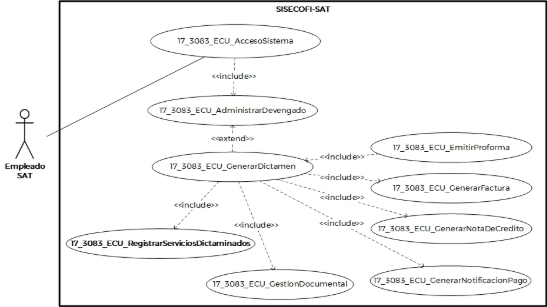
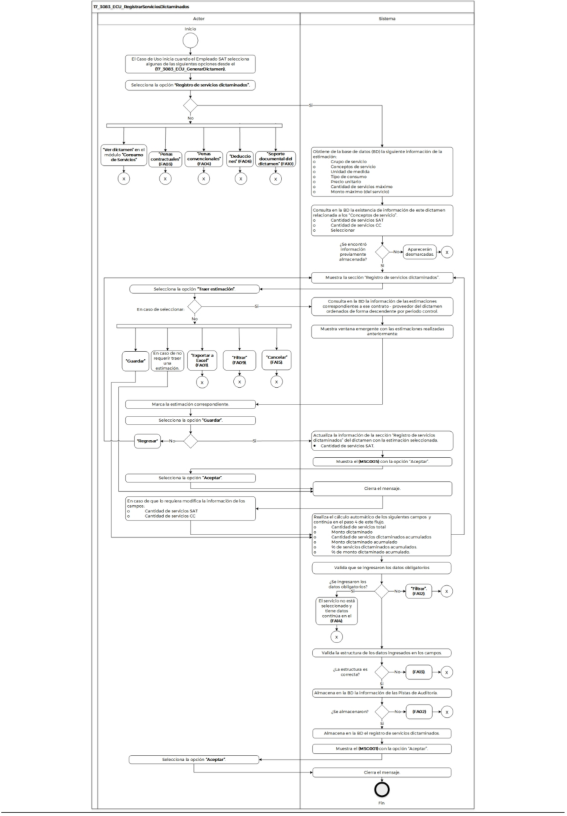

**Administración General de Comunicaciones **

**y Tecnologías de la Información**

**Marco Documental 7.0**
|Fecha de aprobación del Template: 02/08/2023|**Especificación del Caso de Uso** 17\_3083\_ECU\_RegistrarServiciosDictaminados.docx|Versión del template: 7.00|
| :-: | :- | :-: |

**<ID Requerimiento>**8309** 

**Nombre del Requerimiento:** TI\_SISECOFI-SAT\_Seguimiento financiero y control documental de proyectos de contratación** 

**Tabla de Versiones y Modificaciones** 

|Versión |Descripción del cambio |Responsable de la Versión |Fecha |
| - | - | :- | - |
|*1* |*Creación del documento* |Aylín de la Concepción Caballero Weng |*19/04/2024* |
|*1.1* |*Revisión del documento* |Luis Angel Olguín Castillo  |*23/04/2024* |
|*1.2* |*Versión aprobada para firma* |Andrés Mojica Vázquez |*11/06/2024* |

**Tabla de Contenido** 

[17_3083_ECU_ RegistrarServiciosDictaminados ............................................................................ 2](#_page1_x82.00_y132.92)

1. [Descripción ........................................................................................................................................................ 2](#_page1_x102.00_y148.92)
1. [Diagrama del Caso de Uso ...................................................................................................................... 2](#_page1_x102.00_y288.92)
1. [Actores ................................................................................................................................................................. 2](#_page1_x105.00_y566.92)
1. [Precondiciones............................................................................................................................................... 2](#_page1_x102.00_y689.92)
1. [Post condiciones ........................................................................................................................................... 3](#_page2_x102.00_y281.92)
1. [Flujo primario .................................................................................................................................................. 3](#_page2_x102.00_y470.92)
1. [Flujos alternos ................................................................................................................................................. 7](#_page6_x102.00_y590.92)
1. [Referencias cruzadas............................................................................................................................... 30](#_page29_x102.00_y485.92)
1. [Mensajes .......................................................................................................................................................... 30](#_page29_x102.00_y581.92)
1. [Requerimientos No Funcionales .................................................................................................... 31](#_page30_x102.00_y468.92)
1. [Diagrama de actividad .......................................................................................................................... 34](#_page33_x102.00_y133.92)
1. [Diagrama de estados ............................................................................................................................. 35](#_page34_x108.00_y133.92)
1. [Aprobación del cliente .......................................................................................................................... 35](#_page34_x102.00_y191.92)

|Fecha de aprobación del Template: 02/08/2023|**Especificación del Caso de Uso** 17\_3083\_ECU\_RegistrarServiciosDictaminados.docx|Versión del template: 7.00|
| :-: | :- | :-: |

17\_3083\_ECU\_** RegistrarServiciosDictaminados 

1. **Descripción  **

El objetivo de este Caso de Uso es permitir al Empleado SAT realizar el registro en las siguientes secciones: 

- “Registro de servicios dictaminados” 
- “Penas contractuales” 
- “Penas convencionales” 
- “Deducciones”  
- “Soporte documental del dictamen” 
2. **Diagrama del Caso de Uso **

3. **Actores  **

|**Actor** |**Descripción** |
| - | - |
|**Empleado SAT** |El  Empleado  SAT  tiene  el  o  los  roles  otorgados  por  la Administración Central de Seguridad, Monitoreo y Control (ACSMC) para ingresar a cada uno de los módulos de este sistema.  |

4. **Precondiciones** 
- El Empleado SAT se ha autenticado en el sistema con e.firma válida. 
- El sistema ha consumido el servicio “Oauth” para obtener los datos del Empleado SAT que ingresa.  

|Fecha de aprobación del Template: 02/08/2023|**Especificación del Caso de Uso** 17\_3083\_ECU\_RegistrarServiciosDictaminados.docx|Versión del template: 7.00|
| :-: | :- | :-: |

- El sistema  ha validado que  el Empleado SAT  cuenta  con  los roles  para ![ref1]ingresar al módulo “Consumo de Servicios - Dictamen”. 
- El  empleado  SAT  ha  ingresado  a  un  dictamen  de  acuerdo  con  el **(17\_3083\_ECU\_GenerarDictamen)**. 
- El empleado SAT ha seleccionado una opción en el campo Convenio de Colaboración del contrato.** 
- El empleado SAT ha seleccionado alguna de las siguientes opciones: Alta dictamen,  Editar  dictamen  y  Ver  dictamen  en  el  módulo  “Consumo  de Servicios” relacionados a un contrato.** 
- El empleado SAT ha registrado la plantilla activa de verificación para la carga de documentos en la sección documental.** 
5. **Post condiciones  **
- El  Empleado  SAT  registró  “Registro  de  servicios  dictaminados”,  “Penas contractuales”, “Penas convencionales” y “Deducciones”. 
- El Empleado SAT modificó “Penas contractuales”, “Penas convencionales” y “Deducciones”. 
- El Empleado SAT eliminó “Penas contractuales”, “Penas convencionales” y “Deducciones”. 
- El Empleado SAT exportó información  de  las  secciones  de  “Registro  de servicios dictaminados”, “Penas contractuales”, “Penas convencionales” y “Deducciones”. 
- El  Empleado  SAT  adjuntó  archivos  y  registró  información  de  la  sección “Soporte documental del dictamen”. 
6. **Flujo primario** 

|**Actor** |**Sistema** |
| - | - |
|
1\.  El  Caso  de  Uso  inicia  cuando  el 

Empleado SAT selecciona algunas de las siguientes opciones desde el **(17\_3083\_ECU\_GenerarDictamen)**: 

- Si  selecciona  la  opción **“Registro  de  servicios dictaminados”**,**  el  flujo continúa. 

- En caso de haber seleccionado la opción **“Ver dictamen”** en el módulo  **“Consumo  de Servicios”**,  aplica  la  regla  de negocio **(RNA167)**. 

- Si selecciona la opción **“Penas contractuales”**, continúa en el [**(FA03)**](#_page8_x102.00_y372.92). 
|
2\.  Obtiene de la base de datos (BD) la siguiente información del contrato 

- último convenio modificatorio: 

- Grupo de servicio 

- Conceptos de servicio 

- Unidad de medida 

- Tipo de consumo 

- Precio unitario 

- Cantidad  de  servicios máxima vigente  

- Monto máximo vigente (del servicio) 
|

|Fecha de aprobación del Template: 02/08/2023|**Especificación del Caso de Uso** 17\_3083\_ECU\_RegistrarServiciosDictaminados.docx|Versión del template: 7.00|
| :-: | :- | :-: |

- Si selecciona la opción **“Penas convencionales”**,  continúa  en el [**(FA04)**](#_page12_x102.00_y133.92). 
- Si  selecciona  la  opción **“Deducciones”**, continúa en el [**(FA06)**](#_page16_x102.00_y207.92). 
- Si selecciona la opción **“Soporte documental  del  dictamen”**, continúa en el [**(FA10)**](#_page21_x102.00_y613.92). 
3. Consulta en la BD la existencia de información  de  este  dictamen relacionada  a  los  “Conceptos  de servicio”. 
- Cantidad de servicios SAT 
- Cantidad de servicios CC 
- Seleccionar ![ref2]
- En  caso  de  no  encontrar información  previamente almacenada  las  casillas aparecerán desmarcadas. 
4. Muestra  la  sección  “Registro  de servicios  dictaminados”.  Aplica  la **(RNA127)** y **(RNA128)**. 

   Opciones: 

- Traer estimación
- Exportar a Excel![ref3]

Tabla: 

- Seleccionar ![ref2]
- Id  
- Grupo de servicio 
- Conceptos de servicio  
- Unidad de medida 
- Tipo de consumo 
- Precio unitario 
- Cantidad  de  servicios máxima vigente 
- Monto máximo vigente 

Traer estimación: 

- Cantidad de servicios SAT.  
- Cantidad de servicios CC.  

Cálculos  automáticos:  Aplica  la **(RNA121)**  

- Cantidad total de servicios 
- Monto dictaminado 
- Cantidad  de  servicios dictaminados acumulados 

|Fecha de aprobación del Template: 02/08/2023|**Especificación del Caso de Uso** 17\_3083\_ECU\_RegistrarServiciosDictaminados.docx|Versión del template: 7.00|
| :-: | :- | :-: |

- Monto  dictaminado acumulado 

Calculados con semáforo: 

- % de servicios dictaminados acumulados.  Aplica  la **(RNA110)**  
- %  de  monto  dictaminado acumulado.  Aplica  la **(RNA111)**  

Opciones. Aplica la **(RNA246)** 

- Guardar  
- Cancelar 
- Campos  para  “Filtrar”  por columna 

Ver **(17\_3083\_EIU\_RegistrarServiciosD ictaminados)** Estilos 01. 

5. Selecciona  la  opción  **“Traer**  6.  Consulta en la BD la información de **estimación”**, continúa en el flujo.  las estimaciones correspondientes a  ese  contrato  -  proveedor  del 
- En caso de seleccionar la opción  dictamen  ordenados  de  forma **“Guardar”** continúa en el paso  descendente por periodo control. [**16** ](#_page5_x313.00_y587.92)de este flujo. 
- En caso de no requerir traer una 

  estimación, continúa en el paso 

  [**14** ](#_page5_x128.00_y379.92)de este flujo. 

- En caso de seleccionar la opción 

  **“Exportar a Excel”**, continúa en 

  el [**(FA01)**](#_page6_x102.00_y629.92). 

- En caso de seleccionar la opción 

  **“Filtrar”**, continúa en el [**(FA09)**](#_page21_x102.00_y380.92). 

- En caso de seleccionar la opción 

  **“Cancelar”**,  continúa  en  el 

  [**(FA15)**](#_page28_x102.00_y133.92). 

7. Muestra  ventana  emergente  con las  estimaciones  realizadas anteriormente: 

   Estimación: 

- 
- Id 
- Periodo control 
- Periodo de inicio 
- Periodo fin 
- Monto 
- Monto en pesos 

  Opciones: 

|Fecha de aprobación del Template: 02/08/2023|**Especificación del Caso de Uso** 17\_3083\_ECU\_RegistrarServiciosDictaminados.docx|Versión del template: 7.00|
| :-: | :- | :-: |

- Guardar. Aplica la **(RNA246)** 
- Regresar 

Ver **(17\_3083\_EIU\_RegistrarServiciosD ictaminados)** Estilos 02. 

8. Marca  la  estimación correspondiente. 
8. Selecciona  la  opción  **“Guardar”**  y  10.  Actualiza  la  información  de  la continúa en el flujo.  sección  “Registro  de  servicios dictaminados” del dictamen con la 
- De lo contrario, si selecciona la  estimación seleccionada. 

  opción **“Regresar”**, continúa en 

  el paso **4** de este flujo.  o  Cantidad  de  servicios  SAT. 

Aplica la **(RNA108)**. 

11. Muestra el [**(MSG005)**](#_page29_x108.00_y737.92)** con la opción “Aceptar”. 
12. Selecciona la opción **“Aceptar”**.  13.  Cierra el mensaje. 

14\.  En  caso  de  que  se  requiera  15.  Realiza el cálculo automático de los  modificar,  ingresa  la  información  siguientes campos de acuerdo con  

de los siguientes campos:  la **(RNA121)** y continúa en el paso **4**  

de este flujo.  

- Cantidad de servicios SAT   
- Cantidad  de servicios  CC.  o  Cantidad total de servicios   Aplica la **(RNA127)**.  o  Monto dictaminado  
  - Cantidad  de  servicios  dictaminados acumulados  
  - Monto  dictaminado  acumulado  
  - % de servicios dictaminados  acumulados.  Aplica  la  **(RNA110)**.   
  - %  de  monto  dictaminado  acumulado.  Aplica  la **(RNA111)**.  
16. Valida que se ingresaron los datos  obligatorios  de  acuerdo  con  la **(RNA128)**. 
- En caso de no ingresar los datos obligatorios  continúa  en  el [**(FA12)**](#_page26_x102.00_y494.92).  
- En  caso  de  que  el  servicio  no este seleccionado y tiene datos continúa en el [**(FA14)**](#_page27_x102.00_y426.92). 
17. Valida  la  estructura  de  los  datos ingresados en los campos. Aplica la **(RNA255)**. 

|Fecha de aprobación del Template: 02/08/2023|**Especificación del Caso de Uso** 17\_3083\_ECU\_RegistrarServiciosDictaminados.docx|Versión del template: 7.00|
| :-: | :- | :-: |

||
￿  En caso de que la estructura de 

los  datos  ingresados  sea incorrecta,  continúa  en  el [**(FA13)**](#_page27_x102.00_y232.92). 
|
| :- | - |
||
18\.  Almacena en la BD la información 

de las Pistas de Auditoría. 

Datos que se almacenan: **Módulo**= Dictamen – Registro de servicios 

**Fecha y Hora**= Fecha y hora del sistema,  usando  el  formato DD/MM/AAAA HH:MM:SS 

**RFC  Usuario**=  RFC  largo  del Empleado  SAT  que  ingresó  al sistema. 

**Tipo  de  movimiento**=  **INSR** (insertar) **UPDT** (modificar) 

**Movimiento**=  Aplica  la **(RNA239)**. 

- Id del dictamen 

` `-Id  de  registro  de  servicios dictaminados 

￿  En  caso  de  que  no  se  pueda 

almacenar  las  Pistas  de Auditoría,  continúa  en  el [**(FA02)**](#_page7_x102.00_y550.92). 
|
||
19\.  Almacena en la BD el registro de 

servicios  dictaminados.  Aplica  la **(RNA247)**. 
|
||
20\. Muestra el **(MSG001)** con la opción 

“Aceptar”. 
|
|21\.  Selecciona la opción **“Aceptar”**. |22\. Cierra el mensaje. |
||23\. Fin del Caso de Uso. |

**7. Flujos alternos  **

**FA01 Selecciona la opción “Exportar a Excel”** 

|**Actor** |**Sistema** |||
| - | - | :- | :- |
|
1\.  El  **FA01**  inicia  cuando  el 

Empleado  SAT  selecciona  la opción **“Exportar a Excel”**. 
|
2\.  Obtiene  la  información  de  la  BD 

donde es seleccionada la opción. 
|||
|Fecha de aprobación del Template: 02/08/2023|**Especificación del Caso de Uso** 17\_3083\_ECU\_RegistrarServiciosDictaminados.docx|Versión del template: 7.00||

||
3\.  Almacena en la BD la información 

de las Pistas de Auditoría. 

Datos que se almacenan:  

**Módulo**= Dictamen - Sección en la que fue invocado 

**Fecha y Hora** = Fecha y hora del sistema  usando  el  formato DD/MM/AAAA HH:MM:SS 

**RFC  Usuario**=  RFC  largo  del Empleado  SAT  que  ingresó  al sistema. 

**Tipo  de  movimiento**=  **PRNT** (Imprimir) 

**Movimiento**=  Aplica  la **(RNA239)**. 

-Id de dictamen 

-Id de la sección que lo invocan (Id  Registro  de  servicios,  Id Penas  contractuales,  Id  Penas convencionales,  Id Deducciones) 

￿  En  caso  de  que  no  se  pueda almacenar  las  Pistas  de Auditoría, continúa en el [**(FA02)**](#_page7_x102.00_y550.92). 
|
| :- | - |
||
4\.  Genera  un  archivo  Excel  con  la 

extensión  (.xlsx)  con  la información  obtenida  de  cada sección. Aplica la **(RNA259)**. 
|
||
5\.  Realiza  la  descarga  del  archivo 

Excel con xlsx.  
|
||6\.  Fin del Caso de Uso. |

**FA02 No se pueden almacenar las Pistas de Auditoría  **

|**Actor** |**Sistema** |||
| - | - | :- | :- |
||
1\.  El **FA02** inicia cuando interviene 

un evento ajeno y no se pueden almacenar  las  Pistas  de Auditoría.**  
|||
||
2\.  Cancela  la  operación  sin 

completar  el  movimiento  que estaba en proceso. 
|||
||
3\.  Muestra el mensaje de acuerdo 

con lo siguiente: 

￿  Si la pista de auditoría es por el tipo  de  movimiento  **UPDT**  e 
|||
|Fecha de aprobación del Template: 02/08/2023|**Especificación del Caso de Uso** 17\_3083\_ECU\_RegistrarServiciosDictaminados.docx|Versión del template: 7.00||

||
**INSR**  o  **DLT**  se  muestra  el [**(MSG006)**](#_page30_x108.00_y139.92).** 

- Si la pista de auditoría es por el tipo de movimiento **CNST**, se muestra el [**(MSG008)**](#_page30_x108.00_y189.92).**  

- En  caso  de  que  la  pista  de auditoría  es  por  el  tipo  de movimiento **PRNT**, se muestra el [**(MSG009)**](#_page30_x108.00_y214.92).  

Cada mensaje se muestra con la opción “Aceptar”.
|
| :- | :- |
|4\.  Selecciona la opción **“Aceptar”**. |5\.  Cierra el mensaje. |
||
6\.  Regresa  al  paso  previo  que 

detona  la  acción  de  la  pista  de auditoría. 
|

**FA03 Selecciona la opción “Penas contractuales” **

|**Actor** |**Sistema** ||||
| - | - | :- | :- | :- |
|
1\.  El **FA03** inicia cuando el Empleado 

SAT selecciona la opción **“Sí”** de la sección **“Penas contractuales”**. 
|
2\.  Obtiene de la BD la información de 

los siguientes catálogos: 

- Tipo   

- Documentos  

- Desglose 
||||
||
3\.  Obtiene  de  la  BD  la  información 

relacionada  a  esta  sección  del dictamen seleccionado.  

- Id 

- Tipo   

- Documentos  

- Pena aplicable 

- Desglose  

- Monto 
||||
||
4\.  El  sistema  despliega  la  sección 

“Penas  contractuales”  y  muestra una  tabla  con  la  siguiente información  de  acuerdo  con  la **(RNA01)**, **(RNA51)** y **(RNA244)**: 

- Id 

- Tipo   

- Documentos  

- Pena aplicable 

- Desglose  
||||
|Fecha de aprobación del Template: 02/08/2023|**Especificación del Caso de Uso** 17\_3083\_ECU\_RegistrarServiciosDictaminados.docx|Versión del template: 7.00|||

- Monto Acciones: 
- Editar![ref4]
- Eliminar![ref5]
- Descartar ![ref6]
- Campos  para  “Filtrar”  por columna 

  Opciones: 

- Agregar![ref7]
- Exportar a Excel![ref3]

Ver **(17\_3083\_EIU\_RegistrarServiciosD ictaminados)** Estilos 03. 

- Si el dictamen se encuentra en estatus  “Inicial”  continúa  en  el paso **5** de este flujo. 
- Si el dictamen se encuentra en estatus “Dictaminado” continúa en el pas[o **21** ](#_page11_x108.00_y263.92)de este flujo. 

5\.  Selecciona  la  opción  **“Agregar”**  y  6.  Crea una fila y muestra los campos continúa en el flujo.  en modo edición para el registro de 

la pena contractual. 

- Si selecciona la opción **“Editar”** continúa en el [**(FA05)**](#_page15_x102.00_y531.92). 
- Si  selecciona  la  opción **“Eliminar”**  continúa  en  el [**(FA08)**](#_page21_x102.00_y133.92). 
- Si  selecciona  la  opción **“Cancelar”**  continúa  en  el [**(FA15)**](#_page28_x102.00_y133.92). 
- Si  selecciona  la  opción **“Guardar”** continúa en el paso [**12** ](#_page10_x313.00_y256.92)de este flujo. 
- Si  selecciona  la  opción **“Exportar a Excel”** continúa en el [**(FA01)**](#_page6_x102.00_y629.92). 
- Si selecciona la opción **“Filtrar”** continúa en el [**(FA09)**](#_page21_x102.00_y380.92). 
- Si  selecciona  la  opción **“Descartar”**  continúa  en  el [**(FA15)**](#_page28_x102.00_y133.92). 

|Fecha de aprobación del Template: 02/08/2023|**Especificación del Caso de Uso** 17\_3083\_ECU\_RegistrarServiciosDictaminados.docx|Versión del template: 7.00|
| :-: | :- | :-: |

7.  Ingresa  la  información  de  los  8.  Obtiene de la BD la información del siguientes campos:  contrato  relacionada  al  “Tipo” 

seleccionado. Aplica la **(RNA129)**. 

1. Tipo 
9. Ingresa  la  información  de  los  10.  Obtiene de la BD la información de siguientes campos:  “Penas y/o deducciones aplicables” 
   1. “Penas  aplicables”  del  contrato 
   1. Documento  correspondiente  al  “Documento” seleccionado  y  lo  muestra  en  la columna “Pena aplicable”. 
9. Ingresa  la  información  de  los  12.  Valida  que  la  tabla  tenga  un siguientes campos y continúa en el  registro capturado de acuerdo con paso **5** de este flujo.  la **(RNA129)**. 
   1. Desglose  ￿  En caso de identificar que no se tienen registros continúa en el [**(FA16)**](#_page28_x102.00_y543.92). 
13. Valida  que  se  agregaron  los campos obligatorios. 
- En caso de identificar que no se agregaron  los  datos obligatorios  continúa  en  el [**(FA12)**](#_page26_x102.00_y494.92). 
14. Almacena en la BD la información de las Pistas de Auditoría. 

    Datos que se almacenan: **Módulo**=  Dictamen  –  Penas contractuales 

    **Fecha y Hora**= Fecha y hora del sistema,  usando  el  formato DD/MM/AAAA HH:MM:SS 

    **RFC  Usuario**=  RFC  largo  del Empleado  SAT  que  ingresó  al sistema. 

    **Tipo  de  movimiento**=  **INSR** (insertar)  **UPDT**  (modificar)  y **DLT** (eliminar) 

    **Movimiento**=  Aplica  la **(RNA239)**. 

    **-**Id del dictamen 

    -Id “Penas contractuales” 

- En  caso  de  no  almacenar  las Pistas de Auditoría, continúa en el [**(FA02)**](#_page7_x102.00_y550.92). 
15. Almacena en la BD la información capturada  de  “Penas contractuales”. Aplica la **(RNA247)**. 

|Fecha de aprobación del Template: 02/08/2023|**Especificación del Caso de Uso** 17\_3083\_ECU\_RegistrarServiciosDictaminados.docx|Versión del template: 7.00|
| :-: | :- | :-: |

||
16\.  Muestra el [**(MSG002)**](#_page29_x108.00_y664.92) con la opción 

“Aceptar”. 
|
| :- | - |
|17\.  Selecciona la opción **“Aceptar”**. |18\.  Cierra el mensaje. |
||
19\.  Actualiza y muestra la tabla “Penas 

contractuales”. 

Ver **(17\_3083\_EIU\_RegistrarServiciosD ictaminados)** Estilos 03. 
|
||20\. Continúa en el pas[o **29** ](#_page11_x313.00_y741.92)de este flujo. |
|21.  Captura “Monto”. Aplica la **(RNA87)**. ||
|
22\. Selecciona  la  opción  **”Guardar”**  y 

continúa en el flujo.  
|
23\.  Valida  la  estructura  de  los  datos 

ingresados en los campos. Aplica la **(RNA255)** y continúa en el flujo. 

￿  En caso de que la estructura de 

los  datos  ingresados  sea incorrecta,  continúa  en  el [**(FA13)**](#_page27_x102.00_y232.92). 
|
||
24\. Almacena en la BD la información 

de las Pistas de Auditoría. 

Datos que se almacenan: 

**Módulo**=  Dictamen  –  Penas contractuales 

**Fecha y Hora**= Fecha y hora del sistema,  usando  el  formato DD/MM/AAAA HH:MM:SS 

**RFC  Usuario**=  RFC  largo  del Empleado  SAT  que  ingresó  al sistema. 

**Tipo de movimiento**= **UPDT** (modificar) 

**Movimiento**=  Aplica  la **(RNA239)**. 

-Id del dictamen 

-Id “Pena contractual” 

￿  En  caso  de  no  se  pueda 

almacenar  las  Pistas  de Auditoría,  continúa  en  el [**(FA02)**](#_page7_x102.00_y550.92). 
|
||
25\. Almacena  en  la  BD  las 

modificaciones del campo “Monto”. Aplica la **(RNA247)**. 
|
||
26\. Muestra el [**(MSG002)**](#_page29_x108.00_y664.92)** con la opción 

“Aceptar”. 
|
|27\. Selecciona la opción **“Aceptar”**. |28\. Cierra el mensaje. |
||29. Fin del Caso de Uso. |

|Fecha de aprobación del Template: 02/08/2023|**Especificación del Caso de Uso** 17\_3083\_ECU\_RegistrarServiciosDictaminados.docx|Versión del template: 7.00|
| :-: | :- | :-: |

**FA04 Selecciona la opción “Penas convencionales” ![ref1]**

|**Actor** |**Sistema** ||||
| - | - | :- | :- | :- |
|
1\.  El **FA04** inicia cuando el Empleado 

SAT selecciona la opción **“Sí”** de la sección **“Penas convencionales”**. 
|
2\.  Obtiene de la BD la información de 

los siguientes catálogos: 

- Tipo   

- Documentos  

- Desglose 
||||
||
3\.  Obtiene  de  la  BD  la  información 

relacionada  a  esta  sección  del dictamen seleccionado.  

- Id 

- Tipo   

- Documentos  

- Pena aplicable 

- Desglose  

- Monto 
||||
||
4\.  El  sistema  despliega  la  sección 

“Penas convencionales” y muestra una  tabla  con  la  siguiente información  de  acuerdo  con  la **(RNA01)**, **(RNA51)** y **(RNA244)**: 

- Id 

- Tipo   

- Documentos  

- Pena aplicable 

- Desglose  

- Monto 

Acciones: 

- Editar![ref4]

- Eliminar![ref5]

- Descartar ![ref8]

- Campos  para  “Filtrar”  por columna 

Opciones: 

- Agregar![ref7]

- Exportar a Excel![ref3]

Ver **(17\_3083\_EIU\_RegistrarServiciosD ictaminados)** Estilos 04. 
||||
|Fecha de aprobación del Template: 02/08/2023|**Especificación del Caso de Uso** 17\_3083\_ECU\_RegistrarServiciosDictaminados.docx|Versión del template: 7.00|||

- Si el dictamen se encuentra en estatus “Inicial” continúa en el paso **5** de este flujo. 
- Si el dictamen se encuentra en estatus  “Dictaminado” continúa en el paso **21** de este flujo. 

5\.  Selecciona  la  opción  **“Agregar”**  y  6.  Crea una fila y muestra los campos continúa en el flujo.  en modo edición para el registro de 

la “Pena convencional”. 

- Si selecciona la opción **“Editar”** continúa en el [**(FA05)**](#_page15_x102.00_y531.92). 
- Si  selecciona  la  opción **“Eliminar”**  continúa  en  el [**(FA08)**](#_page21_x102.00_y133.92). 
- Si  selecciona  la  opción **“Cancelar”**  continúa  en  el [**(FA15)**](#_page28_x102.00_y133.92). 
- Si  selecciona  la  opción **“Guardar”** continúa en el paso [**12** ](#_page13_x313.00_y616.92)de este flujo. 
- Si  selecciona  la  opción **“Exportar a Excel”** continúa en el [**(FA01)**](#_page6_x102.00_y629.92) 
- Si selecciona la opción **“Filtrar”** continúa en el [**(FA09)**](#_page21_x102.00_y380.92). 
- Si  selecciona  la  opción **“Descartar”**  continúa  en  el [**(FA15)**](#_page28_x102.00_y133.92). 

7.  Ingresa  la  información  de  los  8.  Obtiene de la BD la información del siguientes campos:  contrato  relacionada  al  “Tipo” 

- Tipo  seleccionado. Aplica la **(RNA130)**. 

9\.  Ingresa  la  información  de  los  10.  Obtiene de la BD la información de siguientes campos.  “Penas y/o deducciones aplicables” 

1. “Penas  aplicables”  del  contrato 
1. Documento  correspondiente  al  “Documento” seleccionado  y  lo  muestra  en  la columna “Pena aplicable”. 
11. Ingresa  la  información  de  los  12.  Valida  que  la  tabla  tenga  un siguientes campos y continúa en el  registro capturado de acuerdo con paso **5** de este flujo.  la **(RNA130)**. 
    1. Desglose  ￿  En caso de identificar que no se tienen registros continúa en el [**(FA16)**](#_page28_x102.00_y543.92). 
13. Valida  que  se  agregaron  los campos obligatorios. 

|Fecha de aprobación del Template: 02/08/2023|**Especificación del Caso de Uso** 17\_3083\_ECU\_RegistrarServiciosDictaminados.docx|Versión del template: 7.00|
| :-: | :- | :-: |

- En caso de identificar que no se agregaron  los  datos obligatorios  continúa  en  el [**(FA12)**](#_page26_x102.00_y494.92). 
14. Almacena en la BD la información de las Pistas de Auditoría. 

    Datos que se almacenan: **Módulo**=  Dictamen  –  Penas convencionales 

    **Fecha y Hora**= Fecha y hora del sistema,  usando  el  formato DD/MM/AAAA HH:MM:SS 

    **RFC  Usuario**=  RFC  largo  del Empleado  SAT  que  ingresó  al sistema. 

    **Tipo  de  movimiento**=  **INSR** (insertar)  **UPDT**  (modificar)  y **DLT** (eliminar) 

    **Movimiento**=  Aplica  la **(RNA239)**. 

    **-**Id del dictamen 

    -Id “Penas convencionales” 

- En  caso  de  no  almacenar  las Pistas de Auditoría, continúa en el [**(FA02)**](#_page7_x102.00_y550.92). 
  15. Almacena en la BD la información capturada  de  “Penas convencionales”.  Aplica  la **(RNA247)**. 
  15. Muestra el [**(MSG002)**](#_page29_x108.00_y664.92) con la opción “Aceptar” 
17. Selecciona la opción **“Aceptar”**.  18.  Cierra el mensaje. 
19. Actualiza y muestra la tabla “Penas convencionales”. 

    Ver **(17\_3083\_EIU\_RegistrarServiciosD ictaminados)** Estilos 04. 

    20. Continúa en el paso **29** de este flujo. 
21. Captura “Monto”. Aplica la **(RNA87)**.  
21. Selecciona  la  opción  **”Guardar”**  y  23. Valida  la  estructura  de  los  datos continúa en el flujo.  ingresados en los campos. Aplica la **(RNA255)** y continúa en el flujo. 
- En caso de que la estructura de los  datos  ingresados  sea incorrecta,  continúa  en  el [**(FA13)**](#_page27_x102.00_y232.92). 

|Fecha de aprobación del Template: 02/08/2023|**Especificación del Caso de Uso** 17\_3083\_ECU\_RegistrarServiciosDictaminados.docx|Versión del template: 7.00|
| :-: | :- | :-: |

||
24\. Almacena en la BD la información 

de las Pistas de Auditoría. 

Datos que se almacenan: 

**Módulo**=  Dictamen  –  Penas convencionales 

**Fecha y Hora**= Fecha y hora del sistema,  usando  el  formato DD/MM/AAAA HH:MM:SS 

**RFC  Usuario**=  RFC  largo  del Empleado  SAT  que  ingresó  al sistema. 

**Tipo de movimiento**= **UPDT** (modificar) 

**Movimiento**=  Aplica  la **(RNA239)**. 

-Id del dictamen 

-Id “Pena convencional” 

￿  En  caso  de  no  se  pueda 

almacenar  las  Pistas  de Auditoría,  continúa  en  el [**(FA02)**](#_page7_x102.00_y550.92). 
|
| :- | - |
||
25\. Almacena  en  la  BD  las 

modificaciones del campo “Monto”. Aplica la **(RNA247)**. 
|
||
26\. Muestra el [**(MSG002)**](#_page29_x108.00_y664.92)** con la opción 

“Aceptar”. 
|
|27\. Selecciona la opción **“Aceptar”**. |28\. Cierra el mensaje. |
||29\. Fin del Caso de Uso. |

**FA05 Selecciona la opción “Editar”   **

|**Actor** |**Sistema** |||
| - | - | :- | :- |
|
1\.  El  **FA05**  inicia  cuando  el 

Empleado  SAT  selecciona  la opción **“Editar”**. 
|
2\.  Cambia la propiedad de los campos 

de la tabla a edición.  
|||
||
3\.  Cambia las acciones de la tabla por 

las siguientes.  

o  Descartar 

Ver **(17\_3083\_EIU\_RegistrarServiciosD ictaminados)** Estilos 07. 
|||
|
4\.  Modifica los datos y continúa en el 

flujo. Aplica la **(RNA129)**, **(RNA130)** y  **(RNA131)**  de  acuerdo  con  la sección donde se invocó. 
|
5\.  Regresa al punto de acción donde 

fue invocado. 
|||
|Fecha de aprobación del Template: 02/08/2023|**Especificación del Caso de Uso** 17\_3083\_ECU\_RegistrarServiciosDictaminados.docx|Versión del template: 7.00||

|
￿  En caso de que seleccione la 

opción  **“Descartar”**  del registro  seleccionado continúa en el **[**(FA15)**](#_page28_x102.00_y133.92)**. 
||
| - | :- |

**FA06 Selecciona la opción “Deducciones” **

|**Actor** |**Sistema** ||||
| - | - | :- | :- | :- |
|
1\.  El **FA06** inicia cuando el Empleado 

SAT selecciona la opción **“Sí”** de la sección **“Deducciones”**. 
|
2\.  Obtiene de la BD la información de 

los siguientes catálogos: 

- Tipo   

- Documentos/Descripción 

- Desglose 

- Conceptos de servicio 
||||
||
3\.  Obtiene  de  la  BD  la  información 

relacionada  a  esta  sección  del dictamen seleccionado.  

- Id 

- Tipo   

- Documentos/Descripción  

- Deducción aplicable 

- Desglose  

- Conceptos de servicio 

- Monto 
||||
||
4\.  El  sistema  despliega  la  sección 

“Deducciones” y muestra una tabla con  la  siguiente  información  de acuerdo con la **(RNA01)**, **(RNA51)** y **(RNA244)**:} 

- Id 

- Tipo   

- Documentos/Descripción  

- Deducción aplicable 

- Desglose  

- Conceptos de servicio 

- Monto 

Acciones: 

- Editar![ref4]

- Eliminar![ref5]

- Descartar ![ref8]

- Campos  para  “Filtrar”  por columna 

Opciones: 
||||
|Fecha de aprobación del Template: 02/08/2023|**Especificación del Caso de Uso** 17\_3083\_ECU\_RegistrarServiciosDictaminados.docx|Versión del template: 7.00|||

- Agregar![ref7]
- Exportar a Excel![ref3]

Ver **(17\_3083\_EIU\_RegistrarServiciosD ictaminados)** Estilos 05. 

- Si el dictamen se encuentra en estatus “Inicial” continúa en el paso **5** de este flujo. 
- Si el dictamen se encuentra en estatus  “Dictaminado” continúa en el paso **21** de este flujo. 

5\.  Selecciona  la  opción  **“Agregar”**  y  6.  Crea una fila y muestra los campos continúa en el flujo.  en modo edición para el registro de 

la deducción. 

- Si selecciona la opción **“Editar”** continúa en el [**(FA05)**](#_page15_x102.00_y531.92) 
- Si  selecciona  la  opción **“Eliminar”**  continúa  en  el [**(FA08)**](#_page21_x102.00_y133.92). 
- Si  selecciona  la  opción **“Cancelar”**  continúa  en  el [**(FA15)**](#_page28_x102.00_y133.92). 
- Si  selecciona  la  opción **“Guardar”** continúa en el paso [**12** ](#_page18_x313.00_y133.92)de este flujo. 
- Si  selecciona  la  opción **“Exportar a Excel”** continúa en el [**(FA01)**](#_page6_x102.00_y629.92). 
- Si selecciona la opción **“Filtrar”** continúa en el [**(FA09)**](#_page21_x102.00_y380.92). 
- Si  selecciona  la  opción **“Descartar”**  continúa  en  el [**(FA15)**](#_page28_x102.00_y133.92). 

7.  Ingresa  la  información  de  los  8.  Obtiene de la BD la información del siguientes campos:  contrato  relacionada  al  “Tipo” 

seleccionado. Aplica la **(RNA131)**. 

1. Tipo 
9. Ingresa  la  información  de  los  10.  Obtiene de la BD la información de siguientes campos:  “Penas y/o deducciones aplicables” del  contrato  correspondiente  al 
   1. Documento/Descripción  “Documento”  seleccionado  y  lo 
   1. Conceptos de servicio  muestra en la columna “Deducción aplicable”. 

|Fecha de aprobación del Template: 02/08/2023|**Especificación del Caso de Uso** 17\_3083\_ECU\_RegistrarServiciosDictaminados.docx|Versión del template: 7.00|
| :-: | :- | :-: |

11\.  Ingresa  la  información  de  los  12.  Valida  que  la  tabla  tenga  un 

siguientes campos y continúa en el  registro capturado de acuerdo con paso **5** de este flujo.  la **(RNA131)**. 

- Desglose  ￿  En caso de identificar que no se tienen registros continúa en el [**(FA16)**](#_page28_x102.00_y543.92). 
13. Valida  que  se  agregaron  los campos obligatorios. 
- En caso de identificar que no se agregaron  los  datos obligatorios  continúa  en  el [**(FA12)**](#_page26_x102.00_y494.92). 
14. Almacena en la BD la información de las Pistas de Auditoría. 

    Datos que se almacenan: **Módulo**=  Dictamen  – Deducciones 

    **Fecha y Hora**= Fecha y hora del sistema,  usando  el  formato DD/MM/AAAA HH:MM:SS 

    **RFC  Usuario**=  RFC  largo  del Empleado  SAT  que  ingresó  al sistema. 

    **Tipo  de  movimiento**=  **INSR** (insertar)  **UPDT**  (modificar)  y **DLT** (eliminar) 

    **Movimiento**=  Aplica  la **(RNA239)**. 

    **-**Id del dictamen 

    -Id de “Deducciones” 

- En  caso  de  no  almacenar  las Pistas de Auditoría, continúa en el [**(FA02)**](#_page7_x102.00_y550.92). 
  15. Almacena en la BD la información capturada de “Deducciones”. Aplica la **(RNA247)**. 
  15. Muestra el [**(MSG002)**](#_page29_x108.00_y664.92) con la opción “Aceptar”. 
17. Selecciona la opción **“Aceptar”**.  18.  Cierra el mensaje. 
19. Actualiza  y  muestra  la  tabla “Deducciones”. 

    Ver **(17\_3083\_EIU\_RegistrarServiciosD ictaminados)** Estilos 05. 

    20. Continúa en el paso **29** de este flujo. 
21. Captura “Monto”. Aplica la **(RNA87)**. 

|Fecha de aprobación del Template: 02/08/2023|**Especificación del Caso de Uso** 17\_3083\_ECU\_RegistrarServiciosDictaminados.docx|Versión del template: 7.00|
| :-: | :- | :-: |

|
22\. Selecciona  la  opción  **”Guardar”**  y 

continúa en el flujo. 
|
23\. Valida  la  estructura  de  los  datos 

ingresados en los campos. Aplica la **(RNA255)** y** continúa en el flujo. 

￿  En caso de que la estructura de 

los  datos  ingresados  sea incorrecta,  continúa  en  el [**(FA13)**](#_page27_x102.00_y232.92). 
|
| - | - |
||
24\. Almacena en la BD la información 

de las Pistas de Auditoría. 

Datos que se almacenan: 

**Módulo**=  Dictamen  – Deducciones 

**Fecha y Hora**= Fecha y hora del sistema,  usando  el  formato DD/MM/AAAA HH:MM:SS 

**RFC  Usuario**=  RFC  largo  del Empleado  SAT  que  ingresó  al sistema. 

**Tipo de movimiento**= **UPDT** (modificar) 

**Movimiento**=  Aplica  la **(RNA239)**. 

-Id del dictamen 

-Id de “Deducciones” 

￿  En  caso  de  no  se  pueda 

almacenar  las  Pistas  de Auditoría,  continúa  en  el [**(FA02)**](#_page7_x102.00_y550.92). 
|
||
25\. Almacena  en  la  BD  las 

modificaciones del campo “Monto”. Aplica la **(RNA247)**. 
|
||
26\. Muestra el [**(MSG002)**](#_page29_x108.00_y664.92)** con la opción 

“Aceptar”. 
|
|27\. Selecciona la opción **“Aceptar”**. |28\. Cierra el mensaje. |
||29\. Fin del Caso de Uso. |

**FA07 Selecciona la opción “Dictaminado”  **

|**Actor** |**Sistema** |
| - | - |
|
1\.  El **FA07** inicia cuando el Empleado 

SAT  selecciona  la  opción **“Dictaminado”**  de  la  sección **“Soporte  documental  del dictamen”**. 
|
2\.  Valida  que  se  encuentre 

seleccionado al menos un servicio y  continúa  en  el  paso  **5**  de  este flujo. 

￿  En caso contrario muestra el [**(MSG012)**](#_page30_x108.00_y287.92)**  con  la  opción 
|

|Fecha de aprobación del Template: 02/08/2023|**Especificación del Caso de Uso** 17\_3083\_ECU\_RegistrarServiciosDictaminados.docx|Versión del template: 7.00|
| :-: | :- | :-: |

||“Aceptar”  y  continúa  en  el flujo. |
| :- | :- |
|3\.  Selecciona la opción **“Aceptar”**. |
4\.  Cierra el mensaje y regresa al paso 

**1** del Flujo primario. 
|
||
5\.  Valida la estructura de los archivos. 

Aplica  las  **(RNA136)**,  **(RNA138) (RNA137)** y **(RNA87)** y continúa en el pas[o **8**.](#_page20_x313.00_y318.92)   

￿  En caso contrario muestra el 

[**(MSG018)**](#_page30_x108.00_y426.92)**  con  la  opción “Aceptar”  y  continúa  en  el flujo. 
|
|6\.  Selecciona la opción **“Aceptar”**. |
7\.  Cierra el mensaje y regresa al paso 

[**1** ](#_page21_x110.00_y662.92)del [**(FA10)**](#_page21_x102.00_y613.92). 
|
||
8.  Almacena en la BD la información 

de las Pistas de Auditoría. 

Datos que se almacenan:  

**Módulo**=  Dictamen  –  Datos generales 

**Fecha y Hora** = Fecha y hora del sistema usando el formato DD/MM/AAAA HH:MM:SS 

**RFC  Usuario**=  RFC  largo  del Empleado SAT que ingresó al sistema. 

**Tipo  de  movimiento**=  **UPDT** (modificar) 

**Movimiento**=  Aplica  la **(RNA239)**. 

- Id del dictamen 

- Estatus 

￿  En  caso  de  que  no  se  pueda 

almacenar  las  Pistas  de Auditoría,  continúa  en  el [**(FA02)**](#_page7_x102.00_y550.92). 
|
||
9\.  Actualiza  en  la  BD  el  estatus  del 

dictamen  a  “Dictaminado”  de acuerdo con la **(RNA87)**. Aplica la **(RNA247)**. 
|
||10\. Muestra el [**(MSG014)**](#_page30_x108.00_y333.92) con la opción “Aceptar”. |
|10\.  Selecciona la opción **“Aceptar”**. |11\.  Cierra el mensaje. |
||12\.  Fin del Caso de Uso. |

|Fecha de aprobación del Template: 02/08/2023|**Especificación del Caso de Uso** 17\_3083\_ECU\_RegistrarServiciosDictaminados.docx|Versión del template: 7.00|
| :-: | :- | :-: |

**FA08 Selecciona la opción “Eliminar”  ![ref1]**

|**Actor** |**Sistema** |
| - | - |
|
1\.  El **FA08** inicia cuando el Empleado 

SAT  selecciona  la  opción **“Eliminar”**. 
|
2\.  Muestra el mensaje [**(MSG010)**](#_page30_x108.00_y239.92), con 

la opción: “Si” y “No”. 
|
|
3\.  Selecciona  la  opción  **“No”**  y continúa en el pas[o **4** ](#_page21_x313.00_y218.92)de este flujo. 

￿  En  caso  de  seleccionar  **“Si”**, 

continúa en el paso **5** de este flujo.   
|
4\.  Cierra la ventana y continúa en el 

paso **6** de este flujo 
|
||
5\.  El  sistema  borra  el  registro 

seleccionado  de  la  tabla  de  la sección  donde  fue  invocado. Aplica la **(RNA250)**. 
|
||
6\.  Permanece  en  la  sección  donde 

fue invocado. 
|

**FA09 Selecciona la opción “Filtrar” información en la columna de una tabla** 

|**Actor** |**Sistema** |
| - | - |
|
1\.  El **FA09** inicia cuando el Empleado 

SAT  requiere  **“Filtrar”**  la información  en  alguna  columna de acuerdo con lo que se muestra en la tabla. 
||
|
2\.  Elige  la  columna  para  filtrar  e 

ingresa el dato a buscar. 
|
3\.  Busca dentro de la columna y filtra 

la  información  mostrada  de acuerdo  con  los  caracteres ingresados en el campo. 
|
||
4\.  Muestra en tiempo real todas las 

coincidencias  que  obtiene  de dicha columna. 
|
||
5\.  Regresa al paso de la sección de la 

tabla donde fue invocado. 
|

**FA10 Selecciona la opción “Soporte Documental”  **

|**Actor** |**Sistema** |
| - | - |
|
1.  El **FA10** inicia cuando el Empleado 

SAT selecciona la opción **“Soporte documental del dictamen”**. 
|
2\.  Obtiene de la BD la información del 

dictamen relacionada a la sección “Soporte  documental  del dictamen”. 
|
||
3\.  Muestra  la  sección  “Soporte 

documental del dictamen”, con los siguientes  campos.  Aplica  la **(RNA51)**, **(RNA87)**y **(RNA257)**. 
|

|Fecha de aprobación del Template: 02/08/2023|**Especificación del Caso de Uso** 17\_3083\_ECU\_RegistrarServiciosDictaminados.docx|Versión del template: 7.00|
| :-: | :- | :-: |

- Detalle  de  penas  y deducciones\* 
- Entregables\* 
- Número de oficio 
- Fecha  de  solicitud  de dictamen 
- Oficio\* 
- Fecha  de  recepción  de dictamen 

Opciones: 

- Ver 
- Dictaminado 
- Guardar.  Aplica  la **(RNA246)**. 

Ver 

**(17\_3083\_EIU\_RegistrarServicios Dictaminados)** Estilos 06. 

4. Verifica si alguna de las secciones penas  contractuales, convencionales  y  deducciones  se encuentran  seleccionadas  y continúa en el flujo. 
- Si el dictamen se encuentra en estatus  “Inicial”  y  no  hubo registros  en  las  secciones anteriores continúa en el paso **12** de este flujo. 
- Si el dictamen se encuentra en estatus “Dictaminado” continúa en el paso[` `**27** ](#_page25_x110.00_y163.92)de este flujo. 
  5. Habilita  los  campos  “Detalle  de penas  y  deducciones”  y “Entregables”. 
6. Selecciona  la  opción  **“Examinar”**  7.  Abre  el  gestor  de  archivos  del del  campo  **“Detalle  de  penas  y**  equipo de cómputo del Empleado **deducciones”**,  y  continúa  en  el  SAT. 

   flujo. 

- En  caso  de  que  necesite descargar  el  archivo  continúa en el [**(FA17)**](#_page28_x102.00_y708.92). 
8. Selecciona  el  archivo  Excel  con extensión (.xlsx). 
8. Selecciona  la  opción  **“Examinar”**  10.  Abre  el  gestor  de  archivos  del del  campo  **“Entregables”**,  y  equipo de cómputo del Empleado continúa en el flujo.  SAT. 

|Fecha de aprobación del Template: 02/08/2023|**Especificación del Caso de Uso** 17\_3083\_ECU\_RegistrarServiciosDictaminados.docx|Versión del template: 7.00|
| :-: | :- | :-: |

- En  caso  de  que  necesite 

  descargar  el  archivo  continúa 

  en el [**(FA17)**](#_page28_x102.00_y708.92). 

11\.  Selecciona  el  archivo  con  12.  Valida  que  la  responsabilidad extensión (.zip).  “Administrador  del  contrato”  y “Verificador del contrato” no sea la 

misma  persona  en  la  tabla 

“Participantes del contrato”. 

- En caso contrario continúa en el paso **17** de este flujo. 
13. Ingresa  **“Número  de  oficio”**  y **“Fecha de solicitud de dictamen”** 
13. Selecciona  la  opción  **“Examinar”**  15.  Abre  el  gestor  de  archivos  del del campo **“Oficio”**, y continúa en  equipo de cómputo del Empleado el flujo.  SAT. 
- En  caso  de  que  necesite descargar  el  archivo  continúa en el [**(FA17)**](#_page28_x102.00_y708.92). 
16. Selecciona  el  archivo  con extensión (.pdf). 
16. Selecciona  la  opción  **“Guardar”**  y  18.  Valida si existe el archivo “Detalle continúa en el flujo.  de  penas  y  deducciones”  y  si cuenta con el formato .xlsx. Aplica 
- Si  selecciona  la  opción  la **(RNA136)** y **(RNA38)**, continúa en **“Dictaminado”**  continúa  en  el  el flujo. 

  [**(FA07)**](#_page19_x102.00_y616.92). 

  1. En  caso  de  que  el  archivo  no cumpla  con  la  extensión correspondiente continúa en el [**(FA11)**](#_page25_x102.00_y708.92). 
19. Valida  si  existe  el  archivo “Entregables”  y  si  cuenta  con  el formato  .zip. Aplica  la **(RNA137)** y **(RNA38)**, continúa en el flujo. 
    1. En  caso  de  que  el  archivo  no cumpla  con  la  extensión correspondiente continúa en el [**(FA11)**](#_page25_x102.00_y708.92). 
19. Valida si existe el archivo “Oficio” y si cuenta con el formato .pdf. Aplica la **(RNA138)** y **(RNA38)**, continúa en el flujo. 
    1. En  caso  de  que  el  archivo  no cumpla  con  la  extensión correspondiente continúa en el [**(FA11)**](#_page25_x102.00_y708.92). 

|Fecha de aprobación del Template: 02/08/2023|**Especificación del Caso de Uso** 17\_3083\_ECU\_RegistrarServiciosDictaminados.docx|Versión del template: 7.00|
| :-: | :- | :-: |

21. Valida  la  estructura  de  los  datos ingresados  en  los  siguientes campos.  “Número  de  Oficio”  y “Fecha de solicitud de dictamen”. Aplica  la  **(RNA255)**,  **(RNA97)**  y continúa en el flujo. 
- En caso de que la estructura de los  datos  ingresados  sea incorrecta,  continúa  en  el [**(FA13)**](#_page27_x102.00_y232.92). 
22. Almacena en la BD la información de las Pistas de Auditoría. 

    Datos que se almacenan: 

    **Módulo**=  Dictamen  –  Soporte documental del dictamen **Fecha y Hora**= Fecha y hora del sistema,  usando  el  formato DD/MM/AAAA HH:MM:SS 

    **RFC  Usuario**=  RFC  largo  del Empleado  SAT  que  ingresó  al sistema. 

    **Tipo de movimiento**= **INSR** (Insertar) o **UPDT** (modificar) **Movimiento**=  Aplica  la **(RNA239)**. 

    -Id del dictamen 

- En  caso  de  no  se  pueda almacenar  las  Pistas  de Auditoría, continúa en el [**(FA02)**](#_page7_x102.00_y550.92). 
23. Guarda  en  la  BD  los  datos  y archivos  capturados  en  los campos. Aplica las reglas **(RNA136), (RNA137),  (RNA138)**,  **(RNA247)**  y **(RNA38)**. 
- Detalle  de  penas  y deducciones. 
- Entregables 
- Oficio 
- Número de oficio 
- Fecha  de  solicitud  de dictamen 
- Fecha  de  recepción  de dictamen 
24. Muestra el [**(MSG002)**](#_page29_x108.00_y664.92)** con la opción “Aceptar”. 

|Fecha de aprobación del Template: 02/08/2023|**Especificación del Caso de Uso** 17\_3083\_ECU\_RegistrarServiciosDictaminados.docx|Versión del template: 7.00|
| :-: | :- | :-: |

|25\. Selecciona la opción **“Aceptar”**. |
26\. Cierra el mensaje y regresa al paso 

**17** de este flujo. 
|
| - | - |
|
27. Captura **“Fecha de recepción de** 

**dictamen”**. Aplica la **(RNA87)**. 
||
|28\. Selecciona la opción **”Guardar”**. |
29\.  Valida  la  estructura  de  los  datos 

ingresados en los campos. Aplica la **(RNA255)**, **(RNA140)** y continúa en el flujo. 

￿  En caso de que la estructura de los  datos  ingresados  sea incorrecta, continúa en el [**(FA13)**](#_page27_x102.00_y232.92). 
|
||
30\. Almacena en la BD la información 

de las Pistas de Auditoría. 

Datos que se almacenan: 

**Módulo**=  Dictamen  –  Soporte documental del dictamen **Fecha y Hora**= Fecha y hora del sistema,  usando  el  formato DD/MM/AAAA HH:MM:SS 

**RFC  Usuario**=  RFC  largo  del Empleado  SAT  que  ingresó  al sistema. 

**Tipo de movimiento**= **UPDT** (modificar) 

**Movimiento**=  Aplica  la **(RNA239)**. 

-Id del dictamen 

￿  En  caso  de  no  se  pueda 

almacenar  las  Pistas  de Auditoría,  continúa  en  el [**(FA02)**](#_page7_x102.00_y550.92). 
|
||
31\.  Almacena  en  la  BD  las 

modificaciones del campo “Fecha recepción del dictamen”. Aplica la **(RNA247)**. 
|
||
32\. Muestra el [**(MSG002)**](#_page29_x108.00_y664.92)** con la opción 

“Aceptar”. 
|
|33\. Selecciona la opción **“Aceptar”**. |34\. Cierra el mensaje. |
||35\. Fin del Caso de Uso. |

**FA11 El formato no es correcto** 

**Actor  Sistema **

|Fecha de aprobación del Template: 02/08/2023|**Especificación del Caso de Uso** 17\_3083\_ECU\_RegistrarServiciosDictaminados.docx|Versión del template: 7.00|
| :-: | :- | :-: |

||
1\.  El  **FA11**  inicia  cuando  el  sistema 

identifica  que  el  formato  del archivo no es correcto. 
|
| :- | - |
||
2\.  Identifica  cual  es  el  archivo 

incorrecto: 

- En caso de que el archivo** .xlsx sea  incorrecto  **[**(MSG003)**](#_page29_x108.00_y687.92)**,  con la opción “Aceptar”. 

- En caso de que el archivo** .zip sea incorrecto [**(MSG011)**](#_page30_x108.00_y264.92), con la opción “Aceptar”. 

- En caso de que el archivo** .pdf sea incorrecto [**(MSG004)**](#_page29_x108.00_y712.92), con la opción “Aceptar”. 
|
|3\.  Selecciona la opción **“Aceptar”**. |4\.  Cierra el mensaje.  |
||
5\.  Realiza  una  de  las  siguientes 

acciones: 

￿  En caso de que el archivo 

incorrecto sea: 

- .xlsx continúa en el pas[o **6** ](#_page22_x110.00_y580.92)del [**(FA10)**](#_page21_x102.00_y613.92). 

- .zip continúa en el pas[o **9** ](#_page22_x110.00_y708.92)del **(FA10)**.  

- .pdf continúa en el pas[o **14** ](#_page23_x110.00_y299.92)del [**(FA10)**](#_page21_x102.00_y613.92).  
|

**FA12 Se identifica que no se ingresaron los datos obligatorios **

|**Actor** |**Sistema** |
| - | - |
||
1\.  El  **FA12**  inicia  cuando  el  sistema 

identifica que no se ingresaron los datos obligatorios. 
|
||
2\.  Muestra  en  rojo  los  campos 

pendientes de capturar. 
|
||
3\.  Muestra el [**(MSG013)**](#_page30_x108.00_y310.92), con la opción 

“Aceptar”. 
|
|4\.  Selecciona la opción **“Aceptar”**. |5\.  Cierra el mensaje. |
||
6\.  Realiza lo siguiente: 

- Si se invoca en el paso 15 del Flujo primario, retorna al paso [**14** ](#_page5_x128.00_y379.92)del Flujo primario. 

- Si se invoca en el paso 13 del [**(FA03)**](#_page8_x102.00_y372.92),  retorna  al  paso [` `**7** ](#_page10_x108.00_y133.92) del [**(FA03)**](#_page8_x102.00_y372.92).  
|

|Fecha de aprobación del Template: 02/08/2023|**Especificación del Caso de Uso** 17\_3083\_ECU\_RegistrarServiciosDictaminados.docx|Versión del template: 7.00|
| :-: | :- | :-: |

- Si se invoca en el paso 13**  del [**(FA04)**](#_page12_x102.00_y133.92),  retorna  al  paso [` `**7** ](#_page13_x108.00_y503.92) del [**(FA04)**](#_page12_x102.00_y133.92).  
- Si se invoca en el paso 13 del [**(FA06)**](#_page16_x102.00_y207.92),  retorna  al  paso [` `**7** ](#_page17_x108.00_y598.92) del [**(FA06)**](#_page16_x102.00_y207.92).  

**FA13 Estructura de datos incorrecta** 

|**Actor** |**Sistema** |
| - | - |
||
1\.  El  **FA13**  inicia  cuando  el  sistema 

identifica que la estructura de los datos ingresados es incorrecta. 
|
||
2\.  Muestra en rojo los campos con la 

estructura incorrecta. 
|
||
3\.  Muestra el **[**(MSG007)**](#_page30_x108.00_y164.92)** con la opción 

“Aceptar”. 
|
|4\.  Selecciona la opción **“Aceptar”**. |5\.  Cierra el mensaje. |
||
6\.  Retorna  al  paso  previo  donde  fue 

invocado. 
|

**FA14 Valores en servicios no seleccionados **

|**Actor** |**Sistema** |
| - | - |
||
1\.  El **FA14** inicia cuando un servicio no 

se  encuentra  seleccionado  y  la cantidad  total  de  servicios correspondiente es > 0. 
|
||
2\.  Muestra  el  **[**(MSG015)**](#_page30_x108.00_y356.92)**  con**  las 

opciones “Sí” y No”.  
|
|
3\.  Selecciona la opción **“Sí**” y el flujo 

continúa.  

￿  En caso de seleccionar **“No”**, 

continúa en el paso[` `**6** ](#_page27_x309.00_y672.92)de este flujo.  
|4\.  Cierra el mensaje. |
||
5\.  Marca  la  casilla  “Seleccionar” 

correspondiente al o los servicio(s) no seleccionados y conserva el valor que contiene continúa en el paso **7** de este flujo. 
|
||
6.  Pone en 0 la “Cantidad de servicios 

SAT”  y  “Cantidad  de  servicios  CC” correspondiente al o los servicio(s) no seleccionados. 
|
||
7\.  Retorna  al  paso [` `**16** ](#_page5_x313.00_y587.92) del  Flujo 

primario. 
|

|Fecha de aprobación del Template: 02/08/2023|**Especificación del Caso de Uso** 17\_3083\_ECU\_RegistrarServiciosDictaminados.docx|Versión del template: 7.00|
| :-: | :- | :-: |

**FA15 Selecciona la opción “Cancelar” o “Descartar” ![ref1]**

|**Actor** |**Sistema** |
| - | - |
|
1\.  El **FA15** inicia cuando el Empleado 

SAT  selecciona  la  opción **“Cancelar”** o **“Descartar”**. 
|
2\.  Muestra  el  **[**(MSG016)**](#_page30_x108.00_y381.92)**  con  las 

opciones “Sí” y “No”. 
|
|
3\.  Selecciona  la  opción  **“No”**,  y 

continúa en el paso **4** de este flujo. 

￿  En caso de seleccionar **“Sí”**,** 

continúa  en  el  paso  **5**  de este flujo. 
|
4\.  Cierra  la  ventana  emergente  y 

continúa en el pas[o **6** ](#_page28_x313.00_y500.92)de este flujo. 
|
||
5\.  Cierra la ventana emergente. 

Si  fue  invocado  en  la  opción “Cancelar” se inicializa la tabla de la sección  donde  fue  invocado  y  no almacena ninguna información. 

￿  Si  fue  invocado  en  la  opción 

“Descartar”: 

- Se inicializa el registro de la tabla  de  la  sección  donde fue  invocado  y  cambia  a solo  lectura  si  era  un registro  almacenado regresando los íconos a su estado original. 

- Si  era  un  registro  nuevo elimina la fila. 
|
||
6.  Permanece  en  la  sección  donde 

fue invocado. 
|

**FA16 No se encontraron registros en la sección** 

|**Actor** |**Sistema** |
| - | - |
||
1\.  El  **FA16**  inicia  cuando  el  sistema 

identifica  que  no  se  encontraron registros en la sección. 
|
||
2\.  Muestra el **[**(MSG017)**](#_page30_x108.00_y404.92)** con la opción 

“Aceptar”. 
|
|3\.  Selecciona la opción **“Aceptar”**. |4\.  Cierra el mensaje. |
||
5\.  Retorna  al  paso  de  acción  de  la 

sección donde fue invocado. 
|

**FA17 Selecciona la opción “Ver” de uno de los documentos**  

**Actor**  **Sistema** 

|Fecha de aprobación del Template: 02/08/2023|**Especificación del Caso de Uso** 17\_3083\_ECU\_RegistrarServiciosDictaminados.docx|Versión del template: 7.00|
| :-: | :- | :-: |

|
1\.  El **FA17** inicia cuando el Empleado 

SAT selecciona **“Ver”** en alguno de los documentos. 
|
2\.  Almacena  en  BD  las  Pistas  de 

Auditoría. 

Datos que se almacenan: 

**Módulo**=**  Dictamen  –  Soporte documental del dictamen **Fecha  y  Hora**=  Fecha  y  hora del sistema, usando el formato DD/MM/AAAA HH:MM:SS 

**RFC  Usuario**=**  RFC  largo  del Empleado SAT que ingresó al sistema. 

**Tipo  de  movimiento**=  **PRNT** (Imprimir) 

**Movimiento**=  

-Id dictamen  

-Nombre del archivo 

￿  En  caso  de  que  no  se  pueda 

almacenar  las  Pistas  de Auditoría,  continúa  en  el [**(FA02)**](#_page7_x102.00_y550.92). 
|
| - | - |
||
3\.  Lee el documento almacenado en 

la  BD,  y  lo  prepara  para  su descarga. Aplica la **(RNA257)**. 
|
||
4\.  Descarga el archivo con extensión 

(.xlsx, pdf o .zip) 
|
||5\.  Fin del Caso de Uso. |

8. **Referencias cruzadas  **
- 17\_3083\_CRN\_SeguimientoFinancieroYControl 
- 17\_3083\_ECU\_GenerarDictamen 
- 17\_3083\_EIU\_GenerarDictamen 
- 17\_3083\_EIU\_RegistrarServiciosDictaminados 
9. **Mensajes  **

|**ID Mensaje** |**Descripción** |
| - | - |
|**MSG001** |Se registraron los servicios correctamente. |
|**MSG002** |Se guardaron los datos de forma correcta. |
|**MSG003** |El archivo seleccionado no contiene la extensión .xlsx. Favor de seleccionar un archivo con la extensión correcta. |
|**MSG004** |El archivo seleccionado no contiene la extensión .pdf. Favor de seleccionar un archivo con la extensión correcta. |
|**MSG005** |Se  actualizó  el  registro  de  los  servicios  de  acuerdo  con  la estimación seleccionada. |

|Fecha de aprobación del Template: 02/08/2023|**Especificación del Caso de Uso** 17\_3083\_ECU\_RegistrarServiciosDictaminados.docx|Versión del template: 7.00|
| :-: | :- | :-: |

Ocurrió  un  error  al  guardar  la  información,  favor  de  intentar **MSG006** 

nuevamente (PA01). 

La estructura de la información ingresada es incorrecta.  **MSG007**  Intente nuevamente. 

Ocurrió  un  error  al  consultar  la  información,  favor  de  intentar **MSG008** 

nuevamente (PA01).  

Ocurrió  un  error  al  exportar  la  información,  favor  de  intentar **MSG009** 

nuevamente (PA01).  

El registro será eliminado de la tabla.  

**MSG010**  ¿Está seguro de continuar? 

El archivo seleccionado no contiene la extensión .zip. Favor de **MSG011** 

seleccionar un archivo con la extensión correcta. 

**MSG012**  Debe seleccionar al menos un servicio. 

**MSG013**  Fasavorteriscdo (\*e  )i.ngresar  los  datos  obligatorios  marcados  con  un **MSG014**  El dictamen cambio a estatus Dictaminado 

Existe(n)  {número  de  servicios}  servicio(s)  con  valores.  ¿Desea **MSG015** 

conservarlos?  

Al cancelar se perderán los cambios realizados. ¿Está seguro de **MSG016**  continuar? 

**MSG017**  No se encontraron registros en la sección {Sección} 

**MSG018**  Falta información en soporte documental. 

10. **Requerimientos No Funcionales  **

**Requerimiento No** 

**ID RNF  Descripción** 

**Funcional** 

El sistema deberá estar activo las 24 horas del **RNF001**  Disponibilidad   día, los 365 días del año con picos de operación 

en el horario de 9:00 a 18:00 horas.

El número de Empleados SAT que puede tener el sistema son 150. 

**RNF002**  Concurrencia  

- El  número  máximo  de  accesos concurrentes  que  debe  soportar  este sistema son 30 Empleados SAT.

El acceso solo podrá ser otorgado al Empleado 

SAT  que  tenga  los  roles  asignados  por  la **RNF003**  Seguridad   Administración  Central  de  Seguridad, 

Monitoreo  y  Control  (ACSMC)  para  cada 

módulo de este sistema. 

El  sistema  deberá  manejar  los  siguientes 

elementos para facilitar la navegación: **RNF004**  Usabilidad  

- Mensajes  tipo  flotantes  (*tooltips*)  con información  de  la  herramienta  que 

|Fecha de aprobación del Template: 02/08/2023|**Especificación del Caso de Uso** 17\_3083\_ECU\_RegistrarServiciosDictaminados.docx|Versión del template: 7.00|
| :-: | :- | :-: |

|||
ofrece ayuda contextual como guía para el Empleado SAT. 

- Componente  de  ordenamiento  que permita acomodar la información de la tabla  de  forma  ascendente  o descendente, considerando la columna en la que es seleccionado. 

- Contar  con  un  diseño  responsivo  que permita  su  óptima  visualización  en distintos tipos de dispositivos finales. 
|||
| :- | :- | :- | :- | :- |
|**RNF005** |Eficiencia  |Las  consultas  se  dividen  en  generales  y detalladas, para que las detalladas carguen la información solo cuando sean requeridas por el Empleado SAT. |||
|**RNF006** |Usabilidad  |
El Empleado SAT podrá navegar a través de las páginas  resultantes  de  la  consulta considerando  que  el  sistema  debe  mostrar inicialmente  15  registros  por  página, permitiendo al Empleado 

SAT  seleccionar  los  registros  que  requiere visualizar, teniendo las opciones 15, 50 y 100:  

- Ir a la primera página (debe mostrar la primera  página  con  el  resultado  de  la consulta). 

- Ir  a  la  última  página  (debe  mostrar  la última  página  con  el  resultado  de  la consulta).  

- Ir a la siguiente página (debe mostrar la siguiente  página,  considerando  actual, con  el  resultado  de  la  consulta  y  el número de registros seleccionados por el Empleado SAT). 

- Ir a la página anterior (debe mostrar la página anterior considerando la actual con el resultado de la consulta).  

` `En  la  tabla  deben  mostrarse  los  registros ordenados alfabéticamente. 
|||
|**RNF007** |Seguridad  |Las Pistas de Auditoría deben estar protegidas contra  accesos  no  autorizados.  Solo  los Empleados SAT autorizados pueden consultar las tablas y la información en ellas se definirá durante la etapa de diseño; la cual debe estar cifrada para mantenerla confidencial y evitar exposiciones no autorizadas.|||
|**RNF008** |Fiabilidad |El  sistema  debe  ser  capaz  de  manejar excepciones  de  manera  efectiva  y  presentar mensajes  claros  y  comprensibles  para garantizar  una  adecuada  interacción  con  el sistema. |||
|Fecha de aprobación del Template: 02/08/2023|**Especificación del Caso de Uso** 17\_3083\_ECU\_RegistrarServiciosDictaminados.docx|Versión del template: 7.00|||

|**RNF009** |Seguridad |Mantener la información en pantalla en caso de un error al guardar las pistas de auditoría, siempre y cuando el escenario lo permita. Hay situaciones  de  infraestructura  o  de  conexión de internet que sí pierde los datos ya que no están controlados por el sistema.  |
| - | - | - |
|**RNF010** |Integridad |Al almacenar la información en la BD de tipo Texto  o  alfanumérico  se  deben  eliminar  los espacios en blanco al inicio y fin de la cadena.  |

|Fecha de aprobación del Template: 02/08/2023|**Especificación del Caso de Uso** 17\_3083\_ECU\_RegistrarServiciosDictaminados.docx|Versión del template: 7.00|
| :-: | :- | :-: |

11. **Diagrama de actividad**  ![ref9]

|Fecha de aprobación del Template: 02/08/2023|**Especificación del Caso de Uso** 17\_3083\_ECU\_RegistrarServiciosDictaminados.docx|Versión del template: 7.00|
| :-: | :- | :-: |

12. **Diagrama de estados**  ![ref9]

Aplica los estados considerados en el documento 17\_3083\_ECU\_GenerarDictamen 

13. **Aprobación del cliente  **

|||
| :- | :- |
|**FIRMAS DE CONFORMIDAD** ||
|||
|**Firma 1**|**Firma 2**|
|**Nombre**: Andrés Mojica Vázquez. |**Nombre**: Ricardo Chávez Gutiérrez.|
|**Puesto**: Usuario ACPPI|**Puesto**: Usuario ACPPI|
|**Fecha:** |**Fecha:** |
|||
|**Firma 3**|**Firma 4**|
|**Nombre**:  Yesenia  Helvetia Delgado Naranjo.|**Nombre:**  Alejandro  Alfredo  Muñoz Núñez.|
|**Puesto**: APE ACPPI|**Puesto:** RAPE ACPPI|
|**Fecha**: |**Fecha**: |
|||
|**Firma 5**|**Firma 6**|
|**Nombre**: Luis Angel Olguin Castillo.|**Nombre**: Erick Villa Beltrán.|
|**Puesto**: Enlace ACPPI|**Puesto**: Líder APE SDMA 6|
|**Fecha**:|**Fecha**:|
|||
|**Firma 7**|**Firma 8**|
|**Nombre:**  Juan  Carlos  Ayuso Bautista.|
` `**Nombre:**  Aylín  de  la  Concepción

Caballero Weng.
|
|**Puesto:** Líder Técnico SDMA 6|**Puesto:**  Analista  de  Sistemas  DS SDMA 6|
|**Fecha**:|**Fecha**:|
|||

Página 36 de 36 

[ref1]: Aspose.Words.4b8fb391-34de-4ea2-8c84-00d083869caf.008.png
[ref2]: Aspose.Words.4b8fb391-34de-4ea2-8c84-00d083869caf.013.png
[ref3]: Aspose.Words.4b8fb391-34de-4ea2-8c84-00d083869caf.016.png
[ref4]: Aspose.Words.4b8fb391-34de-4ea2-8c84-00d083869caf.031.png
[ref5]: Aspose.Words.4b8fb391-34de-4ea2-8c84-00d083869caf.032.png
[ref6]: Aspose.Words.4b8fb391-34de-4ea2-8c84-00d083869caf.033.png
[ref7]: Aspose.Words.4b8fb391-34de-4ea2-8c84-00d083869caf.034.png
[ref8]: Aspose.Words.4b8fb391-34de-4ea2-8c84-00d083869caf.039.png
[ref9]: Aspose.Words.4b8fb391-34de-4ea2-8c84-00d083869caf.068.png
