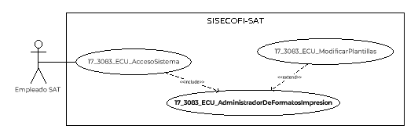
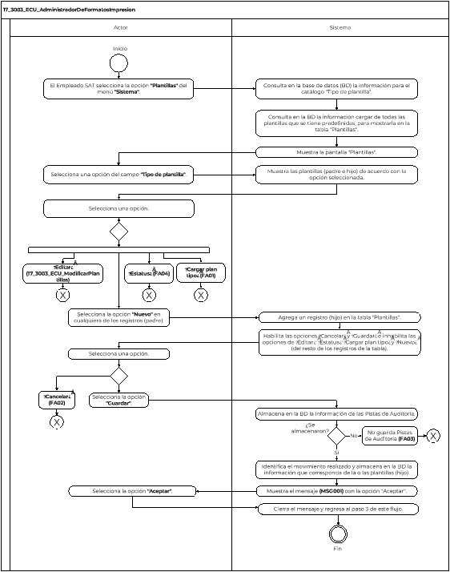

||Administración General de Comunicaciones y Tecnologías de la Información|
| :- | -: |
||Marco Documental 7.0|
|
Fecha de aprobación del Template:

02/08/2023
|
**Especificación del Caso de Uso**

17\_3083\_ECU\_AdministradorDeFormatosImpresion.docx
|Versión del template: 7.00|
| :-: | :-: | :-: |

**<ID Requerimiento>** 8309

**Nombre del Requerimiento: **TI\_SISECOFI-SAT\_Seguimiento financiero y control documental de proyectos de contratación

**Tabla de Versiones y Modificaciones**

|Versión|Descripción del cambio|Responsable de la Versión|Fecha|
| :-: | :- | :-: | :-: |
|*1*|*Creación del documento*|Isabel Adriana Valdez Cortés|*27/01/2024*|
|*1.1*|*Revisión del documento*|Luis Angel Olguin Castillo|*12/02/2024*|
|*1.2*|*Versión aprobada para firma*|
María del Carmen Castillejos Cárdenas

Rubén Delgado Ramírez
|*31/05/2024*|

**Tabla de Contenido**

[17_3083_ECU_AdministradorDeFormatosImpresion	2](#_toc168395279)

[1. Descripción	2](#_toc168395280)

[2. Diagrama del Caso de Uso	2](#_toc168395281)

[3. Actores	2](#_toc168395282)

[4. Precondiciones	2](#_toc168395283)

[5. Post condiciones	3](#_toc168395284)

[6. Flujo primario	3](#_toc168395285)

[7. Flujos alternos	5](#_toc168395286)

[8. Referencias cruzadas	7](#_toc168395287)

[9. Mensajes	7](#_toc168395288)

[10. Requerimientos No Funcionales	8](#_toc168395289)

[11. Diagrama de actividad	10](#_toc168395290)

[12. Diagrama de estados	10](#_toc168395291)

[13. Aprobación del cliente	11](#_toc168395292)

### ****17\_3083\_ECU\_AdministradorDeFormatosImpresion
**	

|<h3>**1. Descripción** </h3>|
| :- |
|

El objetivo de este Caso de Uso es permitir al Empleado SAT visualizar la información de las plantillas previamente cargadas para: “Formato\_Sol\_Pago”, “Proforma Factura”, “Proforma Nota de crédito”, “Proforma Penalización”, “RCP” y “Plan de trabajo”. Además de permitirle generar nuevas versiones de las plantillas, ingresar a editar las ya existentes o cargar el plan tipo que requiera.

|
|<h3>**2. Diagrama del Caso de Uso**</h3>|
||
|<h3>**3. Actores** </h3>|
||

|**Actor**|**Descripción**|
| :-: | :-: |
|**Empleado SAT**|El Empleado SAT es el que tiene el o los roles otorgados por la Administración Central de Seguridad, Monitoreo y Control (ACSMC) para ingresar a cada uno de los módulos de este sistema.|

|

|
| :- |
|<h3>**4. Precondiciones**</h3>|
|

- El Empleado SAT se ha autenticado en el sistema con e.firma válida.

- El sistema ha consumido el servicio “Oauth” para obtener los datos del Empleado SAT que ingresa.

- Se ha generado la estructura para las plantillas que se usan en los siguientes formatos de impresión definidos para este sistema: “Formato\_Sol\_Pago”, “Proforma Factura”, “Proforma Nota de crédito”, “Proforma Penalización”, “RCP” y “Plan tipo”.

- El sistema ha validado que el Empleado SAT cuenta con el rol para ingresar al menú “Sistema” y al submenú “Plantillas”.

- El Empleado SAT ha ingresado al menú “Sistema” y al submenú “Plantillas”, de acuerdo con el proceso del **(17\_3083\_ECU\_AccesoSistema)**.

|
|<h3>**5. Post condiciones** </h3>|
|

- El Empleado SAT agregó nuevas versiones de las plantillas precargadas.

- El Empleado SAT cargó el plan tipo que requería.

|
|<h3>**6. Flujo primario**</h3>|
||

|**Actor**|**Sistema**|
| :-: | :-: |
|1. El Caso de Uso inicia cuando el Empleado SAT selecciona en el menú **“Sistema”** la opción del submenú **“Plantillas”**.|2. Consulta en la base de datos (BD) la información para el catálogo “Tipo de plantilla” de acuerdo con la regla de negocio **(RNA01)**.|
||
3. Consulta en la BD la siguiente información previamente cargada de las plantillas (Formato\_Sol\_Pago, Proforma Factura, Proforma Nota de crédito, Proforma Penalización, RCP y Plan de trabajo), para mostrarla en la tabla “Plantillas”:

&emsp;

- Nombre de la plantilla

- Comentarios

- Fecha de modificación

- Estatus
|
||
4. Muestra en la pantalla “Plantillas -Búsqueda” lo siguiente:

&emsp;

&emsp;Búsqueda:

- Tipo de plantilla (Seleccionada por defecto la opción “Todas”)

Tabla “Plantillas”. Aplica la **(RNA116)**:

- Nombre de la plantilla

- Comentarios 

- Fecha de modificación

- Estatus. Aplica la **(RNA120)** 

- Acciones. Aplica la **(RNA224)**

Opciones:

- Nuevo 

- Cargar plan tipo 

- Editar  

- Estatus  

- Cancelar (Inhabilitado)

- Guardar (Inhabilitado)

Ver **(17\_3083\_EIU\_AdministradorDeFormatosImpresion)** Estilos 01.
|
|5. Selecciona una opción del campo **“Tipo de plantilla”**.|6. Muestra las plantillas (padre e hijo) de acuerdo con la opción seleccionada.|
|
7. Selecciona una opción:

- En caso de seleccionar la opción **“Nuevo”** en cualquiera de los registros (padre), el flujo continúa.

- En caso de que despliegue una plantilla (hijo) y seleccione la opción **“Editar”**, continúa en el **(17\_3083\_ECU\_ModificarPlantillas)**.

- En caso de que despliegue una plantilla (hijo) y seleccione la opción **“Estatus”**, continúa en el flujo alterno **([**FA04**](#fa04))**.

&emsp;

- En caso de que seleccione la opción **“Cargar plan tipo”**, continúa en el **([**FA01**](#fa01))**.
|8. Agrega un registro (hijo) en la tabla “Plantillas” de acuerdo con la **(RNA225)**.|
||9. Habilita las opciones “Cancelar” y “Guardar” e inhabilita las opciones de “Editar”, “Estatus”, “Cargar plan tipo” y “Nuevo” (del resto de los registros de la tabla).|
|
10. Selecciona una opción:

&emsp;

- En caso de seleccionar la opción **“Guardar”**, el flujo continúa.

&emsp;

- En caso de seleccionar la opción **“Cancelar”**, continúa en el **([**FA02**](#fa02))**.
|
11. Almacena en la BD la información de las Pistas de Auditoría.

&emsp;

&emsp;Datos que se almacenan:

**Módulo**= Plantillas

**Fecha y Hora**= Fecha y hora del sistema, usando el formato DD/MM/AAAA HH:MM:SS

**RFC Usuario**= RFC largo del Empleado SAT que ingresó al sistema.

**Tipo de movimiento**= **INSR** (Insertar) o **UPDT** (Modificar) según corresponda. 

**Movimiento**= Aplica la **(RNA239)**

- Nombre de la plantilla

- Estatus

- En caso de que no se puedan almacenar las Pistas de Auditoría, continúa en el **([**FA03**](#fa03))**.
|
||
12. Identifica el movimiento realizado y almacena en la BD la información que corresponda de la o las plantillas (hijo):

&emsp;

- Nombre de la plantilla

- Comentarios 

- Fecha de modificación

- Estatus (Cuando se almacene por primera vez el estatus será “Activo”)

- Archivo cargado (para el caso de la plantilla plan de trabajo)
|
||13. Muestra el mensaje **([**MSG001**](#msg001))** con la opción “Aceptar”. |
|14. Selecciona la opción **“Aceptar”**.|15. Cierra el mensaje y regresa al paso [**3**](#_ref168313165) de este flujo.|
||16. Fin del Caso de Uso.|

|

|
| :- |
|<h3>**7. Flujos alternos** </h3>|
|

**FA01 Selecciona la opción “Cargar plan tipo”**
|

|**Actor**|**Sistema**|
| :-: | :-: |
|1. El **FA01** inicia cuando el Empleado SAT selecciona la opción **“Cargar plan tipo”**.|2. Abre el gestor de archivos del equipo de cómputo.|
|3. Selecciona el archivo.|
4. Valida que el archivo seleccionado sea un Excel con extensión (.xlsx) y continúa en el paso [**9**](#_ref168312037) del Flujo primario.

&emsp;

- En caso de no cumplir con la validación, muestra el **([**MSG002**](#msg002))** con la opción “Aceptar” y continúa en el paso [**5**](#_ref166075886)** de este flujo.
|
|5. Selecciona la opción **“Aceptar”**.|6. Cierra el mensaje y continúa en el paso [**7**](#_ref166075812) del Flujo primario.|

|

**FA02 Selecciona la opción “Cancelar”**
|
| :- |

|**Actor**|**Sistema**|
| :-: | :-: |
|1. El **FA02** inicia cuando el Empleado SAT selecciona la opción **“Cancelar”**.|2. Muestra el **([**MSG003**](#msg003))** con las opciones “Sí” y “No”. |
|
3. Selecciona la opción **“Sí”** y el flujo continúa.

&emsp;

- En caso de que seleccione la opción **“No”**, continúa en el paso [**10**](#_ref164512103) del Flujo primario.
|4. Cierra el mensaje.|
||5. Cancela la operación sin completar el movimiento que estaba en proceso y regresa al último estado guardado.|
||6. Continúa en el paso **[**4**](#_ref164512141)** del Flujo primario.|

|

**FA03 No se pueden almacenar las Pistas de Auditoría**
|
| :- |

|**Actor**|**Sistema**|
| :-: | :-: |
||1. El **FA03** inicia cuando interviene un evento ajeno y no se puedan almacenar las Pistas de Auditoría. |
||2. Cancela la operación sin completar el movimiento que estaba en proceso.|
||
3. Muestra el mensaje informativo de acuerdo con lo siguiente:

- Si la pista de auditoría es por el tipo de movimiento **UPDT** o **INSR**, se muestra el **([**MSG004**](#msg004))**.

El mensaje se muestra con la opción “Aceptar”.
|
|4. Selecciona la opción **“Aceptar”**.|5. Cierra el mensaje.|
|

|6. Regresa al paso previo que detona la acción de la pista de auditoría.|

|

**FA04 Selecciona la opción “Estatus” para una plantilla (hijo)**
|
| :- |

|**Actor**|**Sistema**|
| :-: | :-: |
|1. El **FA04** inicia cuando el Empleado SAT selecciona la opción **“Estatus”** para una plantilla (hijo).|2. Muestra el **([**MSG005**](#msg005))** con las opciones “Sí” y “No”.|
|
3. Selecciona una de las opciones:

&emsp;

- En caso de que seleccione **“Sí”**, continúa en el paso [**6**](#_ref167989909) de este flujo.

- En caso de que seleccione **“No”**, continúa en el paso [**7**](#_ref166075812) del Flujo primario.
|
4. Identifica si se “Inactiva” la plantilla y valida que no se encuentre asignada en algún módulo de este sistema y el flujo continúa en el paso **[**6**](#_ref168312642)** de este flujo.

&emsp;

- En caso de que se encuentre asignada, muestra el **([**MSG006**](#msg006))** con la opción “Aceptar” y continúa en el paso [**5**](#_ref168395188) de este flujo.

&emsp;

- En caso de identificar que es para “Activar”, el flujo continúa en el paso [**6**](#_ref168312642) de este flujo.
|
|5. Seleccionar la opción **“Aceptar”** y continúa en el paso [**9**](#_ref168312037) del Flujo primario.|6. Realiza el movimiento correspondiente de acuerdo con la **(RNA43)**.|
||7. Continúa en el paso [**9**](#_ref168312037) del Flujo primario.|

|

|
| :- |
|<h3>**8. Referencias cruzadas** </h3>|
|

- 17\_3083\_CRN\_SeguimientoFinancieroYControl

- 17\_3083\_EIU\_AdministradorDeFormatosImpresion

- 17\_3083\_ECU\_AccesoSistema

- 17\_3083\_ECU\_ModificarPlantillas

|
|<h3>**9. Mensajes** </h3>|
||

|**ID Mensaje**|**Descripción**|
| :-: | :-: |
|**MSG001**|Se guardó la información de la plantilla correctamente.|
|**MSG002**|El archivo seleccionado no es un Excel. Por favor seleccione un archivo con la extensión correcta.|
|**MSG003**|
Se perderán todos los cambios no guardados.

¿Está seguro que desea continuar?
|
|**MSG004**|Ocurrió un error al guardar el registro, favor de intentar nuevamente (PA01).|
|**MSG005**|
Se actualizará el estatus de la plantilla.

¿Está seguro de continuar?
|
|**MSG006**|La plantilla se encuentra asignada, favor de desasociar antes de inactivar.|

|

|
| - |
|<h3>**10. Requerimientos No Funcionales** </h3>|
||

|**ID de RNF**|**Requerimiento No Funcional**|**Descripción**|
| :-: | :-: | :-: |
|**RNF001**|Disponibilidad|El sistema deberá estar activo las 24 horas del día, los 365 días del año con picos de operación en el horario de 9:00 a 18:00 horas.|
|**RNF002**|Concurrencia|
El número de Empleados SAT que puede tener el sistema son 150.

El número de accesos concurrentes que debe soportar este sistema son máximo 30 Empleados SAT.
|
|**RNF003**|Seguridad|El acceso solo podrá ser otorgado a todo Empleado SAT que tenga los roles asignados por la Administración Central de Seguridad, Monitoreo y Control (ACSMC) para cada módulo de este sistema.|
|**RNF004**|Usabilidad|
El sistema deberá manejar los siguientes elementos para facilitar la navegación: 

- Mensajes tipo flotantes (*tooltips*) con información de la herramienta que ofrece ayuda contextual, como guía para el Empleado SAT.

- Componente de ordenamiento que permita acomodar la información de la tabla de forma ascendente o descendente, considerando la columna donde es seleccionado. 

- Contar con un diseño responsivo que permita su óptima visualización en distintos tipos de dispositivos finales.
|
|**RNF005**|Eficiencia|Las consultas se dividen en generales y detalladas, para que las detalladas carguen la información solo cuando sean requeridas por el Empleado SAT.|
|**RNF006**|Usabilidad|
El Empleado SAT debe poder navegar a través de las páginas resultantes de la consulta considerando que el sistema debe mostrar inicialmente 15 registros por página, permitiendo al Empleado SAT seleccionar los registros que requiere visualizar, teniendo las opciones de 15, 50 y 100:

- Ir a la primera página (debe mostrar la primera página con el resultado de la consulta).

- Ir a la última página (debe mostrar la última página con el resultado de la consulta).

- Ir a la siguiente página (debe mostrar la siguiente página, considerando la página actual, con el resultado de la consulta y el número de registros seleccionados por el Empleado SAT).

- Ir a la página anterior (debe mostrar la página anterior considerando la actual, con el resultado de la consulta).

&emsp;

En la tabla deben mostrarse los registros ordenados alfabéticamente.
|
|**RNF007**|Seguridad|Las Pistas de Auditoría deben estar protegidas contra accesos no autorizados. Solo los Empleados SAT autorizados pueden consultarlas, y la información en ellas se definirá durante la etapa de diseño, la cual debe estar cifrada para mantenerla confidencial y evitar exposiciones no autorizadas.|
|**RNF08**|Fiabilidad|El sistema debe ser capaz de manejar excepciones de manera efectiva y presentar mensajes claros y comprensibles para garantizar una adecuada interacción con el sistema.|
|**RNF009**|Seguridad|Se debe mantener la información en pantalla en caso de un error al guardar las Pistas de Auditoría, siempre y cuando el escenario lo permita. Hay situaciones de infraestructura o de conexión de internet que sí pierde los datos ya que no están controlados por el sistema.|
|**RNF010**|Integridad|Al almacenar la información en la BD de tipo texto o alfanumérico se deben eliminar los espacios en blanco al inicio y fin de la cadena.|

|

|
| :- |
|<h3>**11. Diagrama de actividad** </h3>|
|

|
|<h3>**12. Diagrama de estados** </h3>|
|

No aplica, no se requiere para este proceso.
|
|<h3>**13. Aprobación del cliente** </h3>|
||

|**FIRMAS DE CONFORMIDAD**||
| :-: | :- |
|**Firma 1** |**Firma 2** |
|**Nombre**: María del Carmen Castillejos Cárdenas.|**Nombre**: Rubén Delgado Ramírez.|
|**Puesto**: Usuaria ACPPI.|**Puesto**: Usuario ACPPI.|
|**Fecha:**|**Fecha:**|
||.|
|**Firma 3** |**Firma 4**|
|**Nombre**: Rodolfo López Meneses.|**Nombre**: Diana Yazmín Pérez Sabido.|
|**Puesto**: Usuario ACPPI.|**Puesto**: Usuaria ACPPI.|
|**Fecha:**|**Fecha:**|
|||
|**Firma 5**|**Firma 6**|
|**Nombre**: Yesenia Helvetia Delgado Naranjo.|**Nombre:** Alejandro Alfredo Muñoz Núñez.|
|**Puesto**: APE ACPPI.|**Puesto:** RAPE ACPPI.|
|**Fecha**:|**Fecha**:|
|||
|**Firma 7**|**Firma 8**|
|**Nombre**: Luis Angel Olguin Castillo.|**Nombre**: Erick Villa Beltrán.|
|**Puesto**: Enlace ACPPI.|**Puesto**: Líder APE SDMA 6.|
|**Fecha**:|**Fecha**:|
|||
|**Firma 9**|**Firma 10**|
|**Nombre:** Juan Carlos Ayuso Bautista.|**Nombre:** Isabel Adriana Valdez Cortés.|
|**Puesto:** Líder Técnico SDMA 6.|**Puesto:** Analista de Sistemas DS SDMA 6.|
|**Fecha**:|**Fecha**:|
|||

||
| :- |

|||Página 1 de 9|
| :- | :-: | -: |

