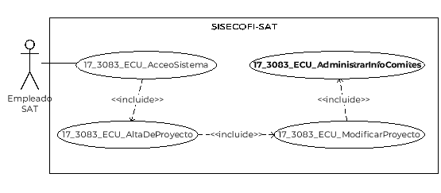
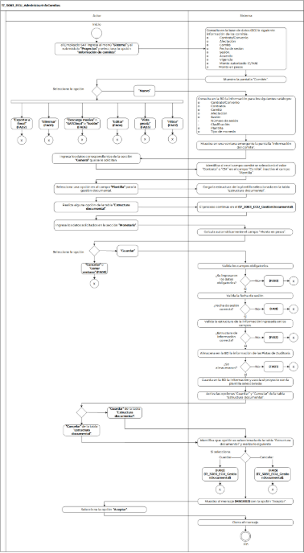

||Administración General de Comunicaciones y Tecnologías de la Información|
| :- | -: |
||Marco Documental 7.0|
|
Fecha de aprobación del Template:

02/08/2023
|
**Especificación del Caso de Uso**

17\_3083\_ECU\_AdministrarInfoComites.docx
|Versión del template: 7.00|
| :-: | :-: | :-: |

**<ID Requerimiento>**8309

**Nombre del Requerimiento:** TI\_SISECOFI-SAT\_Seguimiento financiero y control documental de proyectos de contratación

**Tabla de Versiones y Modificaciones**

|

Versión

|Descripción del cambio|Responsable de la Versión|Fecha|
| :-: | :- | :-: | :-: |
|*1*|*Creación del documento*|Eduardo Acosta Mora|02/02/2024|
|*1.1*|*Revisión del documento*|Luis Angel Olguin Castillo|11/03/2024|
|*1.2*|*Versión aprobada para firma*|
María del Carmen Castillejos Cárdenas

Rubén Delgado Ramírez
|28/05/2024|

**Tabla de Contenido**

[17_3083_ECU_AdministrarInfoComites	2](#_toc167978353)

[1. Descripción	2](#_toc167978354)

[2. Diagrama del Caso de Uso	2](#_toc167978355)

[3. Actores	2](#_toc167978356)

[4. Precondiciones	2](#_toc167978357)

[5. Post condiciones	3](#_toc167978358)

[6. Flujo primario	3](#_toc167978359)

[7. Flujos alternos	8](#_toc167978360)

[8. Referencias cruzadas	21](#_toc167978361)

[9. Mensajes	22](#_toc167978362)

[10. Requerimientos No Funcionales	22](#_toc167978363)

[11. Diagrama de actividad	25](#_toc167978364)

[12. Diagrama de estados	25](#_toc167978365)

[13. Aprobación del cliente	26](#_toc167978366)

### ****17\_3083\_ECU\_AdministrarInfoComites

|<h3>**1. Descripción** </h3>|
| :- |
|

El objetivo del Caso de Uso es permitir al Empleado SAT capturar la información para crear y administrar los comités indispensables para el proyecto.

|
|<h3>**2. Diagrama del Caso de Uso**</h3>|
||
|<h3>**3. Actores** </h3>|
||

|**Actor**|**Descripción**|
| :-: | :-: |
|**Empleado SAT**|El Empleado SAT es el que tiene el o los roles otorgados por la Administración Central de Seguridad, Monitoreo y Control (ACSMC) para ingresar a cada uno de los módulos de este sistema.|

|

|
| :- |
|<h3>**4. Precondiciones**</h3>|
|

- El Empleado SAT se ha autenticado en el sistema con e.firma válida.

- El sistema ha consumido el servicio “Oauth” para obtener los datos del Empleado SAT que ingresa al sistema.

- Se le han asignado los roles requeridos al Empleado SAT para ingresar al módulo “Sistema”, submódulo "Proyectos" y a la sección "Información de comités".

- El sistema ha validado que el Empleado SAT cuenta con los roles para ingresar al módulo “Sistema”, submódulo "Proyectos" y a la sección "Información de comités".

- Se ha almacenado la información de la plantilla con la estructura documental de la fase “Comité”.

|
|<h3>**5. Post condiciones** </h3>|
|

- El Empleado SAT capturó la información necesaria para crear un nuevo comité.

- El Empleado SAT adjuntó los archivos requeridos.

- El Empleado SAT administró la información de uno o varios comités.

- El Empleado SAT descargó los archivos adjuntos.

|
|<h3>**6. Flujo primario**</h3>|
||

|**Actor**|**Sistema**|
| :-: | :-: |
|1. El Caso de Uso inicia cuando el Empleado SAT ingresa al menú **“Sistema”** y al submódulo **“Proyectos”** y selecciona la opción **“Información de comités”**.|
2. Consulta en la base de datos (BD) la siguiente información de los comités:

&emsp;

&emsp;- Contrato/Convenio

&emsp;- Afectación

&emsp;- Comité

&emsp;- Fecha de sesión

&emsp;- Sesión. Aplica la regla de negocio **(RNA63)**

&emsp;- Acuerdo

&emsp;- Vigencia

&emsp;- Monto autorizado (C/IVA)

&emsp;- Monto en pesos
|
||
3. Muestra la pantalla “Comités” lo siguiente:

&emsp;

&emsp;Información de comités:

&emsp;Tabla (Comités) Aplica la **(RNA244)**:

&emsp;- Contrato/Convenio

&emsp;- Afectación

&emsp;- Comité

&emsp;- Fecha de sesión

&emsp;- Sesión (Enlace u opción)

&emsp;- Acuerdo

&emsp;- Vigencia

&emsp;- Monto Autorizado (C/IVA)

&emsp;- Monto en pesos

&emsp;- Acciones 

&emsp;- Vista previa 

&emsp;- Editar 

&emsp;- Eliminar . Aplica la **(RNA32)**

Opciones:

- Nuevo 

&emsp;- Exportar a Excel 

&emsp;- Descarga masiva 

&emsp;- SATCloud 

&emsp;- Campos para “Filtrar” por columna

Ver **(17\_3083\_EIU\_AdministrarInfoComites)** Estilos 01.
|
|
4. Selecciona una opción: 

&emsp;

- En caso de que seleccione la opción **“Nuevo”**, el flujo continúa.

- En caso de que seleccione la opción **“Exportar a Excel”**, continúa en el **([**FA02**](#fa02))**.

- En caso de que seleccione la opción **“Vista previa”**, continúa en el **([**FA03**](#fa03))**.

- En caso de que seleccione la opción **“Editar”**, continúa en el **([**FA04**](#fa04))**.

- En caso de que seleccione la opción **“Eliminar”**, continúa en el **([**FA05**](#fa05))**.

- En caso de que seleccione el enlace **“Clic”** o las opciones **“Descarga masiva”**,** o **“SATCloud”** de un registro de la columna **“Sesión”**, continúa en el **([**FA06**](#fa06))**.

- En caso de que seleccione la opción para **“Filtrar”** los campos de la tabla, continúa en el **([**FA07**](#fa07))**.
|
5. Consulta en la BD la información para los siguientes catálogos:

&emsp;

&emsp;- Contrato/Convenio

&emsp;- Contratos. Aplica la **(RNA37)**

&emsp;- Comité

&emsp;- Afectación

&emsp;- Sesión

- Número de sesión

- Clasificación

&emsp;- Plantilla

&emsp;- Tipo de moneda

**Nota:** Para el catálogo “Plantilla”, filtrará todas las plantillas que tengan la fase “Comité”.
|
||
6. Muestra en una ventana emergente la pantalla “Información del comité”, lo siguiente:

General:

- Contrato/Convenio\*

&emsp;- Contratos\*

&emsp;- Fecha de sesión\*

&emsp;- Comité\*

&emsp;- Afectación\*

&emsp;- Acuerdo

&emsp;- Vigencia

&emsp;- Sesión

- Número de sesión

- Clasificación

&emsp;- Plantilla\*

Muestra la pantalla  “Estructura documental”.

Ver **(17\_3083\_EIU\_GestionDocumental)** Estilos 01.

Monetario:

- Monto autorizado (C/IVA)

&emsp;- Tipo moneda

&emsp;- Tipo de cambio

&emsp;- Monto en pesos

&emsp;- Comentarios

Opciones:

- Cerrar ventana ![ref1]

&emsp;- Cancelar

&emsp;- Guardar

Ver **(17\_3083\_EIU\_AdministrarInfoComites)** Estilos 02.
|
|
7. Ingresa los datos correspondientes de la sección **“General”** que se le solicitan.

&emsp;

&emsp;
|
8. Identifica si en el campo comité si se seleccionó el valor “Contrato” o “CM” en el campo “Comité”, inactiva el campo “Plantilla” de acuerdo con la **(RNA33)**, el flujo continúa en el paso [**13**](#_ref167977365) de este flujo.

&emsp;

- En caso de que se seleccione un valor diferente a “Contrato” o “CM”, continúa en el paso **[**9**](#_ref167977377)** de este flujo.
|
|9. Selecciona una opción en al campo **“Plantilla”** para la gestión documental.|10. Carga la estructura de la plantilla seleccionada en la tabla “Estructura documental”.|
|11. ` `Si lo requiere, realiza alguna opción de la tabla **“Estructura documental”**.|12. El proceso se realiza en el **(17\_3083\_ECU\_GestionDocumental)** y continúa en el paso [**13**](#_ref167977365) de este flujo.|
|13. Ingresa los datos solicitados en la sección **“Monetario”**.|14. Calcula automáticamente el campo “Monto en pesos” de acuerdo con la **(RNA36)**.|
|
15. Selecciona una opción:

&emsp;

- En caso de que seleccione la opción **“Guardar”**, el flujo continúa.

- En caso de que seleccione la opción **“Cancelar”** o **“Cerrar ventana”**, continúa en el **([**FA08**](#fa08))**.
|
16. Valida los campos obligatorios de acuerdo con la **(RNA03)** y **(RNA33)**.

&emsp;

- En caso de no haber ingresado información en los campos obligatorios, continúa en el **([**FA10**](#fa10))**.
|
||
17. Valida la fecha de sesión de acuerdo con la **(RNA34)**.

&emsp;

- En caso de que la fecha de sesión sea incorrecta, continúa en el **([**FA11**](#fa11))**.
|
||
18. Valida la estructura de la información ingresada en los campos, de acuerdo con la **(RNA35)**.

&emsp;

- En caso de que la estructura de la información ingresada en los campos sea incorrecta, continúa en el **([**FA12**](#fa12))**.
|
||
19. Almacena en la BD la información de las Pistas de Auditoría.

&emsp;

&emsp;Datos que se almacenan:

**Módulo**= Proyecto-Informacióndecomités

Fecha y Hora = Fecha y hora del sistema usando el formato DD/MM/AAAA HH:MM:SS

**RFC Usuario**= RFC largo del Empleado SAT que ingresó al sistema.

**Tipo de movimiento**= **INSR** (Insertar)

**Movimiento**= Aplica la **(RNA239)**

- ID proyecto 

- ID de registro

- En caso de que no se pueda almacenar las Pistas de Auditoría, continúa en el **([**FA01**](#fa01))**.
|
||
20. Guarda en la BD la siguiente información y asocia el proyecto con la plantilla seleccionada:

&emsp;

&emsp;- Contrato/Convenio

&emsp;- Contratos

&emsp;- Fecha de sesión

&emsp;- Comité

&emsp;- Afectación

&emsp;- Sesión

- Número de sesión

- Clasificación

&emsp;- Acuerdo

&emsp;- Vigencia

&emsp;- Plantilla

&emsp;- Monto autorizado (C/IVA)

&emsp;- Tipo moneda

&emsp;- Tipo de cambio

&emsp;- Monto en pesos

&emsp;- Comentarios
|
||21. Activa las opciones “Guardar” y “Cancelar” de la tabla “Estructura documental”.|
|
22. Selecciona una opción:

- En caso de que seleccione la opción “Guardar” de la tabla “Estructura documental”, el flujo continúa.

&emsp;

- En caso de que seleccione la opción “Cancelar” de la tabla “Estructura documental”, el flujo continúa.
|
23. Identifica que opción es seleccionada de la tabla “Estructura documental” y realiza lo siguiente:

&emsp;

- Si selecciona la opción “Guardar”, el proceso se realiza en el **(FA10)** del **(17\_3083\_ECU\_GestionDocumental)**.

- Si selecciona la opción “Cancelar”, el proceso se realiza en el **(FA15)** del **(17\_3083\_ECU\_GestionDocumental)**.
|
||24. Muestra el mensaje **([**MSG002**](#msg002))** con la opción “Aceptar”.|
|25. Selecciona la opción **“Aceptar”**.|26. Cierra el mensaje.|
||27. Fin del Caso de Uso.|

|

|
| :- |
|<h3>**7. Flujos alternos** </h3>|
|

**FA01 No se pueden almacenar las Pistas de Auditoría**
|

|**Actor**|**Sistema**|
| :-: | :-: |
||1. El **FA01** inicia cuando interviene un evento ajeno y no se puede almacenar las pistas de auditoría.|
||2. Cancela la operación sin completar el movimiento que estaba en proceso.|
||
3. Muestra el mensaje de acuerdo con lo siguiente:

- Si la pista de auditoría es por el tipo de movimiento **UPDT** e **INSR**, se muestra el **([**MSG007**](#msg007))**.

- Si la pista de auditoría es por el tipo de movimiento **CNST**, se muestra el **([**MSG008**](#msg008))**.

- En caso de que la pista de auditoría es por el tipo de movimiento **PRNT**, se muestra el **([**MSG009**](#msg009))**.

- En caso de que la pista de auditoría es por el tipo de movimiento **DLT**, se muestra el **([**MSG010**](#msg010))**.

Cada mensaje con la opción “Aceptar”.
|
|4. Selecciona la opción **“Aceptar”**.|5. Cierra el mensaje.|
||6. Regresa al paso previo que detona la acción de la pista de auditoría. |

|

**FA02 Selecciona la opción “Exportar a Excel”**
|
| :- |

|**Actor**|**Sistema**|
| :-: | :-: |
|1. El **FA02** inicia cuando el Empleado SAT selecciona la opción **“Exportar a Excel”**.|
2. Consulta en la BD la siguiente información de los comités: 

&emsp;

&emsp;- Contrato/Convenio

&emsp;- Contratos

&emsp;- Fecha de sesión

&emsp;- Comité

&emsp;- Afectación

&emsp;- Acuerdo

&emsp;- Vigencia

&emsp;- Sesión

- Número de sesión

- Clasificación

&emsp;- Monto autorizado (C/IVA)

&emsp;- Tipo de moneda

&emsp;- Tipo de cambio

&emsp;- Monto en pesos

&emsp;- Comentarios
|
||
3. Almacena en la BD la información de las Pistas de Auditoría.

&emsp;

&emsp;Datos que se almacenan: 

**Módulo**= Proyecto-Informacióndecomités

Fecha y Hora = Fecha y hora del sistema usando el formato DD/MM/AAAA HH:MM:SS

**RFC Usuario**= RFC largo del Empleado SAT que ingresó al sistema.

**Tipo de movimiento**= 

**CNST** (Consultar)

**PRNT** (Imprimir)

**Movimiento**= Aplica la **(RNA239)**

- ID proyecto 

- Nombre corto del proyecto

- En caso de que no se pueda almacenar las Pistas de Auditoría, continúa en el **([**FA01**](#fa01))**.
|
||4. Genera un archivo de Excel con extensión (.xlsx) que contenga la información de la consulta anterior.|
||5. Descarga el archivo de Excel con extensión (.xlsx).|
||6. Continúa en el paso [**4**](#_ref167977412) del Flujo primario.|

|

**FA03 Selecciona la opción “Vista previa”**
|
| :- |

|**Actor**|**Sistema**|
| :-: | :-: |
|1. El **FA03** inicia cuando el Empleado SAT selecciona la opción **“Vista previa”**.|
2. Almacena en la BD la información de las Pistas de Auditoría.

&emsp;

&emsp;Datos que se almacenan: 

**Módulo**= Proyecto-Informacióndecomités

**Fecha y Hora**= Fecha y hora del sistema usando el formato DD/MM/AAAA HH:MM:SS

**RFC Usuario**= RFC largo del Empleado SAT que ingresó al sistema.

**Tipo de movimiento**= **CNST** (Consultar)

**Movimiento**= 

- ID proyecto 

- ID de registro

- En caso de que no se pueda almacenar las Pistas de Auditoría, continúa en el **([**FA01**](#fa01))**.
|
||3. Consulta en la BD la información del registro seleccionado.|
||4. Consulta en la BD la información de la tabla  “Estructura documental” relacionada con el registro seleccionado.|
||
5. Muestra en una ventana emergente (de solo consulta), la pantalla “Información del Comité”.

&emsp;

&emsp;Datos:

&emsp;- Contrato/Convenio

&emsp;- Contratos

&emsp;- Fecha de sesión

&emsp;- Comité

&emsp;- Afectación

&emsp;- Sesión

&emsp;- Acuerdo

&emsp;- Vigencia

&emsp;- Monto autorizado (C/IVA)

&emsp;- Tipo de moneda

&emsp;- Tipo de cambio

&emsp;- Monto en pesos

&emsp;- Comentarios

Muestra la pantalla  “Estructura documental”.

Ver **(17\_3083\_EIU\_GestionDocumental)** Estilos 01.

Opciones:

- Guardar (Inhabilitado)

&emsp;- Cerrar ventana ![ref2]

&emsp;- Cancelar (Inhabilitado)

Ver **(17\_3083\_EIU\_AdministrarInfoComites)** Estilos 02.
|
|6. Selecciona la opción **“Cerrar ventana”**.|7. Cierra la ventana emergente.|
||8. Continúa en el paso [**4**](#_ref167977412) del Flujo primario. |

|

**FA04 Selecciona la opción “Editar”**
|
| :- |

|**Actor**|**Sistema**|
| :-: | :-: |
|1. El **FA04** inicia cuando el Empleado SAT selecciona la opción **“Editar”**.|
2. Consulta en la BD la información para los siguientes catálogos:

&emsp;

&emsp;- Contrato/Convenio

&emsp;- Contratos. Aplica la **(RNA37)**

&emsp;- Comité

&emsp;- Afectación

&emsp;- Sesión

- Número de sesión

- Clasificación

&emsp;- Plantilla

&emsp;- Tipo de moneda

**Notas**: la opción que mostrará por defecto será la misma que fue seleccionada al hacer el registro.

Para el catálogo “Plantilla”, filtrará todas las plantillas que tengan la fase “Comité”.
|
||3. Consulta en la BD la información relacionada con el registro seleccionado.|
||
4. Muestra en una ventana emergente la pantalla “Información del comité”, lo siguiente:

General:

- Contrato/Convenio\*

&emsp;- Contratos\*

&emsp;- Fecha de sesión\*

&emsp;- Comité\*

&emsp;- Afectación\*

&emsp;- Acuerdo

&emsp;- Vigencia

&emsp;- Sesión

- Número de sesión

- Clasificación

&emsp;- Plantilla\*

Muestra la pantalla  “Estructura documental”.

Ver **(17\_3083\_EIU\_GestionDocumental)** Estilos 01.

Monetario:

- Monto autorizado (C/IVA)

&emsp;- Tipo moneda

&emsp;- Tipo de cambio

&emsp;- Monto en pesos

&emsp;- Comentarios

Opciones:

- Cerrar ventana ![ref1]

&emsp;- Cancelar

&emsp;- Guardar

Ver

**(17\_3083\_EIU\_AdministrarInfoComites)** Estilos 02.
|
|5. Edita la información que requiera de la sección “**General”**, si lo requiere, selecciona una opción en el campo **“Plantilla”** para la gestión documental.|
6. Si se seleccionó una nueva plantilla, valida que en la gestión documental no se haya cargado ningún archivo.

&emsp;

- En caso de que se haya cargado un archivo, continúa en el **([**FA13**](#fa13))**.
|
||7. Carga la plantilla en la tabla “Gestión documental”.|
|8. Ingresa los datos solicitados en la sección **“Monetario”**.|9. Calcula automáticamente el campo “Monto en pesos” de acuerdo con la **(RNA36)**.|
|
10. Selecciona una opción:

&emsp;

&emsp;En caso de que seleccione la opción **“Guardar”**, el flujo continúa.

- En caso de que seleccione la opción **“Cancelar”** o **“Cerrar”**, continúa en el **([**FA08**](#fa08))**. 
|
11. Valida los campos obligatorios de acuerdo con la **(RNA03)** y **(RNA33)**.

&emsp;

- En caso de no haber ingresado información en los campos obligatorios, continúa en el **([**FA10**](#fa10))**.
|
||
12. Valida la fecha de sesión de acuerdo con la **(RNA34)**.

&emsp;

- En caso de que la fecha de sesión sea incorrecta, continúa en el **([**FA11**](#fa11))**.
|
||
13. Valida la estructura de la información ingresada en los campos de acuerdo con la **(RNA35)**.

&emsp;

- En caso de que la estructura de la información ingresada en los campos sea incorrecta, continúa en el **([**FA12**](#fa12))**.
|
||
14. Almacena en la BD la información de las Pistas de Auditoría.

&emsp;

&emsp;Datos que se almacenan:

**Módulo**= Proyecto-Informacióndecomités

Fecha y Hora = Fecha y hora del sistema usando el formato DD/MM/AAAA HH:MM:SS

**RFC Usuario**= RFC largo del Empleado SAT que ingresó al sistema.

**Tipo de movimiento**= **UPDT** (Modificar)

**Movimiento**= Aplica la **(RNA239)**

- ID proyecto 

- ID de registro

- En caso de que no se pueda almacenar las Pistas de Auditoría, continúa en el **([**FA01**](#fa01))**.
|
||
15. Guarda en la BD la siguiente información y asocia el proyecto con la plantilla seleccionada:

&emsp;

&emsp;- Contrato/Convenio

&emsp;- Contratos

&emsp;- Fecha de sesión

&emsp;- Comité

&emsp;- Afectación

&emsp;- Sesión

- Número de sesión

- Clasificación

&emsp;- Acuerdo

&emsp;- Vigencia

&emsp;- Plantilla

&emsp;- Monto autorizado (C/IVA)

&emsp;- Tipo moneda

&emsp;- Tipo de cambio

&emsp;- Monto en pesos

&emsp;- Comentarios
|
||16. Activa las opciones “Guardar” y “Cancelar ” de la tabla “Estructura documental”.|
|
17. Selecciona una opción:

&emsp;

- En caso de que seleccione la opción “Guardar” de la tabla “Estructura documental”, el flujo continúa.

&emsp;

- En caso de que seleccione la opción “Cancelar” de la tabla “Estructura documental”, el flujo continúa.
|
18. Identifica que opción es seleccionada de la tabla “Estructura documental” y realiza lo siguiente:

- Si selecciona la opción “Guardar”, el proceso se realiza en el **(FA10)** del **(17\_3083\_ECU\_GestionDocumental)**.

- Si selecciona la opción “Cancelar”, el proceso se realiza en el **(FA15)** del **(17\_3083\_ECU\_GestionDocumental)**.
|
||19. Muestra el **([**MSG002**](#msg002))** con la opción “Aceptar”.|
|20. Selecciona la opción **“Aceptar”**.|21. Cierra el mensaje.|
||22. Continúa en el paso [**4**](#_ref167977412) del Flujo primario.|

|

**FA05 Selecciona la opción “Eliminar”**
|
| :- |

|**Actor**|**Sistema**|
| :-: | :-: |
|1. El **FA05** inicia cuando el Empleado SAT selecciona la opción **“Eliminar”**.|
2. Valida que en la estructura documental no se haya cargado ningún archivo.

&emsp;

- En caso de que se haya cargado un archivo, continúa en el **([**FA13**](#fa13))**.
|
||3. Muestra el **([**MSG003**](#msg003))** con las opciones “Sí” y “No”.|
|
4. Selecciona una opción:

&emsp;

- En caso de que seleccione la opción **“Sí”**, el flujo continúa.

- En caso de que seleccione la opción **“No”**, continúa en el paso [**4**](#_ref167977412) del Flujo primario. 
|
5. Almacena en la BD la información de las Pistas de Auditoría.

&emsp;

&emsp;Datos que se almacenan:

**Módulo**= Proyecto-Informacióndecomités

**Fecha y Hora**= Fecha y hora del sistema usando el formato DD/MM/AAAA HH:MM:SS

**RFC Usuario**= RFC largo del Empleado SAT que ingresó al sistema.

**Tipo de movimiento**= **DLT** (Borrar)

**Movimiento**= Aplica la **(RNA239)**

- ID proyecto 

- ID de registro

- En caso de que no se pueda almacenar las Pistas de Auditoría, continúa en el **([**FA01**](#fa01))**.
|
||6. Actualiza el estatus del registro a “Eliminado” en la BD y elimina la relación del comité con la plantilla.|
||7. Actualiza en la pantalla la tabla “Comités” ocultando el registro eliminado.|
||8. Continúa en el paso [**4**](#_ref167977412) del Flujo primario.|

|

**FA06 Selecciona las opciones o enlace “Sesión”**
|
| :- |

|**Actor**|**Sistema**|
| :-: | :-: |
|1. El **FA06** inicia cuando el Empleado SAT selecciona la opción o enlace **“Sesión”**.|
Identifica que opción es seleccionada:

- En el caso de que se haya seleccionado el enlace, el flujo continúa.

- En caso de que seleccione la opción “Descarga masiva”, continúa en el **([**FA14**](#fa14))**.

- En caso de que seleccione la opción “SATCloud”, continúa en el **([**FA15**](#fa15))**.
|
||
2. Almacena en la BD la información de las Pistas de Auditoría.

&emsp;

&emsp;Datos que se almacenan: 

**Módulo**= Proyecto-Informacióndecomités

**Fecha y Hora**= Fecha y hora del sistema usando el formato DD/MM/AAAA HH:MM:SS

**RFC Usuario**= RFC largo del Empleado SAT que ingresó al sistema.

**Tipo de movimiento**= **PRNT** (Imprimir)

**Movimiento**= Aplica la **(RNA239)**

- ID proyecto 

- Nombre del documento descargado

- En caso de que no se pueda almacenar las Pistas de Auditoría, continúa en el **([**FA01**](#fa01))**.
|
||3. Consulta en la BD el archivo adjunto relacionado con el comité.|
||4. Descarga el archivo adjunto.|
||5. Continúa en el paso [**4**](#_ref167977412) del Flujo primario.|

|

**FA07 Selecciona la opción para filtrar los campos de la tabla**
|
| :- |

|**Actor**|**Sistema**|
| :-: | :-: |
|1. El **FA07** inicia cuando el Empleado SAT selecciona la opción para **“Filtrar”** la información en alguna columna de acuerdo con lo que se muestra en la tabla.||
|2. Elige la columna para filtrar e ingresa el dato a buscar.|3. Busca dentro de la columna y filtra la información mostrada, de acuerdo con los caracteres ingresados en el campo.|
||4. Muestra en tiempo real todas las coincidencias que obtiene de dicha columna.|
||
5. Continúa en el paso [**4**](#_ref167977412) del Flujo primario.

|

|

**FA08 Selecciona la opción “Cancelar” o “Cerrar ventana”**
|
| :- |

|**Actor**|**Sistema**|
| :-: | :-: |
|1. El **FA08** inicia cuando el Empleado SAT selecciona la opción **“Cancelar”** o **“Cerrar ventana”**.|2. Muestra el **([**MSG004**](#msg004))** con las opciones “Sí” y “No”.|
|
3. Selección una opción: 

&emsp;

- En caso de que seleccione la opción **“Sí”**, el flujo continúa.

- En caso de que seleccione la opción **“No”** desde el paso 15 del Flujo primario, continúa en el paso [**15**](#_ref167977550) del Flujo primario.

- En caso de que seleccione la opción **“No”** desde el paso 10 del **([**FA04**](#fa04))**,** continúa en el paso [**10**](#_ref167977588) del **([**FA04**](#fa04))**.
|4. Cierra el mensaje.|
||5. Cancela la operación sin completar el movimiento que estaba en proceso.|
||
6. Dependiendo la situación, realiza lo siguiente:

&emsp;

- Si fue invocado en el paso 15 del Flujo primario, continúa en el paso [**4**](#_ref167977412) del Flujo primario.

- Si fue invocado en el paso 10 del **([**FA04**](#fa04))**, continúa en el paso [**4**](#_ref167977412) del Flujo primario.
|

|

**FA09 Error al generar el enlace y contraseña** 
|
| :- |

|**Actor**|**Sistema**|
| :-: | :-: |
||1. El **FA09** inicia cuando no se muestra el enlace y la contraseña.|
||2. Muestra el **([**MSG012**](#msg012))** con la opción “Aceptar”.|
|3. Selecciona la opción **“Aceptar”**.|4. Cierra el mensaje.|
||5. Continúa en el paso [**4**](#_ref167977412) del Flujo primario.|

|

**FA10 Información en campos obligatorios no ingresada**
|
| :- |

|**Actor**|**Sistema**|
| :-: | :-: |
||1. El **FA10** inicia cuando el sistema identifica que no se ingresó información en los campos obligatorios.|
||2. Muestra en rojo los campos pendientes de capturar.|
||3. Muestra el **([**MSG005**](#msg005))** con la opción “Aceptar”.|
|4. Selecciona la opción **“Aceptar”**.|5. Cierra el mensaje.|
||
6. Dependiendo la situación, realiza lo siguiente:

&emsp;

- Si fue invocado en el paso 16 del Flujo primario, continúa en el paso [**7**](#_ref165885396) del Flujo primario.

- Si fue invocado en el paso 11 del **([**FA04**](#fa04))**, continúa en el paso [**5**](#_ref165885454) del **([**FA04**](#fa04))**.
|

|

**FA11 La fecha de sesión es incorrecta**.
|
| :- |

|**Actor**|**Sistema**|
| :-: | :-: |
||1. El **FA11** inicia cuando el sistema identifica que la fecha de sesión es incorrecta.|
||2. Muestra el **([**MSG006**](#msg006))** con la opción “Aceptar”.|
|3. Selecciona la opción **“Aceptar”**.|4. Cierra el mensaje.|
||
5. Dependiendo la situación, realiza lo siguiente:

&emsp;

- Si fue invocado en el paso 17 del Flujo primario, continúa en el paso [**7**](#_ref165885396)** del Flujo primario.

- Si fue invocado en el paso 12 del **([**FA04**](#fa04))**, continúa en el paso [**5**](#_ref165885454) del **([**FA04**](#fa04))**.
|

|

**FA12 Estructura de información ingresada incorrecta**
|
| :- |

|**Actor**|**Sistema**|
| :-: | :-: |
||1. El **FA12** inicia cuando el sistema identifica que la estructura de la información ingresada es incorrecta.|
||2. Muestra el **([**MSG001**](#msg001))** con la opción “Aceptar”.|
|3. Selecciona la opción **“Aceptar”**.|4. Cierra el mensaje.|
||
5. Dependiendo la situación, realiza lo siguiente:

&emsp;

- Si fue invocado en el paso 18 del Flujo primario, continúa en el paso [**7**](#_ref165885396) del Flujo primario.

- Si fue invocado en el paso 13 del **([**FA04**](#fa04))**, continúa en el paso [**5**](#_ref165885454) del **([**FA04**](#fa04))**.
|

|

**FA13 Ya se ha cargado un archivo en la plantilla**
|
| :- |

|Actor|Sistema|
| :-: | :-: |
||1. El **FA13** inicia cuando ya se ha cargado un archivo en la plantilla.|
||2. Muestra el **([**MSG011**](#msg011))** con la opción “Aceptar”.|
|3. Selecciona la opción **“Aceptar”**.|4. Cierra el mensaje.|
||
5. Dependiendo de la situación, realiza lo siguiente:

&emsp;

- Si fue invocado en el paso 6 del **([**FA04**](#fa04))**, continúa en el paso [**5**](#_ref165885454) **([**FA04**](#fa04))**.

- Si fue invocado en el paso 2 del **([**FA05**](#fa05))**, continúa en el paso [**4**](#_ref167977412) del Flujo primario.
|

|

**FA14 Selecciona la opción “Descarga masiva”**
|
| :- |

|**Actor**|**Sistema**|
| :-: | :-: |
|1. El **FA14** inicia cuando el Empleado SAT selecciona la opción **“Descarga masiva”**.|
2. Almacena en la BD la información de las Pistas de Auditoría.

&emsp;

&emsp;Datos que se almacenan: 

**Módulo**= Proyecto-Informacióndecomités

Fecha y Hora = Fecha y hora del sistema usando el formato DD/MM/AAAA HH:MM:SS

**RFC Usuario**= RFC largo del Empleado SAT que ingresó al sistema.

**Tipo de movimiento**= **PRNT** (Imprimir)

**Movimiento**= Aplica la **(RNA239)**

- ID proyecto 

- Nombre de los documentos descargados en una cadena por separado por | (pipes)

- Ejemplo: (01\_FTO\_JC\_MDR4.PDF|SCP\_MDR4.PDF

- En caso de que no se pueda almacenar las Pistas de Auditoría, continúa en el **([**FA01**](#fa01))**.
|
||3. Consulta en la BD los archivos adjuntos relacionados con el comité.|
||4. Descarga el archivo en extensión (.ZIP) que contiene los archivos adjuntos.|
||5. Continúa en el paso [**4**](#_ref167977412) del Flujo primario.|

|

**FA15 Selecciona la opción “SATCloud”**
|
| :- |

|**Actor**|**Sistema**|
| :-: | :-: |
|1. El **FA15** inicia cuando el Empleado SAT selecciona la opción **“SATCloud”**.|
2. Almacena en la BD la información de las Pistas de Auditoría.

&emsp;

&emsp;Datos que se almacenan: 

**Módulo**= Proyecto-Informacióndecomités

Fecha y Hora = Fecha y hora del sistema usando el formato DD/MM/AAAA HH:MM:SS

**RFC Usuario**= RFC largo del Empleado SAT que ingresó al sistema.

**Tipo de movimiento**= **PRNT** (Imprimir)

**Movimiento**= Aplica la **(RNA239)**

- ID proyecto 

- Nombre de los documentos descargados en una cadena por separado por | (pipes)

- Ejemplo: (01\_FTO\_JC\_MDR4.PDF|SCP\_MDR4.PDF

- En caso de que no se pueda almacenar las Pistas de Auditoría, continúa en el **([**FA01**](#fa01))**.
|
||
3. Muestra en una ventana emergente la pantalla “Datos de la descarga” lo siguiente: 

&emsp;

&emsp;Campos:

&emsp;- url (enlace)

&emsp;- contraseña

Opciones:

- Copiar contraseña  

&emsp;- Cerrar

- En caso de que no se muestre el enlace y la contraseña, continúa en el **([**FA09**](#fa09))**.

Ver

**(17\_3083\_EIU\_AdministrarInfoComites)** Estilos 03.
|
|
4. Realiza lo siguiente:

&emsp;

- En caso de que se seleccione la opción **“Copiar contraseña”** y seleccione el enlace, el flujo continúa.

- En caso de que seleccione la opción **“Cerrar”**, continúa en el paso **4** del Flujo primario. 
|5. Realiza la conexión con el SATCloud en una nueva ventana para mostrar los archivos a descargar.|
|6. Realiza lo correspondiente para descargar los documentos adjuntos.|7. Descarga el archivo con extensión (.ZIP).|
||8. Continúa en el paso [**4**](#_ref167977412) del Flujo primario.|

|

|
| :- |
|<h3>**8. Referencias cruzadas** </h3>|
|

- 17\_3083\_EIU\_AdministrarInfoComites

- 17\_3083\_EIU\_GestionDocumental

- 17\_3083\_ECU\_GestionDocumental

- 17\_3083\_CRN\_SeguimientoFinancieroYControl

|
|<h3>**9. Mensajes**</h3>|
||

|**ID Mensaje**|**Descripción**|
| :-: | :-: |
|**MSG001**|La estructura de la información ingresada es incorrecta. Intente nuevamente.|
|**MSG002**|Información guardada correctamente.|
|**MSG003**|¿Está seguro de que desea continuar?|
|**MSG004**|
Se perderán todos los cambios realizados.

¿Está seguro de que desea continuar?
|
|**MSG005**|Favor de ingresar los datos obligatorios marcados con un asterisco (\*).|
|**MSG006**|La fecha de sesión no puede ser mayor a la fecha actual.|
|**MSG007**|Ocurrió un error al guardar el registro, favor de intentar nuevamente (PA01).|
|**MSG008**|Ocurrió un error al consultar la información, favor de intentar nuevamente (PA01).|
|**MSG009**|Ocurrió un error al exportar la información, favor de intentar nuevamente (PA01).|
|**MSG010**|Ocurrió un error al eliminar la información, favor de intentar nuevamente (PA01).|
|**MSG011**|
No se puede realizar la acción, ya que la plantilla contiene documentos cargados. 

Para continuar, elimine primero los documentos cargados.
|
|**MSG012**|Error al generar el enlace y contraseña. Intente nuevamente.|

|

|
| :- |
|<h3>**10. Requerimientos No Funcionales** </h3>|
||

|**ID de RNF**|**Requerimiento No Funcional**|**Descripción**|
| :-: | :-: | :-: |
|**RNF001**|Disponibilidad|El sistema deberá estar activo las 24 horas del día, los 365 días del año con picos de operación en el horario de 9:00 a 18:00 horas.|
|**RNF002**|Concurrencia|
El número de Empleados SAT que puede tener el sistema son 150. 

El número de accesos concurrentes que debe soportar este sistema son máximo 30 Empleados SAT.
|
|**RNF003**|Seguridad|El acceso solo podrá ser otorgado a todo Empleado SAT que tenga los roles asignados por la Administración Central de Seguridad, Monitoreo y Control (ACSMC) para cada módulo de este sistema.|
|**RNF004**|Usabilidad|
El sistema deberá manejar los siguientes elementos para facilitar la navegación:  

- Mensajes tipo flotantes (*tooltips*) con información de la herramienta que ofrece ayuda contextual, como guía para el Empleado SAT.  

- Componente de ordenamiento que permita acomodar la información de la tabla de forma ascendente o descendente, considerando la columna donde es seleccionado.  

- Contar con un diseño responsivo que permita su óptima visualización en distintos tipos de dispositivos finales.
|
|**RNF005**|Eficiencia|Las consultas se dividen en generales y detalladas, para que las detalladas carguen la información solo cuando sean requeridas por el Empleado SAT. |
|**RNF006**|Usabilidad|
El Empleado SAT podrá navegar a través de las páginas resultantes de la consulta considerando que el sistema debe mostrar inicialmente 15 registros por página, permitiendo al Empleado SAT seleccionar los registros que requiere visualizar, teniendo las opciones 15, 50 y 100:  

  

- Ir a la primera página (debe mostrar la primera página con el resultado de la consulta).  

- Ir a la última página (debe mostrar la última página con el resultado de la consulta).  

- Ir a la siguiente página (debe mostrar la siguiente página, considerando la página actual, con el resultado de la consulta y el número de registros seleccionados por el Empleado SAT).  

- Ir a la página anterior (debe mostrar la página anterior considerando la actual, con el resultado de la consulta).  

  

En la tabla deben mostrarse los registros ordenados alfabéticamente. 
|
|**RNF007**|Seguridad|Las Pistas de Auditoría deben estar protegidas contra accesos no autorizados. Solo los Empleados SAT autorizados pueden consultarlas, y la información en ellas se definirá durante la etapa de diseño, la cual debe estar cifrada para mantenerla confidencial y evitar exposiciones no autorizadas.   |
|**RNF008**|Fiabilidad|El sistema debe ser capaz de manejar excepciones de manera efectiva y presentar mensajes claros y comprensibles para garantizar una adecuada interacción con el sistema. |
|**RNF009**|Seguridad|Mantener la información en pantalla en caso de un error al guardar las pistas de auditoría, siempre y cuando el escenario lo permita. Hay situaciones de infraestructura o de conexión de internet que sí pierde los datos ya que no están controlados por el sistema. |
|**RNF010**|Integridad|Al almacenar la información en la BD de tipo Texto o alfanumérico se deben eliminar los espacios en blanco al inicio y fin de la cadena. |

||
| :- |
|

|
|<h3>**11. Diagrama de actividad** </h3>|
|

|
|<h3>**12. Diagrama de estados** </h3>|
|

No Aplica, no hay cambios significativos de estados ni transiciones.

|
|<h3>**13. Aprobación del cliente** </h3>|
||

|**FIRMAS DE CONFORMIDAD**||
| :-: | :- |
|**Firma 1** |**Firma 2** |
|**Nombre**: María del Carmen Castillejos Cárdenas.|**Nombre**: Rubén Delgado Ramírez.|
|**Puesto**: Usuaria ACPPI.|**Puesto**: Usuario ACPPI.|
|**Fecha:**|**Fecha:**|
|||
|**Firma 3** |**Firma 4**|
|**Nombre**: Rodolfo López Meneses.|**Nombre**: Diana Yazmín Pérez Sabido.|
|**Puesto**: Usuario ACPPI.|**Puesto**: Usuaria ACPPI.|
|**Fecha:**|**Fecha:**|
|||
|**Firma 5**|**Firma 6**|
|**Nombre**: Yesenia Helvetia Delgado Naranjo.|**Nombre:** Alejandro Alfredo Muñoz Núñez.|
|**Puesto**: APE ACPPI.|**Puesto:** RAPE ACPPI.|
|**Fecha**:|**Fecha**:|
|||
|**Firma 7**|**Firma 8**|
|**Nombre**: Luis Angel Olguin Castillo.|**Nombre**: Erick Villa Beltrán.|
|**Puesto**: Enlace ACPPI.|**Puesto**: Líder APE SDMA 6.|
|**Fecha**:|**Fecha**:|
|||
|**Firma 9**|**Firma 10**|
|**Nombre:** Juan Carlos Ayuso Bautista.|**Nombre:** Eduardo Acosta Mora.|
|**Puesto:** Líder Técnico SDMA 6.|**Puesto:** Analista SDMA 6.|
|**Fecha**:|**Fecha**:|
|||

|

|
| :- |

|||Página 1 de 9|
| :- | :-: | -: |

[ref1]: Aspose.Words.7c81d30f-d018-4bc7-9659-f8945ec6e5ec.010.png
[ref2]: Aspose.Words.7c81d30f-d018-4bc7-9659-f8945ec6e5ec.011.png
