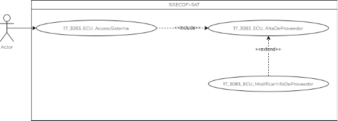
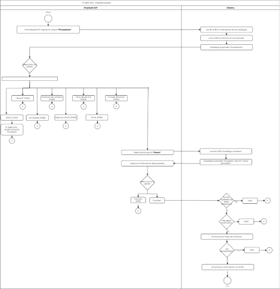

||Administración General de Comunicaciones y Tecnologías de la Información|
| :- | -: |
||Marco Documental 7.0|
|
Fecha de aprobación del Template:

02/08/2023
|
**Especificación del Caso de Uso**

17\_3083\_ECU\_AltaDeProveedor.docx
|Versión del template: 7.00|
| :-: | :-: | :-: |

**<ID Requerimiento>** 8309

**Nombre del Requerimiento: **TI\_SISECOFI-SAT\_Seguimiento financiero y control documental de proyectos de contratación

**Tabla de Versiones y Modificaciones**

|Versión|Descripción del cambio|Responsable de la Versión|Fecha|
| :-: | :- | :-: | :-: |
|*1*|*Creación del documento*|Edgar Vergara Tadeo|23/01/2024|
|*1.1*|*Revisión del documento*|Luis Angel Olguin Castillo|02/05/2024|
|*1.2*|*Versión aprobada para firma*|
María del Carmen Castillejos Cárdenas

Rubén Delgado Ramírez
|17/05/2024|

**Tabla de Contenido**

[1. Descripción	2](#_toc167176834)

[2. Diagrama del Caso de Uso	2](#_toc167176835)

[3. Actores	2](#_toc167176836)

[4. Precondiciones	2](#_toc167176837)

[5. Post condiciones	3](#_toc167176838)

[6. Flujo Primario	3](#_toc167176839)

[7. Flujos alternos	7](#_toc167176840)

[8. Referencias cruzadas	18](#_toc167176841)

[9. Mensajes	18](#_toc167176842)

[10. Requerimientos No Funcionales	18](#_toc167176843)

[11. Diagrama de actividad	21](#_toc167176844)

[12. Diagrama de estados	21](#_toc167176845)

[13. Aprobación del cliente	22](#_toc167176846)

17\_3083\_ECU\_AltaDeProveedor.

|<h3>**1. Descripción** </h3>|
| :- |
|

El objetivo de este Caso de Uso es permitir al Empleado SAT ingresar al módulo “Proveedores”, registrar nuevos proveedores y realizar la consulta de los existentes. Además, facilita el acceso a la modificación de la información registrada.

|
|<h3>**2. Diagrama del Caso de Uso**</h3>|
|

|
||
|<h3>**3. Actores** </h3>|
||

|**Actor**|**Descripción**|
| :-: | :-: |
|**Empleado SAT**|El Empleado SAT es el que tiene el o los roles otorgados por la Administración Central de Seguridad, Monitoreo y Control (ACSMC) para ingresar a cada uno de los módulos de este sistema.|

|

|
| :- |
|<h3>**4. Precondiciones**</h3>|
|

- El Empleado SAT se ha autenticado en el sistema con e.firma válida. 

- El sistema ha consumido el servicio “Oauth” para obtener los datos del Empleado SAT que ingresa.

- El sistema ha validado que el Empleado SAT cuenta con los roles para ingresar al módulo “Proveedores”. 

- Se han registrado giros de empresa en el catálogo relacionado.

- Se han registrado títulos de servicio en el catálogo relacionado.

&emsp;
|
|<h3>**5. Post condiciones** </h3>|
|

- El Empleado SAT registró un nuevo proveedor en el catálogo de proveedores.

- El Empleado SAT consultó algún proveedor ya registrado en el sistema.

&emsp;
|
|<h3>**6. Flujo Primario**</h3>|
||

|**Actor**|**Sistema**|
| :-: | :-: |
|1. El Caso de Uso inicia cuando el Empleado SAT ingresa al menú **“Proveedores”**.|
2. Lee de la base de datos (BD) la información de los siguientes catálogos para usarlos en los campos correspondientes. Aplica la regla de negocio **(RNA01)**.

&emsp;

- Giro de la empresa

- Título de servicio

- Cumple dictamen
|
||
3. Lee de la BD la información almacenada de los proveedores existentes “Activos e Inactivos” para mostrarlos en la pantalla en modo solo lectura. Aplica la **(RNA82)**:

&emsp;

- Id

- Nombre del proveedor

- Nombre comercial

- Giro de la empresa

- Directorio de contacto

- RFC

- Representante legal

- Título de servicio. Aplica la **(RNA15)**

- Vigencia. Aplica la **(RNA17)**

- Fecha de vencimiento

- Cumple dictamen. Aplica la **(RNA16)**

- Estatus

- En caso de que no se encuentren valores, continúa en el **([**FA08**](#fa08))**.
|
||
4. Despliega la pantalla “Proveedores”** con los siguientes datos. Aplica la **(RNA72)**.

Buscar proveedor:

- Giro de la empresa

&emsp;- Título de servicio, se mostrará el nombre corto.

&emsp;- Cumple dictamen

&emsp;&emsp;

Opciones:

- Buscar

- Nuevo

- Exportar a Excel **![ref1]**

Tabla:

- Id

- Nombre del proveedor

- Nombre comercial

- Giro de la empresa

- Directorio de contacto![ref2]

- RFC

- Representante legal

- Título de servicio. Aplica la **(RNA15)**

- Vigencia. Aplica la **(RNA17)**

- Fecha de vencimiento

- Cumple dictamen. Aplica la **(RNA16)**

- Estatus

&emsp;- Activo ![ref3]

&emsp;- Inactivo ![ref4]

Acciones:

- Editar ![ref5]

- Ver detalle ![ref6]

Ver **(17\_3083\_EIU\_AltaDeProveedor)** Estilos 01.
|
|
5. Selecciona la opción **“Nuevo”** y** continúa el flujo.

- En caso de que seleccione la opción **“Buscar”**, continúa en el flujo alterno **([**FA01**](#fa01))**.

- En caso de que seleccione la opción **“Directorio de contacto”**, continúa en el **([\[**FA02**\](#fa02)**)**.](#fa02)**

- En caso de que seleccione la opción **“Título de servicio”** de la columna **“Título de servicio”**, continúa en el **([\[**FA03**\](#fa03)**)**.](#fa03)**

- En caso de que seleccione la opción **“Cumple dictamen”** de la columna **“Cumple dictamen”**, continúa en el **([**FA04**](#fa04))**.

- En caso de que seleccione la opción **“Editar”**, continúa en el **([**FA05**](#fa05))**.

- En caso de que seleccione la opción **“Ver detalle”**, continúa en el **([**FA06**](#fa06))**.

- En caso de que seleccione la opción **“Exportar a Excel”**, continúa en el **([**FA09**](#fa09))**.

- En caso de que requiera filtrar información, selecciona la opción **“Filtrar”** por alguno de los campos de las columnas de la tabla, continúa el **([**FA13**](#fa13))**.
|
6. Lee de la BD la información del siguiente catálogo para usarlo en el campo correspondiente: 

&emsp;

- Giro de la empresa

|
||
7. Despliega la pantalla “Proveedor” sección “Datos generales”.

&emsp;

Datos:

- Nombre del proveedor\*

- Nombre comercial\*

- RFC

- Dirección

- Giro de la empresa\*

- Comentarios

- Id AGS

- Estatus\*

Opciones:

- Guardar

- Cancelar

Secciones colapsadas:

- Directorio de contacto

- Títulos de servicio

- Dictamen técnico

Ver **(17\_3083\_EIU\_AltaDeProveedor)** Estilos 02.
|
|8. Captura la información del proveedor.|

|
|
9. Da clic en la opción **“Guardar”** y** continúa en el flujo. 

&emsp;

- Si selecciona la opción **“Cancelar”** continúa en el **([**FA11**](#fa11))**.
|
10. Valida que se hayan ingresado todos los datos obligatorios. Aplica la **(RNA03)**.

&emsp;

- En caso de que no se haya ingresado alguno de los datos obligatorios, continúa en el **([**FA10**](#fa10))**.
|
||
11. Valida que no existan campos duplicados conforme a la **(RNA252)**.

&emsp;

- ` `En caso de que existan campos duplicados, continúa en el **([**FA07**](#fa07))**.
|
||
12. Almacena en la BD las Pistas de Auditoría.

&emsp;

&emsp;Datos que se almacenan:

**Módulo**= Proveedores

**Fecha y Hora**= Fecha y hora del sistema, usando el formato DD/MM/AAAA HH:MM:SS

**RFC Empleado SAT**= RFC largo del Empleado SAT que ingresó al sistema.

**Tipo de movimiento**= **INSR** (Insertar)

**Movimiento**= Aplica la **(RNA239)**

- Id de proveedor

&emsp;&emsp;

- En caso de que no se pueda almacenar las Pistas de Auditoría, continúa en el **([**FA12**](#fa12))**.
|
||13. Almacena en la BD la información registrada por el Empleado SAT.|
||14. Muestra el **([**MSG008**](#msg008))** con la opción “Aceptar”.|
|15. Selecciona la opción **“Aceptar”**.|16. Cierra el mensaje.|
||
17. Habilita las siguientes secciones. Aplica la **(RNA72)**:

&emsp;

- Directorio de contacto

- Títulos de servicio

- Dictamen técnico
|
||18. Fin del Caso de Uso.|

||
| :- |
|

|
|<h3>**7. Flujos alternos** </h3>|
|

**FA01 Selecciona la opción Buscar**
|

|**Actor**|**Sistema**|
| :-: | :-: |
|1. El **FA01** inicia cuando el Empleado SAT selecciona algún parámetro de los filtros de búsqueda.||
|2. Selecciona la opción **“Buscar”**.|
3. Verifica que se han ingresado los criterios obligatorios para la búsqueda, de acuerdo con la **(RNA19)**.

&emsp;

- En caso de que no se haya ingresado alguno de los criterios obligatorios, continúa en el **([**FA10**](#fa10))**.
|
||
4. Almacena en la BD las Pistas de Auditoría.

&emsp;

&emsp;Datos que se almacenan:

**Módulo =** Proveedores

**Fecha y Hora**= Fecha y hora del sistema, usando el formato DD/MM/AAAA HH:MM:SS

**RFC Empleado SAT**= RFC largo del Empleado SAT que ingresó al sistema.

**Tipo de movimiento**= **CNST** (Consulta)

**Movimiento**=	

- Giro de la empresa seleccionado para la búsqueda

&emsp;- Título de servicio seleccionado para la búsqueda

&emsp;- Cumple dictamen seleccionado para la búsqueda

&emsp;&emsp;

- En caso de que no se pueda almacenar las Pistas de Auditoría, continúa en el **([**FA12**](#fa12))**.
|
||
5. Consulta en la BD los proveedores que coincidan con los criterios de búsqueda.

&emsp;

- En caso de que no existan proveedores que coincidan con el criterio de búsqueda, continúa en el **([**FA08**](#fa08))**.
|
||
6. Muestra en la pantalla de “Proveedores” la información de los proveedores que cumplan con el parámetro de búsqueda.

&emsp;

Tabla:

- Id

- Nombre del proveedor

- Nombre comercial

- Giro de la empresa

- Directorio de contacto![ref2]

- RFC

- Representante legal

- Título de servicio. Aplica la **(RNA15)**

- Vigencia. Aplica la **(RNA17)**

- Fecha de vencimiento

- Cumple dictamen. Aplica la **(RNA16)**

- Estatus:

&emsp;- Activo ![ref3]

&emsp;- Inactivo ![ref4]

Acciones:

- Editar ![ref5]

&emsp;- Ver detalle ![ref6]

Ver **(17\_3083\_EIU\_AltaDeProveedor)** Estilos 01.
|
||7. Continúa en el paso **[**5**](#_ref160204596)** del Flujo primario.|

|

**FA02 Selecciona la opción Directorio de contacto** **de la tabla de la pantalla Proveedores**
|
| :- |

|**Actor**|**Sistema**|
| :-: | :-: |
|1. El **FA02** inicia cuando el Empleado SAT selecciona la opción “**Directorio de contacto”** de la tabla de la pantalla **“Proveedores”** de un proveedor.|
2. Almacena en la BD las Pistas de Auditoría.

&emsp;

&emsp;Datos que se almacenan:

**Módulo** =** Proveedores-Directorio de contacto

**Fecha y Hora**= Fecha y hora del sistema, usando el formato DD/MM/AAAA HH:MM:SS

**RFC Empleado SAT**= RFC largo del Empleado SAT que ingresó al sistema.

**Tipo de movimiento**= **CNST** (Consulta)

**Movimiento**=

- Id del proveedor

&emsp;&emsp;

- En caso de que no se pueda almacenar las Pistas de Auditoría, continúa en el **([**FA12**](#fa12))**.
|
||3. Consulta en la BD los datos almacenados, en la sección “Directorio de contacto” del proveedor seleccionado.|
||
4. El sistema muestra la pantalla de consulta “Detalle directorio de contacto” la cual, es de solo lectura.

        

Tabla:

- Id

- Nombre del contacto

- Teléfono oficina

- Teléfono celular

- Correo electrónico

- Representante legal ![ref3]

- Comentarios

Opciones:

- Exportar a Excel ![ref7]

- Cerrar![ref8]

Ver **(17\_3083\_EIU\_AltaDeProveedor)** Estilos 03.
|
|
5. Selecciona la opción **“Cerrar”** y continúa en el flujo.

&emsp;

- Si selecciona la opción **“Exportar a Excel”**, continúa en el **([**FA09**](#fa09))**.

- En caso de que se requiera **“Filtrar”** por alguno de los campos de las columnas de la tabla, continúa el **([**FA13**](#fa13))**.
|6. Regresa al paso [**5**](#_ref160204596) del Flujo Primario.|

|

**FA03 Selecciona la opción Título de servicio de la tabla de la pantalla Proveedores**
|
| :- |

|**Actor**|**Sistema**|
| :-: | :-: |
|1. El **FA03** inicia cuando el Empleado SAT da clic sobre el enlace **“Título de servicio”** de la tabla de la pantalla **“Proveedores”** que se encuentra debajo de la columna **“Título de servicio”** del** proveedor.|
2. Almacena en la BD las Pistas de Auditoría.

&emsp;

&emsp;Datos que se almacenan:

**Módulo=** Proveedores-Títulos de servicio

**Fecha y Hora**= Fecha y hora del sistema, usando el formato DD/MM/AAAA HH:MM:SS

**RFC Empleado SAT**= RFC largo del Empleado SAT que ingresó al sistema.

**Tipo de movimiento**= **CNST** (Consulta)

**Movimiento**= 

- Id del proveedor

- En caso de que no se pueda almacenar las Pistas de Auditoría, continúa en el **([**FA12**](#fa12))**.
|
||3. Consulta la información almacenada en la BD de la sección “Título de servicio” del proveedor seleccionado.|
||
4. El sistema muestra la pantalla de consulta “Detalle títulos” con los datos obtenidos, la cual es de solo lectura.

&emsp;

Datos:

- Id

- Número de título

- Título de servicio

- Estatus. Aplica la **(RNA240)**

- Fecha de vencimiento

- Vigencia. Aplica la **(RNA17)**

- Comentarios

Opciones:

- Exportar a Excel ![ref7]

- Cerrar ![ref9]

Ver **(17\_3083\_EIU\_AltaDeProveedor)** Estilos 04.
|
|
5. Selecciona la opción **“Cerrar”** y continúa en el flujo.

&emsp;

- Si selecciona la opción “**Exportar a Excel”**, continúa en el [**(\[**FA09**\](#fa09))**](#fa09).

- En caso de que requiera **“Filtrar**” por alguno de los campos de las columnas de la tabla, continúa el flujo [**(\[**FA13**\](#fa13))**](#fa14).
|6. Regresa al paso [**5**](#_ref160204596) del Flujo Primario.|

|

**FA04 Selecciona la opción Cumple dictamen de la tabla de la pantalla Proveedores**
|
| :- |

|**Actor**|**Sistema**|
| :-: | :-: |
|1. El **FA04** inicia cuando el Empleado SAT da clic sobre el contador **“Cumple dictamen”** de la tabla de la pantalla **“Proveedores”** que se encuentra debajo de la columna **“Cumple dictamen”** de un proveedor.|
2. Almacena en la BD las Pistas de Auditoría.

&emsp;

&emsp;Datos que se almacenan:

**Módulo=** Proveedores-Cumple dictamen

**Fecha y Hora**= Fecha y hora del sistema, usando el formato DD/MM/AAAA HH:MM:SS

**RFC Empleado SAT**= RFC largo del Empleado SAT que ingresó al sistema.

**Tipo de movimiento**= **CNST** (Consulta)

**Movimiento**=

- Id del proveedor

- En caso de que no se pueda almacenar las Pistas de Auditoría, continúa en el **([**FA12**](#fa12)[**)**](#fa12)**.
|
||3. Consulta en la BD la información almacenada de la sección “Detalle de dictamen técnico del proveedor” seleccionado.|
||
4. El sistema muestra la pantalla de consulta “Detalle de dictamen técnico” la cual, es de solo lectura.

&emsp;

Datos:

- Id

- Servicio

- Año

- Responsable

- Resultado

- Observación

`        `Opciones:

- Exportar a Excel ![ref7]

- Cerrar ![ref8]

Ver **(17\_3083\_EIU\_AltaDeProveedor)** Estilos 05.
|
|
5. Selecciona la opción **“Cerrar”** y continúa en el flujo.

&emsp;

- Si selecciona la opción **“Exportar a Excel”**, continúa en el [**(\[**FA09**\](#fa09))**](#fa09).

- En caso de que requiera **“Filtrar”** por alguno de los campos de las columnas de la tabla, continúa el [**(\[**FA13**\](#fa13))**](#fa14).
|6. Regresa al paso [**5**](#_ref160204596) del Flujo primario.|

|

**FA05 Selecciona la opción Editar** 
|
| :- |

|**Actor**|**Sistema**|
| :-: | :-: |
|1. El **FA05** inicia cuando el Empleado SAT da clic sobre la opción **“Editar”**.|2. Continúa el flujo en **(17\_3083\_ECU\_ModificarInfoDeProveedor)**.|
||3. Fin de Caso de Uso.|

|

**FA06 Selecciona la opción Ver detalle**
|
| :- |

|**Actor**|**Sistema**|
| :-: | :-: |
|1. El **FA06** inicia cuando el Empleado SAT da clic sobre la opción **“Ver detalle”**.|
2. Almacena en la BD las Pistas de Auditoría.

&emsp;

&emsp;Datos que se almacenan:

**Módulo=** Proveedores-Detalle

**Fecha y Hora**= Fecha y hora del sistema, usando el formato DD/MM/AAAA HH:MM:SS

**RFC Empleado SAT**= RFC largo del Empleado SAT que ingresó al sistema.

**Tipo de movimiento**= **CNST** (Consulta)

**Movimiento**=

- Id del proveedor

- En caso de que no se pueda almacenar las Pistas de Auditoría, continúa en el **([**FA12**](#fa12))**.
|
||
3. Consulta en la BD la información del proveedor de la sección:

&emsp;

- Datos generales
|
||
4. Muestra la pantalla Proveedor, de solo lectura.

&emsp;

Sección “Datos generales”

Datos:

- Nombre del proveedor\*

- Nombre comercial\*

- RFC

- Dirección

- Giro de la empresa\*

- Comentarios

- Id AGS

- Estatus\*

Secciones colapsadas, Aplica la **(RNA72)**.

- Directorio de contacto

- Títulos de servicio

- Dictamen técnico

Opción:

- Regresar

Ver **(17\_3083\_EIU\_AltaDeProveedor)** Estilos 02.
|
|
5. Selecciona la opción **“Regresar”**, continúa en el paso [**12**](#_ref167981530)**.**

&emsp;

- Si selecciona **“Directorio de contacto”**, continúa en el paso [**7**](#_ref167981629)**  de este flujo. 

- Si selecciona **“Títulos de servicio”**, continúa en el paso **[**9**](#_ref164680268)** de este flujo. 

- Si selecciona **“Dictamen técnico”**, continúa en el paso **[**11**](#_ref164680297)** de este flujo.
|6. Obtiene de la BD la información de la sección “Directorio de contacto” del proveedor seleccionado.|
||7. Muestra la información obtenida en el paso anterior en la sección de “Directorio de contacto” en formato de solo lectura, regresa al paso [**5**](#_ref164686598) de este flujo.|
||8. Obtiene de la BD la información de la sección “Títulos de servicio” del proveedor seleccionado.|
||9. Muestra la información obtenida en el paso anterior en la sección de “Títulos de servicio” en formato de solo lectura, regresa al paso [**5**](#_ref164686598) de este flujo.|
||10. Obtiene de la BD la información del “Dictamen técnico” del proveedor seleccionado.|
||11. Muestra la información obtenida en el paso anterior en la sección de “Dictamen técnico” en formato de solo lectura, regresa al paso [**5**](#_ref164686598) de este flujo.|
||12. Regresa a la pantalla Proveedores.|

|

**FA07 Se identifica que existen campos duplicados**
|
| :- |

|**Actor**|**Sistema**|
| :-: | :-: |
||1. El **FA07** inicia cuando se identifica que los valores de los campos “RFC” o “Nombre del proveedor” ya se encuentran almacenados en la BD.|
||2. Muestra el **([**MSG007**](#msg007))** con la opción “Aceptar”.|
|3. Selecciona la opción **“Aceptar”**.|4. Cierra el mensaje.|
||5. Si fue invocado en el paso 11 del Flujo primario regresa al paso [**9**](#_ref164680886)** del Fujo primario.|

|

**FA08 No hay proveedores que coincidan con los criterios de búsqueda**
|
| :- |

|**Actor**|**Sistema**|
| :-: | :-: |
||
1. El **FA08** inicia cuando el sistema identifica que no se encontraron registros de proveedores iniciales o que coincidan con los criterios de búsqueda.

|
|

|2. Muestra el **([**MSG006**](#msg006))** con la opción “Aceptar”.|
|3. Selecciona la opción **“Aceptar”**.|
4. Realiza lo siguiente:

&emsp;

- Si fue invocado en el paso 3 del Flujo primario, continúa en el paso [**4**](#_ref166769955)** del Flujo primario.

- Si fue invocado en el paso 5 del Flujo primario, regresa al paso [**1**](#_ref164682352)** del **([**FA01**](#fa01))**.
|

|

**FA09 Selecciona la opción Exportar a Excel** 
|
| :- |

|**Actor**|**Sistema**|
| :-: | :-: |
|1. El **FA09** inicia cuando el Empleado SAT selecciona el icono **“Exportar a Excel”**. |
2. Almacena en la BD la información de las Pistas de Auditoría. 

&emsp;  

&emsp;Datos que se almacenan: 

**Módulo**= Proveedores

**Fecha y Hora**= Fecha y hora del sistema, usando el formato DD/MM/AAAA HH:MM:SS

**RFC Usuario**= RFC largo del Empleado SAT que ingresó al sistema. 

**Tipo de movimiento**= **PRNT** (Imprimir)

**Movimiento**= Aplica la **(RNA239)**

- Id Proveedor(es) 

- Nombre del proveedor(es)

  

**Nota:** El módulo dependerá de la sección de donde es invocado, tales como:

- Proveedores 

- Proveedores-Directorio de contacto

- Proveedores-Títulos de servicio

- Proveedores-Dictamen técnico

- En caso de que no se puedan almacenar las Pistas de Auditoría, continúa en el **([**FA12**](#fa12))**. 
|
|  |3. Obtiene la información correspondiente al proveedor de la BD de la sección seleccionada. |
||4. Genera un archivo en formato Excel con extensión (.xlsx) con la información obtenida.  |
|  |5. Descarga el archivo xlsx. |
|  |6. Fin del Caso de Uso. |

|

**FA10 Se identifica que no se han ingresado todos los datos obligatorios** 
|
| :- |

|**Actor**|**Sistema**|
| :-: | :-: |
||1. El **FA10** inicia cuando el sistema identifica que no se ingresaron los datos obligatorios.|
||2. Muestra en rojo los campos pendientes de capturar.|
||3. Muestra el **([**MSG001**](#msg001))** con la opción “Aceptar”.|
|4. Selecciona la opción **“Aceptar”**.|
5. Realiza lo siguiente:

&emsp;

- Si fue invocado en el paso 10 del Flujo primario, regresa al paso [**8**](#_ref164687753) de dicho flujo.

- Si fue invocado en el paso 3 del **([**FA01**](#fa01))**, regresa al paso [**1**](#_ref164682352) del **([**FA01**](#fa01))**.
|

|

**FA11 Selecciona la opción “Cancelar”**
|
| :- |

|**Actor**|**Sistema**|
| :-: | :-: |
|1. El **FA11** inicia cuando el Empleado SAT selecciona la opción **“Cancelar”**.|2. Muestra el **([**MSG002**](#msg002))** con las opciones “Sí” y “No”.|
|
3. Selecciona la opción **“Sí”**, continúa en el paso [**4**](#_ref164680504) de este flujo.

&emsp;

- En caso de seleccionar **“No”**,** continúa en el paso **[**5**](#_ref165539920)** de este flujo.
|4. Regresa al paso [**2**](#_ref166776744) del Flujo primario.|
||
5. Realiza lo siguiente:

&emsp;

- Si fue invocado en el paso [9](#_ref164680886) del Flujo primario, regresa al paso [**8**](#_ref164687753) del Flujo primario.
|

|

**FA12 No se pueden almacenar las Pistas de Auditoría**
|
| :- |

|**Actor**|**Sistema**|
| :-: | :-: |
||1. El **FA12** inicia cuando interviene un evento ajeno y no se pueda almacenar las Pistas de Auditoría. |
||2. Cancela la operación sin completar el movimiento que estaba en proceso.|
||
3. Muestra el mensaje de acuerdo con lo siguiente: 

&emsp; 

- Si la pista de auditoría es por el tipo de movimiento **UPDT** e **INSR**, se muestra el **([**MSG003**](#msg003))**. 

- Si la pista de auditoría es por el tipo de movimiento **CNST**, se muestra el **([**MSG004**](#msg004))**. 

- En caso de que la pista de auditoría es por el tipo de movimiento **PRNT**, se muestra el **([**MSG005**](#msg005))**. 

Cada mensaje se muestra con la opción “Aceptar”.
|
|4. Selecciona la opción **“Aceptar”**.|5. Cierra el mensaje.|
||6. Regresa al paso previo que detona la acción de la pista de auditoría.|

|

**FA13 Filtra por alguna de las columnas de la tabla**
|
| :- |

|**Actor**|**Sistema**|
| :-: | :-: |
|1. El **FA13** inicia cuando selecciona la opción **“Filtrar”** en alguna columna de acuerdo con lo que se muestra en la tabla.||
|2. Elige la columna para filtrar e ingresa el dato a buscar.|3. Busca dentro de la columna y filtra la información mostrada de acuerdo con los caracteres ingresados en el campo.|
||4. Muestra todas las coincidencias que obtiene en tiempo real de dicha columna.|
||
5. Realiza lo siguiente:

&emsp;

- Si fue invocado en el paso 5 del Flujo primario, regresa al paso [**5**](#_ref160204596) del Flujo primario. 

- Si fue invocado en el paso 5 del **([**FA02**](#fa02))**, regresa al paso [**5**](#_ref160204596) del **([**FA02**](#fa02))**.

- Si fue invocado en el paso 5 del **([**FA03**](#fa03))**, regresa al paso [**5**](#_ref160204596) del **([**FA03**](#fa03))**.

- Si fue invocado en el paso 5 del **([**FA04**](#fa04))**, regresa al paso [**5**](#_ref166776600) del **([**FA04**](#fa04))**.
|

|

|
| :- |
|<h3>**8. Referencias cruzadas** </h3>|
|

- 17\_3083\_CRN\_SeguimientoFinancieroYControl

- 17\_3083\_EIU\_AltaDeProveedor

- 17\_3083\_ECU\_ModificarInfoDeProveedor

|
|<h3>**9. Mensajes** </h3>|
||

|**ID Mensaje**|**Descripción**|
| :-: | :-: |
|**MSG001**|Favor de ingresar los datos obligatorios marcados con un asterisco (\*).|
|**MSG002**|Al cancelar se perderán los cambios realizados. ¿Está seguro de continuar?|
|**MSG003**|Ocurrió un error al guardar el registro, favor de intentar nuevamente (PA01)|
|**MSG004**|Ocurrió un error al consultar la información, favor de intentar nuevamente (PA01).|
|**MSG005**|Ocurrió un error al exportar la información, favor de intentar nuevamente (PA01).|
|**MSG006**|No se encontraron registros de proveedores. |
|**MSG007**|El registro ya se encuentra en la BD. Favor de verificar.|
|**MSG008**|Los datos se guardaron correctamente.|

|

|
| - |
|<h3>**10. Requerimientos No Funcionales** </h3>|
||

|**ID RNF** |**Requerimiento No Funcional** |**Descripción** |
| :-: | :-: | :-: |
|**RNF001** |Disponibilidad |El sistema deberá estar activo las 24 horas del día, los 365 días del año con picos de operación en el horario de 9:00 a 18:00 horas. |
|**RNF002** |Concurrencia |
El número de Empleados SAT que puede tener el sistema son 150. 

El número de accesos concurrentes que debe soportar este sistema son máximo 30 Empleados SAT.
|
|**RNF003** |Seguridad |El acceso solo podrá ser otorgado a todo Empleado SAT que tenga los roles asignados por la Administración Central de Seguridad, Monitoreo y Control (ACSMC) para cada módulo de este sistema.|
|**RNF004** |Usabilidad |
El sistema deberá manejar los siguientes elementos para facilitar la navegación:  

- Mensajes tipo flotantes (*tooltips*) con información de la herramienta que ofrece ayuda contextual, como guía para el Empleado SAT.  

&emsp;

- Componente de ordenamiento que permita acomodar la información de la tabla de forma ascendente o descendente, considerando la columna donde es seleccionado.  

&emsp;

- Contar con un diseño responsivo que permita su óptima visualización en distintos tipos de dispositivos finales. 
|
|**RNF005** |Eficiencia |Las consultas se dividen en generales y detalladas, para que las detalladas carguen la información solo cuando sean requeridas por el Empleado SAT.|
|**RNF006** |Usabilidad |
El Empleado SAT podrá navegar a través de las páginas resultantes de la consulta considerando que el sistema debe mostrar inicialmente 15 registros por página, permitiendo al Empleado SAT seleccionar los registros que requiere visualizar, teniendo las opciones 15, 50 y 100:  

  

- Ir a la primera página (debe mostrar la primera página con el resultado de la consulta).  

- Ir a la última página (debe mostrar la última página con el resultado de la consulta).  

- Ir a la siguiente página (debe mostrar la siguiente página, considerando la página actual, con el resultado de la consulta y el número de registros seleccionados por el Empleado SAT).  

- Ir a la página anterior (debe mostrar la página anterior considerando la actual con el resultado de la consulta).  

  

En la tabla deben mostrarse los registros ordenados alfabéticamente. 

|
|**RNF007** |Seguridad |Las Pistas de Auditoría deben estar protegidas contra accesos no autorizados. Sólo los Empleados SAT autorizados pueden consultarlas, y la información en ellas se definirá durante la etapa de diseño, la cual debe estar cifrada para mantenerla confidencial y evitar exposiciones no autorizadas.|
|**RNF008**|Fiabilidad|El sistema debe ser capaz de manejar excepciones de manera efectiva y presentar mensajes claros y comprensibles para garantizar una adecuada interacción con el sistema.|
|**RNF009**|Seguridad|Se debe mantener la información en pantalla en caso de un error al guardar las Pistas de Auditoría, siempre y cuando el escenario lo permita. Hay situaciones de infraestructura o de conexión de internet que sí pierde los datos ya que no están controlados por el sistema.|
|**RNF010**|Integridad |Al almacenar la información en la BD de tipo Texto o alfanumérico se deben eliminar los espacios en blanco al inicio y fin de la cadena. |

|

|
| :- |
|<h3>**11. Diagrama de actividad** </h3>|
|

|
|<h3>**12. Diagrama de estados** </h3>|
|

No aplica, no se requiere para este proceso.
|

|<h3>**13. Aprobación del cliente** </h3>|
| :- |
|

|

|**FIRMAS DE CONFORMIDAD** ||
| :-: | :- |
|**Firma 1**  |**Firma 2**  |
|**Nombre**: María del Carmen Castillejos Cárdenas. |**Nombre**: Rubén Delgado Ramírez. |
|**Puesto**: Usuaria ACPPI. |**Puesto**: Usuario ACPPI. |
|**Fecha:** |**Fecha:** |
| | |
|**Firma 3**  |**Firma 4** |
|**Nombre**: Rodolfo López Meneses. |**Nombre**: Diana Yazmín Pérez Sabido. |
|**Puesto**: Usuario ACPPI. |**Puesto**: Usuaria ACPPI. |
|**Fecha:** |**Fecha:** |
| | |
|**Firma 5** |**Firma 6** |
|**Nombre**: Yesenia Helvetia Delgado Naranjo. |**Nombre:** Alejandro Alfredo Muñoz Núñez. |
|**Puesto**: APE ACPPI. |**Puesto:** RAPE ACPPI. |
|**Fecha**: |**Fecha**: |
| | |
|**Firma 7** |**Firma 8** |
|**Nombre**: Luis Angel Olguín Castillo. |**Nombre**: Erick Villa Beltrán. |
|**Puesto**: Enlace ACPPI. |**Puesto**: Líder APE SDMA 6. |
|**Fecha**: |**Fecha**: |
| | |
|**Firma 9** |**Firma 10** |
|**Nombre:** Juan Carlos Ayuso Bautista. |**Nombre:** Edgar Vergara Tadeo|
|**Puesto:** Líder Técnico SDMA 6. |**Puesto:** Analista de Sistemas DS SDMA 6|
|**Fecha**: |**Fecha**: |
| | |

||
| :- |

|||Página 1 de 9|
| :- | :-: | -: |

[ref1]: Aspose.Words.5d2ccbef-edd4-41aa-b906-8e2474bca2b2.004.png
[ref2]: Aspose.Words.5d2ccbef-edd4-41aa-b906-8e2474bca2b2.005.png
[ref3]: Aspose.Words.5d2ccbef-edd4-41aa-b906-8e2474bca2b2.006.png
[ref4]: Aspose.Words.5d2ccbef-edd4-41aa-b906-8e2474bca2b2.007.png
[ref5]: Aspose.Words.5d2ccbef-edd4-41aa-b906-8e2474bca2b2.008.png
[ref6]: Aspose.Words.5d2ccbef-edd4-41aa-b906-8e2474bca2b2.009.png
[ref7]: Aspose.Words.5d2ccbef-edd4-41aa-b906-8e2474bca2b2.010.png
[ref8]: Aspose.Words.5d2ccbef-edd4-41aa-b906-8e2474bca2b2.011.png
[ref9]: Aspose.Words.5d2ccbef-edd4-41aa-b906-8e2474bca2b2.012.png
