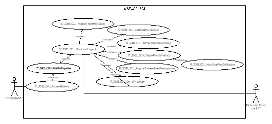
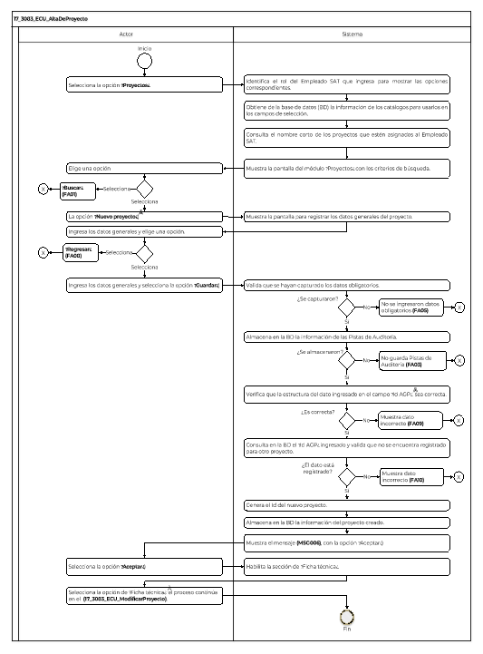

||Administración General de Comunicaciones y Tecnologías de la Información|
| :- | -: |
||Marco Documental 7.0|
|
Fecha de aprobación del Template:

02/08/2023
|
**Especificación del Caso de Uso**

17\_3083\_ECU\_AltaDeProyecto.docx
|Versión del template: 7.00|
| :-: | :-: | :-: |

**<ID Requerimiento>** 8309

**Nombre del Requerimiento: **TI\_SISECOFI-SAT\_Seguimiento financiero y control documental de proyectos de contratación

**Tabla de Versiones y Modificaciones**

|Versión|Descripción del cambio|Responsable de la Versión|Fecha|
| :-: | :- | :-: | :-: |
|*1*|*Creación del documento*|Isabel Adriana Valdez Cortés|*29/01/2024*|
|*1.1*|*Revisión del documento*|Luis Angel Olguin Castillo|*15/02/2024*|
|*1.2*|*Versión aprobada para firma*|
María del Carmen Castillejos Cárdenas

Rubén Delgado Ramírez
|*20/05/2024*|

**Tabla de Contenido**

[17_3083_ECU_AltaDeProyecto	2](#_toc167610087)

[1. Descripción	2](#_toc167610088)

[2. Diagrama del Caso de Uso	2](#_toc167610089)

[3. Actores	2](#_toc167610090)

[4. Precondiciones	2](#_toc167610091)

[5. Post condiciones	3](#_toc167610092)

[6. Flujo primario	3](#_toc167610093)

[7. Flujos alternos	6](#_toc167610094)

[8. Referencias cruzadas	17](#_toc167610095)

[9. Mensajes	18](#_toc167610096)

[10. Requerimientos No Funcionales	18](#_toc167610097)

[11. Diagrama de actividad	21](#_toc167610098)

[12. Diagrama de estados	21](#_toc167610099)

[13. Aprobación del cliente	22](#_toc167610100)

### ****17\_3083\_ECU\_AltaDeProyecto

|<h3>**1. Descripción** </h3>|
| :- |
|

El objetivo de este Caso de Uso es permitir al Empleado SAT gestionar el o los proyectos administrados; incluye la creación de un nuevo proyecto, con un identificador único, el registro de la información relevante, la consulta y/o edición de la información del proyecto, así como la cancelación y cierre de este.

|
|<h3>**2**. **Diagrama del Caso de Uso**</h3>|
||
|<h3>**3. Actores** </h3>|
||

|**Actor**|**Descripción**|
| :-: | :-: |
|**Empleado SAT**|El Empleado SAT es el que tiene el o los roles otorgados por la Administración Central de Seguridad, Monitoreo y Control (ACSMC) para ingresar a cada uno de los módulos de este sistema.|

||
| :- |
|<h3>**4. Precondiciones**</h3>|
|

- El Empleado SAT se ha autenticado en el sistema con e.firma válida.

- El sistema ha consumido el servicio “Oauth” para obtener los datos del Empleado SAT que ingresa.

- Se han asignado proyectos al Empleado SAT.

- El sistema ha validado que el Empleado SAT cuenta con los roles para ingresar al módulo “Proyectos”.

- El Empleado SAT ha ingresado a la opción del menú “Proyectos”, de acuerdo con el proceso del **(17\_3083\_ECU\_AccesoSistema)**.

&emsp;
|
|<h3>**5. Post condiciones** </h3>|
|

- El Empleado SAT dio de alta un nuevo proyecto y capturó la información correspondiente.

- El sistema almacenó la información del nuevo proyecto, asignándole un identificador (Id) único.

- El empleado SAT consultó la información del proyecto.

&emsp;
|
|<h3>**6. Flujo primario**</h3>|
||

|**Actor**|**Sistema**|
| :-: | :-: |
|1. El Caso de Uso inicia cuando el Empleado SAT selecciona la opción del menú **“Proyectos”**.|2. Identifica el rol del Empleado SAT que ingresa para mostrar las opciones correspondientes de acuerdo con la regla de negocio **(RNA31)**.|
||
3. Obtiene de la base de datos (BD), la información con estado “Activo” de los siguientes catálogos:

&emsp;

- Estatus de proyecto

- Administraciones Centrales

- Áreas
|
||4. Consulta el nombre corto de los proyectos que estén asignados al Empleado SAT que ingresa al módulo.|
||
5. Muestra la pantalla del módulo “Proyectos” con lo siguiente:

&emsp;

&emsp;Búsqueda, aplica la **(RNA240)**:

&emsp;

- Estatus\*. Aplica la **(RNA30)**

- Nombre corto del proyecto

- Id proyecto

- Área solicitante

- Área responsable

- Líder de proyecto

&emsp;

Opciones:

- Buscar (habilitado)

- Nuevo proyecto 

&emsp;(habilitado)

- Exportar a Excel

&emsp;(inhabilitado)

Tabla “Proyectos registrados”, de inicio sin información. Aplica la **(RNA244)**:

- Nombre corto del proyecto

- Fecha inicio

- Fecha fin

- Líder de proyecto

- Área solicitante

- Área responsable

- Monto solicitado

- Estatus

- Plan de trabajo (enlace Ver)

- Acciones

Ver  **(17\_3083\_EIU\_AltaDeProyecto)** Estilos 01.
|
|
6. Selecciona la opción **“Nuevo proyecto”** y el flujo continúa.

&emsp;

- Si requiere **“Buscar”**, continúa en el **([**FA01**](#fa01))**.
|
7. Muestra la pantalla para registrar los siguientes datos del proyecto:

&emsp;

&emsp;Dato:

&emsp;

- Última modificación

&emsp;

Sección “Datos generales”, aplica la **(RNA40):**

- Id

- Nombre corto\*

- Estatus: “Inicial”

- Nombre del proyecto\*

- Id AGP\*

&emsp;

Opción:

- Guardar

Secciones inhabilitadas:

- Ficha técnica

- Asociar fases

- Gestión documental

- Información de comités

- Plan de trabajo

- Participación de proveedores

- Verificación de RCP (Repositorio Central de Proyectos)

Opción:

- Regresar

Ver **(17\_3083\_EIU\_AltaDeProyecto)** Estilos 02.
|
|
8. Ingresa los datos generales:

&emsp;

- Nombre corto\*

- Nombre del proyecto\*

- Id AGP\*
||
|
9. Selecciona la opción **“Guardar”** y el flujo continúa.

&emsp;

- En caso de seleccionar la opción **“Regresar”**, continúa en el **([**FA08**](#fa08))**. 
|
10. Valida que se hayan capturado los datos obligatorios de acuerdo con las **(RNA40)** y **(RNA03)**.

&emsp;

- En caso de identificar que no se ingresaron los datos obligatorios, continúa en el **([**FA05**](#fa05))**.
|
||
11. Almacena en la BD la información de las Pistas de Auditoría.

&emsp; 

&emsp;Datos que se almacenan:

**Módulo**= Proyectos

**Fecha y Hora**= Fecha y hora del sistema, usando el formato DD/MM/AAAA HH:MM:SS

**RFC Usuario**= RFC largo del Empleado SAT que ingresó al sistema.

**Tipo de movimiento**= **INSR** (Insertar)

**Movimiento**= Aplica la **(RNA239)**

- Id proyecto

- Nombre corto del proyecto

- En caso de que no se puedan almacenar las Pistas de Auditoría, continúa en el **([**FA03**](#fa03))**.
|
||
12. Verifica que la estructura del dato ingresado en el campo “Id AGP” sea correcta de acuerdo con la **(RNA40)**.

&emsp;

- En caso de identificar que la estructura del dato “Id AGP” es incorrecta, continúa en el **([**FA09**](#fa09))**.
|
||
13. Consulta en la BD el “Id AGP” ingresado y valida que no se encuentra registrado para otro proyecto.

&emsp;

- En caso de identificar que el “Id AGP” se encuentra registrado, continúa en el **([**FA10**](#fa10))**.
|
||14. Genera el Id del nuevo proyecto de acuerdo con la **(RNA29)**.|
||
15. Almacena en la BD la siguiente información del proyecto creado:

&emsp;

- Id

- Nombre corto del proyecto

- Estatus: Inicial

- Nombre del proyecto

- Id AGP

- Nombre del Empleado SAT. Aplica la **(RNA247)**

- Fecha y hora de la
|
||16. Muestra el mensaje **([**MSG006**](#msg006))**,** con la opción** “Aceptar”.|
|17. Selecciona la opción **“Aceptar”**.|18. Habilita la sección de “Ficha técnica” y muestra la pantalla con los campos actualizados de acuerdo con el movimiento realizado.|
|19. Si el usuario requiere continuar, selecciona la opción **“Ficha técnica”**, el proceso continúa en el **(17\_3083\_ECU\_ModificarProyecto)**.||
||20. Fin del Caso de Uso.|

|

|
| :- |
|<h3>**7. Flujos alternos** </h3>|
|

**FA01 Selección de la opción “Buscar”**
|

|**Actor**|**Sistema**|
| :-: | :-: |
|1. El **FA01** inicia cuando el Empleado SAT requiere **“Buscar”**.||
|2. Selecciona el campo **“Estatus\*”**.|3. Despliega en el campo de “Estatus\*” el listado de opciones obtenidas del catálogo “Estatus del proyecto”.|
|4. Selecciona una opción en **“Estatus”**.||
|5. Selecciona el campo **“Nombre corto del proyecto”**.|6. Despliega en el campo de “Nombre corto del proyecto” el listado de proyectos asignados al Empleado SAT.|
|7. Selecciona una opción en **“Nombre corto del proyecto”**.||
|
8. Si requiere ingresa el **“Id proyecto”**.

&emsp;

- En caso de que no requiera ingresar el **“Id proyecto”**, continúa en el paso [**10**](#_ref167559767)** de este flujo.
|9. Inhabilita todos los demás criterios de búsqueda y continúa en el paso [**18**](#_ref167558997) de este flujo.|
|10. Selecciona el campo **“Área solicitante”**.|11. Despliega en el campo de “Área solicitante” el listado de opciones obtenidas del catálogo de “Administraciones Centrales”.|
|12. Selecciona una opción en **“Área solicitante”**.|13. Consulta en la BD en el catálogos de “Áreas” las opciones relacionadas con el “Área solicitante” seleccionada.|
|14. Selecciona el campo **“Área responsable”**.|15. Despliega en el campo de “Área responsable” el listado de opciones obtenidas en el paso [**13**](#_ref167559638)** de este flujo.|
|16. Selecciona una opción en **“Área responsable”**.||
|17. Captura el nombre del **“Líder de proyecto”**.||
|
18. Selecciona la opción **“Buscar”**.

&emsp;

- En caso de seleccionar **“Nuevo proyecto”**, en el paso [7](#_ref165324211) del Flujo primario.
|
19. Valida que se haya seleccionado como mínimo una opción en el campo “Estatus\*” o que se haya ingresado el “Id proyecto” para la búsqueda, aplica la **(RNA03)**.

&emsp;

- En caso de identificar que no fue seleccionada una opción, continúa en el **([**FA05**](#fa05))**.
|
||
20. Almacena en la BD la información de las Pistas de Auditoría.

&emsp; 

&emsp;Datos que se almacenan:

**Módulo**= Proyectos

**Fecha y Hora**= Fecha y hora del sistema, usando el formato DD/MM/AAAA HH:MM:SS

**RFC Usuario**= RFC largo del Empleado SAT que ingresó al sistema.

**Tipo de movimiento**= **CNST** (Consultar)

**Movimiento**= 

- Datos seleccionados o ingresados en los criterios de búsqueda.

&emsp;

- En caso de que no se puedan almacenar las Pistas de Auditoría, continúa en el **([**FA03**](#fa03))**.
|
||
21. Consulta en la BD si existen proyectos que coincidan con los criterios ingresados y que estén asignados al Empleado SAT que realiza la búsqueda.

&emsp;

- En caso de identificar que no existen proyectos que coincidan, continúa en el **([**FA02**](#fa02))**.
|
||
22. Obtiene de la BD la siguiente información de los proyectos del resultado de la consulta anterior conforme a la **(RNA39)**:

- Nombre corto del proyecto

- Fecha inicio

- Fecha fin

- Líder de proyecto

- Área solicitante

- Área responsable

- Monto solicitado

- Estatus
|
||23. Busca en la BD el plan de trabajo cargado previamente para cada proyecto.|
||24. Habilita la opción “Exportar a Excel”.|
||
25. Muestra en la pantalla de “Proyectos”** la tabla con la información obtenida de los proyectos conforme a la **(RNA39)**:

&emsp;

&emsp;Tabla “Proyectos registrados”. Aplica la **(RNA244)**:

&emsp;

- Nombre corto del proyecto

- Fecha inicio

- Fecha fin

- Líder de proyecto

- Área solicitante

- Área responsable

- Monto solicitado

- Estatus

- Plan de trabajo (enlace “Ver”)

- Acciones

- Editar 

- Ver detalle 

- Campos para “Filtrar” por columna

Ver **(17\_3083\_EIU\_AltaDeProyecto)** Estilos 01.
|
|
26. Selecciona una opción:

&emsp;

- Si selecciona **“Exportar a Excel”**, continúa en el **([**FA04**](#fa04))**.

&emsp;

- Si selecciona el enlace **“Ver”** en la columna “Plan de trabajo”,** el proceso continúa en el **(17\_3083\_ECU\_ModificarPlanDeTrabajo)**.

&emsp;

- Si selecciona **“Editar”**, el proceso continúa en el **(17\_3083\_ECU\_ModificarProyecto)**.

&emsp;

- En caso de seleccionar **“Ver detalle”**, continúa en el **([**FA07**](#fa07))**.

&emsp;

- En caso de requerir **“Filtrar”** la información en alguna columna de la tabla, continúa en el **([**FA06**](#fa06))**.
||
||27. Fin del Caso de Uso.|

|

**FA02 No existen proyectos que coincidan con la búsqueda**
|
| :- |

|**Actor**|**Sistema**|
| :-: | :-: |
||1. El **FA02** inicia cuando el sistema identifica que no existen proyectos que coincidan con los criterios de búsqueda.|
||2. Muestra el **([**MSG002**](#msg002))** con la opción “Aceptar”.|
|3. Selecciona la opción **“Aceptar”.**|4. Cierra el mensaje, limpia los criterios de búsqueda.|
||5. Regresa al paso [**3**](#_ref167102233)** del Flujo primario.|

|

**FA03 No se pueden almacenar las Pistas de Auditoría**
|
| :- |

|**Actor**|**Sistema**|
| :-: | :-: |
||1. El **FA03** inicia cuando interviene un evento ajeno y no se puedan almacenar las Pistas de Auditoría. |
||2. Cancela la operación sin completar el movimiento que estaba en proceso.|
||
3. Muestra el mensaje informativo de acuerdo con lo siguiente:

&emsp;

- Si la pista de auditoría es por el tipo de movimiento **UPDT** o **INSR**, se muestra el **([**MSG007**](#msg007))**.

&emsp;

- Si la pista de auditoría es por el tipo de movimiento **CNST**, se muestra el **([**MSG008**](#msg008))**.

&emsp;

- En caso de que la pista de auditoría sea por el tipo de movimiento **PRNT**, se muestra el **([**MSG009**](#msg009))**. 

&emsp;

Cada mensaje se muestra con la opción “Aceptar”.
|
|4. Selecciona la opción **“Aceptar”**.|5. Cierra el mensaje.|
||6. Regresa al paso previo que detona la acción de la pista de auditoría.|

|

**FA04 Selección de “Exportar a Excel”**
|
| :- |

|**Actor**|**Sistema**|
| :-: | :-: |
|1. El **FA04** inicia cuando el Empleado SAT selecciona la opción **“Exportar a Excel”**.|
2. Almacena en la BD la información de las Pistas de Auditoría.

&emsp;

&emsp;Datos que se almacenan:

**Módulo**= Proyectos-Sección en la que fue invocado

**Fecha y Hora**= Fecha y hora del sistema, usando el formato DD/MM/AAAA HH:MM:SS

**RFC Usuario**= RFC largo del Empleado SAT que ingresó al sistema.

**Tipo de movimiento**= **PRNT** (Imprimir)

**Movimiento**= Aplica la **(RNA239)**

- Nombre corto del proyecto

- Fecha inicio

- Fecha fin

- Líder de proyecto

- Área solicitante

- Área responsable

- Monto solicitado

- Estatus

&emsp;

- En caso de que no se puedan almacenar las Pistas de Auditoría, continúa en el **([**FA03**](#fa03))**.
|
||
3. Obtiene la siguiente información de los proyectos que se muestran en la tabla “Proyectos registrados”:

&emsp;

- Nombre corto del proyecto

- Fecha inicio

- Fecha fin

- Líder de proyecto

- Área solicitante

- Área responsable

- Monto solicitado

- Estatus
|
||4. Genera un archivo de Excel con extensión (.xlsx) que contenga la información obtenida. |
||5. Descarga el archivo de Excel con extensión (.xlsx).|
||6. Fin del Caso de Uso.|

|

**FA05 No se ingresaron los datos obligatorios**
|
| :- |

|**Actor**|**Sistema**|
| :-: | :-: |
||1. El **FA05** inicia cuando el sistema identifica que no fue seleccionada una opción del campo obligatorio.|
||2. Muestra en rojo los campos pendientes de capturar. |
||3. Muestra el **([**MSG001**](#msg001))** con la opción “Aceptar”.|
|4. Selecciona la opción **“Aceptar”**.|5. Cierra el mensaje. |
||
6. Realiza lo siguiente:

&emsp;

- Si fue invocado en el paso [10](#_ref158740842) del Flujo primario, regresa al paso [**8**](#_ref158409503) del Flujo primario.

- Si fue invocado en el paso [19](#_ref158740888) del **([**FA01**](#fa01))**, regresa al paso [**6**](#_ref165322946) del Flujo primario.
|

|

**FA06 Filtrar información de alguna columna de la tabla**
|
| :- |

|**Actor**|**Sistema**|
| :-: | :-: |
|1. El **FA06** inicia cuando el Empleado SAT requiere **“Filtrar”** la información en alguna columna de acuerdo con lo que se muestra en la tabla.|

	
|
|2. Elige la columna para filtrar e ingresa el dato a buscar.|3. Busca dentro de la columna y filtra la información mostrada de acuerdo con los caracteres ingresados en el campo.|
||4. Muestra en tiempo real todas las coincidencias que obtiene de dicha columna.|
||5. Regresa al paso [**26**](#_ref158827313) del **([**FA01**](#fa01))**.|

|

**FA07 Selección de “Ver detalle”**
|
| :- |

|**Actor**|**Sistema**|
| :-: | :-: |
|1. El **FA07** inicia cuando el Empleado SAT selecciona **“Ver detalle”** de un proyecto.|
2. Almacena en la BD la información de las Pistas de Auditoría.

&emsp;

&emsp;Datos que se almacenan:

**Módulo**= Proyectos-Proyectos registrados

**Fecha y Hora**= Fecha y hora del sistema, usando el formato DD/MM/AAAA HH:MM:SS

**RFC Usuario**= RFC largo del Empleado SAT que ingresó al sistema.

**Tipo de movimiento**= **CNST** (Consultar)

**Movimiento**=

- Id proyecto

- Nombre corto del proyecto 

&emsp;

- En caso de que no se puedan almacenar las Pistas de Auditoría, continúa en el **([**FA03**](#fa03))**.
|
||3. Obtiene de la BD la información de los “Datos generales” del proyecto seleccionado.|
||
4. Muestra la siguiente información en la sección de “Datos generales” en formato de solo lectura y permite seleccionar alguna sección:

&emsp;

&emsp;Datos generales, aplica la **(RNA40)**:

&emsp;

- Id

- Nombre corto\*

- Estatus

- Nombre del proyecto\*

- Id AGP\*

Secciones colapsada (habilitadas):

- Ficha técnica

- Asociar fases

- Gestión documental

- Información de comités

- Plan de trabajo

- Participación de proveedores

- Verificación de RCP

Opción:

- Regresar

Ver **(17\_3083\_EIU\_ModificarProyecto)** Estilos 02.
|
|
5. Selecciona la sección **“Ficha técnica”** y el flujo continúa.

&emsp;

- En caso de seleccionar la sección **“Asociar fases”**, continúa en el paso [**8**](#_ref165371838).

- En caso de seleccionar la sección **“Gestión documental”**, continúa en el paso [**10**](#_ref160267595).

- En caso de seleccionar la sección **“Información de comités”**, continúa en el paso [**12**](#_ref160267661).

- En caso de seleccionar la sección **“Plan de trabajo”**,** continúa en el paso [**14**](#_ref160267737).

- En caso de seleccionar la sección **“Participación de proveedores”**,** continúa en el paso [**16**](#_ref160267810).

- En caso de seleccionar la sección **“Verificación de RCP”**, continúa en el paso [**18**](#_ref160267880).

- En caso de seleccionar la opción **“Regresar”**, continúa en la pantalla principal **“Proyectos”**,** en el paso [**5**](#_ref158409910) del Flujo primario.
|6. Obtiene de la BD la información de la “Ficha técnica” del proyecto seleccionado.|
||
7. Muestra la información obtenida en el paso anterior en la sección de “Ficha técnica” en formato de solo lectura, aplica la **(RNA241)**.

&emsp;

&emsp;Ver **(17\_3083\_EIU\_ModificarProyecto)** Estilos 03.

&emsp;

&emsp;Regresa al paso [**5**](#_ref160268006) de este flujo.
|
||8. Obtiene de la BD la información de “Asociar fases” del proyecto seleccionado.|
||
9. Muestra la información obtenida en el paso anterior en la sección de “Asociar fases” en formato de solo lectura, aplica la **(RNA241)**.

&emsp;

&emsp;Ver **(17\_3083\_EIU\_AsociarFasesMatrizDoc)** Estilos 01.

&emsp;

&emsp;Regresa al paso [**5**](#_ref160268006) de este flujo.
|
||10. Obtiene de la BD la información de “Gestión documental” del proyecto seleccionado.|
||
11. Muestra la información obtenida en el paso anterior en la sección de “Gestión documental” en formato de solo lectura, aplica la **(RNA241)**.

&emsp;

&emsp;Ver **(17\_3083\_EIU\_GestionDocumental)** Estilos 01.

&emsp;

&emsp;Regresa al paso [**5**](#_ref160268006) de este flujo.
|
||12. Obtiene de la BD la información de “Información de comités” del proyecto seleccionado.|
||
13. Muestra la información obtenida en el paso anterior en la sección de “Información de comités” en formato de solo lectura, aplica la **(RNA241)**.

&emsp;

&emsp;Ver **(17\_3083\_EIU\_AdministrarInfoComites)** Estilos 01.

&emsp;

&emsp;Regresa al paso [**5**](#_ref160268006) de este flujo.
|
||14. Obtiene de la BD la información del “Plan de trabajo” del proyecto seleccionado.|
||
15. Muestra la información obtenida en el paso anterior en la sección de “Plan de trabajo” en formato de solo lectura, aplica la **(RNA241)**.

&emsp;

&emsp;Ver **(17\_3083\_EIU\_ModificarPlanDeTrabajo)** Estilos 02.

&emsp;

&emsp;Regresa al paso [**5**](#_ref160268006) de este flujo.
|
||16. Obtiene de la BD la información de “Participación de proveedores” del proyecto seleccionado.|
||
17. Muestra la información obtenida en el paso anterior en la sección de “Participación de proveedores” en formato de solo lectura, aplica la **(RNA241)**.

&emsp;

&emsp;Ver **(17\_3083\_EIU\_AsignarProveedoresParticipantes)** Estilos 01.

&emsp;

&emsp;Regresa al paso [**5**](#_ref160268006) de este flujo.
|
||18. Obtiene de la BD la información de “Verificación de RCP” del proyecto seleccionado.|
||
19. Muestra la información obtenida en el paso anterior en la sección de “Verificación de RCP” en formato de solo lectura, aplica la **(RNA241)**.

&emsp;

&emsp;Ver **(17\_3083\_EIU\_CerrarProyecto)** Estilos 01.

&emsp;

&emsp;Regresa al paso [**5**](#_ref160268006) de este flujo.
|
||20. Fin del Caso de Uso.|

|

**FA08 Selección de “Regresar”**
|
| :- |

|**Actor**|**Sistema**|
| :-: | :-: |
|1. El **FA08** inicia cuando el Empleado SAT selecciona la opción **“Regresar”**.|2. Muestra el **([**MSG003**](#msg003))** con las opciones “Sí” y “No”.|
|
3. Selecciona la opción **“Sí”** continúa en el paso [**5**](#_ref165372913).

&emsp;

- En caso de seleccionar **“No”**, continúa en el paso [**4**](#_ref165372920).
|4. Cierra el mensaje y permanece en el paso [**9**](#_ref165328862) del Flujo primario donde fue invocado. |
||5. Cierra el mensaje, limpia los campos de la pantalla. |
||6. Regresa al paso [**3**](#_ref167102233) del Flujo primario.|

|

**FA09 Estructura del “Id AGP” incorrecta**
|
| :- |

|**Actor**|**Sistema**|
| :-: | :-: |
||1. El **FA09** inicia cuando el sistema identifica que la estructura del dato “Id AGP” es incorrecta.|
||2. Muestra en rojo el campo incorrecto. |
||3. Muestra el **([**MSG004**](#msg004))** con la opción “Aceptar”.|
|4. Selecciona la opción **“Aceptar”**.|5. Cierra el mensaje.|
||6. Regresa al paso [**8**](#_ref158409503) del Flujo primario.|

|

**FA10 El “Id AGP” se encuentra registrado en la BD**
|
| :- |

|**Actor**|**Sistema**|
| :-: | :-: |
||1. El **FA10** inicia cuando el sistema identifica que el “Id AGP” se encuentra registrado en la BD.|
||2. Muestra en rojo el campo incorrecto. |
||3. Muestra el **([**MSG005**](#msg005))** con la opción “Aceptar”.|
|4. Selecciona la opción **“Aceptar”**.|5. Cierra el mensaje.|
||6. Regresa al paso [**8**](#_ref158409503) del Flujo primario.|

|
**	

|
| :- |
|<h3>**8. Referencias cruzadas** </h3>|
|

- 17\_3083\_CRN\_SeguimientoFinancieroYControl

- 17\_3083\_ECU\_AccesoSistema

- 17\_3083\_EIU\_AltaDeProyecto

- 17\_3083\_ECU\_ModificarProyecto

- 17\_3083\_EIU\_ModificarProyecto

- 17\_3083\_ECU\_ModificarPlanDeTrabajo

- 17\_3083\_EIU\_ModificarPlanDeTrabajo

- 17\_3083\_EIU\_GestionDocumental

- 17\_3083\_EIU\_AdministrarInfoComites

- 17\_3083\_EIU\_AsignarProveedoresParticipantes

- 17\_3083\_EIU\_CerrarProyecto

|
|<h3>**9. Mensajes** </h3>|
||

|**ID Mensaje**|**Descripción**|
| :-: | :-: |
|**MSG001**|Favor de ingresar los datos obligatorios marcados con un asterisco (\*).|
|**MSG002**|No existen proyectos que coincidan con los criterios de búsqueda ingresados.|
|**MSG003**|Se perderá la información que no haya guardado, ¿Desea regresar?|
|**MSG004**|El dato ingresado en “Id AGP” es incorrecto.|
|**MSG005**|El “Id AGP” ya se encuentra registrado en un proyecto. Verifique el id.|
|**MSG006**|Proyecto creado exitosamente.|
|**MSG007**|Ocurrió un error al guardar el registro, favor de intentar nuevamente (PA01).|
|**MSG008**|Ocurrió un error al consultar la información, favor de intentar nuevamente (PA01).|
|**MSG009**|Ocurrió un error al exportar la información, favor de intentar nuevamente (PA01).|

||
| :- |
|<h3>**10. Requerimientos No Funcionales** </h3>|
||

|**ID de RNF**|**Requerimiento No Funcional**|**Descripción**|
| :-: | :-: | :-: |
|**RNF001**|Disponibilidad|El sistema deberá estar activo las 24 horas del día, los 365 días del año con picos de operación en el horario de 9:00 a 18:00 horas.|
|**RNF002**|Concurrencia|
El número de Empleados SAT que puede tener el sistema son 150. 

 

El número de accesos concurrentes que debe soportar este sistema son máximo 30 Empleados SAT. 
|
|**RNF003**|Seguridad|El acceso solo podrá ser otorgado a todo Empleado SAT que tenga los roles asignados por la Administración Central de Seguridad, Monitoreo y Control (ACSMC) para cada módulo de este sistema.|
|**RNF004**|Usabilidad|
El sistema deberá manejar los siguientes elementos para facilitar la navegación: 

- Mensajes tipo flotantes (*tooltips*) con información de la herramienta que ofrece ayuda contextual como guía para el Empleado SAT.

- Componente de ordenamiento que permita acomodar la información de la tabla de forma ascendente o descendente, considerando la columna donde es seleccionado. 

- Contar con un diseño responsivo que permita su óptima visualización en distintos tipos de dispositivos finales.
|
|**RNF005**|Eficiencia|Las consultas se dividen en generales y detalladas, para que las detalladas carguen la información solo cuando sean requeridas por el Empleado SAT.|
|**RNF006**|Usabilidad|
El Empleado SAT debe poder navegar a través de las páginas resultantes de la consulta considerando que el sistema debe mostrar inicialmente 15 registros por página, permitiendo al Empleado SAT seleccionar los registros que requiere visualizar, teniendo las opciones de 15, 50 y 100:

- Ir a la primera página (debe mostrar la primera página con el resultado de la consulta).

- Ir a la última página (debe mostrar la última página con el resultado de la consulta).

- Ir a la siguiente página (debe mostrar la siguiente página, considerando la página actual, con el resultado de la consulta y el número de registros seleccionados por el Empleado SAT).

- Ir a la página anterior (debe mostrar la página anterior considerando la actual, con el resultado de la consulta).

&emsp;

En la tabla deben mostrarse los registros ordenados alfabéticamente.
|
|**RNF007**|Seguridad|Las Pistas de Auditoría deben estar protegidas contra accesos no autorizados. Solo los Empleados SAT autorizados pueden consultarlas, y la información en ellas se definirá durante la etapa de diseño, la cual debe estar cifrada para mantenerla confidencial y evitar exposiciones no autorizadas.|
|**RNF008**|Fiabilidad|El sistema debe ser capaz de manejar excepciones de manera efectiva y presentar mensajes claros y comprensibles para garantizar una adecuada interacción con el sistema.|
|**RNF009**|Seguridad|Se debe mantener la información en pantalla en caso de un error al guardar las Pistas de Auditoría, siempre y cuando el escenario lo permita. Hay situaciones de infraestructura o de conexión de internet que sí pierde los datos ya que no están controlados por el sistema.|
|**RNF010**|Integridad|Al almacenar la información en la BD de tipo texto o alfanumérico se deben eliminar los espacios en blanco al inicio y fin de la cadena.|

||
| :- |

|<h3>**11. Diagrama de actividad** </h3>|
| :- |
||
|<h3>**12. Diagrama de estados** </h3>|
|

No aplica, no se requiere para este proceso.
|

|<h3>**13. Aprobación del cliente** </h3>|
| :- |
|

|

|**FIRMAS DE CONFORMIDAD**||
| :-: | :- |
|**Firma 1** |**Firma 2** |
|**Nombre**: María del Carmen Castillejos Cárdenas.|**Nombre**: Rubén Delgado Ramírez.|
|**Puesto**: Usuaria ACPPI.|**Puesto**: Usuario ACPPI.|
|**Fecha:**|**Fecha:**|
|||
|**Firma 3** |**Firma 4**|
|**Nombre**: Rodolfo López Meneses.|**Nombre**: Diana Yazmín Pérez Sabido.|
|**Puesto**: Usuario ACPPI.|**Puesto**: Usuaria ACPPI.|
|**Fecha:**|**Fecha:**|
|||
|**Firma 5**|**Firma 6**|
|**Nombre**: Yesenia Helvetia Delgado Naranjo.|**Nombre:** Alejandro Alfredo Muñoz Núñez.|
|**Puesto**: APE ACPPI.|**Puesto:** RAPE ACPPI.|
|**Fecha**:|**Fecha**:|
|||
|**Firma 7**|**Firma 8**|
|**Nombre**: Luis Angel Olguin Castillo.|**Nombre**: Erick Villa Beltrán.|
|**Puesto**: Enlace ACPPI.|**Puesto**: Líder APE SDMA 6.|
|**Fecha**:|**Fecha**:|
|||
|**Firma 9**|**Firma 10**|
|**Nombre:** Juan Carlos Ayuso Bautista.|**Nombre:** Isabel Adriana Valdez Cortés.|
|**Puesto:** Líder Técnico SDMA 6.|**Puesto:** Analista de Sistemas DS SDMA 6.|
|**Fecha**:|**Fecha**:|
|||

||
| :- |

|||Página 1 de 9|
| :- | :-: | -: |

