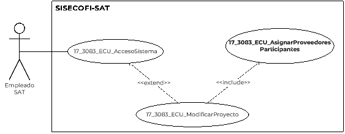

||Administración General de Comunicaciones y Tecnologías de la Información|
| :- | -: |
||Marco Documental 7.0|
|
Fecha de aprobación del Template:

02/08/2023
|
**Especificación del Caso de Uso**

17\_3083\_ECU\_AsignarProveedoresParticipantes.docx
|Versión del template: 7.00|
| :-: | :-: | :-: |

**<ID Requerimiento>** 8309<

**Nombre del Requerimiento: **TI\_SISECOFI-SAT\_Seguimiento financiero y control documental de proyectos de contratación.

**Tabla de Versiones y Modificaciones**

|Versión|Descripción del cambio|Responsable de la Versión|Fecha|
| :-: | :- | :-: | :-: |
|*1*|Creación del documento.|Osiris Vianey Segovia Pasarán|09/02/2024|
|*1.1*|Revisión del documento.|Luis Angel Olguin Castillo|09/03/2024|
|*1.2*|Versión aprobada para firma|María del Carmen Castillejos Cárdenas Rubén Delgado Ramírez|25/05/2024|

**Tabla de Contenido**

[17_3083_ECU_AsignarProveedoresParticipantes	2](#_toc167723110)

[1. Descripción	2](#_toc167723111)

[2. Diagrama del Caso de Uso	2](#_toc167723112)

[3. Actores	2](#_toc167723113)

[4. Precondiciones	2](#_toc167723114)

[5. Post condiciones	3](#_toc167723115)

[6. Flujo primario	3](#_toc167723116)

[7. Flujos alternos	7](#_toc167723117)

[8. Referencias cruzadas	13](#_toc167723118)

[9. Mensajes	13](#_toc167723119)

[10. Requerimientos No Funcionales	14](#_toc167723120)

[11. Diagrama de actividad	16](#_toc167723121)

[12. Diagrama de estados	16](#_toc167723122)

[13. Aprobación del cliente	17](#_toc167723123)

### ****17\_3083\_ECU\_AsignarProveedoresParticipantes

|<h3>**1. Descripción** </h3>|
| :- |
|

El objetivo de este Caso de Uso es permitir al Empleado SAT agregar a los proveedores participantes en los diferentes proyectos administrados por el sistema.

|
|<h3>**2. Diagrama del Caso de Uso**</h3>|
|

 

|
|<h3>**3. Actores** </h3>|
||

|**Actor**|**Descripción**|
| :-: | :-: |
|**Empleado SAT**|El Empleado SAT es el que tiene el o los roles otorgados por la Administración Central de Seguridad, Monitoreo y Control (ACSMC) para ingresar a cada uno de los módulos de este sistema.|

||
| :- |
|<h3>**4. Precondiciones**</h3>|
|

- El Empleado SAT se ha autentificado en el sistema con e-firma válida.

- El sistema ha consumido el servicio “Oauth” para obtener los datos del Empleado SAT que ingresa.

- El sistema ha validado que el Empleado SAT cuenta con los roles y permisos para ingresar a los módulos “Proyectos”, “Modificar proyecto” y a la sección “Participación de proveedores”.

- El Empleado SAT ha ingresado a la opción del “Participación de Proveedores”, desde el caso de uso **(17\_3083\_ECU\_ModificarProyecto)**.

- El Empleado ha registrado los datos generales del proyecto. 

- Se han registrado proveedores y se encuentran en “Activo” dentro del módulo de proveedores en el proceso **(17\_3083\_ECU\_AltaDeProveedor)**.

&emsp;
|
|<h3>**5. Post condiciones** </h3>|
|

- El Empleado SAT agregó proveedores participantes.

- El Empleado SAT modificó la información registrada para el proveedor.

- El Empleado SAT eliminó un registro de proveedor. 

|
|<h3>**6. Flujo primario**</h3>|
||

|**Actor**|**Sistema**|
| :-: | :-: |
|1. El Caso de Uso inicia cuando el Empleado SAT realiza una modificación del proyecto y selecciona la sección **“Participación de proveedores”** en el proceso de **(17\_3083\_ECU\_ModificarProyecto)**.|
2. Obtiene de la base de datos (BD)

&emsp;` `la información de los siguientes catálogos. Aplica las reglas de negocio **(RNA01)**, **(RNA85)**.   

- Proveedor

- Investigación mercado

- Respuesta IM

- Junta de aclaración

- Licitación pública

**Nota**:  se crea un catálogo de “Respuesta proveedor” para el contenido de los últimos cuatro catálogos. 
|
||
3. Muestra la sección “Participación de proveedores” con información de los proveedores registrados anteriormente. Aplica la **(RNA31)**:

&emsp;

&emsp;Tabla proveedores Aplica la **(RNA42)** y **(RNA244)**.

&emsp;

- Id

- Proveedor

- Investigación mercado

- Fecha IM

- Respuesta IM

- Fecha respuesta IM

- Junta de aclaraciones

- Fecha JA

- Licitación pública

- Fecha proposición LP

- Comentarios

- ![ref1]Nuevo comentario 

- Acciones. Aplica la **(RNA246)**

- Editar 

- Eliminar 

&emsp;

Opciones:

- ![ref2]![ref3]Nuevo       

- Exportar a Excel

- Campos para “Filtrar” por columna 

Ver **(17\_3083\_EIU\_AsignarProveedoresParticipantes)** Estilos 01.
|
|
4. Selecciona la opción de “**Nuevo**” y continúa en el flujo. 

&emsp;

- En caso de que ingrese un parámetro de búsqueda **“Filtrar”**, continúa en el **([**FA01**](#fa01))**.

- En caso de que seleccione la opción **“Exportar a Excel”**, continúa en el **([**FA05**](#fa05))**.

- En caso de que seleccione la opción **“Editar”** de algún registro de la tabla, continúa en el **([**FA06**](#fa06))**.

- En caso de que seleccione la opción **“Eliminar”** de algún registro de la tabla, continúa en el **([**FA07**](#fa07))**.

- En caso de seleccionar **“Guardar”** continua en el paso, continua en el paso 10 de este flujo. 

- En caso de seleccionar la opción **“Cancelar”**, continúa en el **([**FA04**](#fa04))**.

&emsp;
|
5. Muestra la pantalla, la sección “Participación de proveedores” habilitando los campos para agregar a los proveedores participantes en el proyecto seleccionado.

&emsp;

&emsp;Tabla proveedores.

- Id

- Proveedor. 

- Investigación mercado

- Fecha IM

- Respuesta IM

- Fecha respuesta IM

- Junta de aclaraciones

- Fecha JA

- Licitación pública

- Fecha proposición LP

- Comentarios

- ![ref1]Nuevo comentario 

- Acciones

- Descartar ![ref4]

Opciones:

- Guardar. Aplicar la **(RNA246)**

- Cancelar Aplicar la **(RNA246)**

- ![ref1]Nuevo    

- ![ref5]Exportar a Excel

- Filtro 

- Campos para “Filtrar” por columna 

Ver **(17\_3083\_EIU\_AsignarProveedoresParticipantes)** Estilos 02 y Estilos 04
|
|
6. Selecciona en el catálogo de la columna **“Proveedor”** un proveedor. 

&emsp;

|
7. Consulta la información en la BD del catálogo “Proveedor” de acuerdo con la **(RNA42)**.

&emsp;

- Si, dentro del catálogo de proveedores no se encuentran proveedores activos, continúa en el **([**FA03**](#fa03))**.
|
|
8. Agrega los datos de la tabla de proveedores participantes:

- Investigación mercado

- Fecha IM

- Respuesta IM

- Fecha respuesta IM

- Junta de aclaraciones

- Fecha JA

- Licitación pública

- Fecha proposición LP

- En caso de agregar un comentario continúa en el **([**FA08**](#fa08))**.

- En caso de seleccionar la opción **“Descartar”**, continúa en el **([**FA04**](#fa04))**.
||
|
9. Si no quiere realizar alguna otra acción continua en el flujo 

&emsp;

- En caso de requerir alguna otra acción en la tabla regresa al paso **4** de este flujo.

&emsp;
||
|
10. Selecciona la opción **“Guardar”**, continúa en el flujo.

- En caso de seleccionar la opción **“Cancelar”**, continúa en el **([**FA04**](#fa04))**.
|
11. Valida la acción realizada.

&emsp;

- En caso de agregar o editar valida que se hayan capturado los datos obligatorios, conforme a la **(RNA42)**.

- En caso de identificar que no se ingresaron los datos obligatorios, continúa en el **([**FA09**](#fa09))**.

- En caso de que solo sean movimientos de eliminación, continúa en el flujo.
|
||
12. Almacena en la BD la información de las Pistas de Auditoría.

&emsp; 

&emsp;Datos que se almacenan:

**Módulo**= Participación de Proveedores 

**Fecha y Hora**= Fecha y hora del sistema, usando el formato DD/MM/AAAA HH:MM: SS.

**RFC Usuario**= RFC largo del Empleado SAT que ingresó al sistema.

**Tipo de movimiento**= **INSR** (Insertar), **UPDT** (Modificar), **DLT** (Borrar) según corresponda

**Movimiento**= Aplica la **(RNA239)**

- Proveedor 

- En caso de que no se puedan almacenar las Pistas de Auditoría, continúa en el **([**FA02**](#fa02))**.
|
||
13. Identifica el tipo de movimiento realizado y almacena en la BD la información que corresponda a los proveedores participantes:

&emsp;

&emsp;Tabla proveedores:

&emsp;

- Id

- Proveedor

- Investigación mercado

- Fecha IM

- Respuesta IM

- Fecha respuesta IM

- Junta de aclaraciones

- Fecha JA

- Licitación pública

- Fecha proposición LP

- Comentario (…) 
|
||14. Actualiza la tabla, Aplica la **(RNA250)**.|
||15. Muestra el mensaje **([**MSG001**](#msg001))** con la opción** “Aceptar”.|
|16. Selecciona la opción **“Aceptar”**.|17. Cierra el mensaje.|
||18. Muestra la pantalla con los campos actualizados de acuerdo con los movimientos realizados. |
||19. Fin del Caso de Uso.|
|||

||
| :- |
|<h3>**7. Flujos alternos** </h3>|
|

**FA01 Selecciona la opción “Filtrar”** 
|

|**Actor**|**Sistema**|
| :-: | :-: |
|1. El **FA01** inicia cuando el Empleado SAT requiere **“Filtrar”** la información en alguna columna de acuerdo con lo que se muestra en la tabla.||
|2. Elige la columna para filtrar e ingresa el dato a buscar.|3. Busca dentro de la columna y filtra la información mostrada de acuerdo con los caracteres ingresados en el campo.|
||4. Muestra todas las coincidencias que obtiene en tiempo real de dicha columna.|
||5. Regresa al paso [**4**](#_ref167798473) del Flujo Primario. |

|

**FA02 No se pueden almacenar las Pistas de Auditoría**
|
| :- |

|**Actor**|**Sistema**|
| :-: | :-: |
||1. El **FA02** inicia cuando interviene un evento ajeno y no se puedan almacenar las Pistas de Auditoría. |
||2. Cancela la operación sin completar el movimiento que estaba en proceso.|
||
3. Muestra el mensaje informativo de acuerdo con lo siguiente:

&emsp;

- Si la pista de auditoría es por el tipo de movimiento **UPDT**, **INSR** o **DLT** se muestra el **([**MSG002**](#msg002))**.

&emsp;

- Si la pista de auditoría es por el tipo de movimiento **CNST**, se muestra el **([**MSG003**](#msg003))**.

&emsp;

- En caso de que la pista de auditoría es por el tipo de movimiento **PRNT**, se muestra el **([**MSG004**](#msg004))**.

Cada mensaje se muestra con la opción “Aceptar”.
|
|4. Selecciona la opción **“Aceptar”**.|5. Cierra el mensaje. |
||6. Regresa al paso previo que detona la acción de la pista de auditoría. |

|

**FA03 No se cuenta con proveedores activos**
|
| :- |

|**Actor**|**Sistema**|
| :-: | :-: |
||1. El **FA03** inicia cuando el sistema identifica que el sistema no cuenta con proveedores activos en el módulo de proveedores.|
||2. Muestra el **([**MSG005**](#msg005))** con la opción “Aceptar”.|
|3. Selecciona la opción **“Aceptar”**.|4. Cierra el mensaje, colapsa la sección de proveedores participantes.|
||5. Fin del Caso de Uso.|

|

**FA04 Selecciona la opción “Cancelar”, “Cerrar”, “Descartar”**  
|
| :- |

|**Actor**|**Sistema**|
| :-: | :-: |
|1. El **FA04** inicia cuando el Empleado SAT selecciona la opción **“Cancelar”**, **“Cerrar”** o **“Descartar”**|2. Muestra el **([**MSG006**](#msg006))** con las opciones “Sí” y “No”.|
|
3. Selecciona la opción **“No”**, flujo continúa.

&emsp;

- En caso de seleccionar **“Sí”**,**  

&emsp;continúa en el paso [5](#_ref165465730) de este flujo
|4. Cierra el mensaje, y continúa en el paso **[**6**](#_ref165543685)** de este flujo.|
||
5.  Realiza lo siguiente. 

- Si fue invocado en la opción “Cancelar” se inicializan los campos donde se selecciona la opción y no almacena ninguna información.

- Si fue invocado en el “Cerrar” cierra el modal sin almacenar ninguna información,

- Si fue invocado en la opción “Descartar”:

- Se inicializa el registro de la tabla de la sección donde fue invocado, y cambia a solo lectura si era un registro almacenado regresando los íconos a su estado original.

- Si era un registro nuevo elimina la fila.

|
||
6. Realiza lo siguiente:

- Si se invoca en el paso 10 del Flujo primario, regresa al paso [**3**](#_ref165466530)** de dicho flujo.

- Si se invoca en el paso 8 del Flujo primario, regresa al paso [**3**](#_ref165466530)** de dicho flujo.

- Si se invoca en el paso 4 del Flujo primario, regresa al paso [**3**](#_ref165466530)** de dicho flujo.

- Si se invoca en el paso 5 del **([**FA06**](#fa06))** regresa al paso [**3**](#_ref165466530)** del Flujo primario.

- Si se invoca en el paso 3 del **([**FA08**](#fa08))** regresa al paso [**2**](#_ref165466809) del **([**FA08**](#fa08))**.

|

|

**FA05 Selecciona la opción “Exportar a Excel”**
|
| :- |

|**Actor**|**Sistema**|
| :-: | :-: |
|1. El **FA05** inicia cuando el Empleado SAT selecciona el icono **“Exportar a Excel”** de la tabla proveedores. |
2. Almacena en la BD la información de las Pistas de Auditoría.

&emsp; 

&emsp;Datos que se almacenan:

**Módulo**= Participación de Proveedores

**Fecha y Hora**= Fecha y hora del sistema, usando el formato DD/MM/AAAA HH:MM:SS.

**RFC Usuario**= RFC largo del usuario que ingresó al sistema.

**Tipo de movimiento**= 

- **PRNT** (Imprimir).

**Movimiento**= Aplica la **(RNA239)**

- Proveedores 

- En caso de que no se puedan almacenar las Pistas de Auditoría, continúa en el **([**FA02**](#fa02))**. 
|
||
3. Obtiene la siguiente información.

&emsp;Tabla proveedores:

&emsp;

- Id

- Proveedor

- Investigación mercado

- Fecha IM

- Respuesta IM

- Fecha respuesta IM

- Junta de aclaraciones

- Fecha JA

- Licitación pública

- Fecha proposición LP

- Comentarios 
|
||4. Genera un archivo en formato Excel (.xlsx) con la información obtenida.|
||5. Dependiendo el explorador realiza la descarga del archivo.|
||6. Fin de Caso de Uso.|

|

**FA06 Selecciona la opción “Editar”** 
|
| :- |

|**Actor**|**Sistema**|
| :-: | :-: |
|1. El **FA06** inicia cuando el Empleado SAT selecciona “**Editar**” un registro de un proveedor participante de un proyecto seleccionado. |
2. Almacena en la BD la información de las Pistas de Auditoría.

&emsp; 

&emsp;Datos que se almacenan:

**Módulo**= Participación de Proveedores

**Fecha y Hora**= Fecha y hora del sistema, usando el formato DD/MM/AAAA HH:MM:SS.

**RFC Usuario**= RFC largo del usuario que ingresó al sistema.

**Tipo de movimiento**= 

- **CNST** (Consultar).

**Movimiento**=

- Proveedores 

- En caso de que no se puedan almacenar las Pistas de Auditoría, continúa en el **([**FA02**](#fa02))**.
|
||
3. ` `Consulta en la BD la información relacionada con el registro seleccionado y obtiene la siguiente información en formato edición.

&emsp;

- Proveedor

- Investigación mercado

- Fecha IM

- Respuesta IM

- Fecha respuesta IM

- Junta de aclaración

- Fecha JA

- Licitación pública

- Fecha proposición LP

- Comentarios
|
||
4. Muestra la pantalla, habilitando los campos para editar la información de proveedores participantes, en un proyecto, de acuerdo con la **(RNA85)** y **(RNA42)**.

&emsp;

- Proveedor

- Investigación mercado

- Fecha IM

- Respuesta IM

- Fecha respuesta IM

- Junta de aclaración

- Fecha JA

- Licitación pública

- Fecha proposición LP

- Comentarios

- ![ref1]Nuevo comentario 

- Acciones

- Descartar ![ref4]

Ver **(17\_3083\_EIU\_AsignarProveedoresParticipantes)** Estilos 02. Y Estilos 04.
|
|
5. Modifica cualquiera de los siguientes campos, continua el flujo. 

- Proveedor

- Investigación mercado

- Fecha IM

- Respuesta IM

- Fecha respuesta IM

- Junta de aclaración

- Fecha JA

- Licitación pública

- Fecha proposición LP

- En caso de requerir modificar el comentario, continúa en el **([**FA08**](#fa08))**. De no ser necesario, continúa en el flujo.

- En caso de seleccionar la opción **“Descartar”**, continúa en el **([**FA04**](#fa04))**.
||
||6. Regresa al paso [**4**](#_ref167798473) del Flujo Primario.|

|

**FA07 Selecciona la opción “Eliminar”**
|
| :- |

|**Actor**|**Sistema**|
| :-: | :-: |
|1. El **FA07** inicia cuando el Empleado SAT selecciona “**Eliminar**” un registro de un proveedor. |2. Muestra el **([**MSG008**](#msg008))** con las opciones “Sí” y “No”.|
|
3. Selecciona la opción **“No”** continúa en el flujo. 

&emsp;

- En caso de seleccionar la opción **“Sí”**, continúa en el paso **5** de este flujo.
|4. Cierra el mensaje, no realiza ningún movimiento, muestra la pantalla con los proveedores. |
||5. Elimina el registro de la tabla de proveedores. Aplica la **(RNA250)**.|
||6. Regresa al paso [**4**](#_ref167798473) del Flujo Primario.|

|

**FA08 Selecciona la opción “Nuevo comentario”**
|
| :- |

|**Actor**|**Sistema**|
| :-: | :-: |
|1. El **FA08** inicia cuando el Empleado SAT selecciona **“Nuevo comentario”** de la columna comentarios. |
2. Muestra una ventana emergente “Agregar comentarios”:

&emsp;

- Comentarios

Opciones

- Guardar

- Cancelar

- Cerrar  

Ver **(17\_3083\_EIU\_AsignarProveedoresParticipantes)** Estilos 03.
|
|
3. Agrega o modifica el comentario al seleccionar **“Nuevo comentario”** en la columna de **“Comentarios”** y continúa en el flujo. 

- En caso de seleccionar la opción **“Cancelar”** o **“Cerrar”**, continúa en el **([**FA04**](#fa04))**.

&emsp;
|4. Muestra el mensaje **([**MSG001**](#msg001))** con la opción “Aceptar”|
|5. Selecciona la opción **“Aceptar”**.|6. Cierra el mensaje.|
||
7. Realiza lo siguiente:

- Si se invoca en el paso 8 del Flujo primario, regresa al paso [**8**](#_ref165467128)** de dicho flujo.

- Si se invoca en el paso 5 del **([**FA06**](#fa06))** regresa al paso [**5**](#_ref165467286)** del Flujo primario.

|

|

**FA09 No se ingresaron los datos obligatorios**
|
| :- |

|**Actor**|**Sistema**|
| :-: | :-: |
||1. El **FA09** inicia cuando el sistema identifica que no se ingresaron los datos obligatorios.|
||2. Muestra en rojo los campos pendientes de captura. |
||3. Muestra el **([**MSG007**](#msg007))** con la opción “Aceptar”.|
|4. Selecciona la opción **“Aceptar”**.|5. Cierra el mensaje. |
||
6. Regresa al paso 

- Si se invoca en el paso 11 del Flujo primario, regresa al paso **[**6**](#_ref165467437)** de dicho flujo.

&emsp;
|

|

|
| :- |
|<h3>**8. Referencias cruzadas** </h3>|
|

- 17\_3083\_CRN\_SeguimientoFinancieroYControl

- 17\_3083\_EIU\_AsignarProveedoresParticipantes

- 17\_3083\_ECU\_AltaDeProveedor

- 17\_3083\_ECU\_ModificarProyecto

&emsp;

|
|<h3>**9. Mensajes** </h3>|
||

|**ID Mensaje**|**Descripción**|
| :-: | :-: |
|**MSG001**|La información ha sido actualizada.|
|**MSG002**|Ocurrió un error al guardar el registro, favor de intentar nuevamente (PA01).|
|**MSG003**|Ocurrió un error al consultar la información, favor de intentar nuevamente (PA01).|
|**MSG004**|Ocurrió un error al exportar la información, favor de intentar nuevamente (PA01).|
|**MSG005**|No se tienen proveedores para ser agregados, favor de registrar en el módulo correspondiente. |
|**MSG006**|Se perderá la información ingresada. ¿Está seguro de continuar?|
|**MSG007**|Favor de ingresar los datos obligatorios.|
|**MSG008**|¿Está seguro de eliminar el registro del proveedor participante en el proyecto? |

|

|
| - |
|<h3>**10. Requerimientos No Funcionales** </h3>|
||

|**ID de RNF**|**Requerimiento No Funcional**|**Descripción**|
| :-: | :-: | :-: |
|**RNF001**|Disponibilidad|El sistema deberá estar activo las 24 horas del día, los 365 días del año con picos de operación en el horario de 9:00 a 18:00 horas.|
|**RNF002**|Concurrencia|
El número de Empleados SAT que puede tener el sistema son 150.

` `El número de accesos concurrentes que debe soportar este sistema son máximo 30 Empleados SAT.
|
|**RNF003**|Seguridad|El acceso solo podrá ser otorgado a todo Empleado SAT que tenga los roles asignados por la Administración Central de Seguridad, Monitoreo y Control (ACSMC) para cada módulo de este sistema.|
|**RNF004**|Usabilidad|
El sistema deberá manejar los siguientes elementos para facilitar la navegación: 

- Mensajes tipo flotantes (*tooltips*) con información de la herramienta que ofrece ayuda contextual, como guía para el Empleado SAT. 

- Componente de ordenamiento que permita acomodar la información de la tabla de forma ascendente o descendente, considerando la columna donde es seleccionado.

- Contar con un diseño responsivo que permita su óptima visualización en distintos tipos de dispositivos finales.
|
|**RNF005**|Eficiencia|Las consultas se dividen en generales y detalladas, para que las detalladas carguen la información sólo cuando sean requeridas por el Empleado SAT.|
|**RNF006**|Usabilidad|
El Empleado SAT podrá navegar a través de las páginas resultantes de la consulta considerando que el sistema debe mostrar inicialmente 15 registros por página, permitiendo al Empleado SAT seleccionar los registros que requiere visualizar, teniendo las opciones 15, 50 y 100: 

- Ir a la primera página (debe mostrar la primera página con el resultado de la consulta). 

- ` `Ir a la última página (debe mostrar la última página con el resultado de la consulta). 

- Ir a la siguiente página (debe mostrar la siguiente página, considerando la página actual, con el resultado de la consulta y el número de registros seleccionados por el Empleado SAT). 

- ` `Ir a la página anterior (debe mostrar la página anterior considerando la actual con el resultado de la consulta). 

&emsp;

En la tabla deben mostrarse los registros ordenados alfabéticamente.
|
|**RNF007**|Seguridad|Las Pistas de Auditoría deben estar protegidas contra accesos no autorizados. Solo los Empleados SAT autorizados pueden consultarlas, y la información en ellas se definirá durante la etapa de diseño, la cual debe estar cifrada para mantenerla confidencial y evitar exposiciones no autorizadas.|
|**RNF008**|Fiabilidad|El sistema debe ser capaz de manejar excepciones de manera efectiva y presentar mensajes claros y comprensibles para garantizar una adecuada interacción con el sistema.|
|**RNF009**|Seguridad|Se debe mantener la información en pantalla en caso de un error al guardar las Pistas de Auditoría, siempre y cuando el escenario lo permita. Hay situaciones de infraestructura o de conexión de internet que sí pierde los datos ya que no están controlados por el sistema.|
|**RNF010**|Integridad |Al almacenar la información en la BD de tipo Texto o alfanumérico se deben eliminar los espacios en blanco al inicio y fin de la cadena. |

||
| :- |

|<h3>**11. Diagrama de actividad** </h3>|
| :- |
|

|
|<h3>**12. Diagrama de estados** </h3>|
|

No aplica, no se requiere para este proceso.

|
|<h3>**13. Aprobación del cliente** </h3>|
||

|**FIRMAS DE CONFORMIDAD**||
| :-: | :- |
|**Firma 1** |**Firma 2** |
|**Nombre**: María del Carmen Castillejos Cárdenas.|**Nombre**: Rubén Delgado Ramírez.|
|**Puesto**: Usuaria ACPPI.|**Puesto**: Usuario ACPPI.|
|**Fecha:**|**Fecha:**|
|||
|**Firma 3** |**Firma 4**|
|**Nombre**: Rodolfo López Meneses.|**Nombre**: Diana Yazmín Pérez Sabido.|
|**Puesto**: Usuario ACPPI.|**Puesto**: Usuaria ACPPI.|
|**Fecha:**|**Fecha:**|
|||
|**Firma 5**|**Firma 6**|
|**Nombre**: Yesenia Helvetia Delgado Naranjo.|**Nombre:** Alejandro Alfredo Muñoz Núñez.|
|**Puesto**: APE ACPPI.|**Puesto:** RAPE ACPPI.|
|**Fecha**:|**Fecha**:|
|||
|**Firma 7**|**Firma 8**|
|**Nombre**: Luis Angel Olguin Castillo.|**Nombre**: Erick Villa Beltrán.|
|**Puesto**: Enlace ACPPI.|**Puesto**: Líder APE.|
|**Fecha**:|**Fecha**:|
|||
|**Firma 9**|**Firma 10**|
|**Nombre:** Juan Carlos Ayuso Bautista.|**Nombre:** Maria del** Carmen Gutiérrez Sánchez.|
|**Puesto:** Líder Técnico.|**Puesto:** Analista de Sistemas DS SDMA 6.  |
|**Fecha**:|**Fecha**:|
|||

|

|
| :- |

|||Página 1 de 9|
| :- | :-: | -: |

[ref1]: Aspose.Words.e55a4b35-9944-41e8-acba-1b2043c99432.003.png
[ref2]: Aspose.Words.e55a4b35-9944-41e8-acba-1b2043c99432.006.png
[ref3]: Aspose.Words.e55a4b35-9944-41e8-acba-1b2043c99432.007.png
[ref4]: Aspose.Words.e55a4b35-9944-41e8-acba-1b2043c99432.008.png
[ref5]: Aspose.Words.e55a4b35-9944-41e8-acba-1b2043c99432.009.png
