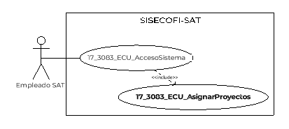
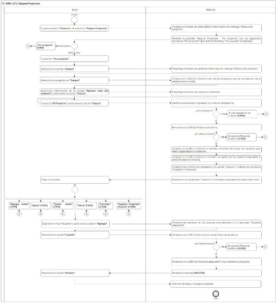

||Administración General de Comunicaciones y Tecnologías de la Información|
| :- | -: |
||Marco Documental 7.0|
|
Fecha de aprobación del Template:

02/08/2023
|
**Especificación del Caso de Uso**

17\_3083\_ECU\_AsignarProyectos.docx
|Versión del template: 7.00|
| :-: | :-: | :-: |

**<ID Requerimiento>** 8309

**Nombre del Requerimiento: **TI\_SISECOFI-SAT\_Seguimiento financiero y control documental de proyectos de contratación

**Tabla de Versiones y Modificaciones**

|Versión|Descripción del cambio|Responsable de la Versión|Fecha|
| :-: | :- | :-: | :-: |
|*1*|*Creación del documento*|Isabel Adriana Valdez Cortés|*15/01/2024*|
|*1.1*|*Revisión del documento*|Luis Angel Olguin Castillo|*25/01/2024*|
|*1.2*|*Versión aprobada para firma*|
María del Carmen Castillejos Cárdenas

Rubén Delgado Ramírez
|*16/05/2024*|

**Tabla de Contenido**

[17_3083_ECU_AsignarProyectos	2](#_toc167092064)

[1. Descripción	2](#_toc167092065)

[2. Diagrama del Caso de Uso	2](#_toc167092066)

[3. Actores	2](#_toc167092067)

[4. Precondiciones	2](#_toc167092068)

[5. Post condiciones	2](#_toc167092069)

[6. Flujo primario	3](#_toc167092070)

[7. Flujos alternos	6](#_toc167092071)

[8. Referencias cruzadas	15](#_toc167092072)

[9. Mensajes	15](#_toc167092073)

[10. Requerimientos No Funcionales	15](#_toc167092074)

[11. Diagrama de actividad	18](#_toc167092075)

[12. Diagrama de estados	18](#_toc167092076)

[13. Aprobación del cliente	19](#_toc167092077)

### ****17\_3083\_ECU\_AsignarProyectos

|<h3>**1. Descripción** </h3>|
| :- |
|

El objetivo de este Caso de Uso es permitir al Empleado SAT relacionar proyectos con usuarios que se encuentren registrados en este sistema.

|
|<h3>**2. Diagrama del Caso de Uso**</h3>|
||
|<h3>**3. Actores** </h3>|
||

|**Actor**|**Descripción**|
| :-: | :-: |
|**Empleado SAT**|El Empleado SAT es el que tiene el o los roles otorgados por la Administración Central de Seguridad, Monitoreo y Control (ACSMC) para ingresar a cada uno de los módulos de este sistema.|

|

|
| :- |
|<h3>**4. Precondiciones**</h3>|
|

- Se han registrado “Proyectos” y “Usuarios” previamente.

- El Empleado SAT se ha autenticado en el sistema con e.firma válida.

- El sistema ha consumido el servicio “Oauth” para obtener los datos del Empleado SAT que ingresa.

- El sistema ha validado que el Empleado SAT cuenta con los roles para ingresar al módulo “Sistema” y al submódulo “Asignar Proyecto”.

- El Empleado SAT ha ingresado a la opción del menú “Sistema” y al submenú “Asignar Proyecto”, de acuerdo con el proceso del **(17\_3083\_ECU\_AccesoSistema)**.

&emsp;
|
|<h3>**5. Post condiciones** </h3>|
|

- El Empleado SAT relacionó usuarios a un proyecto específico.

- El Empleado SAT relacionó proyectos a un usuario específico.

|
|<h3>**6. Flujo primario**</h3>|
||

|**Actor**|**Sistema**|
| :-: | :-: |
|1. El Caso de Uso inicia cuando el Empleado SAT ingresa al menú **“Sistema”** y al submenú **“Asignar Proyectos”**.|2. Consulta y obtiene de la base de datos (BD) la información correspondiente al catálogo “Estatus de proyecto”.|
||
3. Muestra la pantalla “Asignar Proyectos – Por proyecto” con las siguientes secciones:

&emsp;

&emsp;Sección “Por proyecto” (por defecto abierta):

- Estatus. Aplica la regla de negocio **(RNA30)**

- Nombre corto del proyecto

- Id proyecto

Opción:

- Buscar

Tablas por defecto vacías:

- Usuarios

- Usuarios asignados

&emsp;

Opciones habilitadas:

- Agregar todos ![ref1]

- Agregar ![ref2]

- Quitar todos ![ref3]

- Quitar 

- Filtrar ![ref4]

- Exportar Proyectos-Usuarios 

&emsp;

Opciones inhabilitadas:

- Cancelar

- Guardar

Sección “Por usuario” (colapsada).

Ver **(17\_3083\_EIU\_AsignarProyectos)** Estilos 01.
|
|
4. Accede a la sección **“Por proyecto”**.

&emsp;

- En caso de seleccionar la sección **“Por usuario”**, continúa en el flujo alterno **([**FA01**](#fa01))**.
||
|5. Selecciona el campo **“Estatus”**.|6. Despliega en el campo de “Estatus” el listado de opciones obtenidas del catálogo “Estatus del proyecto”.|
|7. Selecciona una opción en **“Estatus”**.|8. Consulta y obtiene de la BD el nombre corto de los proyectos que se encuentren en el estatus seleccionado.|
|9. Selecciona información en el campo **“Nombre corto del proyecto”**.|10. Despliega en el campo “Nombre corto del proyecto” el listado de proyectos obtenidos.|
|11. Ingresa el **“Id proyecto”**.||
|12. Selecciona la opción **“Buscar”**.|
13. Verifica que se hayan ingresado los criterios obligatorios para la búsqueda, de acuerdo con la **(RNA08)** y **(RNA03)**.

&emsp;

- En caso contrario, continúa en el **([**FA02**](#fa02))**.
|
||
14. Almacena en la BD la información de las Pistas de Auditoría.

&emsp; 

&emsp;Datos que se almacenan:

**Módulo**= AsignarProyecto\_PorProyecto

**Fecha y Hora**= Fecha y hora del sistema, usando el formato DD/MM/AAAA HH:MM:SS

**RFC Usuario**= RFC largo del Empleado SAT que ingresó al sistema.

**Tipo de movimiento**= **CNST** (Consultar)

**Movimiento**= 

- Nombre corto del proyecto que se consulta

- En caso de que no se puedan almacenar las Pistas de Auditoría, continúa en el **([**FA03**](#fa03))**.
|
||15. Consulta en la BD y obtiene el nombre completo de todos los usuarios que estén registrados en el sistema. Aplica la **(RNA09)**|
||16. Consulta en la BD y obtiene el nombre completo de los usuarios asignados al proyecto que se consulta. Aplica la **(RNA10)**|
||17. Inhabilita los criterios de búsqueda y la opción “Buscar”.|
||18. Habilita las opciones “Guardar” y “Cancelar”.|
||19. Muestra en los apartados “Usuarios” y “Usuarios asignados” los datos obtenidos.|
|
20. Elige una opción:

&emsp;

- En caso de requerir asignar usuarios al proyecto, elige uno o más “Usuarios” y selecciona la opción **“Agregar”**, el flujo continúa.

&emsp;

- En caso de seleccionar la opción **“Agregar todos”** los usuarios en una sola acción, continúa en el **([**FA09**](#fa09))**.

&emsp;

- En caso de requerir quitar usuarios del proyecto, elige uno o más “Usuarios asignados” y selecciona la opción **“Quitar”**, continúa en el **([**FA04**](#fa04))**.

&emsp;

- En caso de seleccionar la opción **“Quitar todos”** en una sola acción, continúa en el **([**FA10**](#fa10))**.

&emsp;

- En caso de requerir **“Filtrar”** los datos mostrados, continúa en el **([**FA05**](#fa05))**.

&emsp;

- En caso de seleccionar la opción **“Cancelar”**,** continúa en el **([**FA06**](#fa06))**.

&emsp;

- En caso de seleccionar la opción **“Exportar Proyectos-Usuarios”**, continúa en el **([**FA08**](#fa08))**.
|21. Presenta los nombres de los usuarios seleccionados en el apartado “Usuarios asignados”.|
|22. Selecciona la opción **“Guardar”**.|
23. Almacena en la BD la información de las Pistas de Auditoría.

&emsp; 

&emsp;Datos que se almacenan:

**Módulo**= AsignarProyecto\_PorProyecto

**Fecha y Hora**= Fecha y hora del sistema, usando el formato DD/MM/AAAA HH:MM:SS

**RFC Usuario**= RFC largo del Empleado SAT que ingresó al sistema.

**Tipo de movimiento**= **INSR** (Insertar)

**Movimiento**= Aplica la **(RNA239)**

- Nombre corto del proyecto

- Nombre de cada usuario asignado

- En caso de que no se puedan almacenar las Pistas de Auditoría, continúa en el **([**FA03**](#fa03))**.
|
||24. Almacena en la BD los nombres de los usuarios que se encuentren en el apartado de “Usuarios asignados” y los relaciona al proyecto.|
||25. Muestra el mensaje **([**MSG001**](#msg001))** con la opción** “Aceptar”.|
|26. Selecciona la opción **“Aceptar”**.|27. Cierra el mensaje y recarga la pantalla.|
||28. Fin del Caso de Uso.|

|

|
| :- |
|<h3>**7. Flujos alternos** </h3>|
|

**FA01 Selecciona sección “Por usuario”**
|

|**Actor**|**Sistema**|
| :-: | :-: |
|1. El **FA01** inicia cuando el Empleado SAT selecciona la sección **“Por usuario”**.|2. Consulta en la BD y obtiene los nombres completos de todos los usuarios que estén registrados en el sistema con estatus “Activo”. |
||
3. Despliega en la pantalla los siguientes campos de la sección “Por usuario”:

&emsp;

- Usuario\*

- Buscar

&emsp;

Tablas por defecto vacías:

- Proyectos

- Proyectos asignados

Opciones habilitadas:

- Agregar todos ![ref5]

- Agregar ![ref2]

- Quitar todos ![ref6]

- Quitar 

- Filtrar ![ref4]

&emsp;

Opciones inhabilitadas:

- Guardar

- Cancelar

Ver **(17\_3083\_EIU\_AsignarProyectos)** Estilos 02.
|
|4. Selecciona el campo **“Usuario\*”**.|5. Despliega el listado obtenido de usuarios activos registrados en este sistema.|
|6. Elige una opción del listado de usuarios y selecciona la opción **“Buscar”**.|
7. Verifica que se haya seleccionado como obligatorio un nombre de usuario en el campo “Usuario”, aplica la **(RNA03)**.

&emsp;

- En caso contrario, continúa en el **([**FA02**](#fa02))**.
|
||
8. Almacena en la BD la información de las Pistas de Auditoría.

&emsp; 

&emsp;Datos que se almacenan:

**Módulo**= AsignarProyecto\_PorUsuario

**Fecha y Hora**= Fecha y hora del sistema, usando el formato DD/MM/AAAA HH:MM:SS

**RFC Usuario**= RFC largo del Empleado SAT que ingresó al sistema.

**Tipo de movimiento**= **CNST** (Consultar)

**Movimiento**=

- Nombre usuario

- En caso de que no se puedan almacenar las Pistas de Auditoría, continúa en el **([**FA03**](#fa03))**.
|
||9. Consulta en la BD y obtiene el “Nombre corto” de todos los proyectos registrados en este sistema, de acuerdo con la **(RNA11)**.|
||10. Consulta en la BD y obtiene el “Nombre corto” de los proyectos asignados al usuario seleccionado, aplica la **(RNA12)**.|
||11. Inhabilita el criterio de búsqueda y la opción “Buscar”.|
||12. Habilita las opciones “Guardar” y “Cancelar”.|
||13. Muestra en los apartados “Proyectos” y “Proyectos asignados” los datos obtenidos.|
|
14. Elige una opción:

&emsp;

- En caso de requerir asignar proyectos al usuario, elige uno o más “Proyectos” y selecciona la opción **“Agregar”** uno o más proyectos seleccionados, el flujo continúa.

- En caso de seleccionar la opción **“Agregar todos”** los proyectos en una sola acción, continúa en el **([**FA09**](#fa09))**.

- En caso de requerir quitar proyectos del usuario, elige uno o más “Proyectos asignados” y selecciona la opción **“Quitar”** uno o más proyectos seleccionados, continúa en el **([**FA07**](#fa07))**.

- En caso de seleccionar la opción **“Quitar todos”** los proyectos en una sola acción, continúa en el **([**FA10**](#fa10))**.

- En caso de requerir **“Filtrar”** los datos mostrados, continúa en el **([**FA05**](#fa05))**.

- Si selecciona la opción **“Cancelar”**,** continúa en el **([**FA06**](#fa06))**.
|15. Presenta el nombre corto de los proyectos seleccionados, en el apartado “Proyectos asignados”.|
|16. Selecciona la opción **“Guardar”.**|
17. Almacena en la BD la información de las Pistas de Auditoría. 

&emsp;

&emsp;Datos que se almacenan:

**Módulo**= AsignarProyecto\_PorUsuario

**Fecha y Hora**= Fecha y hora del sistema usando el formato DD/MM/AAAA HH:MM:SS

**RFC Usuario**= RFC largo del Empleado SAT que ingresó al sistema.

**Tipo de movimiento**= **INSR** (Insertar)

**Movimiento**= Aplica la **(RNA239)**

- Nombre usuario

- Nombre corto de cada proyecto asignado

- En caso de que no se puedan almacenar las Pistas de Auditoría, continúa en el **([**FA03**](#fa03))**.
|
||18. Almacena en la BD el o los proyectos que se asignaron al usuario seleccionado y los relaciona.|
||19. Muestra el **([**MSG001**](#msg001))** con la opción “Aceptar”.|
|20. Selecciona la opción **“Aceptar”**.|21. Cierra el mensaje y recarga la pantalla inicializando los campos de la sección nuevamente.|
||22. Fin del Caso de Uso.|

|

**FA02 Se identifica que no se ingresaron los criterios obligatorios o no ingresó como mínimo uno**
|
| :- |

|**Actor**|**Sistema**|
| :-: | :-: |
||1. El **FA02** inicia cuando el sistema identifica que no se ingresaron los criterios de búsqueda.|
||2. Muestra en rojo los campos pendientes de capturar.|
||3. Muestra el **([**MSG002**](#msg002))**, con la opción “Aceptar”.|
|4. Selecciona la opción **“Aceptar”**.|5. Cierra el mensaje. |
||
6. Regresa al paso dependiendo donde es invocado este flujo:

&emsp;

- Si se invoca en el paso 13 del Flujo primario, continúa en el paso [**4**](#_ref166747950) del Flujo primario.

- Si se invoca en el paso 7 del **([**FA01**](#fa01))**, continúa en el paso [**3**](#_ref156502660) del **([**FA01**](#fa01))**.
|

|

**FA03 No se pueden almacenar las Pistas de Auditoría**
|
| :- |

|**Actor**|**Sistema**|
| :-: | :-: |
||1. El **FA03** inicia cuando interviene un evento ajeno y no se puedan almacenar las Pistas de Auditoría.|
||2. Cancela la operación sin completar el movimiento que estaba en proceso.|
||
3. Muestra el mensaje informativo de acuerdo con lo siguiente:

&emsp;

- Si la pista de auditoría es por el tipo de movimiento **UPDT** o **INSR**, se muestra el **([**MSG007**](#msg007))**.

&emsp;

- Si la pista de auditoría es por el tipo de movimiento **CNST**, se muestra el **([**MSG008**](#msg008))**.

- En caso de que la pista de auditoría sea por el tipo de movimiento **PRNT**, se muestra el **([**MSG009**](#msg009))**.

Cada mensaje se muestra con la opción “Aceptar”.
|
|4. Selecciona la opción **“Aceptar”**.|5. Cierra el mensaje.|
||6. Regresa al paso previo que detona la acción de la pista de auditoría.|

|

**FA04 Quitar usuarios asignados**
|
| :- |

|**Actor**|**Sistema**|
| :-: | :-: |
|1. El **FA04** inicia cuando el Empleado SAT selecciona la opción **“Quitar”** uno o más usuarios seleccionados.|2. Presenta el o los nombres que se seleccionaron de “Usuarios asignados” en el apartado de “Usuarios”. |
||
3. Continúa en el paso de acuerdo con lo siguiente:

&emsp;

- Si fue invocado al agregar todos los usuarios, continúa en el paso **[**20**](#_ref156568126)** del Flujo primario.

- Si fue invocado al agregar todos los proyectos,** continúa en el paso [**14**](#_ref156568457) del **([**FA01**](#fa01))**.
|

|

**FA05 Filtrar resultados en tablas “Usuarios”, “Proyectos” y los asignados**
|
| :- |

|**Actor**|**Sistema**|
| :-: | :-: |
|1. El **FA05** inicia cuando el Empleado SAT requiere **“Filtrar”** los datos mostrados.||
|2. Ingresa la información en el campo para filtrar.|3. Realiza la búsqueda dentro de los datos del apartado en donde se requiere filtrar la información.|
||
4. Muestra el resultado en el apartado correspondiente, considerando los siguientes puntos y la **(RNA66)**:

&emsp;

- Si el filtro se realiza en el apartado “Usuarios”, el resultado se muestra en dicho apartado.

- Si el filtro se realiza en el apartado “Usuarios asignados”, el resultado se muestra en el mismo apartado.

- Si el filtro se realiza en el apartado “Proyectos”, el resultado se muestra en el mismo apartado.

- En caso de que el filtro se realice en el apartado “Proyectos asignados”, el resultado se muestra en el mismo apartado.

- En caso de que la información ingresada en el campo para filtrar no tenga coincidencia con algún dato, no mostrará ningún proyecto y regresa al punto 2 de este flujo.
|
||
5. Realiza lo siguiente:

- Si fue invocado en el Flujo primario, continúa en el paso [**20**](#_ref156568126) del Flujo primario.

- Si fue invocado en el **([**FA01**](#fa01))** en el paso [**14**](#_ref156568457) del **([**FA01**](#fa01))**.
|

|

**FA06 Selecciona la opción “Cancelar”**
|
| :- |

|**Actor**|**Sistema**|
| :-: | :-: |
|1. El **FA06** inicia cuando el Empleado SAT selecciona la opción **“Cancelar”**.|2. Muestra el **([**MSG003**](#msg003))** con** las opciones “Sí” y No”.|
|
3. Selecciona la opción **“Sí”** y el flujo continúa.

&emsp;

- En caso de seleccionar **“No”**, continúa en el paso [**6**](#_ref157021808) de este flujo.
|4. Cierra la ventana emergente.|
||5. Inicializa los campos de la pantalla en donde se selecciona la opción dejándolos como en un inicio, no almacena ninguna información.|
||6. Permanece en la sección donde fue invocado: “Por proyecto”** y** “Por usuario”.|

|

**FA07 Selecciona la opción “Quitar” proyectos asignados**
|
| :- |

|**Actor**|**Sistema**|
| :-: | :-: |
|1. El **FA07** inicia cuando el Empleado SAT selecciona la opción **“Quitar”** uno o más proyectos.|2. Presenta el o los nombres cortos de los proyectos asignados al usuario seleccionado en el apartado de “Proyectos”. |
||
4. Continúa en el paso de acuerdo con lo siguiente:

&emsp;

- Si fue invocado al agregar todos los usuarios, continúa en el paso **[**20**](#_ref156568126)** del Flujo primario.

- Si fue invocado al agregar todos los proyectos,** continúa en el paso [**14**](#_ref156568457) del **([**FA01**](#fa01))**.
|

|

**FA08 Selecciona la opción “Exportar Proyectos-Usuarios”**
|
| :- |

|**Actor**|**Sistema**|
| :-: | :-: |
|1. El **FA08** inicia cuando el Empleado SAT selecciona la opción **“Exportar Proyectos-Usuarios”**.|
2. Almacena en la BD la información de las Pistas de Auditoría.

&emsp; 

&emsp;Datos que se almacenan:

**Módulo**= AsignarProyecto\_PorProyecto

**Fecha y Hora**= Fecha y hora del sistema, usando el formato DD/MM/AAAA HH:MM:SS

**RFC Usuario**= RFC largo del Empleado SAT que ingresó al sistema.

**Tipo de movimiento**= 

**CNST** (Consultar)

**PRNT** (Imprimir)

**Movimiento**= Aplica la **(RNA239)**

- Nombre corto de cada proyecto que se consulta

- En caso de que no se pueda almacenar las Pistas de Auditoría, continúa en el **([**FA03**](#fa03))**.
|
||
3. Consulta en la BD y obtiene la siguiente información de los proyectos registrados en este sistema dependiendo la opción seleccionada en el campo “Estatus”, considerando la **(RNA70)**.

&emsp;

- Nombre corto del proyecto

- Id proyecto
|
||
4. Por cada proyecto obtenido en el paso anterior, consulta en la BD y obtiene el siguiente dato de los usuarios asignados.

- Nombre completo
|
||
5. Genera un archivo de Excel con extensión (.xlsx) que contenga la información obtenida en los pasos anteriores:

&emsp;

- Estatus del proyecto

- Nombre corto del proyecto

- Nombre completo del proyecto

- Id proyecto

- Usuarios asignados

**Nota:** Se genera una fila por cada usuario asignado y que se repita el resto de la información.
|
||6. Descarga el archivo de Excel con extensión (.xlsx).|
||7. Regresa al paso [**20**](#_ref156568126) del Flujo primario.|

|

**FA09 Selecciona la opción “Agregar todos” (Usuarios o Proyectos)**
|
| :- |

|**Actor**|**Sistema**|
| :-: | :-: |
|1. El **FA09** inicia cuando el Empleado SAT selecciona la opción **“Agregar todos”** (Usuarios o Proyectos).|2. Marcar como seleccionados los campos de selección de todos los registros que se encuentran en el apartado “Usuarios” o en “Proyectos”.|
||3. Muestra el **([**MSG004**](#msg004))** o **([**MSG005**](#msg005))** según corresponda, con las opciones “Sí” y “No”.|
|
4. Selecciona la opción **“Sí”** y el flujo continúa.

&emsp;

- En caso de seleccionar **“No”**, regresa al paso donde fue invocado.
|5. Cierra el mensaje.|
||6. Muestra en el apartado “Usuarios asignados” o “Proyectos asignados” todos los registros, quedando vacío el apartado de “Usuarios” o “Proyectos” según corresponda.|
||
7. Continúa en el paso de acuerdo con lo siguiente:

&emsp;

- Si fue invocado al agregar todos los usuarios, continúa en el paso **[**20**](#_ref156568126)** del Flujo primario.

- Si fue invocado al agregar todos los proyectos,** continúa en el paso [**14**](#_ref156568457) del **([**FA01**](#fa01))**.
|

|

**FA10 Selecciona la opción “Quitar todos” (Usuarios o Proyectos asignados)**
|
| :- |

|**Actor**|**Sistema**|
| :-: | :-: |
|1. El **FA10** inicia cuando el Empleado SAT selecciona la opción **“Quitar todos”** en una sola acción (Usuarios o Proyectos asignados).|2. Marca como seleccionados los campos de selección de todos los registros que se encuentran en el apartado “Usuarios asignados” o en “Proyectos asignados”.|
||3. Muestra el **([**MSG010**](#msg010))** o **([**MSG006**](#msg006))** según corresponda, con las opciones “Sí” y “No”.|
|
4. Selecciona la opción **“Sí”** y el flujo continúa.

&emsp;

- En caso de seleccionar **“No”**, regresa al paso donde fue invocado.
|
5. Cierra el mensaje.

|
||6. Muestra en el apartado “Usuarios” o “Proyectos” todos los registros, quedando vacío el apartado de “Usuarios asignados” o “Proyectos asignados” según corresponda.|
||
7. Continúa en el paso de acuerdo con lo siguiente:

&emsp;

- Si fue invocado al quitar “Usuarios asignados”, continúa en el paso [**20**](#_ref156568126) del Flujo primario.

- Si fue invocado al quitar “Proyectos asignados”,** continúa en el paso [**14**](#_ref156568457) del **([**FA01**](#fa01))**.
|

|

|
| :- |
|<h3>**8. Referencias cruzadas** </h3>|
|

- 17\_3083\_CRN\_SeguimientoFinancieroYControl

- 17\_3083\_ECU\_AccesoSistema

- 17\_3083\_EIU\_AsignarProyectos

|
|<h3>**9. Mensajes** </h3>|
||

|**ID Mensaje**|**Descripción**|
| :-: | :-: |
|**MSG001**|Se guardaron los cambios con éxito.|
|**MSG002**|Favor de ingresar al menos un criterio para la búsqueda.|
|**MSG003**|Al cancelar se perderán los cambios realizados. ¿Está seguro de continuar?|
|**MSG004**|¿Está seguro de asignar todos los usuarios?|
|**MSG005**|¿Está seguro de asignar todos los proyectos?|
|**MSG006**|¿Está seguro de excluir los proyectos asignados?|
|**MSG007**|Ocurrió un error al guardar el registro, favor de intentar nuevamente (PA01).|
|**MSG008**|Ocurrió un error al consultar la información, favor de intentar nuevamente (PA01).|
|**MSG009**|Ocurrió un error al exportar la información, favor de intentar nuevamente (PA01).|
|**MSG010**|¿Está seguro de excluir los usuarios asignados? |

|

|
| - |
|<h3>**10. Requerimientos No Funcionales** </h3>|
|

|

|**ID de RNF**|**Requerimiento No Funcional**|**Descripción**|
| :-: | :-: | :-: |
|**RNF001**|Disponibilidad|El sistema deberá estar activo las 24 horas del día, los 365 días del año con picos de operación en el horario de 9:00 a 18:00 horas.|
|**RNF002**|Concurrencia|
El número de Empleados SAT que puede tener el sistema son 150. 

 

El número de accesos concurrentes que debe soportar este sistema son máximo 30 Empleados SAT. 
|
|**RNF003**|Seguridad|El acceso solo podrá ser otorgado a todo Empleado SAT que tenga los roles asignados por la Administración Central de Seguridad, Monitoreo y Control (ACSMC) para cada módulo de este sistema.|
|**RNF004**|Usabilidad|
El sistema deberá manejar los siguientes elementos para facilitar la navegación: 

- Mensajes tipo flotantes (*tooltips*) con información de la herramienta que ofrece ayuda contextual como guía para el Empleado SAT.

- Componente de ordenamiento que permita acomodar la información de la tabla de forma ascendente o descendente, considerando la columna donde es seleccionado. 

- Contar con un diseño responsivo que permita su óptima visualización en distintos tipos de dispositivos finales.
|
|**RNF005**|Eficiencia|Las consultas se dividen en generales y detalladas, para que las detalladas carguen la información solo cuando sean requeridas por el Empleado SAT.|
|**RNF006**|Usabilidad|
El Empleado SAT debe poder navegar a través de las páginas resultantes de la consulta considerando que el sistema debe mostrar inicialmente 15 registros por página, permitiendo al Empleado SAT seleccionar los registros que requiere visualizar, teniendo las opciones de 15, 50 y 100:

- Ir a la primera página (debe mostrar la primera página con el resultado de la consulta).

- Ir a la última página (debe mostrar la última página con el resultado de la consulta).

- Ir a la siguiente página (debe mostrar la siguiente página, considerando la página actual, con el resultado de la consulta y el número de registros seleccionados por el Empleado SAT).

- Ir a la página anterior (debe mostrar la página anterior considerando la actual, con el resultado de la consulta).

&emsp;

En la tabla deben mostrarse los registros ordenados alfabéticamente.
|
|**RNF007**|Seguridad|Las Pistas de Auditoría deben estar protegidas contra accesos no autorizados. Solo los Empleados SAT autorizados pueden consultarlas, y la información en ellas se definirá durante la etapa de diseño, la cual debe estar cifrada para mantenerla confidencial y evitar exposiciones no autorizadas.|
|**RNF008**|Fiabilidad|El sistema debe ser capaz de manejar excepciones de manera efectiva y presentar mensajes claros y comprensibles para garantizar una adecuada interacción con el sistema.|
|**RNF009**|Seguridad|Se debe mantener la información en pantalla en caso de un error al guardar las Pistas de Auditoría, siempre y cuando el escenario lo permita. Hay situaciones de infraestructura o de conexión de internet que sí pierde los datos ya que no están controlados por el sistema.|

||
| - |

|<h3>**11. Diagrama de actividad** </h3>|
| :- |
|

|
|<h3>**12. Diagrama de estados** </h3>|
|

No aplica, no se requiere para este proceso.
|
**\

|<h3>**13. Aprobación del cliente** </h3>|
| :- |
|

|

|**FIRMAS DE CONFORMIDAD**||
| :-: | :- |
|**Firma 1** |**Firma 2** |
|**Nombre**: María del Carmen Castillejos Cárdenas.|**Nombre**: Rubén Delgado Ramírez.|
|**Puesto**: Usuaria ACPPI.|**Puesto**: Usuario ACPPI.|
|**Fecha:**|**Fecha:**|
|||
|**Firma 3** |**Firma 4**|
|**Nombre**: Rodolfo López Meneses.|**Nombre**: Diana Yazmín Pérez Sabido.|
|**Puesto**: Usuario ACPPI.|**Puesto**: Usuaria ACPPI.|
|**Fecha:**|**Fecha:**|
|||
|**Firma 5**|**Firma 6**|
|**Nombre**: Yesenia Helvetia Delgado Naranjo.|**Nombre:** Alejandro Alfredo Muñoz Núñez.|
|**Puesto**: APE ACPPI.|**Puesto:** RAPE ACPPI.|
|**Fecha**:|**Fecha**:|
|||
|**Firma 7**|**Firma 8**|
|**Nombre**: Luis Angel Olguin Castillo.|**Nombre**: Erick Villa Beltrán.|
|**Puesto**: Enlace ACPPI.|**Puesto**: Líder APE SDMA 6.|
|**Fecha**:|**Fecha**:|
|||
|**Firma 9**|**Firma 10**|
|**Nombre:** Juan Carlos Ayuso Bautista.|**Nombre:** Isabel Adriana Valdez Cortés.|
|**Puesto:** Líder Técnico SDMA 6.|**Puesto:** Analista de Sistemas DS SDMA 6.|
|**Fecha**:|**Fecha**:|
|||

||
| :- |

|||Página 1 de 9|
| :- | :-: | -: |

[ref1]: Aspose.Words.2d683e30-264f-4f6f-8c47-d470c4211f61.003.png
[ref2]: Aspose.Words.2d683e30-264f-4f6f-8c47-d470c4211f61.004.png
[ref3]: Aspose.Words.2d683e30-264f-4f6f-8c47-d470c4211f61.005.png
[ref4]: Aspose.Words.2d683e30-264f-4f6f-8c47-d470c4211f61.007.png
[ref5]: Aspose.Words.2d683e30-264f-4f6f-8c47-d470c4211f61.009.png
[ref6]: Aspose.Words.2d683e30-264f-4f6f-8c47-d470c4211f61.010.png
