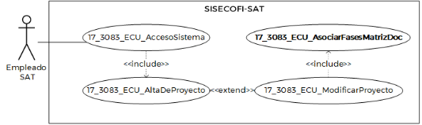
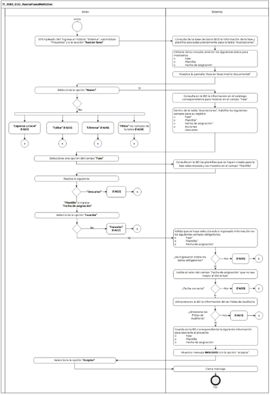

||Administración General de Comunicaciones y Tecnologías de la Información|
| :- | -: |
||Marco Documental 7.0|
|
Fecha de aprobación del Template:

02/08/2023
|
**Especificación del Caso de Uso**

17\_3083\_ECU\_AsociarFasesMatrizDoc.docx
|Versión del template: 7.00|
| :-: | :-: | :-: |

**<ID Requerimiento>**8309

**Nombre del Requerimiento: **TI\_SISECOFI-SAT\_Seguimiento financiero y control documental de proyectos de contratación

**Tabla de Versiones y Modificaciones**

|

Versión

|Descripción del cambio|Responsable de la Versión|Fecha|
| :-: | :-: | :-: | :-: |
|*1*|*Creación del documento*|Eduardo Acosta Mora|*01/02/2024*|
|*1.1*|*Revisión del documento*|
Luis Angel Olguin 

Castillo
|*10/03/2024*|
|*1.2*|*Versión aprobada para firma*|
María del Carmen Castillejos Cárdenas

Rubén Delgado Ramírez
|
06/06/2024

|

**Tabla de Contenido**

[17_3083_ECU_AsociarFasesMatrizDoc	2](#_toc168584919)

[1. Descripción	2](#_toc168584920)

[2. Diagrama del Caso de Uso	2](#_toc168584921)

[3. Actores	2](#_toc168584922)

[4. Precondiciones	2](#_toc168584923)

[5. Post condiciones	3](#_toc168584924)

[6. Flujo primario	3](#_toc168584925)

[7. Flujos alternos	6](#_toc168584926)

[8. Referencias cruzadas	11](#_toc168584927)

[9. Mensajes	11](#_toc168584928)

[10. Requerimientos No Funcionales	12](#_toc168584929)

[11. Diagrama de actividad	14](#_toc168584930)

[12. Diagrama de estados	14](#_toc168584931)

[13. Aprobación del cliente	15](#_toc168584932)

### ****17\_3083\_ECU\_AsociarFasesMatrizDoc

|<h3>**1. Descripción** </h3>|
| :- |
|

El objetivo de este Caso de Uso es permitir al Empleado SAT asociar al proyecto la plantilla correspondiente a la fase.

|
|<h3>**2. Diagrama del Caso de Uso**</h3>|
|

|
|<h3>**3. Actores** </h3>|
||

|**Actor**|**Descripción**|
| :-: | :-: |
|**Empleado SAT**|El Empleado SAT es el que tiene el o los roles otorgados por la Administración Central de Seguridad, Monitoreo y Control (ACSMC) para ingresar cada uno de los módulos de este sistema.|

|

|
| :- |
|<h3>**4. Precondiciones**</h3>|
|

- El Empleado SAT se ha autenticado en el sistema con e.firma válida.

- El sistema ha consumido el servicio “Oauth” para obtener los datos del Empleado SAT que ingresa al sistema.

- Se le han asignado el rol requerido al Empleado SAT para ingresar al módulo “Sistema”, submódulo “Proyectos” y a la sección “Asociar fases”.

- El sistema ha validado que el Empleado SAT cuenta con el rol para ingresar al módulo “Sistema”, submódulo “Proyectos” y a la sección “Asociar fases”.

- Se han almacenado la o las plantillas de acuerdo con la fase.

|
|<h3>**5. Post condiciones** </h3>|
|

- El Empleado SAT asoció la fase y su plantilla correspondiente al proyecto.

- El Empleado SAT modificó la fase y su plantilla correspondiente al proyecto.

- El Empleado SAT desasoció la fase y su plantilla correspondiente al proyecto.

|
|<h3>**6. Flujo primario**</h3>|
||

|**Actor**|**Sistema**|
| :-: | :-: |
|1. El Caso de Uso inicia cuando el Empleado SAT ingresa al módulo “Sistema”, submódulo “Proyectos” y a la sección **“Asociar fases”**.|2. Consulta de la base de datos (BD) la información de la fase y plantilla asociadas previamente para la tabla “Asociaciones”.|
||
3. Obtiene de la consulta anterior los siguientes datos para mostrarlos: 

&emsp;

- Fase

- Plantilla

- Fecha de asignación
|
||
4. Muestra la pantalla “Asociar fases matriz documental” con los siguientes campos y opciones:

&emsp;

&emsp;Tabla (Asociaciones). Aplica la regla de negocio **(RNA244)**:

- Fase

- Plantilla

- Fecha de asignación

- Acciones

- Editar 

- Eliminar 

Opciones:

- Nuevo 

- Exportar a Excel 

- Guardar

- Cancelar

- Campos para “Filtrar” por columna

Ver **(17\_3083\_EIU\_AsociarFasesMatrizDoc)** Estilos 01.
|
|
5. Selecciona la opción **“Nuevo”**.

&emsp;

- En caso de que seleccione la opción **“Exportar a Excel”**, continúa en el flujo alterno **([**FA01**](#fa01))**.

- En caso de que seleccione la opción **“Editar”**, continúa en el **([**FA03**](#fa03))**.

&emsp;

- En caso de que seleccione la opción **“Eliminar”**, continúa en el **([**FA06**](#fa06))**.

- En caso de que seleccione la opción para **“Filtrar”** los campos de la tabla, continúa en el **([**FA08**](#fa08))**.
|6. Consulta en la BD la información en el catálogo correspondiente para mostrar en el campo “Fase” de acuerdo con la **(RNA01) y (RNA251)**.|
||
7. Dentro de la tabla “Asociaciones”, habilita los siguientes campos para su registro:

&emsp;

- Fase\*

- Plantilla\*

- Fecha de asignación\*

- Acciones 

- Descartar ![ref1]

Ver

**(17\_3083\_EIU\_AsociarFasesMatrizDoc)** Estilos 01.
|
|8. Selecciona una opción del campo **“Fase”**.|9. Consulta en la BD las plantillas que se hayan creado para la fase seleccionada y las muestra en el campo “Plantilla”.|
|
10. Realiza lo siguiente:

- En caso de que seleccione una opción del campo **“Plantilla”** e ingresa un valor para el campo **“Fecha de asignación”**, el flujo continúa.

&emsp;

- En caso de que seleccione la opción **“Descartar”**, continúa en el **([**FA02**](#fa02))**.
||
|
11. Selecciona la opción **“Guardar”**.

&emsp;

- En caso de que seleccione la opción **“Cancelar”**, continúa en el **([**FA02**](#fa02))**.
|
12. Valida que se haya seleccionado e ingresado información en los siguientes campos obligatorios de acuerdo con la **(RNA03)**:

&emsp;

- Fase\*

- Plantilla\*

- Fecha de asignación\*

- En caso de que no se haya seleccionado e ingresado información en los campos obligatorios, continúa en el **([**FA04**](#fa04))**.
|
||
13. Valida el valor del campo “Fecha de asignación” que no sea mayor al día actual.

&emsp;

- En caso de que la fecha sea incorrecta, el flujo continúa en el **([**FA09**](#fa09))**.
|
||
14. Almacena en la BD la información de las Pistas de Auditoría.

&emsp;

**Módulo**= Proyecto- Asociarfases

**Fecha y Hora**= Fecha y hora del sistema usando el formato DD/MM/AAAA HH:MM:SS

**RFC Usuario**= RFC largo del Empleado SAT que ingresó al sistema.

**Tipo de movimiento**= **INSR** (Insertar) y/o **UPDT** (Modificar) y/o **DLT** (Borrar).

**Movimiento**= Aplica la **(RNA239)**

- Id de registro

- Id de proyecto

- Nombre de plantilla

- En caso de que no se pueda almacenar las Pistas de Auditoría, continúa en el **([**FA05**](#fa05))**.
|
||
15. Guarda en la BD correspondiente la siguiente información para asociarla al proyecto:

&emsp;

- Fase

- Plantilla

- Fecha de asignación
|
||16. Muestra mensaje **([**MSG001**](#msg001))** con la opción “Aceptar”.|
|17. Selecciona la opción **“Aceptar”**.|18. Cierra mensaje.|
||19. Fin del Caso de Uso.|

|

|
| :- |
|<h3>**7. Flujos alternos** </h3>|
|

**FA01 Selecciona la opción “Exportar a Excel”**
|

|**Actor**|**Sistema**|
| :-: | :-: |
|1. El **FA01** inicia cuando el Empleado SAT selecciona la opción **“Exportar a Excel”**.|
2. Almacena en la BD la información de las Pistas de Auditoría.

&emsp;

&emsp;Datos que se almacenan: 

**Módulo**= Proyecto -Asociarfases

**Fecha y Hora**= Fecha y hora del sistema usando el formato DD/MM/AAAA HH:MM:SS

**RFC Usuario**= RFC largo del Empleado SAT que ingresó al sistema.

**Tipo de movimiento**= **PRNT** (Imprimir).

**Movimiento**= Aplica la **(RNA239)**

- Id de proyecto

- Nombre de la plantilla

- En caso de que no se pueda almacenar las Pistas de Auditoría, continúa en el **([**FA05**](#fa05))**.
|
||
3. Obtiene la siguiente información de los proyectos como resultado de la consulta:

&emsp;

- Fase

- Plantilla

- Fecha de asignación
|
||4. Genera un archivo de Excel con extensión (.xlsx) con la información obtenida.|
||5. Descarga el archivo de Excel con extensión (.xlsx).|
||6. Continúa en el paso [**5**](#_ref164773012) del Flujo primario.|

|

**FA02 Selecciona la opción “Cancelar” o “Descartar”**
|
| :- |

|**Actor**|**Sistema**|
| :-: | :-: |
|1. El **FA02** inicia cuando el Empleado SAT selecciona la opción **“Cancelar”** o **“Descartar”**.|2. Muestra el **([**MSG002**](#msg002))** con las opciones “Sí” y “No”.|
|
3. Selección una opción: 

&emsp;

- En caso de que seleccione la opción **“Sí”**, el flujo continúa.

- En caso de que seleccione la opción **“No”** desde el paso 10 del Flujo primario, continúa en el paso [**10**](#_ref168559949) del Flujo primario.

- En caso de que seleccione la opción **“No”** desde el paso 11 del Flujo primario, continúa en el paso [**11**](#_ref164773030) del Flujo primario.
|4. Cierra el mensaje.|
||
5. Dependiendo de la situación, realiza lo siguiente:

&emsp;

- Si fue invocado en la opción “Cancelar” se inicializan los campos donde se selecciona la opción y no almacena ninguna información.

&emsp;

- Si fue invocado en la opción “Descartar”:

- Se inicializa el registro de la tabla de la sección donde fue invocado, y cambia a solo lectura si era un registro almacenado regresando los íconos a su estado original.

- Si era un registro nuevo elimina la fila.
|
||
6. Dependiendo la situación, realiza lo siguiente:

&emsp;

- Si fue invocado en el paso 10 del Flujo primario, continúa en el paso [**5**](#_ref164773012) del Flujo primario.

- Si fue invocado en el paso 11 del Flujo primario, continúa en el paso [**4**](#_ref164773044) del Flujo primario.
|

|

**FA03 Selecciona la opción “Editar”**
|
| :- |

|**Actor**|**Sistema**|
| :-: | :-: |
|1. El **FA03** inicia cuando el Empleado SAT selecciona la opción **“Editar”**.|
2. Valida que en la gestión documental del proyecto no se haya cargado ningún archivo.

&emsp;

- En caso de que se haya cargado un archivo, continúa en el **([**FA07**](#fa07))**.
|
||3. Consulta en la BD la información en el catálogo correspondiente para mostrar en el campo “Fase” de acuerdo con la **(RNA01)** y **(RNA251)**.|
||
4. Muestra dentro de la tabla “Asociaciones”, los siguientes campos habilitados para su edición:

&emsp;

- Fase\*

- Plantilla\*

- Fecha de asignación\*

- Acciones

- ` `Descartar ![ref1]

**Nota:** Por defecto se debe mostrar la fase, plantilla y fecha de asignación que estaban almacenas en la BD.
|
||5. Continúa en el paso [**8**](#_ref164773086) del Flujo primario|

|

**FA04 No seleccionó e ingresó información en todos los campos obligatorios**
|
| :- |

|**Actor**|**Sistema**|
| :-: | :-: |
||1. El **FA04** inicia cuando no se seleccionó e ingresó información en todos los campos obligatorios.|
||2. Muestra el **([**MSG004**](#msg004))** con la opción “Aceptar”.|
||3. Muestra en rojo los campos pendientes de capturar.|
|4. Selecciona la opción **“Aceptar”**.|5. Cierra el mensaje.|
||6. Continúa en el paso [**8**](#_ref164773086) del Flujo primario. |

|

**FA05 No se pueden almacenar las Pistas de Auditoria**
|
| :- |

|**Actor**|**Sistema**|
| :-: | :-: |
||1. El **FA05** inicia cuando interviene un evento ajeno y no se pueda almacenar las Pistas de Auditoría.|
||2. Cancela la operación sin completar el movimiento que estaba en proceso.|
||
- Muestra el mensaje informativo de acuerdo con lo siguiente:

- Si la pista de auditoría es por el tipo de movimiento **UPDT** o **INSR** se muestra el **([**MSG007**](#msg007))**.

- En caso de que la pista de auditoría sea por el tipo de movimiento **PRNT**, se muestra el **([**MSG008**](#msg008))**.

&emsp;

- En caso de que la pista de auditoría es por el tipo de movimiento **DLT**, se muestra el **([**MSG009**](#msg009))**.

Cada mensaje con la opción “Aceptar”.
|
|3. Selecciona la opción **“Aceptar”**.|4. Cierra el mensaje.|
||5. Regresa al paso previo que detona la acción de la pista de auditoría.|

|

**FA06 Selecciona la opción “Eliminar”**
|
| :- |

|**Actor**|**Sistema**|
| :-: | :-: |
|1. El **FA06** inicia cuando el Empleado SAT selecciona la opción **“Eliminar”**, sobre un registro.|
2. Valida que en la gestión documental no se haya cargado ningún archivo.

&emsp;

- En caso de que se haya cargado un archivo, continúa en el **([**FA07**](#fa07))**.
|
||3. Muestra el **([**MSG005**](#msg005))** con la opción “Sí” y “No”.|
|
4. Selecciona la opción **“Sí”**.

&emsp;

- En caso de que seleccione la opción **“No”**, continúa en el paso [**5**](#_ref164773012) del Flujo primario.
|5. Cierra el mensaje.|
||6. Actualiza en la pantalla la tabla “Asociaciones” ocultando el registro eliminado.|
||7. Continúa en el paso [**5**](#_ref164773012) del Flujo primario.|

|

**FA07 Ya se ha cargado un archivo en la gestión documental del proyecto**
|
| :- |

|**Actor**|**Sistema**|
| :-: | :-: |
||1. El **FA07** inicia cuando ya se ha cargado un archivo en la gestión documental del proyecto.|
||2. Muestra el **([**MSG006**](#msg006))** con la opción “Aceptar”.|
|3. Selecciona la opción **“Aceptar”**. |4. Cierra el mensaje.|
||
5. Dependiendo la situación, realiza lo siguiente:

&emsp;

- En caso de que haya sido llamado en el paso 2 del **([**FA06**](#fa06))**, continúa en el paso [**5**](#_ref164773012) del Flujo primario.

- En caso de que haya sido llamado en el paso 2 del **([**FA03**](#fa03))**, continúa en el paso [**5**](#_ref164773012) del Flujo primario.
|

|

**FA08 Selecciona la opción para “Filtrar” los campos de la tabla**
|
| :- |

|**Actor**|**Sistema**|
| :-: | :-: |
|1. El **FA08** inicia cuando el Empleado SAT selecciona la opción para **“Filtrar”** la información en alguna columna de acuerdo con lo que se muestra en la tabla.||
|2. Elige la columna para filtrar e ingresa el dato a buscar.|3. Busca dentro de la columna y filtra la información mostrada de acuerdo con los caracteres ingresados en el campo.|
||4. Muestra en tiempo real todas las coincidencias que obtiene de dicha columna.|
||5. Continúa en el paso [**5**](#_ref164773012) del Flujo primario.|

|

**FA09 Fecha de asignación incorrecta**
|
| :- |

|**Actor**|**Sistema**|
| :-: | :-: |
||1. El **FA09** inicia cuando el sistema identifica que la fecha de asignación es incorrecta.|
||2. Muestra el mensaje **([**MSG003**](#msg003))** con la opción “Aceptar”.|
|3. Selecciona la opción **“Aceptar”**.|4. Cierra el mensaje.|
||5. Continúa en el paso [**10**](#_ref168559949) del Flujo primario.|

|

|
| :- |
|<h3>**8. Referencias cruzadas** </h3>|
|

- 17\_3083\_EIU\_AsociarFasesMatrizDoc

- 17\_3083\_CRN\_SeguimientoFinancieroYControl

|
|<h3>**9. Mensajes** </h3>|
||

|**ID Mensaje**|**Descripción**|
| :-: | :-: |
|**MSG001**|Se guardó la plantilla asociada correctamente.|
|**MSG002**|Se perderá la información ingresada. ¿Está seguro de continuar?|
|**MSG003**|La fecha de asignación no puede ser mayor que la fecha del día actual.|
|**MSG004**|Por favor ingresa toda la información obligatoria.|
|**MSG005**|
Esta asociación se eliminará.

¿Está seguro de que desea continuar?
|
|**MSG006**|
No se puede realizar la acción ya que la plantilla contiene documentos cargados. 

Por favor, primero elimine los documentos cargados en la sección “Gestión documental” para continuar.
|
|**MSG007**|Ocurrió un error al guardar el registro, favor de intentar nuevamente (PA01).|
|**MSG008**|Ocurrió un error al exportar la información, favor de intentar nuevamente (PA01).|
|**MSG009**|Ocurrió un error al eliminar la información, favor de intentar nuevamente (PA01).|

|

|
| :- |
|<h3>**10. Requerimientos No Funcionales** </h3>|
||

|**ID de RNF**|**Requerimiento No Funcional**|**Descripción**|
| :-: | :-: | :-: |
|**RNF001**|Disponibilidad|El sistema deberá estar activo las 24 horas del día, los 365 días del año con picos de operación en el horario de 9:00 a 18:00 horas.|
|**RNF002**|Concurrencia|
El número de Empleados SAT que puede tener el sistema son 150. 

El número de accesos concurrentes que debe soportar este sistema son máximo 30 Empleados SAT.
|
|**RNF003**|Seguridad|El acceso solo podrá ser otorgado a todo Empleado SAT que tenga los roles asignados por la Administración Central de Seguridad, Monitoreo y Control (ACSMC) para cada módulo de este sistema.|
|**RNF004**|Usabilidad |
El sistema deberá manejar los siguientes elementos para facilitar la navegación:  

- Mensajes tipo flotantes (*tooltips*) con información de la herramienta que ofrece ayuda contextual, como guía para el Empleado SAT.  

- Componente de ordenamiento que permita acomodar la información de la tabla de forma ascendente o descendente, considerando la columna donde es seleccionado. 

- Contar con un diseño responsivo que permita su óptima visualización en distintos tipos de dispositivos finales.
|
|**RNF005**|Eficiencia |Las consultas se dividen en generales y detalladas, para que las detalladas carguen la información solo cuando sean requeridas por el Empleado SAT.|
|**RNF006**|Usabilidad|
El Empleado SAT podrá navegar a través de las páginas resultantes de la consulta considerando que el sistema debe mostrar inicialmente 15 registros por página, permitiendo al Empleado SAT seleccionar los registros que requiere visualizar, teniendo las opciones 15, 50 y 100:  

  

- Ir a la primera página (debe mostrar la primera página con el resultado de la consulta).  

- Ir a la última página (debe mostrar la última página con el resultado de la consulta).  

- Ir a la siguiente página (debe mostrar la siguiente página, considerando la página actual, con el resultado de la consulta y el número de registros seleccionados por el Empleado SAT).  

- Ir a la página anterior (debe mostrar la página anterior considerando la actual con el resultado de la consulta).  

  

En la tabla deben mostrarse los registros ordenados alfabéticamente. 
|
|**RNF007**|Seguridad|Las Pistas de Auditoría deben estar protegidas contra accesos no autorizados. Solo los Empleados SAT autorizados pueden consultarlas, y la información en ellas se definirá durante la etapa de diseño, la cual debe estar cifrada para mantenerla confidencial y evitar exposiciones no autorizadas.   |
|**RNF008**|Fiabilidad |El sistema debe ser capaz de manejar excepciones de manera efectiva y presentar mensajes claros y comprensibles para garantizar una adecuada interacción con el sistema. |
|**RNF009**|Seguridad |Mantener la información en pantalla en caso de un error al guardar las pistas de auditoría, siempre y cuando el escenario lo permita. Hay situaciones de infraestructura o de conexión de internet que sí pierde los datos ya que no están controlados por el sistema. |
|**RNF010** |Integridad |Al almacenar la información en la BD de tipo Texto o alfanumérico se deben eliminar los espacios en blanco al inicio y fin de la cadena. |

|

|
| :- |
|<h3>**11. Diagrama de actividad** </h3>|
|

|
|<h3>**12. Diagrama de estados** </h3>|
|

No aplica, no se requiere para este proceso.

|
|<h3>` `**13. Aprobación del cliente** </h3>|
||

|**FIRMAS DE CONFORMIDAD**||
| :-: | :- |
|**Firma 1** |**Firma 2** |
|**Nombre**: María del Carmen Castillejos Cárdenas.|**Nombre**: Rubén Delgado Ramírez.|
|**Puesto**: Usuaria ACPPI.|**Puesto**: Usuario ACPPI.|
|**Fecha:**|**Fecha:**|
|||
|**Firma 3** |**Firma 4**|
|**Nombre**: Rodolfo López Meneses.|**Nombre**: Diana Yazmín Pérez Sabido.|
|**Puesto**: Usuario ACPPI.|**Puesto**: Usuaria ACPPI.|
|**Fecha:**|**Fecha:**|
|||
|**Firma 5**|**Firma 6**|
|**Nombre**: Yesenia Helvetia Delgado Naranjo.|**Nombre:** Alejandro Alfredo Muñoz Núñez.|
|**Puesto**: APE ACPPI.|**Puesto:** RAPE ACPPI.|
|**Fecha**:|**Fecha**:|
|||
|**Firma 7**|**Firma 8**|
|**Nombre**: Luis Angel Olguin Castillo.|**Nombre**: Erick Villa Beltrán.|
|**Puesto**: Enlace ACPPI.|**Puesto**: Líder APE SDMA 6.|
|**Fecha**:|**Fecha**:|
|||
|**Firma 9**|**Firma 10**|
|**Nombre:** Juan Carlos Ayuso Bautista.|**Nombre:** Eduardo Acosta Mora.|
|**Puesto:** Líder Técnico SDMA 6.|**Puesto:** Analista SDMA 6.|
|**Fecha**:|**Fecha**:|
|||

|

|
| :- |

|||Página 1 de 9|
| :- | :-: | -: |

[ref1]: Aspose.Words.ef82187c-5a78-46c4-80b2-6b8d8b79cbd6.007.png
