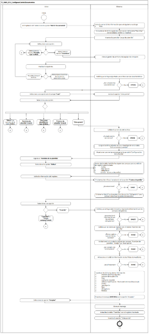

||Administración General de Comunicaciones y Tecnologías de la Información|
| :- | -: |
||Marco Documental 7.0|
|
Fecha de aprobación del Template:

02/08/2023
|
**Especificación del Caso de Uso**

17\_3083\_ECU\_ConfigurarControlDocumentos.docx
|Versión del template: 7.00|
| :-: | :-: | :-: |

**<ID Requerimiento>**8309

**Nombre del Requerimiento: **TI\_SISECOFI-SAT\_Seguimiento financiero y control documental de proyectos de contratación

**Tabla de Versiones y Modificaciones**

|

Versión

|Descripción del cambio|Responsable de la Versión|Fecha|
| :-: | :-: | :-: | :-: |
|*1*|*Creación del documento*|Eduardo Acosta Mora|*18/01/2024*|
|*1.1*|*Revisión del documento*|Luis Angel Olguin Castillo|*05/02/2024*|
|*1.2*|*Versión aprobada para firma*|
María del Carmen Castillejos Cárdenas

Rubén Delgado Ramírez
|*04/06/2024*|

**Tabla de Contenido**

[17_3083_ECU_ConfigurarControlDocumentos	2](#_toc168394031)

[1. Descripción	2](#_toc168394032)

[2. Diagrama del Caso de Uso	2](#_toc168394033)

[3. Actores	2](#_toc168394034)

[4. Precondiciones	2](#_toc168394035)

[5. Post condiciones	3](#_toc168394036)

[6. Flujo primario	3](#_toc168394037)

[7. Flujos alternos	8](#_toc168394038)

[8. Referencias cruzadas	19](#_toc168394039)

[9. Mensajes	19](#_toc168394040)

[10. Requerimientos No Funcionales	20](#_toc168394041)

[11. Diagrama de actividad	22](#_toc168394042)

[12. Diagrama de estados	22](#_toc168394043)

[13. Aprobación del cliente	23](#_toc168394044)

### ****17\_3083\_ECU\_ConfigurarControlDocumentos 

|<h3>**1. Descripción** </h3>|
| :- |
|

El objetivo de este Caso de Uso es permitir al Empleado SAT administrar y configurar las plantillas para el control documental de acuerdo con los lineamientos de proyectos nuevos y vigentes.

|
|<h3>**2. Diagrama del Caso de Uso**</h3>|
||
|<h3>**3. Actores** </h3>|
||

|**Actor**|**Descripción**|
| :-: | :-: |
|**Empleado SAT**|El Empleado SAT es el que tiene el o los roles otorgados por la Administración Central de Seguridad, Monitoreo y Control (ACSMC) para ingresar a cada uno de los módulos de este sistema.|

|

|
| :- |
|<h3>**4. Precondiciones**</h3>|
|

- El Empleado SAT se ha autenticado en el sistema con e.firma válida.

- El sistema ha consumido el servicio “Oauth” para obtener los datos del Empleado SAT que ingresa.

- Se le han asignado los roles requeridos al Empleado SAT para ingresar al módulo "Sistema" y al submódulo "Matriz Documental".

- El sistema ha validado que el Empleado SAT cuenta con el rol para ingresar al módulo "Sistema" y al submódulo "Matriz Documental" y el permiso correspondiente para carga o edición de la plantilla.

- El Empleado SAT ha ingresado al módulo "Sistema" y al submódulo "Matriz Documental".

|
|<h3>**5. Post condiciones** </h3>|
|

- El Empleado SAT adjuntó un archivo para guardar una fase.

- El Empleado SAT modificó el contenido de la plantilla.

- El Empleado SAT modificó el estatus de la plantilla.

- El Empleado SAT descargó la plantilla tipo y la plantilla guardada en la base de datos (BD).

|
|<h3>**6. Flujo primario**</h3>|
||

|**Actor**|**Sistema**|
| :-: | :-: |
|1. El Caso de uso inicia cuando el Empleado SAT selecciona la opción **“Matriz Documental”**.|
2. Consulta en la BD la información para el siguiente catálogo de acuerdo con la regla de negocio **(RNA01)**:

&emsp;

&emsp;- Fase
|
||
3. Consulta en la BD la siguiente información de la tabla “Plantillas”** con el estatus “Activo” e “Inactivo”:

&emsp;

&emsp;- Id

&emsp;- Nombre de plantilla

&emsp;- Fase

&emsp;- Fecha de creación

&emsp;- Última modificación

&emsp;- Estatus
|
||
4. Muestra la pantalla “Carga de plantilla” con lo siguiente:

&emsp;

&emsp;Cargar plantilla de documentos:

&emsp;

&emsp;Opción:

&emsp;- Plantilla tipo 

Campo:

- Archivo a cargar\*

Opción:

- Examinar

Campo: 

- Fase\*

Opción:

- Vista previa (Inhabilitado)

Plantillas creadas

Tabla (Plantillas). Aplica la **(RNA244)**

- Id

&emsp;- Nombre de plantilla (Enlace)

&emsp;- Fase

&emsp;- Fecha de creación

&emsp;- Última modificación

&emsp;- Estatus

&emsp;- Acciones

Opciones:

- Estatus de plantilla ![ref1]

&emsp;- Descargar plantilla por fase![ref2]

&emsp;- Campos para “Filtrar” por columna

Ver **(17\_3083\_EIU\_ConfigurarControlDocumentos)** Estilos 01.
|
|
5. Selecciona una opción:

&emsp;

- En caso de que seleccione la opción **“Examinar”**, el flujo continúa.

- En caso de que seleccione la opción **“Plantilla tipo”**, continúa en el **([**FA02**](#fa02))**.
|6. Abre el gestor de archivos del equipo de cómputo.|
|
7. Realiza lo siguiente:

&emsp;

- En caso de que seleccione el archivo de Excel con extensión (.xlsx), el flujo continúa.

- En caso de que no seleccione el archivo, continúa en el paso [**5**](#_ref167299654) de este flujo.
|
8. Valida que se haya adjuntado un archivo con las características de acuerdo con la **(RNA22)**.

&emsp;

- En caso de que no cumpla las características, continúa en el **([**FA06**](#fa06))**.
|
|9. Selecciona una opción en el campo **“Fase”**.|10. Activa la opción “Vista previa” de acuerdo con la **(RNA67)**.|
|
11. Selecciona una opción:

&emsp;

- En caso de que se seleccione la opción **“Vista previa”**, el flujo continúa.

- En caso de que seleccione la opción **“Estatus de plantilla”**, continúa en el **([**FA03**](#fa03))**.

- En caso de que seleccione la opción **“Descargar plantilla por fase”**, continúa en el **([**FA04**](#fa04))**.

&emsp;

- En caso de que seleccione el enlace en un registro de la columna **“Nombre de plantilla”**, continúa en el **([**FA05**](#fa05))**.

&emsp;

- En caso de que seleccione la opción para **“Filtrar”** los campos de la tabla, continúa en el **([**FA10**](#fa10))**.
|
12. Valida el contenido del archivo adjunto de acuerdo con la **(RNA23)**.

&emsp;

- En caso de que no cumpla con la estructura, continúa en el **([**FA08**](#fa08))**.
|
||
13. Carga el archivo adjunto para su visualización en la tabla “Configuración documental” de acuerdo con la **(RNA152)**.

&emsp;

&emsp;Ver

&emsp;**(17\_3083\_EIU\_ConfigurarControlDocumentos)** Estilos 02.
|
||
14. Muestra en una ventana emergente la pantalla “Configuración documental” con lo siguiente:

&emsp;

&emsp;Cargar plantilla de documentos:

&emsp;- Nombre de la plantilla\*

&emsp;- Fase (Solo lectura)

Opciones:

- Cerrar ventana ![ref3]

&emsp;- Descargar plantilla por fase ![ref4] (Inactivo)

Tabla (Configuración documental). Aplica la **(RNA244)**:

- Prefijo

&emsp;- Descripción

&emsp;- Tipo

&emsp;- Obligatorio

&emsp;- Estatus

&emsp;- Acciones

Opciones:

- Obligatorio ![ref5] (Inactivo)

&emsp;- Estatus de prefijo ![ref6] (Inactivo)

&emsp;- Editar ![ref7]

&emsp;- Cancelar

&emsp;- Guardar

Ver **(17\_3083\_EIU\_ConfigurarControlDocumentos)** Estilos 02.
|
|15. Ingresa el **“Nombre de la plantilla”**.||
|
16. Selecciona la opción **“Editar”**.

|
17. Dentro de la tabla, habilita los siguientes campos para su edición del registro seleccionado:

&emsp;

&emsp;- Prefijo

&emsp;- Descripción 

&emsp;- Obligatorio ![ref5]

&emsp;- Estatus  ![ref1] (Estatus de prefijo)
|
|18. Edita la información del registro.|19. El sistema identifica si se seleccionó la opción **“Estatus de prefijo”**, continúa en el **([**FA11**](#fa11))**.|
||20. El sistema identifica si se seleccionó la opción ”Obligatorio” para activar o inactivar la casilla de selección y aplica la **(RNA25)**.|
|
21. Selecciona una opción:

&emsp;

- En caso de que seleccione la opción **“Guardar”**,** el flujo continúa.

- En caso de que seleccione la opción **“Cancelar”** o **“Cerrar ventana”**, continúa en el **([**FA01**](#fa01))**.
|
22. Valida que se haya seleccionado e ingresado información en los campos obligatorios de acuerdo con la **(RNA67)** y **(RNA03)**.

- En caso de que no se haya ingresado información en los campos obligatorios, continúa en el **([**FA07**](#fa07))**.
|
||
23. Valida que no exista un registro con el mismo “Nombre de plantilla”.

&emsp;

- En caso de que exista un registro con el mismo nombre, continúa en el **([**FA13**](#fa13))**.
|
||
24. Valida la estructura de los siguientes campos: “Nombre de plantilla”, “Prefijo” y/o “Descripción” de acuerdo con la **(RNA28)**.

&emsp;

- En caso de que no se cumpla la estructura, continúa en el **([**FA12**](#fa12))**.
|
||
25. Almacena en la BD la información de las Pistas de Auditoría.

&emsp;

&emsp;Datos que se almacenan: 

**Módulo**= MatrizDocumental

**Fecha y Hora**= Fecha y hora del sistema usando el formato DD/MM/AAAA HH:MM:SS

**RFC Usuario**= RFC largo del Empleado SAT que ingresó al sistema.

**Tipo de movimiento**= **INSR** (Insertar)

**Movimiento**= Aplica la **(RNA239)**

- ID de registro

- Nombre de la plantilla

- En caso de que no se puedan almacenar las Pistas de Auditoría, continúa en el **([**FA14**](#fa14))**.
|
||
26. Guarda en la BD la siguiente información:

&emsp;

&emsp;- Plantilla (Archivo adjunto)

&emsp;- Nombre de la plantilla

&emsp;- Fase

&emsp;- Fecha de creación

&emsp;- Última modificación : Fecha del sistema (Día actual)

&emsp;- Prefijo

&emsp;- Descripción

&emsp;- Tipo

&emsp;- Obligatorio

&emsp;- Estatus
|
||27. Muestra el mensaje **([**MSG004**](#msg004))** con la opción “Aceptar”.|
|28. Selecciona la opción **“Aceptar”**.|29. Cierra el mensaje.|
||30. Actualiza la tabla “Plantillas” con el registro insertado.|
||31. Inactiva la opción “Vista previa”.|
||32. Fin del Caso de Uso.|

|

|
| :- |
|<h3>**7. Flujos alternos** </h3>|
|

**FA01 Selecciona la opción “Cancelar” o “Cerrar ventana”**
|

|**Actor**|**Sistema**|
| :-: | :-: |
|1. El **FA01** inicia cuando selecciona la opción **“Cancelar”** o **“Cerrar ventana”**.|2. Muestra el **([**MSG007**](#msg007))** con las opciones “Sí” y “No”.|
|
3. Selecciona una opción:

&emsp;

- En caso de que seleccione la opción **“Sí”**, el flujo continúa.

- En caso de que seleccione la opción **“No”**, si el mensaje fue invocado en el paso 21 del Flujo primario, continúa en el paso [**21**](#_ref168392858) del Flujo primario 

&emsp;

- En caso de que seleccione la opción **“No”**, si el mensaje fue invocado** en el paso 10 del **([**FA05**](#fa05))** , continúa en el paso [**10**](#_ref168392885) del **([**FA05**](#fa05))**.
|4. Cierra el mensaje.|
||5. Cancela la operación sin completar el movimiento que estaba en el proceso.|
||
6. Dependiendo de la situación, realiza lo siguiente:

&emsp;

- Si fue invocado en el paso 21 del Flujo principal, continúa en el paso [**4**](#_ref167299272) del Flujo principal.

- Si fue invocado en el paso 10 del **([**FA05**](#fa05))**, continúa en el paso [**11**](#_ref167299456) del Flujo principal.
|

|

**FA02 Selecciona la opción “Plantilla tipo”**
|
| :- |

|**Actor**|**Sistema**|
| :-: | :-: |
|1. El **FA02** inicia cuando selecciona la opción **“Plantilla tipo”**.|
2. Almacena en la BD la información de las Pistas de Auditoría.

&emsp;

&emsp;Datos que se almacenan: 

**Módulo**= MatrizDocumental

**Fecha y Hora**= Fecha y hora del sistema usando el formato DD/MM/AAAA HH:MM:SS

**RFC Usuario**= RFC largo del Empleado SAT que ingresó al sistema.

**Tipo de movimiento**= **PRNT** (Imprimir)

**Movimiento**= 

- Plantilla tipo (“Estructura fase”)

- En caso de que no se puedan almacenar las Pistas de Auditoría, continúa en el **([**FA14**](#fa14))**.
|
||3. Descarga un archivo de Excel con extensión (.xlsx) del documento que se ocupará como ayuda de acuerdo con la **(RNA23)**.|
||4. Continúa en el paso [**5**](#_ref167299654) del Flujo primario.|

|

**FA03 Selecciona la opción “Estatus de plantilla”**
|
| :- |

|**Actor**|**Sistema**|
| :-: | :-: |
|1. El **FA03** inicia cuando selecciona la opción **“Estatus de plantilla”**.|
2. Valida si la plantilla esta asignada a un proyecto activo de acuerdo con la regla **(RNA24)**.

&emsp;

- En caso de que esté asignada, continúa en el **([**FA09**](#fa09))**.
|
||3. Muestra el **([**MSG009**](#msg009))** con las opciones “Sí” y “No”.|
|
4. Selecciona una opción:

&emsp;

- En caso de que seleccione la opción **“Sí”**, el flujo continúa.

 

- En caso de que seleccione **“No”**, continúa en el paso [**11**](#_ref167299456) del Flujo primario. 
|5. Cierra el mensaje.|
||
6. Almacena en la BD la información de las Pistas de Auditoría.

&emsp;

&emsp;Datos que se almacenan: 

**Módulo**= MatrizDocumental

**Fecha y Hora**= Fecha y hora del sistema usando el formato DD/MM/AAAA HH:MM:SS

**RFC Usuario**= RFC largo del Empleado SAT que ingresó al sistema.

**Tipo de movimiento**= **UPDT** (Modificar)

**Movimiento**= Aplica la **(RNA239)**

- ID de registro

- Nombre de la plantilla

- Estatus de plantilla

- En caso de que no se puedan almacenar las Pistas de Auditoría, continúa en el **([**FA14**](#fa14))**.
|
||7. Realiza el movimiento correspondiente de acuerdo con la **(RNA24)** y **(RNA43)**.|
||
8. Guarda en la BD la siguiente información:

&emsp;

&emsp;- Estatus 

&emsp;- Última modificación: Fecha del sistema (Día actual)
|
||9. Continúa en el paso [**11**](#_ref167299456) del Flujo primario.|

|

**FA04 Selecciona la opción “Descargar plantilla por fase”**
|
| :- |

|**Actor**|**Sistema**|
| :-: | :-: |
|1. El **FA04** inicia cuando selecciona la opción **“Descargar plantilla por fase”**.|
2. Almacena en la BD la información de las Pistas de Auditoría.

&emsp;

&emsp;Datos que se almacenan: 

**Módulo**= MatrizDocumental

**Fecha y Hora**= Fecha y hora del sistema usando el formato DD/MM/AAAA HH:MM:SS

**RFC Usuario**= RFC largo del Empleado SAT que ingresó al sistema.

**Tipo de movimiento**= **PRNT** (Imprimir)

**Movimiento**= Aplica la **(RNA239)**

- ID de registro

- Nombre de plantilla Ejemplo (Planeación2024.xlsx)

- Fase

- En caso de que no se puedan almacenar las Pistas de Auditoría, continúa en el **([**FA14**](#fa14))**.
|
||3. Consulta el documento almacenado en la BD y lo prepara para su descarga.|
||4. Genera un archivo de Excel con extensión (.xlsx) que contenga la información obtenida.|
||5. Descarga el archivo de Excel con extensión (.xlsx).|
||
6. Dependiendo de la situación, realiza lo siguiente:

&emsp;

- Si fue invocado en el paso 11 del Flujo primario, continúa en el paso [**11**](#_ref167299456) del Flujo primario.

- Si fue invocado en el paso 4 del **([**FA05**](#fa05))**, continúa en el paso [**4**](#_ref168392996) del **([**FA05**](#fa05))**.
|

|

**FA05 Selecciona el enlace de un registro de la columna “Nombre de la plantilla”**
|
| :- |

|**Actor**|**Sistema**|
| :-: | :-: |
|1. El **FA05** inicia cuando selecciona el enlace de un registro de la columna **“Nombre de la plantilla”**.|
2. Almacena en la BD la información de las Pistas de Auditoría.

&emsp;

&emsp;Datos que se almacenan: 

**Módulo**= MatrizDocumental

**Fecha y Hora**= Fecha y hora del sistema usando el formato DD/MM/AAAA HH:MM:SS

**RFC Usuario**= RFC largo del Empleado SAT que ingresó al sistema.

**Tipo de movimiento**= **CNST** (Consultar)

**Movimiento**= 

- ID de registro

- Nombre de la plantilla

- En caso de que no se puedan almacenar las Pistas de Auditoría, continúa en el **([**FA14**](#fa14))**.
|
||
3. Muestra en una ventana emergente la pantalla “Configuración documental” con lo siguiente: 

&emsp;

&emsp;Cargar plantilla de documentos:

&emsp;- Nombre de la plantilla\* (Inactivo)

&emsp;- Fase (Solo lectura)

Opciones:

- Cerrar ventana ![ref3]

&emsp;- Descargar plantilla por fase ![ref4]

Tabla (Configuración documental) Aplica la **(RNA244)**:

- Prefijo

&emsp;- Descripción

&emsp;- Tipo

&emsp;- Obligatorio

&emsp;- Estatus

&emsp;- Acciones

Opciones: 

- Obligatorio ![ref5] (Inactivo)

&emsp;- Estatus de prefijo ![ref6] (Inactivo)

&emsp;- Editar ![ref8]

&emsp;- Cancelar

&emsp;- Guardar

Ver

**(17\_3083\_EIU\_ConfigurarControlDocumentos)** Estilos 02.
|
|
4. Selecciona una opción:

&emsp;

- En caso de que seleccione la opción **“Editar”**, el flujo continúa.

- En caso de que seleccione la opción **“Descargar plantilla por fase”**, continúa en el **([**FA04**](#fa04))**.
|
5. Valida que la plantilla no esté asignada en un proyecto activo de acuerdo con la **(RNA26)**.

&emsp;

- En caso de que la plantilla esté asignada a un proyecto activo, continúa en el **([**FA09**](#fa09))**.
|
||
6. Dentro de la tabla, habilita los siguientes campos para su edición del registro seleccionado:

&emsp;

&emsp;- Prefijo

&emsp;- Descripción 

&emsp;- Obligatorio ![ref5]

&emsp;- Estatus  ![ref1] (Estatus de prefijo)
|
|7. Edita la información del registro.|8. El sistema identifica si se seleccionó la opción **“Estatus de prefijo”**, continúa en el **([**FA11**](#fa11))**.|
||9. El sistema identifica si se seleccionó la opción ”Obligatorio” para activar o inactivar la casilla de selección y aplica la **(RNA25)**.|
|
10. Selecciona una opción: 

- En caso de que seleccione la opción **“Guardar”**, el flujo continúa.

- En caso de que seleccione la opción **“Cancelar”** o **“Cerrar ventana”**, continúa en el **([**FA01**](#fa01))**.
|
11. Valida que se haya seleccionado e ingresado información en los campos obligatorios de acuerdo con la **(RNA67)** y **(RNA03)**.

&emsp;

- En caso de que no se haya ingresado información en los campos obligatorios, continúa en el **([**FA07**](#fa07))**.
|
||
12. Identifica que se haya editado el prefijo y descripción; valida la estructura de los campos de acuerdo con la **(RNA28)**.

&emsp;

- En caso de que no se cumpla la estructura, continúa en el **([**FA12**](#fa12))**.
|
||
13. Almacena en la BD la información de las Pistas de Auditoría.

&emsp;

&emsp;Datos que se almacenan: 

**Módulo**= Matriz documental

**Fecha y Hora**= Fecha y hora del sistema usando el formato DD/MM/AAAA HH:MM:SS

**RFC Usuario**= RFC largo del Empleado SAT que ingresó al sistema.

**Tipo de movimiento**= **UPDT** (Modificar)

**Movimiento**= Aplica la **(RNA239)**

- ID de registro

- Nombre de la plantilla

- En caso de que no se puedan almacenar las Pistas de Auditoría, continúa en el **([**FA14**](#fa14))**.
|
||
14. Guarda en la BD la siguiente información:

&emsp;

&emsp;- Plantilla (Archivo adjunto)

&emsp;- Nombre de la plantilla

&emsp;- Fase

&emsp;- Última modificación : Fecha del sistema (Día actual)

&emsp;- Prefijo

&emsp;- Descripción

&emsp;- Tipo

&emsp;- Obligatorio

&emsp;- Estatus
|
||15. Muestra el **([**MSG004**](#msg004))** con la opción “Aceptar”.|
|16. Selecciona la opción **“Aceptar”**.|17. Cierra el mensaje.|
||18. Continúa en el paso [**11**](#_ref167299456) del Flujo primario.|

|

**FA06 El archivo adjunto no cumple con las características**
|
| :- |

|**Actor**|**Sistema**|
| :-: | :-: |
||1. El **FA06** inicia cuando el archivo adjunto no cumple con las características.|
||
2. Muestra el mensaje dependiendo la instrucciones del archivo : 

- En caso de el error sea del punto uno, muestra el  **([**MSG001**](#msg001))**.

- En caso de el error sea del punto uno, muestra el  **([**MSG013**](#msg013))**.

- En caso de el error sea del punto uno, muestra el  **([**MSG014**](#msg014))**.

- En caso de el error sea del punto uno, muestra el  **([**MSG015**](#msg015))**.

- En caso de el error sea del punto uno, muestra el  **([**MSG016**](#msg016))**.

- En caso de el error sea del punto uno, muestra el  **([**MSG017**](#msg017))**.

Cada mensaje con la opción “Aceptar”.
|
|3. Selecciona la opción **“Aceptar”**.|4. Cierra el mensaje.|
||5. Continúa en el paso [**5**](#_ref167299654) del Flujo primario.|

|

**FA07 No se ingresó la información obligatoria**
|
| :- |

|**Actor**|**Sistema**|
| :-: | :-: |
||1. El **FA07** inicia cuando el sistema identifica que no se ingresó la información obligatoria.|
||2. Muestra en rojo los campos pendientes de capturar.|
||3. Muestra el **([**MSG002**](#msg002))** con la opción “Aceptar”.|
|4. Selecciona la opción **“Aceptar”**.|5. Cierra el mensaje.|
||
6. Dependiendo la situación, realiza lo siguiente:

- Si fue invocado en el paso 22 del Flujo primario, continúa en el paso [**18**](#_ref168393041) del Flujo primario.

- Si fue invocado en el paso 11 del **([**FA05**](#fa05))**, continúa en el paso [**7**](#_ref168393058) del **([**FA05**](#fa05))**.
|

|
	

**FA08 El archivo adjunto no cumple con la estructura**
|
| :- |

|**Actor**|**Sistema**|
| :-: | :-: |
||1. El **FA08** inicia cuando el archivo adjunto no cumple con la estructura.|
||2. Muestra el **([**MSG003**](#msg003))** con la opción “Aceptar”|
|3. Selecciona la opción **“Aceptar”**.|4. Cierra el mensaje.|
||5. Continúa en el paso [**5**](#_ref167299654) del Flujo primario.|

|

**FA09 La plantilla está asignada a un proyecto activo**
|
| :- |

|**Actor**|**Sistema**|
| :-: | :-: |
||1. El **FA09** inicia cuando la plantilla está asignada a un proyecto activo.|
||2. Muestra el **([**MSG008**](#msg008))** con la opción “Aceptar”.|
|3. Selecciona la opción **“Aceptar”**.|4. Cierra el mensaje.|
||
5. Dependiendo de la situación, realiza lo siguiente:

&emsp;

- Si fue invocado en el paso 2 del **([**FA03**](#fa03))**, continúa en el paso [**11**](#_ref167299456) del Flujo principal.

- Si fue invocado en el paso 5 del **([**FA05**](#fa05))**, continúa en el paso [**4**](#_ref168392996) del **([**FA05**](#fa05))**.
|

|

**FA10 Selecciona la opción para “Filtrar” la información**
|
| :- |

|**Actor**|**Sistema**|
| :-: | :-: |
|1. El **FA10** inicia cuando el Empleado SAT selecciona la opción para **“Filtrar”** la información en alguna columna de acuerdo con lo que se muestra en la tabla.||
|2. Elige la columna para filtrar e ingresa el dato a buscar.|3. Busca dentro de la columna y filtra la información mostrada de acuerdo con los caracteres ingresados en el campo.|
||4. Muestra en tiempo real todas las coincidencias que obtiene de dicha columna.|
||5. Continúa en el paso [**11**](#_ref167299456) del Flujo primario.|

|

**FA11 Selecciona la opción “Estatus de prefijo”**
|
| :- |

|**Actor**|**Sistema**|
| :-: | :-: |
||1. El **FA11** inicia cuando el sistema identifica que se seleccionó la opción “Estatus de prefijo”.|
||
2. Identifica lo siguiente:

- Si es sobre un registro nuevo, continúa en el paso [**6**](#_ref168393237) de este flujo.

- Si es un registro existente, continúa en el paso [**3**](#_ref168393249) de este flujo.
|
||3. Muestra el **([**MSG009**](#msg009))** con las opciones “Sí” y “No”.|
|
4. Selecciona una opción:

&emsp;

- En caso de que seleccione la opción **“Sí”**, el flujo continúa.

 

- En caso de que seleccione **“No”**, continúa en el paso [**7**](#_ref168393264) de este flujo. 
|5. Cierra el mensaje.|
||6. Realiza el movimiento de estatus de prefijo correspondiente de acuerdo con la **(RNA26)** y **(RNA43)**.|
|

|
7. Dependiendo de la situación, realiza lo siguiente:

&emsp;

- Si fue invocado en la paso 19 del Flujo primario, continúa en el paso [**18**](#_ref168393041) del Flujo primario.

- Si fue invocado en la paso 8 del **([**FA05**](#fa05))**, continúa en el paso [**7**](#_ref168393058) del **([**FA05**](#fa05))**.
|

|

**FA12 Estructura de información ingresada incorrecta**
|
| :- |

|**Actor**|**Sistema**|
| :-: | :-: |
||1. El **FA12** inicia cuando identifica que la estructura de la información ingresada es incorrecta.|
||2. Muestra el **([**MSG006**](#msg006))** con la opción “Aceptar”.|
|3. Selecciona la opción **“Aceptar”**.|4. Cierra el mensaje.|
||
5. Dependiendo la situación, realiza lo siguiente:

&emsp;

- Si fue invocado en el paso 24 del Flujo primario por el “Nombre de la plantilla”, continúa en el paso [**15**](#_ref168393533) del Flujo primario.

- Si fue invocado en el paso 24 del Flujo primario por el “Prefijo” o “Descripción”, continúa en el paso [**18**](#_ref168393041) del Flujo primario.

- Si fue invocado en el paso 12 del **([**FA05**](#fa05))**, continúa en el paso [**7**](#_ref168393058) del **([**FA05**](#fa05))**.
|

|

**FA13 Existe un registro con el mismo nombre de la plantilla**
|
| :- |

|**Actor**|**Sistema**|
| :-: | :-: |
||1. El **FA13** inicia cuando el sistema identifica que existe un registro con el mismo nombre de plantilla.|
||2. Muestra el **([**MSG005**](#msg005))** con la opción “Aceptar”|
|3. Selecciona la opción **“Aceptar”**.|4. Cierra el mensaje.|
||5. Continúa en el paso [**15**](#_ref168393533) del Flujo primario.|

|

**FA14 No se pueden almacenar las Pistas de Auditoría**
|
| :- |

|**Actor**|**Sistema**|
| :-: | :-: |
||1. El **FA14** inicia cuando interviene un evento ajeno y no se pueden almacenar las Pistas de Auditoría.|
||2. Cancela la operación sin completar el movimiento que estaba en proceso.|
||
3. Muestra el mensaje informativo de acuerdo con lo siguiente:

- Si la pista de auditoría es por el tipo de movimiento **UPDT** e **INSR**, se muestra el **([**MSG010**](#msg010))**.

&emsp;

- Si la pista de auditoría es por el tipo de movimiento **CNST**, se muestra el **([**MSG011**](#msg011))**. 

- En caso de que la pista de auditoría sea por el tipo de movimiento **PRNT**, se muestra el **([**MSG012**](#msg012))**.

Cada mensaje con la opción “Aceptar”.
|
|4. Selecciona la opción **“Aceptar”**.|5. Cierra el mensaje.|
||6. Regresa al paso previo que detona la acción de la pista de auditoría.|

|

|
| :- |
|<h3>**8. Referencias cruzadas** </h3>|
|

- 17\_3083\_CRN\_SeguimientoFinancieroYControl

- 17\_3083\_EIU\_ConfigurarControlDocumentos

|
|<h3>**9. Mensajes** </h3>|
||

|**ID Mensaje**|**Descripción**|
| :-: | :-: |
|**MSG001**|
Los nombres de archivos o carpetas no cumplen con la estructura solicitada.

Consulta la “Plantilla tipo”.
|
|**MSG002**|Favor de ingresar los datos obligatorios marcados con un asterisco (\*).|
|**MSG003**|El archivo no cumple con la estructura, por favor consulte el archivo de ayuda.|
|**MSG004**|Plantilla guardada correctamente.|
|**MSG005**|
Ya existe una plantilla con el mismo nombre.

Intente de nuevo por favor.
|
|**MSG006**|La estructura de los campos es incorrecta, por favor verifíquela.|
|**MSG007**|
Se perderá toda la información no guardada.

¿Está seguro de que desea continuar?
|
|**MSG008**|La plantilla está asignada a un proyecto activo. No se puede modificar.|
|**MSG009**|Se actualizará el estatus, ¿Está seguro de continuar? |
|**MSG010**|Ocurrió un error al guardar el registro, favor de intentar nuevamente (PA01)|
|**MSG011**|Ocurrió un error al consultar la información, favor de intentar nuevamente (PA01). |
|**MSG012**|Ocurrió un error al exportar la información, favor de intentar nuevamente (PA01).|
|**MSG013**|
Por cada “Carpeta nivel” o columna “Archivos” deberá contener una “Descripción” en la fila correspondiente.

Consulta la “Plantilla tipo”.
|
|**MSG014**|
El límite de niveles creados será de 10.

Consulta la “Plantilla tipo”.
|
|**MSG015**|
El nombre de la pestaña "Nombre\_Fase" en el archivo cargado debe coincidir exactamente con el nombre de una fase registrada en el catálogo de Fases.* 

Consulta la “Plantilla tipo”.
|
|**MSG016**|
No puede haber duplicidad de archivos o carpetas en el mismo nivel.* 

Consulta la “Plantilla tipo”.
|
|**MSG017**|
No se pueden realizar modificaciones en los encabezados, añadir o eliminar columnas.* 

Consulta la “Plantilla tipo”.
|

|	|
| :- |
||
|<h3>**10. Requerimientos No Funcionales** </h3>|
||

|**ID de RNF**|**Requerimiento No Funcional**|**Descripción**|
| :-: | :-: | :-: |
|**RNF001**|Disponibilidad|El sistema deberá estar activo las 24 horas del día, los 365 días del año con picos de operación en el horario de 9:00 a 18:00 horas.|
|**RNF002**|Concurrencia|
El número de Empleados SAT que puede tener el sistema son 150. 

El número de accesos concurrentes que debe soportar este sistema son máximo 30 Empleados SAT.
|
|**RNF003**|Seguridad|El acceso solo podrá ser otorgado a todo Empleado SAT que tenga los roles asignados por la Administración Central de Seguridad, Monitoreo y Control (ACSMC) para cada módulo de este sistema.|
|**RNF004**|Usabilidad|
El sistema deberá manejar los siguientes elementos para facilitar la navegación:  

- Mensajes tipo flotantes (*tooltips*) con información de la herramienta que ofrece ayuda contextual, como guía para el Empleado SAT.  

- Componente de ordenamiento que permita acomodar la información de la tabla de forma ascendente o descendente, considerando la columna donde es seleccionado.  

- Contar con un diseño responsivo que permita su óptima visualización en distintos tipos de dispositivos finales.
|
|**RNF005**|Eficiencia|Las consultas se dividen en generales y detalladas, para que las detalladas carguen la información solo cuando sean requeridas por el Empleado SAT.|
|**RNF006**|Usabilidad|
El Empleado SAT podrá navegar a través de las páginas resultantes de la consulta considerando que el sistema debe mostrar inicialmente 15 registros por página, permitiendo al Empleado SAT seleccionar los registros que requiere visualizar, teniendo las opciones 15, 50 y 100:   

- Ir a la primera página (debe mostrar la primera página con el resultado de la consulta).  

- Ir a la última página (debe mostrar la última página con el resultado de la consulta).  

- Ir a la siguiente página (debe mostrar la siguiente página, considerando la página actual, con el resultado de la consulta y el número de registros seleccionados por el Empleado SAT).  

- Ir a la página anterior (debe mostrar la página anterior considerando la actual con el resultado de la consulta).  

  

En la tabla deben mostrarse los registros ordenados alfabéticamente. 
|
|**RNF007**|Seguridad|Las Pistas de Auditoría deben estar protegidas contra accesos no autorizados. Solo los Empleados SAT autorizados pueden consultarlas, y la información en ellas se definirá durante la etapa de diseño, la cual debe estar cifrada para mantenerla confidencial y evitar exposiciones no autorizadas.   |
|**RNF008**|Fiabilidad|El sistema debe ser capaz de manejar excepciones de manera efectiva y presentar mensajes claros y comprensibles para garantizar una adecuada interacción con el sistema.|
|**RNF009**|Seguridad|Mantener la información en pantalla en caso de un error al guardar las pistas de auditoría, siempre y cuando el escenario lo permita. Hay situaciones de infraestructura o de conexión de internet que sí pierde los datos ya que no están controlados por el sistema.|
|**RNF010**|Integridad|Al almacenar la información en la BD de tipo Texto o alfanumérico se deben eliminar los espacios en blanco al inicio y fin de la cadena. |

||
| :- |
|

|
|<h3>**11. Diagrama de actividad** </h3>|
|

|
|<h3>**12. Diagrama de estados** </h3>|
|

No aplica, no se requiere para este proceso.

|
|<h3>**13. Aprobación del cliente** </h3>|
||

|**FIRMAS DE CONFORMIDAD**||
| :-: | :- |
|**Firma 1** |**Firma 2** |
|**Nombre**: María del Carmen Castillejos Cárdenas.|**Nombre**: Rubén Delgado Ramírez.|
|**Puesto**: Usuaria ACPPI.|**Puesto**: Usuario ACPPI.|
|**Fecha:**|**Fecha:**|
|||
|**Firma 3** |**Firma 4**|
|**Nombre**: Rodolfo López Meneses.|**Nombre**: Diana Yazmín Pérez Sabido.|
|**Puesto**: Usuario ACPPI.|**Puesto**: Usuaria ACPPI.|
|**Fecha:**|**Fecha:**|
|||
|**Firma 5**|**Firma 6**|
|**Nombre**: Yesenia Helvetia Delgado Naranjo.|**Nombre:** Alejandro Alfredo Muñoz Núñez.|
|**Puesto**: APE ACPPI.|**Puesto:** RAPE ACPPI.|
|**Fecha**:|**Fecha**:|
|||
|**Firma 7**|**Firma 8**|
|**Nombre**: Luis Angel Olguin Castillo.|**Nombre**: Erick Villa Beltrán.|
|**Puesto**: Enlace ACPPI.|**Puesto**: Líder APE SDMA 6.|
|**Fecha**:|**Fecha**:|
|||
|**Firma 9**|**Firma 10**|
|**Nombre:** Juan Carlos Ayuso Bautista.|**Nombre:** Eduardo Acosta Mora.|
|**Puesto:** Líder Técnico SDMA 6.|**Puesto:** Analista SDMA 6.|
|**Fecha**:|**Fecha**:|
|||

|

|
| :- |

|||Página 1 de 9|
| :- | :-: | -: |

[ref1]: Aspose.Words.cdc3bb56-af74-4c39-b99f-07262b7d70d9.004.png
[ref2]: Aspose.Words.cdc3bb56-af74-4c39-b99f-07262b7d70d9.005.png
[ref3]: Aspose.Words.cdc3bb56-af74-4c39-b99f-07262b7d70d9.006.png
[ref4]: Aspose.Words.cdc3bb56-af74-4c39-b99f-07262b7d70d9.007.png
[ref5]: Aspose.Words.cdc3bb56-af74-4c39-b99f-07262b7d70d9.008.png
[ref6]: Aspose.Words.cdc3bb56-af74-4c39-b99f-07262b7d70d9.009.png
[ref7]: Aspose.Words.cdc3bb56-af74-4c39-b99f-07262b7d70d9.010.png
[ref8]: Aspose.Words.cdc3bb56-af74-4c39-b99f-07262b7d70d9.011.png
