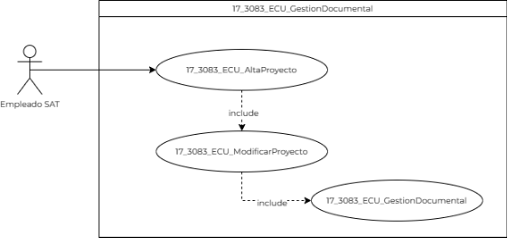
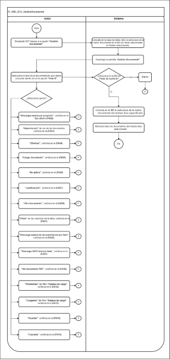

||Administración General de Comunicaciones y Tecnologías de la Información|
| :- | -: |
||Marco Documental 7.0|
|
Fecha de aprobación del Template:

02/08/2023
|
**Especificación del Caso de Uso**

17\_3083\_ECU\_GestionDocumental.docx
|Versión del template: 7.00|
| :-: | :-: | :-: |

**<ID Requerimiento>** 8309

**Nombre del Requerimiento: **TI\_SISECOFI-SAT\_Seguimiento financiero y control documental de proyectos de contratación.

**Tabla de Versiones y Modificaciones**

|Versión|Descripción del cambio|Responsable de la Versión|Fecha|
| :-: | :- | :-: | :-: |
|*1*|*Creación del documento*|Edgar Vergara Tadeo|*08/02/2024*|
|*1.1*|*Revisión del documento*|Luis Angel Olguin Castillo|*02/05/2024*|
|*1.2*|*Versión aprobada para firma*|
María del Carmen Castillejos Cárdenas

Rubén Delgado Ramírez
|20/05/2024|

**Tabla de Contenido**

[1. Descripción	2](#_toc167186537)

[2. Diagrama del Caso de Uso	2](#_toc167186538)

[3. Actores	2](#_toc167186539)

[4. Precondiciones	2](#_toc167186540)

[5. Post condiciones	3](#_toc167186541)

[6. Flujo primario	3](#_toc167186542)

[7. Flujos alternos	6](#_toc167186543)

[8. Referencias cruzadas	21](#_toc167186544)

[9. Mensajes	21](#_toc167186545)

[10. Requerimientos No Funcionales	22](#_toc167186546)

[11. Diagrama de actividad	25](#_toc167186547)

[12. Diagrama de estados	25](#_toc167186548)

[13. Aprobación del cliente	26](#_toc167186549)

17\_3083\_ECU\_GestionDocumental.

|<h3>**1. Descripción** </h3>|
| :- |
|

El objetivo de este Caso de Uso es permitir al Empleado SAT consultar, cargar y descargar documentos relacionados a un “Proyecto”, “Contrato” , “Dictamen” y “Convenio modificatorio” así como tener el estatus de cada uno de los documentos relacionados a las diferentes fases permitiendo realizar consultas entre documentos cargados y documentos pendientes de carga.

|
|<h3>**2. Diagrama del Caso de Uso**</h3>|
|

Este diagrama de caso de uso es referencial ya que se usa el mismo proceso para los módulos “Contratos”, “Consumo de servicios -Dictamen”, y “Convenio modificatorio”.
|
||
|<h3>**3. Actores** </h3>|
||

|**Actor**|**Descripción**|
| :-: | :-: |
|**Empleado SAT**|Empleado SAT que tiene el o los roles otorgados por la Administración Central de Seguridad, Monitoreo y Control (ACSMC), para ingresar a cada uno de los módulos de este sistema.|

|

|
| :- |
|<h3>**4. Precondiciones**</h3>|
|

- El Empleado SAT se ha autenticado en el sistema con e.firma válida. 

- El sistema ha consumido el servicio “Oauth” para obtener los datos del Empleado SAT que ingresa. 

- El sistema ha validado que el Empleado SAT tiene los roles para ingresar al módulo y asignado el proyecto del cual es invocado este componente en la sección “Gestión documental”.

- Se ha realizado la asociación de la plantilla en alguno de los cuatro módulos relacionados.

- El Empleado SAT ha realizado alguna de las siguientes acciones:

&emsp;- Ha ingresado al módulo “Proyectos” y seleccionado la sección “Gestión documental”.

&emsp;- Ha ingresado al módulo “Consumo de servicios -Dictamen” y seleccionado la sección  “Gestión documental”.

&emsp;- Ha ingresado al módulo “Contratos” y seleccionado la sección  “Gestión documental”, así como haber seleccionado la fase.

&emsp;- Ha ingresado al módulo “Convenio modificatorio” y seleccionado la sección  “Gestión documental” así como haber seleccionado la fase.

|
|<h3>**5. Post condiciones** </h3>|
|

- El Empleado SAT consultó el estatus de los documentos relacionados a un “Proyecto”, “Contrato” , “Dictamen” o “Convenio modificatorio”.

- El Empleado SAT cargó la documentación relacionada a la fase de un “Proyecto”, “Contrato” , “Dictamen” o “Convenio modificatorio”.

- El Empleado SAT descargó el o los documentos relacionados a la fase de un “Proyecto”, “Contrato” , “Dictamen” o “Convenio modificatorio”.

- El Empleado SAT eliminó el documento relacionado a una fase de un “Proyecto”, “Contrato” , “Dictamen” o “Convenio modificatorio”.

&emsp;
|
|<h3>**6. Flujo primario**</h3>|
||

|**Actor**|**Sistema**|
| :-: | :-: |
|
1. El Caso de Uso inicia cuando el Empleado SAT ingresa a la opción **“Gestión documental”**.

&emsp;

|2. Consulta en la base de datos (BD) la estructura de la matriz documental en la BD por fases relacionadas al módulo seleccionado.|
||
3. Despliega la pantalla “**Gestión Documental”** con los siguientes datos, mostrará la estructura de árbol por fases del proyecto:

&emsp;

- Estatus de carga. Aplica la regla de negocio **(RNA90)**

- Todos

- Pendientes

- Cargados

Opciones:

- Descarga masiva por proyecto![ref1]

- Descarga SATCloud por proyecto![ref2]

Encabezado de Tabla “Estructura documental”

- Descripción

- Colapsar fase![ref3]

- Fase N

&emsp;&emsp;- Hipervínculo. Aplica la **(RNA98)**

- Requerido, aplica la **(RNA88)**

- No aplica. 

- Estatus. Aplica la **(RNA89)**

- Pendiente![ref4]

- Justificación

- Tamaño

- Fecha última modificación

- Acciones

- Descarga masiva de documentación por fase![ref1] 

- Descarga SATCloud por fase![ref2]

- Cargar documento ![ref5]

- Eliminar![ref6]

- Ver documento PDF ![ref7]

- Otros documentos ![ref8]

&emsp;

- Ver **(17\_3083\_EIU\_GestiónDocumental)** Estilos 01.

&emsp;
|
|
4. Selecciona la fase de la documentación que desea consultar dando clic en la opción **“Fase N”** y continúa en el flujo.

&emsp;

- En caso de que seleccione la opción  “**Descarga masiva por proyecto”** ,continúa en el flujo alterno **([\[**FA02**\](#fa02)](#fa02))**.

- En caso de que seleccione el **“Hipervínculo”** de uno de los documentos, continúa en el **([\[**FA03**\](#fa03)**)**.](#fa03)**

- En caso de que seleccione la opción **“Eliminar”**, continúa en el **([\[**FA04**\](#fa04)](#fa04))**.

- En caso de que seleccione la opción **“Cargar documento”**, continúa en el **([\[**FA05**\](#fa05)](#fa05))**.

- En caso de que seleccione la opción **“No aplica”**, continúa en el **([\[**FA06**\](#fa06)](#fa06))**.

- En caso de que seleccione la opción **“Justificación”**, continúa en el **([\[**FA07**\](#fa07)](#fa07))**.

- En caso de que seleccione la opción **“Otro documento”**, continúa en el **([\[**FA08**\](#fa08)](#fa08))**.

- En caso de que use requiera “**Filtrar”** en las columnas de la tabla, continúa en el **([\[**FA01**\](#fa01)](#fa01))**.

- En caso de que seleccione la opción **“Descarga masiva de documentación por fase”**, continúa en el **([**FA16** ](#fa16))**.

- En caso de que seleccione la opción  “**Descarga SATCloud por fase”**, continúa en el **([**FA17**](#fa18))**.

- En caso de que seleccione la opción  “**Ver documento PDF”** ,continúa en el **([**FA18**](#fa18))**.

- En caso de que seleccione la opción **“Pendientes”** del filtro **“Estatus de carga”**, continúa en el **([\[**FA12**\](#fa12)](#fa12))**.

- En caso de que seleccione la opción **“Cargados”** del filtro **“Estatus de carga”**, continúa en el **([**FA13**](#fa13))**.

- En caso de que seleccione la opción **“Guardar”**, continúa en el **(FA10)**.

- En caso de que seleccione la opción **“Cancelar”**, continúa en el **(FA15)**.
|
5. Almacena en la BD las Pistas de Auditoría.

&emsp;

&emsp;Datos que se almacenan:

**Módulo**= Módulo que lo invocó-Gestión documental

**Fecha y Hora**= Fecha y hora del sistema, usando el formato DD/MM/AAAA HH:MM:SS

**RFC Usuario**= RFC largo del Empleado SAT que ingresó al sistema.

**Tipo de movimiento**= **CNST** (Consulta).

**Movimiento.** Aplica la **(RNA239)**=

- Módulo que lo invocó-Gestión documental

- Id de “Proyecto”, “Contrato”, “Dictamen” o “Convenio modificatorio”.

- Id del documento

- Descripción

- En caso de que no se pueda almacenar las Pistas de Auditoría, continúa en el **([\[**FA11**\](#fa11)](#fa12))**.
|
||6. Consulta en la BD la estructura de la matriz documental del módulo-fase especificado.|
|

|7. Mostrará todos los documentos del módulo-fase seleccionado.|
||8. Fin del Caso de Uso.|

||
| :- |
|

|
|<h3>**7. Flujos alternos** </h3>|
|

**FA01 Filtra por alguna de las columnas de la tabla**
|

|**Actor**|**Sistema**|
| :-: | :-: |
|1. El **FA01** inicia cuando el Empleado SAT requiere **“Filtrar”** la información en alguna columna de acuerdo con lo que se muestra en la tabla.||
|2. Elige la columna para filtrar e ingresa el dato a buscar.|3. Busca dentro de la columna y filtra la información mostrada de acuerdo con los caracteres ingresados en el campo.|
||4. Muestra en tiempo real todas las coincidencias que obtiene de dicha columna.|
||
5. Regresa al paso **[**4**](#_ref164767531)** del Flujo primario.

|

|

**FA02 Selecciona la opción Descarga masiva de la estructura documental** 
|
| :- |

|**Actor**|**Sistema**|
| :-: | :-: |
|1. El **FA02** inicia cuando el Empleado SAT selecciona la opción  **“Descarga masiva por proyecto”**.|
2. Almacena en BD las Pistas de Auditoría.

&emsp;

&emsp;Datos que se almacenan:

**Módulo**= Módulo que lo invocó-Gestión Documental

**Fecha y Hora**= Fecha y hora del sistema, usando el formato DD/MM/AAAA HH:MM:SS

**RFC Usuario**= RFC largo del Empleado SAT que ingresó al sistema.

**Tipo de movimiento: CNST** (Consulta).

**Movimiento**= 

-Id de “Proyecto”, “Contrato”, “Dictamen” o “Convenio modificatorio”

- En caso de que no se pueda almacenar las Pistas de Auditoría, continúa en el **([\[**FA11**\](#fa11)](#fa11))**.
|
||3. Lee de la BD todos los archivos cargados relacionados al “Proyecto”, “Contrato”, “Dictamen” o “Convenio modificatorio” y genera el archivo .ZIP con la información a descargar.|
||
4. Almacena en BD las Pistas de Auditoría.

&emsp;

&emsp;Datos que se almacenan:

**Módulo=** Módulo que lo invocó-Gestión Documental

**Fecha y Hora**= Fecha y hora del sistema, usando el formato DD/MM/AAAA HH:MM:SS

**RFC Usuario**= RFC largo del Empleado SAT que ingresó al sistema.

**Tipo de movimiento**= **PRNT** (Imprimir)

**Movimiento**= 

-Id de “Proyecto”, “Contrato”, “Dictamen” o “Convenio modificatorio”.

-Nombre de los documentos descargados en una cadena separado por **|** (pipes) 

Ejemplo:

(01\_FTO\_JC\_MDR4.pdf|SCP\_MDR4.pdf)

- En caso de que no se pueda almacenar las Pistas de Auditoría, continúa en el **([\[**FA11**\](#fa11)](#fa11))**.
|
||5. Descarga el archivo con extensión .zip.|
||6. Regresa al paso [**4**](#_ref164767531)** del Flujo primario.|

|

**FA03 Selecciona la opción “Hipervínculo” de uno de los documentos (Descarga el documento)**
|
| :- |

|**Actor**|**Sistema**|
| :-: | :-: |
|1. El **FA03** inicia cuando el Empleado SAT selecciona el **“Hipervínculo”** de alguno de los documentos.|
2. Almacena en BD las Pistas de Auditoría.

&emsp;Datos que se almacenan:

**Módulo=** Módulo que lo invocó-Gestión Documental

**Fecha y Hora**= Fecha y hora del sistema, usando el formato DD/MM/AAAA HH:MM:SS

**RFC Usuario=** RFC largo del Empleado SAT que ingresó al  sistema.

**Tipo de movimiento**= **PRNT** (Imprimir)

**Movimiento**= 

-Id de “Proyecto”, “Contrato”, “Dictamen” o “Convenio modificatorio”.

-Nombre del documento descargado

Ejemplo:

(01\_FTO\_JC\_MDR4.pdf)

	

- En caso de que no se pueda almacenar las Pistas de Auditoría, continúa en el **([\[**FA11**\](#fa11)](#fa11))**.
|
||3. Lee el documento almacenado en la BD, y lo prepara para su descarga.|
||4. Descarga el archivo de Excel con extensión (.xlsx).|
||5. Regresa al paso **[**4**](#_ref164767531)** del Flujo primario.|

|

**FA04 Selecciona la opción Eliminar**
|
| :- |

|**Actor**|**Sistema**|
| :-: | :-: |
|1. El **FA04** inicia cuando el Empleado SAT selecciona la opción **“Eliminar”** en un documento cargado.|2. El sistema mostrará el mensaje **([\[**MSG001**\](#msg001)](#msg001))** con las opciones “Sí” y “No”.|
|
3. Selecciona la opción **“Sí”** continúa en el flujo.

&emsp;

- Selecciona la opción **“No”**,** continúa en el paso [**8**](#_ref164767676)** de este flujo.
|
4. Almacena en BD las Pistas de Auditoría.

&emsp;

&emsp;Datos que se almacenan:

**Módulo=** Módulo que lo invocó-Gestión Documental

**Fecha y Hora**= Fecha y hora del sistema, usando el formato DD/MM/AAAA HH:MM:SS

**RFC Usuario=** RFC largo del Empleado SAT que ingresó al sistema.

**Tipo de movimiento**= **DLT**  (Borrar)

**Movimiento**=

- Id de proyecto.

- Nombre documento.

Ejemplo:

(01\_FTO\_JC\_MDR4.pdf)

- En caso de que no se pueda almacenar las Pistas de Auditoría, continúa en el **([\[**FA11**\](#fa11)](#fa11))**.
|
||5. El sistema actualiza el estado del documento seleccionado a 'Eliminado'.|
||6. Se muestra el **([\[**MSG002**\](#msg002)](#msg002))**,** con la opción “Aceptar”.|
|7. Selecciona la opción **“Aceptar”**.|8. Regresa al paso **[**4**](#_ref164767531)** del Flujo primario|

|

**FA05 Selecciona la opción Cargar documento**
|
| :- |

|**Actor**|**Sistema**|
| :-: | :-: |
|1. El **FA05** inicia cuando el Empleado SAT selecciona la opción **“Cargar documento”**.|
2. Valida que no exista un documento previamente almacenado, si no existe continua en el flujo.

&emsp;

- Si existe un documento previamente almacenado continúa en el **([\[**FA09**\](#fa09)](#fa09))**.
|
||3. Abre el gestor de archivos del equipo de cómputo del Empleado SAT.|
|4. Selecciona el archivo a cargar.|5. Se actualiza el estatus del ícono conforme a la **(RNA242)**.|
||6. Regresa la paso [**4**](#_ref164767531)** del Flujo primario. |

|

**FA06 Selecciona la opción No aplica**
|
| :- |

|**Actor**|**Sistema**|
| :-: | :-: |
|1. El **FA06** inicia cuando el Empleado SAT da clic sobre la opción **”No aplica”.**|
2. Cambia el estatus del ícono “Requerido”.

&emsp;

&emsp;El documento ya no será obligatorio, por ende, en el campo Estatus ya no aparecerá el ícono de “Estatus”. Aplica la **(RNA73)**. 
|
||
3. Muestra el **([\[**MSG003**\](#msg003)](#msg003))** con la opción “Aceptar”.

&emsp;
|
|4. Selecciona la opción **“Aceptar”**.|5. Continúa en el paso 2 del **([\[**FA07**\](#fa07)](#fa07))**.|

|

**FA07 Selecciona la opción Justificación**
|
| :- |

|**Actor**|**Sistema**|
| :-: | :-: |
|1. El **FA07** inicia cuando el Empleado SAT selecciona la opción **“Justificación”** o en el paso [**5**](#_ref164767896) del **([**FA06**](#fa06))**.|
2. Muestra en una ventana emergente, la justificación previamente almacenada o el espacio correspondiente.

&emsp;

- Justificación\* 

Opciones: 

- Cancelar

- Guardar.

- Cerrar ventana.

Ver **(17\_3083\_EIU\_GestiónDocumental)** Estilos 02.
|
|3. Modifica la justificación.||
|
4. Selecciona la opción **“Aceptar”** y continúa en el flujo.

&emsp;

- En caso de que seleccione la opción **“Cerrar ventana"**, regresa al paso [**4**](#_ref164767531) del Flujo primario.
|
5. Valida que se haya ingresado el campo obligatorio. Aplica la **(RNA03)**.

&emsp;

- En caso de que no se haya ingresado el dato obligatorio, continúa en el **([\[**FA14**\](#fa14)](#fa14))**.
|
||6. Regresa al paso **[**4**](#_ref164767531)** del Flujo primario.|

|

**FA08 Selecciona la opción Otro documento**
|
| :- |

|**Actor**|**Sistema**|
| :-: | :-: |
|1. El **FA08** inicia cuando el Empleado SAT selecciona la opción **“Otro documento”**. |
2. Agregará un registro en la sección donde haya sido invocado que puede ser una fase o en la carpeta general “Otros documentos”.

&emsp;

Los campos que se mostrarán son, Aplica la **(RNA74)**:

- Descripción

- Requerido

- No aplica 

- Tamaño

- Estatus 

- Fecha de última modificación

Acciones

- Cargar documento

&emsp;

Ver

**(17\_3083\_EIU\_GestiónDocumental)** Estilos 01.
|
|
3. Ingresa los datos del nuevo documento a cargar.

&emsp;

|
4. Valida que se haya ingresado el campo de descripción.

&emsp;

- En caso de que no se haya ingresado el dato obligatorio, continúa en el **([\[**FA14**\](#fa14)](#fa14))**.
|
||5. Regresa al paso [**4**](#_ref164767531) del Flujo primario.|

|

**FA09 Existe un documento previamente almacenado al cargar documento**
|
| :- |

|**Actor**|**Sistema**|
| :-: | :-: |
||1. El **FA09** inicia cuando se determina que existe un documento previamente almacenado.|
||2. Dependiendo del navegador mostrará la pantalla del explorador de archivos.|
|3. Selecciona el archivo a cargar y acepta que el archivo es el correcto.|4. Se mostrará el **([**MSG010**](#msg010))** con las opciones “Sí” y “No”.|
|
5. Selecciona la opción **“Sí”**.

&emsp;

- En caso de que seleccione la opción **“No”**,** regresa al paso [**4**](#_ref164767531) del Flujo primario.
|6. Regresa al paso [**4**](#_ref164767531) del Flujo primario.|

|

**FA10 Selecciona la opción Guardar**
|
| :- |

|**Actor**|**Sistema**|
| :-: | :-: |
|
1. El **FA10** inicia cuando el Empleado SAT selecciona la opción **“Guardar”**.

&emsp;
|
2. Valida que todos los datos obligatorios contengan un valor. 

&emsp;Aplica la **(RNA03)**.

&emsp;

- En caso de que no se haya ingresado alguno de los datos obligatorios continúa en el **([**FA14**](#fa14))**.
|
||
3. Almacena en BD las Pistas de Auditoría.

&emsp;Datos que se almacenan:

**Módulo=** Módulo que lo invocó-Gestión Documental

**Fecha y Hora**= Fecha y hora del sistema, usando el formato DD/MM/AAAA HH:MM:SS

**RFC Usuario=** RFC largo del Empleado SAT que ingresó al  sistema.

**Tipo de movimiento**= **UPDT** (modificar)

**Movimiento**= Aplica la **(RNA239)** 

-Id de “Proyecto”, “Contrato”, “Dictamen” o “Convenio modificatorio”.

-Nombre del documento cargado

Ejemplo:

(01\_FTO\_JC\_MDR4.pdf)

	

**Nota:** En caso de que sea “Otro documento” el tipo de movimiento es **INSR** (Insertar).

En caso de que no se pueda almacenar las Pistas de Auditoría, continúa en el **([\[**FA11**\](#fa11)](#fa11))**.
|
||4. El sistema almacena los datos en la BD.|
||5. Muestra el **([**MSG005**](#msg005))** con la opción “Aceptar”.|
|6. Selecciona la opción **“Aceptar”**.|7. Cierra el mensaje.|
||8. Fin del Caso de Uso.|

|

**FA11 No se pueden almacenar las Pistas de Auditoría**
|
| :- |

|**Actor**|**Sistema**|
| :-: | :-: |
||1. El **FA11** inicia cuando interviene un evento ajeno y no se pueda almacenar las Pistas de Auditoría. |
||2. Cancela la operación sin completar el movimiento que estaba en proceso.|
||
3. Muestra el mensaje informativo de acuerdo con lo siguiente:

&emsp;

- Si la pista de auditoría es por el tipo de movimiento **UPDT** e **INSR**, se muestra el **([**MSG006**](#msg006)).**

&emsp;

- Si la pista de auditoría es por el tipo de movimiento **CNST**, se muestra el [**(\[**MSG007**\](#msg007)**](#msg006)**).**

- En caso de que la pista de auditoría es por el tipo de movimiento **PRNT**, se muestra el [**(\[**MSG008**\](#msg008)**](#msg007)**).**

&emsp;

- Si la pista de auditoría es por el tipo de movimiento **DLT**, se muestra el **([**MSG012**](#msg012))**. 

Cada mensaje con la opción “Aceptar”.
|
|4. Selecciona la opción **“Aceptar”.**|5. Cierra el mensaje.|
||6. Regresa al paso previo que detona la acción de la pista de auditoría.  |

|

**FA12 Selecciona la opción “Pendientes” del filtro Estatus de carga**
|
| :- |

|**Actor**|**Sistema**|
| :-: | :-: |
|1. El **FA12** inicia cuando el Empleado SAT selecciona la opción **“Pendientes”** del filtro.|2. Muestra el **([**MSG009**](#msg009))** con las opciones “Sí” y “No”.|
|
3. Selecciona la opción **“Sí”** y continúa en el flujo.

&emsp;

- En caso de seleccionar **“No”**,** continúa en el paso **[**6**](#_ref167125089)** de este flujo.
|4. Consulta en la BD los documentos obligatorios de la plantilla documental asociada que no estén cargados y no estén seleccionados como “No aplica”.|
||
5. Despliega la pantalla “**Gestión Documental”** con los siguientes datos, mostrará la estructura de árbol por fases del proyecto:

&emsp;

- Estatus de carga. Aplica la regla de negocio **(RNA90)**

- Todos

- Pendientes

- Cargados

Opciones:

- Descarga masiva por proyecto![ref1]

- Descarga SATCloud por proyecto![ref2]

Encabezado de Tabla “Estructura documental”

- Descripción

- Colapsar fase![ref3]

- Fase N

&emsp;&emsp;- Hipervínculo. Aplica la **(RNA98)**

- Requerido, aplica la **(RNA88)**

- No aplica. 

- Estatus. Aplica la **(RNA89)**

- Pendiente![ref4]

- Justificación

- Tamaño

- Fecha última modificación

- Acciones

- Descarga masiva de documentación por fase![ref1] 

- Descarga SATCloud por fase![ref2]

- Cargar documento ![ref5]

- Eliminar![ref6]

- Ver documento PDF ![ref7]

- Otros documentos ![ref8]

&emsp;

- Ver **(17\_3083\_EIU\_GestiónDocumental)** Estilos 01.

&emsp;
|
||6. Regresa al paso [**4**](#_ref164767531) del Flujo primario.|

|

**FA13 Selecciona la opción “Cargados” del filtro Estatus de carga**
|
| :- |

|**Actor**|**Sistema**|
| :-: | :-: |
|1. El **FA13** inicia cuando el Empleado SAT selecciona la opción **“Cargados”** del filtro.|2. Muestra el **([**MSG009**](#msg009))** con las opciones “Sí” y “No”.|
|
3. Selecciona la opción **“Sí”** y continúa en el flujo.

&emsp;

- En caso de seleccionar **“No”**,** continúa en el paso **[**6**](#_ref167125089)** de este flujo.
|4. Consulta en la BD los documentos “Cargados” de la plantilla documental asociada.|
||
5. Despliega la pantalla “**Gestión Documental”** con los siguientes datos, mostrará la estructura de árbol por fases del proyecto:

- Estatus de carga. Aplica la regla de negocio **(RNA90)**

- Todos

- Pendientes

- Cargados

Opciones:

- Descarga masiva por proyecto![ref1]

- Descarga SATCloud por proyecto![ref2]

Encabezado de Tabla “Estructura documental”

- Descripción

- Colapsar fase![ref3]

- Fase N

&emsp;&emsp;- Hipervínculo. Aplica la **(RNA98)**

- Requerido, aplica la **(RNA88)**

- No aplica. 

- Estatus. Aplica la **(RNA89)**

- Pendiente![ref4]

- Justificación

- Tamaño

- Fecha última modificación

- Acciones

- Descarga masiva de documentación por fase![ref1] 

- Descarga SATCloud por fase![ref2]

- Cargar documento ![ref5]

- Eliminar![ref6]

- Ver documento PDF ![ref7]

- Otros documentos ![ref8]

&emsp;

- Ver **(17\_3083\_EIU\_GestiónDocumental)** Estilos 01.

&emsp;
|
||6. Regresa al paso [**4**](#_ref164767531) del Flujo primario.|

|

**FA14 Se identifica que no se han ingresado todos los datos obligatorios** 
|
| :- |

|**Actor**|**Sistema**|
| :-: | :-: |
||1. El **FA14** inicia cuando el sistema identifica que no se ingresaron los datos obligatorios.|
||2. Muestra en el **([\[**MSG004**\](#msg004)](#msg001))** con la opción “Aceptar”.|
|3. Selecciona la opción **“Aceptar”**.|4. Cierra el mensaje. |
||
5. Realiza lo siguiente:

&emsp;

- Si fue invocado en el paso 7 del **([**FA07**](#fa07))**, regresa al paso **[**3**](#_ref164768495)** del **([**FA07**](#fa07))**.

- Si fue invocado en el paso 4 del **([**FA08**](#fa08))**, regresa al paso [**3**](#_ref164768525) del **([**FA08**](#fa08))**. 

- Si fue invocado en el paso 6 del **([**FA10**](#fa10))**, regresa al paso [**4**](#_ref164767531) del Flujo primario.
|

|

**FA15 Selecciona la opción “Cancelar”**
|
| :- |

|**Actor**|**Sistema**|
| :-: | :-: |
|1. El **FA15** inicia cuando el Empleado SAT selecciona la opción **“Cancelar”**.|2. Muestra el **([**MSG009**](#msg009))** con las opciones “Sí” y “No”.|
|
3. Selecciona la opción **“Sí”**, continúa en el paso [**4**](#_ref164680504) de este flujo.

&emsp;

- En caso de seleccionar **“No”**,** continúa en el paso **[**5**](#_ref165539920)** de este flujo.
|4. Inicializa los datos de la pantalla en donde se selecciona la opción, dejándolos como en un inicio, no almacena ninguna información.|
||5. Regresa al paso [**4**](#_ref164767531) del Flujo primario.|

|

**FA16 Selecciona la opción Descarga masiva por fase** 
|
| :- |

|**Actor**|**Sistema**|
| :-: | :-: |
|1. El **FA16** inicia cuando el Empleado SAT selecciona la opción **“Descarga masiva por fase”**.|
2. Almacena en BD las Pistas de Auditoría.

&emsp;

&emsp;Datos que se almacenan:

**Módulo=** Módulo que lo invocó-Gestión Documental

**Fecha y Hora**= Fecha y hora del sistema, usando el formato DD/MM/AAAA HH:MM:SS

**RFC Usuario**= RFC largo del Empleado SAT que ingresó al sistema.

**Tipo de movimiento: CNST** (Consulta).

**Movimiento**= 

- Id de “Proyecto”, “Contrato”, “Dictamen” o “Convenio modificatorio”

- En caso de que no se pueda almacenar las Pistas de Auditoría, continúa en el **([**FA11**](#fa11))**.
|
||3. Lee de la BD todos los archivos cargados relacionados al “Proyecto-fase”, “Contrato”, “Dictamen” o “Convenio modificatorio” y genera el archivo .ZIP con la información a descargar.|
||
4. Almacena en BD las Pistas de Auditoría.

&emsp;

&emsp;Datos que se almacenan:

**Módulo=** Módulo que lo invocó-Gestión Documental

**Fecha y Hora**= Fecha y hora del sistema, usando el formato DD/MM/AAAA HH:MM:SS

**RFC Usuario**= RFC largo del Empleado SAT que ingresó al sistema.

**Tipo de movimiento**= **PRNT** (Imprimir)

**Movimiento**= 

-Id de “Proyecto”, “Contrato”, “Dictamen” o “Convenio modificatorio”.

-Nombre de los documentos descargados en una cadena separado por **|** (pipes) 

Ejemplo:

(01\_FTO\_JC\_MDR4.pdf|SCP\_MDR4.pdf)

- En caso de que no se pueda almacenar las Pistas de Auditoría, continúa en el **([**FA11**](#fa11))**.
|
||5. Descarga el archivo con extensión .zip.|
||6. Regresa al paso [**4**](#_ref164767531) del Flujo primario.|

|

**FA17 Selecciona la opción Descarga SATCloud**
|
| :- |

|**Actor**|**Sistema**|
| :-: | :-: |
|1. El **FA17** inicia cuando el Empleado SAT selecciona la opción **“Descarga SATCloud”**.|
2. Almacena en BD las Pistas de Auditoría.

&emsp;

&emsp;Datos que se almacenan:

**Módulo=** Módulo que lo invocó-Gestión Documental

**Fecha y Hora**= Fecha y hora del sistema, usando el formato DD/MM/AAAA HH:MM:SS

**RFC Usuario**= RFC largo del Empleado SAT que ingresó al sistema.

**Tipo de movimiento: CNST** (Consulta).

**Movimiento**= 

-Id de “Proyecto”, “Contrato”, “Dictamen” o “Convenio modificatorio”.

-Nombre de los documentos descargados en una cadena separado por **|** (pipes) 

Ejemplo:

(01\_FTO\_JC\_MDR4.pdf|SCP\_MDR4.pdf)

- En caso de que no se pueda almacenar las Pistas de Auditoría, continúa en el **([\[**FA11**\](#fa11)](#fa11))**.
|
||
3. Muestra en una ventana emergente el enlace de descarga y la contraseña generada aleatoriamente.

Campos:

- Url

- Contraseña

&emsp;

Opciones:

- 

- Cerrar

- Ver **(17\_3083\_EIU\_GestiónDocumental)** Estilos 04.

&emsp;

- En caso de que no se muestre el enlace y la contraseña, continúa en el **([**FA19**](#fa19))**.

&emsp;
|
|
4. Realiza lo siguiente:

- En caso de que copie la contraseña y selecciona el enlace, continúa en el paso [**5**](#_ref166672060) de este flujo.

- En caso de que seleccione la opción **“Cerrar”**, continúa en el paso [**4**](#_ref164767531) del Flujo primario.
|5. Realiza la conexión con el SATCloud en una nueva ventana para mostrar el archivo a descargar.|
|6. Realiza lo correspondiente para descargar los documentos adjuntos.|7. Descarga los archivos comprimidos con extensión (.ZIP).|
||8. Fin del Caso de Uso.|

|

**FA18 Selecciona la opción Ver documento PDF**
|
| :- |

|**Actor**|**Sistema**|
| :-: | :-: |
|1. El **FA18** inicia cuando el Empleado SAT selecciona la opción **“Ver documento PDF”**.|
2. Almacena en BD las Pistas de Auditoría.

&emsp;

&emsp;Datos que se almacenan:

**Módulo=** Módulo que lo invocó-Gestión Documental

**Fecha y Hora**= Fecha y hora del sistema, usando el formato DD/MM/AAAA HH:MM:SS

**RFC Usuario**= RFC largo del Empleado SAT que ingresó al sistema.

**Tipo de movimiento: CNST** (Consulta).

**Movimiento**= 

- Id de “Proyecto”, “Contrato”, “Dictamen” o “Convenio modificatorio”

-Nombre del documento visualizado 

Ejemplo:

(01\_FTO\_JC\_MDR4.pdf)

- En caso de que no se pueda almacenar las Pistas de Auditoría, continúa en el **([\[**FA11**\](#fa11)](#fa11))**.
|
||
3. Muestra una ventana emergente con el documento PDF para visualizar.

Opciones:

- Cerrar ventana

- Visor de documentos

- Cerrar

- Ver **(17\_3083\_EIU\_GestiónDocumental)** Estilos 03.

|
|4. Visualiza el documento.||
|5. Selecciona la opción **“Cerrar”**.|6. Cierra la ventana emergente. |
||7. Fin del Caso de Uso.|

|

**FA19 Error al generar el enlace y contraseña** 
|
| :- |

|**Actor**|**Sistema**|
| :-: | :-: |
||1. El **FA19** inicia cuando no se muestra el enlace y la contraseña.|
||2. Muestra el **([**MSG011**](#msg011))** con la opción “Aceptar”.|
|3. Selecciona la opción **“Aceptar”**.|4. Cierra el mensaje.|
||5. Continúa en el paso [**4**](#_ref164767531) del Flujo primario.|

|

|
| :- |
|<h3>**8. Referencias cruzadas** </h3>|
|

- 17\_3083\_ECU\_AltaDeProyecto.

- 17\_3083\_EIU\_GestionDocumental.

- 17\_3083\_ECU\_GenerarDictamen.

- 17\_3083\_ECU\_ModificarContrato.

- 17\_3083\_ECU\_RegistrarConvenioModificatorio.

|
|<h3>**9. Mensajes** </h3>|
||

|**ID Mensaje**|**Descripción**|
| :-: | :-: |
|**MSG001**|Se perderá el documento seleccionado. ¿Desea continuar?|
|**MSG002**|El registro ha sido eliminado correctamente.|
|**MSG003**|Debe agregar una justificación.|
|**MSG004**|“Favor de ingresar los datos obligatorios marcados con un asterisco (\*).”|
|**MSG005**|Los datos se guardaron correctamente.|
|**MSG006**|Ocurrió un error al guardar el registro, favor de intentar nuevamente (PA01)|
|**MSG007**|Ocurrió un error al consultar la información, favor de intentar nuevamente (PA01).|
|**MSG008**|Ocurrió un error al exportar la información, favor de intentar nuevamente (PA01).|
|**MSG009**|Se perderá la información ingresada. ¿Está seguro de cancelar?|
|**MSG010**|Se sustituirá el archivo previamente cargado. ¿Desea continuar?|
|**MSG011**|Error al generar el enlace y contraseña. Intente nuevamente.|
|**MSG012**|Ocurrió un error al eliminar la información, favor de intentar nuevamente (PA01). |

|

|
| - |
|<h3>**10. Requerimientos No Funcionales** </h3>|
||

|**ID RNF** |**Requerimiento No Funcional** |**Descripción** |
| :-: | :-: | :-: |
|**RNF001** |Disponibilidad |El sistema deberá estar activo las 24 horas del día, los 365 días del año con picos de operación en el horario de 9:00 a 18:00 horas.|
|**RNF002** |Concurrencia |
El número de Empleados SAT que puede tener el sistema son 150.

El número de accesos concurrentes que debe soportar este sistema son máximo 30 Empleados SAT.
|
|**RNF003** |Seguridad |El acceso solo podrá ser otorgado a todo Empleado SAT que tenga los roles asignados por la Administración Central de Seguridad, Monitoreo y Control (ACSMC) para cada módulo de este sistema.|
|**RNF004** |Usabilidad |
El sistema deberá manejar los siguientes elementos para facilitar la navegación de este sistema: 

- Mensajes tipo flotantes (tooltips) con información de la herramienta que ofrece ayuda contextual como guía para el Empleado SAT. 

- Componente de ordenamiento que permita acomodar la información de la tabla de forma ascendente o descendente, considerando la columna donde es seleccionado. 

- Contar con un diseño responsivo que permite su óptima visualización en distintos tipos de dispositivos finales. 
|
|**RNF005** |Eficiencia |Las consultas se dividen en generales y detalladas, para que las detalladas carguen la información, sólo cuando sean requeridas por el Empleado SAT.|
|**RNF006** |Usabilidad |
El Empleado SAT podrá navegar a través de las páginas resultantes de la consulta considerando que el sistema debe mostrar inicialmente 15 registros por página, permitiendo al Empleado SAT seleccionar los registros que requiere visualizar, teniendo las opciones 15, 50 y 100:  

- Ir a la primera página (debe mostrar la primera página con el resultado de la consulta).  

- Ir a la última página (debe mostrar la última página con el resultado de la consulta).  

- Ir a la siguiente página (debe mostrar la siguiente página, considerando la página actual, con el resultado de la consulta y el número de registros seleccionados por el Empleado SAT).  

- Ir a la página anterior (debe mostrar la página anterior considerando la página actual con el resultado de la consulta).  

En la tabla deben mostrarse los registros ordenados alfabéticamente.
|
|**RNF007** |Seguridad |Para las Pistas de Auditoría deben estar protegidas contra accesos no autorizados. Solo los Empleados SAT autorizados pueden consultar las tablas y la información en ellas se definirá durante la etapa de diseño; la cual debe estar cifrada para mantenerla confidencial y evitar exposiciones no autorizadas.|
|**RNF008** |Usabilidad |
Usabilidad, El Empleado SAT podrá navegar a través de las páginas resultantes del documento PDF. 

- Ir a la siguiente página (debe mostrar la página consecutiva del documento PDF).  

- Ir a la página anterior (debe mostrar la página previa del documento PDF). 
|
|**RNF009**|Seguridad |Mantener la información en pantalla en caso de un error al guardar las pistas de auditoría, siempre y cuando el escenario lo permita. Hay situaciones de infraestructura o de conexión de internet que sí pierde los datos ya que no están controlados por el sistema. |

||
| :- |
||
|<h3>**11. Diagrama de actividad** </h3>|
|

|
|<h3>**12. Diagrama de estados** </h3>|
|

No aplica, no se requiere para este proceso.
|

|<h3>**13. Aprobación del cliente** </h3>|
| :- |
||

|**FIRMAS DE CONFORMIDAD** ||
| :-: | :- |
|**Firma 1**  |**Firma 2**  |
|**Nombre**: María del Carmen Castillejos Cárdenas. |**Nombre**: Rubén Delgado Ramírez. |
|**Puesto**: Usuaria ACPPI. |**Puesto**: Usuario ACPPI. |
|**Fecha:** |**Fecha:** |
|  |  |
|**Firma 3**  |**Firma 4** |
|**Nombre**: Rodolfo López Meneses. |**Nombre**: Diana Yazmín Pérez Sabido. |
|**Puesto**: Usuario ACPPI. |**Puesto**: Usuaria ACPPI. |
|**Fecha:** |**Fecha:** |
|  |  |
|**Firma 5** |**Firma 6** |
|**Nombre**: Yesenia Helvetia Delgado Naranjo. |**Nombre:** Alejandro Alfredo Muñoz Núñez. |
|**Puesto**: APE ACPPI. |**Puesto:** RAPE ACPPI. |
|**Fecha**: |**Fecha**: |
|  |  |
|**Firma 7** |**Firma 8** |
|**Nombre**: Luis Angel Olguin Castillo. |**Nombre**: Erick Villa Beltrán. |
|**Puesto**: Enlace ACPPI. |**Puesto**: Líder APE SDMA 6. |
|**Fecha**: |**Fecha**: |
|**  |**  |
|**Firma 9** |**Firma 10** |
|**Nombre:** Juan Carlos Ayuso Bautista. |**Nombre:** Isabel Adriana Valdez Cortés. |
|**Puesto:** Líder Técnico SDMA 6. |**Puesto:** Analista de Sistemas DS SDMA 6. |
|**Fecha**: |**Fecha**: |
|**  | |

||
| :- |

|||Página 15 de 15|
| :- | :-: | -: |

[ref1]: Aspose.Words.5b00b4d2-d85a-404f-bd01-bc36499ecbb6.003.png
[ref2]: Aspose.Words.5b00b4d2-d85a-404f-bd01-bc36499ecbb6.004.png
[ref3]: Aspose.Words.5b00b4d2-d85a-404f-bd01-bc36499ecbb6.005.png
[ref4]: Aspose.Words.5b00b4d2-d85a-404f-bd01-bc36499ecbb6.006.png
[ref5]: Aspose.Words.5b00b4d2-d85a-404f-bd01-bc36499ecbb6.007.png
[ref6]: Aspose.Words.5b00b4d2-d85a-404f-bd01-bc36499ecbb6.008.png
[ref7]: Aspose.Words.5b00b4d2-d85a-404f-bd01-bc36499ecbb6.009.png
[ref8]: Aspose.Words.5b00b4d2-d85a-404f-bd01-bc36499ecbb6.010.png
