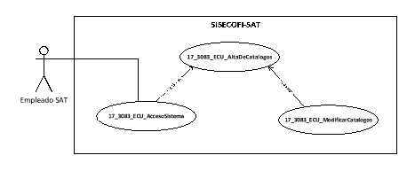
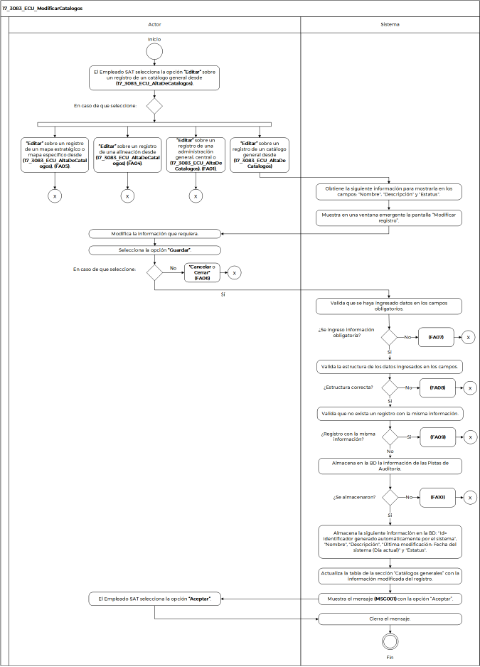

||Administración General de Comunicaciones y Tecnologías de la Información|
| :- | -: |
||Marco Documental 7.0|
|
Fecha de aprobación del Template:

02/08/2023
|
**Especificación del Caso de Uso**

17\_3083\_ECU\_ModificarCatalogos.docx
|Versión del template: 7.00|
| :-: | :-: | :-: |

**ID Requerimiento>** 8309

**Nombre del Requerimiento: **TI\_SISECOFI-SAT\_Seguimiento financiero y control documental de proyectos de contratación.

**Tabla de Versiones y Modificaciones**

|Versión|Descripción del cambio|Responsable de la Versión|Fecha|
| :-: | :- | :-: | :-: |
|*1*|*Creación del documento*|Eduardo Acosta Mora|*18/01/2024*|
|*1.1*|*Revisión del documento*|Luis Angel Olguin Castillo|*10/03/2024*|
|*1.2*|*Versión aprobada para firma*|
María del Carmen Castillejos Cárdenas

Rubén Delgado Ramírez
|*06/06/2024*|

**Tabla de Contenido**

[17_3083_ECU_ModificarCatalogos	2](#_toc168591325)

[1. Descripción	2](#_toc168591326)

[2. Diagrama del Caso de Uso	2](#_toc168591327)

[3. Actores	2](#_toc168591328)

[4. Precondiciones	2](#_toc168591329)

[5. Post condiciones	3](#_toc168591330)

[6. Flujo Primario	3](#_toc168591331)

[7. Flujos alternos	5](#_toc168591332)

[8. Referencias cruzadas	16](#_toc168591333)

[9. Mensajes	16](#_toc168591334)

[10. Requerimientos No Funcionales	17](#_toc168591335)

[11. Diagrama de actividad	19](#_toc168591336)

[12. Diagrama de estados	19](#_toc168591337)

[13. Aprobación del cliente	20](#_toc168591338)

### ****17\_3083\_ECU\_ModificarCatalogos

|<h3>**1. Descripción** </h3>|
| :- |
|

El objetivo de este Caso de Uso es permitir al Empleado SAT modificar un registro para un catálogo general o complementario.

|
|<h3>**2. Diagrama del Caso de Uso**</h3>|
||
|<h3>**3. Actores** </h3>|
||
||

|**Actor**|**Descripción**|
| :-: | :-: |
|**Empleado SAT**|El Empleado SAT es el que tiene el o los roles otorgados por la Administración Central de Seguridad, Monitoreo y Control (ACSMC) para ingresar a cada uno de los módulos de este sistema.|

|

|
| :- |
|<h3>**4. Precondiciones**</h3>|
|

- El Empleado SAT se ha autenticado en el sistema con una e.firma válida.

- El sistema ha consumido el servicio “Oauth” para obtener los datos del Empleado SAT que ingresa al mismo.

- Se le ha asignado el rol requerido al Empleado SAT para ingresar al módulo “Sistema” y al submódulo “Catálogos”.

- El sistema ha validado que el Empleado SAT cuenta con el rol para ingresar al módulo "Sistema" y al submódulo "Catálogos".

- El Empleado SAT ha ingresado al módulo "Sistema" y al submódulo "Catálogos".

- Se ha creado el esquema de almacenamiento (Metadatos) para los catálogos que serán gestionados por el sistema.

- Se han agregado nuevos registros de un catálogo general o complementario y se ha seleccionado un registro para edición.

&emsp;

|
|<h3>**5. Post condiciones** </h3>|
|

- El Empleado SAT modificó un registro de manera correcta.

&emsp;
|
|<h3>**6. Flujo Primario**</h3>|
||

|**Actor**|**Sistema**|
| :-: | :-: |
|
1. El Caso de Uso inicia, cuando el Empleado SAT selecciona la opción **“Editar”** sobre un registro de un catálogo general desde **(17\_3083\_ECU\_AltaDeCatalogos)** y el flujo continúa.

&emsp;

- En caso de que seleccione la opción **“Editar”** sobre un registro de una administración general, central o administración desde **(17\_3083\_ECU\_AltaDeCatalogos)**,** continúa en el **([**FA01**](#fa01))**.

&emsp;

- En caso de que seleccione la opción **“Editar”** sobre un registro de una alineación desde **(17\_3083\_ECU\_AltaDeCatalogos)**,** continúa en el **([**FA04**](#fa04))**.

&emsp;

- En caso de que seleccione la opción **“Editar”** sobre un registro para la sección “Mapas - Objetivos” desde **(17\_3083\_ECU\_AltaDeCatalogos)**,** continúa en el **([**FA05**](#fa05))**.
|
2. Obtiene de la base de datos (BD) la siguiente información para mostrarla en los campos:

&emsp;

&emsp;- Nombre

&emsp;- Descripción

&emsp;- Estatus
|
||
3. Muestra en una ventana emergente la pantalla “Modificar registro” lo siguiente:

&emsp;

&emsp;Modificar registro:

&emsp;- Nombre\*

&emsp;- Descripción\*

&emsp;- Estatus\*

Opciones:

- Cerrar ventana ![ref1]

&emsp;- Guardar

&emsp;- Cancelar

Ver **(17\_3083\_EIU\_ModificarCatalogos)** Estilos 02.
|
|4. Modifica la información que requiera.||
|
5. Selecciona una opción:

&emsp;

- En caso de que seleccione la opción **“Guardar”**, el flujo continúa.

- En caso de que seleccione la opción **“Cancelar”** o **“Cerrar ventana”**, continúa en el **([**FA06**](#fa06))**.
|
6. Valida que se haya ingresado datos en los campos obligatorios de acuerdo con la **(RNA68)** y **(RNA03)**.

&emsp;

- En caso de que no se haya ingresado información en los campos obligatorios, continúa en el **([**FA07**](#fa07))**.
|
||
7. Valida la estructura de los datos ingresados en los campos de acuerdo con la **(RNA69)**.

&emsp;

- En caso de que la estructura de los datos ingresados sea incorrecta, continúa en el **([**FA08**](#fa08))**.
|
||
8. Valida que no exista un registro con la misma información de acuerdo con la **(RNA04)**.

&emsp;

- En caso de que exista un registro con la misma información, continúa en el **([**FA09**](#fa09))**.
|
||
9. Almacena en la BD la información de las Pistas de Auditoría.

&emsp;

&emsp;Datos que se almacenan:

**Módulo**= Catálogos - Generales

**Fecha y Hora**= Fecha y hora del sistema usando el formato DD/MM/AAAA HH:MM:SS

**RFC Usuario**= RFC largo del Empleado SAT que ingresó al sistema.

**Tipo de movimiento**= **UPDT** (Modificar)

**Movimiento**= Aplica la **(RNA239)**

- Nombre del catálogo

- Id

- En caso de que no se puedan almacenar las Pistas de Auditoría, continúa en el **([**FA10**](#fa10))**.
|
||
10. Almacena la siguiente información en la BD:

&emsp;

&emsp;- Id= Identificador generado automáticamente por el sistema.

&emsp;- Nombre

&emsp;- Descripción

&emsp;- Última modificación: Fecha del sistema (Día actual).

&emsp;- Estatus
|
||
11. Actualiza la tabla de la sección “Catálogos generales” con la información modificada del registro.

&emsp;

&emsp;Ver **(17\_3083\_EIU\_ModificarCatalogos)** Estilos 01.
|
||12. Muestra el mensaje **([**MSG001**](#msg001))** con la opción “Aceptar”.|
|13. Selecciona la opción **“Aceptar”**.|14. Cierra el mensaje.|
||15. Fin del Caso de Uso.|

|

|
| :- |
|<h3>**7. Flujos alternos** </h3>|
|

**FA01 Selecciona la opción “Editar” sobre un registro de una administración**
|

|**Actor**|**Sistema**|
| :-: | :-: |
|1. El **FA01** inicia cuando el Empleado SAT selecciona la opción **“Editar”** sobre un registro de una administración.|
2. Muestra en una ventana emergente la pantalla “Modificar registro, estructura organizacional” lo siguiente:

Modificar registro:

- Catálogo: {Nombre del catálogo o sección donde fue invocado}.

&emsp;- Administración\*

&emsp;- Acrónimo\*

&emsp;- Puesto\*

&emsp;- Estatus\*

Opciones:

- Nuevo 

&emsp;- Exportar a Excel 

Tabla (Administradores). Aplica la **(RNA244)**:

- Id

&emsp;- Nombre completo

&emsp;- Fecha inicio de vigencia

&emsp;- Fecha fin vigencia

&emsp;- Última modificación

&emsp;- Estatus 

&emsp;- Acciones

- Editar 

Opciones:

- Cerrar ventana ![ref1]

&emsp;- Guardar

&emsp;- Cancelar

Ver **(17\_3083\_EIU\_ModificarCatalogos)** Estilos 04.
|
|
3. Modifica la información que requiera de los siguientes campos:

&emsp;

- Administración\*

- Acrónimo\*

- Puesto del administrador\*

- Estatus \*
||
|
4. Selecciona una opción:

&emsp;

- En caso de que seleccione la opción **“Nuevo”**, el flujo continúa.

- En caso de que seleccione la opción **“Guardar”**, continúa en el paso **7** de este flujo.

&emsp;

- En caso de que seleccione la opción **“Cancelar”** o **“Cerrar ventana”**, continúa en el **([**FA06**](#fa06))**.

- En caso de que seleccione la opción **“Exportar a Excel”**, continúa en el **(FA03)**.

- En caso de que seleccione la opción **“Editar”**, continúa en el **(FA02)**. 
|
5. Dentro de la tabla (Administradores) crea una nueva fila y habilita los siguientes campos y opciones para su registro:

- Nombre completo\*

- Fecha inicio de vigencia\*

- Fecha fin vigencia

- Estatus

- Acciones 

- Descartar ![ref2]

|
|
6. Realiza lo siguiente:

&emsp;

- En caso de que ingrese la información para los campos de la tabla, continúa en el paso **4** de este flujo.

- En caso de que seleccione la opción **“Descartar”**, continúa en el **(FA06)**.
|
7. Valida que se haya ingresado datos obligatorios en los campos y la tabla (Administradores) de acuerdo con la **(RNA68)** y **(RNA03)**.

&emsp;

- En caso de que no se haya ingresado información en los campos obligatorios, continúa en el **([**FA07**](#fa07))**.
|
||
8. Valida la estructura de los datos ingresados en los campos y la tabla (Administradores) de acuerdo con la **(RNA69)**.

&emsp;

- En caso de que la estructura de los datos ingresados sea incorrecta, continúa en el **([**FA08**](#fa08))**.
|
||
9. Valida que no exista un registro con la misma información en los campos de acuerdo con la **(RNA04)**.

- En caso de que exista un registro con la misma información, continúa en el **([**FA09**](#fa09))**.
|
||10. Valida si el valor del campo “Estatus” de la ventana emergente es inactivo, muestra el mensaje **(MSG009)** con la opción “Sí” y “No”, el flujo continúa.|
|11. Selecciona una opción.|
12. Cierra el mensaje.

&emsp;

- Si seleccionó la opción “Sí”, el flujo continúa.

- Si seleccionó la opción “No”, el valor del campo estatus cambia a activo y continúa en el paso **14** de este flujo.
|
||13. Inactiva todos los registros dependientes de la tabla administradores y continúa en el paso **17** de este flujo.|
||
14. Valida si los valores del campo “Estatus” de la tabla “Administradores” contenga máximo un valor activo, continúa en el paso **17** de este flujo.

&emsp;

- En caso de haber más de un registro activo, muestra el **(MSG008)** con la opción “Aceptar”, el flujo continúa.
|
|15. Selecciona la opción **“Aceptar”**.|16. Cierra el mensaje y continúa en el paso **6** de este flujo.|
||
17. Almacena en la BD la información de las Pistas de Auditoría.

&emsp;

&emsp;Datos que se almacenan:

**Módulo**= Catálogos - Complementarios

**Fecha y Hora**= Fecha y hora del sistema usando el formato DD/MM/AAAA HH:MM:SS

**RFC Usuario**= RFC largo del Empleado SAT que ingresó al sistema.

**Tipo de movimiento**= **INSR** (Insertar), **UPDT** (Modificar)

**Movimiento**= Aplica la **(RNA239)**

- Nombre del catálogo

- Id

- Id administrador (En caso de aplicar)

- En caso de que no se puedan almacenar las Pistas de Auditoría, continúa en el **([**FA10**](#fa10))**.
|
||
18. Almacena la siguiente información en la BD:

&emsp;

&emsp;- Id= Identificador generado automáticamente por el sistema.

&emsp;- Administración

&emsp;- Acrónimo

&emsp;- Puesto

&emsp;- Estatus

&emsp;- Última modificación: Fecha del sistema (Día actual).

&emsp;- En caso de aplicar: Tabla (Administradores)  

&emsp;- Id

&emsp;- Nombre completo

&emsp;- Fecha de inicio de vigencia

&emsp;- Fecha fin de vigencia

&emsp;- Última modificación: Fecha del sistema (Día actual).

&emsp;- Estatus
|
||
19. Actualiza la tabla de la sección donde fue invocado de los  “Catálogos complementarios” con la información ingresada.

&emsp;

&emsp;Ver **(17\_3083\_EIU\_ModificarCatalogos)** Estilos 03.
|
||20. Muestra el **([**MSG001**](#msg001))** con la opción “Aceptar”.|
|
21. Selecciona la opción **“Aceptar”**.

|22. Cierra el mensaje.|
||23. Fin del Caso de Uso.|

|

**FA02 Selecciona la opción “Editar” de la tabla (Administradores)**
|
| :- |

|**Actor**|**Sistema**|
| :-: | :-: |
|1. El **FA02** inicia cuando el Empleado SAT selecciona la opción **“Editar”** de la tabla administradores.|
2. Habilita en la fila seleccionada los siguientes campos para su edición:

&emsp;

- Nombre completo\*

- Fecha inicio de vigencia\*

- Fecha fin vigencia\*

- Estatus

- Acciones 

- Descartar ![ref2]
|
||3. Continúa en el paso **4** del **(FA01)**.|

|

**FA03 Selecciona la opción “Exportar a Excel”**
|
| :- |

|**Actor**|**Sistema**|
| :-: | :-: |
|1. El **FA03** inicia cuando el Empleado SAT selecciona la opción **“Exportar a Excel”**.|
2. Almacena en la BD la información de las Pistas de Auditoría.

&emsp;

&emsp;Datos que se almacenan:

**Módulo**= Catálogos – Complementarios

**Fecha y Hora**= Fecha y hora del sistema usando el formato DD/MM/AAAA HH:MM:SS

**RFC Usuario**= RFC largo del Empleado SAT que ingresó al sistema.

**Tipo de movimiento**= **PRNT** (Imprimir)

**Movimiento**= Aplica la **(RNA239)**

- Nombre del catálogo o sección que lo invoca.

- Acrónimo

- Ejemplo: Administración general | AGRE | Tabla (Administradores)

- En caso de que no se puedan almacenar las Pistas de Auditoría, continúa en el **([**FA10**](#fa10))**.
|
||3. Consulta en la BD la información de la tabla de acuerdo con la **(RNA71)**.|
||4. Genera un archivo de Excel con la extensión (.xlsx) con la información correspondiente.|
||5. Descarga el archivo de Excel con extensión (.xlsx).|
||6. Continúa en el paso **4** del **(FA01)**.|

|

**FA04 Selecciona la opción “Editar” sobre un registro de una alineación**
|
| :- |

|**Actor**|**Sistema**|
| :-: | :-: |
|1. El **FA04** inicia cuando el Empleado SAT selecciona la opción **“Editar”** sobre un registro de una alineación.|
2. Muestra en una ventana emergente la pantalla “Modificar registro” lo siguiente:

Modificar registro:

- Nombre\*

&emsp;- Descripción\*

&emsp;- Estatus\*

Opciones:

- Cerrar ventana ![ref1]

&emsp;- Guardar

&emsp;- Cancelar

Ver **(17\_3083\_EIU\_ModificarCatalogos)** Estilos 02.
|
|3. Modifica la información que requiera.||
|
4. Selecciona una opción:

&emsp;

- En caso de que seleccione la opción **“Guardar”**, el flujo continúa.

- En caso de que seleccione la opción **“Cancelar”** o **“Cerrar ventana”**, continúa en el **([**FA06**](#fa06))**.
|
5. Valida que se haya ingresado datos en los campos obligatorios de acuerdo con la **(RNA68)** y **(RNA03)**.

&emsp;

- En caso de que no se haya ingresado información en los campos obligatorios, continúa en el **([**FA07**](#fa07))**.
|
||
6. Valida la estructura de los datos ingresados en los campos de acuerdo con la **(RNA69)**.

&emsp;

- En caso de que la estructura de los datos ingresados sea incorrecta, continúa en el **([**FA08**](#fa08))**.
|
||
7. Valida que no exista un registro con la misma información de acuerdo con la (**RNA04)**.

- En caso de que exista un registro con la misma información, continúa en el **([**FA09**](#fa09))**.
|
||
8. Almacena en la BD la información de las Pistas de Auditoría.

&emsp;

&emsp;Datos que se almacenan:

**Módulo**= Catálogos - Complementarios

**Fecha y Hora**= Fecha y hora del sistema usando el formato DD/MM/AAAA HH:MM:SS

**RFC Usuario**= RFC largo del Empleado SAT que ingresó al sistema.

**Tipo de movimiento**= **UPDT** (Modificar)

**Movimiento**= Aplica la **(RNA239)**

- Alineación

- Id

- En caso de que no se puedan almacenar las Pistas de Auditoría, continúa en el **([**FA10**](#fa10))**.
|
||
9. Almacena la siguiente información en la BD:

&emsp;

&emsp;- Id= Identificador generado automáticamente por el sistema.

&emsp;- Nombre

&emsp;- Descripción

&emsp;- Última modificación: Fecha del sistema (Día actual).

&emsp;- Estatus
|
||
10. Actualiza la tabla del catálogo alineación de los  “Catálogos complementarios” con la información ingresada.

&emsp;

&emsp;Ver **(17\_3083\_EIU\_ModificarCatalogos)** Estilos 02.
|
||11. Muestra el **([**MSG001**](#msg001))** con la opción “Aceptar”.|
|
12. Selecciona la opción **“Aceptar”**.

|13. Cierra el mensaje.|
||14. Fin del Caso de Uso.|

|

**FA05 Selecciona la opción “Editar” sobre un registro de la sección “Mapas – Objetivos”**
|
| :- |

|**Actor**|**Sistema**|
| :-: | :-: |
|1. El **FA05** inicia cuando el Empleado SAT selecciona la opción **“Editar”** sobre un registro de la sección Mapas - Objetivos.|
2. Muestra en una ventana emergente la pantalla “Modificar registro de tipo Mapas - Objetivos” lo siguiente de acuerdo con la **(RNA03)**:

Modificar registro:

- Objetivo\*

&emsp;- Descripción\*

&emsp;- Estatus\*

Opciones:

- Cerrar ventana ![ref1]

&emsp;- Guardar

&emsp;- Cancelar

Ver **(17\_3083\_EIU\_ModificarCatalogos)** Estilos 06.
|
|3. Modifica la información que requiera.||
|
4. Selecciona una opción:

&emsp;

- En caso de que seleccione la opción **“Guardar”**, el flujo continúa.

- En caso de que seleccione la opción **“Cancelar”** o **“Cerrar ventana”**, continúa en el **([**FA06**](#fa06))**.
|
5. Valida que se haya ingresado datos en los campos obligatorios de acuerdo con la **(RNA68)** y **(RNA03)**.

&emsp;

- En caso de que no se haya ingresado información en los campos obligatorios, continúa en el **([**FA07**](#fa07))**.
|
||
6. Valida la estructura de los datos ingresados en los campos de acuerdo con la **(RNA69)**.

&emsp;

- En caso de que la estructura de los datos ingresados sea incorrecta, continúa en el **([**FA08**](#fa08))**.
|
||
7. Valida que no exista un registro con la misma información de acuerdo con la **(RNA04)**.

- En caso de que exista un registro con la misma información, continúa en el **([**FA09**](#fa09))**.
|
||
8. Almacena en la BD la información de las Pistas de Auditoría.

&emsp;

&emsp;Datos que se almacenan:

**Módulo**= Catálogos - Complementarios

**Fecha y Hora**= Fecha y hora del sistema usando el formato DD/MM/AAAA HH:MM:SS

**RFC Usuario**= RFC largo del Empleado SAT que ingresó al sistema.

**Tipo de movimiento**= **UPDT** (Modificar)

**Movimiento**= Aplica la **(RNA239)**

- Catálogo Alineación (Opción seleccionada)

- Id

- En caso de que no se puedan almacenar las Pistas de Auditoría, continúa en el **([**FA10**](#fa10))**.
|
||
9. Almacena la siguiente información en la BD:

&emsp;

&emsp;- Id= Identificador generado automáticamente por el sistema.

&emsp;- Objetivo

&emsp;- Descripción

&emsp;- Última modificación: Fecha del sistema (Día actual).

&emsp;- Estatus
|
||
24. Actualiza la tabla de la sección “Mapas - Objetivos” de los  “Catálogos complementarios” con la información ingresada.

&emsp;

&emsp;Ver **(17\_3083\_EIU\_ModificarCatalogos)**  Estilos 05.
|
||10. Muestra el **([**MSG001**](#msg001))** con la opción “Aceptar”.|
|
11. Selecciona la opción **“Aceptar”**.

|12. Cierra el mensaje.|
||13. Fin del Caso de Uso.|

|

**FA06 Selecciona la opción “Cancelar”, “Cerrar ventana” o “Descartar”**
|
| :- |

|**Actor**|**Sistema**|
| :-: | :-: |
|1. El **FA06** inicia cuando el Empleado SAT selecciona la opción **“Cancelar”**, **“Cerrar ventana”** o **“Descartar”**.|2. Muestra el **([**MSG002**](#msg002))** con las opciones “Sí” y “No”.|
|
3. Selecciona una opción.

|
4. Cierra el mensaje.

&emsp;

- En caso de que seleccione la opción **“Sí”**, el flujo continúa.

- En caso de que seleccione la opción **“No”** permanece en el paso donde fue invocado.
|
||
5. Realiza lo siguiente:

&emsp;

- Si fue invocado en el “Cancelar” o “Cerrar” cierra el modal sin almacenar ninguna información.

- Si fue invocado en la opción “Descartar”:

- Se inicializa el registro de la tabla de la sección donde fue invocado, y cambia a solo lectura si era un registro almacenado regresando los íconos a su estado original.

- Si era un registro nuevo elimina la fila.
|
||
6. Dependiendo de la situación, realiza lo siguiente:

&emsp;

- Si fue invocado por la opción “Descartar”, continúa en el paso **4** del **(FA01)**.

- Si fue invocado por las opciones “Cancelar” o “Cerrar ventana”, el proceso continúa en el punto de acción donde fue invocado en el **(17\_3083\_ECU\_AltaDeCatalogos)**.
|

|

**FA07 No se ingresaron los datos obligatorios**
|
| :- |

|**Actor**|**Sistema**|
| :-: | :-: |
||1. El **FA07** inicia cuando el sistema identifica que no se ingresaron los datos obligatorios. |
||2. Muestra en rojo los campos pendientes a capturar.|
||3. Muestra el **([**MSG003**](#msg003))** con la opción “Aceptar”.|
|4. Selecciona la opción **“Aceptar”**.|5. Cierra el mensaje.|
||6. Continúa en el paso previo de acción del flujo donde fue invocado.|

|

**FA08 La estructura de los datos ingresados es incorrecta**
|
| :- |

|**Actor**|**Sistema**|
| :-: | :-: |
||1. El **FA08** inicia cuando el sistema identifica que la estructura de los datos ingresados es incorrecta.|
||2. Muestra el **([**MSG004**](#msg004))** con la opción “Aceptar”.|
|3. Selecciona la opción **“Aceptar”**.|4. Cierra el mensaje.|
||5. Continúa en el paso previo de acción del flujo donde fue invocado.|

|

**FA09 Registro duplicado**
|
| :- |

|**Actor**|**Sistema**|
| :-: | :-: |
||1. El **FA09** inicia cuando el sistema identifica que existe un registro con la misma información.|
||2. Muestra el **([**MSG005**](#msg005))** con la opción “Aceptar”. |
|3. Selecciona la opción **“Aceptar”**.|4. Cierra el mensaje.|
||5. Continúa en el paso previo de acción del flujo donde fue invocado.|

|

**FA10 No se pueden almacenar las Pistas de Auditoría**
|
| :- |

|**Actor**|**Sistema**|
| :-: | :-: |
||1. El **FA10** inicia cuando interviene un evento ajeno y no se pueden almacenar las pistas de auditoría.|
||2. Cancela la operación sin completar el movimiento que estaba en proceso.|
||
- Muestra el mensaje informativo de acuerdo con lo siguiente:

- Si la pista de auditoría es por el tipo de movimiento **UPDT** e **INSR**, se muestra el **([**MSG006**](#msg006))**.

- En caso de que la pista de auditoría es por el tipo de movimiento **PRNT**, se muestra el **(MSG007)**.

Cada mensaje con la opción “Aceptar”.
|
|3. Selecciona la opción **“Aceptar”**.|4. Cierra el mensaje.|
||5. Regresa al paso previo que detona la acción de la pista de auditoría.|

|

|
| :- |
||
|<h3>**8. Referencias cruzadas** </h3>|
|

- 17\_3083\_CRN\_SeguimientoFinancieroYControl

- 17\_3083\_EIU\_ModificarCatalogos

- 17\_3083\_ECU\_AltaDeCatalogos

|

|<h3>**9. Mensajes** </h3>|
| :- |
||

|**ID Mensaje**|**Descripción**|
| :-: | :-: |
|**MSG001**|Información actualizada correctamente.|
|**MSG002**|
Se perderá toda la información no guardada.

¿Está seguro de que desea continuar?
|
|**MSG003**|Favor de ingresar los datos obligatorios marcados con un asterisco (\*).|
|**MSG004**|La estructura de la información ingresada es incorrecta. Intente nuevamente.|
|**MSG005**|Registro duplicado. Intente nuevamente.|
|**MSG006**|Ocurrió un error al guardar el registro, favor de intentar nuevamente (PA01).|
|**MSG007**|Ocurrió un error al exportar la información, favor de intentar nuevamente (PA01).|
|**MSG008**|Existe más de un administrador para este puesto. Favor de validar.|
|**MSG009**|
Al cambiar el estatus de este registro, cambiará todos los estatus de los registros dependientes a éste.

¿Desea continuar?
|

|

|
| - |
|<h3>**10. Requerimientos No Funcionales** </h3>|
||
||

|**ID de RNF**|**Requerimiento No Funcional**|**Descripción**|
| :-: | :-: | :-: |
|**RNF001**|Disponibilidad|El sistema deberá estar activo las 24 horas del día, los 365 días del año con picos de operación en el horario de 9:00 a 18:00 horas.|
|**RNF002**|Concurrencia|
El número de Empleados SAT que puede tener el sistema son 150. 

` `El número de accesos concurrentes que debe soportar este sistema son máximo 30 Empleados SAT.
|
|**RNF003**|Seguridad|El acceso solo podrá ser otorgado a todo Empleado SAT que tenga los roles asignados por la Administración Central de Seguridad, Monitoreo y Control (ACSMC) para cada módulo de este sistema.|
|**RNF004**|Usabilidad|
El sistema deberá manejar los siguientes elementos para facilitar la navegación:  

- Mensajes tipo flotantes (tooltips) con información de la herramienta que ofrece ayuda contextual, como guía para el Empleado SAT.  

- Componente de ordenamiento que permita acomodar la información de la tabla de forma ascendente o descendente, considerando la columna donde es seleccionado.  

- Contar con un diseño responsivo que permita su óptima visualización en distintos tipos de dispositivos finales.
|
|**RNF005**|Eficiencia|Las consultas se dividen en generales y detalladas, para que las detalladas carguen la información solo cuando sean requeridas por el Empleado SAT. |
|**RNF006**|Usabilidad|
El Empleado SAT podrá navegar a través de las páginas resultantes de la consulta considerando que el sistema debe mostrar inicialmente 15 registros por página, permitiendo al Empleado SAT seleccionar los registros que requiere visualizar, teniendo las opciones 15, 50 y 100:  

  

- Ir a la primera página (debe mostrar la primera página con el resultado de la consulta).  

- Ir a la última página (debe mostrar la última página con el resultado de la consulta).  

- Ir a la siguiente página (debe mostrar la siguiente página, considerando la página actual, con el resultado de la consulta y el número de registros seleccionados por el Empleado SAT).  

- Ir a la página anterior (debe mostrar la página anterior considerando la actual, con el resultado de la consulta).  

  

En la tabla deben mostrarse los registros ordenados alfabéticamente. 
|
|**RNF007**|Seguridad|Las Pistas de Auditoría deben estar protegidas contra accesos no autorizados. Solo los Empleados SAT autorizados pueden consultarlas, y la información en ellas se definirá durante la etapa de diseño, la cual debe estar cifrada para mantenerla confidencial y evitar exposiciones no autorizadas.   |
|**RNF008**|Fiabilidad |El sistema debe ser capaz de manejar excepciones de manera efectiva y presentar mensajes claros y comprensibles para garantizar una adecuada interacción con el sistema. |
|**RNF009**|Seguridad|Mantener la información en pantalla en caso de un error al guardar las pistas de auditoría, siempre y cuando el escenario lo permita. Hay situaciones de infraestructura o de conexión de internet que sí pierde los datos ya que no están controlados por el sistema. |
|**RNF010**|Integridad |Al almacenar la información en la BD de tipo Texto o Alfanumérico se deben eliminar los espacios en blanco al inicio y fin de la cadena. |

|

|
| :- |
|<h3>**11. Diagrama de actividad** </h3>|
|

|
||
|<h3>**12. Diagrama de estados** </h3>|
|

No aplica, no se requiere para este proceso.

|
|<h3>**13. Aprobación del cliente** </h3>|
||

|**FIRMAS DE CONFORMIDAD**||
| :-: | :- |
|**Firma 1** |**Firma 2** |
|**Nombre**: María del Carmen Castillejos Cárdenas.|**Nombre**: Rubén Delgado Ramírez.|
|**Puesto**: Usuaria ACPPI.|**Puesto**: Usuario ACPPI.|
|**Fecha:**|**Fecha:**|
|||
|**Firma 3** |**Firma 4**|
|**Nombre**: Rodolfo López Meneses.|**Nombre**: Diana Yazmín Pérez Sabido.|
|**Puesto**: Usuario ACPPI.|**Puesto**: Usuaria ACPPI.|
|**Fecha:**|**Fecha:**|
|||
|**Firma 5**|**Firma 6**|
|**Nombre**: Yesenia Helvetia Delgado Naranjo.|**Nombre:** Alejandro Alfredo Muñoz Núñez.|
|**Puesto**: APE ACPPI.|**Puesto:** RAPE ACPPI.|
|**Fecha**:|**Fecha**:|
|||
|**Firma 7**|**Firma 8**|
|**Nombre**: Luis Angel Olguin Castillo.|**Nombre**: Erick Villa Beltrán.|
|**Puesto**: Enlace ACPPI.|**Puesto**: Líder APE SDMA 6.|
|**Fecha**:|**Fecha**:|
|||
|**Firma 9**|**Firma 10**|
|**Nombre:** Juan Carlos Ayuso Bautista.|**Nombre:** Eduardo Acosta Mora.|
|**Puesto:** Líder Técnico SDMA 6.|**Puesto:** Analista SDMA 6.|
|**Fecha**:|**Fecha**:|
|||

||
| :- |

|||Página 1 de 9|
| :- | :-: | -: |

[ref1]: Aspose.Words.2e0c7fd6-aea2-4584-8e49-6700ce621f24.003.png
[ref2]: Aspose.Words.2e0c7fd6-aea2-4584-8e49-6700ce621f24.008.png
