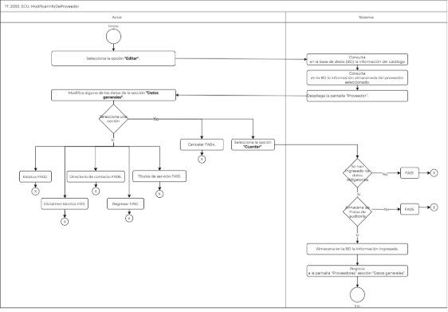

||Administración General de Comunicaciones y Tecnologías de la Información|
| :- | -: |
||Marco Documental 7.0|
|
Fecha de aprobación del Template:

02/08/2023
|
**Especificación del Caso de Uso**

17\_3083\_ECU\_ModificarInfoDeProveedor.docx
|Versión del template: 7.00|
| :-: | :-: | :-: |

\*	

**<ID Requerimiento>** 8309

**Nombre del Requerimiento: **TI\_SISECOFI-SAT\_Seguimiento financiero y control documental de proyectos de contratación

**Tabla de Versiones y Modificaciones**

|Versión|Descripción del cambio|Responsable de la Versión|Fecha|
| :-: | :- | :-: | :-: |
|*1*|*Creación del documento*|Edgar Vergara Tadeo|*23/01/2024*|
|*1.1*|*Revisión del documento*|Luis Angel Olguin Castillo|*02/05/2024*|
|*1.2*|*Versión aprobada para firma*|
María del Carmen Castillejos Cárdenas

Rubén Delgado Ramírez
|17/05/2024|

**Tabla de Contenido**

[17_3083_ECU_ModificarInfoDeProveedor	2](#_toc167176757)

[1. Descripción	2](#_toc167176758)

[2. Diagrama del Caso de Uso	2](#_toc167176759)

[3. Actores	2](#_toc167176760)

[4. Precondiciones	2](#_toc167176761)

[5. Post condiciones	3](#_toc167176762)

[6. Flujo primario	3](#_toc167176763)

[7. Flujos alternos	5](#_toc167176764)

[8. Referencias cruzadas	17](#_toc167176765)

[9. Mensajes	17](#_toc167176766)

[10. Requerimientos No Funcionales	18](#_toc167176767)

[11. Diagrama de actividad	20](#_toc167176768)

[12. Diagrama de estados	20](#_toc167176769)

[13. Aprobación del cliente	21](#_toc167176770)

### ****17\_3083\_ECU\_ModificarInfoDeProveedor

|<h3>**1. Descripción** </h3>|
| :- |
|

El objetivo de este Caso de Uso es permitir al Empleado SAT ingresar al módulo de proveedores, editar los datos existentes de las cuatro secciones, así como insertar nuevos datos en las secciones de, “Directorio de contacto”, “Títulos de servicio”, y “Dictamen técnico” relacionados a un proveedor.

|
|<h3>**2. Diagrama del Caso de Uso**</h3>|
|

|
||
|<h3>**3. Actores** </h3>|
||

|**Actor**|**Descripción**|
| :-: | :-: |
|**Empleado SAT**|El Empleado SAT es el que tiene el o los roles otorgados por la Administración Central de Seguridad, Monitoreo y Control (ACSMC) para ingresar a cada uno de los módulos de este sistema.|

|

|
| :- |
|<h3>**4. Precondiciones**</h3>|
|
- El Empleado SAT se ha autenticado en el sistema con e.firma válida. 

- El sistema ha consumido el servicio “Oauth” para obtener los datos del Empleado SAT que ingresa. 

- El sistema ha validado que el Empleado SAT cuenta con los roles para ingresar al módulo “Proveedores”. 

- Se han registrado giros de empresa en el catálogo relacionado.

- Se han registrado tipos de servicio en el catálogo relacionado.

- Se han almacenado datos de proveedores en la base de datos (BD).

- Se ha seleccionado un proveedor.

&emsp;

&emsp;
|
|<h3>**5. Post condiciones** </h3>|
|
- El Empleado SAT modificó la información de un proveedor.

&emsp;
|
|<h3>**6. Flujo primario**</h3>|
||

|**Actor**|**Sistema**|
| :-: | :-: |
|1. El Caso de Uso inicia cuando el Empleado SAT selecciona la opción **“Editar”** en el proceso **(17\_3083\_ECU\_AltaDeProveedor)** en la tabla **“Proveedores”**.|
2. Consulta en la base de datos (BD) la información del siguiente catálogo para mostrarlo en la lista de selección. Aplica la regla de negocio **(RNA01)**.

&emsp;

- Giro de la empresa
|
||
3. Consulta en la BD la información almacenada del proveedor seleccionado para mostrarlo en pantalla.

&emsp;

- Nombre del proveedor

- Nombre comercial

- RFC

- Dirección

- Giro de la empresa

- Comentarios

- Id AGS

- Estatus
|
||
4. Despliega la pantalla “Proveedor”. Aplica la **(RNA72)**.

&emsp;

Sección Datos generales con los siguientes datos:

- Nombre del proveedor\*

- Nombre comercial\*

- RFC

- Dirección

- Giro de la empresa\*

- Comentarios

- Id AGS

- Estatus\*

Opciones:

- Cancelar

- Guardar

- Regresar

Secciones colapsadas 

- Directorio de contacto

- Títulos de servicio

- Dictamen técnico

Ver **(17\_3083\_EIU\_ModificarInfoDeProveedor)** Estilos 01.
|
|
5. Modifica alguno de los datos de la sección **“Datos generales”** del proveedor y continúa el flujo en el paso 6.

&emsp;

- En caso de seleccionar la opción **“Estatus”**, continúa en el flujo alterno **([**FA02**](#fa02))**.

- En caso de que seleccione la sección **“Directorio de contacto”**, continúa en el [**(\[**FA06**\](#fa06))**](#fa06). 

- En caso de que seleccione la sección **“Títulos de servicio”**, continúa en el **[**(\[**FA10**\](#fa10))**](#fa11)**.

- En caso de que seleccione la sección **“Dictamen técnico”**, continúa en el [**(\[**FA11**\](#fa11))**](#fa11).

- En caso de que seleccione la opción **“Regresar”**, continúa en el **([**FA12**](#fa12))**.
||
|
6. Selecciona la opción **“Guardar”** y continúa en el flujo.** 

&emsp;

- En caso de que seleccione la opción **“Cancelar”**,** continúa en el **([\[**FA04**\](#fa04)**)**.](#fa04)**

&emsp;
|
7. Valida que todos los datos obligatorios contengan un valor. 

&emsp;Aplica la **(RNA03)**.

&emsp;

- En caso de que no se haya ingresado alguno de los datos obligatorios continúa en el **([\[**FA01**\](#fa01)](#fa10))**.
|
||
8. Almacena en la BD las Pistas de Auditoría.

&emsp;

&emsp;Datos que se almacenan:

**Módulo**= Proveedores-Datos generales

**Fecha y Hora**= Fecha y hora del sistema, usando el formato DD/MM/AAAA HH:MM: SS

**RFC Empleado SAT**= RFC largo del Empleado SAT que ingresó al sistema. 

**Tipo de movimiento**= **UPDT** (Modificar).

**Movimiento**=** Aplica la **(RNA239)** 

- Id de proveedor.

&emsp;

- En caso de que no se puedan almacenar las Pistas de Auditoría, continúa en el **([\[**FA05**\](#fa05)](#fa05))**.
|
||9. Almacena en la BD la información ingresada.|
||10. Muestra el **([**MSG011**](#msg011))** con la opción “Aceptar”.|
|11. Selecciona la opción **“Aceptar”**.|12. Cierra el mensaje.|
||13. Regresa a la pantalla “Proveedores”, sección “Datos generales” en el proceso **(17\_3083\_ECU\_AltaDeProveedor)**.|
||14. Fin del Caso de Uso.|

||
| :- |
|

|
|<h3>**7. Flujos alternos** </h3>|
|

**FA01 Se identifica que no se han ingresado todos los datos obligatorios**
|

|**Actor**|**Sistema**|
| :-: | :-: |
||1. El **FA01** inicia cuando el sistema identifica que no se ingresaron los datos obligatorios.|
||2. Muestra en rojo los campos pendientes de capturar.|
||3. Muestra el **([**MSG001**](#msg001))** con la opción “Aceptar”.|
|4. Selecciona la opción **“Aceptar”**.|
5. Realiza lo siguiente:

&emsp;

- Si fue invocado en el paso 7 del Flujo primario, regresa al paso [**5**](#_ref165305093) del Flujo primario.

- Si fue invocado en el paso 6 del **([**FA06**](#fa06))**, regresa al paso [**4**](#_ref166857442) del **([**FA06**](#fa06))**.

- Si fue invocado en el paso 6 del **([**FA07**](#fa07))**, regresa al paso [10](#_ref168053499) del **([**FA07**](#fa07))**.

- Si fue invocado en el paso 6 del **([**FA10**](#fa10))**, regresa al paso **[**4**](#_ref166861725)** del **([**FA10**](#fa10))**. 

- Si fue invocado en el paso 6 del **([**FA11**](#fa11))**, regresa al paso [**4**](#_ref166861754) del **([**FA11**](#fa11))**.
|

|

**FA02 Selecciona la opción Estatus o Representante legal**
|
| :- |

|**Actor**|**Sistema**|
| :-: | :-: |
|1. El **FA02** inicia cuando el Empleado SAT selecciona la opción **“Estatus”**.|
2. Valida el estado actual del registro, si este se encuentra Activo, el flujo continúa.

&emsp;

- En caso de que se encuentre Inactivo, continúa en el **([\[**FA03**\](#fa03)](#fa03))**. 
|
||
3. Muestra el **([\[**MSG003**\](#msg003)](#msg003))** con las opciones “Sí” y “No”.

&emsp;

- Si se seleccionó la opción “Representante legal” no muestra ningún mensaje y continúa en el paso 5 de este flujo.
|
|
4. Selecciona la opción **“Sí”**, continúa en el paso **5** del presente flujo.

&emsp;

- Si selecciona la opción **“No”**, continúa en el paso **6** del presente flujo.
|5. Modifica el estatus del registro a “Inactivo”.|
||
6. Realiza lo siguiente:

&emsp;

- Si fue invocado en el paso 5 del Flujo principal, continúa en el paso [**5**](#_ref165305093)** del Flujo Primario.

- Si fue invocado en el paso 4 del **([**FA07**](#fa07))**, continúa en el paso [**4**](#_ref168053499) del **([**FA06**](#fa06))**.
|

|

**FA03 Activar Registros**
|
| :- |

|**Actor**|**Sistema**|
| :-: | :-: |
||1. El **FA03** inicia cuando identifica que el registro se encuentra Inactivo.|
||2. Modifica el estatus del registro a Activo.|
||Regresa al paso [**6**](#_ref166853429) del **([**FA02**](#fa02))**.|

|

**FA04 Selecciona la opción Cancelar**
|
| :- |

|**Actor**|**Sistema**|
| :-: | :-: |
|1. El **FA04** inicia cuando el Empleado SAT selecciona la opción **“Cancelar”**.|2. Muestra el **([**MSG002**](#msg002))** con** las opciones “Sí” y No”.|
|
3. Selecciona la opción **“Sí”** y el flujo continúa.

&emsp;

- En caso de seleccionar **“No”**, continúa en el paso [**6**](#_ref157021808) de este flujo.
|4. Cierra la ventana emergente.|
||5. Inicializa los campos de la pantalla en donde se selecciona la opción dejándolos como en un inicio, no almacena ninguna información.|
||6. Permanece en la sección donde fue invocado.|

|

**FA05 No se pueden almacenar las Pistas de Auditoría**
|
| :- |

|**Actor**|**Sistema**|
| :-: | :-: |
||1. El **FA05** inicia cuando interviene un evento ajeno y no se pueden almacenar las Pistas de Auditoría. |
||2. Cancela la operación sin completar el movimiento que estaba en proceso.|
||
3. Muestra el mensaje de acuerdo con lo siguiente:

&emsp;

- Si la pista de auditoría es por el tipo de movimiento **UPDT** e **INSR**, se muestra el **([\[**MSG006**\](#msg006)](#msg006))**.

&emsp;

- Si la pista de auditoría es por el tipo de movimiento **CNST**, se muestra el **([\[**MSG007**\](#msg007)](#msg007))**.

- En caso de que la pista de auditoría es por el tipo de movimiento **PRNT**, se muestra el **([\[**MSG008**\](#msg008)](#msg008))**.

- Si la pista de auditoría es por el tipo de movimiento **DLT**, se muestra el **([**MSG009**](#msg009))**. 

Cada mensaje se muestra con la opción “Aceptar”.
|
|4. Selecciona la opción **“Aceptar”**.|5. Cierra el mensaje.|
||6. Regresa al paso previo que detona la acción de la pista de auditoría.|

|

**FA06 Selecciona la sección Directorio de contacto**
|
| :- |

|**Actor**|**Sistema**|
| :-: | :-: |
|
1. El **FA06** inicia cuando el Empleado SAT selecciona la sección **“Directorio de contacto”**.

|
2. Consulta la información almacenada en la BD de la sección “Directorio de contacto” del proveedor seleccionado.

&emsp;

Campos:

- Nombre del contacto

- Teléfono oficina

- Teléfono celular

- Correo electrónico

- Representante legal

- Comentarios
|
||
3. Despliega la pantalla con los registros almacenados en la BD. 

&emsp;

Campos:

- Nombre del contacto\*

- Teléfono oficina\*

- Teléfono celular

- Correo electrónico

- Representante legal

- Comentarios

Opciones. Aplica la **(RNA72)**:

- Cancelar

- Guardar

- Exportar a Excel ![ref1]

Tabla con los campos en modo sólo lectura. 

- Id

- Nombre del contacto

- Teléfono oficina

- Teléfono celular

- Correo electrónico

- Representante legal

- Comentarios. Aplica la **(RNA93)**

- Acciones. Aplica la **(RNA72)**.

- Editar![ref2]

- Eliminar![ref3]

Ver

**(17\_3083\_EIU\_ModificarInfoDeProveedor)** Estilos 02.
|
|
4. Ingresa los datos de la sección “Directorio de contacto” continúa en el flujo.

&emsp;

- En caso de que seleccione la opción **“Editar”**, de algún registro de la tabla, continúa en el **([**FA07**](#fa07))**.

- En caso de que seleccione la opción **“Eliminar”**, continúa en el **([\[**FA08**\](#fa08)](#fa08))**.

- En caso de que requiera **“Filtrar”** por alguna de las columnas de la tabla, continúa en el **([**FA09**](#fa09))**.

- En caso de que seleccione la opción **“Exportar a Excel”**. 

&emsp;Ver **(17\_3083\_ECU\_AltaDeProveedor)-** **(FA09)**.
||
|
5. Selecciona la opción **“Guardar”** y continúa en el flujo.

- Selecciona la opción “Cancelar”, continúa en el **([**FA04**](#fa04))**.
|
6. Valida que se hayan ingresado los datos obligatorios. Aplica la **(RNA03)**.

- En caso de que no se haya ingresado alguno de los datos obligatorios, continúa en el flujo **([\[**FA01**\](#fa01)**)**](#fa10)**.

|
||
7. Almacena en la BD las Pistas de Auditoría.

&emsp;

&emsp;Datos que se almacenan:

**Módulo**= Proveedores-Directorio de contacto

**Fecha y Hora**= Fecha y hora del sistema, usando el formato DD/MM/AAAA HH:MM: SS

**RFC Empleado SAT**= RFC largo del Empleado SAT que ingresó al sistema. 

**Tipo de movimiento**= **INSR** (Insertar).

**Movimiento**=** Aplica la **(RNA239)**

- Id de proveedor

- Id del contacto

&emsp;

- En caso de que no se puedan almacenar las Pistas de Auditoría, continúa en el **([\[**FA05**\](#fa05)](#fa05))**.
|
||8. Almacena en la BD los datos de “Directorio de contacto”.|
||9. Muestra el **([**MSG011**](#msg011))** con la opción “Aceptar”.|
|10. Selecciona la opción **“Aceptar”**.|11. Cierra el mensaje.|
||12. Recarga la pantalla y muestra la información del contacto en la tabla de la sección “Directorio de contacto”.|
||13. Fin del caso de uso.|

|

**FA07 Selecciona la opción Editar** 
|
| :- |

|**Actor**|**Sistema**|
| :-: | :-: |
|
1. El **FA07** inicia cuando el Empleado SAT selecciona la opción **“Editar”**.

|
2. Cambia la propiedad de los campos de la tabla a edición. 

|
||
3. Cambia las acciones de la tabla por las siguientes. Aplica la **(RNA84)**.

 

- Guardar

- Descartar

Ver

**(17\_3083\_EIU\_ModificarInfoDeProveedor)** Estilos 05.
|
|
4. Modifica los datos requeridos.

&emsp;

- En el caso de que uno de los datos modificados sea “Estatus” o “Representante legal”, continúa en el [**(\[**FA02**\](#fa02))**](#fa02).
||
|
5. Selecciona la opción **“Guardar”** por cada registro modificado.

&emsp;

- En caso de que seleccione la opción **“Descartar”**, continúa en el **([\[**FA04**\](#fa04)](#fa07))**.
|
6. Valida que todos los datos obligatorios contengan un valor. 

&emsp;Aplica la **(RNA03)**.

&emsp;

- En caso de que no se haya ingresado alguno de los datos obligatorios, continúa en el **([\[**FA01**\](#fa01)](#fa01))**.
|
||
7. Almacena en la BD las Pistas de Auditoría.

&emsp;

&emsp;Datos que se almacenan:

**Módulo**= Proveedores-Sección modificada

**Fecha y Hora**= Fecha y hora del sistema, usando el formato DD/MM/AAAA HH:MM: SS

**RFC Empleado SAT**= RFC largo del Empleado SAT que ingresó al sistema. 

**Tipo de movimiento**= **UPDT** (modificar)

**Movimiento**=** Aplica la **(RNA239)**

- Id del proveedor

- En caso de que no se puedan almacenar las Pistas de Auditoría, continúa en el **([\[**FA05**\](#fa05)](#fa05))**.
|
||8. El sistema almacena los datos en la BD.|
||9. Muestra el **([**MSG011**](#msg011))** con la opción “Aceptar”.|
|10. Selecciona la opción **“Aceptar”**.|11. Cierra el mensaje.|
||12. Regresa al mismo paso de la sección donde fue invocado.|

|

**FA08 Opción Eliminar** 
|
| :- |

|**Actor**|**Sistema**|
| :-: | :-: |
|1. El **FA08** inicia cuando el Empleado SAT selecciona la opción **“Eliminar”** de alguna fila de las tablas de datos históricos.|
2. El sistema mostrará el **([\[**MSG004**\](#msg004)](#msg004))** con las opciones “Sí” y “No”.

|
|
3. Selecciona la opción **“Sí”** y continúa en el flujo.

&emsp;

- En el caso de que el Empleado SAT selecciona la opción **“No”**,** continúa en el paso [**8**](#_ref167103216) de este flujo.
|
4. Almacena en la BD las Pistas de Auditoría.

&emsp;

&emsp;Datos que se almacenan:

**Módulo**= Proveedores-Sección en donde se invoca

**Fecha y Hora**= Fecha y hora del sistema, usando el formato DD/MM/AAAA HH:MM: SS

**RFC Empleado SAT**= RFC largo del Empleado SAT que ingresó al sistema. 

**Tipo de movimiento**= **DLT** (Descartar)

**Movimiento**=** Aplica la **(RNA239)**

- Id proveedor.

- En caso de que no se puedan almacenar las Pistas de Auditoría, continúa en el **([\[**FA05**\](#fa05)](#fa05))**.
|
||5. El sistema borra el registro de la fila seleccionada.|
||6. Muestra el **([\[**MSG005**\](#msg005)](#msg005))** con la opción “Aceptar”. |
|7. Selecciona la opción **“Aceptar”**.|8. Regresa al paso 2 de la sección donde fue invocado.|

|

**FA09 Se requiere filtrar por alguna de las columnas de la tabla**
|
| :- |

|**Actor**|**Sistema**|
| :-: | :-: |
|1. El **FA09** inicia cuando el Empleado SAT requiere **“Filtrar”** la información en alguna columna de acuerdo con lo que se muestra en la tabla.||
|2. Elige la columna para filtrar e ingresa el dato a buscar.|3. Busca dentro de la columna y filtra la información mostrada de acuerdo con los caracteres ingresados en el campo.|
||4. Muestra todas las coincidencias que obtiene en tiempo real de dicha columna.|
||
5. Realiza lo siguiente:

- Si fue invocado en el paso 4 **([**FA06**](#fa06))**, regresa al paso [**4**](#_ref165306702) del **([**FA06**](#fa06))**.

- Si fue invocado en el paso 4 **([**FA10**](#fa10))**, regresa al paso **[**4**](#_ref166861725)** del **([**FA10**](#fa10))**.

- Si fue invocado en el paso 4 **([**FA11**](#fa11))**, regresa al paso [**4**](#_ref166861754) del **([**FA11**](#fa11))**.
|

|

**FA10** **Selecciona la sección Títulos de servicio**
|
| :- |

|**Actor**|**Sistema**|
| :-: | :-: |
|
1. El **FA10** inicia cuando el Empleado SAT selecciona la sección **“Títulos de servicio”**.

|
2. Consulta la información almacenada en la BD de la sección “Títulos de servicio” del proveedor seleccionado.

&emsp;

Campos:

- Número de título

- Título de servicio

- Estatus

- Vencimiento de título.

- Comentarios
|
||
3. Despliega la pantalla con los registros almacenados en la BD. 

&emsp;

Campos:

- Número de título\*

- Título de servicio\*

- Estatus\*

- Vencimiento de título\*

- Comentarios

Opciones. Aplica la **(RNA72)**:

- Cancelar

- Guardar

- Exportar a Excel  ![ref4]

Tabla con los campos en modo sólo lectura. Aplica la **(RNA93)**.

- Id

- Número de título

- Título de servicio

- Estatus. Aplica la **(RNA18)**.

- Fecha de vencimiento

- Vigencia. Aplica la **(RNA17)**.

- Comentarios

- Acciones. Aplica la **(RNA72)**:

- Editar![ref2]

- Eliminar![ref3]

Ver

**(17\_3083\_EIU\_ModificarInfoDeProveedor)** Estilos 03.
|
|
4. Ingresa los datos de la sección “Títulos de servicio” continúa en el flujo.

&emsp;

- En caso de que seleccione la opción **“Editar”**, de algún registro de la tabla, continúa en el **([**FA07**](#fa07))**.

- En caso de que seleccione la opción **“Eliminar”**, continúa en el **([\[**FA08**\](#fa08)](#fa08))**.

- En caso de que requiera **“Filtrar”** por alguna de las columnas de la tabla, continúa en el **([**FA09**](#fa09))**.

- En caso de que seleccione la opción **“Exportar a Excel”**. 

&emsp;Ver

&emsp;**(17\_3083\_ECU\_AltaDeProveedor)-** **(FA09)**.
||
|
5. Selecciona la opción **“Guardar”** y continúa en el flujo.

- Selecciona la opción “Cancelar”, continúa en el **([**FA04**](#fa04))**.
|
6. Valida que se hayan ingresado los datos obligatorios. Aplica la **(RNA03)**.

- En caso de que no se haya ingresado alguno de los datos obligatorios, continúa en el flujo **([\[**FA01**\](#fa01)**)**](#fa10)**.

|
||
7. Almacena en la BD las Pistas de Auditoría.

&emsp;

&emsp;Datos que se almacenan:

**Módulo**= Proveedores-Títulos de servicio

**Fecha y Hora**= Fecha y hora del sistema, usando el formato DD/MM/AAAA HH:MM: SS

**RFC Empleado SAT**= RFC largo del Empleado SAT que ingresó al sistema. 

**Tipo de movimiento**= **INSR** (Insertar).

**Movimiento**=** Aplica la **(RNA239)**

- Id de proveedor

- Id del título de servicio

&emsp;

8. En caso de que no se puedan almacenar las Pistas de Auditoría, continúa en el **([\[**FA05**\](#fa05)](#fa05))**.
|
||9. Almacena en la BD los datos de “Títulos de servicio”.|
||10. Muestra el **([**MSG011**](#msg011))** con la opción “Aceptar”.|
|11. Selecciona la opción **“Aceptar”**.|12. Cierra el mensaje.|
||13. Recarga la pantalla y muestra la información del título en la tabla de la sección “Títulos de servicio”.|
||14. Fin del caso de uso.|

|

**FA11** **Selecciona la sección Dictamen técnico**
|
| :- |

|**Actor**|**Sistema**|
| :-: | :-: |
|
1. El **FA11** inicia cuando el Empleado SAT selecciona la sección **“Dictamen técnico”**.

|
2. Consulta la información almacenada en la BD de la sección “Dictamen técnico” del proveedor seleccionado.

&emsp;

Campos:

- Servicio

- Año

- Responsable

- Resultado

- Observación
|
||
3. Despliega la pantalla con los registros almacenados en la BD. 

&emsp;

Campos:

- Servicio\*

- Año\*

- Responsable\*

- Resultado\*

- Observación\*

Opciones. Aplica la **(RNA72)**:

- Cancelar

- Guardar

- Exportar a Excel ![ref4]

Tabla. Aplica la **(RNA93)**:

- Id

- Servicio

- Año

- Responsable

- Resultado

- Observación

- Acciones. Aplica la **(RNA72)**.

- Editar![ref2]

- Eliminar![ref3]

Ver

**(17\_3083\_EIU\_ModificarInfoDeProveedor)** Estilos 04.
|
|
4. Ingresa los datos de la sección “Dictamen técnico” continúa en el flujo.

&emsp;

- En caso de que seleccione la opción **“Editar”**, de algún registro de la tabla, continúa en el **([**FA07**](#fa07))**.

- En caso de que seleccione la opción **“Eliminar”**, continúa en el **([\[**FA08**\](#fa08)](#fa08))**.

- En caso de que requiera **“Filtrar”** por alguna de las columnas de la tabla, continúa en el **([**FA09**](#fa09))**.

- En caso de que seleccione la opción **“Exportar a Excel”**. 

&emsp;Ver 

&emsp;**(17\_3083\_ECU\_AltaDeProveedor)-** **(FA09)**.
||
|
5. Selecciona la opción **“Guardar”** y continúa en el flujo.

- Selecciona la opción “Cancelar”, continúa en el **([**FA04**](#fa04))**.
|
6. Valida que se hayan ingresado los datos obligatorios. Aplica la **(RNA03)**.

- En caso de que no se haya ingresado alguno de los datos obligatorios, continúa en el flujo **([\[**FA01**\](#fa01)**)**](#fa10)**.

|
||
7. Almacena en la BD las Pistas de Auditoría.

&emsp;

&emsp;Datos que se almacenan:

**Módulo**= Proveedores- Dictamen técnico

**Fecha y Hora**= Fecha y hora del sistema, usando el formato DD/MM/AAAA HH:MM: SS

**RFC Empleado SAT**= RFC largo del Empleado SAT que ingresó al sistema. 

**Tipo de movimiento**= **INSR** (Insertar).

**Movimiento**=** Aplica la **(RNA239)**

- Id de proveedor

- Id del Dictamen técnico

&emsp;

- En caso de que no se puedan almacenar las Pistas de Auditoría, continúa en el **([\[**FA05**\](#fa05)](#fa05))**.
|
||8. Almacena en la BD los datos de “Dictamen técnico”.|
||9. Muestra el **([**MSG011**](#msg011))** con la opción “Aceptar”.|
|10. Selecciona la opción **“Aceptar”**.|11. Cierra el mensaje.|
||12. Recarga la pantalla y muestra la información del dictamen en la tabla de la sección “Dictamen técnico”.|
||13. Fin del caso de uso.|

|

**FA12** **Selecciona la opción Regresar**
|
| :- |

|**Actor**|**Sistema**|
| :-: | :-: |
|1. El **FA12** inicia cuando el Empleado SAT selecciona la opción **“Regresar”** desde la pantalla **“Proveedor”**.|
2. Se muestra el **([\[**MSG010**\](#msg010)](#msg010))** con las opciones “Sí” y “No”.

|
|
3. Selecciona la opción **“No”**.

&emsp;

- En el caso de que seleccione la opción **“Sí”**, continúa en el paso **5** de este flujo.
|
4. Cierra el mensaje y permanece en la pantalla donde fue invocado.

|
||5. Inicializa los datos modificados a su estado inicial.|
||6. Regresa a la pantalla “Proveedores”.|

|

|
| :- |
|<h3>**8. Referencias cruzadas** </h3>|
|

- 17\_3083\_CRN\_SeguimientoFinancieroYControl

- 17\_3083\_EIU\_ModificarInfoDeProveedor

- 17\_3083\_ECU\_AltaDeProveedor

&emsp;
|
|<h3>**9. Mensajes** </h3>|
||

|**ID Mensaje**|**Descripción**|
| :-: | :-: |
|**MSG001**|Favor de ingresar los datos obligatorios marcados con un asterisco (\*).|
|**MSG002**|Al cancelar se perderán los cambios realizados. ¿Está seguro de continuar?|
|**MSG003**|El estatus cambiará a “Inactivo” y no podrá ser usado en otros procesos. ¿Desea continuar?|
|**MSG004**|¿Está seguro de eliminar el registro?|
|**MSG005**|El registro ha sido eliminado correctamente.|
|**MSG006**|Ocurrió un error al guardar el registro, favor de intentar nuevamente (PA01).|
|**MSG007**|Ocurrió un error al consultar la información, favor de intentar nuevamente (PA01).|
|**MSG008**|Ocurrió un error al exportar la información, favor de intentar nuevamente (PA01).|
|**MSG009**|Ocurrió un error al eliminar la información, favor de intentar nuevamente (PA01). |
|**MSG010**|Se perderán los cambios que no hayan sido guardados, ¿Desea continuar?|
|**MSG011**|Los datos se guardaron correctamente.|

|

|
| - |
|<h3>**10. Requerimientos No Funcionales** </h3>|
||

|**ID RNF** |**Requerimiento No Funcional** |**Descripción** |
| :-: | :-: | :-: |
|**RNF001** |Disponibilidad |El sistema deberá estar activo las 24 horas del día, los 365 días del año con picos de operación en el horario de 9:00 a 18:00 horas. |
|**RNF002** |Concurrencia |
El número de Empleados SAT que puede tener el sistema son 150. 

 

El número de accesos concurrentes que debe soportar este sistema son máximo 30 Empleados SAT. 
|
|**RNF003** |Seguridad |El acceso solo podrá ser otorgado a todo Empleado SAT que tenga los roles asignados por la Administración Central de Seguridad, Monitoreo y Control (ACSMC) para cada módulo de este sistema. |
|**RNF004** |Usabilidad |
El sistema deberá manejar los siguientes elementos para facilitar la navegación:  

- Mensajes tipo flotantes (tooltips) con información de la herramienta que ofrece ayuda contextual, como guía para el Empleado SAT.  

- Componente de ordenamiento que permita acomodar la información de la tabla de forma ascendente o descendente, considerando la columna donde es seleccionado.  

- Contar con un diseño responsivo que permita su óptima visualización en distintos tipos de dispositivos finales. 

 
|
|**RNF005** |Eficiencia |Las consultas se dividen en generales y detalladas, para que las detalladas carguen la información sólo cuando sean requeridas por el Empleado SAT. |
|**RNF006** |Usabilidad |
El Empleado SAT podrá navegar a través de las páginas resultantes de la consulta considerando que el sistema debe mostrar inicialmente 15 registros por página, permitiendo al Empleado SAT seleccionar los registros que requiere visualizar, teniendo las opciones 15, 50 y 100:  

  

- Ir a la primera página (debe mostrar la primera página con el resultado de la consulta).  

- Ir a la última página (debe mostrar la última página con el resultado de la consulta).  

- Ir a la siguiente página (debe mostrar la siguiente página, considerando la página actual, con el resultado de la consulta y el número de registros seleccionados por el Empleado SAT).  

- Ir a la página anterior (debe mostrar la página anterior considerando la actual, con el resultado de la consulta).  

  

En la tabla deben mostrarse los registros ordenados alfabéticamente. 
|
|**RNF007** |Seguridad |Las Pistas de Auditoría deben estar protegidas contra accesos no autorizados. Sólo los Empleados SAT autorizados pueden consultarlas, y la información en ellas se definirá durante la etapa de diseño, la cual debe estar cifrada para mantenerla confidencial y evitar exposiciones no autorizadas.   |
|**RNF008**|Fiabilidad|El sistema debe ser capaz de manejar excepciones de manera efectiva y presentar mensajes claros y comprensibles para garantizar una adecuada interacción con el sistema.|
|**RNF009**|Seguridad|Se debe mantener la información en pantalla en caso de un error al guardar las Pistas de Auditoría, siempre y cuando el escenario lo permita. Hay situaciones de infraestructura o de conexión de internet que sí pierde los datos ya que no están controlados por el sistema.|
|**RNF010**|Integridad |Al almacenar la información en la BD de tipo Texto o alfanumérico se deben eliminar los espacios en blanco al inicio y fin de la cadena. |

|

|
| :- |
|<h3>**11. Diagrama de actividad** </h3>|
|

|
|<h3>**12. Diagrama de estados** </h3>|
|

No Aplica, no se requiere para este proceso.
|

|<h3>**13. Aprobación del cliente** </h3>|
| :- |
|

|

|**FIRMAS DE CONFORMIDAD** ||
| :-: | :- |
|**Firma 1**  |**Firma 2**  |
|**Nombre**: María del Carmen Castillejos Cárdenas. |**Nombre**: Rubén Delgado Ramírez. |
|**Puesto**: Usuaria ACPPI. |**Puesto**: Usuario ACPPI. |
|**Fecha:** |**Fecha:** |
|  |  |
|**Firma 3**  |**Firma 4** |
|**Nombre**: Rodolfo López Meneses. |**Nombre**: Diana Yazmín Pérez Sabido. |
|**Puesto**: Usuario ACPPI. |**Puesto**: Usuaria ACPPI. |
|**Fecha:** |**Fecha:** |
|  |  |
|**Firma 5** |**Firma 6** |
|**Nombre**: Yesenia Helvetia Delgado Naranjo. |**Nombre:** Alejandro Alfredo Muñoz Núñez. |
|**Puesto**: APE ACPPI. |**Puesto:** RAPE ACPPI. |
|**Fecha**: |**Fecha**: |
|  |  |
|**Firma 7** |**Firma 8** |
|**Nombre**: Luis Angel Olguin Castillo. |**Nombre**: Erick Villa Beltrán. |
|**Puesto**: Enlace ACPPI. |**Puesto**: Líder APE SDMA 6. |
|**Fecha**: |**Fecha**: |
|**  |
**  

|
|**Firma 9** |**Firma 10** |
|**Nombre:** Juan Carlos Ayuso Bautista. |**Nombre:** Edgar Vergara Tadeo. |
|**Puesto:** Líder Técnico SDMA 6. |**Puesto:** Analista de Sistemas DS SDMA 6. |
|**Fecha**: |**Fecha**: |
|**  | |

||
| :- |

|||Página 1 de 9|
| :- | :-: | -: |

[ref1]: Aspose.Words.b4450f45-640c-4b04-8e42-a33aa3bd907f.003.png
[ref2]: Aspose.Words.b4450f45-640c-4b04-8e42-a33aa3bd907f.004.png
[ref3]: Aspose.Words.b4450f45-640c-4b04-8e42-a33aa3bd907f.005.png
[ref4]: Aspose.Words.b4450f45-640c-4b04-8e42-a33aa3bd907f.006.png
