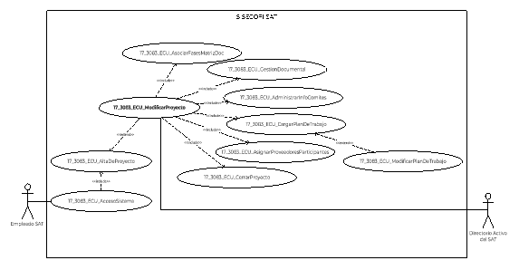
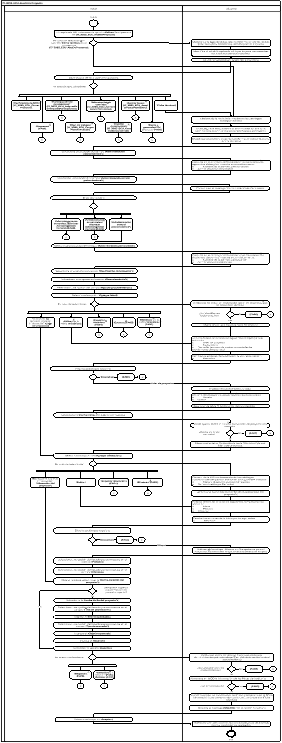

||Administración General de Comunicaciones y Tecnologías de la Información|
| :- | -: |
||Marco Documental 7.0|
|
Fecha de aprobación del Template:

02/08/2023
|
**Especificación del Caso de Uso**

17\_3083\_ECU\_ModificarProyecto.docx
|Versión del template: 7.00|
| :-: | :-: | :-: |

**<ID Requerimiento>** 8309

**Nombre del Requerimiento: **TI\_SISECOFI-SAT\_Seguimiento financiero y control documental de proyectos de contratación

**Tabla de Versiones y Modificaciones**

|Versión|Descripción del cambio|Responsable de la Versión|Fecha|
| :-: | :- | :-: | :-: |
|*1*|*Creación del documento*|Isabel Adriana Valdez Cortés|*10/02/2024*|
|*1.1*|*Revisión del documento*|Luis Angel Olguin Castillo|*22/02/2024*|
|*1.2*|*Versión aprobada para firma*|
María del Carmen Castillejos Cárdenas

Rubén Delgado Ramírez
|*27/05/2024*|

**Tabla de Contenido**

[17_3083_ECU_ModificarProyecto	2](#_toc168565249)

[1. Descripción	2](#_toc168565250)

[2. Diagrama del Caso de Uso	2](#_toc168565251)

[3. Actores	2](#_toc168565252)

[4. Precondiciones	2](#_toc168565253)

[5. Post condiciones	3](#_toc168565254)

[6. Flujo primario	3](#_toc168565255)

[7. Flujos alternos	12](#_toc168565256)

[8. Referencias cruzadas	28](#_toc168565257)

[9. Mensajes	28](#_toc168565258)

[10. Requerimientos No Funcionales	29](#_toc168565259)

[11. Diagrama de actividad	32](#_toc168565260)

[12. Diagrama de estados	32](#_toc168565261)

[13. Aprobación del cliente	33](#_toc168565262)

### ****17\_3083\_ECU\_ModificarProyecto

|<h3>**1. Descripción** </h3>|
| :- |
|

El objetivo de este Caso de Uso es permitir al Empleado SAT modificar o ingresar la información de los proyectos gestionados en este sistema, permitiendo ingresar a cada sección correspondiente para su llenado.

|
|<h3>**2. Diagrama del Caso de Uso**</h3>|
||
|<h3>**3. Actores** </h3>|
||

|**Actor**|**Descripción**|
| :-: | :-: |
|**Empleado SAT**|El Empleado SAT es el que tiene el o los roles otorgados por la Administración Central de Seguridad, Monitoreo y Control (ACSMC) para ingresar a cada uno de los módulos de este sistema.|
|**Directorio activo**|Esquema donde se almacena la información del personal Empleado del SAT. |

|

|
| :- |
|<h3>**4. Precondiciones**</h3>|
|

- El Empleado SAT se ha autenticado en el sistema con e.firma válida.

- El sistema ha consumido el servicio “Oauth” para obtener los datos del Empleado SAT que ingresa.

- El sistema ha validado que el Empleado SAT cuenta con los roles para ingresar al módulo “Proyectos”.

- El Empleado SAT ha ingresado a la opción del menú “Proyectos”,  ha realizado una búsqueda y ha seleccionado “Editar”, dentro del proceso definido en el **(17\_3083\_ECU\_AltaDeProyecto)**.

&emsp;
|
|<h3>**5. Post condiciones** </h3>|
|

- El Empleado SAT capturó la información requerida para la “Ficha técnica”.

- El sistema almacenó y/o actualizó la información que fue modificada del proyecto.

&emsp;
|
|<h3>**6. Flujo primario**</h3>|
||

|**Actor**|**Sistema**|
| :-: | :-: |
|
1. El Caso de Uso inicia cuando el Empleado SAT selecciona la opción **“Editar”** en el proceso de **(17\_3083\_ECU\_AltaDeProyecto)**.

&emsp;

- En caso de seleccionar la sección **“Ficha técnica”** en el proceso de **(17\_3083\_ECU\_AltaDeProyecto)**, continúa en el paso  [**6**](#_ref159840758) de este flujo. 
|2. Obtiene de la base de datos (BD) la información de los “Datos generales” previamente registrados para el proyecto.|
|

|
3. Identifica el rol del Empleado SAT que ingresa para mostrar las opciones correspondientes de acuerdo con la regla de negocio **(RNA31)**.

&emsp;

- En caso de identificar que cuenta con un rol diferente, continúa en el flujo alterno **([**FA01**](#fa01))**.
|
||
4. Muestra la pantalla principal del “Proyecto” con los siguientes datos:

&emsp;

&emsp;Dato:

- Última modificación

Sección “Datos generales”, aplica la **(RNA40)**:

- Id

- Nombre corto\*

- Estatus

- Nombre del proyecto\*

- Id AGP\*

Opciones para cambiar el estatus del proyecto de acuerdo con la **(RNA41)**:

- Cancelar proyecto 

- Inicial

- Planeación

- Ejecución

- Proceso de cierre

- Cerrado

Opción:

- Guardar

Secciones, aplica la **(RNA31)**:

- Ficha técnica

- Asociar fases

- Gestión documental

- Información de comités

- Plan de trabajo

- Participación de proveedores

- Verificación de RCP

&emsp;

Opción:

- Regresar

&emsp;

Ver **(17\_3083\_EIU\_ModificarProyecto)** Estilos 01.
|
|
5. Elige alguna de las siguientes opciones:

&emsp;

- En caso de seleccionar la sección de **“Ficha técnica”**, el flujo continúa.

- En caso de requerir actualizar los **“Datos generales”** del proyecto, continúa en el **([**FA02**](#fa02))**.

- En caso de seleccionar la sección de **“Asociar fases”**, continúa en el **(17\_3083\_ECU\_AsociarFasesMatrizDoc)**.

- En caso de seleccionar la sección de **“Gestión documental”**, continúa en el **(17\_3083\_ECU\_GestionDocumental)**.

- En caso de seleccionar la sección de **“Información de comités”**,** continúa en el **(17\_3083\_ECU\_AdministrarInfoComites)**.

- En caso de seleccionar la sección de **“Plan de trabajo”**, continúa en el **(17\_3083\_ECU\_CargarPlanDeTrabajo)**.

- En caso de seleccionar la sección de **“Participación de proveedores”**, continúa en el **(17\_3083\_ECU\_AsignarProveedoresParticipantes)**.

- En caso de seleccionar la sección de **“Verificación de RCP”**,** continúa en el **(17\_3083\_ECU\_CerrarProyecto)**.

- En caso de seleccionar **“Regresar”**, continúa en el **([**FA19**](#fa19))**.
|
6. Obtiene de la BD la información de los catálogos correspondientes para utilizarlos en los siguientes campos:

&emsp;

- Administración patrocinadora y participante (catálogo Administraciones Generales)

- Administración central patrocinadora (catálogo Administraciones Centrales)

- Clasificación del proyecto

- Financiamiento

- Tipo de procedimiento

- Mapa y objetivo (catálogo Alineación)

- Periodo (catálogos Periodos)

- Área de planeación (las Administración de Área AGCTI/ACPPI/Áreas)

- Tipo de moneda

|
||7. Consulta en la BD y obtiene la información de la “Ficha técnica” que se encuentre almacenada para el proyecto.|
|

	
|
8. Despliega la sección y presenta la información obtenida de la “Ficha técnica” en los siguientes campos de acuerdo con la **(RNA46)**:

&emsp;

- Administración patrocinadora\*

- Nombre de la admón. patrocinadora

- Administrador patrocinador

- Administración central patrocinadora\*

- Nombre de la admón. central patrocinadora

- Administrador central patrocinador

Opciones:

- Agregar Administración Central ![ref1]

- Eliminar Administración Central ![ref2]

&emsp;

- Administración participante

- Nombre de la admón. participante

- Administrador participante

- Clasificación del proyecto\*

- Financiamiento\*

- Tipo de procedimiento\*

&emsp;

Tabla del “Histórico” de líder del proyecto con los siguientes campos de acuerdo con la **(RNA47)** y la **(RNA244)**:

- Líder del proyecto

- Puesto

- Correo

- Fecha inicio

- Fecha fin

- Estatus  

- Acciones. Aplica la **(RNA246)**

- Editar ![ref3]

- Eliminar ![ref4]

Opciones:

- Agregar líder![ref1]

- Exportar histórico ![ref5]

&emsp;

Tabla de “Alineación del proyecto\*” de acuerdo con la **(RNA48)** y la **(RNA244)**:

- Mapa

- Periodo

- Objetivo

- Acciones. Aplica la **(RNA246)**

- Editar ![ref3] 

- Eliminar ![ref4]

Opciones:

- Agregar alineación ![ref1]

- Exportar alineación ![ref5]

Datos:

- Fecha de inicio del proyecto\*

- Fecha fin del proyecto\*

- Área de planeación\*

- Monto solicitado

- Tipo de moneda\*

- Objetivo general\*

- Alcance

Opciones. Aplica la **(RNA246)**: 

- Cancelar

- Guardar

Ver **(17\_3083\_EIU\_ModificarProyecto)** Estilos 03.
|
|9. Selecciona una opción del campo **“Administración patrocinadora\*”**.|
10. Consulta en el catálogo “Administraciones Generales” los siguientes datos y los muestra automáticamente de acuerdo con la **(RNA44)**:

&emsp;

- Nombre de la admón. patrocinadora

- Administrador patrocinador
|
|11. Selecciona una opción del campo **“Administración central patrocinadora\*”**.|
12. Consulta en el catálogo “Administraciones Centrales” los siguientes datos y los muestra automáticamente de acuerdo con la **(RNA45)**:

&emsp;

- Nombre de la admón. central patrocinadora

- Administrador central patrocinador
|
|
13. Elige una opción:

&emsp;

- En caso de no requerir agregar otra **“Administración central patrocinadora\*”**, el flujo continúa.

&emsp;

- En caso de requerir agregar más **“Administraciones centrales”** selecciona la opción **“Agregar Administración Central”**, continúa en el **([**FA03**](#fa03))**.

- En caso de requerir eliminar **“Administraciones centrales”** selecciona la opción **“Eliminar Administración Central”**, continúa en el **([**FA20**](#fa20))**. 
||
|14. Selecciona una opción del campo **“Administración participante”**.|
15. Consulta en el catálogo “Administraciones Generales” los siguientes datos y los muestra automáticamente de acuerdo con la **(RNA44)**:

&emsp;

- Nombre de la admón. participante

- Administrador participante
|
|16. Selecciona una opción del campo **“Clasificación del proyecto\*”**.||
|17. Selecciona una opción del campo **“Financiamiento\*”**.||
|18. Selecciona una opción del campo **“Tipo de procedimiento\*”**.||
|
19. Selecciona la opción **“Agregar líder”**.

&emsp;

- En caso de **no** requerir ingresar información para el **“Líder del proyecto”**, continúa en el paso [**31**](#_ref159355405)** de este flujo.

&emsp;

- En caso de seleccionar la opción **“Exportar histórico”** de líder del proyecto, continúa en el **([**FA04**](#fa04))**.

&emsp;

- En caso de seleccionar la opción **“Estatus”**,** continúa en el **([**FA05**](#fa05))**.

&emsp;

- En caso de seleccionar **“Editar”** en la tabla** “Histórico” de líder del proyecto, el flujo continúa en el paso **[**22**](#_ref167659020)** de este flujo.

&emsp;

- En caso de seleccionar **“Eliminar”**, en la tabla** “Histórico” de líder del proyecto, el flujo continúa en el **([**FA20**](#fa20))**.
|
20. Valida que no exista un registro del “Líder del proyecto” que se encuentre “Activo”.

&emsp;

- Si se identifica un registro activo, continúa en el **([**FA06**](#fa06))**.
|
||21. Añade una nueva fila en la tabla “Histórico”.|
||
22. Habilita dentro de la tabla los siguientes campos para su selección considerando la **(RNA47)**.

&emsp;

- Líder del proyecto

- Fecha inicio

- Fecha fin (en caso de contar con esta fecha previamente almacenada)
|
||
23. Cambia las acciones de la tabla por la siguiente opción:

&emsp;

- Descartar ![ref6]

Ver **(17\_3083\_EIU\_ModificarProyecto)** Estilos 03.
|
|
24. Elige la acción que requiere:

&emsp;

- En caso de seleccionar un **“Líder del proyecto”** el flujo continúa.

&emsp;

- En caso de seleccionar la opción **“Descartar”** del registro seleccionado continúa en el **([**FA18**](#fa18))**.
|25. Muestra el nombre seleccionado.|
||
26. Obtiene del módulo de “Usuarios” los siguientes datos:

- Puesto

- Correo
|
||
27. Muestra en la tabla “Histórico” los datos obtenidos.

&emsp;

&emsp;Ver **(17\_3083\_EIU\_ModificarProyecto)** Estilos 03.
|
|28. Selecciona la **“Fecha inicio”** del “Líder del proyecto”.|
29. Valida que la “Fecha inicio” del nuevo líder del proyecto sea correcta, aplica la **(RNA248)**.

&emsp;

- En caso de que la fecha no sea correcta, continúa en el **([**FA07**](#fa07))**.
|
||30. Muestra el estatus “Activo” en la tabla “Histórico” para el líder que se agrega.|
|
31. Selecciona la opción de **“Agregar alineación”**.

&emsp;**	

- En caso de **no** requerir ingresar información para la **“Alineación del proyecto\*”**,** continúa en el paso [**40**](#_ref165576844)** de este flujo.

&emsp;

- En caso de seleccionar la opción **“Exportar alineación”**, continúa en el **([**FA04**](#fa04))**.

&emsp;

- En caso de seleccionar la opción **“Editar”**,** continúa en el paso [**34**](#_ref159010470) de este flujo.

- En caso de seleccionar **“Eliminar”**, en la tabla** “Histórico” de líder del proyecto, el flujo continúa en el **([**FA20**](#fa20))**.
|
32. Obtiene de la BD la información de los catálogos correspondientes para utilizarlos en los siguientes campos:

&emsp;

- Mapa y objetivo (catálogo Alineación)

- Periodo (catálogos Periodos)
|
||33. Añade una nueva fila en la tabla de la “Alineación del proyecto\*”.|
||
34. Habilita dentro de la tabla los siguientes campos para su selección considerando la **(RNA48)**:

- Mapa

- Periodo

- Objetivo
|
||
35. Cambia las acciones de la tabla por las siguientes. 

&emsp;

- Descartar ![ref6]

Ver **(17\_3083\_EIU\_ModificarProyecto)** Estilos 03.
|
|
36. Elige la acción que requiere:

&emsp;

- En caso de seleccionar una opción del listado que se muestra en el campo **“Mapa”**,** el flujo continúa.

&emsp;

- En caso de seleccionar la opción **“Descartar”** del registro seleccionado continúa en el **([**FA18**](#fa18))**.
|37. Obtiene del catálogo “Alineación” las opciones para el “Objetivo” dependiente de la opción seleccionada en “Mapa”.|
|38. Selecciona una opción del listado que se muestra en el campo **“Periodo”**.||
|39. Selecciona una opción del listado que se muestra en el campo **“Objetivo”**.||
|
40. Elige si requiere seleccionar la **“Fecha de inicio del proyecto\*”**.

&emsp;

- En caso de **no** requerir ingresar más información para el proyecto,** continúa en el paso [**47**](#_ref165585946)** de este flujo.
||
|41. Selecciona la **“Fecha de fin del proyecto\*”**.||
|42. Selecciona una opción del listado que se muestra en el campo **“Área de planeación\*”**.||
|43. Ingresa el **“Monto solicitado”**.||
|44. Selecciona una opción del listado que se muestra en el campo **“Tipo de moneda\*”**.||
|45. Ingresa el **“Objetivo general”**.||
|46. Ingresa el **“Alcance”**.||
|
47. Selecciona la opción **“Guardar”**.

&emsp;

- En caso de seleccionar la opción **“Cancelar”**,** dentro de la sección de **“Ficha técnica”**, continúa en el **([**FA18**](#fa18))**.

- En caso de seleccionar **“Regresar”**, continúa en el **([**FA19**](#fa19))**.
|
48. Valida que como mínimo se haya capturado una “Administración patrocinadora” y su “Administración Central patrocinadora”.

&emsp;

- En caso de que no se hayan seleccionado los datos mínimos, continúa en el **([**FA09**](#fa09))**.
|
||
49. Almacena en la BD la información de las Pistas de Auditoría. 

&emsp;

&emsp;Datos que se almacenan:

**Módulo**= Proyecto-Ficha técnica

**Fecha y Hora**= Fecha y hora del sistema usando el formato DD/MM/AAAA HH:MM:SS

**RFC Usuario**= RFC largo del Empleado SAT que ingresó al sistema.

**Tipo de movimiento**= **INSR** (Insertar) o **UPDT** (Modificar) o **DLT** (Borrar), según corresponda.

**Movimiento**= Aplica la **(RNA239)**

- Id proyecto

&emsp;

- En caso de que no se puedan almacenar las Pistas de Auditoría, continúa en el **([**FA08**](#fa08))**.
|
||
50. Identifica el tipo de movimiento realizado y almacena en la BD la siguiente información que corresponda con lo capturado para la “Ficha técnica”.

&emsp;

- Administración patrocinadora

- Administración central patrocinadora

- Administración participante

- Clasificación del proyecto

- Financiamiento

- Tipo de procedimiento

- Líder del proyecto (Histórico). Aplica la **(RNA49)**

- Alineación del proyecto

- Fechas de inicio y fin del proyecto

- Área de planeación

- Monto solicitado

- Tipo de moneda

- Objetivo general

- Alcance

- Nombre del Empleado SAT. Aplica la **(RNA247)**

- Fecha y hora de la modificación
|
||51. Muestra el mensaje **([**MSG010**](#msg010))** con la opción “Aceptar”.|
|52. Selecciona la opción **“Aceptar”**.|53. Muestra la pantalla con los campos actualizados de acuerdo con los movimientos realizados.|
||54. Fin del Caso de Uso.|

|

|
| :- |
|<h3>**7. Flujos alternos** </h3>|
|

**FA01 Se identifica que el Empleado SAT cuenta con un rol diferente**
|

|**Actor**|**Sistema**|
| :-: | :-: |
||1. El **FA01** inicia cuando el sistema identifica que el Empleado SAT cuenta con un rol diferente a editar un proyecto.|
||
2. Muestra la pantalla principal del “Proyecto” con los siguientes datos:

&emsp;

&emsp;Dato:

- Última modificación

Datos generales, de solo lectura. Aplica la **(RNA40)**:

- Id

- Nombre corto\*

- Estatus

- Nombre del proyecto\*

- Id AGP\*

Secciones, aplica la **(RNA31)**:

- Ficha técnica

- Asociar fases

- Gestión documental

- Información de comités

- Plan de trabajo

- Participación de proveedores

- Verificación de RCP

&emsp;

Opción:

- Regresar

&emsp;

Ver **(17\_3083\_EIU\_ModificarProyecto)** Estilos 02.
|
||3. Continúa en el paso [**5**](#_ref158843957) del Flujo primario.|

|

**FA02 Se requiere modificar los datos generales**
|
| :- |

|**Actor**|**Sistema**|
| :-: | :-: |
|1. El **FA02** inicia cuando el Empleado SAT **requiere** **actualizar** los datos generales del proyecto.||
|
2. Ingresa los datos:

- Nombre del proyecto

- Id AGP
||
|
3. Elige una opción:

&emsp;

- En caso de seleccionar la opción **“Guardar”**, el flujo continúa.

- En caso de seleccionar la opción **“Planeación”** para avanzar o regresar el proyecto, continúa en el **([**FA12**](#fa12))**.** 

- En caso de seleccionar la opción **“Inicial”**,** continúa en el **([**FA13**](#fa13))**.

- En caso de seleccionar la opción **“Ejecución”**,** continúa en el **([**FA14**](#fa14))**.

- En caso de seleccionar la opción **“Proceso de cierre”**,** continúa en el **([**FA15**](#fa15))**.

- En caso de seleccionar la opción **“Cerrado”**,** continúa en el **([**FA16**](#fa16))**.

- En caso de seleccionar la opción **“Cancelar proyecto”**, continúa en el **([**FA17**](#fa17))**.
|
4. Valida que se hayan capturado los datos obligatorios de acuerdo con las **(RNA03)** y **(RNA40)**.

&emsp;

- En caso contrario, continúa en el **([**FA09**](#fa09))**.
|
||
5. Verifica que la estructura del dato ingresado en el campo “Id AGP” sea correcta de acuerdo con la **(RNA40)**.

&emsp;

- En caso de identificar que la estructura del “Id AGP” es incorrecta, continúa en el **([**FA10**](#fa10))**.
|
||
6. En caso de que se haya modificado el “Id AGP”, consulta en la BD y valida que no se encuentra registrado para otro proyecto.

&emsp;

- En caso de identificar que el “Id AGP” se encuentra registrado, continúa en el **([**FA11**](#fa11))**.
|
||
7. Almacena en la BD la información de las Pistas de Auditoría.

&emsp; 

&emsp;Datos que se almacenan:

**Módulo**= Proyecto-Datos generales

**Fecha y Hora**= Fecha y hora del sistema, usando el formato DD/MM/AAAA HH:MM:SS

**RFC Usuario**= RFC largo del Empleado SAT que ingresó al sistema.

**Tipo de movimiento**= **UPDT** (modificar)

**Movimiento**= Aplica la **(RNA239)**

- Nombre corto del proyecto

- En caso de que no se puedan almacenar las Pistas de Auditoría, continúa en el **([**FA08**](#fa08))**.
|
||
8. Actualiza en la BD la siguiente información del proyecto creado:

&emsp;

- Nombre del proyecto

- Id AGP

- Estatus

- Nombre del Empleado SAT. Aplica la **(RNA247)**

- Fecha y hora de la modificación.
|
||9. Muestra el **([**MSG006**](#msg006))** con la opción** “Aceptar”.|
|10. Selecciona la opción **“Aceptar”**.|11. Cierra el mensaje.|
||12. Regresa al paso [**5**](#_ref158843957) del Flujo primario.|

|

**FA03 Selecciona la opción** **“Agregar Administración Central”**
|
| :- |

|**Actor**|**Sistema**|
| :-: | :-: |
|1. El **FA03** inicia cuando el Empleado SAT selecciona la opción de **“Agregar Administración Central”**.|
2. Presenta en la pantalla un nuevo bloque de los siguientes campos:

- Administración central patrocinadora\*

- Nombre de la admón. central patrocinadora

- Administrador central patrocinador

&emsp;

Opción:

- Eliminar Administración Central ![ref2]

&emsp;

Ver **(17\_3083\_EIU\_ModificarProyecto)** Estilos 03.
|
|3. Selecciona una opción del campo **“Administración central patrocinadora\*”**.|4. Consulta en el catálogo de “Administraciones Centrales” los datos de acuerdo con la **(RNA45)**.|
||
5. Muestra automáticamente los siguientes datos obtenidos del paso anterior:

&emsp;

- Nombre de la admón. central patrocinadora

- Administrador central patrocinador
|
||6. Regresa al paso [**13**](#_ref158845182) del Flujo primario.|

|

**FA04 Selección Exportar Excel**
|
| :- |

|**Actor**|**Sistema**|
| :-: | :-: |
|1. El **FA04** inicia cuando el Empleado SAT selecciona la opción **“Exportar histórico”** de “Líder del proyecto” o **“Exportar alineación”**.|
2. Almacena en la BD la información de las Pistas de Auditoría.

&emsp; 

&emsp;Datos que se almacenan:

**Módulo**= Proyecto-Sección en la donde fue invocado.

**Fecha y Hora**= Fecha y hora del sistema, usando el formato DD/MM/AAAA HH:MM:SS

**RFC Usuario**= RFC largo del Empleado SAT que ingresó al sistema.

**Tipo de movimiento**= **PRNT** (Imprimir)

**Movimiento**= Aplica la **(RNA239)**

- Si fue invocado en ”Histórico de Líder del proyecto”, toma los datos del líder.

- Si fue invocado en “Alineación del proyecto”, toma los datos de la alineación.

- En caso de que no se puedan almacenar las Pistas de Auditoría, continúa en el **([**FA08**](#fa08))**.
|
||3. Obtiene la información que contiene la tabla correspondiente en donde es seleccionada la opción de Exportar.|
||4. Genera un archivo de Excel con extensión (.xlsx) con la información obtenida.|
||5. Descarga el archivo de Excel con extensión (.xlsx).|
||
6. Fin del Caso de Uso.

&emsp;
|

|

**FA05 Selecciona la opción “Estatus” de Líder del proyecto**
|
| :- |

|**Actor**|**Sistema**|
| :-: | :-: |
|1. El **FA05** inicia cuando el Empleado SAT selecciona la opción **“Estatus”** del Líder del proyecto.|2. Muestra el **([**MSG022**](#msg022))** con las opciones “Sí” y “No”.|
|
3. Selecciona una opción:

&emsp;

- En caso de seleccionar la opción **“Sí”**, el flujo continúa.

&emsp;

- En caso de seleccionar la opción **“No”**, continúa en el paso [**10**](#_ref167651900) de este flujo.
|4. Cierra el mensaje.|
||
5. Identifica si el cambio de estatus a realizar es para inactivar, entonces muestra el **([**MSG023**](#msg023))** con la opción “Aceptar” y el flujo continúa.

&emsp;

- En caso de identificar que el cambio de estatus a realizar es para activar, valida que no exista otro “Líder del proyecto” con estatus “Activo” y el flujo continúa en el paso [**9**](#_ref167653850)** de este flujo.

&emsp;

- Si se identifica un registro activo, continúa en el **([**FA06**](#fa06))**.
|
|6. Selecciona la opción **“Aceptar”**.|7. Habilita la opción del calendario en el campo “Fecha fin”, aplica la **(RNA47)** .|
|8. Selecciona la **“Fecha fin”** para el “Líder del proyecto”.||
||9. Actualiza el ícono del estatus de acuerdo con la **(RNA43)**.|
||10. Regresa al paso [**19**](#_ref158846885) del Flujo primario.|

|

**FA06 Se identifica un Líder con estatus “Activo”**
|
| :- |

|**Actor**|**Sistema**|
| :-: | :-: |
||1. El **FA06** inicia cuando el sistema identifica que existe un “Líder del proyecto” con estatus “Activo”.|
||2. Muestra el **([**MSG002**](#msg002))**,** con la opción “Aceptar”.|
|3. Selecciona la opción **“Aceptar”**.|4. Cierra el mensaje. |
||5. Regresa al paso [**19**](#_ref158846885) del Flujo primario.|

|

**FA07 “Fecha inicio” de nuevo líder incorrecta**
|
| :- |

|**Actor**|**Sistema**|
| :-: | :-: |
||1. El **FA07** inicia cuando el sistema identifica que la fecha inicio no es correcta.|
||2. Muestra el **([**MSG009**](#msg009))** con la opción “Aceptar”.|
|3. Selecciona la opción **“Aceptar”**.|4. Cierra el mensaje. |
||5. Regresa al paso [**28**](#_ref167358480) del Flujo primario.|

|

**FA08 No se pueden almacenar las Pistas de Auditoría**
|
| :- |

|**Actor**|**Sistema**|
| :-: | :-: |
||1. El **FA08** inicia cuando interviene un evento ajeno y no se puedan almacenar las Pistas de Auditoría. |
||2. Cancela la operación sin completar el movimiento que estaba en proceso.|
||
3. Muestra el mensaje informativo de acuerdo con lo siguiente:

&emsp;

- Si la pista de auditoría es por el tipo de movimiento **UPDT**, **INSR** o **DLT**, se muestra el **([**MSG014**](#msg014))**.

&emsp;

- Si la pista de auditoría es por el tipo de movimiento **CNST**, se muestra el **([**MSG015**](#msg015))**.

- En caso de que la pista de auditoría sea por el tipo de movimiento **PRNT**, se muestra el **([**MSG016**](#msg016))**.

&emsp;

Cada mensaje se muestra con la opción “Aceptar”.
|
|4. Selecciona la opción **“Aceptar”**.|5. Cierra el mensaje.|
||6. Regresa al paso previo que detona la acción de la pista de auditoría.|

|

**FA09 No se ingresaron los campos obligatorios o mínimos**
|
| :- |

|**Actor**|**Sistema**|
| :-: | :-: |
||1. El **FA09** inicia cuando el sistema identifica que no se seleccionaron o ingresaron los datos obligatorios.|
||2. Muestra en rojo los campos pendientes de capturar. |
||
3. Muestra el mensaje según corresponda:

&emsp;

- Si fue invocado en el paso [4](#_ref165582367) del **([**FA02**](#fa02))**, muestra el **([**MSG001**](#msg001))**.

&emsp;

- Si fue invocado en el paso [4](#_ref165582965) del **([**FA12**](#fa12))**, muestra el **([**MSG011**](#msg011))**.

&emsp;

- Si fue invocado en el paso [48](#_ref167289496) Flujo primario, muestra el **([**MSG020**](#msg020)).**

El mensaje se muestra con la opción “Aceptar”.
|
|4. Selecciona la opción **“Aceptar”**.|5. Cierra el mensaje. |
||
6. Realiza lo siguiente:

- Si fue invocado en el **([**FA02**](#fa02))** o **([**FA12**](#fa12))**, continúa en el paso [**5**](#_ref158742067) del Flujo primario.

- Si fue invocado en el Flujo primario, continúa en el [**9**](#_ref167289659)** del Flujo primario.
|

|

**FA10 Estructura del dato “Id AGP” incorrecta**
|
| :- |

|**Actor**|**Sistema**|
| :-: | :-: |
||1. El **FA10** inicia cuando el sistema identifica que la estructura del “Id AGP” no es correcta|
||2. Muestra el **([**MSG004**](#msg004))**,** con la opción “Aceptar”.|
|3. Selecciona la opción **“Aceptar”**.|4. Cierra el mensaje. |
||5. Regresa al paso [**2**](#_ref167290836) del **([**FA02**](#fa02))**.|

|

**FA11 El dato “Id AGP” se encuentra registrado en BD**
|
| :- |

|**Actor**|**Sistema**|
| :-: | :-: |
||1. El **FA11** inicia cuando el sistema identifica que el “Id AGP” se encuentra registrado en la BD.|
||2. Muestra el **([**MSG005**](#msg005))**,** con la opción “Aceptar”.|
|3. Selecciona la opción **“Aceptar”**.|4. Cierra el mensaje. |
||5. Regresa al paso [**2**](#_ref167290836) del **([**FA02**](#fa02))**.|

|

**FA12 Se selecciona la opción “Planeación”**
|
| :- |

|**Actor**|**Sistema**|
| :-: | :-: |
|1. El **FA12** inicia cuando el Empleado SAT selecciona la opción **“Planeación”**.|2. Consulta en la BD y obtiene el estatus actual del proyecto.|
||
3. Valida que el estatus actual sea “Inicial”.

&emsp;

- En caso de que el estatus sea “Ejecución”, continúa en el paso [**5**](#_ref159359680)** de este flujo.
|
||
4. Consulta en la BD y valida que se encuentre almacenada toda la información obligatoria de la sección “Ficha técnica” de acuerdo con las **(RNA03)**, **(RNA46)**, **(RNA47)** y **(RNA48)**.

&emsp;

- En caso de no haber capturado toda la información, continúa en el **([**FA09**](#fa09))**.
|
||
5. Almacena en la BD la información de las Pistas de Auditoría. 

&emsp;

&emsp;Datos que se almacenan:

**Módulo**= Proyecto-Datos generales

**Fecha y Hora**= Fecha y hora del sistema usando el formato DD/MM/AAAA HH:MM:SS

**RFC Usuario**= RFC largo del Empleado SAT que ingresó al sistema.

**Tipo de movimiento**= **UPDT** (modificar)

**Movimiento**= Aplica la **(RNA239)**

- Estatus anterior

- Estatus actual

- Nombro corto del proyecto

- En caso de que no se puedan almacenar las Pistas de Auditoría, continúa en el **([**FA08**](#fa08))**.
|
||6. Inhabilita todos los campos de la “Ficha técnica”.|
||7. Actualiza en la pantalla el estatus del proyecto a “Planeación”.|
||8. Muestra el **([**MSG019**](#msg019))**, con la opción “Aceptar”.|
|9. Selecciona la opción **“Aceptar”**.|10. Regresa al paso [**3**](#_ref159359978)** del **([**FA02**](#fa02))**.|

|

**FA13 Se selecciona la opción “Inicial”**
|
| :- |

|**Actor**|**Sistema**|
| :-: | :-: |
|1. El **FA13** inicia cuando el Empleado SAT selecciona la opción **“Inicial”**.|
2. Almacena en la BD la información de las Pistas de Auditoría. 

&emsp;

&emsp;Datos que se almacenan:

**Módulo**= Proyecto-Datos generales

**Fecha y Hora**= Fecha y hora del sistema usando el formato DD/MM/AAAA HH:MM:SS

**RFC Usuario**= RFC largo del Empleado SAT que ingresó al sistema.

**Tipo de movimiento**= **UPDT** (modificar)

**Movimiento**= Aplica la **(RNA239)**

- Estatus anterior

- Estatus actual

- Nombro corto del proyecto

- En caso de que no se puedan almacenar las Pistas de Auditoría, continúa en el **([**FA08**](#fa08))**.
|
||3. Habilita todos los campos de la sección “Ficha técnica”.|
||4. Actualiza en la pantalla el estatus del proyecto a “Inicial”.|
||5. Muestra el **([**MSG019**](#msg019))**, con la opción “Aceptar”.|
|6. Selecciona la opción **“Aceptar”**.|7. Regresa al paso [**3**](#_ref159359978)** del **([**FA02**](#fa02))**.|

|

**FA14 Se selecciona la opción “Ejecución”**
|
| :- |

|**Actor**|**Sistema**|
| :-: | :-: |
|1. El **FA14** inicia cuando el Empleado SAT selecciona la opción **“Ejecución”**.|2. Consulta en la BD y obtiene el estatus actual del proyecto.|
||
3. Valida que el estatus actual sea “Planeación”.

&emsp;

- En caso de que el estatus sea “Proceso de cierre”, continúa en el paso [**7**](#_ref159875906)** de este flujo.
|
||
4. Consulta en la BD y valida que se encuentre almacenado un “Plan de trabajo”, continúa en el paso [**7**](#_ref159875906)** de este flujo. 

&emsp;

- En caso de no encontrar un plan de trabajo, muestra el **([**MSG012**](#msg012))** con la opción “Aceptar”.
|
|5. Selecciona la opción **“Aceptar”**.|6. Regresa al paso [**5**](#_ref158742067)  del Flujo primario.|
||
7. Almacena en la BD la información de las Pistas de Auditoría. 

&emsp;

&emsp;Datos que se almacenan:

**Módulo**= Proyecto-Datos generales

**Fecha y Hora**= Fecha y hora del sistema usando el formato DD/MM/AAAA HH:MM:SS

**RFC Usuario**= RFC largo del Empleado SAT que ingresó al sistema.

**Tipo de movimiento**= **UPDT** (modificar)

**Movimiento**= Aplica la **(RNA239)**

- Estatus anterior

- Estatus actual

- Nombro corto del proyecto

- En caso de que no se puedan almacenar las Pistas de Auditoría, continúa en el **([**FA08**](#fa08))**.
|
||8. Actualiza en la pantalla el estatus del proyecto a “Ejecución”.|
||9. Muestra el **([**MSG019**](#msg019))**, con la opción “Aceptar”.|
|10. Selecciona la opción **“Aceptar”.**|11. Regresa al paso [**3**](#_ref159359978)** del **([**FA02**](#fa02))**.|

|

**FA15 Se selecciona la opción “Proceso de cierre”**
|
| :- |

|**Actor**|**Sistema**|
| :-: | :-: |
|1. El **FA15** inicia cuando el Empleado SAT selecciona la opción **“Proceso de cierre”**.|2. Consulta en la BD y obtiene el estatus actual del proyecto.|
||
3. Valida que el estatus actual sea “Ejecución”.

&emsp;

- En caso de que el estatus sea “Cerrado”, continúa en el paso [**7**](#_ref159876032).
|
||
4. Consulta en la BD y valida que todos los contratos o en su caso el último convenio modificatorio relacionado con el proyecto, estén con estatus “Cerrado” o “Cancelado”. Continúa en el paso [**7**](#_ref159876032).

&emsp;

- En caso de no se encuentre con estatus “Cerrado” o “Cancelado”, muestra el **([**MSG013**](#msg013))** con la opción “Aceptar”.
|
|5. Selecciona la opción **“Aceptar”**.|6. Regresa al paso [**5**](#_ref158742067)  del Flujo primario.|
||
7. Almacena en la BD la información de las Pistas de Auditoría. 

&emsp;

&emsp;Datos que se almacenan:

**Módulo**= Proyecto-Datos generales

**Fecha y Hora**= Fecha y hora del sistema usando el formato DD/MM/AAAA HH:MM:SS

**RFC Usuario**= RFC largo del Empleado SAT que ingresó al sistema.

**Tipo de movimiento**= **UPDT** (modificar)

**Movimiento**= Aplica la **(RNA239)**

- Estatus anterior

- Estatus actual

- Nombro corto del proyecto

- En caso de que no se puedan almacenar las Pistas de Auditoría, continúa en el **([**FA08**](#fa08))**.
|
||8. Actualiza en la pantalla el estatus del proyecto a “Proceso de cierre”.|
||9. Muestra el **([**MSG019**](#msg019))**, con la opción “Aceptar”.|
|10. Selecciona la opción **“Aceptar”**.|11. Regresa al paso [**3**](#_ref159359978)** del **([**FA02**](#fa02))**.|

|

**FA16 Se selecciona la opción “Cerrado”**
|
| :- |

|**Actor**|**Sistema**|
| :-: | :-: |
|1. El **FA16** inicia cuando el Empleado SAT selecciona la opción **“Cerrado”**.|
2. Consulta en la BD, valida que se encuentre capturada toda la información obligatoria de las secciones del proyecto y continúa en el paso [**5**](#_ref160809997)** de este flujo:

&emsp;

- Ficha técnica

- Asociar fases

- Gestión documental

- Información de comités

- Plan de trabajo

- Participación de proveedores

- Verificación de RCP

&emsp;

- En caso de no estar capturada la información obligatoria, muestra el **([**MSG008**](#msg008))** con la opción “Aceptar”.
|
|3. Selecciona la opción **“Aceptar”**.|4. Regresa al paso [**4**](#_ref160055756) del Flujo primario.|
||
5. Almacena en la BD la información de las Pistas de Auditoría. 

&emsp;

&emsp;Datos que se almacenan:

**Módulo**= Proyecto-Datos generales

**Fecha y Hora**= Fecha y hora del sistema usando el formato DD/MM/AAAA HH:MM:SS

**RFC Usuario**= RFC largo del Empleado SAT que ingresó al sistema.

**Tipo de movimiento**= **UPDT** (modificar)

**Movimiento**= Aplica la **(RNA239)**

- Estatus anterior

- Estatus actual

- Nombro corto del proyecto

- En caso de que no se puedan almacenar las Pistas de Auditoría, continúa en el **([**FA08**](#fa08))**.
|
||6. Actualiza en la pantalla el estatus del proyecto a “Cerrado”.|
||7. Muestra el **([**MSG019**](#msg019))**, con la opción “Aceptar”.|
|8. Selecciona la opción **“Aceptar”**.|9. Regresa al paso [**3**](#_ref159359978) del **([**FA02**](#fa02))**.|

|

**FA17 Se selecciona la opción “Cancelar” dentro de datos generales**
|
| :- |

|**Actor**|**Sistema**|
| :-: | :-: |
|1. El **FA17** inicia cuando el Empleado SAT selecciona la opción **“Cancelar proyecto”** dentro de la sección de **“Datos generales”**.|
2. Valida que el proyecto no cuente con contratos y dictámenes no cancelados y continúa en el paso **[**4**](#_ref167366250)** de este flujo.

&emsp;

- En caso de que cuente con contratos y dictámenes no cancelados, muestra el mensaje **([**MSG021**](#msg021))**.
|
|3. Selecciona **“Aceptar”** y regresa al paso [**3**](#_ref159359978) del **([**FA02**](#fa02))**.||
||4. Muestra el **([**MSG017**](#msg017))** con las opciones “Sí” y “No”.|
|
5. Selecciona **“No”**,** continúa en el paso [**6**](#_ref165583971).

&emsp;

- En caso de seleccionar** la opción **“Sí”**,** continúa en el paso [**7**](#_ref165583980)** de este flujo.
|6. Cierra el mensaje y permanece en el al paso [**3**](#_ref159359978) del **([**FA02**](#fa02))**.|
||7. Cierra el mensaje.|
||
8. Almacena en la BD la información de las Pistas de Auditoría. 

&emsp;

&emsp;Datos que se almacenan:

**Módulo**= Proyecto-Datos generales

**Fecha y Hora**= Fecha y hora del sistema usando el formato DD/MM/AAAA HH:MM:SS

**RFC Usuario**= RFC largo del Empleado SAT que ingresó al sistema.

**Tipo de movimiento**= **UPDT** (modificar)

**Movimiento**= Aplica la **(RNA239)**

- Estatus anterior

- Estatus actual

- Id proyecto

- En caso de que no se puedan almacenar las Pistas de Auditoría, continúa en el **([**FA08**](#fa08))**.
|
||9. Actualiza en la pantalla el estatus del proyecto a “Cancelado”.|
||10. Regresa al paso [**3**](#_ref159359978) del **([**FA02**](#fa02))**.|

|

**FA18 Se selecciona la opción “Cancelar” o “Descartar” dentro de Ficha técnica** 
|
| :- |

|**Actor**|**Sistema**|
| :-: | :-: |
|1. El **FA18** inicia cuando el Empleado SAT selecciona la opción **“Cancelar” o “Descartar”** dentro de la sección de **“Ficha técnica”**.|2. Muestra el **([**MSG018**](#msg018))** con las opciones “Sí” y “No”. |
|
3. Selecciona **“No”**,** continúa en el paso [**4**](#_ref165585861)** de este flujo.

&emsp;

- En caso de seleccionar** la opción **“Sí”**, continúa en el paso [**5**](#_ref165585875) de este flujo.
|4. Cierra el mensaje y continúa en el paso [**6**](#_ref168001261) de este flujo. |
||
5. Cierra el mensaje y regresa la información al último estado guardado, recargándola nuevamente en la pantalla.

&emsp;

- Si fue invocado en la opción “Descartar”:

&emsp;- ` `Cambia a solo lectura si era un registro almacenado regresando los íconos a su estado original.

&emsp;- Si era un registro nuevo elimina la fila.
|
||6. Permanece en la sección donde fue invocado.|

|

**FA19 Se selecciona “Regresar”**
|
| :- |

|**Actor**|**Sistema**|
| :-: | :-: |
|1. El **FA19** inicia cuando el Empleado SAT selecciona la opción **“Regresar”**.|2. Muestra el **([**MSG003**](#msg003))** con las opciones “Sí” y “No”.|
|
3. Selecciona **“No”**,** continúa en el paso [**4**](#_ref165586098).

&emsp;

- En caso de seleccionar** la opción **“Sí”**,** continúa en el paso [**5**](#_ref165586109)** de este flujo.
|
4. Cierra el mensaje y permanece en el paso donde fue invocado:

&emsp;

- Si fue invocado en el paso [**5**](#_ref158843957) del Flujo primario, continúa en el mismo paso.

- Si fue invocado en el paso [**47**](#_ref165585946) del Flujo primario, continúa en el mismo paso. 
|
||5. Cierra el mensaje, en caso de no haber guardado información en alguna sección, está ya no se almacena y continúa en el paso 8 del Flujo primario del **(17\_3083\_ECU\_AltaDeProyecto)**.|

|

**FA20 Se selecciona “Eliminar Administración Central” o “Eliminar” de una tabla** 
|
| :- |

|**Actor**|**Sistema**|
| :-: | :-: |
|1. El **FA20** inicia cuando el Empleado SAT selecciona la opción **“Eliminar Administración Central”** o **“Eliminar”** de una tabla.|2. Muestra el **([**MSG007**](#msg007))** con las opciones “Sí” y “No”.|
|
3. Selecciona la opción **“No”**, el flujo continúa.

&emsp;

- En caso de selecciona la opción **“Sí”**, continúa en el paso [**5**](#_ref158845959)** de este flujo.
|4. Cierra el mensaje, no realiza ningún movimiento y continúa en el paso [**6**](#_ref167663245) de este flujo.|
||
5. Cierra el mensaje e identifica en donde fue invocado:

&emsp;

- Si fue invocado al “Eliminar Administración Central”, entonces el sistema borra el bloque de los siguientes datos de la “Administración central patrocinadora”** donde es seleccionado:

- Administración central patrocinadora\*

- Nombre de la admón. central patrocinadora

- Administrador central patrocinador

&emsp;

- Si fue invocado al “Eliminar” en una tabla, entonces el sistema borra el registro seleccionado de la tabla donde fue invocado. 
|
||
6. Regresa al paso donde fue invocado:

&emsp;

- Si fue invocado en el paso [**13**](#_ref167662871) del Flujo primario, continúa en el mismo paso.

- Si fue invocado en el paso [**19**](#_ref158846885)** del Flujo primario, continúa en el mismo paso.

- Si fue invocado en el paso [**31**](#_ref159355405)** del Flujo primario, continúa en el mismo paso.
|

|

|
| :- |
|<h3>**8. Referencias cruzadas** </h3>|
|

- 17\_3083\_CRN\_SeguimientoFinancieroYControl

- 17\_3083\_EIU\_ModificarProyecto

- 17\_3083\_ECU\_AsociarFasesMatrizDoc

- 17\_3083\_ECU\_GestionDocumental

- 17\_3083\_ECU\_AdministrarInfoComites

- 17\_3083\_ECU\_CargarPlanDeTrabajo

- 17\_3083\_ECU\_AsignarProveedoresParticipantes

- 17\_3083\_ECU\_CerrarProyecto

- 17\_3083\_ECU\_AltaDeProyecto

|
|<h3>**9. Mensajes** </h3>|
||

|**ID Mensaje**|**Descripción**|
| :-: | :-: |
|**MSG001**|Favor de ingresar los datos obligatorios marcados con un asterisco (\*).|
|**MSG002**|Ya se cuenta con un líder del proyecto activo. Favor de verificar.|
|**MSG003**|Se perderá la información que no haya guardado, ¿Desea salir?|
|**MSG004**|El dato ingresado en “Id AGP” es incorrecto.|
|**MSG005**|El “Id AGP” ya se encuentra registrado en un proyecto. Ingresar uno válido.|
|**MSG006**|Se han actualizado los datos generales.|
|**MSG007**|¿Seguro de eliminar la información seleccionada?|
|**MSG008**|Se requiere capturar la información obligatoria en todas las secciones del proyecto.|
|**MSG009**|Seleccione una fecha correcta.|
|**MSG010**|Se ha registrado la información de la Ficha técnica.|
|**MSG011**|Para avanzar el estatus del proyecto, se requiere capturar la información obligatoria de la Ficha técnica.|
|**MSG012**|Para avanzar el estatus del proyecto, se requiere un plan de trabajo cargado.|
|**MSG013**|No es posible iniciar el proceso de cierre. Existen Contratos o CM abiertos. |
|**MSG014**|Ocurrió un error al guardar el registro, favor de intentar nuevamente (PA01).|
|**MSG015**|Ocurrió un error al consultar la información, favor de intentar nuevamente (PA01).|
|**MSG016**|Ocurrió un error al exportar la información, favor de intentar nuevamente (PA01).|
|**MSG017**|El proyecto quedará con estatus “Cancelado”, ¿Desea continuar?|
|**MSG018**|¿Confirma que desea cancelar la captura de la información?|
|**MSG019**|Se ha actualizado el estatus correctamente.|
|**MSG020**|Capture como mínimo una “Administración patrocinadora” y su “Administración Central patrocinadora”.|
|**MSG021**|Para cancelar el proyecto, se requiere cancelar contratos y dictámenes relacionados, favor de validar.|
|**MSG022**|
Se actualizará el estatus.

¿Está seguro de continuar?
|
|**MSG023**|Favor de seleccionar la fecha fin del Líder del proyecto.|

|

|
| - |
|<h3>**10. Requerimientos No Funcionales** </h3>|
||

|**ID de RNF**|**Requerimiento No Funcional**|**Descripción**|
| :-: | :-: | :-: |
|**RNF001**|Disponibilidad|El sistema deberá estar activo las 24 horas del día, los 365 días del año con picos de operación en el horario de 9:00 a 18:00 horas.|
|**RNF002**|Concurrencia|
El número de Empleados SAT que puede tener el sistema son 150.

El número de accesos concurrentes que debe soportar este sistema son máximo 30 Empleados SAT.
|
|**RNF003**|Seguridad|El acceso solo podrá ser otorgado a todo Empleado SAT que tenga los roles asignados por la Administración Central de Seguridad, Monitoreo y Control (ACSMC) para cada módulo de este sistema.|
|**RNF004**|Usabilidad|
El sistema deberá manejar los siguientes elementos para facilitar la navegación: 

- Mensajes tipo flotantes (*tooltips*) con información de la herramienta que ofrece ayuda contextual, como guía para el Empleado SAT.

- Componente de ordenamiento que permita acomodar la información de la tabla de forma ascendente o descendente, considerando la columna donde es seleccionado. 

- Contar con un diseño responsivo que permita su óptima visualización en distintos tipos de dispositivos finales.
|
|**RNF005**|Eficiencia|Las consultas se dividen en generales y detalladas, para que las detalladas carguen la información solo cuando sean requeridas por el Empleado SAT.|
|**RNF006**|Usabilidad|
El Empleado SAT debe poder navegar a través de las páginas resultantes de la consulta considerando que el sistema debe mostrar inicialmente 15 registros por página, permitiendo al Empleado SAT seleccionar los registros que requiere visualizar, teniendo las opciones de 15, 50 y 100:

- Ir a la primera página (debe mostrar la primera página con el resultado de la consulta).

- Ir a la última página (debe mostrar la última página con el resultado de la consulta).

- Ir a la siguiente página (debe mostrar la siguiente página, considerando la página actual, con el resultado de la consulta y el número de registros seleccionados por el Empleado SAT).

- Ir a la página anterior (debe mostrar la página anterior considerando la actual, con el resultado de la consulta).

&emsp;

En la tabla deben mostrarse los registros ordenados alfabéticamente.
|
|**RNF007**|Seguridad|Las Pistas de Auditoría deben estar protegidas contra accesos no autorizados. Solo los Empleados SAT autorizados pueden consultarlas, y la información en ellas se definirá durante la etapa de diseño, la cual debe estar cifrada para mantenerla confidencial y evitar exposiciones no autorizadas.|
|**RNF08**|Fiabilidad|El sistema debe ser capaz de manejar excepciones de manera efectiva y presentar mensajes claros y comprensibles para garantizar una adecuada interacción con el sistema.|
|**RNF009**|Seguridad|Se debe mantener la información en pantalla en caso de un error al guardar las Pistas de Auditoría, siempre y cuando el escenario lo permita. Hay situaciones de infraestructura o de conexión de internet que sí pierde los datos ya que no están controlados por el sistema.|
|**RNF010**|Integridad|Al almacenar la información en la BD de tipo texto o alfanumérico se deben eliminar los espacios en blanco al inicio y fin de la cadena.|

|

|
| :- |
|<h3>**11. Diagrama de actividad** </h3>|
||
|<h3>**12. Diagrama de estados** </h3>|
|

No aplica, no se requiere para este proceso.
|
|<h3>**13. Aprobación del cliente** </h3>|
|

|

|**FIRMAS DE CONFORMIDAD**||
| :-: | :- |
|**Firma 1** |**Firma 2** |
|**Nombre**: María del Carmen Castillejos Cárdenas.|**Nombre**: Rubén Delgado Ramírez.|
|**Puesto**: Usuaria ACPPI.|**Puesto**: Usuario ACPPI.|
|**Fecha:**|**Fecha:**|
||.|
|**Firma 3** |**Firma 4**|
|**Nombre**: Rodolfo López Meneses.|**Nombre**: Diana Yazmín Pérez Sabido.|
|**Puesto**: Usuario ACPPI.|**Puesto**: Usuaria ACPPI.|
|**Fecha:**|**Fecha:**|
|||
|**Firma 5**|**Firma 6**|
|**Nombre**: Yesenia Helvetia Delgado Naranjo.|**Nombre:** Alejandro Alfredo Muñoz Núñez.|
|**Puesto**: APE ACPPI.|**Puesto:** RAPE ACPPI.|
|**Fecha**:|**Fecha**:|
|||
|**Firma 7**|**Firma 8**|
|**Nombre**: Luis Angel Olguin Castillo.|**Nombre**: Erick Villa Beltrán.|
|**Puesto**: Enlace ACPPI.|**Puesto**: Líder APE SDMA 6.|
|**Fecha**:|**Fecha**:|
|||
|**Firma 9**|**Firma 10**|
|**Nombre:** Juan Carlos Ayuso Bautista.|**Nombre:** Isabel Adriana Valdez Cortés.|
|**Puesto:** Líder Técnico SDMA 6.|**Puesto:** Analista de Sistemas DS SDMA 6.|
|**Fecha**:|**Fecha**:|
|||

||
| :- |

|||Página 1 de 9|
| :- | :-: | -: |

[ref1]: Aspose.Words.40c826e7-15bf-421a-aa6d-0f40dcdcc67f.004.png
[ref2]: Aspose.Words.40c826e7-15bf-421a-aa6d-0f40dcdcc67f.005.png
[ref3]: Aspose.Words.40c826e7-15bf-421a-aa6d-0f40dcdcc67f.007.png
[ref4]: Aspose.Words.40c826e7-15bf-421a-aa6d-0f40dcdcc67f.008.png
[ref5]: Aspose.Words.40c826e7-15bf-421a-aa6d-0f40dcdcc67f.009.png
[ref6]: Aspose.Words.40c826e7-15bf-421a-aa6d-0f40dcdcc67f.010.png
