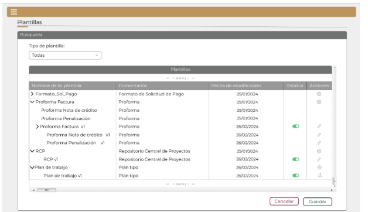

||Administración General de Comunicaciones y Tecnologías de la Información|
| :- | -: |
||Marco Documental 7.0|
|Fecha de aprobación del Template: 02/08/2023|
**Especificación de Interacción de Usuario**

17\_3083\_EIU\_AdministradorDeFormatosImpresion.docx
|Versión del template: 7.00|
| :-: | :-: | :-: |

**<ID Requerimiento>** 8309

**Nombre del Requerimiento:** TI\_SISECOFI-SAT\_Seguimiento financiero y control documental de proyectos de contratación

## **Tabla de Versiones y Modificaciones**

|Versión|Descripción del cambio|Responsable de la Versión|Fecha|
| :-: | :-: | :-: | :-: |
|*1*|*Creación del documento*|Isabel Adriana Valdez Cortés|*27/01/2024*|
|*1.1*|*Revisión del documento*|Luis Angel Olguin Castillo|*12/02/2024*|
|*1.2*|*Versión aprobada para firma*|
María del Carmen Castillejos Cárdenas

Rubén Delgado Ramírez
|*31/05/2024*|

**TABLA DE CONTENIDO**

[Tabla de Versiones y Modificaciones	1](#_toc168395304)

[Módulo: Plantillas	2](#_toc168395305)

[ESTILOS 01	2](#_toc168395306)

[Descripción de Elementos	3](#_toc168395307)

[Descripción de Campos	4](#_toc168395308)

## **MÓDULO: PLANTILLAS**
## **ESTILOS 01**

|**Nombre de la Pantalla:** |Plantillas - Búsqueda|
| :- | :- |
|**Objetivo:**|
Permitir al Empleado SAT visualizar la información de las plantillas previamente cargadas, así como también permitirle agregar y editar las plantillas o cargar el plan tipo que requiera.

|
|**Casos de uso relacionados:**|17\_3083\_ECU\_AdministradorDeFormatosImpresion|
|||

**Nota:** Los datos mencionados en la tabla son solo de ejemplo.

### **DESCRIPCIÓN DE ELEMENTOS** 

|**Elemento**|**Descripción**|
| :- | :- |
|![Icono

Descripción generada automáticamente]|Opción que al seleccionarla muestra el menú principal desplegado en la parte izquierda de la pantalla; contiene los módulos principales y submódulos de este sistema. |
|Plantillas|Título del encabezado que identifica el submódulo a donde se está ingresando.|
|Búsqueda|Sección que permite visualizar los datos de las plantillas creadas para los formatos de impresión.|
|Tipo de plantilla:|Campo que permite seleccionar una opción para el tipo de plantilla. Se muestran las opciones: Formato\_Sol\_Pago, Proforma Factura, RCP, Plan de trabajo y Todas.|
|Plantillas|Título de la tabla que contiene los datos de la plantilla.|
||Paginador que permite navegar a través de las páginas resultantes de la consulta considerando que el sistema debe mostrar inicialmente 15 registros por página, permitiendo visualizar entre 15, 50 y 100 registros por página.|
|Nombre de la plantilla|Campo que muestra el nombre de la plantilla.|
|Comentarios|Campo que muestra los comentarios registrados para la plantilla.|
|Fecha de modificación|Campo que muestra la fecha registrada de la última modificación realizada a la plantilla.|
|Estatus|Campo que muestra el ícono ![ref1] para indicar el estatus de la plantilla ya sea “Activo” o “Inactivo”.|
|Acciones|Indica las acciones que se pueden realizar con las plantillas.|
|![ref2]|
Opción que despliega o contrae las filas de la tabla, tomando en cuenta lo siguiente: 

Fila contraída ![ref2] 

Fila desplegada![ref3] 
|
|![ref4]|
Opción que permite modificar el estatus del registro, ya sea activo o inactivo de la siguiente forma: 

- ` `Activo

Inactivo
|
|![ref5]|Opción que permite generar una nueva versión de la plantilla.|
|![ref6]|Opción que permite modificar una plantilla.|
|![ref7]|Opción que permite cargar un documento Excel.|
|![ref8]|Permite desplazarse de manera horizontal en la tabla.|
|![ref9]|Permite desplazarse de manera vertical en la tabla.|
|Cancelar|Opción que realiza el proceso para cancelar la acción y regresa al último estado guardado.|
|Guardar|Opción que inicia el proceso para almacenar en la base de datos (BD) la información de la “Plantilla” que se crea o modifica en cuanto al estatus.|
### **DESCRIPCIÓN DE CAMPOS**

|**Elemento**|**Tipo**|**Longitud**|
**Nivel de Acceso**

**(L, E, S)**
|**Descripción del Campo**|**Fórmulas**|**Precisiones**|
| :-: | :-: | :-: | :-: | :-: | :-: | :-: |
|![Icono

Descripción generada automáticamente]|Ícono|N/A|S|Muestra el menú principal desplegado en la parte izquierda de la pantalla.|N/A|N/A|
|Plantillas|Texto|N/A|L|Título del encabezado de la pantalla.|N/A|Para el encabezado puede hacerse uso de mayúsculas y minúsculas.|
|Búsqueda|Sección|N/A|L|Sección que permite visualizar los datos de las plantillas creadas para los formatos de impresión.|N/A|N/A|
|Tipo de plantilla:|Lista de selección|N/A|S|
Campo que permite seleccionar una opción para el tipo de plantilla.

Se muestran las opciones: Formato\_Sol\_Pago, Proforma Factura, RCP, Plan de trabajo y Todas.
|N/A|
La opción “Todas” debe estar seleccionada por defecto.

Al cambiar la selección, el sistema debe realizar la búsqueda automáticamente.
|
|Plantillas|Texto|N/A|L|Título de la tabla que contiene los datos de la plantilla.|N/A|Por defecto se muestran todas las plantillas que se encuentren generadas.|
||Paginador|N/A|S|Permite navegar a través de las páginas resultantes de la consulta.|N/A|Inicialmente se deben mostrar 15 registros por página, permitiendo visualizar entre 15, 50 y 100 registros por página.|
|Nombre de la plantilla|Texto|N/A|L|Campo que muestra el nombre de la plantilla.|N/A|N/A|
|Comentarios|Texto|N/A|L|Campo que muestra los comentarios registrados para la plantilla.|N/A|N/A|
|Fecha de modificación|Texto|10|L|Campo que muestra la fecha registrada de la última modificación realizada a la plantilla.|N/A|Formato de fecha DD/MM/AAAA|
|Estatus|Texto|N/A|L|Campo que muestra el ícono ![ref1] para indicar el estatus de la plantilla ya sea “Activo” o “Inactivo”.|N/A|N/A|
|Acciones|Texto|N/A|L|Indica las acciones que se pueden realizar con las plantillas.|N/A|N/A|
|![ref2]|Ícono|N/A|S|Opción que despliega o contrae las filas de la tabla.|N/A|
Fila contraída ![ref2]

Fila desplegada![ref3]
|
|![ref4]|Ícono|N/A|S|Opción que permite modificar el estatus del registro, ya sea activo o inactivo.|N/A|
Activo

Inactivo 
|
|![ref5]|Ícono|N/A|S|Opción que permite generar una nueva versión de la plantilla.|N/A|Usar *tooltip* que muestre el nombre de la opción “Nuevo”.|
|![ref6]|Ícono|N/A|S|Opción que permite modificar una plantilla.|N/A|Usar *tooltip* que muestre el nombre de la opción “Editar”.|
|![ref10]|Ícono|N/A|S|Opción que permite cargar un documento.|N/A|
Usar *tooltip* que muestre el nombre de la opción “Cargar plan tipo”.

Únicamente se muestra para la plantilla “Plan de trabajo”.
|
|![ref8]|Barra de desplazamiento|N/A|S|Permite desplazarse de manera horizontal en la tabla.|N/A|N/A|
|![ref9]|Barra de desplazamiento|N/A|S|Permite desplazarse de manera vertical en la tabla.|N/A|N/A|
|Cancelar|Botón|N/A|S|Opción que realiza el proceso para cancelar la acción y regresa al último estado guardado.|N/A|Inicialmente se muestra sin color de fondo y con el texto y contorno en color guinda (#691c32). Cuando se le pone el cursor encima debe cambiar a fondo guinda (#691c32) y letras blancas|
|Guardar|Botón|N/A|S|Opción que inicia el proceso para almacenar en la base de datos (BD) la información de la “Plantilla” que se crea o modifica en cuanto al estatus.|N/A|Inicialmente se muestra sin color de fondo y con el texto y contorno en color verde oscuro (#10312B). Cuando se le pone el cursor encima debe cambiar a fondo verde oscuro (#10312B) y letras blancas.|

Anexo - Ejemplos de botones

Las acciones de cada botón se definen en los estilos correspondientes.

|**FIRMAS DE CONFORMIDAD**||
| :-: | :- |
|**Firma 1** |**Firma 2** |
|**Nombre**: María del Carmen Castillejos Cárdenas.|**Nombre**: Rubén Delgado Ramírez.|
|**Puesto**: Usuaria ACPPI.|**Puesto**: Usuario ACPPI.|
|**Fecha:**|**Fecha:**|
|||
|**Firma 3** |**Firma 4**|
|**Nombre**: Rodolfo López Meneses.|**Nombre**: Diana Yazmín Pérez Sabido.|
|**Puesto**: Usuario ACPPI.|**Puesto**: Usuaria ACPPI.|
|**Fecha:**|**Fecha:**|
|||
|**Firma 5**|**Firma 6**|
|**Nombre**: Yesenia Helvetia Delgado Naranjo.|**Nombre:** Alejandro Alfredo Muñoz Núñez.|
|**Puesto**: APE ACPPI.|**Puesto:** RAPE ACPPI.|
|**Fecha**:|**Fecha**:|
|||
|**Firma 7**|**Firma 8**|
|**Nombre**: Luis Angel Olguin Castillo.|**Nombre**: Erick Villa Beltrán.|
|**Puesto**: Enlace ACPPI.|**Puesto**: Líder APE SDMA 6.|
|**Fecha**:|**Fecha**:|
|||
|**Firma 9**|**Firma 10**|
|**Nombre:** Juan Carlos Ayuso Bautista.|**Nombre:** Isabel Adriana Valdez Cortés.|
|**Puesto:** Líder Técnico SDMA 6.|**Puesto:** Analista de Sistemas DS SDMA 6. |
|**Fecha**:|**Fecha**:|
|||

|||Página 6 de 6|
| :- | :-: | -: |

[Icono

Descripción generada automáticamente]: Aspose.Words.33e097b1-1d42-4f8b-a720-8917318450ba.003.png
[ref1]: Aspose.Words.33e097b1-1d42-4f8b-a720-8917318450ba.005.png
[ref2]: Aspose.Words.33e097b1-1d42-4f8b-a720-8917318450ba.006.png
[ref3]: Aspose.Words.33e097b1-1d42-4f8b-a720-8917318450ba.007.png
[ref4]: Aspose.Words.33e097b1-1d42-4f8b-a720-8917318450ba.008.png
[ref5]: Aspose.Words.33e097b1-1d42-4f8b-a720-8917318450ba.010.png
[ref6]: Aspose.Words.33e097b1-1d42-4f8b-a720-8917318450ba.011.png
[ref7]: Aspose.Words.33e097b1-1d42-4f8b-a720-8917318450ba.012.png
[ref8]: Aspose.Words.33e097b1-1d42-4f8b-a720-8917318450ba.013.png
[ref9]: Aspose.Words.33e097b1-1d42-4f8b-a720-8917318450ba.014.png
[ref10]: Aspose.Words.33e097b1-1d42-4f8b-a720-8917318450ba.018.png
