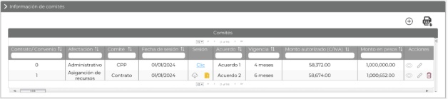
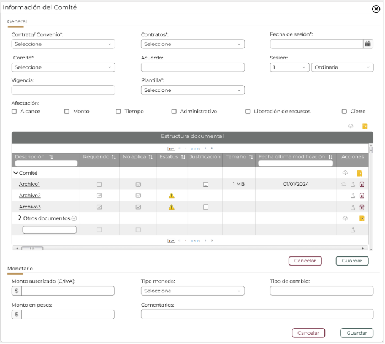
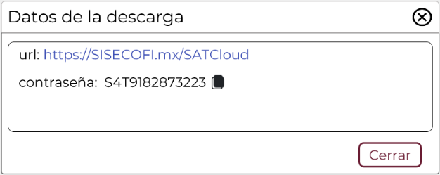
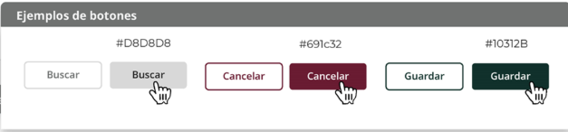

||Administración General de Comunicaciones y Tecnologías de la Información|
| :- | -: |
||Marco Documental 7.0|
|Fecha de aprobación del Template: 02/08/2023|
**Especificación de Interacción de Usuario**

17\_3083\_EIU\_AdministrarInfoComites.docx
|Versión del template: 7.00|
| :-: | :-: | :-: |

**<ID Requerimiento>8309**

**Nombre del Requerimiento:** TI\_SISECOFI-SAT\_Seguimiento financiero y control documental de proyectos de contratación

## **Tabla de Versiones y Modificaciones**

|Versión|Descripción del cambio|Responsable de la Versión|Fecha|
| :-: | :- | :- | :- |
|*1*|*Creación del documento*|Eduardo Acosta Mora|31//01/2024|
|*1.1*|*Revisión del documento*|Luis Angel Olguin Castillo|11/03/2024|
|*1.2*|*Versión aprobada para firma*|
María del Carmen Castillejos Cárdenas

Rubén Delgado Ramírez
|28/05/2024|

**TABLA DE CONTENIDO**

[Tabla de Versiones y Modificaciones	1](#_toc167978337)

[Módulo: INFORMACIÓN DE COMITÉS	2](#_toc167978338)

[ESTILOS 01	2](#_toc167978339)

[Descripción de Elementos	3](#_toc167978340)

[Descripción de Campos	4](#_toc167978341)

[ESTILOS 02	9](#_toc167978342)

[Descripción de Elementos	10](#_toc167978343)

[Descripción de Campos	12](#_toc167978344)

[ESTILOS 03	21](#_toc167978345)

[Descripción de Elementos	22](#_toc167978346)

[Descripción de Campos	22](#_toc167978347)

## **MÓDULO**: **INFORMACIÓN DE COMITÉS**
## **ESTILOS 01**

|**Nombre de la Pantalla**:|Comités|
| :- | - |
|**Objetivo**:|Permitir al Empleado SAT visualizar la información general de los comités|
|**Casos de uso relacionados**:|17\_3083\_ECU\_AdministrarInfoComites|
|||

### **DESCRIPCIÓN DE ELEMENTOS** 

|**Elemento**|**Descripción**|
| :- | :- |
|Información de comités|Sección que permite administrar la información de comités.|
|![ref1]|
Opción que despliega o contrae la sección, tomando en cuenta lo siguiente:

Sección contraída ![Forma

Descripción generada automáticamente con confianza baja]

Sección desplegada ![Forma

Descripción generada automáticamente con confianza baja]
|
|![ref2]|Opción que permite crear un nuevo comité.|
|![ref3]|Opción que permite la descarga en formato XLSX de la información de la tabla “Comités”.|
|Comités|Título de la tabla, la cual muestra la información de los comités.|
|![ref4]|Paginador que permite navegar a través de las páginas resultantes de la consulta, considerando que el sistema debe mostrar inicialmente 15 registros por página, permitiendo visualizar entre 15, 50 y 100 registros por página.|
|Contrato/ Convenio|Indica el Contrato/Convenio del comité.|
|Afectación|Indica la afectación del comité.|
|Comité|Indica el nombre del comité.|
|Fecha de sesión|Indica la fecha de sesión del comité.|
|Sesión|Indica el enlace de descarga o los íconos del tipo de descarga a realizar.|
|Acuerdo|Indica el acuerdo del comité.|
|Vigencia|Indica la vigencia del acuerdo.|
|Monto autorizado (C/IVA)|Indica el monto autorizado (con IVA).|
|Monto en pesos|Indica el monto en moneda nacional mexicana.|
|Acciones|Indica las acciones que se pueden hacer con los registros mediante las opciones ![ref5] , ![ref6]  y ![ref7].|
|![ref8]|Opción que ordena la información de la tabla de forma ascendente o descendente y de forma alfabética, según aplique.|
|![ref9]![ref9]![ref10]|Campo que permite filtrar la información de la columna en la que se requiere buscar específicamente.|
|![ref11]|Opción que permite visualizar el detalle de la información del comité, sin la posibilidad de editarla.|
|![ref12]|Opción que permite editar los registros en la tabla.|
|![ref13]|
Opción que permite eliminar los registros en la tabla.  

**Nota:** solo aparecerá en el último registro ingresado.
|
|` `![ref14]|
Opción que permite la descarga masiva en .ZIP,  se exportarán todos los documentos de la carpeta asociada a la fase “Comité”.

**Nota:** este ícono aparecerá cuando haya más de 2 archivos adjuntos. 
|
|![ref15]|
Opción que permite descargar la documentación de la carpeta asociada a la fase “Comité” mediante la descarga SATCloud.

**Nota:** este ícono aparecerá cuando haya más de 2 archivos adjuntos.
|
|![ref16]|Permite desplazarse de manera horizontal en la tabla.|
|![ref17]|Permite desplazarse de manera vertical en la tabla. |

### **DESCRIPCIÓN DE CAMPOS**

|**Elemento**|**Tipo**|**Longitud**|
**Nivel de Acceso**

**(L, E, S)**
|**Descripción del Campo**|**Fórmulas**|**Precisiones**|
| :-: | :-: | :-: | :-: | :-: | :-: | :-: |
|Información de comités|Sección|N/A|S|Sección que permite administrar la información de comités.|N/A|N/A|
|![ref1]|Ícono|N/A|S|Opción que despliega o contrae la sección.|N/A|
Sección contraída ![Forma

Descripción generada automáticamente con confianza baja]

Sección desplegada ![Forma

Descripción generada automáticamente con confianza baja]
|
|![ref2]|Ícono|N/A|S|Opción que permite crear un nuevo comité.|N/A|Usar *tooltip* que muestre el nombre de la opción “Nuevo”.|
|![ref3]|Ícono|N/A|S|Opción que permite la descarga en formato XLSX de la información de la tabla “Comités”.|N/A|Usar *tooltip* que muestre el nombre de la opción “Exportar a Excel”.|
|Comités|Texto|N/A|L|Título de la tabla, la cual muestra la información de los comités.|N/A|N/A|
|![ref4]|Paginador|N/A|S|Permite navegar a través de las páginas resultantes de la consulta.|N/A|Inicialmente se deben mostrar 15 registros por página, permitiendo seleccionar el visualizar 15, 50 y 100 registros por página.|
|Contrato convenio|Numérico|2|L|Campo que indica el Contrato/Convenio del comité.|N/A|N/A|
|Afectación|Alfanumérico|N/A|L|Campo que indica la afectación del comité.|N/A|N/A|
|Comité|Alfanumérico|N/A|L|Campo que indica el nombre del comité.|N/A|N/A|
|Fecha de sesión|Fecha|10|L|Campo que indica la fecha de sesión del comité.|N/A|Formato de fecha DD/MM/AAAA|
|Sesión|Alfanumérico|N/A|S|Indica el enlace de descarga o los íconos del tipo de descarga a realizar.|N/A|N/A|
|Acuerdo|Alfanumérico|100|L|Indica el acuerdo del comité.|N/A|N/A|
|Vigencia|Alfanumérico|100|L|Indica la vigencia del acuerdo.|N/A|N/A|
|Monto autorizado (con IVA)|Numérico (decimal)|14|L|Campo que indica el monto autorizado (con IVA).|N/A|
Muestra el valor con formato $ 0.00 que comprende 12 enteros con separación de miles y 2 decimales. Ejemplo:

$999,999,999,999.00.
|
|Monto en pesos|Numérico (decimal)|14|L|Campo que indica el monto en moneda nacional mexicana.|Monto en pesos= ((Monto autorizado(C/IVA)) \* (Tipo de cambio))|Muestra el valor con formato $ 0.00 que comprende 12 enteros con separación de miles y 2 decimales. Ejemplo: $999,999,999,999.00.|
|Acciones|Texto|N/A|L|Indica las acciones que se pueden hacer con los registros mediante las opciones ![ref6], ![ref5]  y ![ref7].|N/A|N/A|
|![ref8]|Ícono|N/A|S|Opción que ordena la información de la tabla de forma ascendente o descendente y de forma alfabética, según aplique.|N/A|N/A|
|![ref9]![ref18]|Filtro|N/A|E|Campo que permite filtrar la información de la columna en la que se requiere buscar específicamente.|N/A|Realiza el filtro de la información solo dentro de la página que se visualiza.|
|![ref11]|Ícono|N/A|S|Opción que permite visualizar el detalle de la información del comité, sin la posibilidad de editarla.|N/A|Usar *tooltip* que muestre el nombre de la opción “Vista previa”.|
|![ref12]|Ícono|N/A|S|Opción que permite editar los registros en la tabla.|N/A|Usar *tooltip* que muestre el nombre de la opción “Editar”.|
|![ref13]|Ícono|N/A|S|
Opción que permite eliminar los registros en la tabla.

|N/A|
Solo aparecerá en el último registro ingresado.

Usar *tooltip* que muestre el nombre de la opción “Eliminar”.
|
|![ref14]|Ícono|N/A|S|Opción que permite la descarga masiva en .ZIP,  se exportarán todos los documentos de la carpeta asociada a la fase “Comité”.|N/A|
Este ícono aparecerá cuando haya más de 2 archivos adjuntos.

Usar *tooltip* que muestre el nombre de la opción “Descarga masiva”.
|
|![ref15]|Ícono|N/A|S|Opción que permite descargar la documentación de la carpeta asociada a la fase “Comité” mediante la descarga SATCloud.|N/A|
Este ícono aparecerá cuando haya más de 2 archivos adjuntos.

Usar *tooltip* que muestre el nombre de la opción “SATCloud”.
|
|![ref16]|Barra de desplazamiento|N/A|S|Permite desplazarse de manera horizontal en la tabla.|N/A|N/A|
|![ref17]|Barra de desplazamiento|N/A|S|Permite desplazarse de manera vertical en la tabla.|N/A|N/A|

## **ESTILOS 02**

|**Nombre de la Pantalla**:|Información del Comité|
| :- | - |
|**Objetivo**:|Permitir al Empleado SAT ingresar o modificar la información del Comité.|
|**Casos de uso relacionados**:|17\_3083\_ECU\_AdministrarInfoComites|
|||

**Nota:** Los datos mencionados en la tabla son solo de ejemplo.

### **DESCRIPCIÓN DE ELEMENTOS** 

|**Elemento**|**Descripción**|
| :- | :- |
|Información del Comité|Título de la ventana emergente.|
|![ref19]|Opción que permite cerrar la ventana emergente.|
|General|Título de la sección general.|
|Contratos /Convenio\*:|Campo que permite seleccionar una opción de contratos/convenios.|
|Contratos\*:|Campo que permite seleccionar una opción de contrato.|
|Fecha de sesión\*:|Campo que permite ingresar la fecha de sesión.|
|Comité\*:|Campo que permite seleccionar una opción de comité.|
|Acuerdo:|Campo que permite ingresar el acuerdo.|
|Sesión:|Campo que permite seleccionar una opción del número y el tipo de sesión.|
|Vigencia|Campo que permite ingresar la vigencia del acuerdo.|
|Plantilla\*:|Campo que permite seleccionar una opción para la plantilla de gestión documental.|
|Afectación\*:|Campo que permite seleccionar una o más afectaciones mediante las opciones ![ref20] y ![ref21] .|
|
![ref22]

![ref23]
|
Opción que permite seleccionar una afectación de la siguiente forma:

 Afectación seleccionada

![ref21] Afectación no seleccionada
|
|Estructura documental|Indica el título de la tabla que muestra los archivos adjuntos.|
|![ref24]|Opción que permite descargar la documentación de la carpeta asociada a la fase “Comité” mediante la descarga SATCloud.|
|![ref14]|Opción que permite la descarga masiva en .ZIP,  se exportarán todos los documentos de la carpeta asociada a la fase “Comité”.|
|Descripción|Nombre de la carpeta principal asociada a una fase o descripción del documento solicitado.|
|![ref25]![ref26]|Opción que permite colapsar el detalle de la carpeta asociada a la fase “Comité”.|
|
Requerido

![ref27]
|Se especifica si el documento es requerido. No editable, lo tomará de la plantilla asociada.|
|No aplica![ref28]|Campo de selección, que indica que el documento no es requerido en esta plantilla.|
|
Estatus

![ref29]
|Se mostrará un ícono para los documentos de tipo “Requerido” que no hayan sido cargados.|
|Justificación![ref30]|Opción que permite ver, capturar o editar la justificación de porque el documento no aplica.|
|Tamaño|Muestra el tamaño del documento cargado.|
|Fecha última modificación|Muestra la fecha de la última modificación del registro. Considerando la carga del documento, o eliminación.|
|Acciones|Campo donde se mostrarán las acciones a realizar por documento.|
|![ref24]|Opción que permite descargar la documentación de la carpeta asociada a la fase “Comité” mediante la descarga SATCloud.|
|![ref14]|Opción que permite la descarga masiva en .ZIP,  se exportarán todos los documentos de la carpeta asociada a la fase “Comité”.|
|![ref11]|Opción que permite ver el PDF del documento seleccionado.|
|![ref31]|Opción que permite adjuntar un archivo.|
|![ref13]|Opción que permite eliminar el documento actual.|
|![ref2]|Opción que permite agregar un nuevo documento, puede ser en la sección “Otros documentos” o en la sección “Otros documentos” de una fase en particular.|
|![ref4]|Paginador que permite navegar a través de las páginas resultantes de la consulta, considerando que el sistema debe mostrar inicialmente 15 registros por página, permitiendo visualizar entre 15, 50 y 100 registros por página.|
|![ref8]|Opción que ordena la información de la tabla de forma ascendente o descendente y de forma alfabética, según aplique. |
|![ref9]![ref9]![ref10]|Campo que permite filtrar la información de la columna en la que se requiere buscar específicamente. |
|Cancelar|Opción que realiza el proceso para cancelar la acción y regresa al último estado guardado. |
|Guardar|Opción que inicia el proceso para almacenar en la BD la información de los “Documentos modificados” para la sección “Información de comités”.|
|Monetario|Título de la sección monetario.|
|Monto autorizado (C/IVA)|Campo que permite seleccionar el monto autorizado con IVA.|
|Tipo moneda|Campo que permite seleccionar una opción para el tipo de moneda.|
|Tipo de cambio|Campo que permite ingresar el tipo de cambio, dependiendo de la opción seleccionada en el campo “Tipo de moneda”.|
|Monto pesos |Campo que indica la conversión del campo “Monto autorizado (C/IVA)” a pesos.|
|Comentarios|Campo que permite ingresar comentarios adicionales.|
|Cancelar|Opción que realiza el proceso para cancelar la acción y regresa al último estado guardado. |
|Guardar|Opción que inicia el proceso para almacenar en la base de datos (BD) la información del comité. |
### **DESCRIPCIÓN DE CAMPOS**

|**Elemento**|**Tipo**|**Longitud**|
**Nivel de Acceso**

**(L, E, S)**
|**Descripción del Campo**|**Fórmulas**|**Precisiones**|
| :-: | :-: | :-: | :-: | :-: | :-: | :-: |
|Información del Comité|Texto|N/A|L|Título de la ventana emergente.|N/A|N/A|
|![ref19]|Ícono|N/A|S|Opción que permite cerrar la ventana emergente.|N/A|Usar *tooltip* que muestre el nombre de la opción “Cerrar ventana”.|
|General|Texto|N/A|L|Título de la sección general.|N/A|N/A|
|Contratos /Convenio\*:|Lista de selección|N/A|S|Campo que permite seleccionar una opción de contratos/convenios.|N/A|Campo obligatorio.|
|Contratos\*:|Lista de selección|N/A|S|Campo que permite seleccionar una opción de contrato.|N/A|Campo obligatorio.|
|Fecha de sesión\*:|Fecha|10|E, S|Campo que permite ingresar la fecha de sesión.|N/A|
Formato de fecha DD/MM/AAAA

Campo obligatorio.
|
|Comité\*:|Lista de selección|N/A|S|Campo que permite seleccionar una opción de comité.|N/A|Campo obligatorio.|
|Acuerdo:|Alfanumérico|100|E|Campo que permite ingresar el acuerdo.|N/A|N/A|
|Sesión:|Lista de selección|N/A|E|Campo que permite seleccionar una opción del número y el tipo de sesión.|N/A|N/A|
|Vigencia|Alfanumérico|100|E|Campo que permite ingresar la vigencia del acuerdo.|N/A|N/A|
|Plantilla\*:|Lista de selección|N/A|S|Campo que permite seleccionar una opción para la plantilla de gestión documental.|N/A|Campo obligatorio.|
|Afectación\*:|Texto|N/A|E|Campo que permite seleccionar una o más afectaciones.|N/A|Campo obligatorio.|
|
![ref32]

![ref33]
| Casilla de selección|N/A|S|Opción que permite seleccionar una afectación.|N/A|
![ref34]Afectación seleccionada

![ref21]Afectación no seleccionada
|
|Estructura documental|Texto|N/A|E|Indica el título de la tabla que muestra los archivos adjuntos.|N/A|N/A|
|![ref24]|Ícono|N/A|S|Opción que permite descargar la documentación de la carpeta asociada a la fase “Comité” mediante la descarga SATCloud.|N/A|Usar *tooltip* que muestre el nombre de la opción “SATCloud”.|
|![ref14]|Ícono|N/A|S|Opción que permite la descarga masiva en .ZIP,  se exportarán todos los documentos de la carpeta asociada a la fase “Comité”.|N/A|Usar *tooltip* que muestre el nombre de la opción “Descarga masiva”.|
|Descripción|Texto|N/A|L|Nombre de la carpeta principal asociada a una fase o descripción del documento solicitado.|N/A|El valor del campo se tomará del campo “Descripción de los documentos” de la plantilla documental asociada.|
|![ref25]![ref26]|Ícono|N/A|S|Opción que permite colapsar el detalle de la carpeta asociada a la fase “Comité”.|N/A|N/A|
|
Requerido

![ref27]
|Ícono|N/A|L|Se especifica si el documento es requerido.|N/A|No editable, lo tomará de la plantilla asociada.|
|No aplica![ref28]|Ícono|N/A|L, S|Campo de selección, que indica que el documento no es requerido en esta plantilla.|N/A|
Si es seleccionado, aunque el check de requerido este encendido el documento no será obligatorio.

Solo podrá ser seleccionado por el rol que tenga permisos de carga o edición.
|
|
Estatus

![ref35]
|Ícono|N/A|L|Se mostrará un ícono para los documentos de tipo “Requerido” que no hayan sido cargados.|N/A|N/A|
|
Justificación

![ref30]
|Ícono|N/A|S|Opción que permite ver, capturar o editar la justificación de porque el documento no aplica.|N/A|Usar *tooltip* que muestre el nombre de la opción “Justificación”.|
|Tamaño|Texto|N/A|L|Muestra el tamaño del documento cargado.|N/A|Será asignado de manera automática consultando el tamaño del documento cargado.|
|Fecha última modificación|Fecha|10|L|Muestra la fecha de la última modificación del registro. Considerando la carga del documento, o eliminación.|N/A|Formato de fecha DD/MM/AAAA|
|Acciones|Texto|N/A|S|Campo donde se mostrarán las acciones a realizar por documento.|N/A|N/A|
|![ref24]|Ícono|N/A|S|Opción que permite descargar la documentación de la carpeta asociada a la fase “Comité” mediante la descarga SATCloud.|N/A|Usar *tooltip* que muestre el nombre de la opción “SATCloud”.|
|![ref14]|Ícono|N/A|S|Opción que permite la descarga masiva en .ZIP,  se exportarán todos los documentos de la carpeta asociada a la fase “Comité”.|N/A|Usar *tooltip* que muestre el nombre de la opción “Descarga masiva”.|
|![ref11]|Ícono|N/A|S|Opción que permite ver el PDF del documento seleccionado.|N/A|Usar *tooltip* que muestre el nombre de la opción “Ver documento”.|
|![ref31]|Ícono|N/A|S|Opción que permite cargar un nuevo documento.|N/A|
Usar *tooltip* que muestre el nombre de la opción “Cargar documento”.

Solo visible para el rol que tenga el permiso de carga de documentos.
|
|![ref13]|Ícono|N/A|S|Opción que permite eliminar el documento actual.|N/A|
Usar *tooltip* que muestre el nombre de la opción “Eliminar archivo cargado”.

Solo visible para el rol que tenga el permiso de eliminar de documentos
|
|![ref2]|Ícono|N/A|S|Opción que permite agregar un nuevo documento, puede ser en la sección “Otros documentos” o en la sección “Otros documentos” de una fase en particular.|N/A|que muestre el nombre de la opción “Nuevo documento”.|
|![ref4]|Paginador|N/A|S|Permite navegar a través de las páginas resultantes de la consulta.|N/A|Inicialmente se deben mostrar 15 registros por página, permitiendo visualizar entre 15, 50 y 100 registros por página.|
|![ref8]|Ícono|N/A|S|Opción que ordena la información de la tabla de forma ascendente o descendente y de forma alfabética, según aplique.|N/A|N/A|
|![ref9]![ref18]|Filtro|N/A|E|Campo que permite filtrar la información de la columna en la que se requiere buscar específicamente.|N/A|Realiza el filtro de la información solo dentro de la columna que se visualiza|
|Cancelar|Botón|N/A|S|

Opción que realiza el proceso para cancelar la acción y regresa al último estado guardado.
|N/A|
Inicialmente se muestra sin color de fondo y con el texto y contorno en color guinda (#691c32).

Cuando se le pone el cursor encima debe cambiar a fondo guinda (#691c32) y letras blancas.
|
|Guardar|N/A|S|Botón|Opción que inicia el proceso para almacenar en la BD la información de los “Documentos modificados” para la sección “Información de comités”.|N/A|
Inicialmente se muestra sin color de fondo y con el texto y contorno en color verde oscuro (#10312B).

Cuando se le pone el cursor encima debe cambiar a fondo verde oscuro (#10312B) y letras blancas.

Solo visible para el rol que tenga el permiso de carga,  edición, y eliminar documentos.
|
|Monetario|Texto|N/A|L|Título de la sección monetario.|N/A|N/A|
|Monto autorizado (C/IVA)|Numérico (decimal)|14|E|Campo que permite seleccionar el monto autorizado con IVA.|N/A|
Muestra el valor con formato $ 0.00 que comprende 12 enteros con separación de miles y 2 decimales. Ejemplo:

$999,999,999,999.00.
|
|Tipo moneda|Combo de selección|N/A|S|Campo que permite seleccionar una opción para el tipo de moneda.|N/A|N/A|
|Tipo de cambio|Numérico (decimal)|16|E|Campo que permite ingresar el tipo de cambio dependiendo de la opción seleccionada en el campo “Tipo de moneda”.|N/A|
Muestra el valor con formato $ 0.0000 que comprende 12 enteros con separación de miles y 4 decimales. Ejemplo:

$999,999,999,999.0000.
|
|Monto en pesos|Numérico (decimal)|14|E|Campo que indica la conversión del campo “Monto autorizado (C/IVA)” a pesos.|Monto en pesos = ((Monto autorizado(C/IVA)) \* (Tipo de cambio))|
Muestra el valor con formato $ 0.00 que comprende 12 enteros con separación de miles y 2 decimales. Ejemplo:

$999,999,999,999.00.
|
|Comentarios|Texto|2000|E|Campo que permite ingresar comentarios adicionales.|N/A|N/A|
|Cancelar|Botón|N/A|S|Opción que realiza el proceso para cancelar la acción y regresa al último estado guardado.|N/A|
Inicialmente se muestra sin color de fondo y con el texto y contorno en color guinda (#691c32).

Cuando se le pone el cursor encima debe cambiar a fondo guinda (#691c32) y letras blancas.
|
|Guardar|Botón|N/A|S|Opción que inicia el proceso para almacenar en la BD la información del comité.|N/A|
Inicialmente se muestra sin color de fondo y con el texto y contorno en color verde oscuro(#10312B).

Cuando se le pone el cursor encima debe cambiar a fondo verde oscuro(#10312B) y letras blancas.
|

## **ESTILOS 03**

|**Nombre de la Pantalla:**|Datos de la descarga|
| :- | :- |
|**Objetivo:**|Permite visualizar un documento PDF adjuntado.|
|**Casos de uso relacionados:**|17\_3083\_ECU\_AdministrarInfoComites|
|||

### **DESCRIPCIÓN DE ELEMENTOS** 

|**Elemento**|**Descripción**|
| :- | :- |
|Datos de descarga|Título de la ventana.|
|![ref36]|Opción que permite cerrar la ventana.|
|url|Campo que muestra la url de descarga de SATCloud.|
|contraseña|Campo que muestra la contraseña para descarga del archivo en SATCloud.|
|![ref37]|Opción que permite copiar la contraseña.|
|Cerrar|Opción que permite cerrar la ventana.|

### **DESCRIPCIÓN DE CAMPOS**

|**Elemento**|**Tipo**|**Longitud**|
**Nivel de Acceso**

**(L, E, S)**
|**Descripción del Campo**|**Fórmulas**|**Precisiones**|
| :-: | :-: | :-: | :-: | :-: | :-: | :-: |
|Datos de descarga|Texto|N/A|L|Título de la ventana.|N/A|N/A|
|![ref38]|Ícono|N/A|S|Opción que permite cerrar la ventana.|N/A|Usar *tooltip* que muestre el nombre de la opción “Cerrar ventana”.|
|Url|Texto|N/A|S|Campo que muestra la Url de descarga de SATCloud.|N/A|N/A|
|Contraseña|Texto|N/A|L|Campo que muestra la contraseña para descarga del archivo en SATCloud.|N/A|N/A|
|![ref37]|Ícono|N/A|S|Opción que permite copiar la contraseña.|N/A|N/A|
|Cerrar|Botón|N/A|S|Opción que permite cerrar la ventana.|N/A|
Inicialmente se muestra sin color de fondo y con el texto y contorno en color guinda (#691c32).

Cuando se le pone el cursor encima debe cambiar a fondo guinda (#691c32) y letras blancas.
|

Anexo - Ejemplos de botones

Las acciones de cada botón se definen en los Estilos correspondientes

|**FIRMAS DE CONFORMIDAD**||
| :-: | :- |
|**Firma 1** |**Firma 2** |
|**Nombre**: María del Carmen Castillejos Cárdenas.|**Nombre**: Rubén Delgado Ramírez.|
|**Puesto**: Usuaria ACPPI.|**Puesto**: Usuario ACPPI.|
|**Fecha:**|**Fecha:**|
|||
|**Firma 3** |**Firma 4**|
|**Nombre**: Rodolfo López Meneses.|**Nombre**: Diana Yazmín Pérez Sabido.|
|**Puesto**: Usuario ACPPI.|**Puesto**: Usuaria ACPPI.|
|**Fecha:**|**Fecha:**|
|||
|**Firma 5**|**Firma 6**|
|**Nombre**: Yesenia Helvetia Delgado Naranjo.|**Nombre:** Alejandro Alfredo Muñoz Núñez.|
|**Puesto**: APE ACPPI.|**Puesto:** RAPE ACPPI.|
|**Fecha**:|**Fecha**:|
|||
|**Firma 7**|**Firma 8**|
|**Nombre**: Luis Angel Olguin Castillo.|**Nombre**: Erick Villa Beltrán.|
|**Puesto**: Enlace ACPPI.|**Puesto**: Líder APE SDMA 6.|
|**Fecha**:|**Fecha**:|
|||
|**Firma 9**|**Firma 10**|
|**Nombre:** Juan Carlos Ayuso Bautista.|**Nombre:** Eduardo Acosta Mora.|
|**Puesto:** Líder Técnico SDMA 6.|**Puesto:** Analista SDMA 6.|
|**Fecha**:|**Fecha**:|
|||

|||Página 6 de 6|
| :- | :-: | -: |

[ref1]: Aspose.Words.70a134b4-e83d-4376-96de-066cd12ebcb7.003.png
[Forma

Descripción generada automáticamente con confianza baja]: Aspose.Words.70a134b4-e83d-4376-96de-066cd12ebcb7.004.png
[Forma

Descripción generada automáticamente con confianza baja]: Aspose.Words.70a134b4-e83d-4376-96de-066cd12ebcb7.005.png
[ref2]: Aspose.Words.70a134b4-e83d-4376-96de-066cd12ebcb7.006.png
[ref3]: Aspose.Words.70a134b4-e83d-4376-96de-066cd12ebcb7.007.png
[ref4]: Aspose.Words.70a134b4-e83d-4376-96de-066cd12ebcb7.008.png
[ref5]: Aspose.Words.70a134b4-e83d-4376-96de-066cd12ebcb7.009.png
[ref6]: Aspose.Words.70a134b4-e83d-4376-96de-066cd12ebcb7.010.png
[ref7]: Aspose.Words.70a134b4-e83d-4376-96de-066cd12ebcb7.011.png
[ref8]: Aspose.Words.70a134b4-e83d-4376-96de-066cd12ebcb7.012.png
[ref9]: Aspose.Words.70a134b4-e83d-4376-96de-066cd12ebcb7.013.png
[ref10]: Aspose.Words.70a134b4-e83d-4376-96de-066cd12ebcb7.014.png
[ref11]: Aspose.Words.70a134b4-e83d-4376-96de-066cd12ebcb7.015.png
[ref12]: Aspose.Words.70a134b4-e83d-4376-96de-066cd12ebcb7.016.png
[ref13]: Aspose.Words.70a134b4-e83d-4376-96de-066cd12ebcb7.017.png
[ref14]: Aspose.Words.70a134b4-e83d-4376-96de-066cd12ebcb7.018.png
[ref15]: Aspose.Words.70a134b4-e83d-4376-96de-066cd12ebcb7.019.png
[ref16]: Aspose.Words.70a134b4-e83d-4376-96de-066cd12ebcb7.020.png
[ref17]: Aspose.Words.70a134b4-e83d-4376-96de-066cd12ebcb7.021.png
[ref18]: Aspose.Words.70a134b4-e83d-4376-96de-066cd12ebcb7.022.png
[ref19]: Aspose.Words.70a134b4-e83d-4376-96de-066cd12ebcb7.024.png
[ref20]: Aspose.Words.70a134b4-e83d-4376-96de-066cd12ebcb7.025.png
[ref21]: Aspose.Words.70a134b4-e83d-4376-96de-066cd12ebcb7.026.png
[ref22]: Aspose.Words.70a134b4-e83d-4376-96de-066cd12ebcb7.027.png
[ref23]: Aspose.Words.70a134b4-e83d-4376-96de-066cd12ebcb7.028.png
[ref24]: Aspose.Words.70a134b4-e83d-4376-96de-066cd12ebcb7.030.png
[ref25]: Aspose.Words.70a134b4-e83d-4376-96de-066cd12ebcb7.031.png
[ref26]: Aspose.Words.70a134b4-e83d-4376-96de-066cd12ebcb7.032.png
[ref27]: Aspose.Words.70a134b4-e83d-4376-96de-066cd12ebcb7.033.png
[ref28]: Aspose.Words.70a134b4-e83d-4376-96de-066cd12ebcb7.034.png
[ref29]: Aspose.Words.70a134b4-e83d-4376-96de-066cd12ebcb7.035.png
[ref30]: Aspose.Words.70a134b4-e83d-4376-96de-066cd12ebcb7.036.png
[ref31]: Aspose.Words.70a134b4-e83d-4376-96de-066cd12ebcb7.037.png
[ref32]: Aspose.Words.70a134b4-e83d-4376-96de-066cd12ebcb7.038.png
[ref33]: Aspose.Words.70a134b4-e83d-4376-96de-066cd12ebcb7.039.png
[ref34]: Aspose.Words.70a134b4-e83d-4376-96de-066cd12ebcb7.040.png
[ref35]: Aspose.Words.70a134b4-e83d-4376-96de-066cd12ebcb7.041.png
[ref36]: Aspose.Words.70a134b4-e83d-4376-96de-066cd12ebcb7.043.png
[ref37]: Aspose.Words.70a134b4-e83d-4376-96de-066cd12ebcb7.044.png
[ref38]: Aspose.Words.70a134b4-e83d-4376-96de-066cd12ebcb7.045.png
