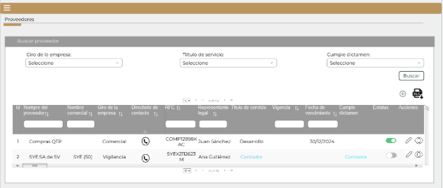
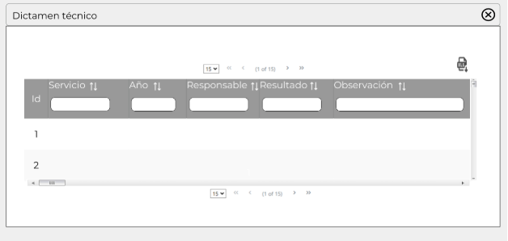

||Administración General de Comunicaciones y Tecnologías de la Información|
| :- | -: |
||Marco Documental 7.0|
|Fecha de aprobación del Template: 02/08/2023|
**Especificación de Interacción de Empleado SAT**

17\_3083\_EIU\_AltaDeProveedor.docx
|Versión del template: 7.00|
| :-: | :-: | :-: |

**<ID Requerimiento>** 8309

**Nombre del Requerimiento:** TI\_SISECOFI-SAT\_Seguimiento financiero y control documental de proyectos de contratación
## **Tabla de Versiones y Modificaciones**

|Versión|Descripción del cambio|Responsable de la Versión|Fecha|
| :- | :- | :-: | :-: |
|*1*|*Creación del documento*|Edgar Vergara Tadeo|*25/01/2024*|
|*1.1*|*Revisión del documento*|Luis Angel Olguin Castillo|*02/05/2024*|
|*1.2*|*Versión aprobada para firma*|
María del Carmen Castillejos Cárdenas

Rubén Delgado Ramírez
|*17/05/2024*|

**Tabla de Contenido**

[Tabla de Versiones y Modificaciones	1](#_toc166840786)

[Módulo: Proveedores	2](#_toc166840787)

[ESTILOS 01	2](#_toc166840788)

[Descripción de Elementos	2](#_toc166840789)

[Descripción de Campos	4](#_toc166840790)

[ESTILOS 02	11](#_toc166840791)

[Descripción de Elementos	12](#_toc166840792)

[Descripción de Campos	13](#_toc166840793)

[ESTILOS 03	17](#_toc166840794)

[Descripción de Elementos	17](#_toc166840795)

[Descripción de Campos	18](#_toc166840796)

[ESTILOS 04	22](#_toc166840797)

[Descripción de Elementos	22](#_toc166840798)

[Descripción de Campos	23](#_toc166840799)

[ESTILOS 05	27](#_toc166840800)

[Descripción de Elementos	27](#_toc166840801)

[Descripción de Campos	28](#_toc166840802)

## ** MÓDULO: PROVEEDORES**
##  **ESTILOS 01**

|**Nombre de la Pantalla:** |
Proveedores

|
| :- | :- |
|**Objetivo:**|
Permitir al Empleado SAT ingresar al módulo de proveedores, dar de alta nuevos registros y realizar su consulta.

|
|**Casos de uso relacionados:**|17\_3083\_ECU\_AltaDeProveedor|
|||

### **DESCRIPCIÓN DE ELEMENTOS** 

|**Elemento**|**Descripción**|
| :- | :- |
|

![ref1]
|Opción que al seleccionarla muestra el menú principal desplegado en la parte izquierda de la pantalla, contiene los módulos principales y submódulos del sistema.|
|Proveedores |Título del encabezado que contiene el nombre del módulo “Proveedores”.|
|Buscar proveedor|Nombre de la sección.|
|Giro de la empresa:|Opción vinculada al catálogo “Giro de la empresa”, permite filtrar la búsqueda por un valor contenido en dicho campo.|
|Título de servicio:|Opción vinculada al catálogo “Título de servicio”, permite filtrar la búsqueda por un valor contenido en dicho campo.|
|Cumple dictamen:|Opción vinculada al catálogo “Cumple dictamen”, permite filtrar la búsqueda por un valor contenido en dicho campo.|
|Buscar|Opción que permite iniciar la búsqueda de proveedores.|
||Opción que permite dar de alta un registro en el catálogo “Proveedores”.|
|![ref2]|Opción que permite exportar a Excel la información del catálogo “Proveedores” en un archivo Excel con extensión (.xlsx). Facilitando el análisis y visualización de datos. |
|Id|Número consecutivo, para cada uno de los registros del catálogo “Proveedores”.|
|Nombre del proveedor|Campo que contiene el nombre del proveedor registrado.|
|Nombre comercial|Campo que contiene el nombre comercial del proveedor registrado.|
|Giro de la empresa|Campo vinculado al catálogo “Giro de la empresa” que muestra el giro comercial del proveedor registrado.|
|Directorio de contacto ![Forma, Icono, Flecha

Descripción generada automáticamente]|Campo que contiene el hipervínculo al detalle del directorio de contacto del proveedor registrado.|
|RFC|Campo que contiene el RFC del proveedor registrado.|
|Representante legal|Campo que contiene el nombre del Representante legal del proveedor registrado.|
|Título de servicio|Campo que al seleccionarlo, envía a la pantalla de consulta de los títulos relacionados a un proveedor. |
|Vigencia |Campo que muestra el semáforo y el tiempo en meses respecto a la vigencia de los títulos asignados a un proveedor.|
|Fecha de vencimiento |Campo que contiene la fecha de vencimiento y el semáforo de los títulos asignados a un proveedor.|
|Cumple dictamen |Campo que al seleccionarlo, envía a la pantalla de consulta de los dictámenes técnicos relacionados a un proveedor.|
|Estatus ![ref3]|
Opción que muestra el estatus del registro a estado activo o inactivo de la siguiente forma: 

![ref4]Activo. 

![ref5]Inactivo. 
|
|Acciones |Campo que Indica las acciones que se pueden hacer con los registros mediante los iconos editar y visualizar.|
|![ref6]|Opción que permite al Empleado SAT editar un proveedor registrado. |
|![Forma, Círculo

Descripción generada automáticamente]|Opción que permite ver el detalle de la información de un proveedor, dicha información será de solo consulta. |
|![ref7]|Permite navegar a través de las páginas resultantes de la consulta, considerando que el sistema debe mostrar 15, 50 o 100 registros por página.|
|![ref8]|Opción que ordena la información de la tabla de forma ascendente o descendente y de forma alfabética, según aplique. |
|![ref9]|Campo que permite filtrar la información de la columna en la que se requiere buscar específicamente.|
###
### **DESCRIPCIÓN DE CAMPOS**
###
|**Elemento**|**Tipo**|**Longitud**|
**Nivel de Acceso**

**(L, E, S)**
|**Descripción del Campo**|**Fórmulas**|**Precisiones**|
| :-: | :-: | :-: | :-: | :-: | :-: | :-: |
|![ref1]|Ícono|N/A|S|Muestra el menú principal desplegado en la parte izquierda de la pantalla.|N/A|N/A|
|Proveedores|Texto|N/A|L|Título del encabezado que contiene el nombre del módulo “Proveedores”.|N/A|N/A|
|Buscar proveedor|Texto|N/A|L|Nombre de la sección.|N/A|N/A|
|Giro de la empresa:|Lista de selección |N/A|S|Opción vinculada al catálogo “Giro de la empresa”, permite filtrar la búsqueda por un valor contenido en dicho campo.|N/A|Opción de búsqueda, puede usarse de manera individual o combinada con los otros filtros.|
|Título de servicio:|Lista de selección |N/A|S|Opción vinculada al catálogo “Título de servicio”, permite filtrar la búsqueda por un valor contenido en dicho campo.|N/A|Opción de búsqueda, puede usarse de manera individual o combinada con los otros filtros.|
|Cumple dictamen:|Lista de selección |N/A|S|Opción vinculada al catálogo “Cumple dictamen”, permite filtrar la búsqueda por un valor contenido en dicho campo.|N/A|Opción de búsqueda, puede usarse de manera individual o anidar con los otros filtros.|
|Buscar|Botón|N/A|S|Opción que permite iniciar la búsqueda de proveedores.|N/A|
Inicialmente se muestra sin color de fondo y con contorno en color gris.

Cuando se pase el cursor encima debe cambiar con fondo gris.
|
||Ícono|N/A|S|Opción que permite dar de alta un registro en el catálogo de proveedores.|N/A|Usar el *tooltip* que muestre el nombre “Nuevo”.|
|![ref10]|Ícono|N/A|S|Opción que permite exportar información en un archivo Excel con extensión (.xlsx). |N/A|
Usar *tooltip* que muestre el nombre “Exportar a Excel”. 

  

|
|Id|Numérico|5|L|Número consecutivo, del proveedor.|N/A|N/A |
|Nombre del proveedor|Texto|250|L|Campo que contiene el nombre del proveedor registrado.|N/A|N/A|
|Nombre comercial|Texto|100|L|Campo que contiene el nombre comercial del proveedor registrado.|N/A|N/A|
|Giro de la empresa|Texto |N/A|L|Campo vinculado al catálogo “Giro de la empresa” que muestra el giro comercial del proveedor registrado.|N/A|N/A|
|![Forma, Icono, Flecha

Descripción generada automáticamente]|Ícono|N/A|S|Campo que contiene el hipervínculo al detalle del directorio de contacto del proveedor registrado.|N/A|
Al hacer clic, se mostrará la pantalla “Directorio de contacto.

Usar el *tooltip* “Directorio de contacto”.
|
|RFC|Alfanumérico|13|L|Campo que contiene el RFC del proveedor registrado.|N/A|N/A|
|Representante legal|Texto|N/A|L|Campo que contiene el nombre del Representante legal del proveedor registrado.|N/A|N/A|
|Título de servicio|Texto|N/A|L|Campo que al seleccionarlo envía a la pantalla de consulta de los títulos relacionados a un proveedor.|N/A|
Es un contador que enumerará el total de títulos asociados a un proveedor. 

Si solo contiene un valor dentro de la tabla de información de títulos, mostrará el valor del campo “Título de servicio”.

Al dar clic abrirá la pantalla de detalle “Títulos de servicio”. 

Usar el *tooltip* “Títulos de servicio”.
|
|Vigencia |Ícono|N/A|L|Campo que muestra el tiempo en meses y el semáforo del título asignados a un proveedor.|N/A|

Si el campo “Vencimiento de título” de la sección Información de títulos” es posterior a 3 meses respecto a la fecha actual, se mostrará en color rojo.

Si el campo “Vencimiento de título” de la sección Información de títulos” es menor a 3 meses respecto a la fecha actual, se mostrará en color blanco.

Usar el *tooltip* “Vigencia”.

Si existe más de un título de servicio relacionado al proveedor el campo se mostrará vacío.
|
|Fecha de vencimiento |Fecha|10|L|Campo que contiene la fecha de vencimiento y el semáforo de los títulos asignados a un proveedor.|N/A|Formato de fecha DD/MM/AAAA|
|Cumple dictamen |Texto|N/A|L|Campo que muestra el valor del campo “Resultado” de la tabla “Dictamen técnico” del proveedor relacionado.|N/A|Mostrará el valor del campo “Resultado” de la tabla “Dictamen técnico” del proveedor relacionado, si existe más de un dictamen técnico se mostrará vacío.|
|Estatus![ref11]|Ícono|N/A|L|
Opción que muestra el estatus del registro de la siguiente forma: 

![ref4]Activo. 

![ref5]Inactivo. 

|N/A|N/A|
|Acciones |Texto|N/A|L|Muestra las acciones que se pueden hacer con los registros.|N/A|N/A|
|![ref12]|Ícono|N/A|S|Opción que permite al Empleado SAT editar un proveedor registrado.|N/A|Usar el *tooltip* “Editar”.|
|![ref13]|Ícono|N/A|S|Opción que permite ver el detalle de la información de un proveedor, sin embargo, dicha información será de solo consulta.|N/A|Usar el *tooltip* “Ver detalle”.|
|![ref14]|Paginador|N/A|S|Permite navegar a través de las páginas resultantes de la consulta, considerando que el sistema debe mostrar 15, 50 o 100 registros por página.|N/A|N/A|
|![ref8]|Ícono|N/A|S|Opción que permite el ordenamiento a partir del campo seleccionado.|N/A|Usar el *tooltip* “Ordenar”.|
|![ref15]|Filtro |N/A |E|Permite filtrar información de la columna donde se requiera buscar específicamente.|N/A|Realiza el filtro de la información solo dentro de la página que se visualiza.|
## **ESTILOS 02**

|**Nombre de la Pantalla:** |
Proveedor sección Datos generales

|
| :- | :- |
|**Objetivo:**|
Permitir al Empleado SAT agregar información de un proveedor.

|
|**Casos de uso relacionados:**|17\_3083\_ECU\_AltaDeProveedor|
|||
 

**Nota:** Los datos contenidos en las tablas son solo de ejemplo.
### **DESCRIPCIÓN DE ELEMENTOS** 

|**Elemento**|**Descripción**|
| :- | :- |
|
![ref16]

|Opción que al seleccionarla muestra el menú principal desplegado en la parte izquierda de la pantalla, contiene los módulos principales y submódulos de este sistema. |
|Proveedor|Título del encabezado que identifica el módulo a donde ingresa el Empleado SAT “Proveedor”.|
|![ref17]|
Opción que despliega o contrae la sección, tomando en cuenta lo siguiente: 

Sección contraída![ref18] 

Sección desplegada ![ref19] 
|
|Datos generales|Nombre de la sección que se despliega al ser seleccionada.|
|Nombre del proveedor\*:|Campo que permite capturar el nombre del proveedor.|
|Nombre comercial\*:|Campo que permite capturar el nombre comercial del proveedor.|
|RFC:|Campo que permite capturar el RFC del proveedor.|
|Dirección:|Campo que permite capturar la dirección del proveedor.|
|Giro de la empresa\*:|Campo que permite seleccionar el giro de la empresa.|
|Comentarios:|Campo que permite registrar los comentarios asociados a un proveedor.|
|Id AGS:|Campo que permite ingresar el Id AGS.|
|Estatus\*: ![ref3]|
Opción que permite modificar el estatus del registro a estado activo o inactivo de la siguiente forma: 

![ref4]Activo

![ref5]Inactivo

|
|Cancelar|Opción que realiza el proceso para cancelar la acción y regresa al último estado guardado.|
|Guardar|Opción que inicia el proceso para almacenar en la BD la información ingresada.|
|Directorio de contacto|Sección de la pantalla que inicialmente se encontrará inhabilitada hasta que se guarden los datos generales del proveedor.|
|Títulos de servicio|Sección de la pantalla que inicialmente se encontrará inhabilitada hasta que se guarden los datos generales del proveedor.|
|Dictamen técnico.|Sección de la pantalla que inicialmente se encontrará inhabilitada hasta que se guarden los datos generales del proveedor.|
|Regresar|Opción que realiza el proceso para regresar a la pantalla de “Proveedores”. |

### **DESCRIPCIÓN DE CAMPOS**
###
|**Elemento**|**Tipo**|**Longitud**|
**Nivel de Acceso**

**(L, E, S)**
|**Descripción del Campo**|**Fórmulas**|**Precisiones**|
| :-: | :-: | :-: | :-: | :-: | :-: | :-: |
|![ref20]|Ícono|N/A|S|Muestra el menú principal desplegado en la parte izquierda de la pantalla, contiene los módulos principales y submódulos de este sistema.|N/A|N/A|
|Proveedor|Texto|N/A|L|Título que identifica el módulo a donde ingresa el Empleado SAT.|N/A|N/A|
|![ref17]|Ícono|N/A|S|Opción que despliega o contrae la sección. |N/A|
Sección contraída ![ref21] 

Sección desplegada ![ref22] 
|
|Datos generales|Sección|N/A|S|Nombre de la sección que al ser seleccionada se despliega.|N/A|N/A|
|Nombre del proveedor\*:|Texto|250|E|Campo que permite capturar el nombre del proveedor.|N/A|` `Campo obligatorio.|
|Nombre comercial\*:|Texto|100|E|Campo que permite capturar el nombre comercial del proveedor.|N/A|Campo obligatorio.|
|RFC:|Alfanumérico|13|E|Campo que permite capturar el RFC del proveedor.|N/A|N/A|
|Dirección:|Texto|250|E|Campo que permite capturar la dirección del proveedor.|N/A|N/A|
|Giro de la empresa\*:|Lista de selección |N/A|S|Campo que permite seleccionar el giro de la empresa.|N/A|
Campo obligatorio.

Campo vinculado al catálogo “Giro de la empresa”.
|
|Comentarios:|Texto|250|E|Campo que permite registrar los comentarios asociados a un proveedor.|N/A|N/A|
|Id AGS:|Numérico|9|E|Campo que permite ingresar el Id AGS.|N/A|N/A|
|Estatus\*:![ref23]|Ícono|N/A|S|Permite modificar el estatus del registro a estado activo o inactivo.|N/A|
Activo

![ref5]Inactivo

|
|Cancelar|Botón |N/A|S|Opción que realiza el proceso para cancelar la acción y regresa al último estado guardado.|N/A|
Inicialmente se muestra sin color de fondo y con contorno y letras en color guinda (#691c32). 

Cuando se le pone el cursor encima debe cambiar a fondo guinda (#691c32) y letras blancas. 
|
|Guardar|Botón |N/A|S|Opción que inicia el proceso para almacenar en la BD la información ingresada.|N/A|
Inicialmente se muestra sin color de fondo y con contorno y letras en color verde oscuro (#10312B). 

Cuando se le pone el cursor encima debe cambiar a fondo verde oscuro (#10312B) y letras blancas. 
|
|Directorio de contacto|Sección|N/A|L|Sección de la pantalla que inicialmente se encontrará inhabilitada hasta que se guarden los datos generales del proveedor.|N/A|N/A|
|Títulos de servicio|Sección|N/A|L|Sección de la pantalla que inicialmente se encontrará inhabilitada hasta que se guarden los datos generales del proveedor.|N/A|N/A|
|Dictamen técnico|Sección|N/A|L|Sección de la pantalla que inicialmente se encontrará inhabilitada hasta que se guarden los datos generales del proveedor.|N/A|N/A|
|Regresar |Botón  |N/A |S |Opción que realiza el proceso para regresar a la pantalla de “Proveedores”  |N/A |
Inicialmente se muestra sin color de fondo y con el texto y contorno en color guinda (#691c32). 

Cuando se le pone el cursor encima debe cambiar a fondo guinda (#691c32) y letras blancas. 

 
|

## **ESTILOS 03**

|**Nombre de la Pantalla:** |
Directorio de contacto

|
| :- | :- |
|**Objetivo:**|
Pantalla emergente que se abrirá al seleccionar el ícono ![ref24], muestra la información histórica del directorio de un proveedor.

|
|**Casos de uso relacionados:**|17\_3083\_ECU\_AltaDeProveedor|
|||

 

**Nota:** Los datos mencionados en la tabla son solo de ejemplo.

### **DESCRIPCIÓN DE ELEMENTOS** 

|**Elemento**|**Descripción**|
| :- | :- |
|Directorio de contacto.|Título que identifica el submódulo a donde ingresa el Empleado SAT.|
|Id |Campo incremental que se asigna de manera automática para identificar el contacto ingresado.|
|Nombre del contacto|Campo que muestra los registros históricos del campo nombre del contacto de los contactos almacenados.|
|Teléfono oficina|Campo que muestra los registros históricos del campo Teléfono oficina de los contactos almacenados.|
|Teléfono celular|Campo que muestra los registros históricos del campo Teléfono celular de los contactos almacenados.|
|Correo electrónico|Campo que muestra los registros históricos del campo Correo electrónico de los contactos almacenados.|
|Representante legal ![Imagen que contiene Icono

Descripción generada automáticamente][ref3]|
Opción que muestra el estatus del registro de la siguiente forma: 

![ref4]Sí

![ref5]No
|
|Comentarios |Campo que permite visualizar los comentarios relacionados al contacto.|
|![ref25]|Opción que permite exportar la información de la sección “Directorio de contacto” del proveedor seleccionado en un archivo Excel con extensión (.xlsx). |
|![ref7]|Paginador que permite navegar a través de las páginas resultantes de la consulta, considerando que el sistema debe mostrar inicialmente 15 registros por página, permitiendo visualizar entre 15, 50 y 100 registros por página.|
|![ref8]|Opción que ordena la información de la tabla de forma ascendente o descendente y de forma alfabética, según aplique.|
|![ref9]|Campo que permite filtrar la información de la columna en la que se requiere buscar específicamente.|
|![ref26]|Opción que permite cerrar la pantalla emergente.|

### **DESCRIPCIÓN DE CAMPOS**

|**Elemento**|**Tipo**|**Longitud**|
**Nivel de Acceso**

**(L, E, S)**
|**Descripción del Campo**|**Fórmulas**|**Precisiones**|
| :-: | :-: | :-: | :-: | :-: | :-: | :-: |
|Directorio de contacto|Texto|N/A|L|Nombre de la pantalla.|N/A|N/A|
|Id|Numérico|3|L|Campo muestra el número del contacto ingresado por proveedor.|N/A|N/A|
|Nombre del contacto|Texto|250|L|Campo que muestra los registros históricos del campo “Nombre del contacto” de los contactos almacenados.|N/A|N/A|
|Teléfono oficina|Texto|50|L|Campo que muestra los registros históricos del campo “Teléfono oficina” de los contactos almacenados.|N/A|N/A|
|Teléfono celular|Texto|20|L|Campo que muestra los registros históricos del campo “Teléfono celular” de los contactos almacenados.|N/A|N/A|
|Correo electrónico|Texto|100|L|Campo que muestra los registros históricos del campo “Correo electrónico” de los contactos almacenados.|N/A|N/A|
|Representante legal![Icono

Descripción generada automáticamente][ref11]|Ícono|N/A|L|
Opción que muestra el estatus de la siguiente forma: 

![ref4]Sí

![ref5]No

|N/A|N/A|
|Comentarios |Texto|250|L|Campo que permite visualizar los comentarios relacionados al contacto.|N/A|N/A|
|![ref10]|Ícono|N/A|S|Opción que permite exportar la información de la sección “Directorio de contacto” del proveedor seleccionado en un archivo Excel con extensión(.xlsx). |N/A|
Usar *tooltip* que muestre el nombre “Exportar a Excel”. 

  

|
|![ref14]|Paginador  |N/A|S|Permite navegar a través de las páginas resultantes de la consulta. |N/A|Inicialmente se deben mostrar 15 registros por página, permitiendo visualizar entre 15, 50 y 100 registros por página.|
|![ref8]|Ícono |N/A |S |Opción que ordena la información de la tabla de forma ascendente o descendente y de forma alfabética, según aplique. |N/A |N/A |
|![ref15]|Filtro |N/A |E |Permite filtrar información de la columna donde se requiera buscar específicamente. |N/A |Realiza el filtro de la información solo dentro de la página que se visualiza. |
|![ref26]|Ícono|N/A|S|Cierra la ventana emergente.|N/A|N/A|

## **ESTILOS 04**

|**Nombre de la Pantalla:** |
Títulos de servicio

|
| :- | :- |
|**Objetivo:**|
Pantalla emergente que se abrirá al seleccionar el hipervínculo del contador “Título de servicio” del módulo Proveedores; muestra la información histórica de títulos relacionados a un proveedor.

|
|**Casos de uso relacionados:**|17\_3083\_ECU\_AltaDeProveedor|
|||

Nota: Los datos mencionados en la tabla son solo de ejemplo.

### **DESCRIPCIÓN DE ELEMENTOS** 

|**Elemento**|**Descripción**|
| :- | :- |
|Títulos de servicio|Título que identifica el submódulo a donde ingresa el Empleado SAT.|
|Id |Campo incremental que mostrará el número del título ingresado.|
|Número de título|Campo que muestra los registros históricos del campo “Número de título” de los títulos almacenados.|
|Título de servicio|Campo que muestra los registros históricos del campo “Título de servicio” de los títulos almacenados.|
|Comentarios|Campo que muestra los registros históricos del campo “Comentarios” de los títulos almacenados.|
|Estatus |Opción que, dependiendo la opción seleccionada en estatus, se muestra de un color diferente.|
|Fecha de vencimiento|Campo que muestra los registros históricos del campo “Fecha de vencimiento” de los títulos almacenados.|
|Vigencia|Opción que, dependiendo la vigencia del título, mostrará la duración en meses y se mostrará de un color diferente. |
|Acciones|Indica las acciones que se pueden hacer con los registros.|
|![ref2]|Opción que permite exportar a Excel la información del catálogo de proveedores en un archivo con extensión (.xlsx). Facilitando el análisis y visualización de datos. |
|![ref7]|Permite navegar a través de las páginas resultantes de la consulta considerando que el sistema debe mostrar 15, 50 o 100 registros por página.|
|![ref8]|Opción que ordena la información de la tabla de forma ascendente o descendente y de forma alfabética, según aplique.|
|![ref9]|Campo que permite filtrar la información de la columna en la que se requiere buscar específicamente.|
|![ref26]|Opción para cerrar la ventana emergente.|

### **DESCRIPCIÓN DE CAMPOS**

|**Elemento**|**Tipo**|**Longitud**|
**Nivel de Acceso**

**(L, E, S)**
|**Descripción del Campo**|**Fórmulas**|**Precisiones**|
| :-: | :-: | :-: | :-: | :-: | :-: | :-: |
|Títulos de servicio|Texto|N/A|L|Nombre de la pantalla.|N/A|N/A|
|Id|Alfanumérico|N/A|L|Campo incremental que se asigna de manera automática para identificar el título ingresado.|N/A|N/A|
|Número de título|Alfanumérico|N/A|E|Campo que muestra el Número de título.|N/A|N/A|
|Título del servicio|Texto|N/A|L|Campo que muestra el nombre corto del título del servicio.|N/A|Campo vinculado al catálogo “Título de servicio”.|
|Estatus|Texto|N/A|L|Muestra el estatus en el que se encuentra el título de servicio y un semáforo de colores dependiendo el estatus.|N/A|
Vigente

 

En opinión de CC

En revisión electrónica

![ref27]Rechazado por dictamen

|
|Fecha de vencimiento|Fecha|10|L|Campo que muestra los registros históricos del campo “Fecha de vencimiento” de los títulos almacenados.|N/A|
Formato de fecha DD/MM/AAAA.

|
|Vigencia|Texto|N/A|L|Opción que, dependiendo la vigencia del título, se mostrará la duración en meses y se muestra un semáforo dependiendo la duración de la vigencia.|N/A|

Si la fecha de vencimiento de títulos es menor a tres meses respecto a la fecha de hoy.

Ejemplo

![ref27]“2 meses”

Si la fecha de vencimiento de títulos es mayor r a tres meses respecto a la fecha de hoy

5 meses

|
|Comentarios|Texto|250|L|Muestra los comentarios asociados al título.|N/A|N/A|
|![ref10]|Ícono|N/A|S|Opción que permite Exportar la información de la sección “Títulos de servicio” del proveedor seleccionado en un archivo Excel con extensión (.xlsx). |N/A|
Usar *tooltip* que muestre el nombre “Exportar a Excel”. 

  

|
|![ref14]|Paginador |N/A |S |Permite navegar a través de las páginas resultantes de la consulta. |N/A |Inicialmente se deben mostrar 15 registros por página, permitiendo visualizar entre 15, 50 y 100 registros por página. |
|![ref8]|Ícono |N/A |S |Opción que ordena la información de la tabla de forma ascendente o descendente y de forma alfabética, según aplique. |N/A |N/A |
|![ref15]|Filtro |N/A |E |Permite filtrar información de la columna donde se requiera buscar específicamente. |N/A |Realiza el filtro de la información solo dentro de la página que se visualiza. |
|![ref26]|Ícono|N/A|S|Cierra la ventana emergente.|N/A|N/A|

## **ESTILOS 05**

|**Nombre de la Pantalla:** |
Dictamen técnico

|
| :- | :- |
|**Objetivo:**|
Pantalla emergente que se abrirá al seleccionar el contador “Cumple dictamen” de la tabla de “Proveedores”   . Muestra la información histórica de los dictámenes técnicos relacionados a un título.

|
|**Casos de uso relacionados:**|17\_3083\_ECU\_AltaDeProveedor|
|||

` `

**Nota:** Los datos mencionados en la tabla son solo de ejemplo.

### **DESCRIPCIÓN DE ELEMENTOS** 

|**Elemento**|**Descripción**|
| :- | :- |
|Dictamen técnico |Título que identifica el submódulo a donde ingresa el Empleado SAT.|
|Id |Campo que muestra el número de los dictámenes técnicos ingresados.|
|Servicio|Campo que muestra los registros históricos del campo “Servicio”, de los dictámenes técnicos almacenados.|
|Año|Campo que muestra los registros históricos del campo “Año”, de los dictámenes técnicos almacenados.|
|Responsable|Campo que muestra los registros históricos del campo “Responsable”, de los dictámenes técnicos almacenados.|
|Resultado|Campo que muestra los registros históricos del campo “Resultado”, de los dictámenes técnicos almacenados.|
|Observación |Campo que muestra los registros históricos del campo Observación de los dictámenes técnicos almacenados.|
|![ref2]|Opción que permite exportar la información de la sección “Dictamen técnico” del proveedor seleccionado en un archivo Excel con extensión (.xlsx). |
|![ref7]|Paginador que permite navegar a través de las páginas resultantes de la consulta, considerando que el sistema debe mostrar inicialmente 15 registros por página, permitiendo visualizar entre 15, 50 y 100 registros por página. |
|![ref8]|Opción que ordena la información de la tabla de forma ascendente o descendente y de forma alfabética, según aplique. |
|![ref9]|Campo que permite filtrar la información de la columna en la que se requiere buscar específicamente.|
|![ref26]|Opción para cerrar la ventana emergente.|
###
### **DESCRIPCIÓN DE CAMPOS**

|**Elemento**|**Tipo**|**Longitud**|
**Nivel de Acceso**

**(L, E, S)**
|**Descripción del Campo**|**Fórmulas**|**Precisiones**|
| :-: | :-: | :-: | :-: | :-: | :-: | :-: |
|Id|Numérico|3|L|Muestra el número del dictamen técnico ingresado.|N/A|N/A|
|Servicio|Texto|N/A|L|Campo que muestra el nombre corto del título de servicio solicitado relacionado al dictamen- proveedor.|N/A|N/A|
|Año|Numérico|4|L|Campo que muestra el “Año” de solicitud de dictamen relacionado al proveedor.|N/A|N/A|
|Responsable|Texto|N/A|L|Campo que muestra al “Responsable” relacionado al dictamen-proveedor.|N/A|N/A|
|Resultado|Texto|N/A|L|Campo que muestra el “Resultado” relacionado al dictamen-proveedor.|N/A|N/A|
|Observación |Texto|250|L|Campo que muestra las observaciones relacionadas al dictamen-proveedor.|N/A|N/A|
|![ref10]|Ícono|N/A|S|Opción que permite exportar la   información de la sección “Dictamen técnico” del proveedor seleccionado en un archivo Excel con extensión (.xlsx).|N/A|
Usar *tooltip* que muestre el nombre “Exportar a Excel”. 

  

|
|![ref14]|Paginador |N/A |S |Permite navegar a través de las páginas resultantes de la consulta. |N/A |Inicialmente se deben mostrar 15 registros por página, permitiendo visualizar entre 15, 50 y 100 registros por página. |
|![ref8]|Ícono |N/A |S |Opción que ordena la información de la tabla de forma ascendente o descendente y de forma alfabética, según aplique. |N/A |N/A |
|![ref15]|Filtro |N/A |E |Permite filtrar información de la columna donde se requiera buscar específicamente. |N/A |Realiza el filtro de la información solo dentro de la página que se visualiza. |
|![ref26]|Ícono|N/A|S|Cierra la ventana emergente.|N/A|N/A|
###
Anexo - Ejemplos de botones

Las acciones de cada botón se definen en los Estilos correspondientes.

|**FIRMAS DE CONFORMIDAD** ||
| :-: | :- |
|**Firma 1**  |**Firma 2**  |
|**Nombre**: María del Carmen Castillejos Cárdenas. |**Nombre**: Rubén Delgado Ramírez. |
|**Puesto**: Usuaria ACPPI. |**Puesto**: Usuario ACPPI. |
|**Fecha:** |**Fecha:** |
|  |  |
|**Firma 3**  |**Firma 4** |
|**Nombre**: Rodolfo López Meneses. |**Nombre**: Diana Yazmín Pérez Sabido. |
|**Puesto**: Usuario ACPPI. |**Puesto**: Usuaria ACPPI. |
|**Fecha:** |**Fecha:** |
|  |  |
|**Firma 5** |**Firma 6** |
|**Nombre**: Yesenia Helvetia Delgado Naranjo. |**Nombre:** Alejandro Alfredo Muñoz Núñez. |
|**Puesto**: APE ACPPI. |**Puesto:** RAPE ACPPI. |
|**Fecha**: |**Fecha**: |
|  |  |
|**Firma 7** |**Firma 8** |
|**Nombre**: Luis Angel Olguin Castillo. |**Nombre**: Erick Villa Beltrán. |
|**Puesto**: Enlace ACPPI. |**Puesto**: Líder APE SDMA 6. |
|**Fecha**: |**Fecha**: |
|**  |**  |
|**Firma 9** |**Firma 10** |
|**Nombre:** Juan Carlos Ayuso Bautista. |**Nombre:** Edgar Vergara Tadeo. |
|**Puesto:** Líder Técnico SDMA 6. |**Puesto:** Analista de Sistemas DS SDMA 6. |
|**Fecha**: |**Fecha**: |
|**  | |

|||Página 6 de 6|
| :- | :-: | -: |

[ref1]: Aspose.Words.f33b9c8c-986c-4c3f-a200-651da7db5b0f.003.png
[ref2]: Aspose.Words.f33b9c8c-986c-4c3f-a200-651da7db5b0f.005.png
[Forma, Icono, Flecha

Descripción generada automáticamente]: Aspose.Words.f33b9c8c-986c-4c3f-a200-651da7db5b0f.006.png
[ref3]: Aspose.Words.f33b9c8c-986c-4c3f-a200-651da7db5b0f.007.png
[ref4]: Aspose.Words.f33b9c8c-986c-4c3f-a200-651da7db5b0f.008.png
[ref5]: Aspose.Words.f33b9c8c-986c-4c3f-a200-651da7db5b0f.009.png
[ref6]: Aspose.Words.f33b9c8c-986c-4c3f-a200-651da7db5b0f.010.png
[Forma, Círculo

Descripción generada automáticamente]: Aspose.Words.f33b9c8c-986c-4c3f-a200-651da7db5b0f.011.png
[ref7]: Aspose.Words.f33b9c8c-986c-4c3f-a200-651da7db5b0f.012.png
[ref8]: Aspose.Words.f33b9c8c-986c-4c3f-a200-651da7db5b0f.013.png
[ref9]: Aspose.Words.f33b9c8c-986c-4c3f-a200-651da7db5b0f.014.png
[ref10]: Aspose.Words.f33b9c8c-986c-4c3f-a200-651da7db5b0f.016.png
[ref11]: Aspose.Words.f33b9c8c-986c-4c3f-a200-651da7db5b0f.019.png
[ref12]: Aspose.Words.f33b9c8c-986c-4c3f-a200-651da7db5b0f.020.png
[ref13]: Aspose.Words.f33b9c8c-986c-4c3f-a200-651da7db5b0f.021.png
[ref14]: Aspose.Words.f33b9c8c-986c-4c3f-a200-651da7db5b0f.022.png
[ref15]: Aspose.Words.f33b9c8c-986c-4c3f-a200-651da7db5b0f.023.png
[ref16]: Aspose.Words.f33b9c8c-986c-4c3f-a200-651da7db5b0f.025.png
[ref17]: Aspose.Words.f33b9c8c-986c-4c3f-a200-651da7db5b0f.026.png
[ref18]: Aspose.Words.f33b9c8c-986c-4c3f-a200-651da7db5b0f.027.png
[ref19]: Aspose.Words.f33b9c8c-986c-4c3f-a200-651da7db5b0f.028.png
[ref20]: Aspose.Words.f33b9c8c-986c-4c3f-a200-651da7db5b0f.029.png
[ref21]: Aspose.Words.f33b9c8c-986c-4c3f-a200-651da7db5b0f.030.png
[ref22]: Aspose.Words.f33b9c8c-986c-4c3f-a200-651da7db5b0f.031.png
[ref23]: Aspose.Words.f33b9c8c-986c-4c3f-a200-651da7db5b0f.032.png
[ref24]: Aspose.Words.f33b9c8c-986c-4c3f-a200-651da7db5b0f.034.png
[ref25]: Aspose.Words.f33b9c8c-986c-4c3f-a200-651da7db5b0f.036.png
[ref26]: Aspose.Words.f33b9c8c-986c-4c3f-a200-651da7db5b0f.037.png
[ref27]: Aspose.Words.f33b9c8c-986c-4c3f-a200-651da7db5b0f.042.png
