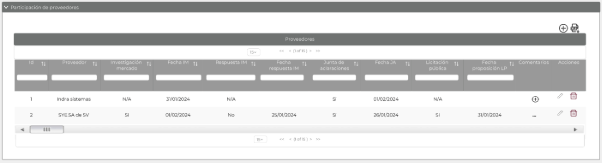
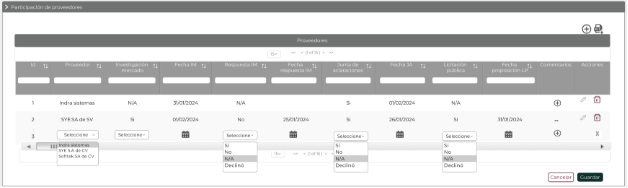

||Administración General de Comunicaciones y Tecnologías de la Información|
| :- | -: |
||Marco Documental 7.0|
|Fecha de aprobación del Template: 02/08/2023|
**Especificación de Interacción de Usuario**

17\_3083\_EIU\_AsignarProveedoresParticipantes.docx
|Versión del template: 7.00|
| :-: | :-: | :-: |

**<ID Requerimiento>** 8309

**Nombre del Requerimiento:** TI\_SISECOFI-SAT\_Seguimiento financiero y control documental de proyectos de contratación
## **Tabla de Versiones y Modificaciones**

|Versión|Descripción del cambio|Responsable de la Versión|Fecha|
| :- | :- | :-: | :-: |
|*1*|*Creación del documento.*|Osiris Vianey Segovia Pasarán|*11/02/2024*|
|*1.1*|*Revisión del documento.*|Luis Angel Olguín Castillo|*09/03/2024*|
|*1.2*|*Versión aprobada para firma.*|María del Carmen Castillejos Cárdenas Rubén Delgado Ramírez|*24/05/2024*|

**TABLA DE CONTENIDO**

[Tabla de Versiones y Modificaciones	1](#_toc166587354)

[Módulo: Proveedores Participantes	2](#_toc166587355)

[ESTILOS 01	2](#_toc166587356)

[Descripción de Elementos	2](#_toc166587357)

[Descripción de Campos	3](#_toc166587358)

[ESTILOS 02	10](#_toc166587359)

[Descripción de Elementos	10](#_toc166587360)

[Descripción de Campos	11](#_toc166587361)

[ESTILOS 03	20](#_toc166587362)

[Descripción de Elementos	20](#_toc166587363)

[Descripción de Campos	20](#_toc166587364)

## **MÓDULO: PROVEEDORES PARTICIPANTES**
## **ESTILOS 01**

|**Nombre de la Pantalla:** |Participación de proveedores.|
| :- | :- |
|**Objetivo:**|
Permitir al Empleado SAT administrar la sección de “Proveedores Participantes”.

|
|**Casos de uso relacionados:**|17\_3083\_ECU\_AsignarProveedoresParticipantes.|
|

||
|

||
|||

### **DESCRIPCIÓN DE ELEMENTOS** 

|**Elemento**|**Descripción**|
| :- | :- |
|Participación de proveedores|Sección que permite agregar proveedores a un proyecto. |
|![ref1] |
Opción que despliega o contrae la sección, tomando en cuenta lo siguiente: 

Sección contraída![ref2] 

Sección desplegada ![ref3] 
|
|![ref4]|Opción que permite agregar los proveedores en un proyecto específico.|
|![ref5]|Opción que permite exportar la información de la tabla “Proveedores”, generando un archivo de Excel con extensión (.xlsx).|
|Proveedores|Nombre de la tabla que contiene los proveedores.|
|Id|Campo incremental que permite visualizar el identificador asignado por el sistema para el proveedor. |
|Proveedor |Campo que permite visualizar el proveedor.|
|Investigación mercado|Campo que permite visualizar el dato de la participación del proveedor en la investigación de mercado (IM). |
|Fecha IM|Campo que permite visualizar la fecha de la participación del proveedor en la (IM) .|
|Respuesta IM|Campo que permite visualizar la respuesta del proveedor en la (IM).|
|Fecha respuesta IM|Campo que permite visualizar la fecha de respuesta del proveedor en la (IM).|
|Junta de aclaraciones|Campo que permite visualizar la asistencia del proveedor en la Junta de aclaraciones (JA).|
|Fecha JA|Campo que permite visualizar la fecha de asistencia del proveedor en la (JA).|
|Licitación pública|Campo que permite visualizar la asistencia del proveedor en la licitación pública.|
|Fecha proposición LP|Campo que permite visualizar la fecha de asistencia en la licitación pública.|
|Comentarios|El Empleado SAT debe seleccionar la opción ![ref6] para agregar un comentario.|
|![ref6]|Opción que permite agregar un comentario. |
|Acciones|Indica las acciones que se pueden hacer con los registros mediante los iconos “Editar” y “Eliminar”.|
||Opción que permite eliminar los registros en la tabla.|
|![ref7]|Opción que permite editar los registros en la tabla.|
|

![ref8]

|Opción que ordena la información de la tabla de forma ascendente o descendente y de forma alfabética, según aplique.|
|
![ref9]

|Campo que permite filtrar la información de la columna en la que se requiere buscar específicamente.|
|![ref10]|Paginador que permite navegar a través de las páginas resultantes de la consulta considerando que el sistema debe mostrar inicialmente 15 registros por página, permitiendo seleccionar visualizar: 15,50 y 100 registros por página.|
|![ref11]|Permite desplazarse horizontalmente en la información que muestra la tabla. |

### **DESCRIPCIÓN DE CAMPOS**

|**Elemento**|**Tipo**|**Longitud**|
**Nivel de Acceso**

**(L, E, S)**
|**Descripción del Campo**|**Fórmulas**|**Precisiones**|
| :-: | :-: | :-: | :-: | :-: | :-: | :-: |
|Participación de proveedores|Texto|N/A|L|
Sección que permite agregar

proveedores a un proyecto.
|N/A|N/A|
|![ref12] |Ícono |N/A |S |Opción que despliega o contrae la sección. |N/A |
Sección contraída ![ref13] 

Sección desplegada ![ref14] 
|
|![ref4]|Ícono|N/A|S|Opción que permite agregar un proveedor participante a un proyecto específico.|N/A|
Usar *tooltip* que muestre el nombre “Nuevo”.

|
|![ref5]|Ícono|N/A|S|Opción que permite exportar la información de la tabla “Proveedores”, generando un archivo de Excel con extensión (.xlsx).|N/A|
Usar *tooltip* que muestre el nombre “Exportar a Excel”.

|
|Proveedores|Texto|N/A|L|Nombre de la tabla que contiene los proveedores.|N/A|N/A|
|Id|Numérico|10|L|Campo incremental que permite visualizar el identificador asignado por el sistema para el proveedor.|N/A|N/A|
|Proveedor|Lista de selección|N/A|L|Campo que permite visualizar el proveedor.|N/A|
Se habilita cuando se agrega un proveedor o al seleccionar “Editar”.

Catálogo “Proveedores”.
|
|Investigación mercado|Lista de selección|N/A|L|Campo que permite visualizar el dato de la participación del proveedor en la investigación de mercado (IM).|N/A|
Se habilita cuando se agrega un proveedor o al seleccionar “Editar”.

Catálogo “Respuesta proveedor”.
|
|Fecha IM|Fecha|10|L|Campo que permite visualizar la fecha de la participación del proveedor en la (IM).|N/A|
Usar *tooltip* que muestre el nombre “Fecha de investigación de mercado”.

Fecha (DD/MM/AAAA).

Se habilita cuando se agrega un proveedor o al seleccionar “Editar”.
|
|Respuesta IM|Lista de selección|N/A|L|Campo que permite visualizar la respuesta del proveedor en la (IM).|N/A|
Usar *tooltip* que muestre el nombre “Respuesta de investigación de mercado”.

Fecha (DD/MM/AAAA). 

Se habilita cuando se agrega un proveedor o al seleccionar “Editar”.

Catálogo “Respuesta proveedor”.
|
|Fecha respuesta IM|Fecha|10|L|Campo que permite visualizar la fecha de respuesta del proveedor en la (IM).||
Usar *tooltip* que muestre el nombre “Fecha respuesta de investigación de mercado”.

Fecha (DD/MM/AAAA).

Se habilita cuando se agrega un proveedor o al seleccionar “Editar”.
|
|Junta de aclaraciones|Lista de selección|N/A|L|Campo que permite visualizar la asistencia del proveedor en la Junta de aclaraciones (JA).|N/A|
Se habilita cuando se agrega un proveedor o al seleccionar “Editar”.

Catálogo “Respuesta proveedor”.
|
|Fecha JA|Fecha|10|L|Campo que permite visualizar la fecha de asistencia del proveedor en la (JA).|N/A|

Usar *tooltip* que muestre el nombre “Fecha Junta de Aclaraciones”.

Fecha (DD/MM/AAAA).

Se habilita cuando se agrega un proveedor o al seleccionar “Editar”.
|
|Licitación pública|Lista de selección|N/A|L|Campo que permite visualizar la asistencia del proveedor en la licitación pública.|N/A|
Solo se habilita cuando se agrega un proveedor o al seleccionar “Editar”.

Catálogo “Respuesta proveedor”.
|
|Fecha proposición LP|Fecha|10|L|Campo que permite visualizar la fecha de asistencia en la licitación pública.|N/A|
Usar *tooltip* que muestre el nombre “Fecha proposición de Licitación Pública”.

Fecha (DD/MM/AAAA).

Se habilita cuando se agrega un proveedor o al seleccionar “Editar”.
|
|Comentarios|Texto|150|L|El Empleado SAT debe seleccionar la opción ![ref6] para agregar un comentario.|N/A|
Se abrirá una ventana emergente para ingresar un nuevo comentario.

` `Si ya tiene un comentario podrá mostrar y editar con tres (3) puntos suspensivos Ejemplo: “…”.

|
|![ref4]|Ícono|N/A|S|Opción que permite agregar un comentario. |N/A|
Usar *tooltip* que muestre el nombre “Nuevo comentario”.

Si ya tiene un comentario podrá mostrar y editar con tres (3) puntos suspensivos Ejemplo: “…”.

|
|![ref8]|Ordenador|N/A|S|Opción que ordena la información de la tabla de forma ascendente o descendente y de forma alfabética, según aplique.|N/A|Permite realizar un filtro y mostrar los datos en orden alfabético.|
|![ref9]|Filtro|N/A|E|Permite filtrar la información de la columna donde se requiera buscar específicamente.|N/A|Realiza el filtro de la información solo dentro de la página que se visualiza.|
|Acciones|Texto|N/A|L|Muestra las acciones que se pueden hacer con los registros mediante los iconos “Editar” y “Eliminar”.|N/A|N/A|
|
![ref15]

|Ícono|N/A|S|Permite eliminar los registros en la tabla.|N/A|
Usar el *tooltip* “Eliminar”.

Permite eliminar un proveedor de un proyecto.
|
|![ref16]|Ícono|N/A|S|Permite editar los registros en la tabla.|N/A|
Usar el *tooltip* “Editar”.

|
|![ref10]|Paginador|N/A|S|Permite navegar a través de las páginas resultantes de la consulta.|N/A|Inicialmente se deben mostrar 15 registros por página, permitiendo seleccionar el visualizar: 15,50,100 registros por página.|
|![ref17]|Barra de desplazamiento|N/A|S|Permite desplazarse de manera horizontal en la tabla.|N/A|N/A|

## **ESTILOS 02**

|**Nombre de la Pantalla:** |
Proveedores Participantes. 

|
| :- | :- |
|**Objetivo:**|
Permitir al Empleado SAT agregar los proveedores participantes en un proyecto.

|
|**Casos de uso relacionados:**|17\_3083\_ECU\_AsignarProveedoresParticipantes.|

###
### **DESCRIPCIÓN DE ELEMENTOS** 

|**Elemento**|**Descripción**|
| :- | :- |
|Participación de Proveedores|Sección que permite agregar proveedores a un proyecto.|
|![ref1] |
Opción que despliega o contrae la sección, tomando en cuenta lo siguiente: 

Sección contraída![ref2] 

Sección desplegada ![ref3] 
|
|![ref4]|Opción que permite agregar los proveedores en un proyecto específico.|
|![Un dibujo con letras

Descripción generada automáticamente con confianza media][ref5]|Opción que permite exportar la información de la tabla “Proveedores”, generando un archivo de Excel con extensión (.xlsx).|
|Proveedores|Nombre de la tabla que contiene los proveedores.|
|Id|Campo incremental que se asigna de manera automática para identificar el proveedor ingresado.|
|Proveedor |Campo que permite seleccionar el proveedor.|
|Investigación mercado|Campo que permite seleccionar el dato de la participación del proveedor en la investigación de mercado (IM).|
|Fecha IM|Campo que permite seleccionar la fecha de la participación del proveedor en la (IM)|
|Respuesta IM|Campo que permite seleccionar la respuesta del proveedor en la (IM).|
|Fecha respuesta IM|Campo que permite seleccionar la fecha de respuesta del proveedor en la (IM)|
|Junta de aclaraciones|Campo que permite seleccionar la asistencia del proveedor en la Junta de aclaraciones (JA).|
|Fecha JA|Campo que permite seleccionar la fecha de asistencia del proveedor en la (JA)|
|Licitación pública|Campo que permite seleccionar la asistencia del proveedor en la licitación pública.|
|Fecha proposición LP|Campo que permite seleccionar la fecha de asistencia en la licitación pública.|
|Comentarios|El Empleado SAT debe seleccionar la opción ![ref6] para agregar un comentario.|
|![ref6]|Opción que permite agregar un comentario.|
|Acciones|Indica las acciones que se pueden hacer con los registros mediante los iconos editar, eliminar y descartar, |
||Opción que permite eliminar los registros en la tabla.|
|![ref7]|Opción que permite editar los registros en la tabla.|
|![ref18]|Opción que permite descartar la acción |
|

![ref8]

|Opción que ordena la información de la tabla de forma ascendente o descendente y de forma alfabética, según aplique.|
|
![ref9]

|Campo que permite filtrar la información de la columna en la que se requiere buscar específicamente.|
|![ref10]|Paginador que permite navegar a través de las páginas resultantes de la consulta considerando que el sistema debe mostrar inicialmente 15 registros por página, permitiendo seleccionar visualizar: 15,50 y 100 registros por página.|
|![ref11]|Permite desplazarse horizontalmente en la información que muestra la tabla. |
|Cancelar|Opción que realiza el proceso para cancelar la acción y regresa al último estado guardado.|
|Guardar|Opción que inicia el proceso para almacenar en la base de datos (BD) la información de los proveedores.|

### **DESCRIPCIÓN DE CAMPOS**

|**Elemento**|**Tipo**|**Longitud**|
**Nivel de Acceso**

**(L, E, S)**
|**Descripción del Campo**|**Fórmulas**|**Precisiones**|
| :-: | :-: | :-: | :-: | :-: | :-: | :-: |
|Participación de proveedores|Texto|N/A|L|Sección que permite agregar proveedores a un proyecto.|N/A|N/A|
|![ref19] |Ícono |N/A |S |Opción que despliega o contrae la sección. |N/A |
Sección contraída ![ref13] 

Sección desplegada ![ref14] 
|
|![ref4]|Ícono|N/A|S|Opción que permite agregar un proveedor participante a un proyecto específico.|N/A|
Usar *tooltip* que muestre el nombre “Nuevo”.

|
|![Un dibujo con letras

Descripción generada automáticamente con confianza media]|Ícono|N/A|S|Opción que permite exportar la información de la tabla “Proveedores”, generando un archivo de Excel con extensión (.xlsx).|N/A|Usar *tooltip* que muestre el nombre “Exportar a Excel”.|
|Proveedores|Texto|N/A|L|Nombre de la tabla que contiene los proveedores.|N/A|N/A|
|Id|Numérico|10|L|Campo incremental que se asigna de manera automática para identificar el proveedor ingresado.|N/A|N/A|
|Proveedor|Lista de selección|N/A|S|Campo que permite seleccionar el proveedor.|N/A|
Se habilita cuando se agrega un proveedor o al seleccionar “Editar”.

Catálogo “Proveedores”.

Campo obligatorio.
|
|Investigación mercado|Lista de selección|N/A|S|Campo que permite seleccionar el dato de la participación del proveedor en la investigación de mercado (IM).|N/A|
Se habilita cuando se agrega un proveedor o al seleccionar “Editar”.

Catálogo “Respuesta proveedor”.
|
|Fecha IM|Fecha|10|S|Campo que permite seleccionar la fecha de la participación del proveedor en la (IM).|N/A|
Usar *tooltip* que muestre el nombre “Fecha investigación mercado”.

Fecha (DD/MM/AAAA).

Se habilita cuando se agrega un proveedor o al seleccionar “Editar”.

Permite seleccionar una fecha igual o menor al día actual, las fechas, posteriores deben mostrarse inhabilitadas.
|
|Respuesta IM|Lista de selección|N/A|S|Campo que permite seleccionar la respuesta del proveedor en la (IM).|N/A|
Usar *tooltip* que muestre el nombre “Respuesta de investigación de mercado”

Fecha (DD/MM/AAAA).

Se habilita cuando se agrega un proveedor o al seleccionar “Editar”.

Catálogo “Respuesta proveedor”.
|
|Fecha respuesta IM|Fecha|10|S|Campo que permite seleccionar la fecha de respuesta del proveedor en la (IM)||
Usar *tooltip* que muestre el nombre “Fecha respuesta de investigación de mercado”

Fecha (DD/MM/AAAA).

Se habilita cuando se agrega un proveedor o al seleccionar “Editar”.

Permite seleccionar una fecha igual o menor al día actual, las fechas, posteriores deben mostrarse inhabilitadas
|
|Junta de aclaraciones|Lista de selección |N/A|S|Campo que permite seleccionar la asistencia del proveedor en la Junta de aclaraciones (JA).|N/A|
Se habilita cuando se agrega un proveedor o al seleccionar “Editar”.

Catálogo “Respuesta proveedor”.
|
|Fecha JA|Fecha|10|S|Campo que permite seleccionar la fecha de asistencia del proveedor en la (JA).|N/A|
Usar *tooltip* que muestre el nombre “Fecha Junta de Aclaraciones”

Fecha (DD/MM/AAAA).

Se habilita cuando se agrega un proveedor o al seleccionar “Editar”.

Permite seleccionar una fecha igual o menor al día actual, las fechas, posteriores deben mostrarse inhabilitadas
|
|Licitación pública|Lista de selección|N/A|S|Campo que permite seleccionar la asistencia del proveedor en la licitación pública.|N/A|
Solo se habilita cuando se agrega un proveedor o al seleccionar “Editar”.

Catálogo “Respuesta proveedor”.
|
|Fecha proposición LP|Fecha|10|S|Campo que permite seleccionar la fecha de asistencia en la licitación pública.|N/A|
Usar *tooltip* que muestre el nombre “Fecha proposición de Licitación Pública”.

Fecha (DD/MM/AAAA).

Se habilita cuando se agrega un proveedor o al seleccionar “Editar”.

Permite seleccionar una fecha igual o menor al día actual, las fechas, posteriores deben mostrarse inhabilitadas. 
|
|Comentarios|Texto|150|L|El Empleado SAT debe seleccionar la opción ![ref6] para agregar un comentario.|N/A|
Se abrirá una ventana emergente para ingresar un nuevo comentario.

` `Si ya tiene un comentario podrá mostrar y editar con tres (3) puntos suspensivos Ejemplo: “…”.

|
|![ref4]|Ícono|N/A|S|Opción que permite agregar un comentario.|N/A|
Usar *tooltip* que muestre el nombre “Nuevo comentario”.

Si ya tiene un comentario podrá mostrar y editar con tres (3) puntos suspensivos Ejemplo: “…”.
|
|Acciones|Texto|N/A|L|Muestra las acciones que se pueden hacer con los registros mediante los iconos “Editar” y “Eliminar”.|N/A|N/A|
|
![ref15]

|Ícono|N/A|S|Permite eliminar los registros en la tabla.|N/A|
Usar el *tooltip* “Eliminar”.

Permite eliminar un proveedor de un proyecto.
|
|![ref16]|Ícono|N/A|S|Permite editar los registros en la tabla.|N/A|
Usar el *tooltip* “Editar”.

|
|![ref18]|Ícono|N/A|S|Opción que permite descartar la acción|N/A|N/A|
|![ref8]|Ordenador|N/A|S|Opción que ordena la información de la tabla de forma ascendente o descendente y de forma alfabética, según aplique.|N/A|Permite realizar un filtro y mostrar los datos en orden alfabético.|
|![ref9]|Filtro|N/A|E|Permite filtrar la información de la columna en la que se requiere buscar específicamente.|N/A|Realiza el filtro de la información solo dentro de la página que se visualiza.|
|![ref10]|Paginador|N/A|S|Permite navegar a través de las páginas resultantes de la consulta.|N/A|Inicialmente se deben mostrar 15 registros por página, permitiendo seleccionar el visualizar: 15,50,100 registros por página.|
|![ref17]|Barra de desplazamiento|N/A|s|Permite desplazarse de manera horizontal en la tabla.|N/A|N/A|
|Cancelar|Botón|N/A|S|Opción que realiza el proceso para cancelar la acción y regresa al último estado guardado.|N/A|Inicialmente se muestra sin color de fondo y con el texto y contorno en color guinda (#691c32). Cuando se coloca el cursor encima debe cambiar a fondo guinda (#691c32) y letras blancas.|
|Guardar|Botón|N/A|S|Opción que inicia el proceso para almacenar en la BD la información de los proveedores.|N/A|Inicialmente, se muestra sin color de fondo y con el texto y contorno en color verde oscuro(#10312B). Cuando se le coloca el cursor encima debe cambiar a fondo verde oscuro(#10312B) y letras blancas.|

## **ESTILOS 03**

|**Nombre de la Pantalla:** |
Ingresar comentario nuevo o editar uno existente.

|
| :- | :- |
|**Objetivo:**|
Permitir al Empleado SAT ingresar o modificar un comentario en una ventana emergente.

|
|**Casos de uso relacionados:**|17\_3083\_ECU\_AsignarProveedoresParticipantes.|

### **DESCRIPCIÓN DE ELEMENTOS** 

|**Elemento**|**Descripción**|
| :- | :- |
|Agregar comentarios|Nombre de la ventana emergente.|
|Comentarios|Campo que permite ingresar o modificar comentarios existentes.|
|![ref20]|Permite cerrar la ventana emergente, cancelando la captura del comentario.|
|Cancelar|Permite cancelar el proceso de captura de un comentario.|
|Guardar|Permite registrar el comentario y se agregar en la tabla.|

### **DESCRIPCIÓN DE CAMPOS**

|**Elemento**|**Tipo**|**Longitud**|
**Nivel de Acceso**

**(L, E, S)**
|**Descripción del Campo**|**Fórmulas**|**Precisiones**|
| :-: | :-: | :-: | :-: | :-: | :-: | :-: |
|Agregar comentarios|Texto|N/A|L|Título de la ventana emergente.|N/A|N/A|
|Comentarios|Texto|150|E|Permite ingresar los comentarios sobre los proveedores participantes en un proyecto.|N/A|Al agregar se encuentra vacío y si se edita se muestra la información.|
|![ref20]|Ícono|N/A|S|Permite cerrar la ventana emergente.|N/A|N/A|
|Cancelar|Botón|N/A|S|Acción para cancelar un comentario.|N/A|Inicialmente se muestra sin color de fondo y con el texto y contorno en color guinda (#691c32). Cuando se coloca el cursor encima debe cambiar a fondo guinda (#691c32) y letras blancas.|
|Guardar|Botón|N/A|S|Permite registrar el comentario y se agregar en la tabla.|N/A|Inicialmente, se muestra sin color de fondo y con el texto y contorno en color verde oscuro(#10312B). Cuando se le coloca el cursor encima debe cambiar a fondo verde oscuro(#10312B) y letras blancas.|

## **ESTILOS 04**

|**Nombre de la Pantalla:** |
Pantalla en modo edición.

|
| :- | :- |
|**Objetivo:**|
Modificar las acciones en las tablas. 

 

Si se da clic en el ícono , pondrá los campos de la tabla en modo edición y se cambiarán los íconos por el siguiente

|
|**Casos de uso relacionados:**|17\_3083\_ECU\_AsignarProveedoresParticipantes.|

|

|              |
| :- | :- |

### **DESCRIPCIÓN DE ELEMENTOS** 

|**Elemento**|**Descripción**|
| :- | :- |
|Acciones|Campo que muestra las acciones que se pueden realizar con el registro de la tabla|
|![ref18]|Opción que permite descartar la acción|
| |Opción que permite editar los registros en la tabla. |
|![ref21] |Opción que permite eliminar los registros en la tabla. |

### **DESCRIPCIÓN DE CAMPOS**

|**Elemento**|**Tipo**|**Longitud**|
**Nivel de Acceso**

**(L, E, S)**
|**Descripción del Campo**|**Fórmulas**|**Precisiones**|
| :-: | :-: | :-: | :-: | :-: | :-: | :-: |
|Acciones|Texto|N/A|L|Campo que muestra las acciones que se pueden realizar con el registro de la tabla|N/A|N/A|
|![ref18]|Ícono|N/A|S|Opción que permite descartar la acción|N/A|N/A|
|![ref22]|Ícono |N/A |S |Opción que permite editar la información de un registro adicionado en la tabla. |N/A |
 

Usar el *tooltip* “Editar”. 
|
|![ref21] |Ícono |N/A |S |Opción que permite eliminar el registro de la tabla. |N/A |Usar el *tooltip* “Eliminar”. |

Anexo - Ejemplos de botones.

Las acciones de cada botón se definen en los estilos correspondientes.

|**FIRMAS DE CONFORMIDAD**||
| :-: | :- |
|**Firma 1** |**Firma 2** |
|**Nombre**: María del Carmen Castillejos Cárdenas.|**Nombre**: Rubén Delgado Ramírez.|
|**Puesto**: Usuaria ACPPI.|**Puesto**: Usuario ACPPI.|
|**Fecha:**|**Fecha:**|
|||
|**Firma 3** |**Firma 4**|
|**Nombre**: Rodolfo López Meneses.|**Nombre**: Diana Yazmín Pérez Sabido.|
|**Puesto**: Usuario ACPPI.|**Puesto**: Usuaria ACPPI.|
|**Fecha:**|**Fecha:**|
|||
|**Firma 5**|**Firma 6**|
|**Nombre**: Yesenia Helvetia Delgado Naranjo.|**Nombre:** Alejandro Alfredo Muñoz Nuñez.|
|**Puesto**: APE ACPPI.|**Puesto:** RAPE ACPPI.|
|**Fecha**:|**Fecha**:|
|||
|**Firma 7**|**Firma 8**|
|**Nombre**: Luis Angel Olguin Castillo.|**Nombre**: Erick Villa Beltrán.|
|**Puesto**: Enlace ACPPI.|**Puesto**: Líder APE.|
|**Fecha**:|**Fecha**:|
|||
|**Firma 9**|**Firma 10**|
|**Nombre:** Juan Carlos Ayuso Bautista.|**Nombre:** Maria del** Carmen Gutiérrez Sánchez|
|**Puesto:** Líder Técnico.|**Puesto:** Analista de Sistemas DS SDMA6|
|**Fecha**:|**Fecha**:|
|||

|||Página 6 de 6|
| :- | :-: | -: |

[ref1]: Aspose.Words.9f502fd9-d9de-4317-b5fc-1765a5320ae4.003.png
[ref2]: Aspose.Words.9f502fd9-d9de-4317-b5fc-1765a5320ae4.004.png
[ref3]: Aspose.Words.9f502fd9-d9de-4317-b5fc-1765a5320ae4.005.png
[ref4]: Aspose.Words.9f502fd9-d9de-4317-b5fc-1765a5320ae4.006.png
[ref5]: Aspose.Words.9f502fd9-d9de-4317-b5fc-1765a5320ae4.007.png
[ref6]: Aspose.Words.9f502fd9-d9de-4317-b5fc-1765a5320ae4.008.png
[ref7]: Aspose.Words.9f502fd9-d9de-4317-b5fc-1765a5320ae4.010.png
[ref8]: Aspose.Words.9f502fd9-d9de-4317-b5fc-1765a5320ae4.011.png
[ref9]: Aspose.Words.9f502fd9-d9de-4317-b5fc-1765a5320ae4.012.png
[ref10]: Aspose.Words.9f502fd9-d9de-4317-b5fc-1765a5320ae4.013.png
[ref11]: Aspose.Words.9f502fd9-d9de-4317-b5fc-1765a5320ae4.014.png
[ref12]: Aspose.Words.9f502fd9-d9de-4317-b5fc-1765a5320ae4.015.png
[ref13]: Aspose.Words.9f502fd9-d9de-4317-b5fc-1765a5320ae4.016.png
[ref14]: Aspose.Words.9f502fd9-d9de-4317-b5fc-1765a5320ae4.017.png
[ref15]: Aspose.Words.9f502fd9-d9de-4317-b5fc-1765a5320ae4.018.png
[ref16]: Aspose.Words.9f502fd9-d9de-4317-b5fc-1765a5320ae4.019.png
[ref17]: Aspose.Words.9f502fd9-d9de-4317-b5fc-1765a5320ae4.020.png
[ref18]: Aspose.Words.9f502fd9-d9de-4317-b5fc-1765a5320ae4.023.png
[ref19]: Aspose.Words.9f502fd9-d9de-4317-b5fc-1765a5320ae4.024.png
[Un dibujo con letras

Descripción generada automáticamente con confianza media]: Aspose.Words.9f502fd9-d9de-4317-b5fc-1765a5320ae4.025.png
[ref20]: Aspose.Words.9f502fd9-d9de-4317-b5fc-1765a5320ae4.027.png
[ref21]: Aspose.Words.9f502fd9-d9de-4317-b5fc-1765a5320ae4.035.png
[ref22]: Aspose.Words.9f502fd9-d9de-4317-b5fc-1765a5320ae4.036.png
