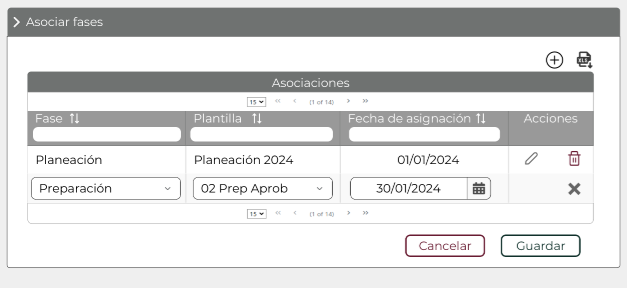

||Administración General de Comunicaciones y Tecnologías de la Información|
| :- | -: |
||Marco Documental 7.0|
|Fecha de aprobación del Template: 02/08/2023|
**Especificación de Interacción de Usuario**

17\_3083\_EIU\_AsociarFasesMatrizDoc.docx
|Versión del template: 7.00|
| :-: | :-: | :-: |

**<ID Requerimiento>** 8309

**Nombre del Requerimiento: **TI\_SISECOFI-SAT\_Seguimiento financiero y control documental de proyectos de contratación

## **Tabla de Versiones y Modificaciones**

|Versión|Descripción del cambio|Responsable de la Versión|Fecha|
| :-: | :-: | :-: | :-: |
|*1*|*Creación del documento*|Eduardo Acosta Mora|*30/01/2024*|
|*1.1*|*Revisión del documento*|Luis Angel Olguin Castillo|*10/03/2024*|
|*1.2*|*Versión aprobada para firma*|
María del Carmen Castillejos Cárdenas

Rubén Delgado Ramírez
|06/06/2024|

**TABLA DE CONTENIDO**

[Tabla de Versiones y Modificaciones	1](#_toc168584961)

[Módulo: ASOCIAR FASES	2](#_toc168584962)

[ESTILOS 01	2](#_toc168584963)

[Descripción de Elementos	3](#_toc168584964)

[Descripción de Campos	4](#_toc168584965)

##
## **MÓDULO: ASOCIAR FASES** 
## **ESTILOS 01**

|**Nombre de la Pantalla:**|
Asociar fases matriz documental

|
| :- | - |
|**Objetivo:**|
Permitir al Empleado SAT asociar fases al proyecto.

|
|**Casos de uso relacionados:**|17\_3083\_ECU\_ASociarFasesMatrizDoc|
|||

**Nota:** Los datos mencionados en la tabla son solo de ejemplo.

### **DESCRIPCIÓN DE ELEMENTOS** 

|**Elemento**|**Descripción**|
| :- | :- |
|![ref1]|
Opción que despliega o contrae la sección, tomando en cuenta lo siguiente:

Sección contraída ![Forma

Descripción generada automáticamente con confianza baja]

Sección desplegada ![Forma

Descripción generada automáticamente con confianza baja]
|
|Asociar fases |Sección que permite administrar las asociaciones de fases.|
|![ref2]|Opción que permite crear una nueva asociación.|
|![ref3]|Opción que permite exportar la información de la tabla “Asociaciones”, generando un archivo de Excel con extensión (.xlsx).|
|Asociaciones|Título de la tabla, la cual muestra las asociaciones creadas.|
|Fase|
Indica la o las fases que tiene el proyecto.

Campo que permite seleccionar la fase de acuerdo con el seguimiento del proyecto.
|
|Plantilla|
Indica la o las plantillas que tiene el proyecto.

Campo que permite seleccionar la plantilla de acuerdo con la fase seleccionada anteriormente.
|
|Fecha de asignación|
Indica la o las fechas en que se le asocia la plantilla al proyecto.

Permite seleccionar la fecha de asignación de la plantilla al proyecto.
|
|Acciones |Indica las acciones que se pueden hacer con los registros, mediante las opciones ![ref4] y ![ref5].|
|![ref6]|Opción que ordena la información de la tabla de forma ascendente o descendente y de forma alfabética, según aplique.|
||Campo para filtrar información de la columna donde se requiera buscar específicamente.|
|![ref7]|
Opción que habilita los campos y permite editar el registro de la tabla. 

- Se mostrará activo cuando sea un registro existente en la base de datos (BD).

- Se mostrará inactivo cuando sea un registro nuevo.
|
|![ref8]|Opción que permite eliminar el registro de la tabla.|
|![ref9]|Opción que permite descartar la acción |
|![ref10]|Paginador que permite navegar a través de las páginas resultantes de la consulta, considerando que el sistema debe mostrar inicialmente 15 registros por página, permitiendo visualizar entre 15, 50 y 100 registros por página. |
|Cancelar|Opción que realiza el proceso para cancelar la acción y regresa al último estado guardado. |
|Guardar|Opción que inicia el proceso para almacenar en la BD las plantillas asociadas.|

### **DESCRIPCIÓN DE CAMPOS**

|**Elemento**|**Tipo**|**Longitud**|
**Nivel de Acceso**

**(L, E, S)**
|**Descripción del Campo**|**Fórmulas**|**Precisiones**|
| :-: | :-: | :-: | :-: | :-: | :-: | :-: |
|![ref1]|Ícono|N/A|S|Opción que al ser seleccionada despliega o contrae la sección.|N/A|
Sección contraída ![Forma

Descripción generada automáticamente con confianza baja]

Sección desplegada ![Forma

Descripción generada automáticamente con confianza baja]
|
|Asociar fases|Sección|N/A|L|Sección que permite administrar las asociaciones de fases.|N/A|N/A|
|![ref2]|Ícono|N/A|S|Opción que permite crear una nueva asociación.|N/A|Usar *tooltip* que muestre el nombre de la opción “Nuevo”.|
|![ref11]|Ícono|N/A|S|Opción que permite exportar la información de la tabla “Asociaciones”, generando un archivo de Excel con extensión (.xlsx).|N/A|

Usar *tooltip* que muestre el nombre de la opción “Exportar a Excel”.
|
|Asociaciones|Texto|N/A|L|Título de la tabla, la cual muestra las asociaciones creadas.|N/A|N/A|
|Fase|Lista de selección|N/A|L, S|
Indica la o las fases que tiene el proyecto.

Campo que permite seleccionar la fase de acuerdo con el seguimiento del proyecto.
|N/A|N/A|
|Plantilla|Lista de selección|N/A|L, S|
Indica la o las plantillas que tiene el proyecto.

Campo que permite seleccionar la plantilla de acuerdo con la fase seleccionada anteriormente.
|N/A|N/A|
|Fecha de asignación|Fecha|10|L, E|
Indica la o las fechas en que se le asocia la plantilla al proyecto.

Permite seleccionar la fecha de asignación de la plantilla al proyecto.
|N/A|Formato de fecha DD/MM/AAAA|
|Acciones|Texto|N/A|L|Indica las acciones que se pueden hacer con los registros, mediante los opciones ![ref4] y ![ref5].|N/A|N/A|
|![ref6]|Ícono|N/A|S|Opción que ordena la información de la tabla de forma ascendente o descendente y de forma alfabética, según aplique.|N/A|N/A|
||Filtro|N/A|E|Campo para filtrar información de la columna donde se requiera buscar específicamente.|N/A|Realiza el filtro de la información solo dentro de la página que se visualiza.|
|![ref7]|Ícono|N/A|S|Opción que habilita los campos y permite editar el registro de la tabla.|N/A|
Se mostrará activo cuando sea un registro existente en la BD.

Se mostrará inactivo cuando sea un registro nuevo.

Usar *tooltip* que muestre el nombre de la opción “Editar”.
|
|![ref8]|Ícono|N/A|S|Opción que permite eliminar el registro de la tabla.|N/A|Usar *tooltip* que muestre el nombre de la opción “Eliminar/ Cancelar”.|
|![ref9]|Ícono|N/A|S|Opción que permite descartar la acción|N/A|N/A|
|![ref12]|Paginador|N/A|S|Permite navegar a través de las páginas resultantes de la consulta.|N/A|Inicialmente se deben mostrar 15 registros por página, permitiendo visualizar entre 15, 50 y 100 registros por página.|
|Cancelar|Botón|N/A|S|Opción que realiza el proceso para cancelar la acción y regresa al último estado guardado.|N/A|
Inicialmente se muestra sin color de fondo y con el texto y contorno en color guinda (#691c32).

Cuando se le pone el cursor encima debe cambiar a fondo guinda (#691c32) y letras blancas.
|
|Guardar|Botón|N/A|S|Opción que inicia el proceso para almacenar en la BD las plantillas asociadas.|N/A|
Inicialmente, se muestra sin color de fondo y con el texto y contorno en color verde oscuro (#10312B).

Cuando se le pone el cursor encima debe cambiar a fondo verde oscuro (#10312B) y letras blancas.
|

Anexo - Ejemplos de botones

Las acciones de cada botón se definen en los Estilos correspondientes.

|**FIRMAS DE CONFORMIDAD**||
| :-: | :- |
|**Firma 1** |**Firma 2** |
|**Nombre**: María del Carmen Castillejos Cárdenas.|**Nombre**: Rubén Delgado Ramírez.|
|**Puesto**: Usuaria ACPPI.|**Puesto**: Usuario ACPPI.|
|**Fecha:**|**Fecha:**|
|||
|**Firma 3** |**Firma 4**|
|**Nombre**: Rodolfo López Meneses.|**Nombre**: Diana Yazmín Pérez Sabido.|
|**Puesto**: Usuario ACPPI.|**Puesto**: Usuaria ACPPI.|
|**Fecha:**|**Fecha:**|
|||
|**Firma 5**|**Firma 6**|
|**Nombre**: Yesenia Helvetia Delgado Naranjo.|**Nombre:** Alejandro Alfredo Muñoz Núñez.|
|**Puesto**: APE ACPPI.|**Puesto:** RAPE ACPPI.|
|**Fecha**:|**Fecha**:|
|||
|**Firma 7**|**Firma 8**|
|**Nombre**: Luis Angel Olguin Castillo.|**Nombre**: Erick Villa Beltrán.|
|**Puesto**: Enlace ACPPI.|**Puesto**: Líder APE SDMA 6.|
|**Fecha**:|**Fecha**:|
|||
|**Firma 9**|**Firma 10**|
|**Nombre:** Juan Carlos Ayuso Bautista.|**Nombre:**  Eduardo Acosta Mora|
|**Puesto:** Líder Técnico SDMA 6.|**Puesto:** Analista SDMA 6. |
|**Fecha**:|**Fecha**:|
|||

|||Página 6 de 6|
| :- | :-: | -: |

[ref1]: Aspose.Words.c44c8121-556a-4dd9-ad10-e9f31c9fa574.003.png
[Forma

Descripción generada automáticamente con confianza baja]: Aspose.Words.c44c8121-556a-4dd9-ad10-e9f31c9fa574.004.png
[Forma

Descripción generada automáticamente con confianza baja]: Aspose.Words.c44c8121-556a-4dd9-ad10-e9f31c9fa574.005.png
[ref2]: Aspose.Words.c44c8121-556a-4dd9-ad10-e9f31c9fa574.006.png
[ref3]: Aspose.Words.c44c8121-556a-4dd9-ad10-e9f31c9fa574.007.png
[ref4]: Aspose.Words.c44c8121-556a-4dd9-ad10-e9f31c9fa574.008.png
[ref5]: Aspose.Words.c44c8121-556a-4dd9-ad10-e9f31c9fa574.009.png
[ref6]: Aspose.Words.c44c8121-556a-4dd9-ad10-e9f31c9fa574.010.png
[ref7]: Aspose.Words.c44c8121-556a-4dd9-ad10-e9f31c9fa574.013.png
[ref8]: Aspose.Words.c44c8121-556a-4dd9-ad10-e9f31c9fa574.014.png
[ref9]: Aspose.Words.c44c8121-556a-4dd9-ad10-e9f31c9fa574.015.png
[ref10]: Aspose.Words.c44c8121-556a-4dd9-ad10-e9f31c9fa574.016.png
[ref11]: Aspose.Words.c44c8121-556a-4dd9-ad10-e9f31c9fa574.017.png
[ref12]: Aspose.Words.c44c8121-556a-4dd9-ad10-e9f31c9fa574.019.png
