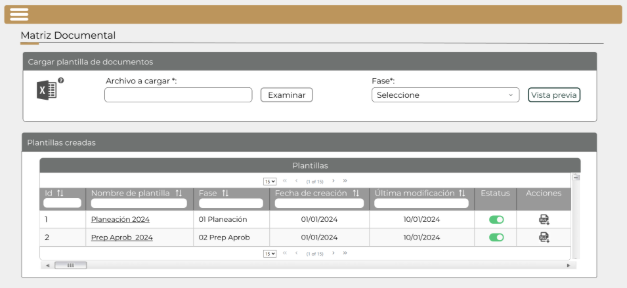
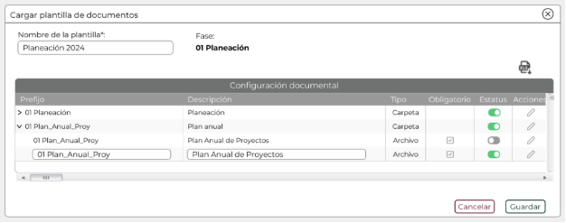
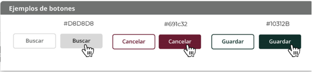

||Administración General de Comunicaciones y Tecnologías de la Información|
| :- | -: |
||Marco Documental 7.0|
|Fecha de aprobación del Template: 02/08/2023|
**Especificación de Interacción de Usuario**

17\_3083\_EIU\_ConfigurarControlDocumentos.docx
|Versión del template: 7.00|
| :-: | :-: | :-: |

**<ID Requerimiento>** 8309

**Nombre del Requerimiento: **TI\_SISECOFI-SAT\_Seguimiento financiero y control documental de proyectos de contratación

## **Tabla de Versiones y Modificaciones**

|Versión|Descripción del cambio|Responsable de la Versión|Fecha|
| :-: | :-: | :-: | :-: |
|*1*|*Creación del documento*|Eduardo Acosta Mora|*24/01/2024*|
|*1.1*|*Revisión del documento*|Luis Angel Olguin Castillo|*10/03/2024*|
|*1.2*|*Versión aprobada para firma*|
María del Carmen Castillejos Cárdenas

Rubén Delgado Ramírez
|*04/06/2024*|

**TABLA DE CONTENIDO**

[Tabla de Versiones y Modificaciones	1](#_toc168391236)

[Módulo: MATRIZ DOCUMENTAL	2](#_toc168391237)

[ESTILOS 01	2](#_toc168391238)

[Descripción de Elementos	3](#_toc168391239)

[Descripción de Campos	4](#_toc168391240)

[ESTILOS 02	10](#_toc168391241)

[Descripción de Elementos	11](#_toc168391242)

[Descripción de Campos	12](#_toc168391243)

## **MÓDULO: MATRIZ DOCUMENTAL**
## **ESTILOS 01**

|**Nombre de la Pantalla:**|Carga de plantilla|
| :- | - |
|**Objetivo:**|Permite al Empleado SAT cargar el documento y visualizar las plantillas ya creadas.|
|**Casos de uso relacionados:**|17\_3083\_ECU\_ConfigurarControlDocumentos|
|||

**Nota:** Los datos mencionados en la tabla son solo de ejemplo.

### **DESCRIPCIÓN DE ELEMENTOS** 

|**Elemento**|**Descripción**|
| :- | :- |
|![ref1]|Opción que al seleccionarla muestra el menú principal desplegado en la parte izquierda de la pantalla; contiene los módulos principales y submódulos de este sistema.|
|Matriz Documental|Título que identifica el submódulo a donde se ingresa.|
|Cargar plantilla de documentos|Título de la sección de la carga de archivos.|
|![ref2]|Opción que permite la descarga de la plantilla tipo para la generación de un nuevo archivo.|
|Archivo a cargar\*:|Indica que se debe de adjuntar un archivo y es de carácter obligatorio para continuar con el proceso.|
|![ref3]|Muestra el nombre con extensión (.xlsx) correspondiente a la configuración documental.|
|Examinar|Opción que permite abrir el explorador de archivos de la computadora para elegir el archivo que se adjuntará.|
|Fase\*:|Campo que permite seleccionar la fase en la cual estará la plantilla.|
|Vista previa|Opción que permite cargar el archivo al sistema para su visualización.|
|Plantillas creadas|Título de la sección que muestra la tabla “Plantillas”.|
|Plantillas|Título de la tabla.|
|Id|Campo incremental que se asigna de manera automática para identificar el registro ingresado. |
|Nombre de plantilla|Indica el nombre de las plantillas registradas.|
|Fase|Indica la fase de la plantilla registrada.|
|Fecha de creación|Indica la fecha de creación de la plantilla.|
|Última modificación|Indica la última fecha de modificación de la plantilla.|
|Estatus|
Indica el estatus activo o inactivo de la plantilla mediante los íconos:

![ref4] Activo 

![ref5] Inactivo 
|
|Acciones |Indica las acciones que se pueden ejecutar por cada plantilla mediante el ícono ![ref6].|
|` `![ref7]|
Opción que permite modificar el estatus de la plantilla a estado activo o inactivo de la siguiente forma: 

![ref4] Activo 

![ref5] Inactivo
|
|![ref8]|Opción que permite hacer la descarga de la configuración de la plantilla que está almacenada en la base de datos (BD).|
|![ref9]|Opción que ordena la información de la tabla de forma ascendente o descendente y de forma alfabética, según aplique. |
||Campo para filtrar información de la columna en la que se requiere buscar específicamente.|
|![ref10]|Paginador que permite navegar a través de las páginas resultantes de la consulta, considerando que el sistema debe mostrar inicialmente 15 registros por página, permitiendo visualizar entre 15, 50 y 100 registros por página. |
|![ref11]|Permite desplazarse de manera horizontal en la tabla. |
|![ref12] |Permite desplazarse de manera vertical en la tabla. |

### **DESCRIPCIÓN DE CAMPOS**

|**Elemento**|**Tipo**|**Longitud**|
**Nivel de Acceso**

**(L, E, S)**
|**Descripción del Campo**|**Fórmulas**|**Precisiones**|
| :-: | :-: | :-: | :-: | :-: | :-: | :-: |
|![ref13]|Ícono|N/A|S|Opción que al seleccionarla muestra el menú principal desplegado en la parte izquierda de la pantalla; contiene los módulos principales y submódulos de este sistema.|N/A|N/A|
|Matriz Documental|Texto|N/A|L|Título que identifica el submódulo a donde se ingresa.|N/A|N/A|
|Cargar plantilla de documentos|Sección|N/A|L|Título de la sección de la carga de archivos.|N/A|N/A|
|![ref14]|Ícono|N/A|S|Opción que permite la descarga de la plantilla tipo para la generación de un nuevo archivo.|N/A|Usar *tooltip* que muestre el nombre de la opción “Plantilla tipo”.|
|Archivo a cargar \*:|Alfanumérico|N/A|L|Indica que se debe de adjuntar un archivo y es de carácter obligatorio para continuar con el proceso.|N/A|N/A|
|![ref15]|Caja de texto|N/A|L|Muestra el nombre con extensión (.xlsx) correspondiente a la configuración documental.|N/A|N/A|
|Examinar|Botón|N/A|S|Opción que permite abrir el explorador de archivos de la computadora para elegir el archivo que se adjuntará.|N/A|
Inicialmente se muestra sin color de fondo y con contorno y letras en color gris.

(#D8D8D8).

Cuando se pone el cursor encima debe cambiar a fondo gris (#D8D8D8) y letras negras.
|
|Fase\*:|Lista de selección|N/A|S|Campo que permite seleccionar la fase en la cual estará la plantilla.|N/A|N/A|
|Vista previa|Botón|N/A|S|Opción que permite cargar el archivo al sistema para su visualización.|N/A|
Inicialmente, se muestra sin color de fondo y con el texto y contorno en color verde oscuro (#10312B).

Cuando se le pone el cursor encima debe cambiar con fondo verde oscuro (#10312B) y letras blancas.
|
|Plantillas creadas|Texto|N/A|L|Título de la sección que muestra la tabla “Plantillas”.|N/A|N/A|
|Plantillas|Texto|N/A|L|Título de la tabla.|N/A|N/A|
|Id|Numérico|4|L|Campo incremental que se asigna de manera automática para identificar el registro ingresado.|N/A|N/A|
|Nombre de plantilla|Alfanumérico|50|S|Indica el nombre de las plantillas registradas.|N/A|Se genera un enlace por registro.|
|Fase|Alfanumérico|N/A|L|Indica la fase de la plantilla registrada.|N/A|N/A|
|Fecha de creación|Fecha|10|L|Indica la fecha de creación de la plantilla.|N/A|Formato de fecha DD/MM/AAAA|
|Última modificación|Fecha|10|L|Indica la última fecha de modificación de la plantilla.|N/A|Formato de fecha DD/MM/AAAA|
|Estatus|Texto|N/A|L|Indica el estatus activo u inactivo de la plantilla.|N/A|
![ref4]Activo

![ref5]Inactivo
|
|Acciones|Texto|N/A|L|Indica las acciones que se pueden ejecutar por cada plantilla mediante el ícono ![ref6].|N/A|N/A|
|![ref7]|Ícono|N/A|S|Opción que permite modificar el estatus de la plantilla a estado activo o inactivo.|N/A|

![ref4]Activo

![ref5]Inactivo

Usar *tooltip* que muestre el nombre de la opción “Estatus de plantilla”.
|
|![ref8]|Ícono|N/A|S|Opción que permite hacer la descarga de la configuración de la plantilla que está almacenada en la base de datos (BD).|N/A|Usar *tooltip* que muestre el nombre de la opción “Descargar plantilla por fase”.|
|![ref9]|Ícono|N/A|S|Opción que ordena la información de la tabla de forma ascendente o descendente y de forma alfabética, según aplique.|N/A|N/A|
||Filtro|N/A|E|Campo para filtrar información de la columna en la que se requiere buscar específicamente.|N/A|Realiza el filtro de la información solo dentro de la página que se visualiza.|
|![ref16]|Paginador|N/A|S|Permite navegar a través de las páginas resultantes de la consulta.|N/A|Inicialmente, se deben mostrar 15 registros por página, permitiendo seleccionar el visualizar 15, 50 y 100 registros por página.|
|![ref17]|Barra de desplazamiento|N/A|S|Permite desplazarse de manera horizontal en la tabla.|N/A|N/A|
|![ref12]|Barra de desplazamiento|N/A|S|Permite desplazarse de manera vertical en la tabla.|N/A|N/A|

## **ESTILOS 02**

|**Nombre de la Pantalla:**|Configuración documental|
| :- | - |
|**Objetivo:**|Permite visualizar la estructura de la plantilla.|
|**Casos de uso relacionados:**|17\_3083\_ECU\_ConfigurarControlDocumentos|
|||

**Nota:** Los datos mencionados en la tabla son solo de ejemplo.

### **DESCRIPCIÓN DE ELEMENTOS** 

|**Elemento**|**Descripción**|
| :- | :- |
|![ref18]|Opción que permite cerrar la ventana emergente.|
|Cargar plantilla de documentos|Título de la ventana emergente.|
|Nombre de la plantilla\*:|Campo que permite ingresar el nombre de la plantilla.|
|Fase\*:|
Campo que muestra la fase seleccionada anteriormente.

**Nota:** la opción que mostrará por defecto es la misma que se seleccionó al cargar el archivo.
|
|![ref19]|Opción que permite hacer la descarga de la configuración de la plantilla que está almacenada en la base de datos (BD).|
|Configuración documental|Título de la tabla.|
|Prefijo|Indica los nombres de las carpetas o archivos, permite navegar por medio de los íconos ![ref20]![ref21]  para visualizar los archivos o carpetas contenidas.|
|![ref22]|
Opción que despliega o contrae la carpeta, tomando en cuenta lo siguiente:

Carpeta contraída ![ref21]

Carpeta desplegada ![ref20]
|
|Descripción|Indica la descripción de cada carpeta o archivo.|
|Tipo|
Indica el tipo de prefijo con las siguientes opciones:

- Archivo

- Carpeta
|
|Obligatorio|
Indica si el archivo es obligatorio mediante los íconos:

![ref23]Obligatorio

![ref24]No obligatorio
|
|Estatus|
Indica el estatus activo o inactivo del prefijo mediante los íconos:

![ref4]Activo

![ref5]Inactivo
|
|Acciones|Indica las acciones que se pueden hacer con los prefijos, mediante el ícono ![ref25].|
|
![ref26]

![ref27]
|
Opción que permite modificar si un archivo es obligatorio de la siguiente forma:

![ref28]Obligatorio

![ref29]No obligatorio
|
|` `![ref7]|
Opción que permite modificar el estatus del prefijo a estado activo o inactivo de la siguiente forma:

![ref4]Activo

![ref5]Inactivo
|
|![ref30]|Opción que permite habilitar los campos “Prefijo”, “Descripción”, “Obligatorio” y “Estatus” para su edición.|
|![ref11]|Permite desplazarse de manera horizontal en la tabla.|
|![ref12] |Permite desplazarse de manera vertical en la tabla.|
|Cancelar |Opción que realiza el proceso para cancelar la acción y regresa al último estado guardado.|
|Guardar|Opción que inicia el proceso para almacenar en la BD la información de la configuración documental de la plantilla adjunta.|

### **DESCRIPCIÓN DE CAMPOS**

|**Elemento**|**Tipo**|**Longitud**|
**Nivel de Acceso**

**(L, E, S)**
|**Descripción del Campo**|**Fórmulas**|**Precisiones**|
| :-: | :-: | :-: | :-: | :-: | :-: | :-: |
|![ref18]|Ícono|N/A|S|Opción que permite cerrar la ventana emergente.|N/A|Usar *tooltip* que muestre el nombre de la opción “Cerrar ventana”.|
|Cargar plantilla de documentos|Texto|N/A|L|Título de la ventana emergente.|N/A|N/A|
|Nombre de la plantilla \*:|Alfanumérico|50|E|Campo que permite ingresar el nombre de la plantilla.|N/A|Campo obligatorio.|
|Fase:|Texto|N/A|L|Campo que muestra la fase seleccionada anteriormente.|N/A|La opción que mostrará por defecto es la misma que se seleccionó al cargar el archivo.|
|![ref8]|Ícono|N/A|S|Opción que permite hacer la descarga de la plantilla que está almacenada en la BD.|N/A|

Para una plantilla nueva se inactiva y para una plantilla existente se activa.

Usar *tooltip* que muestre el nombre de la opción “Descargar plantilla por fase”.
|
|Configuración documental|Texto|N/A|L|Título de la tabla.|N/A|N/A|
|Prefijo|Texto|50|L y E|Indica los nombres de las carpetas o archivos, permite navegar por medio de los íconos ![ref20]![ref21]  para visualizar los archivos o carpetas contenidas.|N/A|El nombre no deberá contener espacios, estos serán sustituidos por guiones bajos. No se aceptarán caracteres especiales a excepción del guión bajo.|
|![ref22]|Ícono|N/A|S|Opción que despliega o contrae la carpeta.|N/A|
Carpeta contraída ![ref21]

Carpeta desplegada ![ref20]
|
|Descripción|Texto|200|L, E|Indica la descripción de cada carpeta o archivo.|N/A|N/A|
|Tipo|Texto|N/A|L|Indica el tipo de prefijo.|N/A|Archivo o carpeta.|
|Obligatorio|Texto|N/A|L|Indica si el archivo es obligatorio.|N/A|
![ref23]Obligatorio

![ref31]

No obligatorio
|
|Estatus|Texto|N/A|L|Indica el estatus activo o inactivo del prefijo.|N/A|
![ref4]Activo

![ref5]Inactivo
|
|Acciones|Texto|N/A|L|Indica las acciones que se pueden hacer con los prefijos, mediante el ícono ![ref25].|N/A|N/A|
|
![ref26]

![ref27]
|Casilla de selección|N/A|S|Opción que permite modificar si un archivo es obligatorio.|N/A|
![ref23]Obligatorio

![ref31]

No obligatorio

Usar *tooltip* que muestre el nombre de la opción “Obligatorio”.
|
|![ref7]|Ícono|N/A|S|Opción que permite modificar el estatus del prefijo a estado activo o inactivo.|N/A|

![ref4]Activo

![ref5]Inactivo

Usar *tooltip* que muestre el nombre de la opción “Estatus de prefijo”.
|
|![ref30]|Ícono|N/A|S|Opción que permite habilitar los campos “Prefijo”, “Descripción”, “Obligatorio” y “Estatus” para su edición.|N/A|Usar *tooltip* que muestre el nombre de la opción “Editar”.|
|![ref17]|Barra de desplazamiento|N/A|S|Permite desplazarse de manera horizontal en la tabla.|N/A|N/A|
|![ref12]|Barra de desplazamiento|N/A|S|Permite desplazarse de manera vertical en la tabla.|N/A|N/A|
|Cancelar|Botón|N/A|S|Opción que realiza el proceso para cancelar la acción y regresa al último estado guardado.|N/A|
Inicialmente, se muestra sin color de fondo y con el texto y contorno en color guinda (#691c32).

Cuando se le pone el cursor encima debe cambiar con fondo guinda (#691c32) y letras blancas.
|
|Guardar|Botón|N/A|S|Opción que inicia el proceso para almacenar en la BD la información de la configuración documental de la plantilla adjunta.|N/A|
Inicialmente, se muestra sin color de fondo y con el texto y contorno en color verde oscuro (#10312B).

Cuando se le pone el cursor encima debe cambiar con fondo verde oscuro (#10312B) y letras blancas.
|

Anexo - Ejemplos de botones

Las acciones de cada botón se definen en los Estilos correspondientes.

|**FIRMAS DE CONFORMIDAD**||
| :-: | :- |
|**Firma 1** |**Firma 2** |
|**Nombre**: María del Carmen Castillejos Cárdenas.|**Nombre**: Rubén Delgado Ramírez.|
|**Puesto**: Usuaria ACPPI.|**Puesto**: Usuario ACPPI.|
|**Fecha:**|**Fecha:**|
|||
|**Firma 3** |**Firma 4**|
|**Nombre**: Rodolfo López Meneses.|**Nombre**: Diana Yazmín Pérez Sabido.|
|**Puesto**: Usuario ACPPI.|**Puesto**: Usuaria ACPPI.|
|**Fecha:**|**Fecha:**|
|||
|**Firma 5**|**Firma 6**|
|**Nombre**: Yesenia Helvetia Delgado Naranjo.|**Nombre:** Alejandro Alfredo Muñoz Núñez.|
|**Puesto**: APE ACPPI.|**Puesto:** RAPE ACPPI.|
|**Fecha**:|**Fecha**:|
|||
|**Firma 7**|**Firma 8**|
|**Nombre**: Luis Angel Olguin Castillo.|**Nombre**: Erick Villa Beltrán.|
|**Puesto**: Enlace ACPPI.|**Puesto**: Líder APE SDMA 6.|
|**Fecha**:|**Fecha**:|
|||
|**Firma 9**|**Firma 10**|
|**Nombre:** Juan Carlos Ayuso Bautista.|**Nombre:**  Eduardo Acosta Mora|
|**Puesto:** Líder Técnico SDMA 6.|**Puesto:** Analista SDMA 6. |
|**Fecha**:|**Fecha**:|
|||

|||Página 6 de 6|
| :- | :-: | -: |

[ref1]: Aspose.Words.2f4bb005-98fe-403b-8fce-66aeba810c72.003.png
[ref2]: Aspose.Words.2f4bb005-98fe-403b-8fce-66aeba810c72.004.png
[ref3]: Aspose.Words.2f4bb005-98fe-403b-8fce-66aeba810c72.005.png
[ref4]: Aspose.Words.2f4bb005-98fe-403b-8fce-66aeba810c72.006.png
[ref5]: Aspose.Words.2f4bb005-98fe-403b-8fce-66aeba810c72.007.png
[ref6]: Aspose.Words.2f4bb005-98fe-403b-8fce-66aeba810c72.008.png
[ref7]: Aspose.Words.2f4bb005-98fe-403b-8fce-66aeba810c72.009.png
[ref8]: Aspose.Words.2f4bb005-98fe-403b-8fce-66aeba810c72.010.png
[ref9]: Aspose.Words.2f4bb005-98fe-403b-8fce-66aeba810c72.011.png
[ref10]: Aspose.Words.2f4bb005-98fe-403b-8fce-66aeba810c72.013.png
[ref11]: Aspose.Words.2f4bb005-98fe-403b-8fce-66aeba810c72.014.png
[ref12]: Aspose.Words.2f4bb005-98fe-403b-8fce-66aeba810c72.015.png
[ref13]: Aspose.Words.2f4bb005-98fe-403b-8fce-66aeba810c72.016.png
[ref14]: Aspose.Words.2f4bb005-98fe-403b-8fce-66aeba810c72.017.png
[ref15]: Aspose.Words.2f4bb005-98fe-403b-8fce-66aeba810c72.018.png
[ref16]: Aspose.Words.2f4bb005-98fe-403b-8fce-66aeba810c72.020.png
[ref17]: Aspose.Words.2f4bb005-98fe-403b-8fce-66aeba810c72.021.png
[ref18]: Aspose.Words.2f4bb005-98fe-403b-8fce-66aeba810c72.023.png
[ref19]: Aspose.Words.2f4bb005-98fe-403b-8fce-66aeba810c72.024.png
[ref20]: Aspose.Words.2f4bb005-98fe-403b-8fce-66aeba810c72.025.png
[ref21]: Aspose.Words.2f4bb005-98fe-403b-8fce-66aeba810c72.026.png
[ref22]: Aspose.Words.2f4bb005-98fe-403b-8fce-66aeba810c72.027.png
[ref23]: Aspose.Words.2f4bb005-98fe-403b-8fce-66aeba810c72.028.png
[ref24]: Aspose.Words.2f4bb005-98fe-403b-8fce-66aeba810c72.029.png
[ref25]: Aspose.Words.2f4bb005-98fe-403b-8fce-66aeba810c72.030.png
[ref26]: Aspose.Words.2f4bb005-98fe-403b-8fce-66aeba810c72.031.png
[ref27]: Aspose.Words.2f4bb005-98fe-403b-8fce-66aeba810c72.032.png
[ref28]: Aspose.Words.2f4bb005-98fe-403b-8fce-66aeba810c72.033.png
[ref29]: Aspose.Words.2f4bb005-98fe-403b-8fce-66aeba810c72.034.png
[ref30]: Aspose.Words.2f4bb005-98fe-403b-8fce-66aeba810c72.035.png
[ref31]: Aspose.Words.2f4bb005-98fe-403b-8fce-66aeba810c72.036.png
