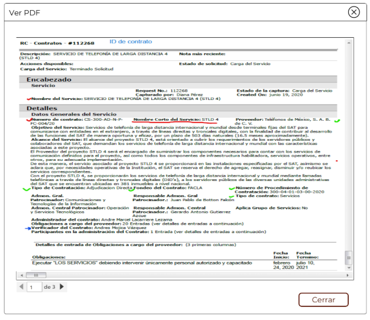
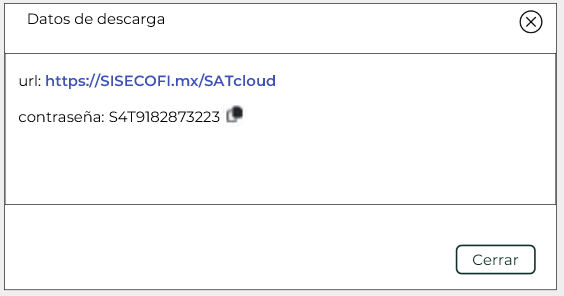

||Administración General de Comunicaciones y Tecnologías de la Información|
| :- | -: |
||Marco Documental 7.0|
|Fecha de aprobación del Template: 02/08/2023|
**Especificación de Interacción de Empleado SAT**

17\_3083\_EIU\_GestionDocumental.docx
|Versión del template: 7.00|
| :-: | :-: | :-: |

**<ID Requerimiento>** 8309

**Nombre del Requerimiento:** TI\_SISECOFI-SAT\_Seguimiento financiero y control documental de proyectos de contratación.
## **Tabla de Versiones y Modificaciones**

|Versión|Descripción del cambio|Responsable de la Versión|Fecha|
| :- | :- | :-: | :-: |
|*1*|*Creación del documento*|Edgar Vergara Tadeo|23/01/2024|
|*1.1*|*Revisión del documento*|Luis Angel Olguin Castillo|02/05/2024|
|*1.2*|*Versión aprobada para firma*|
María del Carmen Castillejos Cárdenas

Rubén Delgado Ramírez
|21/05/2024|

**TABLA DE CONTENIDO**

[Tabla de Versiones y Modificaciones	1](#_toc167177208)

[Módulo: Gestión Documental	2](#_toc167177209)

[ESTILOS 01	2](#_toc167177210)

[Descripción de Elementos	2](#_toc167177211)

[Descripción de Campos	4](#_toc167177212)

[ESTILOS 02	13](#_toc167177213)

[Descripción de Elementos	13](#_toc167177214)

[Descripción de Campos	14](#_toc167177215)

##

##  **MÓDULO: GESTIÓN DOCUMENTAL**
##  **ESTILOS 01**
##
|**Nombre de la Pantalla:** |
Gestión Documental.

|
| :- | :- |
|**Objetivo:**|
Permitir al Empleado SAT consultar, cargar, descargar o eliminar los documentos relacionados a “Proyecto”, “Contrato”, “Dictamen” o “Convenio modificatorio”.

|
|**Casos de uso relacionados:**|17\_3083\_ECU\_GestionDocumental|
|||
 

### **DESCRIPCIÓN DE ELEMENTOS** 

|**Elemento**|**Descripción**|
| :- | :- |
|Gestión documental|Nombre de la sección.|
|Estatus de carga|Título que identifica los filtros globales.|
|Todos ![ref1]|Botón radial activo por default, si está seleccionado, se mostrarán todos los registros de documentos.|
|Pendientes ![ref2]|Botón radial, si está seleccionado, se mostrarán únicamente los registros que contengan documentos pendientes por cargar.|
|Cargados ![ref2] |Botón radial, si esta seleccionado, se mostrarán únicamente los registros que contengan documentos cargados.|
|Contador todos|Contador automático que muestra el total de documentos asociados a un “Proyecto”, “Contrato”, “Dictamen” o “Convenio modificatorio”.|
|Contador pendientes |Contador automático que muestra el total de documentos pendientes obligatorios de cargar de un “Proyecto”, “Contrato”, “Dictamen” o “Convenio modificatorio”.|
|Contador cargados|Contador automático que muestra el total de los documentos cargados de un “Proyecto”, “Contrato”, “Dictamen” o “Convenio modificatorio”. |
|Estructura documental|Encabezado de la tabla.|
|![ref3]|Opción que permite descargar la documentación de la estructura documental mediante la descarga SATCloud.|
|![ref4]|Opción que permite la descarga masiva,  se exportarán todos los documentos de la estructura documental. |
|Descripción|Nombre de la carpeta principal asociada a una fase o descripción del documento solicitado.|
|![ref5]|Opción que permite colapsar el detalle de la carpeta asociada a una fase.|
|Requerido![ref6]|Se especifica si el documento es requerido. No editable, lo tomará de la plantilla asociada.|
|No aplica![ref7]|Campo de selección, que indica que el documento no es requerido en esta plantilla.|
|Estatus![ref8]|Se mostrará un ícono para los documentos de tipo “Requerido” que no hayan sido cargados.|
|Justificación![ref9]|Opción que permite ver, capturar o editar la justificación de porque el documento no aplica.|
|Tamaño|Muestra el tamaño del documento cargado.|
|Fecha última modificación|Muestra la fecha de la última modificación del registro. Considerando la carga del documento, o eliminación.|
|Acciones|Campo donde se mostrarán las acciones a realizar por documento.|
|![ref3]|Opción que permite descargar la documentación de la carpeta asociada a una fase mediante la descarga SATCloud.|
|![ref4]|Opción que permite la descarga masiva en .ZIP,  se exportarán todos los documentos de la carpeta asociada a una fase.|
|![ref10]|Opción que permite ver el PDF del documento seleccionado.|
|![ref11]|Opción que permite cargar un nuevo documento. |
|![ref12]|Opción que permite eliminar el documento actual. |
|![ref13]|Opción que permite agregar un nuevo documento, puede ser en la sección “Otros documentos” o en la sección “Otros documentos” de una fase en particular. |
|![ref14]|Paginador que permite navegar a través de las páginas resultantes de la consulta, considerando que el sistema debe mostrar inicialmente 15 registros por página, permitiendo visualizar entre 15, 50 y 100 registros por página.|
|![ref15]|Opción que ordena la información de la tabla de forma ascendente o descendente y de forma alfabética, según aplique.|
|![ref16]|Campo que permite filtrar la información de la columna en la que se requiere buscar específicamente.|
|Cancelar|Opción que realiza el proceso para cancelar la acción y regresa al último estado guardado. |
|Guardar|Opción que inicia el proceso para almacenar en la BD la información de los “Documentos modificados” para el “Proyecto”, “Contrato”, “Dictamen” o “Convenio modificatorio”. |
### **DESCRIPCIÓN DE CAMPOS**

|**Elemento**|**Tipo**|**Longitud**|
**Nivel de Acceso**

**(L, E, S)**
|**Descripción del Campo**|**Fórmulas**|**Precisiones**|
| :-: | :-: | :-: | :-: | :-: | :-: | :-: |
|Gestión documental|Texto|N/A|L|Título del encabezado que contiene el nombre del submódulo “Gestión Documental”|N/A|N/A|
|Estatus de carga|Texto|N/A|L|Título que identifica los filtros globales.|N/A|N/A|
|Todos ![ref1]|Botón radial|N/A|S|Botón radial activo por default, si está seleccionado, se mostrarán todos los registros de documentos.|N/A|Se encontrará activo por default|
|Pendientes ![ref2]|Botón radial|N/A|S|Botón radial, si está seleccionado, se mostrarán únicamente los registros que contengan documentos pendientes por cargar.|N/A|N/A|
|Cargados ![ref2] |Botón radial|N/A|S|Botón radial, si esta seleccionado, se mostrarán únicamente los registros que contengan documentos cargados.|N/A|N/A|
|Contador todos|Numérico|N/A|L|Contador automático que muestra el total de documentos asociados a un “Proyecto”, “Contrato”, “Dictamen” o “Convenio modificatorio”.|N/A|Contará todos los registros de la plantilla asociada.|
|Contador pendientes |Numérico|N/A|L|Contador automático que muestra el total de documentos pendientes obligatorios de cargar de un “Proyecto”, “Contrato”, “Dictamen” o “Convenio modificatorio”.|N/A|Contará todos los registros que estén marcados como obligatorios de la  plantilla asociada que no contengan un documento cargado y no estén marcados como ”No aplica”.|
|Contador cargados|Numérico|N/A|L|Contador automático que muestra el total de los documentos cargados de un “Proyecto”, “Contrato”, “Dictamen” o “Convenio modificatorio”. |N/A|Contará todos los registros con un documento cargado de la plantilla asociada.|
|Estructura documental|Texto|N/A|L|Título de la tabla.|N/A|N/A|
|![ref3]|Ícono|N/A|S|Opción que permite descargar la documentación de la plantilla documental asociada mediante la descarga SATCloud.|N/A|Usar el *tooltip* “Descarga masiva SATCloud”.|
|![ref4]|Ícono |N/A|S|Opción que permite la descarga masiva,  se exportarán todos los documentos de la plantilla documental asociada.|N/A|
Usar el *tooltip* “Descarga masiva del proyecto”.

|
|Descripción|Texto|N/A|L|Nombre de la carpeta principal asociada a una fase o descripción del documento solicitado.|N/A|El valor del campo se tomará del campo “Descripción de los documentos” de la  plantilla documental asociada.|
|![ref5]|Ícono|N/A|S|Opción que permite colapsar el detalle de las carpetas asociadas a las fases.|N/A|N/A|
|Requerido![ref6]|Ícono|N/A|L|Se especifica si el documento es requerido.|N/A|No editable, lo tomará de la plantilla asociada.|
|No aplica![ref7]|Ícono|N/A|L, S|Campo de selección, que indica que el documento no es requerido en esta plantilla.|N/A|
Si es seleccionado, aunque el check de requerido este encendido el documento no será obligatorio.

Solo podrá ser seleccionado por el rol que tenga permisos de carga o edición.
|
|Estatus![ref8]|Ícono|N/A|L|Se mostrará un ícono para los documentos de tipo “Requerido” que no hayan sido cargados.|N/A|Se mostrará cuando un documento requerido no se ha cargado. Usar el *tooltip* “Pendiente de carga”.|
|Justificación![ref9]|Casilla de selección |N/A|S|Opción que permite ver, capturar o editar la justificación de porque el documento no aplica.|N/A|Usar el *tooltip* “Justificación”.|
|Tamaño|Texto |N/A|L|Muestra el tamaño del documento cargado.|N/A|Será asignado de manera automática consultando el tamaño del documento cargado.|
|Fecha última modificación|Fecha|10|L|Muestra la fecha de la última modificación del registro. Considerando la carga del documento, o eliminación.|N/A|Formato de fecha DD/MM/AAAA |
|Acciones|Texto|N/A|L|Campo donde se mostrarán las acciones a realizar por documento.|N/A|N/A|
|![ref3]|Ícono|N/A|S|Opción que permite descargar la documentación de la carpeta asociada a una fase mediante la descarga SATCloud.|N/A|Usar el *tooltip* “Descarga masiva por fase en  SATCloud”.|
|![ref4]|Ícono|N/A|S|Opción que permite la descarga masiva en .ZIP,  se exportarán todos los documentos de la carpeta asociada a una fase.|N/A|. Usar el *tooltip* “Descarga masiva por fase en formato ZIP”.|
|![ref10]|Ícono|N/A|S|Opción que permite ver el PDF del documento seleccionado.|N/A|Usar el *tooltip* “Ver documento”.|
|![ref11]|Ícono|N/A|S|Opción que permite cargar un nuevo documento. |N/A|
Usar el *tooltip* “Cargar documento” 

Solo visible para el rol que tenga el permiso de carga de documentos.
|
|![ref12]|Ícono|N/A|S|Opción que permite eliminar el documento actual. |N/A|
Usar el *tooltip* “Eliminar archivo cargado”.

Solo visible para el rol que tenga el permiso de eliminar de documentos.
|
|![ref13]|Ícono|N/A|S|Opción que permite agregar un nuevo documento, puede ser en la sección “Otros documentos” o en la sección “Otros documentos” de una fase en particular. |N/A|Usar el *tooltip* “Nuevo documento”.|
|![ref14]|Paginador|N/A|S|Paginador que permite navegar a través de las páginas resultantes de la consulta, considerando que el sistema debe mostrar inicialmente 15 registros por página, permitiendo visualizar entre 15, 50 y 100 registros por página.|N/A|Filtrará los registros que tengan coincidencia con los valores ingresados.|
|![ref15]|Ícono|N/A|S|Opción que ordena la información de la tabla de forma ascendente o descendente y de forma alfabética, según aplique.|N/A|N/A|
|![ref17]|Filtro |N/A |E |Campo que permite filtrar la información de la columna en la que se requiere buscar específicamente.|N/A |Realiza el filtro de la información solo dentro de la página que se visualiza. |
|Cancelar|Botón|N/A|S|

Opción que realiza el proceso para cancelar la acción y regresa al último estado guardado.
|N/A |
Inicialmente se muestra sin color de fondo y con el texto y contorno en color guinda (#691c32). 

Cuando se le pone el cursor encima debe cambiar a fondo guinda (#691c32) y letras blancas. 

|
|Guardar|Botón|N/A|S|

Opción que inicia el proceso para almacenar en la BD la información de los “Documentos modificados” para el “Proyecto”, “Contrato”, “Dictamen” o “Convenio modificatorio”. 
|N/A |
Inicialmente se muestra sin color de fondo y con el texto y contorno en color verde oscuro (#10312B). 

Cuando se le pone el cursor encima debe cambiar a fondo verde oscuro (#10312B) y letras blancas. 

Solo visible para el rol que tenga el permiso de carga,  edición, y eliminar documentos.
|

## **ESTILOS 02**
##
|**Nombre de la Pantalla:** |
Justificación.

|
| :- | :- |
|**Objetivo:**|
Permitir al Empleado SAT ingresar o editar la justificación relacionada al documento seleccionado.

|
|**Casos de uso relacionados:**|17\_3083\_ECU\_GestionDocumental.|
|||
 

### **DESCRIPCIÓN DE ELEMENTOS** 

|**Elemento**|**Descripción**|
| :- | :- |
|Justificación|Nombre de la pantalla.|
|![ref18]|Campo de captura|
|Aceptar|Opción que permite iniciar el proceso de almacenamiento la justificación registrada en la base de datos.|
|![ref19]|Ícono que permite cerrar la pantalla sin realizar cambios.|
### **DESCRIPCIÓN DE CAMPOS**
###
|**Elemento**|**Tipo**|**Longitud**|
**Nivel de Acceso**

**(L, E, S)**
|**Descripción del Campo**|**Fórmulas**|**Precisiones**|
| :-: | :-: | :-: | :-: | :-: | :-: | :-: |
|Justificación|Texto|N/A|L|Nombre de la pantalla.|N/A|N/A|
|![ref20]|Texto|500|L, E|Campo de texto que permite ingresar el justificación asociado al documento seleccionado.|N/A|Debe estar inhabilitado en caso de tener permisos de solo lectura.|
|Aceptar|Botón|N/A|S|Opción que permite confirmar la captura o vista del registro.|N/A|
Inicialmente 

se muestra sin 

color de fondo 

y con el texto 

y contorno en 

color verde 

oscuro(#10312

B). Cuando se 

coloca el 

cursor encima 

debe cambiar 

con fondo 

verde.

|
|![ref19]|Ícono|N/A|S|Opción que permite cerrar la pantalla sin realizar cambios.|N/A|N/A|

## **ESTILOS 03**

|**Nombre de la Pantalla:**|Ver PDF|
| :- | :- |
|**Objetivo:**|Permite visualizar un documento PDF adjuntado.|
|**Casos de uso relacionados:**|17\_3083\_ECU\_GestionDocumental|
|||

### **DESCRIPCIÓN DE ELEMENTOS** 

|**Elemento**|**Descripción**|
| :- | :- |
|Ver PDF|Indica el título de la ventana.|
|![Icono

Descripción generada automáticamente]|Opción que permite cerrar la ventana.|
|![ref21]|Componente que muestra la vista previa de un documento PDF.|
|![ref22]|Paginador que permite navegar a través de las páginas resultantes del documento PDF.|
|![ref23]|Permite desplazarse de manera horizontal en el documento. |
|![ref24]|Permite desplazarse de manera vertical en el documento. |
|Cerrar|Opción que permite cerrar la ventana.|

### **DESCRIPCIÓN DE CAMPOS**

|**Elemento**|**Tipo**|**Longitud**|
**Nivel de Acceso**

**(L, E, S)**
|**Descripción del Campo**|**Fórmulas**|**Precisiones**|
| :-: | :-: | :-: | :-: | :-: | :-: | :-: |
|Ver PDF|Texto|N/A|L|Indica el título de la ventana.|N/A|N/A|
|![ref25]|Ícono|N/A|S|Opción que permite cerrar la ventana.|N/A|Usar *tooltip* que muestre el nombre de la opción “Cerrar ventana”.|
|![ref21]|Panel de visualización|N/A|L|Componente que muestra la vista previa de un documento PDF.|N/A|N/A|
|![ref26]|Paginador|N/A|S|Permite navegar a través de las páginas resultantes del documento PDF.|N/A|N/A|
|![ref23]|Barra de desplazamiento|N/A|S|Permite desplazarse de manera horizontal en el documento.|N/A|N/A|
|![ref27]|Barra de desplazamiento|N/A|S|Permite desplazarse de manera vertical en el documento.|N/A|N/A|
|Cerrar|Botón|N/A|S|Opción que permite cerrar la ventana.|N/A|
Inicialmente se muestra sin color de fondo y con el texto y contorno en color guinda (#691c32).

Cuando se le pone el cursor encima debe cambiar a fondo guinda (#691c32) y letras blancas.
|

## **ESTILOS 04**

|**Nombre de la Pantalla:**|Ver PDF|
| :- | :- |
|**Objetivo:**|Permite visualizar un documento PDF adjuntado.|
|**Casos de uso relacionados:**|17\_3083\_ECU\_GestionDocumental|
|||

### **DESCRIPCIÓN DE ELEMENTOS** 

|**Elemento**|**Descripción**|
| :- | :- |
|Datos de descarga|Indica el título de la ventana.|
|![Icono

Descripción generada automáticamente]|Opción que permite cerrar la ventana.|
|Url|Campo que muestra la Url de descarga de SATCloud.|
|Contraseña|Campo que muestra la contraseña para descarga del archivo en SATCloud.|
|![ref28]|Opción que permite copiar la contraseña.|
|Cerrar|Opción que permite cerrar la ventana.|

### **DESCRIPCIÓN DE CAMPOS**

|**Elemento**|**Tipo**|**Longitud**|
**Nivel de Acceso**

**(L, E, S)**
|**Descripción del Campo**|**Fórmulas**|**Precisiones**|
| :-: | :-: | :-: | :-: | :-: | :-: | :-: |
|Datos de descarga|Texto|N/A|L|Indica el título de la ventana.|N/A|N/A|
|![Icono

Descripción generada automáticamente][ref25]|Ícono|N/A|S|Opción que permite cerrar la ventana.|N/A|Usar *tooltip* que muestre el nombre de la opción “Cerrar ventana”.|
|Url|Texto|N/A|S|Campo que muestra la Url de descarga de SATCloud.|N/A|N/A|
|Contraseña|Texto|N/A|L|Campo que muestra la contraseña para descarga del archivo en SATCloud.|N/A|N/A|
|![ref28]|Ícono|N/A|S|Opción que permite copiar la contraseña.|N/A|N/A|
|Cerrar|Botón|N/A|S|Opción que permite cerrar la ventana.|N/A|
Inicialmente se muestra sin color de fondo y con el texto y contorno en color guinda (#691c32).

Cuando se le pone el cursor encima debe cambiar a fondo guinda (#691c32) y letras blancas.
|

|**FIRMAS DE CONFORMIDAD** ||
| :-: | :- |
|**Firma 1**  |**Firma 2**  |
|**Nombre**: María del Carmen Castillejos Cárdenas. |**Nombre**: Rubén Delgado Ramírez. |
|**Puesto**: Usuaria ACPPI. |**Puesto**: Usuario ACPPI. |
|**Fecha:** |**Fecha:** |
|  |  |
|**Firma 3**  |**Firma 4** |
|**Nombre**: Rodolfo López Meneses. |**Nombre**: Diana Yazmín Pérez Sabido. |
|**Puesto**: Usuario ACPPI. |**Puesto**: Usuaria ACPPI. |
|**Fecha:** |**Fecha:** |
|  |  |
|**Firma 5** |**Firma 6** |
|**Nombre**: Yesenia Helvetia Delgado Naranjo. |**Nombre:** Alejandro Alfredo Muñoz Núñez. |
|**Puesto**: APE ACPPI. |**Puesto:** RAPE ACPPI. |
|**Fecha**: |**Fecha**: |
|  |  |
|**Firma 7** |**Firma 8** |
|**Nombre**: Luis Angel Olguin Castillo. |**Nombre**: Erick Villa Beltrán. |
|**Puesto**: Enlace ACPPI. |**Puesto**: Líder APE SDMA 6. |
|**Fecha**: |**Fecha**: |
|**  |**  |
|**Firma 9** |**Firma 10** |
|**Nombre:** Juan Carlos Ayuso Bautista. |**Nombre:** Edgar Vergara Tadeo. |
|**Puesto:** Líder Técnico SDMA 6. |**Puesto:** Analista de Sistemas DS SDMA 6. |
|**Fecha**: |**Fecha**: |
|**  | |

|||Página 6 de 6|
| :- | :-: | -: |

[ref1]: Aspose.Words.f00fcb7e-efe3-403e-991e-088cba995205.003.png
[ref2]: Aspose.Words.f00fcb7e-efe3-403e-991e-088cba995205.004.png
[ref3]: Aspose.Words.f00fcb7e-efe3-403e-991e-088cba995205.005.png
[ref4]: Aspose.Words.f00fcb7e-efe3-403e-991e-088cba995205.006.png
[ref5]: Aspose.Words.f00fcb7e-efe3-403e-991e-088cba995205.007.png
[ref6]: Aspose.Words.f00fcb7e-efe3-403e-991e-088cba995205.008.png
[ref7]: Aspose.Words.f00fcb7e-efe3-403e-991e-088cba995205.009.png
[ref8]: Aspose.Words.f00fcb7e-efe3-403e-991e-088cba995205.010.png
[ref9]: Aspose.Words.f00fcb7e-efe3-403e-991e-088cba995205.011.png
[ref10]: Aspose.Words.f00fcb7e-efe3-403e-991e-088cba995205.012.png
[ref11]: Aspose.Words.f00fcb7e-efe3-403e-991e-088cba995205.013.png
[ref12]: Aspose.Words.f00fcb7e-efe3-403e-991e-088cba995205.014.png
[ref13]: Aspose.Words.f00fcb7e-efe3-403e-991e-088cba995205.015.png
[ref14]: Aspose.Words.f00fcb7e-efe3-403e-991e-088cba995205.016.png
[ref15]: Aspose.Words.f00fcb7e-efe3-403e-991e-088cba995205.017.png
[ref16]: Aspose.Words.f00fcb7e-efe3-403e-991e-088cba995205.018.png
[ref17]: Aspose.Words.f00fcb7e-efe3-403e-991e-088cba995205.019.png
[ref18]: Aspose.Words.f00fcb7e-efe3-403e-991e-088cba995205.021.png
[ref19]: Aspose.Words.f00fcb7e-efe3-403e-991e-088cba995205.022.png
[ref20]: Aspose.Words.f00fcb7e-efe3-403e-991e-088cba995205.023.png
[Icono

Descripción generada automáticamente]: Aspose.Words.f00fcb7e-efe3-403e-991e-088cba995205.025.png
[ref21]: Aspose.Words.f00fcb7e-efe3-403e-991e-088cba995205.026.png
[ref22]: Aspose.Words.f00fcb7e-efe3-403e-991e-088cba995205.027.png
[ref23]: Aspose.Words.f00fcb7e-efe3-403e-991e-088cba995205.028.png
[ref24]: Aspose.Words.f00fcb7e-efe3-403e-991e-088cba995205.029.png
[ref25]: Aspose.Words.f00fcb7e-efe3-403e-991e-088cba995205.030.png
[ref26]: Aspose.Words.f00fcb7e-efe3-403e-991e-088cba995205.031.png
[ref27]: Aspose.Words.f00fcb7e-efe3-403e-991e-088cba995205.032.png
[ref28]: Aspose.Words.f00fcb7e-efe3-403e-991e-088cba995205.034.png
