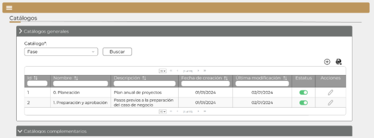
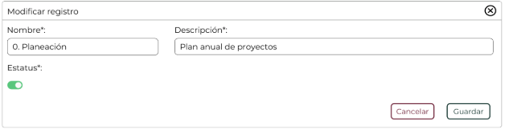
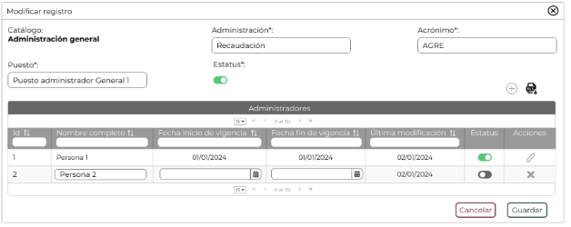

||Administración General de Comunicaciones y Tecnologías de la Información|
| :- | -: |
||Marco Documental 7.0|
|Fecha de aprobación del Template: 02/08/2023|
**Especificación de Interacción de Usuario**

17\_3083\_EIU\_ModificarCatalogos.docx
|Versión del template: 7.00|
| :-: | :-: | :-: |

**<ID Requerimiento>**8309

**Nombre del Requerimiento:** TI\_SISECOFI-SAT\_Seguimiento financiero y control documental de proyectos de contratación

## **Tabla de Versiones y Modificaciones**

|Versión|Descripción del cambio|Responsable de la Versión|Fecha|
| :-: | :-: | :-: | :-: |
|*1*|*Creación del documento*|Eduardo Acosta Mora|*08/01/2024*|
|*1.1*|*Revisión del documento*|Luis Angel Olguin Castillo|25/01/2024|
|*1.2*|*Versión aprobada para firma*|
María del Carmen Castillejos Cárdenas

Rubén Delgado Ramírez
|06/06/2024|

**TABLA DE CONTENIDO**

[Tabla de Versiones y Modificaciones	1](#_toc168648297)

[Módulo: MODIFICAR CATÁLOGOS	2](#_toc168648298)

[ESTILOS 01	2](#_toc168648299)

[Descripción de Elementos	3](#_toc168648300)

[Descripción de Campos	4](#_toc168648301)

[ESTILOS 02	8](#_toc168648302)

[Descripción de Elementos	9](#_toc168648303)

[Descripción de Campos	9](#_toc168648304)

[ESTILOS 03	12](#_toc168648305)

[Descripción de Elementos	13](#_toc168648306)

[Descripción de Campos	16](#_toc168648307)

[ESTILOS 04	29](#_toc168648308)

[Descripción de Elementos	30](#_toc168648309)

[Descripción de Campos	31](#_toc168648310)

[ESTILOS 05	36](#_toc168648311)

[Descripción de Elementos	37](#_toc168648312)

[Descripción de Campos	39](#_toc168648313)

[ESTILOS 06	47](#_toc168648314)

[Descripción de Elementos	48](#_toc168648315)

[Descripción de Campos	48](#_toc168648316)

## **MÓDULO: MODIFICAR CATÁLOGOS**
## **ESTILOS 01**

|**Nombre de la Pantalla:**|Catálogos generales|
| :- | - |
|**Objetivo:**|Permite buscar y gestionar los registros del catálogo general seleccionado.|
|**Casos de uso relacionados:**|17\_3083\_ECU\_ModificarCatalogos|
|||

**Nota:** Los datos mencionados en la tabla son solo de ejemplo.

### **DESCRIPCIÓN DE ELEMENTOS** 

|**Elemento**|**Descripción**|
| :- | :- |
|![ref1]|Opción que al seleccionarla muestra el menú principal desplegado en la parte izquierda de la pantalla. Contiene los módulos principales y submódulos de este sistema.|
|Catálogos|Título que identifica el submódulo a donde ingresa el Empleado SAT.|
|![ref2]|
Opción que despliega o contrae la sección tomando en cuenta lo siguiente:

Sección contraída ![Forma

Descripción generada automáticamente con confianza baja]

Sección desplegada ![Forma

Descripción generada automáticamente con confianza baja]
|
|Catálogos generales|Sección que permite gestionar los catálogos generales.|
|Catálogo\*:|Permite seleccionar un catálogo general administrado por el sistema.|
|Buscar|Opción que permite iniciar la búsqueda de información en la base de datos de acuerdo con lo seleccionado en el campo “Catálogo” en la sección “Catálogos generales”.|
|![ref3]|Opción que permite crear un nuevo registro en un catálogo general.|
|![ref4]|Opción que permite exportar la información de la base de datos de acuerdo con la opción seleccionada en el campo “Catálogo”, generando un archivo de Excel con extensión (.xlsx).|
|![ref5]|Paginador que permite navegar a través de las páginas resultantes de la consulta, considerando que el sistema debe mostrar inicialmente 15 registros por página, permitiendo visualizar entre 15, 50 y 100 registros por página. |
|Id|Campo incremental que se asigna de manera automática para identificar el registro ingresado. |
|Nombre|Indica el nombre de cada registro relacionado al catálogo.|
|Descripción|Indica la descripción de cada registro relacionado al catálogo.|
|Fecha de creación|Indica la fecha de creación de cada registro relacionado al catálogo.|
|Última modificación|Indica la fecha de última modificación de cada registro relacionado al catálogo.|
|Estatus|
Indica el estatus del registro mediante los íconos:

![ref6] Activo 

![ref7] Inactivo
|
|Acciones|Indica las acciones que se pueden hacer con los registros mediante el ícono ![ref8].|
|![ref9]|Opción que permite abrir una ventana emergente para la edición del registro.|
|![ref10]|
Opción que permite modificar el estatus del registro a estado activo o inactivo de la siguiente forma: 

![ref11] Activo

 Inactivo
|
|![ref12]|Opción que ordena la información de la tabla de forma ascendente o descendente y de forma alfabética, según aplique.|
|![ref13]|Campo para filtrar información de la columna en la que se requiere buscar específicamente.|
|Catálogos complementarios|Sección que permite gestionar los catálogos complementarios.|

### **DESCRIPCIÓN DE CAMPOS**

|**Elemento**|**Tipo**|**Longitud**|
**Nivel de Acceso**

**(L, E, S)**
|**Descripción del Campo**|**Fórmulas**|**Precisiones**|
| :-: | :-: | :-: | :-: | :-: | :-: | :-: |
|![ref1]|Ícono|N/A|S|Opción que al seleccionarla muestra el menú principal desplegado en la parte izquierda de la pantalla. Contiene los módulos principales y submódulos de este sistema.|N/A|N/A|
|Catálogos|Texto|N/A|L|Título que identifica el submódulo a donde ingresa el Empleado SAT.|N/A|N/A|
|![ref2]|Ícono|N/A|S|Opción que despliega o contrae la sección.|N/A|
Sección contraída ![Forma

Descripción generada automáticamente con confianza baja]

Sección desplegada ![Forma

Descripción generada automáticamente con confianza baja]
|
|Catálogos generales|Sección|N/A|S|Sección que permite gestionar los catálogos generales.|N/A|N/A|
|Catálogo\*:|Lista de selección|N/A|S|Permite seleccionar un catálogo general administrado por el sistema.|N/A|Campo obligatorio|
|Buscar|Botón|N/A|S|Opción que permite iniciar la búsqueda de información en la base de datos de acuerdo con lo seleccionado en el campo “Catálogo” en la sección “Catálogos generales”.|N/A|
Inicialmente se muestra sin color de fondo y con contorno y letras en color gris.

Cuando se pone el cursor encima debe cambiar a fondo gris y letras negras.
|
|![ref3]|Ícono|N/A|S|Opción que permite crear un nuevo registro en un catálogo general.|N/A|Usar *tooltip* que muestre el nombre de la opción “Nuevo”.|
|![ref4]|Ícono|N/A|S|Opción que permite exportar la información de la base de datos de acuerdo con la opción seleccionada en el campo “Catálogo”, generando un archivo de Excel con extensión (.xlsx).|N/A|Usar *tooltip* que muestre el nombre de la opción “Exportar a Excel”.|
|![ref5]|Paginador|N/A|S|Permite navegar a través de las páginas resultantes de la consulta.|N/A|Inicialmente se deben mostrar 15 registros por página, permitiendo visualizar entre 15, 50 y 100 registros por página.|
|Id|Número|5|L|Campo incremental que se asigna de manera automática para identificar el registro ingresado.|N/A|N/A|
|Nombre|Alfanumérico|150|L|Indica el nombre de cada registro relacionado al catálogo.|N/A|N/A|
|Descripción|Texto|300|L|Indica la descripción de cada registro relacionado al catálogo.|N/A|N/A|
|Fecha de creación|Fecha|10|L|Indica la fecha de creación de cada registro relacionado al catálogo.|N/A|Formato de fecha DD/MM/AAAA|
|Última modificación|Fecha|10|L|Indica la fecha de última modificación de cada registro relacionado al catálogo.|N/A|Formato de fecha DD/MM/AAAA|
|Estatus|Texto|N/A|L|Indica el estatus del registro.|N/A|
![ref6]Activo

![ref14]Inactivo
|
|Acciones|Texto|N/A|L|Indica las acciones que se pueden hacer con los registros mediante el ícono ![ref8].|N/A|N/A|
|![ref9]|Ícono|N/A|S|Opción que permite abrir una ventana emergente para la edición del registro.|N/A|Usar *tooltip* que muestre el nombre de la opción “Editar”.|
|![ref10]|Ícono|N/A|S|Opción que permite modificar el estatus del registro a estado activo o inactivo.|N/A|
![ref6]Activo

![ref7]Inactivo

Usar *tooltip* que muestre el nombre de la opción “Estatus”.
|
|![ref12]|Ícono|N/A|S|Opción que ordena la información de la tabla de forma ascendente o descendente y de forma alfabética, según aplique.|N/A|N/A|
||Filtro|N/A|E|Campo para filtrar información de la columna en la que se requiere buscar específicamente.|N/A|Realiza el filtro de la información solo dentro de la tabla que se visualiza.|
|Catálogos complementarios|Sección|N/A|S|Sección que permite gestionar los catálogos complementarios.|N/A|Sección contraída.|

## **ESTILOS 02**

|**Nombre de la Pantalla:**|Modificar registro|
| :- | - |
|**Objetivo:**|Permite al Empleado SAT modificar la información para un registro de catálogos generales o complementarios de tipo alineación.|
|**Casos de uso relacionados:**|17\_3083\_ECU\_ModificarCatalogos|
|||

**Nota:** Los datos mencionados en la tabla son solo de ejemplo.

### **DESCRIPCIÓN DE ELEMENTOS** 

|**Elemento**|**Descripción**|
| :- | :- |
|Modificar registro|Título de la ventana emergente.|
|![ref15]|Opción que permite cerrar la ventana emergente.|
|Nombre\*:|Permite ingresar el nombre del registro que se modificará en un catálogo general o en un catálogo complementario de tipo alineación.|
|Descripción\*:|Permite ingresar la descripción del registro que se modificará en un catálogo general o en un catálogo complementario de tipo alineación.|
|Estatus\*:|
Indica el estatus del registro mediante los íconos:

![ref11] Activo

![ref16] Inactivo
|
|![ref10]|
Opción que permite modificar el estatus del registro a estado activo o inactivo de la siguiente forma: 

![ref11] Activo

![ref16] Inactivo
|
|Cancelar|Opción que realiza el proceso para cancelar la acción y regresa al último estado guardado. |
|Guardar|Opción que inicia el proceso para almacenar en la base de datos la información ingresada para el registro. |

### **DESCRIPCIÓN DE CAMPOS**

|**Elemento**|**Tipo**|**Longitud**|
**Nivel de Acceso**

**(L, E, S)**
|**Descripción del Campo**|**Fórmulas**|**Precisiones**|
| :-: | :-: | :-: | :-: | :-: | :-: | :-: |
|Modificar registro|Texto|N/A|L|Título de la ventana emergente.|N/A|N/A|
|![ref15]|Ícono|N/A|S|Opción que permite cerrar la ventana emergente.|N/A|Usar *tooltip* que muestre el nombre de la opción “Cerrar ventana”.|
|Nombre\*:|Alfanumérico|150|E|Permite ingresar el nombre del registro que se modificará en un catálogo general o en un catálogo complementario de tipo alineación.|N/A|
Campo obligatorio

Usar *tooltip* “Información que aparecerá en las listas de selección”.
|
|Descripción\*:|Texto|300|E|Permite ingresar la descripción del registro que se modificará en un catálogo general o en un catálogo complementario de tipo alineación.|N/A|Campo obligatorio|
|Estatus\*:|Texto|N/A|L|Indica el estatus del registro.|N/A|
![ref11]Activo

![ref16]Inactivo

Campo obligatorio
|
|![ref10]|Ícono|N/A|S|Opción que permite modificar el estatus del registro a estado activo o inactivo.|N/A|

![ref11]Activo

![ref16]Inactivo

Usar *tooltip* que muestre el nombre de la opción “Estatus”.
|
|Cancelar|Botón|N/A|S|Opción que realiza el proceso para cancelar la acción y regresa al último estado guardado.|N/A|
Inicialmente, se muestra sin color de fondo y con el texto y contorno en color guinda (#691c32).

Cuando se le pone el cursor encima debe cambiar a fondo guinda (#691c32) y letras blancas.
|
|Guardar|Botón|N/A|S|Opción que inicia el proceso para almacenar en la base de datos la información ingresada para el registro.|N/A|
Inicialmente, se muestra sin color de fondo y con el texto y contorno en color verde oscuro (#10312B).

Cuando se le pone el cursor encima debe cambiar a fondo verde oscuro (#10312B) y letras blancas.
|

## **ESTILOS 03**

|**Nombre de la Pantalla:**|Catálogos complementarios (Administración general)|
| :- | - |
|**Objetivo:**|Permite buscar y administrar los registros de la estructura organizacional.|
|**Casos de uso relacionados:**|17\_3083\_ECU\_ModificarCatalogos|
|||

**Nota:** Los datos mencionados en la tabla son solo de ejemplo.

### **DESCRIPCIÓN DE ELEMENTOS** 

|**Elemento**|**Descripción**|
| :- | :- |
|![ref1]|Opción que al seleccionarla muestra el menú principal desplegado en la parte izquierda de la pantalla. Contiene los módulos principales y submódulos de este sistema.|
|Catálogos|Título que identifica el submódulo a donde ingresa el Empleado SAT.|
|![ref2]|
Opción que despliega o contrae la sección tomando en cuenta lo siguiente:

Sección contraída ![Forma

Descripción generada automáticamente con confianza baja]

Sección desplegada ![Forma

Descripción generada automáticamente con confianza baja]
|
|Catálogos generales|Sección que permite gestionar los catálogos generales.|
|Catálogos complementarios|Sección que permite gestionar los catálogos complementarios.|
|Catálogo\*:|Permite seleccionar un catálogo complementario.|
|Buscar|Opción que permite iniciar la búsqueda de información en la base de datos de acuerdo con lo seleccionado en el campo “Catálogo” de la sección “Catálogos complementarios”.|
|![ref3]|Opción que permite crear un nuevo registro de una administración general.|
|![ref4]|Opción que permite exportar la información de la base de datos de acuerdo con la opción seleccionada en el campo “Catálogo”, generando un archivo de Excel con extensión (.xlsx).|
|![ref5]|Paginador que permite navegar a través de las páginas resultantes de la consulta, considerando que el sistema debe mostrar inicialmente 15 registros por página, permitiendo visualizar entre 15, 50 y 100 registros por página. |
|Id|Campo incremental que se asigna de manera automática para identificar el registro ingresado. |
|Administración|Indica el nombre de las administraciones generales relacionadas al catálogo.|
|Acrónimo|Indica el acrónimo de cada administración general.|
|Administrador general|Indica el nombre del administrador para cada administración general.|
|Puesto|Indica el puesto para cada administración general.|
|Fecha de creación|Indica la fecha de creación de cada registro relacionado al catálogo.|
|Última modificación|Indica la fecha de última modificación de cada registro relacionado al catálogo.|
|Estatus |
Indica el estatus del registro mediante los íconos:

![ref6] Activo 

![ref14] Inactivo
|
|Acciones|Indica las acciones que se pueden hacer con los registros mediante el ícono ![ref8].|
|![ref9]|Opción que permite abrir una ventana emergente para la edición del registro.|
|![ref10]|
Opción que permite modificar el estatus del registro a estado activo o inactivo de la siguiente forma: 

![ref11] Activo

![ref17] Inactivo
|
|![ref12]|Opción que ordena la información de la tabla de forma ascendente o descendente y de forma alfabética, según aplique.|
|![ref13]|Campo para filtrar información de la columna en la que se requiere buscar específicamente.|
|![ref18]|Permite desplazarse de manera horizontal en la tabla. |
|![ref19]|Permite desplazarse de manera vertical en la tabla. |
|Administraciones centrales|Sección que permite gestionar los subcatálogos de las administraciones centrales.|
|Administración general\*:|Permite seleccionar una administración general.|
|Buscar|Opción que permite iniciar la búsqueda de información en la base de datos de acuerdo con lo seleccionado en el campo “Administración general” de la sección “Administraciones centrales”.|
|![ref3]|Opción que permite crear un nuevo registro de una administración central.|
|![ref4]|Opción que permite exportar la información de la base de datos de acuerdo con la opción seleccionada en el campo “Administración general” de la sección “Administraciones centrales”., generando un archivo de Excel con extensión (.xlsx).|
|![ref5]|Paginador que permite navegar a través de las páginas resultantes de la consulta, considerando que el sistema debe mostrar inicialmente 15 registros por página, permitiendo visualizar entre 15, 50 y 100 registros por página. |
|Id|Campo incremental que se asigna de manera automática para identificar el registro ingresado. |
|Administración|Indica el nombre de las administraciones centrales relacionadas al catálogo.|
|Acrónimo|Indica el acrónimo de cada administración central.|
|Administrador central|Indica el nombre del administrador para cada administración central.|
|Puesto|Indica el puesto para cada administración central.|
|Fecha de creación|Indica la fecha de creación de cada registro relacionado al catálogo.|
|Última modificación|Indica la fecha de última modificación de cada registro relacionado al catálogo.|
|Estatus |
Indica el estatus del registro mediante los íconos:

![ref6] Activo 

![ref14]Inactivo
|
|Acciones|Indica las acciones que se pueden hacer con los registros mediante el ícono ![ref8].|
|![ref9]|Opción que permite abrir una ventana emergente para la edición del registro.|
|![ref10]|
Opción que permite modificar el estatus del registro a estado activo o inactivo de la siguiente forma: 

![ref11] Activo

![ref17] Inactivo
|
|![ref12]|Opción que ordena la información de la tabla de forma ascendente o descendente y de forma alfabética, según aplique.|
|![ref13]|Campo para filtrar información de la columna en la que se requiere buscar específicamente.|
|![ref18]|Permite desplazarse de manera horizontal en la tabla. |
|![ref19]|Permite desplazarse de manera vertical en la tabla. |
|Administraciones|Sección que permite gestionar los Subcatálogos de las administraciones (Áreas).|
|Administración central:|Permite seleccionar una administración central.|
|Buscar|Opción que permite iniciar la búsqueda de información en la base de datos de acuerdo con lo seleccionado en el campo “Administración central” de la sección “Administraciones”.|
|![ref3]|Opción que permite crear un nuevo registro en una administración.|
|![ref4]|Opción que permite exportar la información de la base de datos de acuerdo con la opción seleccionada en el campo “Administración central”, generando un archivo de Excel con extensión (.xlsx).|
|![ref5]|Paginador que permite navegar a través de las páginas resultantes de la consulta, considerando que el sistema debe mostrar inicialmente 15 registros por página, permitiendo visualizar entre 15, 50 y 100 registros por página. |
|Id|Campo incremental que se asigna de manera automática para identificar el registro ingresado. |
|Área|Indica las áreas relacionadas a la administración central.|
|Acrónimo|Indica el acrónimo de cada área.|
|Administrador de área|Indica el nombre del administrador para cada área.|
|Puesto|Indica el puesto para cada administrador de área.|
|Fecha de creación|Indica la fecha de creación de cada registro relacionado al catálogo.|
|Última modificación|Indica la fecha de última modificación de cada registro relacionado al catálogo.|
|Estatus |
Indica el estatus del registro mediante los íconos:

![ref6] Activo 

![ref14] Inactivo
|
|Acciones|Indica las acciones que se pueden hacer con los registros mediante el ícono ![ref8].|
|![ref9]|Opción que permite abrir una ventana emergente para la edición del registro.|
|![ref10]|
Opción que permite modificar el estatus del registro a estado activo o inactivo de la siguiente forma: 

![ref11] Activo

![ref17] Inactivo
|
|![ref12]|Opción que ordena la información de la tabla de forma ascendente o descendente y de forma alfabética, según aplique.|
|![ref13]|Campo para filtrar información de la columna en la que se requiere buscar específicamente.|
|![ref18]|Permite desplazarse de manera horizontal en la tabla. |
|![ref19]|Permite desplazarse de manera vertical en la tabla. |

### **DESCRIPCIÓN DE CAMPOS**

|**Elemento**|**Tipo**|**Longitud**|
**Nivel de Acceso**

**(L, E, S)**
|**Descripción del Campo**|**Fórmulas**|**Precisiones**|
| :-: | :-: | :-: | :-: | :-: | :-: | :-: |
|![ref1]|Ícono|N/A|S|Opción que al seleccionarla muestra el menú principal desplegado en la parte izquierda de la pantalla. Contiene los módulos principales y submódulos de este sistema.|N/A|N/A|
|Catálogos|Texto|N/A|L|Título que identifica el submódulo a donde ingresa el Empleado SAT.|N/A|N/A|
|![ref2]|Ícono|N/A|S|Opción que despliega o contrae la sección.|N/A|
Sección contraída ![Forma

Descripción generada automáticamente con confianza baja]

Sección desplegada ![Forma

Descripción generada automáticamente con confianza baja]
|
|Catálogos generales|Sección|N/A|S|Sección que permite gestionar los catálogos generales.|N/A|Sección contraída|
|Catálogos complementarios|Sección|N/A|S|Sección que permite gestionar los catálogos complementarios.|N/A|N/A|
|Catálogo\*:|Lista de selección|N/A|S|Permite seleccionar un catálogo complementario.|N/A|Campo obligatorio|
|Buscar|Botón|N/A|S|Opción que permite iniciar la búsqueda de información en la base de datos de acuerdo con lo seleccionado en el campo “Catálogo” de la sección “Catálogos complementarios”.|N/A|
Inicialmente se muestra sin color de fondo y con contorno y letras en color gris.

Cuando se pone el cursor encima debe cambiar a fondo gris y letras negras.
|
|![ref3]|Ícono|N/A|S|Opción que permite crear un nuevo registro de una administración general.|N/A|Usar *tooltip* que muestre el nombre de la opción “Nuevo”.|
|![ref4]|Ícono|N/A|S|Opción que permite exportar la información de la base de datos de acuerdo con la opción seleccionada en el campo “Catálogo”, generando un archivo de Excel con extensión (.xlsx).|N/A|Usar *tooltip* que muestre el nombre de la opción “Exportar a Excel”.|
|![ref5]|Paginador|N/A|S|Permite navegar a través de las páginas resultantes de la consulta.|N/A|Inicialmente se deben mostrar 15 registros por página, permitiendo visualizar entre 15, 50 y 100 registros por página.|
|Id|Número|5|L|Campo incremental que se asigna de manera automática para identificar el registro ingresado.|N/A|N/A|
|Administración|Alfanumérico|150|L|Indica el nombre de las administraciones generales relacionadas al catálogo.|N/A|N/A|
|Acrónimo|Alfanumérico|20|L|Indica el acrónimo de cada administración general.|N/A|N/A|
|Administrador general|Alfanumérico|150|L|Indica el nombre del administrador para cada administración general.|N/A|Deberá tomar el registro activo de la tabla (Administradores) relacionado al puesto.|
|Puesto|Alfanumérico|150|L|Indica el puesto para cada administración general.|N/A|N/A|
|Fecha de creación|Fecha|10|L|Indica la fecha de creación de cada registro relacionado al catálogo.|N/A|Formato de fecha DD/MM/AAAA|
|Última modificación|Fecha|10|L|Indica la fecha de última modificación de cada registro relacionado al catálogo.|N/A|Formato de fecha DD/MM/AAAA|
|Estatus|Texto|N/A|L|Indica el estatus del registro.|N/A|
![ref6]Activo

![ref14]Inactivo
|
|Acciones|Texto|N/A|L|Indica las acciones que se pueden hacer con los registros mediante el ícono ![ref8].|N/A|N/A|
|![ref9]|Ícono|N/A|S|Opción que permite abrir una ventana emergente para la edición del registro.|N/A|Usar *tooltip* que muestre el nombre de la opción “Editar”.|
|![ref10]|Ícono|N/A|S|Opción que permite modificar el estatus del registro a estado activo o inactivo.|N/A|
![ref6]Activo

![ref20]Inactivo

Usar *tooltip* que muestre el nombre de la opción “Estatus”.
|
|![ref12]|Ícono|N/A|S|Opción que ordena la información de la tabla de forma ascendente o descendente y de forma alfabética, según aplique.|N/A|N/A|
||Filtro|N/A|E|Campo para filtrar información de la columna en la que se requiere buscar específicamente.|N/A|Realiza el filtro de la información solo dentro de la tabla que se visualiza.|
|![ref18]|Barra de desplazamiento|N/A|S|Permite desplazarse de manera horizontal en la tabla.|N/A|N/A|
|![ref19]|Barra de desplazamiento|N/A|S|Permite desplazarse de manera vertical en la tabla.|N/A|N/A|
|Administraciones centrales|Sección|N/A|L|Sección que permite gestionar los subcatálogos de las administraciones centrales.|N/A|N/A|
|Administración general\*:|Lista de selección|N/A|S|Permite seleccionar una administración general.|N/A|Campo obligatorio|
|Buscar|Botón|N/A|S|Opción que permite iniciar la búsqueda de información en la base de datos de acuerdo con lo seleccionado en el campo “Administración general” de la sección “Administraciones centrales”.|N/A|
Inicialmente se muestra sin color de fondo y con contorno y letras en color gris.

Cuando se pone el cursor encima debe cambiar a fondo gris y letras negras.
|
|![ref3]|Ícono|N/A|S|Opción que permite crear un nuevo registro de una administración central.|N/A|Usar *tooltip* que muestre el nombre de la opción “Nuevo”.|
|![ref4]|Ícono|N/A|S|Opción que permite exportar la información de la base de datos de acuerdo con la opción seleccionada en el campo “Administración general” de la sección “Administraciones centrales”., generando un archivo de Excel con extensión (.xlsx).|N/A|Usar *tooltip* que muestre el nombre de la opción “Exportar a Excel”.|
|![ref5]|Paginador|N/A|S|Permite navegar a través de las páginas resultantes de la consulta.|N/A|Inicialmente se deben mostrar 15 registros por página, permitiendo visualizar entre 15, 50 y 100 registros por página.|
|Id|Número|5|L|Campo incremental que se asigna de manera automática para identificar el registro ingresado.|N/A|N/A|
|Administración|Alfanumérico|150|L|Indica el nombre de las administraciones centrales relacionadas al catálogo.|N/A|N/A|
|Acrónimo|Alfanumérico|20|L|Indica el acrónimo de cada administración central.|N/A|N/A|
|Administrador central|Alfanumérico|150|L|Indica el nombre del administrador para cada administración central.|N/A|Deberá tomar el registro activo de la tabla (Administradores) relacionado al puesto.|
|Puesto|Alfanumérico|150|L|Indica el puesto para cada administración central.|N/A|N/A|
|Fecha de creación|Fecha|10|L|Indica la fecha de creación de cada registro relacionado al catálogo.|N/A|Formato de fecha DD/MM/AAAA|
|Última modificación|Fecha|10|L|Indica la fecha de última modificación de cada registro relacionado al catálogo.|N/A|Formato de fecha DD/MM/AAAA|
|Estatus|Texto|N/A|L|Indica el estatus del registro.|N/A|
![ref6]Activo

![ref14]Inactivo
|
|Acciones|Texto|N/A|L|Indica las acciones que se pueden hacer con los registros mediante el ícono ![ref8].|N/A|N/A|
|![ref9]|Ícono|N/A|S|Opción que permite abrir una ventana emergente para la edición del registro.|N/A|Usar *tooltip* que muestre el nombre de la opción “Editar”.|
|![ref10]|Ícono|N/A|S|Opción que permite modificar el estatus del registro a estado activo o inactivo.|N/A|
![ref6]Activo

![ref20]Inactivo

Usar *tooltip* que muestre el nombre de la opción “Estatus”.
|
|![ref12]|Ícono|N/A|S|Opción que ordena la información de la tabla de forma ascendente o descendente y de forma alfabética, según aplique.|N/A|N/A|
||Filtro|N/A|E|Campo para filtrar información de la columna en la que se requiere buscar específicamente.|N/A|Realiza el filtro de la información solo dentro de la tabla que se visualiza.|
|![ref18]|Barra de desplazamiento|N/A|S|Permite desplazarse de manera horizontal en la tabla.|N/A|N/A|
|![ref19]|Barra de desplazamiento|N/A|S|Permite desplazarse de manera vertical en la tabla.|N/A|N/A|
|Administraciones|Sección|N/A|L|Sección que permite gestionar los Subcatálogos de las administraciones (Áreas).|N/A|N/A|
|Administración central\*:|Lista de selección|N/A|S|Permite seleccionar una administración central.|N/A|Campo obligatorio|
|Buscar|Botón|N/A|S|Opción que permite iniciar la búsqueda de información en la base de datos de acuerdo con lo seleccionado en el campo “Administración central” de la sección “Administraciones”.|N/A|
Inicialmente se muestra sin color de fondo y con contorno y letras en color gris.

Cuando se pone el cursor encima debe cambiar a fondo gris y letras negras.
|
|![ref3]|Ícono|N/A|S|Opción que permite crear un nuevo registro en una administración.|N/A|Usar *tooltip* que muestre el nombre de la opción “Nuevo”.|
|![ref4]|Ícono|N/A|S|Opción que permite exportar la información de la base de datos de acuerdo con la opción seleccionada en el campo “Administración central”, generando un archivo de Excel con extensión (.xlsx).|N/A|Usar *tooltip* que muestre el nombre de la opción “Exportar a Excel”.|
|![ref5]|Paginador|N/A|S|Permite navegar a través de las páginas resultantes de la consulta.|N/A|Inicialmente se deben mostrar 15 registros por página, permitiendo visualizar entre 15, 50 y 100 registros por página.|
|Id|Número|5|L|Campo incremental que se asigna de manera automática para identificar el registro ingresado.|N/A|N/A|
|Área|Alfanumérico|150|L|Indica las áreas relacionadas a la administración central.|N/A|N/A|
|Acrónimo|Alfanumérico|20|L|Indica el acrónimo de cada área.|N/A|N/A|
|Administrador de área|Alfanumérico|150|L|Indica el nombre del administrador para cada área.|N/A|Deberá tomar el registro activo de la tabla (Administradores) relacionado al puesto.|
|Puesto|Alfanumérico|150|L|Indica el puesto para cada administración de área.|N/A|N/A|
|Fecha de creación|Fecha|10|L|Indica la fecha de creación de cada registro relacionado al catálogo.|N/A|Formato de fecha DD/MM/AAAA|
|Última modificación|Fecha|10|L|Indica la fecha de última modificación de cada registro relacionado al catálogo.|N/A|Formato de fecha DD/MM/AAAA|
|Estatus|Texto|N/A|L|Indica el estatus del registro.|N/A|
![ref6]Activo

![ref14]Inactivo
|
|Acciones|Texto|N/A|L|Indica las acciones que se pueden hacer con los registros mediante el ícono ![ref8].|N/A|N/A|
|![ref9]|Ícono|N/A|S|Opción que permite abrir una ventana emergente para la edición del registro.|N/A|Usar *tooltip* que muestre el nombre de la opción “Editar”.|
|![ref10]|Ícono|N/A|S|Opción que permite modificar el estatus del registro a estado activo o inactivo.|N/A|
![ref6]Activo

![ref20]Inactivo

Usar *tooltip* que muestre el nombre de la opción “Estatus”.
|
|![ref12]|Ícono|N/A|S|Opción que ordena la información de la tabla de forma ascendente o descendente y de forma alfabética, según aplique.|N/A|N/A|
|![ref13]|Filtro|N/A|E|Campo para filtrar información de la columna en la que se requiere buscar específicamente.|N/A|Realiza el filtro de la información solo dentro de la tabla que se visualiza.|
|![ref18]|Barra de desplazamiento|N/A|S|Permite desplazarse de manera horizontal en la tabla.|N/A|N/A|
|![ref19]|Barra de desplazamiento|N/A|S|Permite desplazarse de manera vertical en la tabla.|N/A|N/A|

## **ESTILOS 04**

|**Nombre de la Pantalla:**|Modificar registro, estructura organizacional.|
| :- | - |
|**Objetivo:**|Permite al Empleado SAT modificar la información para un registro de la estructura organizacional.|
|**Casos de uso relacionados:**|17\_3083\_ECU\_ModificarCatalogos|
|||

**Nota:** Los datos mencionados en la tabla son solo de ejemplo.

### **DESCRIPCIÓN DE ELEMENTOS** 

|**Elemento**|**Descripción**|
| :- | :- |
|Modificar registro|Título de la ventana emergente.|
|![ref15]|Opción que permite cerrar la ventana emergente.|
|Catálogo: |Campo que indica el catálogo complementario o sección al que se le modificará un registro.|
|Administración\*:|Campo que permite ingresar la administración de la sección que lo invoca.|
|Acrónimo\*:|Campo que permite ingresar el acrónimo de la administración de la sección que lo invoca.|
|Puesto\*:|Campo que permite ingresar el puesto del administrador de la sección que lo invoca.|
|Estatus\*:|
Indica el estatus del registro mediante los íconos:

![ref11]  Activo

![ref16]  Inactivo
|
|![ref10]|
Opción que permite modificar el estatus del registro a estado activo o inactivo de la siguiente forma: 

![ref11]  Activo

![ref16] Inactivo
|
|Administradores|Indica el título de la tabla.|
|![ref21]|Opción que ordena la información de la tabla de forma ascendente o descendente y de forma alfabética, según aplique.|
|![ref22]![ref23]![ref23]![ref23]![ref23]|Campo para filtrar información de la columna donde se requiera buscar específicamente.|
|![ref5]|Paginador que permite navegar a través de las páginas resultantes de la consulta, considerando que el sistema debe mostrar inicialmente 15 registros por página, permitiendo visualizar entre 15, 50 y 100 registros por página. |
|Id|Campo incremental que se asigna de manera automática para identificar el administrador.|
|Nombre completo|Indica y permite ingresar el nombre completo del administrador.|
|Fecha inicio de vigencia|Indica y permite ingresar o seleccionar la fecha inicio de vigencia del administrador.|
|Fecha fin de vigencia|Indica y permite ingresar o seleccionar la fecha fin de vigencia del administrador.|
|Última modificación|Indica la fecha de última modificación de cada registro relacionado al catálogo.|
|Estatus|
Indica el estatus del registro mediante los íconos:

![ref11]  Activo

![ref16] Inactivo
|
|![ref10]|
Opción que permite modificar el estatus del del administrador a estado activo o inactivo de la siguiente forma: 

![ref11]  Activo

![ref16] Inactivo
|
|Acciones|Indica las acciones que se pueden hacer con los registros, mediante las opciones ![ref8] y ![ref24].|
|![ref25]|
Opción que habilita los campos y permite editar el registro de la tabla. 

- Se mostrará activo cuando sea un registro existente en la base de datos (BD).

- Se mostrará inactivo cuando sea un registro nuevo.
|
|![ref26]|Opción que permite descartar la acción.|
|Cancelar|Opción que realiza el proceso para cancelar la acción y regresa al último estado guardado. |
|Guardar|Opción que inicia el proceso para almacenar en la BD la información ingresada para el registro. |

### **DESCRIPCIÓN DE CAMPOS**

|**Elemento**|**Tipo**|**Longitud**|
**Nivel de Acceso**

**(L, E, S)**
|**Descripción del Campo**|**Fórmulas**|**Precisiones**|
| :-: | :-: | :-: | :-: | :-: | :-: | :-: |
|Modificar registro|Texto|N/A|L|Título de la ventana emergente.|N/A|N/A|
|![ref15]|Ícono|N/A|S|Opción que permite cerrar la ventana emergente.|N/A|Usar *tooltip* que muestre el nombre de la opción “Cerrar ventana”.|
|Catálogo:|Texto|N/A|L|Campo que indica el catálogo complementario o sección al que se le modificará un registro.|N/A|N/A|
|Administración\*:|Alfanumérico|150|E|Campo que permite ingresar la administración de la sección que lo invoca.|N/A|Campo obligatorio.|
|Acrónimo\*:|Alfanumérico|20|E|Campo que permite ingresar el acrónimo de la administración de la sección que lo invoca.|N/A|Campo obligatorio.|
|Puesto\*:|Alfanumérico|150|E|Campo que permite ingresar el puesto del administrador de la sección que lo invoca.|N/A|Campo obligatorio.|
|Estatus\*:|Texto|N/A|L|Campo que indica el estatus del registro.|N/A|
![ref11]Activo

![ref16]Inactivo

Campo obligatorio.
|
|![ref10]|Ícono|N/A|S|Opción que permite modificar el estatus del registro a estado activo o inactivo.|N/A|

![ref11]Activo

![ref16]Inactivo

Usar *tooltip* que muestre el nombre de la opción “Estatus”.
|
|Administradores|Texto|N/A|L|Indica el título de la tabla.|N/A|N/A|
|![ref21]|Ícono|N/A|S|Opción que ordena la información de la tabla de forma ascendente o descendente y de forma alfabética, según aplique.|N/A|N/A|
|![ref27]|Filtro|N/A|E|Campo para filtrar información de la columna en la que se requiere buscar específicamente.|N/A|Realiza el filtro de la información solo dentro de la página que se visualiza.|
|![ref5]|Paginador|N/A|S|Permite navegar a través de las páginas resultantes de la consulta.|N/A|Inicialmente, se deben mostrar 15 registros por página, permitiendo seleccionar el visualizar 15, 50 y 100 registros por página.|
|Id|Numérico|5|L|Campo incremental que se asigna de manera automática para identificar el administrador.|N/A|El id generado es único para cada puesto.|
|Nombre completo|Alfanumérico|150|L, E|Indica y permite ingresar el nombre completo del administrador.|N/A|
Se habilitará cuando este en modo “Editar”.

|
|Fecha inicio de vigencia|Fecha|10|L, S|Indica y permite ingresar o seleccionar la fecha inicio de vigencia del administrador.|N/A|
Formato de fecha DD/MM/AAAA

Se habilitará cuando este en modo “Editar”.
|
|Fecha fin de vigencia|Fecha|10|L, S|Indica y permite ingresar o seleccionar la fecha fin de vigencia del administrador.|N/A|
Formato de fecha DD/MM/AAAA

Se habilitará cuando este en modo “Editar”.
|
|Última modificación|Fecha|10|L|Indica la fecha de última modificación de cada registro relacionado al catálogo.|N/A|Formato de fecha DD/MM/AAAA|
|Estatus|Texto|N/A|L|Indica el estatus del registro.|N/A|
![ref11]Activo

![ref16]Inactivo
|
|![ref10]|Ícono|N/A|S|Opción que permite modificar el estatus del administrador a estado activo o inactivo.|N/A|
![ref28]Activo

![ref29]Inactivo

|
|Acciones|Texto|N/A|L|Indica las acciones que se pueden hacer con los registros, mediante las opciones ![ref8] y ![ref24].|N/A|N/A|
|![ref25]|Ícono|N/A|S|Opción que habilita los campos y permite editar el registro de la tabla.|N/A|
Se mostrará activo cuando sea un registro existente en la base de datos (BD).

Se mostrará inactivo cuando sea un registro nuevo.
|
|![ref26]|Ícono|N/A|S|Opción que permite descartar la acción|N/A|N/A|
|Cancelar|Botón|N/A|S|Opción que realiza el proceso para cancelar la acción y regresa al último estado guardado.|N/A|
Inicialmente se muestra sin color de fondo y con el texto y contorno en color guinda (#691c32).

Cuando se le pone el cursor encima debe cambiar con fondo guinda (#691c32) y letras blancas.
|
|Guardar|Botón|N/A|S|Opción que inicia el proceso para almacenar en la BD la información ingresada para el registro.|N/A|
Inicialmente se muestra sin color de fondo y con el texto y contorno en color verde oscuro (#10312B).

Cuando se le pone el cursor encima debe cambiar con fondo verde oscuro (#10312B) y letras blancas.
|

## **ESTILOS 05**

|**Nombre de la Pantalla:**|Catálogos complementarios (Alineación)|
| :- | - |
|**Objetivo:**|Permite buscar y administrar los registros del catálogo Alineación.|
|**Casos de uso relacionados:**|17\_3083\_ECU\_ModificarCatalogos|
|||

**Nota:** Los datos mencionados en la tabla son solo de ejemplo.

### **DESCRIPCIÓN DE ELEMENTOS** 

|**Elemento**|**Descripción**|
| :- | :- |
|![ref1]|Opción que al seleccionarla muestra el menú principal desplegado en la parte izquierda de la pantalla. Contiene los módulos principales y submódulos de este sistema.|
|Catálogos|Título que identifica el submódulo a donde ingresa el Empleado SAT.|
|![ref2]|
Opción que despliega o contrae la sección tomando en cuenta lo siguiente:

Sección contraída ![Forma

Descripción generada automáticamente con confianza baja]

Sección desplegada ![Forma

Descripción generada automáticamente con confianza baja]
|
|Catálogos generales|Sección que permite gestionar los catálogos generales.|
|Catálogos complementarios|Sección que permite gestionar los catálogos complementarios.|
|Catálogo\*:|Permite seleccionar un catálogo complementario administrado por el sistema.|
|Buscar|Opción que permite iniciar la búsqueda de información en la base de datos de acuerdo con lo seleccionado en el campo “Catálogo” en la sección “Catálogos complementarios”.|
|![ref3]|Opción que permite crear un nuevo registro en un catálogo complementario de tipo alineación.|
|![ref4]|Opción que permite exportar la información de la base de datos de acuerdo con la opción seleccionada en el campo “Catálogo” generando un archivo de Excel con extensión (.xlsx).|
|![ref5]|Paginador que permite navegar a través de las páginas resultantes de la consulta, considerando que el sistema debe mostrar inicialmente 15 registros por página, permitiendo visualizar entre 15, 50 y 100 registros por página. |
|Id|Campo incremental que se asigna de manera automática para identificar el registro ingresado. |
|Nombre|Indica el nombre de cada registro relacionado al catálogo.|
|Descripción|Indica la descripción de cada registro relacionado al catálogo.|
|Fecha de creación|Indica la fecha de creación de cada registro relacionado al catálogo.|
|Última modificación|Indica la fecha de última modificación de cada registro relacionado al catálogo.|
|Estatus|
Indica el estatus del registro mediante los íconos:

![ref6] Activo 

![ref20] Inactivo
|
|Acciones|Indica las acciones que se pueden hacer con los registros mediante el ícono ![ref8].|
|![ref9]|Opción que permite abrir una ventana emergente para la edición del registro.|
|![ref10]|
Opción que permite modificar el estatus del registro a estado activo o inactivo de la siguiente forma: 

![ref11] Activo

![ref30] Inactivo
|
|![ref12]|Opción que ordena la información de la tabla de forma ascendente o descendente y de forma alfabética, según aplique.|
|![ref13]|Campo para filtrar información de la columna en la que se requiere buscar específicamente.|
|Mapas - Objetivos|Sección que permite gestionar los mapas - objetivos|
|Alineación:|Permite seleccionar una alineación.|
|Buscar|Opción que permite iniciar la búsqueda de información en la base de datos de acuerdo con lo seleccionado en el campo “Alineación” en la sección “Mapas - Objetivos”.|
|![ref3]|Opción que permite crear un nuevo registro de la alineación seleccionada.|
|![ref4]|Opción que permite exportar la información de la base de datos de acuerdo con la opción seleccionada en el campo “Alineación”, generando un archivo de Excel con extensión (.xlsx).|
|![ref5]|Paginador que permite navegar a través de las páginas resultantes de la consulta, considerando que el sistema debe mostrar inicialmente 15 registros por página, permitiendo visualizar entre 15, 50 y 100 registros por página. |
|Id|Campo incremental que se asigna de manera automática para identificar el registro ingresado. |
|Objetivo|Indica el objetivo de cada registro relacionado al catálogo.|
|Descripción|Indica la descripción de cada registro relacionado al catálogo.|
|Fecha de creación|Indica la fecha de creación de cada registro relacionado al catálogo.|
|Última modificación|Indica la fecha de última modificación de cada registro relacionado al catálogo.|
|Estatus|
Indica el estatus del registro mediante los íconos:

![ref6] Activo 

![ref20] Inactivo
|
|Acciones|Indica las acciones que se pueden hacer con los registros mediante el ícono ![ref8].|
|![ref9]|Opción que permite abrir una ventana emergente para la edición del registro.|
|![ref10]|
Opción que permite modificar el estatus del registro a estado activo o inactivo de la siguiente forma: 

![ref11] Activo

![ref30] Inactivo
|
|![ref12]|Opción que ordena la información de la tabla de forma ascendente o descendente y de forma alfabética, según aplique.|
|![ref13]|Campo para filtrar información de la columna en la que se requiere buscar específicamente.|

### **DESCRIPCIÓN DE CAMPOS**

|**Elemento**|**Tipo**|**Longitud**|
**Nivel de Acceso**

**(L, E, S)**
|**Descripción del Campo**|**Fórmulas**|**Precisiones**|
| :-: | :-: | :-: | :-: | :-: | :-: | :-: |
|![ref1]|Ícono|N/A|S|Opción que al seleccionarla muestra el menú principal desplegado en la parte izquierda de la pantalla. Contiene los módulos principales y submódulos de este sistema.|N/A|N/A|
|Catálogos|Texto|N/A|L|Título que identifica el submódulo a donde ingresa el Empleado SAT.|N/A|Sección contraída.|
|![ref2]|Ícono|N/A|S|Opción que despliega o contrae la sección.|N/A|
Sección contraída ![Forma

Descripción generada automáticamente con confianza baja]

Sección desplegada ![Forma

Descripción generada automáticamente con confianza baja]
|
|Catálogos generales|Sección|N/A|S|Sección que permite gestionar los catálogos generales.|N/A|Sección contraida.|
|Catálogos complementarios|Sección|N/A|S|Sección que permite gestionar los catálogos complementarios.|N/A|N/A|
|Catálogo\*:|Lista de selección|N/A|S|Permite seleccionar un catálogo complementario administrado por el sistema.|N/A|Campo obligatorio|
|Buscar|Botón|N/A|S|Opción que permite iniciar la búsqueda de información en la base de datos de acuerdo con lo seleccionado en el campo “Catálogo” en la sección “Catálogos complementarios”.|N/A|
Inicialmente se muestra sin color de fondo y con contorno y letras en color gris.

Cuando se pone el cursor encima debe cambiar a fondo gris y letras negras.
|
|![ref3]|Ícono|N/A|S|Opción que permite crear un nuevo registro en un catálogo complementario de tipo alineación.|N/A|Usar *tooltip* que muestre el nombre de la opción “Nuevo”.|
|![ref4]|Ícono|N/A|S|Opción que permite exportar la información de la base de datos de acuerdo con la opción seleccionada en el campo “Catálogo” generando un archivo de Excel con extensión (.xlsx).|N/A|Usar *tooltip* que muestre el nombre de la opción “Exportar a Excel”.|
|![ref5]|Paginador|N/A|S|Permite navegar a través de las páginas resultantes de la consulta.|N/A|Inicialmente se deben mostrar 15 registros por página, permitiendo visualizar entre 15, 50 y 100 registros por página.|
|Id|Número|5|L|Campo incremental que se asigna de manera automática para identificar el registro ingresado.|N/A|N/A|
|Nombre|Alfanumérico|150|L|Indica el nombre de cada registro relacionado al catálogo.|N/A|N/A|
|Descripción|Texto|300|L|Indica la descripción de cada registro relacionado al catálogo.|N/A|N/A|
|Fecha de creación|Fecha|10|L|Indica la fecha de creación de cada registro relacionado al catálogo.|N/A|Formato de fecha DD/MM/AAAA|
|Última modificación|Fecha|10|L|Indica la fecha de última modificación de cada registro relacionado al catálogo.|N/A|Formato de fecha DD/MM/AAAA|
|Estatus|Texto|N/A|L|Indica el estatus del registro.|N/A|
![ref6]Activo

![ref14]Inactivo
|
|Acciones|Texto|N/A|L|Indica las acciones que se pueden hacer con los registros mediante el ícono ![ref8].|N/A|N/A|
|![ref9]|Ícono|N/A|S|Opción que permite abrir una ventana emergente para la edición del registro.|N/A|Usar *tooltip* que muestre el nombre de la opción “Editar”.|
|![ref10]|Ícono|N/A|S|Opción que permite modificar el estatus del registro a estado activo o inactivo.|N/A|
![ref6]Activo

![ref20]Inactivo

Usar *tooltip* que muestre el nombre de la opción “Estatus”.
|
|![ref12]|Ícono|N/A|S|Opción que ordena la información de la tabla de forma ascendente o descendente y de forma alfabética, según aplique.|N/A|N/A|
|![ref13]|Filtro|N/A|E|Campo para filtrar información de la columna en la que se requiere buscar específicamente.|N/A|Realiza el filtro de la información solo dentro de la tabla que se visualiza.|
|Mapas - Objetivos|Sección|N/A|L|Sección que permite gestionar los mapas - objetivos|N/A|N/A|
|Alineación\*:|Lista de selección|N/A|S|Permite seleccionar una alineación.|N/A|Campo obligatorio|
|Buscar|Botón|N/A|S|Opción que permite iniciar la búsqueda de información en la base de datos de acuerdo con lo seleccionado en el campo “Alineación” en la sección “Mapas - Objetivos”.|N/A|
Inicialmente se muestra sin color de fondo y con contorno y letras en color gris.

Cuando se pone el cursor encima debe cambiar a fondo gris y letras negras.

|
|![ref3]|Ícono|N/A|S|Opción que permite crear un nuevo registro de la alineación seleccionada.|N/A|Usar *tooltip* que muestre el nombre de la opción “Nuevo”.|
|![ref4]|Ícono|N/A|S|Opción que permite exportar la información de la base de datos de acuerdo con la opción seleccionada en el campo “Alineación”, generando un archivo de Excel con extensión (.xlsx).|N/A|Usar *tooltip* que muestre el nombre de la opción “Exportar a Excel”.|
|![ref5]|Paginador|N/A|S|Permite navegar a través de las páginas resultantes de la consulta.|N/A|Inicialmente se deben mostrar 15 registros por página, permitiendo visualizar entre 15, 50 y 100 registros por página.|
|Id|Número|5|L|Campo incremental que se asigna de manera automática para identificar el registro ingresado.|N/A|N/A|
|Objetivo|Texto|150|L|Indica el objetivo de cada registro relacionado al catálogo.|N/A|N/A|
|Descripción|Texto|300|L|Indica la descripción de cada registro relacionado al catálogo.|N/A|N/A|
|Fecha de creación|Fecha|10|L|Indica la fecha de creación de cada registro relacionado al catálogo.|N/A|Formato de fecha DD/MM/AAAA|
|Última modificación|Fecha|10|L|Indica la fecha de última modificación de cada registro relacionado al catálogo.|N/A|Formato de fecha DD/MM/AAAA|
|Estatus|Texto|N/A|L|Indica el estatus del registro.|N/A|
![ref6]Activo

![ref14]Inactivo
|
|Acciones|Texto|N/A|L|Indica las acciones que se pueden hacer con los registros mediante el ícono ![ref8].|N/A|N/A|
|![ref9]|Ícono|N/A|S|Opción que permite abrir una ventana emergente para la edición del registro.|N/A|Usar *tooltip* que muestre el nombre de la opción “Editar”.|
|![ref10]|Ícono|N/A|S|Opción que permite modificar el estatus del registro a estado activo o inactivo.|N/A|
![ref6]Activo

![ref20]Inactivo

Usar *tooltip* que muestre el nombre de la opción “Estatus”.
|
|![ref12]|Ícono|N/A|S|Opción que ordena la información de la tabla de forma ascendente o descendente y de forma alfabética, según aplique.|N/A|N/A|
||Filtro|N/A|E|Campo para filtrar información de la columna en la que se requiere buscar específicamente.|N/A|Realiza el filtro de la información solo dentro de la tabla que se visualiza.|

## **ESTILOS 06**

|**Nombre de la Pantalla:**|Modificar registro de tipo Mapas - Objetivos|
| :- | - |
|**Objetivo:**|Permite al Empleado SAT modificar la información para un registro de la sección “Mapas - Objetivos”.|
|**Casos de uso relacionados:**|17\_3083\_ECU\_ModificarCatalogos|
|||

**Nota:** Los datos mencionados en la tabla son solo de ejemplo.

### **DESCRIPCIÓN DE ELEMENTOS** 

|**Elemento**|**Descripción**|
| :- | :- |
|Modificar registro|Título de la ventana emergente.|
|![ref15]|Opción que permite cerrar la ventana emergente.|
|Objetivo\*:|Permite ingresar el objetivo del registro que se modificará.|
|Descripción\*:|Permite ingresar la descripción del registro que se modificará.|
|Estatus\*:|
Indica el estatus del registro mediante los íconos:

![ref11] Activo

![ref16] Inactivo
|
|![ref10]|
Opción que permite modificar el estatus del registro a estado activo o inactivo de la siguiente forma: 

![ref11] Activo

![ref16] Inactivo
|
|Cancelar|Opción que realiza el proceso para cancelar la acción y regresa al último estado guardado. |
|Guardar|Opción que inicia el proceso para almacenar en la base de datos la información ingresada para el registro. |

### **DESCRIPCIÓN DE CAMPOS**

|**Elemento**|**Tipo**|**Longitud**|
**Nivel de Acceso**

**(L, E, S)**
|**Descripción del Campo**|**Fórmulas**|**Precisiones**|
| :-: | :-: | :-: | :-: | :-: | :-: | :-: |
|Modificar registro|Texto|N/A|L|Título de la ventana emergente.|N/A|N/A|
|![ref15]|Ícono|N/A|S|Opción que permite cerrar la ventana emergente.|N/A|Usar *tooltip* que muestre el nombre de la opción “Cerrar ventana”.|
|Objetivo\*:|Texto|150|E|Permite ingresar el objetivo del registro que se modificará.|N/A|Campo obligatorio|
|Descripción\*:|Alfanumérico|300|E|Permite ingresar la descripción del registro que se modificará.|N/A|Campo obligatorio|
|Estatus\*:|Texto|N/A|L|Indica el estatus del registro.|N/A|
![ref11]Activo

![ref16]Inactivo

Campo obligatorio
|
|![ref10]|Ícono|N/A|S|Opción que permite modificar el estatus del registro a estado activo o inactivo.|N/A|

![ref11]Activo

![ref16]Inactivo

Usar *tooltip* que muestre el nombre de la opción “Estatus”.
|
|Cancelar|Botón|N/A|S|Opción que realiza el proceso para cancelar la acción y regresa al último estado guardado.|N/A|
Inicialmente, se muestra sin color de fondo y con el texto y contorno en color guinda (#691c32).

Cuando se le pone el cursor encima debe cambiar a fondo guinda (#691c32) y letras blancas.
|
|Guardar|Botón|N/A|S|Opción que inicia el proceso para almacenar en la base de datos la información ingresada para el registro.|N/A|
Inicialmente, se muestra sin color de fondo y con el texto y contorno en color verde oscuro (#10312B).

Cuando se le pone el cursor encima debe cambiar a fondo verde oscuro (#10312B) y letras blancas.
|

Anexo - Ejemplos de botones

Las acciones de cada botón se definen en los estilos correspondientes.

|**FIRMAS DE CONFORMIDAD**||
| :-: | :- |
|**Firma 1** |**Firma 2** |
|**Nombre**: María del Carmen Castillejos Cárdenas.|**Nombre**: Rubén Delgado Ramírez.|
|**Puesto**: Usuaria ACPPI.|**Puesto**: Usuario ACPPI.|
|**Fecha:**|**Fecha:**|
|||
|**Firma 3** |**Firma 4**|
|**Nombre**: Rodolfo López Meneses.|**Nombre**: Diana Yazmín Pérez Sabido.|
|**Puesto**: Usuario ACPPI.|**Puesto**: Usuaria ACPPI.|
|**Fecha:**|**Fecha:**|
|||
|**Firma 5**|**Firma 6**|
|**Nombre**: Yesenia Helvetia Delgado Naranjo.|**Nombre:** Alejandro Alfredo Muñoz Núñez.|
|**Puesto**: APE ACPPI.|**Puesto:** RAPE ACPPI.|
|**Fecha**:|**Fecha**:|
|||
|**Firma 7**|**Firma 8**|
|**Nombre**: Luis Angel Olguin Castillo.|**Nombre**: Erick Villa Beltrán.|
|**Puesto**: Enlace ACPPI.|**Puesto**: Líder APE SDMA 6.|
|**Fecha**:|**Fecha**:|
|||
|**Firma 9**|**Firma 10**|
|**Nombre:** Juan Carlos Ayuso Bautista.|**Nombre:** Eduardo Acosta Mora.|
|**Puesto:** Líder Técnico SDMA 6.|**Puesto:** Analista SDMA 6.|
|**Fecha**:|**Fecha**:|
|||

|||Página 6 de 6|
| :- | :-: | -: |

[ref1]: Aspose.Words.5977ec76-b569-47b4-8a5e-403c5fd3518a.003.png
[ref2]: Aspose.Words.5977ec76-b569-47b4-8a5e-403c5fd3518a.004.png
[Forma

Descripción generada automáticamente con confianza baja]: Aspose.Words.5977ec76-b569-47b4-8a5e-403c5fd3518a.005.png
[Forma

Descripción generada automáticamente con confianza baja]: Aspose.Words.5977ec76-b569-47b4-8a5e-403c5fd3518a.006.png
[ref3]: Aspose.Words.5977ec76-b569-47b4-8a5e-403c5fd3518a.007.png
[ref4]: Aspose.Words.5977ec76-b569-47b4-8a5e-403c5fd3518a.008.png
[ref5]: Aspose.Words.5977ec76-b569-47b4-8a5e-403c5fd3518a.009.png
[ref6]: Aspose.Words.5977ec76-b569-47b4-8a5e-403c5fd3518a.010.png
[ref7]: Aspose.Words.5977ec76-b569-47b4-8a5e-403c5fd3518a.011.png
[ref8]: Aspose.Words.5977ec76-b569-47b4-8a5e-403c5fd3518a.012.png
[ref9]: Aspose.Words.5977ec76-b569-47b4-8a5e-403c5fd3518a.013.png
[ref10]: Aspose.Words.5977ec76-b569-47b4-8a5e-403c5fd3518a.014.png
[ref11]: Aspose.Words.5977ec76-b569-47b4-8a5e-403c5fd3518a.015.png
[ref12]: Aspose.Words.5977ec76-b569-47b4-8a5e-403c5fd3518a.017.png
[ref13]: Aspose.Words.5977ec76-b569-47b4-8a5e-403c5fd3518a.018.png
[ref14]: Aspose.Words.5977ec76-b569-47b4-8a5e-403c5fd3518a.019.png
[ref15]: Aspose.Words.5977ec76-b569-47b4-8a5e-403c5fd3518a.022.png
[ref16]: Aspose.Words.5977ec76-b569-47b4-8a5e-403c5fd3518a.023.png
[ref17]: Aspose.Words.5977ec76-b569-47b4-8a5e-403c5fd3518a.025.png
[ref18]: Aspose.Words.5977ec76-b569-47b4-8a5e-403c5fd3518a.026.png
[ref19]: Aspose.Words.5977ec76-b569-47b4-8a5e-403c5fd3518a.027.png
[ref20]: Aspose.Words.5977ec76-b569-47b4-8a5e-403c5fd3518a.028.png
[ref21]: Aspose.Words.5977ec76-b569-47b4-8a5e-403c5fd3518a.032.png
[ref22]: Aspose.Words.5977ec76-b569-47b4-8a5e-403c5fd3518a.033.png
[ref23]: Aspose.Words.5977ec76-b569-47b4-8a5e-403c5fd3518a.034.png
[ref24]: Aspose.Words.5977ec76-b569-47b4-8a5e-403c5fd3518a.035.png
[ref25]: Aspose.Words.5977ec76-b569-47b4-8a5e-403c5fd3518a.036.png
[ref26]: Aspose.Words.5977ec76-b569-47b4-8a5e-403c5fd3518a.037.png
[ref27]: Aspose.Words.5977ec76-b569-47b4-8a5e-403c5fd3518a.038.png
[ref28]: Aspose.Words.5977ec76-b569-47b4-8a5e-403c5fd3518a.039.png
[ref29]: Aspose.Words.5977ec76-b569-47b4-8a5e-403c5fd3518a.040.png
[ref30]: Aspose.Words.5977ec76-b569-47b4-8a5e-403c5fd3518a.042.png
