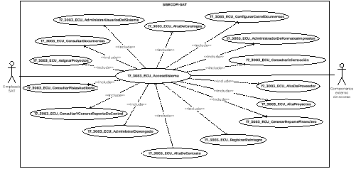

||Administración General de Comunicaciones y Tecnologías de la Información|
| :- | -: |
||Marco Documental 7.0|
|
Fecha de aprobación del Template:

02/08/2023
|
**Especificación del Caso de Uso**

17\_3083\_ECU\_AccesoSistema.docx
|Versión del template: 7.00|
| :-: | :-: | :-: |

**<ID Requerimiento>8309**

**Nombre del Requerimiento: **TI\_SISECOFI-SAT\_Seguimiento financiero y control documental de proyectos de contratación

**Tabla de Versiones y Modificaciones**

|

Versión

|Descripción del cambio|Responsable de la Versión|Fecha|
| :-: | :- | :-: | :-: |
|*1*|*Creación del documento*|Angel Horacio López Alcaraz|*27/02/2024*|
|*1.1*|*Revisión del documento*|Luis Angel Olguin Castillo|*19/04/2024*|
|*1.2*|*Versión aprobada para firma*|
María del Carmen Castillejos Cárdenas

Rubén Delgado Ramírez
|*04/06/2024*|

**Tabla de Contenido**

[17_3083_ECU_AccesoSistema	2](#_toc163830159)

[1. Descripción	2](#_toc163830160)

[2. Diagrama del Caso de Uso	2](#_toc163830161)

[3. Actores	2](#_toc163830162)

[4. Precondiciones	2](#_toc163830163)

[5. Post condiciones	3](#_toc163830164)

[6. Flujo primario	3](#_toc163830165)

[7. Flujos alternos	7](#_toc163830166)

[8. Referencias cruzadas	11](#_toc163830167)

[9. Mensajes	12](#_toc163830168)

[10. Requerimientos No Funcionales	12](#_toc163830169)

[11. Diagrama de actividad	14](#_toc163830170)

[12. Diagrama de estados	14](#_toc163830171)

[13. Aprobación del cliente	15](#_toc163830172)

### ****17\_3083\_ECU\_AccesoSistema

|<h3>**1. Descripción** </h3>|
| :- |
|

El objetivo de este Caso de Uso es permitir al Empleado SAT ingresar al sistema SISECOFI para acceder a los módulos autorizados y realizar las operaciones correspondientes asignadas a su rol.

|
|<h3>**2. Diagrama del Caso de Uso**</h3>|
|

|
|<h3>**3. Actores** </h3>|
||

|**Actor**|**Descripción**|
| :-: | :-: |
|**Empleado SAT**|El Empleado SAT es el que tiene el o los roles otorgados por la Administración Central de Seguridad, Monitoreo y Control (ACSMC) para ingresar a cada uno de los módulos de este sistema.|
|**Componente externo de acceso**|Sistema encargado de validar los datos del Empleado SAT que ingresa al portal a través de su e.firma y que proporciona la información de dicho Empleado SAT al SISECOFI.|

|

|
| :- |
|<h3>**4. Precondiciones**</h3>|
|

- El Empleado SAT cuenta con una e.firma válida.

- El Empleado SAT cuenta con la **URL** del **SISECOFI**.

- En la base de datos (BD) de seguridad se ha creado el perfil de acceso del Empleado SAT para ingresar a las funcionalidades asignadas en el sistema.

&emsp;
|
|<h3>**5. Post condiciones** </h3>|
|

- El Empleado SAT ingresó correctamente al sistema con una e.firma válida.

- El sistema consumió el servicio “Oauth” para obtener los datos del Empleado SAT que ingresó. (Nombre completo, RFC largo, Roles).

- El Empleado SAT cerró sesión en el sistema.

- El Empleado SAT ingresó a las diferentes opciones del menú de acuerdo con su rol:

- Sistema

- Proveedores

- Proyectos

- Contratos

- Consumo de Servicios

- Reintegros

- Reporte Documental

- Reporte Financiero

- Consultar Información

- Consultar documentos

&emsp;
|
|<h3>**6. Flujo primario**</h3>|
||

|**Actor**|**Sistema**|
| :-: | :-: |
|1. El Caso de Uso inicia cuando el Empleado SAT ingresa a la **URL** del **SISECOFI**.|
2. Establece la conexión con el componente externo de acceso y muestra la pantalla “Acceso con e.firma”, con los siguientes campos:

&emsp;

- Acceso con e.firma:

- Certificado (.cer)\*

- Clave privada (.key)\*

- Contraseña de clave privada\*

- RFC (inhabilitado)

Opciones

- Buscar (Certificado (.cer)\*

- Buscar (Clave privada (.key)\*

- Enviar (inhabilitado)

Íconos:

- *Tooltip* 

Ver **(17\_3083\_EIU\_AccesoSistema)** Estilos 01.
|
|3. Selecciona la opción **“Buscar”** del campo **“Certificado (.cer)\*”**  y continúa en el flujo.|4. Abre el gestor de archivos del equipo de cómputo del Empleado SAT.|
|5. Selecciona el archivo con extensión (.cer).|
6. Muestra en el campo “Certificado (.cer)\*” el nombre del archivo con extensión (.cer) ingresado.

|
||7. Muestra en el campo “RFC” el RFC asociado a la e.firma.|
|8. Selecciona la opción **“Buscar”** del campo **“Clave privada (.key)\*”** y continúa en el flujo.|9. Abre el gestor de archivos del equipo de cómputo del Empleado SAT.|
|10. Selecciona el archivo con extensión (.key).|
11. Muestra en el campo “Clave privada (.key)\*” el nombre del archivo con extensión (.key) ingresado.

|
|12. Ingresa la contraseña en el campo **“Contraseña de clave privada\*”**.|13. Habilita la opción “Enviar”.|
|14. Selecciona la opción **“Enviar”** y continúa en el flujo.|
15. Realiza la validación de la e.firma ingresada conforme a la **(RNA192)**.

- Si el archivo (.cer) seleccionado no corresponde a un tipo de archivo válido, continúa en el flujo alterno **([**FA01**](#fa01))**.

- Si el archivo (.key) seleccionado no corresponde a un tipo de archivo válido, continúa en el **([**FA01**](#fa01))**.

- En caso de ser incorrecta la validación de la contraseña, continúa en el **([**FA02**](#fa02))**.

- Si la e.firma no se encuentra vigente, continúa en el **([**FA08**](#fa08))**.

&emsp;
|
||
16. Realiza la validación de que el Empleado SAT cuente con los roles necesarios para acceder al sistema conforme a la **(RNA192)**.

- En caso de no contar con roles necesarios para acceder al sistema, continúa en el **([**FA03**](#fa03))**.
|
||
17. Obtiene del “Componente externo de acceso” los datos del Empleado SAT que ingresó al sistema, conforme a la **(RNA192)**.

&emsp;

- RFC Largo

- Nombre completo 

- Roles asignados 
|
||
18. Almacena en la BD la información de las Pistas de Auditoría.

&emsp;

**Módulo**= AccesoSistema

**Fecha y Hora**= Fecha y hora del sistema, usando el formato DD/MM/AAAA HH:MM:SS

**RFC Usuario**= RFC largo del Empleado SAT que ingresó al sistema.

**Tipo de movimiento**= **CNST** (Consulta)

**Movimiento**= 

-Menú principal

En caso de que no se puedan almacenar las Pistas de Auditoría, continúa en el **([**FA04**](#fa04))**.

|
||
21 Muestra la pantalla principal del **SISECOFI**.

- Bienvenido “Nombre del Empleado SAT”

&emsp;

&emsp;Opciones:

- Menú principal ![ref1]

- Inicio

- Cerrar

Ver **(17\_3083\_EIU\_AccesoSistema)** Estilos 02.
|
|
22. Realiza una acción:

- Si selecciona la opción **“Menú principal”**, el flujo continúa.

- Si selecciona la opción **“Inicio”**, continúa en el **([**FA05**](#fa05))**.

- Si selecciona la opción **“Cerrar”**,** continúa en el **([**FA06**](#fa06))**.

|
23. Muestra la pantalla con cada uno de los módulos del sistema habilitados, conforme a la **(RNA203)**.

&emsp;

&emsp;

Opciones:

- Inicio

- Cerrar

Módulos: **(Solo referenciales)**

- Sistema ![ref2]

- Proveedores ![ref2]

- Proyectos ![ref2]

- Contratos ![ref2]

- Consumo de Servicios ![ref2]

- Reintegros ![ref2]

- Reporte Documental ![ref2]

- Reporte Financiero ![ref2]

- Consultar Información ![ref2]

- Consultar Documentos ![ref2]

Ver **(17\_3083\_EIU\_AccesoSistema)** Estilos 03.
|
|
24. Realiza una de las siguientes acciones:

- Si selecciona la opción **“Sistema”**, continúa en el **([**FA07**](#fa07))**.

- Si selecciona la opción **“Proveedores”**, continúa en el **(17\_3083\_ECU\_AltaDeProveedor)**.

- Si selecciona la opción **“Proyectos”**, continúa en el **(17\_3083\_ECU\_AltaProyectos)**.

- Si selecciona la opción **“Contratos”**, continúa en el **(17\_3083\_ECU\_AltaDeContrato)**.

- Si selecciona la opción: **“Consumo de Servicios”**, continúa en el **(17\_3083\_ECU\_AdministrarDevengado)**.

- Si selecciona la opción **“Reintegros”**, continúa en el **(17\_3083\_ECU\_RegistrarReintegro)**.

- Si selecciona la opción **“Reporte Documental”**, continúa en el **(17\_3083\_ECU\_GestionDocumental)**.

- Si selecciona la opción **“Reporte Financiero”**, continúa en el **(17\_3083\_ECU\_GenerarReporteFinanciero)**.

- Si selecciona la opción **“Consultar información”**, continúa en el **(17\_3083\_ECU\_ConsultarInformacion)**.

- Si selecciona la opción **“Consultar documentos”**,** continúa en el **(17\_3083\_ECU\_ConsultarDocumentos)**.

- Si selecciona la opción **“Inicio”**,** continúa en el **([**FA05**](#fa05))**.

- Si selecciona la opción **“Cerrar”**,** continúa en el **([**FA06**](#fa06))**.

|25. Fin del Caso de Uso.|

|

|
| :- |
|<h3>**7. Flujos alternos** </h3>|
|

**FA01 Se ingresó un tipo de archivo inválido**
|

|**Actor**|**Sistema**|
| :-: | :-: |
|

|1. El **FA01** inicia cuando el sistema detecta que el tipo de archivo seleccionado no corresponde a un tipo de archivo válido, conforme a la **(RNA192)**.|
||
2. Muestra el mensaje según corresponda:

- Si fue invocado en el campo “Certificado (.cer)\*” muestra el mensaje **([**MSG001**](#msg001))**.

&emsp;

- Si fue invocado en el campo “Clave privada (.key)\*” muestra el **([**MSG006**](#msg006))**.

&emsp;

El mensaje se muestra con la opción “Aceptar”
|
|3. Selecciona la opción **“Aceptar**” y el flujo continúa.|4. Cierra el mensaje.|
||
5. Continúa en el paso [**3**](#_ref164168781) del Flujo primario.

|

|

**FA02 Contraseña incorrecta**
|
| :- |

|**Actor**|**Sistema**|
| :-: | :-: |
||1. El **FA02** inicia cuando el sistema valida, a través del “Componente externo de acceso”, que la “Contraseña” asociada a la e.firma es incorrecta conforme a la **(RNA192)**. |
||2. Muestra el **([**MSG002**](#msg002))** con la opción “Aceptar”.|
|3. Selecciona la opción **“Aceptar”** y el flujo continúa.|4. Cierra el mensaje.|
||5. Continúa en el paso [**12**](#_ref164168815) del Flujo primario.|

|

**FA03 No se cuenta con los roles para acceder al sistema**
|
| :- |

|**Actor**|**Sistema**|
| :-: | :-: |
||1. El **FA03** inicia cuando el sistema valida que el Empleado SAT no cuenta con los roles necesarios para ingresar (validado a través del “Componente externo de acceso”), conforme a la **(RNA192)**.|
||2. Muestra el **([**MSG003**](#msg003))** con la opción “Aceptar”.|
|3. Selecciona la opción **“Aceptar**” y continúa en el flujo.|4. Cierra el mensaje.|
||5. Fin del Caso de Uso.|

|

**FA04 No se pueden almacenar las Pistas de Auditoría**
|
| :- |

|**Actor**|**Sistema**|
| :-: | :-: |
||1. El **FA04** inicia cuando interviene un evento ajeno y no se pueden almacenar las Pistas de Auditoría.|
||2. Cancela la operación sin completar el movimiento que estaba en proceso.|
||
3. Muestra el mensaje de acuerdo con lo siguiente:

- Si la pista de auditoría es por el tipo de movimiento **CNST,** se muestra el **([**MSG004**](#msg004))** con la opción “Aceptar”.
|
|4. Selecciona la opción **“Aceptar**” y el flujo continúa.|5. Cierra el mensaje.|
||6. Regresa al paso previo que detona la acción de la pista de auditoría.|

|

**FA05 Selecciona la opción “Inicio”**
|
| :- |

|**Actor**|**Sistema**|
| :-: | :-: |
|1. El **FA05** inicia cuando el Empleado SAT selecciona la opción **“Inicio”**.|
2. Muestra la pantalla principal del **SISECOFI** conforme a la **(RNA203)**.

&emsp;Ver **(17\_3083\_EIU\_AccesoSistema)** Estilos 02.
|
||3. Continúa en el paso [**22**](#_ref164765203)** del Flujo primario.|

|

**FA06 Selecciona la opción “Cerrar”**
|
| :- |

|**Actor**|**Sistema**|
| :-: | :-: |
|1. El **FA06** inicia cuando el Empleado SAT selecciona la opción **“Cerrar”**.|2. Muestra el **([**MSG005**](#msg005))** con las opciones “Sí” y “No”.|
|
3. Selecciona una opción.

- Si selecciona la opción **“Sí”**, el flujo continúa.

- Si selecciona **“No”**,** regresa al paso donde fue invocado.
|4. Cierra el mensaje.|
||5. Continúa en el paso [**1**](#_ref164168717)** del Flujo primario.|
|

||

||
| :- |
|

**FA07 Selecciona la opción “Sistema”**
|

|**Actor**|**Sistema**|
| :-: | :-: |
|1. El **FA07** inicia cuando el Empleado SAT selecciona la opción **“Sistema”**.|
2. Consulta en la BD y obtiene la información del módulo “Sistema” que se encuentra almacenada:

**(Solo referenciales)**

- Catálogos

- Matriz documental

- Administrador de formatos de impresión

- Usuarios

- Asignar proyectos

- Consultar Pistas de auditoría
|
||
3. Muestra el menú con los submódulos de “Sistema”. **(Solo referenciales)**

- Catálogos

- Matriz documental

- Administrador de formatos de impresión

- Usuarios

- Asignar proyectos

- Consultar pistas de auditoría

Opciones:

- Menú principal ![ref1]

- Inicio

- Cerrar

Ver **(17\_3083\_EIU\_AccesoSistema)** Estilos 04.
|
|
4. Selecciona una opción.

- Si selecciona la opción **“Catálogos”**, continúa en el **(17\_3083\_ECU\_AltaDeCatalogos)**.

- Si selecciona la opción **“Matriz documental”**, continúa en el **(17\_3083\_ECU\_ConfigurarControlDocumentos)**.

- Si selecciona la opción **“Administrador de Formatos Impresión”**, continúa en el **(17\_3083\_ECU\_AdministradorDeFormatosImpresion)**

- Si selecciona la opción **“Usuarios”**, continúa en el **(17\_3083\_ECU\_AdministrarUsuariosDelSistema)**.

- Si selecciona la opción **“Asignar Proyectos”**, continúa en el **(17\_3083\_ECU\_AsignarProyectos)**.

- Si selecciona **“Consultar pistas de auditoría”**, continúa en el **(17\_3083\_ECU\_ConsultarPistasAuditoria)**.
|5. Fin del Caso de Uso.|

||
| :- |
|

**FA08 La e.firma no se encuentra vigente**
|

|**Actor**|**Sistema**|
| :-: | :-: |
||1. El **FA08** inicia cuando el sistema identifica, a través del “Componente externo de acceso”, que la e.firma no se encuentra vigente conforme a la **(RNA192)**. |
||2. Muestra el **([**MSG007**](#msg007))** con la opción “Aceptar”.|
|3. Selecciona la opción **“Aceptar”** y el flujo continúa.|4. Cierra el mensaje.|
||5. Fin del Caso de Uso.|

|

|
| :- |
|<h3>**8. Referencias cruzadas** </h3>|
|

- 17\_3083\_CRN\_SeguimientoFinancieroYControl

- 17\_3083\_EIU\_AccesoSistema

- 17\_3083\_ECU\_ConsultarPistasAuditoria

- 17\_3083\_ECU\_AdministrarUsuariosDelSistema

- 17\_3083\_ECU\_AltaDeCatalogos

- 17\_3083\_ECU\_AdministradorDeFormatosImpresion

- 17\_3083\_ECU\_ConfigurarControlDocumentos

- 17\_3083\_ECU\_AsignarProyectos

- 17\_3083\_ECU\_AltaDeProveedor

- 17\_3083\_ECU\_AltaProyecto

- 17\_3083\_ECU\_AltaDeContrato

- 17\_3083\_ECU\_RegistrarReintegro

- 17\_3083\_ECU\_AdministrarDevengado

- 17\_3083\_ECU\_ConsultarInformacion

- 17\_3083\_ECU\_ConsultarDocumentos

- 17\_3083\_ECU\_GenerarReporteFinanciero

- 17\_3083\_ECU\_ConsultarYGenerarReporteDeControl

|
|<h3>**9. Mensajes** </h3>|
||

|**ID Mensaje**|**Descripción**|
| :-: | :-: |
|**MSG001**|El Certificado seleccionado es inválido, intente de nuevo.|
|**MSG002**|La contraseña de la Clave privada es incorrecta.|
|**MSG003**|Acceso denegado, no se han encontrado roles asignados a su usuario.|
|**MSG004**|Ocurrió un error al consultar la información, favor de intentar nuevamente (PA01).|
|**MSG005**|¿Desea cerrar la sesión actual?|
|**MSG006**|El archivo de la Clave privada es inválido, intente de nuevo.|
|**MSG007**|La e.firma ingresada no se encuentra vigente. Favor de verificar.|

|

|
| :- |
|<h3>**10. Requerimientos No Funcionales** </h3>|
||

|**ID de RNF**|**Requerimiento No Funcional**|**Descripción**|
| :-: | :-: | :-: |
|**RNF001**|Disponibilidad|El sistema deberá estar activo las 24 horas del día, los 365 días del año con picos de operación en el horario de 9:00 a 18:00 horas.|
|**RNF002**|Concurrencia|
El número de Empleados SAT que puede tener el sistema son 150. 

El número máximo de accesos concurrentes que debe soportar este sistema son máximo 30 Empleados SAT.
|
|**RNF003**|Seguridad|El acceso solo podrá ser otorgado a todo Empleado SAT que tenga los roles asignados por la Administración Central de Seguridad, Monitoreo y Control (ACSMC) para cada módulo de este sistema.|
|**RNF004**|Usabilidad|
El sistema deberá manejar los siguientes elementos para facilitar la navegación: 

- Mensajes tipo flotantes (*tooltips*) con información de la herramienta que ofrece ayuda contextual, como guía para el Empleado SAT. 

- Componente de ordenamiento que permita acomodar la información de la tabla de forma ascendente o descendente, considerando la columna donde es seleccionado. 

- Contar con un diseño responsivo que permita su óptima visualización en distintos tipos de dispositivos finales. 
|
|**RNF005**|Eficiencia|Las consultas se dividen en generales y detalladas, para que las detalladas carguen la información solo cuando sean requeridas por el Empleado SAT. |
|**RNF006**|Usabilidad|
El Empleado SAT podrá navegar a través de las páginas resultantes de la consulta considerando que el sistema debe mostrar inicialmente 15 registros por página, permitiendo al Empleado SAT seleccionar los registros que requiere visualizar, teniendo las opciones 15, 50 y 100: 

- Ir a la primera página (debe mostrar la primera página con el resultado de la consulta). 

- Ir a la última página (debe mostrar la última página con el resultado de la consulta). 

- Ir a la siguiente página (debe mostrar la siguiente página, considerando la página actual, con el resultado de la consulta y el número de registros seleccionados por el Empleado SAT).

- Ir a la página anterior (debe mostrar la página anterior considerando la actual, con el resultado de la consulta). 

En la tabla deben mostrarse los registros ordenados alfabéticamente.
|
|**RNF007**|Seguridad|Las Pistas de Auditoría deben estar protegidas contra accesos no autorizados. Solo los Empleados SAT autorizados pueden consultarlas, y la información en ellas se definirá durante la etapa de diseño, la cual debe estar cifrada para mantenerla confidencial y evitar exposiciones no autorizadas. |
|**RNF008**|Fiabilidad|El sistema debe ser capaz de manejar excepciones de manera efectiva y presentar mensajes claros y comprensibles para garantizar una adecuada interacción con el sistema.|
|**RNF009**|Seguridad|Se debe mantener la información en pantalla en caso de un error al guardar las pistas de auditoría, siempre y cuando el escenario lo permita. Hay situaciones de infraestructura o de conexión de internet que sí pierde los datos ya que no están controlados por el sistema.|

|

|
| - |
|<h3>**11. Diagrama de actividad** </h3>|
|

|
|<h3>**12. Diagrama de estados** </h3>|
|

No Aplica. No se requiere para este proceso.

|
|<h3>**13. Aprobación del cliente** </h3>|
||

|**FIRMAS DE CONFORMIDAD** ||
| :-: | :- |
|**Firma 1**  |**Firma 2**  |
|**Nombre**: María del Carmen Castillejos Cárdenas.|**Nombre**: Rubén Delgado Ramírez. |
|**Puesto**: Usuaria ACPPI.|**Puesto**: Usuario ACPPI.|
|**Fecha:** |**Fecha:** |
|  |  |
|**Firma 3**  |**Firma 4** |
|**Nombre**: Rodolfo López Meneses. |**Nombre**: Diana Yazmín Pérez Sabido. |
|**Puesto**: Usuario ACPPI. |**Puesto**: Usuaria ACPPI. |
|**Fecha:** |**Fecha:** |
|  |  |
|**Firma 5** |**Firma 6** |
|**Nombre**: Yesenia Helvetia Delgado Naranjo. |**Nombre**: Alejandro Alfredo Muñoz Núñez. |
|**Puesto**: APE ACPPI. |**Puesto:** RAPE ACPPI. |
|**Fecha**: |**Fecha**: |
|  |  |
|**Firma 7**|**Firma 8** |
|**Nombre**: Luis Angel Olguin Castillo. |**Nombre**: Erick Villa Beltrán. |
|**Puesto**: Enlace ACPPI. |**Puesto**: Líder APE SDMA 6. |
|**Fecha**: |**Fecha**: |
|**  |**  |
|**Firma 9** |**Firma 10** |
|**Nombre**: Juan Carlos Ayuso Bautista. |**Nombre**: Angel Horacio López Alcaraz|
|**Puesto**: Líder Técnico SDMA 6. |**Puesto**: Analista de Sistemas SDMA 6.|
|**Fecha**: |**Fecha**: |
|**  | |

||
| :- |

|||Página 13 de 13|
| :- | :-: | -: |

[ref1]: Aspose.Words.2f8f11da-50ca-4f27-bd20-10f910f9cd8f.004.png
[ref2]: Aspose.Words.2f8f11da-50ca-4f27-bd20-10f910f9cd8f.005.png
