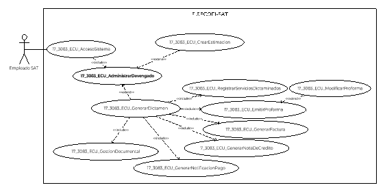
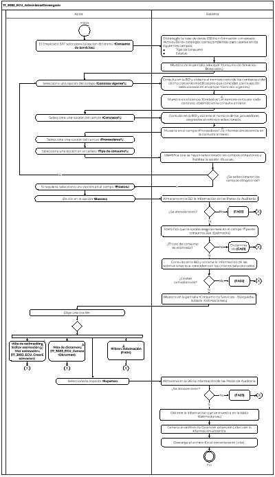

||Administración General de Comunicaciones y Tecnologías de la Información|
| :- | -: |
||Marco Documental 7.0|
|
Fecha de aprobación del Template:

02/08/2023
|
**Especificación del Caso de Uso**

17\_3083\_ECU\_AdministrarDevengado.docx
|Versión del template: 7.00|
| :-: | :-: | :-: |

**<ID Requerimiento>** 8309

**Nombre del Requerimiento: **TI\_SISECOFI-SAT\_Seguimiento financiero y control documental de proyectos de contratación

**Tabla de Versiones y Modificaciones**

|Versión|Descripción del cambio|Responsable de la Versión|Fecha|
| :-: | :- | :-: | :-: |
|*1*|*Creación del documento*|Osiris Vianey Segovia Pasarán|*15/02/2024*|
|*1.1*|*Actualización del documento*|Isabel Adriana Valdez Cortés|*04/03/2024*|
|*1.2*|*Revisión del documento*|Luis Angel Olguin Castillo|*16/04/2024*|
|*1.3*|*Versión aprobada para firma*|
María del Carmen Castillejos Cárdenas

Rubén Delgado Ramírez
|*10/06/2024*|

**Tabla de Contenido**

[17_3083_ECU_AdministrarDevengado	2](#_toc169852771)

[1. Descripción	2](#_toc169852772)

[2. Diagrama del Caso de Uso	2](#_toc169852773)

[3. Actores	2](#_toc169852774)

[4. Precondiciones	2](#_toc169852775)

[5. Post condiciones	3](#_toc169852776)

[6. Flujo primario	3](#_toc169852777)

[7. Flujos alternos	7](#_toc169852778)

[8. Referencias cruzadas	11](#_toc169852779)

[9. Mensajes	11](#_toc169852780)

[10. Requerimientos No Funcionales	11](#_toc169852781)

[11. Diagrama de actividad	14](#_toc169852782)

[12. Diagrama de estados	14](#_toc169852783)

[13. Aprobación del cliente	15](#_toc169852784)

### ****17\_3083\_ECU\_AdministrarDevengado

|<h3>**1. Descripción** </h3>|
| :- |
|

El objetivo de este Caso de Uso es permitir al Empleado SAT gestionar el módulo “Consumo de Servicios”, en el cual se realizan consultas y exportación de estimaciones y dictámenes de los contratos administrados en este sistema. Asimismo, permite el acceso para dar de alta y editar la información de una estimación o dictamen específico.

|
|<h3>**2. Diagrama del Caso de Uso**</h3>|
|

|
|<h3>**3. Actores** </h3>|
||

|**Actor**|**Descripción**|
| :-: | :-: |
|**Empleado SAT**|El Empleado SAT es el que tiene el o los roles otorgados por la Administración Central de Seguridad, Monitoreo y Control (ACSMC) para ingresar a cada uno de los módulos de este sistema.|

|

|
| :- |
|<h3>**4. Precondiciones**</h3>|
|

- El Empleado SAT se ha autenticado en el sistema con e.firma válida. 

- El sistema ha consumido el servicio “Oauth” para obtener los datos del Empleado SAT que ingresa.

- El sistema ha validado que el Empleado SAT cuenta con los roles para ingresar del menú al módulo “Consumo de Servicios”.

- El Empleado SAT ha seleccionado en el menú “Consumo de Servicios”, de acuerdo con el proceso del **(17\_3083\_ECU\_AccesoSistema)**.

- Se han cargado “Contratos” previamente.

&emsp;
|
|<h3>**5. Post condiciones** </h3>|
|

El Empleado SAT realizó los siguientes movimientos:

- Consultó las estimaciones y dictámenes de los contratos administrados en este sistema.

- Exportó la información de las estimaciones y dictámenes que se consultaron.

- Tuvo acceso a las opciones para dar de alta y editar la información de una estimación o dictamen específico.

|
|<h3>**6. Flujo primario**</h3>|
||

|**Actor**|**Sistema**|
| :-: | :-: |
|1. El Caso de Uso inicia cuando el Empleado SAT selecciona la opción del menú **“Consumo de Servicios”**.|
2. Obtiene de la base de datos (BD) la información con estado “Activo” de los catálogos correspondientes para usarlos en los siguientes campos:

&emsp;

- Tipo de consumo

- Estatus
|
||
3. Muestra en la pantalla principal “Consumo de Servicios - Búsqueda”, de primera entrada solo los siguientes datos. Aplicar las reglas de negocio **(RNA03)**,  **(RNA62)**:

Sección “Búsqueda”:

- Contrato vigente\*

- Contratos\*

- Proveedores\*

- Tipo de consumo\*

- Estatus

Opción inhabilitada:

- Buscar

Ver **(17\_3083\_EIU\_AdministrarDevengado)** Estilos 01.
|
|4. Selecciona una opción del campo **“Contrato vigente\*”**.|5. Consulta en la BD y obtiene el nombre corto de los contratos o del último convenio modificatorio que coincidan con la opción seleccionada en el campo “Contrato vigente”. Aplica la **(RNA62)**.|
||6. Muestra en el campo “Contratos\*” el nombre corto por cada contrato, obtenido en la consulta anterior.|
|7. Selecciona una opción del campo **“Contratos\*”**.|8. Consulta en la BD y obtiene el nombre de los proveedores asignados al contrato seleccionado. Aplica la **(RNA62)**.|
||9. Muestra en el campo “Proveedores\*” la información obtenida en la consulta anterior.|
|10. Selecciona una opción del campo **“Proveedores\*”**.||
|11. Selecciona una opción en el campo **“Tipo de consumo\*”**.|
12. Identifica que se hayan seleccionado los campos obligatorios y habilita la opción “Buscar”, el flujo continúa.

&emsp;

- En caso contrario la opción “Buscar” se mantiene inhabilitada y continúa en el paso [**4**](#_ref168914884) de este flujo.
|
|13. Si requiere, selecciona una opción en el campo **“Estatus”**.||
|14. Da clic en la opción **“Buscar”**.|
15. Almacena en la BD la información de las Pistas de Auditoría.

&emsp; 

&emsp;Datos que se almacenan:

**Módulo**= Consumo de Servicios- Tipo de consumo que se consulta

**Fecha y Hora**= Fecha y hora del sistema, usando el formato DD/MM/AAAA HH:MM:SS

**RFC Usuario**= RFC largo del Empleado SAT que ingresó al sistema.

**Tipo de movimiento**= **CNST** (Consultar)

**Movimiento**=

- Datos seleccionados o ingresados en los criterios de búsqueda.

&emsp;

- En caso de que no se puedan almacenar las Pistas de Auditoría, continúa en el **([**FA03**](#fa03))**.
|
||
16. Identifica que la opción seleccionada en el campo “Tipo de consumo” sea “Estimado”, el flujo continúa.

&emsp;

- En caso de identificar que la opción es “Dictaminado”, continúa en el **([**FA01**](#fa01))**.
|
||
17. Consulta en la BD y obtiene la siguiente información de las estimaciones que coincidan con los criterios seleccionados, aplica la **(RNA64)**.

&emsp;

- Periodo de control

- Periodo inicial

- Periodo final

- Proveedor

- Estatus

- Monto estimado

- Monto estimado en pesos

- Monto dictaminado

- Monto dictaminado en pesos

- En caso de no existir coincidencias en la búsqueda, continúa en el **([**FA02**](#fa02))**.
|
||
18. Muestra en la pantalla “Consumo de Servicios - Búsqueda” la tabla “Estimaciones” considerando los siguientes campos y opciones. Aplicar las **(RNA51)** y **(RNA64)**.

&emsp;

Opción:

- Alta de estimación ![ref1]

- Alta de dictamen ![ref2]

- ![ref3]Exportar 

Tabla “Estimaciones”. Aplica la **(RNA244)**:

- Id

- Periodo de control

- Periodo inicial

- Periodo final

- Proveedor

- Estatus

- Monto estimado

- Monto estimado en pesos

- Monto dictaminado

- Monto dictaminado en pesos

- ![ref4]Acciones

&emsp;- Editar estimación

&emsp;- ![ref5]Ver estimación

- Campos para “Filtrar” por columna

Ver **(17\_3083\_EIU\_AdministrarDevengado)** Estilos 01.
|
|
19. Elige una opción:

&emsp;

- En caso de seleccionar la opción **“Exportar”**, el flujo continúa.

&emsp;

- En caso de seleccionar la opción **“Alta de estimación”**, **“Editar estimación”** o **“Ver estimación”** continúa en el **(17\_3083\_ECU\_CrearEstimacion)**.

- En caso de seleccionar la opción **“Alta de dictamen”**, continúa en el**(17\_3083\_ECU\_GenerarDictamen)**.

- En caso de requerir **“Filtrar”** la información en alguna columna de la tabla, continúa en el **([**FA04**](#fa04))**.
|
20. Almacena en la BD la información de las Pistas de Auditoría.

&emsp;

&emsp;Datos que se almacenan: 

**Módulo**= Consumo de Servicios-Estimación

**Fecha y Hora**= Fecha y hora del sistema, usando el formato DD/MM/AAAA HH:MM:SS

**RFC Usuario**= RFC largo del Empleado SAT que ingresó al sistema.

**Tipo de movimiento**= **PRNT** (Imprimir)

**Movimiento**= Aplica la **(RNA239)**

- Id de cada estimación

&emsp;

- En caso de que no se puedan almacenar las Pistas de Auditoría, continúa en el **([**FA03**](#fa03))**.
|
||
21. Obtiene la siguiente información de todos los registros obtenidos de la búsqueda que se muestra en la tabla “Estimaciones”.

&emsp;

- Id (estimación)

- Periodo de control

- Periodo inicial

- Periodo final

- Proveedor

- Estatus

- Monto estimado

- Monto estimado en pesos

- Monto dictaminado

- Monto dictaminado en pesos
|
||
22. Genera un archivo de Excel con extensión (.xlsx) con la información obtenida:

- Id (estimación)

- Periodo de control

- Periodo inicial

- Periodo final

- Proveedor

- Estatus

- Monto estimado

- Monto estimado en pesos

- Monto dictaminado

- Monto dictaminado en pesos
|
||23. Descarga el archivo Excel con extensión (.xlsx).|
||24. Fin del Caso de Uso.|

|

|
| :- |
|<h3>**7. Flujos alternos** </h3>|
|

**FA01 Se identifica la selección “Tipo de consumo-Dictaminado”**
|

|**Actor**|**Sistema**|
| :-: | :-: |
||1. El **FA01** inicia cuando el sistema identifica que la opción seleccionada en el campo “Tipo de consumo” es “Dictaminado”.|
||
2. Consulta en la BD y obtiene la información de los dictámenes que coincidan con los criterios seleccionados, aplica la **(RNA65)**.

&emsp;

- Id (dictamen)

- Monto

- Estatus

- Número de folio

- Pendiente de pago

- En caso de no existir coincidencias en la búsqueda, continúa en el **([**FA02**](#fa02))**.
|
||
3. Muestra en la pantalla “Consumo de Servicios – Búsqueda”, la tabla “Dictámenes”, considerando los siguientes campos y opciones. Aplica la **(RNA51)** y **(RNA65)**.

&emsp;

Opción:

- Alta de estimación ![ref1]

- Alta de dictamen ![ref2]

- ![ref3]Exportar

Tabla “Dictámenes”. Aplica la **(RNA244)**:

- Id dictamen

- Monto

- Estatus

- Comprobante fiscal

- Pendientes de pago

- ![ref4]Acciones

- Editar dictamen       

- ![ref6]Ver dictamen

- Campos para “Filtrar” por columna

Ver **(17\_3083\_EIU\_AdministrarDevengado)** Estilos 2.
|
|
4. Elige una opción:

&emsp;

- En caso de seleccionar la opción **“Exportar”**, el flujo continúa. 

- En caso de seleccionar la opción **“Alta de estimación”**, continúa en el **(17\_3083\_ECU\_CrearEstimacion)**.

- En caso de seleccionar la opción **“Alta de dictamen”**, **“Editar dictamen” o “Ver dictamen”** el flujo continúa en el **(17\_3083\_ECU\_GenerarDictamen)**.

- En caso de requerir **“Filtrar”** la información en alguna columna de la tabla, continúa en el **([**FA04**](#fa04))**.
|
5. Almacena en la BD la información de las Pistas de Auditoría.

&emsp;

&emsp;Datos que se almacenan: 

**Módulo**= Consumo de Servicios-Dictamen

**Fecha y Hora**= Fecha y hora del sistema, usando el formato DD/MM/AAAA HH:MM:SS

**RFC Usuario**= RFC largo del Empleado SAT que ingresó al sistema.

**Tipo de movimiento**= **PRNT** (Imprimir)

**Movimiento**= Aplica la **(RNA239)**

- Id de cada dictamen 

- En caso de que no se puedan almacenar las Pistas de Auditoría, continúa en el **([**FA03**](#fa03))**.
|
||
6. Obtiene la siguiente información de todos los registros obtenidos de la búsqueda que se muestra en la tabla  “Dictámenes”.

&emsp;

- Id (dictamen)

- Monto

- Estatus

- Número de folio

- Pendientes de pago
|
||
7. Genera un archivo de Excel con extensión (.xlsx) con la información obtenida.

&emsp;

- Id (dictamen)

- Monto

- Estatus

- Número de folio (Mostrar todos los folios correspondientes al dictamen separados por comas).

- Pendientes de pago
|
||8. Descarga del archivo de Excel con extensión (.xlsx).|
||9. Fin del Caso de Uso.|

|

**FA02 No existen resultados que coincidan en la búsqueda**
|
| :- |

|**Actor**|**Sistema**|
| :-: | :-: |
||1. El **FA02** inicia cuando el sistema identifica que no existen coincidencias con los criterios de búsqueda.|
||2. Muestra el **([**MSG001**](#msg001))** con la opción “Aceptar”. |
|3. Selecciona la opción **“Aceptar”**.|
4. ![ref3]Cierra el mensaje y muestra inhabilitada la opción “Exportar” 

|
||
5. Realiza lo siguiente:

&emsp;

- Si fue invocado en el paso [17](#_ref168928237) del Flujo primario, continúa en el paso [**18**](#_ref168918309)** del Flujo primario.

- Si fue invocado en el paso [2](#_ref168928275) **([**FA01**](#fa01))**, continúa en el paso [**3**](#_ref168928299) del **([**FA01**](#fa01))**.
|

|

**FA03 No se pueden almacenar las Pistas de Auditoría**
|
| :- |

|**Actor**|**Sistema**|
| :-: | :-: |
||1. El **FA03** inicia cuando interviene un evento ajeno y no se pueden almacenar las Pistas de Auditoría. |
||2. Cancela la operación sin completar el movimiento que estaba en proceso.|
||
3. Muestra el mensaje de acuerdo con lo siguiente:

- Si la pista de auditoría es por el tipo de movimiento **CNST**, se muestra el **([**MSG002**](#msg002))**. 

- En caso de que la pista de auditoría sea por el tipo de movimiento **PRNT**, se muestra el **([**MSG003**](#msg003))**.

Cada mensaje se muestra con la opción “Aceptar”.
|
|4. Selecciona la opción **“Aceptar”**.|5. Cierra el mensaje.|
||6. Regresa al paso previo que detona la acción de la pista de auditoría.|

|

**FA04 El Empleado SAT filtra la información de alguna columna de las tablas**
|
| :- |

|**Actor**|**Sistema**|
| :-: | :-: |
|1. El **FA04** inicia cuando el Empleado SAT requiere **“Filtrar”** la información en alguna columna de acuerdo con lo que se muestra en la tabla.||
|2. Elige la columna para filtrar e ingresa el dato a buscar.|3. Busca dentro de la columna y filtra la información mostrada de acuerdo con los caracteres ingresados en el campo.|
||4. Muestra en tiempo real todas las coincidencias que obtiene de dicha columna.|
||
5. Realiza lo siguiente:

- Si fue invocado en el paso [19](#_ref159799818) Flujo primario, continúa en el paso [**19**](#_ref159799818)  del el Flujo primario.

- Si fue invocado en el paso [4](#_ref159799947) **([**FA02**](#fa02))**, continúa en el paso [**4**](#_ref159799947) del **([**FA02**](#fa02)).**
|

|

|
| :- |
|<h3>**8. Referencias cruzadas** </h3>|
|

- 17\_3083\_CRN\_SeguimientoFinancieroYControl

- 17\_3083\_EIU\_AdministrarDevengado

- 17\_3083\_ECU\_AccesoSistema

- 17\_3083\_ECU\_CrearEstimacion

- 17\_3083\_ECU\_GenerarDictamen

|
|<h3>**9. Mensajes** </h3>|
||

|**ID Mensaje**|**Descripción**|
| :-: | :-: |
|**MSG001**|Verifique los criterios de búsqueda.|
|**MSG002**|Ocurrió un error al consultar la información, favor de intentar nuevamente (PA01).|
|**MSG003**|Ocurrió un error al exportar la información, favor de intentar nuevamente (PA01).|

|

|
| - |
|<h3>**10. Requerimientos No Funcionales** </h3>|
||

|**ID de RNF**|**Requerimiento No Funcional**|**Descripción**|
| :-: | :-: | :-: |
|**RNF001**|Disponibilidad|El sistema deberá estar activo las 24 horas del día, los 365 días del año con picos de operación en el horario de 9:00 a 18:00 horas.|
|**RNF002**|Concurrencia|
El número de Empleados SAT que puede tener el sistema son 150. 

 

El número de accesos concurrentes que debe soportar este sistema son máximo 30 Empleados SAT.
|
|**RNF003**|Seguridad|El acceso solo podrá ser otorgado a todo Empleado SAT que tenga los roles asignados por la Administración Central de Seguridad, Monitoreo y Control (ACSMC) para cada módulo de este sistema.|
|**RNF004**|Usabilidad|
El sistema deberá manejar los siguientes elementos para facilitar la navegación: 

- Mensajes tipo flotantes (*tooltips*) con información de la herramienta que ofrece ayuda contextual como guía para el Empleado SAT.

- Componente de ordenamiento que permita acomodar la información de la tabla de forma ascendente o descendente, considerando la columna donde es seleccionado. 

- Contar con un diseño responsivo que permita su óptima visualización en distintos tipos de dispositivos finales.
|
|**RNF005**|Eficiencia|Las consultas se dividen en generales y detalladas, para que las detalladas carguen la información solo cuando sean requeridas por el Empleado SAT.|
|**RNF006**|Usabilidad|
El Empleado SAT debe poder navegar a través de las páginas resultantes de la consulta considerando que el sistema debe mostrar inicialmente 15 registros por página, permitiendo al Empleado SAT seleccionar los registros que requiere visualizar, teniendo las opciones de 15, 50 y 100:

- Ir a la primera página (debe mostrar la primera página con el resultado de la consulta).

- Ir a la última página (debe mostrar la última página con el resultado de la consulta).

- Ir a la siguiente página (debe mostrar la siguiente página, considerando la página actual, con el resultado de la consulta y el número de registros seleccionados por el Empleado SAT).

- Ir a la página anterior (debe mostrar la página anterior considerando la actual, con el resultado de la consulta).

&emsp;

En la tabla deben mostrarse los registros ordenados alfabéticamente.
|
|**RNF007**|Seguridad|Las Pistas de Auditoría deben estar protegidas contra accesos no autorizados. Solo los Empleados SAT autorizados pueden consultarlas, y la información en ellas se definirá durante la etapa de diseño, la cual debe estar cifrada para mantenerla confidencial y evitar exposiciones no autorizadas.|
|**RNF008**|Fiabilidad|El sistema debe ser capaz de manejar excepciones de manera efectiva y presentar mensajes claros y comprensibles para garantizar una adecuada interacción con el sistema.|
|**RNF009**|Seguridad|Se debe mantener la información en pantalla en caso de un error al guardar las Pistas de Auditoría, siempre y cuando el escenario lo permita. Hay situaciones de infraestructura o de conexión de internet que sí pierde los datos ya que no están controlados por el sistema.|
|**RNF010**|Integridad|Al almacenar la información en la BD de tipo texto o alfanumérico se deben eliminar los espacios en blanco al inicio y fin de la cadena.|

||
| :- |

**

|<h3>**11. Diagrama de actividad** </h3>|
| :- |
|

|
|<h3>**12. Diagrama de estados** </h3>|
|

No aplica, no se requiere para este proceso.
|
|<h3>**13. Aprobación del cliente** </h3>|
|

|

|**FIRMAS DE CONFORMIDAD**||
| :-: | :- |
|**Firma 1** |**Firma 2** |
|**Nombre**: María del Carmen Castillejos Cárdenas.|**Nombre**: Rubén Delgado Ramírez.|
|**Puesto**: Usuaria ACPPI.|**Puesto**: Usuario ACPPI.|
|**Fecha:**|**Fecha:**|
|||
|**Firma 3** |**Firma 4**|
|**Nombre**: Rodolfo López Meneses.|**Nombre**: Diana Yazmín Pérez Sabido.|
|**Puesto**: Usuario ACPPI.|**Puesto**: Usuaria ACPPI.|
|**Fecha:**|**Fecha:**|
|||
|**Firma 5**|**Firma 6**|
|**Nombre**: Yesenia Helvetia Delgado Naranjo.|**Nombre:** Alejandro Alfredo Muñoz Núñez.|
|**Puesto**: APE ACPPI.|**Puesto:** RAPE ACPPI.|
|**Fecha**:|**Fecha**:|
|||
|**Firma 7**|**Firma 8**|
|**Nombre**: Luis Angel Olguin Castillo.|**Nombre**: Erick Villa Beltrán.|
|**Puesto**: Enlace ACPPI.|**Puesto**: Líder APE SDMA 6.|
|**Fecha**:|**Fecha**:|
|||
|**Firma 9**|**Firma 10**|
|**Nombre:** Juan Carlos Ayuso Bautista.|**Nombre:** Isabel Adriana Valdez Cortés.|
|**Puesto:** Líder Técnico SDMA 6.|**Puesto:** Analista de Sistemas DS SDMA 6.|
|**Fecha**:|**Fecha**:|
|||

||
| :- |

|||Página 14 de 15|
| :- | :-: | -: |

[ref1]: Aspose.Words.059d6d79-9683-4f18-8c3e-4424316c58a6.003.png
[ref2]: Aspose.Words.059d6d79-9683-4f18-8c3e-4424316c58a6.004.png
[ref3]: Aspose.Words.059d6d79-9683-4f18-8c3e-4424316c58a6.005.png
[ref4]: Aspose.Words.059d6d79-9683-4f18-8c3e-4424316c58a6.006.png
[ref5]: Aspose.Words.059d6d79-9683-4f18-8c3e-4424316c58a6.007.png
[ref6]: Aspose.Words.059d6d79-9683-4f18-8c3e-4424316c58a6.008.png
