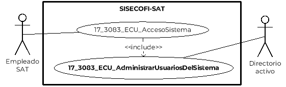
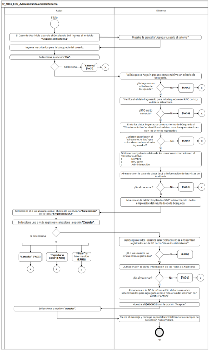

||Administración General de Comunicaciones y Tecnologías de la Información|
| :- | -: |
||Marco Documental 7.0|
|
Fecha de aprobación del Template:

02/08/2023
|
**Especificación del Caso de Uso**

17\_3083\_ECU\_AdministrarUsuariosDelSistema.docx
|Versión del template: 7.00|
| :-: | :-: | :-: |

**<ID Requerimiento>** 8309

**Nombre del Requerimiento: **TI\_SISECOFI-SAT\_Seguimiento financiero y control documental de proyectos de contratación

**Tabla de Versiones y Modificaciones**

|Versión|Descripción del cambio|Responsable de la Versión|Fecha|
| :-: | :- | :-: | :-: |
|*1*|*Creación del documento*|Eric Hector Pérez Pérez|*07/03/2024*|
|*1.1*|*Revisión del documento*|Luis Angel Olguín Castillo|*13/04/2024*|
|*1.2*|*Versión aprobada para firma*|
María del Carmen Castillejos Cárdenas

Rubén Delgado Ramírez
|*18/06/2024*|

**Tabla de Contenido**

[17_3083_ECU_AdministrarUsuariosDelSistema	3](#_toc170377366)

[1. Descripción	3](#_toc170377367)

[2. Diagrama del Caso de Uso	3](#_toc170377368)

[3. Actores	3](#_toc170377369)

[4. Precondiciones	3](#_toc170377370)

[5. Post condiciones	4](#_toc170377371)

[6. Flujo primario	4](#_toc170377372)

[7. Flujos alternos	7](#_toc170377373)

[8. Referencias cruzadas	15](#_toc170377374)

[9. Mensajes	15](#_toc170377375)

[10. Requerimientos No Funcionales	16](#_toc170377376)

[11. Diagrama de actividad	18](#_toc170377377)

[12. Diagrama de estados	18](#_toc170377378)

[13. Aprobación del cliente	19](#_toc170377379)

### ****17\_3083\_ECU\_AdministrarUsuariosDelSistema

|<h3>**1. Descripción** </h3>|
| :- |
|

El objetivo de este Caso de Uso es permitir al Empleado SAT agregar al sistema usuarios que se encuentren en el Directorio Activo del SAT.

|
|<h3>**2. Diagrama del Caso de Uso**</h3>|
|

|
|<h3>**3. Actores** </h3>|
||

|**Actor**|**Descripción**|
| :-: | :-: |
|**Empleado SAT**|El Empleado SAT tiene el o los roles otorgados por la Administración Central de Seguridad, Monitoreo y Control (ACSMC), para ingresar a cada uno de los módulos de este sistema.|
|**Directorio activo**|Es el esquema donde se almacena la información de los empleados del SAT.|

|

|
| :- |
|<h3>**4. Precondiciones**</h3>|
|

- El Empleado SAT se ha autenticado en el sistema con una e.firma válida.

- El sistema ha consumido el servicio “Oauth” para obtener los datos del usuario que ingresa al mismo.

- El sistema ha validado que el Empleado SAT cuenta con los roles para ingresar al módulo “Administrar usuarios del sistema”.

- El Empleado SAT ha ingresado a la opción del menú “Administrar usuarios del sistema”.

|
|<h3>**5. Post condiciones** </h3>|
|

- El empleado SAT agregó usuarios del Directorio activo al sistema.

- El empleado SAT activó e inactivó usuarios del sistema.

|
|<h3>**6. Flujo primario**</h3>|
||

|**Actor**|**Sistema**|
| :-: | :-: |
|1. El Caso de Uso inicia cuando el Empleado SAT ingresa al módulo **“Usuarios del Sistema”**.|
2. Muestra la pantalla “Agregar usuario al sistema” con los siguientes criterios de búsqueda, aplican las **(RNA13)** y **(RNA14)**:

&emsp;

Filtros de búsqueda:

- Nombre

- RFC corto

Buscar:

- DA (Directorio Activo)

- Sistema

&emsp;

Opción:

- Exportar a Excel (Sólo se muestra si existen registros en la tabla).

Empleados SAT:

- Nombre

- RFC corto

- Administración

- Seleccionar

Opciones:

- Cancelar

- Guardar

&emsp;

**Nota:** Se visualizan los criterios de búsqueda para consultar usuarios específicos del Directorio Activo.

Ver

**(17\_3083\_EIU\_AdministrarUsuariosDelSistema)** Estilos 01.
|
|3. Ingresa los criterios para la búsqueda del usuario.||
|
4. Selecciona la opción **“DA”** y continúa en el flujo.

&emsp;

- Si selecciona la opción **“Sistema”**,** continúa en el **([**FA01**](#fa01))**.
|
5. Valida que se haya ingresado como mínimo un criterio de búsqueda.

&emsp;

- En caso contrario que no haya ingresado al menos un criterio de búsqueda continúa en el **([**FA02**](#fa02))**.
|
||
6. Verifica, si el dato ingresado para la búsqueda es el RFC corto, valida su estructura de acuerdo con la **(RNA14)**.

&emsp;

- En caso de identificar que el RFC corto no es correcto, continúa en el **([**FA06**](#fa06))**.
|
||
7. Envía los datos ingresados como criterios de búsqueda al “Directorio Activo” e identifica si existen usuarios que coincidan con los criterios ingresados.

&emsp;

- En caso de que no existan usuarios en el “Directorio Activo” que coincidan con los criterios ingresados, continúa en el **([**FA07**](#fa07))**.
|
||
8. Obtiene los siguientes datos de los usuarios encontrados en el “Directorio Activo”:

&emsp;

- Nombre 

- RFC corto

- Administración
|
|

|
9. Almacena en la base de datos (BD) la información de las Pistas de Auditoría.

&emsp; 

&emsp;Datos que se almacenan:

**Módulo**= Usuarios del Sistema

**Fecha y Hora**= Fecha y hora del sistema, usando el formato DD/MM/AAAA HH:MM: SS

**RFC Usuario**= RFC largo del usuario que ingresó al sistema.

**Tipo de movimiento**= **CNST** (Consulta).

**Movimiento**= Aplica la **(RNA239)**

- Datos que se consultan en Directorio Activo.

&emsp;

- En caso de que no se pueda almacenar las Pistas de Auditoría, continúa en el **([**FA04**](#fa04))**.
|
||
10. Muestra en la tabla “Empleados SAT” la siguiente información de los empleados del resultado de la búsqueda:

Empleados SAT:

- Nombre

- RFC corto

- Administración

- Seleccionar 

- Campos de filtros en columnas

Opciones:

-  Exportar Empleados SAT

- Guardar

- Cancelar

Ver **(17\_3083\_EIU\_AdministrarUsuariosDelSistema)** Estilos 01.
|
|11. Selecciona el o los usuarios con el check de la columna **“Seleccionar”** de la tabla **“Empleados SAT”**.||
|
12. Selecciona uno o más registros y selecciona la opción **“Guardar”** y continua en el flujo.

&emsp;

- Si selecciona, la opción **“Cancelar”**,** continúa en el **([**FA03**](#fa03))**.

- Si selecciona **“Exportar a Excel”** Empleados SAT, continúa en el **([**FA09**](#fa09))**.

- En caso de requerir **“Filtrar”** la información en alguna columna de la tabla, continúa en el **([**FA05**](#fa05))**.

|
13. Valida que el o los usuarios seleccionados no se encuentren registrados en la BD como “Usuarios del sistema”, aplica la **(RNA81)**.

- En caso de identificar que el usuario(s) se encuentre registrado, aplicando la **(RNA81)**, continúa en el **([**FA10**](#fa10))**.

	
|
|

|
14. Almacena en la BD la información de las Pistas de Auditoría. 

&emsp;

&emsp;Datos que se almacenan:

**Módulo**= Usuarios del Sistema

**Fecha y Hora**= Fecha y hora del sistema usando el formato DD/MM/AAAA HH:MM: SS

**RFC Usuario**= RFC largo del usuario que ingresó al sistema.

**Tipo de movimiento**= **INSR** (Insertar).

**Movimiento**= Aplica la **(RNA239)**

- RFC corto

&emsp;

- En caso de que no se pueda almacenar las Pistas de Auditoría, continúa en el **([**FA04**](#fa04))**.
|
||15. Almacena en la BD la información del o los usuarios seleccionados para agregarlos como “Usuarios del sistema” con estatus “Activo”.|
||16. Muestra el **([**MSG002**](#msg002))** con la opción “Aceptar”.|
|17. Selecciona la opción **“Aceptar”**.|18. Cierra el mensaje y recarga la pantalla inicializando los campos de la sección nuevamente.|
||19. Fin del Caso de Uso.|

|

|
| :- |
|<h3>**7. Flujos alternos** </h3>|
|

**FA01 Selecciona la opción “Sistema” en Administrar Usuarios del Sistema**
|

|**Actor**|**Sistema**|
| :-: | :-: |
|
1. El **FA01** inicia cuando el Empleado SAT selecciona la opción **“Sistema”**.

&emsp;
|
2. Valida que se haya ingresado como mínimo un criterio de búsqueda.

&emsp;

- En caso contrario que no haya ingresado al menos un criterio de búsqueda continúa en el **([**FA02**](#fa02))**.

|
||
3. Verifica si el dato ingresado para la búsqueda es el RFC corto y valida su estructura de acuerdo con la **(RNA14)**

&emsp;

- En caso de identificar que el RFC corto no es correcto, continúa en el **([**FA06**](#fa06))**.
|
||
4. Envía los datos ingresados como criterios de búsqueda a la BD del “Sistema” e identifica si existen usuarios que coincidan con los criterios ingresados.

- En caso de que no existan usuarios en la BD del “Sistema” que coincidan con los criterios ingresados, continúa en el **([**FA11**](#fa11))**.
|
||
5. Obtiene los siguientes datos de los usuarios encontrados en la BD del “Sistema”:

&emsp;

- Nombre

- RFC corto

- Administración

- Estatus
|
||
6. Almacena en la base de datos (BD) la información de las Pistas de Auditoría.

&emsp; 

&emsp;Datos que se almacenan:

**Módulo**= Usuarios del Sistema

**Fecha y Hora**= Fecha y hora del sistema, usando el formato DD/MM/AAAA HH:MM: SS

**RFC Usuario**= RFC largo del usuario que ingresó al sistema.

**Tipo de movimiento**= **CNST** (Consulta).

**Movimiento**= Aplica la **(RNA239)**

- Datos que se consultan en la BD del sistema.

&emsp;

- En caso de que no se pueda almacenar las Pistas de Auditoría, continúa en el **([**FA04**](#fa04))**.
|
||
7. Muestra en la tabla “Usuarios registrados en el sistema” la siguiente información de los empleados del resultado de la búsqueda:

&emsp;

- Nombre

- RFC corto

- Administración

- Estatus  

Opciones:

-  Exportar Usuarios registrados en el sistema

- Guardar

- Cancelar

&emsp;

Ver 

**(17\_3083\_EIU\_AdministrarUsuariosDelSistema)** Estilos 02.
|
|8. Elige el campo de **“Estatus”** para **“Activar”** o **“Inactivar”** algún registro de los que se muestran.|
9. Muestra el **([**MSG005**](#msg005))** solo si se inactiva con las opciones “Sí” y “No”.

&emsp;
|
|
10. Selecciona una de las opciones:

&emsp;

- En caso de que seleccione **“Sí”**, continúa en el flujo.

- En caso de que seleccione **“No”**, continúa en el paso [**12**](#_ref163985918) de este flujo.
|
11. Cierra mensaje y realiza el movimiento correspondiente de acuerdo con la **(RNA43)**.

&emsp;
|
|
12. Selecciona la opción **“Guardar”**, el flujo continúa.

- Si selecciona la opción **“Cancelar”**,** continúa en el **([**FA03**](#fa03))**.

&emsp;

- Si selecciona **“Exportar a Excel” todos los Usuarios registrados en el sistema**, continúa en el **([**FA08**](#fa08))**.

&emsp;

- En caso de requerir **“Filtrar”** la información en alguna columna de la tabla, continúa en el **([**FA05**](#fa05))**.
|
13. Almacena en la BD la información de las Pistas de Auditoría. 

&emsp;

&emsp;Datos que se almacenan:

**Módulo**= Usuarios del Sistema

**Fecha y Hora**= Fecha y hora del sistema usando el formato DD/MM/AAAA HH:MM:SS

**RFC Usuario**= RFC largo del Empleado SAT que ingresó al sistema.

**Tipo de movimiento**= **UPD** (Modificar).

**Movimiento**= Aplica la **(RNA239)**

- RFC corto

- En caso de que no se pueda almacenar las Pistas de Auditoría, continúa en el **([**FA04**](#fa04))**.
|
||14. Actualiza en la BD interna el estatus “Activo” o “Inactivo” según sea el caso del usuario(s) donde fue seleccionado.|
||15. Muestra el **([**MSG008**](#msg008))** con la opción “Aceptar”.|
|16. Selecciona la opción **“Aceptar”**.|17. Cierra el mensaje y recarga la pantalla inicializando los campos de la pantalla nuevamente.|
||18. Regresa al paso [**2**](#_ref163983779) del Flujo primario.|

|

**FA02 No se ingresó por lo menos un criterio de búsqueda**
|
| :- |

|**Actor**|**Sistema**|
| :-: | :-: |
||1. El **FA02** inicia cuando el sistema identifica que no se ingresó al menos un criterio de búsqueda.|
||2. Muestra en rojo los campos pendientes de capturar.|
||3. Muestra el mensaje **([**MSG001**](#msg001))**, con la opción “Aceptar”.|
|4. Selecciona la opción **“Aceptar”**.|5. Cierra el mensaje.|
||
6. Continúa:

- Si fue invocado del paso 5 del Flujo primario regresa al paso [**3**](#_ref163983903) del Flujo primario. 

- Si fue invocado del paso 2 del **([**FA01**](#fa01))** regresa al paso [**3**](#_ref163983903) del Flujo primario. 
|

|

**FA03 Selecciona la opción “Cancelar”**
|
| :- |

|**Actor**|**Sistema**|
| :-: | :-: |
|1. El **FA03** inicia cuando el Empleado SAT selecciona la opción **“Cancelar”**.|2. Muestra el **([**MSG004**](#msg004))** con** las opciones “Sí” y “No”.|
|
3. Selecciona la opción **“Sí”** y** continúa en el flujo.

&emsp;

- En caso de seleccionar **“No”**,** continúa en el paso [**6**](#_ref166494358) de este flujo.
|4. Cierra el mensaje.|
||5. Inicializa los campos de la pantalla en donde se selecciona la opción, dejándolos como en un inicio, pero no almacena ninguna información.|
||6. Regresa al paso [**3**](#_ref163983903) del Flujo primario.|

|

**FA04 No se pueden almacenar las Pistas de Auditoría**
|
| :- |

|**Actor**|**Sistema**|
| :-: | :-: |
||1. El **FA04** inicia cuando interviene un evento ajeno y no se pueda almacenar las Pistas de Auditoría. |
||2. Cancela la operación sin completar el movimiento que estaba en proceso.|
||
3. Muestra el mensaje de acuerdo con lo siguiente:

&emsp;

- Si la pista de auditoría es por el tipo de movimiento **UPDT** o **INSR**, se muestra el **([**MSG009**](#msg009))**.

&emsp;

- Si la pista de auditoría es por el tipo de movimiento **CNST**, se muestra el **([**MSG010**](#msg010))**.

- En caso de que la pista de auditoría es por el tipo de movimiento **PRNT**, se muestra el **([**MSG011**](#msg011))**.

&emsp;

&emsp;Cada mensaje se muestra con la opción “Aceptar”.
|
|4. Selecciona la opción **“Aceptar”**.|5. Cierra el mensaje.|
||6. Regresa al paso previo que detona la acción de la pista de auditoría.|

|

**FA05 Selecciona la opción “Filtrar”**
|
| :- |

|**Actor**|**Sistema**|
| :-: | :-: |
|1. El **FA05** inicia cuando el Empleado SAT requiere **“Filtrar”** la información en alguna columna de acuerdo con lo que se muestra en la tabla.||
|2. Elige la columna para filtrar e ingresa el dato a buscar.|3. Busca dentro de la columna y filtra la información mostrada de acuerdo con los caracteres ingresados en el campo.|
||4. Muestra en tiempo real todas las coincidencias que obtiene de dicha columna.|
||
5. Realiza lo siguiente: 

- Si fue invocado en el Flujo primario, continúa en el paso [**12**](#_ref169518133) de dicho flujo. 

- Si fue invocado en el **([**FA01**](#fa01))**, continúa en el paso [**12**](#_ref163985918)** de dicho flujo. 

|

|

**FA06 No se ingresó un RFC corto válido**
|
| :- |

|**Actor**|**Sistema**|
| :-: | :-: |
||1. El **FA06** inicia cuando el sistema identifica que el RFC corto ingresado no es correcto.|
||2. Muestra el **([**MSG006**](#msg006))** con la opción “Aceptar”.|
|3. Selecciona la opción **“Aceptar”**.|4. Cierra el mensaje. |
||
5. Realiza lo siguiente:

- Si fue invocado del paso 6 del Flujo primario regresa al paso [**3**](#_ref163983903) del Flujo primario. 

- Si fue invocado del paso 3 del **([**FA01**](#fa01))** regresa al paso [**3**](#_ref163983903) del Flujo primario.
|

|

**FA07 No existen usuarios en el Directorio Activo relacionados con los criterios ingresados**
|
| :- |

|**Actor**|**Sistema**|
| :-: | :-: |
||1. El **FA07** inicia cuando el sistema identifica que no existen usuarios en el “Directorio Activo del SAT” que coincidan con los criterios ingresados.|
||2. Muestra el **([**MSG007**](#msg007))** con la opción “Aceptar”.|
|3. Selecciona la opción **“Aceptar”**.|4. Cierra el mensaje. |
||5. Regresa al paso [**3**](#_ref163983903) del Flujo primario.|

|

**FA08 Selecciona la opción “Exportar a Excel” Usuarios registrados en el sistema**
|
| :- |

|**Actor**|**Sistema**|
| :-: | :-: |
|1. El **FA08** inicia cuando el Empleado SAT selecciona la opción **“Exportar a Excel”**.|
2. Almacena en la BD la información de las Pistas de Auditoría.

&emsp; 

&emsp;Datos que se almacenan:

**Módulo**= Usuarios del Sistema

**Fecha y Hora**= Fecha y hora del sistema, usando el formato DD/MM/AAAA HH:MM:SS

**RFC Usuario**= RFC largo del Empleado SAT que ingresó al sistema.

**Tipo de movimiento**= 

**PRNT** (Imprimir)

**Movimiento**= Aplica la **(RNA239)**

- RFC corto

- En caso de que no se puedan almacenar las Pistas de Auditoría, continúa en el **([**FA04**](#fa04))**.
|
||
3. Obtiene la siguiente información:

&emsp;

&emsp;- Nombre

&emsp;- RFC corto

&emsp;- Administración

&emsp;- Estatus
|
||4. Genera un archivo de Excel con extensión (.xlsx) que contenga la información obtenida.|
||5. Descarga el archivo de Excel con extensión (.xlsx).|
||6. Fin del Caso de Uso.|

|

**FA09 Selecciona la opción “Exportar a Excel” Empleados SAT**
|
| :- |

|**Actor**|**Sistema**|
| :-: | :-: |
|7. El **FA09** inicia cuando el Empleado SAT selecciona la opción **“Exportar a Excel”**.|
8. Almacena en la BD la información de las Pistas de Auditoría.

&emsp; 

&emsp;Datos que se almacenan:

**Módulo**= Usuarios del Sistema

**Fecha y Hora**= Fecha y hora del sistema, usando el formato DD/MM/AAAA HH:MM:SS

**RFC Usuario**= RFC largo del Empleado SAT que ingresó al sistema.

**Tipo de movimiento**= 

**PRNT** (Imprimir)

**Movimiento**= Aplica la **(RNA239)**

- RFC corto

- En caso de que no se puedan almacenar las Pista de Auditoría, continúa en el **([**FA04**](#fa04))**.
|
||
9. Obtiene la siguiente información:

&emsp;

&emsp;- Nombre

&emsp;- RFC corto

&emsp;- Administración
|
||10. Genera un archivo de Excel con extensión (.xlsx) que contenga la información obtenida.|
||11. Descarga el archivo de Excel con extensión (.xlsx).|
||12. Fin del Caso de Uso.|

|

**FA10 El usuario ya está registrado**
|
| :- |

|**Actor**|**Sistema**|
| :-: | :-: |
||1. El **FA10** inicia cuando el sistema identifica que el o los “Usuarios” ya se encuentran registrados.|
||2. Muestra en rojo los “Usuarios”.|
||
3. Muestra el mensaje **([**MSG003**](#msg003))**, con la opción “Aceptar”.

&emsp;
|
|4. Selecciona la opción **“Aceptar”**.|5. Cierra el mensaje. |
||6. Continúa en el paso [**11**](#_ref169537219)** del Flujo primario.|

|

**FA11 No existen usuarios en la BD del sistema relacionados con los criterios ingresados**
|
| :- |

|**Actor**|**Sistema**|
| :-: | :-: |
||1. El **FA11** inicia cuando el sistema identifica que no existen usuarios en la “BD del sistema” que coincidan con los criterios ingresados.|
||2. Muestra el **([**MSG007**](#msg007))** con la opción “Aceptar”.|
|3. Selecciona la opción **“Aceptar”**.|4. Cierra el mensaje. |
||5. Regresa al paso [**4**](#_ref169539834)** del **([**FA01**](#fa01))**.|

|

|
| :- |
|<h3>**8. Referencias cruzadas** </h3>|
|

- 17\_3083\_CRN\_SeguimientoFinancieroYControl

- 17\_3083\_EIU\_AdministrarUsuariosDelSistema

&emsp;
|
|<h3>**9. Mensajes** </h3>|
||

|**ID Mensaje**|**Descripción**|
| :-: | :-: |
|**MSG001**|Favor de ingresar como mínimo un criterio de búsqueda.|
|**MSG002**|Se agregó el o los usuarios al sistema correctamente.|
|**MSG003**|Usuario actualmente registrado en el sistema.|
|**MSG004**|Se perderá la información ingresada. ¿Está seguro de cancelar?|
|**MSG005**|Al inactivar el estatus, los usuarios relacionados no podrán ingresar a los módulos del sistema. ¿Está seguro de continuar?|
|**MSG006**|RFC corto no cumple con el formato correcto, favor de validar e intente nuevamente.|
|**MSG007**|No existen usuarios relacionados con los criterios de búsqueda ingresados.|
|**MSG008**|Se registraron los cambios correctamente.|
|**MSG009**|Ocurrió un error al guardar el registro, favor de intentar nuevamente (PA01).|
|**MSG010**|Ocurrió un error al consultar la información, favor de intentar nuevamente (PA01).|
|**MSG011**|Ocurrió un error al exportar la información, favor de intentar nuevamente (PA01).|

|

|
| - |
|<h3>**10. Requerimientos No Funcionales** </h3>|
||

|**ID de RNF**|**Requerimiento No Funcional**|**Descripción**|
| :-: | :-: | :-: |
|**RNF001**|Disponibilidad|El sistema deberá estar activo las 24 horas del día, los 365 días del año con picos de operación en el horario de 9:00 a 18:00 horas.|
|**RNF002**|Concurrencia|
El número máximo de accesos concurrentes es 30. El número de usuarios que debe soportar este sistema son:

Empleados SAT: 150
|
|**RNF003**|Seguridad|El acceso solo podrá ser otorgado a todo Empleado SAT que tenga los roles asignados por la Administración Central de Seguridad, Monitoreo y Control (ACSMC) para cada módulo de este sistema.|
|**RNF004**|Usabilidad|
El sistema deberá manejar los siguientes elementos para facilitar la navegación: 

- Mensajes tipo flotantes (*tooltips*) con información de la herramienta que ofrece ayuda contextual como guía para el Empleado SAT. 

- Componente de ordenamiento que permita acomodar la información de la tabla de forma ascendente o descendente, considerando la columna donde es seleccionado. 

- Contar con un diseño responsivo que permite su óptima visualización en distintos tipos de dispositivos finales.
|
|**RNF005**|Eficiencia|Las consultas se dividen en generales y detalladas, para que las detalladas carguen la información sólo cuando sean requeridas por el Empleado SAT.|
|**RNF006**|Usabilidad|
El Empleado SAT podrá navegar a través de las páginas resultantes de la consulta considerando que, el sistema debe mostrar inicialmente 15 registros por página, permitiendo al Empleado SAT seleccionar los registros que requiere visualizar, teniendo las opciones 15, 50 y 100: 

- Ir a la primera página (debe mostrar la primera página con el resultado de la consulta). 

- Ir a la última página (debe mostrar la última página con el resultado de la consulta). 

- Ir a la siguiente página (debe mostrar la siguiente página considerando la página actual, con el resultado de la consulta y el número de registros seleccionados). 

- Ir a la página anterior (debe mostrar la página anterior considerando la página actual, con el resultado de la consulta). 

- Los registros deben mostrarse en la tabla ordenados alfabéticamente.
|
|**RNF007**|Seguridad|Para las Pistas de Auditoría deben estar protegidas contra accesos no autorizados. Sólo los Empleados SAT autorizados pueden consultarlas, y la información en ellas se definirá durante la etapa de diseño; la cual debe estar cifrada para mantenerla confidencial y evitar exposiciones no autorizadas.|
|**RNF008**|Usabilidad|
Usabilidad, El Empleado SAT podrá navegar a través de las páginas resultantes del documento PDF. 

- Ir a la siguiente página (debe mostrar la página consecutiva del documento PDF). 

- Ir a la página anterior (debe mostrar la página previa del documento PDF).
|
|**RNF009**|Fiabilidad|El sistema debe ser capaz de manejar excepciones de manera efectiva y presentar mensajes claros y comprensibles para garantizar una adecuada interacción con el sistema.|
|**RNF010**|Seguridad |Mantener la información en pantalla en caso de un error al guardar las Pistas de Auditoría, siempre y cuando el escenario lo permita. Hay situaciones de infraestructura o de conexión de internet que sí pierde los datos ya que no están controlados por el sistema. |
|**RNF011**|Integridad |Al almacenar la información en la BD de tipo Texto o alfanumérico se deben eliminar los espacios en blanco al inicio y fin de la cadena. |

||
| :- |

|<h3>**11. Diagrama de actividad** </h3>|
| :- |
|

|
|<h3>**12. Diagrama de estados** </h3>|
|

No aplica, no se requiere para este proceso.
|

|<h3>**13. Aprobación del cliente** </h3>|
| :- |
||

|**FIRMAS DE CONFORMIDAD**||
| :-: | :- |
|**Firma 1** |**Firma 2** |
|**Nombre**: María del Carmen Castillejos Cárdenas.|**Nombre**: Rubén Delgado Ramirez.|
|**Puesto**: Usuaria ACPPI.|**Puesto**: Usuario ACPPI.|
|**Fecha:**|**Fecha:**|
|||
|**Firma 3** |**Firma 4**|
|**Nombre**: Rodolfo López Meneses.|**Nombre**: Yesenia Helvetia Delgado Naranjo.|
|**Puesto**: Usuario ACPPI.|**Puesto**: APE ACPPI.|
|**Fecha:**|**Fecha:**|
|||
|**Firma 5**|**Firma 6**|
|**Nombre:** Alejandro Alfredo Muñoz Núñez.|**Nombre**: Luis Angel Olguin Castillo.|
|**Puesto:** RAPE ACPPI.|**Puesto**: Enlace ACPPI.|
|**Fecha**:|**Fecha**:|
|||
|**Firma 7**|**Firma 8**|
|**Nombre**: Erick Villa Beltrán.|**Nombre:** Juan Carlos Ayuso Bautista.|
|**Puesto**: Líder APE SDMA 6.|**Puesto:** Líder Técnico SDMA 6.|
|**Fecha**:|**Fecha**:|
|||
|**Firma 9**||
|**Nombre:** Eric Hector Pérez Pérez.||
|**Puesto:** Analista de Sistemas DS SDMA 6.||
|**Fecha**:||
|||

||
| :- |

|||Página 11 de 19|
| :- | :-: | -: |

