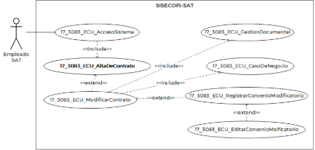
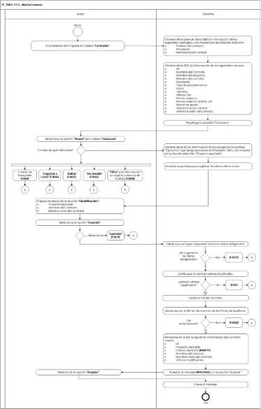

||Administración General de Comunicaciones y Tecnologías de la Información|
| :- | -: |
||Marco Documental 7.0|
|
Fecha de aprobación del Template:

02/08/2023
|
**Especificación del Caso de Uso**

17\_3083\_ECU\_AltaDeContrato.docx
|Versión del template: 7.00|
| :-: | :-: | :-: |

**<ID Requerimiento>** 8309

**Nombre del Requerimiento: **TI\_SISECOFI-SAT\_Seguimiento financiero y control documental de contratos de contratación

**Tabla de Versiones y Modificaciones**

|Versión|Descripción del cambio|Responsable de la Versión|Fecha|
| :-: | :- | :-: | :-: |
|*1*|*Creación del documento*|Angel Horacio López Alcaraz|23/01/2024|
|*1.1*|*Revisión del documento*|Luis Angel Olguin Castillo|02/05/2024|
|*1.2*|*Versión aprobada para firma*|
María del Carmen Castillejos Cárdenas

Rubén Delgado Ramírez
|21/05/2024|

**Tabla de Contenido**

[17_3083_ECU_AltaDeContrato.	2](#_toc168054214)

[1. Descripción	2](#_toc168054215)

[2. Diagrama del Caso de Uso	2](#_toc168054216)

[3. Actores	2](#_toc168054217)

[4. Precondiciones	2](#_toc168054218)

[5. Post condiciones	3](#_toc168054219)

[6. Flujo primario	3](#_toc168054220)

[7. Flujos alternos	7](#_toc168054221)

[8. Referencias cruzadas	20](#_toc168054222)

[9. Mensajes	21](#_toc168054223)

[10. Requerimientos No Funcionales	21](#_toc168054224)

[11. Diagrama de actividad	23](#_toc168054225)

[12. Diagrama de estados	23](#_toc168054226)

[13. Aprobación del cliente	24](#_toc168054227)

### ****17\_3083\_ECU\_AltaDeContrato.

|<h3>**1. Descripción** </h3>||
| :- | :- |
|

El objetivo de este Caso de Uso es permitir al Empleado SAT consultar, crear y exportar a Excel la información relacionada con los contratos.

||
|<h3>**2. Diagrama del Caso de Uso**</h3>||
|

||
|||
|<h3>**3. Actores** </h3>||
|||

|**Actor**|**Descripción**|
| :-: | :-: |
|**Empleado SAT**|El Empleado SAT es el que tiene el o los roles otorgados por la Administración Central de Seguridad, Monitoreo y Control (ACSMC) para ingresar a cada uno de los módulos de este sistema.|

|

||
| :- | :- |
|<h3>**4. Precondiciones**</h3>||
|

- El Empleado SAT se ha autenticado en el sistema con e.firma válida.

- El sistema ha consumido el servicio “Oauth” para obtener los datos del Empleado SAT que ingresa.

- Se le han asignado los roles requeridos al Empleado SAT para ingresar al módulo “Contratos”.

- El sistema ha validado que el Empleado SAT cuenta con los roles para ingresar y/o insertar al módulo “Contratos”.

- Se han registrado proyectos previamente.

- Se han dado de alta proveedores previamente.

- Se ha asociado el proyecto al Empleado SAT.

&emsp;
||
|<h3>**5. Post condiciones** </h3>||
|

- El Empleado SAT consultó los contratos existentes.

- El Empleado SAT creó un nuevo contrato.

&emsp;

&emsp;
||
|<h3>**6. Flujo primario**</h3>||
|||

|**Actor**|**Sistema**|
| :-: | :-: |
|1. El Caso de Uso inicia cuando el Empleado SAT ingresa al módulo **“Contratos”**.|
2. Obtiene de la base de datos (BD) la información de los siguientes catálogos y los muestra en las listas de selección: 

&emsp;

- Estatus del contrato

- Proveedor

- Administración central
|
||
3. Obtiene de la (BD) la información de los siguientes campos:

&emsp;

- Id

- Nombre del contrato

- Nombre del proyecto

- Número de contrato

- Proveedor

- Tipo de procedimiento

- Inicio

- Término

- Último CM

- Monto máximo

- Monto máximo último CM

- Monto en pesos

- Administración central

- Administrador del contrato

|
|

|
4. Despliega la pantalla “Contratos”. Aplica las **(RNA243)**:** 

Buscar contrato:

- Estatus del contrato

- Vigencia

&emsp;- De

&emsp;- Al

- Proveedor

- Administración central

&emsp;

Opciones:

- ![ref1]Buscar

- Nuevo contrato

- Exportar a Excel ![ref2]

Tabla Contratos. Aplica la **(RNA244)**:

- Id

- Nombre del contrato

- Nombre del proyecto

- Número de contrato

- Proveedor

- Tipo de procedimiento

- Inicio

- Término

- Último CM

- Monto máximo

- Monto máximo último CM

- Monto en pesos. Aplica la **(RNA245)**.

- Administración central

- Administrador del contrato

- Acciones

- Editar ![ref3]

- Ver detalle ![ref4]

- Campos para Filtro 

&emsp;

Ver **(17\_3083\_EIU\_AltaDeContrato)** Estilos 01.
|
|
5. Selecciona la opción **“Nuevo”** del módulo **“Contratos”** y continúa en el flujo.

&emsp;

- En caso de que seleccione algún criterio de búsqueda continúa en el **([**FA01**](#fa01))**.

- Si selecciona la opción **“Exportar a Excel”**, continúa en el **([**FA04**](#fa04))**.

- Si selecciona la opción **“Editar”**, continúa en el **([**FA05**](#fa05))**.

- Si selecciona la opción **“Ver detalle”**, continúa en el **([**FA06**](#fa06))**.

- En caso de que requiera aplicar un **“Filtro”** a la información en alguna columna de la tabla, continúa en el **([**FA09**](#fa09))**.
|6. Obtiene de la BD la información de los proyectos en estatus “Ejecución” que tenga asociados el Empleado SAT y los muestra en la lista de selección “Proyecto asociado”.|
||
7. Muestra la pantalla para registrar los siguientes datos del contrato:

Sección Identificación.

- Id. Aplica la **(RNA76)**

- Proyecto asociado\*. Aplica la **(RNA158)**

- Estatus. Aplica la **(RNA75)**

- Nombre del contrato\*

- Nombre corto del contrato\*

- Última modificación. Aplica la **(RNA159)**

Opciones. Aplica la **(RNA75)**:

- Inicial

- Ejecución

- Cancelar

- Guardar

Secciones inhabilitadas. Aplica la **(RNA160):**

- Datos generales

- Vigencia y montos

- Grupos de servicio y/o conceptos

- Registro de servicios

- Proyección de caso de negocio

- Cargar layout de los informes

- Atraso en el inicio de la prestación

- Informes documentales por única vez

- Informes documentales periódicos

- Informes documentales de los servicios

- Penas contractuales

- Niveles de servicio (SLA)

- Asignación de plantilla

- Gestión documental

- Convenios modificatorios

- Dictámenes asociados

- Facturas asociadas

- Reintegros asociados

- Cierre

&emsp;

Opción:

- ` `Regresar

Ver **(17\_3083\_EIU\_AltaDeContrato)** Estilos 02.
|
|
8. Ingresa los datos de la sección **“Identificación”**:

&emsp;

- Proyecto asociado

- Nombre del contrato

- Nombre corto del contrato
||
|
9. Selecciona la opción **“Guardar”** y continúa en el flujo.

&emsp;

- En caso de seleccionar la opción **“Cancelar”**, continúa en el **([**FA07**](#fa07))**.
|
10. Valida que se hayan capturado los datos obligatorios de acuerdo con la **(RNA03)**.

&emsp;

&emsp;En caso de identificar que no se ingresaron los datos obligatorios, continúa en el **([**FA02**](#fa02))**.
|
||
11. Valida que no existan valores duplicados conforme a la **(RNA237)**.

&emsp;

- En caso de identificar que existen duplicados, continúa en el **([**FA11**](#fa11))**.
|
||12. Genera el Id del contrato de acuerdo con la **(RNA76)**.|
||
13. Almacena en la BD la información de las Pistas de Auditoría.

&emsp;

&emsp;Datos que se almacenan:

**Módulo**=** Contratos-Identificación

**Fecha y Hora**= Fecha y hora del sistema, usando el formato DD/MM/AAAA HH:MM:SS

**RFC Usuario**= RFC largo del Empleado SAT que ingresó al sistema.

**Tipo de movimiento**= **INSR** (Insertar)

**Movimiento** = Aplica la **(RNA239)**

- Id de contrato

&emsp;

- En caso de que no se puedan almacenar las Pistas de Auditoría, continúa en el **([**FA08**](#fa08))**.
|
||
14. Almacena en la BD la siguiente información del contrato creado:

&emsp;

- Id

- Proyecto asociado

- Estatus. Aplica la **(RNA75)**

- Nombre del contrato

- Nombre corto del contrato

- Última modificación
|
||15. Muestra el mensaje **([**MSG004**](#msg004))**,** con la opción “Aceptar”.|
|16. Selecciona la opción **“Aceptar”**.|17. Cierra el mensaje.|
||18. Fin del Caso de Uso.|

|

||
| :- | :- |
|<h3>**7. Flujos alternos** </h3>||
|

**FA01 Selecciona al menos un criterio de búsqueda**
||

|**Actor**|**Sistema**|
| :-: | :-: |
|1. El **FA01** inicia cuando el Empleado SAT selecciona al menos un valor en los criterios de búsqueda.||
|2. Selecciona la opción **“Buscar”**.|
3. Verifica que se haya seleccionado un valor en al menos un criterio de búsqueda.

&emsp;

- En caso de que no se haya seleccionado al menos un criterio de búsqueda continúa en el **([**FA10**](#fa10))**.
|
||
4. Verifica que existan contratos que coincidan con los criterios de búsqueda.

&emsp;

- En caso de que no existan contratos que coincidan con los criterios de búsqueda, continúa en el **([**FA03**](#fa03))**.
|
||5. Habilita la opción “Exportar a Excel”.|
||
6. Almacena en la BD la información de las Pistas de Auditoría.

&emsp;

&emsp;Datos que se almacenan:

**Módulo**= Contratos

**Fecha y Hora**= Fecha y hora del sistema, usando el formato DD/MM/AAAA HH:MM:SS

**RFC Usuario**= RFC largo del Empleado SAT que ingresó al sistema.

**Tipo de movimiento**= **CNST** (Consulta)

**Movimiento**= 

- Estatus del contrato

- Vigencia

- Proveedor

- Administración central

- En caso de que no se puedan almacenar las Pistas de Auditoría, continúa en el **([**FA08**](#fa08))**.
|
||
7. Consulta y obtiene de la BD la siguiente información de los contratos de los proyectos asociados al Empleado SAT, que coincidan con los criterios de búsqueda.

&emsp;

- Id

- Nombre del contrato

- Nombre del proyecto

- Número de contrato

- Proveedor

- Tipo de procedimiento

- Inicio

- Término

- Último CM

- Monto máximo

- Monto máximo último CM

- Monto en pesos

- Administración central

- Administrador del contrato
|
||
8. Muestra la pantalla de “Contratos”** con la información obtenida de los contratos que coincidan con los criterios de búsqueda.

&emsp;

Buscar contrato:

- Estatus del contrato

- Vigencia

&emsp;- De

&emsp;- Al

- Proveedor

- Administración central

Opciones:

- ![ref5]Buscar

- Nuevo contrato 

- Exportar a Excel ![ref2]

Tabla Contratos. Aplica la **(RNA244)**:

- Id

- Nombre del contrato

- Nombre del proyecto

- Número de contrato

- Proveedor

- Tipo de procedimiento

- Inicio

- Término

- Último CM

- Monto máximo

- Monto máximo último CM

- Monto en pesos

- Administración central

- Administrador del contrato

- Acciones

&emsp;- Editar ![ref3]

&emsp;- Ver detalle![ref4]

- Campos para Filtro

Ver **(17\_3083\_EIU\_AltaDeContrato)** Estilos 01.
|
||9. Regresa al paso **[**5**](#_ref164173550)** del Flujo primario.|

|

**FA02 No se ingresaron los datos obligatorios**
||
| :- | :- |

|**Actor**|**Sistema**|
| :-: | :-: |
||1. El **FA02** inicia cuando el sistema identifica que no se ingresaron los datos obligatorios.|
||2. Muestra en rojo los campos pendientes de capturar.|
||3. Muestra el **([**MSG001**](#msg001))** con la opción “Aceptar”.|
|4. Selecciona la opción **“Aceptar”**.|5. Cierra el mensaje. |
||6. Regresa al paso [**7**](#_ref164173515) del Flujo primario.|

|

**FA03 No existen contratos que coincidan con los criterios de la búsqueda**
||
| :- | :- |

|**Actor**|**Sistema**|
| :-: | :-: |
||1. El **FA03** inicia cuando el sistema identifica que no existen contratos que coincidan con los criterios de búsqueda.|
||2. Muestra el **([**MSG002**](#msg002))** con la opción “Aceptar”.|
|3. Selecciona la opción **“Aceptar”**.|4. Cierra el mensaje. |
||5. Regresa al paso [**5**](#_ref164173550) del Flujo primario.|

|

**FA04 Selecciona la opción “Exportar a Excel”**
||
| :- | :- |

|**Actor**|**Sistema**|
| :-: | :-: |
|1. El **FA04** inicia cuando el Empleado SAT selecciona la opción **“Exportar a Excel”**.|
2. Almacena en la BD la información de las Pistas de Auditoría.

&emsp;

&emsp;Datos que se almacenan:

**Módulo**=** Contratos

**Fecha y Hora**= Fecha y hora del sistema, usando el formato DD/MM/AAAA HH:MM:SS

**RFC Usuario**= RFC largo del Empleado SAT que ingresó al sistema.

**Tipo de movimiento**= **PRNT** (Imprimir)

**Movimiento**= Aplica la **(RNA239)**

- Id del contrato

- En caso de que no se puedan almacenar las Pistas de Auditoría, continúa en el **([**FA08**](#fa08))**.
|
||3. Obtiene la información correspondiente a los contratos de la BD que cumplan con el criterio de búsqueda seleccionado.|
||4. Genera un archivo Excel con extensión (.xlsx), con la información obtenida.|
||5. Descarga el archivo Excel con extensión (.xlsx).|
||6. Fin de Caso de Uso.|

|

**FA05 Selecciona la opción “Editar”**
||
| :- | :- |

|**Actor**|**Sistema**|
| :-: | :-: |
|
1. El **FA05** inicia cuando el Empleado SAT selecciona la opción **“Editar”** en un contrato.

|2. Se ejecuta el proceso del **(17\_3083\_ECU\_ModificarContrato)**.|
||3. Fin del Caso de Uso.|

|

**FA06 Selecciona la opción “Ver detalle”**
||
| :- | :- |

|**Actor**|**Sistema**|
| :-: | :-: |
|
1. El **FA06** inicia cuando el Empleado SAT selecciona la opción **“Ver detalle”** de un contrato.

|
2. Almacena en la BD la información de las Pistas de Auditoría.

&emsp;

&emsp;Datos que se almacenan:

**Módulo**=** Contratos

**Fecha y Hora**= Fecha y hora del sistema, usando el formato DD/MM/AAAA HH:MM:SS

**RFC Usuario**= RFC largo del Empleado SAT que ingresó al sistema.

**Tipo de movimiento**= **CNST** (Consulta)

**Movimiento**=

-	Id contrato

- En caso de que no se puedan almacenar las Pistas de Auditoría, continúa en el **([\[**FA08**\](#fa08)](#fa12))**.
|
||
3. Consulta en la BD la información del contrato.

&emsp;

- Id

- Proyecto asociado

- Estatus

- Nombre del contrato

- Nombre corto del contrato

- Última modificación
|
||
4. Muestra la información del contrato: “Identificación” en modo solo lectura.

- Id

- Proyecto asociado\*

- Estatus

- Nombre del contrato\*

- Nombre corto del contrato\*

- Última modificación

Opciones. Aplica la **(RNA75)**:

- Inicial

- Ejecución

- Cancelar

- Guardar (aparecerá deshabilitado)

Secciones colapsadas:

- Datos generales

- Vigencia y montos

- Grupos de servicio y/o conceptos

- Registro de servicios

- Proyección de caso de negocio

- Cargar layout de los informes

- Atraso en el inicio de la prestación

- Informes documentales por única vez

- Informes documentales periódicos

- Informes documentales de los servicios

- Penas contractuales

- Niveles de servicio (SLA)

- Asignación de plantilla

- Gestión documental

- Convenios modificatorios

- Dictámenes asociados

- Facturas asociadas

- Reintegros asociados

- Cierre

Opción:

- ` `Regresar

Ver **(17\_3083\_EIU\_AltaDeContrato)** Estilos 02.
|
|
5. Selecciona la sección **“Datos generales”** y continúa en el flujo. 

&emsp;

- Si selecciona la sección **“Vigencia y montos”**,** continúa en el paso [**8**](#_ref164172817) de este flujo. 

- Si selecciona la sección **“Grupos de servicio y/o conceptos”**, continúa en el paso [**10**](#_ref164173037) de este flujo.

- Si selecciona la sección **“Registro de servicios”**, continúa en el paso [**12**](#_ref164173065) de este flujo.

- Si selecciona la sección **“Proyección de caso de negocio”**, continúa en el paso [**14**](#_ref164173092) de este flujo.

- Si selecciona la sección **“Cargar layout de los informes”**, continúa en el paso [**16**](#_ref164173115) de este flujo.

- Si selecciona la sección **“Atraso en el inicio de la prestación”**, continúa en el paso [**18**](#_ref164173135) de este flujo.

- Si selecciona la sección **“Informes documentales por única vez”**, continúa en el paso [**20**](#_ref164173154) de este flujo.

- Si selecciona la sección **“Informes documentales periódicos”**, continúa en el paso [**22**](#_ref164173176) de este flujo.

- Si selecciona la sección **“Informes documentales de los servicios”**, continúa en el paso [**24**](#_ref164173194) de este flujo.

- Si selecciona la sección **“Penas contractuales”**, continúa en el paso [**26**](#_ref164173218) de este flujo.

- Si selecciona la sección **“Niveles de servicio (SLA)”**, continúa en el paso [**28**](#_ref164173241) de este flujo.

- ` `Si selecciona la sección **“Asignación de plantilla”**, continúa en el paso [**30**](#_ref164173257) de este flujo.

- Si selecciona la sección **“Gestión documental”**, continúa en el paso [**32**](#_ref164173283) de este flujo.

- Si selecciona la sección **“Convenios modificatorios”**, continúa en el paso [**34**](#_ref164173303) de este flujo.

- Si selecciona la sección **“Dictámenes asociados”**, continúa en el paso [**36**](#_ref164173323) de este flujo.

- Si selecciona la sección **“Facturas asociadas”**, continúa en el paso [**38**](#_ref164173346) de este flujo.

- Si selecciona la sección **“Reintegros asociados”**,** continúa en el paso [**40**](#_ref164173392) de este flujo.

- Si selecciona la sección **“Cierre”,** continúa en el paso [**42**](#_ref167203099) de este flujo.
|6. Obtiene de la BD la información de la opción “Datos generales” del contrato seleccionado.|
||
7. Muestra la información obtenida en el paso anterior, en la sección de “Datos generales”, en formato de solo lectura.

&emsp;Regresa al paso [**5**](#_ref164173586) del presente flujo.

&emsp;Ver **(17\_3083\_EIU\_ModificarContrato)**

&emsp;Estilos 02.
|
||8. Obtiene de la BD la información de “Vigencia y montos” del contrato seleccionado.|
||
9. Muestra la información obtenida en el paso anterior, en la sección “Vigencia y montos”, en formato de solo lectura. 

&emsp;Regresa al paso  [**5**](#_ref164173586) del presente flujo.

&emsp;Ver **(17\_3083\_EIU\_ModificarContrato)**

&emsp;Estilos 03.
|
||10. Obtiene de la BD la sección “Grupos de servicio y/o conceptos” del contrato seleccionado.|
||
11. Muestra la información obtenida en el paso anterior, en la sección “Grupos de servicio y/o conceptos”, en formato de solo lectura. 

&emsp;Regresa al paso  [**5**](#_ref164173586) del presente flujo.

&emsp;Ver **(17\_3083\_EIU\_ModificarContrato)**

&emsp;Estilos 04.
|
||12. Obtiene de la BD la información de la sección “Registro de servicios” del contrato seleccionado.|
||
13. Muestra la información obtenida en el paso anterior, en la sección “Registro de servicios”, en formato de solo lectura. 

&emsp;Regresa al paso  [**5**](#_ref164173586) del presente flujo.

&emsp;Ver **(17\_3083\_EIU\_ModificarContrato)**

&emsp;Estilos 05.
|
||14. Obtiene de la BD la información de la sección “Proyección de caso de negocio” del contrato seleccionado.|
||
15. Muestra la información obtenida en el paso anterior, en la sección “Proyección de caso de negocio”, en formato de solo lectura. 

&emsp;Regresa al paso  [**5**](#_ref164173586) del presente flujo.

&emsp;Ver **(17\_3083\_EIU\_CasoDeNegocio)**

&emsp;Estilos 01.
|
||16. Obtiene de la BD la información del catálogo “Sección a cargar”.|
||
17. Muestra la información obtenida en el paso anterior, en la sección “Cargar layout de los informes”, en formato de solo lectura.

&emsp;Regresa al paso  [**5**](#_ref164173586) del presente flujo.

&emsp;Ver **(17\_3083\_EIU\_ModificarContrato)**

&emsp;Estilos 11.
|
||18. Obtiene de la BD la información de la sección “Atraso en el inicio de la prestación” del contrato seleccionado.|
||
19. Muestra la información obtenida en el paso anterior, en la sección “Atraso en el inicio de la prestación”, en formato de solo lectura.

&emsp;Regresa al paso  [**5**](#_ref164173586) del presente flujo.

&emsp;Ver **(17\_3083\_EIU\_ModificarContrato)**

&emsp;Estilos 06.
|
||20. Obtiene de la BD la información de la sección “Informes documentales por única vez” del contrato seleccionado.|
||
21. Muestra la información obtenida en el paso anterior, en la sección “Informes documentales por única vez”, en formato de solo lectura.

&emsp;Regresa al paso  [**5**](#_ref164173586) del presente flujo.

&emsp;Ver **(17\_3083\_EIU\_ModificarContrato)**

&emsp;Estilos 08.
|
||22. Obtiene de la BD la información de la sección “Informes documentales periódicos” del contrato seleccionado.|
||
23. Muestra la información obtenida en el paso anterior, en la sección “Informes documentales periódicos”, en formato de solo lectura. 

&emsp;Regresa al paso  [**5**](#_ref164173586) del presente flujo.

&emsp;Ver **(17\_3083\_EIU\_ModificarContrato)**

&emsp;Estilos 09.
|
||24. Obtiene de la BD la información de la sección “Informes documentales de los servicios” del contrato seleccionado.|
||
25. Muestra la información obtenida en el paso anterior, en la sección “Informes documentales de los servicios”, en formato de solo lectura. 

&emsp;Regresa al paso  [**5**](#_ref164173586) del presente flujo.

&emsp;Ver **(17\_3083\_EIU\_ModificarContrato)**

&emsp;Estilos 10.
|
||26. Obtiene de la BD la información de la sección “Penas contractuales” del contrato seleccionado.|
||
27. Muestra la información obtenida en el paso anterior, en la sección “Penas contractuales”, en formato de solo lectura. 

&emsp;Regresa al paso  [**5**](#_ref164173586) del presente flujo.

&emsp;Ver **(17\_3083\_EIU\_ModificarContrato)**

&emsp;Estilos 07.
|
||28. Obtiene de la BD la información de la sección “Niveles de servicio (SLA)” del contrato seleccionado.|
||
29. Muestra la información obtenida en el paso anterior, en la sección “Niveles de servicio (SLA)”, en formato de solo lectura. 

&emsp;Regresa al paso  [**5**](#_ref164173586) del presente flujo.

&emsp;Ver **(17\_3083\_EIU\_ModificarContrato)**

&emsp;Estilos 12.
|
||30. Obtiene de la BD la información de la sección “Asignación de plantilla” de la plantilla asociada al contrato.|
||
31. Muestra la información obtenida en el paso anterior, en la sección “Asignación de plantilla”, en formato de solo lectura. 

&emsp;Regresa al paso  [**5**](#_ref164173586) del presente flujo.

&emsp;Ver **(17\_3083\_EIU\_ModificarContrato)**

&emsp;Estilos 13.
|
||32. Obtiene de la BD la información de la sección “Gestión documental” del contrato seleccionado.|
||
33. Muestra la información obtenida en el paso anterior, en la sección “Gestión documental”, en formato de solo lectura. 

&emsp;Regresa al paso  [**5**](#_ref164173586) del presente flujo.

&emsp;Ver **(17\_3083\_EIU\_GestionDocumental)**

&emsp;Estilos 01.
|
||34. Obtiene de la BD la información de la sección “Convenios modificatorios” del contrato seleccionado.|
||
35. Muestra la información obtenida en el paso anterior, en la sección “Convenios modificatorios”, en formato de solo lectura. 

&emsp;Regresa al paso  [**5**](#_ref164173586) del presente flujo.

&emsp;Ver **(17\_3083\_EIU\_ModificarContrato)**

&emsp;Estilos 14.
|
||36. Obtiene de la BD la información de la sección “Dictámenes asociados” del contrato seleccionado.|
||
37. Muestra la información obtenida en el paso anterior, en la sección “Dictámenes asociados”, en formato de solo lectura. 

&emsp;Regresa al paso  [**5**](#_ref164173586) del presente flujo.

&emsp;Ver **(17\_3083\_EIU\_ModificarContrato)**

&emsp;Estilos 17.
|
||38. Obtiene de la BD la información de la sección “Facturas asociadas” del contrato seleccionado.|
||
39. Muestra la información obtenida en el paso anterior, en la sección “Facturas asociadas”, en formato de solo lectura. 

&emsp;Regresa al paso  [**5**](#_ref164173586) del presente flujo.

&emsp;Ver **(17\_3083\_EIU\_ModificarContrato)**

&emsp;Estilos 15.
|
||40. Obtiene de la BD la información de la sección “Reintegros asociados” del contrato seleccionado.|
||
41. Muestra la información obtenida en el paso anterior, en la sección “Reintegros asociados”, en formato de solo lectura. 

&emsp;Regresa al paso  [**5**](#_ref164173586) del presente flujo.

&emsp;Ver **(17\_3083\_EIU\_ModificarContrato)**

&emsp;Estilos 16.
|
||42. Obtiene de la BD el documento “Acta de cierre” del contrato seleccionado.|
||
43. Muestra el documento obtenido en el paso anterior, en la sección “Cierre”. 

&emsp;Regresa al paso  [**5**](#_ref164173586) del presente flujo.

&emsp;Ver **(17\_3083\_EIU\_ModificarContrato)**

&emsp;Estilos 18.
|
||44. Fin del Caso de Uso.|

|

**FA07 Selecciona la opción “Cancelar”**
||
| :- | :- |

|**Actor**|**Sistema**|
| :-: | :-: |
|1. El **FA07** inicia cuando el Empleado SAT selecciona la opción **“Cancelar”**.|
2. Muestra el **([**MSG003**](#msg003))**,** con las opciones “Sí” y “No”.

|
|
3. Selecciona la opción **“Sí”** y** continúa en el paso [5](#_ref168056418).

&emsp;

- En caso de seleccionar **“No”**,** continúa en el paso [**4**](#_ref168056447).
|4. Cierra el mensaje y permanece en la pantalla donde fue invocado.|
||
5. Cierra la ventana emergente.

&emsp;

- En caso de no haber guardado la información de “Identificación”, se libera el Id generado y regresa al paso [**4**](#_ref167203790)** del Flujo primario.
|

|

**FA08 No se pueden almacenar las Pistas de Auditoría**
||
| :- | :- |

|**Actor**|`	`**Sistema**	|
| :-: | :- |
|** |1. El **FA08** inicia cuando interviene un evento ajeno y no se pueden almacenar las Pistas de Auditoría. |
| |2. Cancela la operación sin completar el movimiento que estaba en proceso.|
| |
3. Muestra el mensaje de acuerdo con lo siguiente: 

&emsp; 

- Si la Pista de Auditoría es por el tipo de movimiento **UPDT** e **INSR**, se muestra el **([**MSG005**](#msg005))**.

&emsp;** 

- Si la Pista de Auditoría es por el tipo de movimiento **CNST**, se muestra el **([**MSG006**](#msg006))**.

- En caso de que la Pista de Auditoría sea por el tipo de movimiento **PRNT**, se muestra el **([**MSG007**](#msg007))**.

Cada mensaje se muestra con la opción “Aceptar”.
|
|4. Selecciona la opción **“Aceptar”**.|5. Cierra el mensaje.|
| |6. Regresa al paso previo que detona la acción de la pista de auditoría.|

|

**FA09 Filtra la información de alguna columna de la tabla**
||
| :- | :- |

|**Actor**|**Sistema**|
| :-: | :-: |
|1. El **FA09** inicia cuando el Empleado SAT requiere **“Filtrar”** la información en alguna columna de acuerdo con lo que se muestra en la tabla.||
|2. Elige la columna para filtrar e ingresa el dato a buscar.|3. Busca dentro de la columna y filtra la información de acuerdo con los caracteres ingresados en el campo.|
||4. Muestra en tiempo real todas las coincidencias que obtiene de dicha columna.|
||5. Regresa a la pantalla donde fue invocado.|

|

**FA10 No se han ingresado criterios de búsqueda**
||
| :- | :- |

|**Actor**|**Sistema**|
| :-: | :-: |
||1. El **FA10** inicia cuando el sistema identifica que no se ha ingresado al menos un criterio de búsqueda.|
||2. Muestra el **([**MSG008**](#msg008))**,** con la opción “Aceptar”.|
|3. Selecciona la opción **“Aceptar”.**|4. Cierra el mensaje. |
||5. Regresa al paso [**1**](#_ref167199112) del **([**FA01**](#fa01))**.|

|

**FA11 Existe un valor duplicado**
||
| :- | :- |

|**Actor**|**Sistema**|
| :-: | :-: |
|  |1. El **FA11** inicia cuando el sistema identifica que existe un dato ya almacenado igual al valor que se acaba de ingresar. Aplica a la **(RNA237)**.|
|  |2. Muestra el **([**MSG009**](#msg009))** con la opción “Aceptar”. |
|3. Selecciona la opción **“Aceptar”**. |4. Cierra el mensaje y permanece en la pantalla en la que fue invocado. |

|||
| :- | :- |
|||
|<h3>**8. Referencias cruzadas** </h3>||
|

- 17\_3083\_CRN\_SeguimientoFinancieroYControl

- 17\_3083\_EIU\_AltaDeContrato

- 17\_3083\_ECU\_ModificarContrato

- 17\_3083\_EIU\_ModificarContrato

- 17\_3083\_EIU\_GestionDocumental

- 17\_3083\_EIU\_CasoDeNegocio

||
|<h3>**9. Mensajes** </h3>||
|||

|**ID Mensaje**|**Descripción**|
| :-: | :-: |
|**MSG001**|Favor de ingresar los datos obligatorios marcados con (\*).|
|**MSG002**|No existen resultados que coincidan con los criterios de búsqueda ingresados.|
|**MSG003**|Se perderá la información que no haya guardado. ¿Desea cancelar?|
|**MSG004**|Contrato creado exitosamente.|
|**MSG005**|Ocurrió un error al guardar el registro, favor de intentar nuevamente (PA01).|
|**MSG006**|Ocurrió un error al consultar la información, favor de intentar nuevamente (PA01).|
|**MSG007**|Ocurrió un error al exportar la información, favor de intentar nuevamente (PA01).|
|**MSG008**|Introduzca al menos un criterio de búsqueda.|
|**MSG009**|Ya existe un contrato con los datos ingresados. Favor de revisar.|

|

||
| - | :- |
|<h3>**10. Requerimientos No Funcionales** </h3>||
|||

|**ID RNF** |**Requerimiento No Funcional** |**Descripción** |
| :-: | :-: | :-: |
|**RNF001** |Disponibilidad |El sistema deberá estar activo las 24 horas del día, los 365 días del año con picos de operación en el horario de 9:00 a 18:00 horas.|
|**RNF002** |Concurrencia |
El número de Empleados SAT que puede tener el sistema son 150. 

El número de accesos concurrentes que debe soportar este sistema son máximo 30 Empleados SAT.
|
|**RNF003** |Seguridad |El acceso solo podrá ser otorgado a todo Empleado SAT que tenga los roles asignados por la Administración Central de Seguridad, Monitoreo y Control (ACSMC) para cada módulo de este sistema.|
|**RNF004** |Usabilidad |
El sistema deberá manejar los siguientes elementos para facilitar la navegación:  

- Mensajes tipo flotantes (*tooltips*) con información de la herramienta que ofrece ayuda contextual, como guía para el Empleado SAT.  

- Componente de ordenamiento que permita acomodar la información de la tabla de forma ascendente o descendente, considerando la columna donde es seleccionado.  

- Contar con un diseño responsivo que permita su óptima visualización en distintos tipos de dispositivos finales.
|
|**RNF005** |Eficiencia |Las consultas se dividen en generales y detalladas, para que las detalladas carguen la información solo cuando sean requeridas por el Empleado SAT.|
|**RNF006** |Usabilidad |
El Empleado SAT podrá navegar a través de las páginas resultantes de la consulta considerando que el sistema debe mostrar inicialmente 15 registros por página, permitiendo al Empleado SAT seleccionar los registros que requiere visualizar, teniendo las opciones 15, 50 y 100.

- Ir a la primera página (debe mostrar la primera página con el resultado de la consulta).  

- Ir a la última página (debe mostrar la última página con el resultado de la consulta).  

- Ir a la siguiente página (debe mostrar la siguiente página, considerando la página actual, con el resultado de la consulta y el número de registros seleccionados por el Empleado SAT).  

- Ir a la página anterior (debe mostrar la página anterior considerando la actual con el resultado de la consulta).  

En la tabla deben mostrarse los registros ordenados alfabéticamente. 
|
|**RNF007** |Seguridad|Las Pistas de Auditoría deben estar protegidas contra accesos no autorizados. Solo los Empleados SAT autorizados pueden consultarlas, y la información en ellas se definirá durante la etapa de diseño, la cual debe estar cifrada para mantenerla confidencial y evitar exposiciones no autorizadas.   |
|**RNF008** |Fiabilidad|El sistema debe ser capaz de manejar excepciones de manera efectiva y presentar mensajes claros y comprensibles para garantizar una adecuada interacción con el sistema. |
|**RNF009** |Seguridad|Se debe mantener la información en pantalla en caso de un error al guardar las Pistas de Auditoría, siempre y cuando el escenario lo permita. Hay situaciones de infraestructura o de conexión de internet que sí pierde los datos, ya que no están controlados por el sistema. |
|**RNF010**|Integridad|Al almacenar la información en la BD de tipo Texto o alfanumérico se deben eliminar los espacios en blanco al inicio y fin de la cadena.|

|

||
| :- | :- |
|<h3>**11. Diagrama de actividad** </h3>||
|

||
|<h3>**12. Diagrama de estados** </h3>||
|

No aplica, no se requiere para este proceso.

||
|<h3>**13. Aprobación del cliente** </h3>||
|

||

|**FIRMAS DE CONFORMIDAD** ||
| :-: | :- |
|**Firma 1**  |**Firma 2**  |
|**Nombre**: María del Carmen Castillejos Cárdenas. |**Nombre**: Rubén Delgado Ramírez. |
|**Puesto**: Usuaria ACPPI. |**Puesto**: Usuario ACPPI. |
|**Fecha:** |**Fecha:** |
|  |  |
|**Firma 3**  |**Firma 4** |
|**Nombre**: Rodolfo López Meneses. |**Nombre**: Diana Yazmín Pérez Sabido. |
|**Puesto**: Usuario ACPPI. |**Puesto**: Usuaria ACPPI. |
|**Fecha:** |**Fecha:** |
|  |  |
|**Firma 5** |**Firma 6** |
|**Nombre**: Yesenia Helvetia Delgado Naranjo. |**Nombre**: Alejandro Alfredo Muñoz Núñez. |
|**Puesto**: APE ACPPI. |**Puesto:** RAPE ACPPI. |
|**Fecha**: |**Fecha**: |
|  |  |
|**Firma 7** |**Firma 8** |
|**Nombre**: Luis Angel Olguin Castillo. |**Nombre**: Erick Villa Beltrán. |
|**Puesto**: Enlace ACPPI. |**Puesto**: Líder APE SDMA 6. |
|**Fecha**: |**Fecha**: |
|**  |**  |
|**Firma 9** |**Firma 10** |
|**Nombre**: Juan Carlos Ayuso Bautista. |**Nombre**: Angel Horacio López Alcaraz. |
|**Puesto**: Líder Técnico SDMA 6. |**Puesto**: Analista de Sistemas SDMA 6. |
|**Fecha**:|**Fecha**:|
|**  | |

|||
| :- | :- |

|||Página 9 de 26|
| :- | :-: | -: |

[ref1]: Aspose.Words.103b625d-27a9-42ed-b8eb-1e25e78744cc.003.png
[ref2]: Aspose.Words.103b625d-27a9-42ed-b8eb-1e25e78744cc.004.png
[ref3]: Aspose.Words.103b625d-27a9-42ed-b8eb-1e25e78744cc.005.png
[ref4]: Aspose.Words.103b625d-27a9-42ed-b8eb-1e25e78744cc.006.png
[ref5]: Aspose.Words.103b625d-27a9-42ed-b8eb-1e25e78744cc.007.png
