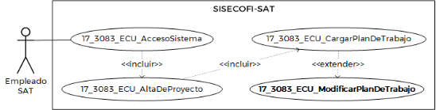
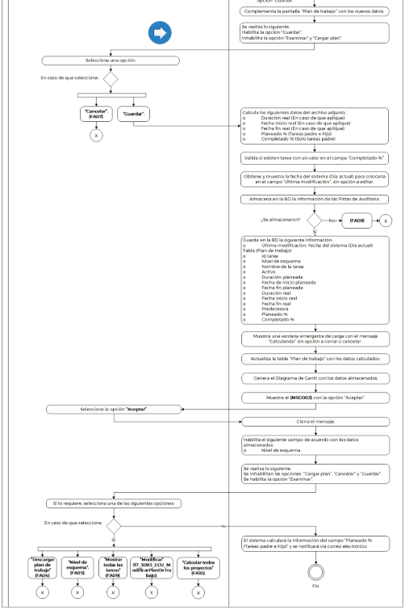

||Administración General de Comunicaciones y Tecnologías de la Información|
| :- | -: |
||Marco Documental 7.0|
|
Fecha de aprobación del Template:

02/08/2023
|
**Especificación del Caso de Uso**

17\_3083\_ECU\_CargarPlanDeTrabajo.docx
|Versión del template: 7.00|
| :-: | :-: | :-: |

**<ID Requerimiento>**8309

**Nombre del Requerimiento:** TI\_SISECOFI-SAT\_Seguimiento financiero y control documental de proyectos de contratación

**Tabla de Versiones y Modificaciones**

|Versión|Descripción del cambio|Responsable de la Versión|Fecha|
| :-: | :-: | :-: | :-: |
|*1*|*Creación del documento*|Eduardo Acosta Mora|*20/02/2024*|
|*1.1*|*Revisión del documento*|Luis Angel Olguin Castillo|*13/04/2024*|
|*1.2*|*Versión aprobada para firma*|
María del Carmen Castillejos Cárdenas

Rubén Delgado Ramírez
|
*18/06/2024*

|

**Tabla de Contenido**

[17_3083_ECU_CargarPlanDeTrabajo	2](#_toc169782623)

[1. Descripción	2](#_toc169782624)

[2. Diagrama del Caso de Uso	2](#_toc169782625)

[3. Actores	2](#_toc169782626)

[4. Precondiciones	2](#_toc169782627)

[5. Post condiciones	3](#_toc169782628)

[6. Flujo primario	3](#_toc169782629)

[7. Flujos alternos	9](#_toc169782630)

[8. Referencias cruzadas	16](#_toc169782631)

[9. Mensajes	16](#_toc169782632)

[10. Requerimientos No Funcionales	17](#_toc169782633)

[11. Diagrama de actividad	19](#_toc169782634)

[12. Diagrama de estados	20](#_toc169782635)

[13. Aprobación del cliente	21](#_toc169782636)

### ****17\_3083\_ECU\_CargarPlanDeTrabajo 

|<h3>**1. Descripción** </h3>|
| :- |
|

El objetivo de este Caso de Uso es facilitar al Empleado SAT la descarga de la plantilla del plan de trabajo adjuntada en el sistema (Plan tipo). Esto permite cargar posteriormente el archivo con la información necesaria para el plan de trabajo de un proyecto. 

|
|<h3>**2. Diagrama del Caso de Uso**</h3>|
|

|
|<h3>**3. Actores** </h3>|
||

|**Actor**|**Descripción**|
| :-: | :-: |
|**Empleado SAT**|El Empleado SAT es el que tiene el o los roles otorgados por la Administración Central de Seguridad, Monitoreo y Control (ACSMC) para ingresar a cada uno de los módulos de este sistema.|

|

|
| :- |
|<h3>**4. Precondiciones**</h3>|
|

- El Empleado SAT se ha autenticado en el sistema con una e.firma válida.

- El sistema ha consumido el servicio “Oauth” para obtener los datos del Empleado SAT que ingresa al mismo.

- Se le ha asignado el rol requerido al Empleado SAT para ingresar al módulo “Sistema”, submódulo “Proyectos” y a la sección “Plan de trabajo”.

- El sistema ha validado que el Empleado SAT cuenta con el rol para ingresar al módulo “Sistema”, submódulo “Proyectos” y a la sección “Plan de trabajo” con el permiso correspondiente a la carga del plan de trabajo.

- Se han almacenado las plantillas de plan de trabajo (Plan Tipo) en el módulo “Plantillas”.

|
|<h3>**5. Post condiciones** </h3>|
|

- El Empleado SAT descargó la plantilla de plan de trabajo (Plan tipo).  

- El Empleado SAT descargó el plan de trabajo almacenado en la BD.

- El Empleado SAT adjuntó un plan de trabajo.

|
|<h3>**6. Flujo primario**</h3>|
||

|**Actor**|**Sistema**|
| :-: | :-: |
|1. El Caso de Uso inicia cuando el Empleado SAT ingresa al módulo “Sistema”, submódulo “Proyectos” y a la sección **“Plan de trabajo”**.|
2. Consulta en la BD la información de los siguientes catálogos de acuerdo con la regla de negocio **(RNA01)**:

&emsp;

&emsp;- Plan tipo

&emsp;- ` `Nivel de esquema. Aplica la **(RNA57)**

- En caso de que no haya un plan de trabajo cargado, el campo “Nivel de esquema” estará inhabilitado.
|
||
3. Consulta en la BD la información para la tabla “Plan de trabajo”.

&emsp;

- En caso de que no se obtenga información de la consulta, continúa en el **(FA01)**.
|
||
4. Actualiza el Diagrama de Gantt con la información obtenida del paso anterior.

&emsp;

- En caso de que no se obtenga información de la consulta anterior, no se mostrará el Diagrama de Gantt.
|
||
5. Muestra la pantalla “Plan de trabajo” con lo siguiente, de acuerdo con la **(RNA52)**:

&emsp;

&emsp;Campo:

&emsp;- Plan tipo

Opción: 

- Descargar plan tipo ** (Inhabilitado)

Campo:

- Archivo a cargar\* 

Opciones:

- Examinar

&emsp;- Cargar plan  (Inhabilitado)

&emsp;- Mostrar todas las tareas 

Etiquetas:

- % Completado

&emsp;- Fecha planeada

Gráfica (Diagrama de Gantt)

Campos:

- Nivel de esquema

&emsp;- Última modificación (Solo consulta)

Opción: 

- Descargar plan de trabajo 

Tabla (Plan de trabajo). Aplica la **(RNA244)**:

- Id tarea

&emsp;- Nombre de la tarea

&emsp;- Activo

&emsp;- Duración planeada

&emsp;- Fecha de inicio planeada

&emsp;- Fecha fin planeada

&emsp;- Duración real

&emsp;- Fecha inicio real

&emsp;- Fecha fin real

&emsp;- Predecesora

&emsp;- Planeado %

&emsp;- Completado %

&emsp;- Acciones

Opciones de la tabla:

- Activo  

&emsp;- Modificar  

&emsp;- Descartar 

Opciones:

- Cancelar

&emsp;- Calcular %

&emsp;- Guardar 

&emsp;- Calcular todos los proyectos (Solo visible con el permiso correspondiente)

Ver **(17\_3083\_EIU\_CargarPlanDeTrabajo)** Estilos 01.
|
|
6. Selecciona una opción: 

&emsp;

- En caso de que seleccione la opción **“Examinar”**, el flujo continúa.

- En caso de que seleccione una opción para el campo **“Plan tipo”**, continúa en el **([**FA03**](#fa03))**.
|7. Abre el gestor de archivos del equipo de cómputo del Empleado SAT.|
|
8. Selecciona el archivo de Excel con extensión (.xlsx).

&emsp;

- En caso de que no seleccione el archivo, continúa en el paso **6** de este flujo.
|
9. Valida que se haya adjuntado un archivo con las características de acuerdo con la **(RNA22)**.

&emsp;

- En caso de que no cumpla las características requeridas, continúa en el **([**FA06**](#fa06))**.
|
||10. Habilita las opciones “Cancelar” y “Cargar plan”.|
|
11. Selecciona una opción: 

- En caso de que seleccione la opción **“Cargar plan”**, el flujo continúa.

- En caso de que seleccione la opción **“Cancelar”**, continúa en el **([**FA07**](#fa07))**.
|
12. Identifica si tiene ya un plan de trabajo cargado y realiza lo siguiente:

&emsp;

- En caso de que haya un plan de trabajo cargado, muestra el mensaje **([**MSG001**](#msg001))**, con las opciones “Sí” y “No” y el flujo continúa.

- En caso de que sea la primera vez que se cargue un plan de trabajo para el proyecto, se omitirá el mensaje y continúa en el paso **15** de este flujo.
|
|13. Selecciona una opción.|
14. Cierra el mensaje.

&emsp;

- En caso de que seleccione la opción **“Sí”**, el flujo continúa.

&emsp;

- En caso de que seleccione la opción **“No”**, regresa al paso [**5**](#_ref163806843) de este flujo.
|
||
15. Valida el contenido del archivo adjunto, de acuerdo con la **(RNA55)**.

&emsp;

- En caso de que el archivo adjunto no cumpla con el contenido solicitado, continúa en el **(FA02)**.
|
||
16. Procesa el archivo adjunto con los siguientes datos para mostrarlos en la tabla “Plan de trabajo”.

&emsp;

&emsp;- Id tarea

&emsp;- Nivel de esquema

&emsp;- Nombre de la tarea

&emsp;- Activo

&emsp;- Duración planeada

&emsp;- Fecha de inicio planeada

&emsp;- Fecha fin planeada

&emsp;- Duración real

&emsp;- Fecha inicio real

&emsp;- Fecha fin real

&emsp;- Predecesora

&emsp;- Planeado %

&emsp;- Completado %

**Nota:** No se ejecutarán los cálculos hasta que se seleccione la opción “Guardar”.
|
||
17. Complementa la pantalla “Plan de trabajo” con los nuevos datos de acuerdo con la **(RNA52)**.

Ver

**(17\_3083\_EIU\_CargarPlanDeTrabajo)** Estilos 01.
|
||
18. Se realiza lo siguiente:

&emsp;

&emsp;Habilita la opción “Guardar”.

&emsp;Inhabilita la opción “Examinar” y “Cargar plan”.
|
|
19. Selecciona una opción:

&emsp;

- En caso de que seleccione la opción **“Guardar”**, el flujo continúa.

- En caso de que seleccione la opción **“Cancelar”**, continúa en el **([**FA07**](#fa07))**.
|
20. Calcula los siguientes datos del archivo adjunto de acuerdo con la **(RNA56)**:

&emsp;

&emsp;- Duración real (En caso de que aplique)

&emsp;- Fecha inicio real (En caso de que aplique)

&emsp;- Fecha fin real (En caso de que aplique)

&emsp;- Planeado % (Tareas padre y/o hijo)

&emsp;- Completado % (Solo tareas padre)
|
||21. Valida si existen tarea con un valor en el campo “Completado %” y aplica la **(RNA59)**.|
||22. Obtiene y muestra la fecha del sistema (Día actual) para colocarla en el campo “Última modificación”, sin opción a editar.|
||
23. Almacena en la BD la información de las Pistas de Auditoría.

&emsp;

**Módulo**= Proyecto -PlanDeTrabajo

**Fecha y Hora**= Fecha y hora del sistema usando el formato DD/MM/AAAA HH:MM:SS

**RFC Usuario**= RFC largo del Empleado SAT que ingresó al sistema.

**Tipo de movimiento**= Cuando se cargue un plan de trabajo el tipo de movimiento debe ser **INSR** (Insertar).

Cuando se sobrescriba el plan de trabajo el tipo de movimiento debe de ser **UPDT** (modificar).

**Movimiento**= 

- ID de proyecto- Plan de trabajo – Carga masiva

- En caso de que no se puedan almacenar las Pistas de Auditoría, continúa en el **([**FA08**](#fa08))**.
|
||
24. Guarda en la BD la siguiente información:

- Última modificación: Fecha del sistema (Día actual)

Tabla (Plan de trabajo)

- Id tarea

&emsp;- Nivel de esquema

&emsp;- Nombre de la tarea

&emsp;- Activo

&emsp;- Duración planeada

&emsp;- Fecha de inicio planeada

&emsp;- Fecha fin planeada

&emsp;- Duración real

&emsp;- Fecha inicio real

&emsp;- Fecha fin real

&emsp;- Predecesora

&emsp;- Planeado %

&emsp;- Completado %
|
||25. Muestra una ventana emergente de carga con el mensaje “Calculando” sin opción a cerrar o cancelar.|
||26. Actualiza la tabla “Plan de trabajo” con los datos calculados.|
||27. Genera el Diagrama de Gantt con los datos almacenados.|
||28. Muestra el **([**MSG002**](#msg002))**, con la opción “Aceptar”.|
|29. Selecciona la opción **“Aceptar”**.|30. Cierra el mensaje.|
||
31. Habilita el siguiente campo de acuerdo con los datos almacenados:

- Nivel de esquema. Aplica la **(RNA57)**
|
||
32. Se realiza lo siguiente:

&emsp;

&emsp;Se inhabilitan las opciones  “Cargar plan”, “Cancelar” y “Guardar”.

&emsp;Se habilita la opción “Examinar”.
|
|
33. Si lo requiere, selecciona una de las siguientes opciones:

&emsp;

- En caso de que seleccione la opción **“Descargar plan de trabajo”**, continúa en el **([**FA04**](#fa04))**.

&emsp;

- En caso de que seleccione una opción en el campo de selección **“Nivel de esquema”**, continúa en **([**FA05**](#fa05))**.

&emsp;

- En caso de que seleccione la opción **“Mostrar todas las tareas”**, continúa en **([**FA09**](#fa09))**.

- En caso de que seleccione la opción **“Modificar”** de uno de los registros de la tabla, el proceso continúa en **(17\_3083\_ECU\_ModificarPlanDeTrabajo)**. 

&emsp;

- En caso de que seleccione la opción “Calcular todas los proyectos”, continúa en el **(FA10)**.
|34. El sistema calculará la información del campo “Planeado % (Tareas padre y/o hijo)” y se notificará vía correo electrónico de acuerdo con la **(RNA53)**.|
||35. Fin del Caso de Uso.|

|

|
| :- |
|<h3>**7. Flujos alternos** </h3>|
|

**FA01 No se obtuvo información de la consulta para la tabla “Plan de trabajo”**
|

|**Actor**|**Sistema**|
| :-: | :-: |
||1. El **FA01** inicia cuando no se obtuvo información de la consulta para la tabla “Plan de trabajo”.|
||2. Muestra el **([**MSG003**](#msg003))** con la opción “Aceptar”. |
|3. Selecciona la opción **“Aceptar”**.|4. Cierra el mensaje.|
||5. Continúa en el paso [**5**](#_ref163806843) del Flujo primario.|

|

**FA02 El contenido del archivo adjunto es incorrecto**
|
| :- |

|**Actor**|**Sistema**|
| :-: | :-: |
||1. El **FA02** inicia cuando el sistema identifica que el contenido del archivo adjunto es incorrecto.|
||
2. Dependiendo del error, mostrara el mensaje correspondiente:

&emsp;

- En caso de que no se cumpla el punto uno, muestra el **(MSG008)**.

- En caso de que no se cumpla el punto dos, muestra el **(MSG009)**.

- En caso de que no se cumpla el punto tres, muestra el **(MSG010)**.

- En caso de que no se cumpla el punto cuatro, muestra el **(MSG011)**.

- En caso de que no se cumpla el punto cinco, muestra el **(MSG012)**.

- En caso de que no se cumpla el punto seis, muestra el **(MSG013)**.

- En caso de que no se cumpla el punto siete, muestra el **(MSG014)**.

- En caso de que no se cumpla el punto ocho, muestra el **(MSG015)**.

- En caso de que no se cumpla el punto nueve, muestra el **(MSG016)**.

- En caso de que no se cumpla el punto diez, muestra el **(MSG017)**.

&emsp;

- En caso de que no se cumpla el punto once, muestra el **(MSG018)**.

&emsp;

- En caso de que no se cumpla el punto doce, muestra el **(MSG019)**.

- En caso de que no se cumpla el punto trece, muestra el **(MSG020)**.

Cada mensaje se muestra con la opción “Aceptar”.
|
|3. Selecciona la opción **“Aceptar”**.|4. Cierra el mensaje.|
||5. Continúa en el paso **5** del Flujo primario.|

|

**FA03 Selecciona una opción para el campo “Plan tipo”**
|
| :- |

|**Actor**|**Sistema**|
| :-: | :-: |
|1. El **FA03** inicia cuando el Empleado SAT selecciona una opción para el campo **“Plan tipo”**.|2. Activa la opción “Descargar plan tipo”.|
|3. Selecciona la opción **“Descargar plan tipo”**.|
4. Almacena en la BD la información de las Pistas de Auditoría.

&emsp;

**Módulo**= Proyecto - PlanDeTrabajo

**Fecha y Hora**= Fecha y hora del sistema usando el formato DD/MM/AAAA HH:MM:SS

**RFC Usuario**= RFC largo del Empleado SAT que ingresó al sistema.

**Tipo de movimiento**= **PRNT** (Imprimir)

**Movimiento**= Aplica la **(RNA239)**

- Plan tipo (Seleccionado)

- En caso de que no se puedan almacenar las Pistas de Auditoría, continúa en el **([**FA08**](#fa08))**.
|
||5. Consulta en la BD la plantilla (Plan tipo) seleccionado anteriormente para el plan de trabajo.|
||6. Descarga en un archivo de Excel con extensión (.xlsx) la plantilla que se ocupará como ayuda de acuerdo con la **(RNA55)**.|
||7. Inactiva la opción “Descargar plan tipo” y regresa al valor inicial el campo “Plan tipo”|
||8. Continúa en el paso [**6**](#_ref163808420) del Flujo primario.|

|

**FA04 Selecciona la opción “Descargar plan de trabajo”**
|
| :- |

|**Actor**|**Sistema**|
| :-: | :-: |
|1. El **FA04** inicia cuando el Empleado SAT selecciona la opción **“Descargar plan de trabajo”**.|
2. Almacena en la BD la información de las Pistas de Auditoría.

&emsp;

**Módulo**= Proyecto - PlanDeTrabajo

**Fecha y Hora**= Fecha y hora del sistema usando el formato DD/MM/AAAA HH:MM:SS

**RFC Usuario**= RFC largo del Empleado SAT que ingresó al sistema.

**Tipo de movimiento**= **PRNT** (Imprimir)

**Movimiento**=

- ID de proyecto- Plan de trabajo – Carga masiva

- En caso de que no se puedan almacenar las Pistas de Auditoría, continúa en el **([**FA08**](#fa08))**.
|
||
3. Consulta en la BD la información de la tabla “Plan de trabajo” la siguiente información:

&emsp;

&emsp;- Id tarea

&emsp;- Nivel de esquema

&emsp;- Nombre de la tarea

&emsp;- Activo

&emsp;- Duración planeada

&emsp;- Fecha de inicio planeada

&emsp;- Fecha fin planeada

&emsp;- Duración real

&emsp;- Fecha inicio real

&emsp;- Fecha fin real

&emsp;- Predecesora

&emsp;- Planeado %

&emsp;- Completado %
|
||4. Genera un archivo de Excel con la misma estructura de la plantilla (Plan tipo)  extensión (.xlsx) con la información obtenida anteriormente. |
||5. Descarga el archivo de Excel con extensión (.xlsx).|
||6. Fin del Caso de Uso.|

|

**FA05 Selecciona una opción en el campo de selección “Nivel de esquema”**
|
| :- |

|**Actor**|**Sistema**|
| :-: | :-: |
|1. El **FA05** inicia cuando el Empleado SAT selecciona una opción en el campo **“Nivel de esquema”**.|2. Identifica la opción seleccionada para desglosar o contraer las tareas, de acuerdo con la **(RNA57)**.|
||3. Muestra las tareas contraídas o desglosadas de acuerdo con la opción seleccionada.|
||4. Continúa en el paso **33** del Flujo primario.|

|

**FA06 El archivo adjunto no cumple las características**
|
| :- |

|**Actor**|**Sistema**|
| :-: | :-: |
||1. El **FA06** inicia cuando la estructura del archivo adjunto es incorrecta.|
||2. Muestra el **(MSG004)**, con la opción “Aceptar”.|
|3. Selecciona la opción **“Aceptar”**.|4. Cierra el mensaje.|
||5. Continúa en el paso [**6**](#_ref163808420) del Flujo primario.|

|

**FA07 Selecciona la opción “Cancelar”**
|
| :- |

|**Actor**|**Sistema**|
| :-: | :-: |
|1. El **FA07** inicia cuando el Empleado SAT selecciona la opción **“Cancelar”**.|2. Muestra el **([**MSG005**](#msg005))** con las opciones “Sí” y “No”.|
|3. Selecciona una opción.|
4. Cierra el mensaje.

&emsp;

- En caso de que seleccione la opción **“Sí”**, el flujo continúa.

- En caso de que seleccione la opción **“No”** permanece en el paso donde fue invocado.
|
||5. Cancela la operación sin completar el movimiento que estaba en proceso.|
||6. Continúa en el paso **5** del Flujo primario.|

|

**FA08 No se pueden almacenar las Pistas de Auditoría**
|
| :- |

|**Actor**|**Sistema**|
| :-: | :-: |
||1. El **FA08** inicia cuando interviene un evento ajeno y no se pueden almacenar las Pistas de Auditoría.|
||2. Cancela la operación sin completar el movimiento que estaba en proceso. |
||
3. Muestra el mensaje de acuerdo con lo siguiente:

&emsp;

- Si la pista de auditoría es por el tipo de movimiento **UPDT** o **INSR**, se muestra el **([**MSG006**](#msg006))**.

&emsp;

- En caso de que la pista de auditoría sea por el tipo de movimiento **PRNT**, se muestra el **(MSG007)**.

Cada mensaje se muestra con la opción “Aceptar”.
|
|4. Selecciona la opción **“Aceptar”**.|5. Cierra el mensaje.|
||6. Regresa al paso previo que detona la acción de la pista de auditoría.  |

|

**FA09 Selecciona la opción “Mostrar todas las tareas”**
|
| :- |

|**Actor**|**Sistema**|
| :-: | :-: |
|1. El **FA09** inicia cuando el Empleado SAT selecciona la opción **“Mostrar todas las tareas”**.|2. Despliega todas las tareas con el nivel de esquema 1 en delante, de acuerdo con la **(RNA58)**.|
||3. Continúa en el paso **33** del Flujo primario.|

|

**FA10 Selecciona la opción “Calcular todos los proyectos”**
|
| :- |

|**Actor**|**Sistema**|
| :-: | :-: |
|1. El **FA10** inicia cuando el Empleado SAT selecciona la opción **“Calcular todos los proyectos”**.|
2. Calcula los siguientes datos de todos los proyectos activos de acuerdo con la **(RNA56)**:

&emsp;

&emsp;- Duración real (En caso de que aplique)

&emsp;- Fecha inicio real (En caso de que aplique)

&emsp;- Fecha fin real (En caso de que aplique)

&emsp;- Completado % (Solo tareas padre)

&emsp;- Planeado % (Tareas padre y/o hijo)
|
||3. Valida si existen tarea con un valor en el campo “Completado %” y aplica la **(RNA59)**.|
||4. Obtiene y muestra la fecha actual para colocarla en el campo “Última modificación” sin opción a editar.|
||
5. Almacena en la BD la información de las Pistas de Auditoría.

&emsp;

**Módulo**= Proyecto -PlanDeTrabajo

**Fecha y Hora**= Fecha y hora del sistema usando el formato DD/MM/AAAA HH:MM:SS

**RFC Usuario**= RFC largo del Empleado SAT que ingresó al sistema.

**Tipo de movimiento**= **UPDT** (Modificar)

**Movimiento**= 

- Id de proyecto - Plan de trabajo – Cálculos masivos

- En caso de que no se puedan almacenar las Pistas de Auditoría, continúa en el **(FA05)**.
|
||
6. Guarda en la BD la siguiente información de todos los planes de trabajo activos:

&emsp;

&emsp;- Última modificación: Fecha de sistema (Día actual)

Tabla (Plan de trabajo):

- Duración real

&emsp;- Fecha inicio real

&emsp;- Fecha fin real

&emsp;- Completado %

&emsp;- Planeado % (Tareas padre y/o hijo)
|
||7. Muestra una ventana emergente de carga con el mensaje “Calculando” sin opción a cerrar o cancelar .|
||8. Muestra el **([**MSG003**](#msg003))** con la opción “Aceptar”.|
|9. Selecciona la opción **“Aceptar”**.|10. Cierra el mensaje.|
||11. Fin del Caso de uso.|

|

|
| :- |
||
|<h3>**8. Referencias cruzadas** </h3>|
|

- 17\_3083\_CRN\_SeguimientoFinancieroYControl

- 17\_3083\_EIU\_CargarPlanDeTrabajo

- 17\_3083\_ECU\_ModificarPlanDeTrabajo

|
|<h3>**9. Mensajes** </h3>|
||

|**ID Mensaje**|**Descripción**|
| :-: | :-: |
|**MSG001**|
Se está adjuntando un nuevo plan de trabajo y sobrescribirá el existente.

¿Está seguro de que desea continuar?
|
|**MSG002**|Plan de trabajo guardado correctamente.|
|**MSG003**|No se encontró un plan de trabajo asignado al proyecto.|
|**MSG004**|Se debe adjuntar un archivo de Excel con extensión (.xlsx).|
|**MSG005**|
Se perderá toda la información no guardada.

¿Está seguro de que desea continuar?
|
|**MSG006**|Ocurrió un error al guardar el registro, favor de intentar nuevamente (PA01).|
|**MSG007**|Ocurrió un error al exportar la información, favor de intentar nuevamente (PA01).|
|**MSG008**|
Por cada tarea se tendrán que ingresar valores en los siguientes campos obligatoriamente: "Id tarea", "Nivel de esquema", "Nombre de la tarea", "Activo", "Duración planeada", "Fecha de inicio planeada" y "Fecha fin planeada". 

Consulte el “Plan tipo”.
|
|**MSG009**|
El "Id tarea" debe ser único e irrepetible. 

Consulte el “Plan tipo”.
|
|**MSG010**|
Solo puede haber un nivel de esquema con el valor "Cero". 

Consulte el “Plan tipo”.
|
|**MSG011**|
Por cada tarea(hijo) debe haber una tarea (padre). 

Consulte el “Plan tipo”.
|
|**MSG012**|
Los valores para "Activo" deben ser "Sí" o "No". 

Consulte el “Plan tipo”.
|
|**MSG013**|
Los porcentajes deben ser enteros (Aplicar reglas de redondeo). 

Consulte el “Plan tipo”.
|
|**MSG014**|
Ninguna tarea (Padre) puede tener la fecha de inicio planeada menor que su conjunto sus tareas (hijos). 

Consulte el “Plan tipo”.
|
|**MSG015**|
Ninguna tarea (padre) puede tener la fecha fin planeada mayor que su conjunto de tareas (hijos).

Consulte el “Plan tipo”.
|
|**MSG016**|Para calcular los valores de los campos "Duración real", obligatoriamente se necesita los valores de los campos "Fecha inicio real" y "Fecha fin real". |
|**MSG017**|Para calcular los valores de los campos "Fecha inicio real", obligatoriamente se necesita los valores de los campos "Duración real" y "Fecha fin real". |
|**MSG018**|Para calcular los valores de los campos "Fecha fin real", obligatoriamente se necesita los valores de los campos "Fecha inicio real" y "Duración real". |
|**MSG019**|
El valor para el campo "Predecesora" debe tener un id menor que la tarea que la invoca. 

Consulte el “Plan tipo”.
|
|**MSG020**|
No se pueden realizar modificaciones en los encabezados, añadir o eliminar columnas. 

Consulte el “Plan tipo”.
|

|

|
| :- |
|<h3>**10. Requerimientos No Funcionales** </h3>|
||

|**ID de RNF**|**Requerimiento No Funcional**|**Descripción**|
| :-: | :-: | :-: |
|**RNF001**|Disponibilidad|El sistema deberá estar activo las 24 horas del día, los 365 días del año con picos de operación en el horario de 9:00 a 18:00 horas.|
|**RNF002**|Concurrencia|
El número de Empleados SAT que puede tener el sistema son 150. 

` `El número de accesos concurrentes que debe soportar este sistema son máximo 30 Empleados SAT.
|
|**RNF003**|Seguridad|El acceso solo podrá ser otorgado a todo Empleado SAT que tenga los roles asignados por la Administración Central de Seguridad, Monitoreo y Control (ACSMC) para cada módulo de este sistema.|
|**RNF004**|Usabilidad|
El sistema deberá manejar los siguientes elementos para facilitar la navegación:  

- Mensajes tipo flotantes (tooltips) con información de la herramienta que ofrece ayuda contextual, como guía para el Empleado SAT.  

- Componente de ordenamiento que permita acomodar la información de la tabla de forma ascendente o descendente, considerando la columna donde es seleccionado.  

- Contar con un diseño responsivo que permita su óptima visualización en distintos tipos de dispositivos finales.
|
|**RNF005**|Eficiencia|Las consultas se dividen en generales y detalladas, para que las detalladas carguen la información solo cuando sean requeridas por el Empleado SAT. |
|**RNF006**|Usabilidad|
El Empleado SAT podrá navegar a través de las páginas resultantes de la consulta considerando que el sistema debe mostrar inicialmente 15 registros por página, permitiendo al Empleado SAT seleccionar los registros que requiere visualizar, teniendo las opciones 15, 50 y 100:  

  

- Ir a la primera página (debe mostrar la primera página con el resultado de la consulta).  

- Ir a la última página (debe mostrar la última página con el resultado de la consulta).  

- Ir a la siguiente página (debe mostrar la siguiente página, considerando la página actual, con el resultado de la consulta y el número de registros seleccionados por el Empleado SAT).  

- Ir a la página anterior (debe mostrar la página anterior considerando la actual, con el resultado de la consulta).  

  

En la tabla deben mostrarse los registros ordenados alfabéticamente. 
|
|**RNF007**|Seguridad|Las Pistas de Auditoría deben estar protegidas contra accesos no autorizados. Solo los Empleados SAT autorizados pueden consultarlas, y la información en ellas se definirá durante la etapa de diseño, la cual debe estar cifrada para mantenerla confidencial y evitar exposiciones no autorizadas.   |
|**RNF008**|Fiabilidad |El sistema debe ser capaz de manejar excepciones de manera efectiva y presentar mensajes claros y comprensibles para garantizar una adecuada interacción con el sistema. |
|**RNF009**|Seguridad|Mantener la información en pantalla en caso de un error al guardar las pistas de auditoría, siempre y cuando el escenario lo permita. Hay situaciones de infraestructura o de conexión de internet que sí pierde los datos ya que no están controlados por el sistema. |
|**RNF010**|Integridad |Al almacenar la información en la BD de tipo Texto o alfanumérico se deben eliminar los espacios en blanco al inicio y fin de la cadena. |

|

|
| :- |
|<h3>**11. Diagrama de actividad** </h3>|
|

|
|<h3>**12. Diagrama de estados** </h3>|
|

No aplica, no hay cambios significativos de estados ni transiciones.

|
|<h3>**13. Aprobación del cliente** </h3>|
||

|**FIRMAS DE CONFORMIDAD**||
| :-: | :- |
|**Firma 1** |**Firma 2** |
|**Nombre**: María del Carmen Castillejos Cárdenas.|**Nombre**: Rubén Delgado Ramírez.|
|**Puesto**: Usuaria ACPPI.|**Puesto**: Usuario ACPPI.|
|**Fecha:**|**Fecha:**|
|||
|**Firma 3** |**Firma 4**|
|**Nombre**: Rodolfo López Meneses.|**Nombre**: Diana Yazmín Pérez Sabido.|
|**Puesto**: Usuario ACPPI.|**Puesto**: Usuaria ACPPI.|
|**Fecha:**|**Fecha:**|
|||
|**Firma 5**|**Firma 6**|
|**Nombre**: Yesenia Helvetia Delgado Naranjo.|**Nombre:** Alejandro Alfredo Muñoz Núñez.|
|**Puesto**: APE ACPPI.|**Puesto:** RAPE ACPPI.|
|**Fecha**:|**Fecha**:|
|||
|**Firma 7**|**Firma 8**|
|**Nombre**: Luis Angel Olguin Castillo.|**Nombre**: Erick Villa Beltrán.|
|**Puesto**: Enlace ACPPI.|**Puesto**: Líder APE SDMA 6.|
|**Fecha**:|**Fecha**:|
|||
|**Firma 9**|**Firma 10**|
|**Nombre:** Juan Carlos Ayuso Bautista.|**Nombre:** Eduardo Acosta Mora.|
|**Puesto:** Líder Técnico SDMA 6.|**Puesto:** Analista SDMA 6.|
|**Fecha**:|**Fecha**:|
|||

|

|
| :- |

|||Página 16 de 17|
| :- | :-: | -: |

