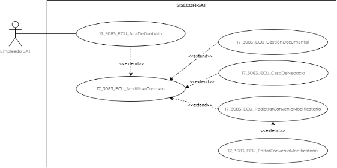
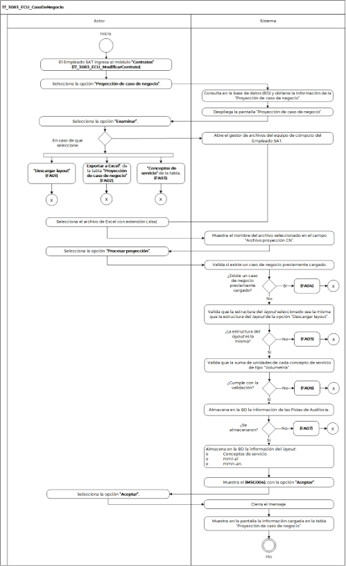

||Administración General de Comunicaciones y Tecnologías de la Información|
| :- | -: |
||Marco Documental 7.0|
|
Fecha de aprobación del Template:

02/08/2023
|
**Especificación del Caso de Uso**

17\_3083\_ECU\_CasoDeNegocio.docx
|Versión del template: 7.00|
| :-: | :-: | :-: |

**<ID Requerimiento>** 8309

**Nombre del Requerimiento: **TI\_SISECOFI-SAT\_Seguimiento financiero y control documental de proyectos de contratación

**Tabla de Versiones y Modificaciones**

|Versión|Descripción del cambio|Responsable de la Versión|Fecha|
| :-: | :- | :-: | :-: |
|*1*|*Creación del documento*|Edgar Vergara Tadeo|*23/02/2024*|
|*1.1*|*Se actualiza documento*|Jaime Brugada Mateo|*11/03/2024*|
|*1.2*|*Revisión del documento*|Luis Angel Olguin Castillo|*12/03/2024*|
|*1.3*|*Versión aprobada para firma*|
María del Carmen Castillejos Cárdenas

Rubén Delgado Ramírez
|*27/05/2024*|

**Tabla de Contenido**

[1. Descripción	2](#_toc165381970)

[2. Diagrama del Caso de Uso	2](#_toc165381971)

[3. Actores	2](#_toc165381972)

[4. Precondiciones	2](#_toc165381973)

[5. Post condiciones	3](#_toc165381974)

[6. Flujo primario	3](#_toc165381975)

[7. Flujos alternos	5](#_toc165381976)

[8. Referencias cruzadas	11](#_toc165381977)

[9. Mensajes	11](#_toc165381978)

[10. Requerimientos No Funcionales	11](#_toc165381979)

[11. Diagrama de actividad	13](#_toc165381980)

[12. Diagrama de estados	14](#_toc165381981)

[13. Aprobación del cliente	15](#_toc165381982)

17\_3083\_ECU\_CasoDeNegocio.

|<h3>**1. Descripción** </h3>|
| :- |
|

El objetivo del Caso de Uso es permitir al Empleado SAT consultar, cargar y modificar la proyección de consumo de servicios relacionado con el contrato.

|
|<h3>**2. Diagrama del Caso de Uso**</h3>|
|

|
||
|<h3>**3. Actores** </h3>|
||

|**Actor**|**Descripción**|
| :-: | :-: |
|**Empleado SAT**|El Empleado SAT es el que tiene el o los roles otorgados por la Administración Central de Seguridad, Monitoreo y Control (ACSMC) para ingresar a cada uno de los módulos de este sistema.|

|

|
| :- |
|<h3>**4. Precondiciones**</h3>|
|

- El Empleado SAT se ha autenticado en sistema con e.firma válida.

- El sistema ha consumido el servicio “Oauth” para obtener los datos del Empleado SAT que ingresa.

- El sistema ha validado que el Empleado SAT tiene los roles para ingresar o modificar el módulo “Contratos” y a la sección “Proyección de caso de negocio”.

- El Empleado SAT ha ingresado al módulo "Contratos" y a la sección "Proyección de caso de negocio".

- El Empleado SAT ha seleccionado un contrato. 

|
|<h3>**5. Post condiciones** </h3>|
|

`      `El Empleado SAT: 

- Consultó la información de la “Proyección de caso de negocio”.

- Cargó el archivo “Archivo Proyección CN”.

- Descargó el documento del *layout* del caso de negocio.

- Filtró la información de la tabla “Proyección de caso de negocio”.

&emsp;

&emsp;
|
|<h3>**6. Flujo primario**</h3>|
||

|**Actor**|**Sistema**|
| :-: | :-: |
|1. El Caso de Uso inicia cuando el Empleado SAT ingresa al módulo **“Contratos”** **(17\_3083\_ECU\_ModificarContrato)**.||
|2. Selecciona la opción **“Proyección de caso de negocio”**.|3. Consulta en la base de datos (BD) y obtiene la información de la “Proyección de caso de negocio”.|
||
4. Despliega la pantalla “Proyección de caso de negocio”.

Opciones:

o Descargar layout 

&emsp;o Archivo proyección CN

&emsp;o Examinar

&emsp;o Procesar proyección

&emsp;o Descargar 

Tabla (Proyección de caso de negocio). Aplica la regla de negocio **(RNA244)**.

o Conceptos de servicio

&emsp;o mm1-a1 

&emsp;o mmn-an. Aplica la **(RNA80)**.

&emsp;&emsp;

- Ver **(17\_3083\_EIU\_CasoDeNegocio)** Estilos 01.
|
|
5. Selecciona la opción **“Examinar”** y el flujo continúa.

- En caso de que seleccione la opción **“Descargar layout”**, continúa en el **([**FA01**](#fa01))**.

- En caso de que seleccione la opción **“Exportar a Excel”**, de la tabla **“Proyección de caso de negocio”**, continúa en el **([\[**FA02**\](#fa02)](#fa02))**.

- En caso de requerir aplicar el **filtro** en el campo de texto de la columna **“Conceptos de servicio”**, de la tabla, continúa en el **([**FA03**](#fa03))**.
|6. Abre el gestor de archivos del equipo de cómputo del Empleado SAT. |
|7. ` `Selecciona el archivo de Excel con extensión (.xlsx).|8. Muestra el nombre del archivo seleccionado en el campo “Archivo proyección CN”.|
|9. Selecciona la opción **“Procesar proyección”.**|
10. Valida si existe un caso de negocio previamente cargado.

&emsp;

- En caso de no existir un caso de negocio cargado, el flujo continúa.

- En caso de existir un caso de negocio previamente cargado, continúa en el **([**FA04**](#fa04))**.
|
||
11. Valida que la estructura del *layout* seleccionado sea la misma que la estructura del *layout* de la opción “Descargar layout”, acorde con la **(RNA80)**, y el flujo continúa.

&emsp;

- En caso de que la estructura del *layout* no sea igual, continúa en el **([**FA05**](#fa05))**. 
|
||
12. Valida que la suma de unidades de cada concepto de servicio de tipo “Volumetría” sea igual a la cantidad de servicios máxima, de acuerdo con la **(RNA231)** y** el flujo continúa.

- En caso de no cumplir con la validación, continúa en el **([**FA06**](#fa06))**.
|
||
13. Almacena en la BD la información de las Pistas de Auditoría.

&emsp; 

&emsp;Datos que se almacenan:

**Módulo**= Contratos - Proyección

**Fecha y Hora**= Fecha y hora del sistema, usando el formato DD/MM/AAAA HH:MM:SS

**RFC Usuario** = RFC largo del Empleado SAT que ingresó al sistema.

**Tipo de movimiento**= 

**INSR** (Insertar), **UPDT** (Modificar), **DLT** (Borrar) según corresponda** 

**Movimiento**= Aplica la **(RNA239)**.

- Id de Contrato

- Id Concepto de servicio

- Carga masiva

&emsp;

- En caso de que no se puedan almacenar las Pistas de Auditoría, continúa en el **([**FA07**](#fa07))**.
|
||
14. Almacena en la BD la información del *layout*. Aplica la **(RNA247)**.

&emsp;

&emsp;o Conceptos de servicio

&emsp;o mm1-a1 

&emsp;o mmn-an. Aplica la **(RNA80)**.
|
||15. Muestra el **([**MSG004**](#msg004))**,** con la opción **“Aceptar”**.|
|16. Selecciona la opción **“Aceptar”.**|17. Cierra el mensaje.|
||
18. Muestra en la pantalla la información cargada en la tabla “Proyección de caso de negocio”. Aplica la **(RNA244)**.

&emsp;

&emsp;o Conceptos de servicio

&emsp;o mm1-a1 

&emsp;o mmn-an. Aplica la **(RNA80)**.
|
||19. Fin del Caso de Uso.|

||
| :- |
|

|
|<h3>**7. Flujos alternos** </h3>|
|

**FA01 Selecciona la opción “Descargar *layout”***
|

|**Actor**|**Sistema**|
| :-: | :-: |
|1. El **FA01** inicia cuando el Empleado SAT selecciona la opción **“Descargar layout”**.|
2. Construye el *layout* con base en la **(RNA80)**.

|
||
3. Almacena en la BD la información de las Pistas de Auditoría.

&emsp; 

&emsp;Datos que se almacenan:

**Módulo**= Contratos-Proyección

**Fecha y Hora**= Fecha y hora del sistema, usando el formato DD/MM/AAAA HH:MM:SS

**RFC Usuario**= RFC largo del Empleado SAT que ingresó al sistema.

**Tipo de movimiento**= **PRNT** (Imprimir).

**Movimiento**= Aplica la **(RNA239)**.

- Id de Contrato

- Id Concepto de servicio

&emsp;

- En caso de que no se puedan almacenar las Pistas de Auditoría, continúa en el **([**FA07**](#fa07))**.
|
||4. Genera el archivo de Excel con extensión (.xlsx) con la información obtenida.|
||5. Dependiendo el explorador, realiza la descarga del archivo de Excel con extensión (.xlsx).|
||6. Muestra el **([**MSG007**](#msg007))**, con la opción “Aceptar”.|
|7. Selecciona la opción **“Aceptar”**.|8. Cierra el mensaje.|
||9. Regresa al paso **[**5**](#_ref163992259)** del Flujo primario.|

|

**FA02 Selecciona la opción “Exportar a Excel”**
|
| :- |

|**Actor**|**Sistema**|
| :-: | :-: |
|1. El **FA02** inicia cuando el Empleado SAT selecciona la opción de **“Exportar Excel”**, de la tabla **“Proyección de caso de negocio”**.|
2. Almacena en la BD la información de las Pistas de Auditoría.

&emsp; 

&emsp;Datos que se almacenan:

**Módulo**= Contratos-Proyección

**Fecha y Hora**= Fecha y hora del sistema, usando el formato DD/MM/AAAA HH:MM:SS

**RFC Usuario** = RFC largo del Empleado SAT que ingresó al sistema.

**Tipo de movimiento**= **PRNT** (Imprimir)

**Movimiento**= Aplica la **(RNA239)**.

- Id de Contrato

- Id Concepto de servicio

En caso de que no se puedan almacenar las Pistas de Auditoría, continúa en el **([**FA07**](#fa07))**.
|
||
3. Obtiene la siguiente información de la BD de la proyección de consumo de servicios asociados al contrato.

&emsp;

- Concepto de servicio

- mm1-a1 

- mmn-an. Aplica la **(RNA80)**.
|
||4. Genera un archivo de Excel con extensión (.xlsx) con la información obtenida.|
||5. Dependiendo del explorador, realiza la descarga del archivo de Excel con extensión (.xlsx).|
||6. Muestra el **([**MSG007**](#msg007))**, con la opción “Aceptar”.|
|7. Selecciona la opción **“Aceptar”**.|8. Cierra el mensaje.|
||9. Regresa al paso **[**5**](#_ref163992259)** del Flujo primario.|

|

**FA03 Filtra en la columna “Conceptos de Servicio”, de la tabla**
|
| :- |

|**Actor**|**Sistema**|
| :-: | :-: |
|
1. El **FA03** inicia cuando el Empleado SAT requiere filtrar la información en la columna **“Conceptos de servicio”,** de acuerdo con lo que se muestra en la tabla.

||
|2. Ingresa el dato a buscar en el campo de texto de la columna **“Conceptos de servicio”**,** de la tabla **“Proyección de caso de negocio”**, y acepta el filtro.|3. Filtra en la tabla la información de acuerdo con los caracteres ingresados en el campo de texto.|
||4. Muestra en tiempo real todas las coincidencias que obtiene de la tabla.|
||5. Regresa al paso **[**5**](#_ref163992259)** del Flujo primario.|

|

**FA04 Existe un caso de negocio previamente cargado**
|
| :- |

|**Actor**|**Sistema**|
| :-: | :-: |
||1. El **FA04** inicia cuando existe un caso de negocio previamente cargado.|
||
2. Muestra el mensaje **([**MSG006**](#msg006))** con las opciones **“Sí”** y **“No”**.

|
|
3. Selecciona una opción.

- Si selecciona la opción **“No”**, el flujo continúa.

&emsp;

- Si selecciona la opción **“Sí”**, continúa en el paso [**5**](#_ref163999691) de este flujo.
|4. Cierra el mensaje, y continúa en el paso **[**5**](#_ref163992259)** del Flujo primario.|
||5. Cierra el mensaje, y continúa en el paso **[**11**](#_ref167700350)** del Flujo primario.|

|

**FA05 La estructura del *layout* no es la misma de la opción “Descargar layout"**
|
| :- |

|**Actor**|**Sistema**|
| :-: | :-: |
||1. El **FA05** inicia cuando la estructura del *layout* de carga no es la misma del *layout* de la opción “Descargar layout”. |
||2. Muestra el **([**MSG002**](#msg002))**,** con la opción **“Aceptar”**.|
|3. Selecciona la opción **“Aceptar”.**|4. Cierra el mensaje.|
||
5. Continúa en el paso  **[**5**](#_ref163992259)**  del Flujo primario.

&emsp;
|

|

**FA06 Validación del campo Cantidad** 
|
| :- |

|**Actor**|**Sistema**|
| :-: | :-: |
||1. El **FA06** inicia cuando la cantidad establecida en el *layout* de carga no son iguales a “Cantidad máxima de los servicios”, de la sección “Registro de servicios” del contrato.|
||2. Muestra el **([**MSG001**](#msg001))**, con la opción “Aceptar”.|
|3. Selecciona la opción **“Aceptar”**.|4. Cierra el mensaje.|
||5. Continúa en el paso  **[**5**](#_ref163992259)**  del Flujo primario.|

|

**FA07 No se pueden almacenar las Pistas de Auditoría**
|
| :- |

|**Actor**|**Sistema**|
| :-: | :-: |
||1. El **FA07** inicia cuando interviene un evento ajeno y no se pueden almacenar las Pistas de Auditoría.  |
||2. Cancela la operación sin completar el movimiento que estaba en proceso. |
||
3. Muestra el mensaje de acuerdo con lo siguiente: 

&emsp;  

- Si la Pista de Auditoría es por el tipo de movimiento **UPDT** e **INSR**, se muestra el **([**MSG003**](#msg003))**. 

&emsp;****      

- En caso de que la Pista de Auditoría es por el tipo de movimiento **PRNT**, se muestra el **([**MSG005**](#msg005))**. 

 

Cada mensaje se muestra con la opción “Aceptar”. 
|
|3. Selecciona la opción **“Aceptar”**.|4. Cierra el mensaje.|
||
5. Regresa al paso previo que detona la acción de la pista de auditoría.

|

|

|
| :- |
|<h3>**8. Referencias cruzadas** </h3>|
|

- 17\_3083\_CRN\_SeguimientoFinancieroYControl.

- 17\_3083\_EIU\_CasoDeNegocio.

- 17\_3083\_ECU\_AltaDeContrato.

|
|<h3>**9. Mensajes** </h3>|
||

|**ID Mensaje**|**Descripción**|
| :-: | :-: |
|**MSG001**|Verifique el *layout* de carga, ya que la línea(s) [Concepto de servicio] no cumple con la “Cantidad de servicios máxima”.|
|**MSG002**|El *layout* de carga no contiene la estructura requerida, favor de verificar.|
|**MSG003**|Ocurrió un error al guardar el registro, favor de intentar nuevamente (PA01).|
|**MSG004**|El caso de negocio fue actualizado exitosamente.|
|**MSG005**|Ocurrió un error al exportar la información, favor de intentar nuevamente (PA01).|
|**MSG006**|Existe una proyección previamente cargada, ¿desea actualizar la proyección?|
|**MSG007**|Los datos se exportaron correctamente. |

|

|
| - |
|<h3>**10. Requerimientos No Funcionales** </h3>|
||

|**ID de RNF**|**Requerimiento No Funcional**|**Descripción**|
| :-: | :-: | :-: |
|**RNF001**|Disponibilidad|El sistema deberá estar activo las 24 horas del día, los 365 días del año, con picos de operación en el horario de 9:00 a 18:00 horas. |
|**RNF002**|Concurrencia|
El número de Empleados SAT que puede tener el sistema son 150. 

El número de accesos concurrentes que debe soportar este sistema son máximo 30 Empleados SAT. 
|
|**RNF003**|Seguridad|El acceso solo podrá ser otorgado a todo Empleado SAT que tenga los roles asignados por la Administración Central de Seguridad, Monitoreo y Control (ACSMC) para cada módulo de este sistema.|
|**RNF004**|Usabilidad|
El sistema deberá manejar los siguientes elementos para facilitar la navegación dentro del mismo: 

- Mensajes tipo flotantes (*tooltips*) con información de la herramienta que ofrece ayuda contextual, como guía para el Empleado SAT. 

- Componente de ordenamiento que permita acomodar la información de la tabla de forma ascendente o descendente, considerando la columna donde es seleccionado. 

- Contar con un diseño responsivo que permita su óptima visualización en distintos tipos de dispositivos finales. 

&emsp;
|
|**RNF005**|Eficiencia|Las consultas se dividen en generales y detalladas, para que las detalladas carguen la información solo cuando sean requeridas por el Empleado SAT. |
|**RNF006**|Usabilidad|
El Empleado SAT podrá navegar a través de las páginas resultantes de la consulta considerando que el sistema debe mostrar inicialmente 15 registros por página, permitiendo al Empleado SAT seleccionar los registros que requiere visualizar, teniendo las opciones 15, 50 y 100: 

 

- Ir a la primera página (debe mostrar la primera página con el resultado de la consulta). 

- Ir a la última página (debe mostrar la última página con el resultado de la consulta). 

- Ir a la siguiente página (debe mostrar la siguiente página, considerando la página actual, con el resultado de la consulta y el número de registros seleccionados por el usuario). 

- Ir a la página anterior (debe mostrar la página anterior considerando la página actual con el resultado de la consulta). 

 

En la tabla deben mostrarse los registros ordenados alfabéticamente. 

|
|**RNF007**|Seguridad|Las Pistas de Auditoría deben estar protegidas contra accesos no autorizados. Solo los Empleados SAT autorizados pueden consultarlas, y la información en ellas se definirá durante la etapa de diseño, la cual debe estar cifrada para mantenerla confidencial y evitar exposiciones no autorizadas. |
|**RNF008**|Fiabilidad |
Usabilidad, El Empleado SAT podrá navegar a través de las páginas resultantes del documento PDF. 

- Ir a la siguiente página (debe mostrar la página consecutiva del documento PDF).  

- Ir a la página anterior (debe mostrar la página previa del documento PDF

|
|**RNF009**|Fiabilidad |El sistema debe ser capaz de manejar excepciones de manera efectiva y presentar mensajes claros y comprensibles para garantizar una adecuada interacción con el sistema.|
|**RNF010**|Seguridad |Mantener la información en pantalla en caso de un error al guardar las pistas de auditoría, siempre y cuando el escenario lo permita. Hay situaciones de infraestructura o de conexión de internet que sí pierde los datos ya que no están controlados por el sistema.** |
|**RNF011**|Integridad |Al almacenar la información en la BD de tipo Texto o alfanumérico se deben eliminar los espacios en blanco al inicio y fin de la cadena.** |

||
| :- |
|<h3>**11. Diagrama de actividad** </h3>|
|
 

 

|
|<h3>**12. Diagrama de estados** </h3>|
|

No Aplica, no hay cambios significativos de estados ni transiciones.

|
|<h3>**13. Aprobación del cliente** </h3>|
|

|

|**FIRMAS DE CONFORMIDAD**||
| :-: | :- |
|**Firma 1** |**Firma 2** |
|**Nombre**: María del Carmen Castillejos Cárdenas.|**Nombre**: Rubén Delgado Ramírez.|
|**Puesto**: Usuaria ACPPI.|**Puesto**: Usuario ACPPI.|
|**Fecha:**|**Fecha:**|
|||
|**Firma 3** |**Firma 4**|
|**Nombre**: Rodolfo López Meneses.|**Nombre**: Diana Yazmín Pérez Sabido.|
|**Puesto**: Usuario ACPPI.|**Puesto**: Usuaria ACPPI.|
|**Fecha:**|**Fecha:**|
|||
|**Firma 5**|**Firma 6**|
|**Nombre**: Yesenia Helvetia Delgado Naranjo.|**Nombre:** Alejandro Alfredo Muñoz Núñez.|
|**Puesto**: APE ACPPI.|**Puesto:** RAPE ACPPI.|
|**Fecha**:|**Fecha**:|
|||
|**Firma 7**|**Firma 8**|
|**Nombre**: Luis Angel Olguin Castillo.|**Nombre**: Erick Villa Beltrán.|
|**Puesto**: Enlace ACPPI.|**Puesto**: Líder APE SDMA 6.|
|**Fecha**:|**Fecha**:|
|||
|**Firma 9**|**Firma 10**|
|**Nombre:** Juan Carlos Ayuso Bautista.|**Nombre:** Eric Hector Pérez Pérez.|
|**Puesto:** Líder Técnico SDMA 6.|**Puesto:** Analista de Sistemas DS SDMA 6.|
|**Fecha**:|**Fecha**:|
|||

||
| :- |

|||Página 15 de 15|
| :- | :-: | -: |

