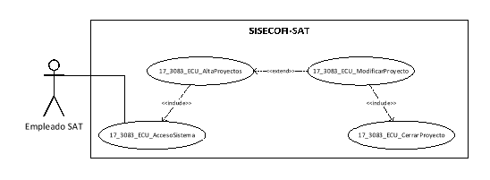
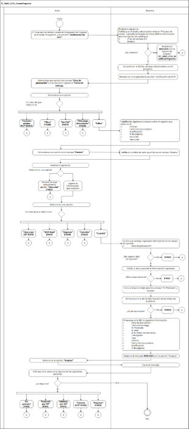

||Administración General de Comunicaciones y Tecnologías de la Información|
| :- | -: |
||Marco Documental 7.0|
|
Fecha de aprobación del Template:

02/08/2023
|
**Especificación del Caso de Uso**

17\_3083\_ECU\_CerrarProyecto.docx
|Versión del template: 7.00|
| :-: | :-: | :-: |

**<ID Requerimiento>**8309

**Nombre del Requerimiento:** TI\_SISECOFI-SAT\_Seguimiento financiero y control documental de proyectos de contratación

**Tabla de Versiones y Modificaciones**

|Versión|Descripción del cambio|Responsable de la Versión|Fecha|
| :- | :- | :- | :-: |
|*1*|*Creación del documento*|Eduardo Acosta Mora|*08/03/2024*|
|*1.1*|*Revisión del documento*|Luis Angel Olguin Castillo|*17/04/2024*|
|*1.2*|*Versión aprobada para firma*|
María del Carmen Castillejos Cárdenas

Rubén Delgado Ramírez
|*21/06/2024*|

**Tabla de Contenido**

[17_3083_ECU_CerrarProyecto	2](#_toc170140686)

[1. Descripción	2](#_toc170140687)

[2. Diagrama del Caso de Uso	2](#_toc170140688)

[3. Actores	2](#_toc170140689)

[4. Precondiciones	2](#_toc170140690)

[5. Post condiciones	3](#_toc170140691)

[6. Flujo primario	3](#_toc170140692)

[7. Flujos alternos	8](#_toc170140693)

[8. Referencias cruzadas	25](#_toc170140694)

[9. Mensajes	25](#_toc170140695)

[10. Requerimientos No Funcionales	26](#_toc170140696)

[11. Diagrama de actividad	29](#_toc170140697)

[12. Diagrama de estados	29](#_toc170140698)

[13. Aprobación del cliente	30](#_toc170140699)

### ****17\_3083\_ECU\_CerrarProyecto

|<h3>**1. Descripción** </h3>|
| :- |
|

El objetivo de este Caso de Uso es permitir al Empleado SAT la revisión y validación de los documentos adjuntos al proyecto, incluyendo sus contratos y/o convenios modificatorios, dictámenes y facturas relacionados durante la vida del proyecto. Esta verificación permitirá determinar si los documentos cumplen las condiciones establecidas para el cierre final del proyecto.

|
|<h3>**2. Diagrama del Caso de Uso**</h3>|
||
|<h3>**3. Actores** </h3>|
||

|**Actor**|**Descripción**|
| :-: | :-: |
|**Empleado SAT**|El Empleado SAT es el que tiene el o los roles otorgados por la Administración Central de Seguridad, Monitoreo y Control (ACSMC) para ingresar a cada uno de los módulos de este sistema.|

|

|
| :- |
|<h3>**4. Precondiciones**</h3>|
|

- El Empleado SAT se ha autenticado en el sistema con e.firma válida. 

- El sistema ha consumido el servicio “Oauth” para obtener los datos del Empleado SAT que ingresa al sistema.

- Se le ha asignado el rol requerido al Empleado SAT para ingresar al módulo “Proyectos” y a la sección “Verificación de RCP” con los permisos correspondientes.

- El sistema ha validado que el Empleado SAT cuenta con el rol para ingresar al módulo “Proyectos” y a la sección “Verificación de RCP” con los permisos correspondientes.

- Se le ha asignado el proyecto al Empleado SAT.

- El sistema ha validado que el proyecto debe tener el estatus “En proceso de cierre”.

- Se han adjuntado los documentos solicitados en la matriz documental de acuerdo con la asociación de fases correspondientes al proyecto.

|
|<h3>**5. Post condiciones** </h3>|
|

- El Empleado SAT actualizó el estatus del “Entregable” de acuerdo con sus necesidades.

- El Empleado SAT visualizó documentos tipo PDF.

- El Empleado SAT modificó un registro.

- El Empleado SAT descargó uno o más documentos.

- El Empleado SAT guardó el avance de la verificación.

- El Empleado SAT modificó el estatus RCP a “Revisado por AP”.

- El Empleado SAT modificó el estatus RCP a “Validado por LP”.

- El Empleado SAT modificó el estatus RCP a “En proceso”.

- El Empleado SAT modificó el estatus RCP a “Cancelado”.

- El Empleado SAT generó el RCP para su exportación.

|
|<h3>**6. Flujo primario**</h3>|
||

|**Actor**|**Sistema**|
| :-: | :-: |
|1. El Caso de Uso inicia cuando el Empleado SAT ingresa al módulo “Proyectos”, y a la sección **“Verificación de RCP”**.|
2. Realiza lo siguiente:

&emsp;

&emsp;Valida que el estatus de proyecto esté en “Proceso de cierre”, consulta en la base de datos (BD) la información para los siguientes catálogos teniendo en cuenta la regla de negocio **(RNA01)**:

&emsp;

- Área de planeación

- Estatus

- En caso contrario, muestra el mensaje **(MSG017)** con la opción de aceptar y continúa en el **(17\_3083\_ECU\_ModificarProyecto)**.
|
||
3. Consulta en la BD los siguientes campos relacionados con el proyecto:

- Nombre corto (del proyecto)

- Id proyecto sistema

- Estatus RCP (por defecto “En proceso”) **(RNA178)**

- Id proyecto AGP

- Nombre completo del proyecto

- Líder del proyecto

- Área de planeación

- Fecha de entrega

- % Planeado

- % Real

Tabla (RCP): 

- # (Número consecutivo)

- Entregable **(RNA179)**

- Fase **(RNA179)**

- Estatus **(RNA180)**

- Fecha del documento

- Justificación

- # de páginas

- En caso de que el proyecto no tenga asignada una plantilla documental, continúa en el flujo alterno **([**FA01**](#fa01))**.
|
||
4. Muestra en otra pantalla la sección “Verificación de RCP” de acuerdo con la **(RNA181)**, **(RNA182) y (RNA185)**:

&emsp;

- Nombre corto (del proyecto) (únicamente consulta)

- Id proyecto sistema (únicamente consulta)

- Estatus RCP (únicamente consulta)

- Id proyecto AGP (únicamente consulta)

- Nombre completo del proyecto (únicamente consulta)

- Líder del proyecto: (únicamente consulta)

- Área de planeación\*

- Fecha de entrega

- % Planeado (únicamente consulta). Aplica la **(RNA183**)

- % Real (únicamente consulta). Aplica la **(RNA184)**

&emsp;

Opción:

- Cancelar estatus RCP![ref1]

&emsp;

Tabla (RCP). Aplica la **(RNA244)**:

- # (Número consecutivo)

- Entregable

- Fase

- Estatus

- Fecha del documento

- Justificación

- # de páginas

- Acciones

Opciones:

- SATCloud 

- Descargar ZIP 

- Editar ![ref2]

- Descargar documento 

- Ver PDF 

- En proceso (No visible)

- Regresar

- Cancelar

- Guardar

- Revisado por AP

- Validado por LP (No visible si el estatus RCP es “En proceso”)

- Generar RCP (No visible si el estatus RCP esta “En proceso” o “Revisado por Área de Planeación”)

- Campos para “Filtrar” por columna

Ver **(17\_3083\_EIU\_CerrarProyecto)** Estilos 01.
|
|5. Selecciona una opción del campo **“Área de planeación”** y si lo requiere ingresa la **“Fecha de entrega”**, el flujo continúa.||
|
6. Selecciona una opción: 

&emsp;

- En caso de que seleccione la opción **“Editar”**, el flujo continúa.

- En caso de que seleccione la opción **“Descargar documento”**, continúa en el **([**FA06**](#fa06))**.

- En caso de que seleccione la opción **“Ver PDF”**, continúa en el **(**

- [**FA07**](#fa07)**)**.

- En caso de que seleccione la opción para **“Filtrar”** los campos de la tabla, continúa en el **([**FA08**](#fa08))**.

- En caso de que seleccione la opción **“Cancelar estatus RCP”**, continúa en el **(**

- [**FA03**](#fa03)**)**.
|
7. Habilita los siguientes campos sobre el registro que seleccionó:

&emsp;

- Estatus. Aplica la **(RNA180)**

- Fecha del documento

- Justificación

- # de páginas

- Acciones

&emsp;- Descartar 

|
|8. Selecciona una opción en el campo **“Estatus”**. |9. Valida el cambio de valor que hizo en el campo “Estatus” de acuerdo con la **(RNA188)**.|
|
10. Realiza lo siguiente: 

- Ingresa la información que requiera, el flujo continúa.

- En caso de que seleccione la opción **“Descartar”**, el flujo continúa en el **(FA02)**. 
||
|
11. Selecciona una opción:

&emsp;

- En caso de que seleccione la opción **“Guardar”**, el flujo continúa.

- En caso de que seleccione la opción **“Cancelar”**, continúa en el **([**FA02**](#fa02))**.

- En caso de que seleccione la opción **“Regresar”**, continúa en el **([**FA09**](#fa09))**.

- En caso de que seleccione la opción **“SATCloud”**, continúa en el **([**FA10**](#fa10))**.

- En caso de que seleccione la opción **“Descargar ZIP”**, continúa en el **([**FA11**](#fa11))**.
|
12. Valida que se haya ingresado información en el siguiente campo obligatorio de acuerdo con la **(RNA186)**:

&emsp;

- Área de planeación 

- En caso de que no se haya ingresado información en el campo obligatorio, continúa en el **([**FA04**](#fa04))**.
|
||
13. Valida la estructura de la información ingresada de acuerdo con la **(RNA189)**.

&emsp;

- En caso de que no se cumpla la estructura de la información ingresada, continúa en el **([**FA12**](#fa12))**.
|
||14. Calcula el porcentaje para los campos “% Planeado” y “% Real” de acuerdo con la **(RNA183)** y **(RNA184)**.|
||
15. Almacena en la BD la información de las Pistas de Auditoría.

Datos que se almacenan:

**Módulo**= Proyecto – VerificaciónDeRCP

**Fecha y Hora**= Fecha y hora del sistema, usando el formato DD/MM/AAAA HH:MM:SS

**RFC Usuario**= RFC largo del Empleado SAT que ingresó al sistema.

**Tipo de movimiento**= Cuando sea la primera vez que se ingrese información el tipo de movimiento debe ser **INSR** (Insertar).

Cuando sea la modificación del mismo registro el tipo de movimiento debe ser **UPDT** (modificar).

**Movimiento**= Aplica la **(RNA239)**

-Nombre corto (Proyecto)

-Área de planeación

-Fecha de entrega

- En caso de que no se puedan almacenar las Pistas de Auditoría, continúa en el **([**FA05**](#fa05))**.
|
||
16. Almacena en la BD la siguiente información:

- Área de planeación

- Fecha de entrega

- % Planeado

- % Real

- # (Número consecutivo)

- Entregable

- Fase

- Estatus

- Fecha del documento

- Justificación

- # de páginas
|
||17. Muestra el mensaje **([**MSG001**](#msg001))** con la opción “Aceptar”.|
|18. Selecciona la opción **“Aceptar”**.|19. Cierra el mensaje.|
|
20. Si lo requiere, selecciona alguna de las siguientes opciones:

&emsp;

- En caso de que seleccione la opción **“En proceso”**, continúa en el **([**FA13**](#fa13))**.

- En caso de que seleccione la opción **“Revisado por AP”**, continúa en el **([**FA14**](#fa14))**.

- En caso de que seleccione la opción **“Validado por AP”**, continúa en el **([**FA15**](#fa15))**.

- En caso de que seleccione la opción **“Generar RCP”**, continúa en el **([**FA16**](#fa16))**.

- En caso de que seleccione la opción **“Regresar”**, continúa en el **([**FA09**](#fa09))**.
|21. Fin del Caso de Uso.|

|

|
| :- |
|<h3>**7. Flujos alternos** </h3>|
|

**FA01 No se obtuvo información de la consulta para la tabla “RCP”**
|

|**Actor**|**Sistema**|
| :-: | :-: |
||1. ` `El **FA01** inicia cuando el sistema identifica que el proyecto no tiene asociada ninguna plantilla documental.|
||2. Muestra el **([**MSG002**](#msg002))** con la opción “Aceptar”.|
|3. Selecciona la opción **“Aceptar”**.|4. Cierra el mensaje.|
||5. El proceso continúa en el **(17\_3083\_ECU\_AsociarFasesMatrizDoc)**.|

|

**FA02 Selecciona la opción “Cancelar”, “Descartar”, “Cerrar ventana” o “Cerrar”**
|
| :- |

|**Actor**|**Sistema**|
| :-: | :-: |
|1. El **FA02** inicia cuando el Empleado SAT selecciona la opción **“Cancelar”**, **“Descartar”**, **“Cerrar ventana” o “Cerrar”**.|2. Muestra el **([**MSG003**](#msg003))** con las opciones “Sí” y “No”.|
|
3. Selecciona una opción:

|
4. Cierra el mensaje.

&emsp;

- En caso de que seleccione la opción **“Sí”**, el flujo continúa.

&emsp;

- En caso de que seleccione la opción **“No”**, permanece en el paso donde fue invocado.

&emsp;

|
||
5. Realiza lo siguiente:

&emsp;

- Si fue invocado en el “Cancelar” desde la pantalla “Verificación de RCP”, cancela la operación sin completar el movimiento que estaba en proceso.

- Si fue invocado en el “Cancelar” o “Cerrar ventana” en la pantalla “Generar RCP”, cierra el modal.

- Si fue invocado en la opción “Descartar”:

- Se inicializa el registro de la tabla de la sección donde fue invocado, y cambia a solo lectura si era un registro almacenado regresando los íconos a su estado original.
|
||
6. Dependiendo la situación, realiza lo siguiente:

&emsp;

- En caso de que haya sido llamado en el paso 10 del Flujo primario, continúa en el paso **6** del Flujo primario.

- En caso de que haya sido llamado en el paso 11 del Flujo primario, continúa en el paso **4** del Flujo primario.

- En caso de que haya sido llamado en el paso 11 del **([**FA16**](#fa16))**, continúa en el paso **20** del Flujo primario.
|

|

**FA03 Selecciona la opción “Cancelar estatus RCP”**
|
| :- |

|**Actor**|**Sistema**|
| :-: | :-: |
|1. El **FA03** inicia cuando el Empleado SAT selecciona la opción **“Cancelar estatus RCP”**.|2. Muestra el **([**MSG004**](#msg004))** con las opciones “Sí” y “No”.|
|3. Selecciona una opción.|
4. Cierra el mensaje.

&emsp;

- En caso de que seleccione la opción **“Sí”**, el flujo continúa.

- En caso de que seleccione la opción **“No”**, permanece en el paso donde fue invocado.
|
||
5. Almacena en la BD la información de las Pistas de Auditoría.

Datos que se almacenan:

**Módulo**= Proyecto – VerificaciónDeRCP

**Fecha y Hora**= Fecha y hora del sistema, usando el formato DD/MM/AAAA HH:MM:SS

**RFC Usuario**= RFC largo del Empleado SAT que ingresó al sistema.

**Tipo de movimiento**= **UPDT** (Modificar)

**Movimiento**= 

-Nombre corto (Proyecto).

-Estatus RCP

- En caso de que no se puedan almacenar las Pistas de Auditoría, continúa en el **([**FA05**](#fa05))**.
|
||
6. Inactiva lo siguiente:

&emsp;

- Área de planeación\*

- Fecha de entrega

&emsp;

Opciones:

- Cancelar estatus RCP

&emsp;

Tabla (RCP):

- # (Número consecutivo)

- Entregable

- Fase

- Estatus

- Fecha del documento

- Justificación

- # de páginas

Opciones:

- Editar![ref2]

- Cancelar

- Guardar

- Revisado por AP

- Validado por LP (No visible)

- Generar RCP (No visible)
|
||7. Modifica el valor del campo “Estatus RCP” a “Cancelado”.|
||8. Fin del Caso de Uso.|

|

**FA04 No se ingresaron los datos obligatorios**
|
| :- |

|**Actor**|**Sistema**|
| :-: | :-: |
||1. El **FA04** inicia cuando el sistema identifica que no se ingresaron los datos obligatorios.|
||2. Muestra en rojo los campos pendientes de capturar.|
||3. Muestra el **([**MSG005**](#msg005))** con la opción “Aceptar”. |
|4. Selecciona la opción **“Aceptar”**.|5. Cierra el mensaje.|
||
6. Dependiendo la situación donde haya sido llamado, realiza lo siguiente:

&emsp;

- En caso de que no haya sido capturado el campo “Área de planeación”, continúa en el paso **5** del Flujo primario.

- En caso de que haya sido llamado en el paso 5 del **([**FA14**](#fa14))**, continúa en el paso **6** del Flujo primario.

- En caso de que haya sido llamado en el paso 2 del **([**FA16**](#fa16))**, continúa en el paso [¡Error! No se encuentra el origen de la referencia.](#_ref166671703) del Flujo primario.

- En caso de que haya sido llamado en el paso 12 del **([**FA16**](#fa16))**, continúa en el paso **8** del **([**FA16**](#fa16))**.
|

|

**FA05 No se pueden almacenar las Pistas de Auditoría**
|
| :- |

|**Actor**|**Sistema**|
| :-: | :-: |
||1. El **FA05** inicia cuando interviene un evento ajeno y no se puede almacenar las Pistas de Auditoría.|
||2. Cancela la operación sin completar el movimiento que estaba en proceso.|
||
3. Muestra el mensaje de acuerdo con lo siguiente:

&emsp;

- Si la pista de auditoría es por el tipo de movimiento **UPDT** e **INSR**, se muestra el **([**MSG006**](#msg006))**.

- Si la pista de auditoría es por el tipo de movimiento **CNST**, se muestra el **([**MSG007**](#msg007))**.

- En caso de que la pista de auditoría sea por el tipo de movimiento **PRNT**, se muestra el **([**MSG008**](#msg008))**.

Cada mensaje se muestra con la opción “Aceptar”.
|
|4. Selecciona la opción **“Aceptar”**.|5. Cierra el mensaje.|
||6. Regresa al paso previo que detona la acción de la pista de auditoría.    |

|

**FA06 Selecciona la opción “Descargar documento”**
|
| :- |

|**Actor**|**Sistema**|
| :-: | :-: |
|1. El **FA06** inicia cuando el Empleado SAT selecciona la opción **“Descargar documento”**.|
2. Almacena en la BD la información de las Pistas de Auditoría.

&emsp;

&emsp;Datos que se almacenan:

**Módulo**= Proyecto – VerificaciónDeRCP

**Fecha y Hora**= Fecha y hora del sistema, usando el formato DD/MM/AAAA HH:MM:SS

**RFC Usuario**= RFC largo del Empleado SAT que ingresó al sistema.

**Tipo de movimiento**= **PRNT** (Imprimir)

**Movimiento**= Aplica la **(RNA239)**

-Nombre corto (Proyecto)

-Documento seleccionado

-Fase 

- En caso de que no se puedan almacenar las Pistas de Auditoría, continúa en el **([**FA05**](#fa05))**.
|
||3. Consulta el documento almacenado en la BD.|
||4. Descarga el archivo.|
||5. Continúa en el paso **6** del Flujo primario.|

|

**FA07 Selecciona la opción “Ver PDF”**
|
| :- |

|**Actor**|**Sistema**|
| :-: | :-: |
|1. El **FA07** inicia cuando el Empleado SAT selecciona la opción **“Ver PDF”**.|
2. Almacena en la BD la información de las Pistas de Auditoría.

&emsp;

&emsp;Datos que se almacenan:

**Módulo**= Proyecto – VerificaciónDeRCP

**Fecha y Hora**= Fecha y hora del sistema, usando el formato DD/MM/AAAA HH:MM:SS

**RFC Usuario**= RFC largo del Empleado SAT que ingresó al sistema.

**Tipo de movimiento**= **CNST** (Consulta)

**Movimiento**= 

-Nombre corto (Proyecto)

-Documento seleccionado

- En caso de que no se puedan almacenar las Pistas de Auditoría, continúa en el **([**FA05**](#fa05))**.
|
||3. Procesa el archivo PDF para su visualización.|
||
4. Muestra en una pantalla emergente lo siguiente:

&emsp;

- Panel de visualización (Muestra la información del archivo adjuntado).

&emsp;

Opciones:

- Cerrar

- Cerrar ventana![ref3]

Ver **(17\_3083\_EIU\_CerrarProyecto)** Estilos 02
|
|5. Selecciona la opción **“Cerrar”** o la opción **“Cerrar ventana”**.|6. Cierra la ventana emergente.|
||7. Continúa en el paso **6** del Flujo primario.|

|

**FA08 Selecciona la opción para “Filtrar” los campos de la tabla**
|
| :- |

|**Actor**|**Sistema**|
| :-: | :-: |
|1. EL **FA08** inicia cuando el Empleado SAT selecciona la opción para **“Filtrar”** la información en alguna columna de acuerdo con lo que se muestra en la tabla.||
|2. Elige la columna para filtrar e ingresa el dato a buscar.|3. Busca dentro de la columna y filtra la información mostrada de acuerdo con los caracteres ingresados en el campo.|
||4. Muestra en tiempo real todas las coincidencias que obtiene de dicha columna.|
||5. Continúa en el paso **6** del Flujo primario.|

|

**FA09 Selecciona la opción “Regresar”**
|
| :- |

|**Actor**|**Sistema**|
| :-: | :-: |
|1. El **FA09** inicia cuando el Empleado SAT selecciona la opción **“Regresar”**.|2. Muestra el **([**MSG009**](#msg009))** con las opciones “Sí” y “No”.|
|3. Selecciona una opción.|
4. Cierra el mensaje.

&emsp;

- En caso de que seleccione la opción **“Sí”**, el flujo continúa.

- En caso de que seleccione la opción **“No”**, permanece en el paso donde fue invocado
|
||5. El proceso continúa en el **(17\_3083\_ECU\_ModificarProyecto)**.|

|

**FA10 Selecciona la opción “SATCloud”**
|
| :- |

|**Actor**|**Sistema**|
| :-: | :-: |
|1. El **FA10** inicia cuando el Empleado SAT selecciona la opción **“SATCloud”**.|
2. Almacena en la BD la información de las Pistas de Auditoría.

&emsp;

&emsp;Datos que se almacenan:

**Módulo**= Proyecto – VerificaciónDeRCP

**Fecha y Hora**= Fecha y hora del sistema, usando el formato DD/MM/AAAA HH:MM:SS

**RFC Usuario**= RFC largo del Empleado SAT que ingresó al sistema.

**Tipo de movimiento**= **PRNT** (Imprimir)

**Movimiento**= Aplica la **(RNA239)**

- ID proyecto 

- Nombre de los documentos descargados en una cadena por separado por | (pipes)

- Ejemplo: (01\_FTO\_JC\_MDR4.PDF|SCP\_MDR4.PDF

- En caso de que no se puedan almacenar las Pistas de Auditoría, continúa en el **([**FA05**](#fa05))**.
|
||
3. Muestra en una ventana emergente la pantalla “Datos de la descarga” lo siguiente: 

&emsp;

&emsp;Campos

- url (enlace)

- contraseña

Opciones

- Copiar contraseña 

- Cerrar

- Cerrar ventana ![ref3]

- En caso de que no se muestre el enlace y la contraseña, continúa en el **([**FA19**](#fa19))**.

&emsp;

Ver

**(17\_3083\_EIU\_CerrarProyecto)** Estilos 04.
|
|
4. Realiza lo siguiente:

- En caso de que copie la contraseña y selecciona el enlace, el flujo continúa.

- En caso de que seleccione la opción **“Cerrar”**, continúa en el paso **11** del Flujo primario.
|5. Realiza la conexión con el SATCloud para mostrar el archivo a descargar.|
|6. Realiza lo correspondiente para descargar los documentos adjuntos.|7. Descarga el archivo con extensión (.ZIP).|
||8. Continúa en el paso **11** del Flujo primario.|

|

**FA11 Selecciona la opción “Descargar ZIP”**
|
| :- |

|**Actor**|**Sistema**|
| :-: | :-: |
|1. El **FA11** inicia cuando el Empleado SAT selecciona la opción **“Descargar ZIP”**.|
2. Almacena en la BD la información de las Pistas de Auditoría.

&emsp;

&emsp;Datos que se almacenan:

**Módulo**= Proyecto – VerificaciónDeRCP

**Fecha y Hora**= Fecha y hora del sistema, usando el formato DD/MM/AAAA HH:MM:SS

**RFC Usuario**= RFC largo del Empleado SAT que ingresó al sistema.

**Tipo de movimiento**= **PRNT** (Imprimir)

**Movimiento**= Aplica la **(RNA239)**

- ID proyecto 

- Nombre de los documentos descargados en una cadena por separado por | (pipes)

- Ejemplo: (01\_FTO\_JC\_MDR4.PDF|SCP\_MDR4.PDF

- En caso de que no se puedan almacenar las Pistas de Auditoría, continúa en el **([**FA05**](#fa05))**.
|
||3. Consulta en la BD los archivos que se tienen relacionados con el proyecto y sus contratos y/o convenios modificatorios, dictámenes y facturas relacionados.|
||4. Descarga el archivo en extensión (.ZIP) que contiene los archivos adjuntos.|
||5. Continúa en el paso **11** del Flujo primario.|

|

**FA12 Estructura de información ingresada incorrecta**
|
| :- |

|**Actor**|**Sistema**|
| :-: | :-: |
||1. El **FA12** inicia cuando el sistema identifica que la estructura de la información ingresada es incorrecta.|
||2. Muestra el **([**MSG010**](#msg010))** con la opción “Aceptar”.|
|3. Selecciona la opción **“Aceptar”**.|4. Cierra el mensaje.|
||5. Continúa en el paso **10** del Flujo primario.|

|

**FA13 Selecciona la opción “En proceso”**
|
| :- |

|**Actor**|**Sistema**|
| :-: | :-: |
|1. El **FA13** inicia cuando el Empleado SAT selecciona la opción **“En proceso”**.|2. Muestra el **([**MSG011**](#msg011))** con las opciones “Sí” y “No”.|
|3. Selecciona una opción.|
4. Cierra el mensaje.

&emsp;

- En caso de que seleccione la opción **“Sí”**, el flujo continúa.

&emsp;

- En caso de que seleccione la opción **“No”**, permanece en el paso donde fue invocado.
|
||
5. Almacena en la BD la información de las Pistas de Auditoría.

Datos que se almacenan:

**Módulo**= Proyecto – VerificaciónDeRCP

**Fecha y Hora**= Fecha y hora del sistema, usando el formato DD/MM/AAAA HH:MM:SS

**RFC Usuario**= RFC largo del Empleado SAT que ingresó al sistema.

**Tipo de movimiento**= **UPDT** (Modificar)

**Movimiento**= 

-Nombre corto (Proyecto)

-Estatus RCP

- En caso de que no se puedan almacenar las Pistas de Auditoría, continúa en el **([**FA05**](#fa05))**.
|
||6. Modifica el valor del campo “Estatus RCP” a “En proceso”.|
||7. Guarda en la BD el valor del campo “Estatus RCP”.|
||
8. Activa lo siguiente de acuerdo con la **(RNA182)**:

&emsp;

&emsp;Campos:

- Área de planeación\*

- Fecha de entrega

Opciones:

- Cancelar estatus RCP![ref1]

- Cancelar

- Guardar 

- Editar![ref2]

- Guardar

- Revisado por AP

- Campos para “Filtrar” por columna
|
||
9. Se ocultan las siguientes opciones:

&emsp;

- Validado por LP 

- Generar RCP
|
||10. Continúa en el paso **6** del Flujo primario. |

|

**FA14 Selecciona la opción “Revisado por AP”**
|
| :- |

|**Actor**|**Sistema**|
| :-: | :-: |
|1. El **FA14** inicia cuando el Empleado SAT selecciona la opción **“Revisado por AP”**.|2. Muestra el **([**MSG012**](#msg012))** con las opciones “Sí” y “No”.|
|3. Selecciona una opción. |
4. Cierra el mensaje.

&emsp;

- En caso de que seleccione la opción **“Sí”**, el flujo continúa.

&emsp;

- En caso de que seleccione la opción **“No”**, permanece en el paso donde fue invocado.
|
||
5. Valida que se haya ingresado información en los campos obligatorios de acuerdo con la **(RNA186)**.

&emsp;

- En caso de que no se haya ingresado información en los campos obligatorios, continúa en el **([**FA04**](#fa04))**.
|
||
6. Valida que no exista ningún entregable con estatus “Pendiente”.

&emsp;

- En caso de que exista un entregable con estatus “Pendiente”, continúa en el **([**FA17**](#fa17))**. 
|
||
7. Valida que el valor del campo “Fecha del documento” no sea menor que la fecha de inicio del proyecto y mayor a la fecha fin del proyecto.

&emsp;

- En caso de que no se cumpla, continúa en el **(**

- [**FA18**](#fa18)**)**.
|
||
8. Almacena en la BD la información de las Pistas de Auditoría.

Datos que se almacenan:

**Módulo**= Proyecto – VerificaciónDeRCP

**Fecha y Hora**= Fecha y hora del sistema, usando el formato DD/MM/AAAA HH:MM:SS

**RFC Usuario**= RFC largo del Empleado SAT que ingresó al sistema.

**Tipo de movimiento**= **UPDT** (Modificar)

**Movimiento**= Aplica la **(RNA239)**

-Nombre corto (Proyecto)

-Estatus RCP

- En caso de que no se puedan almacenar las Pistas de Auditoría, continúa en el **([**FA05**](#fa05))**.
|
||9. Modifica el valor del campo “Estatus RCP” a “Revisado por Área de Planeación”.|
||
10. Guarda en la BD lo siguiente:

&emsp;

- Área de planeación

- Fecha de entrega

- % Planeado

- % Real

- # (Número consecutivo)

- Entregable

- Fase

- Estatus

- Fecha del documento

- Justificación

- # de páginas
|
||
11. Inactiva lo siguiente:

&emsp;

&emsp;Campo:

- Área de planeación\*

Opciones: 

- Cancelar

- Guardar

- Editar ![ref2]

- Revisado por AP
|
||12. Se activa y visualiza las opciones “Validado por LP” de acuerdo con la **(RNA182)**.|
||13. Continúa en el paso **20** del Flujo primario. |

|

**FA15 Selecciona la opción “Validado por LP”**
|
| :- |

|**Actor**|**Sistema**|
| :-: | :-: |
|1. El **FA15** inicia cuando el Empleado SAT selecciona la opción **“Validado por LP”**.|2. Muestra el **([**MSG013**](#msg013))** con las opciones “Sí” y “No”.|
|3. Selecciona una opción. |
4. Cierra el mensaje.

&emsp;

- En caso de que seleccione la opción **“Sí”**, el flujo continúa.

&emsp;

- En caso de que seleccione la opción **“No”**, permanece en el paso donde fue invocado.
|
||
5. Almacena en la BD la información de las Pistas de Auditoría.

Datos que se almacenan:

**Módulo**= Proyecto – VerificaciónDeRCP

**Fecha y Hora**= Fecha y hora del sistema, usando el formato DD/MM/AAAA HH:MM:SS

**RFC Usuario**= RFC largo del Empleado SAT que ingresó al sistema.

**Tipo de movimiento**= **UPDT** (Modificar)

**Movimiento**= 

-Nombre corto (Proyecto).

-Estatus RCP

- En caso de que no se puedan almacenar las Pistas de Auditoría, continúa en el **([**FA05**](#fa05))**.
|
||6. Modifica el valor del campo “Estatus RCP” a “Validado por Líder de Proyecto”.|
||7. Guarda en la BD el valor de los campos “Estatus RCP” y “Fecha de entrega”.|
||8. Se ocultan las opciones “Revisado por AP” y “Validado por LP”. |
||9. Activa y se visualiza la opción “Generar RCP” de acuerdo con la **(RNA182)**.|
||10. Continúa en el paso **20** del Flujo primario.|

|

**FA16 Selecciona la opción “Generar RCP”**
|
| :- |

|**Actor**|**Sistema**|
| :-: | :-: |
|1. El **FA16** inicia cuando el Empleado SAT selecciona la opción **“Generar RCP”**.|
2. Valida que se haya ingresado un valor en el campo “Fecha de entrega”.

&emsp;

- En caso de que no se haya ingresado una fecha de entrega, continúa en el **([**FA04**](#fa04))**.
|
||
3. Valida que el valor del campo “Fecha de entrega” no sea menor que la fecha de inicio del proyecto y mayor a la fecha fin del proyecto.

&emsp;

- En caso de que no se cumpla, continúa en el **(**

- [**FA18**](#fa18)**)**.
|
||4. Obtiene del administrador de plantillas la correspondiente a “RCP”.|
||5. Modifica y guarda en la BD el valor del campo “Estatus RCP” a “RCP entregado”.|
||
6. Almacena en la BD la información de las Pistas de Auditoría.

Datos que se almacenan:

**Módulo**= Proyecto – VerificaciónDeRCP

**Fecha y Hora**= Fecha y hora del sistema, usando el formato DD/MM/AAAA HH:MM:SS

**RFC Usuario**= RFC largo del Empleado SAT que ingresó al sistema.

**Tipo de movimiento**= **UPDT** (Modificar)

**Movimiento**= 

-Nombre corto (Proyecto).

-Estatus RCP

- En caso de que no se puedan almacenar las Pistas de Auditoría, continúa en el **([**FA05**](#fa05))**.
|
||
7. Muestra en una ventana emergente la pantalla “Generar RCP” con lo siguiente:

&emsp;

- Panel de visualización (Muestra la información del archivo RCP)

- Tipo de plantilla\*

- Formato para exportar\*

&emsp;- PDF

&emsp;- Excel

Opciones:

- Previsualizar (Inactivo)

- Cancelar

- Aceptar (Inactivo)

- Cerrar ventana![ref4]

Ver **(17\_3083\_EIU\_CerrarProyecto)** Estilos 03
|
|8. Selecciona una opción en el campo **“Tipo de plantilla”**.||
|9. Selecciona una opción para el campo **“Formato para exportar”**.|10. Activa la opción “Previsualizar”.|
|
11. Selecciona una opción.

&emsp;

- En caso de que seleccione la opción **“Previsualizar”**, el flujo continúa.

- En caso de que seleccione la opción **“Cancelar”** o **“Cerrar ventana”**, continúa en el **([**FA02**](#fa02))**.
|
12. Valida que se haya seleccionado una opción en los campos obligatorios de acuerdo con la **(RNA186)**.

&emsp;

- En caso de que no haya seleccionado una opción, continúa en el **([**FA04**](#fa04))**.
|
||13. Procesa la información de la tabla “RCP” generada para el proyecto con los datos seleccionados anteriormente.|
||14. Activa la opción “Aceptar”.|
||
15. Muestra la vista previa de la generación del RCP.

|
|
16. Selecciona una opción. 

&emsp;

- En caso de que seleccione la opción **“Aceptar”**, el flujo continúa.
|
17. Almacena en la BD la información de las Pistas de Auditoría.

&emsp;

&emsp;Datos que se almacenan:

**Módulo**= Proyecto – VerificaciónDeRCP

**Fecha y Hora**= Fecha y hora del sistema, usando el formato DD/MM/AAAA HH:MM:SS

**RFC Usuario**= RFC largo del Empleado SAT que ingresó al sistema.

**Tipo de movimiento**= **PRNT** (Imprimir)

**Movimiento**= Aplica la **(RNA239)**

-Nombre corto (Proyecto)

-Tipo de plantilla

-Generación de archivo RCP

- En caso de que no se puedan almacenar las Pistas de Auditoría, continúa en el **([**FA05**](#fa05))**. 
|
||18. Descarga el archivo generado de acuerdo con la opción seleccionada en el campo “Formato para exportar”.|
||19. Fin del Caso de Uso.|

|

**FA17 Existen entregables con estatus “Pendiente”**
|
| :- |

|**Actor**|**Sistema**|
| :-: | :-: |
||1. El **FA17** inicia cuando el sistema identifica que hay entregables con estatus **“Pendiente”**.|
||2. Muestra el **([**MSG014**](#msg014))** con la opción “Aceptar”.|
|3. Selecciona la opción **“Aceptar”**.|4. Cierra el mensaje.|
||5. Continúa en el paso **6** del Flujo primario.|

|

**FA18 Las fechas de los documentos o la fecha de entrega es menor a la fecha de inicio del proyecto o mayor a la fecha fin del proyecto**
|
| :- |

|**Actor**|**Sistema**|
| :-: | :-: |
||1. El **FA18** inicia cuando el sistema identifica que el valor del campo “Fecha del documento” o “Fecha de entrega” es menor a la fecha de inicio del proyecto o mayor a la fecha fin del proyecto.|
||2. Muestra el **([**MSG015**](#msg015))** con la opción “Aceptar”.|
|3. Selecciona la opción **“Aceptar”**.|4. Cierra el mensaje.|
||
5. Dependiendo la situación, realiza lo siguiente:

&emsp;

- Si fue invocado en el paso 7 del **(FA14)**, continúa en el paso **6** del Flujo primario.

&emsp;

- Si fue invocado en el paso 3 del **(FA16)**, continúa en el paso **5** del Flujo primario.
|

|

**FA19 Error al generar el enlace y contraseña** 
|
| :- |

|**Actor**|**Sistema**|
| :-: | :-: |
||1. El **FA19** inicia cuando no se muestra el enlace y la contraseña.|
||2. Muestra el **([**MSG016**](#msg016))** con la opción “Aceptar”.|
|3. Selecciona la opción **“Aceptar”**.|4. Cierra el mensaje.|
||5. Continúa en el paso **11** del Flujo primario.|

|

|
| :- |
|<h3>**8. Referencias cruzadas** </h3>|
|

- 17\_3083\_CRN\_SeguimientoFinancieroYControl

- 17\_3083\_EIU\_CerrarProyecto

- 17\_3083\_ECU\_ModificarProyecto

- 17\_3083\_ECU\_AsociarFasesMatrizDoc

|
|<h3>**9. Mensajes** </h3>|
||

|**ID Mensaje**|**Descripción**|
| :-: | :-: |
|**MSG001**|Información guardada correctamente.|
|**MSG002**|El proyecto no tiene asignado ninguna plantilla documental.|
|**MSG003**|
Se perderán todos los cambios realizados.

¿Está seguro de que desea continuar?
|
|**MSG004**|
Se modificará el “Estatus del RCP” a “Cancelado”.

¿Está seguro de que desea continuar?
|
|**MSG005**|Favor de ingresar los datos obligatorios |
|**MSG006**|Ocurrió un error al guardar el registro, favor de intentar nuevamente (PA01).|
|**MSG007**|Ocurrió un error al consultar la información, favor de intentar nuevamente (PA01).|
|**MSG008**|Ocurrió un error al exportar la información, favor de intentar nuevamente (PA01).|
|**MSG009**|
¿Está seguro de que desea regresar? 

Se perderán todos los cambios no guardados.
|
|**MSG010**|La estructura de la información ingresada es incorrecta. Intente nuevamente.|
|**MSG011**|
Se modificará el “Estatus RCP” a “En proceso”.

¿Está seguro de que desea continuar?
|
|**MSG012**|
Se modificará el “Estatus RCP” a “Revisado por Área de Planeación”.

¿Está seguro de que desea continuar?
|
|**MSG013**|
Se modificará el “Estatus RCP” a “Validado por Líder de Proyecto”.

¿Está seguro de que desea continuar?
|
|**MSG014**|Aún existen entregables con estatus “Pendiente”. Intente nuevamente.|
|**MSG015**|Las fechas no pueden ser menor a la fecha de inicio del proyecto o mayor a la fecha fin del proyecto.|
|**MSG016**|
Error al generar el enlace y contraseña. 

Intente nuevamente.
|
|**MSG017**|No puedes continuar si el “Estatus del proyecto” está en “Proceso de cierre”.|

|

|
| :- |
|<h3>**10. Requerimientos No Funcionales** </h3>|
||

|**ID de RNF**|**Requerimiento No Funcional**|**Descripción**|
| :-: | :-: | :-: |
|**RNF001**|Disponibilidad|El sistema deberá estar activo las 24 horas del día, los 365 días del año con picos de operación en el horario de 9:00 a 18:00 horas.|
|**RNF002**|Concurrencia|
El número de Empleados SAT que puede tener el sistema son 150. 

` `El número de accesos concurrentes que debe soportar este sistema son máximo 30 Empleados SAT.
|
|**RNF003**|Seguridad|El acceso solo podrá ser otorgado a todo Empleado SAT que tenga los roles asignados por la Administración Central de Seguridad, Monitoreo y Control (ACSMC) para cada módulo de este sistema.|
|**RNF004**|Usabilidad|
El sistema deberá manejar los siguientes elementos para facilitar la navegación:  

- Mensajes tipo flotantes (tooltips) con información de la herramienta que ofrece ayuda contextual, como guía para el Empleado SAT.  

- Componente de ordenamiento que permita acomodar la información de la tabla de forma ascendente o descendente, considerando la columna donde es seleccionado.  

- Contar con un diseño responsivo que permita su óptima visualización en distintos tipos de dispositivos finales.
|
|**RNF005**|Eficiencia|Las consultas se dividen en generales y detalladas, para que las detalladas carguen la información solo cuando sean requeridas por el Empleado SAT. |
|**RNF006**|Usabilidad|
El Empleado SAT podrá navegar a través de las páginas resultantes de la consulta considerando que el sistema debe mostrar inicialmente 15 registros por página, permitiendo al Empleado SAT seleccionar los registros que requiere visualizar, teniendo las opciones 15, 50 y 100:  

  

- Ir a la primera página (debe mostrar la primera página con el resultado de la consulta).  

- Ir a la última página (debe mostrar la última página con el resultado de la consulta).  

- Ir a la siguiente página (debe mostrar la siguiente página, considerando la página actual, con el resultado de la consulta y el número de registros seleccionados por el Empleado SAT).  

- Ir a la página anterior (debe mostrar la página anterior considerando la actual, con el resultado de la consulta).  

  

En la tabla deben mostrarse los registros ordenados alfabéticamente. 
|
|**RNF007**|Seguridad|Las Pistas de Auditoría deben estar protegidas contra accesos no autorizados. Solo los Empleados SAT autorizados pueden consultarlas, y la información en ellas se definirá durante la etapa de diseño, la cual debe estar cifrada para mantenerla confidencial y evitar exposiciones no autorizadas.   |
|**RNF008**|Fiabilidad |El sistema debe ser capaz de manejar excepciones de manera efectiva y presentar mensajes claros y comprensibles para garantizar una adecuada interacción con el sistema. |
|**RNF009**|Seguridad|Mantener la información en pantalla en caso de un error al guardar las pistas de auditoría, siempre y cuando el escenario lo permita. Hay situaciones de infraestructura o de conexión de internet que sí pierde los datos ya que no están controlados por el sistema. |
|**RNF010**|Integridad |Al almacenar la información en la BD de tipo Texto o alfanumérico se deben eliminar los espacios en blanco al inicio y fin de la cadena. |
|**RNF011**|Usabilidad |
Usabilidad, El Empleado SAT podrá navegar a través de las páginas resultantes del documento PDF. 

- Ir a la siguiente página (debe mostrar la página consecutiva del documento PDF).  

- Ir a la página anterior (debe mostrar la página previa del documento PDF). 
|

|

|
| :- |
|<h3>**11. Diagrama de actividad** </h3>|
||
||
|<h3>**12. Diagrama de estados** </h3>|
|

No aplica, no hay cambios significativos de estados ni transiciones.

|
|<h3>**13. Aprobación del cliente** </h3>|
||

|**FIRMAS DE CONFORMIDAD**||
| :-: | :- |
|**Firma 1** |**Firma 2** |
|**Nombre**: María del Carmen Castillejos Cárdenas.|**Nombre**: Rubén Delgado Ramírez.|
|**Puesto**: Usuaria ACPPI.|**Puesto**: Usuario ACPPI.|
|**Fecha:**|**Fecha:**|
|||
|**Firma 3** |**Firma 4**|
|**Nombre**: Rodolfo López Meneses.|**Nombre**: Diana Yazmín Pérez Sabido.|
|**Puesto**: Usuario ACPPI.|**Puesto**: Usuaria ACPPI.|
|**Fecha:**|**Fecha:**|
|||
|**Firma 5**|**Firma 6**|
|**Nombre**: Yesenia Helvetia Delgado Naranjo.|**Nombre:** Alejandro Alfredo Muñoz Núñez.|
|**Puesto**: APE ACPPI.|**Puesto:** RAPE ACPPI.|
|**Fecha**:|**Fecha**:|
|||
|**Firma 7**|**Firma 8**|
|**Nombre**: Luis Angel Olguin Castillo.|**Nombre**: Erick Villa Beltrán.|
|**Puesto**: Enlace ACPPI.|**Puesto**: Líder APE SDMA 6.|
|**Fecha**:|**Fecha**:|
|||
|**Firma 9**|**Firma 10**|
|**Nombre:** Juan Carlos Ayuso Bautista.|**Nombre:** Eduardo Acosta Mora.|
|**Puesto:** Líder Técnico SDMA 6.|**Puesto:** Analista SDMA 6.|
|**Fecha**:|**Fecha**:|
|||

||
| :- |

|||Página 1 de 24|
| :- | :-: | -: |

[ref1]: Aspose.Words.2559e9d1-c873-42fc-aee7-36a141bab18b.003.png
[ref2]: Aspose.Words.2559e9d1-c873-42fc-aee7-36a141bab18b.006.png
[ref3]: Aspose.Words.2559e9d1-c873-42fc-aee7-36a141bab18b.011.png
[ref4]: Aspose.Words.2559e9d1-c873-42fc-aee7-36a141bab18b.013.png
