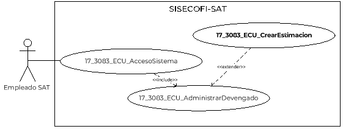
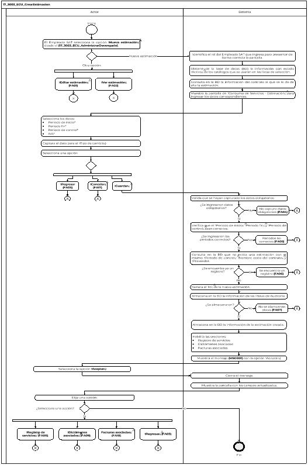
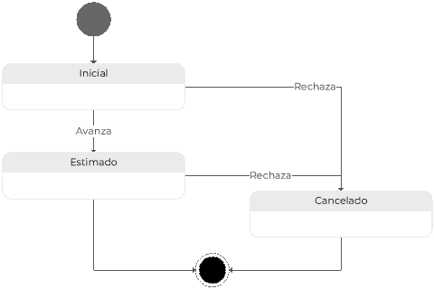

||Administración General de Comunicaciones y Tecnologías de la Información|
| :- | -: |
||Marco Documental 7.0|
|
Fecha de aprobación del Template:

02/08/2023
|
**Especificación del Caso de Uso**

17\_3083\_ECU\_CrearEstimacion.docx
|Versión del template: 7.00|
| :-: | :-: | :-: |

**<ID Requerimiento>** 8309

**Nombre del Requerimiento: **TI\_SISECOFI-SAT\_Seguimiento financiero y control documental de proyectos de contratación

**Tabla de Versiones y Modificaciones**

|Versión|Descripción del cambio|Responsable de la Versión|Fecha|
| :-: | :- | :-: | :-: |
|*1*|*Creación del documento*|Isabel Adriana Valdez Cortés|*19/02/2024*|
|*1.1*|*Revisión del documento*|Luis Angel Olguin Castillo|*23/04/2024*|
|*1.2*|*Versión aprobada para firma*|
María del Carmen Castillejos Cárdenas

Rubén Delgado Ramírez
|*11/06/2024*|

**Tabla de Contenido**

[17_3083_ECU_CrearEstimacion	2](#_toc169691059)

[1. Descripción	2](#_toc169691060)

[2. Diagrama del Caso de Uso	2](#_toc169691061)

[3. Actores	2](#_toc169691062)

[4. Precondiciones	2](#_toc169691063)

[5. Post condiciones	3](#_toc169691064)

[6. Flujo primario	3](#_toc169691065)

[7. Flujos alternos	7](#_toc169691066)

[8. Referencias cruzadas	29](#_toc169691067)

[9. Mensajes	29](#_toc169691068)

[10. Requerimientos No Funcionales	30](#_toc169691069)

[11. Diagrama de actividad	32](#_toc169691070)

[12. Diagrama de estados	33](#_toc169691071)

[13. Aprobación del cliente	34](#_toc169691072)

### ****17\_3083\_ECU\_CrearEstimacion

|<h3>**1. Descripción** </h3>|
| :- |
|

El objetivo de este Caso de Uso es permitir al Empleado SAT crear, editar y ver la información de las estimaciones relacionadas con un proyecto y contrato.

|
|<h3>**2. Diagrama del Caso de Uso**</h3>|
|

|
|<h3>**3. Actores** </h3>|
||

|**Actor**|**Descripción**|
| :-: | :-: |
|**Empleado SAT**|El Empleado SAT es el que tiene el o los roles otorgados por la Administración Central de Seguridad, Monitoreo y Control (ACSMC) para ingresar a cada uno de los módulos de este sistema. |

||
| :- |
|<h3>**4. Precondiciones**</h3>|
|

- El Empleado SAT se ha autenticado en el sistema con e.firma válida. 

- El sistema ha consumido el servicio “Oauth” para obtener los datos del Empleado SAT que ingresa. 

- El sistema ha validado que el Empleado SAT cuenta con los roles para ingresar al módulo “Consumo de Servicios”.

- El Empleado SAT ha seleccionado alguno de los íconos correspondientes para las siguientes opciones en el módulo de “Consumo de Servicios”:

- Alta de estimación

- Editar estimación

- Ver estimación

&emsp;
|
|<h3>**5. Post condiciones** </h3>|
|

El Empleado SAT realizó alguna de las siguientes acciones:

- Capturó la información correspondiente para dar de alta una nueva estimación.

- Editó la información correspondiente de una estimación.

- Actualizó el estatus de la estimación.

- Visualizó la información de la estimación.

- El sistema almacenó la información de la nueva estimación, asignándole un id único.

&emsp;
|
|<h3>**6. Flujo primario**</h3>|
||

|**Actor**|**Sistema**|
| :-: | :-: |
|
1. El Caso de Uso inicia cuando el Empleado SAT selecciona la opción **“Nueva estimación”** desde el **(17\_3083\_ECU\_AdministrarDevengado)**.

&emsp;

- En caso de haber seleccionado la opción **“Editar estimación”** desde el **(17\_3083\_ECU\_AdministrarDevengado**, continúa en el flujo alterno **([**FA01**](#fa01))**.

- En caso de haber seleccionado la opción **“Ver estimación”** desde el **(17\_3083\_ECU\_AdministrarDevengado**, continúa en el **([**FA02**](#fa02))**.
|2. Identifica el rol del Empleado SAT que ingresa para presentar de forma correcta la pantalla. Aplica la regla de negocio **(RNA51)**.|
||
3. Obtiene de la base de datos (BD) la información con estado “Activo” de los catálogos que se usarán en las listas de selección:

&emsp;

- Año del periodo de control

- Meses

- IVA
|
||
4. Consulta en la BD la siguiente información del contrato al que se le da de alta la estimación.

&emsp;

- Número del contrato

- IVA

- Moneda
|
|

|
5. Muestra la pantalla de “Consumo de Servicios - Estimación” para registrar lo siguiente:

&emsp;

&emsp;“Datos generales estimación”. Aplica la **(RNA51)** y **(RNA206)**

- Id

- Nombre corto del contrato\*

- Número de contrato

- Proveedor\*

- Estatus. Aplica la **(RNA209)**

- Periodo de inicio\*

- Periodo fin\*

- Periodo de control\*

- IVA

- Tipo de cambio referencial. Aplica la **(RNA126)**

- Monto estimado total

- Monto estimado total en pesos

Opción:

- Cancelar

- Guardar

Secciones colapsadas e inhabilitadas:

- Registro de servicios

- Dictámenes asociados

- Facturas asociadas

Opción:

- Regresar

Ver **(17\_3083\_EIU\_CrearEstimación)** Estilos 01.
|
|
6. Selecciona los datos:

&emsp;

- Periodo de inicio\*

- Periodo fin\*

- Periodo de control\*

- IVA\*
||
|7. Captura el dato para el “Tipo de cambio referencial”.||
|
8. Selecciona una opción:

&emsp;

- En caso de seleccionar la opción **“Guardar”**, el flujo continúa.

&emsp;

- En caso de seleccionar la opción **“Cancelar”**, continúa en el **([**FA17**](#fa17))**.

- En caso de seleccionar la opción **“Regresar”**, continúa en el **([**FA03**](#fa03))**.
|
9. Valida que se hayan capturado los datos obligatorios. Aplica las **(RNA03)**, **(RNA126)** y **(RNA206)**.

&emsp;

- En caso de identificar que no se ingresaron los datos obligatorios, continúa en el **([**FA04**](#fa04))**.
|
||
10. Verifica que el “Periodo de inicio”, “Periodo fin” y “Periodo de control” sean correctos. Aplica la **(RNA206)**

&emsp;

- En caso de identificar que no son correctos, continúa en el **([**FA05**](#fa05))**.
|
||
11. Consulta en la BD que no exista una estimación con el mismo “Periodo de control”, “Nombre corto del contrato” y “Proveedor”.

&emsp;

- En caso de identificar que se encuentra un registro, continúa en el **([**FA06**](#fa06))**.
|
||12. Genera el “Id” de la nueva estimación. Aplica la **(RNA221)**|
||
13. Almacena en la BD la información de las Pistas de Auditoría.

&emsp; 

&emsp;Datos que se almacenan:

**Módulo**= Estimación- Datos generales estimación

**Fecha y Hora**= Fecha y hora del sistema, usando el formato DD/MM/AAAA HH:MM:SS

**RFC Usuario**= RFC largo del Empleado SAT que ingresó al sistema.

**Tipo de movimiento**= **INSR** (Insertar)

**Movimiento**= Aplica la **(RNA239)**

- Id de estimación

- Nombre corto del proyecto

- En caso de que no se puedan almacenar las Pistas de Auditoría, continúa en el **([**FA07**](#fa07))**.
|
||
14. Almacena en la BD la siguiente información de la estimación creada:

&emsp;

- Id

- Nombre corto del contrato

- Número de contrato

- Proveedor

- Estatus: “Inicial”

- Periodo de inicio

- Periodo fin

- Periodo de control

- IVA

- Tipo de cambio referencial

- Nombre del Empleado SAT. Aplica la **(RNA247)**

- Fecha y hora de la modificación
|
||
15. Habilita las secciones:

&emsp;

- Registro de servicios

- Dictámenes asociados

- Facturas asociadas
|
||16. Muestra el mensaje **([**MSG001**](#msg001))** con la opción** “Aceptar”.|
|17. Selecciona la opción **“Aceptar”**.|18. Cierra el mensaje.|
||19. Muestra la pantalla con los campos actualizados.|
|
20. Elije una opción:

&emsp;

- En caso de seleccionar la sección **“Registro de servicios”**, continúa en el **([**FA08**](#fa08))**.

- En caso de seleccionar la sección **“Dictámenes asociados”**, continúa en el **([**FA09**](#fa09))**.

- En caso de seleccionar la sección **“Facturas asociadas”**, continúa en el **([**FA10**](#fa10))**.

- En caso de seleccionar la opción **“Regresar”**, continúa en el **([**FA03**](#fa03))**.
||
||21. Fin del Caso de Uso.|

|

|
| :- |
|<h3>**7. Flujos alternos** </h3>|
|

**FA01 Opción “Editar estimación”**
|

|**Actor**|**Sistema**|
| :-: | :-: |
|1. El **FA01** inicia cuando el Empleado SAT selecciona la opción **“Editar estimación”**.|
2. Obtiene de la base de datos (BD) la información con estado “Activo” de los catálogos que se usarán en las listas de selección:

&emsp;

- Año del periodo de control

- Meses

- IVA
|
||3. Consulta en la BD y obtiene los datos generales de la estimación a modificar.|
||
4. Consulta en la BD si existe información almacenada para el “Registro de servicios” y precarga los datos.

&emsp;

- En caso de que no exista información, consulta en la BD la siguiente información: 

&emsp;Del contrato relacionado

- IVA

- Porcentaje de IEPS

- Moneda

Registro de servicios

- Conceptos de servicio

- Tipo de unidad 

- Tipo de consumo

- Precio unitario

- Cantidad de servicios máxima vigente

- Monto máximo (vigente)

- Aplica IEPS
|
||5. Calcula el “Monto estimado total”. Aplica la **(RNA207)**|
||
6. Identifica si el tipo de moneda es igual a pesos (MXN), entonces en el campo “Monto estimado total en pesos” se muestra el valor de “Monto estimado total”.

&emsp;

- En caso contrario, realizar la conversión a pesos tomando en cuenta el “Tipo de cambio referencial” y se muestra el valor en “Monto estimado total en pesos”. Aplica la **(RNA208)**
|
||
7. Muestra la pantalla de “Consumo de Servicios - Estimación” con la información precargada para editar:

&emsp;

&emsp;“Datos generales estimación”. Aplica la **(RNA206)**

- Id

- Nombre corto del contrato\*

- Número de contrato

- Proveedor\*

- Estatus. Aplica la **(RNA209)**

- Periodo de inicio\*

- Periodo fin\*

- Periodo de control\*

- IVA

- Tipo de cambio referencial

- Monto estimado total

- Monto estimado total en pesos

Opciones:

- Cancelar

- Guardar

- Inicial. Aplica la **(RNA210)**

- Duplicar estimación ![ref1]. Aplica la **(RNA210)**

- Cancelar estimación ![ref2]. Aplica la **(RNA210)**

Secciones colapsadas:

- Registro de servicios

- Dictámenes asociados

- Facturas asociadas

Opción:

- Regresar

&emsp;

Ver **(17\_3083\_EIU\_CrearEstimación)** Estilos 02.
|
|8. Si requiere, modifica los datos de la sección **“Datos generales estimación”**.||
|
9. Elige una opción:

&emsp;

- En caso de seleccionar la opción **“Guardar”**, el flujo continúa.

- En caso de seleccionar la opción **“Cancelar”**, continúa en el **([**FA17**](#fa17))**.

- En caso de seleccionar la opción **“Inicial”**, continúa en el **([**FA11**](#fa11))**.

- En caso de seleccionar la opción **“Duplicar estimación”**, continúa en el **([**FA15**](#fa15))**.

- En caso de seleccionar la opción **“Cancelar estimación”** continúa en el **([**FA16**](#fa16))**.

- En caso de seleccionar la sección **“Registro de servicios”**, continúa en el **([**FA08**](#fa08))**.

- En caso de seleccionar la sección **“Dictámenes asociados”**, continúa en el **([**FA09**](#fa09))**.

- En caso de seleccionar la sección **“Facturas asociadas”**, continúa en el **([**FA10**](#fa10))**.

- En caso de seleccionar la opción **“Regresar”**, continúa en el **([**FA03**](#fa03))**.
|
10. Valida que se hayan capturado los datos obligatorios. Aplica las **(RNA03)**, **(RNA126)** y **(RNA206)**.

&emsp;

- En caso de identificar que no se ingresaron los datos obligatorios, continúa en el **([**FA04**](#fa04))**.
|
||
11. Verifica que el “Periodo de inicio”, “Periodo fin” y “Periodo de control” sean correctos. Aplica la **(RNA206)**

&emsp;

- En caso de identificar que no son correctos, continúa en el **([**FA05**](#fa05))**.
|
||
12. Consulta en la BD que no exista una estimación con el mismo “Periodo de control”, “Nombre corto del contrato” y “Proveedor”.

&emsp;

- En caso de identificar que se encuentra un registro, continúa en el **([**FA06**](#fa06))**.
|
||
13. Almacena en la BD la información de las Pistas de Auditoría.

&emsp; 

&emsp;Datos que se almacenan:

**Módulo**= Estimación- Datos generales estimación

**Fecha y Hora**= Fecha y hora del sistema, usando el formato DD/MM/AAAA HH:MM:SS

**RFC Usuario**= RFC largo del Empleado SAT que ingresó al sistema.

**Tipo de movimiento**= **UPDT** (Modificar)

**Movimiento**= Aplica la **(RNA239)**

- Id de estimación

- Nombre corto del proyecto

- En caso de que no se puedan almacenar las Pistas de Auditoría, continúa en el **([**FA07**](#fa07))**.
|
||
14. Actualiza en la BD la siguiente información de la estimación:

&emsp;

- Id

- Nombre corto del contrato

- Número de contrato

- Proveedor

- Estatus

- Periodo de inicio

- Periodo fin

- Periodo de control

- IVA

- Tipo de cambio referencial

- Nombre del Empleado SAT. Aplica la **(RNA247)**

- Fecha y hora de la modificación

&emsp;

- Si fue invocado en el (FA15) adicional almacena los datos del “Registro de servicios” relacionados. 
|
||
15. Si fue invocado en el (FA15) habilita las opciones:

- Inicial. Aplica la **(RNA210)**

- Duplicar estimación ![ref1]. Aplica la **(RNA210)**

- Cancelar estimación ![ref2]. Aplica la **(RNA210)**

- En caso contrario, el flujo continúa.
|
||16. Muestra el **([**MSG001**](#msg001))** con la opción** “Aceptar”.|
|17. Selecciona la opción **“Aceptar”**.|18. Cierra el mensaje y continúa en el paso [**9**](#_ref168853696) de este flujo.|

|

**FA02 Opción “Ver estimación”**
|
| :- |

|**Actor**|**Sistema**|
| :-: | :-: |
|1. El **FA02** inicia cuando el Empleado SAT selecciona la opción **“Ver estimación”**.|2. Obtiene de la BD la información de los “Datos generales” de la estimación.|
||
3. Complementa la pantalla con la información obtenida en el paso anterior de solo lectura, la sección de “Datos generales estimación”.

&emsp;

&emsp;Ver **(17\_3083\_EIU\_CrearEstimacion)** Estilo 02.
|
||
4. Muestra las siguientes secciones habilitadas para elección:

&emsp;

- Registro de servicios

- Dictámenes asociados

- Facturas asociadas

Opciones:

- Inicial. Aplica la **(RNA210)**

- Regresar
|
|
5. Selecciona la sección **“Registro de servicios”** y el flujo continúa.

&emsp;

- En caso de seleccionar la sección **“Dictámenes asociados”**, continúa en el paso [**8**](#_ref160267595) de este flujo.

- En caso de seleccionar la sección **“Facturas asociadas”**, continúa en el paso [**10**](#_ref160267661)** de este flujo.

- En caso de seleccionar la opción **“Regresar”**, continúa en el **([**FA03**](#fa03))**.
|6. Obtiene de la BD la información de “Registro de servicios” relacionada con la estimación.|
||
7. Complementa la pantalla con la información obtenida en el paso anterior en la sección de “Registro de servicios”, con formato de solo lectura.

&emsp;

&emsp;Ver **(17\_3083\_EIU\_CrearEstimacion)** Estilo 03.

&emsp;

&emsp;Regresa al paso [**5**](#_ref160268006) de este flujo.
|
||8. Obtiene de la BD la información de “Dictámenes asociados” con el mismo Contrato, Proveedor y Periodo de control de la estimación.|
||
9. Complementa la pantalla con la información obtenida en el paso anterior en la sección de “Dictámenes asociados”, con formato de solo lectura.

&emsp;

&emsp;Ver **(17\_3083\_EIU\_CrearEstimacion)** Estilo 04.

&emsp;

&emsp;Regresa al paso [**5**](#_ref160268006)** de este flujo.

&emsp;
|
||10. Obtiene de la BD la “Facturas asociadas” con el mismo Contrato, Proveedor y Periodo de control de la estimación.|
||
11. Complementa la pantalla con la información obtenida en el paso anterior en la sección de “Facturas asociadas”, con formato de solo lectura.

&emsp;

&emsp;Ver **(17\_3083\_EIU\_CrearEstimacion)** Estilo 05.

&emsp;

&emsp;Regresa al paso [**5**](#_ref160268006)** de este flujo.
|
||12. Fin del Caso de Uso.|

|

**FA03 Opción “Regresar”**
|
| :- |

|**Actor**|**Sistema**|
| :-: | :-: |
|1. El **FA03** inicia cuando el Empleado SAT selecciona la opción **“Regresar”**.|2. Muestra el **([**MSG002**](#msg002))** con las opciones “Sí” y “No”.|
|
3. Selecciona la opción **“Sí”** y el flujo** continúa.

&emsp;

- En caso de seleccionar **“No”**,** continúa en el paso [**7**](#_ref164282595)** de este flujo.
|4. Cierra el mensaje.|
||5. No almacena ninguna información   y en su caso si aún no está almacenada la información se libera el Id generado.|
||6. Continúa en la pantalla principal del proceso definido en el **(17\_3083\_ECU\_AdministrarDevengado)**.|
||
7. Cierra el mensaje y realiza lo siguiente:

&emsp;

- Si fue invocado en el Flujo primario paso  [**8**](#_ref164505676)** o [**20**](#_ref164290421), continúa en el paso **[**8**](#_ref164505676)** del Flujo primario.

- Si fue invocado en el paso [9](#_ref168853696) del **([**FA01**](#fa01))**, continúa en el paso **[**9**](#_ref168853696)** del **([**FA01**](#fa01))**.

- Si fue invocado en el paso 5 **([**FA02**](#fa02))**,** continúa en el paso **[**5**](#_ref160268006)** del **([**FA02**](#fa02))**.

- Si fue invocado en el paso [6](#_ref169089294) del  **([**FA15**](#fa15))**,** continúa en el paso **[**6**](#_ref169089294)** del **([**FA15**](#fa15))**.
|

|

**FA04 No se ingresaron los datos obligatorios**
|
| :- |

|**Actor**|**Sistema**|
| :-: | :-: |
||1. El **FA04** inicia cuando el sistema identifica que no se ingresaron los datos obligatorios.|
||2. Muestra en rojo los campos pendientes de capturar. |
||3. Muestra el **([**MSG003**](#msg003))** con la opción “Aceptar”.|
|4. Selecciona la opción **“Aceptar”**.|5. Cierra el mensaje.|
||
6. Realiza lo siguiente:

&emsp;

- Si fue invocado en el paso [9](#_ref169003849) del Flujo primario, continúa en el paso [**6**](#_ref163944848) del Flujo primario.

&emsp;

- Si fue invocado en el paso [10](#_ref169019576) del **([**FA01**](#fa01))**, continúa en el paso  [**8**](#_ref164284976) del **([**FA01**](#fa01))**.
|

|

**FA05 “Periodo de inicio”, fin” y “Periodo de control” incorrectos**
|
| :- |

|**Actor**|**Sistema**|
| :-: | :-: |
||1. El **FA05** inicia cuando el sistema identifica que el “Periodo de inicio”,  “Periodo fin” o “Periodo de control” son incorrectos.|
||2. Muestra en rojo los campos incorrectos. |
||3. Muestra el **([**MSG004**](#msg004))** con la opción “Aceptar”.|
|4. Selecciona la opción **“Aceptar”**.|5. Cierra el mensaje. |
||
6. Realiza lo siguiente:

&emsp;

- Si fue invocado en el paso [10](#_ref169003865) del Flujo primario, continúa en el paso [**6**](#_ref163944848)  del Flujo primario.

&emsp;

- Si fue invocado en el paso [11](#_ref169019635) del **([**FA01**](#fa01))**, continúa en el paso [**8**](#_ref164284976)**  del **([**FA01**](#fa01))**.
|

|

**FA06 Datos “Nombre corto”, “Proveedor” y “Periodo control” identificados en otra estimación**
|
| :- |

|**Actor**|**Sistema**|
| :-: | :-: |
||1. El **FA06** inicia cuando el sistema identifica que el “Nombre corto del contrato”, “Proveedor”  y “Periodo de control” se encuentra registrados en otra estimación.|
||2. Muestra el **([**MSG005**](#msg005))** con la opción “Aceptar”.|
|3. Selecciona la opción **“Aceptar”**.|4. Cierra el mensaje. |
||
5. Realiza lo siguiente:

&emsp;

- Si fue invocado en el paso [11](#_ref168856458) del Flujo primario, continúa en el paso  [**6**](#_ref163944848) del Flujo primario.

- Si fue invocado en el paso [12](#_ref169019688) del **([**FA01**](#fa01))**, continúa en el paso [**8**](#_ref164156610) del **([**FA01**](#fa01))**.
|

|

**FA07 No se pueden almacenar las Pistas de Auditoría**
|
| :- |

|**Actor**|**Sistema**|
| :-: | :-: |
||1. El **FA07** inicia cuando interviene un evento ajeno y no se pueden almacenar las Pistas de Auditoría. |
||2. Cancela la operación sin completar el movimiento que estaba en proceso.|
||
3. Muestra el mensaje de acuerdo con lo siguiente:

- Si la pista de auditoría es por el tipo de movimiento **UPDT** e **INSR**, se muestra el **([**MSG006**](#msg006))**.

&emsp;

- En caso de que la pista de auditoría sea por el tipo de movimiento **PRNT**, se muestra el **([**MSG007**](#msg007))**.

Cada mensaje se muestra con la opción “Aceptar”.
|
|4. Selecciona la opción **“Aceptar”**.|5. Cierra el mensaje.|
||6. Regresa al paso previo que detona la acción de la pista de auditoría.|

|

**FA08 Sección de “Registro de servicios”**
|
| :- |

|**Actor**|**Sistema**|
| :-: | :-: |
|
1. El **FA08** inicia cuando el Empleado SAT selecciona la sección **“Registro de servicios”**.

&emsp;

&emsp;

|
2. Consulta en la BD la siguiente información los conceptos de servicio del contrato o último convenio modificatorio.

&emsp;

- Id

- Conceptos de servicio 

- Unidad de medida

- Tipo de consumo

- Precio unitario

- Cantidad de servicios máxima vigente

- Monto máximo vigente

- Monto estimado
|
||3. Consulta en la BD la “Cantidad de servicios estimados” registrados en la estimación para cada concepto de servicio.|
||4. Calcula el “Monto estimado”. Aplica la **(RNA212)**|
||5. Calcula la “Cantidad de servicios estimados acumulados”. Aplica la **(RNA211)**|
||6. Calcula el “Monto estimado acumulado”. Aplica la **(RNA213)**|
||7. Calcula el “% de servicios estimados acumulados”. Aplica la **(RNA214)**|
||8. Calcula el “% de monto estimado acumulado”. Aplica la **(RNA215)**|
||
9. Muestra la sección “Registro de servicios” con la siguiente información:

&emsp;

&emsp;Opciones:

- Actualizar precio unitario 

- Exportar a Excel ![ref3]

Tabla “Servicios estimados”. Aplica la **(RNA216)**

- Id

- Grupo

- Conceptos de servicio 

- Tipo de unidad

- Tipo de consumo

- Precio unitario

- Cantidad de servicios máxima vigente

- Cantidad de servicios estimados

- Monto estimado

- Cantidad de servicios estimados acumulados

- Monto estimado acumulado

- % de servicios estimados acumulados

- % de monto estimado acumulado

&emsp;

- Campos para “Filtrar” por columna

Opciones:

- Volumetría estimada. Aplica la **(RNA210)**

- Cancelar

- Guardar

&emsp;

Ver **(17\_3083\_EIU\_CrearEstimacion)** Estilos 03.
|
|10. Ingresa información para el dato **“Cantidad de servicios estimados”** por cada concepto de servicio que requiera. |11. El sistema identifica que se terminó de capturar el dato para el concepto de servicio y calcula el “Monto estimado”. Aplica la **(RNA212)**|
||12. Calcula la “Cantidad de servicios estimados acumulados”. Aplica la **(RNA211)**|
||13. Calcula el “Monto estimado acumulado”. Aplica la **(RNA213)**|
||14. Calcula el “% de servicios estimados acumulados”. Aplica la **(RNA214)**|
||15. Calcula el “% de monto estimado acumulado”. Aplica la **(RNA215)**|
|
16. Elige una opción:

&emsp;

- En caso de seleccionar la opción **“Guardar”**, el flujo continúa.

- En caso de seleccionar la opción **“Actualizar precio unitario”**, continúa en el **([**FA18**](#fa18))**.

- En caso de seleccionar la opción **“Exportar a Excel”**, continua en el **([**FA12**](#fa12))**.

- En caso de seleccionar la opción **“Volumetría estimada”**, continúa en el **([**FA14**](#fa14))**.

- En caso de requerir **“Filtrar”** la información en alguna columna de la tabla, continúa en el **([**FA13**](#fa13))**.

|
17. Almacena en la BD la información de las Pistas de Auditoría.

&emsp; 

&emsp;Datos que se almacenan:

**Módulo**= Estimación- Registros de servicios

**Fecha y Hora**= Fecha y hora del sistema, usando el formato DD/MM/AAAA HH:MM:SS

**RFC Usuario**= RFC largo del Empleado SAT que ingresó al sistema.

**Tipo de movimiento**= **INSR** (Insertar) o **UPDT** (Modificar)

**Movimiento**= Aplica la **(RNA239)**

- Id (estimación)

- Contrato

- Id (concepto de servicio)

- En caso de que no se puedan almacenar las Pistas de Auditoría, continúa en el **([**FA07**](#fa07))**.
|
||
18. Identifica el movimiento realizado y almacena en la BD la siguiente información relacionando con la estimación, el contrato y proveedor:

&emsp;

- Id (estimación)

- Contrato

- Id (concepto de servicio) 

- Precio unitario

- Cantidad de servicios estimados

- Nombre del Empleado SAT. Aplica la **(RNA247)**

- Fecha y hora de la modificación
|
||19. Muestra el **([**MSG001**](#msg001))** con la opción “Aceptar”.|
|20. Selecciona la opción **“Aceptar”**.|21. Cierra mensaje.|
||
22. Actualiza en la pantalla “Registro de servicios” la siguiente información de la tabla “Servicios estimados”:

&emsp;

- Monto estimado

- Cantidad de servicios estimados acumulados

- Monto estimado acumulado

- % de servicios estimados acumulados

- % de monto estimado acumulado
|
||23. Continúa en el paso [**16**](#_ref164288703) de este flujo.|

|

**FA09 Sección “Dictámenes asociados”**
|
| :- |

|**Actor**|**Sistema**|
| :-: | :-: |
|
1. El **FA09** inicia cuando el Empleado SAT selecciona la sección **“Dictámenes asociados”**.

|
2. Consulta en la BD la siguiente información de todos los dictámenes relacionados al mismo Contrato, Proveedor y Periodo de control:

&emsp;

- Id del dictamen (enlace)

- Periodo de control

- Periodo inicio

- Periodo fin

- Estatus

- Monto

- Monto en pesos 

- Tipo de cambio referencial
|
||
3. Muestra la sección “Dictámenes asociados” con la siguiente información:

&emsp;

&emsp;Opción:

- Exportar a Excel ![ref3]

&emsp;

Tabla “Dictámenes”. Aplica la **(RNA218)** y la **(RNA244)**

- Id del dictamen (enlace)

- Periodo de control

- Periodo inicio

- Periodo fin

- Estatus

- Monto

- Monto en pesos 

- Tipo de cambio referencial

- Campos para “Filtrar” por columna

Ver **(17\_3083\_EIU\_CrearEstimacion)** Estilos 04.
|
|
4. Elige una opción:

&emsp;

- En caso de seleccionar el enlace de la columna **“Id del dictamen”**, el flujo continúa.

&emsp;

- En caso de seleccionar la opción **“Exportar a Excel”**, continua en el **([**FA12**](#fa12))**.

&emsp;

- En caso de requerir **“Filtrar”** la información en alguna columna de la tabla, continúa en el **([**FA13**](#fa13))**.
|5. Se ejecuta el proceso del **(17\_3083\_ECU\_GenerarDictamen)**.|
||6. Fin del Caso de Uso.|

|

**FA10 Sección “Facturas asociadas”**
|
| :- |

|**Actor**|**Sistema**|
| :-: | :-: |
|1. El **FA10** inicia cuando el Empleado SAT selecciona la sección **“Facturas asociadas”**.|
2. Consulta en la BD la siguiente información de todas las facturas relacionadas al mismo Contrato, Proveedor y Periodo de control:

&emsp;

- Id del dictamen

- Folio

- Monto SAT

- Monto Convenio de colaboración

- Estatus

- Tipo de cambio
|
||
3. Muestra la sección “Facturas asociadas” con la siguiente información:

&emsp;

&emsp;Opción

- Exportar a Excel ![ref3]

Tabla “Facturas”. Aplica la **(RNA219)** y la **(RNA244)**

- Id del dictamen (enlace)

- Comprobante fiscal

- Convenio de colaboración

- Monto

- Monto en pesos 

- Estatus

- Tipo de cambio

&emsp;

- Campos para “Filtrar” por columna

Ver **(17\_3083\_EIU\_CrearEstimacion)** Estilos 05.
|
|
4. Elige una opción:

&emsp;

- En caso de seleccionar el enlace de la columna **“Id del dictamen”**, el flujo continúa.

&emsp;

- En caso de seleccionar la opción **“Exportar a Excel”**, continua en el **([**FA12**](#fa12))**.

&emsp;

- En caso de requerir **“Filtrar”** la información en alguna columna de la tabla, continúa en el **([**FA13**](#fa13))**.
|5. Se ejecuta el proceso del **(17\_3083\_ECU\_GenerarDictamen)**.|
||6. Fin del Caso de Uso.|

|

**FA11 Opción “Inicial”**
|
| :- |

|**Actor**|**Sistema**|
| :-: | :-: |
|1. El **FA11** inicia cuando el Empleado SAT selecciona la opción **“Inicial”**.|2. Muestra el **([**MSG010**](#msg010))** con las opciones “Sí” y “No”.|
|
3. Selecciona la opción **“Sí”** y el flujo continúa.

&emsp;

- En caso de seleccionar la opción **“No”**,** continúa en el paso [**8**](#_ref164283546)** de este flujo.
|4. Cierra el mensaje.|
||
5. Almacena en la BD la información de las Pistas de Auditoría.

&emsp;

&emsp;Datos que se almacenan: 

**Módulo**= Estimación- Datos generales estimación

**Fecha y Hora**= Fecha y hora del sistema, usando el formato DD/MM/AAAA HH:MM:SS

**RFC Usuario**= RFC largo del Empleado SAT que ingresó al sistema.

**Tipo de movimiento**= **UPDT** (Modificar)

**Movimiento**= Aplica la **(RNA239)**

- Id (estimación)

- Estatus

- En caso de que no se puedan almacenar las Pistas de Auditoría, continúa en el **([**FA07**](#fa07))**.
|
||6. Actualiza en la BD y en pantalla el estatus de la estimación a “Inicial”.|
||
7. Habilita los datos de las secciones: 

&emsp;

- Datos generales estimación

- Registro de servicios

Y continúa en el paso [**7**](#_ref164199342) del **([**FA01**](#fa01))**.
|
||8. Cierra el mensaje y permanece en el paso  **[**9**](#_ref168853696)** del **([**FA01**](#fa01))**.|

|

**FA12 Opción “Exportar a Excel”** 
|
| :- |

|**Actor**|**Sistema**|
| :-: | :-: |
|1. El **FA12** inicia cuando el Empleado SAT selecciona la opción **“Exportar a Excel”**.|
2. Almacena en la BD la información de las Pistas de Auditoría.

&emsp;

&emsp;Datos que se almacenan: 

**Módulo**= Estimación- Sección donde fue invocado

**Fecha y Hora**= Fecha y hora del sistema, usando el formato DD/MM/AAAA HH:MM:SS

**RFC Usuario**= RFC largo del Empleado SAT que ingresó al sistema.

**Tipo de movimiento**= **PRNT** (Imprimir)

**Movimiento**= Aplica la **(RNA239)**

Si fue invocado en la sección de “Registro de servicios”:

- Contrato

- Proveedor

- Id del concepto de servicio

Si fue invocado en la sección de “Dictámenes asociados”:

- Contrato

- Proveedor

- Id del dictamen

Si fue invocado en la sección de “Facturas asociadas”:

- Contrato

- Proveedor

- Comprobante fiscal (Número de folio)

- En caso de que no se puedan almacenar las Pistas de Auditoría, continúa en el **([**FA07**](#fa07))**.
|
||
3. Obtiene toda la información del resultado de la consulta de donde fue seleccionada de la opción y los siguientes datos:

&emsp;

- Id (estimación)

- Contrato

- Proveedor

- Periodo de control
|
||4. Genera un archivo de Excel con extensión (.xlsx) que contiene la información obtenida en el paso anterior.|
||5. Descarga el archivo de Excel con extensión (.xlsx).|
||6. Fin del Caso de Uso.|

|

**FA13 Se requiere filtrar la información de alguna columna de las tablas**
|
| :- |

|**Actor**|**Sistema**|
| :-: | :-: |
|1. El **FA13** inicia cuando el Empleado SAT requiere **“Filtrar”** la información en alguna columna de acuerdo con lo que se muestra en la tabla.||
|2. Elige la columna para filtrar e ingresa el dato a buscar.|3. Busca dentro de la columna y filtra la información mostrada de acuerdo con los caracteres ingresados en el campo.|
||4. Muestra en tiempo real todas las coincidencias que obtiene de dicha columna.|
||
5. Realiza lo siguiente:

&emsp;

- Si fue invocado en el paso [16](#_ref169260088) del **([**FA08**](#fa08))**, continúa en el paso [**16**](#_ref169260088)** del **([**FA08**](#fa08))**.

- Si fue invocado en el paso [4](#_ref164288872) del **([**FA09**](#fa09))**, continúa en el paso [**4**](#_ref164288872)** del **([**FA09**](#fa09))**.

- Si fue invocado en el paso [4](#_ref169175121) del **([**FA10**](#fa10))**, continúa en el paso **[**4**](#_ref169175121)** de **([**FA10**](#fa10))**.
|

|

**FA14 Opción “Volumetría estimada” cambio de estatus**
|
| :- |

|**Actor**|**Sistema**|
| :-: | :-: |
|1. El **FA14** inicia cuando el Empleado SAT selecciona la opción **“Volumetría estimada”**.|
2. Valida que no se tengan campos vacíos en la sección y continúa en el paso [**5**](#_ref164201108) de este flujo:

&emsp;

- Registro de servicios

- En caso de identificar que falta información por capturar, muestra el mensaje **([**MSG009**](#msg009))**, con las opciones “Sí” y “No”.
|
|
3. Selecciona la opción **“Sí”** y el flujo continúa.

&emsp;

- En caso de seleccionar la opción **“No”**, continúa en el paso [**10**](#_ref169260937)** del **([**FA08**](#fa08))**.
|4. Cierra el mensaje y rellena con cero (0) los campos vacíos por cada concepto de servicios.|
||
5. Almacena en la BD la información de las Pistas de Auditoría.

&emsp; 

&emsp;Datos que se almacenan:

**Módulo**= Estimación- Registro de servicios

**Fecha y Hora**= Fecha y hora del sistema, usando el formato DD/MM/AAAA HH:MM:SS

**RFC Usuario**= RFC largo del Empleado SAT que ingresó al sistema.

**Tipo de movimiento**= **UPDT** (Modificar)

**Movimiento**= Aplica la **(RNA239)**

- Id de estimación

- Estatus

- Contrato

- Proveedor

- En caso de que no se puedan almacenar las Pistas de Auditoría, continúa en el **([**FA07**](#fa07))**.
|
||
6. Actualiza en la BD la siguiente información.

&emsp;

&emsp;Datos generales

- Estatus = Estimado

&emsp;

Registro de servicios

- Id (estimación)

- Contrato

- Id (concepto de servicio) 

- Precio unitario

- Cantidad de servicios estimados

&emsp;

Datos del Empleado SAT

- Nombre del Empleado SAT. Aplica la **(RNA247)**

- Fecha y hora de la modificación
|
||
7. Inhabilita los datos y opciones de las secciones: 

&emsp;

- Datos generales estimación

- Registro de servicios

Mantiene habilitadas las opciones:

- Inicial

- Duplicar estimación ![ref1]

- Cancelar estimación ![ref2]

- Exportar
|
||
19. Muestra actualizada la pantalla de “Consumo de Servicios - Estimación” con la información de solo lectura:

&emsp;

&emsp;“Datos generales estimación”. 

- Id

- Nombre corto del contrato\*

- Número de contrato

- Proveedor\*

- Estatus. Aplica la **(RNA209)**

- Periodo de inicio\*

- Periodo fin\*

- Periodo de control\*

- IVA

- Tipo de cambio referencial

- Monto estimado total

- Monto estimado total en pesos

Opciones:

- Cancelar (inhabilitada)

- Guardar (inhabilitada)

- Inicial. Aplica la **(RNA210)**

- Duplicar estimación ![ref1]. Aplica la **(RNA210)**

- Cancelar estimación ![ref2]. Aplica la **(RNA210)**

Secciones colapsadas:

- Registro de servicios

- Dictámenes asociados

- Facturas asociadas

Opción:

- Regresar

&emsp;

Ver **(17\_3083\_EIU\_CrearEstimación)** Estilos 02.
|
||8. Continúa en el paso [**9**](#_ref168853696)** del **([**FA01**](#fa01))**.|

|

**FA15 Opción “Duplicar estimación”**
|
| :- |

|**Actor**|**Sistema**|
| :-: | :-: |
|1. El **FA15** inicia cuando el Empleado SAT selecciona la opción **“Duplicar estimación”**.|
2. Obtiene de la BD la siguiente información registrada de la estimación a duplicar:

&emsp;

- Datos generales estimación

- Registro de servicios
|
||3. Genera el “Id” de la nueva estimación.  Aplica la **(RNA221)**|
||
4. Muestra actualizada, la pantalla de “Consumo de Servicios - Estimación” con la información precargada y con el nuevo id (estimación):

&emsp;

&emsp;“Datos generales estimación”. Aplica la **(RNA206)**

- Id

- Nombre corto del contrato\*

- Número de contrato

- Proveedor\*

- Estatus. Aplica la **(RNA209)**

- Periodo de inicio\*

- Periodo fin\*

- Periodo de control\*

- IVA

- Tipo de cambio referencial

- Monto estimado total

- Monto estimado total en pesos

Opciones:

- Guardar

Opciones inhabilitadas:

- Inicial

- Duplicar estimación ![ref1]

- Cancelar estimación ![ref2]

Secciones colapsadas e inhabilitadas:

- Registro de servicios

- Dictámenes asociados

- Facturas asociadas

Opción:

- Regresar

&emsp;

Ver **(17\_3083\_EIU\_CrearEstimación)** Estilos 02.
|
|5. Si requiere, modifica los datos de la sección **“Datos generales estimación”**.||
|
6. Elige una opción:

&emsp;

- En caso de seleccionar la opción **“Guardar”**, continúa en el paso [**10**](#_ref169019576) del **([**FA01**](#fa01))** .

&emsp;

- En caso de seleccionar la opción **“Regresar”**, continúa en el **([**FA03**](#fa03))**.
||
||7. Fin del flujo alterno. |

|

**FA16 Opción “Cancelar estimación”** 
|
| :- |

|**Actor**|**Sistema**|
| :-: | :-: |
|1. El **FA16** inicia cuando el Empleado SAT selecciona la opción **“Cancelar estimación”**.|2. Muestra el **([**MSG008**](#msg008))** con las opciones “Sí” y “No”.|
|
3. Selecciona la opción **“Sí”** y** el flujo continúa.

- En caso de seleccionar **“No”**, continúa en el paso [**9**](#_ref168853696) del **([**FA01**](#fa01))**.
|
4. Cierra el mensaje y muestra la ventana emergente “Justificación de la cancelación”.

&emsp;Opciones:

- Aceptar

- Cerrar

Ver **(17\_3083\_EIU\_CrearEstimación)** Estilos 06.
|
|5. Captura la justificación la justificación de la cancelación de la estimación.||
|
6. Selecciona la opción **“Aceptar”** y el flujo continúa.

&emsp;

- En caso de seleccionar la opción **“Cerrar”** regresa al paso [**9**](#_ref168853696) del **([**FA01**](#fa01))**.
|
7. Almacena en la BD la información de las Pistas de Auditoría.

&emsp; 

&emsp;Datos que se almacenan:

**Módulo**= Estimación- Datos generales estimación

**Fecha y Hora**= Fecha y hora del sistema, usando el formato DD/MM/AAAA HH:MM:SS

**RFC Usuario**= RFC largo del Empleado SAT que ingresó al sistema.

**Tipo de movimiento**= **UPDT** (Modificar)

**Movimiento**= Aplica la **(RNA239)**

- Id (estimación)

- Estatus “Cancelado”

- En caso de que no se puedan almacenar las Pistas de Auditoría, continúa en el **([**FA07**](#fa07))**.
|
||8. Actualiza en la BD el estatus a “Cancelado” y la “Justificación”.|
||
9. Muestra la pantalla “Consumo de servicios – Estimación” con toda la información inhabilitada de las secciones:

&emsp;

- Datos generales (muestra el campo “Justificación de la cancelación”)

- Registro de servicios

Opciones inhabilitadas:

- Duplicar estimación ![ref1]

- Cancelar estimación ![ref2]

Mantiene habilitada la opción:

- Inicial. Aplica la **(RNA210)**

- Regresar
|
|
10. Selecciona la opción:

&emsp;

- En caso de seleccionar la opción **“Regresar”**, el flujo continúa.

- En caso de seleccionar la opción **“Inicial”**, continúa en el **([**FA11**](#fa11))**.
|11. Continúa en la pantalla principal del **(17\_3083\_ECU\_AdministrarDevengado)**.|

|

**FA17 Opción “Cancelar”**
|
| :- |

|**Actor**|**Sistema**|
| :-: | :-: |
|1. El **FA17** inicia cuando el Empleado SAT selecciona la opción **“Cancelar”**.|2. Muestra el **([**MSG002**](#msg002))** con** las opciones “Sí” y No”. |
|
3. Selecciona la opción **“Sí**” y el flujo continúa. 

&emsp;

- En caso de seleccionar **“No”**, continúa en el paso** donde fue invocado.
|4. Cierra el mensaje. |
|  |5. Regresa los campos al último estado guardado.|
|  |
6. Realiza lo siguiente:

&emsp;

- Si fue invocado en el paso  [8](#_ref169101403) del Flujo primario, continúa en el paso **[**3**](#_ref169101538)**  del Flujo primario.

- Si fue invocado en el paso [9](#_ref168853696) del **([**FA01**](#fa01))**, continúa en el paso [**3**](#_ref169101090)** del **([**FA01**](#fa01))**.
|

|

**FA18 Opción “Actualizar precio unitario”**
|
| :- |

|**Actor**|**Sistema**|
| :-: | :-: |
|1. El **FA18** inicia cuando el Empleado SAT selecciona la opción **“Actualizar precio unitario”**.|2. Consulta en la BD el “Número de convenio” de todos los convenios modificatorios del contrato asociado a la estimación.|
||
3. Muestra la ventana emergente “Seleccione un convenio modificatorio” con la siguiente información.

&emsp;

- Nombre corto del contrato

- Listado de convenios

Opciones:

- Aceptar

- Cerrar

Ver **(17\_3083\_EIU\_CrearEstimación)** Estilos 07.
|
|4. Selecciona un convenio modificatorio.||
|
5. Selecciona la opción **“Aceptar”** y el flujo continúa.

&emsp;

- En caso de seleccionar la opción **“Cerrar”** regresa al paso [**16**](#_ref169260088) del **(FA08).**
|6. Consulta y obtiene de la BD el “Precio unitario” registrado en el convenio modificatorio seleccionado. |
||7. Calcula el “Monto estimado”. Aplica la **(RNA212)**|
||8. Calcula la “Cantidad de servicios estimados acumulados”. Aplica la **(RNA211)**|
||9. Calcula el “Monto estimado acumulado”. Aplica la **(RNA213)**|
||10. Calcula el “% de servicios estimados acumulados”. Aplica la **(RNA214)**|
||11. Calcula el “% de monto estimado acumulado”. Aplica la **(RNA215)**|
||12. Actualiza la sección de “Registro de servicios”, mostrando el “Precio unitario con el dato obtenido de la consulta anterior y el resultado de los cálculos.|
||13. Continúa en el paso [**16**](#_ref169260088)  del **([**FA08**](#fa08))**.|

|

|
| :- |
|<h3>**8. Referencias cruzadas** </h3>|
|

- 17\_3083\_CRN\_SeguimientoFinancieroYControl

- 17\_3083\_EIU\_CrearEstimación

- 17\_3083\_ECU\_AdministrarDevengado

- 17\_3083\_ECU\_GenerarDictamen

&emsp;

|
|<h3>**9. Mensajes** </h3>|
||

|**ID Mensaje**|**Descripción**|
| :-: | :-: |
|**MSG001**|Información almacenada exitosamente.|
|**MSG002**|Se perderá la información capturada ¿Desea continuar?|
|**MSG003**|Favor de ingresar los datos obligatorios marcados con un asterisco (\*).|
|**MSG004**|El periodo seleccionado es incorrecto.|
|**MSG005**|Ya existe una estimación, favor de verificar los datos.|
|**MSG006**|Ocurrió un error al guardar el registro, favor de intentar nuevamente (PA01).|
|**MSG007**|Ocurrió un error al exportar la información, favor de intentar nuevamente (PA01).|
|**MSG008**|¿Desea cancelar la estimación?|
|**MSG009**|¿Desea rellenar los campos vacíos con cero?|
|**MSG010**|¿Está seguro de reabrir la estimación?|

|

|
| - |
|<h3>**10. Requerimientos No Funcionales** </h3>|
||

|**ID de RNF**|**Requerimiento No Funcional**|**Descripción**|
| :-: | :-: | :-: |
|**RNF001**|Disponibilidad|El sistema deberá estar activo las 24 horas del día, los 365 días del año con picos de operación en el horario de 9:00 a 18:00 horas.|
|**RNF002**|Concurrencia|
El número de Empleados SAT que puede tener el sistema son 150.

El número de accesos concurrentes que debe soportar este sistema son máximo 30 Empleados SAT.
|
|**RNF003**|Seguridad|El acceso solo podrá ser otorgado a todo Empleado SAT que tenga los roles asignados por la Administración Central de Seguridad, Monitoreo y Control (ACSMC) para cada módulo de este sistema.|
|**RNF004**|Usabilidad|
El sistema deberá manejar los siguientes elementos para facilitar la navegación: 

- Mensajes tipo flotantes (*tooltips*) con información de la herramienta que ofrece ayuda contextual, como guía para el Empleado SAT.

- Componente de ordenamiento que permita acomodar la información de la tabla de forma ascendente o descendente, considerando la columna donde es seleccionado. 

- Contar con un diseño responsivo que permita su óptima visualización en distintos tipos de dispositivos finales.
|
|**RNF005**|Eficiencia|Las consultas se dividen en generales y detalladas, para que las detalladas carguen la información solo cuando sean requeridas por el Empleado SAT.|
|**RNF006**|Usabilidad|
El Empleado SAT debe poder navegar a través de las páginas resultantes de la consulta considerando que el sistema debe mostrar inicialmente 15 registros por página, permitiendo al Empleado SAT seleccionar los registros que requiere visualizar, teniendo las opciones de 15, 50 y 100:

- Ir a la primera página (debe mostrar la primera página con el resultado de la consulta).

- Ir a la última página (debe mostrar la última página con el resultado de la consulta).

- Ir a la siguiente página (debe mostrar la siguiente página, considerando la página actual, con el resultado de la consulta y el número de registros seleccionados por el Empleado SAT).

- Ir a la página anterior (debe mostrar la página anterior considerando la actual, con el resultado de la consulta).

&emsp;

En la tabla deben mostrarse los registros ordenados alfabéticamente.
|
|**RNF007**|Seguridad|Las Pistas de Auditoría deben estar protegidas contra accesos no autorizados. Solo los Empleados SAT autorizados pueden consultarlas, y la información en ellas se definirá durante la etapa de diseño, la cual debe estar cifrada para mantenerla confidencial y evitar exposiciones no autorizadas.|
|**RNF08**|Fiabilidad|El sistema debe ser capaz de manejar excepciones de manera efectiva y presentar mensajes claros y comprensibles para garantizar una adecuada interacción con el sistema.|
|**RNF009**|Seguridad|Se debe mantener la información en pantalla en caso de un error al guardar las Pistas de Auditoría, siempre y cuando el escenario lo permita. Hay situaciones de infraestructura o de conexión de internet que sí pierde los datos ya que no están controlados por el sistema.|
|**RNF010**|Integridad|Al almacenar la información en la BD de tipo texto o alfanumérico se deben eliminar los espacios en blanco al inicio y fin de la cadena.|

|

|
| :- |
|<h3>**11. Diagrama de actividad** </h3>|
|

|
|<h3>**12. Diagrama de estados** </h3>|
|

|

|<h3>**13. Aprobación del cliente** </h3>|
| :- |
|

|

|**FIRMAS DE CONFORMIDAD**||
| :-: | :- |
|**Firma 1** |**Firma 2** |
|**Nombre**: María del Carmen Castillejos Cárdenas.|**Nombre**: Rubén Delgado Ramírez.|
|**Puesto**: Usuaria ACPPI.|**Puesto**: Usuario ACPPI.|
|**Fecha:**|**Fecha:**|
|||
|**Firma 3** |**Firma 4**|
|**Nombre**: Rodolfo López Meneses.|**Nombre**: Diana Yazmín Pérez Sabido.|
|**Puesto**: Usuario ACPPI.|**Puesto**: Usuaria ACPPI.|
|**Fecha:**|**Fecha:**|
|||
|**Firma 5**|**Firma 6**|
|**Nombre**: Yesenia Helvetia Delgado Naranjo.|**Nombre:** Alejandro Alfredo Muñoz Núñez.|
|**Puesto**: APE ACPPI.|**Puesto:** RAPE ACPPI.|
|**Fecha**:|**Fecha**:|
|||
|**Firma 7**|**Firma 8**|
|**Nombre**: Luis Angel Olguin Castillo.|**Nombre**: Erick Villa Beltrán.|
|**Puesto**: Enlace ACPPI.|**Puesto**: Líder APE SDMA 6.|
|**Fecha**:|**Fecha**:|
|||
|**Firma 9**|**Firma 10**|
|**Nombre:** Juan Carlos Ayuso Bautista.|**Nombre:** Isabel Adriana Valdez Cortés.|
|**Puesto:** Líder Técnico SDMA 6.|**Puesto:** Analista de Sistemas DS SDMA 6.|
|**Fecha**:|**Fecha**:|
|||

||
| :- |

|||Página 1 de 32|
| :- | :-: | -: |

[ref1]: Aspose.Words.9941e767-75ce-4ccc-bf06-f98de4292bbc.003.png
[ref2]: Aspose.Words.9941e767-75ce-4ccc-bf06-f98de4292bbc.004.png
[ref3]: Aspose.Words.9941e767-75ce-4ccc-bf06-f98de4292bbc.006.png
