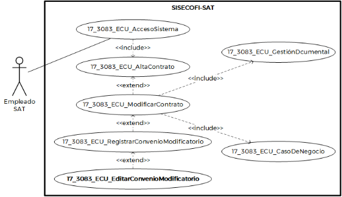
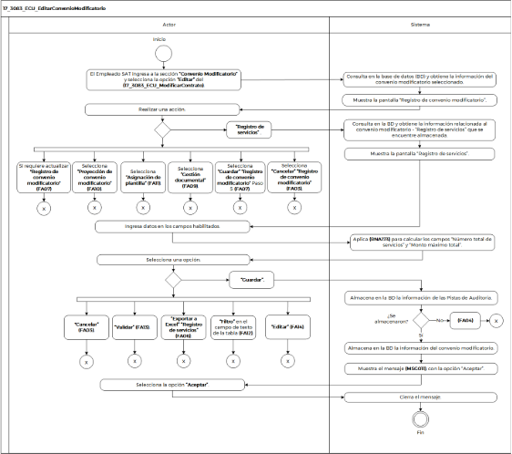

||Administración General de Comunicaciones y Tecnologías de la Información|
| :- | -: |
||Marco Documental 7.0|
|
Fecha de aprobación del Template:

02/08/2023
|
**Especificación del Caso de Uso**

17\_3083\_ECU\_EditarConvenioModificatorio.docx
|Versión del template: 7.00|
| :-: | :-: | :-: |

**<ID Requerimiento>** 8309

**Nombre del Requerimiento: **TI\_SISECOFI-SAT\_Seguimiento financiero y control documental de proyectos de contratación

**Tabla de Versiones y Modificaciones**

|Versión|Descripción del cambio|Responsable de la Versión|Fecha|
| :-: | :- | :-: | :-: |
|*1*|*Creación del documento*|Eric Hector Pérez Pérez|*05/04/2024*|
|*1.1*|*Revisión del documento*|Luis Angel Olguin Castillo|*03/05/2024*|
|*1.2*|*Versión aprobada para firma*|
María del Carmen Castillejos Cárdenas

Rubén Delgado Ramírez
|*28/05/2024*|

**Tabla de Contenido**

[17_3083_ECU_EditarConvenioModificatorio	2](#_toc165300778)

[1. Descripción	2](#_toc165300779)

[2. Diagrama del Caso de Uso	2](#_toc165300780)

[3. Actores	2](#_toc165300781)

[4. Precondiciones	2](#_toc165300782)

[5. Post condiciones	3](#_toc165300783)

[6. Flujo primario	3](#_toc165300784)

[7. Flujos alternos	6](#_toc165300785)

[8. Referencias cruzadas	19](#_toc165300786)

[9. Mensajes	19](#_toc165300787)

[10. Requerimientos No Funcionales	20](#_toc165300788)

[11. Diagrama de actividad	22](#_toc165300789)

[12. Diagrama de estados	23](#_toc165300790)

[13. Aprobación del cliente	23](#_toc165300791)

### ****17\_3083\_ECU\_EditarConvenioModificatorio

|<h3>**1. Descripción** </h3>|
| :- |
|

El objetivo de este Caso de Uso es permitir al Empleado SAT editar y consultar convenios modificatorios relacionado a un contrato.

|
|<h3>**2. Diagrama del Caso de Uso**</h3>|
|

|
|<h3>**3. Actores** </h3>|
||

|**Actor**|**Descripción**|
| :-: | :-: |
|**Empleado SAT**|El Empleado SAT es el que tiene el o los roles otorgados por la Administración Central de Seguridad, Monitoreo y Control (ACSMC) para ingresar a cada uno de los módulos de este sistema.|

|

|
| :- |
|<h3>**4. Precondiciones**</h3>|
|

- El Empleado SAT se ha autenticado en el sistema con e.firma válida.

- El sistema ha consumido el servicio “Oauth” para obtener los datos del Empleado SAT que ingresa.

- El sistema ha validado que el Empleado SAT cuenta con los roles para ingresar o editar “Convenio Modificatorio”.

- El Empleado SAT ha ingresado al módulo "Convenio Modificatorio".

- El Empleado SAT ha seleccionado un contrato y un convenio modificatorio.

&emsp;
|
|<h3>**5. Post condiciones** </h3>|
|

El Empleado SAT: 

- Registró servicios.

- Cargó y/o consultó una proyección para el convenio modificatorio.

- Descargó el documento del *layout* del "Convenio Modificatorio".

- Realizó la carga de información en la “Gestión documental”.

- Consultó información de un convenio modificatorio. 

|
|<h3>**6. Flujo primario**</h3>|
||

|**Actor**|**Sistema**|
| :-: | :-: |
|
1. El Caso de Uso inicia cuando el Empleado SAT ingresa a la sección **“Convenio Modificatorio”** y selecciona la opción **“Editar”** del **(17\_3083\_ECU\_ModificarContrato)**.

- En caso de haber seleccionado la opción **“Ver detalle”**, aplica **(RNA167)**.

|
2. Consulta en la base de datos (BD) y obtiene la información del convenio modificatorio seleccionado:

&emsp;

- Última modificación

- Número de convenio

- Tipo de convenio

- Fecha de firma

- Fecha fin de servicio

- Fecha fin de contrato con CM

- Cálculo de días naturales

- Incremento

- Subtotal

- IVA

- Impuestos

- Tipo de cambio

- Monto máximo del contrato con CM sin impuestos

- Monto máximo del contrato con CM con impuestos

- Monto en pesos

- Comentarios
|
||
3. Muestra la pantalla “Registro de convenio modificatorio” con los siguientes criterios de registro. Aplica las reglas de negocio **(RNA163)** y **(RNA253)**.

&emsp;

Campo: 

- Última modificación

&emsp;

Sección: Registro de convenio modificatorio

Campos:

- Número de convenio\*

- Tipo de convenio\*

- Fecha de firma\*

- Fecha fin de servicio\*

- Fecha fin de contrato con CM\*

- Cálculo de días naturales\*

- Incremento\*

- Subtotal\*

- IVA\*

- Impuestos\*

- Tipo de cambio\*

- Monto máximo del contrato con CM sin impuestos\*

- Monto máximo del contrato con CM con impuestos\*

- Monto en pesos\*

- Comentarios

Opciones. Aplica la **(RNA246)**:

- Cancelar

- Guardar

Secciones: 

- Registro de servicios

- Proyección de convenio modificatorio

- Asignación de plantilla 

- Gestión documental

&emsp;

Ver

**(17\_3083\_EIU\_EditarConvenioModificatorio)** Estilos 04.
|
|
4. Selecciona la sección **“Registro de servicios”** y continúa en el flujo.

&emsp;

- Si requiere actualizar la sección **“Registro de convenio modificatorio”** continúa en el flujo alterno **([**FA07**](#fa07))**.

- Selecciona la sección **“Proyección de convenio modificatorio”** continúa en el **([**FA10**](#fa10))**.

- Selecciona la sección **“Asignación de plantilla”** y continúa en el **([**FA11**](#fa11))**.

- Selecciona la sección **“Gestión documental”** y continúa en el **([**FA09**](#fa09))**.

- Selecciona la opción **“Guardar”** de la sección **“Registro de convenio modificatorio”** continúa en el paso [**5**](#_ref167874669) del **([**FA07**](#fa07))**.

- Selecciona la opción **“Cancelar”** de la sección **“Registro de convenio modificatorio”** y continúa en el **([**FA03**](#fa03))**.
|
5. Consulta en la BD y obtiene la información relacionada al convenio modificatorio - “Registro de servicios” que se encuentre almacenada.

Sección Registro de servicios

Campos:

- Id

- Tipo de consumo

- Concepto de servicio

- Número de servicios máximos

- Monto máximo

- Precio unitario

- Compensación (Número de servicios)

- Compensación (Monto)

- Incremento (Número de servicios)

- Incremento (Monto)

- Número total de servicios

- Monto máximo total

- Aplica IEPS

|
||
6. Muestra la pantalla “Registro de servicios” con los siguientes criterios, de acuerdo con las reglas de negocio **(RNA172)** y **(RNA165)**:

&emsp;

`      `Tabla:

- Id

- Tipo de consumo

- Concepto de servicio

- Número de servicios máximos

- Monto máximo

- Precio unitario

- Compensación (Número de servicios)

- Compensación (Monto)

- Incremento (Número de servicios)

- Incremento (Monto)

- Número total de servicios

- Monto máximo total

- Aplica IEPS

- Acciones

`       `Íconos:

- Editar

- Exportar a Excel ![ref1]

Botones:

- Validar 

- Cancelar 

- Guardar

&emsp;

Ver

**(17\_3083\_EIU\_EditarConvenioModificatorio)** Estilos 01.
|
|7. Ingresa datos en los campos habilitados.|8. Aplica **(RNA173)** para calcular los campos “Número total de servicios” y “Monto máximo total”.|
|
9. Selecciona la opción **“Guardar”** y continúa en el flujo.

&emsp;

- Si selecciona la opción **“Cancelar”**,** continúa en el flujo alterno **([**FA03**](#fa03))**.

- Si selecciona la opción **“Validar”**,** continúa en el flujo alterno **([**FA13**](#fa13))**.

- Si selecciona la opción **“Exportar a Excel”**, de la tabla **“Registro de servicios”**, continúa en el **([**FA06**](#fa06))**.

- En caso de requerir aplicar el **“Filtro”** en el campo de texto de la tabla, continúa en el **([**FA12**](#fa12))**.

- Si selecciona la opción **“Editar”**,** continúa en el **([**FA14** ](#fa14))**.
|
10. Almacena en la BD las Pistas de Auditoría.

&emsp;

&emsp;Datos que se almacenan:

**Módulo =** Contrato-CM-RegistrodeServicios

**Fecha y Hora**= Fecha y hora del sistema, usando el formato DD/MM/AAAA HH:MM:SS

**RFC Usuario**= RFC largo del Empleado SAT que ingresó al sistema.

**Tipo de movimiento**= **INSR** (Insertar) o **UPDT** (Modificar) según corresponda

**Movimiento**= Aplica la **(RNA239)**

- Id contrato

-Id de convenio modificatorio

- Id registro de servicio

- En caso de que no se puedan almacenar las Pistas de Auditoría, continúa en el **([**FA04**](#fa04))**.
|
||
11. Almacena en la BD la siguiente información del convenio modificatorio y aplica la regla **(RNA247)**.

&emsp;

- Id

- Tipo de consumo

- Concepto de servicio

- Número de servicios máximos

- Monto máximo

- Precio unitario

- Compensación (Número de servicios)

- Compensación (Monto)

- Incremento (Número de servicios)

- Incremento (Monto)

- Número total de servicios

- Monto máximo total

- Aplica IEPS
|
||12. Muestra el mensaje **([**MSG011**](#msg011))**,** con la opción** “Aceptar”.|
|13. Selecciona la opción **“Aceptar”**.|14. Cierra el mensaje.|
||15. Fin del Caso de Uso.|

|

|
| :- |
|<h3>**7. Flujos alternos** </h3>|
|

**FA01 La estructura del *layout* no es la misma de la opción “Descargar layout"**
|

|**Actor**|**Sistema**|
| :-: | :-: |
||1. El **FA01** inicia cuando la estructura del *layout* no es la misma de la opción “Descargar layout”. |
||2. Muestra el **([**MSG005**](#msg005))** con la opción “Aceptar”.|
|3. Selecciona la opción **“Aceptar”**.|4. Cierra el mensaje.|
||5. Continúa en el paso [**4**](#_ref167874280) del **([**FA10**](#fa10))**.|

|

**FA02 No se ingresaron los datos obligatorios**
|
| :- |

|**Actor**|**Sistema**|
| :-: | :-: |
||1. El **FA02** inicia cuando el sistema identifica que no se ingresaron los datos obligatorios.|
||2. Muestra en rojo los campos pendientes de capturar.|
||
3. Muestra el mensaje **([**MSG001**](#msg001))**, con la opción “Aceptar”.

&emsp;
|
|4. Selecciona la opción **“Aceptar”**.|5. Cierra el mensaje. |
||
6. Continúa con lo siguiente:

- Si se invoca en el paso 6 del **([**FA07**](#fa07))**, continua en el paso **[**3**](#_ref164503790)** del **([**FA07**](#fa07))**.

- Si se invoca en el paso 9 del **([**FA11**](#fa11))**, continua en el paso [**7**](#_ref167962932) del **([**FA11**](#fa11))**.
|

|

**FA03 Selecciona la opción “Cancelar” o “Descartar”**
|
| :- |

|**Actor**|**Sistema**|
| :-: | :-: |
|1. El **FA03** inicia cuando el Empleado SAT selecciona la opción **“Cancelar”** o **“Descartar”**.|2. Muestra el **([**MSG004**](#msg004))** con** las opciones “Sí” y “No”.|
|
3. Selecciona la opción **“Sí”** y continúa en el flujo.

&emsp;

- En caso de seleccionar **“No”**,** continúa en el paso [**6**](#_ref165014932) de este flujo.
|4. Cierra el mensaje.|
||5. Inicializa los campos de la pantalla en donde se selecciona la opción dejándolos sin cambios, no almacena ninguna información.|
||6. Regresa al punto de acción donde fue invocado.|

|

**FA04 No se pueden almacenar las Pistas de Auditoría**
|
| :- |

|**Actor**|**Sistema**|
| :-: | :-: |
||1. El **FA04** inicia cuando interviene un evento ajeno y no se pueden almacenar las Pistas de Auditoría. |
||2. Cancela la operación sin completar el movimiento que estaba en proceso.|
||
3. Muestra el mensaje de acuerdo con lo siguiente:

- Si la Pista de Auditoría es por el tipo de movimiento **UPDT** o **INSR**, se muestra el **([**MSG006**](#msg006))**.

&emsp;

- Si la Pista de Auditoría es por el tipo de movimiento **CNST**, se muestra el **([**MSG007**](#msg007))**.

- En caso de que la Pista de Auditoría es por el tipo de movimiento **PRNT**, se muestra el **([**MSG008**](#msg008))**.

&emsp;

- Si la Pista de Auditoría es por el tipo de movimiento **DLT**, se muestra el **([**MSG017**](#msg017))**.

Cada mensaje se muestra con la opción “Aceptar”.
|
|4. Selecciona la opción **“Aceptar”**.|5. Cierra el mensaje.|
||7. Regresa al paso previo que detona la acción de la pista de auditoría. |

|

**FA05 Selecciona “Descargar layout”**
|
| :- |

|**Actor**|**Sistema**|
| :-: | :-: |
|1. El **FA05** inicia cuando el Empleado SAT selecciona la opción **“Descargar layout”**.|
2. Construye el *layout* con base en la **(RNA169)**.

|
||
3. Almacena en la BD la información de las Pistas de Auditoría.

&emsp; 

&emsp;Datos que se almacenan:

**Módulo**= Contrato-CM-Proyección

**Fecha y Hora**= Fecha y hora del sistema, usando el formato DD/MM/AAAA HH:MM:SS

**RFC Usuario**= RFC largo del Empleado SAT que ingresó al sistema.

**Tipo de movimiento**= **PRNT** (Imprimir)

**Movimiento**= Aplica la **(RNA239)**.

- Id Convenio modificatorio

&emsp;- Id Concepto de servicio

&emsp;&emsp;

16. En caso de que no se puedan almacenar las Pista de Auditoría, continúa en el **([**FA04**](#fa04))**.
|
||4. Genera un archivo de Excel con extensión (.xlsx) que contenga la información obtenida.|
||5. Descarga el archivo de Excel con extensión (.xlsx).|
||
6. Continúa con lo siguiente:

17. Si se invoca en el paso 5 del **([**FA10**](#fa10))**, continua en el paso [**6**](#_ref165016820) del **([**FA10**](#fa10))**.
|

|

**FA06 Selecciona la opción “Exportar a Excel”**
|
| :- |

|**Actor**|**Sistema**|
| :-: | :-: |
|1. El **FA06** inicia cuando el Empleado SAT selecciona la opción **“Exportar a Excel”**.|
2. Almacena en la BD la información de las Pistas de Auditoría.

&emsp; 

&emsp;Datos que se almacenan:

**Módulo**= Contrato-CM-Sección en la que fue invocado

**Fecha y Hora**= Fecha y hora del sistema, usando el formato DD/MM/AAAA HH:MM:SS

**RFC Usuario** = RFC largo del Empleado SAT que ingresó al sistema.

**Tipo de movimiento**= **PRNT** (Imprimir)

**Movimiento**= Aplica la **(RNA239)**

- Id convenio modificatorio

&emsp;- Id contrato

&emsp;- Id sección en la que fue invocado

- En caso de que no se puedan almacenar las Pista de Auditoría, continúa en el **([**FA04**](#fa04))**.
|
||
3. Obtiene la información de la sección conforme a lo siguiente:

- Si se invocó en el paso [**9**](#_ref167873856) del Flujo principal conforme a la **(RNA166)**.

- Si se invocó en el paso [**5**](#_ref165016820) del **(FA10)** conforme a la **(RNA166)**.
|
||4. Genera un archivo de Excel con extensión (.xlsx) que contenga la información obtenida.|
||5. Descarga el archivo de Excel con extensión (.xlsx).|
||
6. Fin de Caso de Uso.

	
|

|

**FA07 Modificar la sección “Registro de convenio modificatorio”**
|
| :- |

|**Actor**|**Sistema**|
| :-: | :-: |
|1. El **FA07** inicia cuando el Empleado SAT requiere actualizar los datos del “**Registro de convenio modificatorio**”.|
2. Despliega la pantalla “Registro de convenio modificatorio” y presenta la información obtenida del convenio modificatorio seleccionado: 

Campo: 

- Última modificación

&emsp;

Sección: “Registro de convenio modificatorio”

- Número de convenio\*

- Tipo de convenio\*. Aplica la **(RNA163)**

&emsp;- Alcance

&emsp;- Monto

&emsp;- Tiempo

&emsp;- Administrativo

- Fecha de firma\*

- Fecha fin de servicio\*

- Fecha fin de contrato con CM\*

- Cálculo de días naturales\*

- Incremento\*

- Subtotal\*

- IVA\*

- Impuestos\*

- Tipo de cambio\*

- Monto máximo del contrato con CM sin impuestos\*

- Monto máximo del contrato con CM con impuestos\*

- Monto en pesos\*

- Comentarios

Opciones. Aplica la **(RNA246)**:

- Cancelar

- Guardar

&emsp;

Secciones colapsadas: 

- Registro de servicios

- Proyección de convenio modificatorio

- Asignación de plantilla 

- Gestión documental

Ver

**(17\_3083\_EIU\_EditarConvenioModificatorio)** Estilos 04.
|
|
3. Modifica los valores de alguno de los siguientes datos: 

&emsp;

- Número convenio

- Tipo de convenio(s) seleccionado

- Fecha de firma

- Fecha fin de servicio

- Fecha fin de contrato con CM

- Incremento

- IVA

- Tipo de cambio

- Comentarios
|4. Aplica **(RNA164)** para calcular los campos inhabilitados de acuerdo con el “Tipo de convenio” seleccionado.|
|
5. Selecciona la opción **“Guardar”** y continúa en el flujo.

&emsp;

- En caso de que se seleccione la opción **“Cancelar”**, continúa en el **([**FA03**](#fa03))**.
|
6. Valida que se hayan capturado los datos obligatorios de acuerdo con la **(RNA03)**.

&emsp;

- En caso contrario, continúa en el **([**FA02**](#fa02))**.
|
||
7. Almacena en la BD la información de las Pistas de Auditoría.

&emsp;

&emsp;` `Datos que se almacenan:

**Módulo**= Contrato-CM-Sección en la que fue invocado

**Fecha y Hora**= Fecha y hora del sistema, usando el formato DD/MM/AAAA HH:MM:SS

**RFC Usuario** = RFC largo del Empleado SAT que ingresó al sistema.

**Tipo de movimiento**= **UPDT** (Modificar)

**Movimiento**= Aplica la **(RNA239)**

- Id convenio modificatorio

&emsp;- Id contrato

&emsp;- Id sección en la que fue invocado

&emsp;&emsp;

- En caso de que no se puedan almacenar las Pistas de Auditoría, continúa en el **([\[**FA04**\](#fa04)**)**](#fa06)**.
|
||
8. Almacena en la BD las modificaciones de los campos. Aplica la **(RNA247)**:

&emsp;

- Número convenio

- Tipo de convenio(s) seleccionado

- Fecha de firma

- Fecha fin de servicio

- Fecha fin de convenio

- Cálculo de días naturales

- Incremento

- Subtotal

- IVA

- Impuestos

- Tipo de cambio

- Monto máximo del contrato con CM sin impuestos

- Monto máximo del contrato con CM con impuestos

- Monto en pesos

- Comentarios
|
||9. Muestra el **([**MSG011**](#msg011))** con la opción** “Aceptar”.|
|10. Selecciona la opción **“Aceptar”**.|11. Cierra el mensaje.|
||12. Continúa en el paso [**4**](#_ref167872944) del Flujo primario.|

|

**FA08 Existe una proyección previamente cargada**
|
| :- |

|**Actor**|**Sistema**|
| :-: | :-: |
||1. El **FA08** inicia cuando existe una proyección previamente cargada.|
||2. Muestra el **([**MSG009**](#msg009))** con las opciones “Sí” y “No”.|
|
3. Selecciona una opción.

- Si selecciona la opción **“No”**, el flujo continúa.

&emsp;

- Si selecciona la opción **“Sí”**, continúa en el paso [**5**](#_ref163999691) de este flujo.
|4. Cierra el mensaje, y continúa en el paso **[**4**](#_ref167874280)** del **([**FA10**](#fa10))**.|
||5. Cierra el mensaje, y continúa en el paso **[**11**](#_ref167894319)** del **([**FA10**](#fa10))**.|

|

**FA09 Selección “Gestión documental”**
|
| :- |

|**Actor**|**Sistema**|
| :-: | :-: |
|1. El **FA09** inicia cuando el Empleado SAT selecciona la sección **“Gestión documental”**.|
2. Direcciona al documento “Gestión documental”.

Ver

**(17\_3083\_EIU\_GestionDocumental)** Estilos 01.
|

|

**FA10 Selección “Proyección de convenio modificatorio”**
|
| :- |

|**Actor**|**Sistema**|
| :-: | :-: |
|1. El **FA10** inicia cuando el Empleado SAT selecciona la sección **“Proyección de convenio modificatorio”**.|2. Consulta en la base de datos (BD) y obtiene la información de la “Proyección de convenio modificatorio”.|
||
3. Despliega la pantalla “Proyección de convenio modificatorio”.

&emsp;

&emsp;Opciones:

- Descargar layout 

- Archivo proyección

- Examinar

- Procesar proyección

- Descargar ![ref1]

&emsp;

Tabla (Proyección de convenio modificatorio). Aplica la regla de negocio **(RNA244)**.

- Conceptos de servicio

- mm1-a1

- mmn-an. Aplica la **(RNA80)**.

Ver **(17\_3083\_EIU\_EditarConvenioModificatorio)** Estilos 02.
|
|
4. Selecciona la opción **“Examinar”** y el continúa en el flujo.

- En caso de que seleccione la opción **“Descargar layout”**, continúa en el **([**FA05**](#fa05))**.

&emsp;

- En caso de que seleccione la opción **“Exportar a Excel”**, de la tabla **“Proyección de convenio modificatorio”**, continúa en el **([**FA06**](#fa06))**.

&emsp;

- En caso de requerir aplicar el **“Filtro”** en el campo de texto de la columna **“Conceptos de servicio”**, de la tabla, continúa en el **([**FA12**](#fa12))**.
|5. Abre el gestor de archivos del equipo de cómputo del Empleado SAT. |
|
6. Selecciona el archivo de Excel con extensión (.xlsx).

	
|7. Muestra el nombre del archivo seleccionado en el campo “Archivo de proyección”.|
|8. Selecciona la opción **“Procesar proyección”**.|
9. Valida sí existe una proyección previamente cargada.

&emsp;

- En caso de no existir una proyección cargada, el flujo continúa.

- En caso de existir una proyección previamente cargada, continúa en el **([**FA08**](#fa08))**.
|
||
10. ` `Valida que la estructura del *layout* seleccionado sea la misma que la estructura del *layout* de la opción “Descargar layout”, acorde con la **(RNA80)**, y el flujo continúa.

&emsp;

- En caso de que la estructura del *layout* no sea igual, continúa en el **([**FA01**](#fa01))**.
|
||
11. Valida que la suma de unidades de cada concepto de servicio de tipo “Volumetría” sea menor o igual al “Número total de servicios”, de acuerdo con la **(RNA231)** y** el flujo continúa.

- En caso de no cumplir con la validación, continúa en el **([**FA16**](#fa16))**.
|
||
12. Almacena en la BD la información de las Pistas de Auditoría.

&emsp;

&emsp;Datos que se almacenan:

**Módulo**= Contrato-CM-Proyección

**Fecha y Hora**= Fecha y hora del sistema, usando el formato DD/MM/AAAA HH:MM:SS

**RFC Usuario** = RFC largo del Empleado SAT que ingresó al sistema.

**Tipo de movimiento**= 

**INSR** (Insertar), **UPDT** (Modificar), **DLT** (Borrar) según corresponda** 

**Movimiento**= Aplica la **(RNA239)**

- Id convenio modificatorio

&emsp;- Id concepto de servicio

&emsp;- Carga masiva

- En caso de que no se puedan almacenar las Pistas de Auditoría, continúa en el **([**FA04**](#fa04))**.
|
||
13. Almacena en la BD la información del *layout*. Aplica la **(RNA247)**.

&emsp;

- Conceptos de servicio

- mm1-a1 

- mmn-an. Aplica la **(RNA80)**.
|
||14. Muestra el **([**MSG002**](#msg002))** con la opción** “Aceptar”.|
|
15. Selecciona la opción **“Aceptar”**.

	
|16. Cierra el mensaje.|
||
17. Muestra en la pantalla la información cargada en la tabla “Proyección de caso de negocio”. Aplica la **(RNA244)**.

- Conceptos de servicio

- mm1-a1 

- mmn-an. Aplica la **(RNA80)**.
|
||18. Fin del Caso de Uso.|

|

**FA11 Selecciona la opción “Asignación de plantilla”**
|
| :- |

|**Actor**|**Sistema**|
| :-: | :-: |
|1. El **FA11** inicia cuando el Empleado SAT selecciona la sección **“Asignación de plantilla”**.|2. Consulta en la BD las plantillas asociadas a la fase de “Ejecución”.|
||
3. Consulta en la BD y obtiene la información de la sección “Asignación de plantilla” que se encuentre almacenada.

&emsp;

- Asignar plantilla
|
||
4. Despliega la sección y presenta la información obtenida de “Asignación de plantilla” en los siguientes campos:

&emsp;

- Asignar plantilla\*

Opciones:

- Nuevo

- Eliminar 

- Cancelar

- Guardar

&emsp;

Ver

**(17\_3083\_EIU\_EditarConvenioModificatorio)** Estilos 03.
|
|
5. Selecciona la opción **“Nuevo”**.

&emsp;

- Si requiere modificar alguno de los datos almacenados continúa en el paso 7.
|6. Muestra una lista de selección nueva para el campo “Asignar plantilla”.|
|
7. Captura. los datos de **“Asignación de plantilla”**.

&emsp;

- Asignar plantilla
||
|
8. Selecciona la opción **“Guardar”** y continúa en el flujo.

&emsp;

- En caso de que seleccione la opción **“Cancelar”** continúa en el **([**FA03**](#fa03))**.

- Si selecciona la opción **“Eliminar”**, para un registro ya almacenado, continúa en el **([**FA17**](#fa17))**.

- Si selecciona la opción **“Eliminar”**, para un registro nuevo, continúa en el **([**FA03**](#fa03))**.
|
9. Valida que se hayan ingresado todos los datos obligatorios, conforme a la **(RNA03)**.

&emsp;

- Si se identifica que no se ingresaron todos los datos obligatorios, continúa en el **([**FA02**](#fa02))**.
|
||
10. Almacena en la BD las Pistas de Auditoría.

&emsp;

&emsp;Datos que se almacenan:

**Módulo**= Contrato-CM-Asignación de plantilla

**Fecha y Hora**= Fecha y hora del sistema, usando el formato DD/MM/AAAA HH:MM:SS

**RFC Usuario** = RFC largo del Empleado SAT que ingresó al sistema.

**Tipo de movimiento**= **INSR** (Insertar), **UPDT** (Modificar), **DLT** (Borrar) según corresponda

**Movimiento**= Aplica la **(RNA239)**

- Id convenio modificatorio

&emsp;- Asignar plantilla

&emsp;&emsp;

- En caso de que no se puedan almacenar las Pistas de Auditoría, continúa en el **([**FA04**](#fa04))**.
|
||11. Se almacenan en la BD los datos que hayan sido actualizados. Aplica la **(RNA247)**.|
||12. Muestra el **([**MSG014**](#msg014))** con la opción “Aceptar”.|
|13. Selecciona la opción **“Aceptar”**.|14. Cierra el mensaje.|
||15. Continúa en el paso [**4**](#_ref167872944) del Flujo primario.|

|

**FA12 Selecciona la opción “Filtrar”**
|
| :- |

|**Actor**|**Sistema**|
| :-: | :-: |
|
1. El **FA12** inicia cuando el Empleado SAT requiere **“Filtrar”** la información en alguna columna de acuerdo con lo que se muestra en la tabla.

||
|2. Elige la columna para filtrar e ingresa el dato a buscar.|3. Busca dentro de la columna y filtra la información mostrada de acuerdo con los caracteres ingresados en el campo.|
||4. Muestra en tiempo real todas las coincidencias que obtiene de dicha columna.|
||
5. Realiza lo siguiente: 

&emsp;

- Si fue invocado en el Flujo primario, continúa en el paso [**9**](#_ref167873856) de dicho flujo. 

- Si fue invocado en el **([**FA10**](#fa10))**, continúa en el paso [**4**](#_ref167874280)** de dicho flujo. 

&emsp;
|

|

**FA13 Opción “Validar”**
|
| :- |

|**Actor**|**Sistema**|
| :-: | :-: |
|
1. El **FA13** inicia cuando el Empleado SAT selecciona la opción **“Validar”**.

|
2. Valida que el campo “Monto máximo de contrato con CM sin impuestos” de este convenio sea menor e igual a la suma del “Monto máximo total” de los servicios de acuerdo con la **(RNA175)**.

&emsp;

- En caso de que el punto no sea válido continua en el **([**FA15**](#fa15))**.

|
||3. Muestra el **([**MSG003**](#msg003))** con la opción** “Aceptar”.|
|19. Selecciona la opción **“Aceptar”**.|4. Cierra el mensaje.|
||5. Regresa al paso [**9**](#_ref167873856) del Flujo primario.|

|

**FA14 Selecciona la opción “Editar” de la sección “Registro de servicios”**
|
| :- |

|**Actor**|**Sistema**|
| :-: | :-: |
|
1. El **FA14** inicia cuando el Empleado SAT selecciona la opción **“Editar”** de la sección **“Registro de servicios”**.

|2. Muestra los siguientes criterios para editar de acuerdo con las **(RNA172)** y **(RNA165)** y cambia la propiedad de esos campos de edición.|
||
3. Cambias las acciones de la tabla por las siguientes:

&emsp;

- Descartar

Ver

**(17\_3083\_EIU\_EditarConvenioModificatorio)** Estilos 05.
|
|
4. Modifica los datos y continúa en el flujo.

&emsp;

- En caso de que seleccione la opción **“Descartar”** del registro seleccionado continúa en el **([**FA03**](#fa03))**.
|5. Regresa al punto de acción donde fue invocado.|

|

**FA15 Validación del “Registro de servicios” incorrecta**
|
| :- |

|**Actor**|**Sistema**|
| :-: | :-: |
||
1. El **FA15** inicia cuando el sistema identifica que no se validaron los datos de “Registro de servicios”, acuerdo con la  **(RNA175)**.

|
||2. Muestra el mensaje **([**MSG012**](#msg012))**, con la opción “Aceptar”.|
|3. Selecciona la opción **“Aceptar”**.|4. Cierra el mensaje.|
||5. Regresa al paso [**9**](#_ref167873856) del Flujo primario.|

|

**FA16 Validación de suma de unidades de cada concepto de servicio**
|
| :- |

|**Actor**|**Sistema**|
| :-: | :-: |
||1. El **FA16** inicia cuando la suma de unidades de cada concepto de servicio establecida en el *layout* de carga es mayor al “Número total de servicios”, de la sección “Registro de servicios”.|
||2. Muestra el **([**MSG013**](#msg013))**, con la opción “Aceptar”.|
|3. Selecciona la opción **“Aceptar”**.|4. Cierra el mensaje.|
||5. Continúa en el paso  **[**4**](#_ref167874280)** del **([**FA10**](#fa10))**.|

|

**FA17 Selecciona la Opción “Eliminar”**
|
| :- |

|**Actor**|**Sistema**|
| :-: | :-: |
|1. El **FA17** inicia cuando el Empleado SAT selecciona la opción **“Eliminar”**.|2. El sistema mostrará el **([**MSG015**](#msg015))** con las opciones** “Sí” y “No”.|
|
3. Si selecciona la opción **“No”**, continúa en el flujo.

&emsp;

- En caso de que seleccione la opción **“Sí”**, continúa en el paso 5 de este flujo.
|4. Cierra el mensaje y continúa en el flujo de la sección que lo invocó.|
||
5. Valida que el registro no esté relacionado con otro módulo conforme a la **(RNA249)**,** continúa en el paso 9 de este flujo.

&emsp;

- Si el registro está relacionado con otro módulo continúa en el flujo.
|
||6. Muestra el **([**MSG016**](#msg016))** con la opción “Aceptar”.|
|7. Selecciona la opción **“Aceptar”**.|8. Cierra el mensaje y continúa en la sección donde fue invocado.|
||9. Borra el registro seleccionado de la tabla de la sección que fue invocado.|
||10. Regresa al punto de acción donde fue invocado.|

|

|
| :- |
|<h3>**8. Referencias cruzadas** </h3>|
|

- 17\_3083\_CRN\_SeguimientoFinancieroYControl

- 17\_3083\_EIU\_EditarConvenioModificatorio

- 17\_3083\_EIU\_ModificarContratos

- 17\_3083\_EIU\_GestionDocumental

- 17\_3083\_EIU\_RegistrarConvenioModificatorio

|
|<h3>**9. Mensajes** </h3>|
||

|**ID Mensaje**|**Descripción**|
| :-: | :-: |
|**MSG001**|Favor de ingresar los datos obligatorios marcados con un asterisco (\*).|
|**MSG002**|Se cargó la proyección al convenio modificatorio.|
|**MSG003**|El “Monto máximo del contrato con CM sin impuestos” coincide con el “Monto máximo total” de los servicios.|
|**MSG004**|Se perderá la información ingresada. ¿Está seguro de cancelar?|
|**MSG005**|El *layout* de carga no contiene la estructura requerida, favor de verificar.|
|**MSG006**|Ocurrió un error al guardar el registro, favor de intentar nuevamente (PA01).|
|**MSG007**|Ocurrió un error al consultar la información, favor de intentar nuevamente (PA01).|
|**MSG008**|Ocurrió un error al exportar la información, favor de intentar nuevamente (PA01).|
|**MSG009**|Existe una proyección previamente cargada, ¿desea actualizarla?|
|**MSG010**|El convenio modificatorio fue actualizado exitosamente.|
|**MSG011**|Se guardo correctamente la información.|
|**MSG012**|El “Monto máximo del contrato con CM sin impuestos” **no** coincide con el “Monto máximo total” de los servicios.|
|**MSG013**|Verifique el *layout* de carga, ya que la línea(s) [Concepto de servicio] sobrepasa el “Número total de servicios”.|
|**MSG014**|Se guardó correctamente la información.|
|**MSG015**|Se eliminará el registro seleccionado. ¿Desea continuar?|
|**MSG016**|El registro no se puede eliminar porque se encuentra relacionado en otro módulo.|
|**MSG017**|Ocurrió un error al eliminar la información, favor de intentar nuevamente (PA01).|

|

|
| - |
|<h3>**10. Requerimientos No Funcionales** </h3>|

||
| :- |

|**ID de RNF**|**Requerimiento No Funcional**|**Descripción**|
| :-: | :-: | :-: |
|**RNF001**|Disponibilidad|El sistema deberá estar activo las 24 horas del día, los 365 días del año con picos de operación en el horario de 9:00 a 18:00 horas. |
|**RNF002**|Concurrencia|
El número de Empleados SAT que puede tener el sistema son 150. 

El número máximo de accesos concurrentes que debe soportar este sistema son máximo 30 Empleados SAT. 
|
|**RNF003**|Seguridad|El acceso solo podrá ser otorgado al Empleado SAT que tenga los roles asignados por la Administración Central de Seguridad, Monitoreo y Control (ACSMC) para cada módulo de este sistema. |
|**RNF004**|Usabilidad|
El sistema deberá manejar los siguientes elementos para facilitar la navegación: 

- Mensajes tipo flotantes (*tooltips*) con información de la herramienta que ofrece ayuda contextual como guía para el Empleado SAT. 

- Componente de ordenamiento que permita acomodar la información de la tabla de forma ascendente o descendente, considerando la columna donde es seleccionado. 

- Contar con un diseño responsivo que permita su óptima visualización en distintos tipos de dispositivos finales. 

&emsp;
|
|**RNF005**|Eficiencia|Las consultas se dividen en generales y detalladas, para que las detalladas carguen la información solo cuando sean requeridas por el Empleado SAT. |
|**RNF006**|Usabilidad|
El Empleado SAT podrá navegar a través de las páginas resultantes de la consulta considerando que el sistema debe mostrar inicialmente 15 registros por página, permitiendo al Empleado SAT seleccionar los registros que requiere visualizar, teniendo las opciones 15, 50 y 100: 

 

- Ir a la primera página (debe mostrar la primera página con el resultado de la consulta). 

- Ir a la última página (debe mostrar la última página con el resultado de la consulta). 

- Ir a la siguiente página (debe mostrar la siguiente página considerando la actual, con el resultado de la consulta y el número de registros seleccionados por el Empleado SAT). 

- Ir a la página anterior (debe mostrar la página anterior considerando la actual, con el resultado de la consulta). 

 

En la tabla deben mostrarse los registros ordenados alfabéticamente.
|
|**RNF007**|Seguridad|Las Pistas de Auditoría deben estar protegidas contra accesos no autorizados. Solo los Empleados SAT autorizados pueden consultarlas, y la información en ellas se definirá durante la etapa de diseño, la cual debe estar cifrada para mantenerla confidencial y evitar exposiciones no autorizadas. |
|**RNF008**|Usabilidad|
Usabilidad, El Empleado SAT podrá navegar a través de las páginas resultantes del documento PDF. 

- Ir a la siguiente página (debe mostrar la página consecutiva del documento PDF). 

- Ir a la página anterior (debe mostrar la página previa del documento PDF).
|
|**RNF009**|Fiabilidad|El sistema debe ser capaz de manejar excepciones de manera efectiva y presentar mensajes claros y comprensibles para garantizar una adecuada interacción con el sistema.|
|**RNF010**|Seguridad |Mantener la información en pantalla en caso de un error al guardar las pistas de auditoría, siempre y cuando el escenario lo permita. Hay situaciones de infraestructura o de conexión de internet que sí pierde los datos ya que no están controlados por el sistema. |
|**RNF011**|Integridad |Al almacenar la información en la BD de tipo Texto o alfanumérico se deben eliminar los espacios en blanco al inicio y fin de la cadena. |

|

|
| :- |
|<h3>**11. Diagrama de actividad** </h3>|
|

|
|<h3>**12. Diagrama de estados** </h3>|
|

No aplica, no se requiere para este proceso.

|
|<h3>**13. Aprobación del cliente** </h3>|
||

|**FIRMAS DE CONFORMIDAD**||
| :-: | :- |
|**Firma 1** |**Firma 2** |
|**Nombre**: María del Carmen Castillejos Cárdenas.|**Nombre**: Rubén Delgado Ramírez.|
|**Puesto**: Usuaria ACPPI.|**Puesto**: Usuario ACPPI.|
|**Fecha:**|**Fecha:**|
|||
|**Firma 3** |**Firma 4**|
|**Nombre**: Rodolfo López Meneses.|**Nombre**: Diana Yazmín Pérez Sabido.|
|**Puesto**: Usuario ACPPI.|**Puesto**: Usuaria ACPPI.|
|**Fecha:**|**Fecha:**|
|||
|**Firma 5**|**Firma 6**|
|**Nombre**: Yesenia Helvetia Delgado Naranjo.|**Nombre:** Alejandro Alfredo Muñoz Núñez.|
|**Puesto**: APE ACPPI.|**Puesto:** RAPE ACPPI.|
|**Fecha**:|**Fecha**:|
|||
|**Firma 7**|**Firma 8**|
|**Nombre**: Luis Angel Olguin Castillo.|**Nombre**: Erick Villa Beltrán.|
|**Puesto**: Enlace ACPPI.|**Puesto**: Líder APE SDMA 6.|
|**Fecha**:|**Fecha**:|
|||
|**Firma 9**|**Firma 10**|
|**Nombre:** Juan Carlos Ayuso Bautista.|**Nombre:** Eric Hector Pérez Pérez.|
|**Puesto:** Líder Técnico SDMA 6.|**Puesto:** Analista de Sistemas DS SDMA 6.|
|**Fecha**:|**Fecha**:|
|||

||
| :- |

|||Página 3 de 17|
| :- | :-: | -: |

[ref1]: Aspose.Words.bf6c5b44-4900-49d9-850e-76575d145695.004.png
