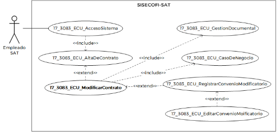
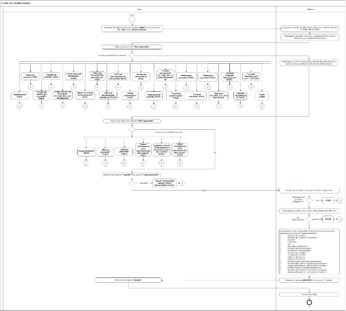
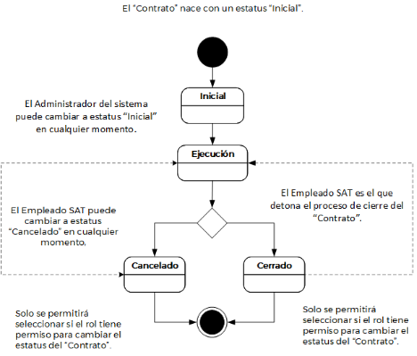

||Administración General de Comunicaciones y Tecnologías de la Información|
| :- | -: |
||Marco Documental 7.0|
|
Fecha de aprobación del Template:

02/08/2023
|
**Especificación del Caso de Uso**

17\_3083\_ECU\_ModificarContrato.docx
|Versión del template: 7.00|
| :-: | :-: | :-: |

**<ID Requerimiento>** 8309

**Nombre del Requerimiento: **TI\_SISECOFI-SAT\_Seguimiento financiero y control documental de contratos de contratación

**Tabla de Versiones y Modificaciones**

|Versión|Descripción del cambio|Responsable de la Versión|Fecha|
| :-: | :- | :-: | :-: |
|*1*|*Creación del documento*|Angel Horacio López Alcaraz|*19/02/2024*|
|*1.1*|*Revisión del documento*|Luis Angel Olguin Castillo|*20/04/2024*|
|*1.2*|*Versión aprobada para firma*|
María del Carmen Castillejos Cárdenas

Rubén Delgado Ramírez
|*28/04/2024*|

**Tabla de Contenido**

[17_3083_ECU_ModificarContrato	2](#_toc165648346)

[1. Descripción	2](#_toc165648347)

[2. Diagrama del Caso de Uso	2](#_toc165648348)

[3. Actores	2](#_toc165648349)

[4. Precondiciones	2](#_toc165648350)

[5. Post condiciones	3](#_toc165648351)

[6. Flujo primario	3](#_toc165648352)

[7. Flujos alternos	9](#_toc165648353)

[8. Referencias cruzadas	53](#_toc165648354)

[9. Mensajes	53](#_toc165648355)

[10. Requerimientos No Funcionales	54](#_toc165648356)

[11. Diagrama de actividad	56](#_toc165648357)

[12. Diagrama de estados	57](#_toc165648358)

[13. Aprobación del cliente	58](#_toc165648359)

### ****17\_3083\_ECU\_ModificarContrato

|<h3>**1. Descripción** </h3>|
| :- |
|

El objetivo de este Caso de Uso es permitir al Empleado SAT la consulta, modificación y exportación de la información contenida en las secciones de un contrato.

|
|<h3>**2. Diagrama del Caso de Uso**</h3>|
|

|
|<h3>**3. Actores** </h3>|
||

|**Actor**|**Descripción**|
| :-: | :-: |
|**Empleado SAT**|El Empleado SAT es el que tiene el o los roles otorgados por la Administración Central de Seguridad, Monitoreo y Control (ACSMC) para ingresar a cada uno de los módulos de este sistema.|

||
| :- |
|<h3>**4. Precondiciones**</h3>|
|
- El Empleado SAT se ha autenticado en el sistema con e.firma válida. 

- El sistema ha consumido el servicio “Oauth” para obtener los datos del Empleado SAT que ingresa. 

- El sistema ha validado que el Empleado SAT cuenta con los roles para ingresar o modificar en el módulo Contratos.

- Se ha seleccionado un contrato.

- Se han registrado proyectos previamente.

- Se han registrado proveedores previamente.

- Se han creado los datos de “Identificación” de un contrato previamente.

&emsp;
|
|<h3>**5. Post condiciones** </h3>|
|

El Empleado SAT:

- Modificó información de un contrato.

- Consultó información de un contrato.

- Exportó información de alguna de las secciones de un contrato.

&emsp;

&emsp;
|
|<h3>**6. Flujo primario**</h3>|
||

|**Actor**|**Sistema**|
| :-: | :-: |
|1. El Caso de Uso inicia cuando el Empleado SAT selecciona la opción **“Editar”** en el proceso de **(17\_3083\_ECU\_AltaDeContrato)**.|
2. Consulta en la base de datos (BD) y obtiene la información del contrato seleccionado:

&emsp;

Sección Identificación

Campos

- Id

- Proyecto asociado

- Estatus

- Nombre del contrato

- Nombre corto del contrato 

- Última modificación
|
||
3. Despliega la pantalla “Contratos” y presenta la información obtenida del contrato seleccionado: 

&emsp;

Campo:

- Última modificación

Sección Identificación:

- Id. Aplica la **(RNA76)**

- Proyecto asociado\*

- Estatus

- Nombre del contrato\*

- Nombre corto del contrato\*

- Última modificación

&emsp;

Opciones. Aplica las **(RNA246)** y **(RNA75)**:

- Cancelar contrato ![ref1]

- Inicial

- Ejecución

- Cancelar

- Guardar

Secciones colapsadas

- Datos generales

- Vigencia y montos

- Grupos de servicio y/o conceptos

- Registro de servicios

- Proyección de caso de negocio

- Cargar *layout* de los informes

- Atraso en el inicio de la prestación

- Informes documentales por única vez

- Informes documentales periódicos

- Informes documentales de los servicios

- Penas contractuales

- Niveles de servicio (SLA)

- Asignación de plantilla

- Gestión documental

- Convenios modificatorios

- Dictámenes asociados

- Facturas asociadas

- Reintegros asociados

- Cierre

Opción

- ` `Regresar

Ver **(17\_3083\_EIU\_ModificarContrato)** Estilos 01.
|
|
4. Selecciona la sección **“Datos generales”** y continúa en el flujo.

&emsp;

- Si requiere actualizar la sección **“Identificación”** del contrato, continúa en el flujo alterno **([**FA01**](#fa01))**.

- Si selecciona la sección **“Vigencia y montos”**, continúa en el **([**FA08**](#fa08))**.

- Si selecciona la sección **“Grupos de servicio y/o conceptos”**, continúa en el **([**FA09**](#fa09))**.

- Si selecciona la sección **“Registro de servicios”**, continúa en el **([**FA10**](#fa10))**.

- Si selecciona la sección **“Proyección de caso de negocio”**, continúa en el **(17\_3083\_ECU\_CasoDeNegocio)**.

- Si selecciona la opción **“Cargar layout de los informes”**, continúa en el **([**FA29**](#fa29))**.

- Si selecciona la sección **“Atraso en el inicio de la prestación”**, continúa en el **([**FA11**](#fa11))**.

- Si selecciona la sección **“Informes documentales por única vez”**, continúa en el **([**FA13**](#fa13))**.

- Si selecciona la sección **“Informes documentales periódicos”**, continúa en el **([**FA14**](#fa14))**.

- Si selecciona la sección **“Informes documentales de los servicios”** continúa en el **([**FA15**](#fa15))**.

- Si selecciona la sección **“Penas contractuales”**, continúa en el **([**FA12**](#fa12))**.

- Si selecciona la sección **“Niveles de servicio (SLA)”**, continúa en el **([**FA16**](#fa16))**.

- Si selecciona la sección **“Asignación de plantilla”**, continúa en el **([**FA17**](#fa17))**.

- Si selecciona la sección **“Gestión documental”**, continúa en el **(17\_3083\_ECU\_GestionDocumental)**.

- Si selecciona la sección **“Convenios modificatorios”**, continúa en el **([**FA22**](#fa22))**.

- Si selecciona la sección **“Dictámenes asociados”**, continúa en el **([**FA23**](#fa23))**.

- Si selecciona la sección **“Facturas asociadas”**, continúa en el **([**FA24**](#fa24))**.

- Si selecciona la sección **“Reintegros asociados”**, continúa en el **([**FA25**](#fa25))**.

- En caso de seleccionar **“Regresar”**, continúa en el **(17\_3083\_ECU\_AltaDeContrato)**.

- Si selecciona la opción **“Cancelar Contrato”** de la sección **“Identificación”**, continúa en el **([**FA34**](#fa34))**.

- Si selecciona la opción **“Cancelar”** de la sección **“Identificación”**, continúa en el **([**FA05**](#fa05))**.

- Si selecciona la opción **“Guardar”** contrato de la sección **“Identificación”**, continúa en el paso [4](#_ref167869609) del **([**FA01**](#fa01))**.

- Si selecciona la opción **“Cierre”**, continúa en el **([**FA26**](#fa26))**.
|
5. Consulta en la BD y obtiene la información del contrato seleccionado:

&emsp;

Sección Datos generales:

- Número de contrato

- Número de contrato CompraNet:

- Acuerdo

- Proveedor(es)

- RFC

- Tipo de procedimiento

- Número de procedimiento

- Convenio de colaboración

- Dominio tecnológico

- Fondeo del contrato

- Objetivo del servicio

- Alcance del servicio

Tabla Participantes en la administración del contrato

- Id

- Responsabilidad

- Administración general

- Administración central

- Nombre del servidor público

- Teléfono

- Correo

- Fecha de inicio

- Fecha de término

- Vigente
|
||
6. Despliega la sección y presenta la información obtenida de la sección “Datos generales” del contrato seleccionado:

&emsp;

- Número de contrato\*

- Número de contrato CompraNet

- Acuerdo

- Proveedor\*

- Nuevo proveedor![ref2]

- RFC

- Eliminar proveedor![ref3]

- Tipo de procedimiento\*

- Número de procedimiento\*

- Convenio de colaboración

- Dominio tecnológico

- Fondeo del contrato\*

- Objetivo del servicio\*

- Alcance del servicio\*

Opciones. Aplica la **(RNA246)**:

- Cancelar

- Guardar

Tabla “Participantes en la administración del contrato”. Aplica la **(RNA244)**

- Id

- Responsabilidad

- Administración general

- Administración central

- Nombre del servidor público

- Teléfono

- Correo

- Fecha de inicio

- Fecha de término

- Vigente

Opciones. Aplica la **(RNA246)**:

- Nuevo participante ![ref2]

- Exportar a Excel 

- Cancelar

- Guardar

Ver **(17\_3083\_EIU\_ModificarContrato)** Estilos 02.
|
|
7. Captura los datos de la sección **“Datos generales”** y continúa en el flujo.

&emsp;

- Número de contrato\*

- Número de contrato CompraNet

- Acuerdo

- Proveedor\*

- RFC

- Tipo de procedimiento\*

- Número de procedimiento\*

- Convenio de colaboración

- Dominio tecnológico

- Fondeo del contrato\*

- Objetivo del servicio\*

- Alcance del servicio\*

- Si selecciona la opción **“Nuevo proveedor”**, continúa en el **([**FA27**](#fa27))**.

- Si selecciona la opción **“Eliminar proveedor”**, para un registro ya almacenado, continúa en el **([**FA27**](#fa27))**.

- Si selecciona la opción **“Eliminar proveedor”**, para un registro nuevo, continúa en el **([**FA05**](#fa05))**. 

- En caso de que seleccione la opción **“Nuevo”** de la tabla de la sección “**Participantes en la Administración del contrato”**, continúa en el **([**FA21**](#fa21))**.

- En caso de que seleccione la opción “**Exportar a Excel”** de la tabla de la sección **“Participantes en la administración del contrato”**, continúa en el **([**FA02**](#fa02))**.

- En caso de que requiera **“Filtrar”** por alguna de las columnas de la tabla de la sección “**Participantes en la Administración del contrato”**, continúa en el **([**FA37**](#fa37))**.

||
|
8. Selecciona la opción **“Guardar”** de la sección **“Datos generales”** y continúa en el flujo.

&emsp;

- En caso de seleccionar **“Cancelar”** de la sección **“Datos generales”**, continúa en el **([**FA05**](#fa05))**.
|
9. Valida que se hayan capturado los datos obligatorios de acuerdo con las reglas de negocio **(RNA01)** y **(RNA03)**.

&emsp;

- En caso contrario, continúa en el **([**FA07**](#fa07))**.
|
||
10. Almacena en la BD las Pistas de Auditoría.

&emsp;

&emsp;Datos que se almacenan:

**Módulo**=** Contratos-Datos generales

**Fecha y Hora**= Fecha y hora del sistema, usando el formato DD/MM/AAAA HH:MM:SS

**RFC Usuario**= RFC largo del Empleado SAT que ingresó al sistema.

**Tipo de movimiento**= **INSR** (Insertar), **UPDT** (Modificar), según corresponda **Movimiento**= Aplica la **(RNA239)**

- Id de contrato

&emsp;

- En caso de que no se puedan almacenar las Pistas de Auditoría, continúa en el **([**FA06**](#fa06))**.
|
||
11. Almacena en la BD la siguiente información que se encuentra capturada en la sección “Datos generales”. Aplica la **(RNA247)**:

&emsp;

- Última modificación

- Número de contrato

- Número de contrato CompraNet

- Acuerdo

- Proveedor(es)

- RFC (s)

- Tipo de procedimiento

- Número de procedimiento

- Convenio de colaboración

- Dominio tecnológico

- Fondeo del contrato

- Objetivo del servicio

- Alcance del servicio

&emsp;
|
||12. Muestra el mensaje **([**MSG004**](#msg004))** con la opción** “Aceptar”.|
|13. Selecciona la opción **“Aceptar”**.|14. Cierra el mensaje.|
||15. Fin del Caso de Uso.|

|

|
| :- |
|<h3>**7. Flujos alternos** </h3>|
|

**FA01 Modificar la sección “Identificación” del contrato**
|

|**Actor**|**Sistema**|
| :-: | :-: |
|1. El **FA01** inicia cuando el Empleado SAT requiere actualizar los datos de identificación del contrato.|
2. Despliega la pantalla “Contratos” y presenta la información obtenida del contrato seleccionado: 

&emsp;

Sección Identificación:

- Id. Aplica la **(RNA76)**

- Proyecto asociado\*

- Estatus

- Nombre del contrato\*

- Nombre corto del contrato\*

- Última modificación

&emsp;

Opciones. Aplican las **(RNA246)** y **(RNA75)**:

- Cancelar contrato ![ref1]

- Inicial

- Ejecución

- Cancelar

- Guardar

Secciones colapsadas

- Datos generales

- Vigencia y montos

- Grupos de servicio y/o conceptos

- Registro de servicios

- Proyección de caso de negocio

- Cargar *layout* de los informes

- Atraso en el inicio de la prestación

- Informes documentales por única vez

- Informes documentales periódicos

- Informes documentales de los servicios

- Penas contractuales

- Niveles de servicio (SLA)

- Asignación de plantilla

- Gestión documental

- Convenios modificatorios

- Dictámenes asociados

- Facturas asociadas

- Reintegros asociados

- Cierre

Opción

- ` `Regresar

Ver **(17\_3083\_EIU\_ModificarContrato)** Estilos 01.
|
|
3. Modifica los valores de alguno de los siguientes datos: 

&emsp;

- Proyecto asociado

- Nombre del contrato

- Nombre corto del contrato
||
|
4. Selecciona la opción **“Guardar”** y continúa en el flujo.

&emsp;

- En caso de que se seleccione la opción **“Cancelar”**, continúa en el **([**FA05**](#fa05))**.

- En caso de que seleccione la opción **“Cancelar contrato”**, continúa en el **([**FA34**](#fa34))**.

- En caso de seleccionar la opción **“Inicial”**, continúa en el **([**FA39**](#fa39))**.

- Si selecciona la opción **“Ejecución”** continúa en el **([**FA38**](#fa38))**.

|
5. Valida que se hayan capturado los datos obligatorios de acuerdo con la **(RNA03)**.

&emsp;

- En caso contrario, continúa en el **([**FA07**](#fa07))**.
|
||
6. Almacena en la BD la información de las Pistas de Auditoría.

&emsp;

&emsp;` `Datos que se almacenan:

**Módulo**= Contratos-Identificación

**Fecha y Hora**= Fecha y hora del sistema, usando el formato DD/MM/AAAA HH:MM:SS

**RFC Usuario**= RFC largo del Empleado SAT que ingresó al sistema.

**Tipo de movimiento**= **UPDT** (Modificar)

**Movimiento**= Aplica la **(RNA239)**

-	Id de contrato

- En caso de que no se puedan almacenar las Pistas de Auditoría, continúa en el **([**FA06**](#fa06))**.
|
||
7. Almacena en la BD las modificaciones de los campos. Aplica la **(RNA247)**:

&emsp;

- Proyecto asociado

- Nombre del contrato

- Nombre corto del contrato
|
||8. Muestra el **([**MSG004**](#msg004))** con la opción** “Aceptar”.|
|9. Selecciona la opción **“Aceptar”**.|10. Cierra el mensaje.|
||11. Continúa en el paso [**4**](#_ref166747525) del Flujo primario.|

|

**FA02 Selecciona la opción “Exportar a Excel”**
|
| :- |

|**Actor**|**Sistema**|
| :-: | :-: |
|1. El **FA02** inicia cuando el Empleado SAT selecciona la opción **“Exportar a Excel”**. |
2. ` `Almacena en la BD la información de las Pistas de Auditoría. 

&emsp;  

&emsp;Datos que se almacenan: 

**Módulo**= Contratos-Sección en la que fue invocado

**Fecha y Hora**= Fecha y hora del sistema, usando el formato DD/MM/AAAA HH:MM:SS 

**RFC Usuario**= RFC largo del Empleado SAT que ingresó al sistema. 

**Tipo de movimiento**= **PRNT** (Imprimir) 

**Movimiento**= Aplica la **(RNA239)**

- Id contrato 

- En caso de que no se puedan almacenar las Pistas de Auditoría, continúa en el **([**FA06**](#fa06))**. 
|
||
3. Obtiene la información de la sección conforme a lo siguiente:

&emsp;

- Si se invocó en el paso 12 del Flujo principal conforme a la **(RNA232)**.

- Si se invocó en el paso 4 del **([**FA10**](#fa10))** conforme a la **(RNA196)**.

- Si se invocó en el paso 4 del **([**FA11**](#fa11))** conforme a la **(RNA197)**.

- Si se invocó en el paso 4 del **([**FA12**](#fa12))** conforme a la **(RNA198)**.

- Si se invocó en el paso 4 del **([**FA13**](#fa13))** conforme a la **(RNA199)**.

- Si se invocó en el paso 4 del **([**FA14**](#fa14))** conforme a la **(RNA200)**.

- Si se invocó en el paso 4 del **([**FA15**](#fa15))** conforme a la **(RNA201)**.

- Si se invocó en el paso 4 del **([**FA16**](#fa16))** conforme a la **(RNA202)**.

- Si se invocó en el paso 4 del **([**FA22**](#fa22))** conforme a la **(RNA233)**.

- Si se invocó en el paso 4 del **([**FA23**](#fa23))** conforme a la **(RNA235)**.

- Si se invocó en el paso 4 del **([**FA24**](#fa24))** conforme a la **(RNA234)**.

- Si se invocó en el paso 4 del **([**FA25**](#fa25))** conforme a la **(RNA236)**.

&emsp;
|
||4. Genera un archivo en formato Excel con extensión (.xlsx) con la información obtenida.|
||5. Descarga el archivo Excel con extensión (.xlsx). |
||
6. Fin del Caso de uso.

&emsp;
|

|

**FA03 Selecciona la opción “Vigente” del participante en la administración del contrato**
|
| :- |

|**Actor**|**Sistema**|
| :-: | :-: |
|1. El **FA03** inicia cuando el Empleado SAT selecciona la opción **“Vigente”**.|
2. Valida el estado actual del registro, si este se encuentra Activo, el flujo continúa.

&emsp;

- En caso de que se encuentre Inactivo, continúa en el **([\[**FA04**\](#fa04)](#fa03))**. 
|
||
3. Muestra el **([\[**MSG008**\](#msg008)](#msg003))** con las opciones “Sí” y “No”.

&emsp;

|
|
4. Selecciona la opción **“Sí”**, y continúa en el paso [**5**](#_ref168512393) del presente flujo.

&emsp;

- Si selecciona la opción **“No”**, continúa en el paso [**6**](#_ref168512407) del presente flujo.
|
5. Valida que exista “Fecha de término” y continúa en el flujo.

&emsp;

- Si no existe “Fecha de término”, continúa en el **([**FA35**](#fa35))**.
|
||6. Modifica el estatus del registro a “Inactivo”.|
||
7. Regresa al paso **[**3**](#_ref164503241)** del **([**FA21**](#fa21))**.

&emsp;

|

|

**FA04 Activar registro**
|
| :- |

|**Actor**|**Sistema**|
| :-: | :-: |
||1. El **FA04** inicia cuando identifica que el registro se encuentra Inactivo.|
||2. Modifica el estatus del registro a Activo.|
||
3. Regresa al paso **[**3**](#_ref164503241)** del **([**FA21**](#fa21))**.

|

|

**FA05 Selecciona la opción “Cancelar” o “Descartar”**
|
| :- |

|**Actor**|**Sistema**|
| :-: | :-: |
|1. El **FA05** inicia cuando el Empleado SAT selecciona la opción **“Cancelar”** o **“Descartar”**.|2. Muestra el **([**MSG002**](#msg002))** con las opciones “Sí” y “No”.|
|
3. Selecciona la opción **“No”**, y continúa en el paso [**5**](#_ref168497471) de este flujo.

&emsp;

- En caso de seleccionar **“Sí”**,** continúa en el paso [**6**](#_ref168497621) de este flujo.
|4. Cierra la ventana emergente y continúa en el paso [**6**](#_ref168497621) de este flujo.|
||
5. Si fue invocado en la opción “Cancelar” se inicializa la tabla de la sección donde fue invocado y no almacena ninguna información.

&emsp;

- Si fue invocado en la opción “Descartar”:

&emsp;- Se inicializa el registro de la tabla de la sección donde fue invocado y cambia a solo lectura si era un registro almacenado regresando los íconos a su estado original.

&emsp;- Si era un registro nuevo elimina la fila.
|
||6. Permanece en la sección donde fue invocado.|

|

**FA06 No se pueden almacenar las Pistas de Auditoría**
|
| :- |

|**Actor**|**Sistema**|
| :-: | :-: |
||1. El **FA06** inicia cuando interviene un evento ajeno y no se pueden almacenar las Pistas de Auditoría.  |
||2. Cancela la operación sin completar el movimiento que estaba en proceso. |
||
3. Muestra el mensaje de acuerdo con lo siguiente: 

&emsp;

- Si la Pista de Auditoría es por el tipo de movimiento **UPDT** e **INSR**, se muestra el **([**MSG006**](#msg006))**. 

&emsp;

- Si la Pista de Auditoría es por el tipo de movimiento **CNST**, se muestra el **([**MSG012**](#msg012))**. 

&emsp;

- En caso de que la Pista de Auditoría es por el tipo de movimiento **PRNT**, se muestra el **([**MSG010**](#msg010))**.

&emsp;

- Si la Pista de Auditoría es por el tipo de movimiento **DLT**, se muestra el **([**MSG022**](#msg022))**.

Cada mensaje se muestra con la opción “Aceptar”. 
|
|4. Selecciona la opción **“Aceptar”**.|5. Cierra el mensaje.|
||
6. Regresa al paso previo que detona la acción de la pista de auditoría.

|

|

**FA07 No se ingresaron los campos obligatorios**
|
| :- |

|**Actor**|**Sistema**|
| :-: | :-: |
|  |1. El **FA07** inicia cuando el sistema identifica que no se ingresaron los datos obligatorios. |
| |2. Muestra en rojo los campos pendientes de capturar. |
||3. Muestra el **([**MSG001**](#msg001))**, con la opción “Aceptar”. |
|4. Selecciona la opción **“Aceptar”**. |5. Cierra el mensaje.  |
||
6. Realiza lo siguiente: 

&emsp;

- Si fue invocado en el paso 13 del Flujo principal, regresa al paso [**7**](#_ref165621163) del Flujo principal.

- Si fue invocado en el paso 4 del **([**FA01**](#fa01))**, regresa al paso [**2**](#_ref168310481) del **([**FA01**](#fa01))**.

- Si fue invocado en el paso 6 del **([**FA08**](#fa08))**, regresa al paso [**4**](#_ref165621866) del **([**FA08**](#fa08))**.

- Si fue invocado en el paso 9 del **([**FA09**](#fa09))**, regresa al paso [**7**](#_ref164505172) del **([**FA09**](#fa09))**.

- Si fue invocado en el paso 9 del **([**FA10**](#fa10))**, regresa al paso [**7**](#_ref164505193) del **([**FA10**](#fa10))**.

- Si fue invocado en el paso 7 del **([**FA11**](#fa11))**, regresa al paso [**6**](#_ref164505216) del **([**FA11**](#fa11))**.

- Si fue invocado en el paso 7 del **([**FA12**](#fa12))**, regresa al paso [**6**](#_ref164505234) del **([**FA12**](#fa12))**.

- Si fue invocado en el paso 7 del **([**FA13**](#fa13))**, regresa al paso [**6**](#_ref164505258) del **([**FA13**](#fa13))**.

- Si fue invocado en el paso 7 del **([**FA14**](#fa14))**, regresa al paso [**6**](#_ref164505282) del **([**FA14**](#fa14))**.

- Si fue invocado en el paso 7 del **([**FA15**](#fa15))**, regresa al paso [**6**](#_ref164505307) del **([**FA15**](#fa15))**.

- Si fue invocado en el paso 7 del **([**FA16**](#fa16))**, regresa al paso [**6**](#_ref164505324) del **([**FA16**](#fa16))**.

- Si fue invocado en el paso 9 del **([**FA17**](#fa17))**, regresa al paso **[**7**](#_ref168326138)** del **([**FA17**](#fa17))**.

- Si fue invocado en el paso 5 del **([**FA21**](#fa21))**, regresa al paso **[**3**](#_ref164503241)** del **([**FA21**](#fa21))**.
|

|

**FA08 Selecciona la opción “Vigencia y montos”**
|
| :- |

|**Actor**|**Sistema**|
| :-: | :-: |
|1. El **FA08** inicia cuando el Empleado SAT selecciona la sección “**Vigencia y montos”**.|
2. Consulta en la BD y obtiene la información de la sección “Vigencia y montos” que se encuentre almacenada.

&emsp;

- Fecha de inicio de vigencia de los servicios

- Fecha de fin de vigencia de los servicios

- Duración de los servicios

- Fecha de inicio de vigencia del contrato

- Fecha de fin de vigencia del contrato

- Moneda

- Tipo de cambio máximo aprobado

- Aplica IVA

- Porcentaje de IVA

- Porcentaje de IEPS

- Monto mínimo sin impuestos

- Monto máximo sin impuestos

- Monto en pesos sin impuestos

- Monto mínimo con impuestos

- Monto máximo con impuestos

- Monto en pesos con impuestos
|
||
3. Despliega la sección y presenta la información obtenida de la sección “Vigencia y montos” en los siguientes campos. Aplica la **(RNA01)**:

&emsp;

Datos:

- Fecha de inicio de vigencia de los servicios\*

- Fecha de fin de vigencia de los servicios\*

- Duración de los servicios Aplica la **(RNA204)**

- Fecha de inicio de vigencia del contrato\*

- Fecha de fin de vigencia del contrato\*

- Moneda\*

- Tipo de cambio máximo aprobado

- Aplica IVA\*

- Porcentaje de IVA

- Porcentaje de IEPS

- Monto mínimo sin impuestos\*

- Monto máximo sin impuestos\*

- Monto en pesos sin impuestos\*

- Monto mínimo con impuestos\*

- Monto máximo con impuestos\*

- Monto en pesos con impuestos\*

Opciones:

- Cancelar

- Guardar

&emsp;

Ver **(17\_3083\_EIU\_ModificarContrato)** Estilos 03.
|
|4. Captura los datos de la sección **“Vigencia y montos”** requeridos para la modificación.||
|
5. Selecciona la opción **“Guardar”** y continúa en el flujo.

&emsp;

- En caso de que seleccione la opción **“Cancelar”**, continúa en el **([**FA05**](#fa05))**.

- Si selecciona la opción Eliminar, continúa en el **([**FA19**](#fa19))**.
|
6. Valida que se hayan ingresado todos los datos obligatorios, conforme a la **(RNA03)**.

&emsp;

- Si se identifica que no se ingresaron todos los datos obligatorios, continúa en el **([**FA07**](#fa07))**.
|
||
7. Almacena en la BD las Pistas de Auditoría.

&emsp;

&emsp;Datos que se almacenan:

**Módulo**= Contratos-Vigencia y montos

**Fecha y Hora**= Fecha y hora del sistema, usando el formato DD/MM/AAAA HH:MM:SS

**RFC Usuario**= RFC largo del Empleado SAT que ingresó al sistema.

**Tipo de movimiento**= 

**INSR** (Insertar), **UPDT** (Modificar), **DLT** (Borrar) según corresponda.

**Movimiento**= Aplica la **(RNA239)**

-	Id de contrato

- En caso de que no se puedan almacenar las Pistas de Auditoría, continúa en el **([\[**FA06**\](#fa06)](#fa12))**.
|
||8. Almacena los datos que hayan sido modificados. Aplica la **(RNA247)**.|
||9. Muestra el **([**MSG004**](#msg004))** con la opción “Aceptar”.|
|10. Selecciona la opción **“Aceptar”**.|11. Cierra el mensaje.|
||12. Continúa en el paso **[**4**](#_ref166747525)** del Flujo primario.|

|

**FA09 Selecciona la opción “Grupos de servicio y/o conceptos”**
|
| :- |

|**Actor**|**Sistema**|
| :-: | :-: |
|1. El **FA09** inicia cuando el Empleado SAT selecciona la sección **“Grupos de servicio y/o conceptos”**.|2. Consulta en la BD y obtiene la información del catálogo Tipo de consumo y lo muestra en la lista de selección. |
||
3. Consulta en la BD y obtiene la información de la sección “Grupos de servicio y/o conceptos” que se encuentre almacenada.

&emsp;

- Grupo

- Tipo de consumo

|
||
4. Despliega la sección y presenta la información obtenida de “Grupos de servicio y/o conceptos” en los siguientes campos:

&emsp;

- Grupo\*

- Tipo de consumo\*. Aplica la **(RNA01)**

Opciones

- Nuevo![ref4]

- Eliminar ![ref3]

- Cancelar

- Guardar

Ver

**(17\_3083\_EIU\_ModificarContrato)** Estilos 04.
|
|
5. Selecciona la opción **“Nuevo”** y continúa en el flujo.

&emsp;

- Si requiere modificar alguno de los datos almacenados continúa en el paso [**7**](#_ref164505172) de este flujo.

- Si selecciona la opción Eliminar, continúa en el **([**FA19**](#fa19))**.
|6. Muestra un nuevo campo de texto para el campo “Grupo” y una lista de selección para elegir el “Tipo de consumo”.|
|
7. Captura. los datos de **“Grupos de servicio y/o conceptos”**.

&emsp;

- Grupo

- Tipo de consumo
||
|
8. Selecciona la opción **“Guardar”** y continúa en el flujo.

&emsp;

- En caso de que seleccione la opción **“Cancelar”** continúa en el **([**FA05**](#fa05))**.

- Si selecciona la opción **“Eliminar proveedor”**, para un registro ya almacenado, continúa en el **([**FA19**](#fa19))**.

- Si selecciona la opción **“Eliminar proveedor”**, para un registro nuevo, continúa en el **([**FA05**](#fa05))**.
|
9. Valida que se hayan ingresado todos los datos obligatorios, conforme a la **(RNA195)**.

&emsp;

- Si se identifica que no se ingresaron todos los datos obligatorios, continúa en el **([**FA07**](#fa07))**.
|
||
10. Almacena en la BD las Pistas de Auditoría.

&emsp;

&emsp;Datos que se almacenan:

**Módulo**= Contratos- Grupos de servicio y/o conceptos

**Fecha y Hora**= Fecha y hora del sistema, usando el formato DD/MM/AAAA HH:MM:SS

**RFC Usuario**= RFC largo del Empleado SAT que ingresó al sistema.

**Tipo de movimiento**= **INSR** (Insertar), **UPDT** (Modificar), **DLT** (Borrar) según corresponda.

**Movimiento**= Aplica la **(RNA239)**

-	Id de contrato

- En caso de que no se puedan almacenar las Pistas de Auditoría, continúa en el **([\[**FA06**\](#fa06)](#fa12))**.
|
||11. Se almacenan en la BD los datos que hayan sido actualizados. Aplica la **(RNA247)**.|
||12. Muestra el **([**MSG004**](#msg004))** con la opción “Aceptar”.|
|13. Selecciona la opción **“Aceptar”**.|14. Cierra el mensaje.|
||15. Continúa en el paso [**4**](#_ref166747525)** del Flujo primario.|

|

**FA10 Selecciona la opción “Registro de servicios”**
|
| :- |

|**Actor**|**Sistema**|
| :-: | :-: |
|1. El **FA10** inicia cuando el Empleado SAT selecciona la sección **“Registro de servicios”**.|
2. Consulta en la BD y obtiene la información de los catálogos:

&emsp;

- Grupo

- Tipo de unidad

|
||
3. Consulta en la BD y obtiene la información de la sección “Registro de servicios” que se encuentre almacenada.

&emsp;

- Id

- Grupo

- Tipo de consumo

- Clave productos y servicios

- Conceptos de servicio

- Tipo de unidad

- Precio unitario

- Cantidad de servicios mínima

- Cantidad de servicios máxima

- Monto mínimo

- Monto máximo

- Aplica IEPS
|
||
4. Despliega la sección y presenta la información obtenida de la sección “Registro de servicios”. Aplica la **(RNA01)**:

&emsp;

Tabla Registro de servicios. Aplica la **(RNA244)**:

- Id

- Grupo

- Tipo de consumo

- Clave productos y servicios

- Conceptos de servicio

- Tipo de unidad

- Precio unitario

- Cantidad de servicios mínima

- Cantidad de servicios máxima

- Monto mínimo

- Monto máximo

- Aplica IEPS 

Opciones:

- Nuevo![ref4]

- Descargar Excel ![ref5]

- Editar![ref6]

- Eliminar![ref7]

- Validar

- Guardar

- Cancelar

Ver

**(17\_3083\_EIU\_ModificarContrato)** Estilos 05.
|
|
5. Selecciona la opción **“Nuevo”** y continúa en el flujo.

&emsp;

- Si selecciona la opción **“Descargar a Excel”**, continúa en el **([**FA02**](#fa02))**.

- En caso de que requiera **“Filtrar”** por alguna de las columnas de la tabla, continúa en el **([**FA37**](#fa37))**.

- Si selecciona la opción **“Editar”**, continúa en el **([**FA18**](#fa18))**.

- Si selecciona la opción **“Eliminar”**, continúa en el **([**FA19**](#fa19))**.

- Si selecciona la opción **“Validar”**, continúa en el **([**FA28**](#fa28))**.

- Si selecciona la opción **“Guardar”** continúa en el paso [**9**](#_ref168513348) de este flujo.

- En caso de que seleccione la opción **“Cancelar”**, continúa en el **([**FA05**](#fa05))**.
|
6. Inserta un registro en la tabla de la sección “Registro de servicios” en modo edición. Aplica **(RNA250)**.

Ver

**(17\_3083\_EIU\_ModificarContrato)** Estilos 19.
|
|7. Captura los datos de **“Registro de servicios”** requeridos para la modificación y** regresa al paso 4 del presente flujo.|
8. Si los campos capturados fueron:

- Precio unitario 

- Cantidad de servicios mínima

- Cantidad de servicios máxima

- Monto mínimo

- Monto máximo

&emsp;

Aplica la **(RNA77)** y regresa al paso [**5**](#_ref165643818) de este flujo.
|
||
9. Valida que se hayan ingresado todos los datos obligatorios, conforme a la **(RNA196)**.

&emsp;

- Si se identifica que no se ingresaron todos los datos obligatorios, continúa en el **([**FA07**](#fa07))**.
|
||
10. Almacena en la BD las Pistas de Auditoría.

&emsp;

&emsp;Datos que se almacenan:

**Módulo**=** Contratos- Registro de servicios

**Fecha y Hora**= Fecha y hora del sistema, usando el formato DD/MM/AAAA HH:MM:SS

**RFC Usuario**= RFC largo del Empleado SAT que ingresó al sistema.

**Tipo de movimiento**= **INSR** (Insertar), **UPDT** (Modificar), **DLT** (Borrar) según corresponda.

**Movimiento**= Aplica la **(RNA239)**

- Id de contrato

- Id del Registro de Servicios

- En caso de que no se pueda almacenar las Pistas de Auditoría, continúa en el **([\[**FA06**\](#fa06)](#fa12))**.
|
||11. Almacena en la BD los datos actualizados. Aplica la **(RNA247)**.|
||12. Muestra la sección con la información de la tabla actualizada. Aplica la **(RNA244)**.|
||13. Muestra el **([**MSG004**](#msg004))** con la opción “Aceptar”.|
|14. Selecciona la opción **“Aceptar”**.|15. Cierra el mensaje.|
||16. Continúa en el paso **[**4**](#_ref166747525)** del Flujo primario.|

|

**FA11 Selecciona la opción “Atraso en el inicio de la prestación”**
|
| :- |

|**Actor**|**Sistema**|
| :-: | :-: |
|1. El **FA11** inicia cuando el Empleado SAT selecciona la sección **“Atraso en el inicio de la prestación”**.|
2. Consulta en la BD y obtiene la información de la sección “Atraso en el inicio de la prestación” que se encuentre almacenada.

&emsp;

- Id

- Descripción

- Fecha de prestación

- Penas y/o deducciones aplicables
|
||
3. Despliega la sección y presenta la información obtenida de la sección “Atraso en el inicio de la prestación” en los siguientes campos:

&emsp;

Tabla “Atraso en el inicio de la prestación”. Aplica la **(RNA244)**.

- Id

- Descripción

- Fecha de prestación

- Penas y/o deducciones aplicables

Opciones:

- Nuevo ![ref4]

- Descargar Excel ![ref5]

- Editar ![ref6]

- Eliminar![ref7]

- Cancelar

- Guardar

Ver

**(17\_3083\_EIU\_ModificarContrato)** Estilos 06.
|
|
4. Selecciona la opción **“Nuevo”** y continúa en el flujo.

&emsp;

- Si selecciona la opción **“Descargar a Excel”**, continúa en el **([**FA02**](#fa02))**. 

- En caso de que requiera **“Filtrar”** por alguna de las columnas de la tabla, continúa en el **([**FA37**](#fa37))**.

- Si selecciona la opción **“Editar”**, continúa en el **([**FA18**](#fa18))**.

- Si selecciona la opción **“Eliminar”**,** continúa en el **([**FA19**](#fa19))**.

- Si selecciona la opción **“Guardar”** continúa en el paso [**7**](#_ref168513585) de este flujo.

- En caso de que seleccione la opción **“Cancelar”** continúa en el **([**FA05**](#fa05))**.

|
5. Inserta un registro en la tabla de la sección “Atraso en el inicio de la prestación” en modo edición. Aplica la **(RNA250)**.

Ver

**(17\_3083\_EIU\_ModificarContrato)** Estilos 19.
|
|6. Captura los datos de la sección **“Atraso en el inicio de la prestación”** y** regresa al paso [**4**](#_ref165643772) del presente flujo.|
7. Valida que se hayan ingresado todos los datos obligatorios, conforme a la **(RNA197)**.

&emsp;

- Si se identifica que no se ingresaron todos los datos obligatorios, continúa en el **([**FA07**](#fa07))**.
|
||
8. Almacena en la BD las Pistas de Auditoría.

&emsp;

&emsp;Datos que se almacenan:

**Módulo**=** Contratos-Atraso en el inicio de la prestación

**Fecha y Hora**= Fecha y hora del sistema, usando el formato DD/MM/AAAA HH:MM:SS

**RFC Usuario**= RFC largo del Empleado SAT que ingresó al sistema.

**Tipo de movimiento**= **INSR** (Insertar), **UPDT** (Modificar), **DLT** (Borrar) según corresponda.

**Movimiento**= Aplica la **(RNA239)**

- Id de contrato

- Id de atraso en el inicio de la prestación

- En caso de que no se puedan almacenar las Pistas de Auditoría, continúa en el **([\[**FA06**\](#fa06)](#fa12))**.
|
||9. Almacena en la BD los datos de la tabla. Aplica la **(RNA247)**.|
||10. Muestra la sección con la información de la tabla actualizada. Aplica la **(RNA244)**.|
||11. Muestra el **([**MSG004**](#msg004))** con la opción “Aceptar”.|
|12. Selecciona la opción **“Aceptar”**.|13. Cierra el mensaje.|
||14. Continúa en el paso [**4**](#_ref166747525) del Flujo primario.|

|

**FA12 Penas contractuales**
|
| :- |

|**Actor**|**Sistema**|
| :-: | :-: |
|1. El **FA12** inicia cuando el Empleado SAT selecciona la sección **“Penas contractuales”**.|
2. Consulta en la BD y obtiene la información de la sección “Penas contractuales” que se encuentre almacenada.

&emsp;

- Id

- Informe/Documento/Concepto de servicio

- Descripción

- Plazo de entrega

- Pena aplicable
|
||
3. Despliega la sección y presenta la información obtenida de la sección “Penas contractuales” en los siguientes campos:

&emsp;

Tabla “Penas contractuales”. Aplica la **(RNA244)**.

- Id

- Informe/Documento/Concepto de servicio

- Descripción

- Plazo de entrega

- Pena aplicable

&emsp;

Opciones:

- Descargar Excel ![ref5]

- Nuevo ![ref4]

- Editar![ref6]

- Eliminar![ref7]

- Cancelar

- Guardar

&emsp;

Ver

**(17\_3083\_EIU\_ModificarContrato)** Estilos 07.

|
|
4. Selecciona la opción **“Nuevo”** y continúa en el flujo.

&emsp;

- Si selecciona la opción **“Descargar a Excel”**, continúa en el **([**FA02**](#fa02))**.

- En caso de que requiera **“Filtrar”** por alguna de las columnas de la tabla, continúa en el **([**FA37**](#fa37))**.

- Si selecciona la opción **“Editar”**, continúa en el **([**FA18**](#fa18))**.

- Si selecciona la opción **“Eliminar”**,** continúa en el **([**FA19**](#fa19))**.

- Si selecciona la opción **“Guardar”** continúa en el paso [**7**](#_ref168513749) de este flujo.

- En caso de que seleccione la opción **“Cancelar”** continúa en el **([**FA05**](#fa05))**.
|
5. Inserta un registro en la tabla de la sección “Penas contractuales” en modo edición. Aplica la **(RNA250)**.

Ver

**(17\_3083\_EIU\_ModificarContrato)** Estilos 19.
|
|6. Captura los datos de la sección **“Penas contractuales”** y** regresa al paso 4 del presente flujo.|
7. Valida que se hayan ingresado todos los datos obligatorios, conforme a la **(RNA198)**.

&emsp;

- Si se identifica que no se ingresaron todos los datos obligatorios, continúa en el **([**FA07**](#fa07))**.
|
||
8. Almacena en la BD las Pistas de Auditoría.

&emsp;

&emsp;Datos que se almacenan:

**Módulo**=** Contratos- Penas contractuales

**Fecha y Hora**= Fecha y hora del sistema, usando el formato DD/MM/AAAA HH:MM:SS

**RFC Usuario**= RFC largo del Empleado SAT que ingresó al sistema.

**Tipo de movimiento**= **INSR** (Insertar), **UPDT** (Modificar), **DLT** (Borrar) según corresponda.

**Movimiento**= Aplica la **(RNA239)**

- Id de contrato

- Id de penas contractuales

- En caso de que no se puedan almacenar las Pistas de Auditoría, continúa en el **([\[**FA06**\](#fa06)](#fa12))**.
|
||9. Almacena en la BD los datos de la tabla. Aplica la **(RNA247)**.|
||10. Muestra la sección con la información de la tabla actualizada. Aplica la **(RNA244)**.|
||11. Muestra el **([**MSG004**](#msg004))** con la opción “Aceptar”.|
|12. Selecciona la opción **“Aceptar”**.|13. Cierra el mensaje.|
||14. Continúa en el paso [**4**](#_ref166747525) del Flujo primario.|

|

**FA13 Selecciona la opción “Informes documentales por única vez”**
|
| :- |

|**Actor**|**Sistema**|
| :-: | :-: |
|1. El **FA13** inicia cuando el Empleado SAT selecciona la sección **“Informes documentales por única vez”**.|
2. Consulta en la BD y obtiene la información de la sección “Informes documentales por única vez” que se encuentre almacenada.

&emsp;

- Id

- Fase

- Informe documental

- Fecha de entrega

- Penas y/o deducciones aplicables

- Descripción
|
||
3. Despliega la sección y presenta la información obtenida de la sección “Informes documentales por única vez” en los siguientes campos:

&emsp;

Tabla “Informes documentales por única vez”. Aplica la **(RNA244)**.

- Id

- Fase

- Informe documental

- Fecha de entrega

- Penas y/o deducciones aplicables

- Descripción

Opciones:

- Nuevo![ref4]

- Descargar Excel ![ref8]

- Editar ![ref6]

- Eliminar![ref7]

- Cancelar

- Guardar

Ver

**(17\_3083\_EIU\_ModificarContrato)** Estilos 08.
|
|
4. Selecciona la opción **“Nuevo”** y continúa en el flujo.

- Si selecciona la opción **“Descargar a Excel”**, continúa en el **([**FA02**](#fa02))**.

- En caso de que requiera **“Filtrar”** por alguna de las columnas de la tabla, continúa en el **([**FA37**](#fa37))**.

- Si selecciona la opción **“Editar”**, continúa en el **([**FA18**](#fa18))**.

- Si selecciona la opción **“Eliminar”**,** continúa en el **([**FA19**](#fa19))**.

- Si selecciona la opción **“Guardar”** continúa en el paso [**7**](#_ref168513946) de este flujo.

- En caso de que seleccione la opción **“Cancelar”** continúa en el **([**FA05**](#fa05))**.
|
5. Inserta un registro en la tabla de la sección “Informes documentales por única vez” en modo edición. Aplica la **(RNA250)**.

Ver

**(17\_3083\_EIU\_ModificarContrato)** Estilos 19.

|
|6. Captura los datos de la sección **“Informes documentales por única vez”** y** regresa al paso [**4**](#_ref165643886) del presente flujo.|
7. Valida que se hayan ingresado todos los datos obligatorios, conforme a la **(RNA199)**.

&emsp;

- Si se identifica que no se ingresaron todos los datos obligatorios, continúa en el **([**FA07**](#fa07))**.
|
||
8. Almacena en la BD las Pistas de Auditoría.

&emsp;

&emsp;Datos que se almacenan:

**Módulo**=** Contratos- Informes documentales por única vez

**Fecha y Hora**= Fecha y hora del sistema, usando el formato DD/MM/AAAA HH:MM:SS

**RFC Usuario**= RFC largo del Empleado SAT que ingresó al sistema.

**Tipo de movimiento**= **INSR** (Insertar), **UPDT** (Modificar), **DLT** (Borrar) según corresponda.

**Movimiento**= Aplica la **(RNA239)**

- Id de contrato

- Id informe por única vez

- En caso de que no se puedan almacenar las Pistas de Auditoría, continúa en el **([\[**FA06**\](#fa06)](#fa12))**.
|
||9. Almacena en la BD los datos de la tabla. Aplica la **(RNA247)**.|
||10. Muestra la sección con la información de la tabla actualizada. Aplica la **(RNA244)**.|
||11. Muestra el **([**MSG004**](#msg004))** con la opción “Aceptar”.|
|12. Selecciona la opción **“Aceptar”**.|13. Cierra el mensaje.|
||14. Continúa en el paso [**4**](#_ref166747525) del Flujo primario.|

|

**FA14 Selecciona la opción “Informes documentales periódicos”**
|
| :- |

|**Actor**|**Sistema**|
| :-: | :-: |
|1. El **FA14** inicia cuando el Empleado SAT selecciona la sección **“Informes documentales periódicos”**.|
2. Consulta en la BD y obtiene la información de la sección “Informes documentales periódicos” que se encuentre almacenada.

&emsp;

- Id

- Informe documental

- Periodicidad

- Penas y/o deducciones aplicables

- Descripción

|
||
3. Despliega la sección y presenta la información obtenida de la sección “Informes documentales periódicos” en los siguientes campos:

Tabla Informes documentales periódicos. Aplica la **(RNA244)**:

- Id

- Informe documental

- Periodicidad

- Penas y/o deducciones aplicables

- Descripción

- ` `Acciones

- Editar ![ref6]

- Eliminar ![ref7]

Opciones:

- Nuevo ![ref4]

- Descargar Excel![ref8]

- Cancelar

- Guardar

Ver

**(17\_3083\_EIU\_ModificarContrato)** Estilos 09.
|
|
4. Selecciona la opción **“Nuevo”** y continua en el flujo.

- Si selecciona la opción **“Descargar a Excel”**, continúa en el **([**FA02**](#fa02))**. 

- En caso de que requiera **“Filtrar”** por alguna de las columnas de la tabla, continúa en el **([**FA37**](#fa37))**.

- Si selecciona la opción **“Editar”**, continúa en el **([**FA18**](#fa18))**.

- Si selecciona la opción **“Eliminar”**,** continúa en el **([**FA19**](#fa19))**.

- Si selecciona la opción **“Guardar”** continúa en el paso [**7**](#_ref168514160) de este flujo.

- En caso de que seleccione la opción **“Cancelar”** continúa en el **([**FA05**](#fa05))**.
|
5. Inserta un registro en la tabla de la sección “Informes documentales periódicos” en modo edición. Aplica la **(RNA250)**.

Ver

**(17\_3083\_EIU\_ModificarContrato)** Estilos 19.
|
|6. Captura los datos de la sección **“Informes documentales periódicos”** y** regresa al paso [**4**](#_ref165643904) del presente flujo.|
7. Valida que se hayan ingresado todos los datos obligatorios, conforme a las **(RNA03) y (RNA198)**.

&emsp;

- Si se identifica que no se ingresaron todos los datos obligatorios, continúa en el **([**FA07**](#fa07))**.
|
||
8. Almacena en la BD las Pistas de Auditoría.

&emsp;

&emsp;Datos que se almacenan:

**Módulo**=** Contratos- Informes documentales periódicos

**Fecha y Hora**= Fecha y hora del sistema, usando el formato DD/MM/AAAA HH:MM:SS

**RFC Usuario**= RFC largo del Empleado SAT que ingresó al sistema.

**Tipo de movimiento**= **INSR** (Insertar), **UPDT** (Modificar), **DLT** (Borrar) según corresponda.

**Movimiento**= Aplica la **(RNA239)**

- Id de contrato

- Id informe periódico

- En caso de que no se puedan almacenar las Pistas de Auditoría, continúa en el **([\[**FA06**\](#fa06)](#fa12))**.
|
||9. Almacena en la BD los datos de la tabla. Aplica la **(RNA247)**.|
||10. Muestra la sección con la información de la tabla actualizada. Aplica la **(RNA244)**.|
||11. Muestra el **([**MSG004**](#msg004))** con la opción “Aceptar”.|
|12. Selecciona la opción **“Aceptar”**.|13. Cierra el mensaje.|
||14. Continúa en el paso [**4**](#_ref166747525) del Flujo primario.|

|

**FA15** **Selecciona la opción “Informes documentales de los servicios”**
|
| :- |

|**Actor**|**Sistema**|
| :-: | :-: |
|1. El **FA15** inicia cuando el Empleado SAT selecciona la sección **“Informes documentales de los servicios”**.|
2. Consulta en la BD y obtiene la información de la sección “Informes documentales de los servicios” que se encuentre almacenada.

&emsp;

- Id

- Informe documental

- Periodicidad

- Fecha de entrega

- Penas y/o deducciones aplicables

- Descripción
|
||
3. Despliega la sección y presenta la información obtenida de la sección “Informes documentales de los servicios” en los siguientes campos:

&emsp;

Tabla “Informes documentales de los servicios”. Aplica la **(RNA244)**.:

- Id

- Informe documental

- Periodicidad

- Fecha de entrega

- Penas y/o deducciones aplicables

- Descripción

- Acciones

- Editar![ref6]

- Eliminar![ref7]

Opciones:

- Descargar a Excel 

- Nuevo![ref4]

- Cancelar

- Guardar

Ver

**(17\_3083\_EIU\_ModificarContrato)** Estilos 10.
|
|
4. Selecciona la opción **“Nuevo”** y continúa en el flujo.

&emsp;

- Si selecciona la opción **“Descargar a Excel”**, continúa en el **([**FA02**](#fa02))**.

- En caso de que requiera **“Filtrar”** por alguna de las columnas de la tabla, continúa en el **([**FA37**](#fa37))**.

- Si selecciona la opción **“Editar”**, continúa en el **([**FA18**](#fa18))**.

- Si selecciona la opción **“Eliminar”**,** continúa en el **([**FA19**](#fa19))**.

- Si selecciona la opción **“Guardar”** continúa en el paso [**7**](#_ref168514309) de este flujo.

- En caso de que seleccione la opción **“Cancelar”** continúa en el **([**FA05**](#fa05))**.
|
5. Inserta un registro en la tabla de la sección “Informes documentales de los servicios” en modo edición. Aplica la **(RNA250)**.

Ver

**(17\_3083\_EIU\_ModificarContrato)** Estilos 19.
|
|6. Captura los datos de **“Informes documentales de los servicios”** y** regresa al paso [**4**](#_ref165643921) del presente flujo.|
7. Valida que se hayan ingresado todos los datos obligatorios, conforme a la **(RNA201)**.

&emsp; 

- Si se identifica que no se ingresaron todos los datos obligatorios, continúa en el **([**FA07**](#fa07))**.
|
||
8. Almacena en la BD las Pistas de Auditoría.

&emsp;

&emsp;Datos que se almacenan:

**Módulo**=** Contratos- Informes documentales de los servicios

**Fecha y Hora**= Fecha y hora del sistema, usando el formato DD/MM/AAAA HH:MM:SS

**RFC Usuario**= RFC largo del Empleado SAT que ingresó al sistema.

**Tipo de movimiento**= **INSR** (Insertar), **UPDT** (Modificar), **DLT** (Borrar) según corresponda.

**Movimiento**= Aplica la **(RNA239)**

- Id de contrato

- Id del informe documental del servicio

&emsp;

- En caso de que no se puedan almacenar las Pistas de Auditoría, continúa en el **([\[**FA06**\](#fa06)](#fa12))**.
|
||9. Almacena en la BD los datos de la tabla. Aplica la **(RNA247)**.|
||10. Muestra la sección con la información de la tabla actualizada. Aplica la **(RNA244)**.|
||11. Muestra el **([**MSG004**](#msg004))** con la opción “Aceptar”.|
|12. Selecciona la opción **“Aceptar”**.|13. Cierra el mensaje.|
||14. Continúa en el paso [**4**](#_ref166747525) del Flujo primario.|

|

**FA16 Selecciona la opción “Niveles de servicio (SLA)”**
|
| :- |

|**Actor**|**Sistema**|
| :-: | :-: |
|1. El **FA16** inicia cuando el Empleado SAT selecciona la sección **“Niveles de servicio (SLA)”**.|
2. Consulta en la BD y obtiene la información de la sección “Niveles de servicio (SLA)” que se encuentre almacenada.

&emsp;

- Id

- SLA

- Deducciones aplicables

- Objetivo mínimo

- Descripción
|
||
3. Despliega la sección y presenta la información obtenida de la sección “Niveles de servicio (SLA)” en los siguientes campos de acuerdo con la **(RNA202)**:

&emsp;

Tabla “Niveles de servicio (SLA)”. Aplica la **(RNA244)**.

- Id

- SLA

- Deducciones aplicables

- Objetivo mínimo

- Descripción

- Acciones

- Editar ![ref6]

- Eliminar ![ref7]

Opciones:

- Descargar Excel![ref8]

- Nuevo ![ref4]

- Cancelar

- Guardar

Ver

**(17\_3083\_EIU\_ModificarContrato)** Estilos 12.
|
|
4. Selecciona la opción **“Nuevo”** y continúa en el flujo.

- Si selecciona la opción **“Descargar a Excel”**, continúa en el **([**FA02**](#fa02))**.

- En caso de que requiera **“Filtrar”** por alguna de las columnas de la tabla, continúa en el **([**FA37**](#fa37))**.

- Si selecciona la opción **“Editar”**, continúa en el **([**FA18**](#fa18))**.

- Si selecciona la opción **“Eliminar”**,** continúa en el **([**FA19**](#fa19))**.

- Si selecciona la opción **“Guardar”** continúa en el paso [**7**](#_ref168516090) de este flujo.

- En caso de que seleccione la opción **“Cancelar”** continúa en el **([**FA05**](#fa05))**.
|
5. Inserta un registro en la tabla de la sección “Niveles de servicio (SLA)” en modo edición. Aplica la **(RNA250)**.

Ver

**(17\_3083\_EIU\_ModificarContrato)** Estilos 19.
|
|6. Captura los datos de la sección **“Niveles de servicio (SLA)”** y** regresa al paso [**4**](#_ref165643950) del presente flujo.|
7. Valida que se hayan ingresado todos los datos obligatorios, conforme a la **(RNA202)**.

&emsp;

Si se identifica que no se ingresaron todos los datos obligatorios, continúa en el **([**FA07**](#fa07))**.
|
||
8. Almacena en la BD las Pistas de Auditoría.

&emsp;

&emsp;Datos que se almacenan:

**Módulo**=** Contratos- Niveles de servicio (SLA)

**Fecha y Hora**= Fecha y hora del sistema, usando el formato DD/MM/AAAA HH:MM:SS

**RFC Usuario**= RFC largo del Empleado SAT que ingresó al sistema.

**Tipo de movimiento**= **INSR** (Insertar), **UPDT** (Modificar), **DLT** (Borrar) según corresponda.

**Movimiento**= Aplica la **(RNA239)**

- Id de contrato

- Id Nivel de servicio (SLA)

- En caso de que no se puedan almacenar las Pistas de Auditoría, continúa en el **([\[**FA06**\](#fa06)](#fa12))**.
|
||9. Almacena en la BD los datos de la tabla. Aplica la **(RNA247)**.|
||10. Muestra la sección con la información de la tabla actualizada. Aplica la **(RNA244)**.|
||11. Muestra el **([**MSG004**](#msg004))** con la opción “Aceptar”.|
|12. Selecciona la opción **“Aceptar”**.|13. Cierra el mensaje.|
||14. Continúa en el paso [**4**](#_ref166747525) del Flujo primario.|

|

**FA17 Selecciona la opción “Asignación de plantilla”**
|
| :- |

|**Actor**|**Sistema**|
| :-: | :-: |
|1. El **FA17** inicia cuando el Empleado SAT selecciona la sección **“Asignación de plantilla”**.|2. Consulta en la BD las plantillas asociadas a la fase de “Ejecución”.|
||
3. Consulta en la BD y obtiene la información de la sección “Asignación de plantilla” que se encuentre almacenada.

&emsp;

- Asignar plantilla
|
||
4. Despliega la sección y presenta la información obtenida de “Asignación de plantilla” en los siguientes campos:

&emsp;

- Asignar plantilla\*

Opciones

- Nuevo![ref4]

- Eliminar ![ref3]

- Cancelar

- Guardar

Ver

**(17\_3083\_EIU\_ModificarContrato)** Estilos 13.
|
|
5. Selecciona la opción **“Nuevo”** y continúa en el flujo.

&emsp;

- Si requiere modificar alguno de los datos almacenados, continúa en el paso [**7**](#_ref168326138).
|6. Muestra una lista de selección nueva para el campo “Asignar plantilla”.|
|
7. Captura. los datos de **“Asignación de plantilla”**.

&emsp;

- Asignar plantilla
||
|
8. Selecciona la opción **“Guardar”** y continúa en el flujo.

&emsp;

- En caso de que seleccione la opción **“Cancelar”** continúa en el **([**FA05**](#fa05))**.

- Si selecciona la opción **“Eliminar”**, para un registro ya almacenado, continúa en el **([**FA19**](#fa19))**.

- Si selecciona la opción **“Eliminar”**, para un registro nuevo, continúa en el **([**FA05**](#fa05))**.
|
9. Valida que se hayan ingresado todos los datos obligatorios, conforme a la **(RNA03)**.

&emsp;

- Si se identifica que no se ingresaron todos los datos obligatorios, continúa en el **([**FA07**](#fa07))**.
|
||
10. Almacena en la BD las Pistas de Auditoría.

&emsp;

&emsp;Datos que se almacenan:

**Módulo**= Contratos - Asignación de plantilla 

**Fecha y Hora**= Fecha y hora del sistema, usando el formato DD/MM/AAAA HH:MM:SS

**RFC Usuario**= RFC largo del Empleado SAT que ingresó al sistema.

**Tipo de movimiento**= **INSR** (Insertar), **UPDT** (Modificar), **DLT** (Borrar) según corresponda.

**Movimiento**= Aplica la **(RNA239)**

-	Id de contrato

- En caso de que no se puedan almacenar las Pistas de Auditoría, continúa en el **([\[**FA06**\](#fa06)](#fa12))**.
|
||11. Se almacenan en la BD los datos que hayan sido actualizados. Aplica la **(RNA247)**.|
||12. Muestra el **([**MSG004**](#msg004))** con la opción “Aceptar”.|
|13. Selecciona la opción **“Aceptar”**.|14. Cierra el mensaje.|
||15. Continúa en el paso [**4**](#_ref166747525)** del Flujo primario.|

|

**FA18 Selecciona la opción “Editar”**
|
| :- |

|**Actor**|**Sistema**|
| :-: | :-: |
|1. El **FA18** inicia cuando el Empleado SAT selecciona la opción **“Editar”**.|
2. Cambia la propiedad de los campos de la tabla a edición. 

|
||
3. Cambia las acciones de la tabla por las siguientes. 

&emsp;

- Descartar

Ver

**(17\_3083\_EIU\_ModificarContrato)** Estilos 19.
|
|
4. Modifica los datos y continúa en el flujo.

&emsp;

- En caso de que seleccione la opción **“Descartar”** del registro seleccionado continúa en el **([**FA05**](#fa05))**.
|5. Regresa al punto de acción donde fue invocado.|

|

**FA19 Selecciona la Opción “Eliminar”**
|
| :- |

|**Actor**|**Sistema**|
| :-: | :-: |
|1. El **FA19** inicia cuando el Empleado SAT selecciona la opción **“Eliminar”**.|2. El sistema mostrará el **([\[**MSG017**\](#msg017)](#msg002))** con las opciones** “Sí” y “No”.|
|
3. Si selecciona la opción **“No”**, continúa en el flujo.

&emsp;

- En caso de que seleccione la opción **“Sí”**, continúa en el paso [**5**](#_ref167960678) de este flujo.
|4. Cierra el mensaje y continúa en el flujo de la sección que lo invocó.|
||
5. Valida que el registro no esté relacionado con otro módulo conforme a la **(RNA249)**, y continúa en el paso [**9**](#_ref167960699) de este flujo.

&emsp;

- Si el registro está relacionado con otro módulo continúa en el flujo.
|
||6. Muestra el **([**MSG011**](#msg011))** con la opción “Aceptar”.|
|7. Selecciona la opción **“Aceptar”**.|8. Cierra el mensaje y continúa en la sección donde fue invocado.|
||9. El sistema borra el registro seleccionado de la tabla de la sección que fue invocado. Aplica la **(RNA250)**.|
||10. Regresa al punto de acción donde fue invocado.|

|

**FA20 Se identifica que existen Estimaciones no canceladas**
|
| :- |

|**Actor**|**Sistema**|
| :-: | :-: |
||1. El **FA20** inicia cuando el sistema detecta que existen estimaciones no canceladas.|
||2. Muestra el **([**MSG005**](#msg005))**,** con la opción “Aceptar”.|
|3. Selecciona la opción **“Aceptar”.**|4. Cierra el mensaje.|
||
5. Regresa al paso [**4**](#_ref166747525) del Flujo primario.

|

|

**FA21 Selecciona la opción “Nuevo” en la tabla “Participantes en la administración del contrato”**
|
| :- |

|**Actor**|**Sistema**|
| :-: | :-: |
|
1. El **FA21** inicia cuando el Empleado SAT selecciona la opción **“Nuevo”** de la tabla **“Participantes en la administración del contrato”** y continúa en el flujo.

&emsp;

- Si selecciona la opción **“Descargar a Excel”**, continúa en el **([**FA02**](#fa02))**. 

- Si selecciona la opción **“Editar”**, continúa en el **([**FA18**](#fa18))**.

- Si selecciona la opción **“Eliminar”**,** continúa en el **([**FA19**](#fa19))**.

- Si selecciona la opción **“Guardar”** continúa en el paso [**5**](#_ref168504224) de este flujo.

- En caso de que seleccione la opción **“Cancelar”** continúa en el **([**FA05**](#fa05))**.
|
2. Inserta un registro en la tabla de la sección “Participantes en la administración del contrato” en modo edición. Aplica la **(RNA250)**.

Ver

**(17\_3083\_EIU\_ModificarContrato)** Estilos 19.
|
|
3. Captura la información de la tabla **“Participantes en la administración del contrato”** y continúa en el flujo. 

&emsp;

- En caso de que seleccione la opción **“Vigente”**,** continúa en el **([**FA03**](#fa03))**.
||
|
4. Selecciona la opción **“Guardar”** y continúa en el flujo.

&emsp;

- En caso de que seleccione la opción **“Cancelar”**, continúa en el **([**FA05**](#fa05))**.
|
5. Valida que se hayan ingresado los datos obligatorios conforme a la **(RNA193)**.

&emsp;

En caso de que no se hayan ingresado los datos obligatorios, continúa en el **([**FA07**](#fa07))**.
|
||
6. Almacena en la BD la información de las Pistas de Auditoría. 

&emsp;  

&emsp;Datos que se almacenan: 

**Módulo**= Contratos-Datos generales-Participantes en la administración del contrato

**Fecha y Hora**= Fecha y hora del sistema, usando el formato DD/MM/AAAA HH:MM:SS 

**RFC Usuario**= RFC largo del Empleado SAT que ingresó al sistema.

**Tipo de movimiento**= **INSR** (Insertar), **UPDT** (Modificar), **DLT** (Borrar) según corresponda.

**Movimiento**= Aplica la **(RNA239)**

- Id contrato 

- Id del participante en la administración del contrato 

  

- En caso de que no se puedan almacenar las Pistas de Auditoría, continúa en el **([**FA06**](#fa06))**. 
|
||7. Almacena en la BD los datos de la tabla. Aplica la **(RNA247)**.|
||8. Muestra la sección con la información de la tabla actualizada. Aplica la **(RNA244)**.|
||9. Muestra el **([**MSG004**](#msg004))** con la opción “Aceptar”.|
|10. Selecciona la opción **“Aceptar”**.|11. Cierra el mensaje.|
||12. Continúa en el paso [**4**](#_ref166747525) del Flujo primario.|

|

**FA22 Selecciona la opción Convenios modificatorios**
|
| :- |

|**Actor**|**Sistema**|
| :-: | :-: |
|1. El **FA22** inicia cuando el Empleado SAT selecciona la sección “**Convenios modificatorios”**.|
2. Consulta en la BD y obtiene la información de la sección “Convenios modificatorios” que se encuentre almacenada.

&emsp;

- Número de convenio

- Tipo

- Fecha de firma

- Fecha fin

- Monto máximo

|
||
3. Despliega la sección “Convenios modificatorios” y presenta la información obtenida en los siguientes campos:

&emsp;

Opciones:

- Nuevo![ref2]

- Exportar a Excel ![ref9]

&emsp;

Tabla “Convenios modificatorios”. Aplica la **(RNA244)**:

- Número de convenio

- Tipo

- Fecha de firma

- Fecha fin

- Monto máximo

- Acciones

&emsp;- Editar ![ref10]

&emsp;- Ver detalle 

Ver **(17\_3083\_EIU\_ModificarProyecto)** Estilos 14.
|
|
Selecciona alguna de las siguientes opciones:

- Si selecciona la opción **“Nuevo”**,** continúa en el flujo “**17\_3083\_ECU\_RegistroDeConvenioModificatorio”**. 

- Si selecciona la opción **“Exportar a Excel”**, continúa en el **([**FA02**](#fa02))**. 

- En caso de que requiera **“Filtrar”** por alguna de las columnas de la tabla, continúa en el **([**FA37**](#fa37))**.

- Si selecciona la opción **“Editar”,** continúa en el flujo **“17\_3083\_ECU\_EditarConvenioModificatorio”**. 

- Si selecciona la opción “**Ver detalle”** continúa en el flujo “**17\_3083\_ECU\_EditarConvenioModificatorio”**.
|4. Fin de Caso de Uso.|

|

**FA23 Selecciona la opción Dictámenes asociados**
|
| :- |

|**Actor**|**Sistema**|
| :-: | :-: |
|1. El **FA23** inicia cuando el Empleado SAT selecciona la sección “**Dictámenes asociados”**.|
2. Consulta la BD y obtiene la información de la sección “Dictámenes asociados” que se encuentre almacenada.

&emsp;

- Id dictamen

- Periodo control

- Periodo inicio

- Periodo fin

- Estatus

- Monto

- Monto en pesos

- Tipo de cambio referencial

|
||
3. Despliega la sección “Dictámenes asociados” y presenta la información obtenida en los siguientes campos:

&emsp;Opción

- Exportar a Excel ![ref11]

Tabla “Dictámenes asociados”. Aplica la **(RNA244)**:

- Id dictamen

- Periodo control

- Periodo inicio

- Periodo fin

- Estatus

- Monto

- Monto en pesos

- Tipo de cambio referencial. Aplica **(RNA235)**.

Ver **(17\_3083\_EIU\_ModificarProyecto)** Estilos 17.

|
|
4. Si selecciona la opción **“Exportar a Excel”**, continúa en el **([**FA02**](#fa02))**.

&emsp;

- En caso de que requiera **“Filtrar”** por alguna de las columnas de la tabla, continúa en el **([**FA37**](#fa37))**.

|5. Fin de Caso de Uso.|

|

**FA24 Selecciona la opción Facturas asociadas**
|
| :- |

|**Actor**|**Sistema**|
| :-: | :-: |
|1. El **FA24** inicia cuando el Empleado SAT selecciona la sección “**Facturas asociadas”**.|
2. Consulta la BD y obtiene la información de la sección “Facturas asociadas” que se encuentre almacenada.

&emsp;

- Id dictamen

- Comprobante fiscal

- Convenio de colaboración

- Monto

- Monto en pesos

- Estatus

- Tipo de cambio
|
||
3. Despliega la sección “Facturas asociadas” y presenta la información obtenida en los siguientes campos:

&emsp;

Opción:

- Exportar a Excel ![ref11]

Tabla “Facturas asociadas” Aplica la **(RNA244)**.:

- Id dictamen

- Comprobante fiscal

- Convenio de colaboración

- Monto

- Monto en pesos

- Estatus

- Tipo de cambio. Aplica **(RNA234)**.

Ver **(17\_3083\_EIU\_ModificarProyecto)** Estilos 15.

|
|
4. Si selecciona la opción **“Exportar a Excel”**, continúa en el **([**FA02**](#fa02))**. 

- En caso de que requiera **“Filtrar”** por alguna de las columnas de la tabla, continúa en el **([**FA37**](#fa37))**.

|5. Fin de Caso de Uso.|

|

**FA25 Selecciona la opción Reintegros asociados**
|
| :- |

|**Actor**|**Sistema**|
| :-: | :-: |
|1. El **FA25** inicia cuando el Empleado SAT selecciona la sección “**Reintegros asociados”**.|
2. Consulta la BD y obtiene la información de la sección “Reintegros asociados” que se encuentre almacenada.

&emsp;

- No.

- Tipo

- Importe

- Interés

- Total

- Fecha de reintegro

- ![ref12]Importes

- ![ref13]Intereses

- ![ref14]Totales

|
||
3. Despliega la sección “Reintegros asociados” y presenta la información obtenida en los siguientes campos:

Opción:

- ` `Exportar a Excel ![ref11]

Tabla “Reintegros asociados”. Aplica la **(RNA244)**.

- No.

- Tipo

- Importe

- Interés

- Total

- Fecha de reintegro

Campos. Aplica la **(RNA61)**

- ![ref12]Importes

- ![ref13]Intereses

- ![ref14]Totales

Ver **(17\_3083\_EIU\_ModificarProyecto)** Estilos 16.
|
|
4. Si selecciona la opción **“Exportar a Excel”**, continúa en el **([**FA02**](#fa02))**. 

&emsp;

- En caso de que requiera **“Filtrar”** por alguna de las columnas de la tabla, continúa en el **([**FA37**](#fa37))**.

|5. Fin de Caso de Uso.|

|

**FA26 Selecciona la opción Cierre**
|
| :- |

|**Actor**|**Sistema**|
| :-: | :-: |
|1. El **FA26** inicia cuando el Empleado SAT selecciona la sección **“Cierre”**.|
2. Despliega la pantalla de la sección “Cierre”:

&emsp;

- Cargar acta de cierre

Opciones

- Examinar

- Guardar

- Cierre

&emsp;

Ver **(17\_3083\_EIU\_ModificarProyecto)** Estilos 18.
|
|3. ` `Selecciona la opción **“Examinar”** de la sección **“Cargar acta de cierre”**. |4. Abre el gestor de archivos del equipo de cómputo del Empleado SAT. |
|5. ` `Selecciona el archivo a cargar. ||
|6. Selecciona la opción **“Guardar”**.|7. Carga el archivo que se seleccionó anteriormente. |
|8. Selecciona la opción **“Cierre”**.|
9. Valida que se haya cargado el acta de cierre.

&emsp;

- En caso de que no se haya cargado el acta de cierre, continúa en el **([**FA32**](#fa32))**.
|
||
10. Valida que no existan Estimaciones asociadas no canceladas.

&emsp;

- En caso de que haya estimaciones asociadas no canceladas, continúa en el **([**FA20**](#fa20))**.
|
||
11. Valida que todos los dictámenes asociados tengan estatus “Pagado” o “Cancelado”.

&emsp;

- En caso de que haya dictámenes asociados que tengan estatus diferente a “Pagado” o “Cancelado”, continúa en el **([**FA33**](#fa33))**.
|
||12. Cambia el estatus del contrato a “Cerrado”.|
||13. Cambia todas las secciones del contrato a modo solo lectura.|
||14. Continúa en el paso [**2**](#_ref168321592) del Flujo primario.|

|

**FA27 Selecciona la opción “Nuevo proveedor” o “Eliminar proveedor”**
|
| :- |

|**Actor**|**Sistema**|
| :-: | :-: |
|
1. El **FA27** inicia cuando el Empleado SAT selecciona la sección **“Nuevo”**.

- Si selecciona la opción **“Eliminar proveedor”**, continúa en el **([**FA19**](#fa19))**. 
|2. Consulta en la BD y obtiene la información del catálogo de Proveedores. |
||3. Muestra una lista de selección para el campo Proveedor. Aplica la **(RNA001)**.|
|4. Selecciona al proveedor.|5. Obtiene de la BD el RFC del proveedor seleccionado y lo coloca en pantalla.|
||6. Regresa al paso de acción en el cual fue invocado.|

|

**FA28 Selecciona la opción “Validar”**
|
| :- |

|**Actor**|**Sistema**|
| :-: | :-: |
|1. El **FA28** inicia cuando se selecciona la opción **“Validar”**.|
2. Se valida que la sumatoria de los campos Monto máximo de los campos con “Tipo de consumo” sea igual a “Monto máximo sin impuestos” de la sección “Vigencia y montos”, si existen registros con “Tipo de consumo” igual a “Bolsa”, solo se tomará en consideración para la sumatoria el primer registro de cada grupo de este tipo de consumo y continúa en el paso [**3**](#_ref168506923) de este flujo.

&emsp;

- Si las sumas no coinciden, continúa en el paso [**4**](#_ref168506938) de este flujo.

|
||3. Muestra el **([**MSG020**](#msg020))** con la opción “Aceptar” y continúa en el paso 5 de este flujo.|
||4. Muestra el **([**MSG009**](#msg009))** con la opción “Aceptar” y continúa en el paso 5 de este flujo.|
|5. Selecciona la opción Aceptar.|6. Regresa al paso [**5**](#_ref165643818) del **([**FA10**](#fa10))**.|

|

**FA29 Selecciona la opción Cargar *layout* de los informes**
|
| :- |

|**Actor**|**Sistema**|
| :-: | :-: |
|1. El **FA29** inicia cuando el Empleado SAT selecciona la sección **“Cargar *layout* de los informes”**.|
2. Obtiene de la BD los datos almacenados del catálogo Sección a cargar para mostrarlos en la lista de selección.

&emsp;

&emsp;- Sección a cargar
|
||
3. Despliega la sección “Cargar *layout* de los informes”.

&emsp;

Opciones:

- Cargar informes

- Examinar

- Sección a cargar

- Cargar

Ver **(17\_3083\_EIU\_ModificarProyecto)** Estilos 11.
|
|4. Selecciona la opción **“Examinar”**.|5. Abre el gestor de archivos del equipo de cómputo del Empleado SAT. |
|6. Selecciona el archivo deseado.|7. Muestra el nombre del archivo seleccionado en el campo “Cargar informes”.|
|8. Selecciona una opción para el campo **“Sección a cargar”**.||
|9. Selecciona la opción **“Cargar”**.|
10. Lee los datos del archivo de carga y los prepara para almacenarlos en el campo correspondiente.

&emsp;Nota: el archivo no se almacena.
|
||
11. Valida si existen datos previamente guardados.

&emsp;

- En caso de no existir datos en la sección seleccionada, el flujo continúa.

- En caso de existir datos previamente cargados en la sección seleccionada, continúa en el **([**FA30**](#fa30))**.
|
||
12. Valida que la estructura del archivo seleccionado contenga los datos respecto a la sección, conforme a lo siguiente:

- Sección “Atraso en el inicio de la prestación” conforme a la **(RNA197)**.

- Sección “Informes documentales por única vez” conforme a la **(RNA199)**.

- Sección “Informes documentales periódicos” conforme a la **(RNA200)**.

- Sección “Informes de los servicios” conforme a la **(RNA201)**.

- Sección “Niveles de servicio (SLA)” conforme a la **(RNA202)**.

- Si la validación es correcta continúa con el flujo.

- Si el *layout* seleccionado no contiene la estructura seleccionada continúa en el **([**FA31**](#fa31))**.
|
||
13. Almacena en la BD la información de las Pistas de Auditoría.

&emsp; 

&emsp;Datos que se almacenan:

**Módulo**= Contratos-Sección a cargar seleccionada

Ejemplo:

Contratos-Atraso en el inicio de la prestación 

**Fecha y Hora**= Fecha y hora del sistema, usando el formato DD/MM/AAAA HH:MM:SS

**RFC Usuario**= RFC largo del Empleado SAT que ingresó al sistema.

**Tipo de movimiento**= **INSR** (Insertar), **UPDT** (Modificar) según corresponda.

**Movimiento**= Aplica la **(RNA239)**

- Id contrato

- Carga masiva (valor fijo)

- En caso de que no se puedan almacenar las Pistas de Auditoría, continúa en el **([**FA06**](#fa06))**.
|
||
14. Almacena en la BD la información del archivo conforme a lo siguiente. Aplica la **(RNA247)**:

&emsp;

- Sección “Atraso en el inicio de la prestación” conforme a la **(RNA197)**.

- Sección “Informes documentales por única vez” conforme a la **(RNA199)**.

- Sección “Informes documentales periódicos” conforme a la **(RNA200)**.

- Sección “Informes de los servicios” conforme a la **(RNA201)**.

- Sección “Niveles de servicio (SLA)” conforme a la **(RNA202)**.

|
||15. Muestra el **([**MSG015**](#msg015))**, con la opción “Aceptar”.|
|16. Selecciona la opción **“Aceptar”**.|17. Cierra el mensaje y regresa al paso [**4**](#_ref166747525) del Flujo principal.|

|

**FA30 Existen datos previamente cargados para la sección a cargar**
|
| :- |

|**Actor**|**Sistema**|
| :-: | :-: |
||1. El **FA30** inicia cuando existen datos previamente cargados en la sección elegida.|
||
2. Valida si algún registro no está relacionado con otro módulo conforme a la **(RNA249)**, y** continúa en el paso 5 del presente flujo.

&emsp;

- Si algún registro está relacionado a otro módulo muestra el **([**MSG021**](#msg021))** con la opción “Aceptar”.

|
|3. Selecciona la opción **“Aceptar”** y continúa en el paso [**6**](#_ref168517484) de este flujo.|
4. Muestra el **([**MSG014**](#msg014))** con las opciones “Sí” y “No”.

&emsp;
|
|
5. Selecciona una opción.

- Si selecciona la opción **“No”**, el flujo continúa.

- Si selecciona la opción **“Sí”**, continúa en el paso [**12**](#_ref167361570) del **([**FA29**](#fa29))**.
|6. Cierra el mensaje, y continúa en el paso [**3**](#_ref168508230) del **([**FA29**](#fa29))**.|

|

**FA31** **La estructura del archivo no es la misma de la sección seleccionada**
|
| :- |

|**Actor**|**Sistema**|
| :-: | :-: |
||1. El **FA31** inicia cuando la estructura del Archivo no es la misma de la sección seleccionada.|
||2. Muestra el **([**MSG016**](#msg016))**,** con la opción “Aceptar”.|
|3. Selecciona la opción **“Aceptar”.**|4. Cierra el mensaje.|
||
5. Continúa en el paso [**3**](#_ref167360288) del **([**FA29**](#fa29))**.

|

|

**FA32 No se ha cargado el acta de cierre**
|
| :- |

|**Actor**|**Sistema**|
| :-: | :-: |
||1. El **FA32** inicia cuando se detecta que no se ha cargado el acta de cierre.|
||2. Muestra el **([**MSG018**](#msg018))**,** con la opción “Aceptar”.|
|3. Selecciona la opción **“Aceptar”**.|4. Cierra el mensaje.|
||
5. Regresa al paso [**3**](#_ref168508574) del **([**FA26**](#fa26))**.

|

|

**FA33 Hay dictámenes asociados con “Estatus” diferente a “Pagado”**
|
| :- |

|**Actor**|**Sistema**|
| :-: | :-: |
||1. El **FA33** inicia cuando se detecta que existen dictámenes con estatus diferente de “Pagado”.|
||2. Muestra el **([**MSG019**](#msg019))**,** con la opción “Aceptar”.|
|3. Selecciona la opción **“Aceptar”.**|4. Cierra el mensaje.|
||
5. Regresar al paso [**4**](#_ref166747525)** del Flujo primario.

|

|

**FA34 Selecciona la opción “Cancelar contrato”**
|
| :- |

|**Actor**|**Sistema**|
| :-: | :-: |
|1. El **FA34** inicia cuando el Empleado SAT selecciona la opción **“Cancelar contrato”**.|
2. Valida que no existan Estimaciones asociadas no canceladas.

&emsp;

- En caso de que haya estimaciones asociados no canceladas, continúa en el **([**FA20**](#fa20))**.
|
||
3. Valida que no tenga dictámenes asociados o estos estén cancelados.

&emsp;

- En caso de que tenga dictámenes asociados que no estén cancelados, continúa en el **([**FA33**](#fa33))**.
|
||4. Cambia el estatus del contrato a “Cancelado”.|
||5. Cambia todas las secciones del contrato a modo solo lectura.|
||6. Fin del Caso de Uso.|

|

**FA35 No se ingresó valor para Fecha de término**
|
| :- |

|**Actor**|**Sistema**|
| :-: | :-: |
||1. El **FA35** inicia cuando se identifica que no se ingresó una “Fecha de término” al seleccionar el campo “Vigente”.|
||2. Muestra el **([**MSG013**](#msg013))**, con la opción “Aceptar”.|
|3. Selecciona **“Aceptar”**.|4. Cierra el mensaje.|
||5. Regresa al paso **[**1**](#_ref165305667)** del **([**FA03**](#fa03))**.|

|

**FA36 El contrato tiene Dictámenes asociados no cancelados**
|
| :- |

|**Actor**|**Sistema**|
| :-: | :-: |
||1. El **FA36** inicia cuando se identifica que el contrato tiene dictámenes asociados no cancelados.|
||2. Muestra el **([**MSG007**](#msg007))** con la opción “Aceptar”.|
|3. Selecciona la opción **“Aceptar”**.|4. Cierra el mensaje.|
||5. Regresa al paso [**4**](#_ref166747525)** del Flujo principal.|

|

**FA37 Se requiere filtrar por alguna de las columnas de la tabla**
|
| :- |

|**Actor**|**Sistema**|
| :-: | :-: |
|1. El **FA37** inicia cuando el Empleado SAT requiere **“Filtrar”** la información en alguna columna de acuerdo con lo que se muestra en la tabla.| |
|2. Elige la columna para filtrar e ingresa el dato a buscar.|3. Busca dentro de la columna y filtra la información mostrada de acuerdo con los caracteres ingresados en el campo.|
| |4. Muestra en tiempo real todas las coincidencias que obtiene de dicha columna.|
| |
5. Realiza lo siguiente:

- Regresa al paso de la sección de la tabla donde fue invocado
|

|

**FA38 Selecciona la opción Ejecución**
|
| :- |

|**Actor**|**Sistema**|
| :-: | :-: |
|1. El **FA38** inicia cuando el Empleado SAT cambia el estatus del contrato a **“Ejecución”**.|
2. Valida que el estatus del contrato sea “Inicial”, conforme a la **(RNA75)**.

&emsp;

- Si el estatus del contrato es “Inicial”, muestra el **([**MSG024**](#msg024))** con las opciones “Si” y “No”.

|
|
3. Selecciona la opción **“Si**” y el flujo continúa.

&emsp;

- En caso de seleccionar la opción **“No”** regresa al paso [**4**](#_ref167869609) del **([**FA01**](#fa01))**.

|4. Cierra el mensaje.|
||
5. Valida que se hayan ingresado todos los datos obligatorios de la sección “Vigencia y montos”, conforme a la **(RNA03)**.

&emsp;

- Si se identifica que no se ingresaron todos los datos obligatorios, continúa en el **([**FA07**](#fa07))**.
|
||
6. Valida que la sección “Registro de servicios” cuente al menos con un servicio registrado y continúa en el paso [**9**](#_ref168517920) de este flujo.

- En caso de no contar con ningún servicio registrado, muestra el **([**MSG023**](#msg023))**, con la opción “Aceptar”, y continúa en el flujo.

|
|7. Selecciona la opción **“Aceptar”**.|8. Cierra el mensaje.|
||9. Regresa al paso [**4**](#_ref167869609) del **([**FA01**](#fa01))**.|

|

**FA39 Selecciona la opción Inicial**
|
| :- |

|**Actor**|**Sistema**|
| :-: | :-: |
|1. El **FA39** inicia cuando el Empleado SAT cambia el estatus del contrato a **“Inicial”**.|
2. Valida que el estatus del contrato sea de nueva creación, conforme a la **(RNA75)**.

&emsp;

- Si el estatus del contrato es “Cancelado”, “Ejecución” o “Cierre” muestra el **([**MSG025**](#msg025))** con las opciones “Si” y “No”.

|
|
3. Selecciona la opción **“Si**” y el flujo continúa.

&emsp;

- En caso de seleccionar la opción **“No”** regresa al paso [**4**](#_ref167869609) del **([**FA01**](#fa01))**.

|4. Cierra el mensaje.|
||5. Regresa al paso [**2**](#_ref168321592)** del flujo primario.|

|

|
| :- |
||
|<h3>**8. Referencias cruzadas** </h3>|
|

- 17\_3083\_CRN\_SeguimientoFinancieroYControl

- 17\_3083\_EIU\_ModificarContrato

- 17\_3083\_ECU\_GestionDocumental

- 17\_3083\_ECU\_AltaDeContrato

- 17\_3083\_ECU\_EditarConvenioModificatorio

- 17\_3083\_ECU\_RegistrarConvenioModificatorio

&emsp;

&emsp;

&emsp;
|
|<h3>**9. Mensajes** </h3>|
||

|**ID Mensaje**|**Descripción**|
| :-: | :-: |
|**MSG001**|Favor de ingresar los datos obligatorios marcados con un asterisco (\*).|
|**MSG002**|Al cancelar se perderán los cambios realizados. ¿Está seguro de continuar?|
|**MSG003**|Precaución el registro se encuentra relacionado a otro(s) módulo(s). ¿Desea continuar?|
|**MSG004**|Se guardó correctamente la información.|
|**MSG005**|Para poder cancelar el contrato, no deben existir estimaciones no pagadas. Favor de verificar.|
|**MSG006**|Ocurrió un error al guardar el registro, favor de intentar nuevamente (PA01). |
|**MSG007**|No se puede cancelar el contrato porque tiene dictámenes asociados.|
|**MSG008**|El estatus cambiará a “Inactivo” y no podrá ser usado en otros procesos. ¿Desea continuar?|
|**MSG009**|La sumatoria de los campos “Monto máximo” de la tabla “Registro de servicios” no es igual al campo “Monto máximo en pesos con impuestos” de la sección “Vigencia y montos”. Favor de verificar los datos ingresados.|
|**MSG010**|Ocurrió un error al exportar la información, favor de intentar nuevamente (PA01). |
|**MSG011**|` `El registro no se puede eliminar porque se encuentra relacionado en otro módulo.|
|**MSG012**|Ocurrió un error al consultar la información, favor de intentar nuevamente (PA01). |
|**MSG013**|Si se desactiva la vigencia, es necesario ingresar una fecha de término. Verifique por favor.|
|**MSG014**|Existe información previamente cargada. ¿Desea actualizarla?|
|**MSG015**|La información ha sido actualizada exitosamente.|
|**MSG016**|El archivo cargado no contiene la misma estructura que la “Sección a cargar” seleccionada. Favor de verificar.|
|**MSG017**|Se eliminará el registro seleccionado. ¿Desea continuar?|
|**MSG018**|Para poder cerrar el contrato, se tiene que cargar el acta de cierre. Favor de verificar.|
|**MSG019**|Para poder cerrar el contrato, no deben existir dictámenes pendientes de pago. Favor de verificar.|
|**MSG020**|El Monto máximo de los servicios coincide con el Monto máximo sin impuestos del contrato.|
|**MSG021**|No se puede cargar la información del layout porque tiene dictámenes asociados.|
|**MSG022**|Ocurrió un error al eliminar el registro, favor de intentar nuevamente (PA01).|
|**MSG023**|El contrato no cuenta con registros de servicio, favor de verificar.|
|**MSG024**|El estatus del contrato cambiará a “Ejecución”. ¿Desea continuar?|
|**MSG025**|El estatus del contrato cambiará a “Inicial”. ¿Desea continuar?|

|

|
| - |
|<h3>**10. Requerimientos No Funcionales** </h3>|
||

|**ID de RNF**|**Requerimiento No Funcional**|**Descripción**|
| :-: | :-: | :-: |
|**RNF001** |Disponibilidad |El sistema deberá estar activo las 24 horas del día, los 365 días del año con picos de operación en el horario de 9:00 a 18:00 horas. |
|**RNF002** |Concurrencia |
El número de Empleados SAT que puede tener el sistema son 150. 

 

El número máximo de accesos concurrentes que debe soportar este sistema son máximo 30 Empleados SAT. 
|
|**RNF003** |Seguridad |El acceso solo podrá ser otorgado al Empleado SAT que tenga los roles asignados por la Administración Central de Seguridad, Monitoreo y Control (ACSMC) para cada módulo de este sistema. |
|**RNF004** |Usabilidad |
El sistema deberá manejar los siguientes elementos para facilitar la navegación:  

- Mensajes tipo flotantes (*tooltips*) con información de la herramienta que ofrece ayuda contextual como guía para el Empleado SAT.  

- Componente de ordenamiento que permita acomodar la información de la tabla de forma ascendente o descendente, considerando la columna donde es seleccionado.  

- Contar con un diseño responsivo que permita su óptima visualización en distintos tipos de dispositivos finales. 
|
|**RNF005** |Eficiencia |Las consultas se dividen en generales y detalladas, para que las detalladas carguen la información sólo cuando sean requeridas por el Empleado SAT. |
|**RNF006** |Usabilidad |
El Empleado SAT podrá navegar a través de las páginas resultantes de la consulta considerando que el sistema debe mostrar inicialmente 15 registros por página, permitiendo al Empleado SAT seleccionar los registros que requiere visualizar, teniendo las opciones 15, 50 y 100:  

  

- Ir a la primera página (debe mostrar la primera página con el resultado de la consulta).  

- Ir a la última página (debe mostrar la última página con el resultado de la consulta).  

- Ir a la siguiente página (debe mostrar la siguiente página considerando la actual, con el resultado de la consulta y el número de registros seleccionados por el Empleado SAT).  

- Ir a la página anterior (debe mostrar la página anterior considerando la actual con el resultado de la consulta).  

  

En la tabla deben mostrarse los registros ordenados alfabéticamente. 
|
|**RNF007** |Seguridad |Las Pistas de Auditoría deben estar protegidas contra accesos no autorizados. Solo los Empleados SAT autorizados pueden consultarlas, y la información en ellas se definirá durante la etapa de diseño, la cual debe estar cifrada para mantenerla confidencial y evitar exposiciones no autorizadas.   |
|**RNF008** |Fiabilidad |El sistema debe ser capaz de manejar excepciones de manera efectiva y presentar mensajes claros y comprensibles para garantizar una adecuada interacción con el sistema. |
|**RNF009**|Seguridad|Se debe mantener la información en pantalla en caso de un error al guardar las Pistas de Auditoría, siempre y cuando el escenario lo permita. Hay situaciones de infraestructura o de conexión de internet que sí pierde los datos, ya que no están controlados por el sistema.|
|**RNF010**|Integridad |Al almacenar la información en la BD de tipo Texto o alfanumérico se deben eliminar los espacios en blanco al inicio y fin de la cadena.|

|

|
| :- |
|<h3>**11. Diagrama de actividad** 	</h3>|
|

|
|<h3>**12. Diagrama de estados** </h3>|
|

|

|<h3>**13. Aprobación del cliente** </h3>|
| :- |
|

 
|

|**FIRMAS DE CONFORMIDAD** ||
| :-: | :- |
|**Firma 1**  |**Firma 2**  |
|**Nombre**: María del Carmen Castillejos Cárdenas. |**Nombre**: Rubén Delgado Ramírez. |
|**Puesto**: Usuaria ACPPI. |**Puesto**: Usuario ACPPI. |
|**Fecha:** |**Fecha:** |
|  |  |
|**Firma 3**  |**Firma 4** |
|**Nombre**: Rodolfo López Meneses. |**Nombre**: Diana Yazmín Pérez Sabido. |
|**Puesto**: Usuario ACPPI. |**Puesto**: Usuaria ACPPI. |
|**Fecha:** |**Fecha:** |
|  |  |
|**Firma 5** |**Firma 6** |
|**Nombre**: Yesenia Helvetia Delgado Naranjo. |**Nombre**: Alejandro Alfredo Muñoz Núñez. |
|**Puesto**: APE ACPPI. |**Puesto:** RAPE ACPPI. |
|**Fecha**: |**Fecha**: |
|  |  |
|**Firma 7** |**Firma 8** |
|**Nombre**: Luis Angel Olguin Castillo. |**Nombre**: Erick Villa Beltrán. |
|**Puesto**: Enlace ACPPI. |**Puesto**: Líder APE SDMA 6. |
|**Fecha**: |**Fecha**: |
|**  |**  |
|**Firma 9** |**Firma 10** |
|**Nombre**: Juan Carlos Ayuso Bautista. |**Nombre**: Angel Horacio López Alcaraz.|
|**Puesto**: Líder Técnico SDMA 6. |**Puesto**: Analista de Sistemas SDMA 6. |
|**Fecha**: |**Fecha**: |
|**  | |

||
| :- |

|||Página 6 de 56|
| :- | :-: | -: |

[ref1]: Aspose.Words.3805e255-dec9-40e1-8e51-b4546b8bed4e.003.png
[ref2]: Aspose.Words.3805e255-dec9-40e1-8e51-b4546b8bed4e.004.png
[ref3]: Aspose.Words.3805e255-dec9-40e1-8e51-b4546b8bed4e.005.png
[ref4]: Aspose.Words.3805e255-dec9-40e1-8e51-b4546b8bed4e.007.png
[ref5]: Aspose.Words.3805e255-dec9-40e1-8e51-b4546b8bed4e.008.png
[ref6]: Aspose.Words.3805e255-dec9-40e1-8e51-b4546b8bed4e.009.png
[ref7]: Aspose.Words.3805e255-dec9-40e1-8e51-b4546b8bed4e.010.png
[ref8]: Aspose.Words.3805e255-dec9-40e1-8e51-b4546b8bed4e.011.png
[ref9]: Aspose.Words.3805e255-dec9-40e1-8e51-b4546b8bed4e.013.png
[ref10]: Aspose.Words.3805e255-dec9-40e1-8e51-b4546b8bed4e.014.png
[ref11]: Aspose.Words.3805e255-dec9-40e1-8e51-b4546b8bed4e.016.png
[ref12]: Aspose.Words.3805e255-dec9-40e1-8e51-b4546b8bed4e.017.png
[ref13]: Aspose.Words.3805e255-dec9-40e1-8e51-b4546b8bed4e.018.png
[ref14]: Aspose.Words.3805e255-dec9-40e1-8e51-b4546b8bed4e.019.png
