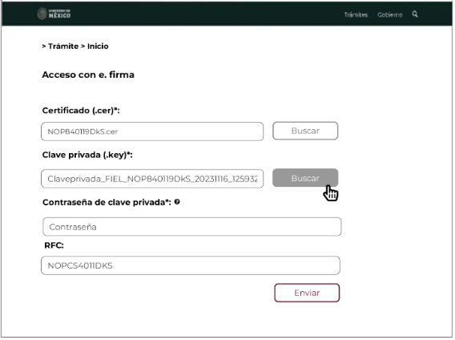
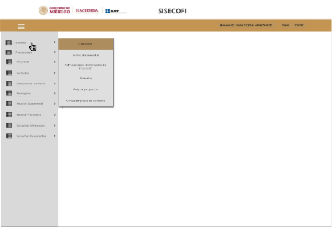

||Administración General de Comunicaciones y Tecnologías de la Información|
| :- | -: |
||Marco Documental 7.0|
|Fecha de aprobación del Template: 02/08/2023|
**Especificación de Interacción de Empleado SAT**

17\_3083\_EIU\_AccesoSistema.docx
|Versión del template: 7.00|
| :-: | :-: | :-: |

**<ID Requerimiento>** 8309

**Nombre del Requerimiento:** TI\_SISECOFI-SAT\_Seguimiento financiero y control documental de proyectos de contratación.
## **Tabla de Versiones y Modificaciones**

|Versión|Descripción del cambio|Responsable de la Versión|Fecha|
| :- | :- | :-: | :-: |
|*1*|*Creación del documento*|Angel Horacio López Alcaraz|23/01/2024|
|*1.1*|*Revisión del documento*|Luis Angel Olguin Castillo|02/05/2024|
|*1.2*|*Versión aprobada para firma*|
María del Carmen Castillejos Cárdenas

Rubén Delgado Ramírez
|04/06/2024|

**TABLA DE CONTENIDO**

[Tabla de Versiones y Modificaciones	1](#_toc168482404)

[Módulo: SISTEMA	2](#_toc168482405)

[ESTILOS 01	2](#_toc168482406)

[Descripción de Elementos	3](#_toc168482407)

[Descripción de Campos	3](#_toc168482408)

[ESTILOS 02	7](#_toc168482409)

[Descripción de Elementos	8](#_toc168482410)

[Descripción de Campos	8](#_toc168482411)

[ESTILOS 03	10](#_toc168482412)

[Descripción de Elementos	11](#_toc168482413)

[Descripción de Campos	12](#_toc168482414)

[ESTILOS 04	15](#_toc168482415)

[Descripción de Elementos	16](#_toc168482416)

[Descripción de Campos	17](#_toc168482417)

## **MÓDULO: SISTEMA**
## **ESTILOS 01**

|**Nombre de la Pantalla:** |Acceso con e.firma|
| :- | :- |
|**Objetivo:**|
Permitir al Empleado SAT autentificarse a través de su e.firma e ingresar al sistema SISECOFI para acceder a los módulos autorizados y realizar las operaciones correspondientes asignadas a su rol. 

|
|**Casos de uso relacionados:**|
17\_3083\_ECU\_AccesoSistema

|
|||
|||

### **DESCRIPCIÓN DE ELEMENTOS** 

|**Elemento**|**Descripción**|
| :- | :- |
|![ref1]|Muestra el encabezado del Componente externo de acceso.|
|> Tramite > Inicio|Muestra la ruta de la sección del** Componente externo de acceso.|
|Acceso con e.firma|Campo que muestra el nombre de la pantalla “Acceso con e.firma”.|
|Certificado (.cer)\*:|Permite visualizar el nombre del archivo adjunto (.cer) a cargar.|
|![ref2]|Campo que muestra el nombre del archivo (.cer) seleccionado para cargar.|
|Buscar|Opción que permite seleccionar un archivo con extensión (.cer) válido.|
|Clave privada (.key)\*:|Permite visualizar el nombre del archivo adjunto (.key) de la e.firma.|
|![ref3]|Campo que muestra el nombre del archivo (.key) seleccionado para cargar.|
|Buscar|Opción que permite seleccionar un archivo con extensión (.key) válido.|
|Contraseña de clave privada\*: |Campo que permite ingresar la “Contraseña de clave privada\*”.|
|![ref4]|*Tooltip* que muestra información de ayuda.|
|RFC:|Campo que muestra el RFC del Empleado SAT asociado a la e.firma ingresada.|
|Enviar|Opción que permite validar la información ingresada en el formulario del “Componente externo de acceso”.|

### **DESCRIPCIÓN DE CAMPOS**

|**Elemento**|**Tipo**|**Longitud**|
**Nivel de Acceso**

**(L, E, S)**
|**Descripción del Campo**|**Fórmulas**|**Precisiones**||
| :-: | :-: | :-: | :-: | :-: | :-: | :-: | :- |
|

![ref5]
|Encabezado|N/A|L, S|Muestra el encabezado del Componente externo de acceso.|N/A|Al ser un componente externo de acceso, las funcionalidades son ajenas al sistema SISECOFI.||
|

>Tramite > Inicio
|Texto|N/A|L|Muestra la ruta de la sección del** Componente externo de acceso.|N/A|N/A||
|Acceso con e.firma|Texto|N/A|L|Campo que muestra el nombre de la pantalla “Acceso con e.firma.|N/A|N/A||
|Certificado (.cer)\*:|Texto|N/A|L|Permite visualizar el nombre del archivo adjunto (.cer) a cargar.|N/A|N/A||
|![ref6]|Alfanumérico|N/A|L, E|Campo que muestra el nombre del archivo (.cer) seleccionado para cargar.|N/A|N/A||
|Buscar|Botón|N/A|S|Opción que permite seleccionar un archivo con extensión (.cer) válido.|N/A|
Inicialmente se muestra sin color de fondo y con contorno y letras en color gris.

Cuando se coloca el cursor encima debe cambiar a fondo gris y letras blancas.
||
|Clave privada (.key)\*:|Texto|N/A|L|Permite visualizar el nombre del archivo adjunto (.key) de la e.firma.|N/A|N/A||
|![ref7]|Alfanumérico|N/A|L, E|Campo que muestra el nombre del archivo (.key) seleccionado para cargar.|N/A|N/A||
|Buscar|Botón|N/A|S|Opción que permite seleccionar un archivo con extensión (.key) válido.|N/A|
Inicialmente se muestra sin color de fondo y con contorno en color gris.

Cuando se coloca el cursor encima debe cambiar a fondo gris y letras blancas.
||
|Contraseña de clave privada\*: |Texto|N/A|L|Campo que permite ingresar la “Contraseña de clave privada\*”.|N/A|
Se encuentra inhabilitado hasta que se cargue el certificado (.cer) y clave privada (.key).

Por seguridad, al ingresar la contraseña mostrará los caracteres ocultos.
||
|![ref4]|*ToolTip*|N/A|L|*Tooltip* que muestra información de ayuda.|N/A|Al posicionar el cursor sobre este ícono muestra el mensaje: “Esta contraseña es la que corresponde la clave privada (.key)\*”.||
|RFC:|Alfanumérico|13|L|Campo que muestra el RFC del Empleado SAT asociado a la e.firma ingresada.|N/A|N/A||
|Enviar|Botón|N/A|S|Opción que permite validar la información ingresada en el formulario por el “Componente externo de acceso”.|N/A|
Se encuentra inhabilitado hasta que capture la contraseña de Clave privada.

Inicialmente se muestra sin color de fondo y con el texto y contorno en color guinda (#691c32).

Cuando se le pone el cursor encima debe cambiar a fondo guinda (#691c32) y letras blancas.
||

##
## **ESTILOS 02**

|**Nombre de la Pantalla:** |
Pantalla inicial del menú

|
| :- | :- |
|**Objetivo:**|
Permitir al Empleado SAT ingresar a la pantalla principal del sistema.

|
|**Casos de uso relacionados:**|17\_3083\_ECU\_AccesoSistema|
|

||

### **DESCRIPCIÓN DE ELEMENTOS** 

|**Elemento**|**Descripción**|
| :- | :- |
|![ref8]|Logotipo institucional. Se muestra de forma constante en todas las páginas del sitio.|
|SISECOFI|Nombre del sistema. Se muestra de forma constante en todas las páginas del sitio.|
|![ref9]|Opción que al seleccionarla muestra el menú principal desplegado en la parte izquierda de la pantalla; contiene los módulos principales y submódulos de este sistema.|
|Nombre del Empleado SAT|Nombre del Empleado SAT que ingresó al sistema.|
|Inicio|Opción que permite mostrar la pantalla inicial del menú del sistema.|
|Cerrar|Opción que permite cerrar la sesión del Empleado SAT.|

### **DESCRIPCIÓN DE CAMPOS**
###
|**Elemento**|**Tipo**|**Longitud**|
**Nivel de Acceso**

**(L, E, S)**
|**Descripción del Campo**|**Fórmulas**|**Precisiones**|
| :-: | :-: | :-: | :-: | :-: | :-: | :-: |
|![ref8]|Logotipo|N/A|L|Logotipo institucional. |N/A|Se muestra de forma constante en todas las páginas del sitio.|
|SISECOFI|Texto|N/A|L|Nombre del sistema. |N/A|Se muestra de forma constante en todas las páginas del sitio.|
|![ref9]|Ícono|N/A|S|Muestra el menú principal desplegado en la parte izquierda de la pantalla.|N/A|Contiene los módulos principales y submódulos de este sistema.|
|Nombre del Empleado SAT|Texto|N/A|L|Nombre del Empleado SAT que ingresó en el sistema.|N/A|N/A|
|Inicio|Enlace|N/A|S|Opción que permite mostrar la pantalla inicial del menú del sistema.|N/A|N/A|
|Cerrar|Enlace|N/A|S|Opción que permite cerrar la sesión del Empleado SAT.|N/A|N/A|

## **ESTILOS 03**

|**Nombre de la Pantalla:** |
Menú principal del sistema desplegado

|
| :- | :- |
|**Objetivo:**|
Permitir al Empleado SAT ingresar a un módulo del sistema **(Módulos referenciales)**.

|
|**Casos de uso relacionados:**|
17\_3083\_ECU\_AccesoSistema

|
|

||

### **DESCRIPCIÓN DE ELEMENTOS** 

|**Elemento**|**Descripción**|
| :- | :- |
|` `![ref8]|Logotipo institucional. Se muestra de forma constante en todas las páginas del sitio.|
|SISECOFI|Nombre del sistema. Se muestra de forma constante en todas las páginas del sitio.|
|![ref9] |Opción que al seleccionarla muestra el menú principal desplegado en la parte izquierda de la pantalla; contiene los módulos principales y submódulos de este sistema.|
|Nombre del Empleado SAT|Nombre del Empleado SAT que ingresó al sistema.|
|Inicio|Opción que permite mostrar la pantalla inicial del menú del sistema.|
|Cerrar|Opción que permite cerrar la sesión del Empleado SAT.|
|![ref10]|Opción que al seleccionarla muestra el contenido de las secciones del módulo. (Estado inicial contraído).|
|![ref11]|
Opción que despliega o contrae la sección, tomando en cuenta lo siguiente: 

Sección contraída ![ref12] 

Sección desplegada ![ref13] 
|
|Sistema|Módulo de “Sistema” contraído. |
|Proveedores|Módulo de “Proveedores” contraído.|
|Proyectos|Módulo de “Proyectos” contraído.|
|Contratos|Módulo de “Contratos” contraído.|
|Consumo de Servicios|Módulo de “Consumo de Servicios” contraído.|
|Reintegros|Módulo de “Reintegros” contraído.|
|Reporte Documental|Módulo de “Reporte Documental” contraído.|
|Reporte Financiero|Módulo de “Reporte Financiero” contraído.|
|Consultar información|Módulo de “Consultar información” contraído.|
|Consultar documentos|Módulo de “Consultar documentos” contraído.|

### **DESCRIPCIÓN DE CAMPOS**
###
|**Elemento**|**Tipo**|**Longitud**|
**Nivel de Acceso**

**(L, E, S)**
|**Descripción del Campo**|**Fórmulas**|**Precisiones**|
| :-: | :-: | :-: | :-: | :-: | :-: | :-: |
|![ref14]|Logotipo|N/A|L|Logotipo institucional.|N/A|Se muestra de forma constante en todas las páginas del sitio.|
|SISECOFI|Texto|N/A|L|Nombre del sistema.|N/A|Se muestra de forma constante en todas las páginas del sitio.|
|![ref9]|Ícono|N/A|S|Muestra el menú principal desplegado en la parte izquierda de la pantalla. |N/A|
Al seleccionarlo habilita las opciones de los módulos contraídos.

Se muestra de forma constante en todas las páginas del sitio.
|
|Nombre del Empleado SAT|Alfanumérico|100|L|Nombre del Empleado SAT que ingresó en el sistema.|N/A|Se muestra de forma constante en todas las páginas del sitio.|
|Inicio|Enlace|N/A|S|Opción que permite mostrar la pantalla inicial del menú del sistema.|N/A|N/A|
|Cerrar|Enlace|N/A|S|Opción que permite cerrar la sesión del Empleado SAT.|N/A|N/A|
|![ref10]|Ícono|N/A|S|Opción que al seleccionarla muestra el contenido de las secciones del módulo.|N/A|
Al seleccionarlo despliega el contenido del módulo correspondiente.

(Estado inicial contraído).
|
|![ref15]|Ícono|N/A|S|Opción que despliega o contrae la sección.|N/A|
Sección contraída ![ref16] 

Sección desplegada ![ref17] 
|
|Sistema|Enlace|N/A|S|Módulo de “Sistema” contraído. |N/A|Opción que al seleccionarla muestra el contenido del módulo.|
|Proveedores|Enlace|N/A|S|Módulo de “Proveedores” contraído.|N/A|Opción que al seleccionarla muestra el contenido del módulo.|
|Proyectos|Enlace|N/A|S|Módulo de “Proyectos” contraído.|N/A|Opción que al seleccionarla muestra el contenido del módulo.|
|Contratos|Enlace|N/A|S|Módulo de “Contratos” contraído.|N/A|Opción que al seleccionarla muestra el contenido del módulo.|
|Consumo de servicios|Enlace|N/A|S|Módulo de “Consumo de Servicios” contraído.|N/A|Opción que al seleccionarla muestra el contenido del módulo.|
|Reintegros|Enlace|N/A|S|Módulo de “Reintegros” contraído.|N/A|Opción que al seleccionarla muestra el contenido del módulo.|
|Reporte Documental|Enlace|N/A|S|Módulo de “Reporte Documental” contraído.|N/A|Opción que al seleccionarla muestra el contenido del módulo.|
|Reporte Financiero|Enlace|N/A|S|Módulo de “Reporte Financiero” contraído.|N/A|Opción que al seleccionarla muestra el contenido del módulo.|
|Consultar información|Enlace|N/A|S|Módulo de “Consultar información”.|N/A|Opción que al seleccionarla muestra el contenido del módulo.|
|Consultar documentos|Enlace|N/A|S|Módulo de “Consultar documentos” contraído.|N/A|Opción que al seleccionarla muestra el contenido del módulo.|

## **ESTILOS 04**

|**Nombre de la Pantalla:** |
Menú principal del sistema desplegado

|
| :- | :- |
|**Objetivo:**|
Permitir al Empleado SAT ingresar al submódulo del sistema **(Submódulos referenciales)**.

|
|**Casos de uso relacionados:**|17\_3083\_ECU\_AccesoSistema|
|

||

### **DESCRIPCIÓN DE ELEMENTOS** 

|**Elemento**|**Descripción**|
| :- | :- |
|![ref8]|Logotipo institucional. Se muestra de forma constante en todas las páginas del sitio.|
|SISECOFI|Nombre del sistema. Se muestra de forma constante en todas las páginas del sitio.|
|![ref9]|Opción que al seleccionarla muestra el menú principal desplegado en la parte izquierda de la pantalla; contiene los módulos principales y submódulos de este sistema.|
|Nombre del Empleado SAT|Nombre del Empleado SAT que ingresó al sistema.|
|Inicio|Opción que permite mostrar la pantalla inicial del menú del sistema.|
|Cerrar|Opción que permite cerrar la sesión del Empleado SAT.|
|![ref10]|Opción que al seleccionarla muestra el contenido de las secciones del módulo. (Estado inicial contraído).|
|![ref11]|
Opción que despliega o contrae la sección, tomando en cuenta lo siguiente: 

Sección contraída ![Forma

Descripción generada automáticamente con confianza baja][ref12] 

Sección desplegada ![Forma

Descripción generada automáticamente con confianza baja][ref13] 
|
|Sistema|Módulo de “Sistema”. |
|Catálogos|Submódulo “Catálogos”.|
|Matriz Documental|Submódulo “Matriz Documental”.|
|Administrador de formatos de impresión|Submódulo “Administrador de formatos de impresión”.|
|Usuarios|Submódulo “Usuarios”.|
|Asignar proyectos|Submódulo “Asignar proyectos”.|
|Consultar pistas de auditoría|Submódulo “Consultar pistas de auditoría”.|
|Proveedores|Módulo de “Proveedores” contraído.|
|Proyectos|Módulo de “Proyectos” contraído.|
|Contratos|Módulo de “Contratos” contraído.|
|Consumo de Servicios|Módulo de “Consumo de Servicios” contraído.|
|Reintegros|Módulo de “Reintegros” contraído.|
|Reporte Documental|Módulo de “Reporte Documental” contraído.|
|Reporte Financiero|Módulo de “Reporte Financiero” contraído.|
|Consultar información|Módulo de “Consultar información” contraído.|
|Consultar documentos|Módulo de “Consultar documentos” contraído.|

### **DESCRIPCIÓN DE CAMPOS**
###
|**Elemento**|**Tipo**|**Longitud**|
**Nivel de Acceso**

**(L, E, S)**
|**Descripción del Campo**|**Fórmulas**|**Precisiones**|
| :-: | :-: | :-: | :-: | :-: | :-: | :-: |
|![ref14]|Logotipo|N/A|L|Logotipo institucional.|N/A|Se muestra de forma constante en todas las páginas del sitio.|
|SISECOFI|Texto|N/A|L|Nombre del sistema.|N/A|Se muestra de forma constante en todas las páginas del sitio.|
|![ref9]|Ícono|N/A|S|Muestra el menú principal desplegado en la parte izquierda de la pantalla. |N/A|
Al seleccionarlo habilita las opciones de los módulos contraídos.

Se muestra de forma constante en todas las páginas del sitio.
|
|Nombre del Empleado SAT|Alfanumérico|100|L|Nombre del Empleado SAT que ingresó en el sistema.|N/A|Se muestra de forma constante en todas las páginas del sitio.|
|Inicio|Enlace|N/A|S|Opción que permite mostrar la pantalla inicial del menú del sistema.|N/A|N/A|
|Cerrar|Enlace|N/A|S|Opción que permite cerrar la sesión del Empleado SAT.|N/A|N/A|
|![ref10]|Ícono|N/A|S|Opción que al seleccionarla muestra el contenido de las secciones del módulo.|N/A|(Estado inicial contraído). Al seleccionarlo despliega el contenido del módulo correspondiente.|
|![ref18]|Ícono|N/A|S|Opción que despliega o contrae la sección.|N/A|
Sección contraída ![Forma

Descripción generada automáticamente con confianza baja][ref16] 

Sección desplegada ![Forma

Descripción generada automáticamente con confianza baja][ref17] 
|
|Sistema|Enlace|N/A|S|Módulo de “Sistema”. |N/A|Opción que al seleccionarla muestra el contenido del módulo.|
|Catálogos|Enlace|N/A|S|Submódulo “Catálogos”.|N/A|Opción que al seleccionarla muestra el contenido del submódulo.|
|Matriz Documental|Enlace|N/A|S|Submódulo “Matriz Documental”.|N/A|Opción que al seleccionarla muestra el contenido del submódulo.|
|Administrador de formatos de impresión|Enlace|N/A|S|Submódulo “Administrador de formatos de impresión”.|N/A|Opción que al seleccionarla muestra el contenido del submódulo.|
|Usuarios|Enlace|N/A|S|Submódulo “Usuarios”.|N/A|Opción que al seleccionarla muestra el contenido del submódulo.|
|Asignar proyectos|Enlace|N/A|S|Submódulo “Asignar proyectos”.|N/A|Opción que al seleccionarla muestra el contenido del submódulo.|
|Consultar pistas de auditoría|Enlace|N/A|S|Submódulo “Consultar pistas de auditoría”.|N/A|Opción que al seleccionarla muestra el contenido del submódulo.|
|Proveedores|Enlace|N/A|S|Módulo de “Proveedores” contraído.|N/A|Opción que al seleccionarla muestra el contenido del módulo.|
|Proyectos|Enlace|N/A|S|Módulo de “Proyectos” contraído.|N/A|Opción que al seleccionarla muestra el contenido del módulo.|
|Contratos|Enlace|N/A|S|Módulo de “Contratos” contraído.|N/A|Opción que al seleccionarla muestra el contenido del módulo.|
|Consumo de servicios|Enlace|N/A|S|Módulo de “Consumo de Servicios” contraído.|N/A|Opción que al seleccionarla muestra el contenido del módulo.|
|Reintegros|Enlace|N/A|S|Módulo de “Reintegros” contraído.|N/A|Opción que al seleccionarla muestra el contenido del módulo.|
|Reporte Documental|Enlace|N/A|S|Módulo de “Reporte Documental” contraído.|N/A|Opción que al seleccionarla muestra el contenido del módulo.|
|Reporte Financiero|Enlace|N/A|S|Módulo de “Reporte Financiero” contraído.|N/A|Opción que al seleccionarla muestra el contenido del módulo.|
|Consultar información|Enlace|N/A|S|
Módulo de “Consultar información”

contraído.
|N/A|Opción que al seleccionarla muestra el contenido del módulo.|
|Consultar documentos|Enlace|N/A|S|Módulo de “Consultar documentos” contraído.|N/A|Opción que al seleccionarla muestra el contenido del módulo.|

Anexo - Ejemplos de botones

Las acciones de cada botón se definen en los estilos correspondientes.

|**FIRMAS DE CONFORMIDAD** ||
| :-: | :- |
|**Firma 1**  |**Firma 2**  |
|**Nombre**: María del Carmen Castillejos Cárdenas. |**Nombre**: Rubén Delgado Ramírez. |
|**Puesto**: Usuaria ACPPI. |**Puesto**: Usuario ACPPI. |
|**Fecha**:|**Fecha**:|
|  |  |
|**Firma 3**  |**Firma 4** |
|**Nombre**: Rodolfo López Meneses. |**Nombre**: Diana Yazmín Pérez Sabido. |
|**Puesto**: Usuario ACPPI. |**Puesto**: Usuaria ACPPI. |
|**Fecha**:|**Fecha**:|
|  |  |
|**Firma 5** |**Firma 6** |
|**Nombre**: Yesenia Helvetia Delgado Naranjo. |**Nombre**: Alejandro Alfredo Muñoz Núñez. |
|**Puesto**: APE ACPPI. |**Puesto**: RAPE ACPPI. |
|**Fecha**: |**Fecha**: |
|  |  |
|**Firma 7** |**Firma 8** |
|**Nombre**: Luis Angel Olguin Castillo. |**Nombre**: Erick Villa Beltrán. |
|**Puesto**: Enlace ACPPI. |**Puesto**: Líder APE SDMA 6. |
|**Fecha**: |**Fecha**: |
|**  |**  |
|**Firma 9** |**Firma 10** |
|**Nombre**: Juan Carlos Ayuso Bautista. |**Nombre**: Angel Horacio López Alcaraz.|
|**Puesto**: Líder Técnico SDMA 6. |**Puesto**: Analista de Sistemas SDMA 6.|
|**Fecha**: |**Fecha**: |
|**  | |
\*\
\

|||Página 10 de 64|
| :- | :-: | -: |

[ref1]: Aspose.Words.fcb9c503-5751-479c-8bd8-8445f1ff8d4c.003.png
[ref2]: Aspose.Words.fcb9c503-5751-479c-8bd8-8445f1ff8d4c.004.png
[ref3]: Aspose.Words.fcb9c503-5751-479c-8bd8-8445f1ff8d4c.005.png
[ref4]: Aspose.Words.fcb9c503-5751-479c-8bd8-8445f1ff8d4c.006.png
[ref5]: Aspose.Words.fcb9c503-5751-479c-8bd8-8445f1ff8d4c.007.png
[ref6]: Aspose.Words.fcb9c503-5751-479c-8bd8-8445f1ff8d4c.008.png
[ref7]: Aspose.Words.fcb9c503-5751-479c-8bd8-8445f1ff8d4c.009.png
[ref8]: Aspose.Words.fcb9c503-5751-479c-8bd8-8445f1ff8d4c.011.png
[ref9]: Aspose.Words.fcb9c503-5751-479c-8bd8-8445f1ff8d4c.012.png
[ref10]: Aspose.Words.fcb9c503-5751-479c-8bd8-8445f1ff8d4c.014.png
[ref11]: Aspose.Words.fcb9c503-5751-479c-8bd8-8445f1ff8d4c.015.png
[ref12]: Aspose.Words.fcb9c503-5751-479c-8bd8-8445f1ff8d4c.016.png
[ref13]: Aspose.Words.fcb9c503-5751-479c-8bd8-8445f1ff8d4c.017.png
[ref14]: Aspose.Words.fcb9c503-5751-479c-8bd8-8445f1ff8d4c.018.png
[ref15]: Aspose.Words.fcb9c503-5751-479c-8bd8-8445f1ff8d4c.019.png
[ref16]: Aspose.Words.fcb9c503-5751-479c-8bd8-8445f1ff8d4c.020.png
[ref17]: Aspose.Words.fcb9c503-5751-479c-8bd8-8445f1ff8d4c.021.png
[ref18]: Aspose.Words.fcb9c503-5751-479c-8bd8-8445f1ff8d4c.023.png
