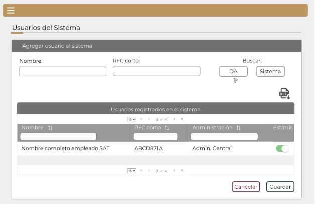

||Administración General de Comunicaciones y Tecnologías de la Información|
| :- | -: |
||Marco Documental 7.0|
|Fecha de aprobación del Template: 02/08/2023|
**Especificación de Interacción de Usuario**

17\_3083\_EIU\_AdministrarUsuariosdelSistema.docx
|Versión del template: 7.00|
| :-: | :-: | :-: |

**<ID Requerimiento>** 8309

**Nombre del Requerimiento:** TI\_SISECOFI-SAT\_Seguimiento financiero y control documental de proyectos de contratación
## **Tabla de Versiones y Modificaciones**

|Versión|Descripción del cambio|Responsable de la Versión|Fecha|
| :- | :- | :-: | :-: |
|*1*|*Creación del documento*|Eric Hector Pérez Pérez|*07/03/2024*|
|*1.1*|*Revisión del documento*|Luis Angel Olguín Castillo|*13/04/2024*|
|*1.2*|*Versión aprobada para firma*|
María del Carmen Castillejos Cárdenas

Rubén Delgado Ramírez
|*18/06/2024*|

**TABLA DE CONTENIDO**

[Tabla de Versiones y Modificaciones	1](#_toc170377323)

[Módulo: ADMINISTRAR USUARIOS DEL SISTEMA	2](#_toc170377324)

[ESTILOS 01	2](#_toc170377325)

[Descripción de Elementos	3](#_toc170377326)

[Descripción de Campos	4](#_toc170377327)

[ESTILOS 02	9](#_toc170377328)

[Descripción de Elementos	10](#_toc170377329)

[Descripción de Campos	11](#_toc170377330)

## **	
## **	
## **MÓDULO: ADMINISTRAR USUARIOS DEL SISTEMA**
## **ESTILOS 01**

|**Nombre de la Pantalla:** |
Usuarios del Sistema.

|
| :- | :- |
|**Objetivo:**|
Permitir al Empleado SAT agregar usuarios al sistema.

|
|**Casos de uso relacionados:**|17\_3083\_ECU\_AdministrarUsuariosDelSistema.|
|||

 

**Nota:** Los datos mencionados en la tabla son solo de ejemplo.

### **DESCRIPCIÓN DE ELEMENTOS** 

|**Elemento**|**Descripción**|
| :- | :- |
|![ref1] |Opción que al seleccionarla muestra el menú principal desplegado en la parte izquierda de la pantalla, y contiene los módulos principales y submódulos del sistema.|
|Usuarios del Sistema|Título que identifica el módulo al cual ingresa el usuario.|
|Agregar usuario al sistema|Título de la sección.|
|Nombre|Campo que permite capturar el nombre del usuario.|
|RFC corto|
Campo que permite capturar el RFC corto del usuario.

|
|Buscar|Etiqueta que identifica a los botones de búsqueda.|
|DA|Opción que permite iniciar la búsqueda de usuarios que se encuentran en el Directorio Activo, de acuerdo con los criterios de búsqueda.|
|Sistema|Opción que permite iniciar la búsqueda de usuarios que se encuentran dentro de la base de datos (BD) interna del sistema.|
|![ref2]|Opción que permite exportar la información de la tabla “Empleados SAT” generando un archivo de Excel con extensión (.xlsx).|
|Empleados SAT|Título de la tabla que muestra la información de los Empleados SAT.|
|![ref3]|Paginador que permite navegar a través de las páginas resultantes de la consulta.|
|Nombre|Columna que muestra el nombre completo de cada usuario, el cual es obtenido de la búsqueda.|
|RFC corto|Columna que muestra el RFC corto de cada usuario, el cual es obtenido de la búsqueda.|
|Administración|Columna que muestra la Administración de cada usuario, el cual es obtenido de la búsqueda.|
|Seleccionar|Columna que muestra para seleccionar Empleado SAT y dar de alta en el sistema.|
|![ref4]|Casilla de selección para seleccionar Empleado SAT.|
|![ref5]|Opción que ordena la información de la tabla de forma ascendente o descendente y de forma alfabética, según aplique.|
|![ref6]|Campo que permite filtrar la información de la columna en la que se requiere buscar específicamente.|
|Cancelar|Opción que realiza el proceso para cancelar la acción y regresa al último estado guardado.|
|Guardar|Opción que inicia el proceso para almacenar en la BD la información de los usuarios seleccionados, con el fin de ser agregados como usuarios del sistema.|

### **DESCRIPCIÓN DE CAMPOS**
###
|**Elemento**|**Tipo**|**Longitud**|
**Nivel de Acceso**

**(L, E, S)**
|**Descripción del Campo**|**Fórmulas**|**Precisiones**|
| :-: | :-: | :-: | :-: | :-: | :-: | :-: |
|![ref1]|Ícono|N/A|S|Muestra el menú principal desplegado en la parte izquierda de la pantalla.|N/A|N/A|
|Usuarios del Sistema|Sección|N/A|L|Título que identifica el módulo al cual ingresa el usuario.|N/A|N/A|
|Agregar usuario al sistema|Sección|N/A|L|Título de la sección.|N/A|N/A|
|Nombre|Alfabético |50|E|Permite capturar el nombre del usuario.|N/A|Se permite ingresar el nombre en forma parcial o completo.|
|RFC corto|Alfanumérico|4,8|E|Permite capturar el RFC corto del usuario.|N/A|Se permite ingresar como mínimo las primeras 4 letras del RFC corto.|
|Buscar|Texto|N/A|L|Etiqueta que identifica a los botones de búsqueda.|N/A|N/A|
|DA|Botón|N/A|S|Permite iniciar la búsqueda de usuarios que se encuentran en el Directorio Activo, de acuerdo con los criterios de búsqueda.|N/A|
Usar el *tooltip* “Directorio Activo”.

Búsqueda en la BD del Directorio Activo.

|
|Sistema|Botón|N/A|S|Permite iniciar la búsqueda de usuarios que se encuentran dentro de la base de datos (BD) interna del sistema.|N/A|
Usar el *tooltip* “Sistema”.

Búsqueda en la BD del Sistema.

|
|![ref2] |Ícono|N/A|S|Permite exportar la información de la tabla “EmpleadosSAT” generando un archivo de Excel con extensión (.xlsx).|N/A|Usar el *tooltip* “Exportar a Excel”.|
|Empleados SAT|Tabla|N/A|L|Título de la tabla que muestra la información de los Empleados SAT.|N/A|N/A|
|![ref7]|Paginador|N/A|S|Permite navegar a través de las páginas resultantes de la consulta.|N/A|Inicialmente se deben mostrar 15 registros por página, permitiendo elegir visualizar: 15, 50 y 100 registros por página.|
|Nombre|Alfabético|50|L|Muestra el nombre completo de cada usuario, el cual es obtenido de la búsqueda.|N/A|Ordenados alfabéticamente iniciando por el nombre.|
|RFC corto|Alfanumérico|8|L|Muestra el RFC corto de cada usuario obtenido de la búsqueda.|N/A|N/A|
|Administración|Alfanumérico|50|L|Muestra la Administración de cada usuario, el cual es obtenido de la búsqueda.|N/A|N/A|
|Seleccionar|Texto|N/A|L|Muestra para seleccionar Empleado SAT y dar de alta en el sistema.|N/A|N/A|
|![ref4]|Check|N/A|S|Casilla de selección para seleccionar Empleado SAT.|N/A|
Sin seleccionar.

Seleccionado.
|
|![ref5]|Ícono |N/A|S|Permite ordena la información de la tabla de forma ascendente o descendente y de forma alfabética, según aplique.|N/A |Realiza el filtro de la información solo dentro de la tabla que se visualiza. |
|
![ref8]

|Filtro |N/A |E |Permite filtrar la información de la columna en la que se requiere buscar específicamente.|N/A |Realiza el filtro de la información solo dentro de la página que se visualiza. |
|Cancelar|Botón|N/A|L, S|Realiza el proceso para cancelar la acción y regresa al último estado guardado.|N/A|
Inicialmente se muestra sin color de fondo y con el texto y contorno en color guinda (#691c32). 

Cuando se le pone el cursor encima debe cambiar a fondo guinda (#691c32) y letras blancas. 

Solo se permitirá editar si el rol tiene permiso de escritura. 
|
|Guardar|Botón|N/A|L, S|Inicia el proceso para almacenar en la BD la información de los usuarios seleccionados, con el fin de ser agregados como usuarios del sistema.|N/A|
Inicialmente se muestra sin color de fondo y con el texto y contorno en color verde oscuro (#10312B). 

Cuando se le pone el cursor encima debe cambiar a fondo verde oscuro (#10312B) y letras blancas. 

Solo se permitirá editar si el rol tiene permiso de escritura. 
|

## **ESTILOS 02**

|**Nombre de la Pantalla:** |
Usuarios del Sistema.

|
| :- | :- |
|**Objetivo:**|
Permitir “Activar” e “Inactivar” usuarios del sistema.

|
|**Casos de uso relacionados:**|17\_3083\_ECU\_AdministrarUsuariosdelSistema.|
|||

` `

**Nota:** Los datos mencionados en la tabla anterior son solo de ejemplo.

### **DESCRIPCIÓN DE ELEMENTOS** 

|**Elemento**|**Descripción**|
| :- | :- |
|![ref1] |Opción que al seleccionarla muestra el menú principal desplegado en la parte izquierda de la pantalla, y contiene los módulos principales y submódulos del sistema.|
|Usuarios del Sistema|Título que identifica el módulo al cual ingresa el usuario.|
|Agregar usuario al sistema|Título de la sección.|
|Nombre|Campo que permite capturar el nombre del usuario.|
|RFC corto|
Campo que permite capturar el RFC corto del usuario.

|
|Buscar|Etiqueta que identifica a los botones de búsqueda.|
|DA|Opción que permite iniciar la búsqueda de usuarios que se encuentran en el Directorio Activo, de acuerdo con los criterios de búsqueda.|
|Sistema|Opción que permite iniciar la búsqueda de usuarios que se encuentran dentro de la base de datos (BD) interna del sistema.|
|![Un dibujo con letras

Descripción generada automáticamente con confianza media][ref2]|Opción que permite exportar la información de la tabla “Empleados SAT” generando un archivo de Excel con extensión (.xlsx).|
|Usuarios registrados en el sistema|Título de la tabla que muestra la información de los Usuarios registrados en el sistema.|
|![ref3]|Paginador que permite navegar a través de las páginas resultantes de la consulta.|
|Nombre|Columna que muestra el nombre completo de cada usuario, el cual es obtenido de la búsqueda.|
|RFC corto|Columna que muestra el RFC corto de cada usuario, el cual es obtenido de la búsqueda.|
|Administración|Columna que muestra la Administración de cada usuario, el cual es obtenido de la búsqueda.|
|Estatus|Columna que muestra el estatus de “Activo” e “Inactivo” del usuario.|
|![ref9]|
Opción que modifica el estatus de “Activo” o “Inactivo” de la siguiente forma: 

![ref10]Activo 

![ref11]Inactivo 
|
|![Icono

Descripción generada automáticamente][ref5]|Opción que ordena la información de la tabla de forma ascendente o descendente y de forma alfabética, según aplique.|
|![ref6]|Campo que permite filtrar la información de la columna en la que se requiere buscar específicamente.|
|Cancelar|Opción que realiza el proceso para cancelar la acción y regresa al último estado guardado.|
|Guardar|Opción que inicia el proceso para almacenar en la BD la información de los usuarios seleccionados, con el fin de ser agregados como usuarios del sistema.|

### **DESCRIPCIÓN DE CAMPOS**
###
|**Elemento**|**Tipo**|**Longitud**|
**Nivel de Acceso**

**(L, E, S)**
|**Descripción del Campo**|**Fórmulas**|**Precisiones**|
| :-: | :-: | :-: | :-: | :-: | :-: | :-: |
|![ref1]|Ícono|N/A|S|Muestra el menú principal desplegado en la parte izquierda de la pantalla.|N/A|N/A|
|Usuarios del Sistema|Sección|N/A|L|Título que identifica el módulo al cual ingresa el usuario.|N/A|N/A|
|Agregar usuario al sistema|Sección|N/A|L|Título de la sección.|N/A|N/A|
|Nombre|Alfabético |50|E|Permite capturar el nombre del usuario.|N/A|Se permite ingresar el nombre en forma parcial o completo.|
|RFC corto|Alfanumérico|4,8|E|Permite capturar el RFC corto del usuario.|N/A|Se permite ingresar como mínimo los primeros 4 letras del RFC corto.|
|Buscar|Texto|N/A|L|Etiqueta que identifica a los botones de búsqueda.|N/A|N/A|
|DA|Botón|N/A|S|Permite iniciar la búsqueda de usuarios que se encuentran en el Directorio Activo, de acuerdo con los criterios de búsqueda.|N/A|
Usar el *tooltip* “Directorio Activo”.

Búsqueda en la BD del Directorio Activo.

|
|Sistema|Botón|N/A|S|Permite iniciar la búsqueda de usuarios que se encuentran dentro de la base de datos (BD) interna del sistema.|N/A|
Usar el *tooltip* “Sistema”.

Búsqueda en la BD del Sistema.

|
|![Un dibujo con letras

Descripción generada automáticamente con confianza media][ref2] |Ícono|N/A|S|Permite exportar la información de la tabla “EmpleadosSAT” generando un archivo de Excel con extensión (.xlsx).|N/A|Usar el *tooltip* “Exportar a Excel”.|
|Usuarios registrados en el sistema|Tabla|N/A|L|Título de la tabla que muestra la información de los Empleados SAT.|N/A|N/A.|
|![ref7]|Paginador|N/A|S|Permite navegar a través de las páginas resultantes de la consulta.|N/A|Inicialmente se deben mostrar 15 registros por página, permitiendo elegir visualizar: 15, 50 y 100 registros por página.|
|Nombre|Alfabético|50|L|Muestra el nombre completo de cada usuario, el cual es obtenido de la búsqueda.|N/A|Ordenados alfabéticamente iniciando por el nombre.|
|RFC corto|Alfanumérico|8|L|Muestra el RFC corto de cada usuario obtenido de la búsqueda.|N/A|N/A|
|Administración|Alfanumérico|50|L|Muestra la Administración de cada usuario, el cual es obtenido de la búsqueda.|N/A|N/A|
|Estatus|Texto|N/A|L|Muestra si el estatus está activo o inactivo.|N/A|N/A|
|![ref9]|Ícono |N/A |S |Opción que modifica el estatus de “Activo” o “Inactivo”. |N/A|
![ref10]Activo 

![ref11]Inactivo 
|
|![Icono

Descripción generada automáticamente][ref5]|Ícono |N/A|S|Permite ordena la información de la tabla de forma ascendente o descendente y de forma alfabética, según aplique.|N/A |Realiza el filtro de la información solo dentro de la tabla que se visualiza. |
|
![ref8]

|Filtro |N/A |E |Permite filtrar la información de la columna en la que se requiere buscar específicamente.|N/A |Realiza el filtro de la información solo dentro de la página que se visualiza. |
|Cancelar|Botón|N/A|L, S|Realiza el proceso para cancelar la acción y regresa al último estado guardado.|N/A|
Inicialmente se muestra sin color de fondo y con el texto y contorno en color guinda (#691c32). 

Cuando se le pone el cursor encima debe cambiar a fondo guinda (#691c32) y letras blancas. 

Solo se permitirá editar si el rol tiene permiso de escritura. 
|
|Guardar|Botón|N/A|L, S|Inicia el proceso para almacenar en la BD la información de los usuarios seleccionados, con el fin de ser agregados como usuarios del sistema.|N/A|
Inicialmente se muestra sin color de fondo y con el texto y contorno en color verde oscuro (#10312B). 

Cuando se le pone el cursor encima debe cambiar a fondo verde oscuro (#10312B) y letras blancas. 

Solo se permitirá editar si el rol tiene permiso de escritura. 
|

Anexo - Ejemplos de botones

Las acciones de cada botón se definen en los estilos correspondientes.

\*\

||
| :- |

|**FIRMAS DE CONFORMIDAD**||
| :-: | :- |
|**Firma 1** |**Firma 2** |
|**Nombre**: María del Carmen Castillejos Cárdenas.|**Nombre**: Rubén Delgado Ramirez.|
|**Puesto**: Usuaria ACPPI.|**Puesto**: Usuario ACPPI.|
|**Fecha:**|**Fecha:**|
|||
|**Firma 3** |**Firma 4**|
|**Nombre**: Rodolfo López Meneses.|**Nombre**: Yesenia Helvetia Delgado Naranjo.|
|**Puesto**: Usuario ACPPI.|**Puesto**: APE ACPPI.|
|**Fecha:**|**Fecha:**|
|||
|**Firma 5**|**Firma 6**|
|**Nombre:** Alejandro Alfredo Muñoz Núñez.|**Nombre**: Luis Angel Olguin Castillo.|
|**Puesto:** RAPE ACPPI.|**Puesto**: Enlace ACPPI.|
|**Fecha**:|**Fecha**:|
|||
|**Firma 7**|**Firma 8**|
|**Nombre**: Erick Villa Beltrán.|**Nombre:** Juan Carlos Ayuso Bautista.|
|**Puesto**: Líder APE SDMA 6.|**Puesto:** Líder Técnico SDMA 6.|
|**Fecha**:|**Fecha**:|
|||
|**Firma 9**||
|**Nombre:** Eric Hector Pérez Pérez.||
|**Puesto:** Analista de Sistemas DS SDMA 6.||
|**Fecha**:||
|||

||
| :- |

|||Página 19 de 19|
| :- | :-: | -: |

[ref1]: Aspose.Words.7441ecfc-924f-4e92-9dc6-1f7b712fccf7.003.png
[ref2]: Aspose.Words.7441ecfc-924f-4e92-9dc6-1f7b712fccf7.004.png
[ref3]: Aspose.Words.7441ecfc-924f-4e92-9dc6-1f7b712fccf7.005.png
[ref4]: Aspose.Words.7441ecfc-924f-4e92-9dc6-1f7b712fccf7.006.png
[ref5]: Aspose.Words.7441ecfc-924f-4e92-9dc6-1f7b712fccf7.007.png
[ref6]: Aspose.Words.7441ecfc-924f-4e92-9dc6-1f7b712fccf7.008.png
[ref7]: Aspose.Words.7441ecfc-924f-4e92-9dc6-1f7b712fccf7.009.png
[ref8]: Aspose.Words.7441ecfc-924f-4e92-9dc6-1f7b712fccf7.012.png
[ref9]: Aspose.Words.7441ecfc-924f-4e92-9dc6-1f7b712fccf7.014.png
[ref10]: Aspose.Words.7441ecfc-924f-4e92-9dc6-1f7b712fccf7.015.png
[ref11]: Aspose.Words.7441ecfc-924f-4e92-9dc6-1f7b712fccf7.016.png
