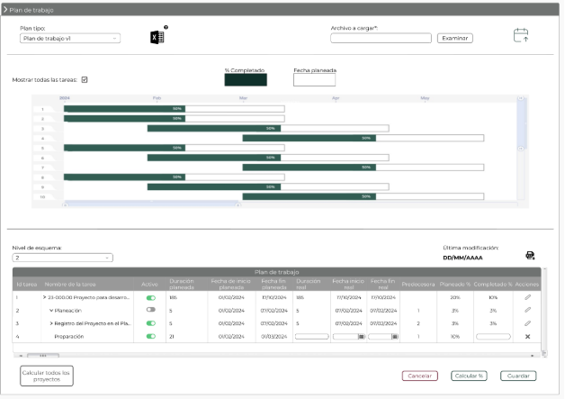

||Administración General de Comunicaciones y Tecnologías de la Información|
| :- | -: |
||Marco Documental 7.0|
|Fecha de aprobación del Template: 02/08/2023|
**Especificación de Interacción de Usuario**

17\_3083\_EIU\_CargarPlanDeTrabajo.docx
|Versión del template: 7.00|
| :-: | :-: | :-: |

**<ID Requerimiento>** 8309

**Nombre del Requerimiento:** TI\_SISECOFI-SAT\_Seguimiento financiero y control documental de proyectos de contratación

## **Tabla de Versiones y Modificaciones**

|Versión|Descripción del cambio|Responsable de la Versión|Fecha|
| :-: | :- | :- | :- |
|*1*|*Creación del documento*|Eduardo Acosta Mora|*14/02/2024*|
|*1.1*|*Revisión del documento*|Luis Angel Olguin Castillo|*14/04/2024*|
|*1.2*|*Versión aprobada para firma*|
María del Carmen Castillejos Cárdenas

Rubén Delgado Ramírez
|*18/06/2024*|

**TABLA DE CONTENIDO**

[Tabla de Versiones y Modificaciones	1](#_toc169782650)

[Módulo: plan de trabajo	2](#_toc169782651)

[ESTILOS 01	2](#_toc169782652)

[Descripción de Elementos	3](#_toc169782653)

[Descripción de Campos	5](#_toc169782654)

##

##
## **MÓDULO: PLAN DE TRABAJO**
## **ESTILOS 01**

|**Nombre de la Pantalla:**|Plan de trabajo|
| :- | - |
|**Objetivo:**|
Permitir al Empleado SAT cargar y administrar el plan de trabajo del proyecto.

|
|**Casos de uso relacionados:**|17\_3083\_ECU\_CargarPlanDeTrabajo|
|||

**Nota:** Los datos mencionados en la tabla son solo de ejemplo.

### **DESCRIPCIÓN DE ELEMENTOS** 

|**Elemento**|**Descripción**|
| :- | :- |
|Plan de trabajo|Sección que muestra los criterios para gestionar la información del plan de trabajo.|
|![ref1]|
Opción que al ser seleccionada despliega o contrae la sección, tomando en cuenta lo siguiente:

Sección contraída ![ref2]

Sección desplegada![ref3]
|
|Plan tipo:|Campo que permite seleccionar una plantilla (Plan tipo) para posteriormente descargarla.|
|![ref4]|Opción que permite la descarga de la plantilla (Plan tipo) para la generación del plan de trabajo a adjuntar.|
|Archivo a cargar\*:|Indica que se debe de adjuntar un archivo y es de carácter obligatorio para continuar con el proceso.|
|![ref5]|Muestra el nombre del archivo con extensión (.xlsx) correspondiente al plan de trabajo adjunto.|
|Examinar|Opción que permite abrir el explorador de archivos de la computadora para elegir el archivo que se adjuntará.|
|![ref6]|Opción que permite procesar el archivo al sistema para su visualización.|
|Mostrar todas las tareas:|Etiqueta para “Mostrar todas las tareas” debe mostrarse sin seleccionar por defecto y permite mostrar u ocultar las tareas en el Diagrama de Gantt.|
|![ref7]![ref8]|
Opciones que indican la forma de mostrarse las tareas. 

|
|![ref9]|Indica que el color verde es el porcentaje completado de la tarea.|
|![ref10]|Indica que el color blanco es la fecha de inicio y fecha fin de la tarea.|
|![ref11]|Muestra el identificador (Id) de la tarea.|
|![ref12]|Indica el porcentaje completado que hay entre la fecha de inicio y la fecha fin de la tarea.|
|
Barras de desplazamiento 

![ref13]

|Indica la vista a detalle o vista general de las tareas.|
|Nivel de esquema:|
Campo que permite seleccionar el nivel de esquema que se desglosará en la tabla “Plan de trabajo”, de la siguiente forma:

Al seleccionar un valor para el nivel de esquema, se desglosarán todas las tareas que pertenezcan hasta el nivel seleccionado.

Ejemplo:

Nivel de esquema= 2

Tareas que se muestran:

>Tarea nivel 0

>Tarea nivel 1

>Tarea nivel 2

>Tarea nivel 1
|
|Última modificación:|Indica la fecha de la última modificación que se hizo en el plan de trabajo.|
|![ref14]|Opción que permite descargar el plan de trabajo almacenado en la base de datos (BD).|
|Plan de trabajo|Título de la tabla, la cual muestra las tareas del plan de trabajo.|
|Id tarea|Indica el Id de la tarea de forma única y consecutiva.|
|Nombre de la tarea|Indica el nombre de la tarea.|
|![ref15]![ref16]|
Indica que es una tarea padre y dentro de ella están las tareas desglosadas o contraídas de la siguiente forma:

![ref17]Tarea desglosada

![ref18]Tarea contraída
|
|Activo|Indica si la tarea está activa o inactiva por medio de los íconos:  ![ref19] ![ref20].|
|![ref21]|
Opción que indica si la tarea está activa o inactiva de la siguiente forma:

![ref22] Activa

![ref20]Inactiva
|
|Duración planeada|Indica la duración planeada del proyecto, tarea (Padre y/o hijo) en días.|
|Fecha de inicio planeada|Indica la fecha de inicio planeada para el proyecto, tarea (Padre y/o hijo).|
|Fecha fin planeada|Indica la fecha fin planeada para el proyecto, tarea (Padre y/o hijo).|
|Duración real |
Indica la duración real del proyecto, tarea (Padre y/o hijo).

Permite modificar solo la duración real de las tareas que no contengan tareas hijo.
|
|Fecha inicio real|
Indica la fecha de inicio real del proyecto, tarea (Padre y/o hijo).

Permite modificar solo la fecha de inicio real de las tareas que no contengan tareas hijo.
|
|Fecha fin real|
Indica la fecha en que finalizó realmente el proyecto, tarea (Padre y/o hijo).

Permite modificar solo la fecha fin real de las tareas que no contengan tareas hijo.
|
|Predecesora|Indica el Id de la tarea que le precede.|
|Planeado %|Indica el porcentaje planeado del proyecto, tarea (Padre y/o hijo).|
|Completado %|
Indica el porcentaje real del proyecto, tarea (Padre y/o hijo).

Permite modificar solo el porcentaje de las tareas que no contengan tareas hijo.
|
|Acciones|Indica las acciones que se pueden hacer con los registros mediante el ícono ![ref23] y ![ref24].|
|![ref25]|Opción que permite editar la información de la tarea.|
|![ref26]|Opción que permite descartar la acción |
||Permite desplazarse de manera horizontal en la tabla.|
|![ref27]|Permite desplazarse de manera vertical en la tabla.|
|Cancelar|Opción que permite cancelar cualquier acción realizada por el Empleado SAT.|
|Calcular %|Opción que permite calcular los datos modificados y los guarda en la BD.|
|Guardar |Opción que inicia el proceso para almacenar en la BD la información modificada para la tarea. |
|Calcular todos los proyectos|Opción que inicia el cálculo de los campos Duración real, Fecha inicio real, Fecha fin real, Completado % y Planeado % para todos los proyectos activos.|

### **DESCRIPCIÓN DE CAMPOS**

|**Elemento**|**Tipo**|**Longitud**|
**Nivel de Acceso**

**(L, E, S)**
|**Descripción del Campo**|**Fórmulas**|**Precisiones**|
| :-: | :-: | :-: | :-: | :-: | :-: | :-: |
|Plan de trabajo|Sección|N/A|S|Sección que muestra los criterios para gestionar la información del plan de trabajo.|N/A|N/A|
|![ref1]|Ícono|N/A|S|Opción que al ser seleccionada despliega o contrae la sección.|N/A|
Sección contraída ![ref2]

Sección desplegada![ref3]
|
|Plan tipo:|Lista de selección|N/A|S|Campo que permite seleccionar una plantilla (Plan tipo) para posteriormente descargarla.|N/A|N/A|
|![ref4]|Ícono|N/A|S|Opción que permite la descarga de la plantilla (Plan tipo) para la generación del plan de trabajo a adjuntar.|N/A|Usar *tooltip* que muestre el nombre de la opción “Descargar Plan tipo”.|
|Archivo a cargar\*:|Texto|N/A|L|Indica que se debe de adjuntar un archivo y es de carácter obligatorio para continuar con el proceso.|N/A|N/A|
|![ref5]|Caja de texto|N/A|L|Muestra el nombre del archivo con extensión (.xlsx) correspondiente al plan de trabajo adjunto.|N/A|N/A|
|Examinar|Botón|N/A|S|Opción que permite abrir el explorador de archivos de la computadora para elegir el archivo que se adjuntará.|N/A|
Inicialmente se muestra sin color de fondo y con contorno y letras en color gris.

Cuando se pone el cursor encima debe cambiar a fondo gris y letras negras.
|
|![ref6]|Botón|N/A|S|Opción que permite procesar el archivo al sistema para su visualización.||Inicialmente, se muestra sin color de fondo y con el texto y contorno en color verde oscuro (#10312B).|
|Mostrar todas las tareas:|Texto|N/A|L|Etiqueta para “Mostrar todas las tareas” debe mostrarse sin seleccionar por defecto y permite mostrar u ocultar las tareas en el Diagrama de Gantt.|N/A|
Cuando se encuentre sin seleccionar el campo  “Mostrar todas las tareas”, el sistema solo debe mostrar las tareas que tengan el valor “0” y “1” en su nivel de esquema.

Cuando se encuentre seleccionado el campo “Mostrar todas las tareas”, el sistema debe mostrar todas las tareas sin importar su nivel de esquema.
|
|![ref7]![ref8]|Casilla de selección|N/A|S|Opciones que indican la forma de mostrarse las tareas.|N/A|
![ref28]Mostrar tareas con nivel de esquema “0” y “1”.

![ref29]Mostrar todas las tareas.
|
|![ref9]|Gráfica|N/A|L|Indica que el color verde es el porcentaje completado de la tarea.|N/A|Se muestra con color de fondo verde oscuro (#10312B).|
|![ref10]|Gráfica|N/A|L|Indica que el color blanco es la fecha de inicio y fecha fin de la tarea.|N/A|Inicialmente se muestra con color de fondo blanco.|
|![ref11]|Gráfica|N/A|L|Muestra el identificador (Id) de la tarea.|N/A|N/A|
|![ref30]|Gráfica|N/A|L|Indica el porcentaje completado que hay entre la fecha de inicio y la fecha fin de la tarea.|N/A|Usar *tooltip* que muestre el nombre de la tarea “{Nombre de la tarea}”.|
|
Barras de desplazamiento

![ref13]
|Gráfica|N/A|S|Indica la vista a detalle o vista general de las tareas.|N/A|N/A|
|Nivel de esquema:|Lista de selección|N/A|S|Campo que permite seleccionar el nivel de esquema que se desglosará en la tabla “Plan de trabajo”.|N/A|
Al seleccionar un valor para el nivel de esquema, se desglosarán todas las tareas que pertenezcan hasta el nivel seleccionado.

La lista de selección "Nivel de esquema" indica el número de niveles presentes en el plan de trabajo ya cargado y, en consecuencia, genera su respectivo listado.
|
|Última modificación:|Fecha|10|L|Indica la fecha de la última modificación que se hizo en el plan de trabajo.|N/A| Formato de fecha DD/MM/AAAA|
|![ref14]|Ícono|N/A|S|Opción que permite descargar el plan de trabajo almacenado en la en la BD.|N/A|Usar *tooltip* que muestre el nombre de la opción “Descargar plan de trabajo”.|
|Plan de trabajo|Texto|N/A|L|Título de la tabla, la cual muestra las tareas del plan de trabajo.|N/A|N/A|
|Id tarea|Numérico|4|L|Indica el Id de la tarea de forma única y consecutiva.|N/A|N/A|
|Nombre de la tarea|Alfanumérico|N/A|L|Indica el nombre de la tarea.|N/A|N/A|
|![ref15]![ref16]|Ícono|N/A|S|Indica que es una tarea padre y dentro de ella están las tareas desglosadas o contraídas.|N/A|
![ref17]Tarea desglosada

![ref18]Tarea contraída
|
|Activo|Texto|N/A|L|Indica si la tarea está activa o inactiva por medio de los íconos: ![ref19]![ref20].|N/A|N/A|
|![ref21]|Ícono|N/A|L|
Opción que indica si la tarea está activa o inactiva de la siguiente forma:

![ref22] Activa

![ref20]Inactiva
|N/A|
![ref31]Activa

![ref32]Inactiva
|
|Duración planeada|Numérico|4|L|Indica la duración planeada del proyecto, tarea (Padre y/o hijo) en días.|N/A|N/A|
|Fecha de inicio planeada|Fecha|10|L|Indica la fecha de inicio planeada para el proyecto, tarea (Padre y/o hijo).|N/A|Formato de fecha DD/MM/AAAA|
|Fecha fin planeada|Fecha|10|L|Indica la fecha fin planeada para el proyecto, tarea (Padre y/o hijo).|N/A|Formato de fecha DD/MM/AAAA|
|Duración real|Numérico|4|L, E|Indica la duración real del proyecto, tarea (Padre y/o hijo) en días.|
Tareas (hijo)

Duración real (Tareas hijo) = (Fecha fin real - Fecha inicio real) - días no laborales

Tareas (Padre)

Se toma el valor mínimo de la “Fecha inicio real” de todas las tareas (hijo) pertenecientes a la tarea (padre).

Se toma el valor máximo de la “Fecha fin real” de todas las tareas (hijo) pertenecientes a la tarea (padre).

Duración real (Tareas padre) = (MAX (Fecha fin real) - MIN (Fecha inicio real)) - días no laborales
|Permite modificar solo la duración real de las tareas que no contengan tareas hijo.|
|Fecha inicio real|Fecha|10|L, E|Indica la fecha de inicio real del proyecto, tarea (Padre y/o hijo).|
Tareas (hijo)

Fecha inicio real (Tareas hijo) = Fecha fin real - Duración real

Tareas (Padre)

Se toma el valor mínimo calculado anteriormente de la “Fecha inicio real” de todas las tareas (hijo) pertenecientes a la tarea (padre).
|
Formato de fecha DD/MM/AAAA

Permite modificar solo la fecha de inicio real de las tareas que no contengan tareas hijo.
|
|Fecha fin real|Fecha|10|L, E|
Indica la fecha en que finalizó realmente el proyecto, tarea (Padre y/o hijo).

|
Tareas (hijo)

Fecha fin real (Tareas hijo) = Fecha inicio real + Duración real

Tareas (padre)

Se toma el valor máximo calculado anteriormente de la “Fecha fin real” de todas las tareas (hijo) pertenecientes a la tarea (padre).
|
Formato de fecha DD/MM/AAAA

Permite modificar solo la fecha de inicio real de las tareas que no contengan tareas hijo
|
|Predecesora|Texto|30|L|Indica el Id de la tarea que le precede.|N/A|N/A|
|Planeado %|Porcentaje|0 a 100|L|Indica el porcentaje planeado del proyecto, tarea (Padre y/o hijo).|
Tareas (hijo)

![ref33]

Tareas (padre)

![ref33]  
|Numérico entero.|
|Completado %|Porcentaje|0 a 100|L, E|
Indica el porcentaje real del proyecto, tarea (Padre y/o hijo).

Permite modificar solo el porcentaje de las tareas que no contengan tareas hijo.
|

Tareas (padre)

 
|
Numérico entero.

Permite modificar solo el porcentaje de las tareas que no contengan tareas hijo.
|
|Acciones|Texto|N/A|L|Indica las acciones que se pueden hacer con los registros mediante el ícono ![ref23] y ![ref34].|N/A|N/A|
|![ref25]|Ícono|N/A|S|Opción que permite editar la información de la tarea.|N/A|Usar *tooltip* que muestre el nombre de la opción “Modificar”.|
|![ref26]|Ícono|N/A|S|Opción que permite descartar la acción|N/A|N/A|
||Barra de desplazamiento|N/A|S|Permite desplazarse de manera horizontal en la tabla.|N/A|N/A|
|![ref27]|Barra de desplazamiento|N/A|S|Permite desplazarse de manera vertical en la tabla.|N/A|N/A|
|Cancelar|Botón|N/A|S|Opción que realiza el proceso para cancelar la acción y regresa al último estado guardado.|N/A|
Inicialmente, se muestra sin color de fondo y con el texto y contorno en color guinda (#691c32).

Cuando se le pone el cursor encima debe cambiar a fondo guinda (#691c32) y letras blancas.
|
|Calcular %|Botón|N/A|S|Opción que permite calcular los datos modificados y los guarda en la BD.|N/A|
Inicialmente, se muestra sin color de fondo y con el texto y contorno en color verde oscuro (#10312B).

Cuando se le pone el cursor encima debe cambiar a fondo verde oscuro (#10312B) y letras blancas.
|
|Guardar|Botón|N/A|S|Opción que inicia el proceso para almacenar en la BD la información modificada para la tarea.|N/A|
Inicialmente se muestra sin color de fondo y con el texto y contorno en color verde oscuro (#10312B).

Cuando se le pone el cursor encima debe cambiar a fondo verde oscuro (#10312B) y letras blancas.
|
|Calcular todos los proyectos|Botón|N/A|S|Opción que inicia el cálculo de los campos Duración real, Fecha inicio real, Fecha fin real, Completado % y Planeado % para todos los proyectos activos.|N/A|
Inicialmente se muestra sin color de fondo y con contorno y letras en color gris.

Cuando se pone el cursor encima debe cambiar a fondo gris y letras negras.

Se mostrará solo con el permiso correspondiente asignado.
|

Anexo - Ejemplos de botones

Las acciones de cada botón se definen en los Estilos correspondientes.

|**FIRMAS DE CONFORMIDAD**||
| :-: | :- |
|**Firma 1** |**Firma 2** |
|**Nombre**: María del Carmen Castillejos Cárdenas.|**Nombre**: Rubén Delgado Ramírez.|
|**Puesto**: Usuaria ACPPI.|**Puesto**: Usuario ACPPI.|
|**Fecha:**|**Fecha:**|
|||
|**Firma 3** |**Firma 4**|
|**Nombre**: Rodolfo López Meneses.|**Nombre**: Diana Yazmín Pérez Sabido.|
|**Puesto**: Usuario ACPPI.|**Puesto**: Usuaria ACPPI.|
|**Fecha:**|**Fecha:**|
|||
|**Firma 5**|**Firma 6**|
|**Nombre**: Yesenia Helvetia Delgado Naranjo.|**Nombre:** Alejandro Alfredo Muñoz Núñez.|
|**Puesto**: APE ACPPI.|**Puesto:** RAPE ACPPI.|
|**Fecha**:|**Fecha**:|
|||
|**Firma 7**|**Firma 8**|
|**Nombre**: Luis Angel Olguin Castillo.|**Nombre**: Erick Villa Beltrán.|
|**Puesto**: Enlace ACPPI.|**Puesto**: Líder APE SDMA 6.|
|**Fecha**:|**Fecha**:|
|||
|**Firma 9**|**Firma 10**|
|**Nombre:** Juan Carlos Ayuso Bautista.|**Nombre:** Eduardo Acosta Mora.|
|**Puesto:** Líder Técnico SDMA 6.|**Puesto:** Analista SDMA 6.|
|**Fecha**:|**Fecha**:|
|||

|||Página 19 de 21|
| :- | :-: | -: |

[ref1]: Aspose.Words.a11d5e3b-e643-4952-bd48-7471be0197bc.003.png
[ref2]: Aspose.Words.a11d5e3b-e643-4952-bd48-7471be0197bc.004.png
[ref3]: Aspose.Words.a11d5e3b-e643-4952-bd48-7471be0197bc.005.png
[ref4]: Aspose.Words.a11d5e3b-e643-4952-bd48-7471be0197bc.006.png
[ref5]: Aspose.Words.a11d5e3b-e643-4952-bd48-7471be0197bc.007.png
[ref6]: Aspose.Words.a11d5e3b-e643-4952-bd48-7471be0197bc.008.png
[ref7]: Aspose.Words.a11d5e3b-e643-4952-bd48-7471be0197bc.009.png
[ref8]: Aspose.Words.a11d5e3b-e643-4952-bd48-7471be0197bc.010.png
[ref9]: Aspose.Words.a11d5e3b-e643-4952-bd48-7471be0197bc.011.png
[ref10]: Aspose.Words.a11d5e3b-e643-4952-bd48-7471be0197bc.012.png
[ref11]: Aspose.Words.a11d5e3b-e643-4952-bd48-7471be0197bc.013.png
[ref12]: Aspose.Words.a11d5e3b-e643-4952-bd48-7471be0197bc.014.png
[ref13]: Aspose.Words.a11d5e3b-e643-4952-bd48-7471be0197bc.015.png
[ref14]: Aspose.Words.a11d5e3b-e643-4952-bd48-7471be0197bc.016.png
[ref15]: Aspose.Words.a11d5e3b-e643-4952-bd48-7471be0197bc.017.png
[ref16]: Aspose.Words.a11d5e3b-e643-4952-bd48-7471be0197bc.018.png
[ref17]: Aspose.Words.a11d5e3b-e643-4952-bd48-7471be0197bc.019.png
[ref18]: Aspose.Words.a11d5e3b-e643-4952-bd48-7471be0197bc.020.png
[ref19]: Aspose.Words.a11d5e3b-e643-4952-bd48-7471be0197bc.021.png
[ref20]: Aspose.Words.a11d5e3b-e643-4952-bd48-7471be0197bc.022.png
[ref21]: Aspose.Words.a11d5e3b-e643-4952-bd48-7471be0197bc.023.png
[ref22]: Aspose.Words.a11d5e3b-e643-4952-bd48-7471be0197bc.024.png
[ref23]: Aspose.Words.a11d5e3b-e643-4952-bd48-7471be0197bc.025.png
[ref24]: Aspose.Words.a11d5e3b-e643-4952-bd48-7471be0197bc.026.png
[ref25]: Aspose.Words.a11d5e3b-e643-4952-bd48-7471be0197bc.027.png
[ref26]: Aspose.Words.a11d5e3b-e643-4952-bd48-7471be0197bc.028.png
[ref27]: Aspose.Words.a11d5e3b-e643-4952-bd48-7471be0197bc.030.png
[ref28]: Aspose.Words.a11d5e3b-e643-4952-bd48-7471be0197bc.031.png
[ref29]: Aspose.Words.a11d5e3b-e643-4952-bd48-7471be0197bc.032.png
[ref30]: Aspose.Words.a11d5e3b-e643-4952-bd48-7471be0197bc.033.png
[ref31]: Aspose.Words.a11d5e3b-e643-4952-bd48-7471be0197bc.034.png
[ref32]: Aspose.Words.a11d5e3b-e643-4952-bd48-7471be0197bc.035.png
[ref33]: Aspose.Words.a11d5e3b-e643-4952-bd48-7471be0197bc.036.png
[ref34]: Aspose.Words.a11d5e3b-e643-4952-bd48-7471be0197bc.041.png
