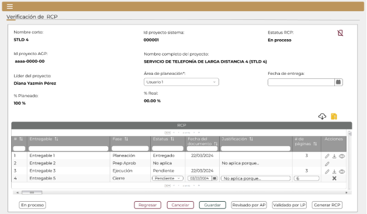
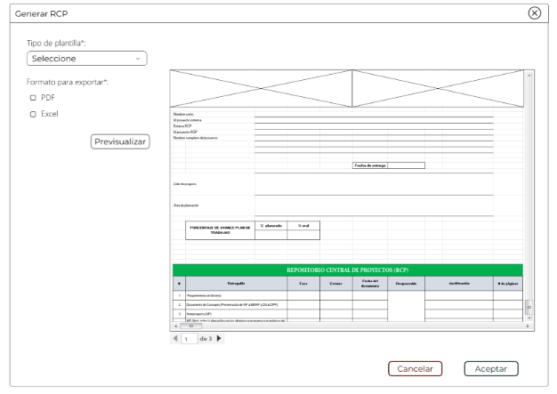

||Administración General de Comunicaciones y Tecnologías de la Información|
| :- | -: |
||Marco Documental 7.0|
|Fecha de aprobación del Template: 02/08/2023|
**Especificación de Interacción de Usuario**

17\_3083\_EIU\_CerrarProyecto.docx
|Versión del template: 7.00|
| :-: | :-: | :-: |

**<ID Requerimiento>** 8309

**Nombre del Requerimiento:** TI\_SISECOFI-SAT\_Seguimiento financiero y control documental de proyectos de contratación

## **Tabla de Versiones y Modificaciones**

|Versión|Descripción del cambio|Responsable de la Versión|Fecha|
| :-: | :- | :- | :-: |
|*1*|*Creación del documento*|Eduardo Acosta Mora|*08/03/2024*|
|*1.1*|*Revisión del documento*|Luis Angel Olguin Castillo|*17/04/2023*|
|*1.2*|*Versión aprobada para firma*|
María del Carmen Castillejos Cárdenas

Rubén Delgado Ramírez
|*21/06/2024*|

**TABLA DE CONTENIDO**

[Tabla de Versiones y Modificaciones	1](#_toc170140518)

[Módulo: Verificación de RCP	2](#_toc170140519)

[ESTILOS 01	2](#_toc170140520)

[Descripción de Elementos	3](#_toc170140521)

[Descripción de Campos	5](#_toc170140522)

[ESTILOS 02	17](#_toc170140523)

[Descripción de Elementos	18](#_toc170140524)

[Descripción de Campos	18](#_toc170140525)

[ESTILOS 03	20](#_toc170140526)

[Descripción de Elementos	21](#_toc170140527)

[Descripción de Campos	21](#_toc170140528)

[ESTILOS 04	25](#_toc170140529)

[Descripción de Elementos	26](#_toc170140530)

[Descripción de Campos	26](#_toc170140531)

##

## **MÓDULO: VERIFICACIÓN DE RCP**
## **ESTILOS 01**

|**Nombre de la Pantalla:**|Verificación de RCP|
| :- | :- |
|**Objetivo:**|Permite al Empleado SAT realizar la revisión y validación de los documentos adjuntos al proyecto, incluyendo sus contratos y/o convenios modificatorios, dictámenes y facturas relacionadas. |
|**Casos de uso relacionados:**|17\_3083\_ECU\_CerrarProyecto|
|||

### **DESCRIPCIÓN DE ELEMENTOS** 

|**Elemento**|**Descripción**|
| :- | :- |
|![ref1]|Opción que al seleccionarla muestra el menú principal desplegado en la parte izquierda de la pantalla; contiene los módulos principales y submódulos de este sistema.|
|Verificación de RCP|Título del módulo.|
|Nombre corto:|Nombre corto del proyecto.|
|Id proyecto sistema:|Id del proyecto asignado por el sistema.|
|Estatus RCP:|
Estatus de acuerdo con los movimientos que haga el Empleado SAT:

- En proceso

- Revisado por Área de Planeación

- Validado por Líder de Proyecto

- Cancelado

- RCP entregado
|
|![ref2]|Opción que permite cambiar del valor del campo “Estatus de RCP” a “Cancelado”.|
|Id proyecto AGP:|Id de proyecto AGP.|
|Nombre completo del proyecto:|Nombre completo del proyecto.|
|Líder del proyecto:|Líder del proyecto.|
|Área de planeación\*:|Campo que permite seleccionar un Empleado SAT para el área de planeación.|
|Fecha de entrega:|Opción que permite seleccionar o escribir una fecha.|
|% Planeado:|
Indica el porcentaje planeado de acuerdo con la siguiente fórmula:

*% Planeado= ((# documentos cargados) + (documentos no aplica)) / (documentos solicitados)* 

El resultado se multiplica por 100 para obtener el 100%

 

Ejemplo:

*% Planeado= ((75) + (5)) / (80)* 

*% Planeado = (80) / (80)* 

*% Planeado = 1\*100* 

*% Planeado = 100* 

  

**Nota**: El % Planeado siempre debe ser el 100%. 
|
|% Real:|
Indica el porcentaje real de acuerdo con la siguiente formula:

% Real= (Número de documentos con estatus “Entregado”, “No aplica” y “Sin documento”) / (# total de documentos asignados de la matriz documental) 

El resultado se multiplica por 100 para obtener el 100% 

Ejemplo 1: 

% Real= (40) / (80) 

% Real= 0.5\*100 

% Real= 50% 

Ejemplo 2: 

% Real= (80) / (80) 

% Real= 1\*100 

% Real= 100% 
|
|![ref3]|Opción que permite descargar los documentos adjuntos al proyecto, incluyendo sus contratos y/o convenios modificatorios, dictámenes y facturas relacionadas mediante el componente SATCloud. |
|![ref4]|Opción que permite la descarga masiva. Esta opción indica que se exportarán todos los documentos en una carpeta comprimida (.ZIP).|
|RCP|Título de la tabla.|
|![ref5]|Paginador que permite navegar a través de las páginas resultantes de la consulta, considerando que el sistema debe mostrar inicialmente 15 registros por página, permitiendo elegir visualizar 15, 50 y 100 registros por página.|
|![ref6]|Campo para filtrar información de la columna donde se requiera buscar específicamente.|
|![ref7]|Componente de ordenamiento que permite acomodar la información de la tabla de forma alfabética, ascendente o descendente, considerando la columna donde es seleccionado.|
|#|Indica de forma ascendente el número generado automáticamente por el entregable.|
|Entregable|Descripción del documento solicitado en la matriz documental.|
|Fase|Fase del proyecto a la que pertenece el documento.|
|Estatus|
Estatus del entregable y permite seleccionar una de las siguientes opciones:

- Entregado

- No aplica

- Pendiente

- Sin documento
|
|Fecha del documento|Permite seleccionar o escribir la fecha en que se elaboró o firmó el documento. |
|Justificación|Permite ingresar la justificación del documento. |
|# de páginas|Permite ingresar el número de páginas del documento.|
|Acciones|Acciones que se pueden hacer con los registros, mediante las opciones  ![ref8] , ![ref9] , ![ref10]  y ![ref11].|
|![ref12]|Opción que habilita y permite editar los campos del documento seleccionado.|
|![ref13]|Opción que permite la descarga del documento seleccionado.|
|![ref14]|Opción que se mostrará cuando el entregable sea solo tipo (PDF) y permitiría la visualización del documento seleccionado en una ventana emergente.|
|![ref15]|Opción que permite descartar la acción |
|![ref16]|Permite desplazarse de manera horizontal en la tabla. |
|![ref17]|Permite desplazarse de manera vertical en la tabla. |
|En proceso|
Opción que permite cambiar el valor del campo “Estatus RCP” a “En proceso”.

**Nota**: esta opción solo la visualizará el Empleado SAT con el rol “Administrador del sistema”.
|
|Regresar|Opción que permite regresar a la pantalla del proyecto.|
|Cancelar|Opción que realiza el proceso para cancelar la acción y regresa al último estado guardado.|
|Guardar|Opción que inicia el proceso para almacenar en la BD la información de la tabla (RCP).|
|Revisado por AP|Opción que permite cambiar el valor del campo “Estatus de RCP” a “Revisado por Área de Planeación”.|
|Validado por LP|Opción que permite cambiar el valor del campo “Estatus de RCP” a “Validado por Líder de proyecto”.|
|Generar RCP|
Opción que permite generar la vista previa del documento con los datos generales y los datos de la tabla y cambia el valor del campo “Estatus de RCP” a “RCP entregado”. 

**Notas**:

- ` `La opción “Generar RCP” será visible cuando el valor del campo “Estatus RCP” sea “Validado por Líder de proyecto” y/o “RCP entregado”.

- Esta opción se oculta cuando el valor del campo “Estatus RCP” sea diferente a “Validado por Líder de proyecto” y/o “RCP entregado” .
|

### **DESCRIPCIÓN DE CAMPOS**

|**Elemento**|**Tipo**|**Longitud**|
**Nivel de Acceso**

**(L, E, S)**
|**Descripción del Campo**|**Fórmulas**|**Precisiones**|
| :-: | :-: | :-: | :-: | :-: | :-: | :-: |
|![ref1]|Ícono|N/A|S|Opción que al seleccionarla muestra el menú principal desplegado en la parte izquierda de la pantalla; contiene los módulos principales y submódulos de este sistema.|N/A|N/A|
|Verificación de RCP|Texto|N/A|L|Título del módulo.|N/A|N/A|
|Nombre corto:|Alfanumérico|N/A|L|Nombre corto del proyecto.|N/A|N/A|
|Id proyecto sistema:|Numérico|5|L|Id del proyecto asignado por el sistema.|N/A|N/A|
|Estatus RCP:|Alfanumérico|N/A|L|
Estatus de acuerdo con los movimientos que haga el Empleado SAT:

“En proceso”, “Revisado por Área de Planeación”, “Validado por Líder de Proyecto”,

“Cancelado” y RCP entregado.
|N/A|N/A|
|![ref2]|Ícono|N/A|S|Opción que permite cambiar el valor del campo “Estatus de RCP” a “Cancelado”.|N/A|Usar *tooltip* que muestre el nombre de la opción “Cancelar estatus RCP”.|
|Id proyecto AGP:|Alfanumérico|12|L|
Id de proyecto AGP.

|N/A|N/A|
|Nombre completo del proyecto:|Alfanumérico|N/A|L|Nombre completo del proyecto.|N/A|N/A|
|Líder del proyecto:|Alfanumérico|N/A|L|Líder del proyecto.|N/A|N/A|
|Área de planeación\*:|Lista de selección|N/A|S|Campo que permite seleccionar un Empleado SAT para el área de planeación.|N/A|Campo obligatorio.|
|Fecha de entrega:|Fecha|10|S|Opción que permite seleccionar o escribir una fecha.|N/A|Formato de fecha DD/MM/AAAA|
|% Planeado:|Decimal|1 a 100|L|Indica el porcentaje planeado.|
*% Planeado= ((# documentos cargados) + (documentos no aplica)) / (documentos solicitados)*

El resultado se multiplica por 100 para obtener el 100%

|Dos decimales después del punto.|
|% Real:|Decimal|1 a 100|L|Indica el porcentaje real.|
% Real= (Número de documentos con estatus “Entregado”, “No aplica” y “Sin documento”) / (# total de documentos asignados de la matriz documental)

El resultado se multiplica por 100 para obtener el 100%
|El porcentaje real se recalculará cuando el valor del campo “Estatus” sobre el registro sea “No aplica” o “Entregado”.|
|![ref3]|Ícono|N/A|S|Opción que permite descargar los documentos adjuntos al proyecto, incluyendo sus contratos y/o convenios modificatorios, dictámenes y facturas relacionadas mediante el componente SATCloud.|N/A|Usar *tooltip* que muestre el nombre de la opción “SATCloud”.|
|![ref4]|Ícono|N/A|S|Opción que permite la descarga masiva. Esta opción indica que se exportarán todos los documentos en una carpeta comprimida (.ZIP).|N/A|Usar *tooltip* que muestre el nombre de la opción “Descargar ZIP”.|
|RCP|Texto|N/A|L|Título de la tabla.|N/A|N/A|
|![ref5]|Paginador|N/A|S|Paginador que permite navegar a través de las páginas resultantes de la consulta.|N/A|El sistema debe mostrar inicialmente 15 registros por página, permitiendo elegir visualizar 15, 50 y 100 registros por página.|
|![ref18]|Alfanumérico|N/A|E|Campo para filtrar información de la columna donde se requiera buscar específicamente.|N/A|N/A|
|![ref7]|Ícono|N/A|S|Componente de ordenamiento que permite acomodar la información de la tabla de forma alfabética, ascendente o descendente, considerando la columna donde es seleccionado.|N/A|N/A|
|#|Numérico|N/A|L|Indica de forma ascendente el número generado automáticamente por el entregable.|N/A|Usar *tooltip* que muestre el nombre de la opción “Número consecutivo”.|
|Entregable|Alfanumérico|N/A|L|Descripción del documento solicitado en la matriz documental.|N/A|N/A|
|Fase|Alfanumérico|N/A|L|Fase del proyecto a la que pertenece el documento.|N/A|N/A|
|Estatus|
Texto y

lista de selección
|N/A|L, S|
Estatus del entregable y permite seleccionar una de las siguientes opciones: “Entregado”, “No aplica”,

“Pendiente” y “Sin documento”.
|N/A|N/A|
|Fecha del documento|Fecha|10|L, S|Permite seleccionar o escribir la fecha en que se elaboró o firmó el documento.|N/A|Formato de fecha DD/MM/AAAA|
|Justificación|Alfanumérico|300|L, E|Indica y permite ingresar la justificación del documento.|N/A|Cuando el estatus del documento sea “No aplica”, el campo “Justificación” será obligatorio.|
|# de páginas|Numérico|N/A|L, E|Permite ingresar el número de páginas del documento.|N/A|Cuando el estatus del documento sea “Entregado”, el campo “# de páginas” será obligatorio.|
|Acciones|Texto|N/A|L|Acciones que se pueden hacer con los registros, mediante las opciones  ![ref8] , ![ref9] , ![ref10]  y ![ref11]..|N/A|N/A|
|![ref19]|Ícono|N/A|S|Opción que habilita y permite editar los campos del documento seleccionado.|N/A|Usar *tooltip* que muestre el nombre de la opción “Editar”.|
|![ref20]|Ícono|N/A|S|Opción que permite la descarga del documento seleccionado.|N/A|Usar *tooltip* que muestre el nombre de la opción “Descargar documento”.|
|![ref21]|Ícono|N/A|S|Opción que se mostrará cuando el entregable sea solo tipo (PDF) y permitiría la visualización del documento seleccionado en una ventana emergente.|N/A|Usar *tooltip* que muestre el nombre de la opción “Ver PDF”.|
|![ref15]|Ícono|N/A|S|Opción que permite descartar la acción|N/A|N/A|
|![ref22]|Barra de desplazamiento|N/A|S|Permite desplazarse de manera horizontal en la tabla.|N/A|N/A|
|![ref17]|Barra de desplazamiento|N/A|S|Permite desplazarse de manera vertical en la tabla.|N/A|N/A|
|En proceso|Botón|N/A|S|Opción que permite cambiar el valor del campo “Estatus RCP” a “En proceso”.|N/A|Esta opción solo la visualizará el Empleado SAT con el rol y los permisos correspondientes|
|Regresar|Botón|N/A|S|Opción que permite regresar a la pantalla del proyecto.|N/A|
Inicialmente se muestra sin color de fondo y con el texto y contorno en color guinda (#691c32).

Cuando se le pone el cursor encima debe cambiar a fondo guinda (#691c32) y letras blancas.
|
|Cancelar|Botón|N/A|S|Opción que realiza el proceso para cancelar la acción y regresa al último estado guardado.|N/A|
Inicialmente se muestra sin color de fondo y con el texto y contorno en color guinda (#691c32).

Cuando se le pone el cursor encima debe cambiar a fondo guinda (#691c32) y letras blancas.
|
|Guardar|Botón|N/A|S|Opción que inicia el proceso para almacenar en la BD la información de la tabla (RCP).|N/A|
Inicialmente se muestra sin color de fondo y con el texto y contorno en color verde oscuro (#10312B).

Cuando se le pone el cursor encima debe cambiar con fondo verde oscuro (#10312B) y letras blancas.

|
|Revisado por AP|Botón|N/A|S|Opción que permite cambiar el valor del campo “Estatus de RCP” a “Revisado por Área de Planeación”.|N/A|
Esta opción se oculta cuando el valor del campo “Estatus RCP” sea “Revisado por Área de Planeación”.

Usar *tooltip* que muestre el nombre de la opción “Revisado por Área de Planeación”.

Inicialmente se muestra sin color de fondo y con contorno en color gris.

Cuando se le coloca el cursor encima debe cambiar a fondo gris.
|
|Validado por LP|Botón|N/A|S|
Opción que permite cambiar el valor del campo “Estatus de RCP” a “Validado por Líder de proyecto”.

|N/A|
Esta opción será visible cuando el valor del campo “Estatus RCP” sea “Revisado por Área de Planeación”.

Esta opción se oculta cuando el valor del campo “Estatus RCP” sea “Validado por Líder de proyecto” o “En proceso”.

Usar *tooltip* que muestre el nombre de la opción “Validado por Líder de Proyecto”.

Inicialmente se muestra sin color de fondo y con contorno en color gris.

Cuando se le coloca el cursor encima debe cambiar a fondo gris.
|
|Generar RCP|Botón|N/A|S|
Opción que permite generar la vista previa del documento con los datos generales y los datos de la tabla y cambia el valor del campo “Estatus de RCP” a “RCP entregado”.

|N/A|
La opción “Generar RCP” será visible cuando el valor del campo “Estatus RCP” sea “Validado por Líder de proyecto” y/o “RCP entregado”.

Esta opción se oculta cuando el valor del campo “Estatus RCP” sea diferente a “Validado por Líder de proyecto” y/o “RCP entregado” .

Inicialmente se muestra sin color de fondo y con contorno en color gris.

Cuando se le coloca el cursor encima debe cambiar a fondo gris.
|
## **ESTILOS 02**

|**Nombre de la Pantalla:**|Ver PDF|
| :- | :- |
|**Objetivo:**|Permite al Empleado SAT visualizar un documento PDF adjunto.|
|**Casos de uso relacionados:**|17\_3083\_ECU\_CerrarProyecto|
|||

### **DESCRIPCIÓN DE ELEMENTOS** 

|**Elemento**|**Descripción**|
| :- | :- |
|Ver PDF|Título de la ventana.|
|![ref23]|Opción que permite cerrar la ventana.|
|![ref24]|Componente que permite visualizar la vista previa de un documento PDF.|
|![ref25]|Paginador que permite navegar a través de las páginas resultantes del documento PDF.|
|![ref16]|Permite desplazarse de manera horizontal en el documento.|
|![ref17]|Permite desplazarse de manera vertical en el documento.|
|Cerrar|Opción que permite cerrar la ventana.|

### **DESCRIPCIÓN DE CAMPOS**

|**Elemento**|**Tipo**|**Longitud**|
**Nivel de Acceso**

**(L, E, S)**
|**Descripción del Campo**|**Fórmulas**|**Precisiones**|
| :-: | :-: | :-: | :-: | :-: | :-: | :-: |
|Ver PDF|Texto|N/A|L|Título de la ventana.|N/A|N/A|
|![ref23]|Ícono|N/A|S|Opción que permite cerrar la ventana.|N/A|Usar *tooltip* que muestre el nombre de la opción “Cerrar ventana”.|
|![ref24]|Panel de visualización|N/A|L|Componente que permite visualizar la vista previa de un documento PDF.|N/A|N/A|
|![ref26]|Paginador|N/A|S|Paginador que permite navegar a través de las páginas resultantes del documento PDF.|N/A|N/A|
|![ref16]|Barra de desplazamiento|N/A|S|Permite desplazarse de manera horizontal en el documento.|N/A|N/A|
|![ref27]|Barra de desplazamiento|N/A|S|Permite desplazarse de manera vertical en el documento.|N/A|N/A|
|Cerrar|Botón|N/A|S|Opción que permite cerrar la ventana.|N/A|
Inicialmente se muestra sin color de fondo y con el texto y contorno en color guinda (#691c32).

Cuando se le pone el cursor encima debe cambiar a fondo guinda (#691c32) y letras blancas.
|

## **ESTILOS 03**

|**Nombre de la Pantalla:**|Generar RCP|
| :- | :- |
|**Objetivo:**|Permite al Empleado SAT generar el archivo RCP.|
|**Casos de uso relacionados:**|17\_3083\_ECU\_CerrarProyecto|
|||

### **DESCRIPCIÓN DE ELEMENTOS** 

|**Elemento**|**Descripción**|
| :- | :- |
|Generar RCP|Título de la ventana.|
|![Icono

Descripción generada automáticamente][ref23]|Opción que permite cerrar la ventana.|
|Tipo de plantilla\*:|Campo que obtiene las plantillas (RCP), permitiendo la selección de una. La plantilla seleccionada incluye el “Encabezado”, “Cuerpo” y “Pie de página”.|
|Formato para exportar\*:|
Indica qué tipo de documento se generará de acuerdo con las siguientes opciones:

- Excel

- PDF
|
|![ref28] ![ref29]|
Permite seleccionar qué tipo de documento se generará de acuerdo con lo siguiente:

![ref30]Excel

![ref31]PDF
|
|Previsualizar|Opción que permite previsualizar el documento de acuerdo con la información seleccionada.|
|![ref32]|Componente que permite visualizar la vista previa de un documento.|
|![ref25]|Paginador que permite navegar a través de las páginas resultantes del documento PDF.|
|![ref16]|Permite desplazarse de manera horizontal en el documento.|
|![ref17]|Permite desplazarse de manera vertical en el documento.|
|Cancelar|Opción que realiza el proceso para cancelar la acción y cierra la ventana.|
|Aceptar|Opción que permite hacer la descarga del archivo generado de acuerdo con la información seleccionada.|

### **DESCRIPCIÓN DE CAMPOS**

|**Elemento**|**Tipo**|**Longitud**|
**Nivel de Acceso**

**(L, E, S)**
|**Descripción del Campo**|**Fórmulas**|**Precisiones**|
| :-: | :-: | :-: | :-: | :-: | :-: | :-: |
|Generar RCP|Texto|N/A|L|Título de la ventana.|N/A|N/A|
|![Icono

Descripción generada automáticamente][ref23]|Ícono|N/A|S|Opción que permite cerrar la ventana.|N/A|Usar *tooltip* que muestre el nombre de la opción “Cerrar ventana”.|
|Tipo de plantilla\*:|Lista de selección|N/A|S|Campo que obtiene las plantillas (RCP), permitiendo la selección de una. La plantilla seleccionada incluye el “Encabezado”, “Cuerpo” y “Pie de página”.|N/A|Campo obligatorio.|
|Formato para exportar\*:|Texto|N/A|L|
Indica qué tipo de documento se generará de acuerdo con las siguientes opciones:

- Excel

- PDF
|N/A|Campo obligatorio.|
|![ref28] ![ref29]|Casilla de selección|N/A|S|Permite seleccionar qué tipo de documento se generará.|N/A|
![ref33]Excel

![ref31]PDF
|
|Previsualizar|Botón|N/A|S|Opción que permite previsualizar el documento de acuerdo con la información seleccionada.|N/A|
Inicialmente se muestra sin color de fondo y con contorno en color gris.

Cuando se le coloca el cursor encima debe cambiar a fondo gris.
|
|![ref32]|Panel de visualización|N/A|L|Componente que permite visualizar la vista previa de un documento.|N/A|N/A|
|![ref25]|Paginador|N/A|L|Paginador que permite navegar a través de las páginas resultantes del documento PDF.|N/A|N/A|
|![ref16]|Barra de desplazamiento|N/A|S|Permite desplazarse de manera horizontal en el documento.|N/A|N/A|
|![ref17]|Barra de desplazamiento|N/A|S|Permite desplazarse de manera vertical en el documento.|N/A|N/A|
|Cancelar|Botón|N/A|S|Opción que realiza el proceso para cancelar la acción y cierra la ventana.|N/A|
Inicialmente se muestra sin color de fondo y con el texto y contorno en color guinda (#691c32).

Cuando se le pone el cursor encima debe cambiar a fondo guinda (#691c32) y letras blancas.
|
|Aceptar|Botón|N/A|S|Opción que permite hacer la descarga del archivo generado de acuerdo con la información seleccionada.|N/A|
Inicialmente se muestra sin color de fondo y con el texto y contorno en color verde oscuro (#10312B).

Cuando se le pone el cursor encima debe cambiar a fondo verde oscuro (#10312B) y letras blancas.
|

## **ESTILOS 04**

|**Nombre de la Pantalla:**|Datos de la descarga|
| :- | :- |
|**Objetivo:**|Ventana que muestra el enlace y contraseña para la descarga en SATCloud.|
|**Casos de uso relacionados:**|17\_3083\_ECU\_CerrarProyecto|
|||

### **DESCRIPCIÓN DE ELEMENTOS** 

|**Elemento**|**Descripción**|
| :- | :- |
|Datos de descarga|Título de la ventana.|
|![ref34]|Opción que permite cerrar la ventana.|
|url|Campo que muestra la url de descarga de SATCloud.|
|contraseña|Campo que muestra la contraseña para descarga del archivo en SATCloud.|
|![ref35]|Opción que permite copiar la contraseña.|
|Cerrar|Opción que permite cerrar la ventana.|

### **DESCRIPCIÓN DE CAMPOS**

|**Elemento**|**Tipo**|**Longitud**|
**Nivel de Acceso**

**(L, E, S)**
|**Descripción del Campo**|**Fórmulas**|**Precisiones**|
| :-: | :-: | :-: | :-: | :-: | :-: | :-: |
|Datos de descarga|Texto|N/A|L|Título de la ventana.|N/A|N/A|
|![ref36]|Ícono|N/A|S|Opción que permite cerrar la ventana.|N/A|Usar *tooltip* que muestre el nombre de la opción “Cerrar ventana”.|
|Url|Texto|N/A|S|Campo que muestra la Url de descarga de SATCloud.|N/A|N/A|
|Contraseña|Texto|N/A|L|Campo que muestra la contraseña para descarga del archivo en SATCloud.|N/A|N/A|
|![ref35]|Ícono|N/A|S|Opción que permite copiar la contraseña.|N/A|N/A|
|Cerrar|Botón|N/A|S|Opción que permite cerrar la ventana.|N/A|
Inicialmente se muestra sin color de fondo y con el texto y contorno en color guinda (#691c32).

Cuando se le pone el cursor encima debe cambiar a fondo guinda (#691c32) y letras blancas.
|

|**FIRMAS DE CONFORMIDAD**||
| :-: | :- |
|**Firma 1** |**Firma 2** |
|**Nombre**: María del Carmen Castillejos Cárdenas.|**Nombre**: Rubén Delgado Ramírez.|
|**Puesto**: Usuaria ACPPI.|**Puesto**: Usuario ACPPI.|
|**Fecha:**|**Fecha:**|
|||
|**Firma 3** |**Firma 4**|
|**Nombre**: Rodolfo López Meneses.|**Nombre**: Diana Yazmín Pérez Sabido.|
|**Puesto**: Usuario ACPPI.|**Puesto**: Usuaria ACPPI.|
|**Fecha:**|**Fecha:**|
|||
|**Firma 5**|**Firma 6**|
|**Nombre**: Yesenia Helvetia Delgado Naranjo.|**Nombre:** Alejandro Alfredo Muñoz Núñez.|
|**Puesto**: APE ACPPI.|**Puesto:** RAPE ACPPI.|
|**Fecha**:|**Fecha**:|
|||
|**Firma 7**|**Firma 8**|
|**Nombre**: Luis Angel Olguin Castillo.|**Nombre**: Erick Villa Beltrán.|
|**Puesto**: Enlace ACPPI.|**Puesto**: Líder APE SDMA6.|
|**Fecha**:|**Fecha**:|
|||
|**Firma 9**|**Firma 10**|
|**Nombre:** Juan Carlos Ayuso Bautista.|**Nombre:** Eduardo Acosta Mora.|
|**Puesto:** Líder Técnico SDMA 6.|**Puesto:** Analista SDMA 6. |
|**Fecha**:|**Fecha**:|
|||

|||Página 21 de 22|
| :- | :-: | -: |

[ref1]: Aspose.Words.1faeeaf1-2de2-4774-a763-e47f3900ca7e.003.png
[ref2]: Aspose.Words.1faeeaf1-2de2-4774-a763-e47f3900ca7e.004.png
[ref3]: Aspose.Words.1faeeaf1-2de2-4774-a763-e47f3900ca7e.005.png
[ref4]: Aspose.Words.1faeeaf1-2de2-4774-a763-e47f3900ca7e.006.png
[ref5]: Aspose.Words.1faeeaf1-2de2-4774-a763-e47f3900ca7e.007.png
[ref6]: Aspose.Words.1faeeaf1-2de2-4774-a763-e47f3900ca7e.008.png
[ref7]: Aspose.Words.1faeeaf1-2de2-4774-a763-e47f3900ca7e.009.png
[ref8]: Aspose.Words.1faeeaf1-2de2-4774-a763-e47f3900ca7e.010.png
[ref9]: Aspose.Words.1faeeaf1-2de2-4774-a763-e47f3900ca7e.011.png
[ref10]: Aspose.Words.1faeeaf1-2de2-4774-a763-e47f3900ca7e.012.png
[ref11]: Aspose.Words.1faeeaf1-2de2-4774-a763-e47f3900ca7e.013.png
[ref12]: Aspose.Words.1faeeaf1-2de2-4774-a763-e47f3900ca7e.014.png
[ref13]: Aspose.Words.1faeeaf1-2de2-4774-a763-e47f3900ca7e.015.png
[ref14]: Aspose.Words.1faeeaf1-2de2-4774-a763-e47f3900ca7e.016.png
[ref15]: Aspose.Words.1faeeaf1-2de2-4774-a763-e47f3900ca7e.017.png
[ref16]: Aspose.Words.1faeeaf1-2de2-4774-a763-e47f3900ca7e.018.png
[ref17]: Aspose.Words.1faeeaf1-2de2-4774-a763-e47f3900ca7e.019.png
[ref18]: Aspose.Words.1faeeaf1-2de2-4774-a763-e47f3900ca7e.020.png
[ref19]: Aspose.Words.1faeeaf1-2de2-4774-a763-e47f3900ca7e.021.png
[ref20]: Aspose.Words.1faeeaf1-2de2-4774-a763-e47f3900ca7e.022.png
[ref21]: Aspose.Words.1faeeaf1-2de2-4774-a763-e47f3900ca7e.023.png
[ref22]: Aspose.Words.1faeeaf1-2de2-4774-a763-e47f3900ca7e.024.png
[ref23]: Aspose.Words.1faeeaf1-2de2-4774-a763-e47f3900ca7e.026.png
[ref24]: Aspose.Words.1faeeaf1-2de2-4774-a763-e47f3900ca7e.027.png
[ref25]: Aspose.Words.1faeeaf1-2de2-4774-a763-e47f3900ca7e.028.png
[ref26]: Aspose.Words.1faeeaf1-2de2-4774-a763-e47f3900ca7e.029.png
[ref27]: Aspose.Words.1faeeaf1-2de2-4774-a763-e47f3900ca7e.030.png
[ref28]: Aspose.Words.1faeeaf1-2de2-4774-a763-e47f3900ca7e.032.png
[ref29]: Aspose.Words.1faeeaf1-2de2-4774-a763-e47f3900ca7e.033.png
[ref30]: Aspose.Words.1faeeaf1-2de2-4774-a763-e47f3900ca7e.034.png
[ref31]: Aspose.Words.1faeeaf1-2de2-4774-a763-e47f3900ca7e.035.png
[ref32]: Aspose.Words.1faeeaf1-2de2-4774-a763-e47f3900ca7e.036.png
[ref33]: Aspose.Words.1faeeaf1-2de2-4774-a763-e47f3900ca7e.037.png
[ref34]: Aspose.Words.1faeeaf1-2de2-4774-a763-e47f3900ca7e.039.png
[ref35]: Aspose.Words.1faeeaf1-2de2-4774-a763-e47f3900ca7e.040.png
[ref36]: Aspose.Words.1faeeaf1-2de2-4774-a763-e47f3900ca7e.041.png
