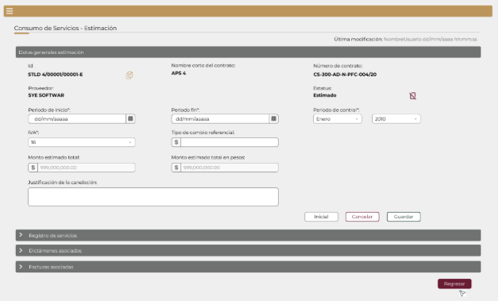
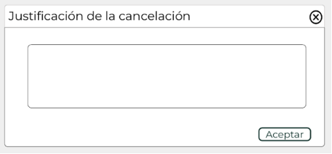
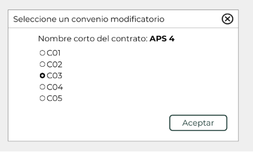

||Administración General de Comunicaciones y Tecnologías de la Información|
| :- | -: |
||Marco Documental 7.0|
|Fecha de aprobación del Template: 02/08/2023|
**Especificación de Interacción de Usuario**

17\_3083\_EIU\_CrearEstimacion.docx
|Versión del template: 7.00|
| :-: | :-: | :-: |

**<ID Requerimiento>** 8309

**Nombre del Requerimiento:** TI\_SISECOFI-SAT\_Seguimiento financiero y control documental de proyectos de contratación
## **Tabla de Versiones y Modificaciones**

|Versión|Descripción del cambio|Responsable de la Versión|Fecha|
| :- | :- | :-: | :-: |
|*1*|*Creación del documento*|Isabel Adriana Valdez Cortés|*14/02/2024*|
|*1.1*|*Revisión del documento*|Luis Angel Olguin Castillo|*23/04/2024*|
|*1.2*|*Versión aprobada para firma*|
María del Carmen Castillejos Cárdenas

Rubén Delgado Ramírez
|*17/06/2024*|

**TABLA DE CONTENIDO**

[Tabla de Versiones y Modificaciones	1](#_toc169692606)

[Módulo: CONSUMO DE SERVICIOS	2](#_toc169692607)

[ESTILOS 01	2](#_toc169692608)

[Descripción de Elementos	3](#_toc169692609)

[Descripción de Campos	4](#_toc169692610)

[ESTILOS 02	11](#_toc169692611)

[Descripción de Elementos	12](#_toc169692612)

[Descripción de Campos	13](#_toc169692613)

[ESTILOS 03	21](#_toc169692614)

[Descripción de Elementos	22](#_toc169692615)

[Descripción de Campos	23](#_toc169692616)

[ESTILOS 04	32](#_toc169692617)

[Descripción de Elementos	33](#_toc169692618)

[Descripción de Campos	33](#_toc169692619)

[ESTILOS 05	37](#_toc169692620)

[Descripción de Elementos	38](#_toc169692621)

[Descripción de Campos	39](#_toc169692622)

[ESTILOS 06	44](#_toc169692623)

[Descripción de Elementos	44](#_toc169692624)

[Descripción de Campos	45](#_toc169692625)

[ESTILOS 07	46](#_toc169692626)

[Descripción de Elementos	46](#_toc169692627)

[Descripción de Campos	47](#_toc169692628)

## **MÓDULO: CONSUMO DE SERVICIOS**
## **ESTILOS 01**

|**Nombre de la Pantalla:** |Consumo de Servicios - Estimación|
| :- | :- |
|**Objetivo:**|
Permitir al Empleado SAT capturar la información para crear una nueva estimación.

|
|**Casos de uso relacionados:**|17\_3083\_ECU\_CrearEstimacion|

` `

### ` `**DESCRIPCIÓN DE ELEMENTOS** 

|**Elemento**|**Descripción**|
| :- | - |
|![ref1]|Opción que al seleccionarla muestra el menú principal desplegado en la parte izquierda de la pantalla; contiene los módulos principales y submódulos de este sistema. |
|Consumo de Servicios - Estimación|Título del encabezado. Contiene el nombre del submódulo “Consumo de Servicios - Estimación”.|
|Última modificación:|Campo que muestra el Nombre del Empleado SAT, la fecha y hora de la última modificación que se encuentre registrada en la BD.|
|Datos generales estimación|Título de la sección que permite la captura de los datos generales de la estimación.|
|Id:|Campo que muestra el identificador generado por el sistema para la estimación.|
|Nombre corto del contrato:|Campo que muestra el nombre corto del contrato.|
|Número de contrato:|Campo que muestra el número del contrato.|
|Proveedor:|Campo que muestra el nombre del proveedor relacionado al contrato.|
|Estatus:|Campo que muestra el estatus de la estimación.|
|Periodo de inicio\*:|Campo que permite seleccionar la fecha de inicio de la estimación.|
|Periodo fin\*: |Campo que permite seleccionar la fecha de fin de la estimación.|
|Periodo de control\*:|Campo que permite seleccionar el mes del periodo de control.|
||Campo que permite seleccionar el año del periodo de control.|
|IVA\*:|Campo que permite seleccionar el IVA asociado al contrato.|
|Tipo de cambio referencial:|Campo que permite capturar el tipo de cambio referencial.|
|Monto estimado total:|Campo que muestra el resultado de la suma del monto estimado de todos los concepto de servicio.|
|Monto estimado total en pesos:|Campo que muestra el monto estimado total en pesos.|
|Cancelar|Opción que realiza el proceso para cancelar la acción y regresa al último estado guardado. |
|Guardar|Opción que inicia el proceso para almacenar en la base de datos (BD) la información de la sección “Datos generales estimación”.|
|Registro de servicios|Sección colapsada “Registro de servicios” de la estimación.|
|Dictámenes asociados|Sección colapsada “Dictámenes asociados” de la estimación.|
|Facturas asociadas|Sección colapsada “Facturas asociadas” de la estimación.|
|![Forma

Descripción generada automáticamente con confianza baja]|
Opción que despliega o contrae la sección, tomando en cuenta lo siguiente: 

Sección contraída ![Forma

Descripción generada automáticamente con confianza baja] 

Sección desplegada![Forma

Descripción generada automáticamente con confianza baja] 
|
|Regresar|Opción que permite regresar a la pantalla principal del módulo de “Consumo de servicios”.|

### **DESCRIPCIÓN DE CAMPOS**

|**Elemento**|**Tipo**|**Longitud**|
**Nivel de Acceso**

**(L, E, S)**
|**Descripción del Campo**|**Fórmulas**|**Precisiones**|
| :-: | :-: | :-: | :-: | :-: | :-: | :-: |
|![ref1]|Ícono|N/A|S|Opción que al seleccionarla muestra el menú principal desplegado en la parte izquierda de la pantalla; contiene los módulos principales y submódulos de este sistema. |N/A|N/A|
|Consumo de Servicios - Estimación|Texto|N/A|L|Título del encabezado. Contiene el nombre del submódulo “Consumo de Servicios - Estimación”.|N/A|Para el encabezado puede hacerse uso de mayúsculas y minúsculas.|
|Última modificación:|Texto|100|L|Campo que muestra el Nombre del Empleado SAT, la fecha y hora de la última modificación que se encuentre registrada en la BD.|N/A|
Usar formato de fecha/tiempo:

DD/MM/AAAA HH:MM:SS

Inicialmente se muestra solo la etiqueta. 
|
|Datos generales estimación|Sección|N/A|L|Título de la sección que permite la captura de los datos generales de la estimación.|N/A|N/A|
|Id:|Texto|60|L|Campo que muestra el identificador generado por el sistema para la estimación.|N/A|
Considerar la siguiente estructura del identificador de la estimación, separando por pipe cada dato: NombreCortoContrato|IDProveedor|ConsecutivoEstimación-E

Incrementa el “ConsecutivoEstimación“ considerando la última estimación registrada.
|
|Nombre corto del contrato:|Texto|50|L|Campo que muestra el nombre corto del contrato.|N/A|N/A|
|Número de contrato:|Texto|50|L|Campo que muestra el número del contrato.|N/A|N/A|
|Proveedor:|Texto|N/A|L|Campo que muestra el nombre del proveedor relacionado al contrato.|N/A|N/A|
|Estatus:|Texto|15|L|Campo que muestra el estatus de la estimación.|N/A|Es el estatus es generado y actualizado por el sistema.|
|Periodo de inicio\*:|Fecha|10|L, E, S|Campo que permite seleccionar la fecha de inicio de la estimación.|N/A|Al seleccionar el ícono ![ref2] muestra un calendario.  Campo obligatorio.|
|Periodo fin\*: |Fecha|10|L, E, S|Campo que permite seleccionar la fecha de fin de la estimación.|N/A|Al seleccionar el ícono ![ref2] muestra un calendario.  Campo obligatorio.|
|Periodo de control\*:|Lista de selección|N/A|L, S|Campo que permite seleccionar el mes del periodo de control.|N/A|
Campo obligatorio.

Considerar el catálogo de meses.
|
||Lista de selección|N/A|L, S|Campo que permite seleccionar el año del periodo de control.||
Campo obligatorio.

Considerar el catálogo de años desde el 2010 hasta el año en curso +1.
|
|IVA\*:|Numérico|N/A|S|Campo que permite seleccionar el IVA asociado al contrato.|N/A|Si no aplica IVA en el contrato, en el campo se coloca “0” (cero).|
|Tipo de cambio referencial:|Numérico (Decimal)|15|L, E|
Campo que permite capturar el tipo de cambio referencial.

|N/A|
Se muestra en la pantalla únicamente si el tipo de moneda del contrato es diferente de pesos (MXN) y se vuelve obligatorio.

Considerar hasta 4 decimales.
|
|Monto estimado total:|Numérico (Decimal)|20|L|Campo que muestra el resultado de la suma del monto estimado de cada concepto de servicio.|
Se calcula por cada concepto de servicio el **Monto estimado** = precio unitario \* cantidad de servicios. 

Se calcula por cada concepto de servicio en donde aplique el **IEPS** = Cantidad de servicios \* Precio unitario \* el % de IEPS determinado en el contrato. 

Se calcula por cada concepto de servicio el **IVA** = Monto estimado \* % de IVA (seleccionado en los datos generales).

Se calcula el:

**Monto estimado total**= ∑ (Monto estimado +IEPS +IVA) 
|
Usar el formato:

$999,999,999,999.00

Todos los resultados de los cálculos deben estar redondeados a 2 decimales). 
|
|Monto estimado total en pesos:|Numérico (Decimal)|20|L|Campo que muestra el monto estimado total en pesos. |**Monto estimado total en pesos** = Monto estimado total × Tipo de cambio referencial|
Usar el formato:

$999,999,999,999.00

Si el tipo de moneda es diferente de pesos el sistema debe realizar la conversión a pesos tomando en cuenta el tipo de cambio referencial, en caso contrario se muestra el mismo monto estimado total.
|
|Cancelar|Botón|N/A|S|Opción que realiza el proceso para cancelar la acción y regresa al último estado guardado. |N/A|
Inicialmente se muestra sin color de fondo y con el texto y contorno en color guinda (#691c32).

Cuando se pone el cursor encima debe cambiar a fondo guinda (#691c32) y letras blancas.
|
|Guardar|Botón |N/A |S |Opción que inicia el proceso para almacenar en la base de datos (BD) la información de la sección “Datos generales estimación”.|N/A |
Inicialmente se muestra sin color de fondo y con el texto y contorno en color verde oscuro (#10312B). 

Cuando se le pone el cursor encima debe cambiar a fondo verde oscuro (#10312B) y letras blancas.
|
|Registro de servicios|Sección|N/A|S|Sección colapsada “Registro de servicios” de la estimación.|N/A|N/A|
|Dictámenes asociados|Sección|N/A|S|Sección colapsada “Dictámenes asociados” de la estimación.|N/A|N/A|
|Facturas asociadas|Sección|N/A|S|Sección colapsada “Facturas asociadas” de la estimación.|N/A|N/A|
|![Forma

Descripción generada automáticamente con confianza baja]|Ícono |N/A |S |Opción que despliega o contrae la sección.|N/A |
Sección contraída ![Forma

Descripción generada automáticamente con confianza baja]

Sección desplegada![Forma

Descripción generada automáticamente con confianza baja]
|
|Regresar|Botón|N/A|S|Opción que permite regresar a la pantalla principal del módulo de “Consumo de servicios”.|N/A|
Inicialmente se muestra sin color de fondo y con el texto y contorno en color guinda (#691c32).

Cuando se pone el cursor encima debe cambiar a fondo guinda (#691c32) y letras blancas.
|

## **ESTILOS 02**

|**Nombre de la Pantalla:** |
Consumo de Servicio – Estimación (modificar)

|
| :- | :- |
|**Objetivo:**|
Permitir al Empleado SAT modificar la información capturada previamente.

|
|**Casos de uso relacionados:**|17\_3083\_ECU\_CrearEstimacion|

`  `

**Nota**: Los datos mostrados en las pantallas son de ejemplo.

### **DESCRIPCIÓN DE ELEMENTOS** 

|**Elemento**|**Descripción**|
| :- | :- |
|![ref1]|Opción que al seleccionarla muestra el menú principal desplegado en la parte izquierda de la pantalla; contiene los módulos principales y submódulos de este sistema. |
|Consumo de Servicios - Estimación|Título del encabezado. Contiene el nombre del submódulo “Consumo de Servicios - Estimación”.|
|Última modificación:|Campo que muestra el Nombre del Empleado SAT, la fecha y hora de la última modificación que se encuentre registrada en la BD.|
|Datos generales estimación|Título de la sección que permite la captura de los datos generales de la estimación.|
|Id:|Campo que muestra el identificador generado por el sistema para la estimación.|
|Nombre corto del contrato:|Campo que muestra el nombre corto del contrato.|
|Número de contrato:|Campo que muestra el número del contrato.|
|Proveedor:|Campo que muestra el nombre del proveedor relacionado al contrato.|
|Estatus:|Campo que muestra el estatus de la estimación.|
|Periodo de inicio\*:|Campo que permite seleccionar la fecha de inicio de la estimación.|
|Periodo fin\*: |Campo que permite seleccionar la fecha de fin de la estimación.|
|Periodo de control\*:|Campo que permite seleccionar el mes del periodo de control.|
||Campo que permite seleccionar el año del periodo de control.|
|IVA\*:|Campo que permite seleccionar el IVA asociado al contrato.|
|Tipo de cambio referencial:|Campo que permite capturar el tipo de cambio referencial.|
|Monto estimado total:|Campo que muestra el resultado de la suma del monto estimado de cada concepto de servicio.|
|Monto estimado total en pesos:|Campo que muestra el monto estimado total en pesos.|
|Justificación|Campo que muestra la justificación registrada de la cancelación de la estimación.|
|Inicial|Opción que permite cambiar el estatus de la estimación a “Inicial”.|
|Cancelar|Opción que realiza el proceso para cancelar la acción y regresa al último estado guardado. |
|Guardar|Opción que inicia el proceso para almacenar en la base de datos (BD) la información de la sección “Datos generales estimación”.|
|![ref3]|Opción que permite duplicar la información de las secciones: “Datos generales” y “Registro de los servicios”, quedando una nueva estimación con estatus “Inicial”.|
|![ref4]|Opción que permite cambiar el estatus de la estimación a “Cancelado”.|
|Registro de servicios|Sección colapsada “Registro de servicios” de la estimación.|
|Dictámenes asociados|Sección colapsada “Dictámenes asociados” de la estimación.|
|Facturas asociadas|Sección colapsada “Facturas asociadas” de la estimación.|
|![Forma

Descripción generada automáticamente con confianza baja]|
Opción que despliega o contrae la sección, tomando en cuenta lo siguiente: 

Sección contraída ![Forma

Descripción generada automáticamente con confianza baja] 

Sección desplegada![Forma

Descripción generada automáticamente con confianza baja] 
|
|Regresar|Opción que permite regresar a la pantalla principal del módulo de “Consumo de servicios”.|

### **DESCRIPCIÓN DE CAMPOS**

|**Elemento**|**Tipo**|**Longitud**|
**Nivel de Acceso**

**(L, E, S)**
|**Descripción del Campo**|**Fórmulas**|**Precisiones**|
| :-: | :-: | :-: | :-: | :-: | :-: | :-: |
|![ref1]|Ícono|N/A|S|Opción que al seleccionarla muestra el menú principal desplegado en la parte izquierda de la pantalla; contiene los módulos principales y submódulos de este sistema. |N/A|N/A|
|Consumo de Servicios - Estimación|Texto|N/A|L|Título del encabezado. Contiene el nombre del submódulo “Consumo de Servicios - Estimación”.|N/A|Para el encabezado puede hacerse uso de mayúsculas y minúsculas.|
|Última modificación:|Texto|100|L|Campo que muestra el Nombre del Empleado SAT, la fecha y hora de la última modificación que se encuentre registrada en la BD.|N/A|
Usar formato de fecha/tiempo:

DD/MM/AAAA HH:MM:SS
|
|Datos generales estimación|Sección|N/A|L|Título de la sección que permite la captura de los datos generales de la estimación.|N/A|N/A|
|Id:|Texto|60|L|Campo que muestra el identificador generado por el sistema para la estimación.|N/A|
Considerar la siguiente estructura del identificador de la estimación, separando por pipe cada dato: NombreCortoContrato|IDProveedor|ConsecutivoEstimación-E

Incrementa el “ConsecutivoEstimación“ considerando la última estimación registrada.
|
|Nombre corto del contrato:|Texto|50|L|Campo que muestra el nombre corto del contrato.|N/A|N/A|
|Número de contrato:|Texto|50|L|Campo que muestra el número del contrato.|N/A|N/A|
|Proveedor:|Texto|N/A|L|Campo que muestra el nombre del proveedor relacionado al contrato.|N/A|N/A|
|Estatus:|Texto|15|L|Campo que muestra el estatus de la estimación.|N/A|El estatus es generado y actualizado por el sistema.|
|Periodo de inicio\*:|Fecha|10|L, E, S|Campo que permite seleccionar la fecha de inicio de la estimación.|N/A|Al seleccionar el ícono ![ref2] muestra un calendario.  Campo obligatorio.|
|Periodo fin\*: |Fecha|10|L, E, S|Campo que permite seleccionar la fecha de fin de la estimación.|N/A|Al seleccionar el ícono ![ref2] muestra un calendario.  Campo obligatorio.|
|Periodo de control\*:|Lista de selección|N/A|L, S|Campo que permite seleccionar el mes del periodo de control.|N/A|
Campo obligatorio.

Considerar el catálogo de meses.
|
||Lista de selección|N/A|L, S|Campo que permite seleccionar el año del periodo de control.||
Campo obligatorio.

Considerar el catálogo de años desde el 2010 hasta el año en curso +1.
|
|IVA\*:|Numérico|N/A|L|Campo que permite seleccionar el IVA asociado al contrato.|N/A|Si no aplica IVA, en el campo se coloca “0” (cero).|
|Tipo de cambio referencial:|Numérico (Decimal)|15|L|
Campo que permite capturar el tipo de cambio referencial.

|N/A|
Se muestra en la pantalla únicamente si el tipo de moneda del contrato es diferente de pesos (MXN) y se vuelve obligatorio.

Considerar hatsa 4 decimales.
|
|Monto estimado total:|Numérico (Decimal)|20|L|Campo que muestra el resultado de la suma del monto estimado de cada concepto de servicio.|
Se calcula por cada concepto de servicio el **Monto estimado** = precio unitario \* cantidad de servicios. 

Se calcula por cada concepto de servicio en donde aplique el **IEPS** = Cantidad de servicios \* Precio unitario \* el % de IEPS determinado en el contrato. 

Se calcula por cada concepto de servicio el **IVA** = Monto estimado \* % de IVA (seleccionado en los datos generales).

Se calcula el:

**Monto estimado total**= ∑ (Monto estimado +IEPS +IVA) 
|
Usar el formato:

$999,999,999,999.00

Todos los resultados de los cálculos deben estar redondeados a 2 decimales). 
|
|Monto estimado total en pesos:|Numérico (Decimal)|20|L|Campo que muestra el monto estimado total en pesos. |**Monto estimado total en pesos** = Monto estimado total × Tipo de cambio referencial|
Usar el formato:

$999,999,999,999.00

Si el tipo de moneda es diferente de pesos el sistema debe realizar la conversión a pesos tomando en cuenta el tipo de cambio referencial, en caso contrario se muestra el mismo monto estimado total.
|
|Justificación|Texto|250|L|Campo que muestra la justificación registrada de la cancelación de la estimación.|N/A|Se muestra únicamente cuando la estimación tenga estatus de “Cancelado”.|
|Inicial|Botón|N/A|S|Opción que permite cambiar el estatus de la estimación a “Inicial”.|N/A|
Usar *tooltip* que muestre “Cambia la estimación a estatus “Inicial”.

Inicialmente se muestra sin color de fondo y con contorno y letras en color gris.

Cuando se pone el cursor encima debe cambiar a fondo gris y letras negras.
|
|Cancelar|Botón|N/A|S|Opción que realiza el proceso para cancelar la acción y regresa al último estado guardado. |N/A|
Inicialmente se muestra sin color de fondo y con el texto y contorno en color guinda (#691c32).

Cuando se pone el cursor encima debe cambiar a fondo guinda (#691c32) y letras blancas.
|
|Guardar|Botón|N/A|S|Opción que inicia el proceso para almacenar en la base de datos (BD) la información de la sección “Datos generales estimación”.|N/A |
Inicialmente se muestra sin color de fondo y con el texto y contorno en color verde oscuro (#10312B). 

Cuando se le pone el cursor encima debe cambiar a fondo verde oscuro (#10312B) y letras blancas.
|
|![ref3]|Ícono|N/A|S|Permite duplicar la información de las secciones: “Datos generales” y “Registro de los servicios”, quedando una nueva estimación con estatus “Inicial”.|N/A|Usar *tooltip* que muestre el nombre “Duplicar estimación”.|
|![ref4]|Ícono|N/A|S|Permite cambiar el estatus de la estimación a “Cancelado”.|N/A|Usar *tooltip* que muestre “Cancelar estimación”.|
|Registro de servicios|Sección|N/A|S|Sección colapsada “Registro de servicios” de la estimación.|N/A|N/A|
|Dictámenes asociados|Sección|N/A|S|Sección colapsada “Dictámenes asociados” de la estimación.|N/A|N/A|
|Facturas asociadas|Sección|N/A|S|Sección colapsada “Facturas asociadas” de la estimación.|N/A|N/A|
|![Forma

Descripción generada automáticamente con confianza baja]|Ícono |N/A |S |Opción que despliega o contrae la sección.|N/A |
Sección contraída ![Forma

Descripción generada automáticamente con confianza baja]

Sección desplegada![Forma

Descripción generada automáticamente con confianza baja]
|
|Regresar|Botón|N/A|S|Opción que permite regresar a la pantalla principal del módulo de “Consumo de servicios”.|N/A|
Inicialmente se muestra sin color de fondo y con el texto y contorno en color guinda (#691c32).

Cuando se pone el cursor encima debe cambiar a fondo guinda (#691c32) y letras blancas.
|

**
## **ESTILOS 03**

|**Nombre de la Pantalla:** |Registro de servicios|
| :- | :- |
|**Objetivo:**|
Permitir al Empleado SAT complementar los datos generales con la información de los conceptos de servicio para la estimación.

|
|**Casos de uso relacionados:**|17\_3083\_ECU\_CrearEstimacion|

**Nota:** los datos mostrados en la pantalla son de ejemplo.

### **DESCRIPCIÓN DE ELEMENTOS** 

|**Elemento**|**Descripción**|
| :- | :- |
|Registro de servicios|Sección “Registro de servicios” de la estimación.|
|![Forma

Descripción generada automáticamente con confianza baja]|
Opción que despliega o contrae la sección, tomando en cuenta lo siguiente:

Sección contraída![ref5]

Sección desplegada ![ref6]
|
|![ref7]|Opción que permite actualizar el “Precio unitario” de todos los conceptos de servicio.|
|![Un dibujo con letras

Descripción generada automáticamente con confianza media]|Opción que permite exportar la información de la tabla “Servicios estimados”, generando un archivo de Excel con extensión (.xlsx).|
|Servicios estimados|Título de la tabla donde se muestra la información de los conceptos de servicio de la estimación.|
|![ref8]|Permite navegar a través de las páginas resultantes de la consulta.|
|Id |Campo que muestra el identificador del concepto de servicio.|
|Grupo|Campo que muestra el grupo del concepto de servicio.|
|Conceptos de servicio|Campo que muestra el nombre del concepto de servicio.|
|Unidad de medida|Campo que muestra de forma automática la unidad de medida ingresada en el contrato por cada concepto de servicio.|
|Tipo de consumo|Campo que muestra de forma automática el tipo de consumo ingresado en el contrato por cada concepto de servicio.|
|Precio unitario|Campo que muestra el precio unitario ingresado en el contrato último convenio modificatorio por cada concepto de servicio.|
|Cantidad de servicios máximo vigente|Campo que muestra la cantidad de servicios máximos vigentes ingresados en el contrato o en el último convenio modificatorio por cada concepto de servicio.|
|Cantidad de servicios estimados|Campo que permite al Empleado SAT capturar la cantidad de servicios estimados por cada concepto de servicio.|
|Monto estimado|Campo que muestra automáticamente el resultado de la multiplicación de la cantidad de servicios estimados por el precio unitario.|
|Cantidad de servicios estimados acumulados|Campo que muestra automáticamente el resultado de la suma de la cantidad de servicios dictaminados y estimados registrados a la fecha de corte.|
|Monto estimado acumulado|Campo que muestra automáticamente el resultado de la suma del monto dictaminado y estimado, registrados a la fecha de corte.|
|% de servicios estimados acumulados|
Campo que muestra el resultado del cálculo realizado automáticamente para él “% de cantidad de servicios acumulados”.

Se debe pintar la celda de color de acuerdo con el siguiente semáforo:

- Verde cuando sea >= 40 % y <85 % ![Image] 

- Amarillo cuando sea < 40%  ![Image] 

- Naranja cuando sea >= 85 % y < 95% ![Image] 

- Rojo cuando sea >= 95% ![Image] 
|
|% de monto estimado acumulado|
Campo que muestra el resultado del cálculo realizado para él “% de monto estimado acumulado”.

Se debe pintar la celda de color de acuerdo con el siguiente semáforo:

- Verde cuando sea >= 40 % y <85 % ![Image] 

- Amarillo cuando sea < 40%  ![Image] 

- Naranja cuando sea >= 85 % y < 95% ![Image] 

- Rojo cuando sea >= 95% ![Image] 
|
|![ref9]|Opción que ordena la información de la tabla de forma ascendente o descendente y de forma alfabética, según aplique.|
|![ref10]|Campo para filtrar información de la columna en la que se requiere buscar específicamente.|
|![ref11]|Permite desplazarse de manera horizontal en la tabla.|
|![ref12]|Permite desplazarse de manera vertical en la tabla.|
|Volumetría estimada|Opción que permite avanzar el estatus de la estimación a “Estimado”.|
|Cancelar|Opción que realiza el proceso para cancelar la acción y regresa al último estado guardado. |
|Guardar|Opción que inicia el proceso para almacenar en la BD la información del “Registro de servicios” de la estimación.|

### **DESCRIPCIÓN DE CAMPOS**

|**Elemento**|**Tipo**|**Longitud**|
**Nivel de Acceso**

**(L, E, S)**
|**Descripción del Campo**|**Fórmulas**|**Precisiones**|
| :-: | :-: | :-: | :-: | :-: | :-: | :-: |
|Registro de servicios|Sección|N/A|S|Sección “Registro de servicios” de la estimación.|N/A|N/A|
||Ícono|N/A|S|Opción que despliega o contrae la sección.|N/A |
Sección contraída![ref5]

Sección desplegada ![ref6]
|
|![ref13]|Ícono|N/A|S|Opción que permite actualizar el “Precio unitario” de todos los conceptos de servicio.|N/A|Usar *tooltip* que muestre “Actualizar precio unitario”.|
|![Un dibujo con letras

Descripción generada automáticamente con confianza media]|Ícono|N/A|S|Opción que permite exportar la información de la tabla “Servicios estimados”, generando un archivo de Excel con extensión (.xlsx).|N/A|
Usar *tooltip* que muestre 

“Exportar a Excel”.
|
|Servicios estimados|Texto|N/A|L|Título de la tabla donde se muestra la información de los conceptos de servicio de la estimación.|N/A|N/A|
|![ref14]|Paginador|N/A|S|Permite navegar a través de las páginas resultantes de la consulta.|N/A|Inicialmente se deben mostrar 15 registros por página, permitiendo visualizar entre 15, 50 y 100 registros por página.|
|Id |Numérico |5|L|Campo que muestra el identificador del concepto de servicio.|N/A|N/A|
|Grupo|Alfanumérico|N/A|L|Campo que muestra el grupo del concepto de servicio.|N/A|N/A|
|Conceptos de servicio|Alfanumérico|250|L|Campo que muestra el nombre del concepto de servicio.|N/A|N/A|
|Unidad de medida|Alfanumérico|50|L|Campo que muestra de forma automática la unidad de medida ingresada en el contrato por cada concepto de servicio.|N/A|N/A|
|Tipo de consumo|Alfanumérico|50|L|Campo que muestra de forma automática el tipo de consumo ingresado en el contrato por cada concepto de servicio.|N/A|N/A|
|
Precio 

unitario
|Numérico (Decimal)|14|L|Campo que muestra el precio unitario ingresado en el contrato último convenio modificatorio por cada concepto de servicio.|N/A|
Usar el formato:

$999,999,999,999.00
|
|Cantidad de servicios máximos vigente|Numérico (Decimal) |20|L|Campo que muestra la cantidad de servicios máximos vigentes ingresados en el contrato o en el último convenio modificatorio por cada concepto de servicio.|N/A|N/A|
|Cantidad de servicios estimados|Numérico (Decimal)|20|E|Campo que permite al Empleado SAT capturar la cantidad de servicios estimados por cada concepto de servicio.|N/A|
Números positivos con hasta 6 decimales.

Separador de millares por el símbolo “,”.

Campo obligatorio.
|
|Monto estimado|Numérico (Decimal)|20|L|Campo que muestra automáticamente el resultado de la multiplicación de la cantidad de servicios estimados por el precio unitario.|**Monto estimado**= Cantidad de servicios estimados acumulados x Precio unitario|
Usar el formato:

$999,999,999,999.00

Usar *tooltip* que muestre “Monto estimado= Cantidad de servicios estimados acumulados x Precio unitario”.
|
|Cantidad de servicios estimados acumulados|Numérico (Decimal) |20|L|Campo que muestra automáticamente el resultado de la suma de la cantidad de servicios dictaminados y estimados registrados a la fecha de corte. |
Para cuando es de tipo “Volumetría” se calcula:

**Subtotal dictaminado acumulado**= ∑ cantidad de servicios dictaminados

**Subtotal estimado acumulado**= ∑ cantidad de servicios estimados

**Cantidad de servicios estimados acumulados** = Subtotal dictaminado acumulado + Subtotal estimado acumulado

Para cuando es de tipo **“Bolsa”** se realizan los mismos cálculos por los conceptos de servicio del mismo grupo.
|
Usar *tooltip* que muestre “Cantidad de servicios estimados acumulados= cantidad de servicios dictaminados y estimados acumulados a la fecha de corte”.** 

Consultar la **(RNA211)**
|
|Monto estimado acumulado|Numérico (Decimal)|20|L|Muestra el resultado del cálculo realizado automáticamente para el monto estimado acumulado.|
Para cuando es de tipo de consumo es **“Volumetría”** calcula:

**Subtotal monto dictaminado acumulado**= ∑ monto dictaminado

**Subtotal monto estimado acumulado**= ∑ Monto estimado 

**Monto estimado acumulado** = Subtotal monto dictaminado acumulado + Subtotal monto estimado acumulado 

Para cuando es de tipo **“Bolsa”** se realizan los mismos cálculos por los conceptos de servicio del mismo grupo.
|
Usar el formato:

$999,999,999,999.00

Usar *tooltip* que muestre 

“Monto estimado acumulado= Monto dictaminado y estimado acumulado a la fecha de corte”.** 

Consultar la **(RNA213)**
|
|% de servicios estimados acumulados|Numérico (Decimal) |6 |L|Muestra de forma automática el cálculo del % de cantidad dictaminada acumulada.|**% de cantidad de servicios estimados acumulados** = Cantidad de servicios estimados acumulados / Cantidad de servicios máxima vigente |
Usar *tooltip* que muestre 

“% de cantidad de servicios estimados acumulados= Cantidad de servicios estimados acumulados / Cantidad de servicios máxima vigente del contrato”.

Se debe pintar la celda de color de acuerdo con el siguiente semáforo: 

Verde cuando sea >= 40% y <85 % ![Image] 

Amarillo cuando sea < 40%  ![Image] 

Naranja cuando sea >= 85 % y < 95% ![Image] 

Rojo cuando sea >= 95% ![Image] 

|
|% de monto estimado acumulado|
Numérico

(decimal)
|6|L|Muestra el resultado del cálculo realizado para él % de monto estimado acumulado.|
**% de monto estimado acumulado** = Monto estimado acumulado / Monto máximo vigente 

**Nota:** para el monto máximo vigente se toma el vigente del contrato del último convenio modificatorio.
|
Se debe pintar la celda de color de acuerdo con el siguiente semáforo: 

Verde cuando sea >= 40% y <85 % ![Image] 

Amarillo cuando sea < 40%  ![Image] 

Naranja cuando sea >= 85 % y < 95% ![Image] 

Rojo cuando sea >= 95% ![Image] 
|
|![ref9]|Ordenador|N/A|S|Permite acomodar la información de la tabla de forma alfabética, ascendente o descendente, considerando la columna en la que es seleccionado, según aplique.|N/A|N/A|
|![ref10]|Filtro|N/A|E|Permite filtrar información de la columna en la que se requiere buscar específicamente.|N/A|Realiza el filtro de la información solo dentro de la página que se visualiza.|
|![ref11]|Barra de desplazamiento|N/A|S|Permite desplazarse de manera horizontal en la tabla.|N/A|N/A|
|![ref12]|Barra de desplazamiento|N/A|S|Permite desplazarse de manera vertical en la tabla.|N/A|N/A|
|Volumetría estimada|Botón|N/A|S|Permite avanzar el estatus de la estimación a “Estimado”.|N/A|
Inicialmente se muestra sin color de fondo y con contorno y letras en color gris.

Cuando se pone el cursor encima debe cambiar a fondo gris y letras negras.
|
|Cancelar|Botón|N/A|S|Opción que realiza el proceso para cancelar la acción y regresa al último estado guardado. |N/A|
Inicialmente se muestra sin color de fondo y con el texto y contorno en color guinda (#691c32).

Cuando se pone el cursor encima debe cambiar a fondo guinda (#691c32) y letras blancas.
|
|Guardar|Botón|N/A|S|Opción que inicia el proceso para almacenar en la BD la información de los “Datos generales” de la estimación.|N/A|
Inicialmente se muestra sin color de fondo y con el texto y contorno en color verde oscuro (#10312B).

Cuando se le pone el cursor encima debe cambiar a fondo verde oscuro (#10312B) y letras blancas.
|

## **ESTILOS 04**

|**Nombre de la Pantalla:** |
Dictámenes asociados

|
| :- | :- |
|**Objetivo:**|
Permitir al Empleado SAT visualizar la información de los dictámenes asociados a la estimación.

|
|**Casos de uso relacionados:**|17\_3083\_ECU\_CrearEstimacion|

**Nota**: los datos que se muestran en la pantalla son de ejemplo.

### **DESCRIPCIÓN DE ELEMENTOS** 

|**Elemento**|**Descripción**|
| :- | :- |
|Dictámenes asociados|Sección “Dictámenes asociados” de la estimación.|
|![Forma

Descripción generada automáticamente con confianza baja]|
Opción que despliega o contrae la sección, tomando en cuenta lo siguiente:

Sección contraída![ref15]

Sección desplegada ![ref15]
|
|![ref16]|Opción que permite exportar la información de la tabla “Dictámenes”, generando un archivo de Excel con extensión (.xlsx).|
|Dictámenes|Título de la tabla donde se muestra la información de cada dictamen asociado a la estimación.|
|![ref8]|Permite navegar a través de las páginas resultantes de la consulta.|
|Id del dictamen|Campo que muestra el identificador del número del dictamen asociado.|
|Periodo de control|Campo que muestra el mes - año definido para el dictamen asociado.|
|Periodo inicio|Campo que muestra el periodo de inicio del dictamen asociado.|
|Periodo fin|Campo que muestra el periodo de fin del dictamen asociado.|
|Estatus|Campo que muestra el estatus que tiene el dictamen asociado.|
|Monto|Campo que muestra el monto del dictamen asociado.|
|Monto en pesos |Campo que muestra el monto en pesos del dictamen asociado.|
|Tipo de cambio referencial|Campo que muestra el tipo de cambio referencial del dictamen asociado.|
|![ref9]|Opción que ordena la información de la tabla de forma ascendente o descendente y de forma alfabética, según aplique.|
|
![ref10]

|Campo para filtrar información de la columna en la que se requiere buscar específicamente.|
|![ref11]|Permite desplazarse de manera horizontal en la tabla.|
|![ref12]|Permite desplazarse de manera vertical en la tabla.|

### **DESCRIPCIÓN DE CAMPOS**

|**Elemento**|**Tipo**|**Longitud**|
**Nivel de Acceso**

**(L, E, S)**
|**Descripción del Campo**|**Fórmulas**|**Precisiones**|
| :-: | :-: | :-: | :-: | :-: | :-: | :-: |
|Dictámenes asociados|Sección|N/A|L|Sección “Dictámenes asociados” de la estimación.|N/A|N/A|
|![Forma

Descripción generada automáticamente con confianza baja]|Ícono |N/A|S|Opción que despliega o contrae la sección.|N/A|
Sección contraída![ref5]

Sección desplegada ![ref6]
|
|![ref16]|Ícono|N/A|S|Permite exportar la información de la tabla “Dictámenes”, generando un archivo de Excel con extensión (.xlsx).|N/A|Usar *tooltip* que muestre “Exportar a Excel”.|
|Dictámenes|Texto|N/A|L|Título de la tabla donde se muestra la información de cada dictamen asociado a la estimación.|N/A|N/A|
|![ref17]|Paginador|N/A|S|Permite navegar a través de las páginas resultantes de la consulta.|N/A|Inicialmente se deben mostrar 15 registros por página, permitiendo visualizar entre 15, 50 y 100 registros por página.|
|Id del dictamen|Enlace|N/A|S|Campo que muestra el identificador del número del dictamen asociado.|N/A|El “Id del dictamen” se muestra como enlace y dirige a la pantalla del dictamen.|
|Periodo de control|Texto|N/A|L|Campo que muestra el mes - año definido para el dictamen asociado.|N/A|
Ejemplo:

Marzo 2024
|
|Periodo inicio|Fecha|10 |L|Campo que muestra el periodo de inicio del dictamen asociado.|N/A |N/A |
|Periodo fin|Fecha|10 |L|Campo que muestra el periodo de fin del dictamen asociado.|N/A|N/A|
|Estatus|Texto|N/A|L|Campo que muestra el estatus que tiene el dictamen asociado.|N/A|N/A|
|Monto|
Numérico

(decimal)
|20|L|Campo que muestra el monto del dictamen asociado.|N/A|
Usar el formato:

$999,999,999,999.00
|
|Monto en pesos |
Numérico

(decimal)
|20|L|Campo que muestra el monto en pesos del dictamen asociado.|N/A|
Usar el formato:

$999,999,999,999.00
|
|Tipo de cambio referencial|Numérico (Decimal)|7|L|Campo que muestra el tipo de cambio referencial del dictamen asociado.|N/A |
Usar el *tooltip* que muestre “En caso de que el estatus sea pagado el tipo de cambio es real a la fecha de pago”.

Considerar 3 enteros y 4 decimales.
|
|![ref9]|Ordenador|N/A|S|Opción que ordena la información de la tabla de forma ascendente o descendente y de forma alfabética, según aplique.|N/A|N/A|
|![ref10]|Filtro|N/A|E|Campo para filtrar información de la columna en la que se requiere buscar específicamente.|N/A|Realiza el filtro de la información solo dentro de la página que se visualiza.|
|![ref11]|Barra de desplazamiento|N/A|S|Permite desplazarse de manera horizontal en la tabla.|N/A|N/A|
|![ref12]|Barra de desplazamiento|N/A|S|Permite desplazarse de manera vertical en la tabla.|N/A|N/A|

## **ESTILOS 05**

|**Nombre de la Pantalla:** |
Facturas asociadas

|
| :- | :- |
|**Objetivo:**|
Permitir al Empleado SAT visualizar la información de las facturas asociadas a la estimación.

|
|**Casos de uso relacionados:**|17\_3083\_ECU\_CrearEstimacion|

**Nota**: los datos que se muestran en la pantalla son de ejemplo.

### **DESCRIPCIÓN DE ELEMENTOS** 

|**Elemento**|**Descripción**|
| :- | :- |
|Facturas asociadas|Sección “Facturas asociadas” de la estimación.|
|![Forma

Descripción generada automáticamente con confianza baja]|
Opción que despliega o contrae la sección, tomando en cuenta lo siguiente:

Sección contraída![ref15]

Sección desplegada ![ref15]
|
|![ref16]|Opción que permite exportar la información de la tabla “Facturas”, generando un archivo de Excel con extensión (.xlsx).|
|Facturas|Título de la tabla donde se muestra la información de cada factura asociada a la estimación.|
|![ref17]|Paginador que permite navegar a través de las páginas resultantes de la consulta.|
|Id del dictamen |Campo que muestra el identificador del número del dictamen asociado.|
|Comprobante fiscal|Campo que muestra el “Folio” de la factura asociada.|
|Convenio de colaboración|Campo que muestra si la información de la factura es de convenio de colaboración.|
|![ref18]|Se muestra cuando en la factura se tiene información del desglose de montos para el convenio de colaboración.|
|Monto |Campo que muestra el monto en la moneda origen de la factura o de la notificación de pago.|
|Monto en pesos |Campo que muestra el monto en pesos de la factura o de la notificación de pago.|
|Estatus|Campo que muestra el estatus de la factura.|
|Tipo de cambio|Campo que muestra el tipo de cambio de la factura de la factura o de la notificación de pago.|
|![ref9]|Opción que ordena la información de la tabla de forma ascendente o descendente y de forma alfabética, según aplique.|
|
![ref10]

|Campo para filtrar información de la columna en la que se requiere buscar específicamente.|
|![ref11]|Permite desplazarse de manera horizontal en la tabla.|
|![ref12]|Permite desplazarse de manera vertical en la tabla.|

### **DESCRIPCIÓN DE CAMPOS**

|**Elemento**|**Tipo**|**Longitud**|
**Nivel de Acceso**

**(L, E, S)**
|**Descripción del Campo**|**Fórmulas**|**Precisiones**|
| :-: | :-: | :-: | :-: | :-: | :-: | :-: |
|Facturas asociadas|Sección|N/A|S|Sección “Facturas asociadas” de la estimación.|N/A|N/A |
|![Forma

Descripción generada automáticamente con confianza baja]|Ícono|N/A|S|Opción que despliega o contrae la sección.|N/A|
Sección contraída![ref5]

Sección desplegada ![ref6]
|
|![ref16]|Ícono|N/A|S|Opción que permite exportar la información de la tabla “Facturas”, generando un archivo de Excel con extensión (.xlsx).|N/A|N/A|
|Facturas|Texto|N/A |L|Título de la tabla donde se muestra la información de cada factura asociada a la estimación.|N/A|N/A|
|![ref17]|Paginador|N/A|S|Permite navegar a través de las páginas resultantes de la consulta.|N/A|Inicialmente se deben mostrar 15 registros por página, permitiendo visualizar entre 15, 50 y 100 registros por página.|
|Id del dictamen |Enlace|N/A|L|Campo que muestra el identificador del número del dictamen asociado como un enlace.|N/A|El “Id del dictamen” se muestra como enlace y dirige a la pantalla del dictamen.|
|Comprobante fiscal|Texto|N/A|L|Campo que muestra el “Folio” de la factura asociada.|N/A|N/A|
|Convenio de colaboración|Texto|N/A|L|Campo que muestra si la información de la factura es de convenio de colaboración.|N/A|Si en la factura existe información para Convenio de colaboración se debe mostrar una palomita verde (imagen), en caso contrario el campo se queda vacío.|
|![ref18]|Imagen|N/A|L|Se muestra cuando en la factura se tiene información del desglose de montos para el convenio de colaboración.|N/A|Si no existe información del convenio de colaboración no se muestra y el campo queda vació.|
|Monto |
Numérico

(decimal)
|20|L|Campo que muestra el monto en la moneda origen de la factura o de la notificación de pago.|N/A|
Usar el formato:

$999,999,999,999.00

Cuando la factura tenga estatus diferente de “Pagado” se toma el desglose de montos de la factura.

Cuando el estatus sea Pagado toma el monto del dato de "Pagado NAFIN” de la notificación de pago. 
|
|Monto en pesos |
Numérico

(decimal)
|20|L|Campo que muestra el monto en pesos de la factura.|N/A|
Usar el formato:

$999,999,999,999.00

Cuando la factura tenga estatus diferente de “Pagado” se toma el desglose de montos de la factura.

Cuando el estatus sea Pagado toma el monto del dato de "Pagado NAFIN” de la notificación de pago. 
|
|Estatus|Texto|N/A|L|Campo que muestra el estatus de la factura.|N/A|N/A|
|Tipo de cambio|Numérico (Decimal)|7|L|Campo que muestra el tipo de cambio referencial de la factura.|N/A|
Cuando la factura tenga estatus diferente de "Pagado" se toma el “Tipo de cambio” registrado en los datos generales del dictamen.

Cuando el estatus de la factura sea “Pagado” toma el dato de “Tipo de cambio pagado” de la sección "Referencia de pago".

Considerar 3 enteros y 4 decimales.
|
|![ref9]|Ordenador|N/A|S|Permite acomodar la información de la tabla de forma alfabética, ascendente o descendente, considerando la columna en la que es seleccionado, según aplique.|N/A|N/A|
|![ref10]|Filtro|N/A|E|Permite filtrar información de la columna en la que se requiere buscar específicamente.|N/A|Realiza el filtro de la información solo dentro de la página que se visualiza.|
|![ref11]|Barra de desplazamiento|N/A|S|Permite desplazarse de manera horizontal en la tabla.|N/A|N/A|
|![ref12]|Barra de desplazamiento|N/A|S|Permite desplazarse de manera vertical en la tabla.|N/A|N/A|

## **ESTILOS 06**

|**Nombre de la Pantalla:** |
Justificación de la cancelación

|
| :- | :- |
|**Objetivo:**|
Permitir al Empleado SAT ingresar la justificación de la cancelación de la estimación.

|
|**Casos de uso relacionados:**|17\_3083\_ECU\_CrearEstimacion|

### **DESCRIPCIÓN DE ELEMENTOS** 

|**Elemento**|**Descripción**|
| :- | :- |
|Justificación de la cancelación |Título de la pantalla emergente.|
|![ref19]|Campo de texto que permite ingresar el justificación de la cancelación del dictamen.|
|Aceptar|Opción que permite aceptar el comentario de la cancelación del dictamen.|
|![ref20]|Opción que permite cerrar la pantalla sin realizar cambios.|

### **DESCRIPCIÓN DE CAMPOS**

|**Elemento**|**Tipo**|**Longitud**|
**Nivel de Acceso**

**(L, E, S)**
|**Descripción del Campo**|**Fórmulas**|**Precisiones**|
| :-: | :-: | :-: | :-: | :-: | :-: | :-: |
|Justificación de la cancelación|Texto|N/A|L|Título de la pantalla emergente.|N/A|N/A|
|![ref21]|Texto|250|E|Campo de texto que permite ingresar el justificación de la cancelación.|N/A|Campo obligatorio. |
|Aceptar|Botón|N/A|S|Opción que permite aceptar el comentario de la cancelación.|N/A|
Inicialmente se muestra sin color de fondo y con el texto y contorno en color verde oscuro (#10312B).

Cuando se le pone el cursor encima debe cambiar a fondo verde oscuro (#10312B) y letras blancas.
|
|![ref20]|Ícono|N/A|S|Opción que permite cerrar la pantalla sin realizar cambios.|N/A|N/A|

## **ESTILOS 07**

|**Nombre de la Pantalla:** |Seleccione convenio modificatorio|
| :- | :- |
|**Objetivo:**|
Permitir al Empleado SAT seleccionar el convenio modificatorio para actualizar el dato del precio unitario de los conceptos de servicio.

|
|**Casos de uso relacionados:**|17\_3083\_ECU\_CrearEstimacion|

### **DESCRIPCIÓN DE ELEMENTOS** 

|**Elemento**|**Descripción**|
| :- | :- |
|Seleccione convenio modificatorio |Título de la pantalla emergente.|
|Nombre corto del contrato |Campo que muestra el nombre corto del contrato relacionado con la estimación.|
|Listado de convenios|Muestra el listado de los números de convenio modificatorio.|
|Aceptar|Opción que permite aceptar la selección del convenio modificatorio.|
|![ref20]|Opción que permite cerrar la pantalla sin realizar cambios.|

### **DESCRIPCIÓN DE CAMPOS**
###
|**Elemento**|**Tipo**|**Longitud**|
**Nivel de Acceso**

**(L, E, S)**
|**Descripción del Campo**|**Fórmulas**|**Precisiones**|
| :-: | :-: | :-: | :-: | :-: | :-: | :-: |
|Seleccione convenio modificatorio|Texto|N/A|L|Título de la pantalla emergente.|N/A|N/A|
|Nombre corto del contrato |Texto|N/A|L|Campo que muestra el nombre corto del contrato relacionado con la estimación.|N/A|Usar formato “Negritas”|
|Listado de convenios|Lista de selección|N/A|S|Muestra el listado de los números de convenio modificatorio.|N/A|
Solo se permite seleccionar un convenio modificatorio.

Se deben mostrar solo los últimos 3 dígitos del “Números de convenio”.
|
|Aceptar|Botón|N/A|S|Opción que permite aceptar la selección del convenio modificatorio.|N/A|
Inicialmente se muestra sin color de fondo y con el texto y contorno en color verde oscuro (#10312B).

Cuando se le pone el cursor encima debe cambiar a fondo verde oscuro (#10312B) y letras blancas.
|
|![ref20]|Ícono|N/A|S|Opción que permite cerrar la pantalla sin realizar cambios.|N/A|N/A|

Anexo - Ejemplos de botones

Las acciones de cada botón se definen en los estilos correspondientes.
**\

|**FIRMAS DE CONFORMIDAD**||
| :-: | :- |
|**Firma 1** |**Firma 2** |
|**Nombre**: María del Carmen Castillejos Cárdenas.|**Nombre**: Rubén Delgado Ramírez.|
|**Puesto**: Usuaria ACPPI.|**Puesto**: Usuario ACPPI.|
|**Fecha:**|**Fecha:**|
|||
|**Firma 3** |**Firma 4**|
|**Nombre**: Rodolfo López Meneses.|**Nombre**: Diana Yazmín Pérez Sabido.|
|**Puesto**: Usuario ACPPI.|**Puesto**: Usuaria ACPPI.|
|**Fecha:**|**Fecha:**|
|||
|**Firma 5**|**Firma 6**|
|**Nombre**: Yesenia Helvetia Delgado Naranjo.|**Nombre:** Alejandro Alfredo Muñoz Núñez.|
|**Puesto**: APE ACPPI.|**Puesto:** RAPE ACPPI.|
|**Fecha**:|**Fecha**:|
|||
|**Firma 7**|**Firma 8**|
|**Nombre**: Luis Angel Olguin Castillo.|**Nombre**: Erick Villa Beltrán.|
|**Puesto**: Enlace ACPPI.|**Puesto**: Líder APE SDMA 6.|
|**Fecha**:|**Fecha**:|
|||
|**Firma 9**|**Firma 10**|
|**Nombre:** Juan Carlos Ayuso Bautista.|**Nombre:** Isabel Adriana Valdez Cortés.|
|**Puesto:** Líder Técnico SDMA 6.|**Puesto:** Analista de Sistemas DS SDMA 6. |
|**Fecha**:|**Fecha**:|
|||

\*\

|||Página 12 de 30|
| :- | :-: | -: |

[ref1]: Aspose.Words.c6e2fc8a-e7fc-48e2-be22-e2709d1cf522.003.png
[Forma

Descripción generada automáticamente con confianza baja]: Aspose.Words.c6e2fc8a-e7fc-48e2-be22-e2709d1cf522.004.png
[Forma

Descripción generada automáticamente con confianza baja]: Aspose.Words.c6e2fc8a-e7fc-48e2-be22-e2709d1cf522.005.png
[Forma

Descripción generada automáticamente con confianza baja]: Aspose.Words.c6e2fc8a-e7fc-48e2-be22-e2709d1cf522.006.png
[ref2]: Aspose.Words.c6e2fc8a-e7fc-48e2-be22-e2709d1cf522.007.png
[ref3]: Aspose.Words.c6e2fc8a-e7fc-48e2-be22-e2709d1cf522.009.png
[ref4]: Aspose.Words.c6e2fc8a-e7fc-48e2-be22-e2709d1cf522.010.png
[ref5]: Aspose.Words.c6e2fc8a-e7fc-48e2-be22-e2709d1cf522.012.png
[ref6]: Aspose.Words.c6e2fc8a-e7fc-48e2-be22-e2709d1cf522.013.png
[ref7]: Aspose.Words.c6e2fc8a-e7fc-48e2-be22-e2709d1cf522.014.png
[Un dibujo con letras

Descripción generada automáticamente con confianza media]: Aspose.Words.c6e2fc8a-e7fc-48e2-be22-e2709d1cf522.015.png
[ref8]: Aspose.Words.c6e2fc8a-e7fc-48e2-be22-e2709d1cf522.016.png
[Image]: Aspose.Words.c6e2fc8a-e7fc-48e2-be22-e2709d1cf522.017.png
[Image]: Aspose.Words.c6e2fc8a-e7fc-48e2-be22-e2709d1cf522.018.png
[Image]: Aspose.Words.c6e2fc8a-e7fc-48e2-be22-e2709d1cf522.019.png
[Image]: Aspose.Words.c6e2fc8a-e7fc-48e2-be22-e2709d1cf522.020.png
[ref9]: Aspose.Words.c6e2fc8a-e7fc-48e2-be22-e2709d1cf522.021.png
[ref10]: Aspose.Words.c6e2fc8a-e7fc-48e2-be22-e2709d1cf522.022.png
[ref11]: Aspose.Words.c6e2fc8a-e7fc-48e2-be22-e2709d1cf522.023.png
[ref12]: Aspose.Words.c6e2fc8a-e7fc-48e2-be22-e2709d1cf522.024.png
[ref13]: Aspose.Words.c6e2fc8a-e7fc-48e2-be22-e2709d1cf522.026.png
[ref14]: Aspose.Words.c6e2fc8a-e7fc-48e2-be22-e2709d1cf522.027.png
[Image]: Aspose.Words.c6e2fc8a-e7fc-48e2-be22-e2709d1cf522.028.png
[Image]: Aspose.Words.c6e2fc8a-e7fc-48e2-be22-e2709d1cf522.029.png
[ref15]: Aspose.Words.c6e2fc8a-e7fc-48e2-be22-e2709d1cf522.031.gif
[ref16]: Aspose.Words.c6e2fc8a-e7fc-48e2-be22-e2709d1cf522.032.png
[ref17]: Aspose.Words.c6e2fc8a-e7fc-48e2-be22-e2709d1cf522.033.png
[ref18]: Aspose.Words.c6e2fc8a-e7fc-48e2-be22-e2709d1cf522.035.png
[ref19]: Aspose.Words.c6e2fc8a-e7fc-48e2-be22-e2709d1cf522.037.png
[ref20]: Aspose.Words.c6e2fc8a-e7fc-48e2-be22-e2709d1cf522.038.png
[ref21]: Aspose.Words.c6e2fc8a-e7fc-48e2-be22-e2709d1cf522.039.png
