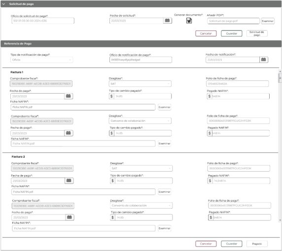
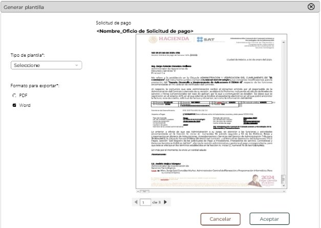

**Administración General de Comunicaciones ![ref1]**

**y Tecnologías de la Información**

**Marco Documental 7.0**
|Fecha de aprobación del Template: 02/08/2023|**Especificación de Interacción de Usuario** 17\_3083\_EIU\_GenerarNotificacionPago.docx** |Versión del template: 7.00|
| :-: | :- | :-: |

**<ID Requerimiento>** 8309** 

**Nombre del Requerimiento:** TI\_SISECOFI-SAT\_Seguimiento financiero y control documental de proyectos de contratación** 

**Tabla de Versiones y Modificaciones** 

|Versión |Descripción del cambio |Responsable de la Versión |Fecha |
| - | - | :-: | - |
|*1* |*Creación del documento* |Angel Horacio López Alcaraz |*28/03/2024* |
|*1.1* |*Revisión del documento* |Luis Angel Olguin Castillo |*19/04/2024* |
|*1.2* |*Versión aprobada para firma* |Andrés Mojica Vázquez |20/06/2024 |

**TABLA DE CONTENIDO** 

[Tabla de Versiones y Modificaciones .................................................................................................................................... 1 ](#_page0_x68.00_y184.12)[Módulo: CONSUMO DE SERVICIOS-DICTAMEN .......................................................................................................... 2 ](#_page1_x68.00_y135.12)[ESTILOS 01 ............................................................................................................................................................................................ 2 ](#_page1_x68.00_y161.12)[Descripción de Elementos ......................................................................................................................................................... 2 ](#_page1_x68.00_y273.12)[Descripción de Campos .............................................................................................................................................................. 4 ](#_page3_x68.00_y528.12)[ESTILOS 02 ......................................................................................................................................................................................... 18 ](#_page17_x68.00_y135.12)[Descripción de Elementos ....................................................................................................................................................... 19 ](#_page18_x68.00_y135.12)[Descripción de Campos ............................................................................................................................................................ 19](#_page18_x68.00_y449.12)

|Fecha de aprobación del Template: 02/08/2023|**Especificación de Interacción de Usuario** 17\_3083\_EIU\_GenerarNotificacionPago.docx** |Versión del template: 7.00|
| :-: | :- | :-: |

**MÓDULO: CONSUMO DE SERVICIOS-DICTAMEN  ESTILOS 01** 

Página 2 de 23
**Administración General de Comunicaciones ![ref1]**

**y Tecnologías de la Información**

**Marco Documental 7.0**

**Nombre de la Pantalla:  Objetivo:** 

**Casos de uso relacionados:** 

Solicitud de pago 

Permitir  al  Empleado  SAT  registrar  la  sección “Solicitud de pago” relacionada a un dictamen. 

17\_3083\_ECU\_GenerarNotificacionPago* 

Página 18 de 18
**Administración General de Comunicaciones ![ref1]**

**y Tecnologías de la Información**

**Marco Documental 7.0**

**DESCRIPCIÓN DE ELEMENTOS**  

|**Elemento** |**Descripción** |||
| - | - | :- | :- |
|Fecha de aprobación del Template: 02/08/2023|**Especificación de Interacción de Usuario** 17\_3083\_EIU\_GenerarNotificacionPago.docx** |Versión del template: 7.00||

|Solicitud de pago |Nombre de la sección. |||
| :- | - | :- | :- |
||
Opción que despliega o contrae la sección, tomando en cuenta lo siguiente:  

Sección contraída ![ref2] Sección desplegada![ref3]
|||
|Oficio de solicitud de pago\*: |Campo que permite ingresar el oficio de la solicitud de pago. |||
|Fecha de solicitud\*: |Campo que permite ingresar la fecha de la solicitud de pago. |||
|![ref4]|Opción que muestra la ventana emergente “Generar plantilla”. |||
|Añadir PDF\*: |Muestra el nombre del campo de “Añadir PDF”.. |||
|![ref5]|Muestra el nombre del archivo cargado |||
|Examinar |Opción  que  permite  abrir  el  explorador  de  archivos  de  la computadora para seleccionar el archivo que se adjuntará. |||
|Cancelar |Opción que realiza el proceso para cancelar la acción y regresa al último estado guardado. |||
|Guardar |Opción que inicia el proceso para almacenar en la base de datos (BD) la información de la sección “Solicitud de pago”. |||
|Solicitud de pago |Opción que permite cambiar el estatus del dictamen a “Solicitud de pago”. |||
|Referencia de Pago |Nombre de la sección. |||
|Tipo de notificación de pago\*: |Campo que permite seleccionar el dato del medio por el cual se realizó la notificación de pago. |||
|Oficio de notificación de pago\*: |Campo que permite ingresar el id del oficio de notificación de pago. |||
|Fecha de notificación\*: |Campo  que  permite  ingresar  la  fecha  en  la  que  se  realizó  la notificación de pago. |||
|Factura N° |
El sistema extrae de la BD la o las facturas asociadas al dictamen de forma automática.   

\*Puede haber tantas facturas como se carguen en el dictamen. 
|||
|Comprobante fiscal\*: |Campo que muestra el comprobante fiscal asociado a la factura. |||
|Desglose\*: |Opción que muestra a quien le pertenece el pago (SAT). |||
|Folio de ficha de pago\*: |Campo  que  permite  ingresar  el  folio  de  la  ficha  de  pago correspondiente a la parte del SAT de la factura. |||
|Fecha de pago\*: |Campo que permite ingresar la fecha de pago correspondiente a la parte del SAT de la factura. |||
|Tipo de cambio pagado\*: |Campo  que  permite  ingresar  el  tipo  de  cambio  pagado correspondiente a la parte del SAT de la factura. |||
|Pagado NAFIN\*: |Campo  que  permite  ingresar  el  monto  pagado  NAFIN correspondiente a la parte del SAT de la factura. |||
|Fecha de aprobación del Template: 02/08/2023|**Especificación de Interacción de Usuario** 17\_3083\_EIU\_GenerarNotificacionPago.docx** |Versión del template: 7.00||

|Ficha NAFIN\*: |Muestra el nombre del campo de “Ficha NAFIN”. |
| - | - |
|![ref5]|Muestra el nombre del archivo cargado |
|Examinar |Opción  que  permite  abrir  el  explorador  de  archivos  de  la computadora para seleccionar el archivo que se adjuntará. |
|Comprobante fiscal\*: |Campo que muestra el comprobante fiscal asociado a la factura. |
|Desglose\*: |Opción que muestra a quien  le  pertenece el  pago  (Convenio  de colaboración). |
|Folio ficha de pago\*: |Campo  que  permite  ingresar  el  folio  de  la  ficha  de  pago correspondiente  a  la  parte  del  Convenio  de  colaboración  de  la factura. |
|Fecha de pago\*: |Campo que permite ingresar la fecha de pago correspondiente a la parte del Convenio de colaboración de la factura. |
|Tipo de cambio pagado\*: |Campo que permite ingresar el tipo de cambio correspondiente a la parte del Convenio de colaboración de la factura. |
|Pagado NAFIN\*: |Campo  que  permite  ingresar  el  monto  pagado  NAFIN correspondiente  a  la  parte  del  Convenio  de  colaboración  de  la factura. |
|Ficha NAFIN\*: |Muestra el nombre del campo de “Ficha NAFIN”. |
|![ref5]|Muestra el nombre del archivo cargado. |
|Examinar |Opción  que  permite  abrir  el  explorador  de  archivos  de  la computadora para seleccionar el archivo que se adjuntará. |
|![ref6]|Permite desplazarse de manera vertical en la información que se muestra. |
|Cancelar |Opción que realiza el proceso para cancelar la acción y regresa al último estado guardado. |
|Guardar |Opción que inicia el proceso para almacenar en la BD la información de la sección “Referencia de pago”.  |
|Pagado |Opción que permite cambiar el estatus del dictamen a “Pagado”. |

**DESCRIPCIÓN DE CAMPOS** 

|**Elemento** |**Tipo** |**Longitu d** |**Nivel de Acceso (L, E, S)** |**Descripción del Campo** |**Fórmulas** |**Precisione s** |||
| - | - | :-: | :-: | - | - | :-: | :- | :- |
|Solicitud de Pago |Sección |N/A |L |Nombre de la sección. |N/A |N/A |||
||Ícono |N/A |S |Opción que despliega o contrae la sección |N/A |
Sección contraída 

![ref2]

Sección desplegada![ref3]
|||
|Fecha de aprobación del Template: 02/08/2023|**Especificación de Interacción de Usuario** 17\_3083\_EIU\_GenerarNotificacionPago.docx** |Versión del template: 7.00|||||||

|Oficio de solicitud de pago\*: |Alfanuméric o |N/A |L, E |Campo que permite ingresar el oficio de la solicitud de pago. |N/A |Campo obligatorio. Solo se muestra habilitado en modo editar dictamen. |||
| :-: | :-: | - | - | :-: | - | :-: | :- | :- |
|Fecha de solicitud\*: |Fecha |10 |L, E, S |Campo que permite ingresar la fecha de la solicitud de pago. |N/A |
Campo obligatorio. Formato de fecha 

DD/MM/AA

AA. Solo se muestra habilitado en modo editar dictamen. 
|||
|![ref4]|Ícono |N/A |L, S |Opción que muestra la ventana emergente “Generar plantilla”. |N/A |
Usar *tooltip* “Generar 

documento

”. 

Solo se muestra habilitado en modo editar dictamen. 
|||
|Añadir PDF\*: |Texto |N/A |L |Muestra el nombre del campo de “Añadir PDF”. |N/A |Campo obligatorio. |||
|![ref5]|Alfanuméric o |100 |L, E, S |Muestra el nombre del archivo cargado |N/A |
Usar *tooltip* Cargar archivo con extensión (.PDF). 

Se habilitará en estatus “Facturado” y en modo edición. 
|||
|Examinar |Botón |N/A |L, S |Opción que permite abrir |N/A |Se habilitará |||
|Fecha de aprobación del Template: 02/08/2023|**Especificación de Interacción de Usuario** 17\_3083\_EIU\_GenerarNotificacionPago.docx** |Versión del template: 7.00|||||||

|||||
el explorador de archivos de la 

computador

a para seleccionar el archivo que se adjuntará. 
||
en estatus “Facturado” y en modo edición. 

Inicialment e se muestra sin color de fondo y con contorno y letras en color gris. 

Cuando se pone el cursor encima debe cambiar a fondo gris y letras negras. 
|||
| :- | :- | :- | :- | :-: | :- | :-: | :- | :- |
|Cancelar |Botón |N/A |L, S |Opción que realiza el proceso para cancelar la acción y regresa al último estado guardado. |N/A |
Se habilitará en estatus “Facturado” y en modo edición. 

Inicialment e se muestra sin color de fondo y con el texto y contorno en color guinda (#691c32). 

Cuando se le pone el cursor encima debe cambiar a fondo guinda (#691c32) y 
|||
|Fecha de aprobación del Template: 02/08/2023|**Especificación de Interacción de Usuario** 17\_3083\_EIU\_GenerarNotificacionPago.docx** |Versión del template: 7.00|||||||

|||||||letras blancas. |||
| :- | :- | :- | :- | :- | :- | :- | :- | :- |
|Guardar |Botón |N/A |L, S |Opción que inicia el proceso para almacenar en la base de datos (BD) la información de la sección “Solicitud de pago”. |N/A |
Se habilitará en estatus “Facturado” y en modo edición. 

Inicialment e se muestra sin color de fondo y con el texto y contorno en color verde oscuro (#10312B). 

Cuando se le pone el cursor encima debe cambiar a fondo verde oscuro (#10312B) y letras blancas. 
|||
|Solicitud de pago |Botón |N/A |L, S |Opción que permite cambiar el estatus del dictamen a “Solicitud de pago”. |N/A |
Se habilitará en estatus “Facturado” y en modo edición. 

Inicialment e se muestra sin color de fondo y con contorno y letras en color gris. 

Cuando se pone el 
|||
|Fecha de aprobación del Template: 02/08/2023|**Especificación de Interacción de Usuario** 17\_3083\_EIU\_GenerarNotificacionPago.docx** |Versión del template: 7.00|||||||

|||||||cursor encima debe cambiar a fondo gris y letras negras. |||
| :- | :- | :- | :- | :- | :- | :-: | :- | :- |
|Referencia de Pago |Sección |N/A |L |Nombre de la sección. |N/A |N/A |||
|Tipo de notificación de pago\*: |Lista de selección |N/A |L, S |Campo que permite seleccionar el dato del medio por el cual se realizó la notificación de pago. |N/A |
Campo obligatorio. Contiene las opciones: \*Correo electrónico \*Oficio \*Otros. 

Se habilitará en estatus “Solicitud de pago” y en modo edición. 
|||
|Oficio de notificación de pago\*: |Alfanuméric o |N/A |L, E |Campo que permite ingresar el id del oficio de notificación de pago. |N/A |Campo obligatorio. Se muestra habilitado en caso de que el “Tipo de notificación de pago” sea “Oficio”. Se habilitará en estatus “Solicitud de pago” y en modo edición. |||
|Fecha de notificación\*: |Fecha |10 |L, E, S |Campo que permite ingresar la fecha en la que se |N/A |Campo obligatorio. Formato de fecha |||
|Fecha de aprobación del Template: 02/08/2023|**Especificación de Interacción de Usuario** 17\_3083\_EIU\_GenerarNotificacionPago.docx** |Versión del template: 7.00|||||||

|||||realizó la notificación de pago. ||
DD/MM/AA AA. 

Se habilitará en estatus “Solicitud de pago” y en modo edición. 
|||
| :- | :- | :- | :- | :-: | :- | :-: | :- | :- |
|Factura N° |Texto |N/A |L |El sistema extrae de la BD la o las facturas asociadas al dictamen de forma automática. \*Puede haber tantas facturas como se carguen en el dictamen. |N/A |Factura N° correspond e al número de la factura de la sección “Facturas”. |||
|Comprobant e fiscal\*: |Alfanuméric o |40 |L |
Campo que muestra el 

comprobant

e fiscal asociado a la factura. 
|N/A |
Campo obligatorio. Ejemplo:  

4A1B43E2- 1183-4AD4-

A3DE- C2DA787A

E56A. 
|||
|Desglose\*: |Lista de selección |N/A |L |Opción que muestra a quien le pertenece el pago (SAT). |N/A |Campo obligatorio. Se habilitará en estatus “Solicitud de pago” y en modo edición. |||
|Folio ficha de pago\*: |Alfanuméric o |N/A |L, E |
Campo que permite ingresar el folio de la ficha de pago 

correspondie nte a la parte 
|N/A |Campo obligatorio. Se habilitará en estatus “Solicitud de pago” y |||
|Fecha de aprobación del Template: 02/08/2023|**Especificación de Interacción de Usuario** 17\_3083\_EIU\_GenerarNotificacionPago.docx** |Versión del template: 7.00|||||||

|||||del SAT de la factura. ||en modo edición. |||
| :- | :- | :- | :- | :-: | :- | :-: | :- | :- |
|Fecha de pago\*: |Fecha |10 |L, E, S |
Campo que permite ingresar la fecha de pago 

correspondie

nte a la parte del SAT de la factura. 
|N/A |
Campo obligatorio. Formato de fecha 

DD/MM/AA

AA. 

Se habilitará en estatus “Solicitud de pago” y en modo edición. 
|||
|Tipo de cambio pagado\*: |Numérico (Decimal) |20 |L, E |
Campo que permite ingresar el tipo de cambio pagado 

correspondie

nte a la parte del SAT de la factura. 
|N/A |
Se consideran números decimales con formato $ 0.0000, hasta 4 decimales. deben estar redondead

os. Ejemplo: $999,999,99

9,999.0000. Se habilitará en estatus “Solicitud de pago” y en modo edición. 
|||
|Pagado NAFIN\*: |Numérico (Decimal) |20 |L, E |
Campo que permite ingresar el monto pagado NAFIN 

correspondie

nte a la parte del SAT de la factura. 
|N/A |Campo obligatorio. Se consideran números decimales con formato $ 0.00, hasta 2 decimales. deben estar |||
|Fecha de aprobación del Template: 02/08/2023|**Especificación de Interacción de Usuario** 17\_3083\_EIU\_GenerarNotificacionPago.docx** |Versión del template: 7.00|||||||

|||||||
redondead os. Ejemplo: $999,999,99

9,999.00. Se habilitará en estatus “Solicitud de pago” y en modo edición. 
|||
| :- | :- | :- | :- | :- | :- | :- | :- | :- |
|Ficha NAFIN\*: |Texto |N/A |L |Muestra el nombre del campo de “Ficha NAFIN”. |N/A |N/A |||
|![ref5]|Alfanuméric o |100 |L, E, S |Muestra el nombre del archivo cargado. |N/A |
Usar “*tooltip*” Cargar archivo con extensión (.PDF). 

Se habilitará en estatus “Solicitud de pago” y en modo edición. 
|||
|Examinar |Botón |N/A |S |
Opción que permite abrir el explorador de archivos de la 

computador

a para seleccionar el archivo que se adjuntará. 
|N/A |
Se habilitará en estatus “Solicitud de pago” y en modo edición. 

Inicialment e se muestra sin color de fondo y con contorno y letras en color gris. 

Cuando se pone el cursor 
|||
|Fecha de aprobación del Template: 02/08/2023|**Especificación de Interacción de Usuario** 17\_3083\_EIU\_GenerarNotificacionPago.docx** |Versión del template: 7.00|||||||

|||||||encima debe cambiar a fondo gris y letras negras. |||
| :- | :- | :- | :- | :- | :- | :-: | :- | :- |
|Comprobant e fiscal\*: |Alfanuméric o |40 |L |
Campo que muestra el 

comprobant

e fiscal asociado a la factura. 
|N/A |
Ejemplo:  4A1B43E2-

1183-4AD4-

A3DE- C2DA787A

E56A. \*Solo aplica en caso de 

existir un convenio de 

colaboració

n. 
|||
|Desglose\*: |Lista de selección |N/A |L |
Opción que muestra a quien le pertenece el pago (Convenio de colaboración

). 
|N/A |
\*Solo aplica en caso de 

existir un convenio de 

colaboració

n. 

Se habilitará en estatus “Solicitud de pago” y en modo edición. 
|||
|Folio ficha de pago\*: |Alfanuméric o |N/A |L, E |
Campo que permite ingresar el folio de la ficha de pago 

correspondie

nte a la parte del Convenio de colaboración de la factura. 
|N/A |
Campo obligatorio. \*Solo aplica en caso de 

existir un convenio de 

colaboració

n. 

Se habilitará en estatus “Solicitud de pago” y 
|||
|Fecha de aprobación del Template: 02/08/2023|**Especificación de Interacción de Usuario** 17\_3083\_EIU\_GenerarNotificacionPago.docx** |Versión del template: 7.00|||||||

|||||||en modo edición |||
| :- | :- | :- | :- | :- | :- | :-: | :- | :- |
|Fecha de pago\*: |Fecha |10 |L, E, S |
Campo que permite ingresar la fecha de pago 

correspondie

nte a la parte del Convenio de colaboración de la factura. 
|N/A |
Campo obligatorio. Formato de fecha 

DD/MM/AA

AA. \*Solo aplica en caso de existir un convenio de 

colaboració

n. 

Se habilitará en estatus “Solicitud de pago” y en modo edición. 
|||
|Tipo de cambio pagado\*: |Numérico (Decimal) |20 |L, E |
Campo que permite ingresar el tipo de cambio 

correspondie

nte a la parte del Convenio de colaboración de la factura. 
|N/A |
Se consideran números decimales con formato $ 0.0000, hasta 4 decimales. deben estar redondead

os. Ejemplo: $999,999,99

9,999.0000. \*Solo aplica en caso de existir un convenio de 

colaboració

n. 

Se habilitará en estatus “Solicitud de pago” y 
|||
|Fecha de aprobación del Template: 02/08/2023|**Especificación de Interacción de Usuario** 17\_3083\_EIU\_GenerarNotificacionPago.docx** |Versión del template: 7.00|||||||

|||||||en modo edición. |||
| :- | :- | :- | :- | :- | :- | :-: | :- | :- |
|Pagado NAFIN\*: |Numérico (Decimal) |20 |L, E |
Campo que permite ingresar el monto pagado NAFIN 

correspondie

nte a la parte del Convenio de colaboración de la factura. 
|N/A |
Campo obligatorio. Se consideran números decimales con formato $ 0.00, hasta 2 decimales. deben estar redondead

os. Ejemplo: $999,999,99

9,999.00. \*Solo aplica en caso de existir un convenio de 

colaboració

n. 

Se habilitará en estatus “Solicitud de pago” y en modo edición. 
|||
|Ficha NAFIN\*: |Texto |N/A |L |Muestra el nombre del campo de “Ficha NAFIN”. |N/A |N/A |||
|![ref5]|Alfanuméric o |100 |L, E, S |Muestra el nombre del archivo cargado. |N/A |Usar *tooltip* “Cargar archivo con extensión (.PDF)”. \*Solo aplica en caso de existir un convenio de |||
|Fecha de aprobación del Template: 02/08/2023|**Especificación de Interacción de Usuario** 17\_3083\_EIU\_GenerarNotificacionPago.docx** |Versión del template: 7.00|||||||

|||||||
colaboració n. 

Se habilitará en estatus “Solicitud de pago” y en modo edición. 
|||
| :- | :- | :- | :- | :- | :- | :-: | :- | :- |
|Examinar |Botón |N/A |L, S |
Opción que permite abrir el explorador de archivos de la 

computador

a para seleccionar el archivo que se adjuntará. 
|N/A |
Se habilitará en estatus “Solicitud de pago” y en modo edición. 

Inicialment e se muestra sin color de fondo y con contorno y letras en color gris. 

Cuando se pone el cursor encima debe cambiar a fondo gris y letras negras. \*Solo aplica en caso de existir un convenio de 

colaboració

n. 
|||
|![ref6]|Barra de desplazamie nto |N/A |S |Permite desplazarse de manera vertical en la información que se muestra. |N/A |N/A |||
|Fecha de aprobación del Template: 02/08/2023|**Especificación de Interacción de Usuario** 17\_3083\_EIU\_GenerarNotificacionPago.docx** |Versión del template: 7.00|||||||

|Cancelar |Botón |N/A |L, S |Opción que realiza el proceso para cancelar la acción y regresa al último estado guardado. |N/A |
Inicialment e se muestra sin color de fondo y con el texto y contorno en color guinda (#691c32). 

Cuando se le pone el cursor encima debe cambiar a fondo guinda (#691c32) y letras blancas. Se habilitará en estatus “Solicitud de pago” y en modo edición. 
|||
| - | - | - | - | :-: | - | :-: | :- | :- |
|Guardar |Botón |N/A |L, S |Opción que inicia el proceso para almacenar en la BD la información de la sección “Referencia de pago”.  |N/A |
Inicialment e se muestra sin color de fondo y con el texto y contorno en color verde oscuro (#10312B). 

Cuando se le pone el cursor encima debe cambiar a fondo verde 
|||
|Fecha de aprobación del Template: 02/08/2023|**Especificación de Interacción de Usuario** 17\_3083\_EIU\_GenerarNotificacionPago.docx** |Versión del template: 7.00|||||||

|||||||oscuro (#10312B) y letras blancas. Se habilitará en estatus “Solicitud de pago” y en modo edición. |
| :- | :- | :- | :- | :- | :- | :-: |
|Pagado |Botón |N/A |L, S |Opción que permite cambiar el estatus del dictamen a “Pagado”. |N/A |
Inicialment e se muestra sin color de fondo y con contorno y letras en color gris. 

Cuando se pone el cursor encima debe cambiar a fondo gris y letras negras. 

Se habilitará en estatus “Solicitud de pago” y en modo edición. 
|

|Fecha de aprobación del Template: 02/08/2023|**Especificación de Interacción de Usuario** 17\_3083\_EIU\_GenerarNotificacionPago.docx** |Versión del template: 7.00|
| :-: | :- | :-: |

Página 18 de 23
**Administración General de Comunicaciones ![ref1]**

**y Tecnologías de la Información**

**Marco Documental 7.0**

**ESTILOS 02** 

**Nombre de la Pantalla:**  

**Objetivo:** 

**Casos de uso relacionados:** 

Vista previa solicitud de pago. 

Permite al Empleado SAT previsualizar y generar la solicitud de pago.  

17\_3083\_ECU\_GenerarNotificacionPago.docx  

Página 23 de 23
**Administración General de Comunicaciones ![ref1]**

**y Tecnologías de la Información**

**Marco Documental 7.0**

**Nota:** Los datos mostrados en la tabla son solo de ejemplo. 

|Fecha de aprobación del Template: 02/08/2023|**Especificación de Interacción de Usuario** 17\_3083\_EIU\_GenerarNotificacionPago.docx** |Versión del template: 7.00|
| :-: | :- | :-: |

**DESCRIPCIÓN DE ELEMENTOS** 

|**Elemento** |**Descripción** |
| - | - |
|Generar plantilla* |Nombre de la ventana emergente.* |
||Opción que cierra la ventana emergente.* |
|Solicitud de pago |Etiqueta que muestra el identificador de la solicitud de pago.  |
|Tipo de plantilla\*: |Campo  de  selección  que  muestra  el  catálogo  que  contiene  los  tipos  de plantillas que se pueden utilizar para generar la solicitud de pago.  |
|Formato a exportar\*: |Campo que muestra las opciones de archivo para exportar el documento. |
||Paginador  que  permite  navegar  a  través  de  las  páginas  del  panel  de visualización. |
|Área de visualización |Permite  la  previsualización  de  la  Solicitud  de  pago  de  acuerdo  con  la estructura y formato del tipo de plantilla seleccionada. |
|![ref7]|Permite desplazarse de manera horizontal en la información que se muestra. |
|![ref8]|Permite desplazarse de manera vertical en la información que se muestra. |
|Aceptar |Opción  que  permite  aceptar  los  cambios,  cierra  la  ventana  emergente  y genera el archivo de la Solicitud de pago. |
|Cancelar |Opción que cierra la ventana emergente. |

**DESCRIPCIÓN DE CAMPOS** 

|**Elemento** |**Tipo** |**Longitu d** |**Nivel de Acceso (L, E, S)** |**Descripción del Campo** |**Fórmulas** |**Precisione s** ||||
| - | - | :-: | - | - | - | :-: | :- | :- | :- |
|Generar plantilla* |Texto |N/A |L |Nombre de la ventana emergente. |N/A |N/A ||||
||Ícono |N/A |S |Opción que cierra la ventana emergente. |N/A |Usar *tooltip* “Cerrar”. ||||
|Solicitud de pago |Texto |N/A |L |Etiqueta que muestra el identificador de la solicitud de pago.  |N/A |N/A ||||
|Tipo de plantilla\*: |Lista de selección |N/A |S |Campo de selección que muestra el catálogo que contiene los |N/A  |Campo obligatorio . ||||
|Fecha de aprobación del Template: 02/08/2023|**Especificación de Interacción de Usuario** 17\_3083\_EIU\_GenerarNotificacionPago.docx** |Versión del template: 7.00||||||||

|||||tipos de plantillas que se pueden utilizar para generar la solicitud de pago.  ||||||
| :- | :- | :- | :- | :-: | :- | :- | :- | :- | :- |
|Formato a exportar\*: |Casilla de selección |N/A |S |Campo que muestra las opciones de archivo para exportar el documento. |N/A |
Campo obligatorio . 

Las opciones que se muestran son PDF y Word. 
||||
||Paginador |N/A |S |Paginador que permite navegar a través de las páginas del panel de visualización. |N/A |N/A ||||
|Área de visualización |Panel de visualización |N/A |L |
Permite la previsualizaci

ón de la Solicitud de pago de acuerdo con la estructura y formato del tipo de plantilla seleccionada. 
|N/A |Debe contener barra de desplazam iento tanto vertical como horizontal. ||||
|![ref9]|Barra de desplazamie nto |N/A |S |Permite desplazarse de manera horizontal en la información que se muestra. |N/A |N/A ||||
|![ref8]|Barra de desplazamie nto |N/A |S |Permite desplazarse de manera vertical en la información que se muestra. |N/A |N/A ||||
|Fecha de aprobación del Template: 02/08/2023|**Especificación de Interacción de Usuario** 17\_3083\_EIU\_GenerarNotificacionPago.docx** |Versión del template: 7.00||||||||

|Aceptar |Botón |N/A |S |Opción que permite aceptar los cambios, cierra la ventana emergente y genera el archivo de la Solicitud de pago. |N/A |
Inicialmen te se muestra sin color de fondo y con el texto y contorno en color verde oscuro 

(#10312B). 

Cuando se le pone el cursor encima debe cambiar con fondo verde oscuro (#10312B) y letras blancas. 
||||
| - | - | - | - | :-: | - | :-: | :- | :- | :- |
|Cancelar |Botón |N/A |S |Opción que cierra la ventana emergente. |N/A |
Inicialmen te se muestra sin color de fondo y con el texto y contorno en color guinda 

(#691c32). 

Cuando se le pone el cursor encima debe cambiar con fondo guinda (#691c32) y letras blancas. 
||||
|Fecha de aprobación del Template: 02/08/2023|**Especificación de Interacción de Usuario** 17\_3083\_EIU\_GenerarNotificacionPago.docx** |Versión del template: 7.00||||||||

Anexo - Ejemplos de botones 

Las acciones de cada botón se definen en los estilos correspondientes. 

|||||
| :- | :- | :- | :- |
|**FIRMAS DE CONFORMIDAD** ||||
|||||
|**Firma 1**  |**Firma 2**  |||
|**Nombre**: Andrés Mojica Vázquez** |**Nombre**: Ricardo Chávez Gutiérrez** |||
|**Puesto**: Usuario ACPPI.**  |**Puesto**: Usuario ACPPI.**  |||
|**Fecha:****  |**Fecha:****  |||
|||||
|**Firma 3****   |**Firma 4****  |||
|**Nombre**: Yesenia Helvetia Delgado Naranjo.**  |**Nombre**:**  Alejandro  Alfredo  Muñoz Núñez.**  |||
|**Puesto**: APE ACPPI.**  |**Puesto**:** RAPE ACPPI.**  |||
|**Fecha**:**  |**Fecha**:**  |||
|||||
|**Firma 5****  |**Firma 6**  |||
|**Nombre**: Luis Angel Olguin Castillo.**  |**Nombre**: Erick Villa Beltrán.  |||
|Fecha de aprobación del Template: 02/08/2023|**Especificación de Interacción de Usuario** 17\_3083\_EIU\_GenerarNotificacionPago.docx** |Versión del template: 7.00||

|**Puesto**: Enlace ACPPI.**  |**Puesto**: Líder APE SDMA 6.  |
| - | - |
|**Fecha**:**  |**Fecha**:  |
|||
|**Firma 7** |**Firma 8**  |
|**Nombre**:**  Juan  Carlos  Ayuso Bautista.**  |**Nombre**:  Angel  Horacio  López Alcaraz. |
|**Puesto**:** Líder Técnico SDMA 6.**  |**Puesto**:** Analista de Sistemas SDMA 6.**  |
|**Fecha**:**  |**Fecha**:**  |
|||

Página 23 de 23

[ref1]: Aspose.Words.6e24debe-bf4a-4911-a3f9-8a146239d025.001.png
[ref2]: Aspose.Words.6e24debe-bf4a-4911-a3f9-8a146239d025.004.png
[ref3]: Aspose.Words.6e24debe-bf4a-4911-a3f9-8a146239d025.005.png
[ref4]: Aspose.Words.6e24debe-bf4a-4911-a3f9-8a146239d025.006.png
[ref5]: Aspose.Words.6e24debe-bf4a-4911-a3f9-8a146239d025.007.png
[ref6]: Aspose.Words.6e24debe-bf4a-4911-a3f9-8a146239d025.008.png
[ref7]: Aspose.Words.6e24debe-bf4a-4911-a3f9-8a146239d025.013.png
[ref8]: Aspose.Words.6e24debe-bf4a-4911-a3f9-8a146239d025.014.png
[ref9]: Aspose.Words.6e24debe-bf4a-4911-a3f9-8a146239d025.017.png
