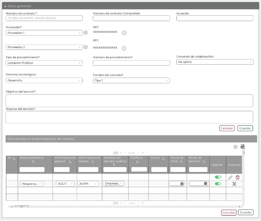
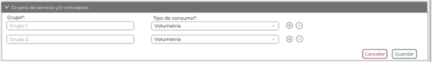
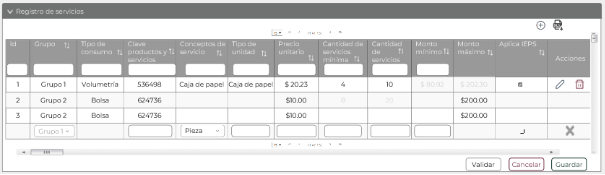
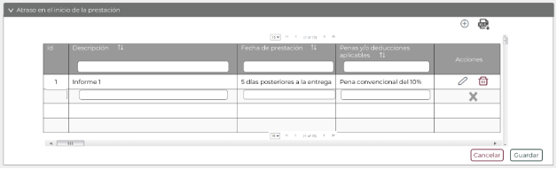
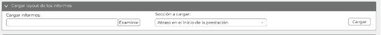
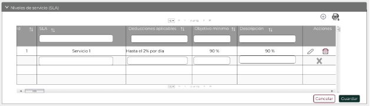
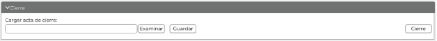

||Administración General de Comunicaciones y Tecnologías de la Información|
| :- | -: |
||Marco Documental 7.0|
|Fecha de aprobación del Template: 02/08/2023|
**Especificación de Interacción de Empleado SAT**

17\_3083\_EIU\_ModificarContrato.docx
|Versión del template: 7.00|
| :-: | :-: | :-: |

**<ID Requerimiento>** 8309

**Nombre del Requerimiento:** TI\_SISECOFI-SAT\_Seguimiento financiero y control documental de proyectos de contratación.
## **Tabla de Versiones y Modificaciones**

|Versión|Descripción del cambio|Responsable de la Versión|Fecha|
| :- | :- | :-: | :-: |
|*1*|*Creación del documento*|Angel Horacio López Alcaraz|23/01/2024|
|*1.1*|*Revisión del documento*|Luis Angel Olguin Castillo|02/05/2024|
|*1.2*|*Versión aprobada para firma*|
María del Carmen Castillejos Cárdenas

Rubén Delgado Ramírez
|28/05/2024|

**TABLA DE CONTENIDO**

[Tabla de Versiones y Modificaciones	1](#_toc168500209)

[Módulo: contratos	3](#_toc168500210)

[ESTILOS 01	3](#_toc168500211)

[Descripción de Elementos	4](#_toc168500212)

[Descripción de Campos	5](#_toc168500213)

[ESTILOS 02	13](#_toc168500214)

[Descripción de Elementos	14](#_toc168500215)

[Descripción de Campos	16](#_toc168500216)

[ESTILOS 03	25](#_toc168500217)

[Descripción de Elementos	26](#_toc168500218)

[Descripción de Campos	27](#_toc168500219)

[ESTILOS 04	34](#_toc168500220)

[Descripción de Elementos	35](#_toc168500221)

[Descripción de Campos	35](#_toc168500222)

[ESTILOS 05	38](#_toc168500223)

[Descripción de Elementos	38](#_toc168500224)

[Descripción de Campos	40](#_toc168500225)

[ESTILOS 06	47](#_toc168500226)

[Descripción de Elementos	47](#_toc168500227)

[Descripción de Campos	49](#_toc168500228)

[ESTILOS 07	53](#_toc168500229)

[Descripción de Elementos	53](#_toc168500230)

[Descripción de Campos	55](#_toc168500231)

[ESTILOS 08	59](#_toc168500232)

[Descripción de Elementos	59](#_toc168500233)

[Descripción de Campos	61](#_toc168500234)

[ESTILOS 09	66](#_toc168500235)

[Descripción de Elementos	66](#_toc168500236)

[Descripción de Campos	68](#_toc168500237)

[ESTILOS 10	73](#_toc168500238)

[Descripción de Elementos	73](#_toc168500239)

[Descripción de Campos	75](#_toc168500240)

[ESTILOS 11	79](#_toc168500241)

[Descripción de Elementos	79](#_toc168500242)

[Descripción de Campos	80](#_toc168500243)

[ESTILOS 12	83](#_toc168500244)

[Descripción de Elementos	83](#_toc168500245)

[Descripción de Campos	84](#_toc168500246)

[ESTILOS 13	89](#_toc168500247)

[Descripción de Elementos	89](#_toc168500248)

[Descripción de Campos	90](#_toc168500249)

[ESTILOS 14	92](#_toc168500250)

[Descripción de Elementos	92](#_toc168500251)

[Descripción de Campos	93](#_toc168500252)

[ESTILOS 15	96](#_toc168500253)

[Descripción de Elementos	97](#_toc168500254)

[Descripción de Campos	97](#_toc168500255)

[ESTILOS 16	102](#_toc168500256)

[Descripción de Elementos	102](#_toc168500257)

[Descripción de Campos	103](#_toc168500258)

[ESTILOS 17	108](#_toc168500259)

[Descripción de Elementos	108](#_toc168500260)

[Descripción de Campos	109](#_toc168500261)

[ESTILOS 18	113](#_toc168500262)

[Descripción de Elementos	113](#_toc168500263)

[Descripción de Campos	114](#_toc168500264)

[ESTILOS 19	115](#_toc168500265)

[Descripción de Elementos	115](#_toc168500266)

[Descripción de Campos	116](#_toc168500267)

## **MÓDULO: CONTRATOS**
## **ESTILOS 01**

|**Nombre de la Pantalla:** |
Modificar sección “Identificación de contrato”

|
| :- | :- |
|**Objetivo:**|
Permitir al Empleado SAT modificar la información de la sección “Identificación” del contrato.

|
|**Casos de uso relacionados:**|17\_3083\_ECU\_ModificarContrato|
|||

### **DESCRIPCIÓN DE ELEMENTOS** 	

|**Elemento**|**Descripción**|
| :- | :- |
|![Icono

Descripción generada automáticamente]|Opción que al seleccionarla muestra el menú principal desplegado en la parte izquierda de la pantalla; contiene los módulos principales y submódulos del sistema.|
|Contratos|Nombre de la pantalla.|
|Última modificación|Campo que muestra el nombre del Empleado SAT, fecha y hora de la última modificación realizada .al contrato.|
|Identificación|Nombre de la sección.|
|Id:|Campo incremental que mostrará el identificador del contrato.|
|Proyecto asociado\*:|Campo de selección que permite escoger el proyecto al que está asociado el contrato.|
|Estatus:|
Campo que muestra los estatus del contrato.

Estos pueden ser “Inicial”, “Ejecución”, “Cerrado” y “Cancelado”.
|
|![ref1]|Opción que permite cambiar el estatus del contrato a “Cancelado”. |
|Nombre del contrato\*:|Campo de captura que permite ingresar el nombre del contrato.|
|Nombre corto del contrato\*:|Campo de captura que permite ingresar el nombre corto del contrato.|
|Inicial|Opción que permite cambiar el estatus del contrato a “Inicial”.|
|Ejecución|Opción que permite cambiar el estatus del contrato a “Ejecución”.|
|Cancelar|Opción que realiza el proceso para cancelar la acción y regresa al último estado guardado.|
|Guardar|Opción que inicia el proceso para almacenar en la base de datos (BD) la información de la sección “Identificación” del contrato.|
|![ref2] |
Opción que despliega o contrae la sección, tomando en cuenta lo siguiente: 

Sección contraída ![ref3]

Sección desplegada![ref2] 
|
|Datos generales|Sección colapsada “Datos generales” del contrato.|
|Vigencia y montos|Sección colapsada “Vigencia y montos” del contrato.|
|Grupos de servicio y/o conceptos |Sección colapsada “Grupos de servicio y/o conceptos” del contrato.|
|Registro de servicios|Sección colapsada “Registro de servicios” del contrato.|
|Proyección de caso de negocio|Sección colapsada “Proyección de caso de negocio” del contrato.|
|Cargar *layout* de los informes|Sección colapsada “Cargar *layout* de los informes” del contrato.|
|Atraso en el inicio de la prestación|Sección colapsada “Atraso en el inicio de la prestación” del contrato.|
|Informes documentales por única vez|Sección colapsada “Informes documentales por única vez” del contrato.|
|Informes documentales periódicos|Sección colapsada “Informes documentales periódicos” del contrato.|
|Informes documentales de los servicios |Sección colapsada “Informes documentales de los servicios” del contrato.|
|Penas contractuales|Sección colapsada “Penas contractuales” del contrato.|
|Niveles de servicio (SLA)|Sección colapsada “Niveles de servicio (SLA)” del contrato.|
|Asignación de plantilla|Sección colapsada “Asignación de plantilla” del contrato.|
|Gestión documental|Sección colapsada “Gestión documental” del contrato.|
|Convenios modificatorios |Sección colapsada “Convenios modificatorios” del contrato.|
|Dictámenes asociados|Sección colapsada “Dictámenes asociados” del contrato.|
|Facturas asociadas|Sección colapsada “Facturas asociadas” del contrato.|
|Reintegros asociados|Sección colapsada “Reintegros asociados” del contrato.|
|Cierre|Sección colapsada “Cierre” del contrato.|
|Regresar|Opción que realiza el proceso para regresar a la pantalla de búsqueda de “Contratos”.|

### **DESCRIPCIÓN DE CAMPOS**

|**Elemento**|**Tipo**|**Longitud**|
**Nivel de Acceso**

**(L, E, S)**
|**Descripción del Campo**|**Fórmulas**|**Precisiones**|
| :-: | :-: | :-: | :-: | :-: | :-: | :-: |
|![Icono

Descripción generada automáticamente]|Ícono|N/A|S|Muestra el menú principal desplegado en la parte izquierda de la pantalla.|N/A|N/A|
|Contratos|Texto|N/A|L|Título que identifica el módulo a donde ingresa el Empleado SAT.|N/A|N/A|
|Última modificación|Texto|100|L|Campo que muestra el nombre (Empleado SAT), fecha y hora de la última modificación.|N/A|N/A|
|Identificación|Sección|N/A|L, S|Nombre de la sección.|N/A|Siempre estará desplegada.|
|Id:|
Numérico

|5|L|Campo incremental que mostrará el identificador del contrato.|N/A|
Campo automático.

Ejemplo 

00001
|
|Proyecto asociado\*:|Lista de selección|N/A|L, S|Campo de selección que permite escoger el “Proyecto asociado” al contrato.|N/A|Solo se permitirá editar si el rol tiene permiso de escritura.|
|Estatus:|Texto|N/A|L|
Campo que muestra el estatus actual del contrato.

Estos pueden ser “Inicial”, “Ejecución” “Cerrado” y “Cancelado”.
|N/A|N/A|
|![ref1]|Ícono|N/A|S|Opción que permite cambiar el estatus del contrato a “Cancelado”. |N/A|Usar el *tooltip* “Cancelar contrato”.|
|Nombre del contrato\*:|Texto|250|L, E|Campo de captura que permite ingresar el nombre del contrato.|N/A|
Campo obligatorio.

Solo se permitirá editar si el rol tiene permiso de escritura.
|
|Nombre corto del contrato\*:|Texto|50|L, E|Campo de captura que permite ingresar el nombre corto del contrato.|N/A|
Campo obligatorio.

Solo se permitirá editar si el rol tiene permiso de escritura.
|
|Inicial|Botón|N/A|L, S|Opción que permite cambiar el estatus del contrato a “Inicial”.|N/A|
Inicialmente se muestra sin color de fondo y con contorno en color gris.

Cuando se le coloca el cursor encima debe cambiar a fondo gris.

Si el estatus del contrato es “Inicial”, el botón aparecerá como no visible, en caso contrario siempre se mostrará visible.

Solo se permitirá seleccionar si el rol tiene permiso de cambiar estatus del contrato.
|
|Ejecución|Botón|N/A|L, S|Opción que permite cambiar el estatus del contrato a “Ejecución”.|N/A|
Inicialmente se muestra sin color de fondo y con contorno en color gris.

Cuando se le coloca el cursor encima debe cambiar a fondo gris.

Si el estatus del contrato es “Ejecución”, el botón aparecerá como no visible, solo podrá mostrarse si el estatus del contrato es “Inicial”.

Solo se permitirá seleccionar si el rol tiene permiso de cambiar estatus del contrato.
|
|Cancelar|Botón|N/A|L, S|Opción que realiza el proceso para cancelar la acción y regresa al último estado guardado.|N/A|
Inicialmente se muestra sin color de fondo y con el texto y contorno en color guinda (#691c32). 

Cuando se le pone el cursor encima debe cambiar a fondo guinda (#691c32) y letras blancas. 

Solo se permitirá seleccionar si el rol tiene permiso de escritura.
|
|Guardar|Botón|N/A|L, S|Opción que inicia el proceso para almacenar en la BD la información de la sección “Identificación” del contrato.|N/A|
Inicialmente se muestra sin color de fondo y con el texto y contorno en color verde oscuro (#10312B). 

Cuando se le pone el cursor encima debe cambiar a fondo verde oscuro (#10312B) y letras blancas. 

Solo se permitirá seleccionar si el rol tiene permiso de escritura.
|
|![Forma

Descripción generada automáticamente con confianza baja]|Ícono|N/A|S|Opción que despliega o contrae la sección.|N/A|
Sección contraída ![ref4]

Sección desplegada![ref2]
|
|Datos generales|Sección|N/A|L, S|Sección colapsada “Datos generales” del contrato.|N/A|N/A|
|Vigencia y montos|Sección|N/A|L, S|Sección colapsada “Vigencia y montos” del contrato.|N/A|N/A|
|Grupos de servicio y/o conceptos |Sección|N/A|L, S|Sección colapsada “Grupos de servicio y/o conceptos” del contrato.|N/A|N/A|
|Registro de servicios|Sección|N/A|L, S|Sección colapsada “Registro de servicios” del contrato.|N/A|N/A|
|Proyección de caso de negocio|Sección|N/A|L, S|Sección colapsada “Proyección de caso de negocio” del contrato.|N/A|N/A|
|Cargar *layout* de los informes|Sección|N/A|L, S|Sección colapsada “Cargar *layout* de los informes” del contrato.|N/A|N/A|
|Atraso en el inicio de la prestación|Sección|N/A|L, S|Sección colapsada “Atraso en el inicio de la prestación” del contrato.|N/A|N/A|
|Informes documentales por única vez|Sección|N/A|L, S|Sección colapsada “Informes documentales por única vez” del contrato.|N/A|N/A|
|Informes documentales periódicos|Sección|N/A|L, S|Sección colapsada “Informes documentales periódicos” del contrato.|N/A|N/A|
|Informes documentales de los servicios |Sección|N/A|L, S|Sección colapsada “Informes documentales de los servicios” del contrato.|N/A|N/A|
|Penas contractuales|Sección|N/A|L, S|Sección colapsada “Penas contractuales” del contrato.|N/A|N/A|
|Niveles de servicio (SLA)|Sección|N/A|L, S|Sección colapsada “Niveles de servicio (SLA)” del contrato.|N/A|N/A|
|Asignación de plantilla|Sección|N/A|L, S|Sección colapsada “Asignación de plantilla” del contrato.|N/A|N/A|
|Gestión documental |Sección|N/A|L, S|Sección colapsada “Gestión documental “del contrato.|N/A|N/A|
|Convenios modificatorios |Sección|N/A|L, S|Sección colapsada “Convenios modificatorios” del contrato.|N/A|N/A|
|Dictámenes asociados|Sección|N/A|L, S|Sección colapsada “Dictámenes asociados” del contrato.|N/A|N/A|
|Facturas asociadas|Sección|N/A|L, S|Sección colapsada “Facturas asociadas” del contrato.|N/A|N/A|
|Reintegros asociados.|Sección|N/A|L, S|Sección colapsada “Reintegros asociados” del contrato.|N/A|N/A|
|Cierre|Sección|N/A|L, S|Sección colapsada “Cierre” del contrato.|N/A|N/A|
|Regresar |Botón  |N/A |S |Opción que realiza el proceso para regresar a la pantalla de búsqueda de “Contratos”.|N/A |
Inicialmente se muestra sin color de fondo y con el texto y contorno en color guinda (#691c32). 

Cuando se le pone el cursor encima debe cambiar con fondo guinda (#691c32) y letras blancas. 
|

## **ESTILOS 02**

|**Nombre de la Pantalla:** |
Modificar sección “Datos generales”

|
| :- | :- |
|**Objetivo:**|
Permitir al Empleado SAT agregar o modificar los datos generales de un contrato.

|
|**Casos de uso relacionados:**|17\_3083\_ECU\_ModificarContrato|
|||

**Nota:** Los datos contenidos en las tablas son solo de ejemplo.

### **DESCRIPCIÓN DE ELEMENTOS** 

|**Elemento**|**Descripción**|
| :- | :- |
|Datos generales|Nombre de la sección.|
|![ref5] |
Opción que despliega o contrae la sección, tomando en cuenta lo siguiente: 

Sección contraída ![ref4]

Sección desplegada![ref2]
|
|Número de contrato\*:|Campo de texto para capturar el número de contrato.|
|Número de contrato CompraNet:|Campo de texto para capturar el número de contrato generado por CompraNet.|
|Acuerdo:|Campo de texto para capturar el número de acuerdo.|
|Proveedor\*:|Campo de selección vinculado al catálogo de proveedores.|
|` `![ref6]|Opción que permite agregar un proveedor.|
|RFC|Campo que mostrará el RFC asociado al proveedor.|
|![ref7]|Opción que permite quitar un proveedor.|
|Tipo de procedimiento\*:|Campo de selección vinculado al catálogo de tipos de contratación.|
|Número de procedimiento\*:|Campo de texto para ingresar el número de procedimiento con el cuál se generó el contrato.|
|Convenio de colaboración:|Campo que permite seleccionar si el contrato está asociado a un convenio de colaboración.|
|Dominio tecnológico:|Campo de selección vinculado al catálogo de “Dominios tecnológicos”.|
|Fondeo del contrato\*:|Campo de selección vinculado al catálogo de fondeos de contrato.|
|Objetivo del servicio\*:|Campo de texto que permite capturar el objetivo del servicio.|
|Alcance del servicio\*:|Campo de texto que permite capturar el alcance del servicio.|
|Cancelar|Opción que realiza el proceso para cancelar la acción y regresa al último estado guardado.|
|Guardar|Opción que inicia el proceso para almacenar en la BD la información de la sección “Datos generales”.|
|Participantes en la administración del contrato|Título de la tabla Participantes en la administración del contrato.|
|![ref6]|Opción para agregar un registro en la tabla.|
|![ref8]|Opción que permite exportar la información de la BD “Participantes en la administración del contrato”, generando un archivo de Excel con extensión (.xlsx).|
|Id|Campo incremental que mostrará el identificador del participante en la administración del contrato.|
|Responsabilidad|
Campo de selección que muestra la responsabilidad del participante. Puede ser:

- Administrador del contrato

- Verificador del contrato

- Participantes en la administración de estimaciones

- Participantes en la administración de la verificación

- Participantes en la administración del dictamen

- Responsable admón. General patrocinadora

- Responsable admón. Central patrocinadora
|
|Administración general|Campo de selección vinculado al catálogo de Administraciones generales.|
|Administración central|Campo de selección vinculado al catálogo de Administraciones centrales.|
|Nombre del servidor público|Campo vinculado al catálogo “Usuarios” y permite seleccionar al servidor público participante en la administración del contrato.|
|Teléfono |Campo que mostrará el teléfono almacenado en el catálogo de usuarios del sistema del Empleado SAT seleccionado.|
|Correo|Campo que mostrará el correo almacenado en el catálogo de usuarios del sistema del Empleado SAT seleccionado.|
|
Fecha de inicio

|Campo que muestra o permitirá ingresar la fecha de inicio de vigencia de la responsabilidad seleccionada para el servidor público. |
|Fecha de término|Campo que muestra o permitirá ingresar la fecha de término de vigencia de la responsabilidad seleccionada para el servidor público.|
|Vigente|Campo que permite seleccionar si el empleado está vigente o no.|
|Acciones|Campo que muestra las acciones que se pueden realizar con el registro de la tabla.|
|![ref9] |Opción que permite editar los registros en la tabla. |
|![ref10] |Opción que permite eliminar los registros en la tabla. |
|![ref11]|Opción que permite cancelar la acción de edición. |
|
![ref12] 

![ref13]

|Permite desplazarse de manera vertical u horizontal en la tabla. |
|![ref14]|Paginador que permite navegar a través de las páginas resultantes de la consulta, considerando que el sistema debe mostrar inicialmente 15 registros por página, permitiendo visualizar entre 15, 50 y 100 registros por página. |
|![ref15]|Opción que ordena la información de la tabla de forma ascendente o descendente y de forma alfabética, según aplique. |
|![ref16]|Campo que permite filtrar la información de la columna en la que se requiere buscar específicamente.|
|Cancelar|Opción que realiza el proceso para cancelar la acción de la tabla de Participantes en la Administración del contrato y regresa al último estado guardado.|
|Guardar|Opción que inicia el proceso para almacenar en la BD la información de la tabla “Participantes en la administración del contrato”.|

### **DESCRIPCIÓN DE CAMPOS**
###
|**Elemento**|**Tipo**|**Longitud**|
**Nivel de Acceso**

**(L, E, S)**
|**Descripción del Campo**|**Fórmulas**|**Precisiones**|
| :-: | :-: | :-: | :-: | :-: | :-: | :-: |
|Datos generales|Sección|N/A|L, S|Nombre de la sección.|N/A|N/A|
|![ref17] |Ícono |N/A |S|Opción que despliega o contrae la sección. |N/A |
Sección contraída ![ref4]

Sección desplegada![ref2]
|
|Número de contrato\*:|Alfanumérico|25|L, E|Campo de texto para capturar el número de contrato.|N/A|
Campo obligatorio.

Solo se permitirá editar si el rol tiene permiso de escritura.
|
|Número de contrato CompraNet:|Alfanumérico|40|L, E|Campo de texto para capturar el número de contrato de CompraNet.|N/A|Solo se permitirá editar si el rol tiene permiso de escritura.|
|Acuerdo:|Campo de captura|N/A|L, E|Campo para capturar el número de acuerdo|N/A|Solo se permitirá editar si el rol tiene permiso de escritura.|
|Proveedor\*:|Lista de selección |N/A|L, S|Campo de selección vinculado al catálogo de proveedores.|N/A|
Campo obligatorio.

Solo se permitirá editar si el rol tiene permiso de escritura.
|
|![ref6]|Ícono|N/A|L, S|Permite agregar un proveedor al contrato.|N/A|N/A|
|RFC|Texto|N/A|L|Campo que mostrará el RFC asociado al proveedor.|N/A|Deberá de tomarlo de manera automática del campo RFC del catálogo “Proveedores” del proveedor seleccionado.|
|![ref7]|Ícono|N/A|L, S|Opción que permite quitar un proveedor.|N/A|N/A|
|Tipo de procedimiento\*:|Lista de selección |N/A|L, S|Campo de selección vinculado al catálogo de tipos de contratación.|N/A|
Campo obligatorio.

Solo se permitirá editar si el rol tiene permiso de escritura.
|
|Número de procedimiento\*:|Alfanumérico|50|L, E|Campo para ingresar el número de procedimiento con el cuál se generó el contrato.|N/A|
Campo obligatorio.

Solo se permitirá editar si el rol tiene permiso de escritura.
|
|Convenio de colaboración:|Lista de selección |N/A|L, S|Campo que permite seleccionar si aplica o no aplica el convenio de colaboración|N/A|Solo se permitirá editar si el rol tiene permiso de escritura.|
|Dominio tecnológico:|Lista de selección |N/A|L, S|Campo de selección vinculado al catálogo de dominios tecnológicos.|N/A|Solo se permitirá editar si el rol tiene permiso de escritura.|
|Fondeo del contrato\*:|Lista de selección |N/A|L, S|Campo de selección vinculado al catálogo “Fondeos”.|N/A|Campo obligatorio. Solo se permitirá editar si el rol tiene permiso de escritura.|
|Objetivo del servicio\*:|Texto|1000|L, E|Campo que permite capturar el objetivo del servicio.|N/A|Campo obligatorio. Solo se permitirá editar si el rol tiene permiso de escritura.|
|Alcance del servicio\*:|Texto|1000|L, E|Campo que permite capturar el alcance del servicio.|N/A|Campo obligatorio. Solo se permitirá editar si el rol tiene permiso de escritura.|
|Cancelar|Botón|N/A|L, S|Opción que realiza el proceso para cancelar la acción y regresa al último estado guardado.|N/A|
Inicialmente se muestra sin color de fondo y con el texto y contorno en color guinda (#691c32). 

Cuando se le pone el cursor encima debe cambiar a fondo guinda (#691c32) y letras blancas. 

Solo se permitirá seleccionar si el rol tiene permiso de escritura.
|
|Guardar|Botón|N/A|L, S|Opción que inicia el proceso para almacenar en la BD la información de la sección “Identificación” del contrato.|N/A|
Inicialmente se muestra sin color de fondo y con el texto y contorno en color verde oscuro (#10312B). 

Cuando se le pone el cursor encima debe cambiar a fondo verde oscuro (#10312B) y letras blancas. 

Solo se permitirá seleccionar si el rol tiene permiso de escritura.
|
|Participantes en la administración del contrato|Texto|N/A|L|Título de la tabla.|N/A|N/A|
|![ref6]|Ícono|N/A|S|Opción para agregar un registro en la tabla.|N/A|N/A|
|![ref8]|Ícono|N/A|S|Opción que permite descargar un archivo de Excel con extensión (.xlsx) la información almacenada en la BD de la sección consultada.|N/A|N/A|
|Id|
Numérico

|5|L|Número incremental que aumenta de manera automática e identifica al registro.|N/A|Número incremental que iniciará en 1.|
|Responsabilidad|Lista de selección|N/A|L, S|Campo que permite seleccionar la Responsabilidad del servidor público en la administración del contrato.|N/A|
Campo obligatorio.

Solo se permitirá editar si el rol tiene permiso de escritura.
|
|Administración general|Lista de selección|N/A|L, S|Campo de selección vinculado al catálogo de Administraciones generales.||
Campo obligatorio.

Solo se permitirá editar si el rol tiene permiso de escritura. 
|
|Administración central|Lista de selección|N/A|L, S|Campo de selección vinculado al catálogo de Administraciones centrales.||
Campo obligatorio.

Se activará si la responsabilidad es Administrador central.

Solo se permitirá editar si el rol tiene permiso de escritura.
|
|Nombre del servidor público|Lista de selección|N/A|L, S|Campo vinculado al catálogo “Usuarios” y permite seleccionar al servidor público participante en la administración del contrato.|N/A|
Campo obligatorio.

Solo se permitirá editar si el rol tiene permiso de escritura.
|
|Teléfono |Numérico|N/A|L|Campo que mostrará el teléfono almacenado en el catálogo de empleados del Empleado SAT seleccionado.|N/A|N/A|
|Correo|Texto|N/A|L|Campo que mostrará el correo almacenado en el catálogo de empleados del Empleado SAT seleccionado.|N/A|N/A|
|Fecha de inicio|Fecha|10|L, S|Campo que permite ingresar la fecha de inicio de vigencia de la responsabilidad seleccionada para el servidor público. |N/A|
Campo obligatorio.

Formato de fecha DD/MM/AAAA.

Solo se permitirá editar si el rol tiene permiso de escritura.
|
|Fecha de término|Fecha|10|L, S|Campo que permite ingresar la fecha de término de vigencia de la responsabilidad seleccionada para el servidor público.|N/A|
Formato de fecha DD/MM/AAAA.

Solo se permitirá editar si el rol tiene permiso de escritura.
|
|Vigente|Ícono|N/A|L, S|Campo que permite seleccionar si el empleado es el administrador, verificador o líder de proyecto vigente.|N/A|
Campo obligatorio.

Vigente. 

No vigente.

 

Solo se permitirá editar si el rol tiene permiso de escritura.

|
|Acciones|Texto|N/A|L|Campo que muestra las acciones que se pueden realizar con el registro de la tabla|N/A|N/A|
|![ref18]|Ícono |N/A |S |Opción que permite editar la información de un registro adicionado en la tabla. |N/A |
 

Usar el *tooltip* “Editar”.

Solo se permitirá editar si el rol tiene permiso de escritura.
|
|![ref10] |Ícono |N/A |S |Opción que permite eliminar el registro de la tabla. |N/A |
Usar el *tooltip* “Eliminar”.

Solo se permitirá editar si el rol tiene permiso de escritura.
|
|![ref11]|Ícono|N/A|S|Opción que permite cancelar la acción de edición.|N/A|N/A|
|
![ref12] 

![ref19]

|Barra de desplazamiento |N/A |S|Permite desplazarse de manera vertical u horizontal en la tabla. |N/A |N/A |
|![ref14]|Paginador|N/A|S |Permite navegar a través de las páginas resultantes de la consulta. |N/A |Inicialmente se deben mostrar 15 registros por página, permitiendo visualizar entre 15, 50 y 100 registros por página. |
|![ref15]|Ícono |N/A |S |Opción que ordena la información de la tabla de forma ascendente o descendente y de forma alfabética, según aplique. |N/A |N/A |
|![ref16]|Filtro |N/A |E |Permite filtrar información de la columna donde se requiera buscar específicamente. |N/A |Realiza el filtro de la información solo dentro de la página que se visualiza. |
|Cancelar|Botón|N/A|L, S|Opción que realiza el proceso para cancelar la acción y regresa al último estado guardado.|N/A|
Inicialmente se muestra sin color de fondo y con el texto y contorno en color guinda (#691c32). 

Cuando se le pone el cursor encima debe cambiar a fondo guinda (#691c32) y letras blancas. 
|
|Guardar|Botón|N/A|L, S|Opción que permite almacenar los datos ingresados.|N/A|
Inicialmente se muestra sin color de fondo y con el texto y contorno en color verde oscuro (#10312B). 

Cuando se le pone el cursor encima debe cambiar a fondo verde oscuro (#10312B) y letras blancas. 

Solo se permitirá seleccionar si el rol tiene permiso de escritura.
|

## **ESTILOS 03**

|**Nombre de la Pantalla:** |
Modificar sección “Vigencia y montos”

|
| :- | :- |
|**Objetivo:**|
Permitir al Empleado SAT agregar o modificar los datos de vigencia y montos del contrato.

|
|**Casos de uso relacionados:**|17\_3083\_ECU\_ModificarContrato|
|||

### **DESCRIPCIÓN DE ELEMENTOS** 

|**Elemento**|**Descripción**|
| :- | :- |
|Vigencia y montos|Nombre de la sección.|
|![ref5] |
Opción que despliega o contrae la sección, tomando en cuenta lo siguiente: 

Sección contraída ![ref4]

Sección desplegada![ref2]
|
|Fecha de inicio de vigencia de los servicios\*:|Campo para capturar la fecha de inicio de la vigencia de los servicios.|
|Fecha de fin de vigencia de los servicios\*:|Campo para capturar la fecha de fin de la vigencia de los servicios.|
|Duración de los servicios:|Campo calculado que determina la duración en días del servicio.|
|Fecha de inicio de vigencia del contrato\*:|Campo para capturar la fecha de inicio de la vigencia del contrato.|
|Fecha de fin de vigencia del contrato\*:|Campo para capturar la fecha de fin de la vigencia del contrato.|
|Moneda\*:|Campo vinculado al catálogo de moneda que permite seleccionar la moneda del contrato.|
|Tipo de cambio máximo aprobado:|Campo que permite ingresar el valor del tipo de cambio máximo aprobado del contrato.|
|Aplica IVA\*:|Casilla de selección para indicar si el contrato aplicará IVA.|
|Porcentaje de IVA:|Campo que permite seleccionar el porcentaje de IVA aplicado al contrato.|
|Porcentaje de IEPS:|Campo que permite seleccionar el porcentaje de IEPS aplicado a los servicios del contrato.|
|Monto mínimo sin impuestos\*:|Campo de captura para ingresar el monto mínimo sin impuestos del contrato.|
|Monto máximo sin impuestos\*:|Campo de captura para ingresar el monto máximo sin impuestos del contrato.|
|Monto en pesos sin impuestos\*:|Campo calculado que mostrará el monto en pesos sin impuestos del contrato.|
|Monto mínimo con impuestos\*:|Campo de captura para ingresar el monto mínimo con impuestos del contrato.|
|Monto máximo con impuestos\*:|Campo de captura para ingresar el monto máximo con impuestos del contrato.|
|Monto en pesos con impuestos\*:|Campo de captura para ingresar el monto en pesos con impuestos del contrato.|
|Cancelar|Opción que realiza el proceso para cancelar la acción y regresa al último estado guardado.|
|Guardar|Opción que inicia el proceso para almacenar en la BD la información de la sección “Vigencia y montos”.|

### **DESCRIPCIÓN DE CAMPOS**
###
|**Elemento**|**Tipo**|**Longitud**|
**Nivel de Acceso**

**(L, E, S)**
|**Descripción del Campo**|**Fórmulas**|**Precisiones**|
| :-: | :-: | :-: | :-: | :-: | :-: | :-: |
|Vigencia y montos|Sección|N/A|L|Nombre de la sección.|N/A|N/A|
|![ref20] |Ícono |N/A |S |Opción que despliega o contrae la sección. |N/A |
Sección contraída ![ref4]

Sección desplegada![ref2]
|
|Fecha de inicio de vigencia de los servicios\*:|Fecha|10|L, S|Campo para capturar la fecha de inicio de vigencia de los servicios.|N/A|
Campo Obligatorio.

Formato de fecha DD/MM/AAAA.

Solo se permitirá editar si el rol tiene permiso de escritura
|
|Fecha de fin de vigencia de los servicios\*:|Fecha|10|L, S|Campo para capturar la fecha de fin de vigencia de los servicios.|N/A|
Campo Obligatorio.

Formato de fecha DD/MM/AAAA.

Solo se permitirá editar si el rol tiene permiso de escritura.
|
|Duración de los servicios:|Numérico|N/A|L|Campo calculado que determina la duración del servicio.|
Fecha de fin de vigencia de los servicios

-

` `Fecha de inicio de vigencia de los servicios +1
|Se debe mostrar el resultado de la diferencia de fechas como un número seguido del texto días como etiqueta.  |
|Fecha de inicio de vigencia del contrato\*:|Fecha|10|L, S|Campo para capturar la fecha de inicio de vigencia del contrato.|N/A|
Campo Obligatorio.

Formato de fecha DD/MM/AAAA.

Solo se permitirá editar si el rol tiene permiso de escritura.
|
|Fecha de fin de vigencia del contrato\*:|Fecha|10|L, S|Campo para capturar la fecha de fin de vigencia del contrato.|N/A|
Campo Obligatorio.

Formato de fecha DD/MM/AAAA.

Solo se permitirá editar si el rol tiene permiso de escritura
|
|Moneda\*:|Lista de selección|N/A|L, S|Campo vinculado al catálogo de moneda que permite seleccionar la moneda del contrato.|N/A|
Campo Obligatorio.

Solo se permitirá editar si el rol tiene permiso de escritura
|
|Tipo de cambio máximo aprobado:|
Numérico

(Decimal)
|20|L, E|Campo que permite ingresar el valor del tipo de cambio máximo aprobado.|N/A|
Se consideran números decimales con formato $ 0.0000, hasta 4 decimales. Ejemplo: $999,999,999,999.0000.

Solo se permitirá editar si el rol tiene permiso de escritura
|
|Aplica IVA\*:|Casilla de selección|N/A|L, S|Casilla de selección para indicar si el contrato incluye IVA.|N/A|Solo se permitirá editar si el rol tiene permiso de escritura|
|Porcentaje de IVA:|Lista de selección|N/A|L, S|Campo que permite seleccionar el porcentaje de IVA aplicado al contrato.|N/A|
El campo se habilitará, si está marcado aplica I.V.A.

Solo se permitirá editar si el rol tiene permiso de escritura
|
|Porcentaje de IEPS:|Lista de selección|N/A|L, S|Campo que permite seleccionar el porcentaje de IEPS aplicado a los servicios del contrato.|N/A|Solo se permitirá editar si el rol tiene permiso de escritura|
|Monto mínimo sin impuestos\*:|
Numérico

` `(Decimal)
|20|L, E|Campo de captura para ingresar el monto mínimo sin impuestos.|N/A|
Campo obligatorio. 

Se consideran números decimales con formato $ 0.00, hasta 2 decimales. Ejemplo: $999,999,999,999.00.

Solo se permitirá editar si el rol tiene permiso de escritura.

El ícono ![ref21] simboliza que el campo es un monto.

|
|Monto máximo sin impuestos\*:|
Numérico

(Decimal)
|20 |L, E|Campo de captura para ingresar el monto máximo sin impuestos.|N/A|
Campo obligatorio. 

Se consideran números decimales con formato $ 0.00, hasta 2 decimales. Ejemplo: $999,999,999,999.00.

Solo se permitirá editar si el rol tiene permiso de escritura.

El ícono ![ref21] simboliza que el campo es un monto.
|
|Monto en pesos sin impuestos\*:|Numérico (Decimal)|20|L|Campo calculado que mostrará el monto en pesos sin impuestos.|
Monto máximo sin impuestos \*

Tipo de cambio máximo aprobado.

En caso de no haber Tipo de cambio máximo aprobado, se tomará en cuenta el valor ingresado en el campo Monto máximo sin impuestos\*.
|
Campo obligatorio.

Se consideran números decimales con formato $ 0.00, hasta 2 decimales. Ejemplo: $999,999,999,999.00.

El ícono ![ref21] simboliza que el campo es un monto.

|
|Monto mínimo con impuestos\*:|Numérico (Decimal)|20|L, E|Campo de captura para ingresar el monto mínimo con impuestos.|N/A|
Campo obligatorio. 

Se consideran números decimales con formato $ 0.00, hasta 2 decimales. Ejemplo: $999,999,999,999.00.

Solo se permitirá editar si el rol tiene permiso de escritura.

El ícono ![ref21] simboliza que el campo es un monto.

|
|Monto máximo con impuestos\*:|Numérico (Decimal)|20|L, E|Campo de captura para ingresar el monto máximo con impuestos.|N/A|
Campo obligatorio. 

Se consideran números decimales con formato $ 0.00, hasta 2 decimales. Ejemplo: $999,999,999,999.00.

Solo se permitirá editar si el rol tiene permiso de escritura.

El ícono ![ref21] simboliza que el campo es un monto.
|
|Monto en pesos con impuestos\*:|Numérico (Decimal)|20|L|Campo de captura para ingresar el monto en pesos con impuestos.|
Monto máximo con impuestos \*

Tipo de cambio máximo aprobado.

En caso de no haber Tipo de cambio máximo aprobado, se tomará en cuenta el valor ingresado en el campo Monto máximo con impuestos\*.
|
Campo obligatorio.

Se consideran números decimales con formato $ 0.00, hasta 2 decimales. Ejemplo: $999,999,999,999.00.

Solo se permitirá editar si el rol tiene permiso de escritura.

El ícono ![ref21] simboliza que el campo es un monto.

|
|Cancelar|Botón|N/A|L, S|Opción que realiza el proceso para cancelar la acción y regresa al último estado guardado.|N/A|
Inicialmente se muestra sin color de fondo y con el texto y contorno en color guinda (#691c32). 

Cuando se le pone el cursor encima debe cambiar a fondo guinda (#691c32) y letras blancas. 

Solo se permitirá seleccionar si el rol tiene permiso de escritura.
|
|Guardar|Botón|N/A|L, S|Opción que permite almacenar los datos ingresados.|N/A|
Inicialmente se muestra sin color de fondo y con el texto y contorno en color verde oscuro (#10312B). 

Cuando se le pone el cursor encima debe cambiar a fondo verde oscuro (#10312B) y letras blancas. 

Solo se permitirá seleccionar si el rol tiene permiso de escritura.
|

## **ESTILOS 04**

|**Nombre de la Pantalla:** |
Modificar sección “Grupos de servicio y/o conceptos”

|
| :- | :- |
|**Objetivo:**|
Permitir al Empleado SAT agregar o modificar los grupos de servicio y/o conceptos.

|
|**Casos de uso relacionados:**|17\_3083\_ECU\_ModificarContrato|
|

||

### **DESCRIPCIÓN DE ELEMENTOS** 

|**Elemento**|**Descripción**|
| :- | :- |
|Grupos de servicio y/o conceptos|Nombre de la sección.|
|![ref22] |
Opción que despliega o contrae la sección, tomando en cuenta lo siguiente: 

Sección contraída ![ref4]

Sección desplegada![ref2]
|
|Grupo\*: |Campo para ingresar el grupo del servicio al que pertenecen los servicios contratados.|
|Tipo de consumo\*:|
Campo de selección con las opciones: 

- Volumetría 

- Bolsa
|
|` `![ref23]|Opción para agregar un nuevo registro.|
|![ref7]|Opción que permite quitar un registro.|
|Cancelar|Opción que realiza el proceso para cancelar la acción y regresa al último estado guardado.|
|Guardar|Opción que inicia el proceso para almacenar en la BD la información de la sección “Grupos de servicio y/o conceptos”.|

### **DESCRIPCIÓN DE CAMPOS**
###
|**Elemento**|**Tipo**|**Longitud**|
**Nivel de Acceso**

**(L, E, S)**
|**Descripción del Campo**|**Fórmulas**|**Precisiones**|
| :-: | :-: | :-: | :-: | :-: | :-: | :-: |
|Grupos de servicio y/o conceptos|Sección|N/A|L|Nombre de la sección.|N/A|N/A|
|![ref20] |Ícono |N/A |S |Opción que despliega o contrae la sección. |N/A |
Sección contraída ![ref4]

Sección desplegada![ref2]
|
|Grupo |Texto|250|L, E|Campo para ingresar el grupo del servicio vinculado al contrato.|N/A|
Campo obligatorio.

Solo se permitirá editar si el rol tiene permiso de escritura.
|
|Tipo de consumo|Lista de selección|N/A|L, S|Campo de selección que permite seleccionar el tipo de consumo.|N/A|
Opciones:

- Volumetría 

- Bolsa 

Solo se permitirá editar si el rol tiene permiso de escritura.
|
|![ref23]|Ícono|N/A|S|Opción para agregar un nuevo registro.|N/A|N/A|
|![ref7]|Ícono|N/A|S|Opción que permite quitar un registro.|N/A|N/A|
|Cancelar|Botón|N/A|L, S|Opción que realiza el proceso para cancelar la acción y regresa al último estado guardado.|N/A|
Inicialmente se muestra sin color de fondo y con el texto y contorno en color guinda (#691c32). 

Cuando se le pone el cursor encima debe cambiar a fondo guinda (#691c32) y letras blancas.

Solo se permitirá seleccionar si el rol tiene permiso de escritura. 
|
|Guardar|Botón|N/A|L, S|Opción que permite almacenar los datos ingresados.|N/A|
Inicialmente se muestra sin color de fondo y con el texto y contorno en color verde oscuro (#10312B). 

Cuando se le pone el cursor encima debe cambiar a fondo verde oscuro (#10312B) y letras blancas. 

Solo se permitirá seleccionar si el rol tiene permiso de escritura.
|

## **ESTILOS 05**

|**Nombre de la Pantalla:** |
Modificar sección “Registro de Servicios”

|
| :- | :- |
|**Objetivo:**|
Permitir al Empleado SAT agregar y modificar los registros de servicios.

|
|**Casos de uso relacionados:**|17\_3083\_ECU\_ModificarContrato|
|||

**Nota:** Los datos contenidos en las tablas son solo de ejemplo.

### **DESCRIPCIÓN DE ELEMENTOS** 

|**Elemento**|**Descripción**|
| :- | :- |
|Registro de servicios|Nombre de la sección.|
|![ref22] |
Opción que despliega o contrae la sección, tomando en cuenta lo siguiente: 

Sección contraída ![ref4]

Sección desplegada![ref2]
|
|![ref24]|Opción para agregar un nuevo registro.|
|![ref25]|Opción que permite exportar la información de la BD “Registro de servicios” generando un archivo de Excel con extensión (.xlsx).|
|Id|Campo incremental que mostrará el identificador del participante en la administración del contrato.|
|Grupo|Campo de selección, las opciones serán los grupos capturados en la sección “Grupos de servicios y/o conceptos”.|
|Tipo de consumo|Campo que mostrará el tipo de consumo seleccionado al grupo.|
|Clave productos y servicios|Campo de captura que permite ingresar la clave de los productos y servicios.|
|Conceptos de servicio|Campo de captura que permite ingresar el concepto de servicio.|
|Tipo de unidad|Campo de selección vinculado al catálogo de unidades de medida.|
|Precio unitario|Campo de captura que permite ingresar el precio unitario.|
|Cantidad de servicios mínima|Campo de captura que permite ingresar el número de servicios mínimos.|
|Cantidad de servicios máxima|Campo de captura que permite ingresar el número de servicios máximos.|
|Monto mínimo|Campo de captura que permite ingresar el monto mínimo.|
|Monto máximo|Campo de captura que permite ingresar el monto máximo.|
|Aplica IEPS |Casilla de selección para indicar si al concepto le aplica IEPS.|
|Acciones|Campo que muestra las acciones que se pueden realizar con el registro de la tabla.|
|![ref26]|Opción que permite editar los registros en la tabla. |
||Opción que permite eliminar los registros en la tabla. |
|![ref11]|Opción que permite cancelar la acción de edición. |
|
![ref12] 

![ref27]

|Permite desplazarse de manera vertical u horizontal en la tabla. |
|![ref14]|Paginador que permite navegar a través de las páginas resultantes de la consulta, considerando que el sistema debe mostrar inicialmente 15 registros por página, permitiendo visualizar entre 15, 50 y 100 registros por página. |
|![ref15]|Opción que ordena la información de la tabla de forma ascendente o descendente y de forma alfabética, según aplique. |
|![ref16]|Campo que permite filtrar la información de la columna en la que se requiere buscar específicamente.|
|Validar|Opción que valida que la sumatoria de los montos máximos de todos los conceptos, sea igual al monto máximo sin impuestos que fue ingresado en la sección “Vigencia y montos”.|
|Cancelar|Opción que realiza el proceso para cancelar la acción y regresa al último estado guardado.|
|Guardar|Opción que inicia el proceso para almacenar en la BD la información de la sección “Registro de servicios”.|

### **DESCRIPCIÓN DE CAMPOS**
###
|**Elemento**|**Tipo**|**Longitud**|
**Nivel de Acceso**

**(L, E, S)**
|**Descripción del Campo**|**Fórmulas**|**Precisiones**|
| :-: | :-: | :-: | :-: | :-: | :-: | :-: |
|Registro de servicios|Sección|N/A|L|Nombre de la sección.|N A|N/A|
|![ref20] |Ícono |N/A |S |Opción que despliega o contrae la sección. |N/A |
Sección contraída ![ref4]

Sección desplegada![ref2]
|
|![ref24]|Ícono|N/A|L, S|Opción para agregar un nuevo registro.|N/A|Solo se permitirá editar si el rol tiene permiso de escritura.|
|![ref25]|Ícono|N/A|S|Opción que permite exportar la información de la BD “Registro de servicios” generando un archivo de Excel con extensión (.xlsx).|N/A|N/A|
|Id.|Numérico|N/A|L|Campo incremental que mostrará el identificador del grupo de registro del servicio.|N/A|Número incremental que iniciará en 1.  |
|Grupo|Lista de selección|N/A|L, S|Campo de selección del grupo; las opciones serán los grupos capturas en la sección “Grupos de servicios y/o conceptos”.|N/A|
Campo obligatorio.

Solo se permitirá editar si el rol tiene permiso de escritura.
|
|Tipo de consumo|Texto|N/A|L|Campo que mostrará el tipo de consumo seleccionado en el grupo.|N/A|N/A|
|Clave productos y servicios|Numérico|12|L, E|Campo de captura que permite ingresar la clave de los productos y servicios.|N/A|Solo se permitirá editar si el rol tiene permiso de escritura.|
|Conceptos de servicio|Texto|250|L, E|Campo de captura que permite ingresar el concepto de servicio.|N/A|
Campo obligatorio.

Solo se permitirá editar si el rol tiene permiso de escritura.
|
|Tipo de unidad|Lista de selección|N/A|L, S|Campo seleccionable vinculado al catálogo de unidades de medida.|N/A|Solo se permitirá editar si el rol tiene permiso de escritura.|
|Precio unitario|
Numérico

(Decimal)
|20|L, E|Campo de captura que permite ingresar el precio unitario del servicio.|N/A|
Campo obligatorio. 

Se consideran números decimales con formato $ 0.00, hasta 2 decimales. Ejemplo: $999,999,999,999.00.

.

Solo se permitirá editar si el rol tiene permiso de escritura.
|
|Cantidad de servicios mínima|Numérico |15|L, E|Campo de captura que permite ingresar el número de servicios mínimos.|En caso de que el Tipo de consumo sea bolsa, será el resultado de: Monto mínimo / Precio unitario.|
Se habilitará cuando el tipo de consumo será volumetría.

Solo se permitirá editar si el rol tiene permiso de escritura.

Se consideran números decimales con formato 0.000000, hasta 6 decimales. Ejemplo: $999,999,999,999.000000. 
|
|Cantidad de servicios máxima|Numérico|15|L, E|Campo de captura que permite ingresar el número de servicios máximos.|En caso de que el Tipo de consumo sea bolsa, será el resultado de: Monto máximo / Precio unitario|
Se habilitará cuando el tipo de consumo será volumetría.

Solo se permitirá editar si el rol tiene permiso de escritura.

Se consideran números decimales con formato 0.000000, hasta 6 decimales. Ejemplo: $999,999,999,999.000000. 
|
|Monto mínimo|Numérico (Decimal)|20 |L, E|Campo de captura que permite ingresar el monto mínimo.|En caso de que el Tipo de consumo sea volumetría, será el resultado de: Cantidad de servicios mínima \* Precio unitario|
Campo obligatorio.

Se consideran números decimales con formato $ 0.00, hasta 2 decimales. Ejemplo: $999,999,999,999.00. 

Solo se permitirá editar si el rol tiene permiso de escritura. 
|
|Monto máximo|Numérico (Decimal)|20|L, E|Campo de captura que permite ingresar el monto máximo.|En caso de que el Tipo de consumo sea volumetría, será el resultado de: Cantidad de servicios máxima \* Precio unitario|
Campo obligatorio.

Se consideran números decimales con formato $ 0.00, hasta 2 decimales. Ejemplo: $999,999,999,999.00.  

Solo se permitirá editar si el rol tiene permiso de escritura.
|
|Aplica IEPS |Casilla de selección|N/A|L, S|Casilla de selección para indicar si al concepto le aplica IEPS.|N/A|Solo se permitirá editar si el rol tiene permiso de escritura.|
|Acciones|Texto|N/A|L|Campo que muestra las acciones que se pueden realizar con el registro de la tabla|N/A|N/A|
|![ref18]|Ícono |N/A |S |Opción que permite editar la información de un registro adicionado en la tabla. |N/A |
 

Usar el *tooltip* “Editar”. 

Solo se permitirá editar si el rol tiene permiso de escritura.
|
|![ref10] |Ícono |N/A |S |Opción que permite eliminar el registro de la tabla. |N/A |
Usar el *tooltip* “Eliminar”.

Solo se permitirá editar si el rol tiene permiso de escritura. 
|
|![ref11]|Ícono|N/A|S|Opción que permite cancelar la acción de edición.|N/A|N/A|
|
![ref12] 

![ref19]

|Barra de desplazamiento |N/A |S|Permite desplazarse de manera vertical u horizontal en la tabla. |N/A |N/A |
|![ref14]|Paginador|N/A|S |Permite navegar a través de las páginas resultantes de la consulta. |N/A |Inicialmente se deben mostrar 15 registros por página, permitiendo visualizar entre 15, 50 y 100 registros por página. |
|![ref15]|Ícono |N/A |S |Opción que ordena la información de la tabla de forma ascendente o descendente y de forma alfabética, según aplique. |N/A |N/A |
|![ref16]|Filtro |N/A |E |Permite filtrar información de la columna donde se requiera buscar específicamente. |N/A |Realiza el filtro de la información solo dentro de la tabla que se visualiza. |
|Validar|Botón|N/A|S|Opción que valida que la sumatoria de los montos máximos de todos los grupos de servicios y/o conceptos, sea igual al monto máximo sin impuestos que fue ingresado en la sección “Vigencia y montos”|N/A|N/A|
|Cancelar|Botón|N/A|L, S|Opción que realiza el proceso para cancelar la acción y regresa al último estado guardado.|N/A|
Inicialmente se muestra sin color de fondo y con el texto y contorno en color guinda (#691c32). 

Cuando se le pone el cursor encima debe cambiar a fondo guinda (#691c32) y letras blancas. 

Solo se permitirá seleccionar si el rol tiene permiso de escritura.
|
|Guardar|Botón|N/A|L, S|Opción que permite almacenar los datos ingresados.|N/A|
Inicialmente se muestra sin color de fondo y con el texto y contorno en color verde oscuro (#10312B). 

Cuando se le pone el cursor encima debe cambiar a fondo verde oscuro (#10312B) y letras blancas.

Solo se permitirá seleccionar si el rol tiene permiso de escritura. 
|

## **ESTILOS 06**

|**Nombre de la Pantalla:** |
Modificar sección “Atraso en el inicio de la prestación”

|
| :- | :- |
|**Objetivo:**|
Permitir al Empleado SAT capturar o modificar la información del atraso en el inicio de la prestación, relacionado con el contrato.

|
|**Casos de uso relacionados:**|17\_3083\_ECU\_ModificarContrato|
|||

**Nota:** Los datos contenidos en las tablas son solo de ejemplo

### **DESCRIPCIÓN DE ELEMENTOS** 

|**Elemento**|**Descripción**|
| :- | :- |
|Atraso en el inicio de la prestación|Nombre de la sección.|
|![ref2] |
Opción que despliega o contrae la sección, tomando en cuenta lo siguiente: 

Sección contraída ![ref4]

Sección desplegada![ref2]
|
|![ref28]|Opción para agregar un nuevo registro en la tabla.|
|![ref29]|Opción que permite exportar la información de la BD “Registro de servicios” generando un archivo de Excel con extensión (.xlsx).|
|Id|Campo incremental que mostrará el identificador de los registros en el atraso en la prestación del servicio.|
|Descripción|Campo de captura para ingresar la descripción del atraso en la prestación del servicio.|
|Fecha de prestación|Campo para ingresar la fecha de prestación del servicio.|
|Penas y/o deducciones aplicables|Campo de captura para ingresar las penas y/o deducciones aplicables.|
|Acciones|Campo que muestra las acciones que se pueden realizar con el registro de la tabla.|
|![ref9] |Opción que permite editar los registros en la tabla. |
|![ref10] |Opción que permite eliminar los registros en la tabla. |
|![ref11]|Opción que permite cancelar la acción de edición. |
|
![ref12] 

![ref13]

|Permite desplazarse de manera vertical u horizontal en la tabla. |
|![ref14]|Paginador que permite navegar a través de las páginas resultantes de la consulta, considerando que el sistema debe mostrar inicialmente 15 registros por página, permitiendo visualizar entre 15, 50 y 100 registros por página. |
|![ref15]|Opción que ordena la información de la tabla de forma ascendente o descendente y de forma alfabética, según aplique. |
|![ref16]|Campo que permite filtrar la información de la columna en la que se requiere buscar específicamente.|
|Cancelar|Opción que realiza el proceso para cancelar la acción de la tabla y regresa al último estado guardado.|
|Guardar|Opción que inicia el proceso para almacenar en la BD la información de la tabla de la sección “Atraso en el inicio de la prestación”.|

### **DESCRIPCIÓN DE CAMPOS**
###
|**Elemento**|**Tipo**|**Longitud**|
**Nivel de Acceso**

**(L, E, S)**
|**Descripción del Campo**|**Fórmulas**|**Precisiones**|
| :-: | :-: | :-: | :-: | :-: | :-: | :-: |
|Atraso en el inicio de la prestación|Sección|N/A|L|Nombre de la sección.|N/A|N/A|
|![ref30] |Ícono |N/A |S |Opción que despliega o contrae la sección. |N/A |
Sección contraída ![ref31]

Sección desplegada![ref2]
|
|![ref28]|Ícono|N/A|S|Opción para agregar un nuevo registro en la tabla.|N/A|N/A|
|![ref29]|Ícono|N/A|S|Opción que permite exportar la información de la BD “Atraso en el inicio de la prestación” generando un archivo de Excel con extensión (.xlsx).|N/A|N/A|
|Id|Numérico|N/A|L|Campo incremental que mostrará el identificador de los registros en del atraso en la prestación del servicio.|N/A|Número incremental que iniciará en 1.|
|Descripción|Texto|250|L, E|Campo de captura para ingresar la descripción del atraso en la prestación del servicio.|N/A|
Campo obligatorio.

Solo se permitirá editar si el rol tiene permiso de escritura.
|
|Fecha de prestación|Texto|250|L, E|Campo para ingresar el tiempo que se tiene para la prestación del servicio.|N/A|
Campo obligatorio.

Solo se permitirá editar si el rol tiene permiso de escritura.
|
|Penas y/o deducciones aplicables|Texto|250|L, E|Campo de captura para ingresar las penas y/o deducciones aplicables.|N/A|
Campo obligatorio.

Solo se permitirá editar si el rol tiene permiso de escritura.
|
|Acciones|Texto|N/A|L|Campo que muestra las acciones que se pueden realizar con el registro de la tabla|N/A|N/A|
|![ref18]|Ícono |N/A |L, S |Opción que permite editar la información de un registro de la tabla. |N/A |
 

Usar el *tooltip* “Editar”. 

Solo se permitirá editar si el rol tiene permiso de escritura.
|
|![ref10] |Ícono |N/A |L, S |Opción que permite eliminar el registro de la tabla. |N/A |
Usar el *tooltip* “Eliminar”.

Solo se permitirá editar si el rol tiene permiso de escritura. 
|
|![ref11]|Ícono|N/A|S|Opción que permite cancelar la acción de edición.|N/A|N/A|
|
![ref12] 

![ref19]

|Barra de desplazamiento |N/A |S|Permite desplazarse de manera vertical u horizontal en la tabla. |N/A |N/A |
|![ref14]|Paginador|N/A|S |Permite navegar a través de las páginas resultantes de la consulta. |N/A |Inicialmente se deben mostrar 15 registros por página, permitiendo visualizar entre 15, 50 y 100 registros por página. |
|![ref15]|Ícono |N/A |S |Opción que ordena la información de la tabla de forma ascendente o descendente y de forma alfabética, según aplique. |N/A |N/A |
|![ref16]|Filtro |N/A |E |Permite filtrar información de la columna donde se requiera buscar específicamente. |N/A |Realiza el filtro de la información solo dentro de la tabla que se visualiza. |
|Cancelar|Botón|N/A|L, S|Opción que realiza el proceso para cancelar la acción y regresa al último estado guardado.|N/A|
Inicialmente se muestra sin color de fondo y con el texto y contorno en color guinda (#691c32). 

Cuando se le pone el cursor encima debe cambiar a fondo guinda (#691c32) y letras blancas. 

Solo se permitirá seleccionar si el rol tiene permiso de escritura.
|
|Guardar|Botón|N/A|L, S|Opción que permite almacenar los datos ingresados.|N/A|
Inicialmente se muestra sin color de fondo y con el texto y contorno en color verde oscuro (#10312B). 

Cuando se le pone el cursor encima debe cambiar a fondo verde oscuro (#10312B) y letras blancas. 

Solo se permitirá seleccionar si el rol tiene permiso de escritura.
|

## **ESTILOS 07**

|**Nombre de la Pantalla:** |
Modificar sección “Penas contractuales”

|
| :- | :- |
|**Objetivo:**|
Permitir al Empleado SAT capturar y modificar la información de las penas contractuales relacionadas con el contrato.

|
|**Casos de uso relacionados:**|17\_3083\_ECU\_ModificarContrato|
|||

**Nota:** Los datos contenidos en las tablas son solo de ejemplo

### **DESCRIPCIÓN DE ELEMENTOS** 

|**Elemento**|**Descripción**|
| :- | :- |
|Penas contractuales |Nombre de la sección.|
|![ref30] |
Opción que despliega o contrae la sección, tomando en cuenta lo siguiente: 

Sección contraída![ref32] 

Sección desplegada![ref33] 
|
|![ref28]|Opción para agregar un nuevo registro.|
|![ref29]|Opción que permite exportar la información de la BD “Penas contractuales” generando un archivo de Excel con extensión (.xlsx).|
|Id|Campo incremental que mostrará el identificador de los registros en las penas contractuales.|
|Informe / Documento / Concepto de servicio|Campo de captura para ingresar los datos de Informe / Documento y/o Concepto de Servicio.|
|Descripción|Campo de captura para ingresar la descripción de la pena contractual.|
|Plazo de entrega|Campo de captura para ingresar la información relacionada con el Plazo de entrega.|
|Pena aplicable|Campo de captura para ingresar las penas relacionadas.|
|Acciones|Campo que muestra las acciones que se pueden realizar con el registro de la tabla.|
|![ref9] |Opción que permite editar los registros en la tabla. |
|![ref10] |Opción que permite eliminar los registros en la tabla. |
|![ref11]|Opción que permite cancelar la acción de edición. |
|
![ref12] 

![ref13]

|Permite desplazarse de manera vertical u horizontal en la tabla. |
|![ref14]|Paginador que permite navegar a través de las páginas resultantes de la consulta, considerando que el sistema debe mostrar inicialmente 15 registros por página, permitiendo visualizar entre 15, 50 y 100 registros por página. |
|![ref15]|Opción que ordena la información de la tabla de forma ascendente o descendente y de forma alfabética, según aplique. |
|![ref16]|Campo que permite filtrar la información de la columna en la que se requiere buscar específicamente.|
|Cancelar|Opción que realiza el proceso para cancelar la acción de la tabla Penas contractuales y regresa al último estado guardado.|
|Guardar|Opción que inicia el proceso para almacenar en la BD la información de la tabla de la sección “Penas contractuales”.|

### **DESCRIPCIÓN DE CAMPOS**
###
|**Elemento**|**Tipo**|**Longitud**|
**Nivel de Acceso**

**(L, E, S)**
|**Descripción del Campo**|**Fórmulas**|**Precisiones**|
| :-: | :-: | :-: | :-: | :-: | :-: | :-: |
|Penas contractuales|Sección|N/A|L|Nombre de la sección.|N/A|N/A|
|![ref34] |Ícono |N/A |S |Opción que despliega o contrae la sección. |N/A |
Sección contraída ![ref35]

Sección desplegada ![ref36]
|
|![ref28]|Ícono|N/A|S|Opción para agregar un nuevo registro.|N/A|N/A|
|![ref29]|Ícono|N/A|S|Opción que permite exportar la información de la BD “Penas contractuales” generando un archivo de Excel con extensión (.xlsx).|N/A|N/A|
|Id|Numérico|N/A|L|Campo incremental que mostrará el identificador de los registros en las penas contractuales.|N/A|Número incremental que iniciará en 1. |
|Informe / Documento / Concepto de servicio|Texto|
250

|L, E|Campo de captura para ingresar los datos de Informe / Documento y/o Concepto de Servicio.|N/A|
Campo obligatorio.

Solo se permitirá editar si el rol tiene permiso de escritura
|
|Descripción|Texto|250|L, E|Campo de captura para ingresar las penas relacionadas.|N/A|
Campo obligatorio.

Solo se permitirá editar si el rol tiene permiso de escritura
|
|Plazo de entrega|Texto|250|L, E|Campo de captura para ingresar la información relacionada con el Plazo de entrega.|N/A|
Campo obligatorio.

Solo se permitirá editar si el rol tiene permiso de escritura
|
|Pena aplicable|Texto|250|L, E|Campo de captura para ingresar la pena contractual.|N/A|
Campo obligatorio.

Solo se permitirá editar si el rol tiene permiso de escritura
|
|Acciones|Texto|N/A|L|Campo que muestra las acciones que se pueden realizar con el registro de la tabla|N/A|N/A|
|![ref18]|Ícono |N/A |L, S |Opción que permite editar la información de un registro adicionado en la tabla.|N/A |
Usar el tooltip “Editar”. 

Solo se permitirá editar si el rol tiene permiso de escritura.
|
|![ref10] |Ícono |N/A |L, S |Opción que permite eliminar el registro de la tabla.|N/A |
Usar el tooltip “Eliminar”. 

Solo se permitirá editar si el rol tiene permiso de escritura.
|
|![ref11]|Ícono|N/A|S|Opción que permite cancelar la acción de edición.|N/A|N/A|
|
![ref12] 

![ref19]

|Barra de desplazamiento |N/A |S|Permite desplazarse de manera vertical u horizontal en la tabla.|N/A |N/A |
|![ref14]|Paginador|N/A|S |Permite navegar a través de las páginas resultantes de la consulta.|N/A |Inicialmente se deben mostrar 15 registros por página, permitiendo visualizar entre 15, 50 y 100 registros por página. |
|![ref15]|Ícono |N/A |S |Opción que ordena la información de la tabla de forma ascendente o descendente y de forma alfabética, según aplique.|N/A |N/A |
|![ref16]|Filtro |N/A |E |Permite filtrar información de la columna donde se requiera buscar específicamente.|N/A |Realiza el filtro de la información solo dentro de la tabla que se visualiza. |
|Cancelar|Botón|N/A|L, S|Opción que realiza el proceso para cancelar la acción y regresa al último estado guardado.|N/A|
Inicialmente se muestra sin color de fondo y con el texto y contorno en color guinda (#691c32). 

Cuando se le pone el cursor encima debe cambiar a fondo guinda (#691c32) y letras blancas. 
|
|Guardar|Botón|N/A|L, S|Opción que permite almacenar los datos ingresados.|N/A|
Inicialmente se muestra sin color de fondo y con el texto y contorno en color verde oscuro (#10312B).

Cuando se le pone el cursor encima debe cambiar a fondo verde oscuro (#10312B) y letras blancas. 
|
## **ESTILOS 08**

|**Nombre de la Pantalla:** |
Modificar sección “Informes documentales por única vez”

|
| :- | :- |
|**Objetivo:**|
Permitir al Empleado SAT capturar y/o modificar la información de los informes documentales de única vez relacionados con el contrato.

|
|**Casos de uso relacionados:**|17\_3083\_ECU\_ModificarContrato|
|||

**Nota:** Los datos contenidos en las tablas son solo de ejemplo.

### **DESCRIPCIÓN DE ELEMENTOS** 

|**Elemento**|**Descripción**|
| :- | :- |
|Informes documentales por única vez |Nombre de la sección.|
|![ref5] |
Opción que despliega o contrae la sección, tomando en cuenta lo siguiente: 

Sección contraída![ref37]

Sección desplegada![ref30]
|
|![ref28]|Opción para agregar un nuevo registro.|
|![ref29]|Opción que permite exportar la información de la BD “Informes documentales por única vez” generando un archivo de Excel con extensión (.xlsx).|
|Id|Campo incremental que mostrará el identificador de los registros en de los Informes documentales por única vez.|
|Fase|Campo para seleccionar la fase a la cual pertenece el informe.|
|Informe documental|Campo de captura para ingresar el nombre del informe.|
|Fecha de entrega |Campo para ingresar el plazo de entrega del informe.|
|Penas y/o deducciones aplicables|Campo de captura para ingresar el detalle de las penas relacionadas.|
|Descripción|Campo de captura para ingresar información del informe documental.|
|Acciones|Campo que muestra las acciones que se pueden realizar con el registro de la tabla.|
|![ref9] |Opción que permite editar los registros en la tabla.|
|![ref10] |Opción que permite eliminar los registros en la tabla. |
|![ref11]|Opción que permite cancelar la acción de edición.|
|
![ref12] 

![ref13]

|Permite desplazarse de manera vertical u horizontal en la tabla.|
|![ref14]|Paginador que permite navegar a través de las páginas resultantes de la consulta, considerando que el sistema debe mostrar inicialmente 15 registros por página, permitiendo visualizar entre 15, 50 y 100 registros por página.|
|![ref15]|Opción que ordena la información de la tabla de forma ascendente o descendente y de forma alfabética, según aplique.|
|![ref16]|Campo que permite filtrar la información de la columna en la que se requiere buscar específicamente.|
|Cancelar|Opción que realiza el proceso para cancelar la acción de la tabla Informes documentales por única vez y regresa al último estado guardado.|
|Guardar|Opción que inicia el proceso para almacenar en la BD la información de la tabla “Informes documentales por única vez”.|

### **DESCRIPCIÓN DE CAMPOS**
###
|**Elemento**|**Tipo**|**Longitud**|
**Nivel de Acceso**

**(L, E, S)**
|**Descripción del Campo**|**Fórmulas**|**Precisiones**|
| :-: | :-: | :-: | :-: | :-: | :-: | :-: |
|Informes documentales por única vez |Sección|N/A|L|Nombre de la sección.|N/A|N/A|
|![ref17] |Ícono |N/A |S |Opción que despliega o contrae la sección. |N/A |
Sección contraída ![ref38]

Sección desplegada![ref2]
|
|![ref28]|Ícono|N/A|L, S|Opción para agregar un nuevo registro.|N/A|Solo se permitirá editar si el rol tiene permiso de escritura.|
|![ref29]|Ícono|N/A|S|Opción que permite exportar la información de la BD “Informes documentales por única vez” generando un archivo de Excel con extensión (.xlsx).|N/A|N/A|
|Id|Numérico|N/A|L|Campo incremental que mostrará el identificador de los Informes documentales por única vez.|N/A|Número incremental que iniciará en 1. |
|Fase|Lista de selección|N/A|L, S|Campo para seleccionar la fase a la cual pertenece el informe.|N/A|
Campo obligatorio.

Solo se permitirá editar si el rol tiene permiso de escritura.
|
|Informe documental|Texto|250|L, E|Campo de captura para ingresar el nombre del informe.|N/A|
Campo obligatorio.

Solo se permitirá editar si el rol tiene permiso de escritura.
|
|Fecha de entrega |Texto|250|L, E|Campo para ingresar el plazo de entrega del informe.|N/A|
Campo obligatorio.

Solo se permitirá editar si el rol tiene permiso de escritura.
|
|Penas y/o deducciones aplicables|Texto|250|L, E|Campo de captura para ingresar el detalle de las penas relacionadas.|N/A|
Campo obligatorio.

Solo se permitirá editar si el rol tiene permiso de escritura.
|
|Descripción|Texto|250|L, E|Campo de captura para ingresar información del informe documental.|N/A|Solo se permitirá editar si el rol tiene permiso de escritura.|
|Acciones|Texto|N/A|L|Campo que muestra las acciones que se pueden realizar con el registro de la tabla|N/A|N/A|
|![ref18]|Ícono |N/A |L, S |Opción que permite editar la información de un registro adicionado en la tabla. |N/A |
 

Usar el *tooltip* “Editar”. 

Solo se permitirá editar si el rol tiene permiso de escritura.
|
|![ref10] |Ícono |N/A |L, S |Opción que permite eliminar el registro de la tabla. |N/A |
Usar el *tooltip* “Eliminar”.

Solo se permitirá editar si el rol tiene permiso de escritura. 
|
|![ref11]|Ícono|N/A|S|Opción que permite cancelar la acción de edición.|N/A|N/A|
|
![ref12] 

![ref19]

|Barra de desplazamiento |N/A |S|Permite desplazarse de manera vertical u horizontal en la tabla. |N/A |N/A |
|![ref14]|Paginador|N/A|S|Permite navegar a través de las páginas resultantes de la consulta.|N/A |Inicialmente se deben mostrar 15 registros por página, permitiendo visualizar entre 15, 50 y 100 registros por página. |
|![ref15]|Ícono |N/A |S |Opción que ordena la información de la tabla de forma ascendente o descendente y de forma alfabética, según aplique. |N/A |N/A |
|![ref16]|Filtro |N/A |E |Permite filtrar información de la columna donde se requiera buscar específicamente.|N/A |Realiza el filtro de la información solo dentro de la tabla que se visualiza.|
|Cancelar|Botón|N/A|L, S|Opción que realiza el proceso para cancelar la acción y regresa al último estado guardado.|N/A|
Inicialmente se muestra sin color de fondo y con el texto y contorno en color guinda (#691c32). 

Cuando se le pone el cursor encima debe cambiar a fondo guinda (#691c32) y letras blancas. 

Solo se permitirá seleccionar si el rol tiene permiso de escritura.
|
|Guardar|Botón|N/A|L, S|Opción que permite almacenar los datos ingresados.|N/A|
Inicialmente se muestra sin color de fondo y con el texto y contorno en color verde oscuro (#10312B). 

Cuando se le pone el cursor encima debe cambiar a fondo verde oscuro (#10312B) y letras blancas. 

Solo se permitirá seleccionar si el rol tiene permiso de escritura.
|

## **ESTILOS 09**

|**Nombre de la Pantalla:** |
Modificar sección “Informes documentales periódicos” 

|
| :- | :- |
|**Objetivo:**|
Permitir al Empleado SAT capturar y/o modificar la información de los informes documentales periódicos relacionados con el contrato.

|
|**Casos de uso relacionados:**|17\_3083\_ECU\_ModificarContrato|
|||

**Nota:** Los datos contenidos en las tablas son solo de ejemplo.

### **DESCRIPCIÓN DE ELEMENTOS** 

|**Elemento**|**Descripción**|
| :- | :- |
|Informes documentales periódicos |Nombre de la sección|
|![ref5] |
Opción que despliega o contrae la sección, tomando en cuenta lo siguiente: 

Sección contraída![ref32] 

Sección desplegada ![ref34] 
|
|![ref28]|Opción para agregar un nuevo registro.|
|![ref39]|Opción que permite exportar la información de la BD “Informes documentales periódicos” generando un archivo de Excel con extensión (.xlsx).|
|Id|Campo incremental que mostrará el identificador de los Informes documentales periódicos.|
|Informe documental|Campo de captura para ingresar el nombre del informe.|
|Periodicidad|Campo de selección que permite escoger la periodicidad del informe documental.|
|Penas y/o deducciones aplicables|Campo de captura para ingresar el detalle de las penas relacionadas.|
|Descripción|Campo de captura para ingresar información relacionada con el informe documental.|
|Acciones|Campo que muestra las acciones que se pueden realizar con el registro de la tabla.|
|![ref9] |Opción que permite editar los registros en la tabla. |
|![ref10] |Opción que permite eliminar los registros en la tabla. |
|![ref11]|Opción que permite cancelar la acción de edición. |
|
![ref12] 

![ref13]

|Permite desplazarse de manera vertical u horizontal en la tabla. |
|![ref14]|Paginador que permite navegar a través de las páginas resultantes de la consulta, considerando que el sistema debe mostrar inicialmente 15 registros por página, permitiendo visualizar entre 15, 50 y 100 registros por página. |
|![ref15]|Opción que ordena la información de la tabla de forma ascendente o descendente y de forma alfabética, según aplique. |
|![ref16]|Campo que permite filtrar la información de la columna en la que se requiere buscar específicamente.|
|Cancelar|Opción que realiza el proceso para cancelar la acción de la tabla Histórica de Participantes en la Administración del contrato y regresa al último estado guardado.|
|Guardar|Opción que inicia el proceso para almacenar en la BD la información de la tabla de la sección “Participantes en la administración del contrato”.|

### **DESCRIPCIÓN DE CAMPOS**

|**Elemento**|**Tipo**|**Longitud**|
**Nivel de Acceso**

**(L, E, S)**
|**Descripción del Campo**|**Fórmulas**|**Precisiones**|
| :-: | :-: | :-: | :-: | :-: | :-: | :-: |
|Informes documentales periódicos |Sección|N/A|L|Nombre de la sección.|N/A|N/A|
|![ref34] |Ícono |N/A |S |Opción que despliega o contrae la sección. |N/A |
Sección contraída ![ref40]

Sección desplegada ![ref41]
|
|![ref28]|Ícono|N/A|L, S|Opción para agregar un nuevo registro.|N/A|Solo se permitirá editar si el rol tiene permiso de escritura.|
|![ref29]|Ícono|N/A|S|Opción que permite exportar la información de la BD “Informes documentales periódicos” generando un archivo de Excel con extensión (.xlsx).|N/A|N/A|
|![ref14]|Paginador|N/A|S|Permite navegar a través de las páginas resultantes de la consulta. |N/A |Inicialmente se deben mostrar 15 registros por página, permitiendo visualizar entre 15, 50 y 100 registros por página. |
|Id|Numérico|N/A|L|Campo que muestra un número incremental de manera automática, debe permitir insertar entre registros.|N/A|Número incremental automático, inicia en 1.  |
|Informe documental|Texto|250|L, E|Campo de captura para ingresar el nombre del informe.|N/A|
Campo obligatorio.

Solo se permitirá editar si el rol tiene permiso de escritura.
|
|Periodicidad |Lista de selección|N/A|L, S|Campo de selección que permite escoger la periodicidad del informe.|N/A|
Campo obligatorio.

Solo se permitirá editar si el rol tiene permiso de escritura.
|
|Penas y/o deducciones aplicables|Texto|250|L, E|Campo de captura para ingresar el detalle de las penas relacionadas.|N/A|
Campo obligatorio.

Solo se permitirá editar si el rol tiene permiso de escritura.
|
|Descripción|Texto|250|L, E|Campo de captura para ingresar información relacionada con el informe documental.|N/A|Solo se permitirá editar si el rol tiene permiso de escritura.|
|Acciones|Texto|N/A|L|Campo que muestra las acciones que se pueden realizar con el registro de la tabla|N/A|N/A|
|![ref18]|Ícono |N/A |L, S |Opción que permite editar la información de un registro adicionado en la tabla. |N/A |
Usar el *tooltip* “Editar”. 

Solo se permitirá editar si el rol tiene permiso de escritura.
|
|![ref10] |Ícono |N/A |L, S |Opción que permite eliminar el registro de la tabla. |N/A |
Usar el *tooltip* “Eliminar”. 

Solo se permitirá editar si el rol tiene permiso de escritura.
|
|![ref11]|Ícono|N/A|S|Opción que permite cancelar la acción de edición.|N/A|N/A|
|
![ref12] 

![ref19]

|Barra de desplazamiento |N/A |S|Permite desplazarse de manera vertical u horizontal en la tabla. |N/A |N/A |
|![ref14]|Paginador|N/A|S |Permite navegar a través de las páginas resultantes de la consulta. |N/A |Inicialmente se deben mostrar 15 registros por página, permitiendo visualizar entre 15, 50 y 100 registros por página. |
|![ref15]|Ícono |N/A |S |Opción que ordena la información de la tabla de forma ascendente o descendente y de forma alfabética, según aplique. |N/A |N/A |
|![ref16]|Filtro |N/A |E |Permite filtrar información de la columna donde se requiera buscar específicamente. |N/A |Realiza el filtro de la información solo dentro de la tabla que se visualiza. |
|Cancelar|Botón|N/A|L, S|Opción que realiza el proceso para cancelar la acción y regresa al último estado guardado.|N/A|
Inicialmente se muestra sin color de fondo y con el texto y contorno en color guinda (#691c32). 

Cuando se le pone el cursor encima debe cambiar a fondo guinda (#691c32) y letras blancas. 

Solo se permitirá seleccionar si el rol tiene permiso de escritura.
|
|Guardar|Botón|N/A|L, S|Opción que permite almacenar los datos ingresados.|N/A|
Inicialmente se muestra sin color de fondo y con el texto y contorno en color verde oscuro (#10312B). 

Cuando se le pone el cursor encima debe cambiar a fondo verde oscuro (#10312B) y letras blancas. 

Solo se permitirá seleccionar si el rol tiene permiso de escritura.
|
###
###

## **ESTILOS 10**

|**Nombre de la Pantalla:** |
Modificar sección “Informes documentales de los servicios” 

|
| :- | :- |
|**Objetivo:**|
Permitir al Empleado SAT capturar y/o modificar la información de los informes documentales de los servicios relacionados con el contrato.

|
|**Casos de uso relacionados:**|17\_3083\_ECU\_ModificarContrato|
|||

**Nota:** Los datos contenidos en las tablas son solo de ejemplo.

### **DESCRIPCIÓN DE ELEMENTOS** 

|**Elemento**|**Descripción**|
| :- | :- |
|Informes documentales de los servicios|Nombre de la sección|
|![Forma

Descripción generada automáticamente con confianza baja] |
Opción que despliega o contrae la sección, tomando en cuenta lo siguiente: 

Sección contraída![ref42] 

Sección desplegada ![ref43] 
|
|![ref28]|Opción para agregar un nuevo registro.|
|![ref39]|Opción que permite exportar la información de la BD “Informes documentales de los servicios” generando un archivo de Excel con extensión (.xlsx).|
|Id|Campo incremental que mostrará el identificador de los Informes documentales de los servicios.|
|Informe documental|Campo de captura para ingresar el nombre del informe.|
|Periodicidad|Lista de selección que permite escoger la periodicidad del informe.|
|Fecha de entrega|Campo de texto para ingresar el plazo de entrega del informe.|
|Penas y/o deducciones aplicables|Campo de captura para ingresar el detalle de las penas relacionadas.|
|Descripción|Campo de captura para ingresar información relacionada con el informe documental.|
|Acciones|Campo que muestra las acciones que se pueden realizar con el registro de la tabla.|
|![ref9] |Opción que permite editar los registros en la tabla. |
|![ref10] |Opción que permite eliminar los registros en la tabla. |
|![ref11]|Opción que permite cancelar la acción de edición. |
|
![ref12] 

![ref13]

|Permite desplazarse de manera vertical u horizontal en la tabla. |
|![ref14]|Paginador que permite navegar a través de las páginas resultantes de la consulta, considerando que el sistema debe mostrar inicialmente 15 registros por página, permitiendo visualizar entre 15, 50 y 100 registros por página. |
|![ref15]|Opción que ordena la información de la tabla de forma ascendente o descendente y de forma alfabética, según aplique. |
|![ref16]|Campo que permite filtrar la información de la columna en la que se requiere buscar específicamente.|
|Cancelar|Opción que realiza el proceso para cancelar la acción de la tabla Informes documentales de los servicios y regresa al último estado guardado.|
|Guardar|Opción que inicia el proceso para almacenar en la BD la información de la tabla “Informes documentales de los servicios”.|

### **DESCRIPCIÓN DE CAMPOS**
###
|**Elemento**|**Tipo**|**Longitud**|
**Nivel de Acceso**

**(L, E, S)**
|**Descripción del Campo**|**Fórmulas**|**Precisiones**|
| :-: | :-: | :-: | :-: | :-: | :-: | :-: |
|Informes documentales de los servicios|Sección|N/A|L|Nombre de la sección.|N/A|N/A|
|![ref44] |Ícono |N/A |S |Opción que despliega o contrae la sección. |N/A |
Sección contraída ![ref35]

Sección desplegada ![ref36]
|
|![ref28]|Ícono|N/A|L, S|Opción para agregar un nuevo registro.|N/A|Solo se permitirá editar si el rol tiene permiso de escritura.|
|![ref39]|Ícono|N/A|S|Opción que permite exportar la información de la BD “Informes documentales de los servicios” generando un archivo de Excel con extensión (.xlsx).|N/A|N/A|
|Id|Numérico|N/A|E|Campo incremental que mostrará el identificador del Informe documental.|N/A|Número incremental que iniciará en 1.  |
|Informe documental|Texto|250|L, E|Campo de captura para ingresar el nombre del informe.|N/A|
Campo obligatorio.

Solo se permitirá editar si el rol tiene permiso de escritura.
|
|Periodicidad|Lista de selección|N/A|L, E|Campo de selección para escoger la periodicidad del informe.|N/A|
Campo obligatorio.

Solo se permitirá editar si el rol tiene permiso de escritura.
|
|Fecha de entrega|Texto|N/A|L, E|Campo de texto para ingresar el plazo de entrega del informe.|N/A|
Campo obligatorio.

Solo se permitirá editar si el rol tiene permiso de escritura.
|
|Penas y/o deducciones aplicables|Texto|250|L, E|Campo de captura para ingresar el detalle de las penas relacionadas.|N/A|
Campo obligatorio.

Solo se permitirá editar si el rol tiene permiso de escritura.
|
|Descripción|Texto|250|L, E|Campo de captura para ingresar información relacionada con el informe documental.|N/A|Solo se permitirá editar si el rol tiene permiso de escritura.|
|Acciones|Texto|N/A|L|Campo que muestra las acciones que se pueden realizar con el registro de la tabla|N/A|N/A|
|![ref18]|Ícono |N/A |L, S |Opción que permite editar la información de un registro adicionado en la tabla. |N/A |
Usar el *tooltip* “Editar”. 

Solo se permitirá editar si el rol tiene permiso de escritura.
|
|![ref10] |Ícono |N/A |L, S |Opción que permite eliminar el registro de la tabla. |N/A |
Usar el *tooltip* “Eliminar”. 

Solo se permitirá editar si el rol tiene permiso de escritura.
|
|![ref11]|Ícono|N/A|S|Opción que permite cancelar la acción de edición.|N/A|N/A|
|
![ref12] 

![ref19]

|Barra de desplazamiento |N/A |S|Permite desplazarse de manera vertical u horizontal en la tabla. |N/A |N/A |
|![ref14]|Paginador|N/A|S |Permite navegar a través de las páginas resultantes de la consulta. |N/A |Inicialmente se deben mostrar 15 registros por página, permitiendo visualizar entre 15, 50 y 100 registros por página. |
|![ref15]|Ícono |N/A |S |Opción que ordena la información de la tabla de forma ascendente o descendente y de forma alfabética, según aplique. |N/A |N/A |
|![ref16]|Filtro |N/A |E |Permite filtrar información de la columna donde se requiera buscar específicamente. |N/A |Realiza el filtro de la información solo dentro de la tabla que se visualiza. |
|Cancelar|Botón|N/A|L, S|Opción que realiza el proceso para cancelar la acción y regresa al último estado guardado.|N/A|
Inicialmente se muestra sin color de fondo y con el texto y contorno en color guinda (#691c32). 

Cuando se le pone el cursor encima debe cambiar a fondo guinda (#691c32) y letras blancas. 

Solo se permitirá seleccionar si el rol tiene permiso de escritura.
|
|Guardar|Botón|N/A|L, S|Opción que permite almacenar los datos ingresados.|N/A|
Inicialmente se muestra sin color de fondo y con el texto y contorno en color verde oscuro (#10312B). 

Cuando se le pone el cursor encima debe cambiar a fondo verde oscuro (#10312B) y letras blancas.

Solo se permitirá seleccionar si el rol tiene permiso de escritura. 
|

## **ESTILOS 11**

|**Nombre de la Pantalla:** |
Cargar *layout* de los informes 

|
| :- | :- |
|**Objetivo:**|
Permitir al Empleado SAT cargar la información de las diferentes secciones de los informes documentales.

|
|**Casos de uso relacionados:**|17\_3083\_ECU\_ModificarContrato|
|||

### **DESCRIPCIÓN DE ELEMENTOS** 

|**Elemento**|**Descripción**|
| :- | :- |
|Cargar *layout* de los informes|Nombre de la sección.|
|![ref5] |
Opción que despliega o contrae la sección, tomando en cuenta lo siguiente: 

Sección contraída![ref32] 

Sección desplegada ![ref45] 
|
|Cargar informes:|Muestra el nombre del campo “Cargar informes”, para cargar el archivo correspondiente.|
|![ref16]|Campo que muestra el nombre del archivo seleccionado para cargar.|
|Examinar|Opción que permite abrir el explorador de archivos de la computadora para elegir el archivo que se adjuntará.|
|Sección a cargar:|Lista de selección que permite elegir del catálogo la sección que se cargará.|
|Cargar|Opción que carga los datos del archivo seleccionado.|

### **DESCRIPCIÓN DE CAMPOS**
###
|**Elemento**|**Tipo**|**Longitud**|
**Nivel de Acceso**

**(L, E, S)**
|**Descripción del Campo**|**Fórmulas**|**Precisiones**|
| :-: | :-: | :-: | :-: | :-: | :-: | :-: |
|Cargar *layout* de los informes|Sección|N/A|L|Nombre de la sección.|N/A|N/A|
|![ref5] |Ícono |N/A |S |Opción que despliega o contrae la sección. |N/A |
Sección contraída ![ref35]

Sección desplegada ![ref36]
|
|Cargar informes:|Texto|N/A|L|Permite visualizar el nombre del archivo adjunto.  |N/A|N/A|
|![ref16]|Alfanumérico|N/A|L, E|Campo que muestra el nombre del archivo seleccionado para cargar.|N/A|
Campo obligatorio.

Solo se permitirá editar si el rol tiene permiso de escritura.
|
|Examinar|Botón|N/A|L, S|Opción que permite seleccionar el archivo a cargar.|N/A|Solo se permitirá seleccionar si el rol tiene permiso de escritura.|
|Sección a cargar|Lista de selección|N/A|L, S|
Lista de selección con las siguientes opciones:

- Atraso en el inicio de la prestación

- Informes documentales por única vez

- Informes documentales periódicos

- Informes documentales de los servicios

- Penas contractuales

- Niveles de servicio (SLA).
|N/A|

Campo obligatorio.

Solo se permitirá editar si el rol tiene permiso de lectura y selección.

|
|Cargar|Botón|N/A|L, S|Opción que carga los datos del archivo seleccionado en la sección correspondiente.|N/A|
Las secciones donde se cargará la información podrán ser: 

- Atraso en el inicio de la prestación

- Informes documentales por única vez

- Informes documentales periódicos

- Informes documentales de los servicios

- Penas contractuales

- Niveles de servicio (SLA).

Solo se permitirá seleccionar si el rol tiene permiso de escritura.
|
##

## **ESTILOS 12**

|**Nombre de la Pantalla:** |
Modificar sección “Niveles de servicio” (SLA)

|
| :- | :- |
|**Objetivo:**|
Permitir al Empleado SAT capturar y/o modificar la información de los niveles de servicio del contrato.

|
|**Casos de uso relacionados:**|17\_3083\_ECU\_ModificarContrato|
|||

**Nota:** Los datos contenidos en las tablas son solo de ejemplo.

### **DESCRIPCIÓN DE ELEMENTOS** 

|**Elemento**|**Descripción**|
| :- | :- |
|Niveles de servicio (SLA)|Nombre de la sección.|
|![ref30] |
Opción que despliega o contrae la sección, tomando en cuenta lo siguiente: 

Sección contraída![ref32] 

Sección desplegada ![ref30] 
|
|![ref28]|Opción que agrega un nuevo registro.|
|![ref29]|Opción que permite exportar la información de la BD “Niveles de servicio (SLA)” generando un archivo de Excel con extensión (.xlsx).|
|Id|Campo incremental que mostrará el identificador del nivel de servicio.|
|SLA|Campo para capturar el nivel de servicio.|
|Deducciones aplicables|Campo para ingresar el detalle de la deductiva aplicable.|
|Objetivo mínimo |Campo para ingresar el objetivo mínimo esperado. |
|Descripción|Campo para ingresar la descripción del nivel de servicio.|
|Acciones|Campo que muestra las acciones que se pueden realizar con el registro de la tabla.|
|![ref9] |Opción que permite editar los registros en la tabla. |
|![ref10] |Opción que permite eliminar los registros en la tabla. |
|![ref11]|Opción que permite cancelar la acción de edición. |
|
![ref12] 

![ref13]

|Permite desplazarse de manera vertical u horizontal en la tabla. |
|![ref14]|Paginador que permite navegar a través de las páginas resultantes de la consulta, considerando que el sistema debe mostrar inicialmente 15 registros por página, permitiendo visualizar entre 15, 50 y 100 registros por página. |
|![ref15]|Opción que ordena la información de la tabla de forma ascendente o descendente y de forma alfabética, según aplique. |
|![ref16]|Campo que permite filtrar la información de la columna en la que se requiere buscar específicamente.|
|Cancelar|Opción que realiza el proceso para cancelar la acción de la tabla “Niveles de servicio (SLA)” y regresa al último estado guardado.|
|Guardar|Opción que inicia el proceso para almacenar en la BD la información de la tabla “Niveles de servicio (SLA)”.|

### **DESCRIPCIÓN DE CAMPOS**
###
|**Elemento**|**Tipo**|**Longitud**|
**Nivel de Acceso**

**(L, E, S)**
|**Descripción del Campo**|**Fórmulas**|**Precisiones**|
| :-: | :-: | :-: | :-: | :-: | :-: | :-: |
|Niveles de servicio (SLA)|Sección|N/A |L|Nombre de la sección.|N/A |N/A |
|![ref5] |Ícono |N/A |S |Opción que despliega o contrae la sección. |N/A |
Sección contraída ![ref46]

Sección desplegada ![ref47]
|
|![ref28]|Ícono|N/A |L, S|Opción que agrega un nuevo registro.|N/A |Solo se permitirá editar si el rol tiene permiso de escritura.|
|![ref29]|Ícono|N/A|S|Opción que permite exportar la información de la BD “Niveles de servicio” generando un archivo de Excel con extensión (.xlsx).|N/A|N/A|
|Id|Numérico|N/A|L|Campo incremental que mostrará el identificador del nivel de servicio.|N/A|Número incremental que iniciará en 1. |
|SLA|Texto|250|L, E|Campo para capturar el nivel de servicio.|N/A|
Campo obligatorio.

Solo se permitirá editar si el rol tiene permiso de escritura.
|
|Deducciones aplicables|Texto|250 |L, E|Campo para ingresar el detalle de la deductiva aplicable.|N/A |
Campo obligatorio.

Solo se permitirá editar si el rol tiene permiso de escritura.
|
|Objetivo mínimo |Texto|250 |L, E|Campo para ingresar el objetivo mínimo esperado. |N/A |
Campo obligatorio.

Solo se permitirá editar si el rol tiene permiso de escritura.
|
|Descripción|Texto|250|L, E|Campo para ingresar la descripción del nivel de servicio|N/A|Solo se permitirá editar si el rol tiene permiso de escritura.|
|Acciones|Texto|N/A|L|Campo que muestra las acciones que se pueden realizar con el registro de la tabla|N/A|N/A|
|![ref18]|Ícono |N/A |L, S |Opción que permite editar la información de un registro adicionado en la tabla. |N/A |
Usar el *tooltip* “Editar”. 

Solo se permitirá editar si el rol tiene permiso de escritura.
|
|![ref10] |Ícono |N/A |L, S |Opción que permite eliminar el registro de la tabla. |N/A |
Usar el *tooltip* “Eliminar”.

Solo se permitirá editar si el rol tiene permiso de escritura. 
|
|![ref11]|Ícono|N/A|S|Opción que permite cancelar la acción de edición.|N/A|N/A|
|
![ref12] 

![ref19]

|Barra de desplazamiento |N/A |S|Permite desplazarse de manera vertical u horizontal en la tabla. |N/A |N/A |
|![ref14]|Paginador|N/A|S |Permite navegar a través de las páginas resultantes de la consulta. |N/A |Inicialmente se deben mostrar 15 registros por página, permitiendo visualizar entre 15, 50 y 100 registros por página. |
|![ref15]|Ícono |N/A |S |Opción que ordena la información de la tabla de forma ascendente o descendente y de forma alfabética, según aplique. |N/A |N/A |
|![ref16]|Filtro |N/A |E |Permite filtrar información de la columna donde se requiera buscar específicamente. |N/A |Realiza el filtro de la información solo dentro de la tabla que se visualiza. |
|Cancelar|Botón|N/A|L, S|Opción que realiza el proceso para cancelar la acción y regresa al último estado guardado.|N/A|
Inicialmente se muestra sin color de fondo y con el texto y contorno en color guinda (#691c32). 

Cuando se le pone el cursor encima debe cambiar a fondo guinda (#691c32) y letras blancas. 

Solo se permitirá seleccionar si el rol tiene permiso de escritura.
|
|Guardar|Botón|N/A|L, S|Opción que permite almacenar los datos ingresados.|N/A|
Inicialmente se muestra sin color de fondo y con el texto y contorno en color verde oscuro (#10312B). 

Cuando se le pone el cursor encima debe cambiar a fondo verde oscuro (#10312B) y letras blancas. 

Solo se permitirá seleccionar si el rol tiene permiso de escritura.
|

## **ESTILOS 13**

|**Nombre de la Pantalla:** |
Modificar sección “Asignación de plantilla”

|
| :- | :- |
|**Objetivo:**|
Permitir al Empleado SAT seleccionar la plantilla o plantillas de documentos relacionadas con el contrato.

|
|**Casos de uso relacionados:**|17\_3083\_ECU\_ModificarContrato|
|||

### **DESCRIPCIÓN DE ELEMENTOS** 

|**Elemento**|**Descripción**|
| :- | :- |
|Asignación de plantilla |Nombre de la sección.|
|![Forma

Descripción generada automáticamente con confianza baja][ref33] |
Opción que despliega o contrae la sección, tomando en cuenta lo siguiente: 

Sección contraída ![ref48]

Sección desplegada![ref2]
|
|Asignar fase:|Lista de selección para asignar la plantilla que se utilizará en el contrato.|
|` `![ref28]|Opción que permite asignar una plantilla documental al contrato.|
|![ref49]|Opción que permite excluir una plantilla documental al contrato.|
|Cancelar|Opción que realiza el proceso para cancelar la acción realizada y regresa al último estado guardado.|
|Guardar|Opción que inicia el proceso para almacenar en la BD la información de la sección “Asignación de plantilla”.|
###

###
### **DESCRIPCIÓN DE CAMPOS**
###
|**Elemento**|**Tipo**|**Longitud**|
**Nivel de Acceso**

**(L, E, S)**
|**Descripción del Campo**|**Fórmulas**|**Precisiones**|
| :-: | :-: | :-: | :-: | :-: | :-: | :-: |
|Asignación de plantilla|Sección|N/A|L|Nombre de la sección.|N/A|N/A|
|![ref22] |Ícono |N/A |S |Opción que despliega o contrae la sección. |N/A |
Sección contraída ![ref31]

Sección desplegada![ref2]
|
|Asignar fase:|Lista de selección|N/A|L, S|
Lista de selección para asignar la plantilla que se utilizará en el contrato.

Campo vinculado al catálogo de fases.
|N/A|
Campo obligatorio.

Solo se permitirá editar si el rol tiene permiso de escritura.
|
|` `![ref28]|Ícono|N/A |L, S|Opción que asignar una plantilla documental al contrato.|N/A|Solo se permitirá editar si el rol tiene permiso de escritura.|
|![ref49]|Ícono|N/A |L, S|Opción que permite excluir una plantilla documental al contrato.|N/A|Solo se permitirá editar si el rol tiene permiso de escritura.|
|Cancelar|Botón|N/A|L, S|Opción que realiza el proceso para cancelar la acción realizada y regresa al último estado guardado.|N/A|
Inicialmente se muestra sin color de fondo y con el texto y contorno en color guinda (#691c32). 

Cuando se le pone el cursor encima debe cambiar a fondo guinda (#691c32) y letras blancas. 

Solo se permitirá seleccionar si el rol tiene permiso de escritura.
|
|Guardar|Botón|N/A|S|Opción que inicia el proceso para almacenar en la BD la información de la sección “Asignación de plantilla”.|N/A|
Inicialmente se muestra sin color de fondo y con el texto y contorno en color verde oscuro (#10312B). 

Cuando se le pone el cursor encima debe cambiar a fondo verde oscuro (#10312B) y letras blancas. 

Solo se permitirá seleccionar si el rol tiene permiso de escritura.
|

## **ESTILOS 14**

|**Nombre de la Pantalla:** |
Sección “Convenios modificatorios”

|
| :- | :- |
|**Objetivo:**|
Permitir al Empleado SAT gestionar los convenios modificatorios relacionados al contrato.

|
|**Casos de uso relacionados:**|17\_3083\_ECU\_ModificarContrato|
|||

` `

**Nota:** Los datos contenidos en las tablas son solo de ejemplo.

### **DESCRIPCIÓN DE ELEMENTOS** 

|**Elemento**|**Descripción**|
| :- | :- |
|Convenios modificatorios|Nombre de la sección.|
|![ref30] |
Opción que despliega o contrae la sección, tomando en cuenta lo siguiente: 

Sección contraída ![ref50]

Sección desplegada![ref2]
|
|` `![ref28]|Opción que permite agregar un nuevo Convenio modificatorio.|
|![ref29]|Opción que permite exportar la información de la BD “Convenios modificatorios” generando un archivo de Excel con extensión (.xlsx).|
|Número de convenio |Campo que muestra el número de convenio modificatorio registrado.|
|Tipo |Campo que muestra el tipo del convenio modificatorio registrado.|
|Fecha de firma |Campo que muestra la fecha de firma del convenio modificatorio registrado.|
|Fecha fin|Campo que muestra la fecha de fin del convenio modificatorio registrado.|
|Monto máximo|Campo que muestra el monto máximo del convenio modificatorio registrado.|
|Acciones|Campo que muestra las acciones que se pueden realizar con el registro de la tabla.|
|![ref9] |Opción que permite editar los registros en la tabla. |
|![ref51]|Opción que permite ver el convenio modificatorio en modo solo consulta.|
|
![ref52] 

![ref13]

|Permite desplazarse de manera vertical u horizontal en la tabla. |
|![ref14]|Paginador que permite navegar a través de las páginas resultantes de la consulta, considerando que el sistema debe mostrar inicialmente 15 registros por página, permitiendo visualizar entre 15, 50 y 100 registros por página. |
|![ref15]|Opción que ordena la información de la tabla de forma ascendente o descendente y de forma alfabética, según aplique. |
|![ref16]|Campo que permite filtrar la información de la columna en la que se requiere buscar específicamente.|

### **DESCRIPCIÓN DE CAMPOS**
###
|**Elemento**|**Tipo**|**Longitud**|
**Nivel de Acceso**

**(L, E, S)**
|**Descripción del Campo**|**Fórmulas**|**Precisiones**|
| :-: | :-: | :-: | :-: | :-: | :-: | :-: |
|Convenios modificatorios|Sección|N/A |L|Nombre de la sección.|N/A |N/A |
|![ref53] |Ícono |N/A |S |Opción que despliega o contrae la sección. |N/A |
Sección contraída ![ref46]

Sección desplegada ![ref47]
|
|` `![ref28]|Ícono|N/A|L, S|Opción que permite agregar un nuevo Convenio modificatorio.|N/A|Solo se permitirá editar si el rol tiene permiso de escritura.|
|![ref29]|Ícono|N/A |S|Opción que permite exportar la información de la BD “Convenios modificatorios” generando un archivo de Excel con extensión (.xlsx).|N/A |N/A |
|Número de convenio |Alfanumérico|N/A|L|Campo que muestra el número de convenio modificatorio registrado.|N/A|N/A|
|Tipo |Texto|N/A|L|Campo que muestra el tipo del convenio modificatorio registrado.|N/A|N/A|
|Fecha de firma |Fecha|10|L|Campo que muestra la fecha de firma del convenio modificatorio registrado.|N/A |Formato de fecha DD/MM/AAAA. |
|Fecha fin|Fecha|10 |L|Campo que muestra la fecha de fin del convenio modificatorio registrado.|N/A |Formato de fecha DD/MM/AAAA.  |
|Monto máximo|
Numérico

(Decimal)
|20 |L|Campo que muestra el monto máximo del convenio modificatorio registrado.|N/A |
Se consideran números decimales con formato $ 0.00, hasta 2 decimales. Ejemplo: $999,999,999,999.00.

El ícono ![ref21] simboliza que el campo es un monto.

|
|Acciones|Texto|N/A |L|Campo que muestra las acciones que se pueden realizar con el registro de la tabla.|N/A |N/A |
|![ref54]|Ícono|N/A |L, S|Opción que permite editar los registros en la tabla. |N/A |Solo se permitirá editar si el rol tiene permiso de escritura.|
|![ref55]|Ícono|N/A|S|Opción que permite ver el convenio modificatorio en modo solo consulta.|N/A|Usar el *tooltip* “Ver detalle”.|
|
![ref52] 

![ref13]

|Barra de desplazamiento |N/A |S|Permite desplazarse de manera vertical u horizontal en la tabla. |N/A |N/A |
|![ref14]|Paginador|N/A|S |Permite navegar a través de las páginas resultantes de la consulta. |N/A |Inicialmente se deben mostrar 15 registros por página, permitiendo visualizar entre 15, 50 y 100 registros por página. |
|![ref15]|Ícono |N/A |S |Opción que ordena la información de la tabla de forma ascendente o descendente y de forma alfabética, según aplique. |N/A |N/A |
|![ref16]|Filtro |N/A |E |Permite filtrar información de la columna donde se requiera buscar específicamente. |N/A |Realiza el filtro de la información solo dentro de la tabla que se visualiza. |

## **ESTILOS 15**

|**Nombre de la Pantalla:** |
Modificar sección “Facturas asociadas”

|
| :- | :- |
|**Objetivo:**|
Permitir al Empleado SAT visualizar el resumen de facturas asociadas a un contrato.

|
|**Casos de uso relacionados:**|17\_3083\_ECU\_ModificarContrato|
|||

**Nota:** Los datos contenidos en las tablas son solo de ejemplo

### **DESCRIPCIÓN DE ELEMENTOS** 

|**Elemento**|**Descripción**|
| :- | :- |
|Facturas asociadas|Nombre de la sección.|
|![ref20] |
Opción que despliega o contrae la sección, tomando en cuenta lo siguiente: 

Sección contraída![ref32] 

Sección desplegada ![ref30] 
|
|![ref29]|Opción que permite exportar la información de la BD “Facturas asociadas” generando un archivo de Excel con extensión (.xlsx).|
|Id dictamen |Campo que muestra el id del dictamen asociado.|
|Comprobante fiscal|Campo que muestra el **folio** de la factura asociada.|
|
Convenio de colaboración

|Campo que muestra si la información de la factura es de convenio de colaboración.|
|![ref56]|Se muestra cuando en la factura se tiene información del desglose de montos para el convenio de colaboración.|
|Monto |Campo que muestra el monto de la factura.|
|Monto en pesos |Campo que muestra el monto en pesos de la factura.|
|Estatus|Campo que muestra el estatus de la factura.|
|Tipo de cambio|Campo que muestra el tipo de cambio del dictamen o factura pagada.|
|
![ref52] 

![ref13]

|Permite desplazarse de manera vertical u horizontal en la tabla. |
|![ref14]|Opción que permite navegar a través de las páginas resultantes de la consulta considerando que el sistema debe mostrar 15 registros por página.|
|![ref15]|Opción que ordena la información de la tabla de forma ascendente o descendente y de forma alfabética, según aplique. |
|![ref16]|Campo que permite filtrar la información de la columna en la que se requiere buscar específicamente.|

### **DESCRIPCIÓN DE CAMPOS**
###
|**Elemento**|**Tipo**|**Longitud**|
**Nivel de Acceso**

**(L, E, S)**
|**Descripción del Campo**|**Fórmulas**|**Precisiones**|
| :-: | :-: | :-: | :-: | :-: | :-: | :-: |
|Facturas asociadas|Sección|N/A |L|Nombre de la sección.|N/A |N/A |
|![ref57] |Ícono |N/A |S |Opción que despliega o contrae la sección. |N/A |
Sección contraída ![ref46]

Sección desplegada ![ref47]
|
|![ref29]|Ícono|N/A |S|Opción que permite exportar la información de la BD “Facturas asociadas” generando un archivo de Excel con extensión (.xlsx).|N/A |N/A |
|Id dictamen |Alfanumérico|100|L|Campo que muestra el id del dictamen asociado.|N/A|N/A|
|Comprobante fiscal|Texto|100|L|Campo que muestra el **folio** de la factura asociada.|N/A|N/A|
|
Convenio de colaboración

|Texto|N/A|L|Campo que muestra si la información de la factura es de convenio de colaboración.|N/A|Si el monto mostrado corresponde a un Convenio de colaboración se mostrará una palomita verde (imagen), en caso contrario debe mostrarse vacío. |
|![ref56]|Imagen|N/A|L|Se muestra cuando en la factura se tiene información del desglose de montos para el convenio de colaboración.|N/A|Si el monto mostrado corresponde a un Convenio de colaboración se mostrará una palomita verde (imagen), en caso contrario debe mostrarse vacío.|
|Monto |
Numérico

(Decimal)
|20 |L|Campo que muestra el monto de la factura.|Si el dictamen no está en estatus “Pagado”, los montos deberán tomarse de la sección “Desglose de montos” de la factura, en caso contrario, se tomarán de “Notificación de pago”, según si es SAT o Convenio de colaboración.|
Se consideran números decimales con formato $ 0.00, hasta 2 decimales. Ejemplo: $999,999,999,999.00.

El ícono ![ref21] simboliza que el campo es un monto.
|
|Monto en pesos |
Numérico

(Decimal)
|20 |L|Campo que muestra el monto en pesos de la factura.|Monto en pesos=Monto\*Tipo de cambio referencial.|
Se consideran números decimales con formato $ 0.00, hasta 2 decimales. Ejemplo: $999,999,999,999.00.

El ícono ![ref21] simboliza que el campo es un monto.
|
|Estatus|Texto|N/A |L|Campo que muestra el estatus de la factura.|N/A |N/A |
|Tipo de cambio|Numérico (Decimal)|15|L|Campo que muestra el tipo de cambio del dictamen o factura pagada.|
Si la factura no se encuentra en estatus “Pagado”, el tipo de cambio = tipo de cambio referencial establecido en el dictamen.

Si la factura tiene estatus “Pagado”: tipo de cambio=tipo de cambio de la sección “Pago NAFIN” del dictamen.
|
Usar el *tooltip*.

“En caso de que el estatus sea pagado el tipo de cambio es real a la fecha de pago”.

Se consideran números decimales con formato $ 0.0000, hasta 4 decimales. Ejemplo: $999,999,999,999.0000.
|
|
![ref12] 

![ref19]

|Barra de desplazamiento |N/A |S|Permite desplazarse de manera vertical u horizontal en la tabla. |N/A |N/A |
|![ref14]|Paginador|N/A|S |Permite navegar a través de las páginas resultantes de la consulta. |N/A |Inicialmente se deben mostrar 15 registros por página, permitiendo visualizar entre 15, 50 y 100 registros por página. |
|![ref15]|Ícono|N/A |S |Opción que ordena la información de la tabla de forma ascendente o descendente y de forma alfabética, según aplique. |N/A |N/A |
|![ref16]|Filtro |N/A |E |Permite filtrar información de la columna donde se requiera buscar específicamente. |N/A |Realiza el filtro de la información solo dentro de la tabla que se visualiza. |

## **ESTILOS 16**

|**Nombre de la Pantalla:** |
Modificar sección “Reintegros asociados”

|
| :- | :- |
|**Objetivo:**|
Permitir al Empleado SAT visualizar los reintegros registrados desde el módulo “Reintegros”.

|
|**Casos de uso relacionados:**|17\_3083\_ECU\_ModificarContrato|
|||

**Nota:** Los datos contenidos en las tablas son solo de ejemplo.

### **DESCRIPCIÓN DE ELEMENTOS** 

|**Elemento**|**Descripción**|
| :- | :- |
|Reintegros asociados|Nombre de la sección.|
|![ref30] |
Opción que despliega o contrae la sección, tomando en cuenta lo siguiente: 

Sección contraída![ref58] 

Sección desplegada ![ref22] 
|
|![ref29]|Opción que permite exportar la información de la BD “Reintegros asociados” generando un archivo de Excel con extensión (.xlsx).|
|No. |Campo incremental que mostrará el identificador del reintegro asociado.|
|Tipo|Campo que muestra el tipo de reintegro.|
|Importe|Campo que muestra el importe del reintegro.|
|Interés |Campo que muestra el interés del reintegro.|
|Total|Campo que muestra el total del reintegro.|
|Fecha de reintegro|Campo que muestra la fecha del reintegro.|
|
![ref52] 

![ref13]

|Permite desplazarse de manera vertical u horizontal en la tabla. |
|![ref14]|Opción que permite navegar a través de las páginas resultantes de la consulta considerando que el sistema debe mostrar 15 registros por página.|
|![ref15]|Opción que ordena la información de la tabla de forma ascendente o descendente y de forma alfabética, según aplique. |
|![ref16]|Campo que permite filtrar la información de la columna en la que se requiere buscar específicamente.|
|![ref59]Importes|Sumatoria de los importes de los reintegros.|
|![ref59]Intereses|Sumatoria de los intereses de los reintegros.|
|![ref59]Totales|Sumatoria de los totales de los reintegros.|

### **DESCRIPCIÓN DE CAMPOS**
###
|**Elemento**|**Tipo**|**Longitud**|
**Nivel de Acceso**

**(L, E, S)**
|**Descripción del Campo**|**Fórmulas**|**Precisiones**|
| :-: | :-: | :-: | :-: | :-: | :-: | :-: |
|Reintegros asociados|Sección|N/A|L|Nombre de la sección.|N/A |N/A |
|![ref5] |Ícono |N/A|S |Opción que despliega o contrae la sección. |N/A |
Sección contraída ![ref46]

Sección desplegada ![ref47]
|
|![ref29]|Ícono|N/A|S|Opción que permite exportar la información de la BD “Reintegros asociados” generando un archivo de Excel con extensión (.xlsx).|N/A |N/A |
|No. |Numérico|N/A|L|Campo que muestra el número del reintegro.|N/A|N/A|
|Tipo|Texto|30|L|Campo incremental que mostrará el identificador del reintegro asociado.|N/A|N/A|
|Importe|Numérico (Decimal)|20|L|Campo que muestra el importe del reintegro.|N/A |
Se consideran números decimales con formato $ 0.00, hasta 2 decimales. Ejemplo: $999,999,999,999.00.

El ícono ![ref21] simboliza que el campo es un monto.
|
|Interés |Numérico (Decimal)|20|L|Campo que muestra el interés del reintegro.|N/A |
Se consideran números decimales con formato $ 0.00, hasta 2 decimales. Ejemplo: $999,999,999,999.00.

El ícono ![ref21] simboliza que el campo es un monto.
|
|Total|Numérico (Decimal)|20|L|Campo que muestra el total del reintegro.|N/A |
Se consideran números decimales con formato $ 0.00, hasta 2 decimales. Ejemplo: $999,999,999,999.00.

El ícono ![ref21] simboliza que el campo es un monto.
|
|Fecha de reintegro|Fecha|10 |L|Campo que muestra la fecha del reintegro.|N/A |Formato de fecha DD/MM/AAAA. |
|
![ref12] 

![ref19]

|Barra de desplazamiento |N/A |S|Permite desplazarse de manera vertical u horizontal en la tabla. |N/A |N/A |
|![ref14]|Paginador|N/A|S |Permite navegar a través de las páginas resultantes de la consulta. |N/A |Inicialmente se deben mostrar 15 registros por página, permitiendo visualizar entre 15, 50 y 100 registros por página. |
|![ref15]|Ícono |N/A |S |Opción que ordena la información de la tabla de forma ascendente o descendente y de forma alfabética, según aplique. |N/A |N/A |
|![ref16]|Filtro |N/A |E |Permite filtrar información de la columna donde se requiera buscar específicamente. |N/A |Realiza el filtro de la información solo dentro de la tabla que se visualiza. |
|![ref59]Importes|
Numérico

(Decimal)
|20|L|Sumatoria de los importes de los reintegros.|N/A |
Se consideran números decimales con formato $ 0.00, hasta 2 decimales. Ejemplo: $999,999,999,999.00.

El ícono ![ref21] simboliza que el campo es un monto. 
|
|![ref59]Intereses|
Numérico

(Decimal)
|20|L|Sumatoria de los intereses de los reintegros.|N/A |
Se consideran números decimales con formato $ 0.00, hasta 2 decimales. Ejemplo: $999,999,999,999.00.

El ícono ![ref21] simboliza que el campo es un monto.
|
|![ref59]Totales|
Numérico

(Decimal) 
|20|L |Sumatoria de los totales de los reintegros.|N/A|
Se consideran números decimales con formato $ 0.00, hasta 2 decimales. Ejemplo: $999,999,999,999.00.

El ícono ![ref21] simboliza que el campo es un monto.
|

## **ESTILOS 17**

|**Nombre de la Pantalla:** |
Modificar sección “Dictámenes asociados”

|
| :- | :- |
|**Objetivo:**|
Permitir al Empleado SAT visualizar los dictámenes asociados a un contrato.

|
|**Casos de uso relacionados:**|17\_3083\_ECU\_ModificarContrato|
|||

**Nota:** Los datos contenidos en las tablas son solo de ejemplo.

### **DESCRIPCIÓN DE ELEMENTOS** 

|**Elemento**|**Descripción**|
| :- | :- |
|Dictámenes asociados|Nombre de la sección.|
|![ref5] |
Opción que despliega o contrae la sección, tomando en cuenta lo siguiente: 

Sección contraída![ref32] 

Sección desplegada ![ref30] 
|
|![ref29]|Opción que permite exportar la información de la BD “Dictámenes asociados” generando un archivo de Excel con extensión (.xlsx).|
|Id dictamen|Campo que muestra el número de dictamen asociado.|
|Periodo control|Campo que muestra el periodo de control del dictamen asociado.|
|Periodo inicio|Campo que muestra la fecha de inicio del dictamen asociado.|
|Periodo fin|Campo que muestra la fecha de fin del dictamen asociado.|
|Estatus|Campo que muestra el estatus del dictamen asociado.|
|Monto|Campo que muestra el monto del dictamen asociado.|
|Monto en pesos |Campo que muestra el monto en pesos del dictamen asociado.|
|Tipo de cambio referencial|Campo que muestra el tipo de cambio referencial del dictamen asociado.|
|
![ref52] 

![ref13]

|Permite desplazarse de manera vertical u horizontal en la tabla. |
|![ref14]|Opción que permite navegar a través de las páginas resultantes de la consulta considerando que el sistema debe mostrar 15 registros por página.|
|![ref15]|Opción que ordena la información de la tabla de forma ascendente o descendente y de forma alfabética, según aplique. |
|![ref16]|Campo que permite filtrar la información de la columna en la que se requiere buscar específicamente.|

### **DESCRIPCIÓN DE CAMPOS**
###
|**Elemento**|**Tipo**|**Longitud**|
**Nivel de Acceso**

**(L, E, S)**
|**Descripción del Campo**|**Fórmulas**|**Precisiones**|
| :-: | :-: | :-: | :-: | :-: | :-: | :-: |
|Dictámenes asociados|Sección|N/A |L|Nombre de la sección.|N/A |N/A |
|![ref5] |Ícono |N/A |S |Opción que despliega o contrae la sección. |N/A |
Sección contraída ![ref46]

Sección desplegada ![ref47]
|
|![ref29]|Ícono|N/A |S|Opción que permite exportar la información de la BD “Dictámenes asociados” generando un archivo de Excel con extensión (.xlsx).|N/A |N/A |
|Id dictamen|Alfanumérico|50|L|Campo que muestra el número de dictamen asociado.|N/A|N/A|
|Periodo control|Alfanumérico|50|L|Campo que muestra el periodo de control del dictamen asociado.|N/A|N/A|
|Periodo inicio|Fecha|10 |L|Campo que muestra la fecha de inicio del dictamen asociado.|N/A |
Formato DD/MM/AAAA

 
|
|Periodo fin|Fecha|10 |L|Campo que muestra la fecha de fin del dictamen asociado.|N/A |
Formato DD/MM/AAAA

 
|
|Estatus|Texto|N/A |L|Campo que muestra el estatus del dictamen asociado.|N/A |N/A |
|Monto|Numérico (Decimal)|20 |L|Campo que muestra el monto del dictamen asociado.|N/A |
Se consideran números decimales con formato $ 0.00, hasta 2 decimales. Ejemplo: $999,999,999,999.00.

El ícono ![ref21] simboliza que el campo es un monto.
|
|Monto en pesos |Numérico (Decimal)|20|L|Campo que muestra el monto en pesos del dictamen asociado.|N/A |
Se consideran números decimales con formato $ 0.00, hasta 2 decimales. Ejemplo: $999,999,999,999.00.

El ícono ![ref21] simboliza que el campo es un monto.
|
|Tipo de cambio referencial|Numérico (Decimal)|15 |L|Campo que muestra el tipo de cambio referencial del dictamen asociado.|
Si la factura no se encuentra en estatus “Pagado”, el tipo de cambio = tipo de cambio referencial establecido en el dictamen.

Si la factura tiene estatus “Pagado”: tipo de cambio=tipo de cambio de la sección “Pago NAFIN” del dictamen.
|
Usar el *tooltip.* 

“En caso de que el estatus sea pagado el tipo de cambio es real a la fecha de pago”.

Se consideran números decimales con formato $ 0.0000, hasta 4 decimales. Ejemplo: $999,999,999,999.0000.
|
|
![ref12] 

![ref19]

|Barra de desplazamiento |N/A |S|Permite desplazarse de manera vertical u horizontal en la tabla. |N/A |N/A |
|![ref14]|Paginador|N/A|S |Permite navegar a través de las páginas resultantes de la consulta. |N/A |Inicialmente se deben mostrar 15 registros por página, permitiendo visualizar entre 15, 50 y 100 registros por página. |
|![ref15]|Ícono |N/A |S |Opción que ordena la información de la tabla de forma ascendente o descendente y de forma alfabética, según aplique. |N/A |N/A |
|![ref16]|Filtro |N/A |E |Permite filtrar información de la columna donde se requiera buscar específicamente. |N/A |Realiza el filtro de la información solo dentro de la tabla que se visualiza. |
## **ESTILOS 18**

|**Nombre de la Pantalla:** |
Sección “Cierre”

|
| :- | :- |
|**Objetivo:**|
Permitir al Empleado SAT agregar o modificar el acta de cierre del contrato.

|
|**Casos de uso relacionados:**|17\_3083\_ECU\_ModificarContrato|
|||

### **DESCRIPCIÓN DE ELEMENTOS** 

|**Elemento**|**Descripción**|
| :- | :- |
|Cierre|Nombre de la sección.|
|![ref20] |
Opción que despliega o contrae la sección, tomando en cuenta lo siguiente: 

Sección contraída![ref60] 

Sección desplegada ![ref5] 
|
|Cargar acta de cierre: |Permite visualizar el nombre del archivo adjunto.|
|![ref16]|Campo que muestra el nombre del archivo seleccionado para cargar.|
|Examinar|Opción que permite seleccionar el archivo a guardar.|
|Guardar|Opción que permite guardar el archivo seleccionado.|
|Cierre|Opción que permite cambiar el estatus del contrato a cerrado.|

### **DESCRIPCIÓN DE CAMPOS**
###
|**Elemento**|**Tipo**|**Longitud**|
**Nivel de Acceso**

**(L, E, S)**
|**Descripción del Campo**|**Fórmulas**|**Precisiones**|
| :-: | :-: | :-: | :-: | :-: | :-: | :-: |
|Cierre|Sección|N/A |L|Nombre de la sección.|N/A |N/A |
|![ref47] |Ícono |N/A |S |Opción que despliega o contrae la sección. |N/A |
Sección contraída ![ref46] 

Sección desplegada ![ref47] 
|
|Cargar acta de cierre|Texto|N/A |L|
Permite visualizar el nombre del archivo adjunto.

Muestra el nombre del campo “Cargar acta de cierre”
|N/A |N/A|
|![ref16]|Alfanumérico|N/A|L, E|Campo que muestra el nombre del archivo seleccionado para cargar.|N/A|
Campo obligatorio.

Solo se permitirá editar si el rol tiene permiso de escritura.
|
|Examinar|Botón|N/A |L, S|Opción que permite seleccionar el archivo a guardar.|N/A |Solo se permitirá seleccionar si el rol tiene permiso de escritura.|
|Guardar|Botón|N/A|L, S|Opción que permite guardar el archivo seleccionado.|N/A|Solo se permitirá seleccionar si el rol tiene permiso de escritura.|
|Cierre|Botón|N/A|L, S|Opción que permite cambiar el estatus del contrato a cerrado.|N/A|Solo se permitirá seleccionar si el rol tiene permiso de escritura.|

## **ESTILOS 19**

|**Nombre de la Pantalla:** |
Pantalla en modo edición.

|
| :- | :- |
|**Objetivo:**|
Modificar las acciones en las tablas. 

 

Si se da clic en el ícono , pondrá los campos de la tabla en modo edición y se cambiarán los íconos por el siguiente

|
|**Casos de uso relacionados:**|17\_3083\_ECU\_ModificarContrato.|
|

|              |

\

### **DESCRIPCIÓN DE ELEMENTOS** 

|**Elemento**|**Descripción**|
| :- | :- |
|Acciones|Campo que muestra las acciones que se pueden realizar con el registro de la tabla|
|![ref11]|Opción que permite cancelar la acción de edición. |
|![ref9] |Opción que permite editar los registros en la tabla. |
|![ref10] |Opción que permite eliminar los registros en la tabla. |

### **DESCRIPCIÓN DE CAMPOS**

|**Elemento**|**Tipo**|**Longitud**|
**Nivel de Acceso**

**(L, E, S)**
|**Descripción del Campo**|**Fórmulas**|**Precisiones**|
| :-: | :-: | :-: | :-: | :-: | :-: | :-: |
|Acciones|Texto|N/A|L|Campo que muestra las acciones que se pueden realizar con el registro de la tabla.|N/A|N/A|
|![ref11]|Ícono|N/A|S|Opción que permite cancelar la acción de edición.|N/A|N/A|
|![ref18]|Ícono |N/A |L, S |Opción que permite editar la información de un registro adicionado en la tabla. |N/A |
 

Usar el *tooltip* “Editar”. 

Solo se permitirá editar si el rol tiene permiso de escritura.
|
|![ref10] |Ícono |N/A |L, S |Opción que permite eliminar el registro de la tabla. |N/A |
Usar el *tooltip* “Eliminar”. 

Solo se permitirá editar si el rol tiene permiso de escritura.
|

Anexo - Ejemplos de botones

Las acciones de cada botón se definen en los estilos correspondientes.

|**FIRMAS DE CONFORMIDAD** ||
| :-: | :- |
|**Firma 1**  |**Firma 2**  |
|**Nombre**: María del Carmen Castillejos Cárdenas. |**Nombre**: Rubén Delgado Ramírez. |
|**Puesto**: Usuaria ACPPI. |**Puesto**: Usuario ACPPI. |
|**Fecha:** |**Fecha:** |
|  |  |
|**Firma 3**  |**Firma 4** |
|**Nombre**: Rodolfo López Meneses. |**Nombre**: Diana Yazmín Pérez Sabido. |
|**Puesto**: Usuario ACPPI. |**Puesto**: Usuaria ACPPI. |
|**Fecha:** |**Fecha:** |
|  |  |
|**Firma 5** |**Firma 6** |
|**Nombre**: Yesenia Helvetia Delgado Naranjo. |**Nombre**: Alejandro Alfredo Muñoz Núñez. |
|**Puesto**: APE ACPPI. |**Puesto**: RAPE ACPPI. |
|**Fecha**: |**Fecha**: |
|  |  |
|**Firma 7** |**Firma 8** |
|**Nombre**: Luis Angel Olguin Castillo. |**Nombre**: Erick Villa Beltrán. |
|**Puesto**: Enlace ACPPI. |**Puesto**: Líder APE SDMA 6. |
|**Fecha**: |**Fecha**: |
|**  |**  |
|**Firma 9** |**Firma 10** |
|**Nombre**: Juan Carlos Ayuso Bautista. |**Nombre**:** Angel Horacio López Alcaraz. |
|**Puesto**: Líder Técnico SDMA 6. |**Puesto**: Analista de Sistemas SDMA 6. |
|**Fecha**: |**Fecha**: |
|**  | |
\*\
\

|||Página 10 de 64|
| :- | :-: | -: |

[Icono

Descripción generada automáticamente]: Aspose.Words.037eff8f-a5b7-416d-ac00-016680916950.003.png
[ref1]: Aspose.Words.037eff8f-a5b7-416d-ac00-016680916950.004.png
[ref2]: Aspose.Words.037eff8f-a5b7-416d-ac00-016680916950.005.png
[ref3]: Aspose.Words.037eff8f-a5b7-416d-ac00-016680916950.006.png
[Forma

Descripción generada automáticamente con confianza baja]: Aspose.Words.037eff8f-a5b7-416d-ac00-016680916950.007.png
[ref4]: Aspose.Words.037eff8f-a5b7-416d-ac00-016680916950.008.png
[ref5]: Aspose.Words.037eff8f-a5b7-416d-ac00-016680916950.010.png
[ref6]: Aspose.Words.037eff8f-a5b7-416d-ac00-016680916950.011.png
[ref7]: Aspose.Words.037eff8f-a5b7-416d-ac00-016680916950.012.png
[ref8]: Aspose.Words.037eff8f-a5b7-416d-ac00-016680916950.013.png
[ref9]: Aspose.Words.037eff8f-a5b7-416d-ac00-016680916950.014.png
[ref10]: Aspose.Words.037eff8f-a5b7-416d-ac00-016680916950.015.png
[ref11]: Aspose.Words.037eff8f-a5b7-416d-ac00-016680916950.016.png
[ref12]: Aspose.Words.037eff8f-a5b7-416d-ac00-016680916950.017.png
[ref13]: Aspose.Words.037eff8f-a5b7-416d-ac00-016680916950.018.png
[ref14]: Aspose.Words.037eff8f-a5b7-416d-ac00-016680916950.019.png
[ref15]: Aspose.Words.037eff8f-a5b7-416d-ac00-016680916950.020.png
[ref16]: Aspose.Words.037eff8f-a5b7-416d-ac00-016680916950.021.png
[ref17]: Aspose.Words.037eff8f-a5b7-416d-ac00-016680916950.022.png
[ref18]: Aspose.Words.037eff8f-a5b7-416d-ac00-016680916950.025.png
[ref19]: Aspose.Words.037eff8f-a5b7-416d-ac00-016680916950.026.png
[ref20]: Aspose.Words.037eff8f-a5b7-416d-ac00-016680916950.028.png
[ref21]: Aspose.Words.037eff8f-a5b7-416d-ac00-016680916950.029.png
[ref22]: Aspose.Words.037eff8f-a5b7-416d-ac00-016680916950.031.png
[ref23]: Aspose.Words.037eff8f-a5b7-416d-ac00-016680916950.032.png
[ref24]: Aspose.Words.037eff8f-a5b7-416d-ac00-016680916950.034.png
[ref25]: Aspose.Words.037eff8f-a5b7-416d-ac00-016680916950.035.png
[ref26]: Aspose.Words.037eff8f-a5b7-416d-ac00-016680916950.036.png
[ref27]: Aspose.Words.037eff8f-a5b7-416d-ac00-016680916950.038.png
[ref28]: Aspose.Words.037eff8f-a5b7-416d-ac00-016680916950.040.png
[ref29]: Aspose.Words.037eff8f-a5b7-416d-ac00-016680916950.041.png
[ref30]: Aspose.Words.037eff8f-a5b7-416d-ac00-016680916950.042.png
[ref31]: Aspose.Words.037eff8f-a5b7-416d-ac00-016680916950.043.png
[ref32]: Aspose.Words.037eff8f-a5b7-416d-ac00-016680916950.045.png
[ref33]: Aspose.Words.037eff8f-a5b7-416d-ac00-016680916950.046.png
[ref34]: Aspose.Words.037eff8f-a5b7-416d-ac00-016680916950.047.png
[ref35]: Aspose.Words.037eff8f-a5b7-416d-ac00-016680916950.048.png
[ref36]: Aspose.Words.037eff8f-a5b7-416d-ac00-016680916950.049.png
[ref37]: Aspose.Words.037eff8f-a5b7-416d-ac00-016680916950.051.png
[ref38]: Aspose.Words.037eff8f-a5b7-416d-ac00-016680916950.052.png
[ref39]: Aspose.Words.037eff8f-a5b7-416d-ac00-016680916950.054.png
[ref40]: Aspose.Words.037eff8f-a5b7-416d-ac00-016680916950.055.png
[ref41]: Aspose.Words.037eff8f-a5b7-416d-ac00-016680916950.056.png
[ref42]: Aspose.Words.037eff8f-a5b7-416d-ac00-016680916950.058.png
[ref43]: Aspose.Words.037eff8f-a5b7-416d-ac00-016680916950.059.png
[ref44]: Aspose.Words.037eff8f-a5b7-416d-ac00-016680916950.060.png
[ref45]: Aspose.Words.037eff8f-a5b7-416d-ac00-016680916950.062.png
[ref46]: Aspose.Words.037eff8f-a5b7-416d-ac00-016680916950.064.png
[ref47]: Aspose.Words.037eff8f-a5b7-416d-ac00-016680916950.065.png
[ref48]: Aspose.Words.037eff8f-a5b7-416d-ac00-016680916950.067.png
[ref49]: Aspose.Words.037eff8f-a5b7-416d-ac00-016680916950.068.png
[ref50]: Aspose.Words.037eff8f-a5b7-416d-ac00-016680916950.070.png
[ref51]: Aspose.Words.037eff8f-a5b7-416d-ac00-016680916950.071.png
[ref52]: Aspose.Words.037eff8f-a5b7-416d-ac00-016680916950.072.png
[ref53]: Aspose.Words.037eff8f-a5b7-416d-ac00-016680916950.073.png
[ref54]: Aspose.Words.037eff8f-a5b7-416d-ac00-016680916950.074.png
[ref55]: Aspose.Words.037eff8f-a5b7-416d-ac00-016680916950.075.png
[ref56]: Aspose.Words.037eff8f-a5b7-416d-ac00-016680916950.077.png
[ref57]: Aspose.Words.037eff8f-a5b7-416d-ac00-016680916950.078.png
[ref58]: Aspose.Words.037eff8f-a5b7-416d-ac00-016680916950.080.png
[ref59]: Aspose.Words.037eff8f-a5b7-416d-ac00-016680916950.081.png
[ref60]: Aspose.Words.037eff8f-a5b7-416d-ac00-016680916950.084.png
