||Administración General de Comunicaciones y Tecnologías de la Información|
| -: | -: |
||Marco Documental 7.0|
|Fecha de aprobación del Template: 02/08/2023|
**Catálogo de Reglas de Negocio**

17\_3083\_CRN\_SeguimientoFinancieroYControl.docx
|Versión del template: 7.00|
| :-: | :-: | :-: |

<ID Requerimiento> 8309

**Nombre del Requerimiento:** TI\_SISECOFI-SAT\_Seguimiento financiero y control documental de proyectos de contratación
# **Tabla de Versiones y Modificaciones**

|Versión|Descripción del cambio|Responsable de la Versión|Fecha|
| :-: | :- | :- | :-: |
|*1*|*Creación del documento*|
Isabel Adriana Valdez Cortés

Eduardo Acosta Mora

Eric Hector Pérez Pérez

María del Carmen Gutiérrez Sánchez

Aylín de la Concepción Caballero Weng

Angel Horacio López Alcaraz 
|*12/01/2024*|
|*1.1*|*Revisión del documento*|Diana Yazmín Pérez Sabido|*01/08/2024*|
|*1.2*|*Versión aprobada para firma*|
María del Carmen Castillejos Cárdenas

Rubén Delgado Ramírez
|*01/08/2024*|

**

|**Hoja de Definición de las Reglas de Negocio**|||||
| :-: | :- | :- | :- | :- |
|**ID de Funcionalidad**|**ID de Regla de Negocio**|**Versión de la Regla de Negocio**|**Nombre de la Regla de Negocio**|**Descripción de la Regla de Negocio**|
|
RN01

RN03

RN05

RN06

RN07

RN08

RN11

|**RNA01**|1|Registros Inactivos|
El sistema deberá validar lo siguiente cuando el Empleado SAT modifique el estatus sobre un registro del catálogo:

- Estatus Activo:

&emsp;- Si el ícono está en estado “Activo”, se mostrarán las etiquetas de los catálogos en los módulos donde sean requeridos a partir de su activación.

- Estatus Inactivo:

&emsp;- Si el ícono está en estado “Inactivo”, no se mostrarán las etiquetas de los catálogos en los módulos donde sean requeridos a partir de su desactivación, en caso de haber sido almacenado en la base de datos (BD), se deberá mostrar la etiqueta en la lista de selección.

En el módulo “Catálogos” se traerán todos los registros, independientemente de su estatus.
|
|RN01|**RNA02**|1|Catálogos - Documento “Catálogo V1”|Es importante considerar los siguientes catálogos generales y complementarios (subcatálogos) administrados por Negocio, tal y como se detalla en el documento "Catálogo V1".|
||||||

|
RN01

RN02

RN03

RN05

RN06
|
| :- |

|
`  `RN07

`  `RN08

`  `RN10

`  `RN14
|**RNA03**|1|Campos obligatorios.|
Todos los campos obligatorios en formularios estarán identificados mediante un asterisco (\*).

* Si el usuario intenta guardar la información de un formulario con campos obligatorios sin completar, se mostrará un mensaje de error. 
|
| :- | :-: | :-: | :- | - |
||**RNA04**|1|Catálogos - Registros duplicados|
El sistema impedirá la creación de nuevos registros duplicados validando los campos en el mismo catálogo o subcatálogo incluyendo los registros en estado "Inactivo" de la siguiente manera:

Para catálogos “Generales” y “Complementarios” de tipo “Alineación":

- Nombre

Para catálogos “Complementarios” de la estructura organizacional (Administración general):

- Administración

- Acrónimo

- Puesto

Para catálogos “Complementarios” de tipo alineación - Mapas - Objetivos:

- Objetivo

&emsp;

**Nota:** Cuando el registro dependa de un catálogo (padre) diferente si se podrá repetir.
|
|RN04|**RNA05**|1|Reporte de control documental - Acciones|
El sistema hará lo siguiente para la columna “Acciones”: 

 

- Identifica que se haya adjuntado el documento y que la extensión para mostrar el ícono “Ver PDF” sea (.PDF) en la columna “Acciones” de la tabla en todos los registros donde aplique. 

- Identifica que se haya adjuntado el archivo para mostrar el ícono “Descargar documento” y “Ver detalle”.
|
|
RN01

|**RNA06**|1|Catálogos - Subcatálogos|
Los catálogos pueden tener catálogos complementarios asociados, denominados subcatálogos (Administración general, central y área).

**Nota:** La información del subcatálogo permanecerá oculta hasta que el Empleado SAT seleccione el catálogo correspondiente en la sección de “Catálogos complementarios”.
|
|
RN01

RN02
|**RNA07**|1|Encabezados|
Cuando se seleccione la sección “Encabezado” el sistema debe mostrar en el área de texto la siguiente información precargada, dependiendo la plantilla a modificar:

Si la plantilla es “Formato\_Sol\_Pago” se muestra:

- Imagen del logotipo, alineada a la izquierda.

- Variable establecida: ${Administración\_General}

- Texto precargado: 

&emsp;“Administración Central de Planeación y Programación Informática

&emsp;Administración de Coordinación de Servicios Tecnológicos”.

&emsp;El texto y la variable con formato: “Alineado a la derecha”, con fuente “Monserrat”, tamaño “10” y solo la Administración Central con “Negritas”.

Si la plantilla es “Proforma Factura”:

- Imagen del logotipo, alineada a la izquierda.

- Texto precargado: 

&emsp;“Administración Central de Planeación y Programación Informática

&emsp;Administración de Coordinación de Servicios Tecnológicos”.

- Variable establecida: 

&emsp;${Nombre\_largo\_contrato}

&emsp;${Número\_de\_contrato}

&emsp;El texto y las variables con formato “Centrado”, con fuente “Monserrat”, tamaño “10” y solo en “Negritas” el nombre largo del contrato y el número de contrato.

Si la plantilla es “RCP”:

- Imagen del logotipo, alineada a la izquierda.

- Texto precargado: No aplica.

- Variable establecida: 

&emsp;${Administración\_General}

&emsp;${Nombre\_proyecto}

&emsp;${Administración\_General}

&emsp;${ID}

&emsp;El texto y las variables con formato “Centrado”, con fuente “Monserrat”, tamaño “10” y solo en “Negritas” el nombre del proyecto y el id.
|
|
RN06

RN14
|**RNA08**|1|Campos obligatorios para búsqueda por proyecto.|
Para realizar la búsqueda de usuarios por un proyecto específico el sistema debe considerar lo siguiente:

- Es obligatorio seleccionar “Id proyecto” o la combinación “Estatus/Nombre corto del proyecto”.
|
|
RN06

RN14
|**RNA09**|1|Consulta de usuarios del sistema|El sistema debe obtener de la BD el nombre completo de todos los usuarios que hayan sido agregados al sistema a través del submódulo de "Usuarios" y que tengan estatus de “Activo” para mostrarlos en el apartado de “Usuarios”. Hay que considerar que los usuarios que ya se encuentren asignados al proyecto no se deben mostrar en este apartado.|
|
RN06

RN14
|**RNA10**|1|Consulta de usuarios asignado a un proyecto|
El sistema debe obtener de la BD el nombre completo de los usuarios que se encuentren relacionados al proyecto seleccionado y mostrarlos en el apartado “Usuarios asignados”.

En caso de no existir usuarios asignados este apartado, se muestra vacío.
|
|
RN06

RN14
|**RNA11**|1|Consulta de proyectos |
El sistema debe obtener de BD el nombre corto de todos los proyectos registrados en el sistema y mostrarlos en el apartado de “Proyectos”.

Hay que considerar que los proyectos que ya se encuentren relacionados al usuario seleccionado no se deben mostrar en este apartado.
|
|
RN06

RN14
|**RNA12**|1|Consulta Proyectos asignados a un usuario|El sistema debe obtener de la BD el nombre corto de los proyectos que se encuentren asignados al usuario seleccionado y mostrarlos en el apartado “Proyectos asignados”.|
|
RN06

RN14
|**RNA13**|1|Criterios de búsqueda en Directorio activo SAT y BD del sistema|
El sistema debe permitir ingresar los siguientes criterios para la búsqueda de usuarios en el Directorio activo SAT:

- Nombre: Se permite ingresar el nombre de forma parcial o nombre completo.

- RFC corto: Se permite ingresar como mínimo los primeros 4 dígitos del RFC corto.

- Estatus: con las opciones Activos, Inactivos, Todos
|
|
RN06

RN14
|**RNA14**|1|RFC corto|
Cuando se ingrese el campo RFC corto, el sistema debe validar la estructura del dato ingresado de acuerdo con lo siguiente:

- Longitud máxima de 8 posiciones ABCD871A.

- Las primeras 4 posiciones son alfabéticas.

- La posición 5 y 6 son numéricos.

- La posición 7 y 8 alfanumérico.

- Se permite ingresar como mínimo los primeros 4 dígitos del RFC corto.
|
|RN05|**RNA15**|1|Contador Título de servicio|
El campo Título de servicio de la pantalla Proveedores tendrá el siguiente comportamiento:

- Si el proveedor mostrado contiene un único registro almacenado en la base de datos, en el campo Servicio de la sección Información de Servicios se visualizará el nombre corto del “Título de servicio” de dicho campo, al hacer clic sobre él mostrará la pantalla "Detalle títulos".

- Si el proveedor mostrado contiene múltiples registros almacenados del campo Servicio de la sección Información de títulos de la pantalla Proveedor en la base de datos, en el campo se mostrará el número de registros asociados al proveedor y al hacer clic sobre él mostrará la pantalla "Detalle títulos".
|
|
RN05

|**RNA16**|1|Contador Dictamen técnico|
El campo Cumple dictamen de la pantalla Administración de proveedores tendrá el siguiente comportamiento:

- Si el proveedor mostrado contiene un único registro almacenado en el campo “Resultado” en la tabla Dictamen Técnico, se mostrará el contenido de dicho campo en el campo “Contador” de la columna “Cumple dictamen” de la pantalla “Administración de proveedores”, si contiene múltiples registros se mostrará la sumatoria del total de registros de dicho campo, y al darle clic se dirigirá a la pantalla “Detalle Dictamen Técnico”.
|
|
RN05

|**RNA17**|1|Semáforo en vigencia|
En la pantalla de Proveedor se mostrará un semáforo con las siguientes condiciones:

- Si la fecha de vigencia se encuentra entre los siguientes 3 meses a partir de la fecha de hoy se mostrará de color rojo.

- Si la fecha de vigencia se encuentra después de los siguientes 3 meses a partir de la fecha de hoy se mostrará blanco.

- Para la pantalla de Proveedor sólo se mostrará el semáforo si el proveedor mostrado tiene un único registro almacenado en base de datos.

- Si el proveedor tiene asignados múltiples títulos, no se mostrará el icono.

- Si la duración llegará a ser menor que “0” se mostrará “0” nunca números negativos.
|
|
RN05

|**RNA18**|1|Semáforo de estatus|
En la pantalla de Alta proveedor se mostrará un semáforo con las siguientes condiciones:

- Si el estatus es "Vigente", se mostrará en color verde.

- Si el estatus es "En opinión de CC", se mostrará en color amarillo.

- Si el estatus es "En revisión electrónica", se mostrará en coloro azul claro. 

- Si el estatus es "Rechazado por dictamen técnico", se mostrará en color rojo.
|
|
RN05

|**RNA19**|1|Búsqueda de proveedor|
El sistema permite realizar la búsqueda a través de tres criterios de búsqueda diferentes:

- Giro de la empresa

- Título de servicio

- Cumple dictamen

&emsp;

Es obligatorio seleccionar por lo menos un valor para alguno de ellos, sin embargo, podrán ser anidados, es decir, si se selecciona valor para dos o más de los criterios el sistema mostrará en pantalla sólo aquellos registros que coincidan con todos los criterios de búsqueda.
|
|
RN01

RN02
|**RNA20**|1|Variables para leyendas de encabezados|
El sistema permitirá usar estas variables para que el usuario complemente la descripción de las leyendas del encabezado.

Se deben mostrar como en la siguiente tabla y de solo lectura.

|

|Variables disponibles||
| - | :- |
|Variable|Descripción|
|${Administración\_Central}|Variable donde se debe mostrar el nombre de la Administración Central del proyecto.|
|${Administración\_General}|Variable donde se debe mostrar el nombre de la Administración General del proyecto.|
|${Nombre\_proyecto}|Variable donde se debe mostrar el nombre corto del proyecto.|
|${Id}|Variable donde se debe mostrar el identificador del sistema del proyecto.|
|${Nombre\_largo\_contrato}|Variable donde se debe mostrar el nombre largo del contrato.|
|${Número\_contrato}|Variable donde se debe mostrar el número de contrato asociado al dictamen. |

||||||
| :- | :-: | :-: | :- | - |
|
RN01

RN02

|**RNA21**|1|Consideraciones para mostrar el campo “Texto de pie de página”|
Cuando se seleccione la sección “Pie de página” el sistema debe mostrar en el área de texto la siguiente información precargada, dependiendo la plantilla a modificar:

El formato del texto para el pie de página es: fuente “Monserrat”, tamaño ”10”.

Si la plantilla es “Formato\_Sol\_Pago” se muestra:

- Texto precargado: 

&emsp;“Av. Hidalgo 77, Módulo VII, Piso 6; Col. Guerrero; Cuauhtémoc; 06300; Ciudad de México 

&emsp;sat.gob.mx/ MarcaSAT 55 6272 2728”.

- Imagen, centrada.

Si la plantilla es “Proforma Factura”, “Proforma Nota de Crédito”, “Proforma Penalización”.

- Texto precargado: 

&emsp;“Elaboró:

&emsp;Revisó:

&emsp;Factura proforma (número de qué parte de la proforma se muestra, part1, part2, part3)”.
|
|RN02|**RNA22**|1|Estructura para archivo adjuntado|
El sistema debe validar lo siguiente al momento de subir el archivo:

- El archivo debe de tener la extensión (.xlsx).
|
|
RN02

|**RNA23**|1|Matriz documental - Estructura de plantilla adjuntada|
El sistema debe validar la estructura del archivo de acuerdo con el siguiente documento:

1. Los nombres de archivos y carpetas deben ser compuestos por caracteres alfanuméricos, no deben contener espacios y pueden separarse con guiones bajos y con un número máximo de 50 caracteres. 

2. Si la columna “Carpeta Nivel” o columna “Archivos” contienen un dato, deberá contener una “Descripción” en la fila correspondiente.

3. El límite de niveles creados será de 10.

4. El nombre de la pestaña "Nombre\_Fase" en el archivo cargado debe coincidir exactamente con el nombre de una fase registrada en el catálogo de Fases.

5. No puede haber duplicidad de archivos o carpetas en el mismo nivel.

6. No se pueden realizar modificaciones en los encabezados, añadir o eliminar columnas.

**Nota:** Para descargar la ayuda en el ícono "Plantilla de ayuda", el documento adjunto "Estructura fase.xlsx" debe estar previamente almacenado en la base de datos.
|
|
RN02

|**RNA24**|1|
Matriz Documental – Estatus de plantilla  

|
Cuando el Empleado SAT seleccione el ícono “Estatus de plantilla”, el sistema debe validar lo siguiente:  

Estatus de plantillas:

- Si una plantilla no está asignada, se puede modificar para activarlo o inactivarlo.

- Cuando el ícono se encuentra en estado "Activo", la plantilla se mostrará en los módulos donde la invoquen.

- Cuando el ícono se encuentra en estado "Inactivo", la plantilla no se mostrará en los módulos donde la invoquen.
|
|
RN02

|**RNA25**|1|Matriz Documental – Activar o inactivar archivo obligatorio|
Cuando el Empleado SAT seleccione la casilla de selección “Activar o inactivar archivo obligatorio”, el sistema validará lo siguiente:  

- Cuando la casilla de selección se encuentra en estado "Activo", el archivo solicitado se marcará como obligatorio.

- Cuando la casilla de selección se encuentra en estado "Inactivo", el archivo solicitado se marcará como no obligatorio.
|
|
RN02

|**RNA26**|1|
Matriz Documental – Estatus de prefijo  

|
Cuando el Empleado SAT seleccione el ícono “Estatus de prefijo”, el sistema debe validar lo siguiente:  

Estatus de prefijo:

- Si un prefijo o carpeta no está asignado, se puede modificar para activarlo o inactivarlo.

- Cuando el ícono se encuentra en estado "Activo", el archivo o carpeta asociado se mostrará en los módulos donde se haya asignado la plantilla.

- Cuando el ícono se encuentra en estado "Inactivo", el archivo o carpeta asociado no se mostrará en los módulos donde se haya asignado la plantilla.

- La inactivación de carpetas solo estará disponible cuando todo su contenido también esté inactivo. Si hay elementos activos dentro de la carpeta, la acción no se podrá realizar.
|
|RN06|**RNA27**|1|Reintegros- Tabla|
Los campos de la tabla cumplirán con la siguiente estructura: 

- No.: Número consecutivo que genera el sistema de forma automática. Identifica el reintegro. 

- Tipo: Campo que muestra el tipo de reintegro. Se habilita como campo de selección si se agrega o se modifica (opción ¨Editar¨) un registro en la tabla, donde mostrará las opciones del catálogo de tipos de reintegros.

- Importe: Campo que muestra el importe asociado al reintegro. Se habilita como campo de captura si se agrega o se modifica (opción ¨Editar¨) un registro en la tabla. En este caso admite solamente números decimales con formato $ 0.00 con separación de miles y 2 decimales; y su valor no puede ser cero.

- Interés: Campo que muestra el interés asociado al reintegro. Se habilita como campo de captura si se agrega o se modifica un registro en la tabla. En este caso admite solamente números decimales con formato $ 0.00 con separación de miles y 2 decimales; y su valor no puede ser cero.

- Total: Campo que muestra información y se autocompleta de acuerdo con la **(RNA61)**. Muestra números decimales con formato $ 0.00 con separación de miles y 2 decimales. y su valor no puede ser cero.

- Fecha de reintegro: Campo que muestra la fecha asociada al reintegro. Se habilita como campo de captura si se agrega o se modifica (opción ¨Editar¨) un registro en la tabla. Tiene formato DD/MM/AAAA y no debe ser mayor al día actual.

- Acciones: Muestra las acciones que se pueden realizar sobre el registro en la tabla y se visualizarán teniendo en cuenta las **(RNA191)**.
|
|
RN02

|**RNA28**|1|Matriz documental - Estructura de campos |
El sistema deberá validar la estructura de los campos “Nombre de la plantilla", “Prefijo” y “Descripción” de la siguiente forma:

Nombre de la plantilla:

- Se compone de caracteres alfanuméricos con un máximo de 50 caracteres.

Prefijo:

- No deben contener espacios y deben separarse con guiones bajos. 

- Solo pueden contener letras, números y guiones bajos.

- El número de caracteres será de 50.

Descripción:

- Se conforma de caracteres de tipo texto de una longitud máxima de 200 caracteres.
|
|RN03|**RNA29**|1|Generar Id de proyecto|El sistema debe generar un identificador único consecutivo para cada proyecto que se da de alta considerando el último proyecto ya registrado; debe ser un dato numérico con una longitud de 5 posiciones, ejemplo: 00001.|
|
RN03

RN06

RN14
|**RNA30**|1|Estatus proyecto|
El sistema debe considerar los siguientes estatus definidos para el catálogo de “Estatus del proyecto” sin permitir la administración de este catálogo.

- Inicial

- Planeación 

- Ejecución

- Proceso de cierre

- Cerrado

- Cancelado
|
|RN03|**RNA31**|1|Acceso permitido en “Proyectos” dependiendo el rol del usuario|
El sistema debe identificar el rol del usuario que ingresa al aplicativo y permitir el acceso a las opciones y secciones del módulo “Proyectos” de acuerdo con lo siguiente:

- Para el caso de la captura, edición y eliminación, se tendrá que considerar contar con el permiso correspondiente para cada una de las siguientes secciones:

&emsp;- Datos generales

&emsp;- Ficha técnica

&emsp;- Asociar fases

&emsp;- Gestión documental

&emsp;- Información de comités

&emsp;- Plan de trabajo

&emsp;- Participación de proveedores

&emsp;- Verificación de RCP

- Si el rol no cuenta con el permiso de captura o edición no se mostrarán los botones “Guardar” y “Cancelar”.

- Todos los roles pueden Exportar a Excel.
|
|RN03|**RNA32**|1|Comités - Mostrar íconos o enlace|
El sistema deberá mostrar lo siguiente en la tabla “Comités”:

- El ícono  solo se mostrará en la columna "Acciones" para el último registro ingresado.
|
|RN03|**RNA33**|1|Comités - Campos obligatorios.|
El sistema valida el ingreso de información en los campos obligatorios de acuerdo con lo siguiente:

- Campo: Fecha de sesión

- Cuando el valor del campo “Contrato/Convenio” es diferente de “0”, el campo “Contratos” se vuelve obligatorio.

- Cuando el valor del campo “Comité” es diferente a la opción de “Contrato” o “CM”, los campos “Acuerdo” y “Sesión” se vuelven obligatorios.

- Cuando el valor del campo “Comité” es igual a la opción de “Contrato” o “CM”, el campo “Plantilla” deja se ser obligatorio y se inactiva.
|
|` `RN03|**RNA34**|1|Comités - Fecha de sesión.|
El sistema validará la fecha de sesión de la siguiente forma:

- El valor del campo “Fecha de sesión” no puede ser mayor a la fecha del día actual.
|
|RN03|**RNA35**|1|Información de comités -Estructura de campos|
Para los campos de la sección “Información de comités” se validará la estructura de la siguiente forma:

El sistema valida el campo “Acuerdo” el cual se compone de la siguiente forma:

- Se compone de solo caracteres alfanuméricos con un máximo de 100 caracteres.

El sistema valida el campo “Vigencia” el cual se compone de la siguiente forma:

- Se compone de solo caracteres alfanuméricos con un máximo de 100 caracteres.

El sistema valida el campo “Monto autorizado (C/IVA)” el cual se compone de la siguiente forma:

- Se compone de solo caracteres numéricos con dos decimales después del punto.

El sistema valida el campo “Tipo de cambio” el cual se compone de la siguiente forma:

- Se compone de solo caracteres numéricos con cuatro decimales después del punto.

El sistema valida el campo “Monto en pesos” el cual se compone de la siguiente forma:

- Se compone de solo caracteres numéricos con dos decimales después del punto.

El sistema valida el campo “Comentarios” el cual se compone de la siguiente forma:

- Se compone de solo caracteres de tipo texto con un máximo de 2000 caracteres.
|
|RN03|**RNA36**|1|Información de comités - Monto en pesos|
El sistema calcula automáticamente el valor del campo “Monto en pesos” de la siguiente forma solo cuando sucede lo siguiente:

Si el Empleado SAT ha seleccionado una opción diferente a “MXN” en el campo “Tipo de moneda”:

- El Empleado SAT ha ingresado una cantidad mayor a $ 0.00 en el campo “Monto autorizado (C/IVA)”.

- El Empleado SAT ha ingresado una cantidad mayor a 0.0000 en el campo “Tipo de cambio”.

- Cálculo: Monto en pesos = ((Monto autorizado(C/IVA)) \* (Tipo de cambio))

Si el Empleado SAT ha seleccionado la opción “MXN” en el campo “Tipo de moneda”:

- Se inhabilita el campo “Tipo de cambio”.

- Automáticamente se pasa la cantidad ingresada en el campo “Monto autorizado (C/IVA)” al campo “Monto en pesos”.

**Nota:** Los montos pueden aparecer en negativo.
|
||||||

|RN03|
| :- |

||**RNA37**|1|Comités - contratos y CM|
El sistema deberá obtener todos los contratos relacionados al proyecto.

**Nota:** Si un contrato tiene convenio modificatorio, se obtendrá el último activo.
|
| :- | :-: | :-: | :- | - |
|
RN02

RN03

RN05

RN06

RN07

RN08

RN10

|**RNA38**|1|Nombre archivo adjuntado|
El sistema renombrará el archivo adjunto de la siguiente manera:

1. Tomará el campo prefijo del registro correspondiente de la plantilla documental correspondiente

2. Se añadirá un guion bajo **\_**

3. Completará con el nombre corto del proyecto, contrato o dictamen según corresponda.

&emsp;Ejemplo:

&emsp;RES\_SDMA6.PDF

En el caso de la sección “Información de comités”, aplica lo siguiente: 

1. El “prefijo” se obtiene de la plantilla de la matriz documental.

2. El “acuerdo” se obtiene de lo que ingrese el Empleado SAT en el campo “Acuerdo”.

&emsp;Ejemplo:

&emsp;“prefijo\_acuerdo”

&emsp;

En caso de la sección “Soporte documental del dictamen” cuando el usuario cargue un documento con otro nombre el sistema debe renombrarlos tomando la nomenclatura definida en la plantilla activa de verificación de la siguiente forma:

- Para el caso del campo Oficio tomará la nomenclatura definida para el Oficio dictamen de aceptación de los servicios. 

&emsp;Ejemplo: OfDicAcepSer\_IdDictamen.pdf

- Para el caso del campo Detalle de penas y deducciones tomará la nomenclatura definida para el detalle de penas y deducciones.

&emsp;Ejemplo: PYD\_IdDictamen.xlsx

- Para el caso del campo Entregables tomará la nomenclatura definida para el entregable del servicio. Ejemplo: Entregables\_IdDictamen.zip

En el caso de las secciones “Deducciones/descuentos/penalizaciones” y “Solicitud de factura” del módulo “Consumo de Servicios-Dictamen” cuando el usuario cargue un documento con otro nombre en los campos “Detalle de penas y deducciones” y “Cargar oficio\*”, el sistema debe renombrarlos tomando el nombre definido en la plantilla activa de verificación de la siguiente forma:

- Para el caso del campo “Cargar oficio\*” tomará la nomenclatura definida para el Oficio de Solicitud al proveedor para emitir factura.

- ` `Para el caso del campo “Detalle de penas y deducciones” tomará la nomenclatura definida para el Detalle de Penas y Deducciones Verificador.

En caso de las “Facturas” Al guardar el formulario en la base de datos debe de guardar la siguiente nomenclatura: “Factura\_(Número de Folio o Últimos dígitos posteriores al cuarto guion del UUID)”

En caso de las “Notas de crédito”, al guardar el formulario en la base de datos debe de almacenar la siguiente nomenclatura: “NC\_(Número de Folio o Últimos dígitos posteriores al cuarto guion del UUID)”.

Para el documento “Solicitud de pago” tomará la nomenclatura definida para éste en la Plantilla de verificación.
|
|RN03|**RNA39**|1|Consideraciones para el resultado de la búsqueda|
Cuando el sistema muestre la información de los proyectos obtenidos de la búsqueda debe considerar lo siguiente:

- Nombre de corto del proyecto: Muestra el nombre corto del proyecto.

- Fecha inicio: Muestra la fecha que se haya registrado en la ficha técnica del proyecto.

- Fecha fin: Muestra la fecha que se haya registrado en la ficha técnica del proyecto.

- Líder de proyecto: Muestra el nombre del líder técnico que se registra en la ficha técnica del proyecto y que tiene vigencia “Activa”.

- Área solicitante: Muestra el nombre de la Administración Central patrocinadora asignada.

- Área responsable: Muestra el nombre del Área de planeación registrada para el proyecto.

- Monto solicitado: Muestra el monto solicitado que se registra en la ficha técnica del proyecto.

- Estatus: Muestra el estatus actual del proyecto.

- En la columna “Plan de trabajo”: Si se encontró un plan de trabajo cargado para el proyecto y considerando los roles de acuerdo con la **(RNA31)**, se muestra el enlace “Ver”, en caso contrario queda vacío).

- ` `Acciones.

&emsp;- Editar: Se muestra el ícono (lápiz) cuando el rol del usuario sea para editar un proyecto.

&emsp;- Visualizar: Se muestra el ícono (ojo) cuando el rol del usuario sea para consultar un proyecto.
|
|RN03|**RNA40**|1|Datos generales de un proyecto|
El sistema permite la captura y modificación de los “Datos generales” del proyecto solo cuando el usuario tenga el rol para dar de alta y edición de un proyecto:

- Id: Cuando se da de alta el proyecto solo se muestra la etiqueta, después de guardar los datos generales del proyecto, el sistema debe mostrar el identificador generado por el sistema, aplica la **(RNA29)**.

- Nombre corto\*: Campo obligatorio, alfanumérico con longitud máxima de 50 posiciones, una vez almacenado en la BD no se debe permitir modificar el dato.

- Estatus: Debe mostrar el estatus “Inicial” al crear un nuevo proyecto y al editar se muestra el estatus correspondiente de acuerdo con el avance del proyecto. 

- Nombre del proyecto\*: Campo obligatorio, permite capturar el nombre largo del proyecto, considerando una longitud máxima de 250 posiciones, siempre y cuando el proyecto no se encuentre en estatus “Ejecución”.

- Id AGP\*: Campo obligatorio, alfanumérico que permite ingresar el carácter especial guion medio “-”. Se debe validar que el dato ingresado cuente con la siguiente estructura: aaaa-0000.00

En caso de contar con el rol de consulta, la información se muestra de solo lectura.
|
|RN03|**RNA41**|1|Opciones para avanzar o regresar el estatus del proyecto|
Las opciones para avanzar o regresar el estatus del proyecto solo se muestran si el usuario tiene el rol “Administrador del sistema”, se presentan 1 o 2 opciones dependiendo el estatus actual del proyecto y de acuerdo con lo siguiente:

- Inicial: Se muestra cuando el proyecto tiene estatus de “Planeación”, permitiendo regresar el proyecto al estatus “Inicial”.

- Planeación: Se muestra cuando el proyecto tiene estatus “Inicial”, permitiendo avanzar el proyecto al estatus de “Planeación”. También se muestra cuando el proyecto tiene estatus en “Ejecución”, permitiendo regresar el estatus del proyecto a “Planeación”.

- Ejecución: Se muestra cuando el proyecto tiene estatus de “Planeación”, permitiendo avanzar el proyecto al estatus de “Ejecución”. También se muestra cuando el proyecto tiene estatus en “Proceso de cierre”, permitiendo regresar el estatus del proyecto a “Ejecución”.

- Proceso de cierre: Se muestra cuando el proyecto tiene estatus de “Ejecución”, permitiendo avanzar el proyecto al estatus de “Proceso de cierre”. También se muestra cuando el proyecto tiene estatus en “Cerrado”, permitiendo regresar el estatus del proyecto a “Proceso de cierre”.

- Cerrado: Se muestra cuando el proyecto tiene estatus de “Proceso de cierre”, permitiendo avanzar el proyecto al estatus de “Cerrado”.

- Cancelar: Ícono que se muestra después de crear el proyecto, cuando es seleccionado por el usuario el sistema asigna al proyecto el estatus de “Cancelado”.
|
|RN05|**RNA42**|1|Proveedores Participantes.|
Se debe de considerar los siguientes puntos:

Sí el usuario requiere agregar o modificar un proveedor a un proyecto, deberá seleccionarlo del catálogo de proveedores registrados solo se visualizarán los activos.

En la sección de proveedores participantes, el campo “Proveedor” será obligatorio.

Los siguientes campos serán opcionales, una vez que se haya guardado la asignación del nuevo proveedor. 

- Investigación mercado

- Fecha IM

- Respuesta IM

- Fecha respuesta IM

- Junta de aclaración

- Fecha junta aclaración

- Licitación pública

- Fecha propuesta LP

- Comentarios

&emsp;

**Nota:** Las fechas seleccionadas deben ser igual o menor al día actual, las fechas, posteriores deben mostrarse inhabilitadas.

Acciones de Editar![ref1]y Eliminar ![ref2]: Por defecto se mostrarán por cada registro de la tabla que contenga información. No se mostrarán en el caso de no existir registros en la tabla.

Exportar a Excel: Se muestra habilitada. Solo se mostrará deshabilitada en el caso de que la tabla no contenga registros.

Campos para Filtrar: Se muestra habilitados, Solo se mostrará deshabilitada en el caso de que la tabla no contenga registros.
|
|
RN01

RN06

RN14
|**RNA43**|1|Activar o Inactivar registro|
Cuando se identifique que es seleccionado el ícono de switch  para “Activar” o “Inactivar”, el sistema debe considerar lo siguiente:

- Si el registro tiene el estatus “Activo” (ícono con color verde), entonces se actualiza el estatus a “Inactivo” y el ícono cambia a color gris, manteniendo el registro.

- Si el registro tiene el estatus “Inactivo” (ícono con color gris), entonces se actualiza el estatus a “Activo” y el ícono cambia a color verde.
|
|
RN01

RN02
|**RNA44**|1|
Datos de Administración patrocinadora y participante

|
El sistema debe consultar en la BD y obtener del catálogo de las Administraciones generales la siguiente información de acuerdo con el acrónimo seleccionado:

- Nombre completo de la Administración general.

- Nombre del Administrador asignado a la Administración seleccionada.

Y debe mostrarla de acuerdo con lo siguiente:

- Nombre de la admón. patrocinadora y Nombre de la admón. participante: Nombre completo de la Administración general.

- Administrador patrocinador y Administrador participante: Nombre del Administrador asignado a la Administración seleccionada.
|
|RN03|**RNA45**|1|Datos de Administración central patrocinadora|
El sistema debe consultar en la BD y obtener del catálogo de las “Administraciones Centrales” las que correspondan con la “Administración patrocinadora” (Administración General).

Se debe mostrar la siguiente información de acuerdo con el acrónimo seleccionado:

- Nombre completo de la Administración Central que corresponda con el acrónimo seleccionado.

- Nombre del Administrador central asignado a la Administración seleccionada.

Y debe mostrarla de acuerdo con lo siguiente:

- Nombre de la admón. central patrocinadora: Nombre completo de la Administración central.

- Administrador patrocinador: Nombre del Administrador central asignado a la Administración seleccionada.
|
|RN03|**RNA46**|1|Datos iniciales para Ficha técnica|
El sistema debe considerar los siguientes puntos para la captura de los campos iniciales de la ficha técnica:

Para los campos “Administración patrocinadora\*” (obligatorio) y “Administración participante”:

- Si se captura por primera vez, debe mostrar el listado de acrónimos de acuerdo con el catálogo “Administraciones Generales”.

- Si existe un dato capturado, lo muestra por defecto y permite modificarlo considerando el catálogo “Administraciones Generales”.

Para los campos “Nombre de la admón. patrocinadora” y “Nombre de la admón. participante”:

- Si es captura por primera vez, se llena automáticamente al seleccionar un acrónimo y debe mostrar el nombre completo de la “Administración General” que corresponda al acrónimo seleccionado.

- Si existe un dato capturado, lo muestra por defecto y se actualiza automáticamente considerando el catálogo “Administraciones Generales”, cuando se modifique el acrónimo.

Para los campos “Administrador patrocinador” y “Administrador participante”:

- Si es captura por primera vez, se llena automáticamente al seleccionar un acrónimo y debe mostrar el nombre completo del “Administrador” relacionado a la “Administración General” que corresponda al acrónimo seleccionado.

- Si existe un dato capturado, lo muestra por defecto y se actualiza automáticamente, cuando se modifique el acrónimo.

Para el campo obligatorio “Administración central patrocinadora\*”:

- Si se captura por primera vez, debe mostrar el listado de acrónimos de acuerdo con el catálogo “Administraciones Centrales” que correspondan con la “Administración patrocinadora” seleccionada.

- Si existe un dato capturado, lo muestra por defecto y permite modificarlo considerando el catálogo “Administraciones Centrales”.

Para el campo “Nombre de la admón. central patrocinadora”:

- Si es captura por primera vez, se llena automáticamente al seleccionar un acrónimo y debe mostrar el nombre completo de la “Administración Central” que corresponda al acrónimo seleccionado.

- Si existe un dato capturado, lo muestra por defecto y se actualiza automáticamente considerando el catálogo “Administraciones Centrales”, cuando se modifique el acrónimo.

Para el campo “Administrador central patrocinador”:

- Si es captura por primera vez, se llena automáticamente al seleccionar un acrónimo y debe mostrar el nombre completo del “Administrador” relacionado a la “Administración Central” que corresponda al acrónimo seleccionado.

- Si existe un dato capturado, lo muestra por defecto y se actualiza automáticamente, cuando se modifique el acrónimo.

Para el campo obligatorio “Clasificación del proyecto\*”:

- Si es captura por primera vez, muestra las opciones de acuerdo con el catálogo correspondiente.

- Si existe un dato capturado, lo muestra por defecto y permite modificar la opción seleccionada.

Para el campo obligatorio “Financiamiento\*”:

- Si es captura por primera vez, muestra las opciones de acuerdo con el catálogo correspondiente.

- Si existe un dato capturado, lo muestra por defecto y permite modificar la opción seleccionada.

Para el campo obligatorio “Tipo de procedimiento\*”:

- Si es captura por primera vez, muestra las opciones de acuerdo con el catálogo de “Tipos de contratación”.

- Si existe un dato capturado, lo muestra por defecto y permite modificar la opción seleccionada.
|
|RN03|**RNA47**|1|Agregar Líder|
Cuando se requiera agregar o modificar a un Líder de proyecto, el sistema debe permitir la captura de los siguientes campos obligatorios, sobre la tabla de “Histórico”:

- Líder de proyecto: Permite seleccionar el nombre del Empleado SAT que se debe ir a buscar al módulo de “Usuarios” y una vez almacenado muestra por filas el nombre completo de las personas que se han agregado como líder de proyecto.

- Puesto: Campo de solo lectura, se obtiene del módulo de “Usuarios” el puesto del líder de proyecto y una vez almacenado se muestra por filas el puesto que se encuentre registrado en la BD para cada líder.

- Correo: Campo de solo lectura que muestra el correo del Líder de proyecto, el cual se obtiene del módulo de “Usuarios”, una vez almacenado se muestra por filas el correo que se encuentre registrado en la BD para cada líder.

- Fecha inicio: Campo que muestra el ícono de calendario donde por defecto esté seleccionado el día actual, permitiendo al usuario seleccionar la fecha de inicio del líder de proyecto y, una vez almacenado, muestra el dato de la BD.

&emsp;En el calendario, solo se permite seleccionar una fecha anterior a la del día actual, las fechas posteriores se mostrarán inhabilitadas.

- Fecha fin: Campo que muestra el ícono de calendario donde por defecto esté seleccionado el día actual, permitiendo al usuario seleccionar la fecha de fin del líder de proyecto y, una vez almacenado, muestra el dato registrado en la BD.

&emsp;En el calendario, solo se permite seleccionar una fecha anterior a la del día actual, las fechas posteriores se mostrarán inhabilitadas.

&emsp;Si el estatus del líder es "Activo” la fecha será opcional, en caso de que sea “Inactivo” será obligatoria.

- Estatus: Muestra un ícono para indicar que el Líder está activo o inactivo y permite seleccionarlo para activar o inactivar a dicho Líder.
|
|RN03|**RNA48**|1|Alineación del proyecto|
Cuando se requiera agregar un registro de alineación del proyecto, el sistema debe permitir la captura de los siguientes campos obligatorios, sobre la tabla de “Alineación del proyecto”:

- Mapa: Muestra el listado de opciones de acuerdo con el catálogo de “Alineación”.

- Periodo: Muestra el listado de opciones de acuerdo con el catálogo de “Periodos”.

- Objetivo: Muestra el listado de opciones dependiendo la opción seleccionada en "Mapa”.

El sistema debe validar que por lo menos se encuentre capturado un registro para mapa estratégico y uno para mapa específico.
|
|RN03|**RNA49**|1|Actualizar líder en contrato|Cuando el Empleado SAT realice la baja o alta de un líder de proyecto, el sistema tiene que actualizar esta información para el o los contratos relacionados al proyecto. |
|RN04|**RNA50**|1|Reporte de control documental – contador de archivos|
El sistema deberá de calcular los siguientes campos de acuerdo con lo siguiente:

- Documentos requeridos:

&emsp;- Suma todos los documentos que sean requeridos en la matriz documental de acuerdo con el resultado de la búsqueda.

&emsp;&emsp;

- Documentos cargados:

&emsp;- Suma todos los documentos adjuntos en la gestión documental con estatus “Cargado” de acuerdo con el resultado de la búsqueda.

&emsp;&emsp;

- Documentos que no aplican:

&emsp;- Suma todos los documentos que no apliquen en la gestión documental con estatus “No aplica” de acuerdo con el resultado de la búsqueda.

&emsp;&emsp;

- Documentos pendientes:

&emsp;- Suma todos los documentos no adjuntos en la gestión documental con estatus “Pendiente” de acuerdo con el resultado de la búsqueda.
|
|
RN07

RN08

RN11
|**RNA51**|1|
Estimación

Dictamen, Facturas, Notas de crédito, Solicitud de pago, 

Reintegro, Reportes Financieros -Visualización de información de contratos
|
Se debe permitir que el Empleado SAT visualice los contratos de aquellos proyectos que tenga asignados en el sistema, en los que se encuentre asignado como participante en la administración del contrato.

 

Cuando se realice una búsqueda en "Consumo de servicios" el sistema debe verificar el permiso con el que cuenta el Empleado SAT, esto para mostrar las opciones correspondientes:

 

En caso de que cuente con el permiso de alta y modificación, se muestra el ícono de "Editar" (lápiz) y en su caso los íconos de alta estimación  y alta dictamen . Solo podrán habilitarse dichos íconos si el contrato seleccionado está en estatus "Ejecución".

Si tiene permiso de cancelar, se muestra el ícono de "Cancelar" (Hojita tachada) en el módulo correspondiente. Solo podrá habilitarse si el contrato está en estatus de “Ejecución”.

Si tiene permiso de consulta, se muestra el ícono de "Ver" (ojito).

En caso de que el Empleado SAT cuente con el permiso para "Todos los contratos" podrá realizar en todos los contratos del sistema, las acciones de acuerdo con el permiso asignado y que el contrato esté en ejecución en el módulo correspondiente.

 

Ejemplo:

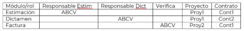	 

A=Alta

B=Cancelar

C=Modificar

V=Consultar

Para el módulo de ¨Reintegros¨ se habilitarán las opciones ¨Nuevo registro¨![ref3] , ¨Editar¨![ref4] y ¨Eliminar¨ para aquellos contratos en el que el Empleado SAT esté como ¨Participante en la verificación¨ o ¨Verificador de contrato¨ en la tabla ¨Participantes en la administración del contrato¨ del módulo de Contratos.

Para el módulo de facturas y notas de crédito se habilitarán las opciones “Nuevo registro¨![ref3], ¨Editar¨![ref4] y ¨Cancelar¨ (Notas de Crédito - Facturas) para aquellos contratos en el que el Empleado SAT esté como ¨Participante en la verificación¨ o ¨Verificador de contrato¨ en la tabla ¨Participantes en la administración del contrato¨ del módulo de Contratos. Para el” Verificador General” se habilitará para todos los contratos. 
|
|RN09|**RNA52**|1|Plan de trabajo – Visualización de tareas|
El sistema deberá mostrar de la siguiente manera las tareas:

 

Tabla “Plan de trabajo" 

 

- Para facilitar la visualización, se mostrarán un máximo de 20 tareas a la vez. Si existen más de 20 tareas, se habilitará una barra de desplazamiento vertical que permitirá al Empleado SAT navegar.

- En caso de que la información exceda el ancho de la tabla, se habilitará automáticamente una barra de desplazamiento horizontal para permitir una visualización completa

- Las tareas se ordenarán de forma ascendente por su "Id tarea", lo que permitirá una visualización clara y organizada de la información.

- De manera predeterminada, solo se muestran las tareas con niveles de esquema "0" y "1". Esto permite una visualización inicial enfocada en las tareas principales y sus subtareas inmediatas.

 

Diagrama de Gantt

- Para facilitar la visualización, se mostrarán un máximo de 20 tareas a la vez. Si existen más de 20 tareas, se habilitará una barra de desplazamiento vertical que permitirá al Empleado SAT navegar.

- El Diagrama se complementa con una barra de zoom que facilita la visualización detallada de la tarea dentro del rango comprendido entre la "Fecha de inicio planeada" y la "Fecha fin planeado".
|
|
RN09

|**RNA53**|1|Plan de trabajo – Cálculo por día|
El sistema deberá calcular el valor del campo "Planeado %" de las tareas padre e hijo todos los días las 23:00 horas de todos los proyectos activos. Este proceso realizará lo siguiente:

En caso de que intervenga un evento ajeno y no se puedan realizar el cálculo de los datos, se ejecutará un segundo intento al día siguiente a las 03:00 horas con los datos del día anterior de todos los proyectos activos. 

Se notificará vía correo electrónico con la siguiente información a las personas correspondientes con todos los planes de trabajo afectados: 

Cuerpo del correo:

Encabezado: Se tomará lo que contenga el catálogo “Plan de trabajo”.

Cuerpo: Se tomará lo que contenga el catálogo “Plan de trabajo”: (Listado de todos los proyectos involucrados)

Correo remitente y correos destinatarios: Se obtendrán del catálogo “Plan de trabajo”.

**Nota:** Este proceso se ejecutará al entrar en operación funcional el sistema.
|
|
RN09

|**RNA54**|1|Plan de trabajo – Estructura de campos|
Para los campos del plan de trabajo se validará la estructura de la siguiente forma:

El sistema valida el campo “Duración real”, el cual se compone de la siguiente forma:

- Se compone de solo caracteres numéricos enteros.

El sistema valida el campo “Fecha de inicio real” y “Fecha fin real”, el cual se componen de la siguiente forma:

- Se compone del formato DD/MM/AAAA.

El sistema valida el campo “Completado %”, el cual se compone de la siguiente forma:

- Se compone de solo caracteres numéricos con un mínimo de 0 y un máximo de 100.
|
|
RN09

|**RNA55**|1|Plan de trabajo – Contenido de plan de trabajo|
El sistema debe de validar de acuerdo con el siguiente archivo lo siguiente al cargar el plan de trabajo: 

1. Por cada tarea se tendrán que ingresar valores en los siguientes campos obligatoriamente: "Id tarea", "Nivel de esquema", "Nombre de la tarea", "Activo", "Duración planeada", "Fecha de inicio planeada" y "Fecha fin planeada".

2. El "Id tarea" debe ser único e irrepetible.

3. Solo puede haber un nivel de esquema con el valor "Cero".

4. Por cada tarea(hijo) debe haber una tarea (padre).

5. Los valores para "Activo" deben ser "Sí" o "No".

6. Los porcentajes deben ser enteros (Aplicar reglas de redondeo).

7. Ninguna tarea (Padre) puede tener la fecha de inicio planeada menor, pero si igual que su conjunto de sus tareas (hijos).

8. Ninguna tarea (padre) puede tener la fecha fin planeada mayor, pero si igual que su conjunto de tareas (hijos).

9. Para calcular los valores de los campos "Duración real", obligatoriamente se necesita los valores de los campos "Fecha inicio real" y "Fecha fin real".

10. Para calcular los valores de los campos "Fecha inicio real", obligatoriamente se necesita los valores de los campos "Duración real" y "Fecha fin real".

11. Para calcular los valores de los campos "Fecha fin real", obligatoriamente se necesita los valores de los campos "Fecha inicio real" y "Duración real".

12. No se pueden realizar modificaciones en los encabezados, añadir o eliminar columnas.

&emsp;

**Nota:** Para descargar la plantilla en el ícono "Descargar plan tipo", el documento adjunto "Plan de trabajo" debe estar previamente almacenado en la base de datos.
|
|
RN09

|**RNA56**|1|Plan de trabajo – Validaciones y cálculos |
El sistema deberá calcular los siguientes valores de la siguiente forma:

 

Duración real 

- El valor de la “Duración real” de cada tarea se calculará siempre que el usuario haya ingresado la "Fecha de inicio real" y "Fecha fin real" descontando los días no laborales (sábado y domingo) y festivos (1 de enero y 25 de diciembre) que entren en ese rango.

&emsp;

&emsp;

- El cálculo es el siguiente:

&emsp;Para tareas (hijo): 

Duración real (Tareas hijo)= (Fecha fin real - Fecha inicio real) - días no laborales

Ejemplo: 

Duración real (Tareas hijo)= (31-01-2024 – 01-01-2024) - 9 días

Duración real (Tareas hijo)= 21 días

Para tareas (padre):

Se toma el valor mínimo de la “Fecha inicio real” de todas las tareas (hijo) pertenecientes a la tarea (padre).

Se toma el valor máximo de la “Fecha fin real” de todas las tareas (hijo) pertenecientes a la tarea (padre).

Duración real (Tareas padre)= (MAX (Fecha fin real) - MIN (Fecha inicio real)) - días no laborales

Ejemplo: 

Tarea 1= Fecha inicio real: 15/01/2024, Fecha fin real: 18/01/2024 

Tarea 2= Fecha inicio real: 16/01/2024, Fecha fin real: 16/01/2024

Tarea 3= Fecha inicio real: 17/01/2024, Fecha fin real: 19/01/2024

Tarea 4= Fecha inicio real: 16/01/2024, Fecha fin real: 22/01/2024

MIN (Fecha inicio real): 15/01/2024

MAX (Fecha fin real): 22/01/2024

Duración real (Tareas padre)= (MAX (22/01/2024) - MIN (F 15/01/2024) - 2 días

Duración real (Tareas padre)= 6 días

Fecha inicio real 

- El valor de la “Fecha inicio real” de cada tarea se calculará siempre que el usuario haya ingresado la "Fecha fin real" y la "Duración real".

&emsp;**Nota:** el Empleado SAT debe contemplar los días festivos y los no laborales para el valor de la duración real

- El cálculo es el siguiente:

&emsp;Para tareas (hijo):

Fecha inicio real (Tareas hijo)= Fecha fin real - Duración real

Ejemplo:

Fecha inicio real (Tareas hijo)= 09-01-2024 - 5 días naturales

Fecha inicio real (Tareas hijo)= 05-01-2024

Para tareas (padre): 

Se toma el valor mínimo calculado anteriormente de la “Fecha inicio real” de todas las tareas (hijo) pertenecientes a la tarea (padre).

Fecha fin real 

- El valor de la “Fecha fin real” de cada tarea se calculará siempre que el usuario haya ingresado la "Fecha inicio real" y la "Duración real".

&emsp;**Nota:** el Empleado SAT debe contemplar los días festivos y los no laborales para el valor de la duración real

- El cálculo es el siguiente:

&emsp;Para tareas (hijo):

Fecha fin real (Tareas hijo)= Fecha inicio real + Duración real

Ejemplo:

Fecha inicio real (Tareas hijo)= 05-01-2024 + 5 días naturales

Fecha inicio real (Tareas hijo)= 09-01-2024

Para tareas (padre): 

Se toma el valor máximo calculado anteriormente de la “Fecha fin real” de todas las tareas (hijo) pertenecientes a la tarea (padre).

 

Planeado %

- Se tomarán todas las tareas que tengas el valor “Si” en el campo “Activo”.

- El cálculo será el siguiente:

&emsp;Para tareas (hijo):

Porcentaje de avance de cada tarea:

![ref5]

Ejemplo

Porcentaje por día= (23 / 50) x 100

Porcentaje por día= 46 %

Para tareas (padre):

Formulas:

1\. Porcentaje de avance de cada tarea

![ref5]

2\. Peso de cada tarea hijo:

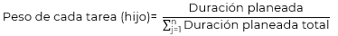

3\. Porcentaje de avance de la tarea padre

![ref6]

Ejemplo: 

Supongamos que tenemos tres tareas hijo con los siguientes datos:

- Tarea Hijo 1:

Duración planeada: 10 días

Días Transcurridos: 5 días

- Tarea Hijo 2:

Duración planeada: 20 días

Días Transcurridos: 10 días

- Tarea Hijo 3:

Duración planeada: 30 días

Días Transcurridos: 15 días

<h4>Paso 1: Calcular el porcentaje de avance de cada tarea hijo:</h4>

- Tarea Hijo 1:

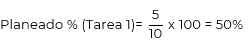

- Tarea hijo 2:

Tarea hijo 3:

Paso 2: Calcular el peso de cada tarea hijo:

La duración total de todas las tareas hijo es:

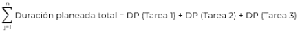

Sustituyendo:

- Peso de la tarea 1:

&emsp;![ref7]

- Peso de la tarea 2:

&emsp;![ref8]

- Peso de la tarea 3:

&emsp;![ref9]

&emsp;

Paso 3: Calcular el porcentaje de avance de la tarea padre:

![ref6]Sustituyendo los valores calculados:

Planeado % (Tarea padre)= (50% X 0.1667) + (50% X 0.3333) + (50% X 0.5000)

Planeado % (Tarea padre)= 8.335% + 16.665% + 25%

Planeado % (Tarea padre)= 50%

 

Completado % (Tarea padre)

- Se tomarán todas las tareas que tengan el valor “Si” en el campo “Activo”.

- Las tareas (hijo) que no se les haya ingresado un valor en el campo “Completado %” será de 0%.

- El cálculo será el siguiente:

1\. Porcentaje de avance de cada tarea: Se toma el porcentaje ingresado.

2\. Peso de cada tarea hijo:

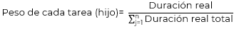

3\. Porcentaje de avance de la tarea padre

![ref10]

Ejemplo: 

Supongamos que se ingresaron tres tareas hijo con los siguientes datos:

- Tarea Hijo 1:

Duración real: 10 días

Días Transcurridos: 5 días

- Tarea Hijo 2:

Duración real: 20 días

Días Transcurridos: 10 días

- Tarea Hijo 3:

Duración real: 30 días

Días Transcurridos: 15 días

Paso 1: Calcular el peso de cada tarea hijo:

La duración total de todas las tareas hijo es:

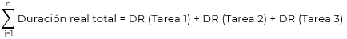

Sustituyendo:

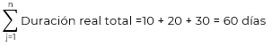

- Peso de la tarea 1:

&emsp;![ref7]

- Peso de la tarea 2:

&emsp;![ref8]

- Peso de la tarea 3:

&emsp;![ref9]

&emsp;

Paso 3: Calcular el porcentaje de avance de la tarea padre:

![ref10]Sustituyendo los valores calculados:

Completado % (Tarea padre)= (50% X 0.1667) + (50% X 0.3333) + (50% X 0.5000)

Completado % (Tarea padre)= 8.335% + 16.665% + 25%

Completado % (Tarea padre)= 50%

**Nota:** El sistema aplicará redondeo de la siguiente forma al resultado final:

- De 0.0100 hasta 0.5000% baja la unidad.

- De 0.5100 hasta 0.9999% sube la unidad.
|
|
RN09

|**RNA57**|1|Plan de trabajo – Ver nivel de esquema |
El sistema deberá identificar la opción seleccionada por el Empleado SAT en la lista de selección “Nivel de esquema” de acuerdo con lo siguiente: Al seleccionar un valor para el nivel de esquema, se desglosarán todas las tareas que pertenezcan hasta el nivel seleccionado, ejemplo:

Nivel de esquema= 2

Tareas que se muestran:

>Tarea nivel 0

>Tarea nivel 1

>Tarea nivel 2

>Tarea nivel 1  

**Nota:** La lista de selección "Nivel de esquema" indica el número de niveles presentes en el plan de trabajo ya cargado y, en consecuencia, genera su respectivo listado.
|
|
RN09

|**RNA58**|1|Plan de trabajo – Mostrar todas las tareas|
El sistema deberá hacer las siguientes acciones al seleccionar el ícono “Mostrar todas las tareas”:

- Al estar en estado “Activo”, desplegará todas las tareas (hijo) que estén contraídas en el Diagrama de Gantt.

- Al estar en estado “Inactivo” el sistema contraerá todas las tareas (hijo) dejando solo visibles las tareas con el nivel de esquema “0” y “1”.
|
|
RN09

|**RNA59**|1|Plan de trabajo – Porcentaje de tarea|
El sistema deberá validar lo siguiente:

- Si alguna tarea (padre o hijo) tiene el valor “100%” en el campo “Completado %” y realizará lo siguiente:

&emsp;- Si no existe información en los campos “Duración real", “Fecha inicio real” y “Fecha fin real” de la tarea completada, se copiarán los valores de los campos “Duración planeada”, “Fecha de inicio planeada”, “Fecha fin planeada” a los campos “Duración real”, “Fecha de inicio real”, “Fecha fin real”.

- Si alguna tarea (padre o hijo) tiene un valor mayor a “0%” o menor a “100%” en el campo “Completado %” y realizará lo siguiente:

&emsp;- Si no existe información en el campo “Fecha inicio real” de la tarea, se copiará el valor del campo “Fecha de inicio planeada” al campo “Fecha de inicio real”.
|
|RN04|**RNA60**|1|Reporte de control documental - Requerido|
El sistema deberá realizar lo siguiente para la columna “Requerido”:

Se obtiene los valores de la columna “Requerido” de la plantilla del módulo “Matriz documental” de acuerdo con siguiente:

 Documento requerido= Sí

 Documento no requerido= No
|
|
RN06

|**RNA61**|1|Reintegros- Valores que se autocompletan|
El sistema debe completar la información de los siguientes campos:

- Total = Valor del registro de la columna Importe + valor del registro de la columna Interés. El resultado debe redondearse a 2 decimales.

- ∑ Importes- Muestra la sumatoria de los registros de la columna Importes. El resultado debe redondearse a 2 decimales.

- ∑ Intereses- Muestra la sumatoria de los registros de la columna Interés. El resultado debe redondearse a 2 decimales.

- ∑ Totales- Muestra la sumatoria de los registros de la columna Total. El resultado debe redondearse a 2 decimales.
|
|RN07|**RNA62**|1|Criterios de búsqueda para “Consumo de Servicios”|
Cuando se presente la pantalla para realizar una búsqueda en el módulo de “Consumo de Servicios”, se deben mostrar los siguientes criterios:

Contrato vigente: Debe tener las opciones: Sí, No y Todos.

Contratos: 

- Se deberá llenar con el nombre corto de todos los contratos según su vigencia.

- En caso de seleccionar “Si” en “Contrato vigente”, la fecha fin del contrato o la fecha fin del último convenio modificatorio con el que cuente, debe ser mayor o igual a la fecha de consulta.

- En caso de seleccionar “No”, la fecha fin del contrato o fecha fin del último convenio modificatorio que tenga, debe ser menor a la fecha de consulta.

- En caso de que seleccione “Todos”, el sistema deberá consultar todos los contratos, tanto vigentes como no vigentes.

- El Empleado SAT que consulta solo podrá visualizar el listado de los contratos en los que se encuentre asignado y tenga participación en la administración del contrato.

Proveedores: 

- Se llenará de acuerdo con lo seleccionado en el campo “Contratos”.

- El sistema debe consultar el nombre de los proveedores que se encuentren relacionados al contrato.

- En caso de tener solo 1 proveedor relacionado, se debe mostrar seleccionado automáticamente. 

Tipo de consumo: Debe tener las opciones de Estimado y Dictaminado.

Estatus: Muestra el listado de estatus de acuerdo con los catálogos correspondientes y dependiendo si es “Estimado” (Inicial, Estimado o Cancelado) o “Dictaminado” (Inicial, Dictaminado, Proforma, Facturado, Pagado o Cancelado).
|
|RN03|**RNA63**|1|Comités – Sesión|
El sistema validará por cada registro los archivos adjuntos, dependiendo la cantidad se mostrará de la siguiente forma:

- Si solo se adjuntó un archivo, se mostrará un enlace con la palabra “clic”.

- Si hay más de un archivo adjunto se mostrará la opción  y  para descargar los archivos comprimidos.
|
|RN07|**RNA64**|1|Información de Estimaciones.|
Cuando el Empleado SAT realice una búsqueda en “Consumo de Servicios”, el sistema debe obtener la información de la base de datos referente a las “Estimaciones” donde esté asignado en el contrato y tenga participación en la administración del contrato. 

Se debe presentar una tabla con las siguientes precisiones:  

- Cada fila de la tabla representar una estimación.

- Las columnas deberán considerar los siguientes campos:

- Periodo de control

- Periodo inicial.

- Periodo final.

- Proveedor.

- Estatus. 

- Monto estimado.

- Monto estimado en pesos.

- Monto dictaminado: estará en 0 cuando no se tenga por lo menos un dictamen generado de la estimación.

- Monto dictaminado en pesos: estará en 0 cuando no se tenga por lo menos un dictamen generado de la estimación.

- Acciones: Columna que muestra los Íconos para las opciones “Ver estimación” y “Editar estimación”, dependiendo el rol del Empleado SAT y el estatus del proyecto asociado a la estimación:

&emsp;- Si el rol del Empleado SAT es de solo consulta, se muestra el ícono de “Ver estimación”, en caso contrario, se muestra el ícono de “Editar estimación”.

&emsp;- Si el proyecto asociado a la estimación tiene estatus de “Cancelado”, se muestra el ícono de “Ver estimación”, en caso contrario, se muestra el ícono de “Editar estimación”.
|
|RN07|**RNA65**|1|Información de Dictámenes.|
Cuando el Empleado SAT realice una búsqueda en “Consumo de Consumo de Servicios”, el sistema debe obtener la información de la base de datos referente a los “Dictámenes” donde esté asignado en el contrato y tenga participación en la administración del contrato.

Presenta una tabla con las siguientes precisiones:

- Cada fila de la tabla representa un dictamen.

- Los campos que debe contener la tabla son los siguientes:

- Id dictamen: Identificador generado por el sistema, el cual es único para cada dictamen.

- Monto: Muestra el “Monto dictaminado total en pesos” calculado en el dictamen.

- Estatus: Se muestra el estatus actual del dictamen.

- Comprobante fiscal: consulta en la base de datos las facturas relacionadas al dictamen y se debe mostrar el o los números de “Folio” separados por comas.

- Pendientes de pago: Se coloca la cantidad de facturas relacionadas al ID-Dictamen que tengan estatus diferente de “Pagado” y “Cancelado”. En caso de no contener facturas o estar el dictamen en estatus Pagado, poner 0.

- Acciones: Columna que muestra los iconos para las opciones “Ver dictamen” y “Editar dictamen”, dependiendo el rol del Empleado SAT y el estatus del proyecto asociado al dictamen:

&emsp;- Si el rol del Empleado SAT es de solo consulta, se muestra el ícono de “Ver dictamen”, en caso contrario, se muestra el ícono de “Editar dictamen”.

&emsp;- Si el proyecto asociado al dictamen tiene estatus de “Cancelado”, “Pagado" y “Proforma”, se muestra el ícono de “Ver dictamen”, en caso contrario, se muestra el ícono de “Editar dictamen”.
|
|
RN06

RN14

|**RNA66**|1|Consideraciones para filtrar en apartados de las secciones por usuario y por proyecto|
Cuando el usuario realice un filtro, puede seleccionar o no algún dato de los que se muestran en pantalla. 

Si selecciona algún dato y realiza nuevamente un filtro, el sistema debe mantener marcado el primer dato seleccionado y de la misma forma con cada filtro y selección que realice el usuario.
|
|RN03|**RNA67**|1|Matriz Documental – Campos obligatorios|
El sistema deberá validar que se haya ingresado información en los siguientes campos obligatorios teniendo en cuenta la **(RNA03)**:

Para un nuevo registro y se seleccione la opción “Guardar”:

- Nombre de la plantilla

- Prefijo

- Descripción

Para modificar un registro y se seleccione la opción “Guardar”:

- Prefijo

- Descripción

Una vez que se haya cargado un archivo y seleccionado una opción en el campo "Fase", habilitará la opción "Vista previa"; de no cumplirse esto, la opción permanecerá inhabilitada.
|
|RN01|**RNA68**|1|
Alta de catálogos - Campos obligatorios.

|
El sistema deberá validar que se hayan seleccionado o ingresado los datos obligatorios de acuerdo con lo siguiente:

  

Para la búsqueda es necesario seleccionar un catálogo del campo “Catálogo” o “Subcatálogo”.

Una vez consultado el catálogo se deben de considerar los siguientes campos obligatorios:

- “Catálogos generales” es necesario ingresar los datos para los siguientes campos: 

- Nombre

- Descripción

- “Catálogos complementarios” es necesario ingresar los datos para los siguientes campos:

&emsp;Administración general, central o área:

&emsp;- Administración

&emsp;- Acrónimo

&emsp;- Puesto

Alineación:

- Nombre

&emsp;- Descripción

Mapas - Objetivos

- Objetivo

&emsp;- Descripción

Tabla (Administradores)

- Nombre completo

&emsp;- Fecha inicio de vigencia
|
|RN01|**RNA69**|1|Catálogos - Estructura de campos.|
El sistema deberá validar la estructura de los datos ingresados de la siguiente forma: 

Catálogos generales: 

- El campo “Nombre” se compone de solo caracteres alfanuméricos con un máximo de 150 caracteres.

- El campo “Descripción” se compone de solo caracteres de tipo texto con un máximo de 300 caracteres.

Catálogos complementarios:

- Administración general, central o área

&emsp;- El campo “Administración” se compone de solo caracteres alfanuméricos con un máximo de 150 caracteres.

&emsp;- El campo “Acrónimo” se compone de solo caracteres alfanuméricos con un máximo de 20 caracteres.

&emsp;- El campo “Puesto” se compone de solo caracteres alfanuméricos con un máximo de 150 caracteres.

- Alineación 

&emsp;- El campo “Nombre” se compone de solo caracteres de tipo texto con un máximo de 150 caracteres.

&emsp;- El campo “Descripción” se compone de solo caracteres de tipo texto con un máximo de 300 caracteres.

- Mapas - Objetivo

&emsp;- El campo “Objetivo” se compone de solo caracteres alfanuméricos con un máximo de 150 caracteres.

&emsp;- El campo “Descripción” se compone de solo caracteres de tipo texto con un máximo de 300 caracteres.

- Tabla (Administradores)

- El campo “Nombre completo” se compone de solo caracteres alfanuméricos con un máximo de 150 caracteres.
|
|
RN06

RN14

|**RNA70**|1|Exportar Proyectos-Usuarios|
El sistema debe consultar en la BD la siguiente información cuando el usuario seleccione la opción “Exportar Proyectos-Usuarios":

- Nombre corto del proyecto.

- Id proyecto.

- Nombre completo del proyecto.

Y considerar los siguientes puntos:

- Si existe una opción de consulta seleccionada, se debe obtener la información del proyecto especificado.

- En caso de no haber seleccionado una opción en los criterios de búsqueda, el sistema debe consultar y obtener la información de todos los proyectos registrados en este sistema.
|
|RN01|**RNA71**|1|Catálogos - Exportar a Excel |
El sistema identifica el tipo de catálogo y obtiene la siguiente información:

Para los “Catálogos generales” se obtendrá la siguiente información: 

- Id

- Nombre

- Descripción

- Fecha de creación

- Última modificación

- Estatus (Activo/Inactivo)

Para los “Catálogos complementarios” se obtendrá la siguiente información: 

- Administración general:

&emsp;- Id

&emsp;- Administración

&emsp;- Acrónimo

&emsp;- Administrador general (Deberá tomar el registro activo de la tabla (Administradores)) relacionado al puesto.

&emsp;- Puesto 

&emsp;- Fecha de creación

&emsp;- Última modificación

&emsp;- Estatus (Activo/Inactivo)

- Administración central:

&emsp;- Id

&emsp;- Administración

&emsp;- Acrónimo

&emsp;- Administrador central (Deberá tomar el registro activo de la tabla (Administradores)) relacionado al puesto.

&emsp;- Puesto 

&emsp;- Fecha de creación

&emsp;- Última modificación

&emsp;- Estatus (Activo/Inactivo)

- Área:

&emsp;- Id

&emsp;- Área

&emsp;- Acrónimo

&emsp;- Administrador de área (Deberá tomar el registro activo de la tabla (Administradores)) relacionado al puesto.

&emsp;- Puesto

&emsp;- Fecha de creación

&emsp;- Última modificación

&emsp;- Estatus (Activo/Inactivo)

- Alineación:

&emsp;- Id

&emsp;- Nombre

&emsp;- Descripción

&emsp;- Fecha de creación

&emsp;- Última modificación

&emsp;- Estatus (Activo/Inactivo)

- Mapas - Objetivos:

&emsp;- Id

&emsp;- Objetivo

&emsp;- Descripción

&emsp;- Fecha de creación

&emsp;- Última modificación

&emsp;- Estatus (Activo/Inactivo)

Para la tabla “Administradores” se obtendrá la siguiente información:

- Id

&emsp;- Nombre completo

&emsp;- Fecha de inicio de vigencia

&emsp;- Fecha fin de vigencia

&emsp;- Última modificación

&emsp;- Estatus 
|
|
RN01

RN05

|**RNA72**|1|Roles para catálogo de proveedores|
En el catálogo de proveedores, solo los roles que cuenten con permiso de lectura podrán visualizar en modo lectura todas las secciones.

Para el caso de la captura y edición, se tendrá que considerar contar con el permiso correspondiente para cada una de las siguientes secciones:

- Datos generales

- Directorio de contacto

- Información de títulos 

- Dictamen técnico

Si el rol no cuenta con el permiso de captura no se mostrarán los botones “Guardar” y “Cancelar” 
|
|
RN02

RN03

RN05

RN06

RN07

RN10
|**RNA73**|1|Check no aplica en gestión documental|Cuando se activa la casilla de selección "No aplica" para un documento que es "Requerido" en la matriz documental, el estado del documento cambia a "No pendiente" y el icono del triángulo amarillo desaparece. En este caso, es obligatorio ingresar un valor en el campo "Justificación" para explicar la razón por la cual se marcó la casilla "No aplica".|
|
RN02

RN03

RN05

RN06

RN07

RN10

|**RNA74**|1|
Campos al crear un nuevo documento de un proyecto

|
Cuando se selecciona la opción de "Nuevo documento" en la tabla "Gestión documental", se habilitan los siguientes campos y opciones: 

 

`       `Campos:

- Descripción: Campo obligatorio   

- Requerido: Se inicializa la casilla de selección a "Inactivo" sin opción a editar.

- No aplica: Se inicializa la casilla de selección a "Inactivo". 

- Estatus. No editable, se actualizará de manera automática dependiendo si existe o no un documento adjunto. 

- Tamaño. No editable, y se actualizará automáticamente en función del documento una vez adjunto.

- Fecha de última modificación. No editable, se actualizará automáticamente si se carga un documento o se remplaza

 

`       `Opciones:

- Eliminar documento.  

- Justificación. 

- Cargar documento.

- Ver PDF  
|
|RN06|**RNA75**|1|
Estatus de avance del contrato.

|
Los diferentes estatus del contrato solo se pueden modificar si el usuario tiene el rol “Administrador del sistema” y/o cuenta con los permisos de “cambiar estatus del contrato”, de acuerdo con lo siguiente:

- Al momento de crear un contrato, los botones “Inicial” “Ejecución” y “Cancelar contrato”, no se mostrarán.

- Inicial: Se asigna una vez que se da de alta un contrato, es decir, cuando se capturaron los datos de la sección Identificación, se debe validar que se hayan llenado todos los datos obligatorios de la sección Identificación. Si el estatus del contrato es “Inicial”, el botón aparecerá como no visible, en caso contrario siempre se mostrará visible.

- Ejecución: Para pasar a este estatus, el contrato debe tener estatus “Inicial”. Si el estatus del contrato es “Ejecución”, el botón aparecerá como no visible, solo podrá mostrarse si el estatus del contrato es “Inicial”.

- Si el contrato se encuentra “Cancelado” o “Cerrado” sólo el Administrador del sistema podrá regresarlo a “Inicial”.

- Cerrado: Para pasar a este estatus, el contrato tiene estatus de “Ejecución”, permitiendo avanzar el contrato al estatus de “Cerrado” con el botón “Cierre” de la sección Cierre del contrato, se debe validar que se carga el acta de cierre para cambiar a este estatus. Solo se mostrará visible, si el estatus del contrato es “Ejecución”. Se debe validar que no existan dictámenes pendientes de pago, de lo contrario no se podrá avanzar a dicho estatus. 

- Cancelado: Para pasar a este estatus el contrato se encuentra en cualquier estatus, cuando es seleccionado por el usuario el ícono “Cancelar contrato” el sistema asigna al contrato el estatus de “Cancelado”. Se debe validar que todos los dictámenes y estimaciones estén en estatus “Cancelado” en caso de existir. Este botón siempre se mostrará visible.
|
|
RN06

|**RNA76**|1|Id contrato.|El sistema debe generar un identificador único consecutivo para cada proyecto y contrato que se da de alta, considerando que, debe ser un dato numérico con una longitud de 5 posiciones, ejemplo: 00001|
|
RN06

|**RNA77**|1|Montos volumetría para la sección Registros de servicio|
Si el registro tiene “Tipo de consumo” Volumetría los siguientes datos serán obligatorios 

- Grupo

- Tipo de consumo

- Precio unitario

- Cantidad de servicios mínima

- Cantidad de servicios máxima

Monto mínimo lo calculará el sistema siendo la Cantidad se servicios mínima por el Precio unitario.

Monto máximo lo calculará el sistema siendo la Cantidad se servicios máxima por el Precio unitario.

Si el registro tiene “Tipo de consumo” Bolsa los siguientes datos serán obligatorios 

- Grupo

- Tipo de consumo

- Precio unitario

- Monto mínimo

- Monto máximo

Cantidad mínima lo calculará el sistema siendo el Monto mínimo entre el Precio unitario.

Cantidad máxima lo calculará el sistema siendo la Monto máximo entre Precio unitario.
|
|
RN06

|**RNA78**|1|Todo los Proyectos/Contratos|
El sistema tendrá en cuenta el permiso “Ver todos los contratos” y/o “Ver todos los proyectos” otorgado al Empleado SAT para mostrar los nombres cortos de los contratos y/o proyectos a seleccionar dentro del formulario correspondiente.

- Si tiene permiso para ver todos los contratos y/o proyectos, el sistema obtiene todos los contratos y/o proyectos.

- En caso contrario, se deberá considerar los contratos y/o proyectos que tenga asignado el Empleado SAT en el módulo correspondiente.
|
|
RN07

RN08

|**RNA79**|1|Deducciones, descuentos, penalizaciones- Actualización automática de la tabla|Los valores de los montos en la tabla deben actualizarse de forma automática, en caso de agregarse o modificarse los montos que se capturan en las secciones “Penas contractuales”, “Penas convencionales” o “Deducciones” del módulo Consumo de Servicios-Dictamen. Se tendrá en cuenta el valor del campo ¨Desglose¨ de cada sección.|
|
RN06

RN10

|**RNA80**|1|Estructura del layout de carga de la Proyección del caso de negocio y convenio modificatorio |
El layout de proyección de caso de negocio y convenio modificatorio estará conformado de la siguiente manera:

 
|

|Id (registro de servicios)|Conceptos de servicio|Mes1-AA|Mes2-AA|Mes3-AA|Mes4-AA|Mes5-AA|Mes6-AA|Mes7-AA|Mes8-AA|
 

MesN-AN
|
| - | - | - | - | - | - | - | - | - | - | - |

|||||
- El nombre del servicio 

- Se debe crear un campo por cada mes de duración del contrato, es decir si el contrato dura 9 meses de junio de 2024 a febrero de 2025. El layout tendrá la siguiente estructura.

- Para caso de Convenio Modificatorio la duración será de la “Fecha de inicio” del contrato a la “Fecha fin de contrato con CM” de la sección “Registro de convenio modificatorio”.
|
| :- | :-: | :-: | :- | - |

|Id (registro de servicios)|Conceptos de servicio|Jun-24|Jul-24|Ago-24|Sep-24|Oct-24|Nov-24|Dic-24|Ene-25|Feb-25|
| - | - | - | - | - | - | - | - | - | - | - |

|||||
- Se considerarán todos los meses incluidos los que tengan fechas al inicio o fin del contrato, Por ejemplo, Inicio: 28/01/2024 Término: 02/04/2024 se considera de enero a abril.

- En la estructura del layout se incluirán todos los registros de “Registros de servicios” que se encuentren almacenados en la tabla correspondientes al contrato seleccionado.

- En caso de contar con datos previamente cargados, el layout deberá descargarse con la información correspondiente. En caso contrario, el campo de volumetría será vacío.
|
| :- | :-: | :-: | :- | - |
|
RN06

RN14
|**RNA81**|1|Validación de registro de usuario|
Valida que no coincidan los siguientes criterios de registro:

- Nombre 

- RFC corto 
|
|RN05|**RNA82**|1|Información de la tabla administrar proveedores.|En la pantalla de Proveedores, inicialmente, se mostrarán todos los proveedores almacenados “Activos e Inactivos”, al ingresar un filtro la consulta se actualizará respecto a los valores coincidentes con el filtro aplicado.|
|
RN01

RN08
|**RNA83**|1|
Estatus facturas

|
El sistema debe consultar y asignar el estatus de acuerdo con lo siguiente: 

- Factura en ACPPI: Este estatus se agrega cuando se agrega una factura.

- Solicitud de pago: Será actualizado en la sección de “Solicitud de pago”.

- Pagado: Será actualizado en la sección “Referencia de pago”.

- Cancelado: Se asigna al seleccionar el ícono de Cancelado.
|
|RN05|**RNA84**|1|Cambio de íconos al editar|
En las tablas de datos históricos que muestren en la columna “Acciones” el ícono Editar , si se da clic sobre él, se pondrán solo los campos de captura de datos de la tabla en modo edición y se cambiarán los íconos de esta columna por los siguientes 

Ejemplo del cambio de íconos:

Normal             Modo edición

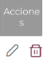    
|
|RN05|**RNA85**|1|Consultar catálogos |
El sistema debe consultar y obtener del catálogo de “Respuesta proveedor” el cual se debe de mostrar en las siguientes columnas: 

 

•	Investigación de mercado 

•	Respuesta IM  

•	Junta de aclaración 

•	Licitación Pública 

 

El catálogo debe tener las opciones Sí, No, N/A y Declinó.  

Cuando el “Tipo de procedimiento” sea “adjudicación directa” o “contrato marco” la “Junta de aclaraciones” y “licitación pública” se deben de visualizar con el combo de “N/A”.
|
|RN03|**RNA86**|1|Validación periodo de fechas - “Papelera de reciclaje”. |
Para generar la consulta de información en el submenú Papelera de reciclaje, el sistema debe validar lo siguiente: 

- El valor de fecha ingresado en el campo “Fecha de eliminación Desde”, debe ser menor al valor ingresado en el campo “Fecha de eliminación Hasta”. 

- El valor de fecha ingresado en el campo “Fecha de eliminación Hasta”, debe ser mayor al valor ingresado en el campo “Fecha de eliminación Desde”.
|
|
RN07

RN08
|**RNA87**|1|
Estatus del dictamen

|
El estatus del dictamen cambia de acuerdo con los movimientos que se generen en las secciones del dictamen, Deducciones / Descuentos / Penalizaciones, Factura, Nota de crédito y Solicitud de pago. 

- Inicial.  

&emsp;Cuando es nuevo o se duplique un dictamen, tendrá el estatus inicial. 

&emsp;Los campos señalados para edición solo estarán disponibles para el Empleado SAT que esté como ¨Participante en el dictamen¨ o ¨Administrador del contrato¨ en la tabla ¨Participantes en la administración del contrato¨ del módulo de Contratos, o sea ¨Verificador general¨.

Las secciones disponibles son:

- Datos generales (modo edición).

- Registro de servicios dictaminados (modo edición).

- Penas contractuales, convencionales y deducciones (modo edición).

- En caso de aplicar la columna “Monto” estará deshabilitada.

- En “Soporte documental del dictamen” (modo edición) cumplirán las siguientes reglas:    

&emsp;&emsp;&emsp;- En caso de no aplicar penas contractuales, convencionales y deducciones, los campos “Detalle de penas y deducciones”, y “Entregables” estarán deshabilitados.

&emsp;&emsp;&emsp;- En caso de que el verificador y administrador del contrato sean diferentes, los campos “Número de oficio”, “Fecha de solicitud de dictamen” y “Oficio” se habilitarán.

&emsp;&emsp;&emsp;- El campo “Fecha de recepción de dictamen”, se habilitará una vez que el estatus pase a dictaminado.

- Las secciones no mencionadas se encontrarán en modo lectura.

&emsp;

- Dictaminado. 

&emsp;El estatus cambia, cuando el Empleado SAT selecciona la opción "Dictaminado" en la sección "Soporte documental del dictamen".

&emsp;Los campos señalados para edición solo estarán disponibles para el Empleado SAT que esté como "Participante en la verificación" o "Verificador del contrato" en la tabla "Participantes en la administración del contrato" del módulo de Contratos, o sea “Verificador general".

Las secciones disponibles son:

- Datos generales (modo lectura).

- Registro de servicios dictaminados (modo lectura).

- Penas contractuales, convencionales y deducciones (solo se habilitará el campo de "Monto").

- Soporte documental del dictamen (Solo se habilitará el campo "Fecha de recepción de dictamen").

- En la sección Deducciones/ descuentos/ penalizaciones (modo edición) cumplirán las siguientes reglas:

&emsp;&emsp;&emsp;- En caso de no aplicar penas contractuales, convencionales y deducciones, el campo “Detalle de penas y deducciones” estará deshabilitado.

&emsp;&emsp;&emsp;- Si se selecciona la opción "Rechazado" el estatus cambiará ha "Inicial".

&emsp;&emsp;&emsp;- La opción "Generar proforma" estará oculta.

&emsp;&emsp;&emsp;- Las opciones "Nuevo registro", "Vista previa proforma" y "Actualizar tabla" se mostrarán habilitadas.

- Las secciones no mencionadas se encontrarán en modo lectura.

 

- Proforma.  

&emsp;El estatus cambia, cuando el Empleado SAT selecciona la opción "Validar dictamen" en la sección "Deducciones/descuentos/penalizaciones".

&emsp;Los campos señalados para edición solo estarán disponibles para el Empleado SAT que esté como "Participante en la verificación" o "Verificador del contrato" en la tabla "Participantes en la administración del contrato" del módulo de Contratos, o sea "Verificador general".

Las secciones disponibles son:

- Datos generales (modo lectura).

- Registro de servicios dictaminados (modo lectura).

- Penas contractuales, convencionales y deducciones (modo lectura).

- Soporte documental del dictamen (modo lectura)

- Deducciones / descuentos / penalizaciones (modo lectura). Las opciones "Validar dictamen", "Rechazado", "Guardar" y "Cancelar" se ocultarán y no se mostrarán en pantalla. Solo estará habilitada la opción "Generar proforma".

- Solicitud de factura (modo edición) cumplirá las siguientes reglas:

&emsp;- Si el campo "Facturas recibidas" no está marcado, se mostrará la opción “Recepción de factura". En caso contrario se mostrará en modo lectura el campo "Facturas recibidas" y marcado.

- Facturas

&emsp;- La opción “Nuevo registro” siempre se mostrará habilitado.

&emsp;- Si el campo “Facturas recibidas” se encuentra habilitado se permitirá cargar archivos de facturas.

&emsp;- Al agregar una factura, se habilitará el campo de desglose de montos por cada factura. Aplica la **(RNA144)**.

- Las secciones no mencionadas se encontrarán en modo lectura.

- Facturado  

&emsp;- Facturas

&emsp;- La opción “Nuevo registro” siempre se mostrará habilitado, Inserta un nuevo formulario al inicio de la sección.

&emsp;- Al agregar una factura se debe habilitar la opción “Archivo a cargar” para agregar el XML.

&emsp;- Al guardar la factura se habilita las opciones “Editar” y “Cancelar facturas”.

&emsp;- Cambia el estatus de “Proforma” a “Facturado” cuando se genera y guarda la captura de la primera factura en la sección de “Facturas” la cual inicia el estatus de “Factura en ACPPI”.

&emsp;- Notas de crédito

&emsp;- La opción “Nuevo registro” siempre se mostrará habilitado, Inserta un nuevo formulario al inicio de la sección.

&emsp;- Al agregar una nota de crédito se debe habilitar la opción “Archivo a cargar” para agregar el XML.

&emsp;- Al guardar la nota de crédito se habilitan las opciones “Editar” y “Cancelar nota de crédito”.

&emsp;- Solicitud de pago

&emsp;- Esta sección estará habilitada después de capturada una factura.

&emsp;- Las secciones no mencionadas se encontrarán en modo lectura

- Solicitud de pago

&emsp;Cambia de estatus, cuando en la sección solicitud de pago se selecciona la opción con el mismo nombre. 

&emsp;- Las secciones no mencionadas se encontrarán en modo lectura.

&emsp;&emsp;

- Pagado 

Cambia de estatus, cuando en la sección Referencia de pago se selecciona la opción Pagado.

- Todas las secciones se encontrarán en modo lectura.

       

- Cancelado 

Cambia al estado “Cancelado” cuando el usuario haga “clic” en el ícono “Cancelar dictamen”. Se puede cancelar en los siguientes casos:

- Estatus inicial, dictaminado y proforma.

&emsp;- Si tiene facturas y/o notas de crédito deben de estar en estatus cancelado.

Una vez que el dictamen esté Cancelado se mostrará el botón “Inicial” para el administrador del sistema que le permitirá regresar el dictamen a estatus “Inicial”.
|
|
RN02

RN03

RN05

RN06

RN07

RN10
|**RNA88**|1|Documentos requeridos en Gestión documental.|El check de requerido de la pantalla de “Gestión documental”, mostrará en pantalla el valor seleccionado en la plantilla asociada.|
|
RN02

RN03

RN05

RN06

RN07

RN10
|**RNA89**|1|Advertencia de documento pendiente en Gestión documental.|En la pantalla de “Gestión documental” si un documento tiene activo el check “Requerido”, y aún no se ha cargado un documento, en la columna estatus se mostrará el Ícono |
|
RN02

RN03

RN05

RN06

RN07

RN10
|**RNA90**|1|Opción default en Gestión documental.|
Al ingresar a la pantalla de “Gestión documental”, se cuenta con las siguientes opciones de filtro:

- Todos 

- Pendientes 

- Cargados

La opción por defecto será Todos,
|
|RN03|**RNA91**|1|Acciones - “Papelera de reciclaje”.|
El sistema debe validar que en el campo "Selección”  de la tabla, exista al menos un documento seleccionado para habilitar las siguientes opciones:

- Exportar a Excel.

- Descargar ZIP.

- SATCloud.

- Eliminar (botón).

- Restaurar (botón).

Si el rol no cuenta con el permiso de captura, no se mostrarán los botones “Eliminar” y “Restaurar”.
|
|RN03|**RNA92**|1|Documentos de la tabla - “Papelera de reciclaje”.|El sistema debe validar que, al realizar la consulta en la BD, los documentos mostrados en la tabla "Archivos eliminados” comprendan únicamente el periodo de los últimos 30 días.|
|RN05|**RNA93**|1|Mostrar tabla en blanco, sino encuentra registros |
En las pantallas que contienen tablas de datos históricos de la pantalla “Proveedor”:

- Directorio de contacto.

- Información de títulos.

- Dictamen técnico.

Al realizar la consulta en la BD, en caso de que no existan registros almacenados, se mostrará en el campo “Comentarios” u “Observaciones” la leyenda “No se encontraron registros”.
|
|
RN07

RN08
|**RNA94**|1|Deducciones, descuentos, penalizaciones-Estructura de los campos de la tabla |
Los campos de la tabla cumplirán con la siguiente estructura: 

- No.: Número consecutivo que genera el sistema de forma automática. Identifica la deducción, descuento o penalización. 

- Tipo: Campo que muestra el tipo de deducción, descuento o penalización. Se visualizarán los siguientes valores, teniendo en cuenta la **(RNA125)**:

- Penalización convencional SAT

- Penalización convencional CC 

- Penalización contractual SAT

- Penalización contractual CC

- Deducción SAT

- Deducción CC 

Se habilita como campo de selección si se agrega o se modifica (opción ¨Editar¨) un registro en la tabla, donde mostrará las opciones del catálogo de deducciones, descuentos o penalizaciones siguientes de acuerdo con la **(RNA125)**.

- Moneda: Campo que muestra el tipo de moneda registrada en la sección “Vigencias y montos del contrato”. 

- Monto: Campo que muestra información y se autocompleta de acuerdo con la **(RNA96)**. Se habilita como campo de captura si se agrega o se modifica (opción ¨Editar¨) un registro en la tabla. En este caso solo admite números decimales con formato $ 0.00 con separación de miles y 2 decimales.

- Acciones: Muestra las acciones que se pueden realizar sobre el registro en la tabla solo para las opciones del catálogo Tipo que no vengan de un cálculo de una sección previamente calculada. Estas pueden ser Editar ![ref1], Eliminar ![ref2]y Descartar . 
|
|
RN07

RN08

|**RNA95**|1|Deducciones, descuentos, penalizaciones-Campos obligatorios tabla|El sistema validará que se haya ingresado información en los campos que se encuentran habilitados en los registros de la tabla de acuerdo con la **(RNA94)**.|
|
RN07

RN08

|**RNA96**|1|Deducciones, descuentos, penalizaciones-Campos que se autocompletan en la tabla |
Por cada registro de la tabla el sistema debe calcular el monto correspondiente al registro, donde ¨monto¨ será la suma total de los valores del Campo Monto de los registros de las secciones “Penas contractuales”, “Penas convencionales” y “Deducciones” que se identifiquen con el mismo tipo de penalización o deducción, de acuerdo con:

- Si el valor del campo Desglose de la tabla de la sección “Penas convencionales” es SAT, el tipo de penalización = “Penalización convencional SAT”.  

- Si el valor del campo Desglose de la tabla de la sección “Penas convencionales” es CC, el tipo de penalización = “Penalización convencional CC”. 

- Si el valor del campo Desglose de la tabla de la sección “Penas contractuales” es SAT, el tipo de penalización = “Penalización contractual SAT”. 

- Si el valor del campo Desglose de la tabla de la sección “Penas contractual” es CC, el tipo de penalización = “Penalización contractual CC”. 

- Si el valor del campo Desglose de la tabla de la sección “Deducciones” es SAT, el tipo de deducción = “Deducción SAT”. 

- Si el valor del campo Desglose de la tabla de la sección “Deducciones” es CC, el tipo de deducción = “Deducción CC”.   

 

Si no se registran valores en las secciones “Penas contractuales”, “Penas convencionales” o “Deducciones”, el valor de ¨monto¨ correspondiente será 0 con formato $ 0.00.
|
|RN07|**RNA97**|1|Número de oficio y Fecha de solicitud del dictamen. ||

|
El sistema valida la siguiente información:

 

Campos obligatorio si el administrador del contrato no es el verificador.

Número de oficio: Alfanumérico 
|
| - |

|||||`  `Fecha de solicitud del dictamen: DD/MM/AAAA|
| :- | :-: | :-: | :- | - |
|
RN02

RN03

RN05

RN06

RN07

RN10

|**RNA98**|1|Campo descripción en gestión documental|
En la pantalla de Gestión documental, tenemos el campo Descripción, el cual forma parte de la estructura de árbol de la matriz de documentación.

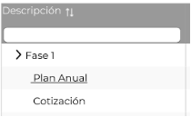

Si la fila en la tabla no tiene documentos cargados, sólo aparecerá la descripción, pero si ya existe un documento cargado, aparecerá la descripción, pero con un enlace que permita descargar el documento cargado.
|
|
RN07

|**RNA99**|1|Duplicar dictamen|
Consumo de servicios – Dictamen

El sistema muestra el ícono duplicar registro 

` `Cuando el usuario de clic sobre el ícono el sistema duplica el registro, considerando un Id diferente.

Cuando sea un registro nuevo inicialmente aparecerá inactivo, cuando el Empleado SAT guardé el registro se activará.

Una vez activo permitirá duplicar ese mismo registro con las siguientes secciones:

- Datos generales (id diferente)

- Registro de servicios dictaminados.

- Penas contractuales.

- Penas convencionales 

- Deducciones.

No puede duplicar un dictamen si se encuentra en estatus pagado.

 

En caso de que el Empleado SAT seleccione “Duplicar” podrá acceder a todas las acciones que su rol le permita en modo edición, los botones (Guardar, Exportar, Cancelar dictamen, Duplicar dictamen) de las secciones:

- “Datos generales”

- “Registro de servicios dictaminado” 

- “Penas contractuales”

- ` `“Penas convencionales”

- “Deducciones”
|
|RN13|**RNA100**|1|Acceso permitido - “Pistas de Auditoría”|
El sistema tendrá en cuenta los permisos con los que cuenta el usuario para la consulta de las Pistas de Auditoría de acuerdo con lo siguiente:

- Si el rol no cuenta con el permiso requerido, no se mostrará el botón “Buscar”.

- Si tiene permiso para ver todos los contratos y/o proyectos, el sistema muestra toda la información de los contratos y proyectos.

- En caso contrario, se deberá considerar los contratos y/o proyectos que tenga asignado el Empleado SAT en el módulo correspondiente.
|
|
RN07

|**RNA101**|1|Periodo de control - dictamen||

|
El sistema muestra dos campos de tipo selección considerando lo siguiente:  

- Mes: (Enero, Febrero, Marzo, Abril, Mayo, Junio, Julio, Agosto, Septiembre, Octubre, Noviembre, Diciembre).

&emsp; 
|
| - |

|||||El sistema valida que el “periodo de control” (mes, año) esté dentro del periodo inicio y periodo fin capturados de acuerdo con las **(RNA102)** y **(RNA103)**.|
| :- | :-: | :-: | :- | - |
|
RN07

|**RNA102**|1|Periodo de Inicio- dictamen|
El periodo de inicio:

- No debe ser mayor al periodo fin - dictamen.

- Debe ser mayor o igual a la fecha de inicio de vigencia del contrato.

- No debe de ser mayor a la fecha fin de vigencia del contrato.
|
|
RN07

|**RNA103**|1|Periodo Fin -dictamen||

|
El periodo fin:

- Debe ser mayor al periodo inicio - dictamen.

- Debe ser mayor o igual a la fecha de inicio de vigencia del contrato.

- No debe de ser mayor a la fecha fin de vigencia del contrato.
|
| - |

||||||
| :- | :-: | :-: | :- | - |
|
RN13

|**RNA104**|1|Pistas de Auditoría - Campos obligatorios|
El sistema deberá validar que se hayan seleccionado o ingresado los datos obligatorios de acuerdo con lo siguiente:

Para realizar una búsqueda si selecciona una opción en el campo “Módulo”. 

Una vez consultado el módulo se debe considerar como obligatorio: 

- “Sección”, donde debe al menos seleccionar una opción de esta lista.
|
|
RN07

|**RNA105**|1|Resumen consolidado -dictamen|
Muestra el cálculo automático de la tabla “Resumen consolidado” considerando lo siguiente:

 

- Cuando se genera un nuevo dictamen este resumen consolidado inicial estará en 0 ceros.

- Fase Dictaminado

- Subtotal:  Es la suma del “Monto dictaminado” (debe estar redondeado a 2 decimales) por cada concepto de servicio registrado.

- Deducciones: Es la suma del “Monto de las deducciones” registradas en el dictamen (debe estar redondeado a 2 decimales).

- IEPS: (Es la suma) = (Cantidad de servicios \* Precio unitario \* % IEPS determinado en el contrato) (El resultado debe estar redondeado a 2 decimales). Solo para los conceptos de servicios seleccionados que apliquen IEPS.

- IVA: Es el resultado (subtotal – Deducciones + IEPS) \* IVA (vigente). (El resultado debe estar redondeado a 2 decimales)

- Otros impuestos: Es la suma de otros impuestos (no es IVA e IEPS) (El resultado debe estar redondeado a 2 decimales).

- Total: Es el resultado (Subtotal – deductivas + IEPS + IVA + Otros impuestos). (El resultado debe estar redondeado a 2 decimales). 

- Total en pesos: Es el resultado (Total x tipo de cambio referencial) (El resultado debe estar redondeado a 2 decimales). En caso de que el contrato sea en pesos MXN tomará el mismo valor de la columna Total.      

- Fase Facturado

- Subtotal: Es la suma del “subtotal” de las facturas registradas.

- Deducciones: Es la suma del “subtotal” de las notas de crédito registradas.

- IEPS: Es el resultado de la suma de los “IEPS” de las facturas registradas – la suma de los “IEPS” de las notas de crédito registradas.

- IVA: Es el resultado de la suma del “IVA” de las facturas registradas – la suma del “IVA” de las notas de crédito registradas.

- Otros impuestos: Es el resultado de la suma de “Otros impuestos” de las facturas registradas – la suma de “Otros impuestos” de las notas de crédito registradas.

- Total: Es el resultado (Subtotal – deductivas + IEPS) + IVA 

- Total en pesos: Total x tipo de cambio referencial si no es Pagado, para Pagado ocupar el tipo de cambio real. En caso de que el contrato sea en pesos MXN tomará el mismo valor de la columna Total.

 

Se actualizará el campo Dictaminado cuando se realice el guardado o una modificación en las secciones:

- “Registro de servicios dictaminados”

- “Penas contractuales”

- “Penas convencionales”

- ` `“Deducciones” 

- ` `“Deducciones/descuentos/penalizaciones”

Se actualizará el campo Facturado cuando se realice el guardado o una modificación en las secciones:

- “Facturas” 

- “Notas de crédito”
|
|RN13|**RNA106**|1|Pistas de Auditoría - Fechas de búsqueda.|En caso de seleccionar el criterio de búsqueda de “Fecha” se debe considerar que, al realizar la selección, ambos campos serán obligatorios. Así como validar que la fecha inicio no sea mayor que la fecha final y la fecha final no sea menor a la fecha inicio.|
|
RN07

|**RNA107**|1|Cancelar Dictamen|
Cuando se agrega un nuevo dictamen el ícono estará inhabilitado, después de guardar los datos generales se habilita el ícono.

Cuando el usuario da clic en el ícono   el sistema permitirá agregar en el campo Descripción la justificación de la cancelación del dictamen.
|
|
RN07

|**RNA108**|1|Traer información de estimación|
Cuando el usuario de clic en el ícono  el sistema mostrará una ventana emergente con la siguiente información de acuerdo con el contrato. ` `Casilla de selección, Id, Periodo control, Fecha inicio, Fecha fin, Monto, Monto en pesos y el botón guardar

El sistema valida que al menos se seleccione una opción.

 

Traerá la información previa de la estimación de la sección “Registro de servicios” y se verá reflejada en la tabla registro de servicios dictaminados en los campos:

- Cantidad SAT
|
|RN04|**RNA109**|1|Reporte de control documental - Consulta|
El sistema deberá realizar lo siguiente al consultar la información:

- En caso de ingresar al menos un criterio de búsqueda, consulta en la BD de acuerdo con los criterios de búsqueda ingresados.

- Si no se ingresa un criterio de búsqueda, consultará la información relacionada con los proyectos, contratos y/o dictámenes.
|
|
RN07

|**RNA110**|1|% de servicios dictaminados acumulados|
El sistema muestra de forma automática el cálculo % de servicios dictaminados acumulados, la fórmula es la siguiente:

 

Cantidad de servicios dictaminada acumulada / cantidad de servicios máxima vigente \* 100 (redondear a 2 decimales).

 

El sistema muestra un semáforo en la celda de acuerdo con el % considerando los siguientes colores:

- Rojo cuando sea >= 95% 

- Naranja cuando sea >= 85 % y < 95%

- Amarillo cuando sea <40%

- Verde cuando sea >= 40 % y <85 %
|
|
RN07

|**RNA111**|1|% de monto dictaminado acumulado||

|
El sistema muestra de forma automática el cálculo % de monto dictaminado acumulado, la fórmula es la siguiente:

Monto dictaminado acumulado/Monto máximo vigente \* 100 (redondear a 2 decimales)

 

El sistema muestra un semáforo en la celda de acuerdo con el % considerando los siguientes colores:

 
|
| - |

|||||
- Rojo cuando sea mayor >= 95% 

- Naranja cuando sea >= 85 % y < 95%

- Amarillo cuando sea <40%

- Verde cuando sea >= 40 % y <85 %
|
| :- | :-: | :-: | :- | - |
|
RN07

|**RNA112**|1|Reporte financiero- Resumen |
Para conformar el reporte financiero “Resumen” el sistema tiene en cuenta la selección en los criterios de búsqueda, y la información a mostrar será la siguiente: 

Tabla “Resumen”

Detalle general (los campos de esta sección se muestran si se encuentra seleccionada la opción “Datos generales” en el campo de búsqueda “Incluir”)

- Nombre corto del proyecto: Muestra el nombre corto del proyecto que se obtiene de la sección "Datos generales" del proyecto. Siempre se mostrará sin tener en cuenta la selección en el campo “Incluir”. 

- Nombre corto del contrato: Muestra el nombre corto del contrato que se obtiene de la sección "Identificación" del contrato. Siempre se mostrará sin tener en cuenta la selección en el campo “Incluir”.

- Id proyecto AGP: Muestra el identificador de la Administración General de Planeación del proyecto que se obtiene de la sección "Datos generales" del proyecto.

- Estatus del proyecto: Muestra el estatus del proyecto que se obtiene de la sección “Datos generales” del proyecto.

- Id contrato: Muestra el identificador del contrato que se obtiene de la sección “Identificación” del contrato.

- Número del contrato: Muestra el número del contrato que se obtiene de la sección “Datos generales” del contrato.

- Nombre del contrato: Muestra el nombre del contrato que se obtiene de la sección “Identificación” del contrato.

- Objetivo del servicio: Muestra el objetivo del servicio que se obtiene de la sección “Datos generales” del contrato.

- Alcance del servicio: Muestra el alcance del servicio que se obtiene de la sección “Datos generales” del contrato.

- Contrato vigente: Muestra si el contrato se encuentra vigente o no teniendo en cuenta la **(RNA176)**.

- Dominio: Muestra el domino tecnológico del contrato que se obtiene de la sección “Datos generales” del contrato.

- Tipo de contratación: Muestra el tipo de procedimiento que se obtiene de la sección "Ficha técnica" del proyecto.

- Proveedor: Muestra el nombre del proveedor que se obtiene de la sección “Datos generales” del proveedor.

- Fecha inicio del contrato: Muestra la fecha de inicio de vigencia del contrato que se obtiene en la sección “Vigencias y montos” del contrato. 

- Fecha fin del contrato: Muestra la fecha de fin de vigencia del contrato que se obtiene en la sección “Vigencias y montos” del contrato.

- Mínimo contratado c/ impuestos MXN: Muestra el monto mínimo con impuestos en pesos del contrato que se obtiene en la sección “Vigencias y montos” del contrato. En caso de que la moneda del contrato no sea pesos MXN, se calcula tomando lo que se ingrese en el campo Mínimo contratado c/ impuestos \* Tipo de cambio máximo aprobado.

- Máximo contratado c/ impuestos MXN: Muestra el monto máximo con impuestos en pesos del contrato que se obtiene en la sección “Vigencias y montos” del contrato. En caso de que la moneda del contrato no sea pesos MXN, se calcula tomando lo que se ingrese en el campo Máximo contratado c/ impuestos \* Tipo de cambio máximo aprobado.

- Máximo CM c/ impuestos MXN: Muestra el monto máximo del contrato con convenio modificatorio con impuestos en pesos del contrato que se obtiene en la sección “Registro de convenio modificatorio” del convenio modificatorio. En caso de que la moneda del contrato no sea pesos MXN, se calcula tomando lo que se ingrese en el campo Máximo CM c/ impuestos \* Tipo de cambio.

- Mínimo contratado s/ impuestos MXN: Muestra el monto mínimo sin impuestos en pesos del contrato que se obtiene en la sección “Vigencias y montos” del contrato. En caso de que la moneda del contrato no sea pesos MXN, se calcula tomando lo que se ingrese en el campo Mínimo contratado s/ impuestos \* Tipo de cambio máximo aprobado.

- Máximo contratado s/ impuestos MXN: Muestra el monto máximo sin impuestos en pesos del contrato que se obtiene en la sección “Vigencias y montos” del contrato. En caso de que la moneda del contrato no sea pesos MXN, se calcula tomando lo que se ingrese en el campo Máximo contratado s/ impuestos \* Tipo de cambio máximo aprobado.

- Máximo CM s/ impuestos MXN: Muestra el monto máximo del contrato con convenio modificatorio sin impuestos en pesos del contrato que se obtiene en la sección “Registro de convenio modificatorio” del convenio modificatorio. En caso de que la moneda del contrato no sea pesos MXN, se calcula tomando lo que se ingrese en el campo Máximo CM s/ impuestos \* Tipo de cambio.

- Moneda: Muestra la moneda del contrato que se obtiene en la sección “Vigencias y montos” del contrato. 

- Tipo de cambio: Muestra el tipo de cambio máximo aprobado del contrato que se obtiene en la sección “Vigencias y montos” del contrato. 

- Mínimo contratado c/ impuestos: Muestra el monto mínimo con impuestos del contrato que se obtiene en la sección “Vigencias y montos” del contrato.

- Máximo contratado c/ impuestos: Muestra el monto máximo con impuestos del contrato que se obtiene en la sección “Vigencias y montos” del contrato.

- Máximo CM c/ impuestos: Muestra el monto máximo del contrato con convenio modificatorio con impuestos del contrato que se obtiene en la sección “Registro de convenio modificatorio” del convenio modificatorio.

- Administrador del contrato: Muestra el nombre del servidor público que se obtiene de la sección "Datos generales" de la tabla "Participantes en la administración del contrato" cuando se seleccione "Administrador del contrato" de acuerdo con lo seleccionado, muestra la información del registro activo.

- Convenios modificatorios: Muestra la información de los convenios modificatorios del contrato. Se debe concatenar la información de todos los convenios modificatorios del contrato. Se debe mostrar de la siguiente forma: número del CM-tipo de CM-fecha de firma CM y así sucesivamente con todos los que traiga (el separador será una coma)

- Meses restantes del contrato: Muestra el número de meses desde la fecha término del contrato o CM a la fecha del día. Se calcula considerando los días y que 1 mes= 30 días. Si el contrato se encuentra vencido su valor será cero (0).

- Última estimación: Muestra el último periodo control de consumo de servicios estimados del contrato cuyo estatus sea diferente a “Cancelado”. Cumple con el formato 01/MM/AAAA, donde día siempre es 01.

- Último dictamen: Muestra el último periodo control de consumo de servicios dictaminados del contrato cuyo estatus sea diferente a “Inicial” y “Cancelado”. Cumple con el formato 01/MM/AAAA, donde día siempre es 01.

- Último pago: Muestra el último periodo control de consumo de servicios dictaminado en estatus pagado del contrato. Cumple con el formato 01/MM/AAAA, donde día siempre es 01.

Detalle financiero (los campos de esta sección se muestran si se encuentra seleccionada la opción “Detalle financiero” en el campo de búsqueda “Incluir”)

- Devengado antes de deducciones SAT: Muestra el monto de devengado antes de deducciones SAT del dictamen. Se calcula con la sumatoria por cada concepto de servicio dictaminado de la Cantidad SAT \* Precio unitario.

- Devengado antes de deducciones CC: Muestra el monto de devengado antes de deducciones convenio de colaboración del dictamen. Se calcula con la Sumatoria por cada concepto de servicio dictaminado de la Cantidad CC \* Precio unitario. Se mostrará si se selecciona la opción “Con desglose” en el campo de búsqueda “Convenio de colaboración”.

- Pagado antes de deducciones SAT: Muestra el monto pagado antes de deducciones SAT teniendo en cuenta los dictámenes que se encuentren en estatus ¨Pagado¨. Se calcula con la sumatoria por cada concepto de servicio dictaminado de la Cantidad SAT \* Precio unitario.

- Pagado antes de deducciones CC: Muestra el monto pagado antes de deducciones convenio de colaboración teniendo en cuenta los dictámenes que se encuentren en estatus ¨Pagado¨. Se calcula con la sumatoria por cada concepto de servicio dictaminado de la Cantidad CC \* Precio unitario. Se mostrará si se selecciona la opción “Con desglose” en el campo de búsqueda “Convenio de colaboración”.

- Deducciones SAT: Muestra el monto correspondiente a las deducciones SAT del dictamen. Se calcula con la sumatoria del monto de las deducciones registradas en el dictamen, clasificadas en SAT.

- Deducciones CC: Muestra el monto correspondiente a las deducciones convenio de colaboración del dictamen. Se calcula con la sumatoria del monto de las deducciones registradas en el dictamen, clasificadas en CC. Se mostrará si se selecciona la opción “Con desglose” en el campo de búsqueda “Convenio de colaboración”.

- IVA SAT: Muestra el acumulado SAT de todos los IVA de las facturas correspondientes al dictamen. Se calcula con la sumatoria del monto correspondiente al porciento SAT del IVA en la factura. Si existen notas de crédito al resultado obtenido se le debe de restar el monto correspondiente al porciento SAT del IVA en la nota de crédito.

- IVA CC: Muestra el acumulado convenio de colaboración de todos los IVA de las facturas correspondientes al dictamen. Se calcula con la sumatoria del monto correspondiente al porciento CC del IVA en la factura. Si existen notas de crédito al resultado obtenido se le debe de restar el monto correspondiente al porciento CC del IVA en la nota de crédito. Se mostrará si se selecciona la opción “Con desglose” en el campo de búsqueda “Convenio de colaboración”.

- IEPS SAT: Muestra el acumulado SAT de todos los IEPS de las facturas correspondientes al dictamen. Se calcula con la sumatoria de los montos correspondientes al porciento SAT del IEPS en las facturas.

- IEPS CC: Muestra el acumulado CC de todos los IEPS de las facturas correspondientes al dictamen. Se calcula con la sumatoria de los montos correspondientes al porciento CC del IEPS en las facturas. Se mostrará si se selecciona la opción “Con desglose” en el campo de búsqueda “Convenio de colaboración”.

- Otros Impuestos SAT: Muestra el acumulado SAT de todos los Otros impuestos de las facturas correspondientes al dictamen. Se calcula con la sumatoria de los montos correspondientes al porciento SAT de Otros impuestos en las facturas.

- Otros Impuestos CC: Muestra el acumulado CC de todos los Otros impuestos de las facturas correspondientes al dictamen. Se calcula con la sumatoria de los montos correspondientes al porciento CC de Otros impuestos en las facturas. Se mostrará si se selecciona la opción “Con desglose” en el campo de búsqueda “Convenio de colaboración”.

- Penalizaciones SAT: Muestra el monto acumulado correspondiente a las penalizaciones SAT del dictamen. Se calcula con la sumatoria del monto de las penas convencionales + monto de las penas contractuales del dictamen desglosadas en SAT. 

- Penalizaciones CC: Muestra el monto acumulado correspondiente a las penalizaciones convenio de colaboración del dictamen. Se calcula con la sumatoria del monto de las penas convencionales + monto de las penas contractuales del dictamen desglosadas en CC. Se mostrará si se selecciona la opción “Con desglose” en el campo de búsqueda “Convenio de colaboración”.

- Reintegro SAT: Muestra el monto acumulado correspondiente a los reintegros de tipo Servicio SAT del contrato. Se calcula con la sumatoria de los Totales de los reintegros de tipo Servicio SAT.

- Reintegro CC: Muestra el monto acumulado correspondiente a los reintegros de tipo Servicio CC del contrato. Se calcula con la sumatoria de los Totales de los reintegros de tipo Servicio CC. Se mostrará si se selecciona la opción “Con desglose” en el campo de búsqueda “Convenio de colaboración”.

- Pagado SAT: Muestra el acumulado SAT de todo lo pagado NAFIN en las facturas con estatus Pagado que corresponden al dictamen. Se calcula con la sumatoria del monto correspondiente a SAT a lo pagado NAFIN en las facturas.

- Pagado CC: Muestra el acumulado CC de todo lo pagado NAFIN en las facturas con estatus Pagado que corresponden al dictamen. Se calcula con la sumatoria del monto correspondiente a CC a lo pagado NAFIN en las facturas. Se mostrará si se selecciona la opción “Con desglose” en el campo de búsqueda “Convenio de colaboración”.

 

Tabla “Detalle convenio modificatorio” (se muestra si se encuentra seleccionada la opción “Detalle CM” en el campo de búsqueda “Incluir” y si se selecciona un registro en la tabla “Resumen”, donde mostrará la información de los convenios modificatorios relacionados a ese contrato)

- Número del convenio: Muestra el número del convenio modificatorio que se obtiene de la sección “Registro de convenio modificatorio”.

- Tipo de convenio: Muestra el tipo de convenio modificatorio que se obtiene de la sección “Registro de convenio modificatorio”.

- Fecha de firma: Muestra la fecha de firma del convenio modificatorio que se obtiene de la sección “Registro de convenio modificatorio”.

- Fecha fin de servicio: Muestra la fecha fin de servicio del convenio modificatorio que se obtiene de la sección “Registro de convenio modificatorio”.

- Fecha fin del contrato con CM: Muestra la fecha fin de contrato con CM del convenio modificatorio que se obtiene de la sección “Registro de convenio modificatorio”.

- Monto máximo del contrato c/ CM con impuestos: Muestra el monto máximo del contrato con CM con impuestos del convenio modificatorio que se obtiene de la sección “Registro de convenio modificatorio”.

- Monto máximo del contrato c/ CM sin impuestos: Muestra el monto máximo del contrato con CM sin impuestos del convenio modificatorio que se obtiene de la sección “Registro de convenio modificatorio”.

- Monto en pesos: Muestra el monto en pesos del convenio modificatorio que se obtiene de la sección “Registro de convenio modificatorio”.

- Comentarios: Muestra los comentarios del convenio modificatorio que se obtiene de la sección “Registro de convenio modificatorio”.
|
|
RN07

|**RNA113**|1|Reporte financiero- Seguimiento de dictamen |Para conformar el reporte financiero “Seguimiento de dictamen” el sistema tiene en cuenta la selección en los criterios de búsqueda, y la información a mostrar será la siguiente: |

|
Tabla “Seguimiento de dictamen”.

Detalle general

- Nombre corto del proyecto: Muestra el nombre corto del proyecto que se obtiene de la sección "Datos generales" del proyecto.

- Nombre corto del contrato: Muestra el nombre corto del contrato que se obtiene de la sección "Identificación" del contrato.

- Verificador: Muestra el nombre del verificador del contrato que se obtienen de la sección “Participantes en la administración del contrato”.

- Periodo de control: Muestra el periodo de control del dictamen que se obtiene de lo seleccionado en la sección “Datos generales” del dictamen.  

{$ Estatus seleccionado}: Variable que muestra el estatus seleccionado en el campo “Estatus del dictamen”. 

- Importe de factura sin impuesto: Muestra el importe de factura sin impuesto del dictamen. Se calcula teniendo en cuenta lo siguiente:

- Para los estatus “Inicial”, “Dictaminado” y “Proforma”: **Importe de factura sin impuesto**= Subtotal de lo dictaminado en el resumen consolidado del dictamen.

- Para los estatus “Facturado” y “Solicitud de Pago”: 

&emsp;**Importe de factura sin impuesto** = Subtotal de lo facturado en el resumen consolidado del dictamen.

- Para el estatus “Pagado”: 

&emsp;**Importe de factura sin impuesto** = Sumatoria del subtotal de las facturas asociadas al dictamen.

- Neto a pagar en dólares: Muestra el monto neto a pagar en dólares del dictamen. En caso de que la moneda del contrato sea pesos mexicanos se muestra en cero (0). Se calcula teniendo en cuenta lo siguiente: 

- Para los estatus “Inicial”, “Dictaminado” y “Proforma”: 

&emsp;**Neto a pagar en dólares**= Total de lo dictaminado en el resumen consolidado del dictamen.

- Para los estatus “Facturado” y “Solicitud de Pago”: 

&emsp;**Neto a pagar en dólares** = Total de lo facturado en el resumen consolidado del dictamen.

- Para el estatus “Pagado”: 

&emsp;**Neto a pagar en dólares** = Sumatoria de lo Pagado NAFIN SAT y CC en las facturas asociadas al dictamen.

- Neto a pagar en pesos: Muestra el monto neto a pagar en pesos del dictamen. Se calcula teniendo en cuenta lo siguiente: 

- Para los estatus “Inicial”, “Dictaminado” y “Proforma”: 

&emsp;**Neto a pagar en pesos**= Total en pesos de lo dictaminado en el resumen consolidado del dictamen.

- Para los estatus “Facturado” y “Solicitud de Pago”: 

&emsp;**Neto a pagar en pesos** = Total en pesos de lo facturado en el resumen consolidado del dictamen.

- Para el estatus “Pagado”: 
|
| - |

|||||**Neto a pagar en pesos** = Sumatoria de lo Pagado NAFIN SAT y CC en las facturas asociadas al dictamen. En caso de que la moneda del contrato no sea pesos mexicanos, se debe multiplicar por el tipo de cambio pagado.|
| :- | :-: | :-: | :- | - |
|

|**RNA114**|1|
Reporte financiero- Facturas/

penalizaciones

/deducciones/

reintegros
|
Para conformar el reporte financiero “Facturas/penalizaciones/deducciones/reintegros” el sistema tiene en cuenta la selección en los criterios de búsqueda, y la información a mostrar será la siguiente: 

Los campos de cada sección se muestran teniendo en cuenta la opción seleccionada en el campo de búsqueda “Tipo”.

Tabla “Facturas/penalizaciones/deducciones/reintegros”. 

Detalle general 

- Nombre corto del proyecto: Muestra el nombre corto del proyecto que se obtiene de la sección "Datos generales" del proyecto. Siempre se mostrará sin tener en cuenta la selección en el campo “Tipo”.

- Nombre corto del contrato: Muestra el nombre corto del contrato que se obtiene de la sección "Identificación" del contrato. Siempre se mostrará sin tener en cuenta la selección en el campo “Tipo”.

- Número del contrato: Muestra el número de contrato que se obtiene de la sección "Datos generales" del contrato. Siempre se mostrará sin tener en cuenta la selección en el campo “Tipo”.

- Proveedor: Muestra el nombre del proveedor del contrato que se obtiene de la sección "Datos generales" del contrato. Siempre se mostrará sin tener en cuenta la selección en el campo “Tipo”. 

- Periodo de inicio: Muestra el periodo de inicio del dictamen del contrato que se obtiene de la sección “Datos generales” del dictamen. Se mostrará si se seleccionan alguna de las opciones “Facturas”, “Deducciones” o “Penalizaciones” en el campo de búsqueda “Tipo”.

- Periodo de fin: Muestra el periodo de fin del dictamen del contrato que se obtiene de la sección “Datos generales” del dictamen. Se mostrará si se seleccionan alguna de las opciones “Facturas”, “Deducciones” o “Penalizaciones” en el campo de búsqueda “Tipo”.

- Periodo de control: Muestra el periodo de control del dictamen que se obtiene de lo seleccionado en la sección “Datos generales” del dictamen. Se mostrará si se seleccionan alguna de las opciones “Facturas”, “Deducciones” o “Penalizaciones” en el campo de búsqueda “Tipo”.  

- Descripción: Muestra la descripción del dictamen que se obtiene de la sección “Datos generales” del dictamen. Se mostrará si se seleccionan alguna de las opciones “Facturas”, “Deducciones” o “Penalizaciones” en el campo de búsqueda “Tipo”.

Detalle facturas (Los campos de esta sección se muestran si se encuentra seleccionada la opción “Facturas” en el campo de búsqueda “Tipo”)

- Folio Factura: Muestra el folio de la factura que se obtiene de la sección “Facturas” del dictamen.

- Comprobante fiscal: Muestra el comprobante fiscal de la factura que se obtiene de la sección “Facturas” del dictamen.

- Fecha de facturación: Muestra la fecha de facturación de la factura que se obtiene de la sección “Facturas” del dictamen.

- Fecha de pago: Muestra la fecha de pago de la factura que se obtiene de la sección “Referencia de pago”.

- Moneda: Muestra la moneda de la factura que se obtiene de la sección “Facturas” del dictamen

- Tipo de cambio: Si el estatus del dictamen es pagado se toma el tipo de cambio "Pagado" de la sección "Notificación de pago", si es otro estatus lo debe de tomar de “Datos generales” del dictamen del campo “Tipo de cambio referencial”. Si la moneda del contrato es pesos se muestra en cero (0).

- Monto en dólares SAT: Muestra el acumulado del monto en dólares SAT de las facturas que se encuentren en estatus “Pagada” que se obtiene de la sección “Facturas”.

- Monto en dólares CC: Muestra el acumulado del monto en dólares convenio de colaboración de las facturas que se encuentren en estatus “Pagada” que se obtiene de la sección “Facturas”. Se mostrará si se selecciona la opción “Con desglose” en el campo de búsqueda “Convenio de colaboración”.

- Monto en pesos SAT: Muestra el monto en pesos SAT acumulado de las facturas que se encuentren en estatus “Pagada” que se obtiene de la sección “Facturas”.

- Monto en pesos CC: Muestra el monto en pesos convenio de colaboración de las facturas en estatus “Pagada” que se obtiene de la sección “Facturas”. Se mostrará si se selecciona la opción “Con desglose” en el campo de búsqueda “Convenio de colaboración”.

- Otros impuestos SAT: Muestra el monto correspondiente a SAT de Otros impuestos en la factura.

- Otros impuestos CC: Muestra el monto correspondiente a convenio de colaboración de Otros impuestos en la factura. Se mostrará si se selecciona la opción “Con desglose” en el campo de búsqueda “Convenio de colaboración”.

- Folio de ficha de pago SAT: Muestra el folio de la ficha de pago SAT de la factura que se obtiene en la sección “Referencia de pago”.

- Folio de ficha de pago CC: Muestra el folio de la ficha de pago CC de la factura que se obtiene en la sección “Referencia de pago”.

- Comentarios: Muestra los comentarios asociados a la factura que se obtiene en la sección “Facturas”.

Detalle deducciones (Los campos de esta sección se muestran si se encuentra seleccionada la opción “Deducciones” en el campo de búsqueda “Tipo)

- Monto en dólares SAT: Muestra el monto acumulado en dólares SAT de las deducciones que se obtiene de la sección “Deducciones” del dictamen. Se calcula con la sumatoria del monto de las deducciones registradas en el dictamen desglosadas en SAT.

- Monto en dólares CC: Muestra el monto acumulado en dólares convenio de colaboración de las deducciones que se obtiene de la sección “Deducciones” del dictamen. Se calcula con la sumatoria del monto de las deducciones registradas en el dictamen desglosadas en CC. Se mostrará si se selecciona la opción “Con desglose” en el campo de búsqueda “Convenio de colaboración”.

- Monto en pesos SAT: Muestra el monto acumulado en pesos SAT de las deducciones que se obtiene de la sección “Deducciones” del dictamen. Se calcula con la sumatoria del monto de las deducciones registradas en el dictamen desglosadas en SAT \* Tipo de cambio referencial del dictamen. Si no aplica tipo de cambio toma el mismo valor que el Monto en dólares SAT.

- Monto en pesos CC: Muestra el monto acumulado en pesos convenio de colaboración de las deducciones que se obtiene de la sección “Deducciones” del dictamen. Se calcula con la sumatoria del monto de las deducciones registradas en el dictamen desglosadas en CC \* Tipo de cambio referencial del dictamen. Si no aplica tipo de cambio toma el mismo valor que el Monto en dólares CC. Se mostrará si se selecciona la opción “Con desglose” en el campo de búsqueda “Convenio de colaboración”.

Detalle penalizaciones (Los campos de esta sección se muestran si se encuentra seleccionada la opción “Penalizaciones” en el campo de búsqueda “Tipo”)

- Monto en dólares SAT: muestra el monto acumulado en dólares SAT de las penalizaciones que se obtiene de las secciones “Penas contractuales” y “Penas convencionales” del dictamen. Se calcula con la sumatoria del monto de las penas convencionales + monto de las penas contractuales registradas en el dictamen desglosadas en SAT.

- Monto en dólares CC: Muestra el monto acumulado en dólares convenio de colaboración de las penalizaciones que se obtiene de las secciones “Penas contractuales” y “Penas convencionales” del dictamen. Se calcula con la sumatoria del monto de las penas convencionales + monto de las penas contractuales registradas en el dictamen desglosadas en CC. Se mostrará si se selecciona la opción “Con desglose” en el campo de búsqueda “Convenio de colaboración”.

- Monto en pesos SAT: Muestra el monto acumulado en pesos SAT de las penalizaciones que se obtiene de las secciones “Penas contractuales” y “Penas convencionales” del dictamen. Se calcula con la sumatoria del monto de las penas convencionales + monto de las penas contractuales registradas en el dictamen desglosadas en SAT\* Tipo de cambio referencial en el dictamen. Si no aplica tipo de cambio toma el mismo valor que el Monto en dólares SAT.

- Monto en pesos CC: Muestra el monto acumulado en pesos convenio de colaboración de las penalizaciones que se obtiene de las secciones “Penas contractuales” y “Penas convencionales” del dictamen. Se calcula con la Sumatoria del monto de las penas convencionales + monto de las penas contractuales registradas en el dictamen desglosadas en CC\* Tipo de cambio referencial en el dictamen. Si no aplica tipo de cambio toma el mismo valor que el Monto en dólares CC. Se mostrará si se selecciona la opción “Con desglose” en el campo de búsqueda “Convenio de colaboración”.

Detalle reintegros (Los campos de esta sección se muestran si se encuentra seleccionada la opción “Reintegros” en el campo de búsqueda “Tipo)

- Tipo: Muestra el tipo de reintegro que se obtiene de la sección “Registro” del módulo reintegro.

- Importe: Muestra el importe del reintegro que se obtiene de la sección “Registro” del módulo reintegro.

- Interés: Muestra el interés del reintegro que se obtiene de la sección “Registro” del módulo reintegro.

- Total SAT: Muestra el monto SAT del reintegro si es de tipo Servicio SAT que se obtiene de la sección “Registro” del módulo reintegro.

- Total CC: Muestra el monto CC del reintegro si es de tipo Servicio CC que se obtiene de la sección “Registro” del módulo reintegro.

- Fecha de reintegro: Muestra la fecha del reintegro que se obtiene de la sección “Registro” del módulo reintegro.
|
|
RN07

|**RNA115**|1|Datos Generales -dictamen||

|
El sistema muestra de forma automática el siguiente dato:

- Para generar el Id de un nuevo y/o al duplicar un dictamen será el consecutivo del último dictamen registrado en la BD.

- Debe considerarse la siguiente estructura NombreCortoContrato|IDProveedor|consecutivodelDictamen.
|
| - |

|||||**Ejemplo:** STLD 4|00001|00001.|
| :- | :-: | :-: | :- | - |
|RN01|**RNA116**|1|Plantillas – Estructura de árbol|
El sistema mostrará la columna “Nombre de la plantilla” de la tabla “Plantillas” con la estructura de árbol, por defecto de la siguiente forma:

>Formato\_Sol\_Pago (padre)

>Proforma Factura (padre)

Proforma Nota de crédito (hijo)

Proforma Penalización (hijo)

>RCP (padre)

>Plan de trabajo (padre)

Si existen plantillas versionadas, aparecerán colapsadas. Una vez desplegadas, se mostrarán de la siguiente forma:

>Formato\_Sol\_Pago (padre)

Formato\_Sol\_Pago v1 (hijo)

>Proforma Factura (padre)

Proforma Nota de crédito (hijo)

Proforma Penalización (hijo)

Proforma Factura v1 (hijo)

Proforma Nota de crédito v1 (hijo)

Proforma Penalización v1 (hijo)

>RCP (padre)

RCP v1 (hijo)

>Plan de trabajo (padre)

Plan de trabajo v1 (hijo)
|
|RN02|**RNA117**|1|Editar plantilla Formato de solicitud de pago|
El sistema debe permitir en la plantilla “Solicitud de pago” modificar el texto precargado del formato, así como mover las variables.

Características del formato precargado:

Tipo de letra

- Montserrat, tamaño 10

La información de las siguientes variables se mostrará como sigue:

- Número de oficio de la solicitud de pago (en negrita)

- Fecha del oficio (en negrita)

- Nombre corto del contrato (en negrita)

- " EL CONTRATO” (mayúsculas y negrita)

- Número del contrato (en negrita)

- Nombre largo del contrato (en negrita)

- ID. Proyecto (el valor de la variable en negrita)

- ID. Proveedor (el valor de la variable en negrita)

- ID. Acuerdo (el valor de la variable en negrita)

- ID. De comp. Fiscal (el valor de la variable en negrita)

- ID. De nota de crédito (el valor de la variable en negrita)

- ID. Pedido (el valor de la variable en negrita)

- ID. Contrato (el valor de la variable en negrita)

- Importe a pagar (Solo la cantidad en negrita y la descripción de la cantidad en letra normal).

- Tipo de moneda. (en negrita)

- No. de contrato o pedido (en negrita)

- Fecha de recepción (subrayado y en negrita)

- Capítulo de gasto (subrayado y en negrita)

- Periodo del servicio (subrayado y en negrita)

- No. de factura o recibo (subrayado y en negrita)

- No. de nota de crédito (subrayado y en negrita)

- Fecha límite de pago (subrayado y en negrita)

- Nombre de la unidad administrativa (en negrita)

- Nombre del verificador (en negrita)

- Puesto (letra normal)

- Administrador central (letra normal)

- Administrador del contrato (letra normal)

El contenido de la plantilla se mostrará en negrita:

- Asunto 

- Destinatario

- Atentamente

El editor debe permitir mover la información de acuerdo con las variables, que viene del contrato

$ {Num. de oficio de solicitud}

$ {Nombre corto del contrato}

$ {Fecha}

$ {Número contrato}

$ {Nombre largo contrato}

- $ {ID\_Proyecto} - se encuentran en una tabla 4 columnas y 2 filas.

- $ {ID\_Acuerdo}

- $ {ID\_De\_comp\_Fiscal}

- $ {ID\_De \_nota \_de\_crédito}

- $ {ID\_Pedido}

- $ {ID\_Contrato}

- $ {ID\_Proveedor}

$ {Proveedor}                               

$ {Importe}

$ {Moneda}

$ {Número contrato}

$ {Fecha recepción}

$ {Comprobantes}

$ {Gasto}

$ {Unidad\_administrativa}

$ {Periodo\_del\_servicio}

$ {No\_factura}

$ {No\_nota}

$ {Fecha\_límite}

$ {Verificador}

$ {ADM\_del\_Contrato}

$ {ADM\_central}
|
|RN02|**RNA118**|1|Dictamen anterior y posterior|
Si selecciona la opción “Dictamen posterior” le suma uno al Id actual y la opción se debe mostrar habilitada, en caso de no existir un dictamen se inhabilita.

Si selecciona la opción “Dictamen anterior”, le resta uno al Id actual y la opción se debe mostrar habilitada, en caso de no existir un dictamen se inhabilita.

El sistema valida los registros del dictamen: 

- En caso de que sea “Editar” o “Nuevo dictamen” las opciones estarán deshabilitadas.

- En caso de que sea “Ver detalle” las opciones se habilitarán.
|
|
RN07

RN08
|**RNA119**|1|
Reporte financiero- Estimado/

pagado
|
Para conformar el reporte financiero “Estimado/pagado” el sistema tiene en cuenta la selección en los criterios de búsqueda, y la información a mostrar será la siguiente: 

Tabla “Estimado/pagado”. 

Detalle contrato

- Nombre corto del proyecto: Muestra el nombre corto del proyecto que se obtiene de la sección "Datos generales" del proyecto. Siempre se mostrará.

- Nombre corto del contrato: Muestra el nombre corto del contrato que se obtiene de la sección "Identificación" del contrato. Siempre se mostrará.

- Proveedor: Muestra el nombre del proveedor del contrato que se obtiene de la sección "Datos generales" del contrato. 

- Número del contrato: Muestra el número de contrato que se obtiene de la sección "Datos generales" del contrato.

- Vigente: Muestra si el contrato se encuentra vigente o no de acuerdo con la **(RNA176)**.

- Periodo de control: Muestra el periodo de control del dictamen que se obtiene de lo seleccionado en la sección “Datos generales” del dictamen.  

Detalle financiero

- Estimado: Muestra el monto correspondiente a lo estimado en el contrato de acuerdo con el periodo de control. Se calcula con la sumatoria del monto estimado de cada concepto de servicio dentro del periodo de control.

- Dictaminado SAT: Muestra el monto correspondiente a lo dictaminado SAT en el contrato de acuerdo con periodo de control. Se calcula con la sumatoria por cada concepto de servicio del Precio unitario \* Cantidad de servicio SAT que se encuentren dentro del periodo de control. 

- Dictaminado CC: Muestra el monto correspondiente a lo dictaminado CC en el contrato de acuerdo con periodo de control. Se calcula con la sumatoria por cada concepto de servicio del Precio unitario \* Cantidad de servicio CC que se encuentren dentro del periodo de control. Se mostrará si se selecciona la opción “Con desglose” en el campo de búsqueda “Convenio de colaboración”.

- Deducción SAT: Muestra el monto correspondiente a las deducciones SAT del dictamen de acuerdo con el periodo de control. Se calcula con la sumatoria del monto de las deducciones registradas en el dictamen, clasificadas en SAT que se encuentren dentro del periodo de control.

- Deducción CC: Muestra el monto correspondiente a las deducciones CC del dictamen de acuerdo con el periodo de control. Se calcula con la sumatoria del monto de las deducciones registradas en el dictamen, clasificadas en CC que se encuentren dentro del periodo de control. Se mostrará si se selecciona la opción “Con desglose” en el campo de búsqueda “Convenio de colaboración”.

- Nota de crédito SAT: Muestra el monto correspondiente a SAT de las notas de crédito. Se calcula con la sumatoria del monto correspondiente al porciento SAT en las notas de crédito de acuerdo con el periodo de control.

- Nota de crédito CC: Muestra el monto correspondiente a convenio de colaboración de las notas de crédito. Se calcula con la sumatoria del monto correspondientes al porciento CC en las notas de crédito de acuerdo con el periodo de control. Se mostrará si se selecciona la opción “Con desglose” en el campo de búsqueda “Convenio de colaboración”.

- Subtotal SAT: Muestra el monto correspondiente al subtotal SAT en el dictamen de acuerdo con el periodo de control. Se calcula con la sumatoria por cada concepto de servicio dictaminado del Precio unitario \* Cantidad de servicio SAT.

- Subtotal CC: Muestra el monto correspondiente al subtotal convenio de colaboración en el dictamen de acuerdo con el periodo de control. Se calcula con la sumatoria por cada concepto de servicio dictaminado del Precio unitario \* Cantidad de servicio CC. Se mostrará si se selecciona la opción “Con desglose” en el campo de búsqueda “Convenio de colaboración”.

- IVA SAT: Muestra el monto acumulado correspondiente a SAT del IVA de las facturas en el contrato de acuerdo con el periodo de control. Se calcula con la sumatoria del monto correspondiente al porciento SAT del IVA en la factura. Si existen notas de crédito al resultado obtenido se le debe de restar el monto correspondiente al porciento SAT del IVA en la nota de crédito.

- IVA CC: Muestra el monto acumulado correspondiente a convenio de colaboración del IVA de las facturas en el contrato de acuerdo con el periodo de control. Se calculará con la sumatoria del monto correspondiente al porciento CC del IVA en la factura. Si existen notas de crédito al resultado obtenido se le debe de restar el monto correspondiente al porciento CC del IVA en la nota de crédito. Se mostrará si se selecciona la opción “Con desglose” en el campo de búsqueda “Convenio de colaboración”.

- IEPS SAT: Muestra el monto acumulado correspondiente a SAT del IEPS de las facturas en el contrato de acuerdo con el periodo de control. Se calcula con la sumatoria del monto correspondiente al porciento SAT del IEPS en las facturas.

- IEPS CC: Muestra el monto acumulado correspondiente a convenio de colaboración del IEPS de las facturas en el contrato de acuerdo con el periodo de control. Se calcula con la sumatoria del monto correspondiente al porciento CC del IEPS en las facturas. Se mostrará si se selecciona la opción “Con desglose” en el campo de búsqueda “Convenio de colaboración”.

- Otros Impuestos SAT: Muestra el monto acumulado correspondiente a SAT de Otros impuestos de las facturas en el contrato de acuerdo con el periodo de control. Se calcula con la sumatoria del monto correspondiente al porciento SAT de Otros impuestos en las facturas.

- Otros Impuestos CC: Muestra el monto acumulado correspondiente a convenio de colaboración de Otros impuestos de las facturas en el contrato de acuerdo con el periodo de control. Se calcula con la sumatoria del monto correspondiente al porciento CC de Otros impuestos en las facturas. Se mostrará si se selecciona la opción “Con desglose” en el campo de búsqueda “Convenio de colaboración”.

- Total pagado SAT: Muestra el monto acumulado correspondiente a SAT a lo pagado NAFIN de la factura en el contrato de acuerdo con el periodo de control. Se calcula con la sumatoria del monto correspondiente a SAT a lo pagado NAFIN en las facturas.

- Total pagado CC: Muestra el monto acumulado correspondiente a CC a lo pagado NAFIN de la factura en el contrato de acuerdo con el periodo de control. Se calcula con la sumatoria del monto correspondiente a CC a lo pagado NAFIN en las facturas. Se mostrará si se selecciona la opción “Con desglose” en el campo de búsqueda “Convenio de colaboración”.
|
|RN02|**RNA120**|1|Estatus plantilla |
Cuando se muestre la información en la tabla “Plantillas”, se debe considerar lo siguiente:

- Por cada versión subsecuente que se tenga de las plantillas, se mostrará en la columna “Estatus” la opción “![ref11] Estatus”, considerando el último estatus almacenado en la BD para la plantilla.

- Para el caso del grupo de plantillas “Proforma Factura”, solo en dicha plantilla (padre) se mostrará en la columna “Estatus” la opción “![ref11] Estatus”, con la cual se podrá inactivar el grupo de plantillas (padre/hijos).

- Las plantillas (padre) precargadas, tendrán el estatus “Activo” y no se mostrará la opción para cambiar el estatus.
|
|
RN07

|**RNA121**|1|Cálculos servicios dictaminados generados por el sistema |
El sistema realiza de forma automática el cálculo de los siguientes campos de acuerdo con su fórmula:

 

- Cantidad total de servicios = Cantidad SAT + Cantidad CC.

- Monto dictaminado = Precio Unitario \* Cantidad total de servicios.

- Cantidad de servicios dictaminados acumulados= Suma de todas las cantidades dictaminadas del servicio desde el inicio del contrato, hasta el período control seleccionado en el dictamen, excepto las consideradas en los dictámenes cancelados.

- Monto dictaminado acumulado=

&emsp;- Concepto de servicio (Volumetría)= Suma del monto dictaminado del servicio desde el inicio del contrato, hasta el período control seleccionado en el dictamen, excepto para los dictámenes cancelados.

&emsp;- Concepto de servicio (Bolsa)= Suma del monto dictaminado de los servicios del mismo grupo desde el inicio del contrato, hasta el período control seleccionado en el dictamen, excepto para los dictámenes cancelados.

Ejemplo:

 
|

|Id|Grupo|Concep. Serv  |Monto max.|Precio unit|Consum|Mont. Total|Mont. Acum|
| - | - | - | - | - | - | - | - |
|1|G1|V|C1|$1|2|$2|$2|
|2|G2|B|C2|$1|2|$2|$4|
|3|G2|B|C3|$1|2|$2|$4|

||||||
| :- | :-: | :-: | :- | - |
|
RN07

|**RNA122**|1|Reporte financiero- Seguimiento por línea de servicio|
Para conformar el reporte financiero “Seguimiento por línea de servicio” el sistema tiene en cuenta la selección en los criterios de búsqueda, y la información a mostrar será la siguiente: 

Tabla “Seguimiento por línea de servicio”. 

Detalle general (las columnas de esta sección siempre se mostrarán)

- Nombre corto del proyecto: Muestra el nombre corto del proyecto que se obtiene de la sección "Datos generales" del proyecto. 

- Nombre corto del contrato: Muestra el nombre corto del contrato que se obtiene de la sección "Identificación" del contrato.

- Número del contrato: Muestra el número del contrato que se obtiene de la sección “Datos generales” del contrato.

- Estatus de volumetría: Muestra el estatus del concepto de servicio.

- Número consecutivo del concepto de servicio: Muestra el número consecutivo del concepto de servicio que se obtiene de la sección “Registro de servicios” del contrato.

- Grupo de servicio: Muestra el grupo de servicio del concepto de servicio que se obtiene de la sección “Registro de servicios” del contrato.

- Concepto de servicio: Muestra el nombre del concepto de servicio que se obtiene de la sección “Registro de servicios” del contrato.

- Tipo de consumo: Muestra el tipo de consumo del concepto de servicio que se obtiene de la sección “Registro de servicios” del contrato.

- Tipo de unidad: Muestra el tipo de unidad del concepto de servicio que se obtiene de la sección “Registro de servicios” del contrato.

- Precio unitario: Muestra el precio unitario del concepto de servicio que se obtiene de la sección “Registro de servicios” del contrato.

- Aplica IVA: Muestra si el concepto de servicio aplica IVA o no y se obtiene de la sección “Vigencia y montos” del contrato.

- Aplica IEPS: Muestra si el concepto de servicio aplica IEPS o no y se obtiene de la sección “Registro de servicios” del contrato.

- Cantidad de servicios mínima: Muestra la cantidad de servicios mínima del concepto de servicio que se obtiene de la sección “Registro de servicios” del contrato.

- Cantidad de servicios máxima: Muestra la cantidad de servicios máxima del concepto de servicio que se obtiene de la sección “Registro de servicios” del contrato.

- Cantidad de servicios máxima último CM: Muestra la cantidad de servicios máxima del concepto de servicio, pero del último convenio modificatorio que se obtiene de la sección “Registro de servicios” del convenio modificatorio.

Detalle mensual del periodo (muestra el detalle por mes de acuerdo con el periodo de inicio y fin seleccionados)

{$ Estatus de volumetría seleccionado}: Muestra el estatus seleccionado en el campo de búsqueda “Estatus de volumetría”.

- Cantidad de servicios de {$ periodo Mes-Año}: muestra la cantidad de servicios acumulada del periodo. Se muestra si se seleccionan las opciones “Estimada”, “Planeada” o “Todos” en el campo de búsqueda Estatus de volumetría y la opción “Volumetría” en el campo de búsqueda Detalle mensual del periodo. Se calcula teniendo en cuenta lo siguiente:  

&emsp;Para el estatus de volumetría “Planeada”:

- Si el contrato no tiene convenio modificatorio la **Cantidad de servicios del periodo** = Sumatoria de la cantidad de servicios establecida por concepto de servicio en la proyección de caso de negocio para el periodo.

- Si el contrato tiene convenio modificatorio la **Cantidad de servicios del periodo** = Sumatoria de la cantidad de servicios establecida por concepto de servicio en la proyección del último convenio modificatorio para el periodo seleccionado.

Para el estatus de volumetría “Estimada”:

- **Cantidad de servicios del periodo** = Sumatoria de la cantidad de servicios máxima vigente por concepto de servicio para el periodo seleccionado.

 

- Monto de {$ periodo Mes-Año}: Muestra el monto acumulado de los conceptos de servicios del periodo. Se muestra si se seleccionan las opciones “Estimada”, “Planeada” o “Todos” en el campo de búsqueda Estatus de volumetría y la opción “Monto” en el campo de búsqueda Detalle mensual del periodo. Se calcula teniendo en cuenta lo siguiente:

&emsp;Para el estatus de volumetría “Planeada”:

- Si el contrato no tiene convenio modificatorio el **Monto del periodo** = Sumatoria de la cantidad de servicios establecida por concepto de servicio en la proyección de caso de negocio para el periodo seleccionado \* Precio unitario del servicio.

- Si el contrato tiene convenio modificatorio el **Monto del periodo** = Sumatoria de la cantidad de servicios establecida por concepto de servicio en la proyección del último convenio modificatorio para el periodo seleccionado \* Precio unitario del servicio.

Para el estatus de volumetría “Estimada”:

**Monto del periodo** = Sumatoria del monto estimado por concepto de servicio para el periodo seleccionado.

 

` `**Nota:** Para las volumetrías Dictaminada o Pagada, el detalle mensual muestra el desglose SAT y CC.

- Cantidad de servicios SAT de {$ periodo Mes-Año}: Muestra la cantidad de servicios acumulada SAT del periodo. Se muestra si se seleccionan las opciones “Dictaminada”, “Pagada” o “Todos” en el campo de búsqueda Estatus de volumetría y la opción “Volumetría” en el campo de búsqueda Detalle mensual del periodo. Se calcula teniendo en cuenta la siguiente:

&emsp; 

&emsp;Para el estatus de volumetría “Dictaminada” (dictámenes en estatus “Dictaminado”):

&emsp;**Cantidad de servicios SAT del periodo** = Sumatoria de la cantidad de servicios SAT por concepto de servicio para el periodo seleccionado.  

 

Para el estatus de volumetría “Pagada” (dictámenes en estatus “Pagado”):

**Cantidad de servicios SAT del periodo** = Sumatoria de la cantidad de servicios SAT por concepto de servicio para el periodo seleccionado.  

 

- Monto SAT de {$ periodo Mes-Año}: Muestra el monto acumulado SAT de los conceptos de servicios del periodo. Se muestra si se seleccionan las opciones “Dictaminada”, “Pagada” o “Todos” en el campo de búsqueda Estatus de volumetría y la opción “Monto” en el campo de búsqueda Detalle mensual del periodo. Se calcula teniendo en cuenta lo siguiente:

&emsp;Para el estatus de volumetría “Dictaminada” (dictámenes en estatus “Dictaminado”):

&emsp;**Monto SAT del periodo**= Sumatoria de la cantidad de servicios SAT por cada concepto de servicio para el periodo seleccionado \* Precio unitario del servicio.  

 

Para el estatus de volumetría “Pagada” (dictámenes en estatus “Pagada”):

**Monto SAT del periodo**= Sumatoria de la cantidad de servicios SAT por cada concepto de servicio para el periodo seleccionado \* Precio unitario del servicio.  

 

- Cantidad de servicios CC de {$ periodo Mes-Año}: Muestra la cantidad de servicios acumulada CC del periodo. Se muestra si se seleccionan las opciones “Dictaminada”, “Pagada” o “Todos” en el campo de búsqueda Estatus de volumetría, la opción “Volumetría” en el campo de búsqueda Detalle mensual del periodo y la opción “Desglose” en el campo de búsqueda Convenio de colaboración. Se calcula teniendo en cuenta lo siguiente:

&emsp; 

&emsp;Para el estatus de volumetría “Dictaminada” (dictámenes en estatus “Dictaminado”):

&emsp;**Cantidad de servicios CC del periodo** = Sumatoria de la cantidad de servicios CC por cada concepto de servicio para el periodo seleccionado.  

 

Para el estatus de volumetría “Pagada” (dictámenes en estatus “Pagado”):

**Cantidad de servicios CC del periodo** = Sumatoria de la cantidad de servicios CC por cada concepto de servicio para el periodo seleccionado.  

 

- Monto CC de {$ periodo Mes-Año}: Muestra el monto acumulado CC de los conceptos de servicios del periodo. Se muestra si se seleccionan las opciones “Dictaminada”, “Pagada” o “Todos” en el campo de búsqueda Estatus de volumetría, la opción “Monto” en el campo de búsqueda Detalle mensual del periodo y la opción “Desglose” en el campo de búsqueda Convenio de colaboración. Se calcula teniendo en cuenta lo siguiente:

&emsp; 

&emsp;Para el estatus de volumetría “Dictaminada” (dictámenes en estatus “Dictaminado”):

&emsp;**Monto CC del periodo**= Sumatoria de la cantidad de servicios CC por cada concepto de servicio para el periodo seleccionado \* Precio unitario del servicio.  

 

Para el estatus de volumetría “Pagada” (dictámenes en estatus “Pagada”):

**Monto CC del periodo**= Sumatoria de la cantidad de servicios CC por cada concepto de servicio para el periodo seleccionado \* Precio unitario del servicio.  
|
|
RN03

|**RNA123**|1|Eliminar archivos - “Papelera de reciclaje”.||

|
El sistema deberá considerar las fechas de eliminación de los archivos que se encuentren dentro de la Papelera de reciclaje, teniendo en consideración lo siguiente:

 

La validación de todos los archivos contenidos en la Papelera, se realizará todos los días a las 23:00 horas. 

El proceso comprende:

Todos los archivos. cuya fecha de eliminación sea mayor a 30 días, serán borrados de la Papelera, sin la posibilidad de recuperarlos.

 
|
| - |

|||||**Nota:** Este proceso se ejecutará al entrar en operación funcional el sistema.|
| :- | :-: | :-: | :- | - |
|RN03|**RNA124**|1|Acceso permitido - “Papelera de reciclaje”|
El sistema debe identificar el rol del usuario que ingresa para permitir el acceso a las opciones del submódulo “Papelera de reciclaje” de acuerdo con lo siguiente:

- Si el rol no cuenta con el permiso de captura o edición, no se mostrarán los botones “Eliminar” y “Restaurar”.
|
|

RN08

|**RNA125**|1|Carga de datos específicos en el componente de selección “Tipo” Deducciones, descuentos, penalizaciones|
El sistema cargará datos específicos del catálogo deducciones, descuentos y penalizaciones en el componente de selección tiendo en cuenta la siguiente validación:

- Si el valor del campo “Convenio de Colaboración” del contrato = “No aplica”, el sistema solamente tomará del catálogo aquellas opciones que correspondan con SAT.

&emsp;En caso contrario, el sistema mostrará del catálogo todas las opciones que correspondan con SAT y Convenio de Colaboración (CC).
|
|RN07|**RNA126**|1|Tipo de cambio referencial |
El sistema habilita el campo “Tipo de cambio referencial” cuando la moneda del contrato no es en pesos MXN, de lo contrario si la moneda es en pesos MXN el campo no debe mostrarse en pantalla.

Si se habilita, será obligatorio, considerando 2 dígitos y 4 decimales.
|
|RN07|**RNA127**|1|Dictamen - Cantidad de servicios CC|En caso de que el contrato no tenga Convenio de Colaboración el sistema no mostrará la columna “Cantidad de servicios CC”, se considera rellenar en 0 este campo en todos los servicios cuando se guarde la información al realizar el registro de los servicios dictaminados, en caso de que el usuario ingrese información se considera esa cantidad.|
|RN07|**RNA128**|1|Dictamen - Cantidad de servicios SAT\* - ||

|
El sistema valida que si el concepto de servicio se encuentra seleccionado:

- El campo de Cantidad de servicio SAT es obligatorio.

- Si el contrato tiene Convenio de Colaboración es obligatorio.

- Cantidad total de servicios >0

|
| - |

|||||
El sistema valida que si el concepto de servicio no se encuentra seleccionado:

- El campo de Cantidad de servicio SAT es vacío y se llenará en automático con 0.

- Si el contrato tiene Convenio de Colaboración es vacío y se llenará en automático con 0.

- Cantidad total de servicios = 0
|
| :- | :-: | :-: | :- | - |
|RN07|**RNA129**|1|Penas contractuales - Dictamen|
El sistema mostrara él título de la sección:  Penas contractuales Sí  ![ref12]

Cuando marque la casilla de selección Sí ![ref13] el sistema desplegará la sección.

Cuando desmarque la casilla de selección Sí ![ref14]el sistema ocultará el contenido y solo será visible el título de la sección.

Debe permitir ordenar las filas a consideración del usuario y el sistema renumera los registros de forma automática.

Debe considerar los siguientes campos:

-Id 

-Tipo (debe seleccionar cualquiera de las siguientes opciones)

- Informes documentales por única vez

- Informes documentales periódicos

- Informes documentales de los servicios

- Penas contractuales

- Atraso en el inicio de la prestación

-Documentos (debe seleccionar una de las opciones de acuerdo con el tipo seleccionado)

-Desglose (opción SAT mostrado de forma automática).

-Monto (la columna será visible para el Verificador cuando el estatus sea dictaminado).
|
|
RN07

|
**RNA130**

||
Penas convencionales - Dictamen

|
El sistema mostrara él título de la sección:  Penas convencionales        Sí  ![ref13]

Cuando marque la casilla de selección Sí![ref13]el sistema desplegará la sección.

Cuando desmarque la casilla de selección Sí ![ref14] el sistema ocultará el contenido y solo será visible el título de la sección.

Debe permitir ordenar las filas a consideración del usuario y el sistema renumera los registros de forma automática.

 

` `Debe considerar los siguientes campos:

-Id 

-Tipo (debe seleccionar cualquiera de las siguientes opciones)

- Informes documentales por única vez

- Informes documentales periódicos

- Informes documentales de los servicios

- Atraso en el inicio de la prestación

-Documentos (debe seleccionar una de las opciones de acuerdo con el tipo seleccionado)

-Desglose (opción SAT mostrado de forma automática).

-Monto (la columna será visible para el Verificador cuando el estatus sea dictaminado).
|
|
RN07

|
**RNA131**

||Deducciones - Dictamen|
El sistema mostrara él título de la sección: Deducciones Sí  ![ref13]

Cuando marque la casilla de selección Sí ![ref13] el sistema desplegará la sección.

Cuando desmarque la casilla de selección Sí ![ref15] el sistema ocultará el contenido y solo será visible el título de la sección.

Debe permitir ordenar las filas a consideración del usuario y el sistema renumera los registros de forma automática.

 

Debe considerar los siguientes campos:

-Id 

-Tipo (debe seleccionar cualquiera de las siguientes opciones)

- Informes documentales por única vez

- Informes documentales periódicos

- Informes documentales de los servicios

- Atraso en el inicio de la prestación

- Niveles de servicio

-Documentos (debe seleccionar una de las opciones de acuerdo con el tipo seleccionado)

-Desglose (opción SAT mostrado de forma automática).

-Conceptos de servicio

- Se habilita cuando “Tipo” es niveles de servicio, Opciones (Todos, listado de conceptos de servicio del contrato)

&emsp;- Si “Tipo” no es niveles de servicio el valor por defecto es N/A

-Monto (la columna será visible para el Verificador cuando el estatus sea dictaminado).
|
|
RN07

RN08

|**RNA132**|1|Deducciones, descuentos, penalizaciones - Campos obligatorios durante la acción “Validar dictamen”|Si se encuentra activa la opción “Si”  en las tablas “Penas contractuales”, “Penas convencionales” o “Deducciones” de la sección “Registro de servicios dictaminados”, del módulo Consumo de Servicios-Dictamen, el campo Detalle de penas y deducciones, debe contener un archivo cargado con formato \*.xlsx.|
|
RN07

RN08

|
**RNA133**

|1|Solicitud de Factura -validación de fecha de recepción|El sistema debe validar que la Fecha de recepción sea mayor o igual a la Fecha de solicitud.|
|
RN07

RN08

|**RNA134**|1|Proforma -Estructura de visualización de la información|
` `La información de la proforma se mostrará de acuerdo con la plantilla a utilizar. Se visualizarán tres secciones de información independientes, las cuales el sistema debe completar tomando como base la información ya almacenada en la BD: 

- Factura proforma 

Mostrará información del proveedor, el contrato, la factura, los servicios que hayan sido dictaminados y el responsable de la verificación del contrato. El sistema debe calcular y completar los campos de los montos de acuerdo con la **(RNA135)**. 

- Nota de crédito 

Mostrará información de las deducciones. El sistema debe calcular y completar los campos de los montos de acuerdo con la **(RNA135)**. 

- Penalizaciones 

Mostrará información de las penalizaciones. El sistema debe calcular y completar los campos de los montos de acuerdo con la **(RNA135)**. 
|
|
RN07

RN08

|**RNA135**|1|
Proforma plantilla-Cálculo de montos

 

 
|
El sistema debe calcular los siguientes montos para completar los campos de la plantilla:

 

- Total de las deducciones = suma de los valores de los registros de la columna Monto de la tabla que se correspondan con el Tipo: Deducción SAT y Deducción CC.

- Total de las penalizaciones convencionales = suma de los valores de los registros de la columna Monto de la tabla que se correspondan con el Tipo: Penalización convencional SAT y Penalización convencional CC

- ` `Total de las penalizaciones contractuales = suma de los valores de los registros de la columna Monto de la tabla que se correspondan con el Tipo: Penalización contractual SAT y Penalización contractual CC.

Sección Factura proforma

- Total del servicio= Cantidad \*Precio unitario  

- Subtotal=Suma de los totales de servicio

- IVA= Subtotal\* IVA del dictamen

- Importe de factura= Subtotal+ IVA 

Sección Nota de crédito

- Subtotal antes del impuesto al valor agregado (IVA)= Total de las deducciones + Total de las penalizaciones contractuales

- IVA= Subtotal antes del impuesto al valor agregado (IVA) \* IVA del dictamen

- Importe = Subtotal antes del impuesto al valor agregado (IVA)+ IVA

&emsp;

Sección Penalizaciones

- Importe a pagar= Total de las penalizaciones convencionales
|
|
RN07

|**RNA136**|1|Detalle de penas y deducciones- soporte documental dictamen||

|
Cuando el usuario cargue un documento Excel con extensión (xlsx) con otro nombre, el sistema renombrará el archivo considerando la siguiente estructura: ` `PYDIdDictamen.xlsx

 

PYD: hace referencia a las iniciales de penas y deducciones

IdDictamen: El Id del Dictamen se estructura de la siguiente forma: (NombreCortoContrato/IDProveedor/consecutivodelDictamen)

El sistema validará que el formato adjunto sea Excel con extensión (xlsx)
|
| - |

|||||Es de carácter obligatorio si se encuentra marcado un SI en las secciones de penas y/o deducciones|
| :- | :-: | :-: | :- | - |
|
RN07

|
**RNA137**

|1|Entregables soporte documental - Dictamen|
Cuando el usuario cargue un archivo zip con otro nombre, el sistema renombrará el archivo considerando la siguiente estructura: ` `EntregablesIdDictamen (NombreCortoContrato/IDProveedor/consecutivodelDictamen).zip El sistema validará que los archivos adjuntos en ese archivo zip sean en formato pdf.

Es de carácter obligatorio.
|
|
RN07

|
**RNA138**

|1|Oficio – Soporte documental- dictamen |
Cuando el usuario cargue un documento pdf con otro nombre, el sistema renombrará el archivo considerando la siguiente estructura:

OfDictAcepSer\_IdDictamen.pdf

Valida que el documento cargado sea en formato pdf.

Es obligatorio si el administrador del contrato no es el verificador.
|
|
RN11

|
**RNA139**

|1|Reportes- Carga inicial de información|
El sistema tendrá en cuenta lo siguiente para mostrar la información en los campos de búsqueda correspondientes:

- Para mostrar los “Proyectos”: Muestra los nombres cortos de los proyectos que tenga asignado el Empleado SAT en el módulo “Asignar Proyectos”.

&emsp;

- Para mostrar los contratos: Muestra los nombres cortos de los contratos asociados a los proyectos que tenga asignado el Empleado SAT en el módulo “Asignar Proyectos”. Si el Empleado SAT cuenta con el permiso “Ver todos los contratos”, entonces mostrará todos los contratos.

&emsp;

- Para mostrar los Verificadores: Muestra los nombres de los verificadores de los contratos asociados a los a los proyectos que tenga asignado el Empleado SAT en el módulo “Asignar Proyectos”. Si el Empleado SAT cuenta con el permiso “Ver todos los contratos”, entonces mostrará todos los verificadores.

&emsp;

- Para mostrar los conceptos de servicios: Muestra los conceptos de servicios de los contratos asociados a los proyectos que tenga asignado el Empleado SAT en el módulo “Asignar Proyectos”. Si el Empleado SAT cuenta con el permiso “Ver todos los contratos”, entonces mostrará todos los conceptos de servicios.
|
|
RN07

|
**RNA140**

|1|Fecha de recepción de dictamen||

|
El sistema valida lo siguiente:

Formato de fecha DD/MM/AAAA.

La fecha debe ser mayor o igual a la fecha de solicitud.
|
| - |

|||||La fecha es de carácter obligatorio para el rol Verificador.|
| :- | :-: | :-: | :- | - |
|
RN07

RN08

|
**RNA141**

|1|Proforma-Exportar la información|
De acuerdo con el formato para exportar seleccionado la información se visualizará en el archivo teniendo en cuenta lo siguiente:

- Si el tipo de formato para exportar es Excel, el archivo mostrará tres pestañas independientes: Factura proforma, Nota de crédito y Penalizaciones; en las cuales se visualizará la información correspondiente a cada caso, de acuerdo con la **(RNA134)**.

- Si el tipo de formato para exportar es PDF, el archivo mostrará tres secciones separadas por salto de página: Factura proforma, Nota de crédito y Penalizaciones; en las cuales se visualizará la información correspondiente a cada caso, de acuerdo con la **(RNA134)**.
|
|
RN08

|**RNA142**|1|
Acceso permitido al módulo de Consumo de Servicios -Dictamen.

|
En el módulo de consumo de servicios y consumo de servicios -dictamen solo los roles que cuenten con permiso de lectura podrán visualizar la información de las secciones en modo lectura.

Para captura y edición, se tendrá que considerar contar con el permiso correspondiente para cada una de las siguientes secciones:

- Consumo de Servicios

- Consumo de Servicios – Dictamen:

- Datos generales

- Registro de servicios dictaminados

- Deducciones/descuentos/penalizaciones

- Facturas

- Notas de crédito

- Solicitud de pago

- Gestión documental

Si el rol no cuenta con el permiso de captura no se mostrarán los botones “Guardar” y “Cancelar”.  
|
|
RN08

|**RNA143**|1|Agregar factura|
Al ingresar por primera vez en la sección de facturas y notas de crédito, debe considerar los siguientes puntos: 

- En caso de no tener ninguna factura registrada, el formulario se muestra en blanco, con las opciones habilitadas de “Nuevo registro” y “Regresar a proforma” al inicio de la sección.

- En caso de no tener ninguna nota de crédito registrada, el formulario se muestra en blanco, con la opción habilitadas de “Nuevo registro”.

Al contar con registros de facturas la opción de “Regresar a proforma” se muestra a un costado de las opciones “Guardar” y “Cancelar”

- El botón de Leer XML se habilita al agregar el archivo a cargar.

- Los campos deberán de estar deshabilitados y se precargarán al leer el XML, en el caso de los comentarios y el monto de la sección “Desglose de montos” se habilitará al tener datos del XML. 

- ` `N° Campo que permite visualizar el identificador de los registros, es generado automáticamente por el sistema.
|
|
RN08

|
**RNA144**

|1|
Factura-Nota de crédito. Cuando aplica convenio de colaboración 

|
En la sección de facturas y nota de crédito en caso de no existir un “Convenio de colaboración” la sección “Desglose de montos” solo mostrará %SAT, Monto, Monto en pesos, en caso contrario se agregará los mismos campos para “Convenio de colaboración”.

En la sección de desglose de montos en caso de existir un “Convenio de colaboración” se debe realizar el cálculo automático de los campos de porcentaje y de montos al ingresar el valor en alguno; el otro se llenará automáticamente con la diferencia restante del monto de la factura y el % SAT y % Convenio de colaboración dando un total del 100%

Ejemplo:

- % SAT 60%   

&emsp;Formula: (Monto correspondiente al % SAT) / (Total de la nota o factura de     crédito) \* 100%

- 60% Monto $ 600.00

&emsp;

- % Convenio colaboración 

&emsp;Formula: (Monto correspondiente al % convenio de colaboración) /        (Total de la nota o factura de crédito) \* 100%

- 40% Monto $ 400.00

En la sección de facturas y nota de crédito en caso de no existir un “Convenio de colaboración” el % SAT se mostrará automáticamente en un 100% y en el monto se colocará el monto total.

En caso de que la “moneda” en la “Factura” y “Nota de Crédito” sea diferente a “MXN” debe de ser calculado el campo “Monto en pesos” con la formula: Monto x tipo de cambio referencial de la sección de desglose de montos de este dictamen. 
|
|
RN08

|**RNA145**|1|Carga de XML|
Al ingresar un documento en “Archivo a cargar” se debe validar el contenido del archivo con los siguientes campos del XML, tomando en cuenta el Anexo 20 vigente a la fecha. 

- Folio

- Emisor RFC

- Emisor Nombre

- Comprobante fiscal

- Fecha de facturación

- Moneda\*

- TasaoCuota\*

- Subtotal\*

- IEPS(Monto)\*

- IVA(Monto)\*

- Total\*

Conceptos:

- ClaveProdSev

- ClaveUnidad = “E48”

En caso de que los campos marcados con \* no se encuentren en el XML se mostrará en 0.

En caso de que no se muestre el folio debe de mostrar los últimos dígitos posteriores al cuarto guion del UUID.

La validación de la Nota de Crédito y Facturas deberá de realizarse a través del UUID.

Cada concepto de servicio que se encuentre en el XML debe de tener la clave de unidad “E48”.

Para cada clave de Productos y Servicios (ClaveProdServ), deberá de validarse de acuerdo con lo registrado en el campo “Clave Productos y Servicios” de la sección “Registro de Servicios” del módulo Contratos. Para los conceptos de Notas de crédito, se deberán consultar las claves activas del campo “Nombre” del catálogo “Productos y Servicios”.

En caso de no contar con el IEPS e IVA Total correspondiente de la “Factura” o “Nota de Crédito” se tendrá que calcular con la suma correspondiente de cada rubro del concepto de servicio.
|
|
RN08

|**RNA146**|1|Factura PDF.|Al agregar el archivo en el campo Añadir PDF se debe validar que el tipo de archivo corresponda a un .PDF y al guardar el formulario en la base de datos debe de guardar la siguiente nomenclatura “Factura\_(Número de Folio o Últimos dígitos posteriores al cuarto guion del UUID).pdf”|
|
RN08

|
**RNA147**

|1|Tablero de control - Catálogo *“Power BI”*|
El sistema deberá de realizar lo siguiente al obtener la información del componente: 

Deberá existir el catálogo *“Power BI”* el cual tendrá la información del enlace para la ejecución del contenido del componente.
|
|
RN11

|**RNA148**|1|` `Reportes- Validación periodo de inicio, periodo fin|
El sistema debe validar:

- El periodo de inicio seleccionado sea menor que el periodo fin seleccionado. 

- El periodo fin seleccionado sea mayor que el periodo de inicio seleccionado.
|
|
RN11

|**RNA149**|1|Reportes- Actualización de los filtros de búsqueda|
Los filtros de búsqueda actualizan su información o se deshabilitan teniendo en cuenta las opciones seleccionadas en los demás campos.

Para la actualización el sistema debe filtrar la información a mostrar en el campo de acuerdo con lo seleccionado y tiene en cuenta lo siguiente:

- Nombre corto del proyecto: Muestra los nombres cortos de los proyectos que tenga asignado el empleado SAT. Se actualiza si:

- El Empleado SAT selecciona un estatus, donde mostrará los nombres cortos de los proyectos asignados el Empleado SAT y que tengan el estatus seleccionado.

&emsp;

- Nombre corto del contrato: Muestra los nombres cortos de los contratos asociados a los proyectos que tenga asignado el empleado SAT. Se actualiza si:

- El Empleado SAT selecciona un nombre corto del proyecto, donde mostrará los nombres cortos de los contratos asociados al proyecto seleccionado.

- El Empleado SAT selecciona una opción de contrato vigente, donde mostrará los nombres cortos de los contratos asociados al proyecto si se seleccionó uno, o a los proyectos asignados al Empleado SAT, de acuerdo con la opción seleccionada de contrato vigente, teniendo en cuenta la **(RNA176)**. 

- El Empleado SAT selecciona un dominio tecnológico, donde mostrará los nombres cortos de los contratos asociados al proyecto si seleccionó uno, o a los proyectos que tenga asignado el Empleado SAT y que tengan asignado el dominio seleccionado.

&emsp;

- Verificador del contrato: Muestra los nombres de los verificadores de los contratos asociados a los proyectos que tenga asignado el empleado SAT. Se actualiza si:

- El Empleado SAT selecciona un nombre corto del contrato, donde mostrará los nombres de los verificadores del contrato seleccionado.

&emsp;

- Concepto de servicio: Muestra los conceptos de servicios de los contratos asociados a los proyectos que tenga asignado el empleado SAT. Se actualiza si:

- El Empleado SAT selecciona un nombre corto del contrato, donde mostrará los conceptos de servicios del contrato seleccionado.

El campo “Convenio de colaboración” se deshabilita si el Empleado SAT selecciona un contrato que no tenga convenio de colaboración.
|
|
RN11

|
**RNA150**

|1|Reportes- Valores por defecto en los filtros de búsqueda|
Los siguientes campos muestran los valores por defecto:

- Campo “Contrato vigente”: Por defecto muestra seleccionada la opción “Sí”. Permite la opción “Todos”.

- Campo “Incluir” del reporte Resumen: Por defecto muestra seleccionada la opción “Datos generales”. Puede seleccionar varias opciones.

- Campo “Estatus del dictamen” del reporte Seguimiento de dictamen: Por defecto muestra seleccionada la opción “Todos”. Puede seleccionar varias opciones.

- Campo “Tipo” del reporte Facturas/penalizaciones/deducciones/reintegros: Por defecto muestra seleccionada la opción “Facturas”. Puede seleccionar varias opciones.

- Campo “Estatus de volumetría” del reporte Seguimiento por la línea de servicio: Por defecto muestra seleccionada la opción “Todos”.

- Campo “Detalle mensual del periodo” del reporte Seguimiento por la línea de servicio: Por defecto se muestran seleccionadas las opciones “Volumetría” y “Monto”.
|
|
RN07

|**RNA151**|1|Modificar dictamen |
El sistema debe identificar el rol del usuario que ingresa al aplicativo y permitir el acceso a las secciones del módulo “Consumo de Servicios - Dictamen” de acuerdo con lo siguiente:

 

El Administrador del sistema tendrá acceso a todo: generar, modificar y ver dictamen.

El Administrador del contrato, líder de contrato podrán generar y modificar.

- Datos generales

- Registro de servicios dictaminados

El sistema habilitará el campo “Monto” para el Verificador, cuando el estatus se encuentre en dictaminado en las siguientes secciones:

- Penas contractuales

- Penas convencionales

- Deducciones

` `El Administrador del contrato podrá capturar y modificar los campos (tipo, documentos, desglose y concepto de servicio) de las siguientes secciones:

- Penas contractuales

- Penas convencionales

- Deducciones

 

En la sección Soporte documental 

El Administrador del contrato, líder y administrador del sistema podrán modificarlos campos:

- Detalle de penas y deducciones

- Entregables 

- Oficio 

El Verificador podrá modificar:

- Fecha de recepción de dictamen

` `Si el administrador del contrato no es el verificador 

- Número de oficio (Campo obligatorio)
|
|
RN03

|**RNA152**|1|Matriz documental – Obligatorio y estatus de prefijo|
El sistema deberá realizar lo siguiente al adjuntar el archivo:

- Para el campo “Obligatorio” cada archivo deberá tener por defecto la casilla de selección no seleccionada.

- Para el campo “Estatus de prefijo” cada carpeta o archivo deberá tener por defecto el estatus “Activo”.
|
|
RN07

RN08

|**RNA153**|1|Deducciones, descuentos, penalizaciones - Tipo de archivo a cargar en el campo ¨Detalle de penas y deducciones¨|
El sistema validará lo siguiente para cargar un archivo en el campo ¨Detalle de penas y deducciones¨:

- Si los montos registrados en la tabla de la sección ¨Deducciones/descuentos/penalizaciones¨ son mayores que cero (0) debe cargarse un archivo Excel con extensión (.xlsx).

- En caso contrario debe cargarse un archivo con extensión (.pdf)
|
|
RN07

RN08
|**RNA154**|1|Campos mostrados para el formulario de Solicitud de pago y Referencia de pago.|
El sistema muestra el formulario de solicitud de pago y la subsección Referencia de pago, conforme a lo siguiente:

Sección Solicitud de pago (Principal):

- Oficio de solicitud de pago\*. 

&emsp;- Fecha de solicitud\*.

&emsp;- Generar documento\*.

&emsp;- Añadir PDF\*.

Opciones

-  (Generar.docx).

&emsp;- Examinar.

&emsp;- Cancelar.

&emsp;- Guardar.

&emsp;- Solicitud de pago.

Sección Referencia de pago:

- Tipo de notificación de pago\*.

- Oficio de pago\*.

- Fecha de notificación\*.

Se deberá de considerar el siguiente conjunto de campos, para cada una de las facturas ingresadas en la sección “Facturas”.

`              `Factura No.:

- Comprobante fiscal\* (Dato precargado por el sistema).

- Desglose\*. (SAT)

- Folio de ficha de pago\*.

- Fecha de pago\*:

- Tipo de cambio pagado\*.

- Pagado NAFIN\*.

- Ficha NAFIN\*.

`       `Opciones

- Examinar.

- Cancelar.

- Guardar.

- Pagado.

Se deberá de considerar el siguiente conjunto de campos, para cuando existe un convenio de colaboración en el contrato.

- Comprobante fiscal\* (Dato precargado por el sistema).

- Desglose\* (Convenio de colaboración).

- Folio de ficha de pago\*.

- Fecha de pago\*:

- Tipo de cambio pagado\*.

- Pagado NAFIN\*.

- Ficha NAFIN\*.
|
|
RN11

|**RNA155**|1|Reporte (Criterios de búsqueda)|
El sistema deberá validar los siguientes puntos:

Proyecto 

Nombre corto: La información de los nombres cortos se visualizan dependiendo del “Estatus” seleccionado del catálogo.

Contrato

` `Nombre corto: La información de los nombres cortos se visualizan dependiendo del “Estatus” seleccionado del catálogo.

 

Periodo

Inicio: En caso de no marcar fecha de inicio se visualiza la fecha donde comienzan los registros. 

Término: En caso de no marcar fecha de termino se visualiza hasta la fecha actual.

 

Presentación de la Información

Acumulada: Se muestra la información general de la suma del periodo.

Mensual: Se muestra la información desglosada por mes del periodo.
|
|
RN07

RN08
|**RNA156**|1|Opciones del formulario de Solicitud de pago y Referencia de pago.|
La opción “Solicitud de pago” cambia el estatus a “Solicitud de pago” de todas las facturas asociadas al dictamen que no estén Canceladas.

La opción “Pagado” cambia el estatus a Pagado de todas las facturas asociadas al dictamen que no estén Canceladas.
|
|
RN13

|**RNA157**|1|Pistas de auditoría- Habilitar el botón Buscar|El botón de “Buscar” se habilitará cuando se ingrese algún criterio de búsqueda. |
|RN06|**RNA158**|1|Proyecto asociado en contrato|En el campo “Proyecto asociado” del contrato solo se mostrarán aquellos proyectos cuyo estatus sea “Ejecución” y se hayan asociado al Empleado SAT.|
|
RN06

|**RNA159**|1|Campo “Capturado por” del contrato|Cuando se crea un contrato, el campo “Capturado por” se llenará automáticamente con el nombre del usuario que ingresó y no se permitirá editar.|
|RN06|**RNA160**|1|Secciones del contrato|Las secciones del contrato se mostrarán de acuerdo con los permisos otorgados para cada rol, “Insertar”, “Modificar” y “Leer” aplica para todas las secciones salvo para la gestión documental que se aplicarán permisos exclusivos para dicho proceso.|
|RN07|**RNA161**|1|Reporte financiero-Estado financiero|
Para conformar el reporte financiero “Estado financiero” el sistema tiene en cuenta la selección en los criterios de búsqueda, y la información a mostrar será la siguiente: 

Tabla “Estado financiero”. 

Detalle general

- Nombre corto del proyecto: Muestra el nombre corto del proyecto que se obtiene de la sección "Datos generales" del proyecto. 

- Nombre corto del contrato: Muestra el nombre corto del contrato que se obtiene de la sección "Identificación" del contrato. 

- Dominio: Muestra el domino tecnológico del contrato que se obtiene de la sección “Datos generales” del contrato.

- Proveedor: Muestra el nombre del proveedor que se obtiene de la sección “Datos generales” del proveedor.

- Vigente: Muestra si el contrato se encuentra vigente o no de acuerdo con la **(RNA176)**.

- Número del contrato: Muestra el número de contrato que se obtiene de la sección "Datos generales" del contrato.

- Periodo de control: Muestra el periodo de control del dictamen que se obtiene de lo seleccionado en la sección “Datos generales” del dictamen.  

- Moneda: Muestra la moneda del contrato que se obtiene en la sección “Vigencias y montos” del contrato.

Estimado (Sección de la tabla que muestra el detalle de lo estimado)

- Tipo de cambio referencial: Muestra el tipo de cambio referencial establecido en la estimación del contrato, que se obtiene de la sección “Datos generales estimación”. Si la moneda del contrato es pesos se muestra en cero (0).

- Monto en dólares: muestra el monto estimado total del contrato de acuerdo con el periodo de control, que se obtiene de la sección “Datos generales estimación”.

- Monto en pesos: Muestra el monto estimado total en pesos del contrato de acuerdo con el periodo de control, que se obtiene de la sección “Datos generales estimación”.

Dictamen (Sección de la tabla que muestra el detalle de lo dictaminado)

- Tipo de cambio referencial: Muestra el tipo de cambio referencial establecido en el dictamen del contrato, que se obtiene de la sección “Datos generales” del módulo Consumo de servicios-Dictamen. Se muestra siempre y cuando el estatus del dictamen no sea “Inicial”. Si la moneda del contrato es pesos se muestra en cero (0).

- Monto en dólares: Muestra el monto dictaminado total del contrato de acuerdo con el periodo de control, siempre y cuando el estatus del dictamen no sea Inicial. Se obtiene de la sección “Datos generales” del módulo Consumo de servicios-Dictamen.

- Monto en pesos: Muestra el monto dictaminado total en pesos del contrato de acuerdo con el periodo de control, siempre y cuando el estatus del dictamen no sea Inicial. Se obtiene de la sección “Datos generales” del módulo Consumo de servicios-Dictamen.

Dictamen pagado (Sección de la tabla que muestra el detalle de lo pagado)

- Tipo de cambio real: muestra el tipo de cambio real pagado establecido en la solicitud de pago del contrato, que se obtiene de la sección “Referencia de pago” del módulo Consumo de servicios-Dictamen. Se muestra siempre y cuando el estatus del dictamen sea “Pagado” y en caso del dictamen tener otro estatus diferente se muestra en cero (0).

- Monto en dólares: Muestra el monto dictaminado total del contrato de acuerdo con el periodo de control solo de los dictámenes en estatus “Pagado”, que se obtiene de la sección “Datos generales” del módulo Consumo de servicios-Dictamen. En caso del dictamen tener otro estatus diferente se muestra en cero (0).

- Monto en pesos: Muestra el monto dictaminado total en pesos del contrato de acuerdo con el periodo de control solo de los dictámenes en estatus “Pagado”, que se obtiene de la sección “Datos generales” del módulo Consumo de servicios-Dictamen. En caso del dictamen tener otro estatus diferente se muestra en cero (0).

- Dictamen SAT: Muestra el monto dictaminado total SAT en el contrato de acuerdo con el periodo de control. Se calcula con la sumatoria por cada concepto de servicio dictaminado de la Cantidad SAT \* Precio unitario. Se calcula siempre y cuando el estatus del dictamen no sea “Inicial”. 

- Dictamen CC: Muestra el monto dictaminado total convenio de colaboración en el contrato de acuerdo con el periodo de control. Se calcula con la sumatoria por cada concepto de servicio dictaminado de la Cantidad CC \* Precio unitario de acuerdo con periodo de control. Se calcula siempre y cuando el estatus del dictamen no sea “Inicial”. 

- Pagado SAT: Muestra el monto correspondiente a lo pagado SAT de acuerdo con el periodo de control. Se calcula con la sumatoria del monto correspondiente a SAT a lo pagado NAFIN en las facturas con estatus “Pagado”.

- Pagado CC: Muestra el monto correspondiente a lo pagado convenio de colaboración de acuerdo con el periodo de control. Se calcula con la sumatoria del monto correspondiente a CC a lo pagado NAFIN en las facturas con estatus “Pagado”.
|
|RN11|**RNA162**|1|Tablero de control – Portafolio de proveedores|
El sistema deberá tener las consultas de acuerdo con el siguiente archivo:  

Portafolio de proveedores.xlsx 

**Nota:** Estas consultas deberán estar disponibles previo a la ejecución del aplicativo y se consultará por lo menos 5 veces al día para mantener actualizados los tableros.
|
|RN10|
**RNA163**

|1|Tipo de convenio |
Selección de Tipo de Convenio  

 

Alcance:

- Se habilita “Fecha de firma” y “Comentarios”

- Se consulta en la base de datos (BD) el “Subtotal”, “IVA”, “Impuestos”, “Tipo de cambio” y los montos máximos del contrato o último convenio modificatorio

- Se consulta en la BD la “Fecha fin de servicio” y la “Fecha fin de contrato” del contrato o último convenio modificatorio

` `Monto:

- Se habilita “Fecha de firma”, “Comentarios”, “Incremento” y “Tipo de cambio”

- Se consulta en la BD el “Subtotal” del contrato o último convenio modificatorio

- Habilita el campo "IVA" si en el contrato o convenio modificatorio indica que aplica

- Se consulta en la BD la “Fecha fin de servicio” y la “Fecha fin de contrato” del contrato o último convenio modificatorio

Tiempo:

- Se habilita “Fecha de firma”, “Comentarios”, "Fecha fin de servicio" y "Fecha fin de contrato"

- Se consulta en la BD el “Subtotal”, “IVA”, “Impuestos”, “Tipo de cambio” y los montos máximos del contrato o último convenio modificatorio.

Administrativo:

- Se habilita “Fecha de firma” y “Comentarios”

Se puede seleccionar más de un tipo de convenio.
|
|
RN10

|
**RNA164**

|1|Cálculo de tipos de convenio|
Selección de Tipo de Convenio  

 

Alcance:

- Se calcula el “Monto en pesos” multiplicando el “Monto máximo del contrato con CM con impuestos” por el “Tipo de cambio” en caso de ser moneda extranjera, en caso contrario se tomará el “Monto máximo del contrato con CM con impuestos” 

Monto:

- Se calcula el “Impuesto” de acuerdo: “Impuesto” = (“Incremento” + “Subtotal”) \* “IVA” seleccionado

- Se calcula el “Monto máximo del contrato CM sin impuestos” = “Incremento” + “Subtotal”

- Se calcula el “Monto máximo del contrato CM con impuestos” = “Monto máximo del contrato CM sin impuestos” + “Impuestos”

- ` `Se calcula el “Monto en pesos”

&emsp;- Si es moneda extranjera: “Monto en pesos con impuestos” del contrato + la sumatoria de ((“Incremento” + (“Incremento” \* “IVA”)) \* “Tipo de cambio”) de cada CM de tipo “Monto” 

&emsp;- Si no es moneda extranjera: = “Monto máximo del contrato CM con impuestos”

Tiempo:

- Se calcula el “Cálculo de días naturales” = “Fecha fin de convenio” del presente convenio modificatorio – “Fecha inicio de vigencia del contrato” del contrato

Administrativo:

- Se habilita “Fecha de firma” y “Comentarios”

Se puede seleccionar más de un tipo de convenio.
|
|
RN10

|
**RNA165**

|1|Registro de servicios|
Si es el primer Convenio Modificatorio trae la información del contrato para los siguientes campos: 

- Id

- Tipo de consumo

- Concepto de servicio

- Número de servicios máximos

- Monto máximo

- Precio unitario

En caso contrario se tomará la información del último Convenio Modificatorio de tipo “Alcance” y/o “Monto” trae la información del último Convenio Modificatorio para los siguientes campos:  

- Id

- Tipo de consumo

- Concepto de servicio

- Número de servicios máximos será el “Número total de servicios” de dicho Convenio Modificatorio

- Monto máximo será el “Monto máximo total” de dicho Convenio Modificatorio

- Precio unitario será el “Precio unitario” de dicho Convenio Modificatorio

- Aplica IEPS será el “Aplica IEPS” de dicho Convenio Modificatorio
|
|RN10|
**RNA166**

|1|Campos de la tabla para Exportar con extensión (.xlsx) en Convenio Modificatorio|
Los siguientes campos se exportarán en el proceso de “Exportar a Excel”.

Si viene de la sección “Registro de servicios”:

- Id

- Tipo de consumo

- Concepto de servicio

- Número de servicios máximos

- Monto máximo

- Precio unitario

- Compensación (Número de servicios)

- Compensación (Monto)

- Incremento (Número de servicios)

- Incremento (Monto)

- Número total de servicios

- Monto máximo total

- Aplica IEPS

Si viene de la sección “Proyección de convenio modificatorio”:

- Id

- Concepto de servicio

- mm1-a1 

- mmn-an. Aplica la **(RNA80)**.
|
|
RN07

RN08

RN10

|
**RNA167**

|1|Ver detalle para todos los módulos.|
En caso de que el Empleado SAT seleccione “Ver detalle” podrá acceder a todas las acciones que su rol le permita en modo lectura, los botones como, por ejemplo: “Guardar”, “Cancelar”, “Añadir”, entre otros estarán ocultos. 

Solo estarán habilitadas las opciones de “Filtrar” y “Exportar”.

Para el caso del módulo “Dictamen” también se habilitarán “Dictamen anterior”, “Dictamen posterior” y “Duplicar dictamen” (aplica para cualquier estatus).

Para el caso del módulo “Plan de trabajo” también se habilitarán las opciones “Nivel de esquema” y “Mostrar todas las tareas”.

**Nota:** El modo lectura comprende todos los campos de la sección bloqueados sin posibilidad de editar. 
|
|RN11|
**RNA168**

|1|Reportes -Convenio de colaboración|
Convenio de colaboración 

Con desglose: En la sección “Campos para reporte” se habilitarán los grupos “Desglose de Montos” (Facturas y Notas de Crédito) y en la tabla “Reporte” se visualizará un registro de los campos de los subgrupos “Desglose de monto” para cada uno siguientes componentes: 

- SAT

- Convenio de colaboración

Sin desglose: En la sección “Campos para reporte” se deshabilitarán los subgrupos “Desglose de Montos” (Facturas y Notas de Crédito).
|
|
RN10

|
**RNA169**

|1|Estructura del layout de carga del convenio modificatorio|
El layout de convenio modificatorio estará conformado de la siguiente manera:

 
|

|Conceptos de servicio|Mes1-AA|Mes2-AA|Mes3-AA|Mes4-AA|Mes5-AA|Mes6-AA|Mes7-AA|Mes8-AA|
 

MesN-AN
|
| - | - | - | - | - | - | - | - | - | - |

|||||
- El nombre del servicio 

- Un campo por cada mes de duración de la vigencia del convenio modificatorio. Se debe crear un campo por cada mes de duración del convenio modificatorio, es decir si el contrato modificatorio dura 9 meses de Junio de 2024 a Febrero de 2025, el layout tendrá la siguiente estructura.
|
| :- | :-: | :-: | :- | - |

|Conceptos de servicio|Jun-24|Jul-24|Ago-24|Sep-24|Oct-24|Nov-24|Dic-24|Ene-25|Feb-25|
| - | - | - | - | - | - | - | - | - | - |

||||||
| :- | :-: | :-: | :- | - |
|RN11|
**RNA170**

|1|Reporte - Aplicación del periodo|
Aplicación del periodo

Más de una sección: Al seleccionar más de una sección “Proyecto”, “Contrato”, “Proveedor”, “Facturas”, etc. deberá de seleccionar a que función se aplica el periodo seleccionado en la sección “Criterios de búsqueda”.

Una sección: Al seleccionar una sección “Proyecto”, “Contrato”, “Proveedor”, “Facturas”, etc. se aplica el periodo seleccionado en la sección “Criterios de búsqueda”.
|
|RN11|
**RNA171**

|1|Construir Reporte – Componentes|
Al seleccionar los criterios de búsqueda, los componentes para reporte y el botón “Buscar”, se visualizarán en la pantalla los siguientes componentes:

- Tabla “Reporte”

- Exportar a Excel
|
|
RN10

|
**RNA172**

|1|Registro de servicios|
En las columnas de la tabla Registro de servicios considerar los siguientes puntos: 

 

- Se deberán habilitar las columnas “Precio Unitario”, “Aplica IEPS”, y se habilitan las siguientes columnas de cuerdo al tipo de convenio: 

&emsp;&emsp;- Alcance: "Compensación (Número de servicios)" si el tipo de consumo del servicio es de tipo “Volumetría” o "Compensación (Monto)” si el tipo de consumo del servicio es de tipo “Bolsa”

&emsp;&emsp;- Monto: "Incremento (Número de servicios)" si el tipo de consumo del servicio es de tipo “Volumetría” o "incremento (Monto)” si el tipo de consumo del servicio es de tipo “Bolsa”

 

Si es nuevo registro se habilitan todos los campos editables y después de seleccionar botón Guardar solo se habilitan al seleccionar botón Editar.
|
|RN10|
**RNA173**

|1|Tipo de consumo|
De acuerdo con el Tipo de consumo considerar los siguientes puntos: 

- Si el Tipo de consumo es Volumetría:   

&emsp;&emsp;- Número total de servicios = Número de servicios máximos +- Compensación (Número de servicios) + Incremento (Número de servicios)  

&emsp;&emsp;- Monto máximo total = Número total de servicios \* Precio unitario

- Tipo de consumo Bolsa: 

&emsp;&emsp;- Monto máximo total = a la columna Monto máximo +- Compensación (Monto) + Incremento (Monto)

&emsp;&emsp;- Número total de servicios = Monto máximo total / Precio unitario
|
|
RN11

|
**RNA174**

|1|Reportes Financieros- Exportar periodo de control|
Los reportes financieros que visualicen el periodo de control, el sistema tendrá en cuenta el formato 01/MM/AAAA para exportar esta información al archivo Excel (xlsx).

Ejemplo: Para el periodo de control Octubre 2022 se exportará como 01/10/2022.
|
|RN10|
**RNA175**

|1|
Validar

|El botón "Validar" valida que la suma del “Monto máximo total” de todos los conceptos de tipo “Volumetría" + “Monto máximo total” del primer registro de cada grupo de tipo “Bolsa” sea menor o igual al monto máximo de este CM sin impuestos (campo “Monto máximo de contrato con CM sin impuestos”).|
|
RN08

RN11

|
**RNA176**

|1|Reintegros, Reportes Financieros-Vigencia del contrato|
Para establecer la vigencia del contrato, el sistema debe realizar la siguiente validación:

- Contratos vigentes:

&emsp;-Fecha fin vigencia del contrato o del último convenio modificatorio sea mayor o igual a la fecha actual.

- Contratos no vigentes:

&emsp;-Fecha fin vigencia del contrato o del último convenio modificatorio sea menor a la fecha actual.
|
|
RN06

|**RNA177**|1|Reintegros-Campos obligatorios de la tabla|
El sistema validará que se haya ingresado información en los siguientes campos:

- Tipo

- Importe

- Interés

- Fecha de reintegro

- Total
|
|RN03|**RNA178**|1|Cierre de proyecto – Estatus RCP|
El sistema deberá mostrar los siguientes estatus RCP de acuerdo con lo siguiente:

- Si es la primera vez que el Empleado SAT accede a la sección “Verificación de RCP”, el valor para el campo “Estatus RCP” será “En proceso”.

- En caso de que el Empleado SAT seleccione alguna de las siguientes opciones se mostrará el valor en el campo “Estatus RCP” la siguiente vez que acceda:

&emsp;
|

|Opción|Estatus RCP|
| - | - |
|Cancelar estatus RCP|Cancelado|
|En proceso|En proceso|
|Revisado por AP|Revisado por Área de Planeación|
|Validado por LP|Validado por Líder de Proyecto |
|Generar RCP|RCP entregado|

|||||

**Nota:** Para la opción “Guardar" solo guarda el progreso, no cambia el estatus.
|
| :- | :-: | :-: | :- | - |
|RN03|**RNA179**|1|Cierre de proyecto–Consultar entregables|El sistema obtendrá todos los documentos solicitados como “Obligatorios", “Opcionales” (Solo si tiene cargado un archivo) y “Otros documentos” (Solo si tiene cargado un archivo) de la matriz documental de acuerdo con la asociación de las fases al proyecto, incluyendo sus contratos y/o convenios modificatorios, dictámenes y facturas relacionadas.|
|RN03|**RNA180**|1|Cierre de proyecto-Estatus|
El sistema deberá mostrar los siguientes estatus de acuerdo con lo siguiente:

Si es la primera vez que el Empleado SAT accede a la sección “Verificación de RCP”, el valor para los registros de la columna “Estatus” será de la siguiente forma:

Estatus “Pendiente”:

- Todos los documentos que se hayan cargado y su valor sea “Aplica” desde el módulo “Gestión documental”.

Estatus “No aplica”:

- Todos los documentos que no se hayan cargado y su valor sea “No aplica” desde el módulo “Gestión documental”.

Estatus “Entregado":

- En caso de que el Empleado SAT modifique el valor del estatus a “Entregado” y guarde, se mostrará la siguiente vez que acceda.

Estatus “Sin documento”:

- En caso de que no se haya cargado el documento correspondiente a lo solicitado en la matriz documental y con estatus “Aplica” desde el módulo “Gestión documental” no se podrá modificar hasta que se haya cargado el documento.

Si el Empleado SAT accede a la sección “Verificación de RCP” subsecuentemente, el valor para los registros de la columna “Estatus” será el último valor guardado en la base de datos (BD) y validará lo siguiente:

Estatus “Pendiente”:

- Se puede cambiar el estatus a “Entregado” o “No aplica”.

Estatus “No aplica”:

- Si el estatus tiene el valor “No aplica” desde el módulo “Gestión documental”, no se podrá modificar, en caso de que el valor “No aplica” se seleccione desde la sección “Verificación de RCP” se podrá modificar a los estatus “Entregado” o “Pendiente”.

Estatus “Entregado":

- Se puede cambiar el estatus a “Entregado” o “No aplica”.
|
|RN03|**RNA181**|1|Cierre de proyecto–Ver PDF|
El sistema hará lo siguiente para mostrar la pantalla:

Identifica la extensión del documento para mostrar el ícono “Ver PDF” en la columna “Acciones” de la tabla en todos los registros donde aplique.
|
|RN03|**RNA182**|1|Cierre de proyecto – Activar/Inactivar opciones|
El sistema mostrará las opciones habilitadas/inhabilitadas o visibles/no visibles de acuerdo con lo siguiente:

- La opción “Validado por LP” será visible hasta que el valor del campo “Estatus RCP” sea “Revisado por Área de planeación”.

- La opción “Generar RCP” será visible hasta que el valor del campo “Estatus RCP sea “Validado por Líder de Proyecto” y esta opción quedará activa.

- La opción “En proceso”, solo será visible para el Empleado SAT con el rol y el permiso correspondiente.

- La opción “Revisado por AP” será visible para el Empleado SAT que sea seleccionado en el campo “Área de planeación”.

- La opción “Validado por LP” será visible para el Empleado SAT que sea seleccionado en el campo “Líder de proyecto” desde la sección “Ficha técnica” y que esté con estatus “Activo”.

- Si el Empleado SAT con el rol correspondiente y selecciona la opción “En proceso” hará no visible las opciones “Validado por LP” y “Generar RCP”.

- Si el Empleado SAT selecciona la opción “Cancelar estatus RCP” se inactivarán las opciones “Cancelar”, “Guardar” y “Revisado por AP” y hará no visibles las opciones “Validado por LP” y “Generar RCP”.

- Si el Empleado SAT selecciona la opción “Revisado por AP” hará visible la opción “Validado por LP” y se inactivará la opción “Revisado por AP”.

- Si el Empleado SAT selecciona la opción “Validado por LP” hará visible la opción “Generar RCP” y se inactivará la opción “Validado por LP”.

- Si el Empleado SAT selecciona la opción “Generar RCP”, se inhabilitarán todas las opciones de la pantalla a excepción de las opciones “SATCloud”, “Descargar ZIP”, “Descargar documento”, “Ver PDF”, “Generar RCP” y “En proceso” (Solo visible para el Empleado SAT con el rol y permiso correspondiente)”.
|
|RN03|**RNA183**|1|Cierre de proyecto-% Planeado|
El sistema calculará el porcentaje para el campo “% Planeado” de la siguiente forma:

% Planeado= ((# documentos cargados) + (documentos no aplica)) / (documentos solicitados)

El resultado se multiplica por 100 para obtener el 100%

Ejemplo:

% Planeado= ((75) + (5)) / (80)

% Planeado= (80) / (80)

% Planeado= 1\*100

% Planeado= 100

 

**Nota:** El % Planeado siempre debe ser el 100%.
|
|RN03|**RNA184**|1|Cierre de proyecto-% Real|
El sistema calculará el porcentaje para el campo “% Real” de la siguiente forma:

% Real= (Número de documentos con estatus “Entregado”, “No aplica” y “Sin documento”) / (# total de documentos asignados de la matriz documental)

El resultado se multiplica por 100 para obtener el 100%

Ejemplo 1:

% Real= (40) / (80)

% Real= 0.5\*100

% Real= 50%

Ejemplo 2:

% Real= (80) / (80)

% Real= 1\*100

% Real= 100%
|
|RN03|**RNA185**|1|Cierre de proyecto - Número consecutivo|El sistema generará un # (Número) consecutivo para cada documento empezando desde el número 1 hasta “N” cantidad y se ordenará de acuerdo con el catálogo de “Fases” y “Fecha del documento”.|
|RN03|**RNA186**|1|Cierre de proyecto – Campos obligatorios|
El sistema validará los siguientes campos obligatorios de la siguiente forma: 

Para la opción “Guardar":

Campos

- Área de planeación.

Para la opción “Revisado por AP”:

Tabla (RCP):

- Cuando el valor del registro en el campo “Estatus” sea “Entregado” el campo “Fecha del documento” se vuelve obligatorio.

- Cuando el valor del registro en el campo “Estatus” sea “Entregado” el campo “# de páginas” se vuelve obligatorio.

- Cuando el valor del registro en el campo “Estatus” sea “No aplica” el campo “Justificación” se vuelve obligatorio.

**Nota:** El Empleado SAT puede guardar múltiples veces cumpliendo con los anteriores

Para la opción “Previsualizar”:

- Valida que se haya seleccionado una opción en el campo “Tipo de plantilla".

- Valida que se haya seleccionado una opción en el campo “Formato para exportar".
|
|
RN07

RN08
|**RNA187**|1|Pantalla “Generar Plantilla” Oficio de Solicitud de pago|
El sistema muestra la ventana emergente “Generar Plantilla” con la vista previa del “Oficio de Solicitud de pago” con la siguiente información:

- Tipo de plantilla\* = muestra el catálogo de tipos de plantilla.

- Formato a exportar\* = muestra el listado con los formatos a exportar (con sus respectivos campos de selección).

- Panel de visualización = muestra la información de la Solicitud de pago.

`      `Opciones

- Previsualizar

- Aceptar

- Cancelar

-  Cerrar

Datos Obligatorios a ingresar (\*).

El sistema consulta en la BD la siguiente información a utilizar en la plantilla: 

- Nombre corto del contrato.

- Número de contrato.

- Nombre largo del contrato.

- ID. Proyecto.

- ID. Proveedor (ID AGS).

- ID. Acuerdo.

- ID. Contrato.

- ID. De comp. Fiscal.

- ID. Pedido.

- ID. De nota de crédito.

- Nombre del beneficiario (Nombre del proveedor).

- Importe a Pagar (Importe de todas las facturas del dictamen).

- Tipo de moneda.

- Fecha de recepción (Fecha de recepción de la factura).

- Periodo del servicio.

- No. De factura o recibo.

- No. De nota de crédito.

- Nombre del verificador (participantes en la administración del contrato)

- Puesto del verificador (tabla usuarios del sistema)

- Nombres con puestos a los que se les copiará por correo electrónico (catálogo complementario: nombre de la persona que ocupa el puesto ACPPI y nombre de la persona que ocupa el puesto: Administrador central y Administrador general).

El sistema genera el documento conforme al “Tipo de Plantilla\*”, “Formato a exportar\*”.
|
|RN03|**RNA188**|1|Cierre de proyecto – Activar/Inactivar campos|
El sistema deberá activar o inactivar los campos de acuerdo con el valor que seleccione el Empleado SAT en el campo “Estatus" sobre el registro:

- Cuando el valor del registro en el campo “Estatus” sea “No aplica” el campo “# de páginas” se inactivará.

- Cuando el valor del registro en el campo “Estatus” sea “Entregado” el campo “# de páginas” se activará.
|
|RN03|**RNA189**|1|Cierre de proyecto – Estructura de campos.|
El sistema deberá validar la estructura de los siguientes campos:

Para el campo “Justificación”:

- Se compone de caracteres de tipo texto con un máximo de 500 caracteres.

Para el campo “# de páginas”:

- Se compone de caracteres numéricos, no acepta el valor “Cero”.

Para el campo “Fecha del documento”:

- Debe tener la siguiente estructura: DD/MM/AAAA
|
|
RN07

RN08
|**RNA190**|1|Campos extraídos de la BD para la plantilla “Oficio de solicitud de pago”|
El sistema extrae de la BD la información que será colocada en la plantilla “Oficio de solicitud de pago” precargada, la información corresponde al proyecto, contrato, dictamen y facturas asociados.

La información es la siguiente:

- Nombre corto del contrato.

- Número de contrato.

- Nombre largo del contrato.

- ID. Proyecto.

- ID. Proveedor (ID AGS).

- ID. Acuerdo.

- ID. Contrato.

- ID. De comp. Fiscal.

- ID. Pedido.

- ID. De nota de crédito.

- Nombre del beneficiario (Nombre del proveedor).

- Importe a Pagar (Importe de todas las facturas del dictamen).

- Tipo de moneda.

- Fecha de recepción (Fecha de recepción de la factura).

- Periodo del servicio.

- No. De factura o recibo.

- No. De nota de crédito.

- Nombre del verificador (participantes en la administración del contrato),

- Puesto del verificador (tabla usuarios del sistema),

- Nombres con puestos a los que se les copiará por correo electrónico (Catálogo complementario: nombre de la persona que ocupa el puesto ACPPI y nombre de la persona que ocupa el puesto: Administrador central y Administrador general).
|
|
RN06

|**RNA191**|1|Reintegros-Visualización de opciones |
El sistema mostrará las siguientes opciones habilitadas o deshabilitadas en la pantalla teniendo en cuenta lo siguiente:

Nuevo registro ![ref16]: Se muestra habilitada si el contrato se encuentra en ejecución. Se mostrará deshabilitada en el caso de que el Empleado SAT seleccione un contrato en el campo ¨Contratos\*¨ cuyo proyecto se encuentre en estatus ¨Cerrado¨ o ¨Cancelado¨ o no cuente con los permisos para añadir registros.

Exportar a Excel: Por defecto se muestra habilitada. Solo se mostrará deshabilitada en el caso de que la tabla no contenga registros.

 

Guardar: Por defecto no se visualizará. 

Acciones de Editar![ref1]y Eliminar ![ref2]: Se mostrarán por cada registro de la tabla que contenga información solo si el contrato se encuentra en ejecución. No se mostrarán en el caso de no existir registros en la tabla y en el caso de que el Empleado SAT seleccione un contrato en el campo ¨Contratos\*¨ cuyo proyecto se encuentre en estatus ¨Cerrado¨ o ¨Cancelado¨ o no cuente con los permisos para modificar o eliminar registros.
|
|
RN14

RN15
|**RNA192**|1|Acceso al sistema SISECOFI|
Para ingresar al sistema SISECOFI, se utiliza el Componente externo de acceso, el cual realiza la validación de la identidad del Empleado SAT que solicita el acceso al mismo, por medio de su e. firma conformada por los elementos:

- Archivo (.cer).

- Archivo (.key).

- Contraseña de la clave privada.

Información que valida el componente externo de acceso al sistema:

- Valida que el “Certificado (.cer\*)” contenga la extensión (.cer).

- Valida que el archivo.cer se encuentre asociado a una e. firma vigente.

- Valida que el archivo .key corresponda al archivo .cer asociado.

- Valida que la contraseña de la clave privada (.key) sea correcta.

- Realiza la validación de que el Empleado SAT se cuente con los permisos necesarios para acceder al sistema.

- Valida que el titular asociado a la e.firma cuente con los roles para acceder al sistema.

Información que el sistema SISECOFI identifica una vez se ha completado exitosamente la validación del Empleado SAT a través del Componente externo de acceso:

- RFC largo del Empleado SAT.

- Nombre completo del Empleado SAT.

- Roles asignados al Empleado SAT.
|
|RN06|**RNA193**|1|Campos de la tabla Participantes en la administración del contrato|
Los siguientes campos serán obligatorios:

- Nombre del servidor público 

- Responsabilidad

- Fecha de inicio

El empleado seleccionado deberá consultar en el directorio activo los campos teléfono y correo e insertarlos en la tabla.
|
|RN06|**RNA194**|1|Tablero de control-Clic aquí|El sistema deberá colocar en la palabra **“clic aquí”** el enlace que se encuentra en el catálogo *“Power BI”*.|
|RN06|**RNA195**|1|Campos obligatorios de la sección Grupos de servicio y/o conceptos del contrato  |Si se da “clic” en la opción de “Nuevo”, se deben llenar los campos Grupo y Tipo de consumo, para cada registro.|
|RN06|**RNA196**|1|Sección Registro de servicios del contrato|
En el campo “Grupo” sólo se mostrarán los grupos que hayan sido ingresados en la sección “Grupo de servicios y/o conceptos” para este contrato.

Serán obligatorios los siguientes campos:

- Id.

- Grupo.

- Tipo de consumo.

- Conceptos de servicio.

- Tipo de unidad.

- Precio unitario.

- Cantidad de servicios mínima.

- Cantidad de servicios máxima.

- Monto mínimo.

- Monto máximo.

Los siguientes campos se exportarán en el proceso “Exportar a Excel

- Id.

- Grupo.

- Tipo de consumo.

- Conceptos de servicio.

- Tipo de unidad.

- Precio unitario.

- Cantidad de servicios mínima.

- Cantidad de servicios máxima.

- Monto mínimo.

- Monto máximo.

- Aplica IEPS (debe aparecer como Sí o No).
|
|RN06|**RNA197**|1|Sección “Atraso en el inicio de la prestación” del contrato|
Estructura de archivo de carga o validación de campos obligatorios en la sección “Atraso en el inicio de la prestación” del contrato mismos que serán considerados para la exportación a Excel:

- Id\*.

- Descripción\*.

- Fecha de prestación\*.

- Penas y/o deducciones aplicables\*.

Si el valor de periodicidad no existe en el catálogo se considerará como Nulo.

**Nota:** los campos con (\*) serán obligatorios.
|
|RN06|**RNA198**|1|Sección “Penas contractuales” del contrato|
Estructura de archivo de carga o validación de campos obligatorios en la sección “Penas contractuales” del contrato mismos que serán considerados para la exportación a Excel:

- Id\*.

- Nombre/Documento/Concepto de servicio\*.

- Descripción\*.

- Plazo de entrega\*.

- Pena aplicable\*.

Si el valor de periodicidad no existe en el catálogo se considerará como Nulo.
|
|RN06|**RNA199**|1|
Sección “Informes documentales por única vez” del contrato

|
Estructura de archivo de carga o validación de campos obligatorios en la sección “Informes documentales por única vez” del contrato mismos que serán considerados para la exportación a Excel:

- Id\*.

- Fase\*.

- Informe documental\*.

- Fecha de entrega\*.

- Penas y/o deducciones aplicables\*.

- Descripción.

Si el valor de periodicidad no existe en el catálogo se considerará como Nulo.
|
|RN06|**RNA200**|1|
Sección Informes documentales periódicos del contrato

|
Estructura de archivo de carga o validación de campos obligatorios en la sección Informes documentales periódicos del contrato mismos que serán considerados para la exportación a Excel:

- Id\*.

- Informe documental\*.

- Periodicidad\*.

- Pena convencional deductiva\*.

- Descripción.

Si el valor de periodicidad no existe en el catálogo se considerará como Nulo.

**Nota:** los campos con (\*) serán obligatorios.
|
|RN06|**RNA201**|1|
Sección “Informes documentales de los servicios” del contrato

|
Estructura de archivo de carga o validación de campos obligatorios en la sección “Informes documentales del servicio” del contrato mismos que serán considerados para la exportación a Excel:

- Id\*.

- Informe documental\*.

- Periodicidad\*.

- Fecha de entrega\*.

- Penas y/o deducciones aplicables\*.

- Descripción.

Si el valor de periodicidad no existe en el catálogo se considerará como Nulo.

**Nota:** los campos con (\*) serán obligatorios.
|
|RN06|**RNA202**|1|
Sección “Niveles de servicio SLA” del contrato

|
Estructura de archivo de carga o validación de campos obligatorios en la sección “Niveles de servicio SLA” del contrato mismos que serán considerados para la exportación a Excel:

- Id\*.

- SLA\*.

- Deducciones aplicables\*.

- Objetivo mínimo\*.

- Descripción.

**Nota:** los campos con (\*) serán obligatorios.
|
|
RN14

RN15
|**RNA203**|1|
Pantalla del Menú principal del sistema SISECOFI (General y para los diferentes roles)

|
General:

Muestra la pantalla principal del SISECOFI con las diferentes opciones del menú: 

`       `Módulos / Submódulos:

- Sistema.

`                `-  Catálogos.

`                `-  Usuarios.

`                `-  Asignar proyectos.

`                `-  Matriz documental.

`                `-  Usuarios.

`                `-  Formatos de impresión.

`                `-  Pistas de auditoría.

`                `-  Papelera de reciclaje.

- Proveedores.

- Proyectos.

- Contratos.

- Consumo de Servicios.

- Reintegros.

- Reportes.

`                `-  Reporte de control documental.

`                `-  Construir reportes.

`                `-  Reporte financiero.

`                          `-  Resumen

`                          `-  Seguimiento de dictamen.

`                          `-  Facturas / Penalizaciones / Deducciones / Reintegros.

`                          `-  Estimado / Pagado.

`                          `-  Seguimiento por la línea de servicio.

`                          `-  Estado financiero.

`                `-  Tablero de control.

Opciones:

- Menú principal 

- Inicio.

- Cerrar.

- Nombre del Empleado SAT.

Si se selecciona esta opción, habilita la opción ![ref17]en cada uno de los módulos para ser desplegados y la opción![ref18] para ser contraídos.

      

Para los diferentes roles:

Para el rol Administrador del sistema:

- Se muestran todos los menús anteriores con sus respectivas opciones.

Para el rol Verificador general del contrato se muestran:

`       `Módulos:

- Proyectos.

- Contratos.

- Consumo de Servicios/Dictamen.

Para el rol Verificador específico del contrato se muestran:

`       `Módulos:

- Consumo de Servicios/Dictamen.

- Proyectos.

- Contratos.

Para el rol Gestor del contrato se muestran:

`       `Módulos:

- Proyectos/Plan de trabajo.

- Consumo de servicios/Estimaciones.

- Contratos.

Para el rol ACPPI permisos de título se muestran:

`       `Módulos:

- Proveedores.

Para el rol Informador de comité se muestran:

`       `Módulos:

- Proyectos/Administrar Información de Comités.

Para el rol Gestor documental del contrato se muestran:

`      `Módulos:

- Contratos.

- Proyectos.

Para el rol Carga plan de trabajo se muestran:

`       `Módulos:

- Proyectos.

Para el rol Actualizar plan de trabajo se muestran:

`       `Módulos:

- Proyectos.

Para el rol Consulta plan de trabajo se muestran:

`       `Módulos:

- Proyectos.

**Nota:** La definición de los módulos incluidos en los roles son referenciales. Se definirá posteriormente en el MLPI.
|
|RN06|**RNA204**|1|Campo “Duración de los servicios” de la pantalla Contratos|
El campo duración de los servicios se calcula de manera automática, siendo Fecha de fin de vigencia de los servicios- Fecha de inicio de vigencia de los servicios, pero se toman los extremos.

Ejemplo, si Fecha de inicio de vigencia de los servicios=15/04/2024 y Fecha de fin de vigencia de los servicios = 30/04/2024, Duración del servicio = 16 días.
|
|RN11|**RNA205**|1|Tablero de control - Seguimiento financiero|
El sistema deberá tener las consultas de acuerdo con el siguiente archivo:  

Seguimiento financiero.xlsx 

**Nota:** Estas consultas deberán estar disponibles previo a la ejecución del aplicativo y se consultará por lo menos 5 veces al día para mantener actualizados los tableros.
|
|RN07|**RNA206**|1|Estimación - “Datos generales”|
El sistema permite la captura y modificación de los “Datos generales” de acuerdo con lo siguiente:

- Id: Identificador de la estimación, que genera el sistema de acuerdo con la **(RNA221)**.

- Nombre corto del contrato\*: Cuando se trate de una nueva estimación, se toma el dato seleccionado al realizar la consulta en “Consumo de Servicios-Búsqueda”. En caso contrario, se toma la información almacenada en la BD.

- Número de contrato: Consulta en la BD el número de contrato relacionado con el nombre corto del contrato y lo muestra de solo lectura.   

- Proveedor\*: Cuando se trate de una nueva estimación, se toma el dato seleccionado al realizar la consulta en “Consumo de Servicios-Búsqueda”. En caso contrario, se toma la información almacenada en la BD.

- Estatus: Debe mostrar el estatus “Inicial” al crear una nueva estimación y al editar se muestra el estatus correspondiente. 

- Periodo de inicio\*: la fecha seleccionada debe estar dentro del periodo de inicio y fin del contrato.

- Periodo fin\*: La fecha seleccionada debe ser mayor a la fecha de inicio de la estimación y menor o igual a la fecha fin del contrato.

- Periodo de control\*: Se deben mostrar 2 campos:

&emsp;-El primero para la selección del mes de control (catálogo de meses), el cual debe estar dentro rango de periodo de inicio y periodo fin seleccionado para la estimación.

&emsp;-El segundo para la selección del año de control (catálogo de años desde 2010 hasta el año en curso +1), que debe corresponder con el año del periodo de inicio y fin seleccionado para la estimación.

- IVA: Muestra el listado de opciones de acuerdo con el catálogo correspondiente y por defecto muestra el IVA que se tenga registrado en el contrato.

- Tipo de cambio referencial: Considerar la **(RNA126)**.

- Monto estimado total: Dato que se calcula sumando el monto estimado de cada concepto de servicio más IEPS e IVA.

- Monto estimado total en pesos: Si se encuentra habilitado el “Tipo de cambio referencial”, el sistema debe realizar la conversión a pesos, multiplicando el “Monto estimado total” por “Tipo de cambio referencial”.

- Justificación de la cancelación: Campo que muestra la información capturada al cancelar la estimación, se muestra solo cuando se trate de una estimación con estatus “Cancelada”, en caso contrario no se debe mostrar en pantalla.

En caso de que el usuario cuente con un permiso de consulta, se muestran de solo lectura los campos mencionados. 

Adicional, se permite editar la información solo si la estimación tiene estatus “Inicial”.
|
|RN07|**RNA207**|1|Estimación - Cálculo del “Monto estimado total”|
El sistema realiza el cálculo del “Monto estimado total”, de acuerdo con lo siguiente:

- Todos los resultados de los cálculos deben estar redondeados a 2 decimales).

- Se calcula por cada concepto de servicio el “Monto estimado” = precio unitario \* cantidad de servicios.

- Se calcula por cada concepto de servicio en donde aplique el IEPS= Cantidad de servicios \* Precio unitario \* el % de IEPS determinado en el contrato.

- Se calcula por cada concepto de servicio el IVA= Monto estimado \* % de IVA (seleccionado en los datos generales).

Se calcula el:

- Monto estimado total= ∑ (Monto estimado +IEPS +IVA)

En esta fórmula:

- ∑ indica la sumatoria de los elementos de una serie.
|
|RN07|**RNA208**|1|Estimación - Conversión del “Monto estimado total en pesos”|
Cuando la moneda declarada en el contrato es diferente a pesos (MXN), se realiza el cálculo del “Monto estimado total en pesos” de la siguiente manera:

- Monto estimado total en pesos= Monto estimado total × TCR

Donde:

- Monto estimado total en pesos es el resultado de la conversión del "Monto estimado total" a pesos mexicanos utilizando el tipo de cambio referencial (TCR).

- Monto estimado total es el monto total estimado en la moneda original.

- Tipo de cambio referencial es el que se registra previamente en la estimación.
|
|RN07|**RNA209**|1|Estimación - Estatus|
Se deben considerar 3 estatus para la estimación:

- Inicial: es cuando se crea o se duplica la estimación.

- Estimado: es cuando se selecciona el botón de volumetría estimada en la sección de registros de servicio.

- Cancelado: es cuando se selecciona el ícono de “Cancelar” (hojita tachada).
|
|RN07|**RNA210**|1|Estimación - Opciones para cambiar el estatus de la estimación|
El sistema debe identificar los permisos con los que cuente el Empleado SAT para mostrar los botones que cambian el estatus de la estimación de acuerdo con lo siguiente: 

- En caso de que el Empleado SAT tenga el permiso para abrir la estimación y cuando la estimación tenga estatus “Estimado” o “Cancelado” y cuando el contrato esté en estatus de “Ejecución”, se le muestra la opción “Inicial”. En caso de que el contrato esté en estatus diferente de “Ejecución” no se debe mostrar la opción.

- En caso de que el Empleado SAT tenga el permiso para el estatus estimado, se le muestra la opción “Volumetría estimada”.

- El ícono “Duplicar estimación” (se visualiza junto al id), se muestran solo a los Empleados SAT que cuenten con el permiso para duplicar estimación.

- En caso de que el Empleado SAT tenga el permiso para cancelar, se le muestra el ícono de “Cancelar” (hojita tachada).
|
|RN07|**RNA211**|1|Estimación - cálculo para “Cantidad de servicios estimados acumulados”|
El sistema calcula de forma automática por cada concepto de servicio del contrato la “Cantidad de servicios estimados acumulados”, todos los resultados de los cálculos deben estar redondeados a 2 decimales.

Consideraciones para cuando es de tipo **“Volumetría”**:

1. Identifica el periodo de inicio del contrato y el periodo de control de esta estimación.

2. Obtiene los dictámenes que no se encuentren en estatus “Inicial” o “Cancelado”, cuyo periodo de control sea previo al periodo de control de esta estimación para el mismo contrato-proveedor y **considera por cada concepto de servicio la “Cantidad de servicios dictaminados”**. No tomar en cuenta las estimaciones relacionadas con estos dictámenes mencionados.

Calcula lo siguiente: 

Subtotal dictaminado acumulado= ∑ cantidad de servicios dictaminados

3. Identifica los servicios estimados en estatus “Estimado” a partir del último periodo dictaminado hasta el periodo de control de la estimación y considera por cada concepto de servicio la “Cantidad de servicio estimado”.

Calcula lo siguiente: 

Subtotal estimado acumulado= ∑ cantidad de servicios estimados.

Cantidad de servicios estimados acumulados= Subtotal dictaminado acumulado + Subtotal estimado acumulado.

Consideraciones para cuando es de tipo **“Bolsa”**:

1. Identifica el periodo de inicio del contrato y el periodo de control de la estimación.

2. Obtiene los dictámenes que no se encuentren en estatus “Inicial” o “Cancelado”, cuyo periodo de control sea previo al periodo de control de esta estimación para el mismo contrato-proveedor y **considera la “Cantidad de servicios dictaminados” de todos los conceptos de servicio de tipo de consumo “Bolsa” y que sean del mismo grupo**. No tomar en cuenta las estimaciones relacionadas con estos dictámenes mencionados.

Calcula lo siguiente:

Subtotal dictaminado acumulado bolsa= ∑ cantidad de servicios dictaminados.

3. Identifica las estimaciones que no tengan dictamen y/o las que se encuentren relacionadas con un dictamen con estatus “Inicial” y **considera la “Cantidad de servicios estimados” de todos los conceptos de servicio de tipo de consumo “Bolsa” y que sean del mismo grupo**.

&emsp;Los conceptos de servicio de las estimaciones con estatus “Cancelado” no se deben considerar.

&emsp;

&emsp;Calcula lo siguiente:

&emsp;Subtotal estimado acumulado bolsa= ∑ Cantidad de servicios estimados.

&emsp;

&emsp;Cantidad de servicios estimados acumulados= Subtotal dictaminado acumulado bolsa + Subtotal estimado acumulado bolsa.
|
|RN07|**RNA212**|1|Estimación - cálculo para “Monto estimado”|
El sistema calcula de forma automática por cada concepto de servicio el “Monto estimado”, de acuerdo con la siguiente formula, todos los resultados de los cálculos deben estar redondeados a 2 decimales:

- Monto estimado= Cantidad de servicios estimados \* Precio unitario
|
|RN07|**RNA213**|1|Estimación - cálculo para “Monto estimados acumulado”|
El sistema calcula de forma automática por cada concepto de servicio del contrato el “Monto estimado acumulado”. Todos los resultados de los cálculos deben estar redondeados a 2 decimales.

Consideraciones para cuando es de tipo de consumo es **“Volumetría”**:

1. Identifica el periodo de inicio del contrato y el periodo de control de esta estimación.

2. Obtiene los dictámenes que no se encuentren en estatus “Inicial” o “Cancelado”, cuyo periodo de control sea previo al periodo de control de esta estimación para el mismo contrato-proveedor y **considera por cada concepto de servicio el “Monto dictaminado”**. No tomar en cuenta las estimaciones relacionadas con estos dictámenes mencionados.

&emsp;

&emsp;Calcula lo siguiente: 

- Subtotal monto dictaminado acumulado= ∑ Monto dictaminado de la sección “Registro de Servicios Dictaminados” del dictamen.

3. Identifica los servicios estimados en estatus “Estimado” a partir del último periodo dictaminado hasta el periodo de control de la estimación y considera por cada concepto de servicio el “Monto estimado”.

&emsp;

&emsp;Calcula lo siguiente: 

- Subtotal monto estimado acumulado= ∑ Monto estimado.

- Monto estimado acumulado= Subtotal monto dictaminado acumulado + Subtotal monto estimado acumulado.

Consideraciones para cuando es de tipo de consumo **“Bolsa”**:

1. Identifica el periodo de inicio del contrato y el periodo de control de esta estimación.

2. Obtiene los dictámenes que no se encuentren en estatus “Inicial” o “Cancelado”, cuyo periodo de control sea previo al periodo de control de esta estimación para el mismo contrato-proveedor y considera el **“Monto dictaminado” de** **todos los conceptos de servicio de tipo de consumo “Bolsa” y que sean del mismo grupo**. No tomar en cuenta las estimaciones relacionadas con estos dictámenes mencionados.

&emsp;

&emsp;Calcula lo siguiente:

- Subtotal monto dictaminado acumulado bolsa= ∑ Monto dictaminado.

3. Identifica los servicios estimados en estatus “Estimado” a partir del último periodo dictaminado hasta el periodo de control de la estimación y **considera el “Monto estimado” de todos los conceptos de servicio de tipo de consumo “Bolsa” y que sean del mismo grupo**.

&emsp;Los conceptos de servicio de las estimaciones con estatus “Cancelado” no se deben considerar.

&emsp;

&emsp;Calcula lo siguiente:

- Subtotal monto estimado acumulado bolsa= ∑ Monto estimado.

- Monto estimado acumulado= Subtotal monto dictaminado acumulado bolsa + Subtotal monto estimado acumulado bolsa.
|
|RN07|**RNA214**|1|Estimación - cálculo para el “% de cantidad de servicios estimados acumulados”|
El sistema realiza el cálculo del “% de cantidad de servicios estimados acumulados”, todos los resultados de los cálculos deben estar redondeados a 2 decimales.

- % de cantidad de servicios estimados acumulados= Cantidad de servicios estimados acumulados / Cantidad de servicios máxima vigente

Se debe pintar un indicador de color de acuerdo con el siguiente semáforo:

- Verde cuando sea >= 40% y <85 %  ![ref19]

- Amarillo cuando sea < 40%  ![ref20]

- Naranja cuando sea >= 85 % y < 95%  ![ref21]

- Rojo cuando sea >= 95%  ![ref22]
|
|RN07|**RNA215**|1|Estimación - cálculo de “% de monto estimado acumulado”|
El sistema realiza el cálculo del “% de monto estimado acumulado”, todos los resultados de los cálculos deben estar redondeados a 2 decimales.

- % de monto estimado acumulado= Monto estimado acumulado / Monto máximo vigente (del contrato último convenio modificatorio)

Se debe pintar un identificador de color de acuerdo con el siguiente semáforo:

- Verde cuando sea >= 40 % y <85 %  ![ref19]

- Amarillo cuando sea < 40%  ![ref20]

- Naranja cuando sea >= 85 % y < 95%  ![ref21]

- Rojo cuando sea >= 95%  ![ref22]
|
|RN07|**RNA216**|1|Estimación - sección “Registro de servicios”|
Cuando se seleccione la sección “Registro de servicios” el sistema muestra los siguientes datos, considerando lo siguiente:

Datos que se precargan de solo lectura y se obtienen del contrato o último convenio modificatorio:

- Id

- Grupo

- Conceptos de servicio 

- Unidad de medida

- Tipo de consumo

- Precio unitario

- Cantidad de servicios máximo vigente

&emsp;

Datos que captura el Empleado SAT:

- Cantidad de servicios estimados: acepta solo números positivos con hasta 6 decimales, si no se cuenta con información previamente capturada se debe mostrar vacío.

&emsp;

Datos que debe calcular el sistema y mostrar de solo lectura, cada que el Empleado SAT ingrese:

- Monto estimado

- % de servicios estimados acumulados (con su respectivo identificador del color de acuerdo con el semáforo definido)

- % de monto estimado acumulado (con su respectivo identificador del color de acuerdo con el semáforo definido)

Cuando se trate de volumetría se debe mostrar de solo lectura el resultado de los cálculos realizados para los siguientes campos por concepto de servicio.

Cuando se trate de bolsa se debe mostrar de solo lectura el mismo resultado de los cálculos para todos los conceptos de servicio del mismo grupo:

- Cantidad de servicios estimados acumulados

- Monto estimado acumulado
|
|RN11|**RNA217**|1|` `Tablero de control – Correcto funcionamiento|
Para que el componente *“Power BI”* funcione de la manera correcta se debe de colocar el código fuente generado automáticamente por la aplicación de acuerdo con el siguiente ejemplo teniendo en cuenta que la fuente (src) se obtiene del catálogo *Power BI*: 

Ejemplo: 

<iframe title="Prueba Sisecofi" width="1140" height="541.25" src="https://app.powerbi.com/reportEmbed?reportId=356c869b-e931-4468-8b76-0b63add46281&autoAuth=true&ctid=6dc04634-28ed-4ed8-b998-31225cb0ca8c" frameborder="0" allowFullScreen="true"></iframe> 

**Nota:** El tamaño del componente (width - height) debe abarcar el 90% del tamaño de la ventana.
|
|RN07|**RNA218**|1|
Estimación - sección “Dictámenes asociados”

|
El sistema debe consulta en la BD la información de todos los dictámenes con el mismo periodo de control y que estén relacionados con la estimación.

Por cada dictamen, se deben mostrar en la tabla “Dictámenes” los siguientes datos:

- Id de dictamen: identificador del dictamen. Se muestra como enlace y dirige a la pantalla del dictamen, si el rol tiene permisos de consulta en el módulo “Consumo de Servicios- Dictamen”. En caso contrario no se muestra el enlace.

- Periodo de control: mes y año del periodo control

- Periodo inicio: fecha de inicio del periodo del dictamen

- Periodo fin: fecha fin del periodo del dictamen

- Estatus: estatus actual

- Monto

- Monto en pesos 

- Tipo de cambio referencial
|
|RN07|**RNA219**|1|Estimación - sección “Facturas asociadas”|
El sistema debe consultar en la BD la información de las facturas con el mismo periodo de control y que estén relacionados con la estimación.

Por cada factura, se deben mostrar en la tabla “Facturas” los siguientes datos:

- Id de dictamen: identificador del dictamen relacionado con la factura que se obtiene de la consulta. Se muestra como enlace y dirige a la pantalla del dictamen, si el rol tiene permisos de consulta en el módulo “Consumo de Servicios-Dictamen”. En caso contrario no se muestra el enlace.

- Comprobante fiscal: Se obtiene el “Folio” de la factura

- Convenio de colaboración: Si en la factura existe información para Convenio de colaboración se debe mostrar una palomita verde (imagen), en caso contrario el campo se queda vacío para SAT.

- Monto: Cuando la factura tenga estatus diferente de “Pagado” se toma el desglose de montos de la factura (monto convenio de colaboración y monto SAT, mostrar un registro por cada uno). Cuando el estatus sea “Pagado” toma el monto del dato de "Pagado NAFIN” de la notificación de pago.

- Monto en pesos: Cuando la factura tenga estatus diferente de “Pagado” se toma el desglose de montos de la factura (monto convenio de colaboración y monto SAT, mostrar un registro por cada uno). Cuando el estatus sea “Pagado”, se debe tomar el monto del dato de "Pagado NAFIN” de la notificación de pago. 

- Estatus: estatus actual de la factura.

- Tipo de cambio: Cuando la factura tenga estatus diferente de "Pagado" se toma el “Tipo de cambio” registrado en los datos generales del dictamen. Cuando el estatus de la factura sea “Pagado” toma el dato de “Tipo de cambio pagado” de la sección "Referencia de pago" de la notificación de pago.
|
|RN11|**RNA220**|1|Tablero de control – Base de datos|El sistema deberá contar con las consultas disponibles en la base de datos para la extracción de información.|
|RN07|**RNA221**|1|Id para estimación|
Cuando se da de alta o se duplique la estimación, el sistema debe mostrar de solo lectura el identificador, generado automáticamente de la siguiente forma:

- NombreCortoContrato|IDProveedor|ConsecutivoEstimación-E

&emsp;Ejemplo:

&emsp;STLD 4|00001|00001-E

Incrementa el “ConsecutivoEstimación” de la última estimación registrada del contrato/ proveedor.
|
|
RN06

RN02
|**RNA222**|1|Plantillas - Modificación de plantilla Proforma-Penalización|
El sistema debe permitir en la plantilla Proforma-Penalización modificar el texto precargado del formato, así como mover las variables.

Características del formato precargado:

Tipo de letra

- Montserrat, tamaño 10

&emsp;

Las variables se mostrarán en texto normal:

${id\_penalizaciones}, 

${penalizaciones\_del\_mes}, 

${total\_penalizaciones}, 

${importe\_penalizaciones} 

Las mismas pueden moverse físicamente de lugar, sin embargo, al momento de imprimirlas su valor se mostrará donde haya sido ubicado.

La etiqueta “IMPORTE A PAGAR” se podrá modificar tanto en su contenido como en su formato e inicialmente se muestra en negrita.
|
|
RN06

RN02
|**RNA223**|1|Plantillas - Estructura y edición de la plantilla Proforma -Nota de crédito |
El sistema debe permitir en la plantilla Proforma – Nota de crédito modificar el texto precargado del formato, el color de la plantilla, así como modificar la estructura permitiendo mover tanto horizontalmente como verticalmente las variables en la plantilla.

 

Características del formato precargado: 

Tipo de letra 

- Montserrat, tamaño 10 

Variables en texto normal que se puede modificar su texto y formato:

- ` `CFDI Nota de crédito

Las siguientes etiquetas se mostrarán inicialmente en negrita, pero se podrá modificar tanto su texto como formato:

- Tipo de relación

- 01 (Nota de Crédito)

- Tipo de comprobante

- E (Egreso)

- Forma de pago:

- 99 - Por definir

- Método de pago:

- PPD - Pago en parcialidades o diferido

- Forma de pago:

- 15 (Condonación)

- Método de pago:

- PUE (Pago en una sola exhibición)

- SUBTOTAL antes del Impuesto al Valor Agregado (IVA)

- 16% del Impuesto al Valor Agregado (IVA)

- IMPORTE   FACTURA

 

Las variables se mostrarán en texto normal: 

${id\_deducciones}, 

${deducciones\_del\_mes}, 

${Total\_deducciones},

` `${Sub\_Total}, 

${IVA}, 

${Importe} 

Las mismas pueden moverse físicamente de lugar, sin embargo, al momento de imprimirlas su valor se mostrará donde haya sido ubicado.
|
|RN02|**RNA224**|1|Plantillas – Mostrar íconos|
El sistema deberá identificar el tipo de plantilla (padre o hijo) y hará lo siguiente:

Plantillas padres:

- Se mostrará por cada registro en la columna “Acciones” de la tabla “Plantillas” la opción “ Nuevo”. 

Plantillas hijo:

- Por cada registro (hijo) que se haya desplegado, se mostrará en la columna “Acciones” de la tabla “Plantillas” la opción “ Editar”. Para el caso de la plantilla “Plan de trabajo” se mostrará la opción “ Cargar plan tipo”.
|
|RN02|**RNA225**|1|Plantillas – Nueva versión|
El sistema ingresará una nueva plantilla (hijo) dependiendo la plantilla (padre):

Formato\_Sol\_Pago 

Nombre de plantilla (hijo): “Formato\_Sol\_Pago v#”

Comentarios: Formato de Solicitud de Pago

Fecha de modificación: Fecha del sistema 

Estatus: Activo

Proforma Factura 

Nombre de plantilla (hijo): “Proforma Factura v#”

Comentarios: Proforma

Fecha de modificación: Fecha del sistema 

Estatus: Activo

Nombre de plantilla (hijo): “Proforma Nota de Crédito v#”

Comentarios: Proforma

Fecha de modificación: Fecha del sistema

Nombre de plantilla (hijo): “Proforma Penalización v#”

Comentarios: Proforma

Fecha de modificación: Fecha del sistema

RCP

Nombre de plantilla (hijo): “RCP v#”

Comentarios: Repositorio Central de Proyectos

Fecha de modificación: Fecha del sistema

Estatus: Activo

Plan de trabajo

Nombre de plantilla (hijo): “Plan de trabajo v#”

Comentarios: Plan tipo

Fecha de modificación: Fecha del sistema

Estatus: Activo

**Nota:** El símbolo “#” indica el número consecutivo de la versión de la plantilla, el cual el sistema debe agregar a partir de la primera plantilla (hijo) creada, se debe iniciar con la versión 1 e incrementar consecutivamente con cada versión que se agrega.
|
|RN02|**RNA226**|1|Plantillas – Barra de herramientas|
La barra de herramientas contará con las siguientes **funcionalidades**:

- 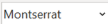 permite modificar el tipo de letra del texto

- ` `  permite modificar el tamaño de la letra del texto

- ` ` permite poner en negrita el texto

- ` ` permite poner en cursiva el texto

- ` ` permite subrayar el texto

- ` ` permite alinear a la izquierda el texto

- `  ` permite centrar el texto

- ` ` permite alinear a la derecha el texto

- ` ` permite justificar el texto

-  permite crear una lista numerada en el área de texto

-  permita permite añadir viñetas en el área de texto

- permite disminuir la sangría en el área de texto

-  permite aumentar la sangría en el área de texto

&emsp;

Para la sección “Cuerpo” la barra de herramientas mostrará además la opción:

- ` ` permite cambiar el color de fondo del texto

Para las secciones “Encabezado” y “Pie de página” la barra de herramientas mostrará además la opción:

-  Insertar imágenes 
|
|RN02|**RNA227**|1|Plantillas – Estructura de campos|
Para los campos se validará la estructura de la siguiente forma:

El sistema valida el campo “Nombre de la plantilla” el cual se compone de la siguiente forma:

- Se compone de solo caracteres alfanuméricos con un máximo de 100 caracteres.

El sistema valida el campo “Comentarios” el cual se compone de la siguiente forma:

- Se compone de texto con un máximo de 100 caracteres.
|
|RN02|**RNA228**|1|Plantilla - RCP |
El sistema debe permitir en la plantilla RCP modificar el texto precargado del formato, así como mover las variables.

Características del formato precargado:

Tipo de letra

- Montserrat, tamaño 10

En negritas (el contenido de los siguientes campos)

- PORCENTAJE DE AVANCE PLAN DE TRABAJO

- %Planeado

- %Real

- REPOSITORIO CENTRAL DE PROYECTOS RCP

Las variables se mostrarán en texto normal:

` `$ {Nombre\_corto},

$ {id\_proyecto\_sistema},

` `$ {Estatus\_RCP}, 

$ {Id\_proyecto\_AGP}, 

$ {Nombre\_completo\_del\_proyecto}, 

$ {Líder\_de\_proyecto}, 

$ {Área\_de\_planeación}, 

$ {%\_planeado}, 

$ {%\_real}, 

$ {Fecha\_de\_entrega},

` `$ {Entregables}, 

$ {Fase}, 

$ {Estatus}, 

$ {Fecha\_del\_documento},

` `$ {Responsable}, 

$ {Justificación} 

$ {#Páginas} 

Las mismas pueden moverse físicamente de lugar, sin embargo, al momento de imprimirlas su valor se mostrará donde haya sido ubicado.
|
|RN02|**RNA229**|1|Plantilla - Proforma Factura|
El sistema debe permitir en la plantilla Proforma Factura modificar el texto precargado del formato, así como mover las variables. 

 

Características del formato precargado: 

 

Tipo de letra 

 

Montserrat, tamaño 10 

 

En negritas (el contenido de los siguientes campos) 

- Factura Proforma

- Contrato

- id

- CANTIDAD

- DESCRIPCIÓN

- UNIDAD DE MEDIDA

- PRECIO UNITARIO

- TOTAL

- SUBTOTAL

- IVA

- IMPORTE FACTURA

` `Variables del formato: 

$ {Id dictamen}

$ {Fideicomiso}

$ {Nombre\_proveedor}

$ {Domicilio\_proveedor}

$ {Email\_proveedor}

` `$ {Teléfono\_proveedor} 

$ {RFC\_proveedor}

` `$ {Fecha\_elaboración}

$ {Periodo\_de\_inicio} 

$ {Periodo\_fin}

$ {Núm\_contrato}

$ {Vigencia\_de\_contrato}

${Acuerdo\_pago\_de\_contrato}

$ {Id\_del\_proyecto},

` `$ {Id\_5\_dígitos\_dictamen},

` `$ {Cantidad\_total\_servicio}, 

$ {Servicio}, 

$ {Unidad\_de\_medida},

` `$ {Precio\_unitario}, 

$ {Total}, 

$ {Subtotal}, 

$ {IVA}, 

$ {Importe\_factura},

` `$ {Verificador} 

` `$ {Cargo}

 

Las variables pueden moverse físicamente de lugar, sin embargo, al momento de imprimirlas su valor se mostrará donde haya sido ubicado.  
|
|RN02|**RNA230**|1|Plantillas – Descargar layout de ayuda|
El sistema obtiene las variables definidas en el documento: Anexo variables.xlsx

Tendrá en cuenta el tipo de plantilla para generar y descargar la información correspondiente:

- Para el caso de la plantilla ¨Formato\_Sol\_Pago¨, el archivo de ayuda contendrá la información definida en la pestaña ¨ Formato\_Sol\_Pago ¨ del archivo Anexo variables.xlsx y renombrará el archivo de descarga como ¨Formato\_Sol\_Pago\_variables¨.

- Para el caso de la plantilla ¨ Proforma Factura¨, el archivo de ayuda contendrá la información definida en la pestaña ¨Proforma Factura¨ del archivo Anexo variables.xlsx y renombrará el archivo de descarga como ¨Proforma\_Factura\_variables¨.

- Para el caso de la plantilla ¨Proforma Nota de Crédito¨, el archivo de ayuda contendrá la información definida en la pestaña ¨Proforma Nota de Crédito¨ del archivo Anexo variables.xlsx y renombrará el archivo de descarga como ¨Proforma\_Nota\_de\_Crédito\_variables¨.

- Para el caso de la plantilla ¨ Proforma Penalización¨, el archivo de ayuda contendrá la información definida en la pestaña ¨ Proforma Penalización¨ del archivo Anexo variables.xlsx y renombrará el archivo de descarga como ¨Proforma\_Penalización\_variables¨.

- Para el caso de la plantilla ¨RCP¨, el archivo de ayuda contendrá la información definida en la pestaña ¨RCP¨ del archivo Anexo variables.xlsx y renombrará el archivo de descarga como ¨RCP\_variables¨.
|
|
RN06

RN10

|**RNA231**|1|Validación al cargar la proyección de consumo de servicios.|
Al seleccionar el archivo de la proyección de consumo de servicios se deberá validar lo siguiente:

- Para registros de Tipo consumo volumetría del Contrato la sumatoria de todos los meses deberá ser igual a la cantidad de servicios máxima de cada línea.

- Para registros de Tipo consumo volumetría del Convenio Modificatorio la sumatoria de todos los meses deberá ser menor o igual al “Número total de servicios” de cada línea.

Ejemplo: 

**Registro de servicios**
|

|**Conceptos de servicio**|**Tipo de consumo**|**Cantidad de servicios máxima**|
| - | - | - |
|Concepto 1|Volumetría|5|

|||||

**Proyección** 
|
| :- | :-: | :-: | :- | - |

|
**Conceptos de servicio**

|**Mes 1** |**Mes 2**|**Mes 3**|
| - | - | - | - |
|Concepto 1|2|2|1|

|||||

Cantidad de servicios máxima = suma de meses de Proyección. 
|
| :- | :-: | :-: | :- | - |
|RN06|**RNA232**|1|Campos de la tabla “Participantes en la administración del contrato”|
Los siguientes campos se exportarán en el proceso de “Exportar a Excel”:

- Id

- Nombre del servidor público

- Responsabilidad

- Teléfono

- Correo

- Fecha de inicio

- Fecha de término 

- Vigente
|
|RN06|**RNA233**|1|Campos de la tabla “Convenios modificatorios”|
Los siguientes campos se exportarán en el proceso de “Exportar a Excel”:

- Número de convenio

- Tipo

- Fecha de firma

- Fecha fin

- Monto máximo
|
|RN06|**RNA234**|1|Campos de la tabla “Facturas asociadas”|
Los siguientes campos se exportarán en el proceso de “Exportar a Excel”:

- Id dictamen

- Comprobante fiscal 

- Convenio de colaboración

- Monto

- Monto en pesos

- Estatus 

- Tipo de cambio. Si el dictamen asociado no está pagado mostrará el tipo de cambio referencial de la sección "Datos generales”, si el dictamen ya se pagó mostrará el tipo de cambio real de la sección “Notificación de pago”.

&emsp;

&emsp;Se deberán considerar 2 filas para una misma factura, si el contrato tiene Convenio de colaboración.

&emsp;Si el dictamen no está en estatus “Pagado”, los montos deberán tomarse de la sección “Desglose de montos” de la factura, en caso contrario, se tomarán de “Notificación de pago”, según si es SAT o Convenio de colaboración.

&emsp;

&emsp;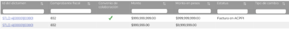
|
|RN06|**RNA235**|1|Campos de la tabla “Dictámenes asociados”|
Los siguientes campos se exportarán en el proceso de “Exportar a Excel”:

- Id dictamen

- Periodo control

- Periodo inicio

- Periodo fin

- Estatus

- Monto

- Monto en pesos

- Tipo de cambio referencial. Si el dictamen asociado no está pagado mostrará el tipo de cambio referencial, si el dictamen ya se pagó mostrará el tipo de cambio real.
|
|RN06|**RNA236**|1|Campos de la tabla “Reintegros asociados”|
Los siguientes campos se exportarán en el proceso de “Exportar a Excel”:

- No.

- Tipo

- Importe

- Interés

- Total

- Fecha de reintegro
|
|RN06|**RNA237**|1|Campos sección identificación del contrato.|
No se podrán duplicar los siguientes campos:

- Nombre corto

- Nombre del contrato
|
|RN06|**RNA238**|1|Reintegros-Visualización de los contratos|
El sistema tendrá en cuenta el permiso ¨Ver todos los contratos¨ otorgado al Empleado SAT para mostrar los nombres cortos de los contratos correspondientes en el campo “Contratos\*”:

- Si tiene permiso para ver todos los contratos solo se tendrá en cuenta la aplicación de la **(RNA176)**. 

- En caso contrario de los datos obtenidos con la aplicación de la **(RNA176)**, se deberá considerar filtrar solo aquellos contratos cuyos proyectos tenga asignado el Empleado SAT en el módulo ¨Asignar Proyectos¨.
|
|
RN02

RN03

RN05

RN06

RN07

RN08

RN10

RN11

RN14

|**RNA239**|1|Campos para guardar en las Pistas de auditoría|
Las pistas de auditoría, en el dato de “Movimiento” deberá guardar todos los campos que contenga la tabla en forma de una cadena, separado por el símbolo | (pipe), esto aplica para insertar, modificar, eliminar e imprimir, solo para consulta no aplica.

En las tablas se almacenará un registro de pista de auditoria por cada fila de la tabla, es decir, una cadena por cada fila.  

\* Si el movimiento excede la longitud máxima del campo, se deberán considerar varios movimientos para almacenar la cadena.
|
|
RN03

RN05

|**RNA240**|1|Filtro de búsqueda - Proyectos|
En la pantalla de “Búsqueda” de “Proyectos” se deben mostrar los criterios de búsqueda de acuerdo con lo siguiente:

- Estatus\*: Campo obligatorio, se muestra el listado de opciones de acuerdo con el catálogo de estatus del proyecto.

- Nombre corto del proyecto: Muestra el nombre corto de los proyectos que tenga asignados el Empleado SAT.

- Id proyecto: Permite capturar el identificador único asignado al proyecto. 

- Área solicitante: Muestra la información del catálogo de las Administraciones Centrales.

- Área responsable: Muestra la información del catálogo de las Áreas que correspondan con la opción seleccionada en “Área solicitante”.

- Líder de proyecto: Permite capturar el nombre del líder del proyecto.
|
|
RN03

RN06
|**RNA241**|1|Exportar información de solo consulta|
Cuando se seleccione la opción de “Ver detalle” en alguno de los módulos del sistema y el Empleado SAT cuente con el rol que tenga permisos de consulta, se mostrará inhabilitada la información que se consulta y únicamente se permitirá seleccionar la opción para exportar un archivo Excel con extensión (.xlsx).

Si el Empleado SAT selecciona la opción para Exportar, el sistema debe generar el archivo con la información correspondiente a la tabla donde fue seleccionado.
|
|
RN02

RN03

RN05

RN06

RN07

RN10
|**RNA242**|1|Ícono en gestión documental|En las secciones de gestión documental de los módulos “Proyecto”, “Contrato”, “Dictamen” o “Convenio modificatorio”, al seleccionar un documento con la opción “Cargar” el ícono deberá cambiar del color gris que tiene al verde oscuro (#10312B).|
|RN06|**RNA243**|1|Módulo Contratos- Ingreso|
Al ingresar al módulo de “Contratos” se mostrarán todos los contratos vigentes, es decir, cuya fecha de término o fecha de término de convenio modificatorio sea mayor o igual la fecha actual.

Solo se mostrarán los contratos cuyos proyectos tenga asociados el Empleado SAT.
|
|
RN06

RN10

RN08
|**RNA244**|1|Todos los módulos|Al realizar la consulta en BD, en caso de que no existan registros almacenados, se deberá concatenar toda la fila y mostrará la leyenda “No se encontraron registros” en caso de que no se pueda concatenar se mostrará en el campo de texto disponible la misma leyenda.|
|RN06|**RNA245**|1|Campo “Monto en pesos” en el contrato|Monto en pesos” si existe dato en “Monto máximo último CM” se mostrará el “Monto en pesos” del último convenio modificatorio en caso contrario será el “Monto máximo en pesos” del contrato.|
|
RN06

RN10

RN07

RN08

|**RNA246**|1|Todos los módulos |
Si el rol no cuenta con el permiso de captura, no se mostrarán los botones “Guardar” y “Cancelar”.

En caso de que se cuente con la opción “Editar”, si el rol que ingresó no cuenta con permisos de “Modificar”, no se mostrará el ícono.

En caso de que se cuente con la opción “Eliminar”, si el rol que ingresó no cuenta con permisos de “Borrar”, no se mostrará el ícono.
|
|
RN06

RN07

RN08

RN10
|**RNA247**|1|Última modificación|Al momento de “Guardar” información de alguna sección, se deberá actualizar el campo “Última modificación” con el nombre del Empleado SAT, fecha y hora de la modificación.|
||**RNA248**|1|Fecha inicio -Líder de proyecto|
El sistema debe validar la fecha inicio del nuevo líder, considerando lo siguiente:

- Si se trata de un primer líder, se debe validar que la fecha inicio corresponda con un día hábil.

- En caso de que ya exista algún registro del Líder de proyecto, se debe validar que la “fecha inicio” del nuevo líder de proyecto sea al siguiente día hábil de la “fecha fin” del último líder
|
|
RN06

RN10

|**RNA249**|1|Validación de relaciones al eliminar en Contrato y Convenio Modificatorio|
- En el caso de que haya sido invocado en la sección de “Registro de servicios” o “Proveedor(es)” debe validar que el registro no esté relacionado en “Consumo de servicio-Estimados y/o Dictaminado”.

 

- Si viene de las secciones:

&emsp; 

- Atraso en el inicio de la prestación

- Informes documentales por única vez

- Informes documentales periódicos

- Informes documentales de los servicios

- Penas contractuales

- Niveles de servicio (SLA)

&emsp; 

debe validar que el registro no esté relacionado en “Consumo de servicio-Dictaminado”.

- Si viene de la sección “Grupo de servicios” valida que no tenga un “Registro de servicios” asociado.

- Si viene de la sección “Asociación de plantilla documental” valida que no tenga documentos cargados en la sección “Gestión documental”.
|
|
RN06

RN07

RN08
|**RNA250**|1|Secciones con tablas|
Al insertar nuevos registros, se deberán renumerar de manera automática según su posición en la tabla. 

En caso de eliminarse se deberán renumerar de manera automática.
|
|RN03|**RNA251**|1|Asociar fases – Seleccionar fases|
El sistema mostrará en el catálogo “Fase” las opciones de la siguiente forma:

Las siguientes opciones para seleccionar múltiples veces:

- Planeación 

- Preparación y aprobación

- Ejecución

- Proceso de cierre

Esta opción solo se podrá seleccionar una vez:

- Cerrado
|
|
RN05

|**RNA252**|1|Proveedores – Campos duplicados|El campo “Nombre del proveedor”, “RFC” y “Id AGS” (en caso de estar capturados) no deben de estar registrados previamente en el catálogo de proveedores.|
|
RN10

|**RNA253**|1|Referencia a último convenio modificatorio en el registro de CM.|
La referencia de último convenio modificatorio (CM) para los cálculos del presente CM será el registro anteriormente guardado a éste.

Ejemplo:

Convenio modificatorio 1 – Guardado 

Convenio modificatorio 2 – Guardado

Convenio modificatorio 3 – Guardado - Último CM para efectos de cálculos

Convenio modificatorio 4 – En proceso
|
|RN07|**RNA254**|1|Campos de la tabla “Resumen consolidado"|
Los siguientes campos se exportarán en el proceso de “Exportar a Excel”:

Fase (Dictaminado y Facturado)

Subtotal

Deducciones

IEPS

IVA

Otros impuestos

Total

Total en pesos
|
|
RN02

RN07

RN08
|**RNA255**|1|Validación de estructura de datos|
El sistema deberá validar que los datos ingresados cumplan con el “Tipo”, “Longitud” y “Precisión” definidos en el estilo correspondiente del documento EIU.  

Ejemplo:

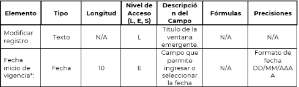

**Nota:** 

- En caso de que “Tipo” sea alfanumérico permitirá espacios, letras, letras acentuadas, números, diagonales, paréntesis, arroba, punto, coma y guiones. 

- En caso de que sea de tipo texto, permitirá los siguientes caracteres referenciados en el código ASCII

- Caracteres ASCII de control

- 13 (Salto de línea)

- 09 (Tabulador horizontal)

- Caracteres ASCII imprimibles

- Del 32 al 125

- Todas las vocales con diéresis

- ASCII extendido

- 129 (“u” minúscula con diéresis)

- 130 (“e” minúscula con acento agudo)

- 144 (“E” mayúscula con acento agudo)

- 153 (“O” mayúscula con diéresis)

- 154 (“U” mayúscula con diéresis)

- 158 (signo de multiplicación)

- Del 160 al 168

- 173 (abre signo de exclamación)

- 181 (“A” mayúscula con acento agudo)

- 211 (“E” mayúscula con diéresis)

- 214 (“I” mayúscula con acento agudo)

- 216 (“I” mayúscula con diéresis)

- 224 (“O” mayúscula con acento agudo)

- 233 (“U” mayúscula con acento agudo)

- 241 (signo mas menos)

- 246 (signo de división)

- 248 (signo de grado)
|
|RN07|**RNA256**|1|Botón inicial dictamen|
El botón Inicial del dictamen se habilitará cuando se guarde la información de "Datos generales" para el Rol Administrador del sistema.

- En caso de que el dictamen se encuentre en estatus “Cancelado" el botón seguirá visible solo para el Administrador del sistema.
|
|
RN07

RN08

|
**RNA257**

|1|Dictamen- visualizar archivo cargado|
El sistema mostrará la opción "Ver" para descargar un archivo cargado en el campo teniendo en cuenta lo siguiente: 

- Si se realiza un nuevo registro la opción "Ver" no debe ser visible.

- En caso de existir un archivo, el sistema mostrará un enlace (Ver) para descargar el documento.
|
|RN06|**RNA258**|1|Reintegros-gestión documental|
Para nuevos reintegros el sistema debe asignar una plantilla de tipo reintegros en la sección ¨Gestión documental¨ para el contrato seleccionado y nombrará la carpeta padre de la siguiente forma: 

“Reintegro espacio {fecha del reintegro}”.

Ejemplo: Reintegro 15/06/2024.

La estructura documental deberá visualizarse de la siguiente forma, de acuerdo con el número de reintegros que se tengan para el contrato:

>Reintegro 07/06/2024

`        `Archivo 1

`        `Archivo 2

>Reintegro 15/05/2024

`        `Archivo 1

`        `Archivo 2

- En caso de eliminarse un registro, se deberá eliminar la plantilla correspondiente al mismo.

- En caso de modificarse la fecha del reintegro, se deberá actualizar el nombre de la carpeta con la fecha ingresada.
|
|` `RN07|**RNA259**|1|Dictamen- Campos que se exportarán|
Los siguientes campos se exportarán en el proceso de “Exportar a Excel”: 

(Fase) Dictaminado y Facturado

- Subtotal

- Deducciones

- IEPS

- IVA

- Otros impuestos

- Total

- Total en pesos

Registro de servicios dictaminados

- Id del dictamen

- Seleccionado (sí, no) 

- Id 

- Conceptos de servicio 

- Unidad de medida

- Tipo de consumo

- Precio unitario

- Cantidad de servicios máxima vigente

- Monto máximo vigente

- Cantidad de servicios SAT\*. 

- Cantidad de servicios CC. 

- Cantidad total de servicios

- Monto dictaminado

- Cantidad de servicios dictaminados acumulados

- Monto dictaminado acumulado

- % de servicios dictaminados acumulados  

- % de monto dictaminado acumulado

 

Penas contractuales y convencionales. Aplica la **(RNA244)**

- Id de dictamen

- Id

- Tipo 

- Documentos 

- Pena aplicable

- Desglose

- Monto

Deducciones. Aplica la **(RNA244)**

- Id de dictamen 

- Id

- Tipo

- Documentos/Descripción

- Deducción aplicable

- Desglose

- Conceptos de servicio

- Monto
|
|
RN07

RN08

|**RNA260**|1|Solicitud de factura-Opciones y campos que se muestran en pantalla|
1. El sistema verifica que el campo “Cargar oficio\*” de la sección “Solicitud de factura” contenga un archivo cargado y habilitará el campo “Fecha de recepción factura\*” y la opción “Recepción de factura”.

2. Si el Empleado SAT selecciona la opción “Recepción de factura”, se ocultará esta opción y se mostrará en pantalla el check “Facturas recibidas”.
|
|RN08|**RNA261**|1|Monto en pesos|
En caso de que la “moneda” en la factura sea diferente a “MXN” debe de ser calculado el campo “Total en pesos” con la formula: Total x Tipo de cambio referencial (registrado en la sección “Datos Generales” de este Dictamen) y redondeado a dos decimales.  

En caso de ser moneda “MXN” se coloca el mismo importe del total. 
|
|RN07|
**RNA262**

|1|Dictamen -Soporte documental|
Para nuevos dictámenes el sistema debe asignar una plantilla de tipo “Verificación” en la sección ¨Gestión documental¨ para el dictamen seleccionado y nombrará la carpeta padre de la siguiente forma: 

IdDictamen.

Ejemplo: STLD 4|00001|00001.

>IdDictamen

Documentos relacionados 
|

|**FIRMAS DE CONFORMIDAD**||
| :-: | :- |
|**Firma 1**|**Firma 2**|
|**Nombre**: Diana Yazmín Pérez Sabido.|**Nombre**: Rodolfo López Meneses.|
|**Puesto**: Usuaria ACPPI.|**Puesto**: Usuario ACPPI.|
|**Fecha:**|**Fecha:**|
|

||
|**Firma 3**|**Firma 4**|
|**Nombre**: Rubén Delgado Ramírez.|**Nombre**: María del Carmen Castillejos Cárdenas.|
|**Puesto**: Usuario ACPPI.|**Puesto**: APE ACPPI.|
|**Fecha:**|**Fecha:**|
|

||
|**Firma 5**|**Firma 6**|
|**Nombre:** Alejandro Alfredo Muñoz Núñez.|**Nombre**: Erick Villa Beltrán.|
|**Puesto:** RAPE ACPPI.|**Puesto**: Líder APE SDMA 6.|
|**Fecha**:|**Fecha**:|
|

|

|
|**Firma 7**|**Firma 8**|
|**Nombre:** Juan Carlos Ayuso Bautista.|**Nombre:** Aylín de la Concepción Caballero Weng.|
|**Puesto:** Líder Técnico SDMA 6.|**Puesto:** Analista de Sistemas DS SDMA 6. |
|**Fecha**:|**Fecha**:|
|

||

|||Página 1 de 6|
| :- | :-: | -: |

[ref1]: Aspose.Words.0edfa155-bf12-4f65-8825-b906af6ca573.003.png
[ref2]: Aspose.Words.0edfa155-bf12-4f65-8825-b906af6ca573.004.png
[ref3]: Aspose.Words.0edfa155-bf12-4f65-8825-b906af6ca573.009.png
[ref4]: Aspose.Words.0edfa155-bf12-4f65-8825-b906af6ca573.010.png
[ref5]: Aspose.Words.0edfa155-bf12-4f65-8825-b906af6ca573.013.png
[ref6]: Aspose.Words.0edfa155-bf12-4f65-8825-b906af6ca573.015.png
[ref7]: Aspose.Words.0edfa155-bf12-4f65-8825-b906af6ca573.021.png
[ref8]: Aspose.Words.0edfa155-bf12-4f65-8825-b906af6ca573.022.png
[ref9]: Aspose.Words.0edfa155-bf12-4f65-8825-b906af6ca573.023.png
[ref10]: Aspose.Words.0edfa155-bf12-4f65-8825-b906af6ca573.025.png
[ref11]: Aspose.Words.0edfa155-bf12-4f65-8825-b906af6ca573.043.png
[ref12]: Aspose.Words.0edfa155-bf12-4f65-8825-b906af6ca573.044.png
[ref13]: Aspose.Words.0edfa155-bf12-4f65-8825-b906af6ca573.045.png
[ref14]: Aspose.Words.0edfa155-bf12-4f65-8825-b906af6ca573.046.png
[ref15]: Aspose.Words.0edfa155-bf12-4f65-8825-b906af6ca573.047.png
[ref16]: Aspose.Words.0edfa155-bf12-4f65-8825-b906af6ca573.051.png
[ref17]: Aspose.Words.0edfa155-bf12-4f65-8825-b906af6ca573.053.png
[ref18]: Aspose.Words.0edfa155-bf12-4f65-8825-b906af6ca573.054.png
[ref19]: Aspose.Words.0edfa155-bf12-4f65-8825-b906af6ca573.055.png
[ref20]: Aspose.Words.0edfa155-bf12-4f65-8825-b906af6ca573.056.png
[ref21]: Aspose.Words.0edfa155-bf12-4f65-8825-b906af6ca573.057.png
[ref22]: Aspose.Words.0edfa155-bf12-4f65-8825-b906af6ca573.058.png
