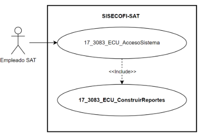
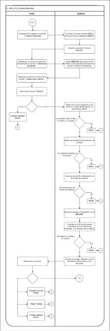

||Administración General de Comunicaciones y Tecnologías de la Información|
| :- | -: |
||Marco Documental 7.0|
|
Fecha de aprobación del Template:

02/08/2023
|
**Especificación del Caso de Uso**

17\_3083\_ECU\_ConstruirReportes.docx
|Versión del template: 7.00|
| :-: | :-: | :-: |

**<ID Requerimiento>** 8309

**Nombre del Requerimiento: **TI\_SISECOFI-SAT\_Seguimiento financiero y control documental de proyectos de contratación

**Tabla de Versiones y Modificaciones**

|Versión|Descripción del cambio|Responsable de la Versión|Fecha|
| :-: | :- | :-: | :-: |
|*1*|*Creación del documento*|Eric Hector Pérez Pérez|*11/07/2024*|
|*1.1*|*Revisión del documento*|Diana Yazmín Pérez Sabido|*22/07/2024*|
|*1.2*|*Versión aprobada para firma*|
María del Carmen Castillejos Cárdenas

Rubén Delgado Ramírez
|*22/07/2024*|

**Tabla de Contenido**

[17_3083_ECU_ConstruirReportes	2](#_toc172549425)

[1. Descripción	2](#_toc172549426)

[2. Diagrama del Caso de Uso	2](#_toc172549427)

[3. Actores	2](#_toc172549428)

[4. Precondiciones	2](#_toc172549429)

[5. Post condiciones	3](#_toc172549430)

[6. Flujo primario	3](#_toc172549431)

[7. Flujos alternos	11](#_toc172549432)

[8. Referencias cruzadas	14](#_toc172549433)

[9. Mensajes	14](#_toc172549434)

[10. Requerimientos No Funcionales	15](#_toc172549435)

[11. Diagrama de actividad	17](#_toc172549436)

[12. Diagrama de estados	17](#_toc172549437)

[13. Aprobación del cliente	18](#_toc172549438)

### ****17\_3083\_ECU\_ConstruirReportes

|<h3>**1. Descripción** </h3>|
| :- |
|

El objetivo de este Caso de Uso es permitir al Empleado SAT construir reportes del sistema.

|
|<h3>**2. Diagrama del Caso de Uso**</h3>|
|

|
|<h3>**3. Actores** </h3>|
||

|**Actor**|**Descripción**|
| :-: | :-: |
|**Empleado SAT**|El Empleado SAT es el que tiene el o los roles otorgados por la Administración Central de Seguridad, Monitoreo y Control (ACSMC) para ingresar a cada uno de los módulos de este sistema.|

|

|
| :- |
|<h3>**4. Precondiciones**</h3>|
|

- El Empleado SAT se ha autenticado en el sistema con e.firma válida.

- El sistema ha consumido el servicio “Oauth” para obtener los datos del Empleado SAT que ingresa.

- Se le han asignado los roles requeridos al Empleado SAT para ingresar, al módulo “Construir Reportes”.

- El sistema ha validado que el Empleado SAT cuenta con los roles para ingresar al módulo “Construir Reportes”.

- El Empleado SAT ha ingresado al módulo “Construir Reportes”.

&emsp;
|
|<h3>**5. Post condiciones** </h3>|
|

- El Empleado SAT construyó reportes.

&emsp;
|
|<h3>**6. Flujo primario**</h3>|
||

|**Actor**|**Sistema**|
| :-: | :-: |
|1. El Caso de Uso inicia cuando el Empleado SAT ingresa a la sección **“Construir Reportes”**.|
2. Consulta en la base de datos (BD) la información de los siguientes catálogos. Aplica la regla de negocio **(RNA01)**.

&emsp;Sección: “Reporte” (Criterios de búsqueda)

Proyecto 

- Estatus

Contrato

- Estatus

- Dominio tecnológico

- Convenio de colaboración

Proveedor

- Razón social

- Título de servicio

|
||
3. Muestra la pantalla “Construir Reportes” con los siguientes criterios:

Sección: “Criterios de búsqueda”

Proyecto 

- Estatus

- Nombre corto

Contrato

- Estatus

- Nombre corto

- Dominio tecnológico

- Convenio de colaboración. Aplica la **(RNA168)**

Proveedor

- Razón social

- Título de servicio

&emsp;

Periodo

- Inicio

- Término

- Aplicación del periodo. Aplica la **(RNA170)**

Presentación de la Información

- Acumulada

- Mensual

&emsp;

Sección: “Campos para reporte”

Proyecto:

Datos Generales

- Id

- Nombre corto

- Estatus

- Nombre del proyecto

- Id AGP

Ficha Técnica

- Administración patrocinadora

- Nombre de la admón. Patrocinadora

- Administrador patrocinador

- Administración central patrocinadora

- Nombre de la admón. central patrocinadora

- Administrador central patrocinador

- Administración participante

- Nombre de la admón. Participante

- Administrador participante

- Clasificación del proyecto

- Financiamiento

- Tipo de procedimiento

- Líder del proyecto

- Puesto

- Correo

- Fecha inicio

- Fecha fin

- Estatus

- Alineación del proyecto

- Mapa

- Periodo

- Objetivo

- Fecha de inicio del proyecto

- Fecha fin del proyecto

- Área de planeación

- Monto solicitado

- Tipo de moneda

- Objetivo general

- Alcance

Proveedor:

- Nombre del proveedor

- Nombre comercial

- Giro de la empresa

- Directorio de contacto

- RFC

- Representante legal

- Título de servicio

- Vigencia

- Fecha vencimiento

- Cumple dictamen

Contrato:

- Estatus del contrato

- Id

- Nombre del contrato

- Nombre del proyecto

- Número de contrato

- Proveedor

- Tipo de procedimiento

- Fecha inicio del contrato

- Fecha término del contrato

- Último CM

- Monto máximo

- Monto máximo de último CM

- Monto en pesos

- Administración central

- Administrador del contrato

Convenio Modificatorio

- Número de convenio

- Tipo de convenio

- Fecha de firma

- Fecha fin de servicio

- Fecha fin de contrato con CM

- Cálculo de días naturales

- Incremento

- Subtotal

- IEPS

- IVA

- Tipo de cambio

- Monto máximo del contrato con CM sin impuestos

- Monto máximo del contrato con CM con impuestos

- Monto en pesos

- Comentarios

Concepto de servicio:

- Id

- Grupo

- Tipo de consumo

- Conceptos de servicio

- Tipo de unidad

- Precio unitario

- Cantidad de servicios mínima

- Cantidad de servicios máxima

- Monto mínimo

- Monto máximo

- Aplica IEPS

- Cantidad de servicios máximos del último CM

- Monto máximo del último CM

&emsp;

Planeado

- Cantidad de servicios planeado

- Monto planeado

- % Servicios planeados acumulados

- % Monto planeado acumulado

Estimado

- Cantidad de servicios estimado

- Monto estimado

- % Servicios estimados acumulados

- % Monto estimado acumulado

&emsp;

Dictaminado

- Cantidad de servicios dictaminado

- Monto dictaminado

- % Servicios dictaminados acumulados

- % Monto dictaminado acumulado

Pagado

- Cantidad de servicios pagados

- Monto pagado

- % Servicios pagados acumulados

- % Monto pagado acumulado

Estimaciones:

- Id

- Nombre corto del contrato

- Número de contrato

- Proveedor

- Estatus

- Periodo de inicio

- Periodo fin

- Periodo de control

- IVA

- Tipo de cambio referencial

- Monto estimado total

- Monto estimado total en pesos

- Justificación

Dictamen:

- Id

- Nombre corto del contrato

- Número de contrato

- Proveedor

- Estatus

- Periodo de inicio

- Periodo fin

- Periodo de control

- IVA

- Tipo de cambio referencial

- Descripción

- Fase

- Subtotal

- Deducciones

- IEPS

- Otros impuestos

- Total

- Total en pesos

&emsp;

Penalizaciones / Deducciones:

- Tipo

- Tipo de informe

- Documento

- Descripción

- Desglose

- Concepto de servicio

- Monto

- Periodo inicio

- Periodo término

- Periodo control

Facturas:

- Folio

- Comprobante fiscal

- Fecha de facturación

- Estatus

- Moneda

- Tasa

- Subtotal

- IEPS

- IVA

- Otros impuestos

- Total facturado 

- Total facturado en pesos

- Total pagado en pesos

- ` `Comentarios

Desglose de Montos:

- % SAT

- Monto

- Monto en pesos

- % Convenio de colaboración

- Monto

- Monto en pesos

- Ficha NAFIN

- Fecha NAFIN

- Tipo de cambio NAFIN

Notas de Crédito:

- Folio

- Comprobante fiscal

- Fecha de generación

- Estatus

- Moneda

- Tasa

- Subtotal

- IEPS

- IVA

- Otros impuestos

- Total

- Total en pesos

- Comentarios

Desglose de Montos:

- % SAT

- Monto

- Monto en pesos

- % Convenio de colaboración

- Monto

- Monto en pesos

Tabla:

- Reporte. Aplica la **(RNA171)**

Opciones:

- Exportar a Excel ![ref1] Aplica la **(RNA171)**

- Buscar

- Limpiar Campos

Ver

**(17\_3083\_EIU\_ConstruirReportes)** Estilos 01.
|
|4. Ingresa por lo menos un campo de la sección **“Criterios de búsqueda”**.|5. Aplica **(RNA155)** de acuerdo con el campo(s) ingresado en la sección “Criterios de búsqueda”.|
|6. Ingresa por lo menos un campo de la sección **“Campos para reporte”**.||
|
7. Selecciona la opción **“Buscar”** y continúa en el flujo.

&emsp;

- Si selecciona la opción **“Limpiar Campos”**,** continúa en el flujo alterno **([**FA03**](#fa03))**.
|
8. Valida que se haya ingresado como mínimo un criterio de búsqueda y un campo para reporte.

&emsp;

- En caso contrario que no haya ingresado al menos un criterio de búsqueda y un campo para reporte continúa en el **([**FA01**](#fa01))**.
|
||
9. Valida que el periodo de las fechas sea correcto.

&emsp;

- En caso de no ser correcto el periodo de las fechas continúa en el **([**FA07**](#fa07))**.
|
||
10. Almacena en la BD la información de las Pistas de Auditoría.

&emsp; 

&emsp;Datos que se almacenan:

**Módulo**= Construir Reportes

**Fecha y Hora**= Fecha y hora del sistema, usando el formato DD/MM/AAAA HH:MM: SS

**RFC Usuario**= RFC largo del usuario que ingresó al sistema.

**Tipo de movimiento**= **CNST** (Consulta).

**Movimiento**= 

- Criterios de búsqueda

- Campos para reporte

&emsp;

- En caso de que no se pueda almacenar las Pistas de Auditoría, continúa en el **([**FA02**](#fa02))**.
|
||
11. Muestra la pantalla “Procesando” con el mensaje **([**MSG006**](#msg006))**. 

Ver

**(17\_3083\_EIU\_ConstruirReportes)** Estilos 02.
|
||
12. Consulta en la BD la información coincidente con los criterios de búsqueda y los campos para el reporte.

&emsp;

- En caso de ingresar al menos un criterio de búsqueda y un campo para el reporte, consulta en la BD de acuerdo con los elementos ingresados y el flujo continúa.

- En caso de que no se obtenga información de la consulta, continúa en el **([**FA04**](#fa04))**.
|
||
13. Muestra en la tabla “Reporte”, las columnas con base a los campos seleccionados en la sección “Campos para reporte” y la información con base a los campos seleccionados en la sección “Criterios de búsqueda”.

Muestra lo siguiente:

Opciones:

- Exportar a Excel ![ref1]

|
|
14. Selecciona una opción:

&emsp;

- En caso de seleccionar **“Exportar a Excel”**,** continúa en el flujo alterno **([**FA05**](#fa05))**.

- En caso de seleccionar **“Filtrar”** la información en alguna columna de la tabla, continúa en el **([**FA06**](#fa06))**.

- En caso de seleccionar **“Limpiar Campos”**,** continúa en el flujo alterno **([**FA03**](#fa03))**.
||
||15. Fin del Caso de Uso.|

|

|
| :- |
||
|<h3>**7. Flujos alternos** </h3>|

|

**FA01 No se ingresó por lo menos un criterio de búsqueda y campo para reporte**
|
| :- |

|**Actor**|**Sistema**|
| :-: | :-: |
||1. El **FA01** inicia cuando el sistema identifica que no se ingresó al menos un criterio de búsqueda y un campo para reporte.|
||2. Muestra el mensaje **([**MSG001**](#msg001))**, con la opción “Aceptar”.|
|3. Selecciona la opción **“Aceptar”**.|4. Cierra el mensaje.|
||5. Regresa al paso [**4**](#_ref171346577) del Flujo primario. |

|

**FA02 No se pueden almacenar las Pistas de Auditoría**
|
| :- |

|**Actor**|**Sistema**|
| :-: | :-: |
||1. El **FA02** inicia cuando interviene un evento ajeno y no se puedan almacenar las Pistas de Auditoría. |
||2. Cancela la operación sin completar el movimiento que estaba en proceso.|
||
3. Muestra el mensaje de acuerdo con lo siguiente:

- Si la pista de auditoría es por el tipo de movimiento **CNST**, se muestra el **([**MSG002**](#msg002))**.

- En caso de que la pista de auditoría es por el tipo de movimiento **PRNT**, se muestra el **([**MSG003**](#msg003))**.

&emsp;

&emsp;Cada mensaje se muestra con la opción “Aceptar”.
|
|4. Selecciona la opción **“Aceptar”**.|5. Cierra el mensaje.|
||6. Regresa al paso previo que detona la acción de la pista de auditoría.|

|

**FA03 Selecciona la opción “Limpiar campos”**
|
| :- |

|**Actor**|**Sistema**|
| :-: | :-: |
|1. El **FA03** inicia cuando el Empleado SAT selecciona la opción **“Limpiar campos”**|2. Borra la información ingresada en los criterios de búsqueda y campos para reporte dejándolos en el estado inicial de selección. |
||
3. Oculta lo siguiente:

Opciones:

- Exportar a Excel ![ref1]

Tabla “Reporte”

|
||4. Regresa al paso [**4**](#_ref171346577) del Flujo primario.|

|

**FA04 No existen resultados que coincidan en la búsqueda**
|
| :- |

|**Actor**|**Sistema**|
| :-: | :-: |
||1. El **FA04** inicia cuando el sistema identifica que no existen coincidencias con los criterios de búsqueda.|
||2. Muestra el **([**MSG004**](#msg004))** con la opción “Aceptar”. |
|3. Selecciona la opción **“Aceptar”**.|
Cierra el mensaje y oculta lo siguiente:

Opciones:

- Exportar a Excel ![ref1]

Tabla “Reporte”

|
||4. Regresa al paso [**4**](#_ref171346577) del Flujo primario.|

|

**FA05 Selecciona la opción “Exportar a Excel”**
|
| :- |

|**Actor**|**Sistema**|
| :-: | :-: |
|1. El **FA05** inicia cuando el Empleado SAT selecciona la opción **“Exportar a Excel”**.|
2. Almacena en la BD la información de las Pistas de Auditoría.

&emsp; 

&emsp;Datos que se almacenan:

**Módulo**= Construir Reportes

**Fecha y Hora**= Fecha y hora del sistema, usando el formato DD/MM/AAAA HH:MM:SS

**RFC Usuario**= RFC largo del Empleado SAT que ingresó al sistema.

**Tipo de movimiento**= 

**PRNT** (Imprimir)

**Movimiento**= Aplica la **(RNA239)**

- Criterios de búsqueda 

&emsp;

- En caso de que no se puedan almacenar las Pista de Auditoría, continúa en el **([**FA02**](#fa02))**.
|
||
3. Obtiene la siguiente información:

&emsp;- Reporte
|
||4. Genera un archivo de Excel con extensión (.xlsx) que contenga la información obtenida.|
||5. Descarga el archivo de Excel con extensión (.xlsx).|
||6. Fin del Caso de Uso.|

|

**FA06 Selecciona la opción “Filtrar”**
|
| :- |

|**Actor**|**Sistema**|
| :-: | :-: |
|1. El **FA06** inicia cuando el Empleado SAT requiere **“Filtrar”** la información en alguna columna de acuerdo con lo que se muestra en la tabla.||
|2. Elige la columna para filtrar e ingresa el dato a buscar.|3. Busca dentro de la columna y filtra la información mostrada de acuerdo con los caracteres ingresados en el campo.|
||4. Muestra en tiempo real todas las coincidencias que obtiene de dicha columna.|
||5. Continúa en el paso [**14**](#_ref171346777) del Flujo primario.|

|

**FA07 Fechas incorrectas**
|
| :- |

|**Actor**|**Sistema**|
| :-: | :-: |
||1. El **FA07** inicia cuando el sistema identifica que el valor del campo “Fecha inicio” es mayor a la “Fecha fin” o “Fecha fin es menor a la “Fecha inicio”. |
||2. Muestra el **([**MSG005**](#msg005))** con la opción “Aceptar” y marca el campo de la fecha incorrecta en color rojo.|
|3. Selecciona la opción **“Aceptar”**.|4. Cierra el mensaje.|
||5. Continúa en el paso [**4**](#_ref171346577) del Flujo primario.|

|

|
| :- |
|<h3>**8. Referencias cruzadas** </h3>|
|

- 17\_3083\_CRN\_SeguimientoFinancieroYControl

- 17\_3083\_EIU\_ConstruirReportes

&emsp;
|
|<h3>**9. Mensajes** </h3>|
||

|**ID Mensaje**|**Descripción**|
| :-: | :-: |
|**MSG001**|Favor de ingresar como mínimo un criterio de búsqueda y un campo para reporte.|
|**MSG002**|Ocurrió un error al consultar la información, favor de intentar nuevamente (PA01).|
|**MSG003**|Ocurrió un error al exportar la información, favor de intentar nuevamente (PA01).|
|**MSG004**|No se encontraron resultados de la búsqueda.|
|**MSG005**|La fecha ingresada es incorrecta.|
|**MSG006**|Procesando...|

|

|
| - |
|<h3>**10. Requerimientos No Funcionales** </h3>|

||
| :- |

|**ID de RNF**|**Requerimiento No Funcional**|**Descripción**|
| :-: | :-: | :-: |
|**RNF001**|Disponibilidad|El sistema deberá estar activo las 24 horas del día, los 365 días del año con picos de operación en el horario de 9:00 a 18:00 horas. |
|**RNF002**|Concurrencia|
El número de Empleados SAT que puede tener el sistema son 150. 

El número máximo de accesos concurrentes que debe soportar este sistema son máximo 30 Empleados SAT. 
|
|**RNF003**|Seguridad|El acceso solo podrá ser otorgado al Empleado SAT que tenga los roles asignados por la Administración Central de Seguridad, Monitoreo y Control (ACSMC) para cada módulo de este sistema. |
|**RNF004**|Usabilidad|
El sistema deberá manejar los siguientes elementos para facilitar la navegación: 

- Mensajes tipo flotantes (*tooltips*) con información de la herramienta que ofrece ayuda contextual como guía para el Empleado SAT. 

- Componente de ordenamiento que permita acomodar la información de la tabla de forma ascendente o descendente, considerando la columna donde es seleccionado. 

- Contar con un diseño responsivo que permita su óptima visualización en distintos tipos de dispositivos finales. 

&emsp;
|
|**RNF005**|Eficiencia|Las consultas se dividen en generales y detalladas, para que las detalladas carguen la información solo cuando sean requeridas por el Empleado SAT. |
|**RNF006**|Usabilidad|
El Empleado SAT podrá navegar a través de las páginas resultantes de la consulta considerando que el sistema debe mostrar inicialmente 15 registros por página, permitiendo al Empleado SAT seleccionar los registros que requiere visualizar, teniendo las opciones 15, 50 y 100: 

 

- Ir a la primera página (debe mostrar la primera página con el resultado de la consulta). 

- Ir a la última página (debe mostrar la última página con el resultado de la consulta). 

- Ir a la siguiente página (debe mostrar la siguiente página considerando la actual, con el resultado de la consulta y el número de registros seleccionados por el Empleado SAT). 

- Ir a la página anterior (debe mostrar la página anterior considerando la actual, con el resultado de la consulta). 

 

En la tabla deben mostrarse los registros ordenados alfabéticamente.
|
|**RNF007**|Seguridad|Las Pistas de Auditoría deben estar protegidas contra accesos no autorizados. Solo los Empleados SAT autorizados pueden consultarlas, y la información en ellas se definirá durante la etapa de diseño, la cual debe estar cifrada para mantenerla confidencial y evitar exposiciones no autorizadas. |
|**RNF008**|Usabilidad|
Usabilidad, El Empleado SAT podrá navegar a través de las páginas resultantes del documento PDF: 

- Ir a la siguiente página (debe mostrar la página consecutiva del documento PDF). 

- Ir a la página anterior (debe mostrar la página previa del documento PDF).
|
|**RNF009**|Fiabilidad|El sistema debe ser capaz de manejar excepciones de manera efectiva y presentar mensajes claros y comprensibles para garantizar una adecuada interacción con el sistema.|
|**RNF010**|Seguridad |Mantener la información en pantalla en caso de un error al guardar las pistas de auditoría, siempre y cuando el escenario lo permita. Hay situaciones de infraestructura o de conexión de internet que sí pierden los datos ya que no están controlados por el sistema. |
|**RNF011**|Integridad |Al almacenar la información en la BD de tipo Texto o alfanumérico se deben eliminar los espacios en blanco al inicio y fin de la cadena. |

|

|
| :- |
|<h3>**11. Diagrama de actividad** </h3>|
|

|
|<h3>**12. Diagrama de estados** </h3>|
|

No aplica, no se requiere para este proceso.

|
|<h3>**13. Aprobación del cliente** </h3>|
||

|**FIRMAS DE CONFORMIDAD**||
| :-: | :- |
|**Firma 1**|**Firma 2**|
|**Nombre**: Diana Yazmín Pérez Sabido.|**Nombre**: Rodolfo López Meneses.|
|**Puesto**: Usuaria ACPPI.|**Puesto**: Usuario ACPPI.|
|**Fecha:**|**Fecha:**|
|||
|**Firma 3**|**Firma 4**|
|**Nombre**: Rubén Delgado Ramírez.|**Nombre**: María del Carmen Castillejos Cárdenas.|
|**Puesto**: Usuario ACPPI.|**Puesto**: Usuaria ACPPI.|
|**Fecha:**|**Fecha:**|
|||
|**Firma 5**|**Firma 6**|
|**Nombre:** Alejandro Alfredo Muñoz Núñez.|**Nombre**: Erick Villa Beltrán.|
|**Puesto:** RAPE ACPPI.|**Puesto**: Líder APE SDMA 6.|
|**Fecha**:|**Fecha**:|
|||
|**Firma 7**|**Firma 8**|
|**Nombre:** Juan Carlos Ayuso Bautista.|**Nombre:** Eric Hector Pérez Pérez.|
|**Puesto:** Líder Técnico SDMA 6.|**Puesto:** Analista de Sistemas DS SDMA 6.|
|**Fecha**:|**Fecha**:|
|||

||
| :- |

|||Página 3 de 17|
| :- | :-: | -: |

[ref1]: Aspose.Words.15efcb08-50ff-4e8f-81c6-410523ffe82a.003.png
