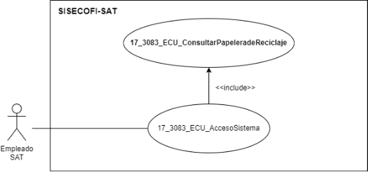
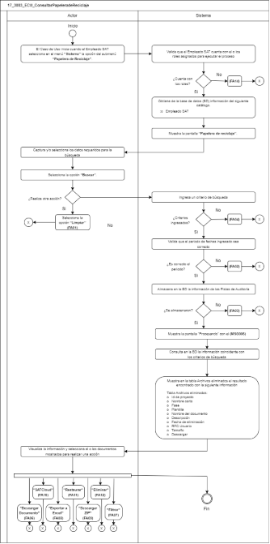

||Administración General de Comunicaciones y Tecnologías de la Información|
| :- | -: |
||Marco Documental 7.0|
|
Fecha de aprobación del Template:

02/08/2023
|
**Especificación del Caso de Uso**

17\_3083\_ECU\_ConsultarPapeleradeReciclaje.docx
|Versión del template: 7.00|
| :-: | :-: | :-: |

**<ID Requerimiento>8309**

**Nombre del Requerimiento: **TI\_SISECOFI-SAT\_Seguimiento financiero y control documental de proyectos de contratación

**Tabla de Versiones y Modificaciones**

|

Versión

|Descripción del cambio|Responsable de la Versión|Fecha|
| :-: | :- | :-: | :-: |
|*1*|*Creación del documento*|Angel Horacio López Alcaraz|*05/07/2024*|
|*1.1*|*Revisión del documento*|Rodolfo López Meneses|*17/07/2024*|
|*1.2*|*Versión aprobada para firma*|
María del Carmen Castillejos Cárdenas.

Rubén Delgado Ramírez
|*19/07/2024*|

**Tabla de Contenido**

[17_3083_ECU_ConsultarPapeleradeReciclaje	2](#_toc172115314)

[1. Descripción	2](#_toc172115315)

[2. Diagrama del Caso de Uso	2](#_toc172115316)

[3. Actores	2](#_toc172115317)

[4. Precondiciones	2](#_toc172115318)

[5. Post condiciones	3](#_toc172115319)

[6. Flujo primario	3](#_toc172115320)

[7. Flujos alternos	6](#_toc172115321)

[8. Referencias cruzadas	15](#_toc172115322)

[9. Mensajes	15](#_toc172115323)

[10. Requerimientos No Funcionales	16](#_toc172115324)

[11. Diagrama de actividad	18](#_toc172115325)

[12. Diagrama de estados	18](#_toc172115326)

[13. Aprobación del cliente	19](#_toc172115327)

### ****17\_3083\_ECU\_ConsultarPapeleradeReciclaje

|<h3>**1. Descripción** </h3>|
| :- |
|

El objetivo de este Caso de Uso es permitir al Empleado SAT que cuente con los roles necesarios, recuperar documentos eliminados, así como eliminar de forma permanente aquellos que no sean requeridos.

|
|<h3>**2. Diagrama del Caso de Uso**</h3>|
|

|
|<h3>**3. Actores** </h3>|
||

|**Actor**|**Descripción**|
| :-: | :-: |
|**Empleado SAT**|El Empleado SAT es el que tiene el o los roles otorgados por la Administración Central de Seguridad, Monitoreo y Control (ACSMC) para ingresar a cada uno de los módulos de este sistema.|

|

|
| :- |
|<h3>**4. Precondiciones**</h3>|
|

- El Empleado SAT se ha autenticado en el sistema con e.firma válida.

- El sistema ha consumido el servicio “Oauth” para obtener los datos del Empleado SAT que ingresa.

- Se le ha asignado el rol requerido al Empleado SAT para ingresar al módulo “Papelera de reciclaje” con los permisos correspondientes.

- El sistema ha validado que el Empleado SAT cuenta con los roles y permisos correspondientes para ingresar a la sección “Papelera de reciclaje”.

&emsp;
|
|<h3>**5. Post condiciones** </h3>|
|

- El Empleado SAT pudo recuperar documentos previamente eliminados.

- El Empleado SAT pudo eliminar de forma definitiva documentos no requeridos.

- El empleado SAT descargó los archivos seleccionados.

|
|<h3>**6. Flujo primario**</h3>|
||

|**Actor**|**Sistema**|
| :-: | :-: |
|
1. El Caso de Uso inicia cuando el Empleado SAT selecciona en el menú **“Sistema”** la opción del submenú **“Papelera de Reciclaje”**.

&emsp;
|
2. Valida que el Empleado SAT cuenta con el o los roles asignados para ejecutar el proceso conforme a la regla de negocio **(RNA124)**.

&emsp;

- En caso de no contar con roles necesarios, continúa en el flujo alterno **([**FA14**](#fa14))**.
|
||
3. Obtiene de la base de datos (BD) la información del siguiente catálogo conforme a la regla de negocio **(RNA01)**.

&emsp;

- Empleado SAT
|
||
4. Muestra la pantalla “Papelera de reciclaje” con los siguientes datos:

- Empleado SAT

- Fecha de eliminación (Desde:)

- Fecha de eliminación (Hasta:)

Opciones:

- Limpiar

- Buscar

Ver 

**(17\_3083\_EIU\_ConsultarPapelera deReciclaje)** Estilos 01.
|
|5. Captura y/o selecciona los datos requeridos para la búsqueda.||
|
6. Selecciona la opción **“Buscar”** y continúa en el flujo

- En caso de seleccionar la opción “Limpiar”, continúa en el **([**FA01**](#fa01))**.
|
7. En caso de no haber ingresado un criterio de búsqueda, continúa en el **([**FA04**](#fa04))**.

&emsp;

- En caso contrario, continúa en el flujo.
|
||
8. Valida que el periodo de fechas ingresado sea correcto. Aplica la **(RNA86)**.

- En caso de el periodo de fechas no sea correcto, continúa en el **([**FA02**](#fa02))**.
|
||
9. Almacena en la BD la información de las Pistas de Auditoría.

Datos que se almacenan:

**Módulo**= Sistema - Papelera de reciclaje.

**Fecha y Hora**= Fecha y hora del sistema, usando el formato DD/MM/AAAA HH:MM:SS

**RFC Usuario**= RFC largo del Empleado SAT que ingresó al sistema.

**Tipo de movimiento**= **CNST** (Consultar)

**Movimiento**= 

- Empleado SAT

- Fecha de Eliminación

- En caso de que no se puedan almacenar las Pistas de Auditoría, continúa en el **([**FA03**](#fa03))**.
|
||
10. Muestra la pantalla “Procesando” con el **([**MSG006**](#msg006))**.

Ver 

**(17\_3083\_EIU\_ConsultarPapelera deReciclaje)** Estilos 03.
|
||
11. Consulta en la BD la información coincidente con los criterios de búsqueda.

&emsp;

- En caso de ingresar al menos un criterio de búsqueda, consulta en la BD de acuerdo con los criterios ingresados, continúa en el flujo.

- En caso de que no se obtenga información de la consulta, continúa en el **([**FA05**](#fa05))**.
|
||
12. Muestra en la tabla “Archivos eliminados” el resultado encontrado con la siguiente información. Aplica la regla de negocio **(RNA92)**.

Tabla “Archivos eliminados”.

- Selección 

- Id de proyecto

- Nombre corto

- Fase

- Plantilla

- Nombre del documento

- Descripción

- Fecha eliminación

- Usuario que eliminó

- Tamaño

- Acciones

&emsp;

Opciones. Aplica la regla de negocio.

- Descargar documento 

- Exportar a Excel ![ref1] (Inhabilitado)

- Descargar ZIP ![ref2] (Inhabilitado)

- SATCloud ![ref3] (Inhabilitado)

- Campos para “Filtrar” por columna

- Eliminar (Inhabilitado)

- Restaurar (Inhabilitado)

Ver **(17\_3083\_EIU\_ConsultarPapelera deReciclaje)** Estilos 01.
|
|
13. Visualiza la información de los documentos eliminados y selecciona el o los documentos mostrados para realizar una acción. Aplica la **(RNA91)**.

&emsp;

- Si selecciona la opción **“Descargar documento”** de la columna **“Acciones”**, continúa en el **([**FA06**](#fa06))**.

- En caso de que ingrese un parámetro de búsqueda para **“Filtrar”** los campos de la tabla, continúa en el **([**FA07**](#fa07))**.

- En caso de que seleccione la opción **“Exportar a Excel”** continúa en el **([**FA08**](#fa08))**.

- En caso de que seleccione la opción **“Descargar ZIP”**, continúa en el **([**FA09**](#fa09))**.

- En caso de que seleccione la opción **“SATCloud”**, continúa en el **([**FA10**](#fa10))**.

- En caso de que seleccione la opción **“Restaurar”** continúa en el **([**FA11**](#fa11))**.

- En caso de que seleccione la opción **“Eliminar”**, continúa en el **([**FA12**](#fa12))**.

|14. El sistema deberá de ejecutar el proceso para validar que los archivos que se encuentran dentro de la papelera no superen los 30 días de eliminación. Aplica la **(RNA123)**.|
||15. Fin del Caso de Uso.|

|

|
| :- |
|<h3>**7. Flujos alternos** </h3>|
|

**FA01 Selecciona la opción “Limpiar”**
|

|**Actor**|**Sistema**|
| :-: | :-: |
|1. El **FA01** inicia cuando el Empleado SAT selecciona la opción **“Limpiar”**.|2. Borra la información ingresada en los criterios de búsqueda y regresa los campos y la tabla de resultado “Archivos eliminados” al estado inicial de selección.|
||3. Regresa al paso [**5**](#_ref171348706) del Flujo primario.|

|

**FA02 Rango de fechas incorrecto**
|
| :- |

|**Actor**|**Sistema**|
| :-: | :-: |
||1. El **FA02** inicia cuando el sistema identifica que el valor del campo “Fecha de eliminación Hasta” es menor al campo “Fecha de eliminación Desde”.|
||2. Muestra el mensaje **([**MSG001**](#msg001))** con la opción “Aceptar”.|
|3. Selecciona la opción **“Aceptar”**.|4. Cierra el mensaje.|
||5. Regresa al paso [**5**](#_ref171348706) del Flujo primario.|

|

**FA03 No se pueden almacenar las Pistas de Auditoría**
|
| :- |

|**Actor**|**Sistema**|
| :-: | :-: |
||1. El **FA03** inicia cuando interviene un evento ajeno y no se pueden almacenar las Pistas de Auditoría.|
||2. Cancela la operación sin completar el movimiento que estaba en proceso.|
||
3. Muestra el mensaje de acuerdo con lo siguiente:

- Si la pista de auditoría es por el tipo de movimiento **UPDT** e **INSR**, se muestra el **([**MSG002**](#msg002))**.

- Si la pista de auditoría es por el tipo de movimiento **CNST**, se muestra el **([**MSG003**](#msg003))**.

&emsp;

- Si la pista de auditoría es por el tipo de movimiento **DLT**, se muestra el **([**MSG004**](#msg004))**.

&emsp;

- En caso de que la pista de auditoría sea por el tipo de movimiento **PRNT**, se muestra el **([**MSG005**](#msg005))**.

Cada mensaje se muestra con la opción “Aceptar”.
|
|4. Selecciona la opción **“Aceptar”** y el flujo continúa.|5. Cierra el mensaje.|
||6. Regresa al paso previo que detona la acción de la pista de auditoría.|

|

**FA04 No se han ingresado criterios de búsqueda**
|
| :- |

|**Actor**|**Sistema**|
| :-: | :-: |
||1. El **FA04** inicia cuando el sistema identifica que no se ha ingresado al menos un criterio de búsqueda.|
||2. Muestra el **([**MSG007**](#msg007))**, con la opción “Aceptar”.|
|3. Selecciona la opción **“Aceptar”**.|4. Cierra el mensaje. |
||5. Regresa al paso [**5**](#_ref171348706) del Flujo primario.|

|

**FA05 No existen resultados que coincidan con la búsqueda**
|
| :- |

|**Actor**|**Sistema**|
| :-: | :-: |
||1. El **FA05** inicia cuando el sistema identifica que no existen coincidencias con los criterios de búsqueda seleccionados.|
||2. Muestra el **([**MSG008**](#msg008))** con la opción “Aceptar”. |
|3. Selecciona la opción **“Aceptar”**.|4. Cierra el mensaje y muestra inhabilitadas las opciones “Exportar a Excel” ![ref1], “Descargar ZIP” ![ref2] y “SATCloud” ![ref3].|
||5. Regresa al paso [**5**](#_ref171348706) del Flujo primario.|
|||

||
| :- |
|**FA06 Selecciona la opción “Descargar documento”**|

|**Actor**|**Sistema**|
| :-: | :-: |
|1. El **FA06** inicia cuando el Empleado SAT selecciona la opción **“Descargar documento”**.|
2. Almacena en la BD la información de las Pistas de Auditoría.

&emsp;

&emsp;Datos que se almacenan:

**Módulo**= Sistema - Papelera de reciclaje

**Fecha y Hora**= Fecha y hora del sistema, usando el formato DD/MM/AAAA HH:MM:SS

**RFC Usuario**= RFC largo del Empleado SAT que ingresó al sistema.

**Tipo de movimiento**= **PRNT** (Imprimir)

**Movimiento**= 

-Id de proyecto

- Nombre corto

- Fase

- Plantilla

- Nombre del documento

- Descripción

- Fecha eliminación

- Usuario que eliminó

- Tamaño

- En caso de que no se puedan almacenar las Pistas de Auditoría, continúa en el **([**FA03**](#fa03))**.
|
||3. Consulta el documento almacenado en la BD y lo prepara para descarga.|
||4. Genera y descarga el archivo seleccionado.|
||5. Regresa al paso [**13**](#_ref171512638) del Flujo primario.|

||
| :- |
|

**FA07 Selecciona la opción “Filtrar”**
|

|**Actor**|**Sistema**|
| :-: | :-: |
|1. El **FA07** inicia cuando el Empleado SAT selecciona la opción para **“Filtrar”** la información en alguna columna de acuerdo con lo que se muestra en la tabla.||
|2. Elige la columna para filtrar e ingresa el dato a buscar.|3. Busca dentro de la columna y filtra la información mostrada de acuerdo con los caracteres ingresados en el campo.|
||4. Muestra en tiempo real todas las coincidencias que obtiene de dicha columna.|
||5. Regresa al paso [**13**](#_ref171512638) del Flujo primario.|

|

**FA08 Selecciona la opción “Exportar a Excel”**
|
| :- |

|**Actor**|**Sistema**|
| :-: | :-: |
|1. El **FA08** inicia cuando el Empleado SAT selecciona la opción **“Exportar a Excel”** de la tabla.|
2. Almacena en la BD la información de las Pistas de Auditoría.

Datos que se almacenan: 

**Módulo**= Sistema - Papelera de reciclaje

**Fecha y Hora** = Fecha y hora del sistema usando el formato DD/MM/AAAA HH:MM:SS

**RFC Usuario**= RFC largo del Empleado SAT que ingresó al sistema.

**Tipo de movimiento**= **PRNT** (Imprimir)

**Movimiento**= Aplica la **(RNA239)**.

- Id de proyecto

- Nombre corto

- Nombre del documento

- En caso de que no se puedan almacenar las Pistas de Auditoría, continúa en el **([**FA03**](#fa03))**.
|
||
3. Obtiene la siguiente información de la BD de acuerdo con los documentos seleccionados en la tabla.

&emsp;

&emsp;Tabla Archivos eliminados:

- Id de proyecto

- Nombre corto

- Fase

- Nombre del documento

- Descripción

- Fecha de eliminación

- RFC Usuario

- Tamaño
|
||4. Genera un archivo en formato Excel con extensión (.xlsx) con la información obtenida|
||5. Descarga el archivo Excel con extensión (.xlsx).|
||6. Fin del Caso de Uso.|

|

**FA09 Selecciona la opción “Descargar ZIP”**
|
| :- |

|**Actor**|**Sistema**|
| :-: | :-: |
|1. El **FA09** inicia cuando el Empleado SAT selecciona la opción **“Descargar ZIP”**.|
2. Almacena en la BD la información de las Pistas de Auditoría.

&emsp;

&emsp;Datos que se almacenan:

**Módulo**= Sistema - Papelera de reciclaje

**Fecha y Hora**= Fecha y hora del sistema, usando el formato DD/MM/AAAA HH:MM:SS

**RFC Usuario**= RFC largo del Empleado SAT que ingresó al sistema.

**Tipo de movimiento**= **PRNT** (Imprimir)

**Movimiento**= Aplica la **(RNA239)**

- Id de proyecto

- Nombre corto

- Nombre del documento

- En caso de que no se puedan almacenar las Pistas de Auditoría, continúa en el **([**FA03**](#fa03))**.
|
||3. Consulta en la BD los archivos seleccionados para descarga de acuerdo con los registros seleccionados en la tabla.|
||4. Descarga el archivo en extensión (.ZIP) que contiene los archivos adjuntos.|
||5. Regresa al paso [**13**](#_ref171512638) del Flujo primario.|

|

**FA10 Selecciona la opción “SATCloud”**
|
| :- |

|**Actor**|**Sistema**|
| :-: | :-: |
|1. El **FA10** inicia cuando el Empleado SAT selecciona la opción **“SATCloud”**.|
2. Almacena en la BD la información de las Pistas de Auditoría.

&emsp;

&emsp;Datos que se almacenan:

**Módulo**= Sistema - Papelera de reciclaje

**Fecha y Hora**= Fecha y hora del sistema, usando el formato DD/MM/AAAA HH:MM:SS

**RFC Usuario**= RFC largo del Empleado SAT que ingresó al sistema.

**Tipo de movimiento**= **PRNT** (Imprimir)

**Movimiento**= Aplica la **(RNA239)**

- Id de proyecto

- Nombre corto

- Nombre del documento

- En caso de que no se puedan almacenar las Pistas de Auditoría, continúa en el **([**FA03**](#fa03))**.
|
||
3. Muestra en una ventana emergente la pantalla “Datos de la descarga” con lo siguiente: 

&emsp;

&emsp;Campos

- url (enlace)

- contraseña

Opciones

- Copiar contraseña 

- Cerrar

- Cerrar ventana 

- En caso de que no se muestre el enlace y la contraseña, continúa en el **([**FA14**](#fa14))**.

&emsp;

Ver

**(17\_3083\_EIU\_ConsultarPapelera deReciclaje)** Estilos 02.
|
|
4. Realiza lo siguiente:

- En caso de copiar la contraseña y seleccionar el enlace, el flujo continúa.

- En caso de que seleccione la opción **“Cerrar”**, continúa en el paso [**13**](#_ref171512638) del Flujo primario.
|5. Establece la conexión con “SATCloud” para mostrar el archivo ZIP a descargar con los archivos seleccionados en la tabla.|
|6. Realiza el proceso correspondiente para la descarga de los documentos adjuntos.|7. Descarga el archivo con extensión (.ZIP).|
||8. Regresa al paso [**13**](#_ref171512638) del Flujo primario.|

|

**FA11 Selecciona la opción “Restaurar”**
|
| :- |

|**Actor**|**Sistema**|
| :-: | :-: |
|1. El **FA11** inicia cuando el Empleado SAT selecciona la opción **“Restaurar**” documentos seleccionados de la tabla **“Archivos eliminados”**.|2. Muestra el **([**MSG011**](#msg011))**, con las opciones: “Sí” y “No”.|
|
3. Selecciona la opción **“Sí”** y continúa en el flujo.

- En caso de seleccionar la opción **“No”**, continúa en el paso [**9**](#_ref171602885) de este flujo
|4. Cierra el mensaje.|
||
5. Almacena en la BD la información de las Pistas de Auditoría.

&emsp;

&emsp;Datos que se almacenan:

**Módulo**= Sistema - Papelera de reciclaje

**Fecha y Hora**= Fecha y hora del sistema, usando el formato DD/MM/AAAA HH:MM:SS

**RFC Usuario**= RFC largo del Empleado SAT que ingresó al sistema.

**Tipo de movimiento**= **UPDT** (Modificar)

**Movimiento**= Aplica la **(RNA239)**

- Id de proyecto

- Nombre corto

- Nombre del documento

- En caso de que no se puedan almacenar las Pistas de Auditoría, continúa en el **([**FA03**](#fa03))**.
|
||6. Restaura a su ubicación original, el o los documentos seleccionados de la tabla.|
||7. Muestra el **([**MSG013**](#msg013))** con la opción “Aceptar”.|
|8. Selecciona la opción **“Aceptar”**.|9. Regresa al paso [**13**](#_ref171512638) del Flujo primario.|

|

**FA12 Selecciona la opción “Eliminar”**
|
| :- |

|**Actor**|**Sistema**|
| :-: | :-: |
|
1. El **FA12** inicia cuando el Empleado SAT selecciona la opción **“Eliminar**” documentos seleccionados de la tabla **“Archivos eliminados”**.

&emsp;
|2. Muestra el **([**MSG009**](#msg009))**, con las opciones: “Sí” y “No”.|
|
3. Selecciona la opción **“Sí”** y continúa en el flujo.

- En caso de seleccionar la opción **“No”**, continúa en el paso [**9**](#_ref171417069) de este flujo.
|4. Cierra el mensaje.|
||
5. Almacena en la BD la información de las Pistas de Auditoría.

&emsp;

&emsp;Datos que se almacenan:

**Módulo**= Sistema - Papelera de reciclaje

**Fecha y Hora**= Fecha y hora del sistema, usando el formato DD/MM/AAAA HH:MM:SS

**RFC Usuario**= RFC largo del Empleado SAT que ingresó al sistema.

**Tipo de movimiento**= **DLT** (Borrar)

**Movimiento**= Aplica la **(RNA239)**

- Id de proyecto

- Normbre corto

- Nombre del documento

- En caso de que no se puedan almacenar las Pistas de Auditoría, continúa en el **([**FA03**](#fa03))**.
|
||6. Elimina el o los documentos seleccionados de la tabla.|
||7. Muestra el **([**MSG012**](#msg012))** con la opción “Aceptar”. |
|8. Selecciona la opción **“Aceptar”**.|9. Regresa al paso [**13**](#_ref171512638) del Flujo primario.|

|

**FA13 Error al generar enlace y contraseña**
|
| :- |

|**Actor**|**Sistema**|
| :-: | :-: |
||1. El **FA13** inicia cuando no se muestra el enlace y la contraseña.|
||2. Muestra el **([**MSG010**](#msg010))** con la opción “Aceptar”.|
|3. Selecciona la opción **“Aceptar”**.|4. Cierra el mensaje.|
||5. Regresa al paso [**13**](#_ref171512638) del Flujo primario.|

|

**FA14 No se cuenta con los roles para continuar**
|
| :- |

|**Actor**|**Sistema**|
| :-: | :-: |
||1. El **FA14** inicia cuando el sistema valida que el Empleado SAT no cuenta con los roles necesarios para ejecutar el proceso, conforme a la **(RNA124)**.|
||2. Muestra el **([**MSG014**](#msg014))** con la opción “Aceptar”.|
|3. Selecciona la opción **“Aceptar**” y continúa en el flujo.|4. Cierra el mensaje.|
||5. Fin del Caso de Uso.|

|

|
| :- |
|<h3>**8. Referencias cruzadas** </h3>|
|

- 17\_3083\_CRN\_SeguimientoFinancieroYControl

- 17\_3083\_EIU\_ConsultarPapeleradeReciclaje

|
|<h3>**9. Mensajes** </h3>|
||

|**ID Mensaje**|**Descripción**|
| :-: | :-: |
|**MSG001**|El rango de fechas ingresado es incorrecto. Favor de verificar.|
|**MSG002**|Ocurrió un error al guardar el registro, favor de intentar nuevamente (PA01).|
|**MSG003**|Ocurrió un error al consultar la información, favor de intentar nuevamente (PA01).|
|**MSG004**|Ocurrió un error al eliminar la información, favor de intentar nuevamente (PA01).|
|**MSG005**|Ocurrió un error al exportar la información, favor de intentar nuevamente (PA01).|
|**MSG006**|Procesando…|
|**MSG007**|Introduzca al menos un criterio de búsqueda.|
|**MSG008**|No se encontraron resultados de la búsqueda. Intente nuevamente.|
|**MSG009**|El documento será eliminado de forma permanente. ¿Desea continuar?|
|**MSG010**|Se ha producido un error al generar el enlace y contraseña. Intente nuevamente|
|**MSG011**|El documento será restaurado a su ubicación original. ¿Desea continuar?|
|**MSG012**|El documento ha sido eliminado definitivamente.|
|**MSG013**|El documento ha sido restaurado correctamente.|
|**MSG014**|No se han encontrado roles asignados a su usuario.|

|

|
| :- |
|<h3>**10. Requerimientos No Funcionales** </h3>|
||

|**ID de RNF**|**Requerimiento No Funcional**|**Descripción**|
| :-: | :-: | :-: |
|**RNF001**|Disponibilidad|El sistema deberá estar activo las 24 horas del día, los 365 días del año con picos de operación en el horario de 9:00 a 18:00 horas.|
|**RNF002**|Concurrencia|
El número de Empleados SAT que puede tener el sistema son 150.

El número máximo de accesos concurrentes que debe soportar este sistema son máximo 30 Empleados SAT.
|
|**RNF003**|Seguridad|El acceso solo podrá ser otorgado a todo Empleado SAT que tenga los roles asignados por la Administración Central de Seguridad, Monitoreo y Control (ACSMC) para cada módulo de este sistema.|
|**RNF004**|Usabilidad|
El sistema deberá manejar los siguientes elementos para facilitar la navegación: 

- Mensajes tipo flotantes (*tooltips*) con información de la herramienta que ofrece ayuda contextual, como guía para el Empleado SAT. 

- Componente de ordenamiento que permita acomodar la información de la tabla de forma ascendente o descendente, considerando la columna donde es seleccionado. 

- Contar con un diseño responsivo que permita su óptima visualización en distintos tipos de dispositivos finales. 
|
|**RNF005**|Eficiencia|Las consultas se dividen en generales y detalladas, para que las detalladas carguen la información solo cuando sean requeridas por el Empleado SAT. |
|**RNF006**|Usabilidad|
El Empleado SAT podrá navegar a través de las páginas resultantes de la consulta considerando que el sistema debe mostrar inicialmente 15 registros por página, permitiendo al Empleado SAT seleccionar los registros que requiere visualizar, teniendo las opciones 15, 50 y 100: 

- Ir a la primera página (debe mostrar la primera página con el resultado de la consulta). 

- Ir a la última página (debe mostrar la última página con el resultado de la consulta). 

- Ir a la siguiente página (debe mostrar la siguiente página, considerando la página actual, con el resultado de la consulta y el número de registros seleccionados por el Empleado SAT).

- Ir a la página anterior (debe mostrar la página anterior considerando la actual, con el resultado de la consulta). 

En la tabla deben mostrarse los registros ordenados alfabéticamente.
|
|**RNF007**|Seguridad|Las Pistas de Auditoría deben estar protegidas contra accesos no autorizados. Solo los Empleados SAT autorizados pueden consultarlas, y la información en ellas se definirá durante la etapa de diseño, la cual debe estar cifrada para mantenerla confidencial y evitar exposiciones no autorizadas. |
|**RNF008**|Fiabilidad|El sistema debe ser capaz de manejar excepciones de manera efectiva y presentar mensajes claros y comprensibles para garantizar una adecuada interacción con el sistema.|
|**RNF009**|Seguridad|Se debe mantener la información en pantalla en caso de un error al guardar las pistas de auditoría, siempre y cuando el escenario lo permita. Hay situaciones de infraestructura o de conexión de internet que sí pierde los datos ya que no están controlados por el sistema.|

|

|
| - |
|<h3>**11. Diagrama de actividad** </h3>|
|

|
|<h3>**12. Diagrama de estados** </h3>|
|

No Aplica. No se requiere para este proceso.

|
|<h3>**13. Aprobación del cliente** </h3>|
||

|**FIRMAS DE CONFORMIDAD** ||
| :-: | :- |
|**Firma 1**  |**Firma 2**  |
|**Nombre**: Diana Yazmín Pérez Sabido.|**Nombre**: Rodolfo López Meneses. |
|**Puesto**: Usuaria ACPPI.|**Puesto**: Usuario ACPPI.|
|**Fecha:** |**Fecha:** |
|  |  |
|**Firma 3**  |**Firma 4** |
|**Nombre**: Rubén Delgado Ramírez. |**Nombre**: María del Carmen Castillejos Cárdenas. |
|**Puesto**: Usuario ACPPI. |**Puesto**: APE ACPPI. |
|**Fecha:** |**Fecha:** |
|  |  |
|**Firma 5** |**Firma 6** |
|**Nombre**: Alejandro Alfredo Muñoz Núñez. |**Nombre**: Erick Villa Beltrán. |
|**Puesto**: RAPE ACPPI. |**Puesto**: Líder APE SDMA 6. |
|**Fecha**: |**Fecha**: |
|  |  |
|**Firma 7**|**Firma 8**|
|**Nombre**: Juan Carlos Ayuso Bautista. |**Nombre**: Angel Horacio López Alcaraz. |
|**Puesto**: Líder Técnico SDMA 6. |**Puesto**: Analista de Sistemas SDMA 6.|
|**Fecha**: |**Fecha**: |
|||

||
| :- |

|||Página 13 de 13|
| :- | :-: | -: |

[ref1]: Aspose.Words.fba5743c-ee84-4cbf-9cba-efe256424e96.005.png
[ref2]: Aspose.Words.fba5743c-ee84-4cbf-9cba-efe256424e96.006.png
[ref3]: Aspose.Words.fba5743c-ee84-4cbf-9cba-efe256424e96.007.png
