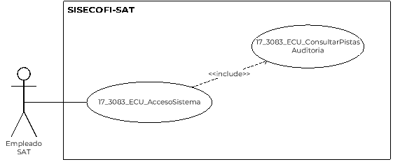

||Administración General de Comunicaciones y Tecnologías de la Información|
| :- | -: |
||Marco Documental 7.0|
|
Fecha de aprobación del Template:

02/08/2023
|
**Especificación del Caso de Uso**

17\_3083\_ECU\_ConsultarPistasAuditoria.docx
|Versión del template: 7.00|
| :-: | :-: | :-: |

**<ID Requerimiento>** 8309

**Nombre del Requerimiento: **TI\_SISECOFI-SAT\_Seguimiento financiero y control documental de proyectos de contratación

**Tabla de Versiones y Modificaciones**

|Versión|Descripción del cambio|Responsable de la Versión|Fecha|
| :-: | :- | :-: | :-: |
|*1*|*Creación del documento*|María del Carmen Gutiérrez Sánchez|*05/07/2024*|
|*1.1*|*Revisión del documento*|Diana Yazmín Pérez Sabido|*17/07/2024*|
|*1.2*|*Versión aprobada para firma*|
María del Carmen Castillejos Cárdenas.

Rubén Delgado Ramírez
|*18/07/2024*|

**Tabla de Contenido**

[17_3083_ECU_ConsultarPistasAuditoria	2](#_toc173339923)

[1. Descripción	2](#_toc173339924)

[2. Diagrama del Caso de Uso	2](#_toc173339925)

[3. Actores	2](#_toc173339926)

[4. Precondiciones	2](#_toc173339927)

[5. Post condiciones	3](#_toc173339928)

[6. Flujo primario	3](#_toc173339929)

[7. Flujos alternos	6](#_toc173339930)

[8. Referencias cruzadas	10](#_toc173339931)

[9. Mensajes	10](#_toc173339932)

[10. Requerimientos No Funcionales	11](#_toc173339933)

[11. Diagrama de actividad	13](#_toc173339934)

[12. Diagrama de estados	13](#_toc173339935)

[13. Aprobación del cliente	14](#_toc173339936)

### ****17\_3083\_ECU\_ConsultarPistasAuditoria

|<h3>**1. Descripción** </h3>|
| :- |
|

El objetivo de este Caso de Uso es permitir al Empleado SAT consultar las Pistas de Auditoría, generadas por los movimientos en el sistema. 

|
|<h3>**2**. **Diagrama del Caso de Uso**</h3>|
|

|
|<h3>**3. Actores** </h3>|
||

|**Actor**|**Descripción**|
| :-: | :-: |
|**Empleado SAT**|El Empleado SAT es el que tiene el o los roles otorgados por la Administración Central de Seguridad, Monitoreo y Control (ACSMC) para ingresar a cada uno de los módulos de este sistema.|

||
| :- |
|<h3>**4. Precondiciones**</h3>|
|

- El Empleado SAT se ha autenticado en el sistema con e.firma válida.

- El sistema ha consumido el servicio “Oauth” para obtener los datos del Empleado SAT que ingresa.

- Se le ha asignado el rol requerido al Empleado SAT para ingresar al módulo “Pistas de Auditoría” con los permisos correspondientes.

- El sistema ha validado que el Empleado SAT cuenta con el rol y los permisos correspondientes para ingresar al menú “Sistema” y al submenú “Pistas de Auditoría” de acuerdo con el proceso del **(17\_3083\_ECU\_AccesoSistema)**.

- Se ha realizado algún movimiento en el sistema que guarde Pistas de Auditoría. 

|
|<h3>**5. Post condiciones** </h3>|
|

- El Empleado SAT ha consultado las Pistas de Auditoría, de acuerdo con los criterios seleccionados en la búsqueda.

- El Empleado SAT ha descargado las Pistas de Auditoría. 

|
|<h3>**6. Flujo primario**</h3>|
||

|**Actor**|**Sistema**|
| :-: | :-: |
|
1. El Caso de Uso inicia cuando el Empleado SAT selecciona en el menú **“Sistema”** la opción del submenú **“Consultar Pistas de Auditoría”**.

|
2. Valida que el Empleado SAT cuente con el o los roles asignados para realizar las consulta. Aplica la regla de negocio **(RNA100)**.

&emsp;

- En caso de no contar con roles necesarios, continúa en el flujo alterno **([**FA09**](#fa09))**.
|
||
3. Consulta en la base de datos (BD) la información de los siguientes catálogos. Aplica la **(RNA01)**.

&emsp;

- Módulo

- Sección

- Tipo de movimiento

- Empleado SAT
|
||
4. Muestra en la pantalla “Pistas de Auditoría”. Aplica la **(RNA157)**, muestra lo siguiente:

&emsp;

- Fecha inicio

- Fecha fin

- Empleado SAT

- Módulo

- Sección

- Tipo de movimiento

Opción:

- Buscar (inhabilitado)

- Limpiar

Ver 

**(17\_3083\_EIU\_ConsultarPistasAuditoria)** Estilos 01.
|
|5. Captura y/o selecciona criterios de búsqueda.||
|
6. Selecciona la opción **“Buscar”** y continúa en el flujo.

&emsp;

- Si selecciona la opción **“Limpiar”** continúa en el **([**FA07**](#fa07))**.
|
7. Valida que se hayan seleccionado “Módulo” y “Sección” de acuerdo con la **(RNA104)**.

&emsp;

- En caso de no seleccionar la “Sección” continúa en el **([**FA01**](#fa01))**.
|
||
8. Valida el periodo de fechas ingresado sea correcto de acuerdo con las **(RNA106)**.

&emsp;

- En caso de no ser correcto continúa en el **([**FA08**](#fa08))**.
|
||
9. Almacena en la BD la información de las Pistas de Auditoría.

&emsp; 

&emsp;Datos que se almacenan:

**Módulo**= Sistema - Pistas de Auditoría.

**Fecha y Hora**= Fecha y hora del sistema, usando el formato DD/MM/AAAA HH:MM:SS

**RFC Usuario**= RFC largo del Empleado SAT que ingresó al sistema.

**Tipo de movimiento**= **CNST** (Consultar)

**Movimiento**= 

- Fecha inicio

- Fecha fin

- Empleado SAT

- Módulo

- Sección

- Tipo de movimiento

&emsp;

- En caso de que no se puedan almacenar las Pistas de Auditoría, continúa en el [**FA02**](#fa02)**)**.
|
||
10. Muestra la pantalla “Procesando” con el mensaje **([**MSG006**](#msg006))** sin opción a cancelar o cerrar.

Ver 

**(17\_3083\_EIU\_ConsultarPistasAuditoria)** Estilos 03.
|
||
11. Consulta en la BD la información coincidente con los criterios de búsqueda.

&emsp;

- En caso de ingresar al menos un criterio de búsqueda, consulta en la BD de acuerdo con los criterios de búsqueda ingresados y el flujo continúa.

- En caso de que no se obtenga información de la consulta, continúa en el **([**FA06**](#fa06))**.
|
||
12. Muestra en la tabla de movimientos el resultado encontrado con la siguiente información: 

&emsp;

&emsp;Tabla “Movimientos”. 

- Módulo

- Sección

- Fecha y hora

- Empleado SAT 

- Nombre RFC

- Tipo de movimiento 

- Ver detalle 

Opciones:

- Exportar a Excel ![ref1] 

Ver **(17\_3083\_EIU\_ConsultarPistasAuditoria)** Estilos 01.
|
|
13. Visualiza la información de los movimientos.

&emsp;

- Si selecciona la opción **“Ver Detalle”** de la columna **“Acciones”**, continúa en el **([**FA03**](#fa03))**.

&emsp;

- En caso de que ingrese un parámetro de búsqueda para **“Filtrar”**, continúa en el **([**FA04**](#fa04))**.

&emsp;

- En caso de que seleccione la opción **“Exportar a Excel”**, continúa en el **([**FA05**](#fa05))**.
||
||14. Fin del Caso de Uso.|

||
| :- |
|<h3>` `**7. Flujos alternos** </h3>|
|

**FA01 No se ingresaron los datos obligatorios**
|

|**Actor**|**Sistema**|
| :-: | :-: |
||1. El **FA01** inicia cuando el sistema identifica que seleccionó el “Módulo” sin seleccionar “Sección”.|
||2. Muestra en rojo los campos pendientes de captura. |
||3. Muestra el **([**MSG001**](#msg001))** con la opción “Aceptar”.|
|4. Selecciona la opción **“Aceptar”**.|5. Cierra el mensaje. |
||6. Regresa al paso [**5**](#_ref171580609) del Flujo primario.|

|

**FA02 No se pueden almacenar las Pistas de Auditoría**
|
| :- |

|**Actor**|**Sistema**|
| :-: | :-: |
||1. El **FA02** inicia cuando interviene un evento ajeno y no se pueden almacenar las Pistas de Auditoría. |
||2. Cancela la operación sin completar el movimiento que estaba en proceso.|
||
- Muestra el mensaje informativo de acuerdo con lo siguiente:

- Si la pista de auditoría es por el tipo de movimiento **CNST**, se muestra el **([**MSG002**](#msg002))** con la opción “Aceptar”.

- En caso de que la pista de auditoría es por el tipo de movimiento **PRNT**, se muestra el **([**MSG007**](#msg007))**.

&emsp;
|
|3. Selecciona la opción **“Aceptar”**.|4. Cierra el mensaje.|
||5. Regresa al paso previo que detona la acción de la pista de auditoría. |

|

**FA03 Ver Detalle**
|
| :- |

|**Actor**|**Sistema**|
| :-: | :-: |
|1. El **FA03** inicia cuando el Empleado SAT selecciona algún registro de la tabla y **“Ver detalle”**.|
2. Muestra la modal con el detalle de movimiento con las siguientes secciones:

&emsp;

- Detalle de movimiento 

- Detalle de movimiento anterior

- Última modificación

Opciones:

- Cerrar

- Cerrar 

Ver 

**(17\_3083\_EIU\_ConsultarPistasAuditoria)** Estilos 02.
|
|3. Selecciona la opción **“Cerrar”**.|4. Cierra la modal y muestra la pantalla de “Pistas de Auditoría”.|
||5. Regresa al paso [**5**](#_ref171580609) del Flujo primario.|

|

**FA04 Selecciona la opción “Filtrar”**
|
| :- |

|**Actor**|**Sistema**|
| :-: | :-: |
|1. El **FA04** inicia cuando el Empleado SAT requiere **“Filtrar”** la información en alguna columna de acuerdo con lo que se muestra en la tabla.||
|2. Elige la columna para filtrar e ingresa el dato a buscar.|3. Busca dentro de la columna y filtra la información mostrada de acuerdo con los caracteres ingresados en el campo.|
||4. Muestra todas las coincidencias que obtiene en tiempo real de dicha columna.|
||5. Fin del Caso de Uso.|

|

**FA05 Selecciona la opción “Exportar a Excel”**
|
| :- |

|**Actor**|**Sistema**|
| :-: | :-: |
|1. El **FA05** inicia cuando el Empleado SAT selecciona el icono **“Exportar a Excel”** de la tabla. |
2. Almacena en la BD la información de las Pistas de Auditoría.

&emsp;

&emsp;Datos que se almacenan:

**Módulo**= Sistema - Pistas de Auditoría

**Fecha y Hora**= Fecha y hora del sistema, usando el formato DD/MM/AAAA HH:MM:SS.

**RFC Usuario**= RFC largo del Empleado SAT que ingresó al sistema.

**Tipo de movimiento**= **PRNT** (Imprimir).

**Movimiento**= Aplica la **(RNA239)**.

- RFC Usuario

- Tipo de movimiento

- En caso de que no se puedan almacenar las Pistas de Auditoría, continúa en el **([**FA02**](#fa02))**. 
|
||
3. Obtiene la siguiente información.

&emsp;Tabla de movimientos:

&emsp;

- Módulo

- Sección

- Fecha y hora

- Nombre RFC

- RFC usuario

- Tipo de movimiento

- Id registro 

- Ver detalle

- ` `Detalle de movimiento 

- Detalle de movimiento anterior

- Última modificación
|
||4. Genera un archivo en formato Excel con extensión (.xlsx) con la información obtenida.|
||5. Descarga el archivo Excel con extensión (.xlsx).|
||6. Fin de Caso de Uso.|

|

**FA06 No existen resultados que coincidan en la búsqueda**
|
| :- |

|**Actor**|**Sistema**|
| :-: | :-: |
||1. El **FA06** inicia cuando el sistema identifica que no existen coincidencias con los criterios de búsqueda seleccionados.|
||2. Muestra el **([**MSG003**](#msg003))** con la opción “Aceptar”. |
|3. Selecciona la opción **“Aceptar”**.|4. Cierra el mensaje, y muestra inhabilitada la opción “Exportar a Excel” ![ref1].|
||5. Regresa al paso [**5**](#_ref171580609) del Flujo primario.|

|

**FA07 Selecciona la opción “Limpiar”**
|
| :- |

|**Actor**|**Sistema**|
| :-: | :-: |
|1. El **FA07** inicia cuando el Empleado SAT selecciona la opción **“Limpiar”**.|2. Borra la información ingresada en los criterios de búsqueda y regresa los campos y tabla de resultado “Movimientos” al estado inicial. |
||3. Regresa al paso [**5**](#_ref171580609) del Flujo primario.|

|

**FA08 Rango de fechas incorrecto**
|
| :- |

|**Actor**|**Sistema**|
| :-: | :-: |
||1. El **FA08** inicia cuando el sistema identifica que el valor del campo “Fecha inicio” es mayor a la “Fecha fin” o “Fecha fin” es menor a la “Fecha inicio”. |
||2. Muestra el **([**MSG004**](#msg004))** con la opción “Aceptar”.|
|3. Selecciona la opción **“Aceptar”**.|4. Cierra el mensaje.|
||5. Regresa al paso [**5**](#_ref171580609) del Flujo primario.|

|

**FA09 No se cuenta con los roles para continuar**
|
| :- |

|**Actor**|**Sistema**|
| :-: | :-: |
||1. El **FA09** inicia cuando el sistema valida que el Empleado SAT no cuenta con los roles necesarios para ejecutar el proceso, conforme a la **(RNA100)**.|
||2. Muestra el **([**MSG005**](#msg005))** con la opción “Aceptar”.|
|3. Selecciona la opción **“Aceptar**” y continúa en el flujo.|4. Cierra el mensaje.|
||5. Fin del Caso de Uso.|
|||

|<h3></h3>|
| :- |
|<h3>**8. Referencias cruzadas** </h3>|
|

- 17\_3083\_CRN\_SeguimientoFinancieroYControl.

- 17\_3083\_EIU\_ConsultarPistasAuditoria.

&emsp;
|
|<h3>**9. Mensajes** </h3>|
||

|**ID Mensaje**|**Descripción**|
| :-: | :-: |
|**MSG001**|Es necesario seleccionar la sección. |
|**MSG002**|Ocurrió un error al consultar la información, favor de intentar nuevamente (PA01).|
|**MSG003**|No se encontraron resultados de la búsqueda.|
|**MSG004**|Las fechas ingresadas son incorrectas. Favor de verificar.|
|**MSG005**|No se han encontrado roles asignados a su usuario.|
|**MSG006**|Procesando…|
|**MSG007**|Ocurrió un error al exportar la información, favor de intentar nuevamente (PA01).|

|

|
| - |
|<h3>**10. Requerimientos No Funcionales** </h3>|
||

|**ID de RNF**|**Requerimiento No Funcional**|**Descripción**|
| :-: | :-: | :-: |
|**RNF001**|Disponibilidad|El sistema deberá estar activo las 24 horas del día, los 365 días del año, con picos de operación en el horario de 9:00 a 18:00 horas. |
|**RNF002**|Concurrencia|
El número de Empleados SAT que puede tener el sistema son 150. 

 

El número de accesos concurrentes que debe soportar este sistema son máximo 30 Empleados SAT. 
|
|**RNF003**|Seguridad|El acceso solo podrá ser otorgado al Empleado SAT que tenga los roles asignados por la Administración Central de Seguridad, Monitoreo y Control (ACSMC) para cada módulo de este sistema. |
|**RNF004**|Usabilidad|
El sistema deberá manejar los siguientes elementos para facilitar la navegación: 

- Mensajes tipo flotantes (*tooltips*) con información de la herramienta que ofrece ayuda contextual, como guía para el Empleado SAT. 

- Componente de ordenamiento que permita acomodar la información de la tabla de forma ascendente o descendente, considerando la columna donde es seleccionado. 

- Contar con un diseño responsivo que permita su óptima visualización en distintos tipos de dispositivos finales. 
|
|**RNF005**|Eficiencia|Las consultas se dividen en generales y detalladas, para que las detalladas carguen la información solo cuando sean requeridas por el Empleado SAT. |
|**RNF006**|Usabilidad|
El Empleado SAT podrá navegar a través de las páginas resultantes de la consulta considerando que el sistema debe mostrar inicialmente 15 registros por página, permitiendo al Empleado SAT seleccionar los registros que requiere visualizar, teniendo las opciones 15, 50 y 100:

- Ir a la primera página (debe mostrar la primera página con el resultado de la consulta). 

- Ir a la última página (debe mostrar la última página con el resultado de la consulta). 

- Ir a la siguiente página (debe mostrar la siguiente página considerando la página actual, con el resultado de la consulta y el número de registros seleccionados por el Empleado SAT). 

- Ir a la página anterior (debe mostrar la página anterior considerando la página actual, con el resultado de la consulta). 

En la tabla deben mostrarse los registros ordenados alfabéticamente.
|
|**RNF007**|Seguridad|Las Pistas de Auditoría deben estar protegidas contra accesos no autorizados. Solo los Empleados SAT autorizados pueden consultarlas, y la información en ellas se definirá durante la etapa de diseño, la cual debe estar cifrada para mantenerla confidencial y evitar exposiciones no autorizadas.** |
|**RNF008**|Fiabilidad|El sistema debe ser capaz de manejar excepciones de manera efectiva y presentar mensajes claros y comprensibles para garantizar una adecuada interacción con el sistema.|
|**RNF009**|Seguridad|Se debe mantener la información en pantalla en caso de un error al guardar las Pistas de Auditoría, siempre y cuando el escenario lo permita. Hay situaciones de infraestructura o de conexión de internet que sí pierde los datos ya que no están controlados por el sistema.|
|**RNF010**|Integridad |Al almacenar la información en la BD de tipo Texto o alfanumérico se deben eliminar los espacios en blanco al inicio y fin de la cadena. |

||
| :- |
|

|
|<h3>**11. Diagrama de actividad** </h3>|
|

|
|

|
|<h3>**12. Diagrama de estados** </h3>|
|

No aplica, no se requiere para este proceso.

|
|<h3>**13. Aprobación del cliente** </h3>|
||

|**FIRMAS DE CONFORMIDAD**||
| :-: | :- |
|**Firma 1** |**Firma 2** |
|**Nombre**: Diana Yazmín Pérez Sabido.|**Nombre**: Rodolfo López Meneses.|
|**Puesto**: Usuaria ACPPI.|**Puesto**: Usuario ACPPI.|
|**Fecha:**|**Fecha:**|
|||
|**Firma 3** |**Firma 4**|
|**Nombre**: Rubén Delgado Ramírez.|**Nombre**: María del Carmen Castillejos Cárdenas.|
|**Puesto**: Usuario ACPPI.|**Puesto**: APE ACPPI|
|**Fecha:**|**Fecha:**|
|||
|**Firma 5**|**Firma 6**|
|**Nombre**:  Alejandro Alfredo Muñoz Núñez.|**Nombre**: Erick Villa Beltrán.|
|**Puesto**:  RAPE ACPPI.|**Puesto**: Líder APE SDMA 6.|
|**Fecha**:|**Fecha**:|
|||
|**Firma 7**|**Firma 8**|
|**Nombre**: Juan Carlos Ayuso Bautista.|**Nombre**:  María del Carmen Gutiérrez Sánchez.|
|**Puesto**: Líder Técnico SDMA 6.|**Puesto**: Analista de Sistemas DS SDMA 6. |
|**Fecha**:|**Fecha**:|
|||

||
| :- |

|||Página 18 de 18|
| :- | :-: | -: |

[ref1]: Aspose.Words.739ed3f4-b3a9-41e9-9be5-1b70dc1cc343.004.png
