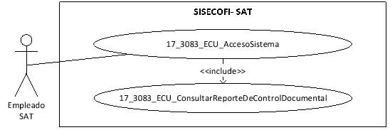
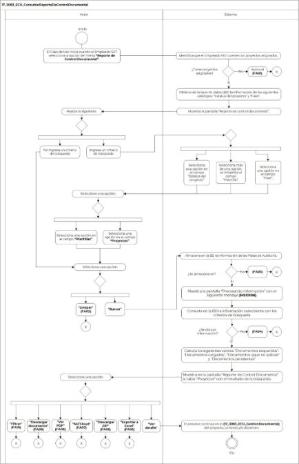

||Administración General de Comunicaciones y Tecnologías de la Información|
| :- | -: |
||Marco Documental 7.0|
|
Fecha de aprobación del Template:

02/08/2023
|
**Especificación del Caso de Uso**

17\_3083\_ECU\_ConsultarReporteDeControlDocumental.docx
|Versión del template: 7.00|
| :-: | :-: | :-: |

**<ID Requerimiento>** 8309

**Nombre del Requerimiento:** TI\_SISECOFI-SAT\_Seguimiento financiero y control documental de proyectos de contratación

**Tabla de Versiones y Modificaciones**

|Versión|Descripción del cambio|Responsable de la Versión|Fecha|
| :- | :- | :- | :-: |
|*1*|*Creación del documento*|Eduardo Acosta Mora|*08/07/2024*|
|*1.1*|*Revisión del documento*|Diana Yazmín Pérez Sabido|*18/07/2024*|
|*1.2*|*Versión aprobada para firma*|
María del Carmen Castillejos Cárdenas

Rubén Delgado Ramírez
|*18/07/2024*|

**Tabla de Contenido**

[17_3083_ECU_ConsultarReporteDeControlDocumental	2](#_toc175158483)

[1. Descripción	2](#_toc175158484)

[2. Diagrama del Caso de Uso	2](#_toc175158485)

[3. Actores	2](#_toc175158486)

[4. Precondiciones	2](#_toc175158487)

[5. Post condiciones	3](#_toc175158488)

[6. Flujo primario	3](#_toc175158489)

[7. Flujos alternos	7](#_toc175158490)

[8. Referencias cruzadas	14](#_toc175158491)

[9. Mensajes	14](#_toc175158492)

[10. Requerimientos No Funcionales	15](#_toc175158493)

[11. Diagrama de actividad	17](#_toc175158494)

[12. Diagrama de estados	17](#_toc175158495)

[13. Aprobación del cliente	18](#_toc175158496)

### ****17\_3083\_ECU\_ConsultarReporteDeControlDocumental

|<h3>**1. Descripción** </h3>|
| :- |
|

El objetivo de este Caso de Uso es permitir al Empleado SAT la búsqueda de los documentos adjuntos al proyecto, incluyendo sus contratos y/o convenios modificatorios, dictámenes y facturas relacionados durante la vida del proyecto.

|
|<h3>**2. Diagrama del Caso de Uso**</h3>|
|

|
|<h3>**3. Actores** </h3>|
||

|**Actor**|**Descripción**|
| :-: | :-: |
|**Empleado SAT**|El Empleado SAT es el que tiene el o los roles otorgados por la Administración Central de Seguridad, Monitoreo y Control (ACSMC) para ingresar a cada uno de los módulos de este sistema.|

|

|
| :- |
|<h3>**4. Precondiciones**</h3>|
|

- El Empleado SAT se ha autenticado en el sistema con e.firma válida. 

- El sistema ha consumido el servicio “Oauth” para obtener los datos del Empleado SAT que ingresa al sistema.

- Se le ha asignado el rol requerido al Empleado SAT para ingresar al módulo “Reporte De Control Documental” con los permisos correspondientes.

- El sistema ha validado que el Empleado SAT cuenta con el rol para ingresar al módulo “Reporte de Control Documental” con los permisos correspondientes.

- Se han adjuntado archivos a los proyectos, contratos y/o dictámenes.

- El Empleado SAT ha ingresado a la opción del menú “Reportes”, submenú “Reporte De Control Documental”, de acuerdo con el proceso del **(17\_3083\_ECU\_AccesoSistema)**.

|
|<h3>**5. Post condiciones** </h3>|
|

El Empleado SAT realizó lo siguiente:

- Consultó los archivos de acuerdo con los criterios de búsqueda.

- Descargó los archivos de acuerdo con los criterios de búsqueda.

- Visualizó los documentos pendientes.

- Consultó a detalle los archivos de un proyecto.

|
|<h3>**6. Flujo primario**</h3>|
||

|**Actor**|**Sistema**|
| :-: | :-: |
|1. El Caso de Uso inicia cuando el Empleado SAT selecciona la opción del submenú **“Reporte de Control Documental”**.|
2. Identifica que el Empleado SAT cuente con proyectos asignados de acuerdo con la regla de negocio **(RNA78)**.

&emsp;

- En caso de que no cuente con proyectos asignados, continúa en el flujo alterno **([**FA01**](#fa01))**. 
|
||
3. Obtiene de la base de datos (BD) la información de los siguientes catálogos de acuerdo con la **(RNA01)**:

- Estatus del proyecto

- Fase
|
||
4. Muestra la pantalla “Reporte de Control Documental” inicialmente solo con los criterios de búsqueda y opciones:

&emsp;

&emsp;Criterios de búsqueda:

- Estatus del proyecto

- Proyecto

- Documento

- Fase

- Plantilla

Opciones:

- Buscar

- Limpiar

Ver **(17\_3083\_EIU\_ConsultarReporteDeControlDocumental)** Estilos 01.
|
|
5. Realiza lo siguiente:

&emsp;

- En caso de que seleccione o ingrese un criterio de búsqueda, el flujo continúa: 

- Estatus del proyecto

- Documento

- Fase

- En caso de que no ingrese un criterio de búsqueda, continúa en el paso [**8**](#_ref172011084) de este flujo.
|
6. En caso de que seleccione una o más opciones en el campo “Estatus del proyecto”, consulta en la BD los nombres cortos del campo “Proyectos” de acuerdo con lo seleccionado en el campo “Estatus del proyecto”.

&emsp;

&emsp;En caso de que seleccione una opción en el campo “Fase”, consulta en la BD la información de las plantillas de acuerdo con la opción seleccionada en el campo “Fase”.

&emsp;

- En caso de que haya seleccionado más de una opción en el campo “Fase”, se inhabilita el campo “Plantilla” y continúa en el paso [**8**](#_ref172011084) de este flujo.
|
|
7. Realiza lo siguiente: 

&emsp;

- Si lo requiere, selecciona una o más opciones en el campo **“Proyectos”**.

- Si lo requiere, selecciona una opción en el campo **“Plantillas”**.
||
|
8. Selecciona una opción:

&emsp;

- En caso de que seleccione la opción **“Buscar”**, el flujo continúa.

- En caso de que seleccione la opción **“Limpiar”**, el flujo continúa en el **([**FA02**](#fa02))**.
|
9. Almacena en la BD la información de las Pistas de Auditoría.

&emsp;

&emsp;Datos que se almacenan:

**Módulo**= ReporteDeControlDocumental

**Fecha y Hora**= Fecha y hora del sistema usando el formato DD/MM/AAAA HH:MM:SS

**RFC Usuario**= RFC largo del Empleado SAT que ingresó al sistema.

**Tipo de movimiento**= **CNST** (Consulta)

**Movimiento**= 

- Filtros seleccionados e ingresados.

- En caso de que no se puedan almacenar las Pistas de Auditoría, continúa en el **([**FA03**](#fa03))**.
|
||
10. Muestra la pantalla “Procesando información” con el siguiente mensaje **([**MSG006**](#msg006))**.

Ver **(17\_3083\_EIU\_ConsultarReporteDeControlDocumental)** Estilos 04.
|
||
11. Consulta en la BD la información coincidente con los criterios de búsqueda de acuerdo con la **(RNA109)**:

- En caso de que no se obtenga información de la consulta, continúa en el **([**FA04**](#fa04))**.
|
||
12. Calcula los siguientes valores de acuerdo con la **(RNA50)**:

&emsp;

- Documentos requeridos ![ref1]

- Documentos cargados ![ref2]

- Documentos que no aplican ![ref3] 

- Documentos pendientes ![ref4]
|
||
13. Muestra en la pantalla “Reporte de Control Documental” la tabla “Proyectos” con el resultado de la búsqueda.

&emsp;

&emsp;Opciones:

- Exportar a Excel ![ref5]

- Descargar ZIP ![ref6]

- SATCloud ![ref7]

Datos de los documentos:

- Documentos requeridos ![ref1]

- Documentos cargados ![ref2]

- Documentos que no aplican ![ref3] 

- Documentos pendientes ![ref4]

Tabla “Proyectos”. Aplica la **(RNA244)**

- Id proyecto

- Nombre corto

- Fase

- Plantilla

- Descripción

- Requerido. Aplica la **(RNA60)**

- No aplica

- Estatus

- Justificación

- Fecha última modificación

- Acciones. Aplica la **(RNA05)**

Opciones:

- Ver PDF 

- Descargar documento 

- Ver detalle 

- Campos para “Filtrar” por columna
|
|
14. Selecciona una opción:

&emsp;

- En caso de que seleccione la opción **“Ver detalle”**, el flujo continúa.

- En caso de que seleccione la opción **“Exportar a Excel”**, el flujo continúa en el **([**FA05**](#fa05))**.

&emsp;

- En caso de que seleccione la opción **“Descargar ZIP”**, el flujo continúa en el **([**FA06**](#fa06))**.

&emsp;

- En caso de que seleccione la opción **“SATCloud”**, el flujo continúa en el **([**FA07**](#fa07))**.

- En caso de que seleccione la opción **“Ver PDF”**, el flujo continúa en el **([**FA08**](#fa08))**.

- En caso de que seleccione la opción **“Descargar documento”**, el flujo continúa en el **([**FA09**](#fa09))**.

- En caso de que seleccione la opción para **“Filtrar”** los campos de la tabla, continúa en el **([**FA10**](#fa10))**.
|15. El proceso continúa en el en otra ventana del  **(17\_3083\_ECU\_GestionDocumental)** del proyecto, contrato y/o dictamen de acuerdo con la **(RNA241)**.|
||16. Fin del Caso de Uso.|

|

|
| :- |
|<h3>**7. Flujos alternos** </h3>|
|

**FA01 No se cuenta con proyectos asignados**
|

|**Actor**|**Sistema**|
| :-: | :-: |
||1. El **FA01** inicia cuando el sistema identifica que el Empleado SAT no cuenta con proyectos asignados. |
||2. Muestra el **([**MSG001**](#msg001))** con la opción “Aceptar”.|
|3. Selecciona la opción **“Aceptar”**.|4. Cierra el mensaje.|
||5. Fin del Caso de Uso.|

|

**FA02 Selecciona la opción “Limpiar”**
|
| :- |

|**Actor**|**Sistema**|
| :-: | :-: |
|1. El **FA02** inicia cuando el Empleado SAT selecciona la opción **“Limpiar”**.|2. Borra la información ingresada en los criterios de búsqueda y los deja en el estado inicial de selección.|
||
3. Oculta lo siguiente: 

&emsp;

&emsp;Opciones:

- Exportar a Excel ![ref5]

- Descargar ZIP ![ref6]

- SATCloud ![ref7]

Datos de los documentos:

- Documentos requeridos ![ref1]

- Documentos cargados ![ref2]

- Documentos que no aplican ![ref3] 

- Documentos pendientes ![ref4]

Tabla “Proyectos”
|
||4. Continúa en el paso [**5**](#_ref172011115) del Flujo primario.|

|

**FA03 No se pueden almacenar las Pistas de Auditoría**
|
| :- |

|**Actor**|**Sistema**|
| :-: | :-: |
||1. El **FA03** inicia cuando interviene un evento ajeno y no se puede almacenar las Pistas de Auditoría.|
||2. Cancela la operación sin completar el movimiento que estaba en proceso.|
||
3. Muestra el mensaje de acuerdo con lo siguiente:

- Si la pista de auditoría es por el tipo de movimiento **CNST**, se muestra el **([**MSG002**](#msg002))**.

- En caso de que la pista de auditoría sea por el tipo de movimiento **PRNT**, se muestra el **([**MSG003**](#msg003))**.

Cada mensaje se muestra con la opción “Aceptar”.
|
|4. Selecciona la opción **“Aceptar”**.|5. Cierra el mensaje.|
||6. Regresa al paso previo que detona la acción de la pista de auditoría.    |

|

**FA04 No existen resultados que coincidan en la búsqueda**
|
| :- |

|**Actor**|**Sistema**|
| :-: | :-: |
||1. El **FA04** inicia cuando el sistema identifica que no existen coincidencias con los criterios de búsqueda.|
||2. Muestra el **([**MSG004**](#msg004))** con la opción “Aceptar”.|
|3. Selecciona la opción **“Aceptar”**.|
4. Cierra el mensaje y oculta lo siguiente: 

&emsp;

&emsp;Opciones:

- Exportar a Excel ![ref5]

- Descargar ZIP ![ref6]

- SATCloud ![ref7]

Datos de los documentos:

- Documentos requeridos ![ref1]

- Documentos cargados ![ref2]

- Documentos que no aplican ![ref3] 

- Documentos pendientes ![ref4]

Tabla “Proyectos”
|
||5. Fin del Caso de Uso.|

|

**FA05 Selecciona la opción “Exportar a Excel”**
|
| :- |

|**Actor**|**Sistema**|
| :-: | :-: |
|1. El **FA05** inicia cuando el Empleado SAT selecciona la opción **“Exportar a Excel”**.|
2. Almacena en la BD la información de las Pistas de Auditoría.

&emsp;

&emsp;Datos que se almacenan:

**Módulo**= ReporteDeControlDocumental

**Fecha y Hora**= Fecha y hora del sistema usando el formato DD/MM/AAAA HH:MM:SS

**RFC Usuario**= RFC largo del Empleado SAT que ingresó al sistema.

**Tipo de movimiento**= **PRNT** (Imprimir)

**Movimiento**= Aplica la **(RNA239)**

- Id de proyecto

- Nombre corto

- Fase

- Descripción

- En caso de que no se puedan almacenar las Pistas de Auditoría, continúa en el **([**FA03**](#fa03))**.
|
||3. Genera un archivo de Excel con la extensión (.xlsx) con la información correspondiente de acuerdo con el resultado de búsqueda.|
||4. Descarga el archivo de Excel con extensión (.xlsx).|
||5. Fin del Caso de Uso.|

|

**FA06 Selecciona la opción “Descargar ZIP”**
|
| :- |

|**Actor**|**Sistema**|
| :-: | :-: |
|1. El **FA06** inicia cuando el Empleado SAT selecciona la opción **“Descargar ZIP”**.|
2. Almacena en la BD la información de las Pistas de Auditoría.

&emsp;

&emsp;Datos que se almacenan:

**Módulo**= ReporteDeControlDocumental

**Fecha y Hora**= Fecha y hora del sistema, usando el formato DD/MM/AAAA HH:MM:SS

**RFC Usuario**= RFC largo del Empleado SAT que ingresó al sistema.

**Tipo de movimiento**= **PRNT** (Imprimir)

**Movimiento**= Aplica la **(RNA239)**

- ID proyecto 

&emsp;Nombre de los documentos descargados en una cadena separado por | (pipes)Ejemplo: (01\_FTO\_JC\_MDR4.PDF|SCP\_MDR4.pdf

- En caso de que no se puedan almacenar las Pistas de Auditoría, continúa en el **([**FA03**](#fa03))**.
|
||
3. Muestra la pantalla “Procesando información” con el siguiente **([**MSG006**](#msg006))**.

&emsp;

&emsp;Ver **(17\_3083\_EIU\_ConsultarReporteDeControlDocumental)** Estilos 04.
|
||4. Consulta en la BD los archivos que se tienen relacionados con el proyecto y sus contratos y/o convenios modificatorios, dictámenes y facturas relacionados de acuerdo con el resultado de búsqueda.|
||5. Genera y descarga un archivo en extensión (.zip) que contiene los archivos adjuntos.|
||6. Continúa en el paso [**14**](#_ref172011135) del Flujo primario.|

|

**FA07 Selecciona la opción “SATCloud”**
|
| :- |

|**Actor**|**Sistema**|
| :-: | :-: |
|1. El **FA07** inicia cuando el Empleado SAT selecciona la opción **“SATCloud”**.|
2. Almacena en la BD la información de las Pistas de Auditoría.

&emsp;

&emsp;Datos que se almacenan:

**Módulo**= ReporteDeControlDocumental

**Fecha y Hora**= Fecha y hora del sistema, usando el formato DD/MM/AAAA HH:MM:SS

**RFC Usuario**= RFC largo del Empleado SAT que ingresó al sistema.

**Tipo de movimiento**= **PRNT** (Imprimir)

**Movimiento**= Aplica la **(RNA239)**

- ID proyecto 

- Nombre de los documentos descargados en una cadena por separado por | (pipes)

&emsp;Ejemplo: (01\_FTO\_JC\_MDR4.pdf|SCP\_MDR4.pdf)

- En caso de que no se puedan almacenar las Pistas de Auditoría, continúa en el **([**FA03**](#fa03))**.
|
||
3. Muestra en una ventana emergente la pantalla “Datos de la descarga” con lo siguiente: 

&emsp;

&emsp;Datos:

- url (enlace)

- contraseña

Opciones

- Copiar contraseña 

- Cerrar

- Cerrar ventana ![ref8]

- En caso de que no se muestre el enlace y la contraseña, continúa en el **([**FA11**](#fa11))**.

&emsp;

Ver **(17\_3083\_EIU\_ConsultarReprteDeControlDocumental)** Estilos 03.
|
|
4. Realiza lo siguiente:

- En caso de que copie la contraseña o seleccione el enlace, el flujo continúa.

- En caso de que seleccione la opción **“Cerrar”**, continúa en el paso [**14**](#_ref172011135) del Flujo primario.
|5. Realiza la conexión con el SATCloud para mostrar el archivo a descargar de acuerdo con el resultado de búsqueda.|
|6. Realiza lo correspondiente para descargar los documentos adjuntos.|7. Descarga el archivo con extensión (.ZIP).|
||8. Continúa en el paso [**14**](#_ref172011135) del Flujo primario.|

|

**FA08 Selecciona la opción “Ver PDF”**
|
| :- |

|**Actor**|**Sistema**|
| :-: | :-: |
|1. El **FA08** inicia cuando el Empleado SAT selecciona la opción **“Ver PDF”**.|
2. Almacena en la BD la información de las Pistas de Auditoría.

&emsp;

&emsp;Datos que se almacenan:

**Módulo**= ReporteDeControlDocumental **Fecha y Hora**= Fecha y hora del sistema, usando el formato DD/MM/AAAA HH:MM:SS

**RFC Usuario**= RFC largo del Empleado SAT que ingresó al sistema.

**Tipo de movimiento**= **CNST** (Consulta)

**Movimiento**= 

-Nombre corto (Proyecto)

-Documento seleccionado

- En caso de que no se puedan almacenar las Pistas de Auditoría, continúa en el **([**FA03**](#fa03))**.
|
||3. Procesa el archivo PDF para su visualización.|
||
4. Muestra en una pantalla emergente lo siguiente:

&emsp;

- Panel de visualización (Muestra la información del archivo).

&emsp;

Opciones:

- Cerrar

- Cerrar ventana![ref8]

Ver **(17\_3083\_EIU\_ConsultarReprteDeControlDocumental)** Estilos 02.
|
|5. Selecciona la opción **“Cerrar”** o la opción **“Cerrar ventana”**.|6. Cierra la ventana emergente.|
||7. Continúa en el paso [**14**](#_ref172011135) del Flujo primario.|

|

**FA09 Selecciona la opción “Descargar documento”**
|
| :- |

|**Actor**|**Sistema**|
| :-: | :-: |
|1. El **FA09** inicia cuando el Empleado SAT selecciona la opción **“Descargar documento”**.|
2. Almacena en la BD la información de las Pistas de Auditoría.

&emsp;

&emsp;Datos que se almacenan:

**Módulo**= ReporteDeControlDocumental **Fecha y Hora**= Fecha y hora del sistema, usando el formato DD/MM/AAAA HH:MM:SS

**RFC Usuario**= RFC largo del Empleado SAT que ingresó al sistema.

**Tipo de movimiento**= **PRNT** (Imprimir)

**Movimiento**= Aplica la **(RNA239)**

-Nombre corto (Proyecto)

-Documento seleccionado

-Fase 

- En caso de que no se puedan almacenar las Pistas de Auditoría, continúa en el **([**FA03**](#fa03))**.
|
||3. Consulta y obtiene de la BD el documento almacenado.|
||4. Descarga el archivo.|
||5. Continúa en el paso [**14**](#_ref172011135) del Flujo primario.|

|

**FA10 Selecciona la opción para “Filtrar” los campos de la tabla**
|
| :- |

|**Actor**|**Sistema**|
| :-: | :-: |
|1. El **FA10** inicia cuando el Empleado SAT selecciona la opción para **“Filtrar”** la información en alguna columna de acuerdo con lo que se muestra en la tabla.||
|2. Elige la columna para filtrar e ingresa el dato a buscar.|3. Busca dentro de la columna y filtra la información mostrada de acuerdo con los caracteres ingresados en el campo.|
||4. Muestra en tiempo real todas las coincidencias que obtiene de dicha columna.|
||5. Continúa en el paso [**14**](#_ref172011135)** del Flujo primario.|

|

**FA11 Error al generar el enlace y contraseña** 
|
| :- |

|**Actor**|**Sistema**|
| :-: | :-: |
||1. El **FA11** inicia cuando no se muestra el enlace y la contraseña.|
||2. Muestra el **([**MSG005**](#msg005))** con la opción “Aceptar”.|
|3. Selecciona la opción **“Aceptar”**.|4. Cierra el mensaje.|
||5. Continúa en el paso [**14**](#_ref172011135) del Flujo primario.|

|

|
| :- |
|<h3>**8. Referencias cruzadas** </h3>|
|

- 17\_3083\_CRN\_SeguimientoFinancieroYControl

- 17\_3083\_EIU\_ConsultarReporteDeControlDocumental

- 17\_3083\_ECU\_AccesoSistema

- 17\_3083\_ECU\_GestionDocumental

|
|<h3>**9. Mensajes** </h3>|
||

|**ID Mensaje**|**Descripción**|
| :-: | :-: |
|**MSG001**|No se cuenta con proyectos asignados.|
|**MSG002**|Ocurrió un error al consultar la información, favor de intentar nuevamente (PA01).|
|**MSG003**|Ocurrió un error al exportar la información, favor de intentar nuevamente (PA01).|
|**MSG004**|No se encontraron resultados en la búsqueda.|
|**MSG005**|
Error al generar el enlace y contraseña. 

Intente nuevamente.
|
|**MSG006**|Procesando…|

|

|
| :- |
|<h3>**10. Requerimientos No Funcionales** </h3>|
||

|**ID de RNF**|**Requerimiento No Funcional**|**Descripción**|
| :-: | :-: | :-: |
|**RNF001**|Disponibilidad|El sistema deberá estar activo las 24 horas del día, los 365 días del año con picos de operación en el horario de 9:00 a 18:00 horas.|
|**RNF002**|Concurrencia|
El número de Empleados SAT que puede tener el sistema son 150. 

El número de accesos concurrentes que debe soportar este sistema son máximo 30 Empleados SAT.
|
|**RNF003**|Seguridad|El acceso solo podrá ser otorgado a todo Empleado SAT que tenga los roles asignados por la Administración Central de Seguridad, Monitoreo y Control (ACSMC) para cada módulo de este sistema.|
|**RNF004**|Usabilidad|
El sistema deberá manejar los siguientes elementos para facilitar la navegación:  

- Mensajes tipo flotantes (*tooltips*) con información de la herramienta que ofrece ayuda contextual, como guía para el Empleado SAT.  

- Componente de ordenamiento que permita acomodar la información de la tabla de forma ascendente o descendente, considerando la columna donde es seleccionado.  

- Contar con un diseño responsivo que permita su óptima visualización en distintos tipos de dispositivos finales.
|
|**RNF005**|Eficiencia|Las consultas se dividen en generales y detalladas, para que las detalladas carguen la información solo cuando sean requeridas por el Empleado SAT. |
|**RNF006**|Usabilidad|
El Empleado SAT podrá navegar a través de las páginas resultantes de la consulta considerando que el sistema debe mostrar inicialmente 15 registros por página, permitiendo al Empleado SAT seleccionar los registros que requiere visualizar, teniendo las opciones 15, 50 y 100:  

  

- Ir a la primera página (debe mostrar la primera página con el resultado de la consulta).  

- Ir a la última página (debe mostrar la última página con el resultado de la consulta).  

- Ir a la siguiente página (debe mostrar la siguiente página, considerando la página actual, con el resultado de la consulta y el número de registros seleccionados por el Empleado SAT).  

- Ir a la página anterior (debe mostrar la página anterior considerando la actual, con el resultado de la consulta).  

  

En la tabla deben mostrarse los registros ordenados alfabéticamente. 
|
|**RNF007**|Seguridad|Las Pistas de Auditoría deben estar protegidas contra accesos no autorizados. Solo los Empleados SAT autorizados pueden consultarlas, y la información en ellas se definirá durante la etapa de diseño, la cual debe estar cifrada para mantenerla confidencial y evitar exposiciones no autorizadas.   |
|**RNF008**|Fiabilidad |El sistema debe ser capaz de manejar excepciones de manera efectiva y presentar mensajes claros y comprensibles para garantizar una adecuada interacción con el sistema. |
|**RNF009**|Seguridad|Mantener la información en pantalla en caso de un error al guardar las pistas de auditoría, siempre y cuando el escenario lo permita. Hay situaciones de infraestructura o de conexión de internet que sí pierde los datos ya que no están controlados por el sistema. |
|**RNF010**|Integridad |Al almacenar la información en la BD de tipo Texto o alfanumérico se deben eliminar los espacios en blanco al inicio y fin de la cadena. |
|**RNF011**|Usabilidad |
El Empleado SAT podrá navegar a través de las páginas resultantes del documento PDF. 

- Ir a la siguiente página (debe mostrar la página consecutiva del documento PDF).  

- Ir a la página anterior (debe mostrar la página previa del documento PDF). 
|

|

|
| :- |
|<h3>**11. Diagrama de actividad** </h3>|
|

|
|<h3>**12. Diagrama de estados** </h3>|
|

No aplica, no hay cambios significativos de estados ni transiciones.

|
|<h3>**13. Aprobación del cliente** </h3>|
||

|**FIRMAS DE CONFORMIDAD** ||
| :-: | :- |
|**Firma 1**  |**Firma 2**  |
|**Nombre**: Diana Yazmín Pérez Sabido.|**Nombre**: Rodolfo López Meneses. |
|**Puesto**: Usuaria ACPPI.|**Puesto**: Usuario ACPPI.|
|**Fecha:** |**Fecha:** |
|  |  |
|**Firma 3**  |**Firma 4** |
|**Nombre**: Rubén Delgado Ramírez. |**Nombre**: María del Carmen Castillejos Cárdenas. |
|**Puesto**: Usuario ACPPI. |**Puesto**: APE ACPPI. |
|**Fecha:** |**Fecha:** |
|  |  |
|**Firma 5** |**Firma 6** |
|**Nombre**: Alejandro Alfredo Muñoz Núñez. |**Nombre**: Erick Villa Beltrán. |
|**Puesto**: RAPE ACPPI. |**Puesto**: Líder APE SDMA 6. |
|**Fecha**: |**Fecha**: |
|  |  |
|**Firma 7**|**Firma 8**|
|**Nombre**: Juan Carlos Ayuso Bautista. |**Nombre**: Eduardo Acosta Mora|
|**Puesto**: Líder Técnico SDMA 6. |**Puesto**: Analista SDMA 6.|
|**Fecha**: |**Fecha**: |
|||

||
| :- |

|||Página 1 de 9|
| :- | :-: | -: |

[ref1]: Aspose.Words.8c3befc3-3d0a-4f3f-98fb-82826d7b47bd.003.png
[ref2]: Aspose.Words.8c3befc3-3d0a-4f3f-98fb-82826d7b47bd.004.png
[ref3]: Aspose.Words.8c3befc3-3d0a-4f3f-98fb-82826d7b47bd.005.png
[ref4]: Aspose.Words.8c3befc3-3d0a-4f3f-98fb-82826d7b47bd.006.png
[ref5]: Aspose.Words.8c3befc3-3d0a-4f3f-98fb-82826d7b47bd.007.png
[ref6]: Aspose.Words.8c3befc3-3d0a-4f3f-98fb-82826d7b47bd.008.png
[ref7]: Aspose.Words.8c3befc3-3d0a-4f3f-98fb-82826d7b47bd.009.png
[ref8]: Aspose.Words.8c3befc3-3d0a-4f3f-98fb-82826d7b47bd.014.png
