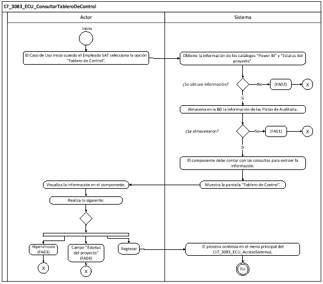

||Administración General de Comunicaciones y Tecnologías de la Información|
| :- | -: |
||Marco Documental 7.0|
|
Fecha de aprobación del Template:

02/08/2023
|
**Especificación del Caso de Uso**

17\_3083\_ECU\_ConsultarTableroDeControl.docx
|Versión del template: 7.00|
| :-: | :-: | :-: |

**<ID Requerimiento>** 8309

**Nombre del Requerimiento:** TI\_SISECOFI-SAT\_Seguimiento financiero y control documental de proyectos de contratación

**Tabla de Versiones y Modificaciones**

|Versión|Descripción del cambio|Responsable de la Versión|Fecha|
| :- | :- | :- | :-: |
|*1*|*Creación del documento*|Eduardo Acosta Mora|*08/07/2024*|
|*1.1*|*Revisión del documento*|Diana Yazmín Pérez Sabido|*01/08/2024*|
|*1.2*|*Versión aprobada para firma*|
María del Carmen Castillejos Cárdenas

Rubén Delgado Ramírez
|*01/08/2024*|

**Tabla de Contenido**

[17_3083_ECU_ConsultarTableroDeControl	2](#_toc175158109)

[1. Descripción	2](#_toc175158110)

[2. Diagrama del Caso de Uso	2](#_toc175158111)

[3. Actores	2](#_toc175158112)

[4. Precondiciones	2](#_toc175158113)

[5. Post condiciones	3](#_toc175158114)

[6. Flujo primario	3](#_toc175158115)

[7. Flujos alternos	5](#_toc175158116)

[8. Referencias cruzadas	12](#_toc175158117)

[9. Mensajes	12](#_toc175158118)

[10. Requerimientos No Funcionales	12](#_toc175158119)

[11. Diagrama de actividad	14](#_toc175158120)

[12. Diagrama de estados	14](#_toc175158121)

[13. Aprobación del cliente	15](#_toc175158122)

### ****17\_3083\_ECU\_ConsultarTableroDeControl

|<h3>**1. Descripción** </h3>|
| :- |
|

El objetivo de este Caso de Uso es permitir al Empleado SAT visualizar el componente *Power BI* que tendrá la información obtenida de la base de datos del sistema.

|
|<h3>**2. Diagrama del Caso de Uso**</h3>|
|

|
|<h3>**3. Actores** </h3>|
||

|**Actor**|**Descripción**|
| :-: | :-: |
|**Empleado SAT**|El Empleado SAT es el que tiene el o los roles otorgados por la Administración Central de Seguridad, Monitoreo y Control (ACSMC) para ingresar a cada uno de los módulos de este sistema.|

|

|
| :- |
|<h3>**4. Precondiciones**</h3>|
|

- El Empleado SAT se ha autenticado en el sistema con e.firma válida. 

- El sistema ha consumido el servicio “Oauth” para obtener los datos del Empleado SAT que ingresa al sistema.

- Se le ha asignado el rol requerido al Empleado SAT para ingresar al módulo “Tablero de Control” con los permisos correspondientes.

- El sistema ha validado que el Empleado SAT cuenta con el rol para ingresar al módulo “Tablero de Control” con los permisos correspondientes.

- El Empleado SAT ha ingresado a la opción del menú “Reportes”, submenú “Tablero de Control”, de acuerdo con el proceso del **(17\_3083\_ECU\_AccesoSistema)**.

|
|<h3>**5. Post condiciones** </h3>|
|

- El Empleado SAT visualizó el componente de *Power BI.*

- El Empleado SAT consultó los comités relacionados a un proyecto.

- El Empleado SAT descargó los archivos adjuntos del comité.

&emsp;
|
|<h3>**6. Flujo primario**</h3>|
||

|**Actor**|**Sistema**|
| :-: | :-: |
|1. El Caso de Uso inicia cuando el Empleado SAT selecciona la opción **“Tablero de Control”**.|
2. Obtiene la información de los siguientes catálogos: 

&emsp;

- *Power BI*. Aplica la **(RNA147)**

- Estatus del proyecto (Se debe de incluir la opción “Todos”)

- En caso de que no se pueda obtener la información del componente, continúa en el **([\[**FA02**\](#fa02)](#fa02))**.
|
||
3. Almacena en la base de datos (BD) la información de las Pistas de Auditoría.

&emsp;

&emsp;Datos que se almacenan:

**Módulo**= TableroDeControl

**Fecha y Hora**= Fecha y hora del sistema usando el formato DD/MM/AAAA HH:MM:SS

**RFC Usuario**= RFC largo del Empleado SAT que ingresó al sistema.

**Tipo de movimiento**= **CNST** (Consulta)

**Movimiento**= 

- Usuario que ingresa

- En caso de que no se puedan almacenar las Pistas de Auditoría, continúa en el Flujo alterno **([\[**FA01**\](#fa01)](#fa01))**.
|
||
4. El componente debe contar con las consultas para extraer la información de acuerdo con la **(RNA162)**, **(RNA205)** y **(RNA220)**.

&emsp;

&emsp;**Nota:** Estas consultas deberán estar disponibles previo a la ejecución del aplicativo y se consultará por lo menos 5 veces al día para mantener actualizados los tableros.
|
||
5. Muestra la pantalla “Tablero de Control” lo siguiente:

&emsp;

&emsp;Campos:

- Estatus de proyecto

- Proyecto

Opción:

- Buscar comité (Inhabilitada)

Enlace:

- En caso de no responder, dar clic aquí. Aplica la **(RNA194)**

Componente *Power BI.* Aplica la **(RNA217)**

Opción:

- Regresar

Ver **(17\_3083\_EIU\_ConsultarTableroDeControl)** Estilos 01.
|
|6. Visualiza la información en el componente.||
|
7. Realiza lo siguiente: 

&emsp;

- En caso de que seleccione la opción **“Regresar”**, el flujo continúa.

- En caso de que seleccione el enlace, continúa en el **([\[**FA03**\](#fa03)](#fa03))**.

&emsp;

- En caso de que seleccione una opción para el campo **“Estatus del proyecto”**, continúa en el **([**FA04**](#fa04))**.
|8. El proceso continúa en el menú principal del **(17\_3083\_ECU\_AccesoSistema)**.|
||9. Fin del Caso de Uso.|

|

|
| :- |
|<h3>**7. Flujos alternos** </h3>|
|

**FA01 No se pueden almacenar las Pistas de Auditoría**
|

|**Actor**|**Sistema**|
| :-: | :-: |
||1. El **FA01** inicia cuando interviene un evento ajeno y no se puede almacenar las Pistas de Auditoría.|
||2. Cancela la operación sin completar el movimiento que estaba en proceso.|
||
3. Muestra el mensaje de acuerdo con lo siguiente:

- Si la pista de auditoría es por el tipo de movimiento **CNST**, se muestra el mensaje **([**MSG001**](#msg001))**.

&emsp;

- En caso de que la pista de auditoría sea por el tipo de movimiento **PRNT**, se muestra el **([**MSG002**](#msg002))**.

Cada mensaje se muestra con la opción “Aceptar”.
|
|4. Selecciona la opción **“Aceptar”**.|5. Cierra el mensaje.|
||6. Regresa al paso previo que detona la acción de la pista de auditoría. |

|

**FA02 No se puede obtener la información del componente**
|
| :- |

|**Actor**|**Sistema**|
| :-: | :-: |
||1. El **FA02** inicia cuando el sistema no puede obtener la información del componente.|
||2. Muestra el **([**MSG003**](#msg003))** con la opción “Aceptar”.|
|3. Selecciona la opción **“Aceptar”**.|4. Cierra el mensaje.|
||5. Fin del Caso de Uso.|

|

**FA03 Selecciona el enlace**
|
| :- |

|**Actor**|**Sistema**|
| :-: | :-: |
|1. El **FA03** inicia cuando el Empleado SAT selecciona el enlace.|2. Abre en una pestaña nueva la información del enlace.|
||3. Fin del Caso de Uso.|

|

**FA04 Selecciona una o más opciones en el campo “Estatus del proyecto”**
|
| :- |

|**Actor**|**Sistema**|
| :-: | :-: |
|1. El **FA04** inicia cuando el Empleado SAT selecciona una o más opciones en el campo **“Estatus del proyecto”**.|
2. En caso de que seleccione una o más opciones en el campo “Estatus del proyecto”, consulta en la BD los nombres cortos del campo “Proyectos” de acuerdo con lo seleccionado en el campo “Estatus del proyecto”.

&emsp;

&emsp;**Nota:** En caso de seleccionar la opción “Todos”, obtendrá todos los proyectos que estén registrados.
|
|3. Selecciona una opción en el campo **“Proyectos”**.|4. Habilita la opción “Buscar Comités”.|
|5. Selecciona la opción **“Buscar comités”**.|
6. Almacena en la base de datos (BD) la información de las Pistas de Auditoría.

&emsp;

&emsp;Datos que se almacenan:

**Módulo**= TableroDeControl

**Fecha y Hora**= Fecha y hora del sistema usando el formato DD/MM/AAAA HH:MM:SS

**RFC Usuario**= RFC largo del Empleado SAT que ingresó al sistema.

**Tipo de movimiento**= **CNST** (Consulta)

**Movimiento**= 

- Nombre corto del proyecto

- En caso de que no se puedan almacenar las Pistas de Auditoría, continúa en el Flujo alterno **([\[**FA01**\](#fa01)](#fa01))**.
|
||
7. Consulta en la BD la siguiente información de los comités de acuerdo con el proyecto seleccionado:

&emsp;

- Contrato / Convenio

- Afectación

- Comité

- Fecha de sesión

- Sesión. Aplica la **(RNA63)**

- Acuerdo

- Vigencia

- Monto autorizado (C/IVA)

- Monto en pesos

- En caso de que el proyecto no tenga comités registrados, continúa en el **([**FA05**](#fa05))**.
|
||
8. Muestra la pantalla “Resultado de búsqueda” lo siguiente:

&emsp;

&emsp;Resultado de búsqueda:

&emsp;Tabla (Comités) Aplica la **(RNA244)**:

&emsp;- Contrato/Convenio

&emsp;- Afectación

&emsp;- Comité

&emsp;- Fecha de sesión

&emsp;- Sesión (Enlace u opción)

&emsp;- Acuerdo

&emsp;- Vigencia

&emsp;- Monto Autorizado (C/IVA)

&emsp;- Monto en pesos

&emsp;&emsp;

Opciones:

- Descarga masiva 

&emsp;- SATCloud 

&emsp;- Enlace “Clic”

&emsp;- Campos para “Filtrar” por columna

&emsp;- Cerrar

&emsp;- Cerrar ventana

&emsp;&emsp;

Ver **(17\_3083\_EIU\_ConsultarTableroDeControl)** Estilos 02.
|
|
9. Realiza lo siguiente:

&emsp;

- En caso de que seleccione la opción **“Cerrar”** o **“Cerrar ventana”**, continúa el flujo.

- En caso de que seleccione la opción para **“Filtrar”** los campos de la tabla, continúa en el **([**FA06**](#fa06))**.

- En caso de que seleccione la opción **“Descarga masiva”**, continúa en el **([**FA07**](#fa07))**.

- En caso de que seleccione la opción **“SATCloud”**, continúa en el **([**FA08**](#fa08))**.

- En caso de que seleccione el enlace **“Clic”**, continúa en el **([**FA10**](#fa10))**.
|10. Cierra la ventana emergente.|
||11. Continúa en el paso [**7**](#_ref173256239) del Flujo primario.|

|

**FA05 El proyecto no tiene comités registrados**
|
| :- |

|**Actor**|**Sistema**|
| :-: | :-: |
||1. El **FA05** inicia cuando el sistema identifica que el proyecto no tiene comités registrados.|
||2. Muestra el **([**MSG004**](#msg004))** con la opción “Aceptar”.|
|3. Selecciona la opción **“Aceptar”**.|4. Cierra el mensaje.|
||5. Continúa en el paso [**7**](#_ref173256239)** del Flujo primario.|

|

**FA06 Selecciona la opción para “Filtrar” los campos de la tabla**
|
| :- |

|**Actor**|**Sistema**|
| :-: | :-: |
|1. El **FA06** inicia cuando el Empleado SAT selecciona la opción para **“Filtrar”** la información en alguna columna de acuerdo con lo que se muestra en la tabla.||
|2. Elige la columna para filtrar e ingresa el dato a buscar.|3. Busca dentro de la columna y filtra la información mostrada de acuerdo con los caracteres ingresados en el campo.|
||4. Muestra en tiempo real todas las coincidencias que obtiene de dicha columna.|
||5. Continúa en el paso [**9**](#_ref173256294)** del **([**FA04**](#fa04))**.|

|

**FA07 Selecciona la opción “Descargar masiva”**
|
| :- |

|**Actor**|**Sistema**|
| :-: | :-: |
|1. El **FA07** inicia cuando el Empleado SAT selecciona la opción **“Descargar masiva”**.|
2. Almacena en la BD la información de las Pistas de Auditoría.

&emsp;

&emsp;Datos que se almacenan:

**Módulo**= TableroDeControl

**Fecha y Hora**= Fecha y hora del sistema, usando el formato DD/MM/AAAA HH:MM:SS

**RFC Usuario**= RFC largo del Empleado SAT que ingresó al sistema.

**Tipo de movimiento**= **PRNT** (Imprimir)

**Movimiento**= Aplica la **(RNA239)**

- ID proyecto 

&emsp;Nombre de los documentos descargados en una cadena separado por | (pipes)Ejemplo: (01\_FTO\_JC\_MDR4.PDF|SCP\_MDR4.pdf

- En caso de que no se puedan almacenar las Pistas de Auditoría, continúa en el **([**FA01**](#fa01))**.
|
||3. Consulta en la BD los archivos que se tienen relacionados con el comité.|
||4. Genera y descarga un archivo en extensión (.zip) que contiene los archivos adjuntos.|
||5. Continúa en el paso [**9**](#_ref173256294)** del **([**FA04**](#fa04))**.|

|

**FA08 Selecciona la opción “SATCloud”**
|
| :- |

|**Actor**|**Sistema**|
| :-: | :-: |
|1. El **FA08** inicia cuando el Empleado SAT selecciona la opción **“SATCloud”**.|
2. Almacena en la BD la información de las Pistas de Auditoría.

&emsp;

&emsp;Datos que se almacenan:

**Módulo**= TableroDeControl

**Fecha y Hora**= Fecha y hora del sistema, usando el formato DD/MM/AAAA HH:MM:SS

**RFC Usuario**= RFC largo del Empleado SAT que ingresó al sistema.

**Tipo de movimiento**= **PRNT** (Imprimir)

**Movimiento**= Aplica la **(RNA239)**

- ID proyecto 

- Nombre de los documentos descargados en una cadena por separado por | (pipes)

&emsp;Ejemplo: (01\_FTO\_JC\_MDR4.pdf|SCP\_MDR4.pdf)

- En caso de que no se puedan almacenar las Pistas de Auditoría, continúa en el **([**FA01**](#fa01))**.
|
||
3. Muestra en una ventana emergente la pantalla “Datos de la descarga” con lo siguiente: 

&emsp;

&emsp;Datos:

- url (enlace)

- contraseña

Opciones

- Copiar contraseña 

- Cerrar

- Cerrar ventana 

- En caso de que no se muestre el enlace y la contraseña, continúa en el **([**FA09**](#fa09))**.

&emsp;

Ver **(17\_3083\_EIU\_ConsultarTableroDeControl)** Estilos 03.
|
|
4. Realiza lo siguiente:

- En caso de que copie la contraseña o seleccione el enlace, el flujo continúa.

- En caso de que seleccione la opción **“Cerrar”**, continúa en el paso [**9**](#_ref173256294) del **([**FA04**](#fa04))**.
|5. Realiza la conexión con el SATCloud para mostrar el archivo a descargar de acuerdo con el resultado de búsqueda.|
|6. Realiza lo correspondiente para descargar los documentos adjuntos.|7. Descarga el archivo con extensión (.ZIP).|
||8. Continúa en el paso [**9**](#_ref173256294) del **([**FA04**](#fa04))**.|

|

**FA09 Error al generar el enlace y contraseña** 
|
| :- |

|**Actor**|**Sistema**|
| :-: | :-: |
||1. El **FA09** inicia cuando no se muestra el enlace y la contraseña.|
||2. Muestra el **([**MSG005**](#msg005))** con la opción “Aceptar”.|
|3. Selecciona la opción **“Aceptar”**.|4. Cierra el mensaje.|
||5. Continúa en el paso [**9**](#_ref173256294) del **([**FA04**](#fa04))**.|

|

**FA10 Selecciona el enlace “Clic”**
|
| :- |

|**Actor**|**Sistema**|
| :-: | :-: |
|1. El **FA10** inicia cuando el Empleado SAT selecciona el enlace **“Clic”**.|
2. Almacena en la BD la información de las Pistas de Auditoría.

&emsp;

&emsp;Datos que se almacenan: 

**Módulo**= ConsultarTableroDecontrol

**Fecha y Hora**= Fecha y hora del sistema usando el formato DD/MM/AAAA HH:MM:SS

**RFC Usuario**= RFC largo del Empleado SAT que ingresó al sistema.

**Tipo de movimiento**= **PRNT** (Imprimir)

**Movimiento**= Aplica la **(RNA239)**

- ID proyecto 

- Nombre del documento descargado

- En caso de que no se pueda almacenar las Pistas de Auditoría, continúa en el **([\[**FA01**\](#fa01)](#fa01))**.
|
||3. Consulta en la BD el archivo adjunto relacionado con el comité.|
||4. Descarga el archivo adjunto.|
||5. Continúa en el paso [**9**](#_ref173256294) del **([**FA04**](#fa04))**.|

|

|
| :- |
|<h3>**8. Referencias cruzadas** </h3>|
|

- 17\_3083\_CRN\_SeguimientoFinancieroYControl

- 17\_3083\_EIU\_ConsultarTableroDeControl

- 17\_3083\_ECU\_AccesoSistema

|
|<h3>**9. Mensajes** </h3>|
||

|**ID Mensaje**|**Descripción**|
| :-: | :-: |
|**MSG001**|Ocurrió un error al consultar la información, favor de intentar nuevamente (PA01).|
|**MSG002**|Ocurrió un error al exportar la información, favor de intentar nuevamente (PA01).|
|**MSG003**|Ocurrió un error al cargar el vínculo, favor de contactar al administrador del sistema.|
|**MSG004**|El proyecto no tiene comités registrados.|
|**MSG005**|
Error al generar el enlace y contraseña. 

Intente nuevamente.
|

|

|
| :- |
|<h3>**10. Requerimientos No Funcionales** </h3>|
||

|**ID de RNF**|**Requerimiento No Funcional**|**Descripción**|
| :-: | :-: | :-: |
|**RNF001**|Disponibilidad|El sistema deberá estar activo las 24 horas del día, los 365 días del año con picos de operación en el horario de 9:00 a 18:00 horas.|
|**RNF002**|Concurrencia|
El número de Empleados SAT que puede tener el sistema son 150. 

` `El número de accesos concurrentes que debe soportar este sistema son máximo 30 Empleados SAT.
|
|**RNF003**|Seguridad|El acceso solo podrá ser otorgado a todo Empleado SAT que tenga los roles asignados por la Administración Central de Seguridad, Monitoreo y Control (ACSMC) para cada módulo de este sistema.|
|**RNF004**|Usabilidad|
El sistema deberá manejar los siguientes elementos para facilitar la navegación:  

- Mensajes tipo flotantes (tooltips) con información de la herramienta que ofrece ayuda contextual, como guía para el Empleado SAT.  

- Componente de ordenamiento que permita acomodar la información de la tabla de forma ascendente o descendente, considerando la columna donde es seleccionado.  

- Contar con un diseño responsivo que permita su óptima visualización en distintos tipos de dispositivos finales.
|
|**RNF005**|Eficiencia|Las consultas se dividen en generales y detalladas, para que las detalladas carguen la información solo cuando sean requeridas por el Empleado SAT. |
|**RNF006**|Usabilidad|
El Empleado SAT podrá navegar a través de las páginas resultantes de la consulta considerando que el sistema debe mostrar inicialmente 15 registros por página, permitiendo al Empleado SAT seleccionar los registros que requiere visualizar, teniendo las opciones 15, 50 y 100:  

  

- Ir a la primera página (debe mostrar la primera página con el resultado de la consulta).  

- Ir a la última página (debe mostrar la última página con el resultado de la consulta).  

- Ir a la siguiente página (debe mostrar la siguiente página, considerando la página actual, con el resultado de la consulta y el número de registros seleccionados por el Empleado SAT).  

- Ir a la página anterior (debe mostrar la página anterior considerando la actual, con el resultado de la consulta).  

  

En la tabla deben mostrarse los registros ordenados alfabéticamente. 
|
|**RNF007**|Seguridad|Las Pistas de Auditoría deben estar protegidas contra accesos no autorizados. Solo los Empleados SAT autorizados pueden consultarlas, y la información en ellas se definirá durante la etapa de diseño, la cual debe estar cifrada para mantenerla confidencial y evitar exposiciones no autorizadas.   |
|**RNF008**|Fiabilidad |El sistema debe ser capaz de manejar excepciones de manera efectiva y presentar mensajes claros y comprensibles para garantizar una adecuada interacción con el sistema. |
|**RNF009**|Seguridad|Mantener la información en pantalla en caso de un error al guardar las pistas de auditoría, siempre y cuando el escenario lo permita. Hay situaciones de infraestructura o de conexión de internet que sí pierde los datos ya que no están controlados por el sistema. |
|**RNF010**|Integridad |Al almacenar la información en la BD de tipo Texto o alfanumérico se deben eliminar los espacios en blanco al inicio y fin de la cadena. |

|

|
| :- |
|<h3>**11. Diagrama de actividad** </h3>|
|

|
|<h3>**12. Diagrama de estados** </h3>|
|

No aplica, no hay cambios significativos de estados ni transiciones.

|
|<h3>**13. Aprobación del cliente** </h3>|
||

|**FIRMAS DE CONFORMIDAD** ||
| :-: | :- |
|**Firma 1**  |**Firma 2**  |
|**Nombre**: Diana Yazmín Pérez Sabido.|**Nombre**: Rodolfo López Meneses. |
|**Puesto**: Usuaria ACPPI.|**Puesto**: Usuario ACPPI.|
|**Fecha:** |**Fecha:** |
|  |  |
|**Firma 3**  |**Firma 4** |
|**Nombre**: Rubén Delgado Ramírez. |**Nombre**: María del Carmen Castillejos Cárdenas. |
|**Puesto**: Usuario ACPPI. |**Puesto**: APE ACPPI. |
|**Fecha:** |**Fecha:** |
|  |  |
|**Firma 5** |**Firma 6** |
|**Nombre**: Alejandro Alfredo Muñoz Núñez. |**Nombre**: Erick Villa Beltrán. |
|**Puesto**: RAPE ACPPI. |**Puesto**: Líder APE SDMA 6. |
|**Fecha**: |**Fecha**: |
|  |  |
|**Firma 7**|**Firma 8**|
|**Nombre**: Juan Carlos Ayuso Bautista. |**Nombre**: Eduardo Acosta Mora|
|**Puesto**: Líder Técnico SDMA 6. |**Puesto**: Analista SDMA 6.|
|**Fecha**: |**Fecha**: |
|||

||
| :- |

|||Página 1 de 9|
| :- | :-: | -: |

